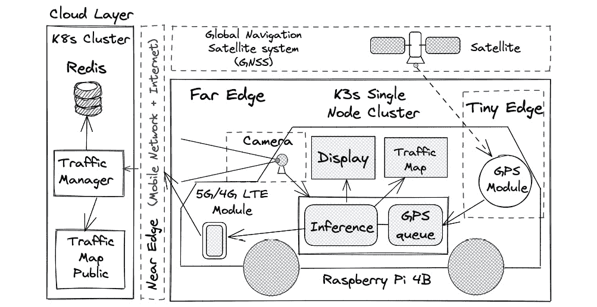
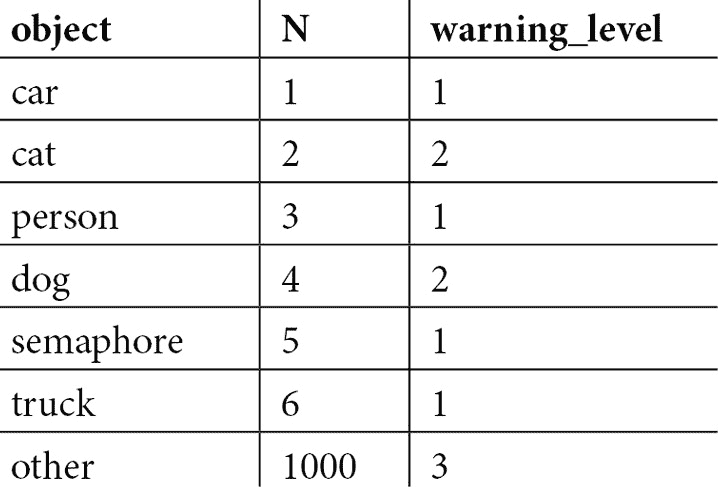
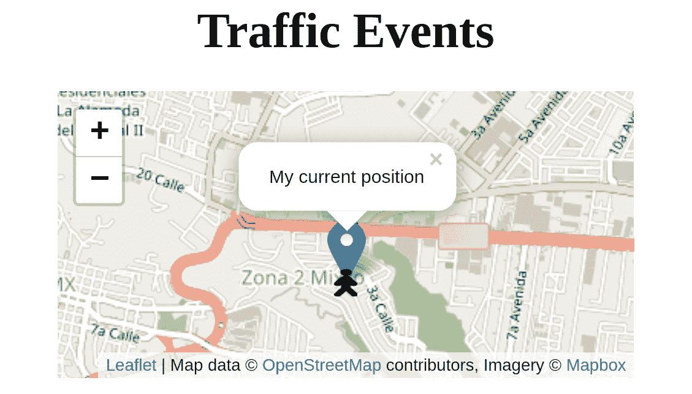
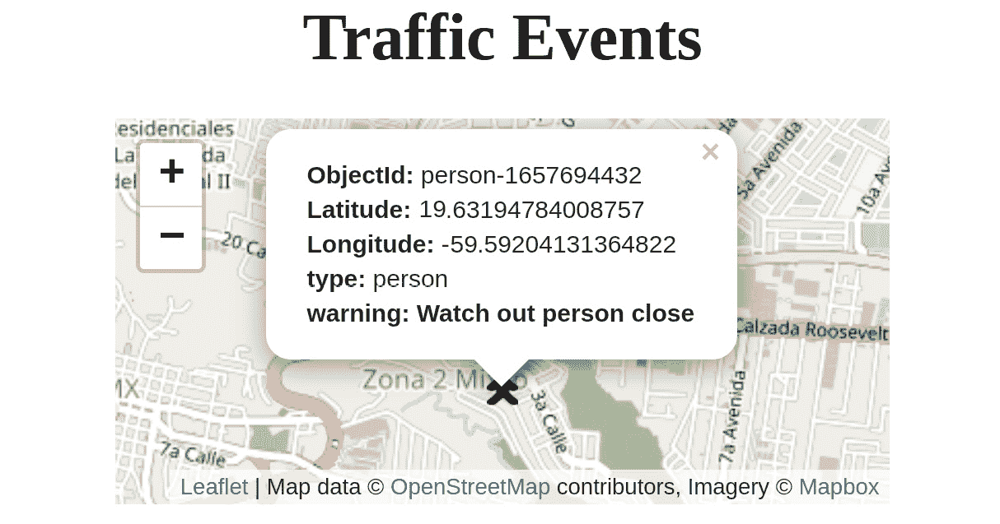
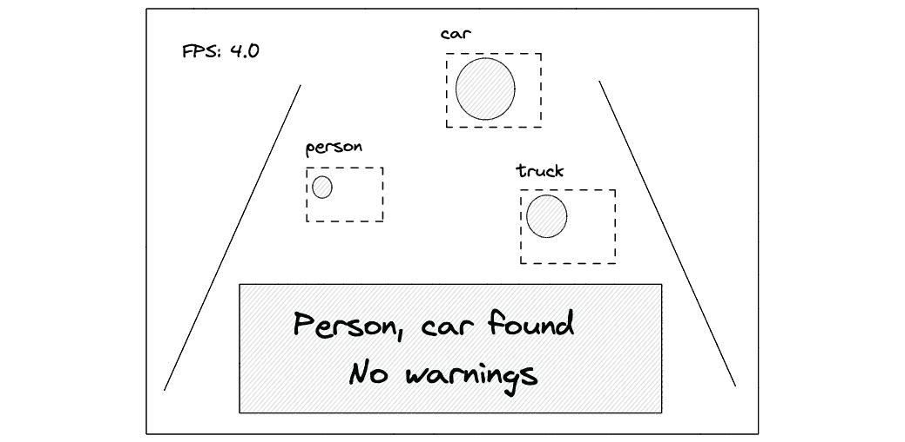

# 14

# 使用 Python 和 K3s 集群的计算机视觉

**人工智能**（**AI**）通常用于替代人类每天进行的活动。在大多数情况下，它可以赋予系统智能，使其能够在没有人工干预的情况下自主运行。**计算机视觉**（**CV**）是人工智能的一个子类别，专注于检测视频和图像中的物体。计算机视觉通常用于检测城市中的交通流量。本章重点介绍构建一个基本的智能交通系统，该系统能够在车辆行驶时检测到诸如汽车、卡车和行人等物体。为此，系统使用了 OpenCV、TensorFlow 和 scikit-learn Python 库以及一个相机，在 Raspberry Pi 上执行边缘计算的计算机视觉。该系统还在本地为司机显示包含检测物体的地图，并实现了一个公共地图，用于全局检测物体的可视化。这个公共地图可以作为实时交通状态图，供市政部门使用。

本章将涵盖以下主要主题：

+   计算机视觉和智能交通系统

+   使用 Redis 存储临时物体 **全球定位系统**（**GPS**）位置

+   部署计算机视觉服务以使用 OpenCV、TensorFlow Lite 和 scikit-learn 检测汽车障碍物

+   部署边缘应用以基于计算机视觉可视化警告

+   部署智能交通系统的全局可视化器

# 技术要求

在本章中部署计算机视觉系统，你将需要以下内容：

+   在你的公共云提供商（**Amazon Web Services**（**AWS**）、Azure、**Google Cloud Platform**（**GCP**））中托管的 Kubernetes 集群。

+   一台带有 8GB 微型 **Secure Digital**（**SD**）卡和小型 **液晶显示器**（**LCD**）屏幕的 Raspberry Pi 4B，用于汽车中。

+   一款 Logitech C922 PRO 网络摄像头，推荐使用，因为其质量优良并支持 Linux 系统。

+   多个 VK-162 G-Mouse USB GPS 导航模块，用于你的边缘 Raspberry 设备。

+   人工智能的基本知识。

+   配置 `kubectl` 以便在本地机器上使用你的 Kubernetes 云集群，避免使用 `--kubeconfig` 参数。

+   克隆[`github.com/PacktPublishing/Edge-Computing-Systems-with-Kubernetes/tree/main/ch14`](https://github.com/PacktPublishing/Edge-Computing-Systems-with-Kubernetes/tree/main/ch14) 仓库，如果你想运行 `kubectl apply` 而不是从书中复制代码。查看 `code` 目录中的 `python` 目录，以及 `ch14` 目录中的 `yaml` 目录，里面包含了 YAML 配置文件。

有了这个，你可以部署 Prometheus 和 Grafana 来开始在边缘环境中进行实验性监控。

# 计算机视觉和智能交通系统

人工智能（AI）是计算机科学的一个领域，旨在通过数学、统计学、语言学、计算机科学及其他科学模拟人类智能。人工智能也可以定义为理性代理的研究，如下图所示：

![图 14.1 – 代理]

](img/B16945_14_01.jpg)

图 14.1 – 代理

以*图 14.1*为参考，代理接收来自环境的感知。这些感知由传感器捕捉，信息经过处理后，通过效应器执行动作。这些动作由安装在代理内部的内部规则决定。动作可能包括使用效应器，如手臂、腿或车轮等。

这些内部规则可以通过不同的**机器学习**（**ML**）范式来实现，例如**监督学习**（**SL**）、**无监督学习**（**UL**）和**强化学习**（**RL**）。

机器学习（ML）是一种利用历史数据作为输入进行预测的人工智能技术。计算机视觉是应用于图像和视频分析的机器学习子集，使用预测来实现分析。在我们这一章中，我们将根据代理通过摄像头捕获的信息进行预测，并据此做出决策，同时将计算机视觉应用于创建智能交通系统。让我们来看一下以下的图示，展示了我们的系统如何在边缘使用计算机视觉来创建智能交通系统：



图 14.2 – 使用计算机视觉的智能交通系统

智能交通系统通常被市政府用来提高安全性，并以具有成本效益的方式改善街道上的交通流量。我们的系统可以在两种模式下使用。静态模式使用位于城市静止位置的摄像头，而动态模式则使用移动中的汽车扫描交通情况。我们将使用动态模式。现在，让我们通过边缘计算系统的各层来解释我们的系统，如下所示：

+   **云层**：在这一层，我们将使用一个名为**Traffic Manager**的**应用程序编程接口**（**API**），它将所有在边缘检测到的对象存储在 Redis 实例中。存储的数据将包含对象的类型——如汽车、卡车和行人——这代表我们系统中的一级警告，以及 GPS 坐标。这意味着驾驶员将通过其他驾驶员提前被警告到已检测到的对象。我们的 API 将存储这些对象的 GPS 位置，这些对象可能成为车辆的障碍。该层还将包括一个名为**Traffic Map Public**的前端应用程序，显示地图上的检测对象。市政府可以使用这个应用程序来监控全市的交通状况。

+   **近边缘**：这一层使用**第四代**（**4G**）/**第五代**（**5G**）**长期演进**（**LTE**）移动网络来将信息发送到互联网。这一层将把在边缘收集的信息传送到云层。

+   **远端边缘**：我们的远端边缘设备配有一台树莓派，它将处理由摄像头捕捉到的信息。该设备已安装了 K3s，作为一个单节点集群来管理系统所使用的所有服务。K3s 可以为系统带来自动化。K3s 可以轻松地更新和维护系统，并且可以扩展系统以使用更多节点。这些额外的节点可以用于添加多个摄像头，以从多个角度进行物体检测。运行在集群中的计算机视觉应用程序由两个显示屏和两个 API 组成。一个显示屏运行在 K3s 之外，但与 Python 脚本在同一设备上，它是负责捕捉视频的服务。该服务由一个 Python 程序组成，使用 OpenCV 和预编译的 TensorFlow Lite 模型进行物体检测。计算机视觉的过程就在这里发生。系统使用连接到设备的小型 LCD 触摸屏。另一个显示屏是一个前端应用程序，运行在浏览器中；它展示了地图上的检测物体，不仅显示这些本地检测到的物体，还显示在 500 米半径内所有车辆检测到的物体。检测到的物体将通过推理 API 进行分类，按照其对驾驶员的警告级别进行分类。这些警告分为三个级别：级别 1 和 2 表示警告，级别 3 则可能被驾驶员忽视作为障碍物。推理 API 包含一个预编译的决策树进行分类。**GPS 队列**API 管理所有 GPS 坐标，并定期将代表警告的检测物体信息发送到云端，供其他驾驶员查看。整个应用程序使用显示屏、交通地图、推理和 GPS 队列组件来处理和可视化检测到的物体。GPS 队列服务基于*第五章*中创建的 GPS 服务，*K3s Homelab 用于边缘计算实验*，并进行了一些修改。需要注意的是，您可以通过使用外部设备来加速物体检测，这些设备加速**神经网络**（**NN**）处理。您可以考虑的一些设备包括 Google 的 Coral USB 加速器、Rock Pi 神经计算棒**Universal Serial Bus**（**USB**）和 NVIDIA Jetson Nano。这些设备通过将处理任务委派给专用的处理单元（有时称为**图形处理单元**（**GPU**）或**张量处理单元**（**TPU**））来加速 OpenCV 的神经网络处理。OpenCV 库使用 TensorFlow Lite 模型，因此使用这些设备可以提高 TensorFlow Lite 可用的 GPU 数量，从而增加每秒**帧数**（**FPS**），这有助于加速视频分析，TensorFlow Lite 设计用于在边缘设备上运行以加速您的视频分析。有关更多信息，请查看*进一步阅读*部分。

+   **Tiny edge**：在这里，我们可以找到一个 LCD 屏幕，用于实时显示所有检测到的物体和警告信息。你还可以在这里找到 VK-162 G-Mouse GPS 模块。

总结一下这个工作流程，我们的车辆首先使用相机捕捉图像；然后，使用 OpenCV 捕捉视频帧或图像，并通过 TensorFlow Lite 进行分类，再通过推理 API 按照警告级别为驾驶员分类。这些信息会在 LCD 屏幕和浏览器中本地显示。发送到云端的 GPS 坐标数据会在云中的公共 Web 前端应用程序中显示。现在，让我们开始构建一个基本的智能交通系统，用于警示驾驶员。

# 使用 Redis 存储临时对象的 GPS 位置

我们将使用 Redis 存储通过计算机视觉检测到的所有物体的 GPS 坐标。这是一个基本的配置，用于部署 Redis 来实现这一目的。这个 Redis 实例必须部署在云端。正如我们在 *第十三章* 中解释的那样，*使用 GPS、NoSQL 和 K3s 集群的地理定位应用程序*，我们将使用地理空间索引来表示我们的数据。不同之处在于，我们将实现使用 `traffic` 的临时数据存储，它存储由其他驾驶员检测到的所有交通物体。通过这种方式，我们实现了一种垃圾回收功能，用于在交通高峰时段删除旧的检测物体。原因是，检测到的物体只在特定时间内相关，之后必须删除。那么，让我们按照以下步骤安装我们的 Redis 部署：

1.  为 Redis 创建一个 **PersistentVolumeClaim**，以持久化我们的数据，如下所示：

    ```
    $ cat <<EOF | kubectl apply -f -
    apiVersion: v1
    kind: PersistentVolumeClaim
    metadata:
      name: db-pv-claim
    spec:
      accessModes:
        - ReadWriteOnce
      resources:
        requests:
          storage: 5Gi
    EOF
    ```

1.  现在，创建一个 **ConfigMap** 来配置 Redis 使用认证密码，如下所示：

    ```
    $ cat <<EOF | kubectl apply -f -
    apiVersion: v1
    kind: ConfigMap
    metadata:
      name: redis-configmap
    data:
      redis-config: |
        dir /data
        requirepass YOUR_PASSWORD
    EOF
    ```

1.  使用前面的 `redis-configmap` `db-pv-claim-1` **PersistentVolumeClaim** 创建 Redis 部署，并设置一些资源限制，使用以下命令：

    ```
    $ cat <<EOF | kubectl apply -f -
    apiVersion: apps/v1
    kind: Deployment
    metadata:
      creationTimestamp: null
      labels:
        app: redis
      name: redis
    spec:
      replicas: 1
      selector:
        matchLabels:
          app: redis
      strategy: {}
      template:
        metadata:
          creationTimestamp: null
          labels:
            app: redis
    spec: 
    containers: 
          - name: redis
    image: redis:6.2 
    command: 
    - redis-server 
    - /redisconf/redis.conf 
    ports: 
    - containerPort: 6379 
    resources: 
    limits: 
                cpu: "0.2"
    memory: "128Mi" 
    volumeMounts: 
    - mountPath: "/data" 
    name: redis-storage 
    - mountPath: /redisconf 
              name: config
          volumes:
    - name: config 
    configMap: 
    name: redis-configmap 
    items: 
    - key: redis-config 
    path: redis.conf 
            - name: redis-storage
    persistentVolumeClaim: 
                claimName: db-pv-claim-1
    status: {}
    EOF
    ```

1.  现在，为 Redis 创建一个服务，开放端口 `6379`，如下所示：

    ```
    $ cat <<EOF | kubectl apply -f -
    apiVersion: v1
    kind: Service
    metadata:
      labels:
        app: redis
      name: redis
    spec:
      ports:
      - port: 6379
        protocol: TCP
        targetPort: 6379
      selector:
        app: redis
      type: ClusterIP
    EOF
    ```

现在我们已经安装了 Redis，接下来让我们在下一节中部署我们的计算机视觉服务到边缘设备。

# 部署计算机视觉服务来检测车辆障碍物，使用 OpenCV、TensorFlow Lite 和 scikit-learn

在本节中，我们将探讨如何配置运行在边缘的物体检测系统及其所有组件。本节还展示了如何配置运行在云端的公共 Web 应用程序，该应用程序存储并显示关于所有在边缘检测到的物体的信息。让我们首先从配置 Raspberry Pi 设备开始，下一节中将详细讲解。

## 准备你的 Raspberry Pi 来运行计算机视觉应用

在安装软件之前，我们必须准备好设备来运行它。为此，让我们按照以下步骤开始配置我们的 Raspberry Pi 4B：

1.  使用 Debian Bullseye 安装 Raspbian Pi OS（32 位），并至少从 2022-04-04 发布。本文中运行 TensorFlow Lite 模型的代码必须在 ARMv7 设备上运行，以支持 Coral USB 加速器设备和 LCD 屏幕。ARM64 目前不受支持。

1.  根据你的网络摄像头，你可能需要安装驱动程序。在本例中，我们使用的是 Logitech C922 PRO 网络摄像头，Raspbian 会自动识别它。

1.  连接并配置你的 GPS 模块。在本例中，我们的 VK-162 G-Mouse 模块也会被 Raspbian 自动识别。

1.  配置网络以使用无线连接，并安装运行应用所需的所有必要软件包。之后，你可以重新配置无线连接，以连接到智能手机中的接入点，但你需要删除 `/etc/wpa_supplicant/wpa_supplicant.conf` 文件中的先前连接。

1.  安装你的 LCD 屏幕的驱动程序。在本例中，我们使用的是 Miuzei **高清多媒体接口**（**HDMI**）。这将水平翻转屏幕并激活触摸功能（当所有配置完成后，这是最后一步）。你可以查看该代码库：[`github.com/goodtft/LCD-show.git`](https://github.com/goodtft/LCD-show.git)，并且可以使用任何 LCD 屏幕。

1.  在安装 K3s 之前，记得在 `/boot/cmdline.txt` 文件中启用 CGROUPS，然后在行末添加以下标志：

    ```
    cgroup_memory=1 cgroup_enable=memory
    ```

重要提示

如需有关 CGROUPS 的更多信息，请访问此链接：[`man7.org/linux/man-pages/man7/cgroups.7.html`](https://man7.org/linux/man-pages/man7/cgroups.7.html)

1.  获取当前的 `ifconfig`，然后查看 `wlan0` 接口，如下所示：

    ```
    $ ifconfig wlan0
    ```

1.  通过运行以下命令安装 K3s：

    ```
    $ MASTER_IP=YOUR_PRIVATE_IP
    $ curl -sfL https://get.k3s.io | INSTALL_K3S_EXEC="--write-kubeconfig-mode 644" sh -s -
    ```

1.  现在，你可以通过运行以下命令来测试一切是否正常：

    ```
    $ kubectl get nodes
    ```

这将返回你当前唯一运行的节点。

现在，我们的边缘设备已准备好运行服务，执行边缘计算中的计算机视觉任务。接下来，让我们进入下一节。

## 部署推理服务以检测物体

在此场景中使用 `inference` 服务进行预测，并分类判断物体是否对驾驶员构成障碍。我们使用下表来完成此操作：



例如，`n` 字段中 id 为 `1` 的汽车表示警告级别 1，因此所有 `warning_level` 为 1 或 2 的物体将被记录为可能会阻碍交通或对驾驶员造成危险的潜在物体。如果物体的分类值为 1000，则该物体不代表任何危险，因此不会被记录。

此服务的源代码由两个文件组成：`index.py`和`create_model.py`。`index.py`文件包含一个基本的 API，通过调用模型来使用`/predict`路径进行预测。它包含加载预编译的机器学习（ML）模型的基本代码。`create_model.py`文件包含用于训练并生成将被此 API 使用的模型的代码，该模型使用`index.py`。代码如下所示：

```
import pandas as pd
from sklearn import tree
from joblib import dump
df = pd.read_csv("safety_rules.csv",sep=',', header='infer', encoding='latin-1')
df = df.drop(['object'], axis=1)
df.head()
feature_cols = ["n"]
X = df.loc[:, feature_cols]
y = df.warning_level
clf = tree.DecisionTreeRegressor()
model = clf.fit(X, y)
dump(clf, 'safety_rules.model')
```

在这里，我们读取了我们的`safety_rules.csv` `drop`。在 AI 中，必须将文本表示为数值。我们的对象列在 n 列中有一个数字表示，因此该列对象可以忽略。 从 CSV 文件加载的数据表示为一个 Pandas DataFrame，它在 scikit-learn 中作为生成决策树的数据源。决策树是一种 ML 算法，可以使用分类数据，通过树形数据结构进行预测。因此，它是使用机器学习进行预测的最简单方法之一。在 DataFrame 加载之后，scikit-learn 会执行其训练过程，生成一个`safety_rules.model`模型，该模型可以在 API 中用于后续的预测。每次构建容器时，模型都会通过在此 API 的`Dockerfile`中调用`create_model.py`文件来更新。现在，API 的服务代码将如下所示：

```
<Import Flask and Scikit Learn libraries>
def loadModel():
    <Load the model safety_rules.model>
    <Assign the loaded model to the variable clf>
@app.route('/predict', methods=["POST"])
def predict():
    <Use clf variable to call the prediction method>
    <Return the prediction using JSON format>
<Inference service initialization on port 3000 by default>
```

通过调用`/predict`的`safety_rules.csv`文件，你可以通过在文件中添加新的值并使用新模型重新生成容器，来为你的图像分类添加更多的值。

重要提示

要检查代码并更新模型，请查看下一个链接：[`github.com/sergioarmgpl/containers/tree/main/inference/src`](https://github.com/sergioarmgpl/containers/tree/main/inference/src)。

现在，让我们通过以下步骤，在我们的**高级精简指令集计算机**（**ARM**）设备上部署我们的`inference`服务：

1.  为`inference` API 创建一个部署，步骤如下：

    ```
    $ cat <<EOF | kubectl apply -f -
    apiVersion: apps/v1
    kind: Deployment
    metadata:
      creationTimestamp: null
      labels:
        app: inference
      name: inference
    spec:
      replicas: 1
      selector:
        matchLabels:
          app: inference
      strategy: {}
      template:
        metadata:
          creationTimestamp: null
          labels:
            app: inference
        spec:
          containers:
          - image: sergioarmgpl/inference
            name: inference
            imagePullPolicy: Always
            resources: {}
    status: {}
    EOF
    ```

1.  让我们像这样进行端口转发以运行服务：

    ```
    $ kubectl port-forward --address 0.0.0.0 deploy/inference 3000:3000
    ```

1.  现在，让我们调用`inference` API 来获取一些预测。我们使用一个被检测并分类为`other`且编号为 6 的对象，它将根据预测表返回一个警告级别为 3 的结果。代码如下所示：

    ```
    $ curl --header "Content-Type: application/json" \
    --request POST --data '{"data":[6]}' \
    http://localhost:3000/predict
    ```

这将返回以下输出：

```
{
  "prediction": 3.0
}
```

我们的推理服务现在正在运行，准备在设备内被调用以分类检测到的图像。接下来，让我们继续在下一部分部署`gps-queue`服务。

## 部署 gps-queue 服务以存储 GPS 坐标

`gps-queue` 服务由多个容器组成，每个容器专注于特定任务。首先，初始化一个名为`init-gps-queue`的`init`容器，它会在`/tmp/gps`文件中添加一个初始值`-1`。该文件存储生成的最后一个 GPS 坐标。然后，`gps-queue`容器负责从我们的 GPS 模块读取 GPS 坐标，因此它需要获得对主机`/dev`文件夹的访问权限。一旦读取到 GPS 坐标，它将被存储在`/tmp/gps`中。之后，`sync-traffic-events`容器每 30 秒默认调用一次`gps-api`容器，通过`http://localhost:3000/traffic`端点，将检测到的对象及其警告分类和 GPS 坐标发送到`http://<TRAFFIC_MANAGER_IP>:5000`公共端点，该端点会暂时存储这些信息，以便在`traffic-map-public`服务中显示，这个服务对外开放，展示其他车辆检测到的对象。在部署我们的服务之前，让我们先探索一下`gps-queue`容器的代码，如下所示：

```
<Import necessary Python libraries to read the GPS module>

<cid variable to set a unique client id for these coordinates>
<device variable to set where the GPS module will be read in /dev>
<ser variable to configure the serial communication with the GPS module>

<Initializing the device to read information>

while True:
   <Read the Coordinate and store it into /tmp/gps>
```

这段代码配置了 GPS 模块，并将坐标存储在`/tmp/gps`文件中，该文件由`gps-queue`和`gps-api`容器共享。它使用`cid`变量将每个 GPS 坐标与一个唯一的客户端**标识符**（**ID**）关联起来，该标识符可以用于自定义，以便创建你自己的系统。信息将以以下格式存储：

```
{'lat': <LATITUDE_VALUE>,'lng':<LONGITUDE_VALUE>,'cid':<CLIENT_ID>}
```

现在，让我们探索一下`gps-api`容器中的代码，如下所示：

```
<Import the necessary Python libraries to run this code> 
<Set traffic_events variable to accumulate detected objects for a time period>
<Flask and CORS configuration>

@app.route("/gps", methods=["GET"])
def getGPSCoordinate():
  <Read coordinate form /tmp/gps>
  <Return the GPS coordinate as JSON as 
  {'lat': <LATITUDE_VALUE>,'lng':<LONGITUDE_VALUE>
  ,'cid':<CLIENT_ID>} 
  >

@app.route("/traffic/event", methods=["POST"])
def registerTrafficEvent():
   <Read last GPS coordinate from /tmp/gps>
   <Get object type and warning classification
    from the computer vision service>
   <Generate the Timestamp value for the new detected object>
   <Assign to a variable the warning, Latitude, Longitude 
    and timestamp information for the object>
   <Add this information to the traffic_events array 
    to store it temporary the value>
   <Return the object ide and that the request was processed>

@app.route("/traffic", methods=["GET"])
def syncTrafficEvents():
   <Filter similar objects stored in the 
    traffic_events array>
   <Send the filtered array using JSON format to the
    endpoint http://<TRAFFIC_MANAGER:5000>/traffic/1
    to store this information and get it locally and
    public by calling the endpoint
    http://<TRAFFIC_MANAGER:5000>/traffic>
    <Return that the information syncTrafficEvents
     was processed>

<GPS Queue service initialization on port 3000 by default>
```

作为说明，API 的`/gps`路径返回存储在`/tmp/gps`中的最后一个 GPS 坐标值，`/traffic/event`路径接收从运行`detect.py`程序的边缘设备检测到的对象。这个过程每秒发生一次。然后，信息被暂时存储在`traffic_events`数组中。在 Pod 内，`sync-traffic-events`容器每 30 秒调用一次运行在`gps-api`容器中的 API 的`/traffic`端点，过滤`traffic_events`数组，只保留唯一检测到的对象，因为边缘程序每帧视频分析最多只能检测到八个对象。一旦数组被过滤，它将被发送到`http://<TRAFFIC_MANAGER:5000>/traffic/1`。随后，这些信息会被`http://<TRAFFIC_MANAGER:5000>/traffic`网址请求，该网址使用 Leaflet 库在地图上展示来自所有设备的全球检测对象。

要部署此服务，请执行以下步骤：

1.  创建一个 GPS 队列的部署，如下所示：

    ```
    $ cat <<EOF | kubectl apply -f -
    apiVersion: apps/v1
    kind: Deployment
    metadata:
      labels:
        app: gps-queue
      name: gps-queue
    spec:
      replicas: 1
      selector:
        matchLabels:
          app: gps-queue
      template:
        metadata:
          labels:
            app: gps-queue
        spec:
          initContainers:
          - image: busybox:1.34
            name: init-gps-queue
            command: ['sh', '-c', "echo '-1' >> /tmp/gps"]
            securityContext:
              runAsUser: 1
            volumeMounts:
            - name: tmp
              mountPath: /tmp
          containers:
          - image: sergioarmgpl/gps_queue
            name: gps-queue
            imagePullPolicy: Always
            env:
            - name: DEVICE
              value: "/dev/ttyACM0"
            securityContext:
              privileged: true
              capabilities:
                add: ["SYS_ADMIN"]
            volumeMounts:
            - mountPath: /dev
              name: dev-volume
            - name: tmp
              mountPath: /tmp
          - image: sergioarmgpl/gps_api
            name: gps-api
            ports:
            - containerPort: 3000
            imagePullPolicy: Always
            env:
            - name: ENDPOINT
              value: "http://<TRAFFIC_MANAGER_IP>:5000"
            securityContext:
              runAsUser: 1
            volumeMounts:
            - name: tmp
              mountPath: /tmp
          - image: curlimages/curl
            name: sync-traffic-events
            env:
            - name: URL
              value: "http://localhost:3000/traffic"
            - name: DELAY
              value: "30"
            command: [ "sh", "-c"]
            args:
            - while :; do
                curl ${URL};
                sleep ${DELAY};
              done;
          volumes:
          - name: dev-volume
            hostPath:
              path: /dev
              type: Directory
          - name: tmp
            emptyDir: {}
    status: {}
    ```

重要提示

要检查代码并创建自己的容器，可以查看以下链接：

[`github.com/sergioarmgpl/containers/tree/main/gps-api/src`](https://github.com/sergioarmgpl/containers/tree/main/gps-api/src) 和 [`github.com/sergioarmgpl/containers/tree/main/gps-queue/src`](https://github.com/sergioarmgpl/containers/tree/main/gps-queue/src)

让我们关注一下这个部署在其容器中使用的变量。这里将详细解释这些变量：

+   `gps-queue`：

    +   `DEVICE`：配置检测到 GPS 模块的设备。对于 VK-162 G-Mouse 模块，默认值是 `/dev/ttyACM0`。

+   `gps-api`：

    +   `ENDPOINT`：配置所有带有 GPS 坐标和警告的检测对象存储的公共端点。这是存储坐标的公共服务。默认情况下，这个地址是`http://<TRAFFIC_MANAGER_IP>:5000`。

+   `sync-traffic-events`：

    +   `URL`：包含周期性调用的本地 URL，用于发送所有检测到的对象信息。这将调用在 `gps-api` 容器中配置的 API。默认值是 `http://localhost:3000/traffic`。

    +   `DELAY`：配置发送最后检测到的对象及其信息的延迟时间。默认值是 30，表示以秒为单位的时间。

这些值可以用于定制处理检测到的对象及其 GPS 坐标的服务行为。

1.  如果你想测试此服务的端点，可以在你的边缘设备内运行 `port-forward` 来通过 `curl` 命令访问 API，方法如下：

    ```
    $ kubectl port-forward --address 0.0.0.0 deploy/gps-queue 3001:3000
    ```

例如，你可以执行以下命令：

```
$ curl http://localhost:3001/gps
```

它将返回类似以下内容：

```
{'lat': <LATITUDE_VALUE>,'lng':<LONGITUDE_VALUE>
  ,'cid':<CLIENT_ID>}
```

我们现在已经部署了 `gps-queue` 服务，并且它已经准备好使用。接下来是部署我们的本地 Web 应用程序，它将在边缘设备上显示通过摄像头检测到的对象。为此，我们需要解决本地 `traffic-map` 应用程序中的 `traffic-manager` 公共 API 问题。CORS 是一种机制，它允许或限制从当前域外的域请求网页上的资源。在此场景中，它被称为本地 Web 应用程序的公共 API。因此，让我们进入下一部分，创建一个简单的代理来解决这个问题。

## 部署 traffic-manager 来存储 GPS 坐标

`traffic-manager` 服务接收带有 GPS 坐标和警告级别分类的检测对象。这个 API 在云端运行，并且在边缘设备移动和检测对象时被周期性调用。此服务由两个容器组成：一个提供 API 用于收集检测到的对象，另一个负责自动过期检测到的对象和全局交通信息。因为交通状况在一天之内不断变化，你可以配置这些值以适应你的场景。让我们首先探索 `traffic-manager` 容器中 API 的代码，如下所示：

```
<Import the necessary Python libraries to run this code> 

<Flask and CORS configuration> 

<Set time to expire the traffic and objects by setting the values of the variables ttl_trf, ttl_obj>

def redisCon():
   <Set and return the Redis connection>

@app.route("/traffic/1", methods=["POST"])
def setBulkTrafficObjects():
   <Get the Redis connection calling redisCon()>
   <Get detected objects from the POST request>
   <Omit to store similar detected objects in a 
   5 meters radius>
   <Set a hash value to store type and warning 
    level for each object>
   <Set expiring time for each hash stored>
   <Return that the operation was successful {"setTrafficObject":"done"}>

@app.route("/traffic/unit/<unit>/r/<radius>"+
"/lat/<lat>/lng/<lng>", methods=["GET"])
def getTrafficObjects(unit,radius,lat,lng):
   <Get the Redis connection calling redisCon()>
   <Get the objects detected and its metadata
   from the previous stored hash
   in the radius configured in the request>
   <Return that the operation was successful and 
   the objects found
   in the next format:
   {"getTrafficObjects":"done",
    "objects":data
   }>

<Service initialization on port 3000 by default>
```

该容器有两个端点，路径为`/traffic/1`。此服务通过创建一个哈希键`object:<object-id>:data`来存储检测到的边缘对象，其中存储了对象类型和警告级别，在`traffic`地理空间集合中存储了 GPS 坐标。为`traffic`键设置或更新过期时间，对于新的`object:<object-id>:data`哈希键，也设置过期时间。调用`/traffic/unit/<unit>/r/<radius>/lat/<lat>/lng/<lng>`路径时，返回请求中定义的半径范围内检测到的附近对象。这是一个公共服务，所有边缘设备会定期访问该服务，以发送在移动过程中检测到的对象更新。现在，让我们继续探索`autoexpire`容器的代码，具体如下：

```
<Import all the necessary libraries>
<Set Redis connection in an r variable>

while True:
    <Get all the objects inside the traffic sorted set>
    <Check if each member of the set has its hash value>
    <If not remove the member of the sorted set>
    <Wait until the configured delay ends to
    Update the set again>
```

该容器基本上会检查交通地理空间集合中的每个成员是否在`object:<object-id>:data`哈希键中有可用的元数据。如果没有，这意味着该对象已超出在交通中保持相关性的最大时间，这意味着它已经过期，接着这段代码会从排序集中过滤掉该成员。此过程会在等待由`DELAY`变量配置的秒数后定期进行。

要部署`traffic-manager`服务，请按以下步骤操作：

1.  创建 GPS 服务器的部署，如下所示：

    ```
    $ cat <<EOF | kubectl apply -f -
    apiVersion: apps/v1
    kind: Deployment
    metadata:
      creationTimestamp: null
      labels:
        app: traffic-manager
      name: traffic-manager
    spec:
      replicas: 1
      selector:
        matchLabels:
          app: traffic-manager
      strategy: {}
      template:
        metadata:
          creationTimestamp: null
          labels:
            app: traffic-manager
        spec:
          containers:
          - image: sergioarmgpl/autoexpire
            name: autoexpire
            imagePullPolicy: Always
            env:
            - name: REDIS_HOST
              value: "redis"
            - name: REDIS_AUTH
              value: "YOUR_PASSWORD"
            - name: DELAY
              value: "30"
          - image: sergioarmgpl/traffic_manager
            name: traffic-manager
            imagePullPolicy: Always
            env:
            - name: REDIS_HOST
              value: "redis"
            - name: REDIS_AUTH
              value: "YOUR_PASSWORD"
            - name: TTL_TRAFFIC
              value: "900"
            - name: TTL_OBJECT
              value: "180"
            resources: {}
    status: {}
    EOF
    ```

此部署使用以下变量：

+   `REDIS_HOST`：这是 Redis 服务的名称。此变量可以根据需要进行自定义。

+   `REDIS_AUTH`：这是连接 Redis 服务的密码。

+   `TTL_TRAFFIC`：这是`tracking-server`服务的 URL。在此情况下，URL 与内部的`tracking-server`服务的端口`3000`匹配。

+   `TTL_OBJECT`：这是`tracking-server`服务的 URL。在此情况下，URL 与内部的`tracking-server`服务的端口`3000`匹配。

+   `DELAY`：这是等待检查流量地理空间排序集中的成员是否已过期的时间。

通过配置这些变量，您可以自定义此部署的行为。

重要说明

要查看代码并创建自己的容器，您可以查看以下链接：

[`github.com/sergioarmgpl/containers/tree/main/traffic-manager/src`](https://github.com/sergioarmgpl/containers/tree/main/traffic-manager/src) 和 [`github.com/sergioarmgpl/containers/tree/main/autoexpire/src`](https://github.com/sergioarmgpl/containers/tree/main/autoexpire/src)

1.  现在，让我们为此部署创建一个作为**LoadBalancer**的服务。此 IP 地址将在我们的边缘设备中使用，以便在云中传播此信息，使所有使用该智能交通系统的司机都可以访问。代码示例如下：

    ```
    $ cat <<EOF | kubectl apply -f -
    apiVersion: v1
    kind: Service
    metadata:
      labels:
        app: traffic-manager
      name: traffic-manager-lb
    spec:
      ports:
      - port: 5000
        protocol: TCP
        targetPort: 3000
      selector:
        app: traffic-manager
      type: LoadBalancer
    EOF
    ```

1.  使用以下命令获取`traffic-manager`部署的负载均衡器 IP 地址：

    ```
    $ TRAFFIC_MANAGER_IP="$(kubectl get svc traffic-manager-lb  -o=jsonpath='{.status.loadBalancer.ingress[0].ip}')"
    ```

通过运行以下命令，可以查看`TRAFFIC_MANAGER_IP`环境变量的值：

```
$ echo $TRAFFIC_MANAGER_IP
```

请注意，在负载均衡器的 IP 地址配置完成后需要一些时间。你可以通过运行以下命令来检查服务的状态：

```
$ kubectl get svc traffic-manager-lb
```

等待直到`EXTERNAL_IP`环境变量配置完成。

另外，请注意，`$TRAFFIC_MANAGER_IP`的值将用于在边缘设备中配置`proxy`服务。

1.  (*可选*) 如果你想测试这个 API 以手动插入一个对象，请运行以下命令：

    ```
    $ curl -X POST -H "Accept: application/json" \
    -H "Content-Type: application/json" \
    --data '{
        "object":"person",
        "warning":1,
        "position":{"lat":1.633518,"lng": -90.591706}
    }' http://$TRAFFIC_MANAGER_IP:3000/traffic/1
    ```

这将返回以下输出：

```
{
  "setTrafficObject": "done"
}
```

1.  (*可选*) 要获取 0.1 公里半径内的所有检测对象，请运行以下命令：

    ```
    $ curl -X GET -H "Accept: application/json" \
    http://$TRAFFIC_MANAGER_IP:3000/traffic/objects/unit/km/r/0.1/lat/1.633518/lng/-90.5917
    ```

这将返回以下输出：

```
{
  "getTrafficObjects": [
    "person"
  ]
}
```

现在，我们的`traffic-manager` API 已经在云端运行。接下来，我们将使用代理在边缘设备中使用这个 API，以避免在调用 API 时遇到 CORS 限制，具体操作将在下一节中说明。

## 部署一个简单的代理以绕过 CORS

`proxy`服务用于绕过 CORS 限制，这种限制通常出现在本地网站尝试使用公共 API 地址调用公共 API 时。使用代理将请求转发到这个公共站点可能是解决这个问题的一个简单方法。另一种方法是修改 API 调用中的请求头，添加必要的头信息来绕过 CORS 限制。在这种情况下，我们将使用基于 Flask 构建的代理，将所有本地的`GET`请求转发到`traffic-manager` API，这个 API 是部署在云中的公共 API，可以通过互联网访问。在部署`proxy`服务之前，我们先来简要查看一下代码，如下所示：

```
from flask import Flask,request,redirect,Response
import os
import requests
app = Flask(__name__)
url = os.environ['URL']

@app.route('/<path:path>',methods=['GET'])
def proxy(path):
   global url
   r = requests.get(f'{url}/{path}')
   excluded_headers = ['content-encoding'
   , 'content-length', 'transfer-encoding'
   , 'connection']
   headers = [(name, value) for (name, value) in 
   r.raw.headers.items() if name.lower() not in 
   excluded_headers]
   response = Response(r.content, r.status_code, headers)
   return response

if __name__ == '__main__':
   app.run(debug = False,port=5000)
```

这段代码基本上会接收所有`GET`请求并将请求以及所有重要的头信息转发到环境变量中定义的 URL。这个 API 可以通过`5000`端口访问。现在，接下来我们将部署这个简单的代理，将来自本地`proxy`服务的所有调用转发出去，执行以下步骤：

1.  创建一个 GPS 服务器的部署，如下所示：

    ```
    $ cat <<EOF | kubectl apply -f -
    apiVersion: apps/v1
    kind: Deployment
    metadata:
      creationTimestamp: null
      labels:
        app: proxy
      name: proxy
    spec:
      replicas: 1
      selector:
        matchLabels:
          app: proxy
      strategy: {}
      template:
        metadata:
          creationTimestamp: null
          labels:
            app: proxy
        spec:
          containers:
          - image: sergioarmgpl/proxy
            name: proxy
            imagePullPolicy: Always
            env:
            - name: URL
              value: "http://<TRAFFIC_MANAGER_IP>:5000"
            resources: {}
    status: {}
    EOF
    ```

这个部署使用了以下变量：

+   `URL`：这个变量包含代理将在端口`5000`上接收到的所有`GET`请求重定向到的 URL。这个 URL 将是`traffic-manager`的公共 IP 地址，格式为`http://<TRAFFIC_MANAGER_IP>:5000`。

重要说明

要查看代码并创建你自己的容器，可以查看以下链接：[`github.com/sergioarmgpl/containers/tree/main/proxy/src`](https://github.com/sergioarmgpl/containers/tree/main/proxy/src)。这个小型代理是一个自定义实现，你可以使用 Python 以外的语言来实现它，以便在实现中拥有完全的控制权。你也可以使用其他解决方案，比如使用带有`proxy_pass`配置的 NGINX 等。

1.  你可以通过运行如下命令来测试代理：

    ```
    $ curl http://localhost:5000/<REMOTE_PATH>
    ```

这里，远程路径可以是`/traffic`，这是一个 URL，**Traffic Manager**服务会返回所有由驾驶员在全球范围内检测到的对象。

现在我们的代理服务已经启动，让我们在接下来的部分中部署**交通地图**网页应用程序，以展示代表驾驶员警告的检测物体。

# 部署边缘应用程序以可视化基于计算机视觉的警告

我们的可视化应用程序由两个部分组成：第一部分是一个网页应用程序，显示所有驾驶员使用智能交通系统的数据，第二部分是一个桌面应用程序，实时显示检测到的物体。因此，接下来我们将开始安装我们的网页应用程序，以可视化不同驾驶员检测到的物体。

## 安装交通地图应用程序以可视化驾驶员检测到的物体

我们现在已经设置了必要的 API 来可视化我们的设备检测到的内容。接下来，我们需要继续部署网页应用程序，将这些物体在地图上进行可视化。这时，我们的**交通地图**应用程序就派上用场了。不过在部署之前，让我们先看看代码，代码如下：

```
<imported libraries>
<app_initialization>
<CORS configuration>
@app.route("/")
def map():
   return render_template(<Render map.html
                           Using environment variables
                           GPS_QUEUE,TRAFFIC_MANAGER,
                           LATITUDE and LONGITUDE>) 
<Starting the web application on port 3000>
```

这类似于在*第十三章*中使用的前一个网页应用地图，*基于 GPS、NoSQL 和 K3s 集群的地理定位应用*，但这个地图调用了 GPS 队列服务来获取正在边缘设备上运行的当前 GPS 坐标，并从 `proxy` 服务的公共端点获取数据，以防止 CORS 访问限制。它还具有在每次页面加载时将地图居中的选项。

网页部分使用 `map.html` 文件，代码如下：

```
<!DOCTYPE html>
<html lang="en">
<head>
<Load Javascript libraries>
<Load page styles>
<body>
    <div id='map'></div>
<script>
    <Load Map in an initial GPS position>
    var marker
    var markers = []
    var osm = L.tileLayer(
    'https://{s}.tile.openstreetmap.org/{z}/{x}/{y}.png',
    {  
        <Set Open Street Map Initial
        Configuration using Leaflet>
    });   
    osm.addTo(map);      
    setInterval(() => {
        $.getJSON("http://{{ GPS_QUEUE }}:3001/gps", 
        function(gps) {   
            <Delete current markers>
            <Get current position of your device 
             and show it in the map>
                $.getJSON(
                  "http://{{ TRAFFIC_MANAGER }}:5000"+
                  "/traffic/unit/km/r/0.5/lat/<LATITUDE>"
                  "/lng/<LONGITUDE>", function(pos) {
                <This gets all the detected objects 
                in a radius of 0.5 km>
                <For each object returned show it in 
                the map using 
                markPosition(object,lat,lng,o_type,warning)
                function>
                });
        });
    }, 5000);

    <Configure the icons to visualize if an object is a
    person, car or a truck>
    function markPosition(object,lat,lng,o_type,warning)
    {
        <Create a maker with the appropriate Icon showing
        the object name, latitude, longitude, type of object
        and warning level>
    }  
</script>  
</body>
</html>
```

这段代码基本上会将地图居中，显示初始的经纬度坐标，显示设备的当前位置（以蓝色地球图标表示），并显示检测到的物体的图标，展示物体名称、GPS 坐标、物体类型和警告级别。它应该类似于以下效果：



图 14.3 – 驾驶员当前位置

这会实时显示驾驶员当前位置，而车辆正在移动。另一个可能的可视化效果是展示检测到的物体在地图上的位置。这些信息是通过 `proxy` 服务请求的，用于可视化其他驾驶员检测到的所有物体。这可以代表一种**增强现实**（**AR**），类似于 Waze 应用中的实现。其可视化效果如下所示：



图 14.4 – 检测到的物体当前位置和警告信息

如果你点击检测到的物体，它将显示当前的 GPS 坐标、物体类型和警告信息。这个默认实现中包含了几个物体。实现包括汽车、卡车和行人检测，作为可能的障碍物和潜在的驾驶员警告。你可以在地图上看到以下图标：


图 14.5 – 交通地图中显示的汽车、卡车和人物图标

默认情况下，我们的 Web 应用程序每 5 秒更新一次在 0.5 公里半径内的物体。这些值可以根据您的需求进行定制。现在，让我们通过执行以下命令来部署我们的交通地图 Web 应用程序：

1.  通过运行以下命令创建 `traffic-map` 部署：

    ```
    $ cat <<EOF | kubectl apply -f - 
    apiVersion: apps/v1
    kind: Deployment
    metadata:
      creationTimestamp: null
      labels:
        app: traffic-map
      name: traffic-map
    spec:
      replicas: 1
      selector:
        matchLabels:
          app: traffic-map
      strategy: {}
      template:
        metadata:
          creationTimestamp: null
          labels:
            app: traffic-map
        spec:
          containers:
          - image: sergioarmgpl/traffic_map
            name: traffic-map
            imagePullPolicy: Always
            env:
            - name: LATITUDE
              value: "<YOUR_LATITUDE_COORDINATE>"
            - name: LONGITUDE
              value: "<YOUR_LONGITUDE_COORDINATE>"
            - name: GPS_QUEUE
              value: "localhost" #<GPS_QUEUE_IP>
            - name: TRAFFIC_MANAGER
              value: "<TRAFFIC_MANAGER_IP>"
            resources: {}
    status: {}
    EOF
    ```

此部署包含以下环境变量：

+   `LATITUDE`：初始 GPS 纬度坐标，用于居中您的地图。

+   `LONGITUDE`：初始 GPS 经度坐标，用于居中您的地图。

+   `GPS_QUEUE`：`gps-queue` 服务的 IP 地址端点。在本地运行时，默认设置为 `localhost`。

+   `TRAFFIC_MANAGER`：`proxy` 服务的 IP 地址端点，我们可以使用 `localhost` 来调用它，从而避免 CORS 限制。

重要提示

要查看代码并创建您自己的 `traffic_map` 容器，您可以查看以下链接：

[`github.com/sergioarmgpl/containers/tree/main/traffic-map/src`](https://github.com/sergioarmgpl/containers/tree/main/traffic-map/src)

我们现在已经在边缘设备上部署了 **交通地图** Web 应用程序。接下来，我们将运行边缘设备上的物体检测系统，执行我们的计算机视觉任务，如下节所述。

## 使用 OpenCV、TensorFlow Lite 和 scikit-learn 进行计算机视觉的物体检测

执行计算机视觉服务的代码包含在 `detect.py` 文件中。该文件将在我们的边缘设备上运行。在准备设备运行此程序之前，我们来探索一下这个文件中的代码，具体如下：

```
<Imported libraries to run OpenCV in TensorFlow Lite>

#Array to map detected objects
obj_values = {"car":1,"cat":2,"person":3
,"dog":4,"semaphore":5,"truck":6,"other":1000}

def run():
  <Initialize Video Capture for the camera>
  <Set screen size to capture>
  <Initialize the object detection model>
  #Array to store detected objects
  items = []
  while Camera is Opened:
    detection_result = detector.detect(input_tensor)
    items.clear()
    <store detected objects in the items arrays>
    <Show the FPS evaluated>
    <Count objects detected per type of object>
    <Get the classification of each object calling
    /predict endpoint from the gps-api>
    if the warning count of the group <= 2:
        <A real warning is detected
        we push this information calling
        /traffic/event and warning is incremented>
    if warning:
       <show unique objects found
       warning is set to zero>
    else:
       <show No warnings>

    if <ESC key is pressed>:
      <break the cycle>
    <Set cv2 window size to show the capture>
  <Close the Camera Capture>
  <Destroy all windows>

def main():
  <Parse parameters to run the program>
  <Call run() function to start analyzing video capture>

if __name__ == '__main__':
  <call the main() function of the program>
```

这段代码启动视频捕捉，然后将图像以 TensorFlow Lite 可以分析的格式发送。TensorFlow Lite 会检测物体的位置并使用物体名称对其进行分类。该程序将使用 `efficientdet_lite0_edgetpu_metadata.tflite` 模型。在本例中，我们关注的物体有汽车、人物、狗、信号灯和卡车。这些物体代表了驾驶员的障碍，并表示一定的警告级别。如果检测到的物体与这些物体不同，则会被分类为 `other` 并作为警告忽略。如果您想添加更多物体到列表中，只需修改 `obj_values` 数组并添加新值，如以下示例所示：

```
obj_values = {"car":1,..,"other_object":7,..."other":1000}
```

在此程序的每次循环中，检测到的对象按组进行计数并存储在`items`数组中。然后，如果其中某个组检测到多个对象，并且该组是`obj_values`数组中已识别的对象之一，则该组中的检测到的对象将被计为潜在的障碍物，代表着对驾驶员的警告。为了计算警告级别，脚本会调用`inference` API，然后，如果检测到警告，它会通过之前安装的`proxy`服务使用`http://localhost:5000/traffic/event` URL 调用`traffic-map`服务。每次调用代理时，请求将被发送到部署在云中的`traffic-manager`服务的公共端点。然后，在对象分析之后，`items`数组会被清空，并且通过 OpenCV 以蓝色框显示总结检测到的对象。它看起来像这样：



图 14.6 – 物体检测屏幕

该输出还显示了检测到的对象，用红色矩形标记，并显示检测到的对象名称。在左上角，您将看到分析的 FPS 数。我们的警告框将显示两种类型的消息：要么是找到的对象组（例如，**发现了人和车**），要么是没有检测到任何对象——这将显示**没有警告**消息。如果按下*Esc*键，服务将关闭。要在您的边缘设备上安装物体检测服务，请执行以下步骤：

1.  将您的边缘设备连接到您可以访问的网络。

1.  登录到您的边缘设备，如下所示：

    ```
    $ ssh your_user@<EDGE_DEVICE_IP>
    ```

您可以通过运行以下命令获取设备的 IP 地址：

```
$ ifconfig wlan0
```

您可以通过将设备连接到 HDMI 屏幕，并连接键盘和鼠标来运行它。

1.  通过运行以下代码克隆仓库：

    ```
    $ git clone https://github.com/PacktPublishing/Edge-Computing-Systems-with-Kubernetes
    $ cd Edge-Computing-Systems-with-Kubernetes/ch14/code/python/object_detection
    ```

1.  安装缺失的依赖项以运行 OpenCV 和摄像头，如下所示：

    ```
    $ /bin/bash install_deps.sh
    ```

1.  配置设备以运行物体检测程序，如下所示：

    ```
    $ /bin/bash setup.sh
    ```

1.  运行脚本安装桌面快捷方式，如下所示：

    ```
    $ /bin/bash install_shortcuts.sh
    ```

重要提示

查看调用`run.sh`脚本的`.desktop`扩展名的文件，以及启动检测应用程序和本地 Web 流量地图应用程序的`.desktop`扩展名的文件。这些文件位于`ch14/code/python/object_detection`目录下。

1.  通过点击新的**Detector**桌面快捷方式测试安装。

1.  通过点击`http://localhost:5000`测试本地流量地图应用程序。

1.  将您的无线网络重新配置为使用智能手机的接入点连接，并通过删除`network {}`条目重置您的`/etc/wpa_supplicant/wpa_supplicant.conf`配置文件，以使用智能手机的互联网连接。

重要提示

欲了解更多信息，您可以查看下一个链接：

[`wiki.archlinux.org/title/wpa_supplicant`](https://wiki.archlinux.org/title/wpa_supplicant)

1.  现在，你可以配置触摸屏了。在此，我们使用的是 Miuzei LCD 4.0 英寸 HDMI 显示器，它可以翻转屏幕。为此，执行以下命令：

    ```
    $ sudo rm –rf LCD-show
    $ git clone https://github.com/goodtft/LCD-show.git
    $ chmod –R 755 LCD-show
    $ cd LCD-show
    $ sudo ./MPI4008-show
    ```

1.  现在，通过运行以下命令重启你的设备：

    ```
    $ sudo restart
    ```

1.  现在，访问**检测**快捷方式以启动检测物体的服务。

重要提示

你可以通过在`ch14/code/python/object_detection/run.sh`文件中取消注释`--enableEdgeTPU`标志来加速视频帧分析。我们的检测代码基于官方 TensorFlow 示例，该示例使用了 Coral USB 加速器设备。该设备是一个 TPU，是专门用于处理神经网络信息的单元。Coral 设备的配置超出了本书的范围。如需更多信息，请查阅*进一步阅读*部分中的 Coral USB 加速器链接。

1.  通过点击**交通**快捷方式启动交通地图应用。如果检测到物体，它们将在 30 秒后显示在 Web 应用中。

最后一步是部署一个公共**交通地图**应用来可视化一个半径区域内的所有交通。为此，我们将在下一部分部署最后一个服务——**交通地图公共版**。

# 部署一个智能交通系统的全球可视化器

**交通地图公共版**服务是**交通地图**的静态版本，仅显示半径 5 公里内的检测物体。该服务部署在云端，因此你可以期望它与**交通地图**服务提供相同的可视化效果，唯一的不同是它不会显示你的实时 GPS 位置，因为它是静态的。需要考虑的 GPS 位置可以是你希望监控的城市中心的 GPS 坐标。一般来说，这种 Web 可视化适合作为市政的静态报告。代码与**交通地图**Web 应用相同，但省略了 GPS 位置的连续更新。要部署此服务，请运行以下命令：

1.  通过运行以下命令创建一个`traffic-map`部署：

    ```
    $ cat <<EOF | kubectl apply -f - 
    apiVersion: apps/v1
    kind: Deployment
    metadata:
      creationTimestamp: null
      labels:
        app: traffic-map-public
      name: traffic-map-public
    spec:
      replicas: 1
      selector:
        matchLabels:
          app: traffic-map-public
      strategy: {}
      template:
        metadata:
          creationTimestamp: null
          labels:
            app: traffic-map-public
        spec:
          containers:
          - image: sergioarmgpl/traffic_map_public
            name: traffic-map-public
            imagePullPolicy: Always
            env:
            - name: LATITUDE
              value: "<YOUR_LATITUDE_COORDINATE>"
            - name: LONGITUDE
              value: "<YOUR_LONGITUDE_COORDINATE>"        
            - name: TRAFFIC_MANAGER
              value: "<TRAFFIC_MANAGER_IP>"
            resources: {}
    status: {}
    EOF
    ```

这个部署有以下环境变量：

+   `LATITUDE`：初始 GPS 纬度坐标，用于将地图居中。

+   `LONGITUDE`：初始 GPS 经度坐标，用于将地图居中。

+   `GPS_QUEUE`：`gps-queue`服务的 IP 地址端点。在此情况下，因为是本地运行，所以默认设置为`localhost`。

+   `TRAFFIC_MANAGER`：你的`localhost`的 IP 地址端点，用于防止 CORS 限制。

重要提示

要检查代码并创建你自己的`traffic-map-public`容器，可以查看以下链接：

[`github.com/sergioarmgpl/containers/tree/main/traffic-map-public/src`](https://github.com/sergioarmgpl/containers/tree/main/traffic-map-public/src)

1.  现在，让我们为这个部署创建一个作为负载均衡器的服务。这个 IP 地址将是访问 Traffic Map 公共 Web 应用的端点。代码示例如下：

    ```
    $ cat <<EOF | kubectl apply -f -
    apiVersion: v1
    kind: Service
    metadata:
      creationTimestamp: null
      labels:
        app: traffic-map-public
      name: traffic-map-public-lb
    spec:
      ports:
      - port: 3000
        protocol: TCP
        targetPort: 3000
      selector:
        app: traffic-map-public
      type: LoadBalancer
    status:
      loadBalancer: {}
    EOF
    ```

重要提示

若要排查部署问题，可以使用`$ kubectl logs pod/<POD> -f <CONTAINER_NAME>`命令。这将展示一些有用的输出，帮助排查服务问题。

1.  使用以下命令获取`traffic-map-public`部署的负载均衡器 IP：

    ```
    $ TRAFFIC_MAP_PUBLIC="$(kubectl get svc traffic-map-public -o=jsonpath='{.status.loadBalancer.ingress[0].ip}')"
    ```

您可以通过运行以下命令查看`TRAFFIC_MAP_PUBLIC`环境变量的值：

```
$ echo $TRAFFIC_MAP_PUBLIC
```

请注意，负载均衡器的 IP 地址配置后需要一些时间。您可以通过运行以下命令检查服务的状态：

```
$ kubectl get svc traffic-map-public-lb
```

等待`EXTERNAL_IP`环境变量配置完毕。

1.  通过`http://<TRAFFIC_MAP_PUBLIC>:3000`访问 Traffic Map 公共应用。

现在一切都在运行，试着向系统填充数据，并通过您的边缘设备驾驶汽车以捕捉物体。然后，您将在几秒钟内看到系统中的物体。请查看*进一步阅读*部分，那里有大量可以探索的资料，帮助您构建自己的系统。但现在，是时候总结我们学到的内容了。让我们进入*总结*部分。

# 总结

在本章中，我们学习了如何使用 AI 分析由摄像头拍摄的视频，检测潜在的障碍物。这一功能在边缘计算环境下，通过 K3s 和 Raspberry Pi 实现。通过这种方法，我们创建了一个解耦的系统，能够通过容器轻松升级。我们还学到了如何将这种系统应用于现实场景中，监控交通行为以提高驾驶安全性。通过这一实现，我们还了解了如何将这种系统分布在边缘和云端，处理并展示本地信息，提升驾驶体验。在最后一章中，我们将介绍一种简单的方法，通过一个名为边缘计算设计系统画布的图表，帮助您快速组织和设计自己的边缘计算系统。

# 问题

这里有几个问题，帮助验证您新学到的知识：

+   人工智能、机器学习和计算机视觉如何相互关联，以设计智能交通系统？

+   TensorFlow Lite 和 scikit-learn 是如何协作检测物体并进行预测的？

+   计算机视觉在边缘设备上是如何工作的？

+   如何在边缘和云端之间分布数据？

+   如何使用 Python 构建计算机视觉系统？

+   如何使用 K3s 设计实时检测物体的分布式系统？

# 进一步阅读

您可以参考以下资料，获取本章涉及主题的更多信息：

+   *什么是人工智能（AI）？*：[`www.techtarget.com/searchenterpriseai/definition/AI-Artificial-Intelligence`](https://www.techtarget.com/searchenterpriseai/definition/AI-Artificial-Intelligence)

+   *人工智能中的智能体*: [`www.geeksforgeeks.org/agents-artificial-intelligence`](https://www.geeksforgeeks.org/agents-artificial-intelligence) 和 [`www.educba.com/agents-in-artificial-intelligence`](https://www.educba.com/agents-in-artificial-intelligence)

+   *智能交通管理：优化城市基础设施支出*: [`www.digi.com/blog/post/smart-traffic-management-optimizing-spend`](https://www.digi.com/blog/post/smart-traffic-management-optimizing-spend)

+   *带自定义图标的标记*: [`leafletjs.com/examples/custom-icons`](https://leafletjs.com/examples/custom-icons)

+   *MLOps 使用 Argo 和 K3s*: [`github.com/sergioarmgpl/mlops-argo-k3s`](https://github.com/sergioarmgpl/mlops-argo-k3s)

+   *YOLO 和 Tiny-YOLO 在 Raspberry Pi 和 Movidius NCS 上的物体检测*: [`pyimagesearch.com/2020/01/27/yolo-and-tiny-yolo-object-detection-on-the-raspberry-pi-and-movidius-ncs`](https://pyimagesearch.com/2020/01/27/yolo-and-tiny-yolo-object-detection-on-the-raspberry-pi-and-movidius-ncs)

+   *TensorFlow Lite 示例应用*: [`www.tensorflow.org/lite/examples`](https://www.tensorflow.org/lite/examples)

+   *TensorFlow Hub*: [`tfhub.dev`](https://tfhub.dev)

+   获取 TensorFlow Lite 的模型: [`www.tensorflow.org/lite/models`](https://www.tensorflow.org/lite/models)

+   *运输和物流领域的边缘分析：案例研究*: [`www.skillsire.com/read-blog/174_edge-analytics-in-transportation-and-logistics-space-a-case-study.html`](https://www.skillsire.com/read-blog/174_edge-analytics-in-transportation-and-logistics-space-a-case-study.html)

+   *在 Raspberry Pi 上设置 TensorFlow 物体检测 API 的教程*: [`github.com/EdjeElectronics/TensorFlow-Object-Detection-on-the-Raspberry-Pi`](https://github.com/EdjeElectronics/TensorFlow-Object-Detection-on-the-Raspberry-Pi)

+   *TensorFlow-Lite-物体检测在 Android 和 Raspberry Pi 上的应用*: [`github.com/EdjeElectronics/TensorFlow-Lite-Object-Detection-on-Android-and-Raspberry-Pi`](https://github.com/EdjeElectronics/TensorFlow-Lite-Object-Detection-on-Android-and-Raspberry-Pi)

+   *TensorFlow Lite Python 物体检测示例与 Raspberry Pi*: [`github.com/tensorflow/examples/tree/master/lite/examples/object_detection/raspberry_pi`](https://github.com/tensorflow/examples/tree/master/lite/examples/object_detection/raspberry_pi)

+   *Python 项目 – 实时人体检测与计数*: [`data-flair.training/blogs/python-project-real-time-human-detection-counting`](https://data-flair.training/blogs/python-project-real-time-human-detection-counting)

+   Coral USB 加速器: [`coral.ai/products/accelerator`](https://coral.ai/products/accelerator)

+   Edge TPU 简单相机示例: [`github.com/google-coral/examples-camera`](https://github.com/google-coral/examples-camera)

+   *使用 NGINX 作为反向代理*: [`www.linode.com/docs/guides/use-nginx-reverse-proxy`](https://www.linode.com/docs/guides/use-nginx-reverse-proxy)

+   *Movidius 在 Mac OS 上*: [`github.com/acharroux/Movidius-On-MacOS`](https://github.com/acharroux/Movidius-On-MacOS)

+   *NCS-Pi-Stream*: [`github.com/HanYangZhao/NCS-Pi-Stream`](https://github.com/HanYangZhao/NCS-Pi-Stream)

+   *Intel® 神经计算棒 2（Intel® NCS2）*: [`www.intel.com/content/www/us/en/developer/tools/neural-compute-stick/overview.html`](https://www.intel.com/content/www/us/en/developer/tools/neural-compute-stick/overview.html)

+   *深度学习下的深度监控 – 智能视频监控项目*: [`data-flair.training/blogs/deep-surveillance-with-deep-learning-intelligent-video-surveillance-project`](https://data-flair.training/blogs/deep-surveillance-with-deep-learning-intelligent-video-surveillance-project)

+   *道路车道线检测 – Python 中的计算机视觉项目*: [`data-flair.training/blogs/road-lane-line-detection`](https://data-flair.training/blogs/road-lane-line-detection)

+   *Raspberry Pi 和 Movidius NCS 人脸识别*: [`pyimagesearch.com/2020/01/06/raspberry-pi-and-movidius-ncs-face-recognition`](https://pyimagesearch.com/2020/01/06/raspberry-pi-and-movidius-ncs-face-recognition)

+   *在 Raspberry Pi 上使用 OpenVINO、OpenCV 和 Movidius NCS*: [`pyimagesearch.com/2019/04/08/openvino-opencv-and-movidius-ncs-on-the-raspberry-pi`](https://pyimagesearch.com/2019/04/08/openvino-opencv-and-movidius-ncs-on-the-raspberry-pi)

+   *使用神经计算棒和 OpenVINO 加速低功耗设备上的预测*: [`towardsdatascience.com/speed-up-predictions-on-low-power-devices-using-neural-compute-stick-and-openvino-98f3ae9dcf41`](https://towardsdatascience.com/speed-up-predictions-on-low-power-devices-using-neural-compute-stick-and-openvino-98f3ae9dcf41)

+   *使用 Movidius NCS 进行深度学习（第四部分）：在 Rock64 上安装 NCSDK*: [`www.youtube.com/watch?v=AXzIYk7-lr8`](https://www.youtube.com/watch?v=AXzIYk7-lr8)

+   *基于字形的视频可视化在智能城市中进行监控的 Google Map 上*: [`jivp-eurasipjournals.springeropen.com/articles/10.1186/s13640-017-0175-4`](https://jivp-eurasipjournals.springeropen.com/articles/10.1186/s13640-017-0175-4)

+   *车辆内外观：基于计算机视觉的增强车辆安全性*: [`escholarship.org/content/qt2g6313r2/qt2g6313r2_noSplash_81ae2290f201a6b25e8eecc8a1142845.pdf?t=lnpgaj`](https://escholarship.org/content/qt2g6313r2/qt2g6313r2_noSplash_81ae2290f201a6b25e8eecc8a1142845.pdf?t=lnpgaj)

+   *为 Raspberry Pi 安装触摸屏和触摸校准程序*: [`www.gechic.com/en/raspberry-pi-install-touch-monitor-and-touch-calibrator-driver`](https://www.gechic.com/en/raspberry-pi-install-touch-monitor-and-touch-calibrator-driver)

+   *旋转树莓派 4 触摸屏显示器*: [`www.interelectronix.com/rotating-raspberry-pi-4-touch-monitor.html`](https://www.interelectronix.com/rotating-raspberry-pi-4-touch-monitor.html)

+   *校准触摸屏*: [`wiki.archlinux.org/title/Calibrating_Touchscreen`](https://wiki.archlinux.org/title/Calibrating_Touchscreen)
