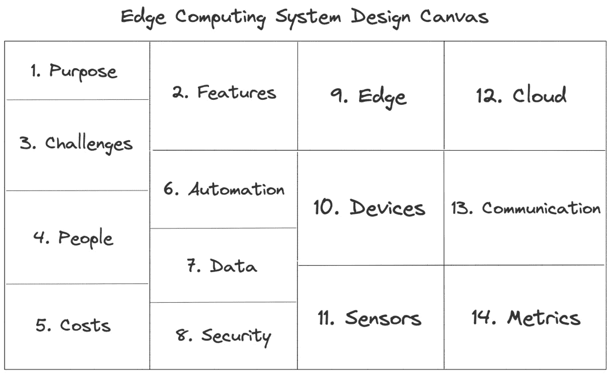

# 第十五章：设计您自己的边缘计算系统

有时候，项目的成功并不在于技术——而在于设计和执行的方式。边缘计算系统可以从一个小型初创想法开始，因此您可以使用它参考精益画布商业计划模板来做出系统构建的初步草稿。但如果我们有一些类似的模板，专门适应于边缘计算呢？这就是边缘计算系统设计画布可以帮助您的地方。这个图表的理念是为您提供一个工具，帮助您创建构建边缘计算系统所需的所有内容的初步草稿，您可以将本书的章节视为构建您自己的模块。在本章中，我们将探索您可以用来托管服务的云服务提供商，一些需要考虑的最佳实践，您可以用来构建边缘计算系统的软件，以及其他一些使用案例，如果本书没有覆盖到的，可以用来创建系统的情况。

在本章中，我们将涵盖以下主要主题：

+   使用边缘计算系统设计画布

+   使用云服务提供商的托管服务

+   用于您项目的现有硬件

+   探索适用于您的系统的补充软件

+   建议构建您的边缘计算系统

+   探索额外的边缘计算使用案例

# 技术要求

想了解更多详情，请访问这个 GitHub 资源：[`github.com/PacktPublishing/Edge-Computing-Systems-with-Kubernetes/tree/main/ch15`](https://github.com/PacktPublishing/Edge-Computing-Systems-with-Kubernetes/tree/main/ch15)

# 使用边缘计算系统设计画布

边缘计算系统设计画布基于精益画布商业计划模板，旨在提供一个工具，帮助人们通过填写一张纸来创建和组织他们的边缘计算系统，从而开始构建他们的系统。让我们来看看我们的画布模板所涵盖的不同领域：

图 15.1 – 边缘计算系统设计画布

我们的模板涵盖了在设计系统时可以考虑的 14 个领域。首先，您需要定义系统的目的和要实现的功能。然后，在填写模板时，您可以并行注释挑战、人员和成本。之后，您可以定义是否在系统中使用自动化。在这个类别中，我们可以讨论 CI/CD 流水线和版本控制。接下来，您需要定义如何管理数据，使用何种格式，并决定实施哪些安全实践。最后两个部分包括您将在哪些部分运行边缘计算、使用哪些设备和传感器。最后，您还需要定义系统哪些部分将在云端运行、边缘与云端之间如何通信、从边缘收集哪些指标，以及哪些指标会在边缘或云端持续存在。

现在，让我们探索一些问题，您可以用来填写这张纸。目的是在不超过 10 分钟的时间内完成，类似于精益画布的工作方式。

## 目的

正如您所知，您需要定义为什么要构建这个系统——也就是这个系统存在的主要原因。您可以和团队讨论以下问题：

+   系统的目的是什么？

+   它将执行什么操作？

+   它将解决什么问题？

## 功能

在这里，您可以列出系统的五个主要功能。您可以从系统属性的功能角度描述它们，例如可用性、可靠性等。您可以提出以下问题：

+   系统的主要功能是什么？

+   这些功能为客户带来了哪些功能？

+   这个系统的独特功能是什么？

## 挑战

在这里，您需要识别出系统构建中的关键路径和潜在阻碍因素。您可以提出以下问题：

+   在边缘或云端运行软件面临哪些挑战？

+   当边缘设备与云端进行通信时，系统会面临哪些挑战？

您可以通过其他问题来补充，评估构建系统过程中其他技术领域的复杂度。

## 人员

在这里，您需要评估系统中正在工作的人员，并为未来的招聘定义基本技能。您可以提出以下问题：

+   构建系统所需的技能有哪些？

+   建立该系统需要多少人？

+   项目将如何管理？是按季度、学期、两周冲刺还是其他方式？

## 成本

在这里，您需要计算购买硬件、运行第三方服务等的可能成本。您可以提出以下问题：

+   我的设备成本是多少？

+   我的传感器成本是多少？

+   我的云服务商成本是多少？

+   我的硬件供应商是谁？

+   我需要考虑哪些额外的成本？

## 自动化

在这里，你需要评估自动化流程和代码版本管理。这是你可以填写与 CI/CD 流水线、数据流水线、GitOps、测试等相关内容的地方。你可以提出以下问题：

+   哪些流程将被自动化？

+   代码版本管理将如何实施？

+   你需要 CI/CD 或 GitOps 吗？

+   软件测试将如何实施？

## 数据

在这里，你需要定义如何管理数据。这包括数据格式、数据库、数据摄取、存储等。你可以提出以下问题来定义如何在系统中管理数据：

+   系统是否使用 NoSQL 数据库？

+   系统是否使用 SQL 数据库？

+   系统将使用哪种类型的数据（JSON、CSV 等）？

+   我的数据库需要哪些特性？这包括高可用性、持久性、并发性、分区容错性等。你可以使用 CAP 定理来选择最适合你需求的数据库。

## 安全性

在这里，你可以评估数据和服务的安全性。本书没有特别涵盖这个话题，但你可以提出以下问题来评估系统中某些最基本的安全方面：

+   系统中将实施哪些安全策略？

+   系统中需要在哪些地方使用数据加密？

+   系统认证如何在系统中工作？

## 边缘

在本节中，你需要列出并决定哪些设备将在边缘运行。在这里，你可以找到 ARM 设备和边缘集群。你需要决定将在边缘设备上运行哪些技术。你可以提出以下问题来评估这一点：

+   边缘设备上将运行什么？

+   哪些软件将在你的设备上运行？

+   系统是否需要在边缘运行单节点或多节点集群？

+   软件是使用虚拟机、容器、二进制文件还是其他方式运行？

## 设备

本节内容与列出系统中可能使用的设备及其附加硬件相关。你可以提出以下问题，收集可能使用的设备初步列表：

+   你的设备将使用什么类型的处理器？ARM 还是 x86_64？

+   我的设备需要使用哪些附加硬件？

+   设备将如何供电？使用电池还是直流电？

+   设备将如何管理本地时间？

+   你的设备将有多少内存用于固件和数据存储？

## 传感器

本节的目标是列出可能的传感器以及如何从中获取数据。然后，你必须将这些信息转化为衡量环境的指标或变量。你可以使用以下问题来分析与传感器相关的内容：

+   你打算使用哪些传感器？

+   传感器将测量什么？

+   传感器需要电源吗？它们需要什么类型的电源？

+   传感器将如何校准？

## 云

本节旨在评估系统中哪些部分需要在云中运行，如果有必要，评估你将使用哪些托管服务，以及是否有第三方服务可以帮助减少和简化系统实现的时间。为了评估这一点，你可以提出以下问题：

+   哪个云服务提供商最适合你的系统需求？

+   系统需要哪些托管服务？

+   是否有任何第三方服务对系统的使用至关重要？

## 通信

本节是与边缘和云层通信的结果。这里将定义各层之间如何通信、将使用哪些协议、通信是否是实时的，以及你的设备是否会使用特定协议进行相互通信。为了填充这一部分内容，你可以提出以下问题：

+   边缘设备将如何将数据传输到云端？

+   将使用什么类型的通信来与边缘设备和云端通信？这可能是套接字、REST API、gRPC 等。

+   系统是否使用 Lora、Wi-Fi、蓝牙、Sigfox 或其他协议与边缘设备或云端设备通信？

+   通信是同步还是异步，以便存储数据？

## 指标

你在边缘的传感器生成的数据将被转化为在仪表盘中显示的指标。然而，这些指标需要被定义。本节的目标是定义要使用的指标并将其可视化。这些指标是通过边缘收集的数据创建的。为了定义这些指标，你可以提出以下问题：

+   系统将收集什么类型的指标？黄金指标、天气指标，还是其他类型的？

+   系统将生成并使用哪些指标？这些可以包括延迟、温度、速度等。

+   系统将如何可视化收集到的数据？

+   系统是否会使用仪表盘软件（如 Grafana 或类似工具）来可视化数据？

请使用本书的不同章节作为构建块来创建你的系统。你可以使用[`github.com/PacktPublishing/Edge-Computing-Systems-with-Kubernetes/blob/main/ch15/docs/EdgeComputingSystemDesignCanvas.pdf`](https://github.com/PacktPublishing/Edge-Computing-Systems-with-Kubernetes/blob/main/ch15/docs/EdgeComputingSystemDesignCanvas.pdf)中准备好的模板来设计和打印你的边缘计算系统。现在，是时候查看前三大云服务提供商的相关托管服务了。

# 使用云服务提供商的托管服务

选择合适的云服务提供商非常重要。市场上有多个云服务提供商，但前三名是**亚马逊网络服务**（**AWS**）、谷歌云和 Azure。我们来看看你可以在这些云提供商上使用的不同托管服务：

+   **AWS**：你可以使用虚拟机（EC2 和 Graviton 2 ARM 实例）来测试将在边缘运行的软件。Fargate 是一个可以用来在容器中部署应用的服务，它提供了多个选项。例如，你可以自动扩展该服务，类似于 Kubernetes 的做法。**Elastic Kubernetes Service**（**EKS**）是 AWS 的 Kubernetes 管理服务。EKS 是一个非常强大的解决方案，但与其他服务相比，你需要为某些任务（如扩展解决方案）执行更多手动操作。谈到数据库，你可以使用 Aurora 作为 MySQL 或 Postgres 实例。你还可以使用基于 Redis 或 Elastic Cache 的其他管理服务。对于文件存储，你可以使用 S3 服务。最后，对于完整的无服务器解决方案，你可以部署 Lambda 函数，它会按需运行小段代码。AWS 还有一个 IoT 平台，用于连接在边缘运行的设备。AWS 提供了一些认证设备来与其平台配合使用。官方网站是 [`aws.amazon.com`](https://aws.amazon.com)。

+   **Google Cloud**：这个云服务提供商包括与 AWS EC2 实例相同的虚拟机。该服务是计算引擎服务的一部分，称为 VM 实例。Google Cloud 还通过 Tau 实例类型提供 ARM 实例。它提供了 Cloud Run 服务，用于运行容器，以及 **Google Kubernetes Engine**（**GKE**），这是一个 Kubernetes 管理服务，比 EKS 更容易管理，且稳定性更强。对于数据库，你可以使用 Memory Store，这是一个自管理的 Redis 服务，还有 Cloud SQL，它类似于 AWS Aurora。然而，在数据库方面，Google 提供的预构建选项比 AWS 少，尽管其功能非常相似。它可以作为 MySQL、Postgres 和 SQL Server 运行。它有自己管理存储的方式，使用云存储，并通过使用桶来存储信息，类似于 S3。最后，它也提供了与 AWS Lambda 类似的无服务器能力，叫做 Cloud Functions。Google Cloud 的一个主要特点是它的服务定义与开源项目兼容。例如，Flask 与 Cloud Functions 兼容，Cloud Run 在某些方面与 Knative 兼容。使用 Google Cloud 的一个主要优势是它与开源项目的兼容性。Google Cloud 也有自己的 IoT 解决方案，类似于 AWS，但它还支持一些开源硬件和设备，如 Coral USB 加速器或 Coral 开发板。官方网站可以在 [`cloud.google.com`](https://cloud.google.com) 找到。

+   **Azure**：这感觉像是 AWS 和 Google Cloud 的结合，提供类似的工具。它有虚拟机服务，还支持使用 Dpsv5 和 Epsv5 实例的 ARM 处理器。它还拥有**Azure Kubernetes Service**（**AKS**），这是 Azure 的托管 Kubernetes 服务。AKS 有一些被禁用的功能，配置起来有点复杂，即使使用正确的配置，它也感觉不如 AWS 和 Google Cloud 成熟。它的成本也略高，但这取决于系统所需集群节点的数量和规模。与 AWS 和 Google Kubernetes 托管服务相比，AKS 相对不那么成熟。Azure 还拥有 Azure 容器实例，用于运行容器，就像 AWS Fargate 和 Google Cloud Run 一样。对于数据库，它提供 Azure Cosmos DB，提供类似于 AWS Aurora 或 Google Cloud SQL 的数据库托管服务。该数据库支持 Cassandra、SQL Server、MongoDB 和 Gremlin，类似于 Neo4J。Cosmos DB 更像是 Aurora 和 Cloud SQL 的 NoSQL 版本。它默认还提供企业级 Redis 服务。谈到无服务器函数，它提供 Azure Functions，支持 Python 和 TypeScript 等语言，以及微软拥有的专有语言，如 C#和 PowerShell 脚本。在物联网（IoT）方面，Azure 提供了更多的设备连接选项，并且有大量经过认证的硬件设计可以与 Azure 一起运行。这个平台看起来经常在创新。官方官网可以在[`azure.microsoft.com`](https://azure.microsoft.com)找到。

对于这种特定类型的书籍，您还可以考虑**Civo**云，它提供托管的 K3s 服务，您可以用来玩转 K3s。官方网站可以在[`www.civo.com`](https://www.civo.com)找到。

重要提示

查看每个云服务提供商的官方网站，了解他们当前服务的更新信息。

所有这些信息只是对这些云服务提供商所提供内容的简要介绍，因此并未涵盖每个云服务提供商的所有功能。也许您在想，哪个是最好的云服务提供商。答案取决于您对某些解决方案的偏好，因为这可能与当前的服务合同、先前的软件采用等因素有关。在某些情况下，一些云服务提供商的服务比其他提供商更好，您的团队需要花时间进行评估。服务的成本可能会根据每个云服务提供商上服务的规模而变化。为了帮助您做出决定，您可以思考以下问题：

+   提供商的托管服务价格是否合理，能够替代系统计划使用的自托管服务？

+   托管服务的学习曲线是否值得，是否会影响项目的截止日期？

+   云服务提供商是否包含了大部分需要在系统中实现的服务，而无需使用其他云服务提供商？

+   云服务提供商是否提供了支持和完善的文档以使用他们的服务？

+   选择的云服务提供商是否允许你在无需对应用程序源代码做太多修改的情况下继续运行应用程序？

这些是你可以向项目团队提问的一些问题，它们可以作为评估云服务提供商的良好起点。现在，让我们来探索一些可以用于边缘计算系统的硬件。

# 你的项目现有硬件

有许多硬件可以用于边缘计算项目。让我们来看看可以用于你项目的一些硬件列表。以下列表包括微型计算机，如树莓派（Raspberry Pi）和微控制器，如 Arduino：

+   **Coral Dev Board**：这是由 Google 设计的板卡，使用 Coral Accelerator 来运行机器学习应用。它体积适中，能够提供处理能力以运行机器学习应用。欲了解更多信息，请访问 [`coral.ai/products/dev-board`](https://coral.ai/products/dev-board)。

+   **Rock Pi**：这款设备类似于树莓派，但配备了 Mali GPU，可用于处理机器学习应用。它还提供了其他版本的板卡，可以用于边缘计算。欲了解更多信息，请访问 [`rockpi.org`](https://rockpi.org)。

+   **Pine64**：这是一个社区平台，创建了配备 ARM 处理器的板卡。它还推出了类似树莓派的产品，可用于边缘计算。欲了解更多信息，请访问 [`www.pine64.org`](https://www.pine64.org)。

+   **ESP32**：这是一款常用的微控制器，你可以编程使其在边缘读取传感器信息。很多分销商提供了集成传感器的各种版本的 ESP32。欲了解更多信息，请访问 [`heltec.org/proudct_center/esp-arduino`](https://heltec.org/proudct_center/esp-arduino)。

+   **MicroPython**：这款板卡设计用于运行 Python。它具有许多功能，可以快速原型化一个用于在边缘捕捉数据的设备。欲了解更多信息，请访问 [`micropython.org`](https://micropython.org)。

+   **NVIDIA Jetson Nano**：这款设备由 NVIDIA 设计，配备了强大的 GPU，具有大量计算能力，适合运行高强度任务，包括机器学习。欲了解更多信息，请访问 [`developer.nvidia.com/embedded/jetson-nano-developer-kit`](https://developer.nvidia.com/embedded/jetson-nano-developer-kit)。

请注意，某些设备可以仅用于原型设计解决方案，但不建议在生产环境中运行它们。请参阅*进一步阅读*部分以了解其他设备。现在，让我们探索一些你可以在边缘使用的补充软件，帮助你构建系统。

# 探索构建系统的补充软件

如果本书中的一些示例不适合你的系统需求，仍然有其他软件可以使用。以下是一些示例：

+   **Crossplane**：这用于通过 Kubernetes 来部署基础设施。Crossplane 可以为你提供进行这项工作的抽象。欲了解更多信息，请访问[`crossplane.io`](https://crossplane.io)。

+   **Thanos**：这是一个 Prometheus 集群，你可以用它来扩展你的 Prometheus 服务。欲了解更多信息，请访问[`thanos.io`](https://thanos.io)。

+   **Argo**：这是一个完整的生态系统，可以用于实现 GitOps、工作流和事件管理。它是一个功能强大的软件。Argo 还可以在 ARM 设备上运行。欲了解更多信息，请访问[`argoproj.github.io`](https://argoproj.github.io)。

+   **Containerd**：如果 K3s 对于你的解决方案来说过大，你可以考虑使用容器。Containerd 可以在不增加额外服务的情况下为你提供这一抽象。欲了解更多信息，请访问[`containerd.io`](https://containerd.io)。

+   **Rancher**：这是一个 Kubernetes 发行版，你可以用它来管理边缘上的所有集群，从而在一个地方通过单一的仪表板应用程序来管理和监控所有集群。欲了解更多信息，请访问[`rancher.com`](https://rancher.com)。

+   **KubeSphere**：这与 Rancher 类似，但采用了不同的方法，使其更加适合开发者；而 Rancher 则更适合运维人员。欲了解更多信息，请访问[`kubesphere.io`](https://kubesphere.io)。

+   **OpenEBS**：这是 Longhorn 的替代方案，提供了非常好的存储支持和选项。欲了解更多信息，请访问[`openebs.io`](https://openebs.io)。

+   **KubeEdge**：这是 K3s 的一个修改版，用于将你的节点分布在云端和边缘。它还支持 MQTT 协议。欲了解更多信息，请访问[`kubeedge.io`](https://kubeedge.io)。

+   **Akri**：这是一个 Kubernetes 资源接口，可以轻松地将你在小型边缘设备上的设备（如摄像头或 USB 设备）作为 Kubernetes 集群中的资源暴露出来。欲了解更多信息，请访问[`docs.akri.sh`](https://docs.akri.sh)。

你还可以浏览 CNCF 的已毕业、孵化和沙箱项目，访问[`www.cncf.io`](https://www.cncf.io)，以及浏览[`landscape.cncf.io`](https://landscape.cncf.io)上的生态系统，探索更多可以加入你项目的选项。现在，让我们继续讨论一些创建系统时的有用建议。

# 构建边缘计算系统的建议

这是你在设计边缘计算系统时可以考虑的一些建议：

+   在设计系统时请务必花时间。你可以在纸上进行设计，这将在构建系统时为你节省大量时间。

+   衡量构建系统的进度。没有衡量，就没有压力。你可以使用 Scrum 和 Kanban 敏捷方法来管理项目进度。规划是非常重要的。

+   在决定使用哪种技术、云服务提供商或第三方之后，投入时间制作**概念验证**（**POC**）。这对建立系统时保持持续的流程至关重要。

+   投资于文档工作。这是唯一一种在某人离职时不会丢失知识的方法。

+   对项目的代码进行版本控制。这是一种健康的最佳实践，可以确保你在项目中不会丢失重要的代码。

+   使用加密。评估系统中可能存储敏感数据的位置，并进行加密。

+   一般情况下，使用秘密。在本书中，有许多例子为了简化内容而没有使用秘密。然而，在现实场景中，使用秘密是必须的。

+   要像黑客一样思考。有时，你必须考虑最坏的情况，思考人们如何窃取你的信息。

+   投资有经验的专业人士，但也不要忽视新人。在为项目招聘人员时，关注团队中某些成员可以为你提供的经验，但也要记住，最年轻的人才可能会有创新的想法。

至此，你已经获得了一些构建边缘计算系统的建议。接下来，让我们探索更多边缘计算的用例。

# 探索额外的边缘计算用例

为了完成本书，以下是一些可以使用边缘计算技术探索和实施的用例：

+   **医疗健康**：在这个系统中，数据可以在本地处理或分析。有时，这些信息可以通过人工智能进行处理。这个系统可以集成本地传感器并在边缘处理信息。

+   **工业 4.0**：这与边缘计算和物联网在制造过程中的应用相关，你可以使用 ARM 设备在边缘处理信息，以减少系统互联和数据处理时的延迟。

+   **自动驾驶汽车**：随着电动汽车市场的兴起，这个行业正在不断发展。这个用例利用摄像头、增强现实和计算机视觉，以实现汽车自主驾驶的目标。

+   **游戏**：这个用例侧重于将处理任务分配到云端和高端用户设备（如游戏主机）之间，以减少视频游戏的延迟。

+   **安全**：在安全用例中，可以使用摄像头来监控并检测人们的危险行为或防止盗窃。这类系统通常使用物体检测和人工智能来实现这个目的。

+   **农业**：这可以应用于智能农场或花园，用于监控植物并执行如浇水等操作。这个使用案例与物联网技术和长距离协议（如 LoRa）有一定联系。

+   **智慧城市**：这个使用案例有很多应用场景，例如智能交通，它包括对交通和安全的监控，从而改善城市中的交通流量。

+   **物流**：这个使用案例可以提高包裹的配送时间，优化配送路线和燃料消耗等。对于市场上的公司来说，这可能带来竞争优势。

还有许多其他使用案例可以探索。请查看*深入阅读*部分了解更多信息。现在，让我们总结一下我们在本章中学到的内容。

# 总结

在本章中，我们学习了设计和实施边缘计算系统的一些补充内容。首先，我们介绍了边缘计算系统设计画布，并提出了一些可以帮助快速开始设计系统的有用问题。接着，我们探索了可与边缘计算系统配合使用的顶级云服务提供商的托管服务及一些相关硬件。最后，我们看了一些可以作为推荐使用的补充软件和其他待探索的使用案例。通过所有这些信息，你可以有条理地组织并快速开始构建一个边缘计算系统。这些内容对整理你在边缘计算系统中的所有思路可能会有所帮助。感谢你阅读这本书——希望你喜欢它。

# 问题

以下是一些问题，用于验证你新获得的知识：

+   如何使用边缘计算系统设计画布来设计一个边缘计算系统？

+   你可以使用哪些云服务提供商来补充你的系统？

+   你可以使用哪些补充软件或硬件来构建你的系统？

+   还可以使用哪些其他的使用案例来实现边缘计算？

# 深入阅读

请参考以下资料，以获取本章中涉及的主题的更多信息：

+   云原生计算基金会：[`www.cncf.io`](https://www.cncf.io)

+   Azure 认证设备目录：[`devicecatalog.azure.com`](https://devicecatalog.azure.com)

+   Azure IoT 开发者工具包：[`microsoft.github.io/azure-iot-developer-kit`](https://microsoft.github.io/azure-iot-developer-kit)

+   Adafruit：[`www.adafruit.com`](https://www.adafruit.com)

+   M5stack 电子商店：[`shop.m5stack.com/collections`](https://shop.m5stack.com/collections)

+   EMQX，物联网中最具可扩展性的 MQTT 代理：[`www.emqx.io`](https://www.emqx.io)

+   Seeed Studio IoT 商店：[`www.seeedstudio.com`](https://www.seeedstudio.com)

+   12 个现实生活中的边缘计算使用案例：[`www.scitechsociety.com/12-real-life-edge-computing-use-cases`](https://www.scitechsociety.com/12-real-life-edge-computing-use-cases)

+   交通和物流领域的边缘分析：案例研究：[`www.skillsire.com/read-blog/174_edge-analytics-in-transportation-and-logistics-space-a-case-study.html`](https://www.skillsire.com/read-blog/174_edge-analytics-in-transportation-and-logistics-space-a-case-study.html)

+   Kubernetes 如何塑造汽车的未来：[`thechief.io/c/editorial/how-kubernetes-is-shaping-the-future-of-cars`](https://thechief.io/c/editorial/how-kubernetes-is-shaping-the-future-of-cars)

+   零售、仓储和物流的边缘使用案例：[`stlpartners.com/articles/edge-computing/edge-use-cases-for-retail-warehousing-and-logistics`](https://stlpartners.com/articles/edge-computing/edge-use-cases-for-retail-warehousing-and-logistics)

+   推动创新的边缘计算使用案例：[`www.section.io/blog/edge-compute-use-cases`](https://www.section.io/blog/edge-compute-use-cases)

+   物联网与边缘计算：有什么区别：[`developer.ibm.com/articles/iot-vs-edge-computing`](https://developer.ibm.com/articles/iot-vs-edge-computing)
