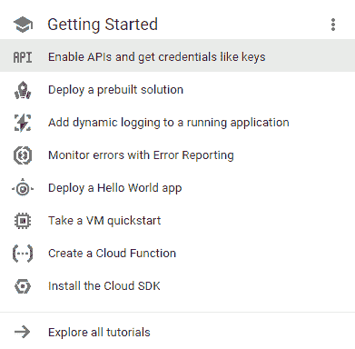
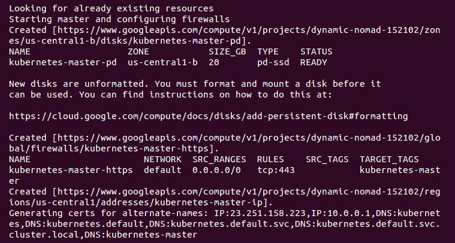

# 第一章：Kubernetes 简介

本书将帮助你构建、扩展和管理生产级 Kubernetes 集群。本书的每一部分将为你提供容器的核心概念，以及如何运行现代 Web 服务的操作背景，这些服务需要每天 24 小时、每周 7 天、每年 365 天保持可用。随着本书的进展，你将通过具体的基于代码的示例，了解 Kubernetes 的多种抽象，并能够将它们部署到运行中的集群中，以便获得真实的反馈。到本书结束时，你将掌握 Kubernetes 的核心概念构建模块，并且对如何处理以下几种范式有清晰的理解：

+   编排

+   调度

+   网络

+   安全

+   存储

+   身份与认证

+   基础设施管理

本章将为*为什么选择 Kubernetes？* 打下基础，并概述现代容器历史，深入探讨容器的工作原理，以及为什么调度、编排和管理容器平台非常重要。我们将把这些与实际的业务和产品目标联系起来。本章还将简要介绍 Kubernetes 编排如何提升我们的容器管理策略，以及如何让一个基本的 Kubernetes 集群上线，运行，并为容器部署做好准备。

在本章中，我们将涵盖以下主题：

+   介绍容器操作和管理

+   容器管理的重要性

+   Kubernetes 的优势

+   下载最新版本的 Kubernetes

+   安装并启动新的 Kubernetes 集群

+   Kubernetes 集群的组成部分

# 技术要求

你需要安装以下工具：

+   Python

+   AWS CLI

+   Google Cloud CLI

+   Minikube

本章将详细介绍这些工具的安装和配置。如果你已经知道如何操作，可以立即进行设置。

# 容器简要概述

不管你信不信，容器及其前身已经在 Linux 和 Unix 操作系统中存在了超过 15 年。如果深入研究容器如何运行的基本原理，你会发现它们的根源可以追溯到 1970 年发明的 chroot 技术。从 2000 年初开始，FreeBSD、Linux、Solaris、Open VZ、Warden，最终到 Docker 都在为最终用户封装容器化技术方面作出了重要的尝试。

尽管 VServer 项目和首个提交（*在一台机器上运行多个通用 Linux 服务器，具有高度独立性和安全性*（[`ieeexplore.ieee.org/document/1430092/?reload=true`](http://ieeexplore.ieee.org/document/1430092/?reload=true))) 可能是容器历史上最有趣的历史节点之一，但显然，正是 Docker 在 2013 年底全面投入容器生态系统并决定将 dotCloud 更名为 Docker，点燃了容器生态系统的火焰。他们对容器吸引力的广泛营销为我们今天所看到的广泛市场采纳奠定了基础，也为我们在此讨论的庞大容器编排和调度平台奠定了直接基础。

在过去的五年里，容器的流行程度像野火一样迅猛增长。曾经仅限于开发者笔记本、测试或开发环境的容器，如今已成为强大生产系统的构建模块。它们正在运行高度安全的银行工作负载和交易系统，为物联网提供动力，保持我们的按需经济运转，并扩展到数百万个容器，以确保 21 世纪的产品在云端和私有数据中心中高效运行。此外，容器化技术已经渗透到我们的技术时代精神中，全球的每一个技术大会都为构建、运行或在容器中开发分配了大量的讲座和会议。

这个引人入胜的故事的开端是 Docker 及其引人注目的开发者友好工具套件。Docker for macOS 和 Windows、Compose、Swarm 和 Registry 是一些极具威力的工具，塑造了工作流程并改变了公司开发软件的方式。它们为容器在**软件交付生命周期**（**SDLC**）的核心地带存在架起了一座桥梁，围绕这些容器形成了一个引人注目的生态系统。正如马尔科姆·麦克林（Malcom McLean）在 1950 年代通过创建标准化的集装箱彻底改变了物理运输世界，今天这种集装箱被用于从冰块托盘到汽车等各种物品的运输，Linux 容器正在通过使应用环境在基础设施中保持可移植和一致性，从而彻底改变软件开发世界。

我们将从容器的主流化、投入生产并在组织内部大规模应用的故事开始。接下来我们将探讨是什么造就了容器的崛起。

# 什么是容器？

容器是一种操作系统虚拟化技术，类似于其前身的虚拟机。还有一些较不为人知的虚拟化类型，如应用虚拟化、网络虚拟化和存储虚拟化。虽然这些技术自 1960 年代以来就已存在，但 Docker 对容器范式的封装代表了资源隔离的现代实现，利用了内建的 Linux 内核特性，如 chroot、**控制组**（**cgroups**）、UnionFS 和命名空间，实现了在进程级别的完全隔离资源控制。

容器使用这些技术创建轻量级镜像，这些镜像作为独立、完全封装的软件单元，携带它所需的所有内容。这些内容可能包括应用程序二进制文件、任何系统工具或库、基于环境的配置和运行时。隔离的这一特殊属性非常重要，因为它允许开发人员和运维人员利用容器的全功能特性，在不论运行环境的情况下都能顺利运行。这包括开发人员的笔记本电脑以及任何预生产或生产环境。

将应用程序打包机制与运行环境解耦是一个强大的概念，它为工程团队提供了清晰的关注点分离。这使得开发人员能够专注于将核心业务功能构建到应用程序代码中并管理自己的依赖关系，而运维人员则可以简化应用程序的持续集成、发布和部署，而无需担心其配置问题。

容器技术的核心是三个关键概念：

+   cgroups

+   命名空间

+   联合文件系统

# cgroups

cgroups 通过允许主机共享并限制每个进程或容器可以消耗的资源来工作。这对于资源利用率和安全性都非常重要，因为它防止了对主机硬件资源的**拒绝服务**（**DoS**）攻击。多个容器可以共享 CPU 和内存，同时保持在预定义的限制范围内。cgroups 允许容器提供对内存、磁盘 I/O、网络和 CPU 的访问。你还可以访问设备（例如，`/dev/foo`）。cgroups 还支持容器约束的软硬限制，我们将在后面的章节中讨论这些内容。

有七种主要的 cgroups：

+   **Memory cgroup**：该 cgroup 跟踪组的页面访问情况，并可以为物理内存、内核内存和总内存定义限制。

+   **Blkio cgroup**：该 cgroup 跟踪每个组的 I/O 使用情况，监控每个块设备的读写活动。你可以按设备、按操作与字节数，甚至按读与写来限制。

+   **CPU cgroup**：该 cgroup 跟踪每个 CPU 上的用户和系统 CPU 时间以及使用情况。这允许你设置权重，但不能设置限制。

+   **Freezer cgroup**：在批量管理系统中非常有用，这些系统经常停止和启动任务以便高效地调度资源。SIGSTOP 信号用于暂停一个进程，且该进程通常并不察觉它正在被暂停（或恢复）。

+   **CPUset cgroup**：这允许你将一个组固定到多核 CPU 架构中的特定 CPU 上。你可以按应用程序进行固定，这将防止它在 CPUs 之间移动。这样可以通过增加本地内存访问或减少线程切换来提高代码的性能。

+   **Net_cls/net_prio cgroup**：这用于跟踪由 cgroup 中的进程生成的出口流量类别（`net_cls`）或优先级（`net_prio`）。

+   **设备 cgroup**：这控制了组对设备节点的读写权限。

# 命名空间

命名空间为操作系统内的进程交互提供了另一种隔离形式，创建了我们所说的容器工作空间。Linux 命名空间是通过名为 `unshare` 的系统调用创建的，而 `clone` 和 `setns` 则允许你以其他方式操作命名空间。

`unshare()` 允许一个进程（或线程）解除与其他进程（或线程）共享的部分执行上下文。部分执行上下文（如挂载命名空间）在使用 FORK(2) 创建新进程时会隐式共享（更多信息请访问 [`man7.org/linux/man-pages/man2/fork.2.html`](http://man7.org/linux/man-pages/man2/fork.2.html)），而其他部分，如虚拟内存，可能在使用 CLONE(2) 创建进程或线程时根据显式请求共享（更多信息请访问 [`man7.org/linux/man-pages/man2/clone.2.html`](http://man7.org/linux/man-pages/man2/clone.2.html)）。

命名空间限制了进程对其他进程、网络、文件系统和用户 ID 组件的可见性。容器进程仅能看到同一命名空间中的内容。容器中的进程或主机进程不能直接从该容器进程内访问。此外，Docker 为每个容器提供了自己的网络堆栈，类似地保护了套接字和接口。

如果 cgroups 限制了你可以使用多少资源，那么命名空间限制了你可以看到什么资源。下图展示了容器的组成：


在 Docker 引擎中，使用以下命名空间：

+   `pid`：通过提供独立的进程 ID 集来实现进程隔离，这些进程 ID 来自其他命名空间。这些命名空间是嵌套的。

+   `net`：通过提供一个回环接口来虚拟化网络堆栈，并可以创建物理和虚拟网络接口，这些接口一次只能存在于一个命名空间中。

+   `ipc`：管理进程间通信的访问。

+   `mnt`：控制文件系统挂载点。这是 Linux 内核中创建的第一类命名空间，可以是私有的或共享的。

+   `uts`：Unix 时间共享系统通过允许单个系统为不同进程提供不同的主机和域名命名方案，从而隔离版本 ID 和内核。进程`gethostname`和`sethostname`使用此命名空间。

+   `user`：此命名空间允许你将容器中的 UID/GID 映射到主机，并且避免在容器中额外配置。

# 联合文件系统

联合文件系统也是使用 Docker 容器的一个关键优势。容器是从镜像运行的。类似于虚拟机或云计算中的镜像，它表示某个特定时间点的状态。容器镜像快照了文件系统，但通常比虚拟机要小得多。容器共享主机内核，并通常运行一个较小的进程集，因此文件系统和启动时间通常会小得多——尽管这些约束并不是严格执行的。其次，联合文件系统可以高效地存储、下载和执行这些镜像。容器采用了*复制写入存储*的概念，可以立即创建一个全新的容器，而无需等待复制整个文件系统。这类似于其他系统中的瘦分配（thin provisioning），即按需分配存储：


复制写入存储（Copy-on-write storage）跟踪变化的内容，因此它类似于**分布式版本控制系统**（**DVCS**），如 Git。用户可以利用复制写入存储的多个选项：

+   AUFS 和 overlay 文件级别

+   块级别的设备映射器

+   BTRFS 和 ZFS 以及文件系统级别

理解联合文件系统（union filesystems）最简单的方法是将其视为一层一层的蛋糕，每一层都是独立制作的。Linux 内核是我们的基础层；然后，我们可以添加如 Red Hat Linux 或 Ubuntu 这样的操作系统。

接下来，我们可能会添加一个应用程序，如 nginx 或 Apache。每次更改都会创建一个新的层。最终，当你进行更改并添加新的层时，你总是会有一个顶层（想象它是糖霜），这是一个可写层。联合文件系统利用这一策略，使每一层都轻量且快速。

在 Docker 的情况下，存储驱动程序负责将这些层叠加在一起，并提供一个统一的视图来查看这些系统。这堆层的最上层是一个可写层，你将在其中进行工作：可写容器层。我们可以将下方的每一层视为容器镜像层：


使这一切真正高效的是 Docker 会在首次构建时缓存图层。假设我们有一个带有 Ubuntu 的镜像，然后添加 Apache 并构建该镜像。接下来，我们使用 Ubuntu 作为基础构建 MySQL。第二次构建会更快，因为 Ubuntu 图层已经被缓存。本质上，我们前面示意图中的巧克力和香草图层已经烤好了。我们只需要烤制开心果（MySQL）图层，组装并加上糖霜（可写图层）。

# 为什么容器如此酷？

另一个令人兴奋的事实是，不仅开源社区拥抱了容器和 Kubernetes，云服务提供商也深度融入了容器生态系统，并投入数百万美元支持工具、生态系统和管理平台，这些可以帮助管理容器。这意味着你有更多的选择来运行容器工作负载，并且你将拥有更多工具来管理集群上应用程序的调度和编排。

我们将探讨 Kubernetes 用户可用的一些特定机会，但在本书出版时，所有主要的**云服务提供商**（**CSPs**）都提供某种形式的托管或管理 Kubernetes 服务：

+   **亚马逊 Web 服务**：AWS 提供**Kubernetes 弹性容器服务**（**EKS**）（更多信息请访问 [`aws.amazon.com/eks/`](https://aws.amazon.com/eks/)），这是一项托管服务，可简化在其云中运行 Kubernetes 集群。你也可以使用 kops 自行创建集群（更多信息请访问 [`kubernetes.io/docs/setup/custom-cloud/kops/`](https://kubernetes.io/docs/setup/custom-cloud/kops/)）。该产品仍在积极开发中：


+   **谷歌云平台**：GCP 提供**谷歌 Kubernetes 引擎**（**GKE**）（更多信息请访问 [`cloud.google.com/kubernetes-engine/`](https://cloud.google.com/kubernetes-engine/)），这是一个强大的集群管理器，可以在云中部署、管理和扩展容器化应用程序。谷歌已经运行容器化工作负载超过 15 年，这个平台是进行复杂工作负载管理的绝佳选择：


+   **微软 Azure**：Azure 提供**Azure 容器服务**（**AKS**）（更多信息请访问 [`azure.microsoft.com/en-us/services/kubernetes-service/`](https://azure.microsoft.com/en-us/services/kubernetes-service/)），旨在简化全面 Kubernetes 集群的部署、管理和操作。该产品仍在积极开发中：


当你利用这些系统时，你可以获得 Kubernetes 集群的内置管理功能，这使你能够专注于集群的优化、配置和部署。

# 持续集成/持续部署的优势

ThoughtWorks 将持续集成定义为一种开发实践，要求开发人员每天多次将代码集成到共享的代码库中。通过持续的构建和部署过程，组织能够将质量控制和测试作为日常工作周期的一部分。最终的结果是更新和修复错误的速度大大加快，整体质量得到了提高。

然而，在创建与测试和生产环境匹配的开发环境方面，一直存在挑战。通常，这些环境之间的不一致性使得无法充分发挥持续交付的优势。持续集成是加速组织软件交付生命周期的第一步，它帮助你更快、更可靠地将软件功能交付给客户。

持续交付/部署的概念利用持续集成使开发人员能够拥有真正可移植的部署。部署在开发人员笔记本电脑上的容器可以轻松地部署到内部的暂存服务器上。之后，它们可以轻松转移到运行在云中的生产服务器上。这得益于容器的特性，容器构建文件指定了父层，就像我们之前讨论的那样。这样一个优势是，它非常容易确保开发、暂存和生产环境中的操作系统、软件包和应用版本一致。由于所有的依赖项都被打包进层中，相同的主机服务器可以运行多个容器，这些容器可能使用不同的操作系统或软件包版本。此外，我们可以在同一主机服务器上运行各种语言和框架，而不会像在单一操作系统的虚拟机中那样发生典型的依赖冲突。

这为应用程序的持续交付/部署奠定了基础，因为运营团队或开发人员可以专注于确保部署和应用程序发布的正确性，而不必担心依赖项的复杂性。

持续交付是一个过程，其中所有的代码更改会自动构建、测试（持续集成），然后发布到生产环境（持续交付）。如果这个过程能够捕获正确的质量标准、安全保证和单元/集成/系统测试，开发团队将能够持续发布生产就绪且可部署的工件，这些工件经过自动化和标准化的流程处理。

需要注意的是，CD 要求工程团队不仅仅自动化单元测试。为了在诸如 Kubernetes 等复杂的调度和编排系统中使用 CD，团队需要在将应用程序部署到客户之前，验证应用程序在多个维度上的功能。我们将在后面的章节中探索 Kubernetes 所提供的部署策略。

最后，值得记住的是，利用 Kubernetes 与 CI/CD 结合，能够减少技术公司面临的许多常见问题的风险：

+   **长发布周期**：如果需要很长时间才能将代码发布给用户，那么他们将错过潜在的功能，这会导致收入损失。如果你有手动测试或发布过程，这将会减慢将更改部署到生产环境的速度，从而影响到客户。

+   **修复代码很难**：当你缩短发布周期时，你能够更接近问题产生的时间发现并修复 bug。这降低了修复成本，因为 bug 的引入和发现时间之间存在相关性。

+   **更好的发布**：发布得越多，你在发布方面就会变得越好。挑战你的开发者和运维人员，要求他们在 CI/CD 流程中构建自动化、监控和日志记录，将使你的管道更加健壮。随着发布频率的提高，发布之间的差异也会减少。差异越小，团队就能更快地排查潜在的破坏性更改，这反过来又给他们更多的时间进一步完善发布流程。这是一个良性循环！

由于所有的依赖都打包在该层中，同一主机服务器可以运行多个容器，分别运行不同的操作系统或软件包版本。此外，我们可以在同一主机服务器上使用多种语言和框架，而不会像在 VM 中使用单一操作系统时那样发生典型的依赖冲突。

# 资源利用率

明确定义的隔离和层级文件系统使得容器非常适合运行具有非常小的占用空间和特定领域目的的系统。简化的部署和发布过程意味着我们可以快速且频繁地进行部署。因此，许多公司已将部署时间从几周或几个月缩短到几天甚至几小时。在某些情况下，这种开发生命周期非常适合小型、专注的团队，负责处理一个大型应用程序中的小部分。

# 微服务与编排

当我们将一个应用程序分解为非常具体的领域时，我们需要一种统一的方式来在各个部分和领域之间进行沟通。Web 服务多年来一直在发挥这一作用，但容器所带来的额外隔离和细粒度聚焦为微服务铺平了道路。

微服务的定义可能有些模糊，但有一位软件开发领域的尊敬作者和演讲者马丁·福勒提出了这样的定义：

简而言之，微服务架构风格是一种将单一应用开发为一组小型服务的方式，每个服务都在自己的进程中运行，并通过轻量级机制进行通信，通常是 HTTP 资源 API。这些服务围绕业务能力构建，并由完全自动化的部署机制独立部署。这些服务的集中管理最低限度，服务可能采用不同的编程语言编写，并使用不同的数据存储技术。

随着容器化的转折点到来，并且随着微服务在组织中的发展，它们很快就需要一种策略来维护大量的容器和微服务。一些组织将在未来几年内运行数百甚至数千个容器。

# 未来的挑战

生命周期过程本身是操作和管理中的一个重要环节。我们如何在容器失败时自动恢复？哪些上游服务会受到这种故障的影响？我们如何在最小的停机时间内修补我们的应用？随着流量的增长，我们如何扩展我们的容器和服务？

网络和处理也是重要的关注点。有些进程属于同一服务，并且可能受益于与网络的接近。例如，数据库可能会将大量数据发送到特定的微服务进行处理。我们如何将容器放置在集群中彼此接近的位置？是否有共同的数据需要访问？我们如何让新服务被发现并提供给其他系统？

资源利用率也是关键。容器的小巧体积意味着我们可以优化基础设施以提高利用率。在弹性云中实现的节省将使我们进一步减少硬件浪费。我们如何最有效地调度工作负载？如何确保我们的重要应用总是拥有正确的资源？我们如何在空闲容量上运行不太重要的工作负载？

最后，可移植性是推动许多组织实现容器化的关键因素。Docker 使得在各种操作系统、云服务商、内部硬件甚至开发者笔记本上部署标准容器变得非常容易。然而，我们仍然需要工具来迁移容器。我们如何在集群中的不同节点之间移动容器？如何在最小中断的情况下推出更新？我们使用什么过程来执行蓝绿部署或金丝雀发布？

无论你是开始构建独立的微服务并将关注点分离到独立的容器中，还是只是想充分利用应用开发中的可移植性和不可变性，管理和编排的需求变得十分明显。这正是像 Kubernetes 这样的编排工具展现最大价值的地方。

# 我们的第一个集群

Kubernetes 支持多种平台和操作系统。在本书的示例中，我使用了 Ubuntu 16.04 Linux VirtualBox（[`www.virtualbox.org/wiki/Downloads`](https://www.virtualbox.org/wiki/Downloads)）作为客户端，使用**Google Compute Engine**（**GCE**）和 Debian 作为集群本身。我们还将简要了解一个运行在**Amazon Web Services**（**AWS**）上的 Ubuntu 集群。

为了节省一些费用，GCP（[`cloud.google.com/free/`](https://cloud.google.com/free/)）和 AWS（[`aws.amazon.com/free/`](https://aws.amazon.com/free/)）都提供免费的层级和试用优惠，用于他们的云基础设施。如果可能的话，值得利用这些免费试用来学习 Kubernetes。

本书中的大多数概念和示例应该适用于任何 Kubernetes 集群的安装。要获取有关其他平台设置的更多信息，请参考 Kubernetes 入门页面，它将帮助你选择适合你集群的解决方案：[`kubernetes.io/docs/getting-started-guides/`](http://kubernetes.io/docs/getting-started-guides/)。

# 在 GCE 上运行 Kubernetes

我们有几种方式来设置开发环境的先决条件。虽然在这个示例中我们会在本地机器上使用 Linux 客户端，但你也可以使用 Google Cloud Shell 来简化依赖和设置。你可以查看该文档：[`cloud.google.com/shell/docs/`](https://cloud.google.com/shell/docs/)，然后跳转到教程中的`gcloud auth login`部分。

回到本地安装，首先让我们确保环境已正确设置，然后再安装 Kubernetes。从更新软件包开始：

```
$ sudo apt-get update
```

你应该会看到类似以下的输出：

```
$ sudo apt update
[sudo] password for user:
Hit:1 http://archive.canonical.com/ubuntu xenial InRelease
Ign:2 http://dl.google.com/linux/chrome/deb stable InRelease
Hit:3 http://archive.ubuntu.com/ubuntu xenial InRelease
Get:4 http://security.ubuntu.com/ubuntu xenial-security InRelease [102 kB]
Ign:5 http://dell.archive.canonical.com/updates xenial-dell-dino2-mlk InRelease
Hit:6 http://ppa.launchpad.net/webupd8team/sublime-text-3/ubuntu xenial InRelease
Hit:7 https://download.sublimetext.com apt/stable/ InRelease
Hit:8 http://dl.google.com/linux/chrome/deb stable Release
Get:9 http://archive.ubuntu.com/ubuntu xenial-updates InRelease [102 kB]
Hit:10 https://apt.dockerproject.org/repo ubuntu-xenial InRelease
Hit:11 https://deb.nodesource.com/node_7.x xenial InRelease
Hit:12 https://download.docker.com/linux/ubuntu xenial InRelease
Ign:13 http://dell.archive.canonical.com/updates xenial-dell InRelease
<SNIPPED...>
Fetched 1,593 kB in 1s (1,081 kB/s)
Reading package lists... Done
Building dependency tree
Reading state information... Done
120 packages can be upgraded. Run 'apt list --upgradable' to see them.
$
```

如果没有安装 Python 和`curl`，请安装它们：

```
$ sudo apt-get install python
$ sudo apt-get install curl
```

安装`gcloud` SDK：

```
$ curl https://sdk.cloud.google.com | bash
```

在`gcloud`进入我们的路径之前，我们需要启动一个新的命令行。

配置你的 GCP 帐户信息。此操作应该会自动打开一个浏览器，我们可以在其中登录 Google Cloud 帐户并授权 SDK：

```
$ gcloud auth login
```

如果你遇到登录问题或想使用其他浏览器，你可以选择使用`--no-launch-browser`命令。复制并粘贴网址到你选择的机器和/或浏览器。使用你的 Google Cloud 凭证登录并在权限页面点击“允许”。最后，你应该会收到一个授权码，你可以复制并粘贴回命令行，提示符将等待输入。

应该设置一个默认项目，但我们可以通过以下命令来验证这一点：

```
$ gcloud config list project
```

我们可以修改此设置，并通过以下命令设置一个新的默认项目。确保使用项目 ID 而不是项目名称，如下所示：

```
$ gcloud config set project <PROJECT ID>
```

我们可以在控制台的以下网址找到我们的项目 ID：[`console.developers.google.com/project`](https://console.developers.google.com/project)。或者，我们也可以通过`$ gcloud alpha projects list`列出活动项目。

你可以在 GCP 仪表板的[`console.developers.google.com/project`](https://console.developers.google.com/project)中启用项目的 API 访问，或者 Kubernetes 脚本将在下一部分提示你这么做：



接下来，你需要切换到一个可以安装 Kubernetes 二进制文件的目录。我们将设置并下载软件：

```
$ mkdir ~/code/gsw-k8s-3
$ cd ~/code/gsw-k8s-3
```

安装最新版本的 Kubernetes 只需一步，具体如下：

```
$ curl -sS https://get.k8s.io | bash
```

根据你的连接速度，下载 Kubernetes 可能需要一两分钟。早期版本会自动调用`kube-up.sh`脚本并开始构建我们的集群。在 1.5 版本中，我们需要手动调用`kube-up.sh`脚本来启动集群。默认情况下，它会使用 Google Cloud 和 GCE：

```
$ kubernetes/cluster/kube-up.sh
```

如果此时由于缺少组件而出现错误，你需要在本地 Linux 机器上添加一些组件。如果你在使用 Google Cloud Shell，或者在 GCP 中使用 VM，你可能不会看到这个错误：

```
$ kubernetes_install cluster/kube-up.sh... 
Starting cluster in us-central1-b using provider gce
... calling verify-prereqs
missing required gcloud component "alpha"
missing required gcloud component "beta"
$
```

你可以看到这些组件缺失，并且需要它们来利用`kube-up.sh script`：

```
$ gcloud components list
Your current Cloud SDK version is: 193.0.0
The latest available version is: 193.0.0
┌─────────────────────────────────────────────────────────────────────────────────────────────────────────────┐
│ Components │
├───────────────┬──────────────────────────────────────────────────────┬──────────────────────────┬───────────┤
│ Status │ Name │ ID │ Size │
├───────────────┼──────────────────────────────────────────────────────┼──────────────────────────┼───────────┤
│ Not Installed │ App Engine Go Extensions │ app-engine-go │ 151.9 MiB │
│ Not Installed │ Cloud Bigtable Command Line Tool │ cbt │ 4.5 MiB │
│ Not Installed │ Cloud Bigtable Emulator │ bigtable │ 3.7 MiB │
│ Not Installed │ Cloud Datalab Command Line Tool │ datalab │ < 1 MiB │
│ Not Installed │ Cloud Datastore Emulator │ cloud-datastore-emulator │ 17.9 MiB │
│ Not Installed │ Cloud Datastore Emulator (Legacy) │ gcd-emulator │ 38.1 MiB │
│ Not Installed │ Cloud Pub/Sub Emulator │ pubsub-emulator │ 33.4 MiB │
│ Not Installed │ Emulator Reverse Proxy │ emulator-reverse-proxy │ 14.5 MiB │
│ Not Installed │ Google Container Local Builder │ container-builder-local │ 3.8 MiB │
│ Not Installed │ Google Container Registry's Docker credential helper │ docker-credential-gcr │ 3.3 MiB │
│ Not Installed │ gcloud Alpha Commands │ alpha │ < 1 MiB │
│ Not Installed │ gcloud Beta Commands │ beta │ < 1 MiB │
│ Not Installed │ gcloud app Java Extensions │ app-engine-java │ 118.9 MiB │
│ Not Installed │ gcloud app PHP Extensions │ app-engine-php │ │
│ Not Installed │ gcloud app Python Extensions │ app-engine-python │ 6.2 MiB │
│ Not Installed │ gcloud app Python Extensions (Extra Libraries) │ app-engine-python-extras │ 27.8 MiB │
│ Not Installed │ kubectl │ kubectl │ 12.3 MiB │
│ Installed │ BigQuery Command Line Tool │ bq │ < 1 MiB │
│ Installed │ Cloud SDK Core Libraries │ core │ 7.3 MiB │
│ Installed │ Cloud Storage Command Line Tool │ gsutil │ 3.3 MiB │
└───────────────┴──────────────────────────────────────────────────────┴──────────────────────────┴───────────┘
To install or remove components at your current SDK version [193.0.0], run:
 $ gcloud components install COMPONENT_ID
 $ gcloud components remove COMPONENT_ID
To update your SDK installation to the latest version [193.0.0], run:
 $ gcloud components update
```

你可以通过将它们添加到你的 shell 来更新组件：

```
$ gcloud components install alpha beta
Your current Cloud SDK version is: 193.0.0
Installing components from version: 193.0.0
┌──────────────────────────────────────────────┐
│ These components will be installed. │
├───────────────────────┬────────────┬─────────┤
│ Name │ Version │ Size │
├───────────────────────┼────────────┼─────────┤
│ gcloud Alpha Commands │ 2017.09.15 │ < 1 MiB │
│ gcloud Beta Commands │ 2017.09.15 │ < 1 MiB │
└───────────────────────┴────────────┴─────────┘
For the latest full release notes, please visit:
 https://cloud.google.com/sdk/release_notes
Do you want to continue (Y/n)? y
╔════════════════════════════════════════════════════════════╗
╠═ Creating update staging area ═╣
╠════════════════════════════════════════════════════════════╣
╠═ Installing: gcloud Alpha Commands ═╣
╠════════════════════════════════════════════════════════════╣
╠═ Installing: gcloud Beta Commands ═╣
╠════════════════════════════════════════════════════════════╣
╠═ Creating backup and activating new installation ═╣
╚════════════════════════════════════════════════════════════╝
Performing post processing steps...done. 
Update done!

```

运行`kube-up.sh`脚本后，你将看到很多行滚动显示。让我们一段一段地看一下它们：


如果你的`gcloud`组件没有更新，你可能会被提示更新它们。

上面的截图显示了检查先决条件，以及确保所有组件都是最新的。这是针对每个提供商的特定步骤。在 GCE 的情况下，它会验证 SDK 是否已安装，并且所有组件是否都是最新的。如果不是，你会在此时看到安装或更新的提示：


现在，脚本正在启动集群。再次强调，这对每个提供商都是特定的。对于 GCE，它首先检查 SDK 是否已为默认项目和区域进行配置。如果已设置，你会在输出中看到这些信息：

你可能会看到一个输出，表示存储桶尚未创建。这是正常的！创建脚本将自动创建它。

```
BucketNotFoundException: 404 gs://kubernetes-staging-22caacf417 bucket does not exist.
```

接下来，它将服务器二进制文件上传到 Google Cloud 存储，正如在创建 gs:... 行中看到的：



然后，它检查是否有任何已在运行的集群。接下来，我们最终开始创建集群。在上面的截图输出中，我们可以看到它正在创建主服务器、IP 地址以及为集群配置适当的防火墙设置：


最后，它会为我们的集群创建从节点或节点。这是我们的容器工作负载实际运行的地方。它将不断循环并等待所有从节点启动。默认情况下，集群将有四个节点（从节点），但 K8s 支持拥有超过 1,000 个节点（并且很快会超过）。稍后我们将在本书中回到节点扩展的话题：

```
Attempt 1 to create kubernetes-minion-template
WARNING: You have selected a disk size of under [200GB]. This may result in poor I/O performance. For more information, see: https://developers.google.com/compute/docs/disks#performance.
Created [https://www.googleapis.com/compute/v1/projects/gsw-k8s-3/global/instanceTemplates/kubernetes-minion-template].
NAME MACHINE_TYPE PREEMPTIBLE CREATION_TIMESTAMP
kubernetes-minion-template n1-standard-2 2018-03-17T11:14:04.186-07:00
Created [https://www.googleapis.com/compute/v1/projects/gsw-k8s-3/zones/us-central1-b/instanceGroupManagers/kubernetes-minion-group].
NAME LOCATION SCOPE BASE_INSTANCE_NAME SIZE TARGET_SIZE INSTANCE_TEMPLATE AUTOSCALED
kubernetes-minion-group us-central1-b zone kubernetes-minion-group 0 3 kubernetes-minion-template no
Waiting for group to become stable, current operations: creating: 3
Group is stable
INSTANCE_GROUPS=kubernetes-minion-group
NODE_NAMES=kubernetes-minion-group-176g kubernetes-minion-group-s9qw kubernetes-minion-group-tr7r
Trying to find master named 'kubernetes-master'
Looking for address 'kubernetes-master-ip'
Using master: kubernetes-master (external IP: 104.155.172.179)
Waiting up to 300 seconds for cluster initialization.
```

现在，一切都已创建，集群已初始化并启动。假设一切顺利，我们将获得主节点的 IP 地址：

```
... calling validate-cluster
Validating gce cluster, MULTIZONE=
Project: gsw-k8s-3
Network Project: gsw-k8s-3
Zone: us-central1-b
No resources found.
Waiting for 4 ready nodes. 0 ready nodes, 0 registered. Retrying.
No resources found.
Waiting for 4 ready nodes. 0 ready nodes, 0 registered. Retrying.
Waiting for 4 ready nodes. 0 ready nodes, 1 registered. Retrying.
Waiting for 4 ready nodes. 0 ready nodes, 4 registered. Retrying.
Found 4 node(s).
NAME STATUS ROLES AGE VERSION
kubernetes-master Ready,SchedulingDisabled <none> 32s v1.9.4
kubernetes-minion-group-176g Ready <none> 25s v1.9.4
kubernetes-minion-group-s9qw Ready <none> 25s v1.9.4
kubernetes-minion-group-tr7r Ready <none> 35s v1.9.4
Validate output:
NAME STATUS MESSAGE ERROR
etcd-1 Healthy {"health": "true"}
scheduler Healthy ok
controller-manager Healthy ok
etcd-0 Healthy {"health": "true"}
Cluster validation succeeded
```

另外，请注意，配置以及集群管理凭据存储在`home/<Username>/.kube/config`中。

然后，脚本将验证集群。此时，我们不再运行特定于提供商的代码。验证脚本将通过`kubectl.sh`脚本查询集群。这个脚本是管理我们集群的核心脚本。在这种情况下，它检查找到的、已注册的并处于就绪状态的从节点的数量。它会循环执行，给集群最多 10 分钟的时间来完成初始化。

启动成功后，集群从节点和组件健康状况的摘要将显示在屏幕上：

```
Done, listing cluster services:
Kubernetes master is running at https://104.155.172.179
GLBCDefaultBackend is running at https://104.155.172.179/api/v1/namespaces/kube-system/services/default-http-backend:http/proxy
Heapster is running at https://104.155.172.179/api/v1/namespaces/kube-system/services/heapster/proxy
KubeDNS is running at https://104.155.172.179/api/v1/namespaces/kube-system/services/kube-dns:dns/proxy
kubernetes-dashboard is running at https://104.155.172.179/api/v1/namespaces/kube-system/services/https:kubernetes-dashboard:/proxy
Metrics-server is running at https://104.155.172.179/api/v1/namespaces/kube-system/services/https:metrics-server:/proxy
Grafana is running at https://104.155.172.179/api/v1/namespaces/kube-system/services/monitoring-grafana/proxy
InfluxDB is running at https://104.155.172.179/api/v1/namespaces/kube-system/services/monitoring-influxdb:http/proxy
To further debug and diagnose cluster problems, use 'kubectl cluster-info dump'.
```

最后，执行`kubectl cluster-info`命令，它会输出主节点服务的 URL，包括 DNS、UI 和监控。让我们看看这些组件中的一些。

如果你想获取更多的调试信息和/或诊断集群问题，可以使用`kubectl cluster-info dump`查看集群的情况。此外，如果你需要暂停并休息一下，并且想节省空闲时间，可以登录到 GUI 并将`kubernetes-minion-group`实例组设置为零，这将移除所有实例。铅笔图标会帮助你编辑组；将其设置为零。如果你想再次继续，别忘了把它改回三！


你也可以直接停止管理节点。你需要点击停止按钮来关闭它：


如果你想重新启动集群，请重新启动服务器以继续。它们需要一些时间来启动并相互连接。

如果你想同时操作多个集群，或者想使用不同于默认值的名称，可以查看`<kubernetes>/cluster/gce/config-default.sh`文件，以便更细粒度地配置集群。

# Kubernetes UI

从 Kubernetes v1.3.x 开始，你不能再通过公共 IP 地址访问 GUI。为了解决这个问题，我们将使用`kubectl proxy`命令。首先，从配置命令中获取令牌，然后我们将使用它来启动 UI 的本地代理版本：

```
$ kubectl config view |grep token
 token: RvoYTIn4rExi1bNRzk56g0PU0srZbzOf
$ kubectl proxy --port=8001
```

打开浏览器并输入以下 URL：`https://localhost/ui/`。

如果你使用的是 macOS，也可以输入这些命令自动打开浏览器窗口：`$ open https://localhost/ui/`；如果你使用的是 Linux，可以输入`$ xdg-open https://localhost/ui`。

证书默认是自签名的，因此你需要在浏览器中忽略警告才能继续。之后，我们将看到一个登录对话框：


在这个登录对话框中，你需要输入之前命令中获得的 token。

这里是我们使用 K8s 安装过程中列出的凭据的位置。我们可以随时通过使用 `config` 命令 `$ kubectl config view` 找到它们。

使用 **Token** 选项并登录到你的集群：


现在我们输入了 token，你应该会看到如下截图中的仪表盘：


主面板开始时显示的内容不多。这里有一个链接，点击后会带你到一个部署容器化应用的 GUI 界面。这种 GUI 是一种非常简单的方式，可以让你在无需担心 Kubernetes YAML 语法的情况下开始部署应用。然而，随着容器使用的深入，使用已经提交到源代码控制中的 YAML 定义是一种更好的实践。

如果你点击左侧菜单中的 **Nodes** 链接，你将看到当前集群节点的一些度量信息：


在顶部，我们可以看到 CPU 和内存使用情况的汇总，并列出了我们的集群节点。点击其中一个节点会带我们到该节点的详细信息页面，查看节点的健康状况和各种度量指标。

Kubernetes UI 还提供了许多其他视图，这些视图在我们开始启动实际应用并为集群添加配置时会变得更加有用。

# Grafana

另一个默认安装的服务是 Grafana。这个工具将为我们提供一个仪表盘，用来查看集群节点的度量信息。我们可以通过以下语法在浏览器中访问它：

```
https://localhost/api/v1/proxy/namespaces/kube-system/services/monitoring-grafana
```

Grafana 仪表盘应该看起来像这样：


从主页面，点击首页下拉菜单并选择“集群”。在这里，Kubernetes 实际上运行着许多服务。Heapster 用来收集 pod 和节点的资源使用情况，并将信息存储在 InfluxDB 中。我们在 Grafana UI 中看到的结果，如 CPU 和内存使用情况，正是这些数据。我们将在第八章中深入探讨这一内容，*监控与日志记录*。

# 命令行

`kubectl` 脚本包含了用于探索我们集群和正在运行的工作负载的命令。你可以在 `/kubernetes/client/bin` 文件夹中找到它。我们将在本书中多次使用这个命令，因此我们可以花点时间设置我们的环境。我们可以通过将二进制文件夹添加到 `PATH` 中来完成设置，方法如下：

```
$ export PATH=$PATH:/<Path where you downloaded K8s>/kubernetes/client/bin
$ chmod +x /<Path where you downloaded K8s>/kubernetes/client/bin
```

你可以选择将 `kubernetes` 文件夹下载到你的主文件夹之外，因此可以根据需要修改前面的命令。另一个好主意是通过将 `export` 命令添加到你的主目录下的 `.bashrc` 文件末尾，使这些更改永久生效。

现在我们已经将 `kubectl` 添加到路径中，可以开始使用它了。它有很多命令。由于我们还没有启动任何应用程序，因此大多数命令可能不会很有趣。但是，我们可以立刻探索两个命令。

首先，我们已经在初始化时看到过 `cluster-info` 命令，但我们可以随时再次运行它，命令如下：

```
$ kubectl cluster-info
```

另一个有用的命令是 `get`。它可以用于查看当前运行的服务、Pod、复制控制器等。以下是几个开箱即用的实用示例：

+   列出我们集群中的节点：

```
    $ kubectl get nodes
```

+   列出集群事件：

```
    $ kubectl get events
```

+   最后，我们可以看到集群中运行的任何服务，如下所示：

```
    $ kubectl get services
```

一开始，我们只会看到一个服务，名为 `kubernetes`。该服务是集群的核心 API 服务器。

对于任何前述的命令，你总是可以在末尾添加 `-h` 标志来了解命令的用法。

# 在主节点上运行的服务

让我们更深入地了解我们的新集群及其核心服务。默认情况下，机器的名称带有 `kubernetes-` 前缀。我们可以在启动集群之前，使用 `$KUBE_GCE_INSTANCE_PREFIX` 来修改这个前缀。对于我们刚启动的集群，主节点的名称应该是 `kubernetes-master`。我们可以使用 `gcloud` 命令行工具来通过 SSH 连接到该机器。以下命令将启动与主节点的 SSH 会话。请确保将你的项目 ID 和区域替换为与你的环境匹配的值：

```
$ gcloud compute ssh --zone "<your gce zone>" "kubernetes-master"  $ gcloud compute ssh --zone "us-central1-b" "kubernetes-master"
Warning: Permanently added 'compute.5419404412212490753' (RSA) to the list of known hosts.

Welcome to Kubernetes v1.9.4!

You can find documentation for Kubernetes at:
  http://docs.kubernetes.io/

The source for this release can be found at:
  /home/kubernetes/kubernetes-src.tar.gz
Or you can download it at:
  https://storage.googleapis.com/kubernetes-release/release/v1.9.4/kubernetes-src.tar.gz

It is based on the Kubernetes source at:
  https://github.com/kubernetes/kubernetes/tree/v1.9.4

For Kubernetes copyright and licensing information, see:
  /home/kubernetes/LICENSES

jesse@kubernetes-master ~ $ 
```

如果你在通过 Google Cloud CLI 使用 SSH 时遇到问题，可以使用控制台，它内置了一个 SSH 客户端。只需进入 VM 实例的详细信息页面，你就会看到 `kubernetes-master` 列表中的 SSH 选项。或者，在 VM 实例的详细信息页面顶部也有 SSH 选项。


一旦我们登录，我们应该会看到标准的 shell 提示符。让我们运行 `docker` 命令，筛选出 `Image` 和 `Status`：

```
$ docker container ls --format 'table {{.Image}}\t{{.Status}}' 
```


即使我们还没有在 Kubernetes 上部署任何应用程序，我们也可以注意到已经有几个容器在运行。以下是每个容器的简要描述：

+   `fluentd-gcp`：这个容器收集并将集群日志文件发送到 Google Cloud Logging 服务。

+   `node-problem-detector`：这个容器是一个守护进程，运行在每个节点上，目前用于检测硬件和内核层面的问题。

+   `rescheduler`：这是另一个附加容器，确保关键组件始终在运行。当资源不足时，它甚至可以移除不太关键的 Pod，以腾出空间。

+   `glbc`：这是另一个 Kubernetes 插件容器，利用新的 Ingress 功能提供 Google Cloud Layer 7 负载均衡。

+   `kube-addon-manager`：这个组件是 Kubernetes 通过各种插件进行扩展的核心。它还会定期应用对`/etc/kubernetes/addons`目录的任何更改。

+   `etcd-empty-dir-cleanup`：一个清理`etcd`中空键的工具。

+   `kube-controller-manager`：这是一个控制器管理器，负责控制多种集群功能，确保准确且最新的复制是其重要职责之一。此外，它还监控、管理并发现新的节点。最后，它还管理和更新服务端点。

+   `kube-apiserver`：这个容器运行 API 服务器。正如我们在 Swagger 界面中所探讨的，这个 RESTful API 允许我们创建、查询、更新和删除 Kubernetes 集群的各种组件。

+   `kube-scheduler`：这个调度器将未调度的 Pod 绑定到节点，基于当前的调度算法。

+   `etcd`：这个组件运行由 CoreOS 构建的`etcd`软件，它是一个分布式且一致的键值存储。这是 Kubernetes 集群状态存储、更新和由 K8s 各个组件获取的地方。

+   `pause`：这个容器通常被称为 Pod 基础设施容器，用于设置并保持每个 Pod 的网络命名空间和资源限制。

我省略了许多这些名称中的`amd64`，以使其更具通用性。Pod 的目的保持不变。

要退出 SSH 会话，只需在提示符下输入`exit`。

在下一章中，我们还将展示这些服务如何在第一张图中共同工作，*Kubernetes 核心架构*。

# 运行在工作节点上的服务

我们可以通过 SSH 连接到其中一个工作节点，但由于 Kubernetes 会将工作负载调度到整个集群，所以我们无法在单个工作节点上看到所有容器。然而，我们可以使用`kubectl`命令查看所有工作节点上运行的 Pod：

```
$ kubectl get pods
No resources found.
```

由于我们尚未在集群中启动任何应用程序，因此暂时看不到任何 Pod。然而，实际上有几个系统 Pod 在运行 Kubernetes 基础设施的部分组件。我们可以通过指定`kube-system`命名空间来查看这些 Pod。我们稍后会深入探讨命名空间及其重要性，但现在，可以使用`--namespace=kube-system`命令查看这些 K8s 系统资源，如下所示：

```
$ kubectl get pods --namespace=kube-system
jesse@kubernetes-master ~ $ kubectl get pods --namespace=kube-system
NAME READY STATUS RESTARTS AGE
etcd-server-events-kubernetes-master 1/1 Running 0 50m
etcd-server-kubernetes-master 1/1 Running 0 50m
event-exporter-v0.1.7-64464bff45-rg88v 1/1 Running 0 51m
fluentd-gcp-v2.0.10-c4ptt 1/1 Running 0 50m
fluentd-gcp-v2.0.10-d9c5z 1/1 Running 0 50m
fluentd-gcp-v2.0.10-ztdzs 1/1 Running 0 51m
fluentd-gcp-v2.0.10-zxx6k 1/1 Running 0 50m
heapster-v1.5.0-584689c78d-z9blq 4/4 Running 0 50m
kube-addon-manager-kubernetes-master 1/1 Running 0 50m
kube-apiserver-kubernetes-master 1/1 Running 0 50m
kube-controller-manager-kubernetes-master 1/1 Running 0 50m
kube-dns-774d5484cc-gcgdx 3/3 Running 0 51m
kube-dns-774d5484cc-hgm9r 3/3 Running 0 50m
kube-dns-autoscaler-69c5cbdcdd-8hj5j 1/1 Running 0 51m
kube-proxy-kubernetes-minion-group-012f 1/1 Running 0 50m
kube-proxy-kubernetes-minion-group-699m 1/1 Running 0 50m
kube-proxy-kubernetes-minion-group-sj9r 1/1 Running 0 50m
kube-scheduler-kubernetes-master 1/1 Running 0 50m
kubernetes-dashboard-74f855c8c6-v4f6x 1/1 Running 0 51m
l7-default-backend-57856c5f55-2lz6w 1/1 Running 0 51m
l7-lb-controller-v0.9.7-kubernetes-master 1/1 Running 0 50m
metrics-server-v0.2.1-7f8dd98c8f-v9b4c 2/2 Running 0 50m
monitoring-influxdb-grafana-v4-554f5d97-l7q4k 2/2 Running 0 51m
rescheduler-v0.3.1-kubernetes-master 1/1 Running 0 50m
```

前六行应该很熟悉。这些是我们在主节点上看到的服务，我们将在节点上看到它们的一部分。还有一些我们尚未看到的额外服务。`kube-dns`选项提供 DNS 和服务发现功能，`kubernetes-dashboard-xxxx`是 Kubernetes 的用户界面，`l7-default-backend-xxxx`提供新的七层负载均衡能力的默认负载均衡后端，而`heapster-v1.2.0-xxxx`和`monitoring-influx-grafana`提供 Heapster 数据库和用户界面，用于监控集群中的资源使用情况。

最后，`kube-proxy-kubernetes-minion-group-xxxx`是代理，它将流量引导到集群中运行的正确后端服务和 Pod。`kube-apiserver`验证并配置 API 对象的数据，其中包括服务、复制控制器、Pod 以及其他 Kubernetes 对象。`rescheduler`确保调度关键系统附加组件，前提是集群有足够的可用资源。

如果我们 SSH 进入某个随机的 minion 节点，我们会看到几个容器在这些 Pod 上运行。一个示例可能如下所示：


再次，我们在主节点上看到了类似的服务。我们没有在主节点上看到的服务包括：

+   `kubedns`：这个容器监控 Kubernetes 中的服务和端点资源，并将任何变化同步到 DNS 查询。

+   `kube-dnsmasq`：这是另一个提供 DNS 缓存的容器。

+   `dnsmasq-metrics`：它提供集群中 DNS 服务的指标报告。

+   `l7-defaultbackend`：这是处理 GCE L7 负载均衡器和 Ingress 的默认后端。

+   `kube-proxy`：这是你集群的网络和服务代理。这个组件确保服务流量被正确地引导到集群中运行工作负载的地方。我们将在本书后面更深入地探讨这个内容。

+   `heapster`：这个容器用于监控和分析。

+   `addon-resizer`：这个集群工具用于调整容器规模。

+   `heapster_grafana`：它跟踪资源使用情况和监控。

+   `heapster_influxdb`：这个时序数据库用于存储 Heapster 数据。

+   `cluster-proportional-autoscaler`：这个集群工具用于根据集群的大小调整容器的规模。

+   `exechealthz`：它对 Pod 进行健康检查。

再次说明，我已经省略了这些名称中的`amd64`，以使其更具通用性。Pod 的目的保持不变。

# 拆除集群

好的，这是我们在 GCE 上的第一个集群，但让我们来看看其他提供商。为了简化，我们需要删除刚刚在 GCE 上创建的集群。我们可以通过一个简单的命令来拆除集群：

```
$ cluster/kube-down.sh
```

# 与其他提供商合作

默认情况下，Kubernetes 使用 Google Cloud 的 GCE 提供者。为了使用其他云提供者，我们可以探索一系列快速扩展的工具集。我们以 AWS 为例，它有两个主要选项：kops（[`github.com/kubernetes/kops`](https://github.com/kubernetes/kops)）和 kube-aws（[`github.com/kubernetes-incubator/kube-aws`](https://github.com/kubernetes-incubator/kube-aws)）。作为参考，以下`KUBERNETES_PROVIDER`值列在此表中：

| **提供者** | **KUBERNETES_PROVIDER 值** | **类型** |
| --- | --- | --- |
| Google Compute Engine | `gce` | 公有云 |
| Google 容器引擎 | `gke` | 公有云 |
| 亚马逊 Web 服务 | `aws` | 公有云 |
| 微软 Azure | `azure` | 公有云 |
| Hashicorp vagrant | `vagrant` | 虚拟开发环境 |
| VMware vSphere | `vsphere` | 私有云/本地虚拟化 |
| 运行 CoreOS 的 `libvirt` | `libvirt-coreos` | 虚拟化管理工具 |
| Canonical Juju（Ubuntu 背后的团队） | `juju` | 操作系统服务编排工具 |

# CLI 设置

让我们尝试在 AWS 上设置集群。作为前提条件，我们需要安装并配置 AWS CLI 以便为我们的账户提供支持。AWS CLI 的安装和配置文档可以在以下链接中找到：

+   安装文档： [`docs.aws.amazon.com/cli/latest/userguide/installing.html#install-bundle-other-os`](http://docs.aws.amazon.com/cli/latest/userguide/installing.html#install-bundle-other-os)

+   配置文档： [`docs.aws.amazon.com/cli/latest/userguide/cli-chap-getting-started.html`](http://docs.aws.amazon.com/cli/latest/userguide/cli-chap-getting-started.html)

你还需要按照 AWS 推荐的方式配置你的凭证（参考 [`docs.aws.amazon.com/sdk-for-go/v1/developer-guide/configuring-sdk.html#specifying-credentials`](https://docs.aws.amazon.com/sdk-for-go/v1/developer-guide/configuring-sdk.html#specifying-credentials)）以便使用 kops。要开始使用，你需要首先安装 CLI 工具（参考 [`github.com/kubernetes/kops/blob/master/docs/install.md`](https://github.com/kubernetes/kops/blob/master/docs/install.md)）。如果你在 Linux 上运行，可以按以下方式安装工具：

```
curl -Lo kops https://github.com/kubernetes/kops/releases/download/$(curl -s https://api.github.com/repos/kubernetes/kops/releases/latest | grep tag_name | cut -d '"' -f 4)/kops-darwin-amd64
chmod +x ./kops
sudo mv ./kops /usr/local/bin/
```

如果你在 macOS 上安装这个，可以通过命令行终端使用`brew update && brew install kops`命令。提醒一下，如果你还没有安装`kubectl`，你需要先安装它！查看前面的链接中的说明来确认安装过程。

# IAM 设置

为了使用 kops，我们需要在 AWS 中创建一个 IAM 角色，并赋予以下权限：

```
AmazonEC2FullAccess
AmazonRoute53FullAccess
AmazonS3FullAccess
IAMFullAccess
AmazonVPCFullAccess
```

一旦你在 AWS GUI 中手动创建了这些组件，你可以从你的 PC 上运行以下命令来设置正确的权限：

```
aws iam create-group --group-name kops

aws iam attach-group-policy --policy-arn arn:aws:iam::aws:policy/AmazonEC2FullAccess --group-name kops
aws iam attach-group-policy --policy-arn arn:aws:iam::aws:policy/AmazonRoute53FullAccess --group-name kops
aws iam attach-group-policy --policy-arn arn:aws:iam::aws:policy/AmazonS3FullAccess --group-name kops
aws iam attach-group-policy --policy-arn arn:aws:iam::aws:policy/IAMFullAccess --group-name kops
aws iam attach-group-policy --policy-arn arn:aws:iam::aws:policy/AmazonVPCFullAccess --group-name kops

aws iam create-user --user-name kops

aws iam add-user-to-group --user-name kops --group-name kops

aws iam create-access-key --user-name kops 
```

为了使用这个新创建的 kops 用户与 kops 工具交互，你需要从输出的 JSON 中复制`SecretAccessKey`和`AccessKeyID`，然后按如下方式配置 AWS CLI：

```
# configure the aws client to use your new IAM user
aws configure # Use your new access and secret key here
aws iam list-users # you should see a list of all your IAM users here
# Because "aws configure" doesn't export these vars for kops to use, we export them now
export AWS_ACCESS_KEY_ID=$(aws configure get aws_access_key_id)
export AWS_SECRET_ACCESS_KEY=$(aws configure get aws_secret_access_key)
```

我们将使用基于 gossip 的集群来绕过 kops 对公共 DNS 区域的配置要求。这需要 kops 1.6.2 或更高版本，并允许你创建一个本地注册的集群，要求名称以`.k8s.local`结尾。稍后会详细介绍。

如果你想了解如何通过提供商购买并设置公共路由 DNS，你可以在 kops 文档中查看可用的场景：[`github.com/kubernetes/kops/blob/master/docs/aws.md#configure-dns`](https://github.com/kubernetes/kops/blob/master/docs/aws.md#configure-dns)。

# 集群状态存储

由于我们在云中使用配置管理构建资源，因此我们需要将集群的表示存储在一个专用的 S3 桶中。这个“真相来源”将使我们能够维护一个集中位置，用于 Kubernetes 集群的配置和状态。请在桶名称前加上唯一的值。

目前，你需要自己设置好`kubectl`、`kops`、`aws cli`以及 IAM 凭证！

现在一定要在`us-east-1`区域创建你的桶，因为 kops 目前对桶的位置有明确要求：

```
aws s3api create-bucket \
 --bucket gsw-k8s-3-state-store \
 --region us-east-1
```

让我们继续设置版本控制，以便在出现问题时可以将集群回滚到先前的状态。看看基础设施即代码的强大功能！

```
aws s3api put-bucket-versioning --bucket gsw-k8s-3-state-store --versioning-configuration Status=Enabled
```

# 创建你的集群

我们将继续使用前面提到的`.k8s.local`设置，以简化集群的 DNS 设置。如果你更喜欢，也可以使用 kops 中提供的名称和状态标志，避免使用环境变量。让我们先准备好本地环境：

```
$ export NAME=gswk8s3.k8s.local
$ export KOPS_STATE_STORE=s3://gsw-k8s-3-state-store
$ aws s3api create-bucket --bucket gsw-k8s-3-state-store --region us-east-1
{
 "Location": "/gsw-k8s-3-state-store"
}
$
```

让我们在俄亥俄州启动我们的集群，并首先验证我们是否能看到该地区：

```
$ aws ec2 describe-availability-zones --region us-east-2
{
 "AvailabilityZones": [
 {
 "State": "available", 
 "ZoneName": "us-east-2a", 
 "Messages": [], 
 "RegionName": "us-east-2"
 }, 
 {
 "State": "available", 
 "ZoneName": "us-east-2b", 
 "Messages": [], 
 "RegionName": "us-east-2"
 }, 
 {
 "State": "available", 
 "ZoneName": "us-east-2c", 
 "Messages": [], 
 "RegionName": "us-east-2"
 }
 ]
}
```

太好了！让我们来构建一些 Kubernetes。我们将使用最基本的 kops 集群命令，尽管文档中也提供了更复杂的示例（[`github.com/kubernetes/kops/blob/master/docs/high_availability.md`](https://github.com/kubernetes/kops/blob/master/docs/high_availability.md)）：

```
kops create cluster --zones us-east-2a ${NAME}
```

使用 kops，通常在 Kubernetes 中，所有内容都将创建在**自动扩展组**（**ASGs**）中。

在这里阅读更多关于 AWS 自动扩展组的信息——它们至关重要：[`docs.aws.amazon.com/autoscaling/ec2/userguide/AutoScalingGroup.html`](https://docs.aws.amazon.com/autoscaling/ec2/userguide/AutoScalingGroup.html)。

一旦你运行此命令，你将看到大量的配置输出，采用我们称之为 dry run 格式的形式。这类似于 Terraform 中的 Terraform 计划，允许你查看你即将构建的 AWS 资源，并相应地编辑输出。

在输出的最后，你会看到以下文本，它为你提供了关于下一步的一些基本建议：

```
Must specify --yes to apply changes
Cluster configuration has been created.

Suggestions:
* list clusters with: kops get cluster
* edit this cluster with: kops edit cluster gwsk8s3.k8s.local
* edit your node instance group: kops edit ig --name=gwsk8s3.k8s.local nodes
* edit your master instance group: kops edit ig --name=gwsk8s3.k8s.local master-us-east-2a

Finally configure your cluster with: kops update cluster gwsk8s3.k8s.local --yes
```

如果你在`~/.ssh`目录中没有 SSH 密钥对，你需要创建一个。本文将指导你完成步骤：[`help.github.com/articles/generating-a-new-ssh-key-and-adding-it-to-the-ssh-agent/`](https://help.github.com/articles/generating-a-new-ssh-key-and-adding-it-to-the-ssh-agent/)。

一旦你确认输出结果看起来不错，就可以创建集群：

```
kops update cluster gwsk8s3.k8s.local --yes
```

这将给你提供大量关于集群创建的输出，你可以跟随这些信息：

```
I0320 21:37:34.761784 29197 apply_cluster.go:450] Gossip DNS: skipping DNS validation
I0320 21:37:35.172971 29197 executor.go:91] Tasks: 0 done / 77 total; 30 can run
I0320 21:37:36.045260 29197 vfs_castore.go:435] Issuing new certificate: "apiserver-aggregator-ca"
I0320 21:37:36.070047 29197 vfs_castore.go:435] Issuing new certificate: "ca"
I0320 21:37:36.727579 29197 executor.go:91] Tasks: 30 done / 77 total; 24 can run
I0320 21:37:37.740018 29197 vfs_castore.go:435] Issuing new certificate: "apiserver-proxy-client"
I0320 21:37:37.758789 29197 vfs_castore.go:435] Issuing new certificate: "kubecfg"
I0320 21:37:37.830861 29197 vfs_castore.go:435] Issuing new certificate: "kube-controller-manager"
I0320 21:37:37.928930 29197 vfs_castore.go:435] Issuing new certificate: "kubelet"
I0320 21:37:37.940619 29197 vfs_castore.go:435] Issuing new certificate: "kops"
I0320 21:37:38.095516 29197 vfs_castore.go:435] Issuing new certificate: "kubelet-api"
I0320 21:37:38.124966 29197 vfs_castore.go:435] Issuing new certificate: "kube-proxy"
I0320 21:37:38.274664 29197 vfs_castore.go:435] Issuing new certificate: "kube-scheduler"
I0320 21:37:38.344367 29197 vfs_castore.go:435] Issuing new certificate: "apiserver-aggregator"
I0320 21:37:38.784822 29197 executor.go:91] Tasks: 54 done / 77 total; 19 can run
I0320 21:37:40.663441 29197 launchconfiguration.go:333] waiting for IAM instance profile "nodes.gswk8s3.k8s.local" to be ready
I0320 21:37:40.889286 29197 launchconfiguration.go:333] waiting for IAM instance profile "masters.gswk8s3.k8s.local" to be ready
I0320 21:37:51.302353 29197 executor.go:91] Tasks: 73 done / 77 total; 3 can run
I0320 21:37:52.464204 29197 vfs_castore.go:435] Issuing new certificate: "master"
I0320 21:37:52.644756 29197 executor.go:91] Tasks: 76 done / 77 total; 1 can run
I0320 21:37:52.916042 29197 executor.go:91] Tasks: 77 done / 77 total; 0 can run
I0320 21:37:53.360796 29197 update_cluster.go:248] Exporting kubecfg for cluster
kops has set your kubectl context to gswk8s3.k8s.local
```

和 GCE 一样，设置过程会花费几分钟。它将在 **S3** 中暂存文件，并在我们的 AWS 账户中创建适当的实例、**虚拟私有云**（**VPC**）、安全组等。然后，Kubernetes 集群将被设置并启动。一旦一切完成并启动，我们应该会看到下一步的选项：

```
Cluster is starting. It should be ready in a few minutes.

Suggestions:
 * validate cluster: kops validate cluster
 * list nodes: kubectl get nodes --show-labels
 * ssh to the master: ssh -i ~/.ssh/id_rsa admin@api.gswk8s3.k8s.local
The admin user is specific to Debian. If not using Debian please use the appropriate user based on your OS.
 * read about installing addons: https://github.com/kubernetes/kops/blob/master/docs/addons.md
```

你将能够看到实例和安全组，VPC 也会为你的集群创建。`kubectl` 上下文也会指向你的新 AWS 集群，这样你就可以与之交互：


再次，我们将通过 SSH 进入主节点。这一次，我们可以使用原生的 SSH 客户端，并以 admin 用户身份登录，因为 Kops 中 Kubernetes 的 AMI 是 Debian。我们将找到密钥文件，路径为`/home/<username>/.ssh`：

```
$ ssh -v -i /home/<username>/.ssh/<your_id_rsa_file> admin@<Your master IP>
```

如果你在 SSH 密钥方面遇到问题，你可以通过创建一个密钥并将其添加到集群来手动设置密钥，并检查集群是否需要滚动更新：

```
$ kops create secret --name gswk8s3.k8s.local sshpublickey admin -i ~/.ssh/id_rsa.pub
$ kops update cluster --yes
Using cluster from kubectl context: gswk8s3.k8s.local
I0320 22:03:42.823049 31465 apply_cluster.go:450] Gossip DNS: skipping DNS validation
I0320 22:03:43.220675 31465 executor.go:91] Tasks: 0 done / 77 total; 30 can run
I0320 22:03:43.919989 31465 executor.go:91] Tasks: 30 done / 77 total; 24 can run
I0320 22:03:44.343478 31465 executor.go:91] Tasks: 54 done / 77 total; 19 can run
I0320 22:03:44.905293 31465 executor.go:91] Tasks: 73 done / 77 total; 3 can run
I0320 22:03:45.385288 31465 executor.go:91] Tasks: 76 done / 77 total; 1 can run
I0320 22:03:45.463711 31465 executor.go:91] Tasks: 77 done / 77 total; 0 can run
I0320 22:03:45.675720 31465 update_cluster.go:248] Exporting kubecfg for cluster
kops has set your kubectl context to gswk8s3.k8s.local

Cluster changes have been applied to the cloud.

Changes may require instances to restart: kops rolling-update cluster

$ kops rolling-update cluster --name gswk8s3.k8s.local
NAME STATUS NEEDUPDATE READY MIN MAX NODES
master-us-east-2a Ready 0 1 1 1 1
nodes Ready 0 2 2 2 2

No rolling-update required.
$
```

一旦你进入集群主节点，我们可以查看容器。我们将使用`sudo docker ps --format 'table {{.Image}}t{{.Status}}'`来查看正在运行的容器。我们应该能看到以下内容：

```
admin@ip-172-20-47-159:~$ sudo docker container ls --format 'table {{.Image}}\t{{.Status}}'
IMAGE STATUS
kope/dns-controller@sha256:97f80ad43ff833b254907a0341c7fe34748e007515004cf0da09727c5442f53b Up 29 minutes
gcr.io/google_containers/pause-amd64:3.0 Up 29 minutes
gcr.io/google_containers/kube-apiserver@sha256:71273b57d811654620dc7a0d22fd893d9852b6637616f8e7e3f4507c60ea7357 Up 30 minutes
gcr.io/google_containers/etcd@sha256:19544a655157fb089b62d4dac02bbd095f82ca245dd5e31dd1684d175b109947 Up 30 minutes
gcr.io/google_containers/kube-proxy@sha256:cc94b481f168bf96bd21cb576cfaa06c55807fcba8a6620b51850e1e30febeb4 Up 30 minutes
gcr.io/google_containers/kube-controller-manager@sha256:5ca59252abaf231681f96d07c939e57a05799d1cf876447fe6c2e1469d582bde Up 30 minutes
gcr.io/google_containers/etcd@sha256:19544a655157fb089b62d4dac02bbd095f82ca245dd5e31dd1684d175b109947 Up 30 minutes
gcr.io/google_containers/kube-scheduler@sha256:46d215410a407b9b5a3500bf8b421778790f5123ff2f4364f99b352a2ba62940 Up 30 minutes
gcr.io/google_containers/pause-amd64:3.0 Up 30 minutes
gcr.io/google_containers/pause-amd64:3.0 Up 30 minutes
gcr.io/google_containers/pause-amd64:3.0 Up 30 minutes
gcr.io/google_containers/pause-amd64:3.0 Up 30 minutes
gcr.io/google_containers/pause-amd64:3.0 Up 30 minutes
gcr.io/google_containers/pause-amd64:3.0 Up 30 minutes
protokube:1.8.1
```

我们可以看到一些与 GCE 集群相同的容器。然而，有几个容器缺失。我们可以看到 Kubernetes 的核心组件，但`fluentd-gcp`服务缺失，另外一些较新的工具，如`node-problem-detector`、`rescheduler`、`glbc`、`kube-addon-manager`和`etcd-empty-dir-cleanup`也缺失。这反映了不同公有云提供商之间`kube-up`脚本的微妙差异。最终，这是由庞大的 Kubernetes 开源社区的努力决定的，但 GCP 通常会首先引入许多最新的功能。

你还可以使用一个命令来检查集群的状态：`kops validate cluster`，它可以帮助你确保集群按预期运行。Kops 还提供了许多方便的模式，可以让你用输出、配置和集群的提供者做各种操作。

# 其他模式

还有一些其他模式需要考虑，包括以下几种：

+   **构建 Terraform 模型**：`--target=terraform`。Terraform 模型将构建在`out/terraform`中。

+   **构建 CloudFormation 模型**：`--target=cloudformation`。CloudFormation JSON 文件将构建在`out/cloudformation`中。

+   **指定要运行的 K8s 构建版本**：`--kubernetes-version=1.2.2`。

+   **在多个可用区运行节点**：`--zones=us-east-1b,us-east-1c,us-east-1d`。

+   **使用高可用主节点运行**：`--master-zones=us-east-1b,us-east-1c,us-east-1d`。

+   **指定节点数量**：`--node-count=4`。

+   **指定节点大小**：`--node-size=m4.large`。

+   **指定主节点大小**：`--master-size=m4.large`。

+   **覆盖默认的 DNS 区域**：`--dns-zone=<my.hosted.zone>`。

完整的 CLI 文档可以在这里找到：[`github.com/kubernetes/kops/tree/master/docs/cli`](https://github.com/kubernetes/kops/tree/master/docs/cli)。

另一个诊断集群状态的工具是 `componentstatuses` 命令，它会告诉你 Kubernetes 主要组件的状态：

```
$ kubectl get componentstatuses
NAME STATUS MESSAGE ERROR
scheduler Healthy ok
controller-manager Healthy ok
etcd-0 Healthy {"health": "true"}
```

# 重置集群

你刚刚体验了在 AWS 上运行集群的过程。接下来本书的例子将基于 GCE 集群。为了获得最佳的跟随体验，你可以轻松地回到 GCE 集群。

只需按以下方式拆除 AWS 集群：

```
$ kops delete cluster --name ${NAME} --yes
```

如果省略 `--yes` 标志，您将看到类似的干运行输出，可以确认后继续。然后，再次使用以下命令创建 GCE 集群，确保回到安装 Kubernetes 代码的目录：

```
$ cd ~/<kubernetes_install_dir>
$ kube-up.sh
```

# 调查其他部署自动化方法

如果你想了解更多关于集群自动化的其他工具，我们建议你访问 kube-deploy 仓库，它包含了社区维护的 Kubernetes 集群部署工具的参考资料。

访问 [`github.com/kubernetes/kube-deploy`](https://github.com/kubernetes/kube-deploy) 了解更多。

# 本地替代方案

`kube-up.sh` 脚本和 `kops` 是开始在你选择的平台上使用 Kubernetes 的非常方便的方法。然而，它们也不是没有缺陷，有时在条件不完全符合时可能会遇到问题。

幸运的是，自 K8 诞生以来，已经出现了多种替代创建集群的方法。我们特别推荐 Minikube，它是一个非常简单且适用于本地开发的环境，可以用来测试 Kubernetes 配置。

这个项目可以在这里找到：[`github.com/kubernetes/minikube`](https://github.com/kubernetes/minikube)。

需要特别提到的是，运行 Minikube 时，你的机器需要有一个虚拟机管理程序（hypervisor）。对于 Linux，可以使用 kvm/kvm2 或 VirtualBox，macOS 上可以使用原生的 xhyve 或 VirtualBox。对于 Windows，Hyper-V 是默认的虚拟机管理程序。

这个项目的主要限制是它仅运行单个节点，这限制了我们对某些需要多台机器的高级主题的探索。然而，Minikube 对于简单或本地开发来说是一个很好的资源，并且可以通过以下命令在你的 Linux 虚拟机上轻松安装：

```
$ curl -Lo minikube https://storage.googleapis.com/minikube/releases/latest/minikube-linux-amd64 && chmod +x minikube && sudo mv minikube /usr/local/bin/
```

或者按照以下方式在 macOS 上安装：

```
$ brew cask install minikube
```

我们将通过以下命令介绍如何开始使用 Minikube：

```
$ minikube start
Starting local Kubernetes v1.7.5 cluster...
Starting VM...
SSH-ing files into VM...
Setting up certs...
Starting cluster components...
Connecting to cluster...
Setting up kubeconfig...
Kubectl is now configured to use the cluster.
```

你可以非常简单地创建一个示例部署：

```
$ kubectl run hello-minikube --image=k8s.gcr.io/echoserver:1.4 --port=8080
deployment "hello-minikube" created
$ kubectl expose deployment hello-minikube --type=NodePort
service "hello-minikube" exposed

```

一旦您的集群和服务启动并运行，您可以通过使用 `kubectl` 工具和 `context` 命令与其进行交互。您可以使用 `minikube dashboard` 访问 Minikube 仪表盘。

Minikube 由 localkube 提供支持 ([`github.com/kubernetes/minikube/tree/master/pkg/localkube`](https://github.com/kubernetes/minikube/tree/master/pkg/localkube)) 和 libmachine ([`github.com/docker/machine/tree/master/libmachine`](https://github.com/docker/machine/tree/master/libmachine)) 提供支持。快去看看吧！

此外，我们已经参考了多种托管服务，包括 GKE、EKS 和 Microsoft **Azure Container Service** (**ACS**)，它们提供自动化安装和一些托管集群操作。我们将在第十四章 *强化 Kubernetes* 中查看这些服务的演示。

# 从零开始

最后，也可以选择从零开始。幸运的是，从 1.4 版本开始，Kubernetes 团队将重点放在简化集群设置过程上。为此，他们为 Ubuntu 16.04、CentOS 7 和 HypriotOS v1.0.1+ 引入了 kubeadm 工具。

让我们快速看看如何使用 kubeadm 工具从零开始在 AWS 上部署集群。

# 集群设置

我们需要预先配置集群的主节点和节点。目前，我们仅限于前面列出的操作系统和版本。此外，建议至少有 1 GB 内存。所有节点必须彼此具有网络连接。

在本教程中，我们将需要一台 t2.medium（主节点）和三台 t2.micro（节点）实例，这些实例具有突发 CPU，且配备了至少 1 GB 内存。我们需要创建一个主节点和三个工作节点。

我们还需要为集群创建一些安全组。主节点需要以下端口：

| **类型** | **协议** | **端口范围** | **来源** |
| --- | --- | --- | --- |
| 所有流量 | 所有 | 所有 | {此 SG ID（主节点 SG）} |
| 所有流量 | 所有 | 所有 | {节点 SG ID} |
| SSH | TCP | `22` | {您的本地机器 IP} |
| HTTPS | TCP | `443` | {允许访问 K8s API 和 UI 的范围} |

下表显示了端口的节点安全组：

| **类型** | **协议** | **端口范围** | **来源** |
| --- | --- | --- | --- |
| 所有流量 | 所有 | 所有 | {主节点 SG ID} |
| 所有流量 | 所有 | 所有 | {此 SG ID（节点 SG）} |
| SSH | TCP | `22` | {您的本地机器 IP} |

一旦您拥有这些 SG，继续使用 Ubuntu 16.04 启动四个实例（一个 t2.medium 和三个 t2.micro）。如果您是 AWS 新手，请参考以下网址的 EC2 实例启动文档：**[`docs.aws.amazon.com/AWSEC2/latest/UserGuide/LaunchingAndUsingInstances.html`](http://docs.aws.amazon.com/AWSEC2/latest/UserGuide/LaunchingAndUsingInstances.html)。**

确保将 t2.medium 实例标识为主节点，并关联主节点安全组。将其他三个命名为节点，并将节点安全组与这些实例关联。

这些步骤来自手册中的操作流程。如需更多信息或使用 Ubuntu 以外的系统，请参考 [`kubernetes.io/docs/getting-started-guides/kubeadm/`](https://kubernetes.io/docs/getting-started-guides/kubeadm/)。

# 安装 Kubernetes 组件（kubelet 和 kubeadm）

接下来，我们需要 SSH 进入所有四个实例并安装 Kubernetes 组件。

作为 root 用户，在所有四个实例上执行以下步骤：

1.  更新软件包并安装 `apt-transport-https` 软件包，以便我们能够从使用 HTTPS 的源下载：

```
 $ apt-get update 
 $ apt-get install -y apt-transport-https
```

1.  安装 Google Cloud 公钥：

```
 $ curl -s https://packages.cloud.google.com/apt/doc/apt-key.gpg |
   apt-key add -    
```

1.  接下来，让我们设置仓库：

```
 cat <<EOF >/etc/apt/sources.list.d/kubernetes.list
 deb http://apt.kubernetes.io/ kubernetes-xenial main
 EOF
 apt-get update
 apt-get install -y kubelet kubeadm kubectl docker.io kubernetes-cni
```

您需要确保主节点上 `kubelet` 使用的 `cgroup` 驱动程序已正确配置，以便与 Docker 配合使用。请确保您在主节点上，然后运行以下命令：

```
docker info | grep -i cgroup
cat /etc/systemd/system/kubelet.service.d/10-kubeadm.conf
```

如果这些项不匹配，您将需要更改 kubelet 配置以与 Docker 驱动程序匹配。运行 `sed -i "s/cgroup-driver=systemd/cgroup-driver=cgroupfs/g" /etc/systemd/system/kubelet.service.d/10-kubeadm.conf` 应该可以修复设置，或者您也可以手动打开 `systemd` 文件，并将正确的标志添加到相应的环境中。完成后，重新启动服务：

```
$ systemctl daemon-reload
$ systemctl restart kubelet
```

# 设置主节点

在您之前选择的主节点实例上，我们将执行主节点初始化。再次以 root 身份运行以下命令，您应该看到如下输出：

```
$ kubeadm init
[init] using Kubernetes version: v1.11.3
[preflight] running pre-flight checks
I1015 02:49:42.378355 5250 kernel_validator.go:81] Validating kernel version
I1015 02:49:42.378609 5250 kernel_validator.go:96] Validating kernel config
[preflight/images] Pulling images required for setting up a Kubernetes cluster
[preflight/images] This might take a minute or two, depending on the speed of your internet connection
[preflight/images] You can also perform this action in beforehand using 'kubeadm config images pull'
[kubelet] Writing kubelet environment file with flags to file "/var/lib/kubelet/kubeadm-flags.env"
[kubelet] Writing kubelet configuration to file "/var/lib/kubelet/config.yaml"
[preflight] Activating the kubelet service
[certificates] Generated ca certificate and key.
[certificates] Generated apiserver certificate and key.
[certificates] apiserver serving cert is signed for DNS names [master kubernetes kubernetes.default kubernetes.default.svc kubernetes.default.svc.cluster.local] and IPs [10.96.0.1 172.17.0.71]
[certificates] Generated apiserver-kubelet-client certificate and key.
[certificates] Generated sa key and public key.
[certificates] Generated front-proxy-ca certificate and key.
[certificates] Generated front-proxy-client certificate and key.
[certificates] Generated etcd/ca certificate and key.
[certificates] Generated etcd/server certificate and key.
[certificates] etcd/server serving cert is signed for DNS names [master localhost] and IPs [127.0.0.1 ::1]
[certificates] Generated etcd/peer certificate and key.
[certificates] etcd/peer serving cert is signed for DNS names [master localhost] and IPs [172.17.0.71 127.0.0.1 ::1]
[certificates] Generated etcd/healthcheck-client certificate and key.
[certificates] Generated apiserver-etcd-client certificate and key.
[certificates] valid certificates and keys now exist in "/etc/kubernetes/pki"
[kubeconfig] Wrote KubeConfig file to disk: "/etc/kubernetes/admin.conf"
[kubeconfig] Wrote KubeConfig file to disk: "/etc/kubernetes/kubelet.conf"
[kubeconfig] Wrote KubeConfig file to disk: "/etc/kubernetes/controller-manager.conf"
[kubeconfig] Wrote KubeConfig file to disk: "/etc/kubernetes/scheduler.conf"
[controlplane] wrote Static Pod manifest for component kube-apiserver to "/etc/kubernetes/manifests/kube-apiserver.yaml"
[controlplane] wrote Static Pod manifest for component kube-controller-manager to "/etc/kubernetes/manifests/kube-controller-manager.yaml"
[controlplane] wrote Static Pod manifest for component kube-scheduler to "/etc/kubernetes/manifests/kube-scheduler.yaml"
[etcd] Wrote Static Pod manifest for a local etcd instance to "/etc/kubernetes/manifests/etcd.yaml"
[init] waiting for the kubelet to boot up the control plane as Static Pods from directory "/etc/kubernetes/manifests"
[init] this might take a minute or longer if the control plane images have to be pulled
[apiclient] All control plane components are healthy after 43.001889 seconds
[uploadconfig] storing the configuration used in ConfigMap "kubeadm-config" in the "kube-system" Namespace
[kubelet] Creating a ConfigMap "kubelet-config-1.11" in namespace kube-system with the configuration for the kubelets in the cluster
[markmaster] Marking the node master as master by adding the label "node-role.kubernetes.io/master=''"
[markmaster] Marking the node master as master by adding the taints [node-role.kubernetes.io/master:NoSchedule]
[patchnode] Uploading the CRI Socket information "/var/run/dockershim.sock" to the Node API object "master" as an annotation
[bootstraptoken] using token: o760dk.q4l5au0jyx4vg6hr
[bootstraptoken] configured RBAC rules to allow Node Bootstrap tokens to post CSRs in order for nodes to get long term certificate credentials
[bootstraptoken] configured RBAC rules to allow the csrapprover controller automatically approve CSRs from a Node Bootstrap Token
[bootstraptoken] configured RBAC rules to allow certificate rotation for all node client certificates in the cluster
[bootstraptoken] creating the "cluster-info" ConfigMap in the "kube-public" namespace
[addons] Applied essential addon: CoreDNS
[addons] Applied essential addon: kube-proxy

Your Kubernetes master has initialized successfully!

To start using your cluster, you need to run the following as a regular user:

  mkdir -p $HOME/.kube
  sudo cp -i /etc/kubernetes/admin.conf $HOME/.kube/config
  sudo chown $(id -u):$(id -g) $HOME/.kube/config

You should now deploy a pod network to the cluster.
Run "kubectl apply -f [podnetwork].yaml" with one of the options listed at:
  https://kubernetes.io/docs/concepts/cluster-administration/addons/

You can now join any number of machines by running the following on each node
as root:

  kubeadm join 172.17.0.71:6443 --token o760dk.q4l5au0jyx4vg6hr --discovery-token-ca-cert-hash sha256:453e2964eb9cc0cecfdb167194f60c6f7bd8894dc3913e0034bf0b33af4f40f5 
```

要开始使用您的集群，您需要以普通用户身份运行：

```
mkdir -p $HOME/.kube
 sudo cp -i /etc/kubernetes/admin.conf $HOME/.kube/config
 sudo chown $(id -u):$(id -g) $HOME/.kube/config
```

现在，您应该为集群部署一个 Pod 网络。使用以下命令 `kubectl apply -f [podnetwork].yaml`，并选择在 [`kubernetes.io/docs/concepts/cluster-administration/addons/`](https://kubernetes.io/docs/concepts/cluster-administration/addons/) 列出的选项之一。

现在，您可以通过在每个节点上运行以下命令来加入任意数量的机器：

以 root 用户身份执行：

```
kubeadm join --token <token> <master-ip>:<master-port> --discovery-token-ca-cert-hash sha256:<hash>
```

请注意，初始化只能运行一次，因此如果遇到问题，您需要使用`kubeadm reset`。

# 加入节点

初始化成功后，您将获得一个 `join` 命令，该命令可供节点使用。请记下该命令以便稍后用于加入过程。它应类似于以下内容：

```
$ kubeadm join --token=<some token> <master ip address>
```

该令牌用于身份验证集群节点，因此请确保将其安全存储以备将来使用。

# 网络配置

我们的集群需要一个网络层，以便 Pod 之间进行通信。请注意，kubeadm 要求使用兼容 CNI 的网络架构。当前可用的插件列表可以在这里找到：**[`kubernetes.io/docs/admin/addons/`](http://kubernetes.io/docs/admin/addons/)**。

对于我们的示例，我们将使用 Calico。我们将需要使用以下 `yaml` 在集群上创建 Calico 组件。为了方便，你可以在这里下载它：**[`docs.projectcalico.org/v1.6/getting-started/kubernetes/installation/hosted/kubeadm/calico.yaml`](http://docs.projectcalico.org/v1.6/getting-started/kubernetes/installation/hosted/kubeadm/calico.yaml)**。

当你将此文件放到主节点上后，使用以下命令创建组件：

```
$ kubectl apply -f calico.yaml
```

给它一点时间来运行设置，然后列出 `kube-system` 节点以检查：

```
$ kubectl get pods --namespace=kube-system
```

你应该得到一个类似以下的列表示，包含三个新的 Calico pods 和一个未显示的已完成作业：


Calico 设置

# 加入集群

现在，我们需要在每个节点实例上运行之前复制的 `join` 命令：

```
$ kubeadm join --token=<some token> <master ip address>
```

完成后，你应该能通过运行以下命令从主节点查看所有节点：

```
$ kubectl get nodes
```

如果一切顺利，你将看到三个节点和一个主节点，如下所示：


# 总结

我们简要了解了容器是如何工作的，以及它们如何适应微服务中的新架构模式。你现在应该对这两种力量如何需要各种操作和管理任务有了更好的理解，也应该了解 Kubernetes 如何提供强大的功能来解决这些挑战。我们在 GCE 和 AWS 上创建了两个不同的集群，探讨了启动脚本以及 Kubernetes 的一些内置功能。最后，我们查看了 kops 中 `kube-up` 脚本的替代方法，并尝试使用 AWS 上的 Ubuntu 16.04 和 kubeadm 工具进行手动集群配置。

在下一章，我们将探讨 K8s 提供的核心概念和抽象，用于管理容器和完整的应用程序堆栈。我们还将了解基本的调度、服务发现和健康检查。

# 问题

1.  列出三个可以轻松部署 Kubernetes 集群的地方。

1.  在容器之前，还有哪些其他类型的虚拟化技术？

1.  尽可能列出所有的 cgroup 控制！

1.  为什么启用 CI/CD 与容器结合对组织来说如此重要？

1.  在 AWS 或 GCE 上启动和运行 Kubernetes 集群需要哪些前提条件？

1.  列出 Kubernetes 主节点上运行的四个服务。提示：这些是容器。

1.  `kube-up.sh` 脚本有哪些替代方案？

1.  用于从头构建 Kubernetes 集群的工具是什么？

# 进一步阅读

想了解更多关于 Kubernetes 上的 DevOps 实践吗？查看 *DevOps with Kubernetes*：[`www.packtpub.com/virtualization-and-cloud/devops-kubernetes`](https://www.packtpub.com/virtualization-and-cloud/devops-kubernetes)。

你还可以通过*Kubernetes Cookbook*了解不同的应用和自动化方法：[`www.packtpub.com/virtualization-and-cloud/kubernetes-cookbook`](https://www.packtpub.com/virtualization-and-cloud/kubernetes-cookbook)。
