# 使用核心 Kubernetes 构建块构建基础

本章将介绍核心的 Kubernetes 构建块，主要包括 pods、services、replication controllers、replica sets 和 labels。我们将描述 Kubernetes 组件、API 的维度以及 Kubernetes 对象。我们还将深入探讨主要的 Kubernetes 集群组件。章节中将包括一些简单的应用示例，以演示每个构建块的使用。本章还将介绍集群的基本操作。最后，我们将通过一些示例介绍健康检查和调度。

本章将涵盖以下主题：

+   Kubernetes 的整体架构

+   Kubernetes 架构在系统理论中的背景

+   核心 Kubernetes 构建块、架构和组件介绍

+   标签如何简化 Kubernetes 集群的管理

+   监控服务和容器健康

+   基于可用集群资源设置调度约束

# 技术要求

你需要启用并登录你的 Google Cloud Platform 账户，或者你可以使用本地的 Minikube Kubernetes 实例。你还可以通过网络使用 Play with Kubernetes：[`labs.play-with-k8s.com/`](https://labs.play-with-k8s.com/)。

这是本章的 GitHub 仓库：[`github.com/PacktPublishing/Getting-Started-with-Kubernetes-third-edition/tree/master/Code-files/Chapter02`](https://github.com/PacktPublishing/Getting-Started-with-Kubernetes-third-edition/tree/master/Code-files/Chapter02)。

# Kubernetes 系统

要理解 Kubernetes 的复杂架构和组件，我们应该退后一步，从整体系统的角度来审视，以便理解每个活动部分的背景和位置。本书主要聚焦于 Kubernetes 软件的技术部分和过程，但让我们从自上而下的视角来审视整个系统。在下面的图中，你可以看到 Kubernetes 系统的主要部分，这是思考本书中将描述和使用的部分分类的好方法：

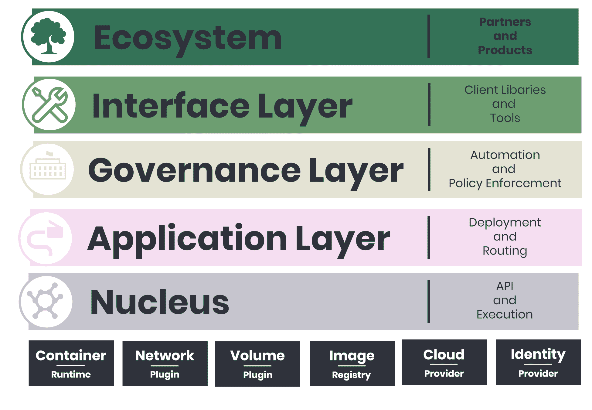

让我们从底层开始，逐一查看每个部分。

# 核心

Kubernetes 系统的核心致力于提供一个标准的 API 和操作方式，使得操作员和/或软件可以在集群上执行工作。核心是构建上层功能所需的最基本的功能集，这些功能应该被认为是绝对稳定的。这个层级的每一部分都有明确的文档，这些部分是构建更高级概念所必需的。你可以将这里的 API 视为 Kubernetes 控制平面的核心部分。

集群控制平面是 Kubernetes 核心的前半部分，它提供了 RESTful API，允许操作员执行集群中大多数基于 CRUD 的操作。需要注意的是，Kubernetes 核心，进而是集群控制平面，是在多租户的考虑下构建的，因此该层必须足够灵活，以便在单个集群内提供团队或工作负载的逻辑隔离。集群控制平面遵循 API 约定，允许其利用身份和审计等共享服务，并可以访问集群的命名空间和事件。

核心的后半部分是执行。虽然 Kubernetes 中有许多控制器，如副本控制器、复制集和部署，但 kubelet 是最重要的控制器，它构成了节点和 Pod API 的基础，允许我们与容器执行层进行交互。Kubernetes 基于 kubelet 构建了 Pod 的概念，Pod 允许我们管理多个容器及其组成存储，这是系统的核心功能。稍后我们会深入探讨 Pod。

在核心下方，我们可以看到 kubelet 依赖的各种组件，以管理容器、网络、容器存储、镜像存储、云提供商和身份。我们故意将这些描述得比较模糊，因为每个组件都有多个选项，你可以从标准和流行的实现中进行选择，或是尝试一些新兴技术。为了让你了解基础层的选项有多少，我们将在这里概述容器运行时和网络插件选项。

**容器运行时选项**：你将使用 Kubernetes 的**容器运行时接口**（**CRI**）与两种主要的容器运行时进行交互：

+   containerd

+   rkt

到目前为止，你仍然可以在 Kubernetes 上运行 Docker 容器，并且由于 containerd 是默认的运行时，它对操作员是透明的。你可以在集群中运行所有相同的`docker <action>`命令，来检查并收集关于集群的信息。

还有几种竞争性的、正在兴起的格式：

+   `cri-containerd`：[`github.com/containerd/cri-containerd`](https://github.com/containerd/cri-containerd)

+   `runv`和`clear`容器，它们是基于虚拟化的解决方案：[`github.com/hyperhq/runv`](https://github.com/hyperhq/runv) 和 [`github.com/clearcontainers/runtime`](https://github.com/clearcontainers/runtime)

+   `kata`容器，它们是`runv`和 clear 容器的结合体：[`katacontainers.io/`](https://katacontainers.io/)

+   `frakti`容器，它结合了`runv`和 Docker：[`github.com/kubernetes/frakti`](https://github.com/kubernetes/frakti)

您可以在此处阅读有关 CRI 的更多信息：[`blog.kubernetes.io/2016/12/container-runtime-interface-cri-in-kubernetes.html`](http://blog.kubernetes.io/2016/12/container-runtime-interface-cri-in-kubernetes.html)。

**网络插件**：如果您打算依赖云提供商的网络分割，或者将在单节点集群上运行，可以使用 CNI 来利用以下任何插件或简单的 Kubenet 网络实现：

+   硅青

+   Contiv

+   尾迹

+   绒布

+   Kube-router

+   多路

+   Calico

+   罗曼娜

+   编织网

# 应用层

应用层，通常称为服务组件或编排层，在 Kubernetes 中执行我们非常重视的所有有趣的事情：基本部署和路由、服务发现、负载平衡和自愈。为了集群运营商能够管理集群的生命周期，这些基本组件必须在此层中存在且功能正常。大多数容器化应用程序将依赖于此层的全部功能，并将与这些功能交互，以在多个集群主机上提供应用程序的“编排”。当应用程序扩展或更改配置设置时，应用层将由此层管理。应用层关心集群的期望状态、应用组合、服务发现、负载平衡和路由，并利用所有这些部件将数据从正确的 A 点流向正确的 B 点。

# 治理层

治理层由高级自动化和策略强制执行组成。这一层可以被视为应用管理层的有主见的版本，因为它提供了强制租户、收集度量、智能提供和容器自动扩展的能力。此层的 API 应被视为运行容器化应用程序的选项。

治理层允许运营商控制授权方法的使用，以及围绕网络和存储的配额和控制。在此层级，功能应适用于大型企业关心的场景，如运营、安全和合规性场景。

# 接口层

接口层由其他自定义 Kubernetes 分发可能使用的常用工具、系统、用户界面和库组成。`kubectl` 库是接口层的一个很好的例子，重要的是它不被视为 Kubernetes 系统中的特权部分；它被认为是一个客户端工具，以便为 Kubernetes API 提供最大的灵活性。如果运行 `$ kubectl -h`，您将清楚地了解到暴露给接口层的功能。

这一层的其他组件包括集群联合工具、仪表盘、Helm 以及 `client-node`、`KubernetesClient` 和 `python` 等客户端库。这些工具为你提供常见任务的支持，比如你不需要为身份验证编写代码等。这些库使用 Kubernetes 服务账户对集群进行身份验证。

# 生态系统

Kubernetes 系统的最后一层是生态系统，这是迄今为止最繁忙和最紧张的部分。Kubernetes 对容器编排和管理的方式是为用户提供互补选择；外部系统可以利用可用的插件和通用 API。可以将 Kubernetes 系统中的生态系统组件分为三种类型：

+   **Kubernetes 之上：** 所有“让事情运行起来”的粘合软件和基础设施都位于这一层，包括操作理念，如 ChatOps 和 DevOps、日志记录和监控、持续集成和交付、大数据系统以及函数即服务。

+   **Kubernetes 内部：** 简而言之，容器内部的内容不属于 Kubernetes。Kubernetes，或 **K8s**，完全不关心你在容器内运行什么。

+   **Kubernetes 之下：** 这些是图表底部详细描述的灰色方块。你需要为每一块基础技术配备相应的技术，才能使 Kubernetes 正常运行，生态系统就是你获得这些技术的地方。集群状态存储可能是最著名的生态系统组件之一：`etcd`。集群引导工具，如 `minikube`、`bootkube`、`kops`、`kube-aws` 和 `kubernetes-anywhere`，是其他社区提供的生态系统工具示例。

既然我们已经了解了更大的背景，现在让我们继续了解 Kubernetes 系统的架构。

# 架构

尽管容器为应用程序管理带来了有益的抽象层和工具，但 Kubernetes 提供了额外的功能，用于在大规模下调度和编排容器，同时管理完整的应用生命周期。

K8s 向上移动堆栈，提供了处理应用程序或服务级别管理的构建块。这为我们提供了自动化和工具，确保高可用性、应用程序堆栈和服务范围的可移植性。K8s 还允许更细粒度的资源使用控制，如跨基础设施的 CPU、内存和磁盘空间。

Kubernetes 架构由三个主要部分组成：

+   集群控制平面（**master**）

+   集群状态（一个名为 etcd 的分布式存储系统）

+   集群节点（运行代理程序 **kubelets** 的独立服务器）

# Master

**集群控制平面**，也称为 **Master**，根据集群的当前状态和期望状态做出全局决策，并响应在集群中传播的事件。这包括当复制控制器的复制因子不满足时启动和停止 pod，或运行计划任务。

控制平面的总体目标是报告并朝着期望的状态努力。Master 节点运行的 API 依赖于持久状态存储 `etcd`，并利用 `watch` 策略来最小化变化延迟，同时启用去中心化组件协调。

Master 的组件可以实际运行在集群中的任何机器上，但最佳实践和生产就绪的系统要求将 Master 组件放置在一台机器上（或使用多主机高可用配置）。将所有 Master 组件运行在一台机器上，可以让操作员避免在这些机器上运行用户容器，这样做能提供更可靠的控制平面操作。Master 节点上运行的组件越少，越好！

当我们深入了解 Master 节点时，会详细介绍 Master 组件，包括 `kube-apiserver`、etcd、`kube-scheduler`、`kube-controller-manager` 和 `cloud-controller-manager`。需要注意的是，Kubernetes 设计这些组件的目标是提供一个针对主要持久存储资源的 RESTful API，并采用 CRUD（创建、读取、更新、删除）策略。稍后在本章中，我们会讨论与容器特定编排和调度相关的基本原语，当我们学习服务、入口、Pod、部署、StatefulSet、CronJobs 和 ReplicaSets 时。

# 集群状态

Kubernetes 架构中的第二个主要部分是集群状态，即 `etcd` 键值存储。`etcd` 是一致的且高度可用的，旨在快速且可靠地为 Kubernetes 提供集群的当前和期望状态的访问。etcd 能通过领导选举和分布式锁等核心概念提供这种分布式数据协调。Kubernetes API 通过其 API 服务器负责更新与集群 RESTful 操作对应的 etcd 中的对象。记住这一点非常重要：API 服务器负责管理 Kubernetes 中世界的“图像”。该生态系统中的其他组件监视 etcd 的变化，以便修改自身并进入期望的状态。

这点特别重要，因为我们在 Kubernetes Master 中描述的每个组件，以及在下面节点中调查的那些组件，都是无状态的，这意味着它们的状态存储在其他地方，而那个“其他地方”就是 etcd。

Kubernetes 并不会对集群中的事情采取具体的行动；Kubernetes API 通过 API 服务器将应该实现的内容写入 etcd，然后 Kubernetes 的各个组件会将其实现。etcd 通过一个简单的 HTTP/JSON API 提供了这个接口，这使得与它的交互非常简单。

**etcd** 在考虑 Kubernetes 安全模型时也非常重要，因为它存在于 Kubernetes 系统的非常底层，这意味着任何能够向 etcd 写入数据的组件都拥有 `root` 权限访问集群。稍后，我们将探讨如何将 Kubernetes 系统划分为多个层次，以最大限度地减少这种暴露。你可以将 etcd 看作是 Kubernetes 的基础层，同时还涉及到容器运行时、镜像注册表、文件存储、云服务提供商接口以及其他 Kubernetes 管理但没有明确意见的依赖项。

在非生产环境的 Kubernetes 集群中，你会看到 etcd 的单节点实例化，这是为了节省计算成本、简化操作或减少复杂性。然而，需要特别注意的是，生产就绪集群的多主节点策略（*2n+1* 节点）是至关重要的，这样才能有效地在主节点之间复制数据并确保容错性。建议你查看 etcd 文档以获取更多信息。

查看 etcd 文档，请点击：**[`github.com/coreos/etcd/blob/master/Documentation/docs.md`](https://github.com/coreos/etcd/blob/master/Documentation/docs.md)**

如果你站在集群前，你可以通过检查 ``componentsta`tus`es`` 或 `cs` 来查看 etcd 的状态：

```
[node3 /]$ kubectl get componentstatuses
NAME                 STATUS MESSAGE          ERROR
scheduler            Healthy ok
controller-manager   Healthy ok
etcd-0               Healthy {"health": "true"}
```

由于 AKS 生态系统中的一个 bug，目前在 Azure 上无法使用。你可以在这里跟踪该问题，以查看何时解决：

[`github.com/Azure/AKS/issues/173`](https://github.com/Azure/AKS/issues/173): `kubectl get componentstatus fails for scheduler and controller-manager #173`

如果你看到一个不健康的 `etcd` 服务，它可能会像这样：

```
[node3 /]$ kubectl get cs

NAME                  STATUS       MESSAGE      ERROR
etcd-0                Unhealthy                 Get http://127.0.0.1:2379/health: dial tcp 127.0.0.1:2379: getsockopt: connection refused
controller-manager    Healthy      ok
scheduler             Healthy      ok
```

# 集群节点

第三个也是最后一个主要的 Kubernetes 组件是集群节点。虽然主节点组件仅在 Kubernetes 集群的一个子集上运行，但节点组件会在所有地方运行；它们负责管理运行中的 pod、容器和其他原语，并提供运行时环境。节点组件有三个：

+   Kubelet

+   Kube-proxy

+   容器运行时

我们稍后会详细了解这些组件的具体情况，但首先要注意几点关于节点组件的内容。kubelet 可以被看作是 Kubernetes 中的主要控制器，它提供了由容器运行时执行容器功能所使用的 pod/node API。该功能通过容器及其对应的存储卷组成 pod 的概念。Pod 的概念为应用开发者提供了一个直观的打包范式，从而设计他们的应用，并让我们最大化容器的可移植性，同时实现跨集群多个实例的调度与编排能力。

有趣的是，许多 Kubernetes 组件是运行在 Kubernetes 本身上的（换句话说，是由 kubelets 驱动的），包括 DNS、Ingress、Dashboard 以及 Heapster 的资源监控：

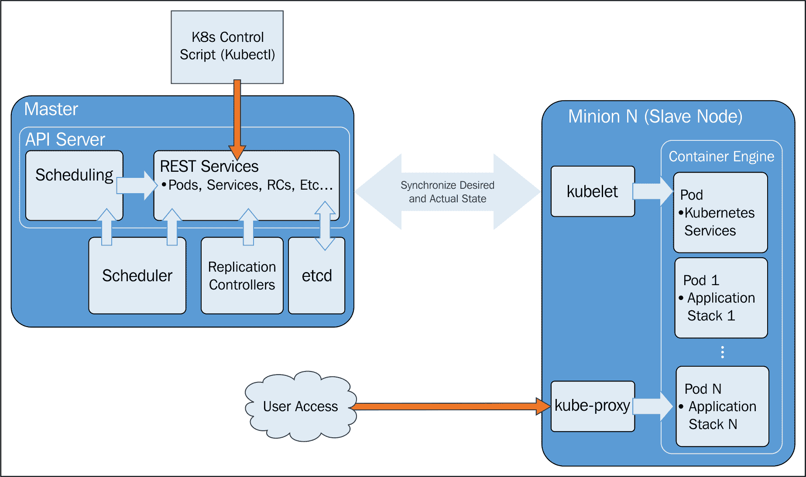

Kubernetes 核心架构

在前面的图示中，我们看到 Kubernetes 的核心架构。大多数管理交互都是通过 `kubectl` 脚本和/或对 API 的 RESTful 服务调用来完成的。

如前所述，请仔细注意期望状态与实际状态的概念。这是 Kubernetes 如何管理集群及其工作负载的关键。K8s 的所有组件始终在不断监视当前的实际状态，并与通过 API 服务器或 `kubectl` 脚本由管理员定义的期望状态进行同步。有时这些状态可能不匹配，但系统始终在努力使两者一致。

让我们更深入地探讨 Master 和节点实例。

# Master

我们现在知道 **Master** 是集群的大脑。它拥有核心 API 服务器，维护 RESTful Web 服务用于查询和定义我们期望的集群和工作负载状态。需要注意的是，控制平面仅通过 Master 节点来发起更改，而不是直接访问节点。

此外，Master 节点还包括 **调度器**。复制控制器/副本集与 API 服务器协作，确保在任何给定时刻都运行正确数量的 Pod 副本。这是期望状态概念的一个典范。如果我们的复制控制器/副本集定义了三个副本，而实际状态是只有两个 Pod 副本在运行，那么调度器会被触发，向集群中添加一个新的 Pod。同样的，如果集群中某一时刻有过多的 Pod 运行，调度器也会进行调整。通过这种方式，K8s 始终在朝着期望状态推进。

如前所述，我们将更详细地了解每个 Master 组件。`kube-apiserver` 负责为集群提供 API，作为 Master 提供的控制平面的前端。实际上，apiserver 是通过一个名为 `kubernetes` 的服务进行暴露的，我们使用 kubelet 安装 API 服务器。此服务通过 `kube-apiserver.yaml` 文件进行配置，该文件位于每个管理节点的 `/etc/kubernetes/manifests/` 目录下。

`kube-apiserver` 是 Kubernetes 高可用性的重要组成部分，因此它被设计为水平扩展。我们将在本书后面讨论如何构建高可用集群，但可以简单地说，你需要将 `kube-apiserver` 容器分布在多个 Master 节点上，并在前端提供一个负载均衡器。

由于我们已经详细讨论了集群状态存储，现在可以简单地说，`etcd` 代理正在所有 Master 节点上运行。

下一个组件是 `kube-scheduler`，它确保所有的 Pod 都被关联并分配到节点上进行操作。调度器与 API 服务器协同工作，在实际的 minion 节点上调度以 Pod 形式运行的工作负载。这些 Pod 包括构成我们应用栈的各种容器。默认情况下，基础的 Kubernetes 调度器会将 Pod 分布到集群中的不同节点，并使用不同的节点来匹配 Pod 副本。Kubernetes 还允许为每个容器指定必要的资源、硬件和软件策略约束、亲和性或反亲和性要求，以及数据卷的位置，以便调度可以根据这些附加因素进行调整。

主节点的最后两个主要部分是 `kube-controller-manager` 和 `cloud-controller-manager`。正如你从它们的名称中可以猜到的那样，虽然这两个服务都在容器编排和调度中扮演重要角色，`kube-controller-manager` 有助于编排 Kubernetes 的核心内部组件，而 `cloud-controller-manager` 则与不同的供应商及其云提供商的 API 进行交互。

`kube-controller-manager` 实际上是一个 Kubernetes 守护进程，它嵌入了 Kubernetes 的核心控制循环，也就是所谓的控制器：

+   **Node** 控制器，用于管理 Pod 的可用性并在 Pod 停止时进行管理

+   **Replication** 控制器，确保系统中每个复制控制器对象都有正确数量的 Pod

+   **Endpoints** 控制器，控制 API 中的端点记录，从而管理为支持定义选择器的服务提供 Pod 或一组 Pod 的 DNS 解析

为了减少控制器组件的复杂性，它们都被打包并通过这个单一的守护进程作为 `kube-controller-manager` 来运行。

`cloud-controller-manager` 则关注外部组件，并运行与您的集群所使用的云提供商特定的控制器循环。此设计的最初目的是将 Kubernetes 的内部开发与云供应商特定的代码解耦。这是通过使用插件来实现的，插件防止了 Kubernetes 依赖于那些与其价值主张无关的代码。我们可以预期，随着时间的推移，未来版本的 Kubernetes 将完全将供应商特定的代码从 Kubernetes 代码库中移除，且这些供应商特定的代码将由供应商自身维护，之后由 Kubernetes `cloud-controller-manager` 调用。这一设计避免了多个 Kubernetes 组件与云提供商之间的通信需求，具体包括 kubelet、Kubernetes 控制器管理器和 API 服务器。

# 节点（以前称为 minions）

在每个节点中，我们有几个已提到的组件。让我们详细看一下每个组件。

`kubelet` 与 API 服务器交互以更新状态，并启动由调度器调用的新工作负载。如前所述，这个代理会在集群的每个节点上运行。`kubelet` 的主要接口是一个或多个 PodSpecs，确保容器和配置的健康性。

`kube-proxy` 提供基本的负载均衡，并将目标服务的流量引导到后台的正确 Pod。它维护这些网络规则，以通过连接转发实现服务抽象。

节点的最后一个主要组件是容器运行时，它负责启动、运行和停止容器。Kubernetes 生态系统引入了 OCI 运行时规范，旨在让容器调度器/协调器接口变得更加开放。虽然 Docker、rkt 和 runc 是目前的主要实现，但 OCI 的目标是提供一个通用接口，让你可以使用自己的运行时。目前，Docker 是压倒性的主流运行时。

在这里阅读更多关于 OCI 运行时规范的信息：**[`github.com/opencontainers/runtime-spec`](https://github.com/opencontainers/runtime-spec)**。

在你的集群中，节点可以是虚拟机或裸金属硬件。与控制器和 Pod 等其他项相比，节点并不是 Kubernetes 创建的抽象对象。相反，Kubernetes 使用 `cloud-controller-manager` 与云提供商的 API 交互，云提供商负责节点的生命周期管理。这意味着当我们在 Kubernetes 中实例化一个节点时，我们只是创建了一个代表你给定基础设施中机器的对象。由 Kubernetes 来决定节点是否与该对象定义一致。Kubernetes 通过节点的 IP 地址来验证节点的可用性，IP 地址通过 `metadata.name` 字段收集。你可以通过以下状态键来发现这些节点的状态。

地址是我们可以找到主机名、私有和公有 IP 等信息的地方。这些信息会根据你的云提供商的实现而有所不同。`condition` 字段将提供节点状态的视图，涵盖磁盘、内存、网络和基本配置等方面。

以下是可用的节点状态条件表：

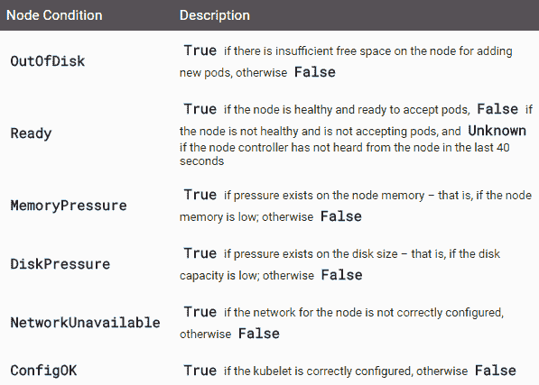

一个健康的节点如果运行，会显示类似于以下的状态，你将看到如下输出：

```
$ kubectl get nodes -o json
"conditions": [
  {
    "type": "Ready",
    "status": "True"
  }
]
```

**容量** 很简单：它指的是在给定节点上可用的 CPU、内存，以及可运行的 Pod 数量。节点自报告其容量，并将调度适当数量资源的责任交给 Kubernetes。`Info` 键也很直白，提供了 Docker、操作系统和 Kubernetes 的版本信息。

需要注意的是，Kubernetes 和节点之间关系的主要组件是**节点控制器**，我们之前提到过它是核心系统控制器之一。这个关系中有三个战略性元素：

+   **节点健康**：当您在私有、公共或混合云场景中运行大规模集群时，您不可避免地会失去一些机器。即使是在数据中心，考虑到集群足够大，您也会定期看到大规模的故障。节点控制器负责更新节点的 `NodeStatus`，将其状态设置为 `NodeReady` 或 `ConditionUnknown`，具体取决于实例的可用性。这个管理非常重要，因为如果发生 `ConditionUnknown`，Kubernetes 将需要将 pods（从而是容器）迁移到可用的节点上。您可以通过 `--node-monitor-period` 设置集群中节点的健康检查间隔。

+   **IP 分配**：每个节点需要一些 IP 地址，以便它可以将 IP 分配给服务和/或容器。

+   **节点列表**：为了在多台机器上管理 pods，我们需要保持一个最新的可用机器列表。基于前述的 `NodeStatus`，节点控制器将保持此列表的更新。

当我们研究跨**可用区**（**AZs**）的高可用集群时，将会深入了解节点控制器的具体情况，因为这需要将节点跨 AZs 分布以提供可用性。

最后，我们有一些默认的 pods，它们为节点运行各种基础设施服务。正如我们在上一章中简要探讨过的，pods 包括**域名系统**（**DNS**）、日志记录和 pod 健康检查服务。默认 pod 将与我们调度的 pods 一起在每个节点上运行。

在 v1.0 版本中，minion 被重命名为节点，但在某些机器命名脚本和网络上的文档中，仍然可以看到 minion 这个术语的痕迹。为了清晰起见，我在本书中的某些地方同时加入了 minion 和节点这两个术语。

# 核心构件

现在，让我们深入一些，探索 Kubernetes 提供的一些核心抽象。这些抽象将使我们更容易思考我们的应用程序，并减轻生命周期管理、高可用性和调度的负担。

# Pods

Pods 允许您将相关的容器在网络和硬件基础设施上保持接近。数据可以存放在应用程序附近，因此可以在不产生高延迟的情况下进行处理。同样，常用数据可以存储在多个容器共享的卷上。Pods 本质上允许您将容器和应用程序栈的各个部分进行逻辑分组。

虽然 pods 内可以运行一个或多个容器，但 pod 本身可能是 Kubernetes 节点（minion）上运行的多个 pod 之一。正如我们所看到的，pods 给我们提供了一个容器的逻辑分组，基于这些容器我们可以进行复制、调度和负载均衡服务端点。

# Pod 示例

让我们快速看一下 Pod 的实际操作。我们将在集群上启动一个 Node.js 应用程序。你需要一个正在运行的 GCE 集群；如果你还没有启动一个，请参阅*第一章*中的*我们的第一个集群*部分，*Kubernetes 简介*。

现在，让我们为我们的定义创建一个目录。在这个示例中，我将在我们主目录下的`/book-examples`子文件夹中创建一个文件夹：

```
$ mkdir book-examples
$ cd book-examples
$ mkdir 02_example
$ cd 02_example
```

你可以从你的账户中下载示例代码文件，访问[`www.packtpub.com`](http://www.packtpub.com)，这是你购买的所有 Packt Publishing 书籍的下载地址。如果你是从其他地方购买的这本书，你可以访问[`www.packtpub.com/support`](http://www.packtpub.com/support)并注册以便直接通过邮件接收文件。

使用你喜欢的编辑器创建以下文件，并命名为`nodejs-pod.yaml`：

```
apiVersion: v1 
kind: Pod 
metadata: 
  name: node-js-pod 
spec: 
  containers: 
  - name: node-js-pod 
    image: bitnami/apache:latest 
    ports: 
    - containerPort: 80
```

该文件创建了一个名为`node-js-pod`的 Pod，并在端口`80`上运行最新的`bitnami/apache`容器。我们可以使用以下命令检查这一点：

```
$ kubectl create -f nodejs-pod.yaml
pod "node-js-pod" created 
```

这将为我们提供一个运行指定容器的 Pod。我们可以通过运行以下命令查看更多关于 Pod 的信息：

```
$ kubectl describe pods/node-js-pod
```

你将看到大量信息，如 Pod 的状态、IP 地址，甚至相关的日志事件。你会注意到 Pod 的 IP 地址是私有 IP 地址，因此我们不能直接从本地机器访问它。别担心，因为`kubectl exec`命令类似于 Docker 的`exec`功能。你可以通过多种方式获取 Pod 的 IP 地址。简单的`get`命令可以显示 Pod 的 IP 地址，我们使用模板输出来查找状态输出中的 IP 地址：

`$ kubectl get pod node-js-pod --template={{.status.podIP}}`

你可以直接使用该 IP 地址，或者执行该命令并用反引号括起来，`exec`进入 Pod。一旦 Pod 显示为运行状态，我们可以使用此功能在 Pod 内部运行命令：

```
$ kubectl exec node-js-pod -- curl <private ip address>

--or--
 $ kubectl exec node-js-pod -- curl `kubectl get pod node-js-pod --template={{.status.podIP}}`
```

默认情况下，这将在它找到的第一个容器中运行命令，但你可以使用`-c`参数选择特定的容器。

运行该命令后，你应该会看到一些 HTML 代码。我们将在本章稍后的部分看到更美观的视图，但现在我们可以看到我们的 Pod 确实按预期运行。

如果你有容器使用经验，你可能也曾经执行过' exec'命令。你可以在 Kubernetes 中做类似的操作：

```
master $ kubectl exec -it node-js-pod -- /bin/bash
root@node-js-pod:/opt/bitnami/apache/htdocs# exit
master $ 
```

你也可以直接使用`exec`命令在容器中运行其他命令。请注意，如果命令的参数与`kubectl`中的参数相同，你需要使用两个破折号来分隔命令的参数：

```
$ kubectl exec node-js-pod ls / 
$ kubectl exec node-js-pod ps aux
$ kubectl exec node-js-pod -- uname -a
```

# 标签

标签为我们提供了另一层次的分类，这在日常操作和管理中非常有帮助。类似于标签，标签可以作为服务发现的基础，以及日常操作和管理任务的有用分组工具。标签附加在 Kubernetes 对象上，并且是简单的键值对。你会在 pods、复制控制器、复制集、服务等上看到它们。标签本身以及其中的键/值是基于一组受限变量的，因此可以使用优化的算法和数据结构高效地评估对它们的查询。

标签向 Kubernetes 指示应在哪些资源上进行各种操作。可以将其视为一种筛选选项。需要注意的是，标签旨在对操作员和应用程序开发人员有意义且可用，但并不意味着对集群有任何语义定义。标签用于组织和选择对象的子集，并可以在创建时添加到对象中，也可以在集群操作过程中随时修改。标签用于管理目的，例如当你想知道某个特定服务的所有后端容器时，通常可以通过与该服务对应的容器上的标签来获取它们。使用这种管理方式时，你通常会在一个对象上看到多个标签。

Kubernetes 集群管理通常是一项跨领域的操作，涉及不同资源和服务的扩展，多个存储设备和数十个节点的管理，因此是一项高度多维的操作。

标签允许 Kubernetes 对象的水平、垂直和对角封装。你经常会看到如下标签：

+   `environment: dev`, `environment: integration`, `environment: staging`, `environment: UAT`, `environment: production`

+   `tier: web`, `tier: stateless`, `tier: stateful`, `tier: protected`

+   `tenancy: org1`, `tenancy: org2`

一旦你掌握了标签，就可以使用选择器根据特定的标签组合识别一组新对象。目前有基于等式的选择器和基于集合的选择器。基于等式的选择器允许操作员按键/值对进行筛选，为了`select(or)`一个对象，它必须满足所有指定的约束。这种选择器通常用于选择特定的节点，例如可能需要与特别快速的存储一起运行。基于集合的选择器更复杂，允许操作员根据特定的值筛选键。这种选择器通常用于确定一个对象属于哪里，例如一个层次、租户区域或环境。

简而言之，一个对象可以附加多个标签，但选择器可以为对象或对象集提供唯一性。

我们将在本章后面更深入地探讨标签，但首先我们将探讨剩下的三个构造：服务、复制控制器和副本集。

# 容器的余生

正如 AWS 首席技术官 Werner Vogels 所说的，*一切都在不断地失败*；容器和 pod 可能会崩溃、损坏，或者甚至可能仅仅因为一个笨拙的管理员在某个节点上乱摸而被意外关闭。强有力的策略和安全实践，如实施最小权限，能够减少一些此类事件，但工作负载的意外终止是不可避免的，它是运维的事实之一。

幸运的是，Kubernetes 提供了两个非常有价值的构造，能够将这一严肃的事务整理得井井有条。服务和复制控制器/副本集让我们能够在几乎没有中断的情况下保持应用程序运行，并实现优雅的恢复。

# 服务

服务允许我们将访问抽象化，消费者可以通过可靠的端点访问运行在集群中的 pod，用户和其他程序可以无缝访问。这与我们 Kubernetes 的核心构造之一——pod，正好相反。

Pod 的定义是短暂的，当它们死掉时不会被复活。如果我们相信复制控制器会根据需要创建和销毁 pod，那么我们还需要另一个构造来创建逻辑上的分离和访问策略。

在这里，我们有服务，它们使用标签选择器来定位一组不断变化的 pod。服务非常重要，因为我们希望前端服务不需要关心后端服务的具体细节，反之亦然。尽管组成这些层的 pod 是可替换的，但通过 `ReplicationControllers` 管理对象之间的关系的服务，使得不同类型的应用得以解耦。

对于需要 IP 地址的应用程序，提供了**虚拟 IP**（VIP），它可以将流量以轮询方式转发到后端 pod。对于云原生应用或微服务，Kubernetes 提供了 Endpoints API，用于简化服务之间的通信。

K8s 通过确保集群中的每个节点都运行一个名为 `kube-proxy` 的代理来实现这一点。顾名思义，`kube-proxy` 的工作是将服务端点的通信代理回运行实际应用程序的对应 pod：

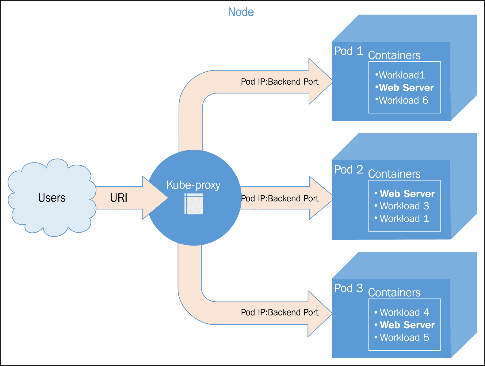

kube-proxy 架构

服务负载均衡池的成员资格由选择器和标签来决定。具有匹配标签的 pod 会被添加到候选列表中，服务将流量转发到这些 pod。虚拟 IP 地址和端口用作服务的入口点，然后流量会被转发到由 K8s 或你的定义文件所定义的目标端口上的随机 pod。

服务定义的更新会被 K8s 集群主节点监控并协调，并传播到每个节点上运行的 `kube-proxy 守护进程`。

此时，`kube-proxy` 正在节点主机上运行。未来有计划将其与 kubelet 默认容器化。

服务是一个 RESTful 对象，它依赖于通过 `POST` 事务向 apiserver 创建 Kubernetes 对象的新实例。以下是一个名为 `service-example.yaml` 的简单服务示例：

```
kind: Service
apiVersion: v1
metadata:
  name: gsw-k8s-3-service
spec:
  selector:
    app: gswk8sApp
  ports:
  - protocol: TCP
    port: 80
    targetPort: 8080
```

这会创建一个名为 `gsw-k8s-3-service` 的服务，开放目标端口 `8080`，并带有 `app:gswk8sApp` 的键值标签。虽然选择器会被控制器持续评估，但 IP 地址分配的结果（也称为集群 IP）会被发布到 `gsw-k8s-3-service` 的端点对象。`kind` 字段是必需的，`ports` 也是必需的，而 `selector` 和 `type` 是可选的。

除了之前提到的策略外，Kube-proxy 还运行其他形式的虚拟 IP 服务。我们将在后续章节中介绍三种不同的代理模式：

+   用户空间

+   Iptables

+   Ipvs

# 副本控制器和副本集

副本控制器已被弃用，推荐使用部署（Deployments），该方式配置副本集（ReplicaSets）。这种方法是一种更强大的应用复制方式，回应了容器运行社区的反馈。我们将在第四章中进一步探讨部署、作业、副本集、守护进程集和有状态集，*实现可靠的容器原生应用程序*。以下信息仅供参考。

**副本控制器**（**RCs**）顾名思义，管理一个 Pod 和其中包含的容器镜像所运行的节点数量。它们确保镜像的实例以指定的副本数运行。RCs 确保一个或多个相同的 Pod 始终处于运行状态并可为应用流量提供服务。

当你开始操作容器和 Pod 时，你需要一种方法来推出更新，扩展正在运行的副本数量（无论是扩展还是缩减），或者确保至少有一个堆栈实例始终在运行。RCs 提供了一种高级机制，确保整个应用程序和集群中的事物正常运行。RC 创建的 Pod 如果失败会被替换，终止时会被删除。即使你的应用程序中只有一个 Pod，仍然建议使用 RC。

RC 的任务仅仅是确保应用程序的期望规模。你定义想要运行的 Pod 副本数，并提供一个模板来创建新 Pod。与服务类似，我们将使用选择器和标签来定义 Pod 在 RC 中的成员资格。

Kubernetes 不要求严格的副本控制器行为，这对于长期运行的过程来说是理想的。实际上，作业控制器可用于短生命周期的工作负载，它们允许作业运行到完成状态，并非常适合批处理工作。

副本集是一个新的类型，目前处于测试版，它代表了复制控制器的改进版本。目前，主要的区别是可以使用新的基于集合的标签选择器，正如我们在以下示例中所看到的。

# 我们的第一个 Kubernetes 应用

在我们继续之前，让我们看看这三个概念如何运作。Kubernetes 随附了许多预安装的示例，但我们将从头开始创建一个新示例，以说明其中的一些概念。

我们已经创建了一个 pod 定义文件，但正如你所学到的，通过复制控制器来运行我们的 pod 有很多优点。再次使用我们之前创建的 `book-examples/02_example` 文件夹，我们将创建一些定义文件，并使用复制控制器方法启动一个 Node.js 服务器集群。此外，我们还将为它添加一个负载均衡的服务。

使用你喜欢的编辑器创建以下文件并命名为 `nodejs-controller.yaml`：

```
apiVersion: v1 
kind: ReplicationController 
metadata: 
  name: node-js 
  labels: 
    name: node-js 
spec: 
  replicas: 3 
  selector: 
    name: node-js 
  template: 
    metadata: 
      labels: 
        name: node-js 
    spec: 
      containers: 
      - name: node-js 
        image: jonbaier/node-express-info:latest 
        ports: 
        - containerPort: 80
```

这是我们集群的第一个资源定义文件，让我们仔细看看。你会注意到它有四个一级元素（`kind`，`apiVersion`，`metadata` 和 `spec`）。这些元素在所有顶级 Kubernetes 资源定义中都是常见的：

+   `Kind`：这告诉 K8s 我们正在创建的资源类型。在本例中，类型是 `ReplicationController`。`kubectl` 脚本使用一个 `create` 命令来创建所有类型的资源。这样做的好处是你可以轻松地创建多种类型的资源，而无需为每种类型单独指定参数。然而，这要求定义文件能够识别它们指定的内容。

+   `apiVersion`：这只是告诉 Kubernetes 我们使用的是哪个版本的 schema。

+   `Metadata`：在这里，我们将为资源指定一个名称，并指定标签，这些标签将在给定操作中用于搜索和选择资源。metadata 元素还允许你创建注解，这些注解用于非标识信息，可能对客户端工具和库有用。

+   最后，我们有 `spec`，它将根据我们创建的资源的 `kind` 或 `type` 而有所不同。在本例中，它是 `ReplicationController`，确保所需数量的 pods 正在运行。`replicas` 元素定义了所需的 pod 数量，`selector` 元素告诉控制器需要监视哪些 pod，最后，`template` 元素定义了启动新 pod 的模板。`template` 部分包含我们之前在 pod 定义中看到的相同部分。一个需要注意的重要事项是，`selector` 的值需要与 pod 模板中指定的 `labels` 值匹配。请记住，这种匹配用于选择被管理的 pod。

现在，让我们看一下名为 `nodejs-rc-service.yaml` 的服务定义：

```
apiVersion: v1 
kind: Service 
metadata: 
  name: node-js 
  labels: 
    name: node-js 
spec: 
  type: LoadBalancer 
  ports: 
  - port: 80 
  selector: 
    name: node-js
```

如果你正在使用 Google Cloud Platform 的免费试用版，你可能会遇到 `LoadBalancer` 类型服务的问题。此类型会创建一个外部 IP 地址，但试用账户只允许一个静态地址。

对于这个例子，你无法通过 Minikube 使用外部 IP 地址访问该示例。在 Kubernetes 1.5 以上版本中，你可以使用 Ingress 来公开服务，但这超出了本章的范围。

这里的 YAML 文件类似于 `ReplicationController`。主要区别在于服务的 `spec` 元素。在这里，我们定义了 `Service` 类型、监听的 `port` 和 `selector`，这些告诉 `Service` 代理哪些 pod 可以响应服务。

Kubernetes 支持 YAML 和 JSON 格式的定义文件。

创建 Node.js express 复制控制器：

```
$ kubectl create -f nodejs-controller.yaml
```

输出如下：

```
replicationcontroller "node-js" created
```

这为我们提供了一个复制控制器，确保始终运行三个容器副本：

```
$ kubectl create -f nodejs-rc-service.yaml
```

输出如下：

```
service "node-js" created 
```

在 GCE 上，这将创建一个外部负载均衡器和转发规则，但你可能需要添加额外的防火墙规则。在我的情况下，防火墙已经为端口 `80` 开放。然而，你可能需要打开这个端口，特别是当你部署的是一个包含非 `80` 和 `443` 端口的服务时。

好的，现在我们有了一个正在运行的服务，这意味着我们可以通过一个可靠的 URL 访问 Node.js 服务器。让我们来看一下我们正在运行的服务：

```
$ kubectl get services
```

以下截图是执行上述命令后的结果：

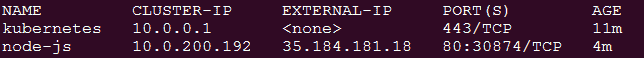

服务列表

在前面的截图（服务列表）中，我们应该注意到 `node-js` 服务正在运行，在 `IP(S)` 列中，我们应该同时看到一个私有 IP 和一个公共 IP（截图中的 `130.211.186.84`）。如果你没有看到外部 IP，可能需要等一分钟，让 GCE 分配 IP。我们来试试通过浏览器打开公共地址看看是否能够连接：

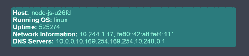

容器信息应用

你应该看到类似于前面截图的内容。如果我们访问多次，你应该注意到容器名称会发生变化。本质上，服务负载均衡器正在后台的可用 pod 之间进行轮换。

浏览器通常会缓存网页，所以要真正看到容器名称的变化，你可能需要清除缓存，或者使用像这样的代理：[`hide.me/en/proxy`](https://hide.me/en/proxy)。

让我们来试试玩一下混乱猴子（chaos monkey），杀掉一些容器，看看 Kubernetes 会做什么。为了实现这一点，我们需要查看 pod 实际运行的位置。首先，让我们列出我们的 pods：

```
$ kubectl get pods
```

以下截图是执行上述命令后的结果：

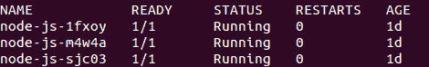

当前运行的 pods

现在，让我们获取运行 `node-js` 容器的一个 pod 的更多详细信息。你可以通过 `describe` 命令和上一条命令中列出的 pod 名称来执行此操作：

```
$ kubectl describe pod/node-js-sjc03
```

以下截图是执行上述命令的结果：

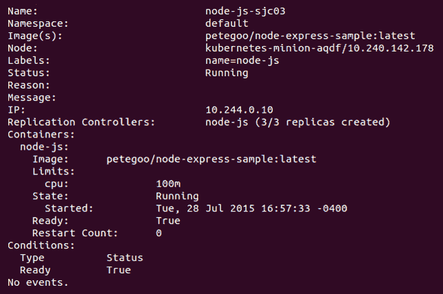

Pod 描述

你应该看到前述输出。我们需要的信息是 `Node:` 部分。让我们使用节点名称通过 **SSH**（即 **Secure Shell** 的缩写）登录到运行此工作负载的节点（从节点）：

```
$ gcloud compute --project "<Your project ID>" ssh --zone "<your gce zone>" "<Node from
pod describe>"
```

一旦通过 SSH 登录到节点，如果我们运行 `sudo docker ps` 命令，我们应该能看到至少两个容器：一个运行 `pause` 镜像，另一个运行实际的 `node-express-info` 镜像。如果 K8s 在这个节点上调度了多个副本，你可能会看到更多容器。让我们获取 `jonbaier/node-express-info` 镜像（而非 `gcr.io/google_containers/pause`）的容器 ID，并杀死它，看看会发生什么。将这个容器 ID 保存起来，稍后使用：

```
$ sudo docker ps --filter="name=node-js"
$ sudo docker stop <node-express container id>
$ sudo docker rm <container id>
$ sudo docker ps --filter="name=node-js"
```

除非你非常迅速，否则你可能会注意到 `node-express-info` 容器仍在运行，但仔细观察会发现 `container id` 不同，并且创建时间戳显示仅仅是几秒钟前。如果你回到服务 URL，它仍然按正常方式运行。现在可以退出 SSH 会话了。

在这里，我们已经看到 Kubernetes 扮演了值班运维的角色，确保我们的应用始终在运行。

让我们看看能否找到停机的证据。进入 Kubernetes UI 的事件页面。你可以通过主 K8s 仪表板的节点页面找到它。选择列表中的一个节点（即我们通过 SSH 登录的节点），然后滚动到该节点详情页面中的事件部分。

你会看到一个类似以下截图的画面：

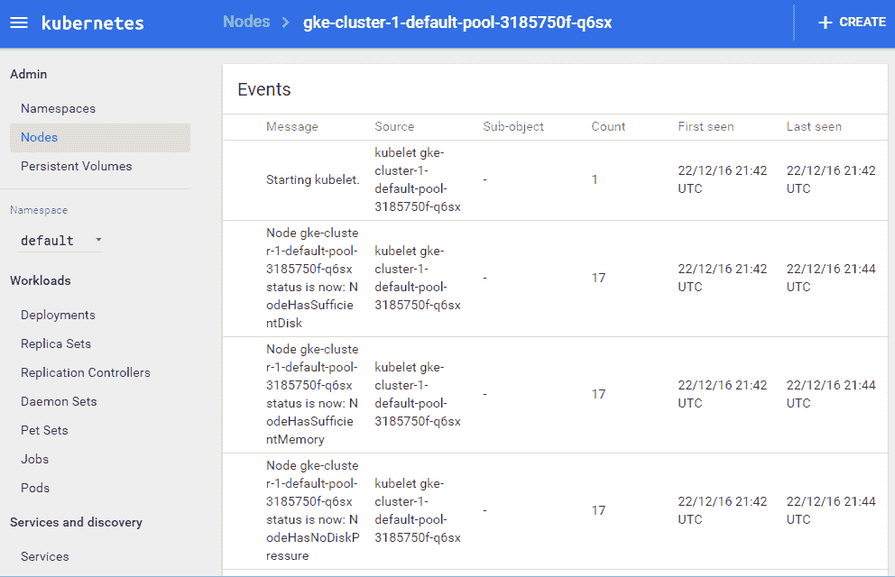

Kubernetes UI 事件页面

你应该看到三个最近的事件。首先，Kubernetes 拉取镜像。其次，它使用拉取的镜像创建一个新容器。最后，它重新启动该容器。你会注意到，从时间戳来看，这一切都在不到一秒钟内完成。所需时间可能会根据集群大小和镜像拉取情况有所不同，但恢复速度非常快。

# 更多关于标签的内容

如前所述，标签只是简单的键值对。它们可用于 Pod、复制控制器、副本集、服务等。如果你回想一下我们的服务 YAML `nodejs-rc-service.yaml`，里面有一个 `selector` 属性。`selector` 属性告诉 Kubernetes 使用哪些标签来找到要为该服务转发流量的 Pods。

K8s 允许用户直接在复制控制器、副本集和服务上操作标签。让我们修改我们的副本和服务，添加一些标签。再次使用你喜欢的编辑器创建这两个文件，并命名为 `nodejs-labels-controller.yaml` 和 `nodejs-labels-service.yaml`，如下面所示：

```
apiVersion: v1 
kind: ReplicationController 
metadata: 
  name: node-js-labels 
  labels: 
    name: node-js-labels 
    app: node-js-express 
    deployment: test 
spec: 
  replicas: 3 
  selector: 
    name: node-js-labels 
    app: node-js-express 
    deployment: test 
  template: 
    metadata: 
      labels: 
        name: node-js-labels 
        app: node-js-express 
        deployment: test 
    spec: 
      containers: 
      - name: node-js-labels 
        image: jonbaier/node-express-info:latest 
        ports: 
        - containerPort: 80
```

```
apiVersion: v1 
kind: Service 
metadata: 
  name: node-js-labels 
  labels: 
    name: node-js-labels 
    app: node-js-express 
    deployment: test 
spec: 
  type: LoadBalancer 
  ports: 
  - port: 80 
  selector: 
    name: node-js-labels 
    app: node-js-express 
    deployment: test
```

按如下方式创建复制控制器和服务：

```
$ kubectl create -f nodejs-labels-controller.yaml
$ kubectl create -f nodejs-labels-service.yaml
```

让我们看看如何在日常管理中使用标签。下表展示了我们选择标签的选项：

| **运算符** | **描述** | **示例** |
| --- | --- | --- |
| `=` 或 `==` | 可以使用这两种样式来选择值等于右侧字符串的键 | `name = apache` |
| `!=` | 选择值与右侧字符串不相等的键 | `Environment != test` |
| `in` | 选择标签键值在该集合中的资源 | `tier in (web, app)` |
| `notin` | 选择标签键值不在该集合中的资源 | `tier notin (lb, app)` |
| `<Key name>` | 仅使用键名选择包含此键的资源 | `tier` |

标签选择器

我们来尝试查找带有 `test` 部署的副本：

```
$ kubectl get rc -l deployment=test
```

以下截图是前面命令的结果：

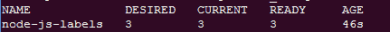

复制控制器列表

你会注意到，它只返回了我们刚才启动的复制控制器。那么带有名为 `component` 标签的服务呢？使用以下命令：

```
$ kubectl get services -l component
```

以下截图是前面命令的结果：

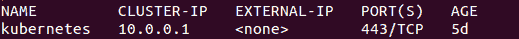

列出带有名为 component 标签的服务

在这里，我们只看到了核心的 Kubernetes 服务。最后，让我们获取一下我们在本章中启动的 `node-js` 服务器。请看以下命令：

```
$ kubectl get services -l "name in (node-js,node-js-labels)"
```

以下截图是前面命令的结果：

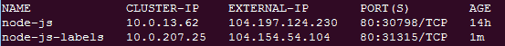

列出带有标签名称和值为 node-js 或 node-js-labels 的服务

此外，我们还可以在多个 pod 和服务中执行管理任务。例如，我们可以终止所有属于 `demo` 部署的复制控制器（如果我们有任何正在运行的），如下所示：

```
$ kubectl delete rc -l deployment=demo
```

否则，终止所有属于 `production` 或 `test` 部署的服务（如果我们有任何正在运行的服务），如下所示：

```
$ kubectl delete service -l "deployment in (test, production)"
```

需要注意的是，虽然标签选择在日常管理任务中非常有用，但它确实需要我们在部署中保持良好的规范。我们需要确保我们有一个标签标准，并且在我们运行的所有 Kubernetes 资源定义文件中都严格遵循该标准。

虽然我们迄今为止使用了服务定义的 YAML 文件来创建服务，但实际上，你也可以仅使用 `kubectl` 命令来创建它们。要尝试这个，首先运行 `get pods` 命令并获取一个 `node-js` pod 的名称。接下来，使用以下 `expose` 命令为该 pod 创建一个服务端点：

`$ kubectl expose pods node-js-gxkix --port=80 --name=testing-vip --type=LoadBalancer` 这将创建一个名为 `testing-vip` 的服务，并且还会创建一个公共 `vip`（负载均衡器 IP），可以通过端口 `80` 访问该 pod。还可以使用许多其他可选参数，相关信息可以通过以下命令查看：**`kubectl expose --help`**。

# 副本集

如前所述，副本集是复制控制器的新改进版。以下是它们功能的基本示例，我们将在第四章中进一步扩展，*实现可靠的容器原生应用程序*，并介绍高级概念。

这是一个基于并且类似于`ReplicationController`的`ReplicaSet`示例。将此文件命名为`nodejs-labels-replicaset.yaml`：

```
apiVersion: extensions/v1beta1 
kind: ReplicaSet 
metadata: 
  name: node-js-rs 
spec: 
  replicas: 3 
  selector: 
    matchLabels: 
      app: node-js-express 
      deployment: test 
    matchExpressions: 
      - {key: name, operator: In, values: [node-js-rs]} 
  template: 
    metadata: 
      labels: 
        name: node-js-rs 
        app: node-js-express 
        deployment: test 
    spec: 
      containers: 
      - name: node-js-rs 
        image: jonbaier/node-express-info:latest 
        ports: 
        - containerPort: 80
```

# 健康检查

Kubernetes 提供了三层健康检查。首先，通过 HTTP 或 TCP 检查，K8s 可以尝试连接到特定端点，并在成功连接时返回健康状态。其次，可以使用命令行脚本执行应用程序特定的健康检查。我们还可以使用`exec`容器在容器内运行健康检查。任何以`0`状态退出的都将被认为是健康的。

让我们来看看一些健康检查的实际操作。首先，我们将创建一个名为`nodejs-health-controller.yaml`的新控制器，并进行健康检查：

```
apiVersion: v1 
kind: ReplicationController 
metadata: 
  name: node-js 
  labels: 
    name: node-js 
spec: 
  replicas: 3 
  selector: 
    name: node-js 
  template: 
    metadata: 
      labels: 
        name: node-js 
    spec: 
      containers: 
      - name: node-js 
        image: jonbaier/node-express-info:latest 
        ports: 
        - containerPort: 80 
        livenessProbe: 
          # An HTTP health check  
          httpGet: 
            path: /status/ 
            port: 80 
          initialDelaySeconds: 30 
          timeoutSeconds: 1
```

注意添加了`livenessprobe`元素。这是我们的核心健康检查元素。在这里，我们可以指定`httpGet`、`tcpSocket`或`exec`。在此示例中，我们使用`httpGet`对容器上的 URI 进行简单检查。如果路径和端口未能成功返回，探测器将重新启动 pod。

状态码在`200`到`399`之间的都被探测器认为是健康的。

最后，`initialDelaySeconds`为我们提供了灵活性，允许我们延迟健康检查，直到 pod 完成初始化。`timeoutSeconds`值则是探测器的超时时间。

让我们使用我们新启用健康检查的控制器来替换旧的`node-js` RC。我们可以使用`replace`命令来完成此操作，它将替换复制控制器的定义：

```
$ kubectl replace -f nodejs-health-controller.yaml
```

单独替换 RC 并不会替换我们的容器，因为它仍然拥有来自第一次运行的三个健康的 pod。让我们杀掉这些 pod，并让更新后的`ReplicationController`使用健康检查替换它们：

```
$ kubectl delete pods -l name=node-js
```

现在，等待一两分钟后，我们可以列出 RC 中的 pod，并抓取其中一个 pod 的 ID，通过`describe`命令对其进行更深入的检查：

```
$ kubectl describe rc/node-js
```

以下截图是前述命令的结果：

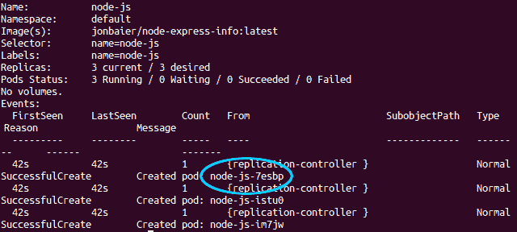

node-js 复制控制器描述

现在，使用以下命令查看其中一个 pod：

```
$ kubectl describe pods/node-js-7esbp
```

以下截图是前述命令的结果：

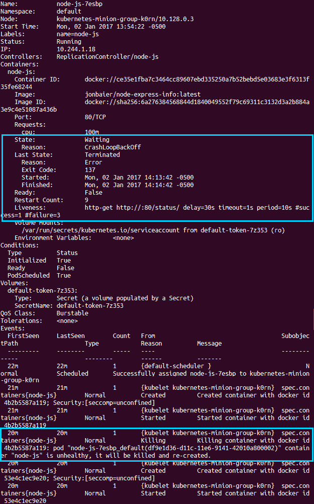

node-js-1m3cs pod 描述

在顶部，我们将看到整体的 pod 详细信息。根据你的时机，在`State`下，它将显示为`Running`或`Waiting`，并带有`CrashLoopBackOff`的原因和一些错误信息。稍微向下，你可以看到我们的`Liveness`探针的信息，可能会看到失败计数大于`0`。再往下，我们可以看到 pod 事件。再次根据时机，你很可能会看到该 pod 的多个事件。在一两分钟内，你会注意到杀死、启动和创建事件会重复出现。你还应该在`Killing`条目中看到容器不健康的说明。这是因为我们的健康检查失败，因为我们没有在`/status`处有页面响应。

你可能会注意到，如果你打开浏览器访问服务的负载均衡器地址，它仍然会响应一个页面。你可以通过`kubectl get services`命令找到负载均衡器的 IP 地址。

这有多种原因。首先，健康检查失败是因为`/status`不存在，但指向该服务的页面在重启之间仍然正常工作。其次，`livenessProbe`仅负责在健康检查失败时重启容器。还有一个单独的`readinessProbe`，它会将容器从回答服务端点的 pod 池中移除。

让我们修改健康检查，以检查容器中确实存在的页面，这样我们就能进行适当的健康检查。我们还会添加一个就绪检查，并将其指向不存在的状态页面。打开`nodejs-health-controller.yaml`文件，并修改`spec`部分，使其与以下内容匹配，然后将文件保存为`nodejs-health-controller-2.yaml`：

```
apiVersion: v1 
kind: ReplicationController 
metadata: 
  name: node-js 
  labels: 
    name: node-js 
spec: 
  replicas: 3 
  selector: 
    name: node-js 
  template: 
    metadata: 
      labels: 
        name: node-js 
    spec: 
      containers: 
      - name: node-js 
        image: jonbaier/node-express-info:latest 
        ports: 
        - containerPort: 80 
        livenessProbe: 
          # An HTTP health check  
          httpGet: 
            path: / 
            port: 80 
          initialDelaySeconds: 30 
          timeoutSeconds: 1 
        readinessProbe: 
          # An HTTP health check  
          httpGet: 
            path: /status/ 
            port: 80 
          initialDelaySeconds: 30 
          timeoutSeconds: 1
```

这次，我们将删除旧的 RC，它会连带杀死 pod，并使用更新的 YAML 文件创建新的 RC：

```
$ kubectl delete rc -l name=node-js-health
$ kubectl create -f nodejs-health-controller-2.yaml
```

现在，当我们描述某个 pod 时，我们只会看到 pod 和容器的创建情况。然而，你会注意到服务的负载均衡器 IP 地址不再工作。如果我们在其中一个新节点上运行`describe`命令，我们会看到`Readiness probe failed`的错误信息，但 pod 本身仍在运行。如果我们将就绪探针路径改为`path: /`，我们将能够再次从主服务中处理请求。现在，打开`nodejs-health-controller-2.yaml`文件，进行更新。然后，再次删除并重新创建复制控制器：

```
$ kubectl delete rc -l name=node-js
$ kubectl create -f nodejs-health-controller-2.yaml
```

现在负载均衡器的 IP 应该再次工作。保持这些 pod，因为我们将在第三章中再次使用它们，*网络、负载均衡器和 Ingress*。

# TCP 检查

Kubernetes 也支持通过简单的 TCP 套接字检查进行健康检查，也可以使用自定义的命令行脚本。

以下代码片段是两种用例在 YAML 文件中的示例。

使用命令行脚本进行健康检查：

```
livenessProbe: 
  exec: 
    command: 
    -/usr/bin/health/checkHttpServce.sh 
  initialDelaySeconds:90 
  timeoutSeconds: 1
```

使用简单的 TCP 套接字连接进行健康检查：

```
livenessProbe: 
  tcpSocket: 
    port: 80 
  initialDelaySeconds: 15 
  timeoutSeconds: 1
```

# 生命周期钩子或优雅关闭

当你在实际场景中遇到故障时，你可能会发现你希望在容器关闭之前或启动之后采取额外的操作。Kubernetes 实际上为这种用例提供了生命周期钩子。

以下示例控制器定义文件 `apache-hooks-controller.yaml`，定义了在 Kubernetes 将容器移入生命周期的下一个阶段之前，执行 `postStart` 和 `preStop` 动作：

```
apiVersion: v1 
kind: ReplicationController 
metadata: 
  name: apache-hook 
  labels: 
    name: apache-hook 
spec: 
  replicas: 3 
  selector: 
    name: apache-hook 
  template: 
    metadata: 
      labels: 
        name: apache-hook 
    spec: 
      containers: 
      - name: apache-hook 
        image: bitnami/apache:latest 
        ports: 
        - containerPort: 80 
        lifecycle: 
          postStart: 
            httpGet: 
              path: http://my.registration-server.com/register/ 
              port: 80 
          preStop: 
            exec: 
              command: ["/usr/local/bin/apachectl","-k","graceful-
              stop"]
```

你会注意到，对于 `postStart` 钩子，我们定义了一个 `httpGet` 动作，而对于 `preStop` 钩子，我们定义了一个 `exec` 动作。就像我们的健康检查一样，`httpGet` 动作尝试对特定的端点和端口组合进行 HTTP 调用，而 `exec` 动作则在容器内运行本地命令。

`httpGet` 和 `exec` 动作都支持 `postStart` 和 `preStop` 钩子。在 `preStop` 的情况下，名为 `reason` 的参数将作为参数发送到处理程序。请参阅下表，了解有效值：

| **原因参数** | **失败描述** |
| --- | --- |
| 删除 | 通过 `kubectl` 或 API 发出的删除命令 |
| 健康 | 健康检查失败 |
| 依赖性 | 依赖失败，如磁盘挂载失败或默认基础设施 Pod 崩溃 |

有效的 preStop 原因

查看这里的参考部分：[`github.com/kubernetes/kubernetes/blob/release-1.0/docs/user-guide/container-environment.md#container-hooks`](https://github.com/kubernetes/kubernetes/blob/release-1.0/docs/user-guide/container-environment.md#container-hooks)。

需要注意的是，钩子调用至少会执行一次。因此，动作中的任何逻辑都应优雅地处理多次调用。另一个重要的注意事项是，`postStart` 在 Pod 进入准备就绪状态之前执行。如果钩子本身失败，Pod 会被视为不健康。

# 应用调度

现在我们已经理解了如何在 Pods 中运行容器，甚至在故障发生时进行恢复，那么了解新容器是如何在我们的集群节点上调度的也许会很有用。

如前所述，Kubernetes 调度器的默认行为是将容器副本分布在集群中的各个节点上。在没有其他约束的情况下，调度器会将新的 Pod 安排到节点上，这些节点上其他 Pod 的数量最少，并且这些 Pod 属于匹配的服务或复制控制器。

此外，调度器还提供了根据节点可用资源添加约束的功能。今天，这些约束包括最小的 CPU 和内存分配。在 Docker 中，这些通过 CPU-shares 和内存限制标志在后台进行处理。

当定义了额外的约束时，Kubernetes 会检查节点是否有可用资源。如果节点不满足所有约束，它将移到下一个节点。如果没有节点满足条件，则我们将在日志中看到调度错误。

Kubernetes 的路线图中还计划支持网络和存储。由于调度是容器整体操作和管理中的一个重要环节，随着项目的发展，我们应当预期在这一领域会有许多新增功能。

# 调度示例

让我们快速看一个设置资源限制的示例。如果我们查看 K8s 仪表板，可以使用 `https://<your master ip>/api/v1/proxy/namespaces/kube-system/services/kubernetes-dashboard` 获取集群当前资源使用情况的快照，并点击左侧菜单中的 Nodes。

我们将看到一个仪表板，如下图所示：

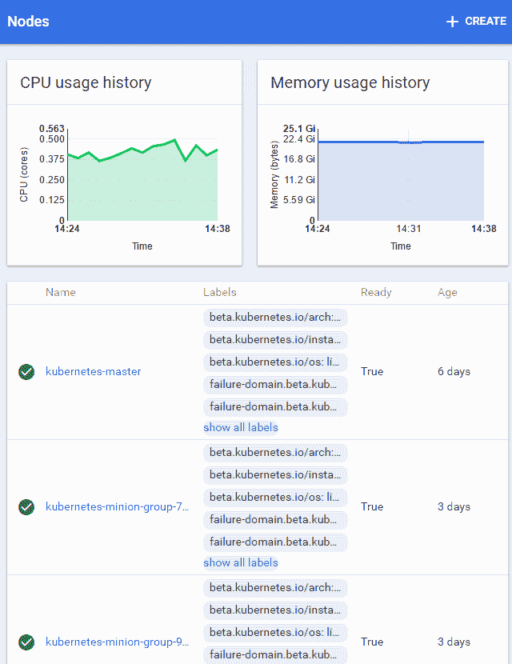

Kube 节点仪表板

该视图显示了整个集群、节点和主节点的 CPU 和内存总量。在这种情况下，我们的 CPU 使用率较低，但内存使用量较大。

让我们看看当我尝试启动更多 pod 时会发生什么，不过这次我们请求 `512 Mi` 内存和 `1500 m` CPU。我们使用 `1500 m` 来指定 1.5 个 CPU；由于每个节点只有 1 个 CPU，这应该会导致失败。以下是 RC 定义的示例。请将此文件保存为 `nodejs-constraints-controller.yaml`：

```
apiVersion: v1 
kind: ReplicationController 
metadata: 
  name: node-js-constraints 
  labels: 
    name: node-js-constraints 
spec: 
  replicas: 3 
  selector: 
    name: node-js-constraints 
  template: 
    metadata: 
      labels: 
        name: node-js-constraints 
    spec: 
      containers: 
      - name: node-js-constraints 
        image: jonbaier/node-express-info:latest 
        ports: 
        - containerPort: 80 
        resources: 
          limits: 
            memory: "512Mi" 
            cpu: "1500m"
```

要打开前述文件，请使用以下命令：

```
$ kubectl create -f nodejs-constraints-controller.yaml
```

复制控制器成功完成，但如果我们运行 `get pods` 命令，我们会发现 `node-js-constraints` 的 pod 卡在了待定状态。如果我们使用 `describe pods/<pod-id>` 命令仔细查看，会发现调度错误（对于 `pod-id`，请使用第一个命令中的 pod 名称之一）：

```
$ kubectl get pods
$ kubectl describe pods/<pod-id>
```

以下截图显示了前面命令的结果：

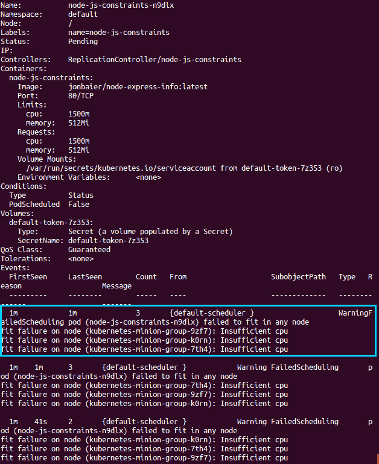

Pod 描述

请注意，在底部的事件部分，`Events` 中列出的 `WarningFailedScheduling pod` 错误后面会伴随有 `fit failure on node....Insufficient cpu` 错误。正如你所见，Kubernetes 没能在集群中找到一个符合我们定义的所有约束的匹配位置。

如果我们现在将 CPU 限制修改为 `500 m`，然后重新创建复制控制器，我们应该会在几秒钟内看到所有三个 pod 启动。

# 总结

我们已经了解了 Kubernetes 的整体架构，以及用于构建服务和应用堆栈的核心构件。你应该对这些抽象如何简化堆栈和/或服务的生命周期管理有了更深入的理解，而不仅仅是单个组件的管理。此外，我们还亲自了解了如何通过 pod、服务和复制控制器管理一些简单的日常任务。我们还看了如何通过健康检查使用 Kubernetes 自动响应故障。最后，我们探讨了 Kubernetes 调度器以及用户可以指定的一些约束条件来影响调度位置。

在下一章中，我们将深入探讨 Kubernetes 的网络层。我们将了解网络是如何实现的，并且也会研究用于流量路由的核心 Kubernetes 代理。我们还将讨论服务发现和逻辑命名空间分组。

# 问题

1.  健康检查的三种类型是什么？

1.  复制控制器的替代技术是什么？

1.  请列出 Kubernetes 系统的五个层级

1.  请列出 Kubernetes 的两个网络插件

1.  Kubernetes 可用的两种容器运行时选项是什么？

1.  Kubernetes 架构的三个主要组件是什么？

1.  哪种类型的选择器根据特定值过滤键和值？

# 进一步阅读

+   查看《DevOps 与 Kubernetes》：[`www.packtpub.com/virtualization-and-cloud/devops-kubernetes`](https://www.packtpub.com/virtualization-and-cloud/devops-kubernetes)

+   精通 Kubernetes：[`www.packtpub.com/virtualization-and-cloud/mastering-kubernetes`](https://www.packtpub.com/virtualization-and-cloud/mastering-kubernetes)

+   有关标签的更多信息：[`kubernetes.io/docs/concepts/overview/working-with-objects/labels/`](https://kubernetes.io/docs/concepts/overview/working-with-objects/labels/)

+   有关复制控制器的更多信息：[`kubernetes.io/docs/concepts/workloads/controllers/replicationcontroller/`](https://kubernetes.io/docs/concepts/workloads/controllers/replicationcontroller/)
