# 第三章：使用网络、负载均衡器和入口

在本章中，我们将讨论 Kubernetes 对集群网络的方法以及与其他方法的不同之处。我们将描述 Kubernetes 网络解决方案的关键要求，并探讨为简化集群操作而至关重要的原因。我们将深入探讨 Kubernetes 集群中的 DNS，深入研究**容器网络接口**（**CNI**）和插件生态系统，并深入了解服务以及 Kubernetes 代理在每个节点上的工作原理。最后，我们将简要概述一些用于多租户高级隔离功能的特性。

在本章中，我们将涵盖以下主题：

+   Kubernetes 网络

+   高级服务概念

+   服务发现

+   DNS、CNI 和入口

+   命名空间限制和配额

# 技术要求

您需要一个运行中的 Kubernetes 集群，就像我们在前几章创建的那个一样。您还需要通过`kubectl`命令访问部署该集群。

此章节的 GitHub 代码库可以在[`github.com/PacktPublishing/Getting-Started-with-Kubernetes-third-edition/tree/master/Code-files/Chapter03`](https://github.com/PacktPublishing/Getting-Started-with-Kubernetes-third-edition/tree/master/Code-files/Chapter03)找到。

# 容器网络

在生产级运营中，网络是一个重要关注点。在服务级别上，我们需要一种可靠的方式让我们的应用组件找到并与彼此通信。引入容器和集群使事情变得更加复杂，因为现在我们必须考虑多个网络命名空间。现在，通信和发现变成了一个必须要处理容器 IP 空间、主机网络甚至有时多个数据中心网络拓扑的技能。

Kubernetes 受益于过去十年 Google 使用的集群工具的传承。在全球最大的网络之一中，网络是 Google 超越竞争对手的一个领域。此前，Google 构建了自己的硬件交换机和**软件定义网络**（**SDN**），以提供更多控制、冗余和效率，用于日常网络操作。从每周运行和联网 20 亿个容器中获得的许多经验教训已经融入 Kubernetes，并影响了 K8s 网络的实施方式。

# Docker 的方法

为了理解 K8s 网络模型背后的动机，让我们回顾一下 Docker 对容器网络的方法。

# Docker 默认网络

以下是 Docker 的一些默认网络：

+   **桥接网络**：在非 Swarm 场景下，Docker 将使用桥接网络驱动程序（称为`bridge`）来允许独立的容器相互通信。你可以将桥接视为一个链路层设备，它在不同网络段之间转发网络流量。如果容器连接到同一桥接网络，它们可以相互通信；如果没有连接，它们则无法通信。除非另有指定，桥接网络是默认选择。在这种模式下，容器有自己的网络命名空间，然后通过虚拟接口与主机（或 K8s 中的节点）网络相连接。在桥接网络中，由于容器之间完全隔离，两个容器可以使用相同的 IP 地址范围。因此，服务通信需要通过主机侧的网络接口进行额外的端口映射。

+   **主机模式**：Docker 还为独立容器提供基于主机的网络，这会创建一个名为`docker0`的虚拟桥接，分配私有 IP 地址空间给使用该桥接的容器。每个容器都会获得一个虚拟以太网（`veth`）设备，你可以在容器内看到它作为`eth0`。由于移除了一个网络虚拟化层，性能得到了显著提升；然而，你失去了拥有独立网络命名空间的安全性。此外，由于所有容器共享一个 IP 地址，端口使用必须更加小心管理。

还有一种 none 网络，它会创建一个没有外部接口的容器。如果你检查网络接口，只会看到一个`loopback`设备。

在所有这些场景中，我们仍然处于单个机器上，除非是主机模式，否则容器的 IP 空间无法在该机器外部访问。要在两台机器之间连接容器，则需要 NAT 和端口映射来进行通信。

# Docker 用户定义的网络

为了解决跨机器通信问题并提供更大的灵活性，Docker 还通过网络插件支持用户定义的网络。这些网络独立于容器本身存在。通过这种方式，容器可以加入到同一个现有的网络中。通过新的插件架构，可以为不同的网络使用场景提供多种驱动程序，如下所示：

+   **Swarm 模式**：在 Swarm 集群环境下，默认行为是覆盖网络，它允许你连接在多个机器上运行的多个 Docker 守护进程。为了在多个主机之间进行协调，所有容器和守护进程必须对可用的网络及其拓扑达成一致。覆盖网络引入了大量复杂性，包括 Kubernetes 避免的动态端口映射。

你可以在这里阅读更多关于覆盖网络的信息：[`docs.docker.com/network/overlay/`](https://docs.docker.com/network/overlay/)。

+   **Macvlan**：Docker 还提供 macvlan 地址分配，它与 Kubernetes 提供的网络模型最为相似，因为它为每个 Docker 容器分配一个 MAC 地址，使其看起来像是网络上的一个物理设备。Macvlan 提供了更高效的网络虚拟化和隔离，因为它绕过了 Linux 桥接。需要注意的是，截至本书出版时，大多数云服务提供商不支持 Macvlan。

由于这些选项，Docker 必须在每台主机的基础上管理复杂的端口分配，并且必须维护这些信息，并将其传播到集群中的其他所有机器。Docker 使用 gossip 协议来管理端口的转发和代理。

# Kubernetes 的方法

Kubernetes 的网络方法与 Docker 的不同，让我们来看看具体有哪些差异。我们可以通过考虑集群调度和编排中的四个主要主题来了解 Kubernetes：

+   通过为 Pod 提供 IP 地址空间，而非为容器提供，从而解耦容器间通信

+   Pod 与 Pod 之间的通信以及服务作为 Kubernetes 网络模型中主要的通信范式

+   Pod 与服务之间以及外部与服务之间的通信，通过 `services` 对象提供

这些考虑因素是 Kubernetes 网络模型的一种有意义的简化，因为无需跟踪动态端口映射。同样，IP 地址分配是在 Pod 级别进行的，这意味着 Kubernetes 的网络通信要求每个 Pod 都有自己的 IP 地址。这意味着一个 Pod 中的所有容器共享该 IP 地址，并且被认为在同一个网络命名空间中。我们将在本章稍后讨论内部和外部服务时，探讨如何管理这一共享的 IP 资源。Kubernetes 通过不允许容器间或容器与节点（minion）间使用 **网络地址转换**（**NAT**）来促进 Pod 与 Pod 之间的通信。此外，内部容器的 IP 地址必须与用于与其通信的 IP 地址匹配。这强调了 Kubernetes 的假设：所有 Pod 都能与所有其他 Pod 进行通信，无论它们落在哪个主机上，这种通信随后为 Pod 内部提供了一个本地 IP 地址空间，从而为容器提供了网络连接。所有在同一主机中的容器可以通过本地主机在其保留端口上相互通信。这种没有 NAT 的扁平 IP 空间简化了当你开始扩展到数千个 Pod 时的网络变更。

这些规则将大部分复杂性从我们的网络堆栈中剔除，并简化了应用程序的设计。此外，它们消除了重新设计从现有基础设施迁移过来的遗留应用程序网络通信的需求。在绿地应用程序中，它们允许以更大的规模处理数百甚至数千个服务和应用程序的通信。

敏锐的读者可能也注意到，这种模型与 VM 和物理主机的 IP 架构兼容，VM 或物理主机每个都有一个单一地址，类似于 pod 的结构。这意味着你无需改变服务发现、负载均衡、应用配置和端口管理的方式，在使用 Kubernetes 时可以迁移你的应用管理工作流。

K8s 通过使用一个 pod 容器占位符来实现这种 pod 级别的 IP 魔法。记住，我们在[第一章](https://cdp.packtpub.com/getting_started_with_kubernetes__third_edition/wp-admin/post.php?post=26&action=edit#post_70)的*引言*部分看到的暂停容器，在*主节点上运行的服务*一节中，通常被称为 pod 基础设施容器，它的一个重要任务是为后续启动的应用容器保留网络资源。实际上，暂停容器持有整个 pod 的网络命名空间和 IP 地址，所有在 pod 中运行的容器都可以使用它。暂停容器首先加入并持有命名空间，而 pod 中的后续容器在启动时通过 Docker 的`--net=container:%ID%`功能加入该命名空间。

如果你想查看暂停容器中的代码，它就在这里：**[`github.com/kubernetes/kubernetes/blob/master/build/pause/pause.c`](https://github.com/kubernetes/kubernetes/blob/master/build/pause/pause.c)**。

Kubernetes 可以通过使用 CNI 插件来为生产工作负载提供前述功能，或者使用 kubenet 网络来简化集群通信。当你的集群依赖于云服务提供商的安全组或**网络访问控制列表**（**NACLs**）提供的逻辑分区时，也可以使用 Kubernetes。现在我们来深入了解具体的网络选项。

# 网络选项

我们建议的网络模型有两种方法。首先，你可以使用生态系统中现有的其中一个 CNI 插件。这涉及到与 AWS、GCP 和 Azure 的本地网络层配合的解决方案。还有一些支持叠加的插件，我们将在下一节中介绍。CNI 旨在成为容器的通用插件架构。目前，多个编排工具，如 Kubernetes、Mesos 和 CloudFoundry，都支持 CNI。

网络插件被视为 alpha 版本，因此它们的功能、内容和配置将快速变化。

如果你在寻找一个更简单的替代方案来进行测试并使用较小的集群，你可以使用 kubenet 插件，它使用`bridge`和`host-local` CNI 插件，并简化了`cbr0`的实现。这个插件仅在 Linux 上可用，并且不提供任何高级功能。由于它通常与云提供商的网络配置一起使用，它不处理策略或跨节点网络通信。

就像 CPU、内存和存储一样，Kubernetes 利用网络命名空间，每个命名空间都有自己的 iptables 规则、接口和路由表。Kubernetes 使用 iptables 和 NAT 来管理位于单个物理地址后面的多个逻辑地址，尽管你可以选择为你的集群提供多个物理接口（网卡）。大多数人会发现自己需要生成多个逻辑接口，并使用诸如复用、虚拟桥接和使用 SR-IOV 的硬件交换等技术来创建多个设备。

你可以在 **[`github.com/containernetworking/cni`](https://github.com/containernetworking/cni)** 找到更多信息。

始终参考 Kubernetes 文档，了解最新和完整的支持网络选项列表。

# 网络对比

为了更好地理解容器中的网络，查看流行的容器网络选择是很有帮助的。以下方法并非详尽无遗，但应该能让你了解可用的选项。

# Weave

**Weave** 提供了一个 Docker 容器的覆盖网络。它可以作为插件与新的 Docker 网络插件接口一起使用，并且通过 CNI 插件与 Kubernetes 兼容。像许多覆盖网络一样，很多人批评其封装开销对性能的影响。请注意，他们最近添加了一个预览版本，支持 **虚拟可扩展局域网**（**VXLAN**）封装，这大大提高了性能。更多信息，请访问 [`blog.weave.works/2015/06/12/weave-fast-datapath/`](http://blog.weave.works/2015/06/12/weave-fast-datapath/)。

[ ](http://blog.weave.works/2015/06/12/weave-fast-datapath/)

# Flannel

**Flannel** 来自 CoreOS，是一个基于 etcd 的覆盖网络。Flannel 为每个主机/节点分配一个完整的子网，类似于 Kubernetes 中每个 Pod 或容器组的可路由 IP 的做法。Flannel 包含内核级的 VXLAN 封装模式，以提供更好的性能，并具有类似于 Docker 覆盖插件的实验性多网络模式。更多信息，请访问 [`github.com/coreos/flannel`](https://github.com/coreos/flannel)。

# Project Calico

**Project Calico** 是一个基于第 3 层的网络模型，利用 Linux 内核内置的路由功能。路由通过 **边界网关协议**（**BGP**）传播到每个主机上的虚拟路由器。Calico 可以用于从小规模部署到大规模互联网级别的安装。由于它在网络栈的较低层次工作，因此无需额外的 NAT、隧道或覆盖。它可以直接与底层网络基础设施进行交互。此外，它还支持网络级别的 ACL 以提供额外的隔离和安全性。更多信息，请访问 [`www.projectcalico.org/`](http://www.projectcalico.org/)。

# Canal

**Canal**将 Calico 用于网络策略和 Flannel 用于覆盖网络的功能合并成一个解决方案。它支持 Calico 和 Flannel 类型的覆盖网络，并使用 Calico 的策略执行逻辑。用户可以根据需要选择覆盖网络或非覆盖网络选项，因为该方案结合了前述两个项目的特点。欲了解更多信息，请访问：[`github.com/tigera/canal`](https://github.com/tigera/canal)。

# Kube-router

Kube-router 选项是一个专门构建的网络解决方案，旨在提供易于使用且高效的性能。它基于 Linux 的 LVS/IPVS 内核负载均衡技术作为代理。它还使用基于内核的网络，并使用 iptables 作为网络策略执行器。由于它不使用覆盖技术，因此它有可能成为未来的高性能选择。欲了解更多信息，请访问以下网址：[`github.com/cloudnativelabs/kube-router`](https://github.com/cloudnativelabs/kube-router)。

# 平衡设计

需要指出的是，Kubernetes 试图通过将 IP 地址放置在 Pod 级别来实现平衡。使用主机级别的唯一 IP 地址在容器数量增加时会变得有问题。必须使用端口来暴露特定容器上的服务并允许外部通信。除此之外，运行多个服务可能相互了解或不互相了解（以及它们的自定义端口），并且管理端口空间将成为一个大问题。

然而，为每个容器分配 IP 地址可能会显得过于复杂。在大规模应用场景中，需要使用覆盖网络和 NAT 来为每个容器分配地址。覆盖网络会增加延迟，而且 IP 地址也会被后端服务占用，因为它们需要与前端服务进行通信。

在这里，我们真正看到了 Kubernetes 在应用程序和服务级别提供的抽象优势。如果我有一个 Web 服务器和一个数据库，我们可以将它们放在同一个 Pod 中，并使用一个 IP 地址。Web 服务器和数据库可以使用本地接口和标准端口进行通信，无需任何自定义设置。此外，后端服务不会无谓地暴露给集群中其他地方运行的应用堆栈（但可能在同一主机上）。由于 Pod 看到的 IP 地址与其中运行的应用程序看到的相同，服务发现无需任何额外的转换。

如果你需要覆盖网络的灵活性，仍然可以在 Pod 级别使用覆盖网络。Weave、Flannel 和 Project Calico 可以与 Kubernetes 一起使用，还有许多其他可用的插件和覆盖网络。

在调度工作负载的上下文中，这也是非常有用的。为调度程序提供一个简单且标准的结构，以便匹配约束并理解集群网络中任何时刻的可用空间，是至关重要的。这是一个动态环境，运行着各种应用程序和任务，因此任何额外的复杂性都会产生连锁反应。

这对于服务发现也有影响。新的服务上线时，必须确定并注册一个 IP 地址，以便其他网络，至少是集群，可以访问它们。如果使用 NAT，服务将需要一个额外的机制来学习它们面向外部的 IP。

# 高级服务

让我们探索与服务和容器之间的通信相关的 IP 策略。如果你还记得，在第二章《Pods、Services、Replication Controllers 和 Labels》的*服务*部分中，你了解到 Kubernetes 使用`kube-proxy`来确定为每个请求提供服务的正确 pod IP 地址和端口。在幕后，`kube-proxy`实际上是使用虚拟 IP 和 iptables 来实现这一切的。

`kube-proxy`现在有两种模式——*用户空间*和*iptables*。截至目前，1.2 版本的 iptables 是默认模式。在这两种模式下，`kube-proxy`都在每个主机上运行。它的首要任务是监控来自 Kubernetes 主控的 API。任何服务的更新都会触发 `kube-proxy` 更新 iptables。例如，当创建一个新服务时，会选择一个虚拟 IP 地址，并在 iptables 中设置一条规则，将流量通过一个随机端口引导到 `kube-proxy`。因此，我们现在可以在此节点上捕获面向服务的流量。由于`kube-proxy`在所有节点上运行，我们就可以在集群范围内解析服务**VIP**（虚拟 IP 的简称）。此外，DNS 记录也可以指向这个 VIP。

在用户空间模式下，我们在 iptables 中创建了一个钩子，但流量的代理仍然由`kube-proxy`处理。此时，iptables 规则只是将流量发送到`kube-proxy`中的服务入口。一旦`kube-proxy`收到特定服务的流量，它必须将流量转发到该服务候选池中的一个 pod。它通过在服务创建时选择的随机端口来实现这一点。

请参考下面的图示以概览流程：

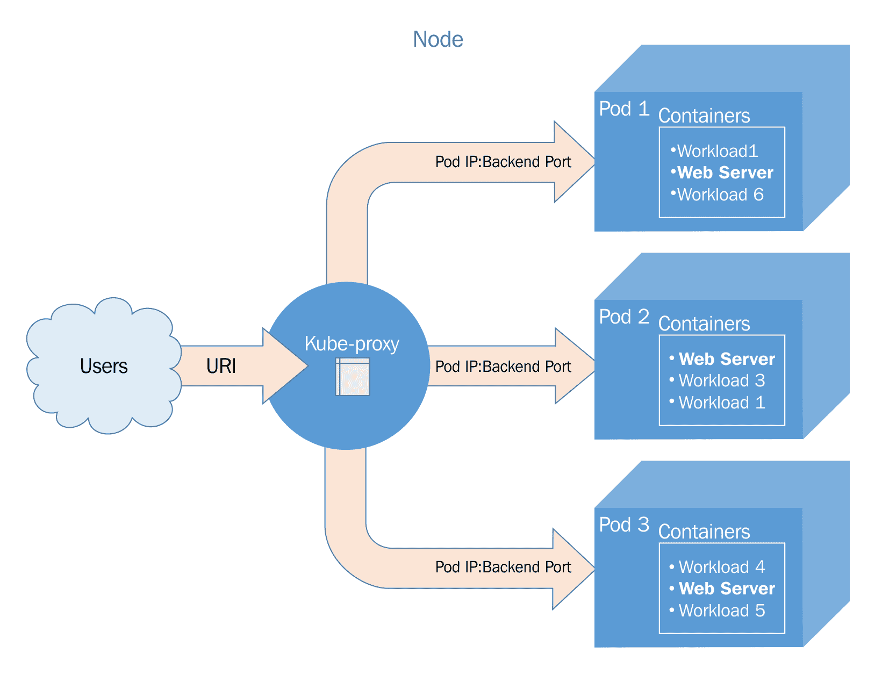

Kube-proxy 通信

也可以通过在服务定义中使用`sessionAffinity`元素，始终将来自同一客户端 IP 的流量转发到同一后台 pod/container。

在 iptables 模式下，pod 直接在 iptable 规则中编码。这消除了对 `kube-proxy` 的依赖，从而直接将流量传递给 iptables，再到 pod。这种方式更快，减少了可能的故障点。正如我们在第二章 *健康检查* 部分中讨论的那样，*Pod、服务、复制控制器和标签*，`Readiness probe` 在这种模式下非常有用，因为它弥补了丧失重试 pod 功能的问题。

# 外部服务

在上一章中，我们看到了一些服务示例。为了测试和演示的目的，我们希望所有的服务都可以被外部访问。这是通过在服务定义中的 `type: LoadBalancer` 元素配置的。`LoadBalancer` 类型会在云提供商上创建一个外部负载均衡器。我们需要注意的是，不同的云提供商对外部负载均衡器的支持情况和实现方式各不相同。在我们的案例中，我们使用的是 GCE，因此集成非常顺利。唯一需要额外设置的就是打开防火墙规则，允许外部服务端口的访问。

让我们深入了解一下，使用 `describe` 命令查看第二章 *Pod、服务、复制控制器和标签* 中 *更多关于标签* 部分的一个服务：

```
$ kubectl describe service/node-js-labels
```

以下截图是前述命令的执行结果：

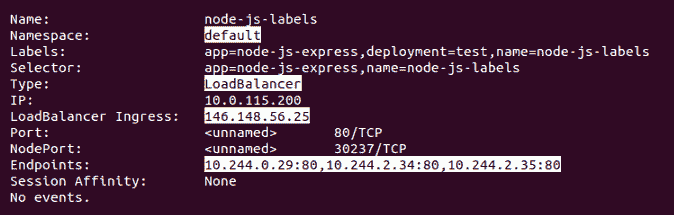

服务描述

在前面的截图输出中，你会注意到几个关键元素。我们的 `Namespace:` 设置为 `default`，`Type:` 为 `LoadBalancer`，并且我们可以在 `LoadBalancer Ingress:` 下看到外部 IP。此外，我们还可以看到 `Endpoints:`，它显示了可以响应服务请求的 pod 的 IP 地址。

# 服务发现

正如我们之前讨论的，Kubernetes 主节点会跟踪所有服务定义和更新。发现服务的方式有三种。前两种方法使用 Linux 环境变量。虽然支持 Docker 链接样式的环境变量，但 Kubernetes 也有自己的命名约定。下面是我们 `node-js` 服务示例使用 K8s 环境变量的样子（注意 IP 会有所不同）：

```
NODE_JS_PORT_80_TCP=tcp://10.0.103.215:80
NODE_JS_PORT=tcp://10.0.103.215:80
NODE_JS_PORT_80_TCP_PROTO=tcp
NODE_JS_PORT_80_TCP_PORT=80
NODE_JS_SERVICE_HOST=10.0.103.215
NODE_JS_PORT_80_TCP_ADDR=10.0.103.215
NODE_JS_SERVICE_PORT=80
```

另一种发现服务的方式是通过 DNS。虽然当 DNS 不可用时，环境变量可以发挥作用，但它也有一些缺点。系统只会在创建时创建变量，因此后续上线的服务将无法被发现，或者需要一些额外的工具来更新所有系统环境变量。

# 内部服务

让我们探索可以部署的其他类型的服务。首先，默认情况下，服务仅面向内部。你可以通过指定 `clusterIP` 类型来实现这一点，但如果没有定义类型，`clusterIP` 会被视为默认类型。让我们看一个例子，`nodejs-service-internal.yaml`；注意没有 `type` 元素：

```
apiVersion: v1 
kind: Service 
metadata: 
  name: node-js-internal 
  labels: 
    name: node-js-internal 
spec: 
  ports: 
  - port: 80 
  selector: 
    name: node-js 
```

使用此清单创建服务定义文件。你将需要一个健康版本的 `node-js` RC（清单 `nodejs-health-controller-2.yaml`）。如你所见，选择器与我们在前一章启动的名为 `node-js` 的 pods 匹配。我们将创建服务，然后列出当前运行的服务，并按如下过滤：

```
$ kubectl create -f nodejs-service-internal.yaml
$ kubectl get services -l name=node-js-internal
```

以下截图是前一个命令的结果：

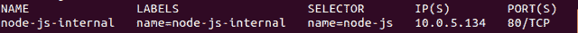

内部服务清单

如你所见，我们有了一个新服务，但只有一个 IP 地址。此外，该 IP 地址无法从外部访问。这一次我们无法通过 Web 浏览器测试该服务。然而，我们可以使用便捷的 `kubectl exec` 命令并尝试从其他 pods 连接。你需要运行 `node-js-pod`（`nodejs-pod.yaml`）。然后，你可以执行以下命令：

```
$ kubectl exec node-js-pod -- curl <node-js-internal IP>
```

这允许我们像在 `node-js-pod` 容器中拥有一个 shell 一样运行 `docker exec` 命令。然后它会访问内部服务 URL，该 URL 会转发到带有 `node-js` 标签的任何 pods。

如果一切顺利，你应该会收到原始的 HTML 输出。你已经成功创建了一个仅限内部的服务。这对于你希望向运行在集群中的其他容器提供服务，但又不对外开放的后台服务非常有用。

# 自定义负载均衡

K8s 允许的第三种服务类型是 `NodePort` 类型。此类型允许我们通过主机或节点（minion）在特定端口公开服务。通过这种方式，我们可以使用任何节点（minion）的 IP 地址并访问在分配的节点端口上的服务。Kubernetes 默认会在 `3000` 到 `32767` 的范围内分配一个节点端口，但你也可以指定自己的自定义端口。在以下清单 `nodejs-service-nodeport.yaml` 的示例中，我们选择端口 `30001`，如下所示：

```
apiVersion: v1 
kind: Service 
metadata: 
  name: node-js-nodeport 
  labels: 
    name: node-js-nodeport 
spec: 
  ports: 
  - port: 80 
    nodePort: 30001 
  selector: 
    name: node-js 
  type: NodePort 
```

再次创建此 YAML 定义文件并创建你的服务，如下所示：

```
$ kubectl create -f nodejs-service-nodeport.yaml
```

输出应该包含类似这样的消息：

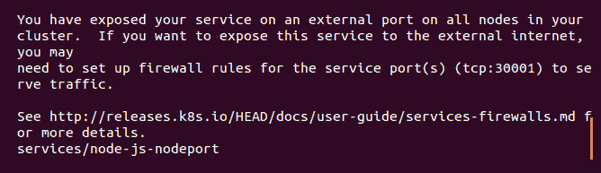

新的 GCP 防火墙规则

关于开启防火墙端口的提示。与外部负载均衡器类型类似，`NodePort` 正在使用节点上的端口将服务暴露到外部。如果你希望在节点前面使用自己的负载均衡器，这将非常有用。在我们测试新服务之前，让我们确保在 GCP 上打开这些端口。

从 GCE VM 实例控制台中，点击你任一节点（minion）的详细信息。然后，点击网络，通常默认情况下它会是创建时指定的网络。进入防火墙规则，我们可以通过点击“添加防火墙规则”来添加规则。

创建如下所示的规则（`tcp:30001` 在 `0.0.0.0/0` IP 范围内）：

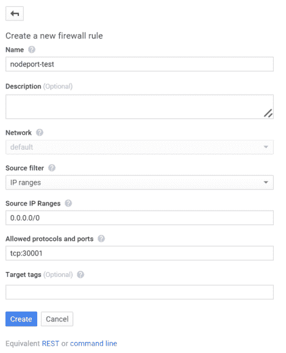

创建新的防火墙规则页面

现在，我们可以通过打开浏览器并使用集群中任何节点（minion）的 IP 地址来测试我们的新服务。测试新服务的格式如下：

```
http://<Minoion IP Address>:<NodePort>/
```

最后，最新版本添加了`ExternalName`类型，它将`CNAME`映射到服务。

# 跨节点代理

记住，`kube-proxy`在所有节点上运行，所以即使 Pod 没有在该节点上运行，流量也会被代理到适当的主机。参见*跨节点流量*截图，了解流量如何流动的可视化效果。用户向外部 IP 或 URL 发起请求。此请求由**Node**服务。在这种情况下，Pod 并没有运行在此节点上。但这不是问题，因为 Pod 的 IP 地址是可路由的。所以，`kube-proxy`或**iptables**会将流量直接传递到该服务的 Pod IP 上。网络路由会在**Node 2**上完成，这里是请求的应用程序所在：

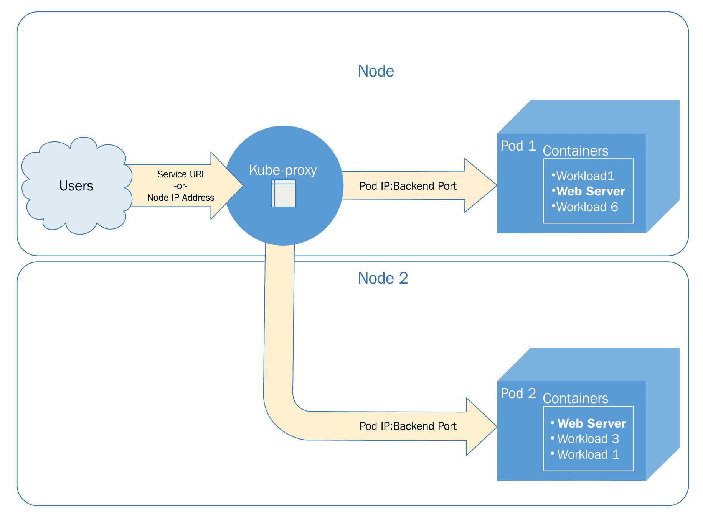

跨节点流量

# 自定义端口

服务还允许你将流量映射到不同的端口；然后，容器和 Pod 会暴露自己。我们将创建一个服务，暴露端口`90`并将流量转发到 Pod 上的端口`80`。我们将把这个 Pod 命名为`node-js-90`，以反映自定义的端口号。创建以下两个定义文件，`nodejs-customPort-controller.yaml`和`nodejs-customPort-service.yaml`：

```
apiVersion: v1 
kind: ReplicationController 
metadata: 
  name: node-js-90 
  labels: 
    name: node-js-90 
spec: 
  replicas: 3 
  selector: 
    name: node-js-90 
  template: 
    metadata: 
      labels: 
        name: node-js-90 
    spec: 
      containers: 
      - name: node-js-90 
        image: jonbaier/node-express-info:latest 
        ports: 
        - containerPort: 80 
apiVersion: v1 
kind: Service 
metadata: 
  name: node-js-90 
  labels: 
    name: node-js-90 
spec: 
  type: LoadBalancer 
  ports: 
  - port: 90 
    targetPort: 80 
  selector: 
    name: node-js-90
```

如果你使用的是 Google Cloud Platform 的免费试用版，可能会遇到`LoadBalancer`类型服务的问题。该类型会创建多个外部 IP 地址，但试用账户仅限于一个静态地址。

你会注意到，在服务定义中，我们有一个`targetPort`元素。这个元素告诉服务在池中使用哪个端口供 Pod/容器使用。正如我们在前面的示例中看到的，如果没有指定`targetPort`，则假定它与服务端口相同。这个端口仍然作为服务端口使用，但在这种情况下，我们将通过端口`90`暴露服务，而容器在端口`80`上提供内容。

创建这个 RC 和服务并打开相应的防火墙规则，像我们在上一个示例中做的那样。可能需要一些时间，直到外部负载均衡器的 IP 被传播到`get service`命令中。一旦它传播完毕，你应该能够通过以下格式打开并在浏览器中看到我们熟悉的 Web 应用程序：

```
http://<external service IP>:90/
```

# 多个端口

另一个自定义端口的使用案例是多个端口。许多应用程序会暴露多个端口，比如 HTTP 在端口`80`和端口`8888`上为 Web 服务器提供服务。以下示例展示了我们的应用程序在这两个端口上的响应。同样，我们也需要为这个端口添加一个防火墙规则，像我们之前为`nodejs-service-nodeport.yaml`列表做的那样。将列表保存为`nodejs-multi-controller.yaml`和`nodejs-multi-service.yaml`：

```
apiVersion: v1 
kind: ReplicationController 
metadata: 
  name: node-js-multi 
  labels: 
    name: node-js-multi 
spec: 
  replicas: 3 
  selector: 
    name: node-js-multi 
  template: 
    metadata: 
      labels: 
        name: node-js-multi 
    spec:
      containers: 
      - name: node-js-multi 
        image: jonbaier/node-express-multi:latest 
        ports: 
        - containerPort: 80 
        - containerPort: 8888
apiVersion: v1 
kind: Service 
metadata: 
  name: node-js-multi 
  labels: 
    name: node-js-multi 
spec: 
  type: LoadBalancer 
  ports: 
  - name: http 
    protocol: TCP 
    port: 80 
  - name: fake-admin-http 
    protocol: TCP 
    port: 8888 
  selector: 
    name: node-js-multi 
```

应用程序和容器本身必须监听这两个端口才能使其正常工作。在此示例中，端口 `8888` 用于表示一个虚拟的管理界面。例如，如果你想监听端口 `443`，你需要在服务器上监听一个适当的 SSL 套接字。

# Ingress

我们之前讨论过，Kubernetes 如何使用服务抽象作为将流量代理到分布在集群中的后端 pod 的方式。虽然这种方式在扩展和 pod 恢复方面非常有用，但有一些更复杂的路由场景是此设计无法解决的。

为此，Kubernetes 添加了一个 ingress 资源，允许进行自定义代理和负载均衡到后端服务。可以将其视为在流量到达我们的服务之前，路由路径中的额外一层或跳点。就像应用程序有服务和后端 pod 一样，ingress 资源需要一个 Ingress 入口点和一个执行自定义逻辑的 ingress 控制器。入口点定义路由，控制器实际处理路由。这对于捕获通常会被边缘路由器丢弃或转发到集群外部的流量非常有用。

Ingress 本身可以配置为为内部服务提供外部可访问的 URL，终止 SSL，提供基于名称的虚拟主机（就像传统 Web 服务器中的做法），或进行负载均衡。Ingress 本身无法处理请求，但需要额外的 ingress 控制器来实现对象中列出的功能。你会看到 nginx 和其他负载均衡或代理技术作为控制器框架的一部分参与其中。在以下示例中，我们将使用 GCE，但你需要自己部署控制器才能利用此功能。目前流行的一个选择是基于 nginx 的 ingress-nginx 控制器。

你可以在这里查看：**[`github.com/kubernetes/ingress-gce/blob/master/BETA_LIMITATIONS.md#glbc-beta-limitations`](https://github.com/kubernetes/ingress-gce/blob/master/BETA_LIMITATIONS.md#glbc-beta-limitations)。**

Ingress 控制器作为运行守护进程的 pod 部署。该 pod 监视 Kubernetes apiserver/ingresses 端点，查看 ingress 资源的变化。对于我们的示例，我们将使用默认的 GCE 后端。

# Ingress 的类型

有几种不同类型的 ingress，例如：

+   **单服务 ingress**：此策略通过创建一个没有规则的默认后端的 ingress 来暴露单个服务。你也可以使用 `Service.Type=LoadBalancer` 或 `Service.Type=NodePort`，或使用端口代理来实现类似的功能。

+   **Fanout**：由于 IP 地址仅在 Kubernetes 网络内部可用，因此你需要使用简单的 fanout 策略来适应边缘流量，并为集群中的正确端点提供 ingress。这在实践中类似于负载均衡器。

+   **基于名称的托管：** 这种方法类似于**服务名称指示（SNI）**，它允许 Web 服务器在同一个 TCP 端口和 IP 地址上呈现多个 HTTPS 网站，并使用不同的证书。

Kubernetes 使用主机头来路由请求。在以下示例片段`ingress-example.yaml`中，展示了基于名称的虚拟托管的样子：

```
apiVersion: extensions/v1beta1
kind: Ingress
metadata:
  name: name-based-hosting
spec:
  rules:
  - host: example01.foo.com
    http:
      paths:
      - backend:
          serviceName: sevice01
          servicePort: 8080
  - host: example02.foo.com
    http:
      paths:
      - backend:
          serviceName: sevice02
          servicePort: 8080
```

正如你可能记得的，在第一章*《Kubernetes 简介》*中，我们看到 GCE 集群默认带有提供第 7 层负载均衡功能的后端。如果我们查看`kube-system`命名空间，就能看到这个控制器正在运行：

```
$ kubectl get rc --namespace=kube-system
```

我们应该看到一个名为`l7-default-backend-v1.0`的 RC，如下所示：

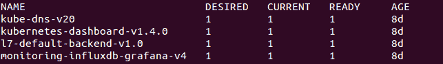

GCE 第 7 层 Ingress 控制器

这提供了 Ingress 控制器部分，实际上它会路由我们在 Ingress 入口点中定义的流量。让我们为 Ingress 创建一些资源。

首先，我们将创建一些新的复制控制器，使用`httpwhalesay`镜像。这是原始 whalesay 的重混版，原始 whalesay 在浏览器中显示。以下列出了`whale-rcs.yaml`中的 YAML 配置。注意那三个破折号，它们允许我们将多个资源合并到一个 YAML 文件中：

```
apiVersion: v1
kind: ReplicationController
metadata:
  name: whale-ingress-a
spec:
  replicas: 1
  template:
    metadata:
      labels:
        app: whale-ingress-a
    spec:
      containers:
      - name: sayhey
        image: jonbaier/httpwhalesay:0.1
        command: ["node", "index.js", "Whale Type A, Here."]
        ports:
        - containerPort: 80
---
apiVersion: v1
kind: ReplicationController
metadata:
  name: whale-ingress-b
spec:
  replicas: 1
  template:
    metadata:
      labels:
        app: whale-ingress-b
    spec:
      containers:
      - name: sayhey
        image: jonbaier/httpwhalesay:0.1
        command: ["node", "index.js", "Hey man, It's Whale B, Just
        Chillin'."]
        ports:
        - containerPort: 80
```

请注意，我们正在创建具有相同容器但不同启动参数的 Pod。记下这些参数，稍后会用到。我们还将为这些 RC 创建`Service`端点，如`whale-svcs.yaml`列出的那样：

```
apiVersion: v1
kind: Service
metadata:
  name: whale-svc-a
  labels:
    app: whale-ingress-a
spec:
  type: NodePort
  ports:
  - port: 80
    nodePort: 30301
    protocol: TCP
    name: http
  selector:
    app: whale-ingress-a
---
apiVersion: v1
kind: Service
metadata:
  name: whale-svc-b
  labels:
    app: whale-ingress-b
spec:
  type: NodePort
  ports:
  - port: 80
    nodePort: 30284
    protocol: TCP
    name: http
  selector:
    app: whale-ingress-b
---
apiVersion: v1
kind: Service
metadata:
 name: whale-svc-default
 labels:
   app: whale-ingress-a
spec:
  type: NodePort
  ports:
  - port: 80
    nodePort: 30302
    protocol: TCP
    name: http
  selector:
    app: whale-ingress-a
```

再次使用`kubectl create -f`命令创建这些，如下所示：

```
$ kubectl create -f whale-rcs.yaml $ kubectl create -f whale-svcs.yaml
```

我们应该看到关于成功创建 RC 和服务的消息。接下来，我们需要定义 Ingress 入口点。我们将使用`http://a.whale.hey`和`http://b.whale.hey`作为我们的演示入口点，如下所示的`whale-ingress.yaml`：

```
apiVersion: extensions/v1beta1
kind: Ingress
metadata:
  name: whale-ingress
spec:
  rules:
  - host: a.whale.hey
    http:
      paths:
      - path: /
        backend:
          serviceName: whale-svc-a
          servicePort: 80
  - host: b.whale.hey
    http:
      paths:
      - path: /
        backend:
          serviceName: whale-svc-b
          servicePort: 80
```

再次使用`kubectl create -f`命令创建这个 Ingress。创建成功后，我们需要等待一会儿，直到 GCE 为 Ingress 分配一个静态 IP 地址。使用以下命令来监视 Ingress 资源：

```
$ kubectl get ingress
```

一旦 Ingress 获得 IP 地址，我们应该在`ADDRESS`中看到一条条目，如下所示：

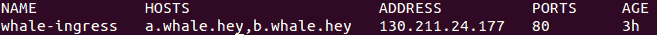

Ingress 描述

由于这不是一个注册的域名，我们需要在`curl`命令中指定解析，像这样：

```
$ curl --resolve a.whale.hey:80:130.211.24.177 http://a.whale.hey/
```

这应该显示以下内容：

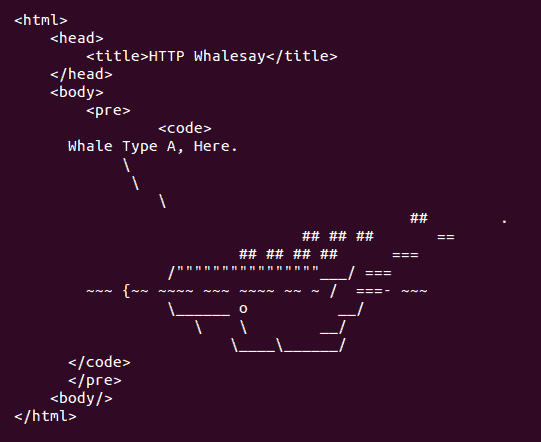

Whalesay A

我们还可以尝试第二个 URL。这样做，我们将获得第二个 RC：

```
$ curl --resolve b.whale.hey:80:130.211.24.177 http://b.whale.hey/
```

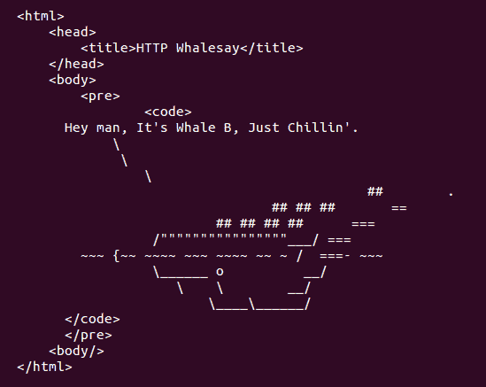

Whalesay B

请注意，这些镜像几乎相同，只是每个鲸鱼的文字反映了我们之前启动的每个 RC 的启动参数。因此，我们的两个 Ingress 点正在将流量引导到不同的后端。

在这个示例中，我们使用了默认的 GCE 后端作为 Ingress 控制器。Kubernetes 允许我们构建自己的控制器，而 nginx 也有几个可用版本。

# 迁移、多集群等

正如我们到目前为止所看到的，Kubernetes 提供了高度的灵活性和定制性，用于在集群中创建围绕容器的服务抽象。然而，有时你可能希望指向集群外部的某些内容。

这类情况的一个例子是与遗留系统或甚至在另一个集群上运行的应用程序进行合作。对于前者来说，这是一个完全有效的策略，用于迁移到 Kubernetes 和容器化。我们可以通过在 Kubernetes 中管理服务端点，同时利用 K8s 的编排概念将堆栈拼接起来，作为开始。此外，我们甚至可以开始逐步引入堆栈的各个部分，比如前端，当组织重构应用程序为微服务和/或容器化时。

为了允许访问非 Pod 基础的应用程序，服务构造允许你使用集群外部的端点。实际上，每次你创建一个使用选择器的服务时，Kubernetes 都会创建一个端点资源。`endpoints` 对象会跟踪负载均衡池中的 Pod IP 地址。你可以通过运行 `get endpoints` 命令看到这一点，如下所示：

```
$ kubectl get endpoints
```

你应该看到类似下面的内容：

```
NAME               ENDPOINTS
http-pd            10.244.2.29:80,10.244.2.30:80,10.244.3.16:80
kubernetes         10.240.0.2:443
node-js            10.244.0.12:80,10.244.2.24:80,10.244.3.13:80
```

你会注意到当前集群上运行的所有服务的条目。对于大多数服务，端点只是每个在 RC 中运行的 Pod 的 IP 地址。如前所述，Kubernetes 会根据选择器自动执行此操作。当我们在控制器中扩展具有匹配标签的副本时，Kubernetes 会自动更新端点。

如果我们想为一个不是 Pod 的服务创建一个服务，而该服务没有标签可以选择，我们可以通过定义 `nodejs-custom-service.yaml` 服务和 `nodejs-custom-endpoint.yaml` 端点，轻松实现，如下所示：

```
apiVersion: v1 
kind: Service 
metadata: 
  name: custom-service 
spec: 
  type: LoadBalancer 
  ports: 
  - name: http 
    protocol: TCP 
    port: 80
```

```
apiVersion: v1 
kind: Endpoints 
metadata: 
  name: custom-service 
subsets: 
- addresses: 
  - ip: <X.X.X.X> 
  ports: 
    - name: http 
      port: 80 
      protocol: TCP 
```

在前面的示例中，你需要将 `<X.X.X.X>` 替换为一个真实的 IP 地址，新的服务可以指向该地址。在我的案例中，我使用了之前在 `ingress-example.yaml` 中创建的 `node-js-multi` 服务的公共负载均衡器 IP。现在可以开始创建这些资源了。

如果我们现在运行 `get endpoints` 命令，我们将在 `80` 端口看到这个 IP 地址，它与 `custom-service` 端点关联。此外，如果我们查看服务详情，我们将在 `Endpoints` 部分看到该 IP 地址：

```
$ kubectl describe service/custom-service
```

我们可以通过浏览器打开 `custom-service` 的外部 IP 来测试这个新服务。

# 自定义地址

定制服务的另一个选项是使用 `clusterIP` 元素。在到目前为止的示例中，我们没有指定 IP 地址，这意味着它为我们选择了服务的内部地址。然而，我们可以添加这个元素，并提前选择 IP 地址，像这样：`clusterip: 10.0.125.105`。

有时您可能不希望负载均衡，而是希望为每个 pod 使用*A*记录的 DNS。例如，需要将数据均匀复制到所有节点的软件可能依赖于*A*记录来分发数据。在这种情况下，我们可以使用以下示例，并将`clusterip`设置为`None`。

Kubernetes 不会为每个 pod 分配 IP 地址，而是仅为每个 pod 分配*A*记录。如果使用 DNS，则从集群内部可以通过`node-js-none`或`node-js-none.default.cluster.local`访问服务。为此，我们将使用以下清单`nodejs-headless-service.yaml`：

```
apiVersion: v1 
kind: Service 
metadata: 
  name: node-js-none 
  labels: 
    name: node-js-none 
spec: 
  clusterIP: None 
  ports: 
  - port: 80 
  selector: 
    name: node-js 
```

创建此服务后，请使用可靠的`exec`命令测试它：

```
$ kubectl exec node-js-pod -- curl node-js-none
```

# DNS

DNS 通过允许我们按名称引用服务来解决环境变量带来的问题。随着服务的重新启动、扩展或新增，DNS 条目会更新，确保服务名称始终指向最新的基础设施。大多数支持的提供商默认设置了 DNS。您可以通过添加集群附加组件来为您的集群添加 DNS 支持（[`kubernetes.io/docs/concepts/cluster-administration/addons/`](https://kubernetes.io/docs/concepts/cluster-administration/addons/)）。

如果您的提供商支持 DNS 但未设置，请在创建 Kubernetes 集群时在默认提供商配置中配置以下变量：

`ENABLE_CLUSTER_DNS="${KUBE_ENABLE_CLUSTER_DNS:-true}"` `DNS_SERVER_IP="10.0.0.10"`

`DNS_DOMAIN="cluster.local"`

`DNS_REPLICAS=1`。

启用 DNS 后，服务可以以两种形式访问，即服务名称本身`<service-name>`或包括命名空间的完全限定名称`<service-name>.<namespace-name>.cluster.local`。在我们的示例中，它看起来类似于`node-js-90`或`node-js-90.default.cluster.local`。

DNS 服务器基于通过 API 创建的新服务创建 DNS 记录。共享 DNS 命名空间中的 pod 将能够看到彼此，并且可以使用 DNS SRV 记录记录端口。

Kubernetes DNS 由集群中的一个 DNS pod 和一个 Service 组成，它直接与 kubelets 和容器通信，以便将 DNS 名称转换为 IP 地址。具有 clusterIP 的服务被赋予`my-service.my-namespace.svc.cluster.local`地址。如果服务没有 clusterIP（也称为 headless），它将以轮询方式解析为指向服务 pod 的多个 IP 地址。还有一些可以设置的 DNS 策略。

Kubernetes 孵化项目之一，[CoreDNS](https://github.com/coredns/coredns)，也可用于服务发现。它取代了本地的`kube-dns` DNS 服务，需要 Kubernetes v1.9 或更高版本。在初始化过程中，您需要使用`kubeadm`来尝试 CoreDNS。您可以使用以下命令在集群上安装它：

```
$ kubeadm init --feature-gates=CoreDNS=true
```

如果你想了解更多关于 CoreDNS 的示例使用案例，可以查看这篇博客：[`coredns.io/2017/05/08/custom-dns-entries-for-kubernetes/`](https://coredns.io/2017/05/08/custom-dns-entries-for-kubernetes/)。

# 多租户

Kubernetes 还有一个额外的隔离构件，用于集群级别的隔离。在大多数情况下，你可以运行 Kubernetes 而无需担心命名空间；如果没有指定，所有内容都会运行在默认命名空间中。不过，在运行多租户社区或想要进行大规模集群资源隔离和分割的情况下，可以使用命名空间来实现这一目标。虽然 Kubernetes 的端到端多租户功能尚未完全完善，但通过 RBAC、容器权限、Ingress 规则和清晰的网络管理，可以接近这一目标。如果你现在对企业级多租户感兴趣，Red Hat 的**Openshift Origin**（**OO**）是学习的好地方。

你可以在[`github.com/openshift/origin`](https://github.com/openshift/origin)上查看 OO。

开始时，Kubernetes 有两个命名空间——`default`和`kube-system`。`kube-system`命名空间用于我们在第一章《Kubernetes 简介》中的*Minion 上运行的服务*部分看到的所有系统级容器。UI、日志、DNS 等都运行在`kube-system`中。用户创建的其他所有内容都运行在默认命名空间中。不过，我们的资源定义文件可以选择性地指定自定义命名空间。为了实验，我们来看一下如何构建一个新的命名空间。

首先，我们需要创建一个命名空间定义文件`test-ns.yaml`，就像下面的代码行一样：

```
apiVersion: v1 
kind: Namespace 
metadata: 
  name: test
```

我们可以继续使用我们方便的`create`命令来创建这个文件：

```
$ kubectl create -f test-ns.yaml
```

现在，我们可以创建使用`test`命名空间的资源。以下列表，`ns-pod.yaml`，是使用这个新命名空间的一个 Pod 示例：

```
apiVersion: v1 
kind: Pod 
metadata: 
  name: utility 
  namespace: test 
spec: 
  containers: 
  - image: debian:latest 
    command: 
      - sleep 
      - "3600" 
    name: utility 
```

虽然 Pod 仍然可以访问其他命名空间中的服务，但它需要使用`<service-name>.<namespace-name>.cluster.local`的长 DNS 格式。例如，如果你在`ns-pod.yaml`中运行命令，可以使用`node-js.default.cluster.local`来访问第二章《Pods、Services、Replication Controllers 和 Labels》中的 Node.js 示例。

这里有一个关于资源利用的提示。在本书的某个地方，你可能会遇到集群空间不足以创建新的 Kubernetes 资源的情况。具体时间取决于集群的大小，但最好记住这一点，并不时进行清理。使用以下命令删除旧的示例：

` $ kubectl delete pod <pod name> $ kubectl delete svc <service name> $ kubectl delete rc <replication controller name> $ kubectl delete rs <replicaset name>`。

# 限制

让我们再检查一下我们的新命名空间。运行`describe`命令，如下所示：

```
$ kubectl describe namespace/test
```

以下截图是前面命令的结果：

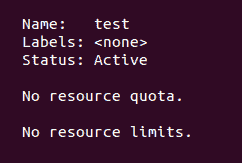

描述命名空间

Kubernetes 允许你通过配额来限制单个 Pod 或容器使用的资源以及整个命名空间使用的资源。你会注意到，当前在 `test` 命名空间上没有设置资源限制或配额。

假设我们想要限制这个新命名空间的占用资源，我们可以像下面这样设置配额 `quota.yaml`：

```
apiVersion: v1 
kind: ResourceQuota 
metadata: 
  name: test-quotas 
  namespace: test 
spec: 
  hard:  
    pods: 3 
    services: 1 
    replicationcontrollers: 1 
```

实际上，命名空间通常用于较大的应用程序社区，并且其配额通常不会这么低。我在此示例中使用它是为了方便展示此功能。

在这里，我们将为 `test` 命名空间创建一个 `3` 个 Pod、`1` 个 RC 和 `1` 个服务的配额。正如你可能猜到的，这一切都是通过我们可靠的 `create` 命令执行的，如下所示：

```
$ kubectl create -f quota.yaml
```

既然我们已经设置好了，那就用 `describe` 查看命名空间，如下所示：

```
$ kubectl describe namespace/test
```

以下截图是前述命令的结果：

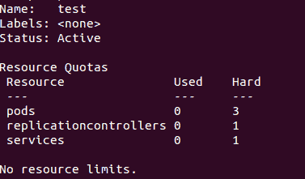

配额设置后的命名空间描述

你会注意到，我们现在在配额部分列出了一些值，而限制部分仍然是空白的。我们还有一个 `Used` 列，它让我们知道当前接近配额限制的程度。现在，尝试使用以下定义的 `busybox-ns.yaml` 启动一些 Pod：

```
apiVersion: v1 
kind: ReplicationController 
metadata: 
  name: busybox-ns 
  namespace: test 
  labels: 
    name: busybox-ns 
spec: 
  replicas: 4 
  selector: 
    name: busybox-ns 
  template: 
    metadata: 
      labels: 
        name: busybox-ns 
    spec: 
      containers: 
      - name: busybox-ns 
        image: busybox 
        command: 
          - sleep 
          - "3600" 
```

你会注意到我们正在创建这个基础 Pod 的四个副本。在用 `create` 创建这个 RC 后，再次运行 `describe` 命令查看 `test` 命名空间。你会发现 Pod 和 RC 的 `Used` 值已达到最大。但我们请求了四个副本，而只能看到使用中的三个 Pod。

让我们看看我们的 RC（复制控制器）发生了什么。你可以尝试用以下命令来查看：

```
kubectl describe rc/busybox-ns
```

然而，如果你尝试这样做，你会看到服务器返回 `not found` 的信息。这是因为我们在一个新命名空间中创建了这个 RC，而 `kubectl` 默认假设是默认命名空间，如果没有指定的话。这意味着当我们想要访问 `test` 命名空间中的资源时，每个命令都需要指定 `--namespace=test`。

我们也可以通过修改上下文设置来设置当前命名空间。首先，我们需要找到当前的上下文，使用以下命令可以找到：

`**$ kubectl config view | grep current-context**`

接下来，我们可以用以下代码设置命名空间变量：

`**$ kubectl config set-context <Current Context> --namespace=test**`

现在，您可以运行 `kubectl` 命令而无需指定命名空间。只需记住在想查看默认命名空间中运行的资源时，切换回去即可。

按照以下命令运行时，指定命名空间。如果你按照提示框所示设置了当前命名空间，那么可以省略 `--namespace` 参数：

```
$ kubectl describe rc/busybox-ns --namespace=test
```

以下截图是前述命令的结果：

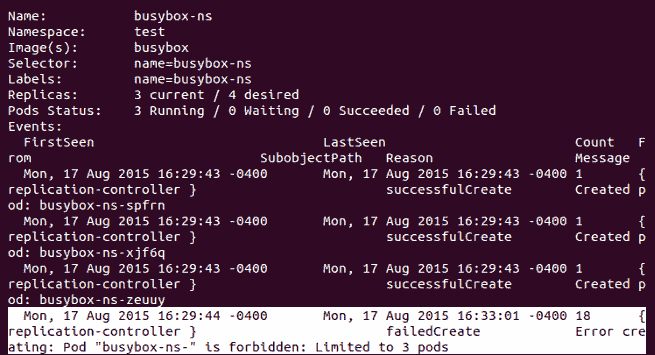

命名空间配额

正如前面图片所示，前三个 pod 已成功创建，但最后一个 pod 因为出现 `Limited to 3 pods` 错误而创建失败。

这是为社区规模资源分配设置限制的简便方法。值得注意的是，你还可以为 CPU、内存、持久卷和机密设置配额。此外，限制与配额的工作方式类似，但它为每个命名空间内的 pod 或容器设置限制。

# 关于资源使用的说明

由于本书中的大多数示例都使用 GCP 或 AWS，因此保持所有服务运行可能会非常昂贵。如果你一直保持所有示例运行，使用默认集群大小容易耗尽资源。因此，你可能需要定期删除旧的 pod、复制控制器、副本集和服务。你还可以销毁集群并使用第一章 *Kubernetes 简介* 中的内容重新创建集群，从而降低云服务商账单。

# 总结

在本章中，我们深入探讨了 Kubernetes 中的网络和服务。你现在应该理解了 K8s 中网络通信的设计，并能够舒适地访问你的服务，无论是内部访问还是外部访问。我们看到 `kube-proxy` 如何在本地和整个集群中平衡流量。此外，我们还探讨了新的 Ingress 资源，它们使我们能更精细地控制传入流量。我们还简要了解了 Kubernetes 中如何实现 DNS 和服务发现。最后，我们简要回顾了命名空间和多租户隔离。

# 问题

1.  给出 Docker 网络方式与 Kubernetes 网络方式不同的两种方式。

1.  NAT 代表什么？

1.  Kubernetes 网络模型的两大类是什么？

1.  至少列出两种可供 Kubernetes 使用的第三方覆盖网络选项。

1.  Kubernetes 在哪个层级（或替代地，在哪个对象上）分配 IP 地址？

1.  `kube-proxy` 可用的模式有哪些？

1.  Kubernetes 允许的三种服务类型是什么？

1.  用于定义容器和服务端口的元素是什么？

1.  列出两种或更多 Kubernetes 可用的 Ingress 类型。

1.  如何为你的 Kubernetes 集群提供多租户支持？

# 深入阅读

+   阅读更多关于 CoreDNS 在 CNCF 的条目：[`coredns.io/2018/03/12/coredns-1.1.0-release/`](https://coredns.io/2018/03/12/coredns-1.1.0-release/)。

+   有关当前 Kubernetes 网络提供者的更多详细信息，请访问 [`kubernetes.io/docs/concepts/cluster-administration/networking/#how-to-achieve-this`](https://kubernetes.io/docs/concepts/cluster-administration/networking/#how-to-achieve-this)。

+   你可以对比 nginx 实现的入口控制器([`github.com/nginxinc/kubernetes-ingress`](https://github.com/nginxinc/kubernetes-ingress))和 Kubernetes 社区的方法([`github.com/kubernetes/ingress-nginx`](https://github.com/kubernetes/ingress-nginx))及其差异([`github.com/nginxinc/kubernetes-ingress/blob/master/docs/nginx-ingress-controllers.md`](https://github.com/nginxinc/kubernetes-ingress/blob/master/docs/nginx-ingress-controllers.md))。

+   你可以在[`github.com/kubernetes/ingress-gce/`](https://github.com/kubernetes/ingress-gce/)了解有关 Google Compute Engine 第 7 层负载均衡器 GLBC 的更多信息。
