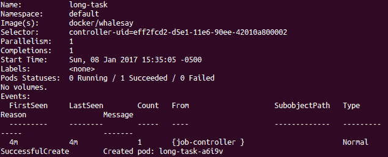

# 实现可靠的容器原生应用程序

本章将介绍 Kubernetes 支持的各种类型的工作负载。我们将讨论适用于经常更新且长期运行的应用程序的部署。我们还将重新探讨应用程序更新和使用部署进行渐进式发布的话题。此外，我们将介绍用于短期任务的作业。我们还将研究 DaemonSets，它允许程序在 Kubernetes 集群的每个节点上运行。如果你注意到的话，本章不会涉及 StatefulSets，但我们将在下一章讨论它们，届时我们将探讨存储以及 Kubernetes 如何帮助你管理集群上的存储和有状态应用程序。

本章将涵盖以下内容：

+   部署

+   使用部署进行应用程序扩展

+   使用部署进行应用程序更新

+   作业

+   DaemonSets

# 技术要求

你需要一个正在运行的 Kubernetes 集群，就像我们在前几章中创建的那样。你还需要通过 `kubectl` 命令访问该集群并进行部署。

本章的 GitHub 仓库链接：[`github.com/PacktPublishing/Getting-Started-with-Kubernetes-third-edition/tree/master/Code-files/Chapter04`](https://github.com/PacktPublishing/Getting-Started-with-Kubernetes-third-edition/tree/master/Code-files/Chapter04)

# Kubernetes 如何管理状态

如前所述，我们知道 Kubernetes 努力在给定的集群中强制执行操作员期望的状态。部署使操作员能够定义一个最终状态，并通过控制速率的机制对无状态服务（如微服务）进行更改。由于 Kubernetes 是一个管理元数据、当前状态和一组对象规范的控制平面和数据平面，部署为你的应用程序提供了更深层次的控制。可以使用几种典型的部署模式：重建、滚动更新、通过选择器的蓝绿发布、通过副本的金丝雀发布和通过 HTTP 头的 A/B 测试。

# 部署

在上一章中，我们探讨了使用旧的滚动更新方法进行应用程序更新的一些核心概念。从版本 1.2 开始，Kubernetes 添加了 **Deployment** 构造，它改进了滚动更新和 **ReplicationControllers** 的基本机制。顾名思义，它使我们能够对代码部署本身进行更精细的控制。部署允许我们通过声明性定义和对 Pod 和 **ReplicaSets** 的更新来暂停和恢复应用程序的发布。此外，它们还会保留过去部署的历史记录，允许用户轻松回滚到先前的版本。

不再推荐使用 ReplicationControllers，而是使用配置 ReplicaSet 的 Deployment 来为无状态服务或应用程序设置应用可用性。此外，不要直接管理由部署创建的 ReplicaSets；应仅通过 Deployment API 进行管理。

# 部署的使用案例

我们将更详细地探讨一些部署的典型场景：

+   部署一个 ReplicaSet

+   更新一组 Pod 的状态

+   回滚到先前版本的部署

+   扩展以适应集群负载

+   暂停并使用 Deployment 状态来进行更改或指示一个卡住的部署

+   清理一个部署

在以下的 `node-js-deploy.yaml` 文件代码中，我们可以看到定义与 ReplicationController 非常相似。主要区别在于，我们现在可以对部署对象进行更改和更新，并让 Kubernetes 管理底层 Pod 和副本的更新：

```
apiVersion: extensions/v1beta1
kind: Deployment
metadata:
  name: node-js-deploy
  labels:
    name: node-js-deploy
spec:
  replicas: 1
  template:
    metadata:
      labels:
        name: node-js-deploy
    spec:
      containers:
      - name: node-js-deploy
        image: jonbaier/pod-scaling:0.1
        ports:
        - containerPort: 80
```

在这个示例中，我们通过 `metadata` 下的 `name` 字段创建了一个名为 `node-js-deploy` 的 Deployment。我们正在创建一个由 `selector` 字段管理的单个 Pod，`selector` 字段将帮助 Deployment 确定管理哪些 Pod。`spec` 指示该 Pod 运行 `jobbaier/pod-scaling` 容器，并通过 `containerPort` 将流量引导到端口 `80`。

我们可以使用熟悉的 `create` 命令，并附加可选的 `--record` 标志，这样 Deployment 的创建过程将记录在回滚历史中。否则，我们只能通过 `$ kubectl create -f node-js-deploy.yaml --record` 命令查看随后的更改记录。

如果您的集群没有启用此 beta 类型，您可能需要添加 `--validate=false`。

我们应该会看到部署成功创建的消息。几秒钟后，它将完成 Pod 的创建，我们可以使用 `get pods` 命令自行检查。我们添加 `-l` 标志只查看与此部署相关的 Pods：

```
$ kubectl get pods -l name=node-js-deploy 
```

如果您想查看部署的状态，可以执行以下命令：

```
$ kubectl get deployments
```

你还可以看到部署状态，这在将来更新我们的部署时会更加有用。你可以使用 `kubectl rollout status deployment/node-js-deploy` 来查看当前的状态。

我们创建一个服务，就像之前用 ReplicationControllers 时那样。以下是我们刚刚创建的 Deployment 的 `Service` 定义。请注意，它几乎与我们过去创建的 `Services` 完全相同。将以下代码保存为 `node-js-deploy-service.yaml` 文件：

```
apiVersion: v1
kind: Service
metadata:
  name: node-js-deploy
  labels:
    name: node-js-deploy
spec:
  type: LoadBalancer
  ports:
  - port: 80
  sessionAffinity: ClientIP
  selector:
    name: node-js-deploy
```

一旦通过 `kubectl` 创建了这个服务，您就可以通过服务 IP 或服务名称访问部署的 Pods，前提是您位于该命名空间的某个 Pod 内。

# 扩展

`scale` 命令的工作方式与我们在 ReplicationController 中一样。要扩展副本数，我们只需要使用部署名称并指定新的副本数，如下所示：

```
$ kubectl scale deployment node-js-deploy --replicas 3
```

如果一切顺利，我们将在终端窗口的输出中看到一个关于部署被扩展的消息。我们可以使用之前的`get pods`命令检查当前运行的 pod 数量。在最新版本的 Kubernetes 中，你还可以为集群设置 pod 扩展，这样你就可以根据集群的 CPU 利用率进行水平自动扩展，从而扩展 pods。你需要设置 pod 的最大和最小数量才能启动这个功能。

这是该命令在这个示例中的样子：

```
$ kubectl autoscale deployment node-js-deploy --min=25 --max=30 --cpu-percent=75
deployment "node-js-deploy" autoscaled
```

了解更多关于水平 pod 扩展的信息，请参阅此教程：[`kubernetes.io/docs/tasks/run-application/horizontal-pod-autoscale-walkthrough/`](https://kubernetes.io/docs/tasks/run-application/horizontal-pod-autoscale-walkthrough/)。

还有一个比例扩展的概念，它允许你同时运行多个版本的应用程序。例如，当你增量更新一个向后兼容的 API 微服务版本时，这种实现会非常有用。在进行这种类型的部署时，你将使用`.spec.strategy.rollingUpdate.maxUnavailable`和`.spec.strategy.rollingUpdate.maxSurge`来限制更新期间部署中不可用的最大 pod 数量，或限制超过所需 pod 数量的最大创建 pod 数量。

# 更新与滚动发布

部署允许通过几种不同的方式进行更新。首先是`kubectl set`命令，它允许我们更改部署配置而无需手动重新部署。目前，它只允许更新镜像，但随着应用程序或容器镜像的新版本的处理，我们将需要频繁地执行此操作。

让我们回顾一下前一节中的部署。我们现在应该有三个副本在运行。通过运行`get pods`命令并加上部署筛选器来验证这一点：

```
$ kubectl get pods -l name=node-js-deploy
```

我们应该看到三个 pod，类似于下面截图中的内容：


部署 pod 列表

选择我们设置中的一个 pod，将其替换为以下命令中的`{POD_NAME_FROM_YOUR_LISTING}`，并运行此命令：

```
$ kubectl describe pod/{POD_NAME_FROM_YOUR_LISTING} | grep Image:
```

我们应该看到类似下面截图的输出，当前镜像版本为`0.1`：


当前 pod 镜像

既然我们知道当前的部署在运行什么版本，接下来我们试着更新到下一个版本。这可以通过使用`kubectl set`命令并指定新版本来轻松实现，如下所示：

```
$ kubectl set image deployment/node-js-deploy node-js-deploy=jonbaier/pod-scaling:0.2
$ deployment "node-js-deploy" image updated
```

如果一切顺利，我们应该在屏幕上看到显示`deployment "node-js-deploy" image updated`的文本。

我们可以通过以下`rollout status`命令再次检查状态：

```
$ kubectl rollout status deployment/node-js-deploy
```

另外，我们也可以在编辑器窗口中直接编辑部署，使用`kubectl edit deployment/node-js-deploy`，并将`.spec.template.spec.containers[0].image`从`jonbaier/pod-scaling:0.1`更改为`jonbaier/pod-scaling:0.2`。这两种方法都可以更新你的部署，提醒一下，你可以使用`kubectl status`命令检查更新状态：

```
$ kubectl rollout status deployment/node-js-deployment
Waiting for rollout to finish: 2 out of 3 new replicas have been updated...
deployment "node-js-deployment" successfully rolled out
```

我们应该看到一些文本，说明部署已经成功推出。如果你看到任何关于等待推出完成的文本，可能需要等一下它完成，或者检查日志寻找问题。

完成后，像之前一样运行`get pods`命令。这一次，我们将看到列出了新的 pods：


更新后的部署 pod 列表

再次，将你其中一个 pod 的名称输入到我们之前运行的`describe`命令中。这次，我们应该看到镜像已经更新为 0.2。

背后发生的事情是 Kubernetes 已经为我们*推出*了一个新版本。它基本上创建了一个新的 ReplicaSet 并使用新版本。一旦这个 pod 上线并且健康，它就会终止一个旧版本的 pod。它会继续这种行为，扩展新版本并缩减旧版本，直到只剩下新的 pod。另一种间接观察此行为的方法是查看 Deployment 对象用于更新所需应用状态的 ReplicaSet。

记住，你不是直接与 ReplicaSet 交互，而是通过 Deployment 元素向 Kubernetes 提供指令，并让 Kubernetes 根据这些指令对集群对象存储和状态进行必要的更改。快速查看你运行`image update`命令后创建的 ReplicaSets，你将看到如何通过多个 ReplicaSets 实现镜像更改而不发生应用停机：

```
$ kubectl get rs
NAME                               DESIRED CURRENT READY AGE
node-js-deploy-1556879905          3       3       3     46s
node-js-deploy-4657899444          0       0       0     85s
```

以下图表描述了工作流，供你参考：


部署生命周期

值得注意的是，回滚定义允许我们在部署定义中控制 pod 替换方法。有一个`strategy.type`字段，默认为`RollingUpdate`和之前的行为。我们还可以选择将`Recreate`作为替代策略，先终止所有旧的 pods，然后再创建新版本的 pods。

# 历史和回滚

rollout API 的一个有用功能是能够跟踪部署历史。在查看历史之前，让我们再进行一次更新。再次运行`kubectl set`命令，并指定版本 0.3：

```
$ kubectl set image deployment/node-js-deploy node-js-deploy=jonbaier/pod-scaling:0.3
$ deployment "node-js-deploy" image updated 
```

我们再次会看到屏幕上显示`deployment "node-js-deploy" image updated`的文本。现在，再次运行`get pods`命令：

```
$ kubectl get pods -l name=node-js-deploy
```

让我们也来看看我们的部署历史。运行`rollout history`命令：

```
$ kubectl rollout history deployment/node-js-deploy 
```

我们应该看到类似以下的输出：


部署历史

如我们所见，历史记录显示了初始的发布创建、我们第一次更新到 0.2 以及最后更新到 0.3。除了状态和历史记录，`rollout`命令还支持`pause`、`resume`和`undo`子命令。`rollout pause`命令允许我们在发布过程中暂停命令。这在故障排除时非常有用，也适用于金丝雀发布类型的部署，我们希望在发布到整个用户群之前做最后的版本测试。当我们准备继续发布时，可以简单地使用`rollout resume`命令。

但是，如果出现问题怎么办？这时候，`rollout undo`命令和发布历史记录就非常有用了。我们通过尝试更新到一个尚未可用的 Pod 版本来模拟这个问题。我们将镜像设置为 42.0 版本，但该版本并不存在：

```
$ kubectl set image deployment/node-js-deploy node-js-deploy=jonbaier/pod-scaling:42.0
```

我们仍然应该看到屏幕上显示`deployment "node-js-deploy" image updated`的文本。但是如果检查状态，我们会看到它仍在等待：

```
$ kubectl rollout status deployment/node-js-deploy
Waiting for rollout to finish: 2 out of 3 new replicas have been updated... 
```

在这里，我们看到发布在更新了三个 Pod 中的两个后已暂停，但 Kubernetes 足够智能，知道在此停止，以防止由于容器镜像名称错误导致整个应用程序下线。我们可以按*Ctrl* + *C*来终止`status`命令，然后再次运行`get pods`命令：

```
$ kubectl get pods -l name=node-js-deploy
```

现在我们应该看到`ErrImagePull`，如下图所示：


镜像拉取错误

正如我们预期的那样，它无法拉取 42.0 版本的镜像，因为该版本并不存在。这个错误是指容器陷入了镜像拉取循环，最新版本的 Kubernetes 中标记为`ImagePullBackoff`。如果我们在集群中资源耗尽或达到命名空间设置的限制，也可能会遇到发布问题。当然，发布失败还可能是由于一些应用相关的原因，比如健康检查失败、权限问题和应用程序缺陷等。

如果不改变`maxUnavailable`和`spec.replicas`的值，完全有可能创建一个完全不可用的发布，因为默认值都是`1`！

每当发布失败时，我们可以轻松地通过`rollout undo`命令回滚到之前的版本。此命令会将我们的发布回滚到上一个版本：

```
$ kubectl rollout undo deployment/node-js-deploy
```

之后，我们可以再运行一次`rollout status`命令，应该会看到所有内容都成功发布。再次运行`kubectl rollout history deployment/node-js-deploy`命令，我们将看到我们尝试发布版本 42.0 并回滚到 0.3 的记录：


回滚后的发布历史

我们也可以在运行撤销操作时指定`--to-revision`标志，以回滚到特定版本。这在我们的发布成功，但在后期发现逻辑错误时非常有用。

# 自动伸缩

如你所见，Deployment 比 ReplicationController 有了很大的改进，使我们能够无缝地更新应用程序，同时与 Kubernetes 的其他资源集成，方式类似。

另一个我们在上一章看到的领域，也是支持 Deployment 的，是**水平 Pod 自动扩缩**（**HPAs**）。HPA 帮助你通过根据 CPU 利用率自动调整 pod 数量来管理集群资源利用率。通过 HPA 可以扩缩的对象有三个，不包括 DaemonSets：

+   Deployment（推荐方法）

+   ReplicaSet

+   ReplicationController（不推荐）

HPA 作为一个控制循环实现，类似于我们之前讨论过的其他控制器，你可以通过调整其同步周期来调节控制器管理器的灵敏度，方法是使用`--horizontal-pod-autoscaler-sync-period`（默认值为 30 秒）。

我们将通过快速重建上一章的 HPAs，这次使用我们目前创建的 Deployments。将以下代码保存到`node-js-deploy-hpa.yaml`文件中：

```
apiVersion: autoscaling/v2beta1
kind: HorizontalPodAutoscaler
metadata:
  name: node-js-deploy
spec:
  minReplicas: 3
  maxReplicas: 6
  scaleTargetRef:
    apiVersion: v1
    kind: Deployment
    name: node-js-deploy
  targetCPUUtilizationPercentage: 10
```

由于这些工具仍处于测试版，因此 API 正在迅速变化，请注意`apiVersion`元素，它以前是`autoscaling/v1`，但现在是`autoscalingv2beta1`。

我们已将 CPU 阈值降低到 10%，并将最小和最大 pod 数量分别更改为`3`和`6`。使用我们可靠的`kubectl create -f`命令创建上述 HPA。完成后，我们可以通过`kubectl get hpa`命令检查它是否可用：


水平 Pod 自动扩缩器

我们还可以通过`kubectl get deploy`命令检查是否只有`3`个 pod 在运行。现在，让我们增加一些负载来触发自动扩缩器：

```
apiVersion: extensions/v1beta1
kind: Deployment
metadata:
  name: boomload-deploy
spec:
  replicas: 1
  template:
    metadata:
      labels:
        app: loadgenerator-deploy
    spec:
      containers:
      - image: williamyeh/boom
        name: boom-deploy
        command: ["/bin/sh","-c"]
        args: ["while true ; do boom http://node-js-deploy/ -c 100 -n 500 ; sleep 1 ; done"]
```

按照惯例创建`boomload-deploy.yaml`文件。现在，使用交替的`kubectl get hpa`和`kubectl get deploy`命令来监控 HPA。几分钟后，我们应该看到负载跃升超过`10%`。再过一会儿，我们还应该看到 pod 的数量增加，直到达到`6`个副本：


HPA 增加并且 pod 扩展

同样，我们可以通过删除负载生成 pod 并等待片刻来清理这个过程：

```
$ kubectl delete deploy boomload-deploy
```

同样，如果我们监视 HPA，开始会看到 CPU 使用率下降。几分钟后，我们将回到`0%`的 CPU 负载，然后 Deployment 将缩放回`3`个副本。

# Jobs

Deployment 和 ReplicationController 是确保长期运行的应用程序始终保持在线并能够容忍各种基础设施故障的好方法。然而，仍有一些用例不适用，特别是短期运行的、仅执行一次的任务以及定期计划任务。在这两种情况下，我们需要任务运行直到完成，然后终止，并在下一个计划的时间间隔重新启动。

为了应对这种类型的工作负载，Kubernetes 增加了 `batch` API，其中包括 `Job` 类型。该类型将创建 1 到 n 个 Pod，并确保它们都成功完成并退出。根据 `restartPolicy`，我们可以选择让 Pod 在失败后不重试（`restartPolicy: Never`），或在 Pod 未成功完成时进行重试（`restartPolicy: OnFailure`）。在这个示例中，我们将使用后者技术，如 `longtask.yaml` 列表所示：

```
apiVersion: batch/v1
kind: Job
metadata:
  name: long-task
spec:
  template:
    metadata:
      name: long-task
    spec:
      containers:
      - name: long-task
        image: docker/whalesay
        command: ["cowsay", "Finishing that task in a jiffy"]
      restartPolicy: OnFailure
```

让我们使用以下命令来运行它：

```
$ kubectl create -f longtask.yaml
```

如果一切顺利，你将看到屏幕上打印出 `job "long-task" created`。

这告诉我们作业已经创建，但并没有告诉我们是否成功完成。要检查这一点，我们需要使用以下命令查询作业状态：

```
$ kubectl describe jobs/long-task
```



作业状态

你应该会看到有 `1` 个任务成功，并且在 `Events` 日志中，我们有一条 `SuccessfulCreate` 消息。如果我们使用 `kubectl get pods` 命令，我们将看不到 `long-task` Pod 在列表中，但可能会注意到列表底部有一条消息，说明有已完成的作业未显示。我们需要再次运行命令，并加上 `-a` 或 `--show-all` 标志，才能看到 `long-task` Pod 和已完成的作业状态。

让我们深入一点，验证任务是否成功完成。我们可以使用 `logs` 命令查看 Pod 日志。但是，我们也可以使用 UI 来完成这项任务。打开浏览器并访问以下 UI URL：`https://<your master ip>/ui/`。

点击 “Jobs”，然后从列表中选择 long-task，这样我们就可以查看详细信息。接着，在 Pods 部分，点击列出的 Pod。这将带我们进入 Pod 详细信息页面。在页面底部，点击 “View Logs”，我们将看到日志输出：


作业日志

正如你在前面的截图中看到的，whalesay 容器已经完成，并且显示了 ASCII 艺术和我们在示例中通过运行时参数传递的自定义消息。

# 其他类型的作业

虽然这个示例提供了短期运行任务的基础介绍，但它仅处理一次性任务的使用案例。实际上，批量任务通常是并行执行的，或者作为定期任务的一部分。

# 并行作业

使用并行作业时，我们可能会从一个正在进行的队列中获取任务，或者仅运行一组相互独立的任务。在从队列中提取任务的情况下，我们的应用程序必须了解任务之间的依赖关系，并具有逻辑来决定如何处理任务以及接下来要处理的任务。Kubernetes 只是调度这些作业。

你可以通过 Kubernetes 文档和批处理 API 参考了解更多关于并行作业的内容。

# 定时作业

对于需要定期运行的任务，Kubernetes 还发布了一个 alpha 版本的 `CronJob` 类型。正如我们预期的那样，这种类型的任务使用底层的 cron 格式来指定我们希望运行任务的时间表。默认情况下，我们的集群将不会启用 alpha 批处理功能，但我们可以查看一个示例 `CronJob` 列表，了解这些类型的工作负载将如何在未来运行。将以下代码保存为 `longtask-cron.yaml` 文件：

```
apiVersion: batch/v2alpha1
kind: CronJob
metadata:
  name: long-task-cron
spec:
  schedule: "15 10 * * 6"
  jobTemplate:
    spec:
      template:
        spec:
          containers:
          - name: long-task-cron
            image: docker/whalesay
            command: ["cowsay", "Developers! Developers! Developers!
          \n\n Saturday task    
            complete!"]
          restartPolicy: OnFailure
```

如你所见，调度部分反映了一个 cron 表，格式为：*分钟 小时 月日 月份 星期几*。在此示例中，`15 10 * * 6` 创建了一个每周六上午 10:15 运行的任务。

# DaemonSets

虽然 ReplicationControllers 和 Deployments 很擅长确保特定数量的应用实例在运行，但它们是在最佳匹配的上下文中进行工作的。这意味着调度器会寻找满足资源需求（如可用 CPU、特定存储卷等）的节点，并尝试将负载分配到不同的节点和区域。

这种方式非常适合创建高可用和容错的应用程序，但如果我们需要一个代理在集群中的每个节点上都运行，该怎么办呢？虽然默认的调度会尝试使用不同的节点，但它并不能保证每个节点都有一个副本，实际上，它只会填充与 ReplicationController 或 Deployment 规格中指定的数量等量的节点。

为了减轻这一负担，Kubernetes 引入了 `DaemonSet`，它简单地定义了一个 Pod，在集群中的每个节点或这些节点的定义子集上运行。这对于一些生产相关的活动非常有用，例如监控和日志代理、安全代理以及文件系统守护进程。

在 Kubernetes 1.6 版本中，`RollingUpdate` 被添加为 `DaemonSet` 对象的更新策略。此功能允许你根据 `spec.template` 的更新对 Pod 执行串行更新。在下一个版本 1.7 中，添加了历史记录功能，操作员可以根据 `spec.template` 的修订历史回滚更新。

你可以通过以下 `kubectl` 示例命令回滚部署：

```
$ kubectl rollout history ds example-app --revision=2 
```

实际上，Kubernetes 已经在其一些核心系统组件中使用了这些功能。如果我们回顾 第一章，*Kubernetes 简介*，我们看到 `node-problem-detector` 正在节点上运行。这个 Pod 实际上是在集群中的每个节点上作为 `DaemonSet` 运行的。我们可以通过查询 `kube-system` 命名空间中的 DaemonSets 来看到这一点：

```
$ kubectl get ds --namespace=kube-system
```


kube-system DaemonSets

你可以在以下 `node-problem-detector 定义` 列表中找到关于 `node-problem-detector` 和 `yaml` 的更多信息：[`kubernetes.io/docs/admin/node-problem/#node-problem-detector`](http://kubernetes.io/docs/admin/node-problem/#node-problem-detector)：

```
apiVersion: apps/v1
kind: DaemonSet
metadata:
  name: node-problem-detector-v0.1
  namespace: kube-system
  labels:
    k8s-app: node-problem-detector
    version: v0.1
    kubernetes.io/cluster-service: "true"
spec:
  template:
    metadata:
      labels:
        k8s-app: node-problem-detector
        version: v0.1
        kubernetes.io/cluster-service: "true"
    spec:
      hostNetwork: true
      containers:
      - name: node-problem-detector
        image: gcr.io/google_containers/node-problem-detector:v0.1
        securityContext:
          privileged: true
        resources:
          limits:
            cpu: "200m"
            memory: "100Mi"
          requests:
            cpu: "20m"
            memory: "20Mi"
        volumeMounts:
        - name: log
          mountPath: /log
          readOnly: true
        volumes:
        - name: log
          hostPath:
            path: /var/log/
```

# 节点选择

如前所述，我们也可以安排 DaemonSets 在节点的一个子集上运行。这可以通过称为**nodeSelectors**的东西来实现。它们允许我们通过查找特定的标签和元数据来约束 pod 运行的节点。它们只是简单地匹配每个节点标签上的键值对。

默认标签列在以下表格中：

| **默认节点标签** | **描述** |
| --- | --- |
| `kubernetes.io/hostname` | 这显示底层实例或机器的主机名 |
| `beta.kubernetes.io/os` | 这显示基础操作系统作为 Go 语言报告 |
| `beta.kubernetes.io/arch` | 这显示基础处理器架构作为 Go 语言报告 |
| `beta.kubernetes.io/instance-type` | 这是底层云提供商的实例类型（仅限云） |
| `failure-domain.beta.kubernetes.io/region` | 这是底层云提供商的区域（仅限云） |
| `failure-domain.beta.kubernetes.io/zone` | 这是底层云提供商的容错区域（仅限云） |

*表 5.1 - Kubernetes 默认节点标签*

我们不仅限于 DaemonSets，因为 nodeSelectors 实际上也适用于 pod 定义。让我们更详细地看一下作业示例（稍微修改了我们之前的长期任务示例）。

首先，我们可以在节点本身看到这些。让我们获取我们节点的名称：

```
$ kubectl get nodes
```

使用前一个命令的输出中的名称，并将其插入到此命令中：

```
$ kubectl describe node <node-name>
```


从节点描述中摘录

现在让我们为此节点添加一个昵称标签：

```
$ kubectl label nodes <node-name> nodenickname=trusty-steve
```

如果我们再次运行`kubectl describe node`命令，我们将看到此标签列在默认标签旁边。现在，我们可以安排工作负载并指定此特定节点。以下列表`longtask-nodeselector.yaml`是我们之前长时间运行任务的修改版本，添加了`nodeSelector`：

```
apiVersion: batch/v1
kind: Job
metadata:
  name: long-task-ns
spec:
  template:
    metadata:
      name: long-task-ns
    spec:
      containers:
      - name: long-task-ns
        image: docker/whalesay
        command: ["cowsay", "Finishing that task in a jiffy"]
      restartPolicy: OnFailure
      nodeSelector:
        nodenickname: trusty-steve
```

使用`kubectl create -f`从此列表创建作业。

一旦成功，它将根据前述规范创建一个 pod。由于我们定义了`nodeSelector`，它将尝试在具有匹配标签的节点上运行 pod，并在找不到候选者时失败。我们可以通过在查询中指定作业名称来找到该 pod，如下所示：

```
$ kubectl get pods -a -l job-name=long-task-ns
```

我们使用`-a`标志显示所有 pod。作业的生命周期很短，一旦进入完成状态，它们将不会在基本的`kubectl get pods`查询中显示。我们还使用`-l`标志指定带有`job-name=long-task-ns`标签的 pod。这将给出 pod 名称，我们可以将其推入以下命令：

```
$ kubectl describe pod <Pod-Name-For-Job> | grep Node:
```

结果应显示此 pod 运行在的节点名称。如果一切顺利，它应与我们之前使用`trusty-steve`标签标记的节点匹配。

# 总结

现在，你应该已经掌握了 Kubernetes 核心构件的基础。我们探讨了新的部署抽象及其如何改进基本的 ReplicationController，支持平滑更新，并与服务和自动伸缩实现紧密集成。我们还研究了其他类型的工作负载，如作业（Jobs）和 DaemonSets。你学会了如何运行短时或批处理任务，以及如何在集群中的每个节点上运行代理。最后，我们简要了解了节点选择以及如何使用它来过滤集群中用于工作负载的节点。

我们将在本章所学的基础上，进入下一章探讨有状态应用程序，深入了解关键应用组件以及数据本身。

# 问题

1.  请列举四种 Kubernetes 部署的使用场景。

1.  部署定义中的哪个元素告诉部署管理哪个 Pod？

1.  你需要激活哪个标志才能查看你的更改历史？

1.  部署使用什么底层机制（实际上是一个 Kubernetes 对象）来更新你的容器镜像？

1.  使 Pod 根据 CPU 负载进行伸缩的技术名称是什么？

1.  对于一个短暂、短生命周期的任务，你应该运行哪种类型的工作负载？

1.  `DaemonSet` 的目的是什么？
