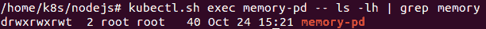
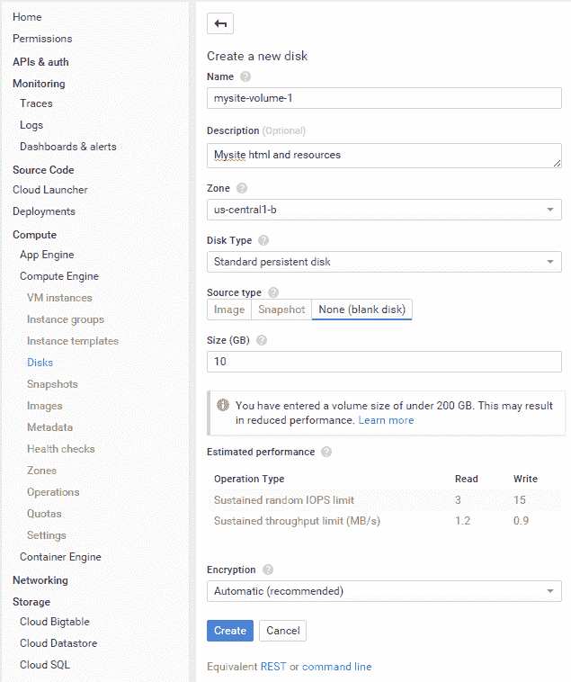
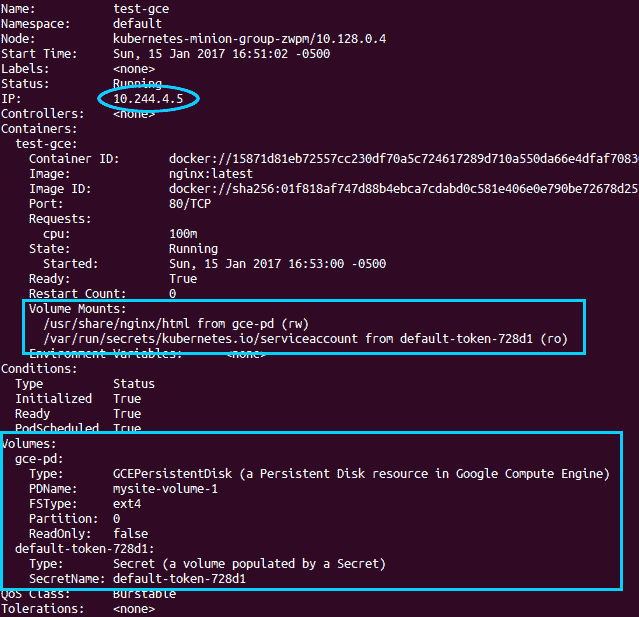
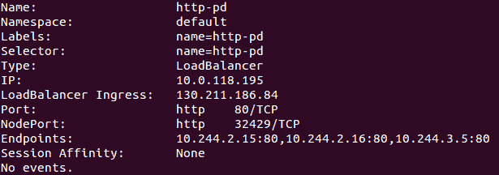
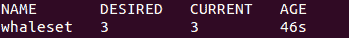
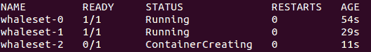
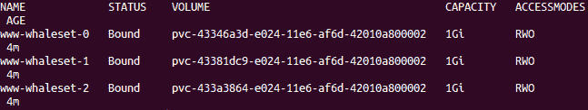
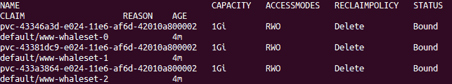
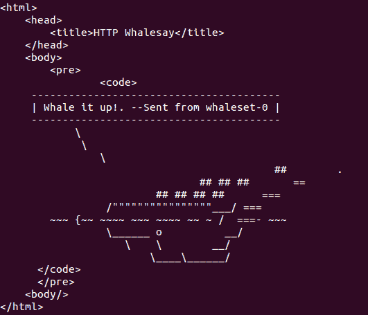
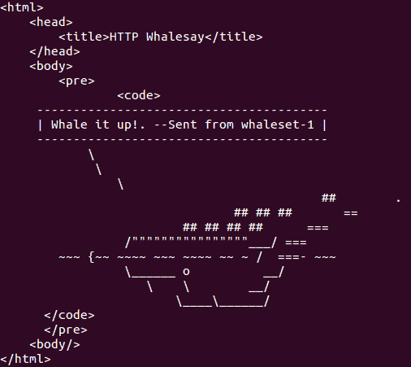

# 第五章：探索 Kubernetes 存储概念

为了支持现代微服务和其他无状态应用程序，Kubernetes 操作员需要有一种方法来管理集群上的有状态数据存储。尽管将尽可能多的状态保留在集群外部的专用数据库集群中，作为云原生服务的一部分是有优势的，但通常也需要为无状态和临时服务保持一个记录或状态集群。我们将探讨在容器编排和调度领域中被认为是一个更困难的问题：在一个依赖声明性状态、将物理设备与逻辑对象解耦，并且采用不可变系统更新方式的世界中，如何管理特定位置的可变数据。我们将探索为现代数据库引擎设置可靠、复制存储的策略。

在本章中，我们将讨论如何附加持久卷并为有状态应用程序和数据创建存储。我们将介绍存储相关问题，以及如何在多个 Pod 和容器生命周期之间持久化数据。我们将探讨`PersistentVolumes`类型，以及`PersistentVolumeClaim`。最后，我们将查看 StatefulSets 及如何使用动态卷供给。

本章将涵盖以下主题：

+   持久存储

+   `PersistentVolumes`

+   `PersistentVolumeClaim`

+   存储类

+   动态卷供给

+   StatefulSets

# 技术要求

你需要有一个正在运行的 Kubernetes 集群来进行这些示例操作。请在你选择的云提供商上启动集群，或使用本地的 Minikube 实例。

本仓库的代码可以在这里找到：[`github.com/PacktPublishing/Getting-Started-with-Kubernetes-third-edition/tree/master/Code-files/Chapter05`](https://github.com/PacktPublishing/Getting-Started-with-Kubernetes-third-edition/tree/master/Code-files/Chapter05)[.](https://github.com/PacktPublishing/Getting-Started-with-Kubernetes-third-edition/tree/master/Code%20files/Chapter%2005)

# 持久存储

到目前为止，我们只处理了那些可以随时启动和停止的工作负载，没有任何问题。然而，现实世界中的应用程序通常携带状态并记录数据，这些数据我们希望（甚至坚持）不丢失。容器本身的瞬态特性可能是一个巨大的挑战。如果你回想一下我们在第一章《Kubernetes 简介》中的分层文件系统讨论，最上层是可写的。（它也很美味。）然而，当容器死亡时，数据也随之消失。对于 Kubernetes 重新启动的崩溃容器也是如此。

这就是卷或磁盘发挥作用的地方。卷存在于容器之外，并且与 Pod 绑定，这使得我们可以在容器宕机时保存重要数据。此外，如果我们在 Pod 层面上有一个卷，数据可以在同一个应用堆栈和同一个 Pod 内的容器之间共享。Kubernetes 中的卷本身是一个目录，Pod 为其上的容器提供这个目录。`spec.volumes` 中有许多不同类型的卷，我们将会探索这些卷，它们通过 `spec.containers.volumeMounts` 参数挂载到容器中。

要查看所有可用的卷类型，请访问**[`kubernetes.io/docs/concepts/storage/volumes/#types-of-volumes`](https://kubernetes.io/docs/concepts/storage/volumes/#types-of-volumes)**。

Docker 本身对卷有一定的支持，但 Kubernetes 为我们提供了超越单个容器生命周期的持久存储。这些卷与 Pod 绑定，随着 Pod 的生死而生死。此外，Pod 可以有来自多种来源的多个卷。让我们来看看其中的一些来源。

# 临时磁盘

在容器崩溃和 Pod 内数据共享方面，实现更好持久性的最简单方法之一是使用 `emptydir` 卷。这种卷类型可以与节点机器本身的存储卷或可选的 RAM 磁盘一起使用，以提供更高的性能。

我们再次改进了单个容器之外的持久化存储，但当 Pod 被移除时，数据将丢失。机器重启也会清除任何来自 RAM 类型磁盘的数据。有时候我们只需要一些共享的临时空间，或者有些容器处理数据后将其交给另一个容器处理，直到它们消失。无论情况如何，这里有一个使用 RAM 支持选项的临时磁盘的快速示例。

打开你喜欢的编辑器，创建一个 `storage-memory.yaml` 文件并输入以下代码：

```
apiVersion: v1 
kind: Pod 
metadata: 
  name: memory-pd 
spec: 
  containers: 
  - image: nginx:latest 
    ports: 
    - containerPort: 80 
    name: memory-pd 
    volumeMounts: 
    - mountPath: /memory-pd 
      name: memory-volume 
  volumes: 
  - name: memory-volume 
    emptyDir: 
      medium: Memory 
```

上述示例现在可能已经是顺手的操作了，但我们将再次发出一个 `create` 命令，接着是一个 `exec` 命令，来查看容器中的文件夹：

```
$ kubectl create -f storage-memory.yaml
$ kubectl exec memory-pd -- ls -lh | grep memory-pd
```

这将为我们提供容器本身的 Bash Shell。`ls` 命令会显示我们在顶层看到一个 `memory-pd` 文件夹。我们使用 `grep` 来过滤输出，但你也可以不加 `| grep memory-pd` 直接运行命令来查看所有文件夹：



容器内部的临时存储

再次强调，这个文件夹是临时的，因为所有内容都存储在节点（工作节点）的 RAM 中。当节点重启时，所有文件将被删除。接下来我们将查看一个更持久的示例。

# 云卷

让我们继续进行更强大的存储配置。我们将介绍两种类型的持久卷，以说明如何使用 AWS 和 GCE 的块存储引擎为你的 Kubernetes 集群提供有状态存储。由于许多公司已经在云基础设施上做出了大量投资，我们将通过两个关键示例让你快速上手。你可以将这些类型的卷或持久卷视为存储类。这些与我们之前创建的 `emptyDir` 不同，因为即使 Pod 被删除，GCE 持久磁盘或 AWS EBS 卷的内容也会保留。展望未来，这为运维人员提供了一个巧妙的功能：能够预先填充数据到这些磁盘中，并且可以在 Pod 之间切换。

# GCE 持久磁盘

让我们首先挂载一个 `gcePersistentDisk`。你可以在这里查看更多关于这些磁盘的信息：[`cloud.google.com/compute/docs/disks/`](https://cloud.google.com/compute/docs/disks/)。

Google 持久磁盘是 Google Cloud Platform 上耐用且高性能的块存储。持久磁盘提供 SSD 和 HDD 存储，可以附加到运行在 Google 计算引擎或 Google 容器引擎中的实例上。存储卷可以透明地调整大小，快速备份，并支持同时读取。

在我们能够在集群中使用它之前，你需要使用 GCE GUI、API 或 CLI 创建一个持久磁盘，所以我们开始吧：

1.  在控制台中，进入计算引擎（Compute Engine），转到磁盘（Disks）。在此新屏幕上，点击“创建磁盘”按钮。我们将看到类似以下的 GCE 新持久磁盘截图：



GCE 新持久磁盘

1.  为这个卷选择一个名称并简要描述它。确保区域与集群中的节点相同。GCE 持久磁盘只能附加到相同区域的机器上。

1.  在“名称”字段中输入 `mysite-volume-1`。选择一个至少有一个节点的区域，选择“无”（空白磁盘）作为源类型，并在大小（GB）中输入 `10`（10 GB）。最后，点击“创建”：

GCE 上持久磁盘的一个优点是，它们允许挂载到多个机器（在我们的情况中是节点）。然而，当挂载到多个机器时，卷必须处于只读模式。因此，让我们首先将其挂载到单个 Pod，以便我们可以创建一些文件。使用以下代码创建一个 `storage-gce.yaml` 文件，来创建一个将磁盘以读写模式挂载的 Pod：

```
apiVersion: v1 
kind: Pod 
metadata: 
  name: test-gce 
spec: 
  containers: 
  - image: nginx:latest 
    ports: 
    - containerPort: 80 
    name: test-gce 
    volumeMounts: 
    - mountPath: /usr/share/nginx/html 
      name: gce-pd 
  volumes: 
  - name: gce-pd 
    gcePersistentDisk: 
      pdName: mysite-volume-1 
      fsType: ext4 
```

首先，让我们执行一个 `create` 命令，接着执行一个 `describe` 命令，查看它运行在哪个节点上：

```
$ kubectl create -f storage-gce.yaml 
$ kubectl describe pod/test-gce
```

注意节点并保存 Pod IP 地址以备后用。然后，打开一个 SSH 会话连接到该节点：



使用持久磁盘描述的 Pod

输入以下命令：

```
$ gcloud compute --project "<Your project ID>" ssh --zone "<your gce zone>" "<Node running test-gce pod>" 
```

既然我们已经从正在运行的容器内查看过卷了，这次我们直接从节点（minion）本身访问它。我们将运行 `df` 命令来查看它挂载的位置，但首先我们需要切换到 root 用户：

```
$ sudo su -
$ df -h | grep mysite-volume-1
```

如你所见，GCE 卷直接挂载到节点本身。我们可以使用早期 `df` 命令输出中列出的挂载路径。现在使用 `cd` 命令切换到该文件夹。然后，使用你喜欢的编辑器创建一个名为 `index.html` 的新文件：

```
$ cd /var/lib/kubelet/plugins/kubernetes.io/gce-pd/mounts/mysite-volume-1
$ vi index.html 
```

输入一条简单的消息，比如 `Hello from my GCE PD!`。现在，保存文件并退出编辑器。如果你还记得 `storage-gce.yaml` 文件，持久化磁盘直接挂载到 nginx 的 HTML 目录。所以，在我们仍然保持 SSH 会话打开的情况下，让我们来测试一下。使用 `curl` 命令访问我们之前记下的 pod IP：

```
$ curl <Pod IP from Describe> 
```

你应该看到 `Hello from my GCE PD!` 或者你在 `index.html` 文件中保存的任何消息。在现实场景中，我们可以将该卷用于整个网站或任何其他中央存储。让我们来看看如何运行一组负载均衡的 web 服务器，所有服务器都指向相同的卷。

首先，使用两个 `exit` 命令退出 SSH 会话。在继续之前，我们需要删除 `test-gce` pod，以便该卷可以在多个节点上以只读方式挂载：

```
$ kubectl delete pod/test-gce 
```

现在，我们可以创建一个 `ReplicationController`，它将运行三个 web 服务器，并且都挂载相同的持久化磁盘，代码如下所示。将以下代码保存为 `http-pd-controller.yaml` 文件：

```
apiVersion: v1 
kind: ReplicationController 
metadata: 
  name: http-pd 
  labels: 
    name: http-pd 
spec: 
  replicas: 3 
  selector: 
    name: http-pd 
  template: 
    metadata: 
      name: http-pd 
      labels:
        name: http-pd
    spec: 
      containers: 
      - image: nginx:latest 
        ports: 
        - containerPort: 80 
        name: http-pd 
        volumeMounts: 
        - mountPath: /usr/share/nginx/html 
          name: gce-pd 
      volumes: 
      - name: gce-pd 
        gcePersistentDisk: 
          pdName: mysite-volume-1 
          fsType: ext4 
          readOnly: true 
```

让我们还创建一个外部服务并将其保存为 `http-pd-service.yaml` 文件，这样我们就可以从集群外部访问它：

```
apiVersion: v1 
kind: Service 
metadata: 
  name: http-pd 
  labels: 
    name: http-pd 
spec: 
  type: LoadBalancer 
  ports: 
  - name: http 
    protocol: TCP 
    port: 80 
  selector: 
    name: http-pd 
```

现在就创建这两个资源吧。稍等片刻，等待外部 IP 分配完毕。之后，使用 `describe` 命令我们可以得到一个可以在浏览器中使用的 IP：

```
$ kubectl describe service/http-pd
```

以下截图是前面命令的结果：



K8s 服务与 GCE PD 共享的三个 pod

如果你还没有看到 `LoadBalancer Ingress` 字段，可能需要更多时间才能分配。将 `LoadBalancer Ingress` 中的 IP 地址输入浏览器，你应该能看到你之前输入文本的 `index.html` 文件！

# AWS 弹性块存储

K8s 还支持 AWS **弹性块存储**（**EBS**）卷。与 GCE 持久化磁盘类似，EBS 卷要求附加到同一可用区中运行的实例上。另一个限制是，EBS 卷一次只能挂载到单个实例。和之前一样，你需要通过 API 调用、CLI 或者手动登录到 GUI 来创建 `volumeID` 引用的 EBS 卷。如果你已授权使用 AWS CLI，可以使用以下命令创建卷：

```
$ aws ec2 create-volume --availability-zone=us-west-1a eu-west-1a --size=20 --volume-type=gp2
```

确保你的卷是在与你的 Kubernetes 集群相同的区域内创建的！

为了简洁起见，我们将不详细演示一个 AWS 示例，但已经包含了一个示例 YAML 文件，帮助你入门。再次提醒，记得在部署 pod 之前创建 EBS 卷。将以下代码保存为`storage-aws.yaml`文件：

```
apiVersion: v1 
kind: Pod 
metadata: 
  name: test-aws 
spec: 
  containers: 
  - image: nginx:latest 
    ports: 
    - containerPort: 80 
    name: test-aws 
    volumeMounts: 
    - mountPath: /usr/share/nginx/html 
      name: aws-pd 
  volumes: 
  - name: aws-pd 
    awsElasticBlockStore: 
      volumeID: aws://<availability-zone>/<volume-id> 
      fsType: ext4 
```

# 其他存储选项

Kubernetes 支持多种其他类型的存储卷。完整列表请见此处：[`kubernetes.io/docs/concepts/storage/volumes/#types-of-volumes`](https://kubernetes.io/docs/concepts/storage/volumes/#types-of-volumes)。 [](http://kubernetes.io/v1.0/docs/user-guide/volumes.html#types-of-volumes)

以下是几个可能特别感兴趣的选项：

+   `nfs`：这种类型允许我们挂载**网络文件共享**（**NFS**），这对于数据持久化和在基础设施之间共享数据非常有用。

+   `gitrepo`：正如你可能猜到的，这个选项会将 Git 仓库克隆到一个新的空文件夹中。

# 持久卷和存储类

到目前为止，我们已看到在 pod 定义中直接配置存储的示例。如果你完全控制集群和基础设施，这种方式非常有效，但在更大的规模上，应用程序所有者可能希望使用独立管理的存储。通常，中央 IT 团队或云服务提供商会处理存储的配置细节，而应用程序所有者则专注于他们的主要任务——应用程序本身。Kubernetes 中这种关注点和职责的分离，使得你可以围绕一个可以由独立工程团队管理的存储子系统来组织你的工程重点。

为了适应这一点，我们需要一种方式让应用程序指定和请求存储，而无需关注存储是如何提供的。这就是`PersistentVolumes`和`PersistentVolumeClaim`派上用场的地方。

`PersistentVolumes` 类似于我们之前创建的卷，但它们是由集群管理员提供的，不依赖于特定的 pod。`PersistentVolumes` 是提供给集群的资源，就像任何其他对象一样。Kubernetes API 提供了这种对象的接口，支持 NFS、EBS 持久磁盘或之前描述的任何其他卷类型。一旦卷被创建，你可以使用`PersistentVolumeClaims`请求为应用程序提供存储。

`PersistentVolumeClaims`是一个抽象，它允许用户指定所需存储的详细信息。我们可以定义存储的大小，以及访问类型，如`ReadWriteOnce`（由一个节点读写）、`ReadOnlyMany`（由多个节点只读）和`ReadWriteMany`（由多个节点读写）。集群操作员负责为应用程序操作员提供多种存储选项，以满足不同访问模式、大小、速度和耐用性等要求，而无需最终用户了解具体的实现细节。集群操作员支持的模式取决于后端存储提供商。例如，我们在 AWS `aws-ebs`示例中看到，多个节点挂载不是一个选项，而在 GCP Persistent Disks 中，磁盘可以在只读模式下被多个节点共享。

此外，Kubernetes 提供了两种其他方法来指定特定类型或分组的存储卷。第一种是使用选择器，就像我们之前用于 Pod 选择一样。在这里，标签可以应用于存储卷，然后声明可以引用这些标签来进一步筛选所提供的卷。第二种，Kubernetes 有`StorageClass`的概念，它允许我们指定存储提供者和其提供的卷类型的参数。

`PersistentVolumes`和`PersistentVolumeClaims`有一个生命周期，包括以下阶段：

+   供应

+   静态或动态

+   绑定

+   使用

+   回收

+   删除、保留或回收

我们将在下一节深入探讨存储类，但这里有一个`PersistentVolumeClaim`的快速示例，供说明使用。你可以在注释中看到，我们请求在`ReadWriteOnce`模式下分配`1Gi`存储，`StorageClass`为`solidstate`，并且标签为`aws-storage`。请将以下代码保存为`pvc-example.yaml`文件：

```
kind: PersistentVolumeClaim
apiVersion: v1
metadata:
  name: demo-claim
spec:
  accessModes:
  - ReadWriteOnce
  volumeMode: Filesystem
  resources:
    requests:
      storage: 1Gi
  storageClassName: ssd
  selector:
    matchLabels:
      release: "aws-storage"
  matchExpressions:
      - {key: environment, operator: In, values: [dev, stag, uat]}
```

从 Kubernetes 1.8 版本开始，`PersistentVolumeClaim`也支持对`gcePersistentDisk`、`awsElasticBlockStore`、`Cinder`、`glusterfs`和`rbd`卷类型进行扩展的 alpha 支持。这些类似于你可能在 VMware 等系统中看到的薄配置，它们允许通过`allowVolumeExpansion`字段来调整存储类的大小，只要你使用的是 XFS 或 Ext3/Ext4 文件系统。以下是一个快速示例：

```
kind: StorageClass
apiVersion: storage.k8s.io/v1
metadata:
 name: Cinder-volume-01
provisioner: kubernetes.io/cinder
parameters:
 resturl: "http://192.168.10.10:8080"
 restuser: ""
 secretNamespace: ""
 secretName: ""
allowVolumeExpansion: true
```

# 动态卷供应

现在我们已经探讨了如何通过卷、存储类、持久卷和持久卷声明来构建存储，让我们看看如何将这一切动态化，并利用云的内建扩展能力！动态供应消除了对预先制作存储的需求；它依赖于应用程序用户的请求。你可以使用`StorageClass` API 对象来创建动态资源。

首先，我们可以创建一个清单，定义我们将用于动态存储的存储类类型。我们将在这里使用一个 vSphere 示例来尝试另一种存储类：

```
apiVersion: storage.k8s.io/v1
kind: StorageClass
metadata: 
  name: durable-medium
provisioner: kubernetes.io/vsphere-volume
parameters:
  type: thin
```

一旦我们拥有清单，我们可以通过将其作为类包含在新的 `PersistentVolumeClaim` 中来使用此存储。你可能记得在 Kubernetes 1.6 之前的版本中，它被称为 `volume.beta.kubernetes.io/storage-class`，但现在你可以简单地将这个属性包含在 `PersistentVolumeClaim` 对象中。请记住，`storageClassName` 的值必须与集群操作员提供的可用动态 `StorageClass` 匹配。以下是一个示例：

```
apiVersion: v1
kind: PersistentVolumeClaim
metadata:
 name: webtier-vclaim-01
spec:
 accessModes:
   - ReadWriteMany
 storageClassName: durable-medium
 resources:
   requests:
     storage: 20Gi
```

当这个声明被删除时，存储会被动态删除。你可以通过确保启用 `DefaultStorageClass` 准入控制器，并确保将一个 `StorageClass` 对象设置为默认值来使其成为集群的默认值。

# StatefulSets

StatefulSets 的目的是为具有状态数据的应用程序部署提供一些一致性和可预测性。到目前为止，我们已将应用程序部署到集群中，定义了围绕所需资源（如计算和存储）的宽松要求。集群已将我们的工作负载调度到任何能够满足这些要求的节点上。虽然我们可以利用一些约束以更可预测的方式进行部署，但如果有一个构造可以帮助我们提供这种一致性，那就更有帮助了。

StatefulSets 在 1.6 版本中正式发布。它们之前在 1.5 版本中是 beta 版本，在此之前（1.3 和 1.4 版本）被称为 Pet Sets（alpha）。

这就是 StatefulSets 的作用。StatefulSets 首先为我们提供了用于网络访问和存储声明的编号和可靠命名。Pod 本身的命名遵循以下约定，其中 `N` 从 0 到副本数：

```
"Name of Set"-N
```

这意味着一个名为 `db` 的 StatefulSet，具有三个副本，将创建以下 Pod：

```
db-0
db-1
db-2
```

这为 Kubernetes 提供了一种将网络名称和 `PersistentVolumes` 与特定 Pod 关联的方法。此外，它还用于控制 Pod 的创建和终止顺序。Pod 将从 `0` 启动到 `N`，并从 `N` 终止到 `0`。

# 一个有状态的示例

让我们来看一个有状态应用的示例。首先，我们需要创建并使用一个`StorageClass`，正如我们之前讨论的那样。这将允许我们连接到 Google Cloud Persistent Disk 提供者。Kubernetes 社区正在为各种 `StorageClasses` 构建提供者，包括 GCP 和 AWS。每个提供者都有自己的一组可用参数。GCP 和 AWS 提供者都允许您选择磁盘类型（固态、标准等），以及与之匹配的 pod 附加的故障域。AWS 还允许您指定加密参数以及为预配置的 IOPs 卷设置 IOPs。还有许多其他提供者正在开发中，包括 Azure 以及各种非云选项。将以下代码保存为 `solidstate-sc.yaml` 文件：

```
kind: StorageClass
apiVersion: storage.k8s.io/v1
metadata:
  name: solidstate
provisioner: kubernetes.io/gce-pd
parameters:
  type: pd-ssd
  zone: us-central1-b
```

使用以下命令结合前面的列表来在 `us-central1-b` 创建一个 `StorageClass` 类型的 SSD 磁盘：

```
$ kubectl create -f solidstate.yaml
```

接下来，我们将创建一个 `StatefulSet` 类型，并使用我们可靠的 `httpwhalesay` 示例应用。虽然这个应用并不包含任何实际的状态，但我们可以看到存储声明并探索通信路径，如 `sayhey-statefulset.yaml` 列表所示：

```
apiVersion: apps/v1
kind: StatefulSet
metadata:
  name: whaleset
spec:
  serviceName: sayhey-svc
  replicas: 3
  template:
    metadata:
      labels:
        app: sayhey
    spec:
      terminationGracePeriodSeconds: 10
      containers:
      - name: sayhey
        image: jonbaier/httpwhalesay:0.2
        command: ["node", "index.js", "Whale it up!."]
        ports:
        - containerPort: 80
          name: web
        volumeMounts:
        - name: www
          mountPath: /usr/share/nginx/html
  volumeClaimTemplates:
  - metadata:
      name: www
      annotations:
        volume.beta.kubernetes.io/storage-class: solidstate
    spec:
      accessModes: [ "ReadWriteOnce" ]
      resources:
        requests:
          storage: 1Gi
```

使用以下命令开始创建这个 StatefulSet。如果您仔细观察 pod 创建过程，您将看到它依次创建 `whaleset-0`、`whaleset-1` 和 `whaleset-2`：

```
$ kubectl create -f sayhey-statefulset.yaml
```

紧接着，我们可以使用熟悉的 `get` 子命令查看我们的 StatefulSet 和相应的 pods：

```
$ kubectl get statefulsets
$ kubectl get pods
```

这些 pod 应该会生成类似于以下图片的输出：



StatefulSet 列表

`get pods` 的输出将显示以下内容：



StatefulSet 创建的 pod

根据您的时机，pod 可能仍在创建中。正如您在前面的截图中看到的，第三个容器仍在启动中。

我们还可以看到该集合为每个 pod 创建并声明的卷。首先是 `PersistentVolumes` 本身：

```
$ kubectl get pv
```

前面的命令应该显示名为 `www-whaleset-N` 的三个 `PersistentVolumes`。我们注意到其大小为 `1Gi`，访问模式设置为 **ReadWriteOnce** (**RWO**)，正如我们在 `StorageClass` 中定义的那样：



PersistentVolumes 列表

接下来，我们可以查看为每个 pod 保留卷的 `PersistentVolumeClaim`：

```
$ kubectl get pvc
```

以下是前一个命令的输出：



PersistentVolumeClaim 列表

你会注意到这里与 `PersistentVolumes` 本身有许多相同的设置。你还会注意到声明名称的结尾（或之前列出的 `PersistentVolumeClaim` 名称）看起来像是 `www-whaleset-N`。`www` 是我们在前面 YAML 定义中指定的挂载名称。接着，这个名称会与 Pod 名称一起拼接，形成实际的 `PersistentVolume` 和 `PersistentVolumeClaim` 名称。我们还可以确保将正确的磁盘与匹配的 Pod 进行关联。

网络通信中，另一个需要对齐的领域是 StatefulSets 的一致命名。在此之前，我们需要创建一个服务端点 `sayhey-svc.yaml`，这样我们就有了一个通用的入口点来处理传入的请求：

```
apiVersion: v1
kind: Service
metadata:
  name: sayhey-svc
  labels:
    app: sayhey
spec:
  ports:
  - port: 80
    name: web
  clusterIP: None
  selector:
    app: sayhey
$ kubectl create -f sayhey-svc.yaml
```

现在，让我们在其中一个 Pod 中打开一个 shell，看看我们能否与该集合中的另一个 Pod 进行通信：

```
$ kubectl exec whaleset-0 -i -t bash
```

上述命令给了我们第一个 `whaleset` Pod 的 bash shell。现在，我们可以使用服务名称发出简单的 HTTP 请求。我们可以使用短名称 `sayhey-svc` 以及完全限定名称 `sayhey-svc.default.svc.cluster.local`：

```
$ curl sayhey-svc
$ curl sayhey-svc.default.svc.cluster.local
```

你将看到类似于以下截图的输出。服务端点作为所有三个 Pod 的公共通信点：



HTTP whalesay curl 输出（whalesay-0 Pod）

现在，让我们看看我们能否与 StatefulSet 中的特定 Pod 进行通信。如我们之前所注意到的，StatefulSet 以有序的方式命名 Pod。它还以类似的方式为它们分配主机名，因此每个 Pod 在集合中都有一个特定的 DNS 条目。同样，我们将看到`"Name of Set"-N`的惯例，然后添加完全限定的服务 URL。以下示例展示了 `whaleset-1`，即集合中的第二个 Pod：

```
$ curl whaleset-1.sayhey-svc.default.svc.cluster.local
```

从我们现有的 Bash shell 中运行此命令，位于 `whaleset-0`，将显示来自 `whaleset-1` 的输出：



HTTP whalesay curl 输出（whalesay-1 Pod）

现在，你可以通过 `exit` 退出这个 shell。

为了学习目的，描述这一部分中的某些项目的更多细节也可能是有益的。例如，`kubectl describe svc sayhey-svc` 将显示服务端点中的所有三个 Pod IP 地址。

# 总结

在本章中，我们探索了多种持久化存储选项以及如何在我们的 Pod 中实现它们。我们研究了`PersistentVolumes`和`PersistentVolumeClaim`，它们使我们能够分离存储供应和应用存储请求。此外，我们还研究了`StorageClasses`，它根据规范来提供一组存储。

我们还探索了新的 StatefulSets 抽象，并了解了如何以一致且有序的方式部署有状态应用程序。在下一章中，我们将探讨如何将 Kubernetes 与持续集成和交付管道集成。

# 问题

1.  请列出 Kubernetes 支持的四种卷类型。

1.  你可以使用哪个参数来启用一个简单的、半持久的临时磁盘？

1.  举出两种使`PersistentVolumes`在**云服务提供商**（**CSPs**）中易于实现的支持技术。

1.  创建不同类型`StorageClasses`的一个好理由是什么？

1.  举出`PersistentVolume`和`PersistentVolumeClaim`生命周期中的两个阶段

1.  哪个 Kubernetes 对象用于提供基于状态存储的应用？

# 进一步阅读

+   如果你想了解更多关于动态存储配置的内容，请阅读这篇博客文章：[`kubernetes.io/blog/2017/03/dynamic-provisioning-and-storage-classes-kubernetes/`](https://kubernetes.io/blog/2017/03/dynamic-provisioning-and-storage-classes-kubernetes/)

+   如果你想了解更多关于**存储特别兴趣小组**（**SIG**）的前沿内容，可以在这里阅读：[`github.com/kubernetes/community/tree/master/sig-storage`](https://github.com/kubernetes/community/tree/master/sig-storage)
