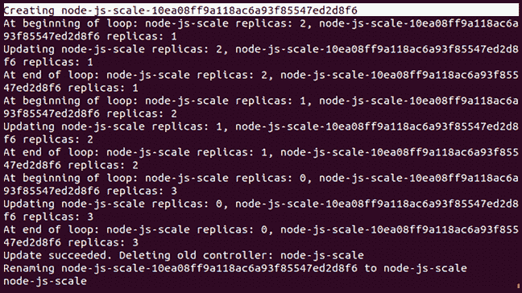
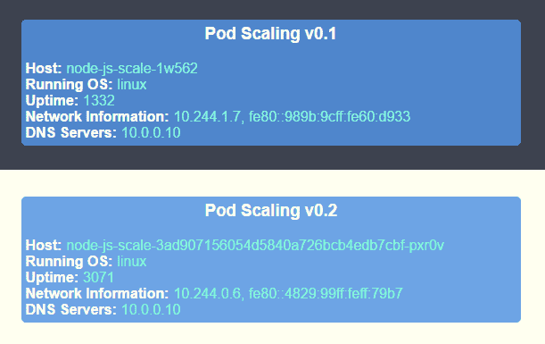
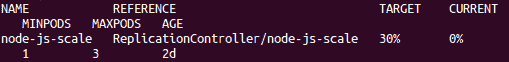
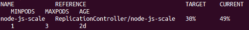
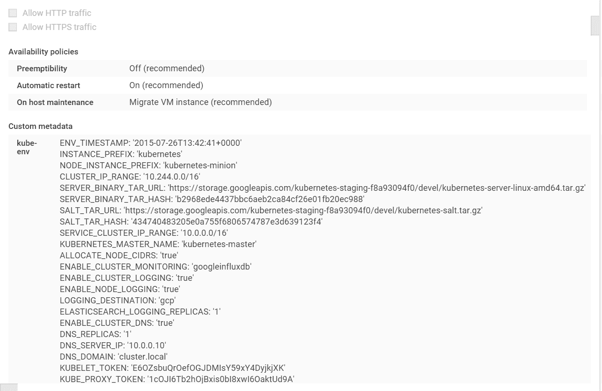
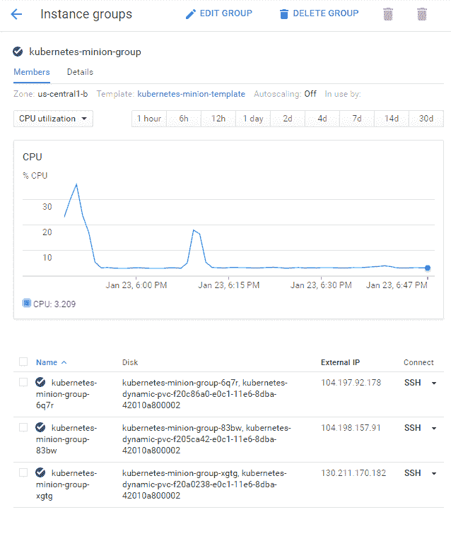
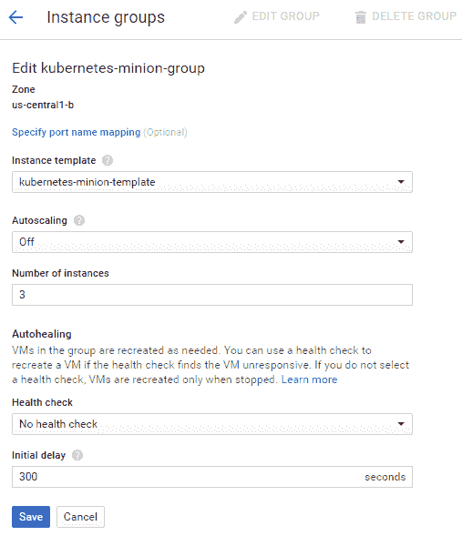
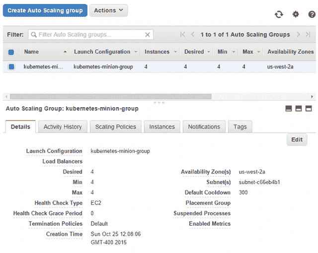

# 第六章：应用程序更新、渐进式发布和自动扩展

本章将扩展核心概念，向您展示如何推出更新并测试应用程序的新功能，同时尽量减少对正常运行时间的干扰。它将涵盖应用更新、渐进式发布和 A/B 测试的基础知识。此外，我们还将研究如何扩展 Kubernetes 集群本身。

在版本 1.2 中，Kubernetes 发布了部署（Deployments）API。部署是今后处理扩展和应用程序更新的推荐方式。如前几章所述，`ReplicationControllers` 已不再是管理应用更新的推荐方式。然而，由于它们仍然是许多操作员的核心功能，我们将在本章中探索滚动更新，以介绍扩展概念，然后在下一章深入探讨使用部署的首选方法。

我们还将调查 Helm 和 Helm Charts 的功能，这将帮助您管理 Kubernetes 资源。Helm 是管理 Kubernetes 包的一种方式，就像 `apt`/`yum` 在 Linux 生态系统中管理代码一样。Helm 还允许您与他人共享您的应用程序，最重要的是创建可重现的 Kubernetes 应用程序构建。

在本章中，我们将涵盖以下主题：

+   应用程序扩展

+   滚动更新

+   A/B 测试

+   应用程序自动扩展

+   扩展您的集群

+   使用 Helm

# 技术要求

您需要启用并登录到您的 Google Cloud Platform 帐户，或者可以使用本地的 Minikube 实例来运行 Kubernetes。您还可以通过网络使用 Play with Kubernetes：[`labs.play-with-k8s.com/`](https://labs.play-with-k8s.com/)。

以下是本章的 GitHub 仓库：[`github.com/PacktPublishing/Getting-Started-with-Kubernetes-third-edition/tree/master/Code-files/Chapter06`](https://github.com/PacktPublishing/Getting-Started-with-Kubernetes-third-edition/tree/master/Code-files/Chapter06)[.](https://github.com/PacktPublishing/Getting-Started-with-Kubernetes-third-edition/tree/master/Code%20files/Chapter%2006)

# 示例设置

在开始探索 Kubernetes 中内置的各种扩展和更新功能之前，我们需要一个新的示例环境。我们将使用之前容器镜像的一个变种，背景为蓝色（请参见本章后面的 *v0.1 和 v0.2（并排）* 图像进行比较）。我们在 `pod-scaling-controller.yaml` 文件中有以下代码：

```
apiVersion: v1 
kind: ReplicationController 
metadata: 
  name: node-js-scale 
  labels: 
    name: node-js-scale 
spec: 
  replicas: 1 
  selector: 
    name: node-js-scale 
  template: 
    metadata: 
      labels: 
        name: node-js-scale 
    spec: 
      containers: 
      - name: node-js-scale 
        image: jonbaier/pod-scaling:0.1 
        ports: 
        - containerPort: 80
```

将以下代码保存为 `pod-scaling-service.yaml` 文件：

```
apiVersion: v1 
kind: Service 
metadata: 
  name: node-js-scale 
  labels: 
    name: node-js-scale 
spec: 
  type: LoadBalancer 
  sessionAffinity: ClientIP 
  ports: 
  - port: 80 
  selector: 
    name: node-js-scale
```

使用以下命令创建这些服务：

```
$ kubectl create -f pod-scaling-controller.yaml
$ kubectl create -f pod-scaling-service.yaml
```

服务的公共 IP 地址可能需要一些时间来创建。

# 扩展

随着时间的推移，当你在 Kubernetes 集群中运行应用程序时，你会发现一些应用程序需要更多资源，而另一些则能以较少的资源运行。与其删除整个`ReplicationControllers`（及相关 Pods），我们更希望有一种无缝的方法来扩展或收缩我们的应用程序。

幸运的是，Kubernetes 包含一个专门用于此目的的`scale`命令。`scale`命令既适用于`ReplicationControllers`，也适用于新的部署抽象。现在，我们将探讨它与`ReplicationControllers`一起使用的方式。在我们的新示例中，只有一个副本在运行。你可以通过`get pods`命令检查这一点：

```
$ kubectl get pods -l name=node-js-scale
```

让我们试着用以下命令将其扩展到三个：

```
$ kubectl scale --replicas=3 rc/node-js-scale
```

如果一切顺利，你将只在终端窗口的输出中看到`scaled`这个词。

可选地，你可以指定`--current-replicas`标志作为验证步骤。只有当前运行的副本数量与该计数匹配时，扩展操作才会发生。

在再次列出我们的 Pods 之后，我们应该现在能看到三个名称类似于`node-js-scale-XXXXX`的 Pods，其中`X`字符是一个随机字符串。

你也可以使用`scale`命令减少副本的数量。在任何一种情况下，`scale`命令都会添加或移除必要的 Pod 副本，并且服务会自动更新并平衡到新的或剩余的副本上。

# 平滑更新

随着我们的资源需求变化，我们的应用程序的扩展和收缩对于许多生产场景来说非常有用，但对于简单的应用更新怎么办呢？任何生产系统都会进行代码更新、修复补丁和功能添加。这些更新可能是每月、每周，甚至每天发生。确保我们有一种可靠的方法来推送这些更改而不会中断用户使用是至关重要的。

再次受益于 Kubernetes 系统多年的经验。1.0 版本中内置了对滚动更新的支持。`rolling-update`命令允许我们更新整个`ReplicationControllers`，或者仅更新每个副本使用的底层 Docker 镜像。我们还可以指定更新间隔，这样可以一次更新一个 Pod，并在继续进行到下一个之前等待。

让我们以扩展示例为例，执行一个滚动更新，将容器镜像更新到 0.2 版本。我们将使用 2 分钟的更新间隔，这样可以通过以下方式观察整个过程：

```
$ kubectl rolling-update node-js-scale --image=jonbaier/pod-scaling:0.2 --update-period="2m"
```

你应该会看到一些关于创建一个新的名为`node-js-scale-XXXXX`的`ReplicationControllers`的文本，其中`X`字符是一个由数字和字母组成的随机字符串。此外，你还会看到一个循环的开始，它会启动新版本的一个副本，并移除现有`ReplicationControllers`中的一个副本。这个过程将继续，直到新的`ReplicationControllers`拥有完整数量的副本。

如果我们想实时跟踪，可以打开另一个终端窗口，使用`get pods`命令和标签过滤器来查看发生了什么：

```
$ kubectl get pods -l name=node-js-scale
```

该命令将筛选出名称中包含`node-js-scale`的 pod。如果你在执行`rolling-update`命令后运行这个命令，你应该会看到几个 pod 在运行，因为它在创建新版本并逐个删除旧版本。

上一个`rolling-update`命令的完整输出应该类似于下面这张截图：



扩展输出

正如我们所见，Kubernetes 首先创建了一个名为`node-js-scale-10ea08ff9a118ac6a93f85547ed28f6`的新`ReplicationController`。然后 K8s 逐个循环，先在新控制器中创建一个新的 pod，再从旧控制器中删除一个 pod。这个过程一直持续，直到新控制器的副本数量达到完整，旧控制器的副本数量为零。之后，旧控制器被删除，新控制器被重命名为原控制器的名称。

如果你现在运行`get pods`命令，你会注意到这些 pod 仍然有较长的名称。或者，我们可以在命令中指定一个新的控制器名称，Kubernetes 会使用该名称创建新的`ReplicationControllers`和 pod。再次强调，旧名称的控制器在更新完成后会自动消失。我建议你为更新后的控制器指定一个新的名称，以避免将来在 pod 命名时产生混淆。使用这种方法的相同`update`命令如下所示：

```
$ kubectl rolling-update node-js-scale node-js-scale-v2.0 --image=jonbaier/pod-scaling:0.2 --update-period="2m"
```

使用我们在第一部分创建的服务的静态外部 IP 地址，我们可以在浏览器中打开该服务。我们应该能看到标准的容器信息页面。然而，你会注意到标题现在显示为 Pod Scaling v0.2，背景为浅黄色：



v0.1 和 v0.2（并排显示）

值得注意的是，在整个更新过程中，我们只关注了 pod 和`ReplicationControllers`。我们没有对服务做任何操作，但服务依然正常运行，并且现在指向新版本的 pod。这是因为我们的服务使用标签选择器来进行成员管理。由于我们的旧副本和新副本使用相同的标签，服务没有问题，可以使用新 pod 来处理请求。更新是在 pod 上逐个进行的，因此对服务的用户来说是无缝的。

# 测试、发布和切换

滚动更新功能在简单的蓝绿部署场景中可以很好地工作。然而，在实际的蓝绿部署中，涉及多个应用程序的堆栈可能会有各种依赖关系，需要进行深入的测试。`update-period`命令允许我们添加一个`timeout`标志，在这里可以进行一些测试，但这对于测试目的来说并不总是足够的。

类似地，您可能希望将部分更改持续较长时间，并一直持续到负载均衡器或服务级别。例如，您可能希望对一部分用户运行新用户界面功能的 A/B 测试。另一个例子是将您的应用程序以金丝雀发布（在这种情况下是一个副本）的方式运行在新基础设施上，比如新增的集群节点。

让我们看一个 A/B 测试的示例。在这个示例中，我们需要创建一个使用`sessionAffinity`的新服务。我们将亲和性设置为`ClientIP`，这样可以将客户端引导到相同的后端 Pod。以下列出的`pod-AB-service.yaml`文件是关键，如果我们希望一部分用户看到一个版本，而其他用户看到另一个版本：

```
apiVersion: v1 
kind: Service 
metadata: 
  name: node-js-scale-ab 
  labels: 
    service: node-js-scale-ab 
spec: 
  type: LoadBalancer 
  ports: 
  - port: 80 
  sessionAffinity: ClientIP 
  selector: 
    service: node-js-scale-ab
```

按照以下方式，像往常一样使用`create`命令创建此服务：

```
$ kubectl create -f pod-AB-service.yaml
```

这将创建一个服务，指向运行应用程序版本 0.2 和 0.3 的 Pod。接下来，我们将创建两个`ReplicationControllers`，它们会创建应用程序的两个副本。一组将运行版本 0.2，另一组将运行版本 0.3，如`pod-A-controller.yaml`和`pod-B-controller.yaml`文件所示：

```
apiVersion: v1 
kind: ReplicationController 
metadata: 
  name: node-js-scale-a 
  labels: 
    name: node-js-scale-a 
    version: "0.2" 
    service: node-js-scale-ab 
spec: 
  replicas: 2 
  selector: 
    name: node-js-scale-a 
    version: "0.2" 
    service: node-js-scale-ab 
  template: 
    metadata: 
      labels: 
        name: node-js-scale-a 
        version: "0.2" 
        service: node-js-scale-ab 
    spec: 
      containers: 
      - name: node-js-scale 
        image: jonbaier/pod-scaling:0.2 
        ports: 
        - containerPort: 80 
        livenessProbe: 
          # An HTTP health check 
          httpGet: 
            path: / 
            port: 80 
          initialDelaySeconds: 30 
          timeoutSeconds: 5 
        readinessProbe: 
          # An HTTP health check 
          httpGet: 
            path: / 
            port: 80 
          initialDelaySeconds: 30 
          timeoutSeconds: 1
apiVersion: v1 
kind: ReplicationController 
metadata: 
  name: node-js-scale-b 
  labels: 
    name: node-js-scale-b 
    version: "0.3" 
    service: node-js-scale-ab 
spec: 
  replicas: 2 
  selector: 
    name: node-js-scale-b 
    version: "0.3" 
    service: node-js-scale-ab 
  template: 
    metadata: 
      labels: 
        name: node-js-scale-b 
        version: "0.3" 
        service: node-js-scale-ab 
    spec: 
      containers: 
      - name: node-js-scale 
        image: jonbaier/pod-scaling:0.3 
        ports: 
        - containerPort: 80 
        livenessProbe: 
          # An HTTP health check 
          httpGet: 
            path: / 
            port: 80 
          initialDelaySeconds: 30 
          timeoutSeconds: 5 
        readinessProbe: 
          # An HTTP health check 
          httpGet: 
            path: / 
            port: 80 
          initialDelaySeconds: 30 
          timeoutSeconds: 1
```

请注意，我们有相同的服务标签，因此这些副本也将根据此选择器添加到服务池中。我们还定义了`livenessProbe`和`readinessProbe`，以确保我们的新版本按预期工作。同样，使用`create`命令启动控制器：

```
$ kubectl create -f pod-A-controller.yaml
$ kubectl create -f pod-B-controller.yaml
```

现在，我们有一个平衡两个版本应用的服务。在真正的 A/B 测试中，我们现在希望开始收集每个版本的访问指标。同样，我们将`sessionAffinity`设置为`ClientIP`，因此所有请求将指向同一 Pod。一部分用户将看到 v0.2，另一部分用户将看到 v0.3。

因为我们开启了`sessionAffinity`，所以您的测试很可能每次都会显示相同的版本。这是预期的，您需要尝试从多个 IP 地址连接，以查看每个版本的用户体验。

由于每个版本都运行在独立的 Pod 上，您可以轻松分离日志记录，甚至为 Pod 定义添加一个日志容器，采用边车日志模式。为了简洁起见，本书不讨论此设置，但我们将在第八章《监控与日志》中讨论一些日志工具。

我们可以开始看到这个过程如何对金丝雀发布或手动蓝绿部署有所帮助。我们还可以看到推出新版本并逐步过渡到新版本是多么容易。

让我们快速看看一个基本的过渡。实际上，只需几个`scale`命令，命令如下：

```
$ kubectl scale --replicas=3 rc/node-js-scale-b
$ kubectl scale --replicas=1 rc/node-js-scale-a
$ kubectl scale --replicas=4 rc/node-js-scale-b
$ kubectl scale --replicas=0 rc/node-js-scale-a
```

使用`get pods`命令，并结合`-l`过滤器，在`scale`命令之间观察过渡过程。

现在，我们已经完全过渡到版本 0.3（`node-js-scale-b`）。所有用户现在都会看到版本 0.3 的网站。我们有四个版本 0.3 的副本，没有版本 0.2 的副本。如果你运行 `get rc` 命令，你会注意到我们仍然有一个版本 0.2 的 `ReplicationControllers`（`node-js-scale-a`）。作为最终的清理，我们可以完全移除这个控制器，如下所示：

```
$ kubectl delete rc/node-js-scale-a
```

# 应用程序自动扩缩

Kubernetes 最近新增了一个特性，那就是水平 pod 自动扩缩器。这个资源类型非常有用，因为它为我们提供了一种自动设置应用程序扩展阈值的方法。目前，支持的阈值仅限于 CPU，但也有对自定义应用程序指标的 alpha 支持。

让我们使用章节开头的 `node-js-scale` `ReplicationController`，并添加自动扩缩组件。在我们开始之前，让我们确保使用以下命令将副本缩减回一个：

```
$ kubectl scale --replicas=1 rc/node-js-scale
```

现在，我们可以创建一个水平 pod 自动扩缩器，`node-js-scale-hpa.yaml`，并定义以下 `hpa` 配置：

```
apiVersion: autoscaling/v1
kind: HorizontalPodAutoscaler
metadata:
  name: node-js-scale
spec:
  minReplicas: 1
  maxReplicas: 3
  scaleTargetRef:
    apiVersion: v1
    kind: ReplicationController
    name: node-js-scale
  targetCPUUtilizationPercentage: 20
```

继续使用 `kubectl create -f` 命令创建它。现在，我们可以列出水平 pod 自动扩缩器并获取描述：

```
$ kubectl get hpa 
```

我们还可以通过命令行使用 `kubectl autoscale` 命令创建自动扩缩。之前的 YAML 文件将如下所示：

`$ kubectl autoscale rc/node-js-scale --min=1 --max=3 --cpu-percent=20`

这将显示我们一个 `node-js-scale` `ReplicationController` 的自动扩缩器，目标 CPU 使用率为 30%。另外，你会看到最小 pod 数为 1，最大为 3：



没有负载时的水平 pod 自动扩缩器

让我们查询一下我们的 pod，看看现在有多少个正在运行：

```
$ kubectl get pods -l name=node-js-scale
```

我们应该只看到一个 `node-js-scale` pod，因为我们的水平 pod 自动扩缩器显示 CPU 使用率为 0%，所以我们需要生成一些负载。我们将使用在许多容器演示中常见的流行应用程序 `boom`。以下清单 `boomload.yaml` 将帮助我们创建持续的负载，直到我们达到自动扩缩器的 CPU 阈值：

```
apiVersion: v1
kind: ReplicationController
metadata:
  name: boomload
spec:
  replicas: 1
  selector:
    app: loadgenerator
  template:
    metadata:
      labels:
        app: loadgenerator
    spec:
      containers:
      - image: williamyeh/boom
        name: boom
        command: ["/bin/sh","-c"]
        args: ["while true ; do boom http://node-js-scale/ -c 10 -n 100      
        ; sleep 1 ; done"]
```

使用`kubectl create -f`命令和这个清单，然后准备开始监控`hpa`。我们可以使用之前用过的`kubectl get hpa`命令来做到这一点。

可能需要一些时间，但我们应该开始看到当前的 CPU 使用率增加。一旦超过我们设定的 20% 阈值，自动扩缩器将开始工作：



负载开始后，水平 pod 自动扩缩器

一旦看到这一点，我们可以再次运行 `kubectl get pod`，看到现在有几个 `node-js-scale` pod：

```
$ kubectl get pods -l name=node-js-scale
```

我们现在可以通过终止我们的负载生成 pod 来清理：

```
$ kubectl delete rc/boomload
```

现在，如果我们观察 `hpa`，我们应该开始看到 CPU 使用率下降。可能需要几分钟，但最终我们会回到 0% 的 CPU 负载。

# 扩展集群

所有这些技术对于扩展应用程序都非常有用，但集群本身呢？在某个时刻，你会将节点填满，并需要更多资源来调度新 pod 以容纳你的工作负载。

# 自动扩展

当你创建集群时，可以通过 `NUM_MINIONS` 环境变量自定义启动时的节点（minion）数量。默认值设置为 4。

此外，Kubernetes 团队已经开始在集群本身中构建自动扩展功能。目前，这项功能仅在 GCE 和 GKE 上受支持，但其他云提供商也在进行相关工作。此功能使用了 `KUBE_AUTOSCALER_MIN_NODES`、`KUBE_AUTOSCALER_MAX_NODES` 和 `KUBE_ENABLE_CLUSTER_AUTOSCALER` 环境变量。

以下示例展示了如何在运行 `kube-up.sh` 之前设置自动扩展的环境变量：

```
$ export NUM_MINIONS=5
$ export KUBE_AUTOSCALER_MIN_NODES=2
$ export KUBE_AUTOSCALER_MAX_NODES=5
$ export KUBE_ENABLE_CLUSTER_AUTOSCALER=true 
```

同时，请记住，集群启动后更改这些设置将没有效果。你需要拆除集群并重新创建。因此，本节将展示如何在不重建集群的情况下向现有集群添加节点。

一旦你使用这些设置启动集群，你的集群将根据集群中计算资源的使用情况，自动根据最小和最大限制进行扩展和缩减。

GKE 集群在启动时也支持自动扩展，前提是使用了 alpha 功能。前面的示例将使用类似 `--enable-autoscaling --min-nodes=2 --max-nodes=5` 的标志进行命令行启动。

# 在 GCE 上扩展集群

如果你希望扩展现有集群，可以通过几个步骤实现。在 GCE 上手动扩展集群其实非常简单。现有的基础设施使用了 GCE 中的托管实例组，这使得你可以通过实例模板轻松地向组中添加更多标准配置的机器。

你可以在 GCE 控制台中轻松查看该模板。首先，打开控制台；默认情况下，这将打开你的默认项目控制台。如果你使用其他项目来管理 Kubernetes 集群，只需从页面顶部的项目下拉菜单中选择它。

在侧边面板中，找到“计算”部分，然后选择“计算引擎”，接着选择“实例模板”。你应该能看到一个名为 kubernetes-minion-template 的模板。如果你自定义过集群命名设置，名称可能会略有不同。点击该模板查看详细信息。参考以下截图：



GCE 的 minion 实例模板

你会看到一系列设置，但模板的核心部分位于“自定义元数据”下。在这里，你会看到一系列环境变量，以及在创建新机器实例后运行的启动脚本。这些是允许我们创建新机器并将其自动添加到可用集群节点中的核心组件。

由于新机器的模板已创建，因此在 GCE 中扩展集群非常简单。进入控制台的 Compute 部分后，只需前往侧边面板上方的实例组链接。您应该会看到一个名为 kubernetes-minion-group 或类似名称的组。点击该组查看详细信息，如下图所示：



GCE 实例组中的从节点

您将看到一个包含 CPU 指标图表和三个实例的页面。默认情况下，集群会创建三个节点。我们可以通过点击页面顶部的 **EDIT GROUP** 按钮来修改此组：



GCE 实例组编辑页面

您应该会看到在我们之前查看的 **Instance template** 中选择了 kubernetes-minion-template。您还会看到一个自动扩展设置，默认情况下是关闭的，并且实例数量为 `3`。只需将其增加到 `4` 并点击保存。此时，您将被带回到组详情页面，并且会看到一个弹出对话框，显示待处理的更改。

您还会在实例组编辑页面看到一些自动修复属性。这些属性会重新创建失败的实例，并允许您设置健康检查以及在采取操作前的初始延迟时间。

几分钟后，您将在详情页中看到一个新实例。我们可以使用命令行中的 `get nodes` 命令来测试它是否已经准备好：

```
$ kubectl get nodes
```

*关于自动扩展和缩容的警告*：首先，如果我们重复前面的操作并将倒计时减少到四个，GCE 将删除一个节点。然而，它不一定是您刚刚添加的节点。好消息是，Pods 将被重新调度到剩余的节点上。但它只能在资源可用的地方重新调度。如果您接近满负荷并关闭了一个节点，那么很可能会有一些 Pods 无法重新调度到其它地方。此外，这不是实时迁移，因此在过渡过程中，任何应用程序的状态都将丢失。归根结底，在进行缩容或实施自动扩展方案之前，您应该仔细考虑其潜在影响。

有关 GCE 中一般自动扩展的更多信息，请参考 [`cloud.google.com/compute/docs/autoscaler/?hl=zh_CN#scaling_based_on_cpu_utilization`](https://cloud.google.com/compute/docs/autoscaler/?hl=zh_CN#scaling_based_on_cpu_utilization) 链接。

# 在 AWS 上扩展集群

AWS 提供者代码同样使得扩展集群变得非常简单。与 GCE 类似，AWS 设置使用自动扩展组来创建默认的四个从节点。未来，自动扩展组有望与 Kubernetes 集群的自动扩展功能集成。现在，我们将手动设置操作。

这也可以通过命令行接口或网页控制台轻松修改。在控制台中，从 EC2 页面，简单地进入左侧菜单底部的自动扩展组部分。你应该会看到一个类似于 kubernetes-minion-group 的名称。选择此组，你将看到以下截图所示的详细信息：



Kubernetes 节点自动扩展详细信息

我们可以通过点击“编辑”轻松地扩展此组。然后，将所需的、最小值和最大值更改为`5`，并点击“保存”。几分钟后，你将看到第五个节点可用。你可以再次使用`get nodes`命令来检查。

缩减规模的过程是相同的，但请记住，我们在之前的*在 GCE 上扩展集群*部分中讨论了相同的注意事项。工作负载可能会被放弃，或者至少会意外重启。

# 手动扩展

对于其他提供商，创建新节点可能不是一个自动化的过程。根据你的提供商，你可能需要执行各种手动步骤。查看`cluster`目录中的特定提供商脚本可能会有所帮助。

# 管理应用程序

在本书写作时，出现了新的软件，它希望从整体角度解决管理 Kubernetes 应用程序的问题。随着应用程序安装和持续管理变得越来越复杂，像 Helm 这样的软件希望减轻集群操作员在创建、版本控制、发布和导出应用程序安装及配置时的压力。你可能还听说过 GitOps 这个术语，它使用 Git 作为真理源，从中可以管理所有 Kubernetes 实例。

尽管我们将在下一章深入探讨**持续集成与持续交付**（**CI/CD**），但首先让我们看看通过利用 Kubernetes 生态系统中的软件包管理可以获得哪些优势。首先，理解我们在 Kubernetes 生态系统中的软件包管理所要解决的问题是很重要的。Helm 和类似的程序与 `apt`、`yum`、`rpm`、`dpgk`、Aptitude 和 Zypper 等软件包管理器有很多相似之处。这些软件帮助用户度过了 Linux 的早期阶段，那时程序通常以源代码形式发布，安装文档、配置文件和必要的组件需要操作员自行设置。当然，现如今 Linux 发行版使用了大量预构建的包，这些包为用户社区提供，供用户在他们选择的操作系统中使用。在许多方面，我们正处于 Kubernetes 软件管理的早期阶段，存在许多不同的方法来安装软件，覆盖 Kubernetes 系统的不同层次。但是否还有其他原因让你希望为 Kubernetes 引入类似 GNU Linux 风格的软件包管理器呢？也许你认为通过使用容器、Git 和配置管理，你能够独立管理。

在 Kubernetes 集群的应用管理中，有几个重要的维度需要考虑，请牢记：

1.  你希望能够借鉴他人的经验。当你在集群中安装软件时，你希望能够利用构建该软件的团队的专业知识，或者已经以最佳性能配置好软件的专家的经验。

1.  你需要一种可重复、可审计的方法来维护集群在不同环境中的应用特定配置。例如，在使用简单工具如 cURL，或在 `makefile` 或其他软件包编译工具中，很难为不同环境构建特定的内存设置。

简而言之，我们希望在部署像数据库、缓存层、Web 服务器、键/值存储和其他你可能在 Kubernetes 集群中运行的技术时，利用生态系统的专业知识。这个生态系统中有许多潜在的参与者，例如 Landscaper ([`github.com/Eneco/landscaper`](https://github.com/Eneco/landscaper))、Kubepack ([`github.com/kubepack/pack`](https://github.com/kubepack/pack))、Flux ([`github.com/weaveworks/flux`](https://github.com/weaveworks/flux))、Armada ([`github.com/att-comdev/armada`](https://github.com/att-comdev/armada)) 和 helmfile ([`cdp.packtpub.com/getting_started_with_kubernetes__third_edition/wp-admin/post.php?post=29&action=pdfpreview`](https://cdp.packtpub.com/getting_started_with_kubernetes__third_edition/wp-admin/post.php?post=29&action=pdfpreview))。在这一部分，我们将特别关注 Helm ([`github.com/helm/helm`](https://github.com/helm/helm))，它最近已被 CNCF 接纳为孵化项目，并且它在解决我们这里描述的问题时的方法。

# 开始使用 Helm

我们将看到 Helm 如何通过使用 charts 来简化 Kubernetes 应用程序的管理，charts 是包含 `chart.yml` 文件的包，其中描述了包的内容，并且包含多个模板，这些模板包含 Kubernetes 可以用来操作其系统内对象的清单。

注意：Kubernetes 是基于一种理念构建的，即操作员定义所需的最终状态，Kubernetes 会随着时间的推移，通过最终一致性来强制执行该状态。Helm 的应用程序管理方法遵循相同的原则。就像你可以通过 `kubectl` 使用命令式命令、命令式目标配置和声明式对象配置来管理对象一样，Helm 利用声明式对象风格，这种风格具有最高的功能曲线和最高的难度。

让我们快速开始使用 Helm。首先，确保你已经通过 SSH 连接到我们之前使用的 Kubernetes 集群。你会注意到，与许多 Kubernetes 组件一样，我们将使用 Kubernetes 来安装 Helm 及其组件。你也可以使用 Minikube 上的本地 Kubernetes 安装。首先，检查并确保 `kubectl` 已设置为使用正确的集群：

```
$ kubectl config current-context
kubernetes-admin@kubernetes
Next up, let's grab the helm install script and install it locally. Make sure to read the script through first so you're comfortable with that it does!
```

接下来，让我们获取 Helm 安装脚本并在本地安装它。确保先阅读脚本，以便你了解它的功能！

你可以在这里阅读脚本内容：[`raw.githubusercontent.com/kubernetes/helm/master/scripts/get`](https://raw.githubusercontent.com/kubernetes/helm/master/scripts/get)。

现在，让我们运行安装脚本并获取相关组件：

```
master $ curl https://raw.githubusercontent.com/kubernetes/helm/master/scripts/get > get_helm.sh
% Total % Received % Xferd Average Speed Time Time Time Current
Dload Upload Total Spent Left Speed
100 6740 100 6740 0 0 22217 0 --:--:-- --:--:-- --:--:-- 22244
master $ chmod 700 get_helm.sh
$ ./get_helm.sh
master $ ./get_helm.sh
Helm v2.9.1 is available. Changing from version v2.8.2.
Downloading https://kubernetes-helm.storage.googleapis.com/helm-v2.9.1-linux-amd64.tar.gz
Preparing to install into /usr/local/bin
helm installed into /usr/local/bin/helm
Run 'helm init' to configure helm
```

现在我们已经拉取并安装了 Helm，我们可以使用`helm init`在集群中安装 Tiller。你也可以在本地运行 Tiller 进行开发，但对于生产安装和本次演示，我们将在集群内部直接作为组件运行 Tiller。Tiller 将在配置时使用之前的上下文，所以请确保你使用的是正确的端点：

```
master $ helm init
Creating /root/.helm
Creating /root/.helm/repository
Creating /root/.helm/repository/cache
Creating /root/.helm/repository/local
Creating /root/.helm/plugins
Creating /root/.helm/starters
Creating /root/.helm/cache/archive
Creating /root/.helm/repository/repositories.yaml
Adding stable repo with URL: https://kubernetes-charts.storage.googleapis.com
master $ helm init
Creating /root/.helm
Creating /root/.helm/repository
Creating /root/.helm/repository/cache
Creating /root/.helm/repository/local
Creating /root/.helm/plugins
Creating /root/.helm/starters
Creating /root/.helm/cache/archive
Creating /root/.helm/repository/repositories.yaml
Adding stable repo with URL: https://kubernetes-charts.storage.googleapis.com
Adding local repo with URL: http://127.0.0.1:8879/charts
$HELM_HOME has been configured at /root/.helm.
Tiller (the Helm server-side component) has been installed into your Kubernetes Cluster.
Please note: by default, Tiller is deployed with an insecure 'allow unauthenticated users' policy.
For more information on securing your installation see: https://docs.helm.sh/using_helm/#securing-your-helm-installation
Happy Helming!
```

现在我们已经安装了 Helm，让我们看看如何通过安装 MySQL 来直接管理应用程序，使用其中一个官方稳定版 charts。我们会确保获取到最新的 repositories，然后进行安装：

```
$ helm repo update
Hang tight while we grab the latest from your chart repositories...
...Skip local chart repository
...Successfully got an update from the "stable" chart repository
Update Complete.  Happy Helming!
```

你可以通过运行`install`命令，`helm install stable/mysql`，预览 Helm 管理 MySQL 的强大功能，这是 Helm 版的手册页，用于应用程序安装：

```
$ helm install stable/mysql
NAME:   guilded-otter
LAST DEPLOYED: Mon Jun  4 01:49:46 2018
NAMESPACE: default
STATUS: DEPLOYED
RESOURCES:
==> v1beta1/Deployment
NAME                 DESIRED CURRENT UP-TO-DATE  AVAILABLE AGE
guilded-otter-mysql  1 1 1         0 0s
==> v1/Pod(related)
NAME                                  READY STATUS RESTARTS AGE
guilded-otter-mysql-5dd65c77c6-46hd4  0/1 Pending 0 0s
==> v1/Secret
NAME                 TYPE DATA AGE
guilded-otter-mysql  Opaque 2 0s
==> v1/ConfigMap
NAME                      DATA AGE
guilded-otter-mysql-test  1 0s
==> v1/PersistentVolumeClaim
NAME                 STATUS VOLUME CAPACITY  ACCESS MODES STORAGECLASS AGE
guilded-otter-mysql  Pending 0s
==> v1/Service
NAME                 TYPE CLUSTER-IP    EXTERNAL-IP PORT(S) AGE
guilded-otter-mysql  ClusterIP 10.105.59.60  <none> 3306/TCP 0s
```

Helm 在这里安装了许多我们识别为 Kubernetes 对象的组件，包括 Deployment、Secret 和 ConfigMap。你可以通过`helm ls`查看你的 MySQL 安装，使用`helm delete <cluster_name>`删除你的 MySQL 安装。你也可以通过`helm init <chart_name>`创建自己的 charts，并使用 Helm lint 对这些 charts 进行 lint 检查。

如果你想了解更多关于 Helm 强大工具的使用，可以查看文档：[`docs.helm.sh/`](https://docs.helm.sh/)。在下一个章节中，我们还会深入探讨更多的综合示例，重点讲解 CI/CD。

# 总结

现在我们应该对 Kubernetes 中应用程序扩展的基础知识有了更深入的了解。我们还研究了内置功能，以便进行更新发布，并探讨了测试和逐步集成更新的手动过程。我们查看了如何扩展底层集群的节点，并增加 Kubernetes 资源的整体容量。最后，我们探索了一些新的自动扩展概念，既适用于集群，也适用于我们的应用程序本身。

在下一个章节中，我们将探讨最新的扩展和更新应用程序的技术，特别是新的`deployments`资源类型，以及我们可以在 Kubernetes 上运行的其他类型的工作负载。

# 问题

1.  哪个命令可以增加复制控制器的数量，并通过新的 Deployments 抽象满足应用程序需求？

1.  提供平稳发布以避免中断用户体验的策略叫什么？

1.  在部署期间，哪种类型的会话亲和性是可用的？

1.  最近 Kubernetes 新增了什么功能，允许集群中的 Pods 水平扩展？

1.  设置了哪些环境变量可以使集群根据需求扩展 Kubernetes 节点？

1.  哪种软件工具允许你安装应用程序并利用产品团队的安装设置经验？

1.  Helm 安装文件叫什么？

# 进一步阅读

如果你想了解更多关于 Helm 的信息，可以访问它的网页：[`www.helm.sh/blog/index.html`](https://www.helm.sh/blog/index.html)。如果你想了解更多关于集群自动扩缩容背后的软件，可以查看 Kubernetes 的 `autoscaler` 仓库：[`github.com/kubernetes/autoscaler`](https://github.com/kubernetes/autoscaler)。
