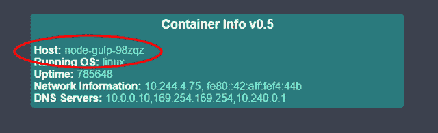
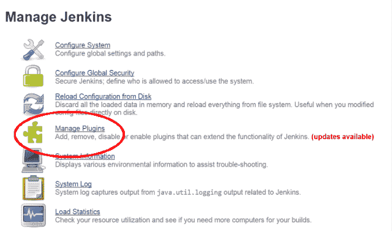
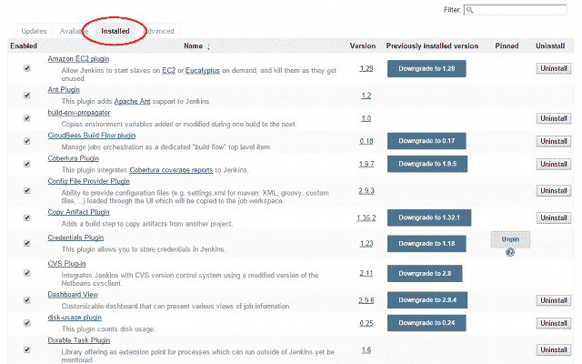
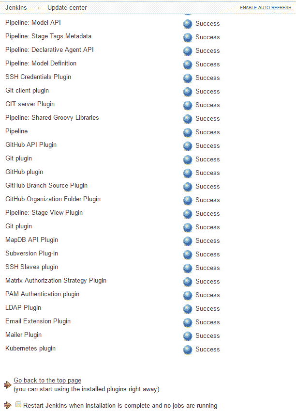
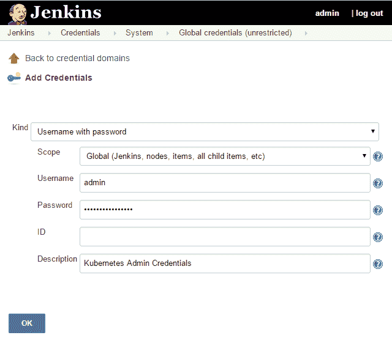
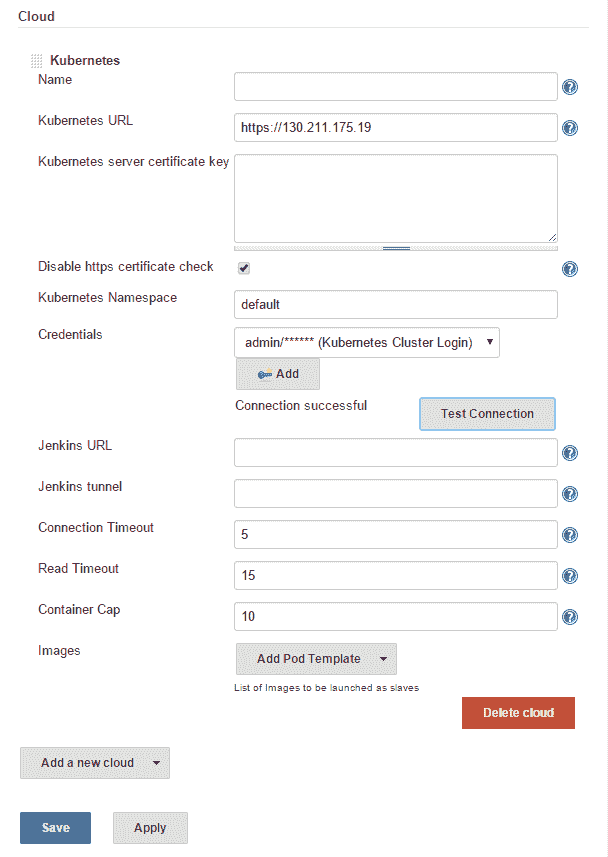
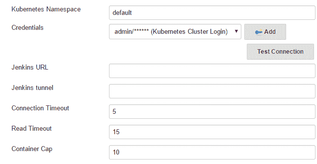
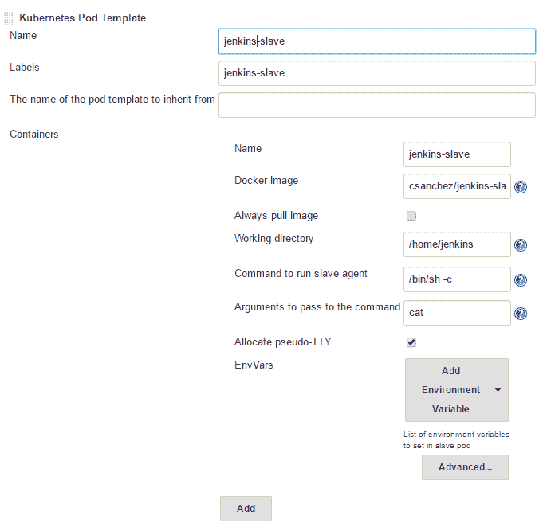
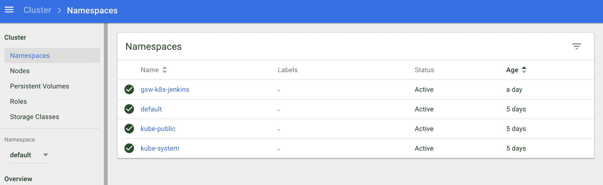

# 第七章：设计持续集成和交付

本章将向读者展示如何将构建管道和部署与 Kubernetes 集群集成。它将介绍如何将 gulp.js 和 Jenkins 与 Kubernetes 集群结合使用的概念。我们还将使用 Helm 和 Minikube 展示如何通过更新的、更先进的方法来实现持续集成和交付。

本章将涵盖以下主题：

+   将 Kubernetes 与持续部署管道集成

+   使用 gulp.js 与 Kubernetes

+   将 Jenkins 与 Kubernetes 集成

+   安装并使用 Helm 和 Jenkins

# 技术要求

你需要启用并登录到你的 Google Cloud Platform 账户，或者你也可以使用本地的 Minikube Kubernetes 实例。你还可以使用为 Web 设计的 Play with Kubernetes 应用，网址为 [`labs.play-with-k8s.com/`](https://labs.play-with-k8s.com/)。

本章的 GitHub 仓库链接：[`github.com/PacktPublishing/Getting-Started-with-Kubernetes-third-edition/tree/master/Code-files/Chapter07`](https://github.com/PacktPublishing/Getting-Started-with-Kubernetes-third-edition/tree/master/Code-files/Chapter07)[.](https://github.com/PacktPublishing/Getting-Started-with-Kubernetes-third-edition/tree/master/Code%20files/Chapter%2007)

# 将 Kubernetes 与持续交付管道集成

持续集成和交付是现代开发中的关键组成部分。**持续集成/持续交付** (**CI/CD**) 通常在构建运行后容易移除它们。此外，如果你的集群中已经有了大量基础设施，可以利用闲置容量进行构建和测试。

在本文中，我们将探讨两种在构建和部署软件中常用的工具：

+   **gulp.js**：这是一个简单的任务运行器，用于通过 JavaScript 和 Node.js 自动化构建过程

+   **Jenkins**：这是一个功能齐全的持续集成服务器

# gulp.js

gulp.js 为我们提供了构建作为代码的框架。类似于基础设施即代码，它允许我们以编程方式定义构建过程。我们将通过一个简短的示例来演示如何创建一个完整的工作流，从 Docker 镜像构建到最终的 Kubernetes 服务。

# 先决条件

在本文的这一部分，你需要安装并准备好 Node.js 环境，包括 **node 包管理器** (**npm**)。如果你还没有安装这些包，你可以在 [`docs.npmjs.com/getting-started/installing-node`](https://docs.npmjs.com/getting-started/installing-node) 查找安装说明。

你可以使用 `node -v` 命令检查 Node.js 是否正确安装。

您还需要 Docker CE 和 Docker Hub 账户来推送新镜像。您可以在[`docs.docker.com/installation/`](https://docs.docker.com/installation/)找到安装 Docker CE 的说明。您可以轻松在[`hub.docker.com/`](https://hub.docker.com/)创建一个 DockerHub 账户。

在获取凭证后，您可以使用 CLI 通过 `$ docker login` 命令登录。

# gulp.js 构建示例

我们先创建一个名为 `node-gulp` 的项目目录：

```
$ mkdir node-gulp
$ cd node-gulp
```

接下来，我们将安装 `gulp` 包，然后通过运行带有版本标志的 `npm` 命令来检查它是否准备就绪，如下所示：

```
$ npm install -g gulp
```

您可能需要打开一个新的终端窗口，以确保 `gulp` 已加入您的路径中。另外，确保使用以下命令导航回您的 `node-gulp` 目录：

```
 $ gulp -v
```

接下来，我们将在项目文件夹中本地安装 `gulp`，并安装 `gulp-git` 和 `gulp-shell` 插件，如下所示：

```
$ npm install --save-dev gulp
$ npm install gulp-git -save
$ npm install --save-dev gulp-shell
```

最后，我们需要创建一个 Kubernetes 控制器和服务定义文件，以及一个 `gulpfile.js` 文件，以运行我们所有的任务。同样，如果您愿意，也可以直接将这些文件复制过来，这些文件可以在书籍文件包中找到。请参阅以下 `node-gulp-controller.yaml` 文件：

```
apiVersion: v1 
kind: ReplicationController 
metadata: 
  name: node-gulp 
  labels: 
    name: node-gulp 
spec: 
  replicas: 1 
  selector: 
    name: node-gulp 
  template: 
    metadata: 
      labels: 
        name: node-gulp 
    spec: 
      containers: 
      - name: node-gulp 
        image: <your username>/node-gulp:latest 
        imagePullPolicy: Always 
        ports: 
        - containerPort: 80 
```

如您在前面的代码中看到的，我们有一个基本的控制器。您需要将 `<your username>/node-gulp:latest` 替换为您的 Docker Hub 用户名。将以下代码保存为 `node-gulp-service.yaml` 文件：

```
apiVersion: v1 
kind: Service 
metadata: 
  name: node-gulp 
  labels: 
    name: node-gulp 
spec: 
  type: LoadBalancer 
  ports: 
  - name: http 
    protocol: TCP 
    port: 80 
  selector: 
    name: node-gulp 
```

接下来，我们有一个简单的服务，它从我们的控制器中选择 pods，并创建一个外部负载均衡器以供访问，如前所述：

```
var gulp = require('gulp'); 
var git = require('gulp-git'); 
var shell = require('gulp-shell'); 

// Clone a remote repo 
gulp.task('clone', function(){ 
  return git.clone('https://github.com/jonbaierCTP/getting-started-with-kubernetes-se.git', function (err) { 
    if (err) throw err; 
  }); 

}); 

// Update codebase 
gulp.task('pull', function(){ 
  return git.pull('origin', 'master', {cwd: './getting-started-with-kubernetes-se'}, function (err) { 
    if (err) throw err; 
  }); 
}); 

//Build Docker image 
gulp.task('docker-build', shell.task([ 
  'docker build -t <your username>/node-gulp ./getting-started-with-kubernetes-se/docker-image-source/container-info/', 
  'docker push <your username>/node-gulp' 
])); 

//Run new pod 
gulp.task('create-kube-pod', shell.task([ 
  'kubectl create -f node-gulp-controller.yaml', 
  'kubectl create -f node-gulp-service.yaml' 
])); 

//Update pod 
gulp.task('update-kube-pod', shell.task([ 
  'kubectl delete -f node-gulp-controller.yaml', 
  'kubectl create -f node-gulp-controller.yaml' 
])); 
```

最后，我们有前面的 `gulpfile.js` 文件。在这里定义了我们所有的构建任务。同样，在 `<your username>/node-gulp` 部分填写您自己的 Docker Hub 用户名。

浏览文件时，首先我们可以看到克隆任务从 GitHub 下载我们的镜像源代码。拉取任务对克隆的仓库执行 `git pull`。接下来，`docker-build` 命令从 `container-info` 子文件夹构建一个镜像并推送到 Docker Hub。最后，我们有 `create-kube-pod` 和 `update-kube-pod` 命令。正如您可能猜到的，`create-kube-pod` 命令首次创建我们的控制器和服务，而 `update-kube-pod` 命令则简单地替换控制器。

让我们继续运行这些命令，看看我们的端到端工作流：

```
$ gulp clone
$ gulp docker-build
```

第一次运行时，您也可以运行 `create-kube-pod` 命令，如下所示：

```
$ gulp create-kube-pod
```

就是这些。如果我们运行一个快速的 `kubectl describe` 命令来查看 `node-gulp` 服务，我们可以获得新服务的外部 IP。浏览到该 IP，您会看到熟悉的 `container-info` 应用程序正在运行。请注意，主机名以 `node-gulp` 开头，就像我们在前面提到的 pod 定义中命名的一样：



在随后的更新中，运行 `pull` 和 `update-kube-pod` 命令，如下所示：

```
$ gulp pull
$ gulp docker-build
$ gulp update-kube-pod
```

这是一个非常简单的示例，但你可以开始看到如何通过几行简单的代码轻松地协调你的构建和部署流程。接下来，我们将看看如何使用 Kubernetes 通过 Jenkins 来实际运行构建。

# Jenkins 的 Kubernetes 插件

我们可以利用 Kubernetes 来实现我们的 CI/CD 管道，其中一种方法是将 Jenkins 构建从属节点运行在容器化环境中。幸运的是，Carlos Sanchez 已经写了一个插件，允许你在 Kubernetes 的 Pod 中运行 Jenkins 从属节点。

# 前提条件

你需要准备一个 Jenkins 服务器来进行下一个示例。如果你没有可以使用的服务器，可以在[`hub.docker.com/_/jenkins/`](https://hub.docker.com/_/jenkins/)上使用一个 Docker 镜像。

从 Docker CLI 运行它非常简单，只需要以下命令：

```
docker run --name myjenkins -p 8080:8080 -v /var/jenkins_home jenkins
```

# 安装插件

登录到你的 Jenkins 服务器，在首页仪表盘上，点击 Manage Jenkins。

给安装新 Jenkins 服务器的用户的提醒：当你第一次登录到 Jenkins 服务器时，它会要求你安装插件。请选择默认插件，否则将不会安装任何插件！

然后，在 Manage Jenkins 页面上，从列表中选择 Manage Plugins，如下所示：



Jenkins 的主仪表盘

需要安装 Credentials 插件，但它应该已经默认安装。如果不确定，我们可以检查 Installed 标签，如下截图所示：



Jenkins 中已安装的插件

接下来，让我们点击 Available 标签。Kubernetes 插件应该位于 Cluster Management 和 Distributed Build 或 Misc (cloud)下。插件很多，因此你也可以选择在页面上搜索 `Kubernetes`。勾选 Kubernetes 插件的框，然后点击 Install without restart。这将安装 Kubernetes 插件和 Durable Task 插件：



Jenkins 中的插件安装界面

如果你希望安装非标准版本，或者只是喜欢调试，你可以选择下载插件。最新的 Kubernetes 和 Durable task 插件可以在这里找到：

+   **Kubernetes plugin**: [`wiki.jenkins-ci.org/display/JENKINS/Kubernetes+Plugin`](https://wiki.jenkins-ci.org/display/JENKINS/Kubernetes+Plugin)

+   **Durable task plugin**: [`wiki.jenkins-ci.org/display/JENKINS/Durable+Task+Plugin`](https://wiki.jenkins-ci.org/display/JENKINS/Durable+Task+Plugin)

接下来，我们可以点击 Advanced 标签并向下滚动到 Upload plugin。定位到 `durable-task.hpi` 文件并点击 Upload。你应该会看到一个显示安装进度条的屏幕。经过一两分钟后，它会更新为 Success。

最后，安装主 Kubernetes 插件。在左侧，点击 Manage Plugins 然后再次点击 Advanced 标签。这次，上传 `kubernetes.hpi` 文件并点击 Upload。几分钟后，安装应该完成。

# 配置 Kubernetes 插件

点击“返回到仪表盘”或左上角的 Jenkins 链接。在主仪表盘页面上，点击凭证链接。从列表中选择一个域；在我的情况下，我使用了默认的全局凭证域。点击“添加凭证”，然后你将看到以下屏幕：



添加凭证屏幕

将“种类”保持为“用户名和密码”，将“范围”设置为“全局（Jenkins、节点、项目、所有子项目等）”。添加你的 Kubernetes 管理员凭证。记住，你可以通过运行以下`config`命令找到它们：

```
$ kubectl config view
```

你可以将 ID 留空，在描述中填写合适的内容，然后点击“确定”按钮。

现在我们已经保存了凭证，可以添加我们的 Kubernetes 服务器。点击左上角的 Jenkins 链接，然后选择“管理 Jenkins”。在这里，选择“配置系统”并向下滚动到云部分。从“添加新云”下拉菜单中选择 Kubernetes，将会出现一个 Kubernetes 部分，如下所示：



Jenkins 中的新 Kubernetes 云设置页面

你需要以`https://<Master IP>/`的形式指定你的主节点的 URL。

接下来，从下拉菜单中选择我们添加的凭证。由于 Kubernetes 默认使用自签名证书，你还需要勾选“禁用 https 证书检查”复选框。

点击“测试连接”，如果一切顺利，你应该会看到按钮旁显示“连接成功”。

如果你使用的是旧版本的插件，可能看不到“禁用 https 证书检查”复选框。如果是这种情况，你需要直接在 Jenkins 主节点上安装自签名证书。

最后，我们将通过从“添加 Pod 模板”下拉菜单中选择 Kubernetes Pod 模板来添加一个 pod 模板，位于镜像旁边。

这将创建另一个新的部分。在名称和标签部分使用`jenkins-slave`。点击容器旁的“添加”按钮，再次使用`jenkins-slave`作为名称。使用`csanchez/jenkins-slave`作为 Docker 镜像，并将工作目录留空为`/home/jenkins`。

标签可以在构建设置中后续使用，强制构建使用 Kubernetes 集群：



Kubernetes 集群添加

这是扩展集群添加的 pod 模板，如下图所示：



Kubernetes Pod 模板

点击保存，设置完成。现在，在 Jenkins 中创建的新构建可以使用我们刚刚创建的 Kubernetes pod 中的从节点。

这是关于防火墙的另一个注意事项。Jenkins 主节点需要能够被 Kubernetes 集群中的所有机器访问，因为 Pod 可能会出现在任何地方。你可以在 Jenkins 中通过“管理 Jenkins | 配置全局安全”查看端口设置。

# Helm 和 Minikube

让我们尝试使用其他工具设置一些 CI/CD，以便可以体验 Kubernetes 生态系统中的最新产品。首先，让我们探索如何使用 Helm 安装 Jenkins 的简易性。

首先，打开 Minikube 仪表板，这样你可以看到我们安装各种东西时发生了什么。使用以下命令来实现：

```
$ minikube dashboard
```

让我们为 Jenkins 环境创建一个命名空间，如下所示：

```
$ kubectl get namespaces
NAME          STATUS AGE
default       Active 3d
kube-public   Active 3d kube-system   Active 3d

```

现在，让我们创建一个模板：

```
$ mkdir -p ~/gsw-k8s-helm && cd ~/gsw-k8s-helm
$ cat <<K8s >> namespace-jenkins.yaml
apiVersion: v1
kind: Namespace
metadata:
 name: gsw-k8s-jenkins
K8s
```

现在，你可以按以下方式创建命名空间：

```
kubectl create -f namespace-jenkins.yaml
namespace "gsw-k8s-jenkins" created
```

有两种方法可以验证它是否已实际创建。首先，你可以通过 `minikube dashboard` 命令查看仪表板：



其次，你可以使用 `kubectl get namespaces` 查看 CLI：

```
$ helm-jenkins jesse$ kubectl get namespaces
NAME              STATUS AGE
default           Active 5d
gsw-k8s-jenkins   Active 1d
kube-public       Active 5d
kube-system       Active 5d
```

让我们为 Jenkins 创建一个持久化存储卷。这将允许我们在 Minikube 重启时将数据持久化到集群中。在生产环境中，你需要使用某种类型的存储块或驱动程序。让我们创建一个名为 `jenkins-persist` 的 `jenkins-volume.yaml` 文件。

这是你需要放入该文件的内容：

```
apiVersion: v1
kind: PersistentVolume
metadata:
 name: jenkins-persist
 namespace: jenkins-project
spec:
 storageClassName: jenkins-persist
 accessModes:
   - ReadWriteOnce
 capacity:
   storage: 20Gi
 persistentVolumeReclaimPolicy: Retain
 hostPath:
   path: /storage/jenkins-volume/
```

现在，让我们为 Jenkins 创建存储卷：

```
$ kubectl create -f jenkins-volume.yaml
persistentvolume "jenkins-persist" created
```

很棒！现在，我们准备好使用 Helm 来轻松安装 Jenkins。让我们使用以下 values 文件进行安装：

```
# Default values for jenkins.
# This is a YAML-formatted file.
# Declare name/value pairs to be passed into your templates.
# name: value
## Overrides for generated resource names
# See templates/_helpers.tpl
# nameOverride:
# fullnameOverride:
Master:
 Name: jenkins-master
 Image: "jenkins/jenkins"
 ImageTag: "2.127"
 ImagePullPolicy: "Always"
 Component: "jenkins-master"
 UseSecurity: true
 AdminUser: admin
 # AdminPassword: <defaults to random>
 Cpu: "200m"
 Memory: "256Mi"
 ServicePort: 8080
 # For minikube, set this to NodePort, elsewhere use LoadBalancer # <to set explicitly, choose port between 30000-32767>
ServiceType: NodePort
 NodePort: 32000
 ServiceAnnotations: {}
 ContainerPort: 8080
 # Enable Kubernetes Liveness and Readiness Probes
 HealthProbes: true
 HealthProbesTimeout: 60
 SlaveListenerPort: 50000
 LoadBalancerSourceRanges:
 - 0.0.0.0/0
 # List of plugins to be install during Jenkins master start
 InstallPlugins:
 - kubernetes:1.7.1
 - workflow-aggregator:2.5
 - workflow-job:2.21
 - credentials-binding:1.16
 - git:3.9.1
 - greenballs:1.15
 # Used to approve a list of groovy functions in pipelines used
the script-security plugin. Can be viewed under /scriptApproval
 ScriptApproval:
 - "method groovy.json.JsonSlurperClassic parseText
java.lang.String"
 - "new groovy.json.JsonSlurperClassic"
 - "staticMethod
org.codehaus.groovy.runtime.DefaultGroovyMethods leftShift
java.util.Map java.util.Map"
 - "staticMethod
org.codehaus.groovy.runtime.DefaultGroovyMethods split
java.lang.String"
 CustomConfigMap: false
 NodeSelector: {}
 Tolerations: {}
Agent:
 Enabled: true
 Image: jenkins/jnlp-slave
 ImageTag: 3.10-1
 Component: "jenkins-slave"
 Privileged: false
 Cpu: "200m"
 Memory: "256Mi"
 # You may want to change this to true while testing a new image
 AlwaysPullImage: false
 # You can define the volumes that you want to mount for this
container
 # Allowed types are: ConfigMap, EmptyDir, HostPath, Nfs, Pod,
Secret
 volumes:
 - type: HostPath
 hostPath: /var/run/docker.sock
 mountPath: /var/run/docker.sock
 NodeSelector: {}
Persistence:
 Enabled: true
 ## A manually managed Persistent Volume and Claim
 ## Requires Persistence.Enabled: true
 ## If defined, PVC must be created manually before volume will
be bound
 # ExistingClaim:
 ## jenkins data Persistent Volume Storage Class
 StorageClass: jenkins-pv
 Annotations: {}
 AccessMode: ReadWriteOnce
 Size: 20Gi
 volumes:
 # - name: nothing
 # emptyDir: {}
 mounts:
 # - mountPath: /var/nothing
 # name: nothing
 # readOnly: true
NetworkPolicy:
 # Enable creation of NetworkPolicy resources.
 Enabled: false
 # For Kubernetes v1.4, v1.5 and v1.6, use 'extensions/v1beta1'
 # For Kubernetes v1.7, use 'networking.k8s.io/v1'
 ApiVersion: networking.k8s.io/v1
## Install Default RBAC roles and bindings
rbac:
 install: true
 serviceAccountName: default
 # RBAC api version (currently either v1beta1 or v1alpha1)
 apiVersion: v1beta1
 # Cluster role reference
 roleRef: cluster-admin
```

现在我们已经设置了 values 文件，让我们使用它来部署 Jenkins：

```
helm install --name gsw-k8s-jenkins -f jenkins-vaules.yaml stable/jenkins --namespace gsw-k8s-jenkins
NAME:   gsw-k8s-jenkins
LAST DEPLOYED: Mon Jun 18 22:44:34 2018
NAMESPACE: gsw-k8s-jenkins
STATUS: DEPLOYED
RESOURCES:
…
```

我们可以通过访问 Kubernetes 密钥存储 API 来获取随机生成的 Jenkins 密钥：

```
$ kubectl get secret --namespace gsw-k8s-jenkins gsw-k8s-jenkins -o jsonpath="{.data.jenkins-admin-password}" | base64 --decode; echo
<YOUR_PASSWORD_HERE>
```

使用以下命令验证 Jenkins 是否已安装：

```
$ helm ls
NAME REVISION UPDATED STATUS CHART NAMESPACE
gsw-k8s-jenkins 1 Mon Jun 18 22:44:34 2018 DEPLOYED jenkins-0.16.3 gsw-k8s-jenkins
```

然后，打开 Jenkins 的主页。你应该能够通过 `http://192.168.99.100:3200` 访问主页。

# 有趣的额外内容

**fabric8** 自称为一个集成平台。它包括各种日志记录、监控和持续交付工具。它还拥有一个漂亮的控制台、一个 API 注册表和一个可以让你射击 pods 的 3D 游戏。它是一个非常酷的项目，实际上是在 Kubernetes 上运行的。该项目的网站可以在 [`fabric8.io/`](http://fabric8.io/) 找到。

fabric8 可以通过一个简单的命令在你的 Kubernetes 集群上轻松设置，因此请参考 [`fabric8.io/guide/getStarted/gke.html/`](http://fabric8.io/guide/getStarted/gke.html) 了解更多信息。

# 总结

我们查看了两种可以与 Kubernetes 一起使用的持续集成工具。我们简要地演示了如何在集群中部署 gulp.js 任务。我们还看到了一个新插件，它用于将 Jenkins 构建代理集成到 Kubernetes 集群中。你现在应该对 Kubernetes 如何与你自己的 CI/CD 流水线集成有了更清晰的认识。

# 问题

1.  gulp.js 让我们能够构建什么类型的软件？

1.  我们安装的流行 CI/CD 系统的名称是什么？

1.  Jenkins 的另一种安装方法是什么？

1.  在 Kubernetes 上运行 Jenkins 需要哪种类型的存储卷？

1.  在 Kubernetes 上运行 Jenkins 的另一个要求是什么？

1.  部署时使用的控制器是什么类型的？

1.  我们使用了什么工具来安装 gulp.js？

# 深入阅读

如果你想了解有关 Node.js 和 gulp.js 生态系统的更多信息，可以查看以下书籍：

+   [`www.packtpub.com/web-development/mastering-nodejs`](https://www.packtpub.com/web-development/mastering-nodejs)

+   [`www.packtpub.com/web-development/learning-nodejs-development`](https://www.packtpub.com/web-development/learning-nodejs-development)

如果你希望获得如何使用 Jenkins 的更多指导，请阅读以下内容：

+   [`www.packtpub.com/networking-and-servers/learning-continuous-integration-jenkins`](https://www.packtpub.com/networking-and-servers/learning-continuous-integration-jenkins)

+   [`www.packtpub.com/application-development/mastering-jenkins`](https://www.packtpub.com/application-development/mastering-jenkins)

+   [`www.packtpub.com/virtualization-and-cloud/hands-continuous-integration-and-automation-jenkins-video`](https://www.packtpub.com/virtualization-and-cloud/hands-continuous-integration-and-automation-jenkins-video)
