# 监控与日志记录

本章将介绍在我们的 Kubernetes 集群中使用和定制内置及第三方监控工具。我们将讨论如何使用这些工具来监控集群的健康状态和性能。此外，我们还将了解内置日志、Google Cloud Logging 服务以及 Sysdig。

本章将涵盖以下内容：

+   Kubernetes 如何使用 cAdvisor、Heapster、InfluxDB 和 Grafana

+   自定义默认的 Grafana 仪表板

+   使用 Fluentd 和 Grafana

+   安装和使用日志工具

+   使用流行的第三方工具，如 Stackdriver 和 Sysdig，来扩展我们的监控能力

# 技术要求

你需要启用并登录到你的 Google Cloud Platform 账户，或者使用本地的 Minikube 实例来运行 Kubernetes。你也可以通过 Web 使用 Play with Kubernetes：[`labs.play-with-k8s.com/`](https://labs.play-with-k8s.com/)。

# 监控操作

真实世界中的监控远不止于检查系统是否正常运行。尽管像你在第二章《基于核心 Kubernetes 构件建立基础》中的*健康检查*部分学到的健康检查可以帮助我们隔离问题应用程序，但运营团队能够在系统停机前预见问题并加以缓解，才能更好地为业务服务。

监控的最佳实践是衡量核心资源的性能和使用情况，并观察偏离正常基线的趋势。容器在这方面并不例外，管理 Kubernetes 集群的关键组成部分是能够清晰地查看所有节点的操作系统、网络、系统（CPU 和内存）以及存储资源的性能和可用性。

本章将探讨几种监控和衡量集群资源的性能与可用性的方法。此外，我们还将研究当出现不规则趋势时，如何进行告警和通知。

# 内置监控

如果你还记得第一章《Kubernetes 简介》，我们提到我们的节点已经运行了多个监控服务。我们可以通过如下命令，指定 `kube-system` 命名空间，再次查看这些服务：

```
$ kubectl get pods --namespace=kube-system
```

以下截图是前面命令的结果：

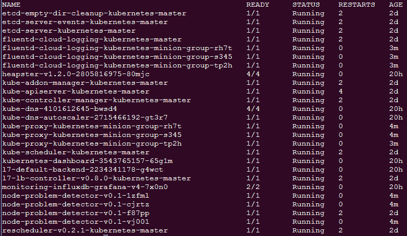

系统 pod 列表

同样，我们看到多种服务，但这些是如何协同工作的呢？如果你还记得，第二章中关于节点（以前称为 minions）的部分 Chapter 2，*构建核心 Kubernetes 结构的基础*，每个节点都在运行`kubelet`。`kubelet`是节点与 API 服务器交互并进行更新的主要接口。此类更新之一是节点资源的指标。资源使用的实际报告是由名为 cAdvisor 的程序执行的。

cAdvisor 程序是 Google 的另一个开源项目，它提供关于容器资源使用的各种指标。指标包括 CPU、内存和网络统计信息。无需为单独的容器配置 cAdvisor，它会收集节点上所有容器的指标并将其报告给`kubelet`，然后`kubelet`将这些数据报告给 Heapster。

Google's open source projects：Google 有很多与 Kubernetes 相关的开源项目。查看它们，使用它们，甚至贡献你自己的代码！

cAdvisor 和 Heapster 都在以下 GitHub 部分中提到：

+   **cAdvisor**: [`github.com/google/cadvisor`](https://github.com/google/cadvisor)

+   **Heapster**: [`github.com/kubernetes/heapster`](https://github.com/kubernetes/heapster)

Contrib 是一个包含各种组件的统称，这些组件并非 Kubernetes 核心的一部分。它可以在[`github.com/kubernetes/contrib`](https://github.com/kubernetes/contrib)找到。LevelDB 是一个键值存储库，它在 InfluxDB 的创建中被使用。你可以在[`github.com/google/leveldb`](https://github.com/google/leveldb)找到它。

Heapster 是 Google 的另一个开源项目；你可能开始看到一些模式（参见前面的信息框）。Heapster 运行在一个 minion 节点上的容器中，汇总来自`kubelet`的数据。提供了一个简单的 REST 接口来查询数据。

在使用 GCE 设置时，我们会为我们安装一些额外的软件包，这样可以节省时间，并提供一个完整的包来监控我们的容器工作负载。正如我们从前面的*系统 Pod 列表*截图中看到的，标题中还有一个包含`influx-grafana`的 Pod。

InfluxDB 在其官方网站上的描述如下：

一个开源的分布式时间序列数据库，没有外部依赖。

InfluxDB 基于一个键值存储包（参见前面的*Google 的开源项目*信息框），非常适合存储和查询基于事件或时间的统计数据，比如 Heapster 提供的数据。

最后，我们有 Grafana，它提供了一个仪表板和图表界面，用于显示存储在 InfluxDB 中的数据。使用 Grafana，用户可以创建自定义监控仪表板，并立即查看 Kubernetes 集群的健康状况，从而了解整个容器基础设施的运行情况。

# 探索 Heapster

快速查看 REST 接口，我们可以通过 SSH 连接到正在运行 Heapster Pod 的节点。首先，我们可以列出 Pod，找到正在运行 Heapster 的 Pod，命令如下：

```
$ kubectl get pods --namespace=kube-system
```

Pod 的名称应以 `monitoring-heapster` 开头。运行 `describe` 命令查看它运行在哪个节点，命令如下：

```
$ kubectl describe pods/<Heapster monitoring Pod> --namespace=kube-system
```

从下面截图的输出中，我们可以看到 Pod 正在 `kubernetes-minion-merd` 中运行。还请注意稍后会用到的 Pod 的 IP 地址，见下几行：

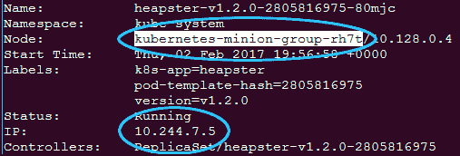

Heapster Pod 详细信息

接下来，我们可以使用熟悉的 `gcloud ssh` 命令 SSH 连接到此主机，命令如下：

```
$ gcloud compute --project "<Your project ID>" ssh --zone "<your gce zone>" "<kubernetes minion from describe>"
```

从这里，我们可以直接通过 Pod 的 IP 地址访问 Heapster REST API。记住，Pod 的 IP 地址不仅在容器内部可路由，而且在节点本身也能路由。`Heapster` API 正在监听 `8082` 端口，我们可以在 `/api/v1/metric-export-schema/` 路径下获取完整的指标列表。

现在让我们通过执行 `curl` 命令查询我们从 `describe` 命令中保存的 Pod IP 地址，命令如下：

```
$ curl -G <Heapster IP from describe>:8082/api/v1/metric-export-schema/
```

我们将看到一个非常长的列表。第一部分展示了所有可用的指标，最后两部分列出了可以用来过滤和分组的字段。为了方便阅读，我已经添加了以下表格：

| **Metric** | **描述** | **单位** | **类型** |
| --- | --- | --- | --- |
| `uptime` | 容器启动以来经过的毫秒数 | 毫秒 | 累计 |
| `cpu/usage` | 所有核心的累计 CPU 使用情况 | 纳秒 | 累计 |
| `cpu/limit` | CPU 限制（以毫核为单位） | - | 测量 |
| `memory/usage` | 总内存使用量 | 字节 | 测量 |
| `memory/working_set` | 总的工作集使用情况；工作集是当前使用的内存，且不容易被内核丢弃 | 字节 | 测量 |
| `memory/limit` | 内存限制 | 字节 | 测量 |
| `memory/page_faults` | 页面错误的数量 | - | 累计 |
| `memory/major_page_faults` | 主要页面错误的数量 | - | 累计 |
| `network/rx` | 网络接收的累计字节数 | 字节 | 累计 |
| `network/rx_errors` | 网络接收过程中累计的错误数 | - | 累计 |
| `network/tx` | 网络发送的累计字节数 | 字节 | 累计 |
| `network/tx_errors` | 网络发送过程中累计的错误数 | - | 累计 |
| `filesystem/usage` | 文件系统消耗的总字节数 | 字节 | 测量 |
| `filesystem/limit` | 文件系统的总大小（字节数） | 字节 | 测量 |
| `filesystem/available` | 文件系统中剩余的可用字节数 | 字节 | 测量 |

表 6.1：可用的 Heapster 指标

| **字段** | **描述** | **标签类型** |
| --- | --- | --- |
| `nodename` | 容器运行所在的节点名称 | 常见 |
| `hostname` | 容器运行的主机名 | 常见 |
| `host_id` | 特定于主机的标识符，由云提供商或用户设置 | Common |
| `container_base_image` | 用户定义的容器内运行的镜像名称 | Common |
| `container_name` | 用户提供的容器名称或系统容器的完整名称 | Common |
| `pod_name` | Pod 的名称 | Pod |
| `pod_id` | Pod 的唯一 ID | Pod |
| `pod_namespace` | Pod 的命名空间 | Pod |
| `namespace_id` | Pod 命名空间的唯一 ID | Pod |
| `labels` | 用户提供的标签，以逗号分隔 | Pod |

表 6.2\. 可用的 Heapster 字段

# 自定义仪表盘

现在我们已经有了字段，可以开始有些有趣的操作了。回想一下我们在第一章中看到的 Grafana 页面，*Kubernetes 入门*。让我们再次打开它，方法是访问我们集群的监控 URL。注意，你可能需要用集群凭据登录。请参照以下链接格式：`https://<your master IP>/api/v1/proxy/namespaces/kube-system/services/monitoring-grafana`

我们会看到默认的主页仪表盘。点击主页旁边的向下箭头，选择集群。这会显示 Kubernetes 集群仪表盘，现在我们可以将自己的统计数据添加到仪表盘上。滚动到页面底部，点击添加一行。这会为新的一行创建一个空间，并在屏幕的左侧显示一个绿色标签。

让我们首先添加每个节点（minion）的文件系统使用情况视图。点击绿色标签以展开，然后选择添加面板，再选择图形。屏幕上应该会出现一个空白图形，并伴有一个查询面板用于我们的自定义图形。

此面板中的第一个字段应该显示一个查询，查询以 SELECT mean("value") FROM 开头。点击此字段旁边的 A 字符以展开它。将 FROM 后面的第一个字段保持默认值，然后点击下一个包含选择度量值的字段。将出现一个下拉菜单，其中列出了我们在前面表格中看到的 Heapster 指标。选择 `filesystem/usage_bytes_gauge`。现在，在 SELECT 行中，点击 mean()，然后点击 x 符号将其移除。接下来，点击行末的 + 符号，添加选择器和 max。然后，你将看到一个 GROUP BY 行，包含 time($interval) 和 fill(none)。仔细点击 fill，而不是 (none) 部分，然后再次点击 x 以移除它。

然后，点击行末的 + 符号，选择标签（hostname）。最后，在屏幕底部我们应该能看到按时间间隔分组的选项。在那里输入`5s`，然后你应该能看到类似以下截图的内容：

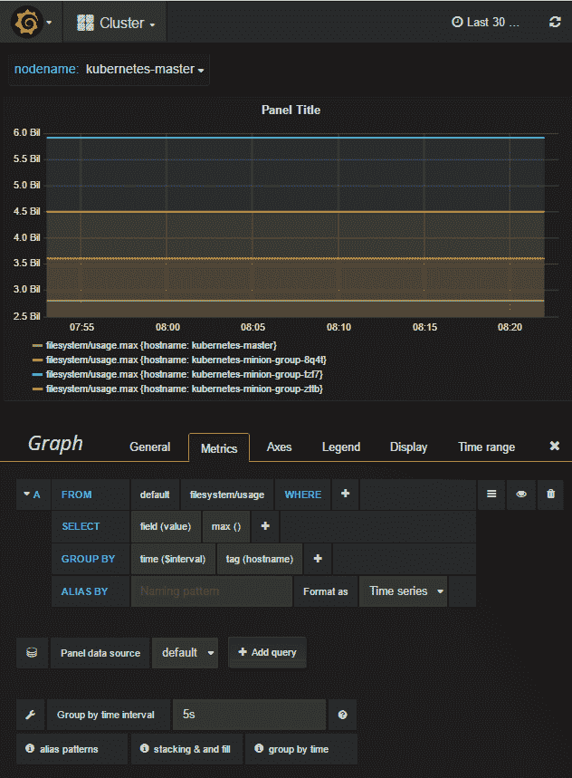

Heapster Pod 详情

接下来，点击“坐标轴”标签，以便设置单位和图例。在左侧 Y 轴下，点击单位旁边的字段并将其设置为数据 | 字节，标签设置为“磁盘空间使用”。在右侧 Y 轴下，将单位设置为无 | 无。接下来，在“图例”标签下，确保勾选“选项中的显示”和“值中的最大值”。

现在，让我们快速进入“常规”标签页并选择一个标题。在我的例子中，我将其命名为`Filesystem Disk Usage by Node (max)`。

我们不想丢失我们刚刚创建的漂亮新图表，因此让我们点击右上角的保存图标。它看起来像一个软盘（如果你不知道它是什么，可以用 Google 图片搜索）。

点击保存图标后，我们会看到一个绿色的对话框，确认仪表板已保存。现在我们可以点击图表详情面板上方、图表本身下方的 x 符号。

这将返回到仪表板页面。如果我们向下滚动，应该能看到我们的新图表。让我们再向这一行添加一个面板。同样使用*绿色*标签，然后选择“添加面板 | 单一统计”。再次，一个空白面板将出现，下面是一个设置表单。

假设我们想监控一个特定节点的网络使用情况。我们可以通过首先进入“度量”标签页轻松实现。然后，展开查询字段并将 FROM 字段中的第二个值设置为 network/rx。现在，我们可以通过点击行末的+符号并从下拉菜单中选择 hostname 来指定 WHERE 子句。在 hostname =之后，点击选择标签值并从列表中选择一个从节点。

最后，保留`mean()`作为第二个 SELECT 字段，示例如下：

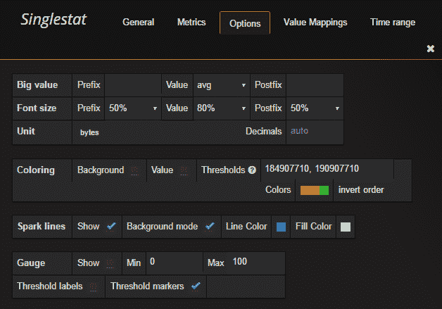

单一统计选项

在“选项”标签页中，确保将单位格式设置为数据 | 字节，并勾选“火花线”旁边的框。火花线为我们提供了近期数值变化的快速历史视图。我们可以使用背景模式来填充整个背景；默认情况下，它使用数值下方的区域。

在“着色”中，我们可以选择性地勾选“值”或“背景”框，并选择阈值和颜色。这将允许我们根据指定的阈值层次为值选择不同的颜色。请注意，阈值值必须使用未格式化的数字版本。

现在，让我们返回到“常规”标签页，并将标题设置为`Network bytes received (Node35ao)`。使用你的从节点标识符。

再次保存我们的工作并返回到仪表板。现在，我们应该看到如下所示的行：

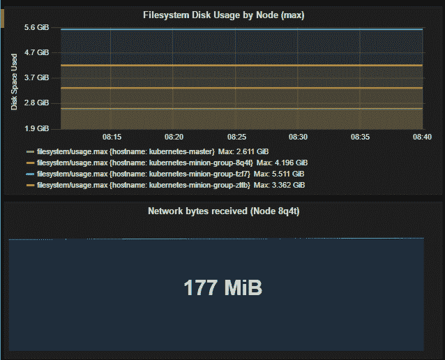

自定义仪表板面板

Grafana 还有许多其他面板类型，您可以尝试，比如仪表板列表、插件列表、表格和文本。

正如我们所看到的，创建一个自定义仪表板并一眼监控集群健康状态其实是很简单的。

# FluentD 和 Google Cloud Logging

回顾本章开始时的*系统 Pod 列表*截图，你可能注意到有一些 Pod 以 `fluentd-cloud-logging-kubernetes` 开头。这些 Pod 在使用 GCE 提供程序进行 K8s 集群配置时会出现。

每个节点上都有这样的 Pod，它的唯一目的是处理 Kubernetes 日志。如果我们登录到 Google Cloud Platform 帐户，我们可以查看在那里处理的一些日志。只需使用左侧菜单，在 Stackdriver 下选择 Logging。这样我们将进入一个日志列表页面，页面顶部有多个下拉菜单。如果这是你第一次访问该页面，第一个下拉菜单很可能会被设置为 Cloud HTTP Load Balancer。

在此下拉菜单中，我们将看到多个 GCE 类型的条目。选择 GCE VM 实例，然后选择 Kubernetes 主节点或其中一个节点。在第二个下拉菜单中，我们可以选择不同的日志组，包括 kubelet。我们还可以按事件日志级别和日期进行筛选。此外，我们可以使用播放按钮观看实时流入的事件，如下所示：

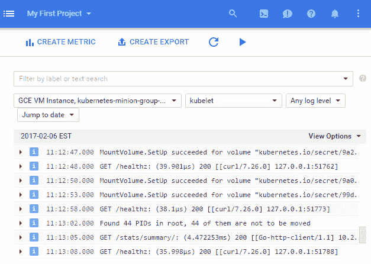

Google Cloud 日志过滤器

# FluentD

现在我们知道 `fluentd-cloud-logging-kubernetes` Pods 正在将数据发送到 Google Cloud，但为什么我们需要 FluentD 呢？简而言之，FluentD 是一个收集器。

它可以配置多个来源来收集和标记日志，然后将其发送到不同的输出点进行分析、告警或归档。我们甚至可以在数据传输到目的地之前，通过插件对数据进行转换。

不是所有的提供程序设置都会默认安装 FluentD，但它是推荐的方式之一，能为我们未来的监控操作提供更大的灵活性。AWS Kubernetes 设置也使用 FluentD，但它将事件转发到 Elasticsearch。

**探索 FluentD**：如果你对 FluentD 配置的内部工作原理感兴趣，或者只是想自定义日志收集，我们可以很容易地通过 `kubectl exec` 命令和本章前面运行的命令中的某个 Pod 名称进行探索。首先，让我们看看能否找到 FluentD 的 `config` 文件：`**$ kubectl exec fluentd-cloud-logging-kubernetes-minion-group-r4qt --namespace=kube-system -- ls /etc/td-agent**`。

我们将查看 `etc` 文件夹中的 `td-agent` 文件夹，它是 `fluent` 的子文件夹。在这个目录中搜索时，我们应该能看到一个 `td-agent.conf` 文件。我们可以通过一个简单的 `cat` 命令查看该文件，如下所示：`**$ kubectl exec fluentd-cloud-logging-kubernetes-minion-group-r4qt --namespace=kube-system -- cat /etc/td-agent/td-agent.conf**`。

我们应该查看多个来源，包括各种 Kubernetes 组件、Docker 和一些 GCP 元素。虽然我们可以在这里进行更改，但请记住，这是一个正在运行的容器，如果 Pod 死亡或重启，我们的更改将不会保存。如果我们真的想要定制，最好将此容器作为基础并构建一个新的容器，之后可以将其推送到仓库以供以后使用。

# 发展我们的监控操作

虽然 Grafana 为我们提供了监控容器操作的良好起点，但它仍在不断发展中。在实际操作环境中，拥有一个完整的仪表板视图在发现问题时非常有用。然而，在日常场景中，我们更倾向于主动并且希望在问题出现时就收到通知。这种告警能力对于确保运营团队处于领先地位、避免被动反应模式至关重要。

在这个领域有许多可用的解决方案，我们将特别查看其中的两个：GCE 监控（Stackdriver）和 Sysdig。

# GCE（Stackdriver）

Stackdriver 是一个很好的公共云基础设施监控起点。它实际上是由 Google 所拥有，因此被集成作为 Google Cloud Platform 的监控服务。在你开始担心锁定问题之前，Stackdriver 也与 AWS 有良好的集成。此外，Stackdriver 提供告警功能，支持将通知发送到各种平台，并支持 Webhooks 用于其他用途。

# 注册 GCE 监控

在 GCE 控制台的 Stackdriver 部分，点击“监控”。这将打开一个新窗口，在这里我们可以注册 Stackdriver 的免费试用。接下来，我们可以添加我们的 GCP 项目，并可选地添加一个 AWS 账户。这需要更多的步骤，但页面中已提供说明。最后，我们将获得关于如何在集群节点上安装代理的说明。我们可以暂时跳过这一步，但稍后会回来处理。

点击“继续”，设置每日告警，然后再次点击“继续”。

点击“启动监控”继续。我们将被带到主仪表板页面，在这里我们可以看到集群中节点的一些基本统计信息。如果从侧边菜单选择“资源”，然后选择“实例”，我们将进入一个页面，列出所有节点。通过点击单个节点，即使没有安装代理，我们也能看到一些基本信息。

Stackdriver 还提供可以安装在节点上的监控和日志代理。然而，它目前不支持 GCE `kube-up` 脚本中默认使用的容器操作系统。如果你想要更详细的代理安装，你仍然可以看到 GCE 或 AWS 中任何节点的基本指标，但需要使用另一个操作系统。

# 警报

接下来，我们可以查看作为监控服务一部分的告警策略。从实例详情页，点击页面顶部“事件”部分中的“创建告警策略”按钮。

我们将点击添加条件并选择一个指标阈值。在目标部分，将 RESOURCE TYPE 设置为实例（GCE）。然后，将 APPLIES TO 设置为组和 kubernetes。将 CONDITION TRIGGERS IF 保持为任何成员违反时触发。

在配置部分，将 IF METRIC 保持为 CPU 使用率（GCE 监控），并将 CONDITION 设置为如上所示。现在，将 THRESHOLD 设置为`80`，并将 FOR 中的时间设置为 5 分钟。

然后点击保存条件：

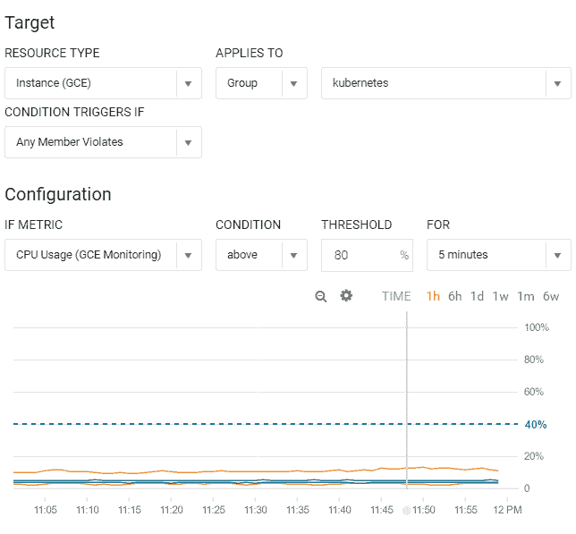

Google Cloud 监控警报策略

接下来，我们将添加一个通知。在通知部分，将方法保持为电子邮件，并输入你的电子邮件地址。

我们可以跳过文档部分，但在这里我们可以为警报消息添加文本和格式。

最后，将策略命名为 `过高的 CPU 负载`，并点击保存策略。

现在，每当我们某个实例的 CPU 使用率超过 80%，我们就会收到电子邮件通知。如果我们需要查看我们的策略，可以在警报下拉菜单中找到它们，然后在屏幕左侧的菜单中选择策略概览。

# 超越使用 Sysdig 进行系统监控

监控我们的云系统是一个很好的开始，但容器本身的可视化呢？虽然有许多云监控和可视化工具，但 Sysdig 以其能够深入挖掘，不仅限于系统操作，还专门针对容器的能力而脱颖而出。

Sysdig 是开源软件，被誉为一款通用的系统可视化工具，原生支持容器。它是一个命令行工具，可以提供对我们之前查看过的各个领域的深入了解，如存储、网络和系统进程。它的独特之处在于提供的细节级别和对这些进程和系统活动的可视化。此外，Sysdig 还原生支持容器，为我们提供了容器操作的全面视图。这是一个非常推荐的工具，适合你的容器操作工具库。Sysdig 的官方网站是 [`www.sysdig.org/`](http://www.sysdig.org/)。

# Sysdig Cloud

我们稍后将看看 Sysdig 工具及其一些有用的命令行 UI。然而，Sysdig 团队还开发了一款商业产品，名为 **Sysdig Cloud**，它提供了我们在本章前面讨论过的高级仪表盘、警报和通知服务。此外，Sysdig Cloud 的区别在于对容器的高可视化，包括我们应用拓扑的一些漂亮的可视化效果。

如果你更愿意跳过 *Sysdig Cloud* 部分并直接尝试命令行工具，只需跳到本章后面的 *Sysdig 命令行* 部分。

如果你还没有注册，快去 [`www.sysdigcloud.com`](http://www.sysdigcloud.com) 注册 Sysdig Cloud。

在首次激活并登录后，我们将进入欢迎页面。点击“下一步”，会显示一个页面，提供各种选项来安装 Sysdig 代理。在我们的示例环境中，我们将使用 Kubernetes 设置。选择 Kubernetes 后，会显示一个页面，提供 API 密钥和安装说明的链接。安装说明会指导你如何在集群中创建 Sysdig 代理 DaemonSet。别忘了在安装页面添加 API 密钥。

在代理连接之前，我们将无法继续安装页面。在创建 DaemonSet 并等待片刻后，页面应该会继续到 AWS 集成页面。你可以填写这些信息，但在本次操作中，我们将点击“跳过”。然后，点击“开始使用”。

截至本文撰写时，Sysdig 和 Sysdig Cloud 尚未完全兼容 GCE `kube-up`脚本中默认部署的最新容器操作系统——Google 的容器优化操作系统：[`cloud.google.com/container-optimized-os/docs`](https://cloud.google.com/container-optimized-os/docs)。

我们将被带到 Sysdig Cloud 的主仪表盘屏幕。我们应该在“探索”标签下看到至少两个从属节点。我们应该看到类似下面截图的内容，显示我们的从属节点：

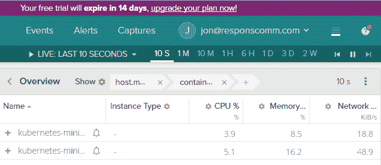

Sysdig Cloud 探索页面

该页面展示了一个表格视图，左侧的链接让我们可以查看一些关键指标，例如 CPU、内存、网络等。虽然这是一个很好的开始，但详细视图将为我们提供每个节点的更深入的视图。

# 详细视图

让我们来看看这些视图。选择一个从属节点，然后向下滚动到下面显示的详细信息部分。默认情况下，我们应该看到“按进程概览”视图（如果没有选中，只需从左侧列表中点击它）。如果图表难以阅读，只需使用每个图表左上角的最大化图标来放大视图。

有多种有趣的视图可以探索。这里只列出其他几个，服务|HTTP 概览和主机与容器|按容器概览为我们提供了一些很好的图表供检查。在后者的视图中，我们可以看到每个容器的 CPU、内存、网络和文件使用情况的统计数据。

# 拓扑视图

此外，底部还有三个拓扑视图。这些视图非常适合帮助我们理解应用程序如何进行通信。点击拓扑|网络流量，并等待几秒钟，直到视图完全加载。它应该与以下截图相似：

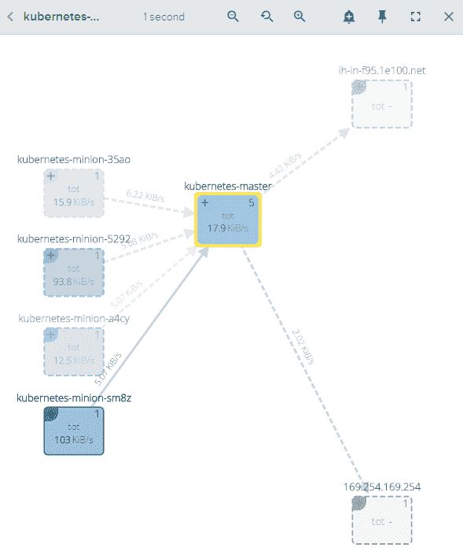

Sysdig Cloud 网络拓扑视图

请注意，该视图绘制了从属节点与集群中主节点之间的通信流动。你还可能会在节点框的右上角看到一个加号（+）符号。点击其中一个从属节点上的加号，并使用视图区域顶部的缩放工具来放大查看详细信息，如下图所示：

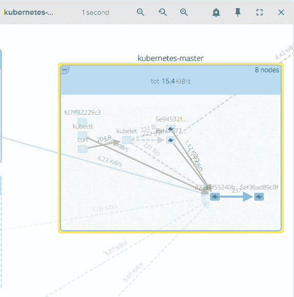

Sysdig Cloud 网络拓扑详细视图

请注意，我们现在可以看到所有在主节点内运行的 Kubernetes 组件。我们可以看到各个组件如何协同工作。我们可以看到`kube-proxy`和`kubelet`进程在运行，还有一些带有 Docker 鲸鱼标志的框，这些表示它们是容器。如果我们放大并使用加号图标，我们可以看到这些是我们的 Pod 和核心 Kubernetes 进程的容器，正如我们在第一章的主节点上运行的服务中看到的，*Kubernetes 简介*部分。

另外，如果你在监控的节点中包括了主节点，你可以看到`kubelet`从某个从节点发起通信，并一路跟踪到主节点的`kube-apiserver`容器。

我们甚至有时能看到实例与 GCE 基础设施进行通信，更新元数据。这个视图非常适合帮助我们形成一个大致的思路，了解我们的基础设施和底层容器是如何相互通信的。

# 指标

接下来，让我们切换到左侧菜单中“视图”（Views）旁的“指标”（Metrics）选项卡。在这里，还有各种有用的视图。

让我们来看一下 System 中的 capacity.estimated.request.total.count。这个视图展示了节点在完全负载时能够处理多少请求的估计值。这对于基础设施规划非常有用：

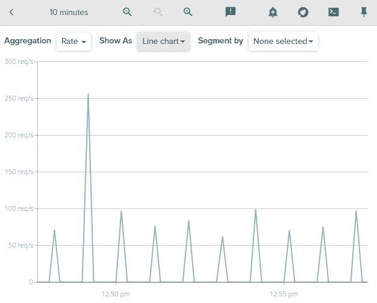

Sysdig Cloud 容量估算视图

# 警报

现在我们拥有了这么多有用的信息，让我们创建一些通知。向上滚动到页面顶部，找到一个从节点条目旁边的铃铛图标。点击它会打开一个创建警报的对话框。在这里，我们可以设置类似于本章前面部分手动设置的警报。不过，这里还有使用基准线（BASELINE）和主机比较（HOST COMPARISON）选项的功能。

使用基准线（BASELINE）选项非常有帮助，因为 Sysdig 会监视节点的历史模式，并在某个指标超出预期的阈值时发出警报。无需手动设置，这样可以大大节省通知设置的时间，并帮助我们的运维团队在问题出现之前采取主动。请参见以下截图：

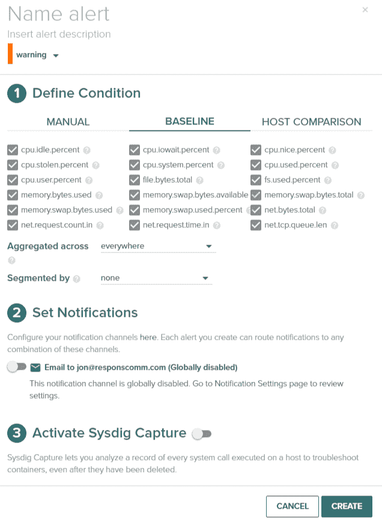

Sysdig Cloud 新警报

主机比较（HOST COMPARISON）选项也非常有帮助，因为它可以让我们与其他主机比较指标，并在某个主机的指标与其他主机显著不同时发出警报。一个典型的使用场景是监控从节点的资源使用情况，确保我们的调度约束不会在集群中某个地方造成瓶颈。

你可以选择任何你喜欢的选项，为其命名并设置警告级别。启用通知方法。Sysdig 支持电子邮件、**SNS**（即 **简单通知服务**）和 **PagerDuty** 作为通知方法。你还可以选择启用 **Sysdig Capture**，以便更深入地了解问题。设置完成后，只需点击创建，你就会在问题出现时开始收到警报。

# Sysdig 命令行

无论你是仅使用开源工具，还是尝试完整的 Sysdig Cloud 套件，命令行工具都是一个很好的伙伴，可以帮助你追踪问题或更深入地了解你的系统。

在核心工具中，除了主要的 `sysdig` 工具外，还有一个命令行风格的 UI，名为 `csysdig`。让我们看一些有用的命令。

查找适合你操作系统的安装说明：[`www.sysdig.org/install/`](http://www.sysdig.org/install/)。

安装完成后，首先通过以下命令查看网络活动最多的进程：

```
$ sudo sysdig -pc -c topprocs_net
```

以下截图是前述命令的结果：

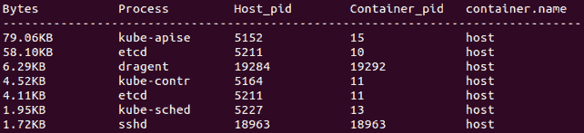

按网络活动排序的 Sysdig 顶级进程

这是一个交互式视图，将显示按网络活动排序的顶级进程。此外，还有许多可以与 `sysdig` 一起使用的命令。以下是一些其他有用的命令：

```
$ sudo sysdig -pc -c topprocs_cpu
$ sudo sysdig -pc -c topprocs_file
$ sudo sysdig -pc -c topprocs_cpu container.name=<Container Name NOT ID>
```

更多示例可以在 [`www.sysdig.org/wiki/sysdig-examples/`](http://www.sysdig.org/wiki/sysdig-examples/) 找到。

# Csysdig 命令行 UI

仅仅因为我们在某个节点的 shell 中，并不意味着我们不能使用 UI。Csysdig 是一个可定制的 UI，用于探索 Sysdig 提供的所有指标和洞察。只需在提示符中输入`csysdig`：

```
$ csysdig
```

输入 `csysdig` 后，我们将看到机器上所有进程的实时列表。在屏幕底部，你会看到一个包含各种选项的菜单。如果你喜欢使用键盘，可以点击 Views 或按 *F2*。在左侧菜单中有各种选项，我们将查看线程。双击线程（Threads）。

在某些操作系统和 SSH 客户端上，你可能会遇到功能键的问题。检查你的终端设置，确保功能键使用的是 VT100+ 序列。

我们可以看到系统上当前运行的所有线程以及一些资源使用信息。默认情况下，我们会看到一个更新频繁的大列表。如果点击筛选器，*F4*（对于不擅长使用鼠标的用户），我们可以缩小列表范围。

在筛选框中输入 `kube-apiserver`，如果你在主节点上；或输入 `kube-proxy`，如果你在一个节点（minion）上，然后按 *Enter*。现在视图会过滤出该命令下的所有线程：

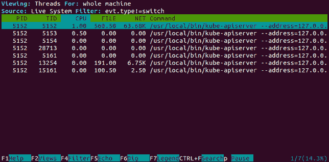

Csysdig 线程

如果我们想进一步检查，可以简单地选择列表中的一个线程，点击“Dig”或按 *F6* 键。现在，我们可以看到命令的系统调用的详细列表，实时显示。这是一个非常有用的工具，可以深入了解在我们集群上运行的容器和进程。

点击“Back”或按 *Backspace* 键返回到上一个屏幕。然后，再次进入“Views”视图。这一次，我们将查看 Containers 视图。同样，我们可以进行过滤，并使用 Dig 视图深入了解系统调用级别的情况。

另一个你可能会注意到的菜单项是“Actions”，它在最新版本中提供。这些功能允许我们从进程监控到操作和响应。它使我们能够从 Csysdig 的各种进程视图中执行各种操作。例如，容器视图中有操作可以进入 Bash shell、杀死容器、检查日志等。值得了解各种操作和快捷键，甚至为常见操作添加你自己的自定义快捷键。

# Prometheus

一个新兴的监控工具是名为 Prometheus 的开源工具。Prometheus 是一个由 SoundCloud 团队开发的开源监控工具。你可以在 [`prometheus.io`](https://prometheus.io) 上找到更多关于该项目的信息。

他们的网站提供以下功能：

+   多维数据模型 ([`prometheus.io/docs/concepts/data_model/`](https://prometheus.io/docs/concepts/data_model/))（时间序列通过其度量名称和键/值对来标识）

+   一个灵活的查询语言 ([`prometheus.io/docs/prometheus/latest/querying/basics/`](https://prometheus.io/docs/prometheus/latest/querying/basics/)) 来利用这种多维度数据

+   不依赖分布式存储；单服务器节点是自主的

+   时间序列收集通过 HTTP 的拉取模型进行

+   推送时间序列 ([`prometheus.io/docs/instrumenting/pushing/`](https://prometheus.io/docs/instrumenting/pushing/)) 通过中介网关进行支持

+   目标通过服务发现或静态配置进行发现

+   支持多种图形和仪表盘模式

# Prometheus 总结

Prometheus 为 Kubernetes 集群的操作员提供了许多价值。让我们来看一下软件的一些重要维度：

+   **操作简单**：它被设计为使用本地存储作为可靠性的独立服务器运行

+   **它很精准**：你可以使用类似 JQL、DDL、DCL 或 SQL 查询的查询语言来定义告警，并提供多维度的状态视图

+   **大量的库**：你可以使用十多种语言和众多客户端库来检查你的服务和软件

+   **高效**：通过内存和磁盘上的高效自定义格式存储数据，你可以轻松通过分片和联合来进行扩展，创建一个强大的平台，从中发出强有力的查询，构建强大的数据模型、临时表格、图表和警报。

此外，Prometheus 是 100% 开源的，并且（截至 2018 年 7 月）目前是 CNCF 的一个孵化项目。你可以像安装其他软件一样使用 Helm 安装它，或者按照我们将在这里详细介绍的手动安装方法进行安装。我们今天要讨论 Prometheus 的原因之一是由于 Kubernetes 系统的整体复杂性。由于有大量的活动组件、多个服务器以及可能的不同地理区域，我们需要一个能够应对所有这些复杂性的系统。

Prometheus 的一个好处是它的拉取机制，这使得你可以专注于通过 HTTP 将节点的度量标准作为纯文本暴露出来，Prometheus 然后可以将这些数据拉取到一个集中监控和日志记录的位置。它也是用 Go 编写的，并受到封闭源 Borgmon 系统的启发，这使得它与我们的 Kubernetes 集群完美契合。让我们开始安装吧！

# Prometheus 安装选项

与之前的例子一样，我们需要使用本地的 Minikube 安装或我们已经创建的 GCP 集群。登录到你选择的集群，然后让我们开始设置 Prometheus。由于软件的快速发展，实际上有很多安装 Prometheus 的选择：

+   最简单的手动方法；如果你想根据入门文档从头开始构建软件，你可以访问[`prometheus.io/docs/prometheus/latest/getting_started/`](https://prometheus.io/docs/prometheus/latest/getting_started/)并启动 Prometheus 自身的监控。

+   中间道路，使用 Helm；如果你想采取中间路线，你可以通过 Helm 在你的集群上安装 Prometheus（[`github.com/helm/charts/tree/master/stable/prometheus`](https://github.com/helm/charts/tree/master/stable/prometheus)）。

+   高级的 `Operator` 方法；如果你想使用最新最强的技术，让我们来看看 Kubernetes 的 `Operator` 软件类，并使用它来安装 Prometheus。`Operator` 是由 CoreOS 创建的，CoreOS 最近被 Red Hat 收购了。这应该意味着 Project Atomic 和 Container Linux 会有一些有趣的变化。不过，我们稍后会详细讨论！我们在这里将使用 Operator 模式。

Operator 旨在构建在 Helm 风格的软件管理之上，目的是将额外的人类操作知识融入到应用程序的安装、维护和恢复中。你可以将 Operator 软件视为一个 SRE Operator：一个在运行软件方面的专家。

Operator 是一个特定于应用的控制器，扩展了 Kubernetes API，以便管理复杂的有状态应用，如缓存、监控系统和关系型或非关系型数据库。Operator 利用 API 来创建、配置和管理这些有状态系统，代表用户执行操作。虽然 Deployments 在处理无状态 Web 应用的无缝管理方面非常出色，但 Kubernetes 中的 Deployment 对象在扩展、升级、故障恢复和重新配置这些有状态系统时，面临着协调所有移动部件的挑战。

你可以在这里阅读更多关于扩展 Kubernetes API 的内容：[`kubernetes.io/docs/concepts/extend-kubernetes/api-extension/`](https://kubernetes.io/docs/concepts/extend-kubernetes/api-extension/)。

Operator 利用了我们在其他章节中讨论的一些 Kubernetes 核心概念。资源（如 ReplicaSets）和控制器（例如 Deployments、Services 和 DaemonSets）与编码在 Operator 软件中的手动操作步骤的附加操作知识一起使用。例如，当你手动扩展一个 etcd 集群时，过程中的关键步骤之一是为新的 etcd 成员创建一个 DNS 名称，这个名称可以在将其添加到集群后用来路由到新的成员。使用 Operator 模式时，这些系统化的知识被构建到`Operator`类中，为集群管理员提供对 etcd 软件的无缝更新。

创建 Operator 的难点在于理解相关有状态软件的底层功能，并将其编码到资源配置和控制循环中。请记住，Kubernetes 可以被看作是一个大型的分布式消息队列，消息以 YAML 格式的声明性状态存在，集群操作员定义这些状态，Kubernetes 系统负责将其落实。

# 创建 Operator 的提示

如果你想在未来创建自己的`Operator`，可以记住 CoreOS 提供的以下提示。鉴于它们的应用特定领域，在管理复杂应用时需要注意几点。首先，你会有一组系统流程活动，`Operator`应该能够执行这些操作。这些操作包括创建用户、创建数据库、修改用户权限和密码、删除用户（例如创建许多系统时默认安装的用户）。

你还需要管理你的安装依赖项，即那些在系统正常运行之前必须存在并配置的项。CoreOS 还建议在创建`Operator`时遵循以下原则：

+   **部署的单步操作**：确保你的`Operator`可以通过一个不需要额外操作的命令来初始化并运行。

+   **新的第三方类型**：你的`Operator`应该利用第三方 API 类型，用户在创建使用你软件的应用程序时会使用这些类型。

+   **使用基础功能**：确保你的`Operator`使用核心的 Kubernetes 对象，如 ReplicaSets、Services 和 StatefulSets，以便充分利用 Kubernetes 开源项目中所投入的大量工作。

+   **兼容且默认工作**：确保你构建的`Operators`与旧版本兼容，并设计你的系统，使得即使`Operator`被停止或意外从集群中删除，系统仍能继续运行且不受影响。

+   **版本**：确保你的`Operator`支持版本控制，以便集群管理员不会回避更新你的软件。

+   **测试**：同样，确保将`Operator`进行抗破坏性测试，例如使用混沌猴（Chaos Monkey）进行测试！你的`Operator`应该能够承受节点、pods、存储、配置和网络故障的影响。

# 安装 Prometheus

让我们通过我们发现的新模式来安装 Prometheus。首先，使用 Prometheus 定义文件来创建部署。我们将在这里使用 Helm 来安装 Operator！

确保你已经安装了 Helm，并确保你已经初始化了它：

```
$ helm init
master $ helm init
Creating /root/.helm
...
Adding stable repo with URL: https://kubernetes-charts.storage.googleapis.com
Adding local repo with URL: http://127.0.0.1:8879/charts
$HELM_HOME has been configured at /root/.helm.
...
Happy Helming!
$
```

接下来，我们可以安装此演示所需的各种`Operator`包：

```
$ helm repo add coreos https://s3-eu-west-1.amazonaws.com/coreos-charts/stable/
"coreos" has been added to your repositories
```

现在，安装`Operator`：

```
$ helm install coreos/prometheus-operator --name prometheus-operator
```

你可以先检查安装情况来确认它已经安装并在运行：

```
$ helm ls prometheus-operator
NAME                    REVISION UPDATED                        STATUS CHART NAMESPACE prometheus-operator     1 Mon Jul 23 02:10:18 2018        DEPLOYED prometheus-operator-0.0.28 default

```

然后，查看 pods：

```
$ kubectl get pods
NAME READY STATUS RESTARTS AGE
prometheus-operator-d75587d6-bmmvx 1/1 Running 0 2m
```

现在，我们可以安装`kube-prometheus`，让所有依赖项开始运行：

```
$ helm install coreos/kube-prometheus --name kube-prometheus --set global.rbacEnable=true
NAME:   kube-prometheus
LAST DEPLOYED: Mon Jul 23 02:15:59 2018
NAMESPACE: default
STATUS: DEPLOYED

RESOURCES:
==> v1/Alertmanager
NAME             AGE
kube-prometheus  1s

==> v1/Pod(related)
NAME                                                  READY STATUS RESTARTS AGE
kube-prometheus-exporter-node-45rwl                   0/1 ContainerCreating 0 1s
kube-prometheus-exporter-node-d84mp                   0/1 ContainerCreating 0 1s
kube-prometheus-exporter-kube-state-844bb6f589-z58b6  0/2 ContainerCreating 0 1s
kube-prometheus-grafana-57d5b4d79f-mgqw5              0/2 ContainerCreating 0 1s

==> v1beta1/ClusterRoleBinding
NAME                                     AGE
psp-kube-prometheus-alertmanager         1s
kube-prometheus-exporter-kube-state      1s
psp-kube-prometheus-exporter-kube-state  1s
psp-kube-prometheus-exporter-node        1s
psp-kube-prometheus-grafana              1s
kube-prometheus                          1s
psp-kube-prometheus                      1s
…
```

我们在这里截断了输出，因为有大量信息。让我们再次查看 pods：

```
$ kubectl get pods
NAME                                                   READY STATUS RESTARTS AGE
alertmanager-kube-prometheus-0                         2/2 Running 0 3m
kube-prometheus-exporter-kube-state-85975c8577-vfl6t   2/2
Running 0 2m
kube-prometheus-exporter-node-45rwl                    1/1 Running 0 3m
kube-prometheus-exporter-node-d84mp                    1/1 Running 0 3m
kube-prometheus-grafana-57d5b4d79f-mgqw5               2/2 Running 0 3m
prometheus-kube-prometheus-0                           3/3 Running 1 3m
prometheus-operator-d75587d6-bmmvx                     1/1 Running 0 8m
```

干得不错！

如果你将`prometheus-kube-prometheus-0`的端口转发到`8448`，你应该能够看到 Prometheus 仪表板，我们将在后续章节中重新访问它，探索 Kubernetes 集群的高可用性和生产化。你可以通过`http://localhost:8449/alerts`查看。

# 总结

我们简要了解了 Kubernetes 的监控和日志记录。你现在应该熟悉 Kubernetes 如何使用 cAdvisor 和 Heapster 收集集群中所有资源的指标。此外，我们看到 Kubernetes 通过提供预配置好的 InfluxDB 和 Grafana，帮助我们节省了时间。仪表板可以根据我们的日常操作需求轻松定制。

此外，我们还了解了使用 FluentD 和 Google Cloud Logging 服务的内置日志记录功能。另外，Kubernetes 通过为我们设置基本配置，节省了大量时间。

最后，你了解了各种可用于监控容器和集群的第三方选项。使用这些工具将帮助我们更深入地了解应用程序的健康状况和状态。所有这些工具结合在一起，提供了一个强大的工具集来管理日常操作。最后，我们探讨了不同的 Prometheus 安装方法，旨在构建更强大的生产系统。

在下一章中，我们将探讨新的集群联邦功能。尽管仍然处于测试阶段，但这一功能将允许我们在不同的数据中心甚至云中运行多个集群，同时从单一控制平面管理和分发应用程序。

# 问题

1.  列出 Kubernetes 内置的两种监控工具

1.  内置监控工具运行在哪个命名空间？

1.  大多数监控工具使用的图表软件是什么？

1.  FluentD 被称为什么？

1.  Google 的原生监控系统是什么？

1.  使用 Prometheus 的两个好理由是什么？

# 进一步阅读

如果你想了解更多关于 Kubernetes 操作符框架的内容，请查看这篇博客文章：[`coreos.com/blog/introducing-operator-framework`](https://coreos.com/blog/introducing-operator-framework)。

如果你想查看一段关于 Kubernetes 监控的视频，请访问这个视频：[`www.packtpub.com/mapt/video/virtualization_and_cloud/9781789130003/65553/65558/monitoring-your-infrastructure`](https://www.packtpub.com/mapt/video/virtualization_and_cloud/9781789130003/65553/65558/monitoring-your-infrastructure)。
