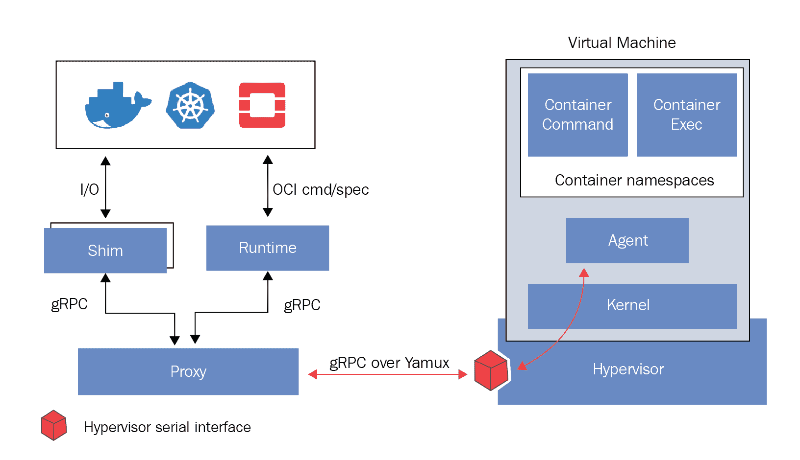
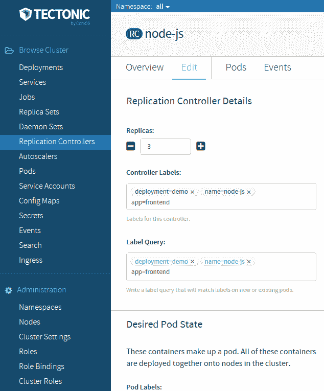

# 第九章：操作系统、平台以及云服务和本地服务提供商

本章的前半部分将讲解开放标准如何鼓励多样化的容器实现生态系统。我们将讨论**开放容器倡议**（**OCI**）及其提供开放容器规范的使命。本章的后半部分将讨论可用于运行容器化工作负载的各种操作系统，如 CoreOS。我们还将探讨作为宿主操作系统的优势，包括性能和对各种容器实现的支持。此外，我们还将简要介绍 CoreOS 的 Tectonic 企业版。我们将讨论主要**云服务提供商**（**CSPs**）提供的各种托管平台，并比较它们的优劣。

本章将讨论以下主题：

+   为什么标准如此重要？

+   OCI 和 **云原生计算基金会**（**CNCF**）

+   容器规范与实现

+   各种面向容器的操作系统

+   Tectonic

+   可运行 Kubernetes 工作负载的 CSP 平台

# 技术需求

你需要启用并登录你的 Google Cloud Platform 账户，或者可以使用本地的 Minikube 实例来运行 Kubernetes。你还可以在 [`labs.play-with-k8s.com/`](https://labs.play-with-k8s.com/) 上使用在线的 Play with Kubernetes。

你还需要 GitHub 凭证，我们将在本章后面介绍如何设置。

本章的 GitHub 仓库可以在 [`github.com/PacktPublishing/Getting-Started-with-Kubernetes-third-edition/tree/master/Code-files/Chapter09`](https://github.com/PacktPublishing/Getting-Started-with-Kubernetes-third-edition/tree/master/Code-files/Chapter09) 找到。

# 标准的重要性

在过去两年中，容器化技术在流行度上经历了巨大的增长。尽管 Docker 一直处于这一生态系统的核心，但容器领域的参与者越来越多。已经有很多替代容器化技术和 Docker 实现的选项（如 rkt、Garden 等）。此外，还有丰富的第三方工具生态系统，它们增强并补充了你的容器基础设施。尽管 Kubernetes 设计用于管理容器的状态及其编排、调度和网络方面的内容，但关键是，这些工具构成了构建云原生应用的基础。

正如我们在本书一开始提到的，容器最吸引人的地方之一就是它们能够将我们的应用程序打包，以便在不同的环境层（即开发、测试和生产）以及不同的基础设施提供商（如 GCP、AWS、本地等）之间进行部署。

要真正支持这种部署灵活性，我们不仅需要容器本身拥有一个共同的平台，还需要底层的规范遵循一套共同的基本规则。这将允许既灵活又高度专业化的实现。例如，一些工作负载可能需要在一个高度安全的实现上运行。为了提供这一点，实施过程必须对一些方面做出更有意图的决策。无论哪种情况，如果我们的容器建立在所有实现都同意并支持的共同结构上，我们将获得更多的灵活性和自由。

在接下来的页面中，我们将探讨 Kubernetes 生态系统中许多竞争标准的构建模块。我们将解释它们是如何变化和发展的，以及它们在未来可能扮演的角色。

我们将在第三版中更深入地探讨的一个例子是 CRI-O 项目，它是在 OCI 宪章创建之后诞生的。让我们确保理解这个使命的重要性。

# OCI 宪章

OCI 宪章的使命是确保开源社区拥有一个稳定的平台，从而使行业参与者能够贡献出构建容器驱动应用所需的可移植、开放且供应商中立的运行时。Linux 基金会是宪章的持有者，它是 CNCF 的姊妹组织。我们将在第十一章，*Kubernetes SIGs、孵化项目和 CNCF* 中更深入地探讨基础设施的影响。

如果你想了解更多关于这些基础的内容，可以访问他们的网站：[`www.linuxfoundation.org/`](https://www.linuxfoundation.org/) 和 **[`www.cncf.io/`](https://www.cncf.io/)。**

虽然 OCI 宪章试图标准化生态系统的构建模块，但它并不试图在宏观层面上定义系统，也不推广某种特定的路径或解决方案。它还定义了一个过程，通过这些基础设施帮助技术以负责任的方式成熟，以确保最好的技术能够到达最终用户。这些被定义为以下几个阶段：

1.  沙盒

1.  孵化

1.  毕业

就本章涉及 OCI 的具体内容来说，让我们看看他们还在努力完成什么。首先，我们正在尝试创建一个格式规范。这个规范将指出几个重要维度，以便达成共识：

+   **提供一种格式**：为了确保能够跨多个运行时使用的规范，你需要一个标准的容器格式和运行时规范。容器格式由磁盘上的根文件系统表示，并且需要额外的配置，使得给定的容器能够在系统上运行。推动将标准化分类为以下几个层级：基础、可选和超出范围。

+   **提供一个运行时**：这个更直接，因为它旨在提供一个可执行文件，可以通过消费上述容器格式和运行时规范直接运行容器。

《宪章》还激励了许多项目，其中前两个是 runc 项目，第三个涉及在 OCI 规范项目中定义自己的规范。新项目由成员通过审查流程添加，该流程需要当前**技术监督委员会**（**TOB**）的三分之二批准。如果我们更深入地了解 OCI 的治理原则，网站列出了六项指导原则：

+   技术领导力

+   通过贡献产生影响

+   有限的范围，有限的政治

+   极简结构

+   代表性领导力

+   遵守反垄断法规

这些条目融合了哲学和逻辑框架，鼓励竞争、合作、精英主义以及许多敏捷和 DevOps 从业者长期以来所利用的持续改进周期。

现在让我们深入了解一下这个倡议本身。

# OCI

首批获得广泛行业参与的倡议之一是 OCI。在 36 个行业合作伙伴中，有 Docker、Red Hat、VMware、IBM、Google 和 AWS，如 OCI 网站所列，网址为[`www.opencontainers.org/`](https://www.opencontainers.org/)。

OCI 的目的是将实现方案，如 Docker 和 rkt，与容器化工作负载的格式和运行时标准分离。根据他们自己的定义，OCI 规范的目标有三个基本原则（你可以在章节末尾的*进一步阅读*部分找到更多细节）：

+   创建一个容器镜像格式和运行时的正式规范，允许符合规范的容器在所有主要的、合规的操作系统和平台上可移植，不受人为技术障碍的限制。

+   接受、维护和推动与这些标准相关的项目。它将力求就容器的标准操作集（启动、执行、暂停等）以及与容器运行时相关的运行时环境达成一致。

+   将先前提到的标准与其他提议的标准（包括 appc 规范）进行协调。

通过遵循这些原则，OCI 希望加强一个协作和包容的生态系统，提供一个丰富且不断发展的工具集，以满足当今复杂应用工作负载的需求，无论是云原生还是传统的。

此外，在此领域的标准发展中，还有一些指导原则。这些原则源自创建 appc 的人的创始信念，具体如下：

+   **安全性**：通过使用安全的加密原理和图像及应用代码的监控链条，通过可插拔接口隔离容器。

+   **可移植性**：确保容器能够在各种软件、云和硬件之间保持可移植性。

+   **去中心化**：容器镜像应简洁明了，并应利用联邦和命名空间的优势。

+   **开放**：运行时和格式应由社区构建，并具有多个可互换的部分。

+   **向后兼容**：鉴于 Docker 和容器的受欢迎程度（近 90 亿次下载），向后兼容性应给予高度优先考虑。

+   **可组合**：容器操作工具应良好集成，但保持模块化。

+   **代码**：共识应基于运行中的、可工作的代码，并遵循最简原则，符合领域驱动设计。它应是稳定和可扩展的。

# 容器运行时接口

让我们来看看其中一个更新的、针对 Kubernetes 的 OCI 基础项目——CRI-O。CRI-O 目前是 Kubernetes 孵化器的一部分，但随着其成熟，它可能会脱离并成为独立项目。CRI-O 设计的一个引人注目的特点是，它从不破坏 Kubernetes。这与其他运行时不同，因为其他运行时的设计目的是做许多事情，如构建镜像、管理安全性、编排和检查镜像。而 CRI-O 仅仅是为了帮助 Kubernetes 编排和调度容器。

你可以通过[`github.com/kubernetes-incubator/cri-o/`](https://github.com/kubernetes-incubator/cri-o)获取 CRI-O 项目的代码并阅读文档。

为此，CRI-O 与 CRI 本身一起开发，并与 Kubernetes 系统的上游版本保持一致。下图展示了 CRI-O 如何与 OCI 配合工作：


为了实现这一工作流，发生了以下情况：

1.  操作员决定启动一个 Pod，这会导致 Kubernetes 使用`kubelet`来启动 Pod。然后，该`kubelet`通过 CRI 与 CRI-O 守护进程进行通信。

1.  CRI-O 随后使用多个基于 OCI 标准的库，从注册表中拉取并解压给定的容器镜像。通过这些操作，CRI-O 生成一个 JSON 数据块，供下一步运行容器使用。

1.  CRI-O 启动一个兼容 OCI 的运行时，然后运行容器进程。这可能是 runc，或者是新的 Kata 容器运行时（它已经吸收了 Intel 的清晰容器计划）。

你会注意到，CRI-O 在库和运行时之间充当了一个交错层，它通过使用标准格式来完成大多数目标。这确保了目标是让 Kubernetes 始终有效运行。以下是展示本节描述的流程系统的图示：


对于网络，CRI-O 将利用**容器网络接口**（**CNI**），这与 CRI 类似，但处理的是网络堆栈。你应该开始看到一些模式的出现。

CRI-O 是一个实现，帮助实现 OCI 规范。这使得用户可以理所当然地将容器运行时作为实现细节，而专注于应用程序如何与 Kubernetes 系统中的对象和抽象进行交互。

# 尝试使用 CRI-O

让我们看看一些安装方法，帮助你自己尝试 CRI-O。为了开始，你需要一些工具，包括 runc 或其他 OCI 兼容的运行时，以及 socat、iproute 和 iptables。你可以选择几种方式在 Kubernetes 中运行 CRI-O：

+   在全规模集群中，使用`kube-adm`和`systemd`通过`--container-runtime-endpoint /var/run/crio/crio.sock`来利用 CRI-O 套接字。

+   使用 Minikube，通过特定的命令行选项启动它。

+   在 Atomic 系统上使用`--system-package=no -n cri-o --storage ostree registry.centos.org/projectatomic/cri-o:latest`安装。

如果你想从源代码构建 CRI-O，你可以在笔记本电脑上运行以下命令。你需要安装一些依赖项，才能使这个构建阶段正常工作。首先，运行以下命令安装你的依赖项。

以下命令适用于 Fedora、CentOS 和 RHEL 发行版：

```
yum install -y \
 btrfs-progs-devel \
 device-mapper-devel \
 git \
 glib2-devel \
 glibc-devel \
 glibc-static \
 go \
 golang-github-cpuguy83-go-md2man \
 gpgme-devel \
 libassuan-devel \
 libgpg-error-devel \
 libseccomp-devel \
 libselinux-devel \
 ostree-devel \
 pkgconfig \
 runc \
 skopeo-containers
```

这些命令适用于 Debian、Ubuntu 及相关发行版：

```
apt-get install -y \
 btrfs-tools \
 git \
 golang-go \
 libassuan-dev \
 libdevmapper-dev \
 libglib2.0-dev \
 libc6-dev \
 libgpgme11-dev \
 libgpg-error-dev \
 libseccomp-dev \
 libselinux1-dev \
 pkg-config \
 go-md2man \
 runc \
 skopeo-containers
```

其次，你需要像下面这样获取源代码：

```
git clone https://github.com/kubernetes-incubator/cri-o # or your fork
cd cri-o
```

一旦你有了代码，就可以继续构建它：

```
make install.tools
make
sudo make install
```

你可以使用额外的构建标志添加如`seccomp`、SELinux 和`apparmor`等内容，格式为：`make BUILDTAGS='seccomp apparmor'`。

你可以使用 Kubernetes 中的`local-up-cluster.sh`脚本在本地运行 Kubernetes。我还会向你展示如何在 Minikube 上运行它。

首先，克隆 Kubernetes 仓库：

```
git clone https://github.com/kubernetes/kubernetes.git
```

接下来，你需要启动 CRI-O 守护进程，并运行以下命令，使用 CRI-O 启动集群：

```
CGROUP_DRIVER=systemd \
 CONTAINER_RUNTIME=remote \
 CONTAINER_RUNTIME_ENDPOINT='unix:///var/run/crio/crio.sock  --runtime-request-timeout=15m' \
 ./hack/local-up-cluster.sh
```

如果你有一个正在运行的集群，你也可以使用以下网址的说明，将运行时从 Docker 切换到 CRI-O：[`github.com/kubernetes-incubator/cri-o/blob/master/kubernetes.md/`](https://github.com/kubernetes-incubator/cri-o/blob/master/kubernetes.md)。

让我们还检查一下如何在 Minikube 上使用 CRI-O，这是最简单的实验方式之一：

```
minikube start \
 --network-plugin=cni \
 --extra-config=kubelet.container-runtime=remote \
 --extra-config=kubelet.container-runtime-endpoint=/var/run/crio/crio.sock \
 --extra-config=kubelet.image-service-endpoint=/var/run/crio/crio.sock \
 --bootstrapper=kubeadm
```

最后，我们可以使用 GCP 平台创建一个 CRI-O 集群并开始实验：

```
gcloud compute instances create cri-o \
 --machine-type n1-standard-2 \
 --image-family ubuntu-1610 \
 --image-project ubuntu-os-cloud
```

让我们使用这些机器快速进行一个教程。使用`gcloud compute ssh cri-o`通过 SSH 连接到机器。

一旦你进入服务器，我们需要安装`cri-o`、`crioctl`、`cni`和`runc`程序。首先获取`runc`二进制文件：

```
wget https://github.com/opencontainers/runc/releases/download/v1.0.0-rc4/runc.amd64
```

设置可执行权限并将其移动到你的路径，如下所示：

```
chmod +x runc.amd64
sudo mv runc.amd64 /usr/bin/runc
```

你可以通过检查版本来验证它是否工作正常：

```
$ runc -version
runc version 1.0.0-rc4
commit: 2e7cfe036e2c6dc51ccca6eb7fa3ee6b63976dcd
spec: 1.0.0
```

你需要从源代码安装 CRI-O 二进制文件，因为目前没有发布任何二进制文件。

首先，下载最新的二进制发布版本并安装 Go：

```
wget https://storage.googleapis.com/golang/go1.8.5.linux-amd64.tar.gz
sudo tar -xvf go1.8.5.linux-amd64.tar.gz -C /usr/local/
mkdir -p $HOME/go/src
export GOPATH=$HOME/go
export PATH=$PATH:/usr/local/go/bin:$GOPATH/bin
```

这应该很熟悉，因为你安装 Go 的方式和任何其他项目相同。检查你的版本：

```
go version
go version go1.8.5 linux/amd64
```

接下来，使用以下命令获取`crictl`：

```
go get github.com/kubernetes-incubator/cri-tools/cmd/crictl
cd $GOPATH/src/github.com/kubernetes-incubator/cri-tools
make
make install
```

下载完成后，你需要从源代码构建 CRI-O：

```
sudo apt-get update && apt-get install -y libglib2.0-dev \
 libseccomp-dev \
 libgpgme11-dev \
 libdevmapper-dev \
 make \
 git
```

现在，获取并安装 CRI-O：

```
go get -d github.com/kubernetes-incubator/cri-o
cd $GOPATH/src/github.com/kubernetes-incubator/cri-o
make install.tools
Make
sudo make install
```

完成后，你需要通过 `sudo make install.config` 创建配置文件。你需要确保在 `/etc/crio/cirio.conf` 文件中使用了有效的注册表选项。其示例如下：

```
registries = ['registry.access..com', 'registry.fedoraproject.org', 'docker.io']
```

此时，我们已经准备好启动 CRI-O 系统守护进程，我们可以通过使用 `systemctl` 来实现。让我们创建一个 `crio.service`：

```
$ vim /etc/systemd/system/crio.service
```

添加以下文本：

```
[Unit]
Description=OCI-based implementation of Kubernetes Container Runtime Interface
Documentation=https://github.com/kubernetes-incubator/cri-o

[Service]
ExecStart=/usr/local/bin/crio
Restart=on-failure
RestartSec=5

[Install]
WantedBy=multi-user.target
```

完成后，我们可以重新加载 `systemctl` 并启用 CRI-O：

```
$ sudo systemctl daemon-reload && \
 sudo systemctl enable crio && \
 sudo systemctl start crio
```

完成后，我们可以通过检查端点的版本来验证是否成功安装了 CRI-O，如下所示：

```
$ sudo crictl --runtime-endpoint unix:///var/run/crio/crio.sock version
Version:  0.1.0
RuntimeName:  cri-o
RuntimeVersion:  1.10.0-dev
RuntimeApiVersion:  v1alpha1
```

接下来，我们需要获取最新版本的 CNI 插件，以便我们可以从源代码构建并使用它。我们将使用 Go 来获取我们的源代码：

```
go get -d github.com/containernetworking/plugins
cd $GOPATH/src/github.com/containernetworking/plugins
./build.sh
```

接下来，安装 CNI 插件到你的集群中：

```
sudo mkdir -p /opt/cni/bin
sudo cp bin/* /opt/cni/bin/
```

现在，我们可以配置 CNI，使得 CRI-O 可以使用它。首先，创建一个目录来存储配置文件，然后我们将设置以下两个配置文件：

```
sudo mkdir -p /etc/cni/net.d
```

接下来，你需要创建并配置 `10-mynet.conf`：

```
sudo sh -c 'cat >/etc/cni/net.d/10-mynet.conf <<-EOF
{
"cniVersion": "0.2.0",
   "name": "mynet",
   "type": "bridge",
   "bridge": "cni0",
   "isGateway": true,
   "ipMasq": true,
   "ipam": {
       "type": "host-local",
       "subnet": "10.88.0.0/16",
       "routes": [
           { "dst": "0.0.0.0/0"  }
       ]
   }
}
EOF'
```

然后，按如下方式构建 `loopback` 接口：

```
sudo sh -c 'cat >/etc/cni/net.d/99-loopback.conf <<-EOF
{
 "cniVersion": "0.2.0",
 "type": "loopback"
}
EOF'
```

接下来，我们将需要一些来自 Project Atomic 的特殊容器来使其工作。`skopeo` 是一个符合 OCI 标准的命令行工具，可以对容器镜像和镜像仓库执行各种操作。按如下方式安装容器：

```
sudo add-apt-repository ppa:projectatomic/ppa
sudo apt-get update
sudo apt-get install skopeo-containers -y
```

使用 `sudo systemctl restart crio` 重启 CRI-O 以加载 CNI 配置。太棒了！现在我们已经安装了这些组件，开始构建一些东西吧！

首先，我们将使用来自 Kubernetes 孵化器的模板策略创建一个沙箱。

这个模板不是生产就绪的！

首先切换到带有模板的 CRI-O 源树，如下所示：

```
cd $GOPATH/src/github.com/kubernetes-incubator/cri-o
```

接下来，你需要创建并捕获 pod 的 ID：

```
sudo mkdir /etc/containers/
sudo cp test/policy.json /etc/containers
```

你可以使用 `critcl` 获取 pod 状态，如下所示：

```
sudo crictl inspectp --output table $POD_ID
ID: cd6c0883663c6f4f99697aaa15af8219e351e03696bd866bc3ac055ef289702a
Name: podsandbox1
UID: redhat-test-crio
Namespace: redhat.test.crio
Attempt: 1
Status: SANDBOX_READY
Created: 2016-12-14 15:59:04.373680832 +0000 UTC
Network namespace: /var/run/netns/cni-bc37b858-fb4d-41e6-58b0-9905d0ba23f8
IP Address: 10.88.0.2
Labels:
group -> test
Annotations:
owner -> jwhite
security.alpha.kubernetes.io/seccomp/pod -> unconfined
security.alpha.kubernetes.io/sysctls ->
kernel.shm_rmid_forced=1,net.ipv4.ip_local_port_range=1024 65000
security.alpha.kubernetes.io/unsafe-sysctls -> kernel.msgmax=8192
```

我们将再次使用 `crictl` 工具拉取 Redis 服务器的容器镜像：

```
sudo crictl pull quay.io/crio/redis:alpine
CONTAINER_ID=$(sudo crictl create $POD_ID test/testdata/container_redis.json test/testdata/sandbox_config.json)
```

接下来，我们将启动并检查 Redis 容器的状态，如下所示：

```
sudo crictl start $CONTAINER_ID
sudo crictl inspect $CONTAINER_ID
```

此时，你应该能够 `telnet` 进入 Redis 容器以测试其功能：

```
telnet 10.88.0.2 6379
Trying 10.88.0.2…
Connected to 10.88.0.2.
Escape character is '^]'.
```

干得漂亮—你已经手动创建了一个 pod 和容器，使用了 Kubernetes 系统的一些核心抽象！你可以使用以下命令停止容器并关闭 pod：

```
sudo crictl stop $CONTAINER_ID
sudo crictl rm $CONTAINER_ID
sudo crictl stopp $POD_ID
sudo crictl rmp $POD_ID
sudo crictl pods
sudo crictl ps
```

# 更多关于容器运行时的信息

有许多基于容器和虚拟机的选项适用于符合 OCI 标准的实现。我们知道 runc，这是 OCI 运行时的标准参考实现，容器就使用这个。还有以下选项可用：

+   `projectatomic/bwrap-oci` ([`github.com/projectatomic/bwrap-oci`](https://github.com/projectatomic/bwrap-oci)): 将 OCI 规范文件转换为 `projectatomic/bubblewrap` ([`github.com/projectatomic/bubblewrap`](https://github.com/projectatomic/bubblewrap)) 的命令行

+   `giuseppe/crun` ([`github.com/giuseppe/crun`](https://github.com/giuseppe/crun))：C 语言实现的运行时

还有基于虚拟机的实现，它们采取了不同的安全路径：

+   `hyperhq/runv` ([`github.com/hyperhq/runv`](https://github.com/hyperhq/runv))—基于虚拟机监控程序的 OCI 运行时

+   `clearcontainers/runtime` ([`github.com/clearcontainers/runtime`](https://github.com/clearcontainers/runtime))—基于虚拟机监控程序的 OCI 运行时，利用 Intel 的`containers/virtcontainers` ([`github.com/containers/virtcontainers`](https://github.com/containers/virtcontainers))

+   `google/gvisor` ([`github.com/google/gvisor`](https://github.com/google/gvisor))—gVisor 是一个用户空间内核，包含 runsc 来运行沙箱化的容器

+   `kata-containers/runtime` ([`github.com/kata-containers/runtime`](https://github.com/kata-containers/runtime))—基于虚拟机监控程序的 OCI 运行时，结合了`clearcontainers/runtime` ([`github.com/clearcontainers/runtime`](https://github.com/clearcontainers/runtime)) 和 `hyperhq/runv` ([`github.com/hyperhq/runv`](https://github.com/hyperhq/runv))的技术

这些项目中最有趣的是列表中的最后一个——Kata 容器，它将 clear container 和 runV 结合成一个统一的包。这些基础性组件已经在企业中大规模投入生产使用，而 Kata 旨在为容器化环境提供一个安全、轻量的虚拟机。通过利用 runV，Kata 容器可以在任何 KVM 兼容的虚拟机中运行，如 Xen、KVM 和 vSphere，同时仍与 CRI-O 保持兼容，这一点非常重要！Kata 希望能提供容器的速度和虚拟机的安全性。

这是 Kata 网站上的一个图表，详细解释了架构的视觉细节：



# CNCF

另一个在业内广泛接受的倡议是 CNCF。尽管它仍然专注于容器化工作负载，但 CNCF 的运作层级略高，处于应用设计层面。

它的目的是提供一套标准的工具和技术，用于构建、操作和编排云原生应用栈。云计算为我们提供了多种新技术和实践，这些可以改进并演化我们的经典软件设计。CNCF 也特别关注微服务导向开发的新范式。

作为 CNCF 的创始参与者，Google 捐赠了 Kubernetes 开源项目。其目标是提高生态系统中的互操作性，并支持与其他项目的更好集成。CNCF 已经托管了各种关于编排、日志、监控、追踪和应用程序韧性等项目。

欲了解更多关于 CNCF 的信息，请参阅 [`cncf.io/`](https://cncf.io/)。

我们将在接下来的章节中更多地讨论 CNCF、**特殊兴趣小组**（**SIGs**）及其中的相关领域。

现在，请考虑这份景观和路径图：[`www.cncf.io/blog/2018/03/08/introducing-the-cloud-native-landscape-2-0-interactive-edition/`](https://www.cncf.io/blog/2018/03/08/introducing-the-cloud-native-landscape-2-0-interactive-edition/)。

# 标准容器规范

OCI 努力的核心成果之一是创建和开发全面的容器规范。该规范包括五个核心原则，所有容器都应遵循，我将简要解释一下：

+   容器必须具有创建、启动和停止容器的*标准操作*，适用于所有实施。

+   容器必须*与内容无关*，这意味着容器内部的应用类型不会改变容器本身的标准操作或发布。

+   容器还必须*与基础设施无关*。可移植性至关重要；因此，容器必须能够在 GCE 中和在您公司的数据中心或开发者的笔记本上同样轻松地运行。

+   容器还必须设计用于*自动化*，这使我们能够在构建过程中自动化，以及更新和部署管道。虽然这个规则有点模糊，但容器的实施不应要求繁琐的手动步骤来进行创建和发布。

+   最后，实施必须支持*工业级交付*。这再次意味着与构建和部署管道相关，并要求在基础设施和部署层之间容器的可移植性和传输中实现高效率。

规范还为容器格式和运行时定义了核心原则。您可以在 open containers GitHub 页面上阅读更多规范信息，网址为[`github.com/opencontainers/specs`](https://github.com/opencontainers/specs)。

尽管核心规范可能有点抽象，但 runc 的实施是 OCI 规范的一个具体示例，是一个容器运行时和镜像格式。您可以在 GitHub 上阅读更多技术细节，网址为[`github.com/opencontainers/runc`](https://github.com/opencontainers/runc)。

一些流行容器工具的支持格式和运行时是 runc。它由 Docker 捐赠给 OCI，并基于 Docker 平台使用的相同基础设施工作创建而成。自发布以来，它得到了许多项目的欢迎。

即使是流行的开源 PaaS Cloud Foundry 也宣布将在 Garden 中使用 runc。Garden 为 Diego 提供了容器化的基础设施，作为类似于 Kubernetes 的编排层。

rkt 的实现最初基于 appc 规范。appc 规范实际上是 CoreOS 团队早期的一次尝试，旨在围绕容器化形成一个共同的规范。现在，CoreOS 参与了 OCI，他们正在努力将 appc 规范并入 OCI；这应该会导致容器生态系统中的更高兼容性。

# CoreOS

虽然规格提供了我们一个共同的基础，但也有一些趋势在容器操作系统的选择上不断发展。现在有几种量身定制的操作系统正在开发，专门用于运行容器负载。尽管实现方式各异，但它们都有类似的特点。重点在于精简的安装基础、原子化的操作系统更新以及签名应用程序，以实现高效和安全的操作。

一个正在获得越来越多关注的操作系统是 CoreOS。CoreOS 在安全性和资源利用方面都提供了重要的优势。它通过完全去除包依赖关系来提供资源利用。相反，CoreOS 将所有应用程序和服务运行在容器中。通过仅提供一小部分支持容器运行所需的服务，并绕过虚拟化程序的使用，CoreOS 使我们能够使用更多的资源池来运行容器化应用程序。这使得用户能够从基础设施中获得更高的性能，并实现更好的容器与节点（服务器）使用比例。

最近，CoreOS 被红帽收购，这意味着当前版本的 Container Linux 将会与红帽的容器操作系统产品 Project Atomic 竞争。这两款产品最终将合并为 Red Hat CoreOS。如果你考虑到 Fedora 对 Red Hat Enterprise Linux 采取的上游社区方法，那么可以推测 Red Hat CoreOS 也会有类似的方式。

这也意味着红帽将会集成 Tectonic（我们将在本章稍后讨论）以及 Quay，这是 CoreOS 收购的企业级容器注册中心。需要注意的是，rkt 容器标准不会成为收购的一部分，而是将成为一个社区支持的项目。

如果你想查看前面部分讨论的相关官方公告，可以查看以下这些帖子：

+   **新闻稿**：[`www.redhat.com/en/about/press-releases/red-hat-acquire-coreos-expanding-its-kubernetes-and-containers-leadership`](https://www.redhat.com/en/about/press-releases/red-hat-acquire-coreos-expanding-its-kubernetes-and-containers-leadership)

+   **Red Hat 博客**：[`www.redhat.com/en/blog/coreos-bet`](https://www.redhat.com/en/blog/coreos-bet)

+   **CoreOS 博客**：[`coreos.com/blog/coreos-agrees-to-join-red-hat/`](https://coreos.com/blog/coreos-agrees-to-join-red-hat/)

下面是关于各种容器操作系统的简要概述。最近出现了几种其他针对容器优化的操作系统：

+   *Red Hat Enterprise Linux Atomic Host* 专注于安全性，默认启用 SELinux，并采用与 CoreOS 相似的原子式操作系统更新。请参阅以下链接：[`access.redhat.com/articles/rhel-atomic-getting-started`](https://access.redhat.com/articles/rhel-atomic-getting-started)。

+   *Ubuntu Snappy* 同样利用了将操作系统组件与框架和应用程序分离所带来的效率和安全性提升。通过使用应用程序镜像和验证签名，我们获得了一个高效的基于 Ubuntu 的操作系统，用于容器工作负载，[`www.ubuntu.com/cloud/tools/snappy`](http://www.ubuntu.com/cloud/tools/snappy)。

+   *Ubuntu LXD* 运行容器虚拟机管理程序，并提供了一种将基于 Linux 的虚拟机轻松迁移到容器的路径：[`www.ubuntu.com/cloud/lxd`](https://www.ubuntu.com/cloud/lxd)。

+   *VMware Photon* 是另一个轻量级容器操作系统，专门为 vSphere 和 VMware 平台进行了优化。它支持 Docker、rkt 和 Garden，并且还提供了一些镜像，您可以在流行的公共云提供商上运行。请参阅以下链接：[`vmware.github.io/photon/`](https://vmware.github.io/photon/)。

利用容器的隔离特性，我们提高了可靠性，并减少了每个应用程序更新的复杂性。现在，应用程序可以与支持库一起更新，每当新的容器版本发布时，正如下图所示：


CoreOS 更新过程

最后，CoreOS 在安全性方面有一些额外的优势。首先，操作系统可以作为一个整体进行更新，而不是通过单独的软件包（参见前面的图示）。这样可以避免许多部分更新带来的问题。为了实现这一点，CoreOS 使用了两个分区：一个作为活动的操作系统分区，另一个则用于接收完整的更新。更新成功完成后，重新启动时会提升第二个分区。如果出现问题，原始分区将作为备用。

系统所有者还可以控制这些更新的应用时间。这为我们提供了灵活性，可以优先处理关键更新，同时根据实际的调度安排处理更常见的更新。此外，整个更新过程都是签名并通过 SSL 进行传输，以增强安全性。

# rkt

如前所述，rkt 将继续作为一个社区驱动的项目进行开发。rkt 是另一个专注于安全性的实现。rkt 的主要优势是它以不需要守护进程的方式运行引擎，而不像今天的 Docker 那样以 root 用户身份运行守护进程。最初，rkt 在容器镜像的信任建立方面也具有优势。然而，Docker 最近的更新取得了很大进展，特别是新的内容信任功能。

最终结论是，rkt 仍然是一种实现方案，专注于在生产环境中安全地运行容器。rkt 使用一种名为 ACI 的镜像格式，但也支持基于 Docker 的镜像。在过去的一年里，rkt 进行了重大更新，现在已经是版本 1.24.0。它作为一种在生产环境中安全运行 Docker 镜像的方式，获得了很大的发展势头。

这是一个展示 rkt 执行链如何工作的示意图：


此外，CoreOS 正在与 Intel®合作，集成新的 Intel®虚拟化技术，这使得容器能够在更高层次的隔离中运行。此硬件增强的安全性允许容器在**基于内核的虚拟机**（**KVM**）进程中运行，以类似我们今天在虚拟化监控程序中看到的方式提供与内核的隔离。

# etcd

CoreOS 生态系统中另一个值得一提的核心部分是他们的开源 etcd 项目。etcd 是一个分布式且一致的键值存储。它使用 RESTful API 与 etcd 进行接口，因此很容易与你的项目进行集成。

如果这个听起来很熟悉，那是因为我们在第一章《Kubernetes 简介》的*运行在主节点上的服务*这一节中看到了这个过程。Kubernetes 实际上利用 etcd 来跟踪集群的配置和当前状态。K8s 还利用它的服务发现功能。更多详细信息，请参阅[`github.com/coreos/etcd`](https://github.com/coreos/etcd)。

# 带有 CoreOS 的 Kubernetes

现在我们了解了这些好处，让我们来看看使用 CoreOS 的 Kubernetes 集群。文档支持多个平台，但最容易启动的是使用 CoreOS CloudFormation 和 CLI 脚本的 AWS 平台。

如果你有兴趣在其他平台上运行带有 CoreOS 的 Kubernetes，可以在 CoreOS 文档中找到更多细节，网址是[`coreos.com/kubernetes/docs/latest/`](https://coreos.com/kubernetes/docs/latest/)。 [你可以在此找到最新的 AWS 操作指南](https://coreos.com/kubernetes/docs/latest/) [`coreos.com/kubernetes/docs/latest/kubernetes-on-aws.html`](https://coreos.com/kubernetes/docs/latest/kubernetes-on-aws.html)[。](https://coreos.com/kubernetes/docs/latest/)

你可以按照本章之前介绍的步骤，在 CoreOS 上启动 Kubernetes。你需要在 AWS 上创建一个密钥对，并指定一个区域、集群名称、集群大小和 DNS 来继续操作。

此外，我们还需要创建一个 DNS 条目，并且需要像 Route 53 这样的服务或生产 DNS 服务。在按照说明操作时，你需要将 DNS 设置为一个你有权限设置记录的域名或子域名。集群启动并运行后，我们需要更新记录，并定义一个动态端点。

就是这样！现在我们已经有了一个运行 CoreOS 的集群。这个脚本创建了所有必要的 AWS 资源，例如 **虚拟私有云**（**VPCs**）、安全组和 IAM 角色。集群已启动并运行，我们可以使用 `status` 命令获取端点，并按如下方式更新 DNS 记录：

```
$ kube-aws status
```

复制前一个命令输出中列出的 `Controller DNS Name` 旁边的条目，然后编辑你的 DNS 记录，使你之前指定的域名或子域名指向这个负载均衡器。

如果你忘记了指定的域名或需要检查配置，你可以使用你喜欢的编辑器查看生成的 `kubeconfig` 文件。它的内容大概是这样的：

```
apiVersion: v1
kind: Config
clusters:
- cluster:
    certificate-authority: credentials/ca.pem
    server: https://coreos.mydomain.com
  name: kube-aws-my-coreos-cluster-cluster
contexts:
- context:
    cluster: kube-aws-my-coreos-cluster-cluster
    namespace: default
    user: kube-aws-my-coreos-cluster-admin
  name: kube-aws-my-coreos-cluster-context
users:
- name: kube-aws-my-coreos-cluster-admin
  user:
    client-certificate: credentials/admin.pem
    client-key: credentials/admin-key.pem
current-context: kube-aws-my-coreos-cluster-context
```

在这种情况下，`server` 行将包含你的域名。

如果这是一个全新的机器，你需要单独下载 `kubectl`，因为它没有和 `kube-aws` 一起打包：

`**$ wget https://storage.googleapis.com/kubernetes-release/release/v1.0.6/bin/linux/amd64/kubectl**`

现在我们可以使用 `kubectl` 查看我们的新集群：

```
$ ./kubectl --kubeconfig=kubeconfig get nodes
```

我们应该看到一个节点列出，名称是 EC2 内部 DNS。注意 `kubeconfig`，它告诉 Kubernetes 使用配置文件的路径，以便使用刚创建的集群。这在我们想要从同一台机器管理多个集群时也非常有用。

# Tectonic

在 CoreOS 上运行 Kubernetes 是一个很好的开始，但你可能会发现你需要更高层次的支持。这时就需要 Tectonic，CoreOS 为在 CoreOS 上运行 Kubernetes 提供的企业级解决方案。Tectonic 使用了我们之前讨论过的许多组件。它支持 Docker 和 rkt 运行时。此外，Kubernetes、etcd 和 flannel 被打包在一起，提供完整的集群编排栈。我们在 第三章，*与网络、负载均衡器和 Ingress 配合工作* 中简要讨论了 flannel。它是一个覆盖网络，使用类似于原生 Kubernetes 模型的模型，并使用 etcd 作为后端。

CoreOS 提供的支持包类似于 Red Hat，此外，它还为 Tectonic 所构建的开源软件提供 24/7 支持。Tectonic 还提供定期的集群更新，并且配有一个漂亮的控制面板，展示 Kubernetes 所有组件的视图。**CoreUpdate** 使用户可以更好地控制自动更新过程。此外，它还提供了用于监控、SSO 和其他安全功能的模块。

随着 CoreOS 被集成到 Red Hat 中，这项服务将逐步被 Red Hat 的方案取代。

你可以在 [`coreos.com/tectonic/docs/latest/install/aws/index.html`](https://coreos.com/tectonic/docs/latest/install/aws/index.html) 找到更多信息以及最新的安装指南。

# 控制面板亮点

以下是 Tectonic 控制面板的一些亮点截图：


Tectonic 主控制面板

Tectonic 现在已经全面推出，仪表盘也已经具备了一些不错的功能。正如下面的截图所示，我们可以看到关于复制控制器的许多详细信息，甚至可以通过 GUI 点击按钮轻松实现扩展与收缩：



Tectonic 复制控制器详细信息

这张图很大，因此被分成了两页。以下截图是接续前一张截图的内容：


另一个不错的功能是事件页面。在这里，我们可以实时查看事件，暂停它们，并根据事件的严重性和资源类型进行过滤：


事件流

在仪表盘系统中随时浏览的一个有用功能是命名空间：过滤选项。只需点击任何资源页面顶部的命名空间旁的下拉菜单，就可以按命名空间过滤视图。如果我们想要排除 Kubernetes 系统的 pod，或者只查看某个特定资源集合，这会很有帮助：


命名空间过滤

# 托管平台

云中有几种托管 Kubernetes 选项可供选择。这些**平台即服务**（**PaaS**）能够提供稳定的操作模式，帮助你向生产环境推进。以下是亚马逊、微软和谷歌提供的主要 PaaS 概览。

# 亚马逊 Web 服务

**弹性容器服务**（**ECS**）在本章写作时刚刚推出。AWS 正在准备一个网络插件，用以区分自己与其他提供商，名为 vpc-cni。它允许 Kubernetes 中的 pod 网络使用 AWS 上的 **弹性网络接口**（**ENIs**）。使用 ECS 时，您需要为管理节点付费，这与微软和谷歌的做法不同。ECS 的启动过程目前也更复杂，且无法通过 CLI 使用单一命令创建。

# 微软 Azure

Azure 容器服务是继 Google Kubernetes Engine 之后，云中运行时间第二长的托管 Kubernetes 服务。你可以使用 Azure 模板和资源管理器通过 Terraform 快速部署集群。微软提供了先进的网络功能、与 Azure Active Directory 的集成以及监控作为其突出特点。

# Google Kubernetes Engine

Google Kubernetes Engine 是运行容器化工作负载的另一个优秀选择。在撰写时，它被认为是最强大的选择之一。GKE 能够自动调整集群大小，而 AWS 和 Azure 则提供手动扩展。GKE 提供一键启动，是部署 Kubernetes 集群最快的方式。它还提供*Alpha 模式*，你可以在 Alpha 频道发布中尝试前沿功能。GKE 提供区域和可用区的高可用性，后者将主节点区域分布开来，提供业内领先的高可用性。

# 总结

在本章中，我们研究了容器社区中新兴的标准化机构，以及它们如何使用开放规格来推动技术的进步。我们审视了各种容器框架和运行时。我们初步了解了 CNCF，并尝试了 CRI-O。

我们还深入了解了 CoreOS，这是容器和 Kubernetes 社区中的一个关键玩家。我们探讨了 CoreOS 正在开发的技术，旨在增强和补充容器编排，并亲自体验了如何在 Kubernetes 中使用其中一些技术。最后，我们查看了 Tectonic 的企业级支持服务以及目前可用的一些功能。

我们还研究了云服务提供商提供的一些主要 PaaS。

在下一章中，我们将探索更广泛的 Kubernetes 生态系统以及将集群从开发和测试环境迁移到生产环境的工具。

# 进一步阅读

+   [`www.opencontainers.org/faq/`](https://www.opencontainers.org/faq/)（在“OCI 的任务范围有多广？”部分）

+   [`github.com/opencontainers/specs/blob/master/principles.md`](https://github.com/opencontainers/specs/blob/master/principles.md)
