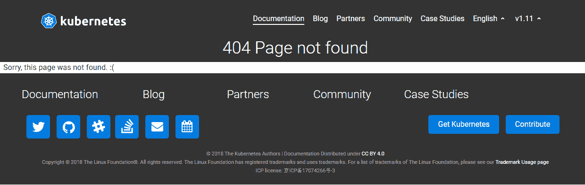
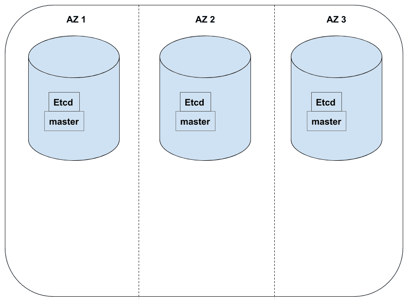
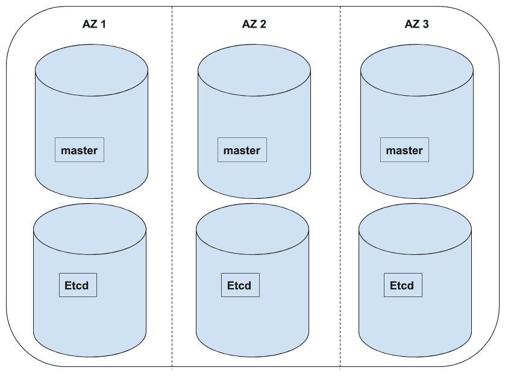
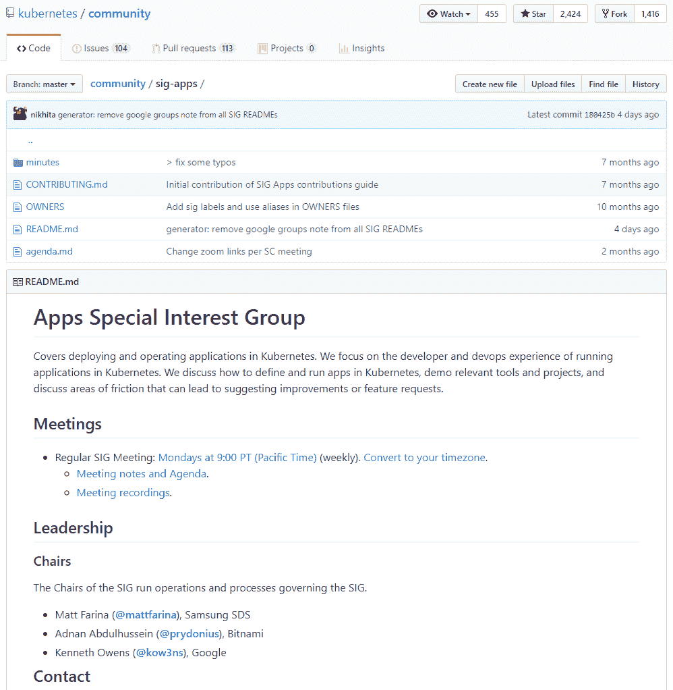
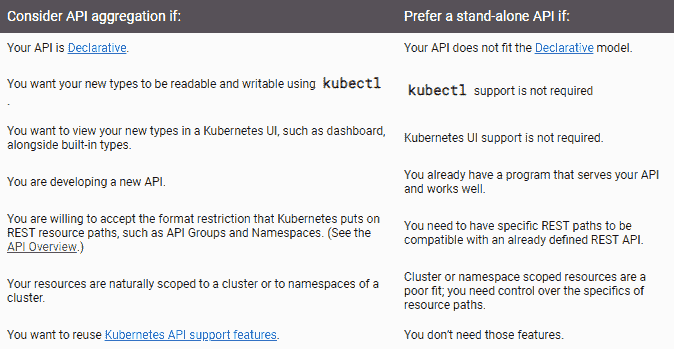
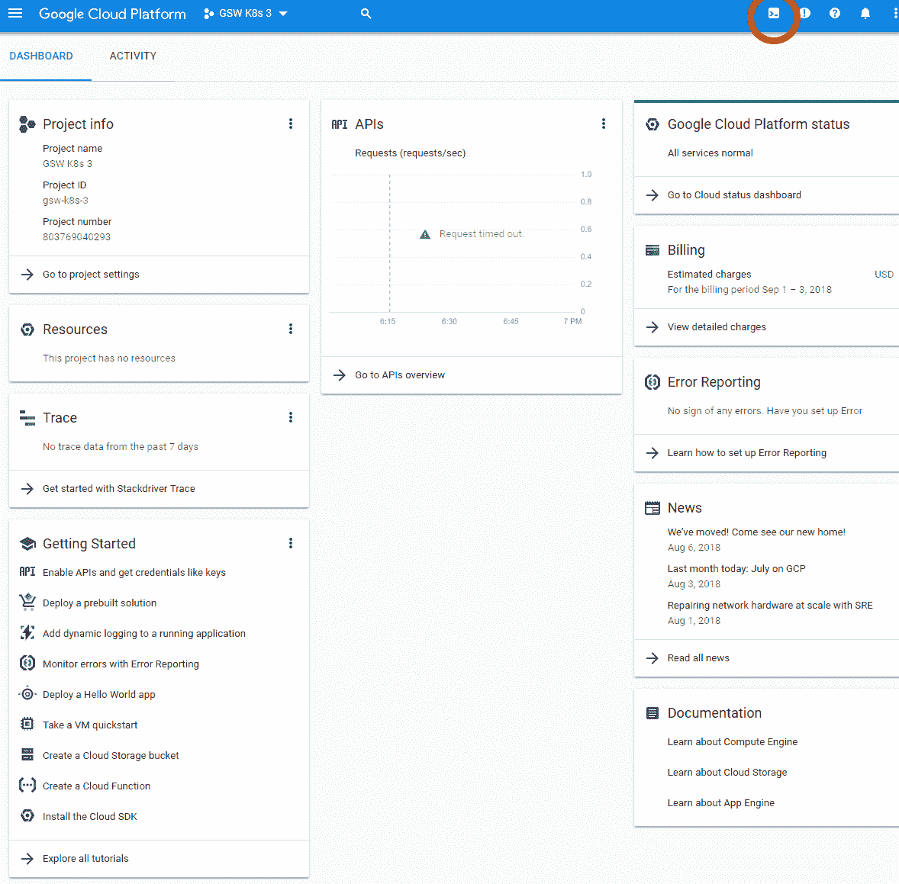

# 高可用性和可扩展性设计

本章将涉及高级概念，如高可用性、可扩展性，以及 Kubernetes 操作员需要满足的要求，以便开始探索在生产环境中运行 Kubernetes 的主题。我们将查看 Google 和 Azure 提供的**平台即服务**（**PaaS**）服务，并使用在云环境中运行生产工作负载的常用原则。

本章将涵盖以下主题：

+   高可用性简介

+   高可用性最佳实践

+   多区域设置

+   安全最佳实践

+   在托管的 Kubernetes PaaS 上设置高可用性

+   集群生命周期事件

+   如何使用 admission 控制器

+   参与工作负载 API

+   什么是**自定义资源定义**（**CRD**）？

# 技术要求

您需要访问您的 Google Cloud Platform 账户，以便探索这些选项中的一些。您也可以使用本地的 Minikube 设置来测试其中的一些功能，但我们在这里讨论的许多原则和方法需要云中的服务器。

# 高可用性简介

为了理解本章的目标，我们首先需要讨论高可用性和可扩展性的更一般性术语。让我们分别了解它们，以便理解各个部分如何协同工作。

我们将讨论所需的术语，并开始理解我们在云中构建、构思和运行 Kubernetes 集群时所使用的基本组成部分。

让我们深入了解高可用性、正常运行时间和停机时间。

# 我们如何衡量可用性？

**高可用性**（**HA**）的理念是您的应用程序是可用的，意味着终端用户能够访问它。为了创建*高度可用*的应用程序，您的应用程序代码和用户交互的前端需要大部分时间都保持可用。这个术语来源于系统设计领域，它定义了系统的架构、接口、数据和模块，以满足给定的一组需求。系统设计的例子在从产品开发到分布式系统理论的多个学科中都有出现。在高可用性（HA）中，系统设计帮助我们理解实现可靠和高性能系统所需的逻辑和物理设计要求。

在业界，我们将高可用性称为五个九的可用性。这个*99.999*的可用性意味着每天、每周、每月和每年都有特定的停机时间。

如果您想了解更多关于五个九可用性方程背后的数学内容，您可以在这里阅读关于下取整和上取整函数的文章：[`en.wikipedia.org/wiki/Floor_and_ceiling_functions`](https://en.wikipedia.org/wiki/Floor_and_ceiling_functions)。

我们还可以看看一般的可用性公式，您可以使用它来理解给定系统的可用性：

```
Downtime per year in hours = (1 - Uptime Availability) x 365 x 24
```

# 正常运行时间和停机时间

在我们查看日、周和年期间的净可用性之前，先深入了解什么是“上线”或“下线”。我们还需要定义一些关键术语，以便理解可用性对我们业务的意义。

# Uptime

Uptime 是衡量给定系统、应用程序、网络或其他逻辑和物理对象的运行时间，指的是该对象已启用并可供相应终端用户使用的时间。这可以是内部系统、外部项目，或者仅通过其他计算机系统交互的项目。

# Downtime

Downtime 与 Uptime 类似，但衡量的是给定系统、应用程序、网络或其他逻辑和物理对象无法为终端用户提供服务的时间。Downtime 的定义有一定的解释空间，因为它是指系统未按原计划执行其主要功能的时间。最常见的 Downtime 示例是臭名昭著的 404 页面，你可能之前见过：



为了理解前面提到的概念下系统的可用性，我们可以使用已知的 Uptime 和 Downtime 数据来计算：

```
Availability Percentage = (Uptime / (Uptime + Downtime) x 100
```

对于具有冗余组件的系统（这些冗余组件提高了系统的整体稳定性），有更复杂的计算方法，但现在我们暂时以具体示例为主。我们将在本章稍后探讨 Kubernetes 的冗余组件。

根据这些公式，你可以自己测量 Kubernetes 集群的 Uptime，接下来让我们看几个例子。

让我们看一看这些概念背后的数学。首先，Uptime 可用性是 **平均故障间隔时间** (**MTBF**) 除以 **平均修复时间** (**MTTR**) 和 MTBF 之和的函数。

我们可以通过以下方式计算 MTBF：

```
MTBF = ‘Total hours in a year' / ‘Number of yearly failures'
```

MTTR 表示如下：

```
MTTR = (‘Amount of failure' x ‘Time to repair the system') / ‘Total number of failures'
```

这可以通过以下公式表示：

```
Uptime Availability = MTBF/(MTTR + MTBF)
Downtime per Year (Hours) = (1 – Uptime Ratio) x 365 x 24
```

# 五个 9 的可用性

我们可以更深入地探讨行业标准的五个 9 的可用性与更少的 9 的比较。我们可以使用 **服务水平协议** (**SLA**) 来理解终端用户和 Kubernetes 操作员之间的合同，保证底层硬件和 Kubernetes 软件对应用所有者的可用性。

SLA 是一个保证的可用性级别。值得注意的是，随着可用性增加，成本会变得非常高。

这里是一些 SLA 等级：

+   对于 99.9% 可用性的 SLA，你的 Downtime 可以是：

    +   **每天**：1 分钟，26.4 秒

    +   **每周**：10 分钟，4.8 秒

    +   **每月**：43 分钟，49.7 秒

    +   **每年**：8 小时 45 分钟，57.0 秒

+   对于 99.99% 可用性的 SLA，你的 Downtime 可以是：

    +   **每天**：8.6 秒

    +   **每周**：1 分钟，0.5 秒

    +   **每月**：4 分钟，23.0 秒

    +   **每年**：52 分钟，35.7 秒

+   对于 99.999% 可用性的 SLA，你的 Downtime 可以是：

    +   **每天**：0.9 秒

    +   **每周**：6.0 秒

    +   **每月**：26.3 秒

    +   **每年**: 5 分钟, 15.6 秒

正如您所见，具有五个九的可用性，您的 Kubernetes 群集没有太多喘息的空间。还需要注意的是，您的群集的可用性与应用程序的可用性有关。

那是什么意思呢？嗯，应用程序本身也会出现问题和代码错误，这些问题和错误超出了 Kubernetes 群集的领域和控制范围。因此，特定应用程序的正常运行时间和可用性将等于（甚至很少等于，考虑到人为错误）或少于您群集的一般可用性。

因此，让我们来分析 Kubernetes 中 HA 的各个部分。

# HA 最佳实践

要构建高可用的 Kubernetes 系统，需要注意可用性常常是人员和流程的功能，也是技术故障的功能。尽管硬件和软件经常出现故障，但人员及其参与过程对所有系统的可用性是一个非常可预测的拖累。

值得注意的是，本书不涉及如何为微服务架构设计失败处理机制，而这在处理群集调度和网络系统（如 Kubernetes）中的一些（或全部）系统故障中占据了很大一部分。

还有另一个重要的概念需要考虑：优雅降级。

优雅降级是指你将功能分层和模块化，因此即使系统的某些部分发生灾难性故障，仍然能够提供一定级别的可用性。在网页设计中，也有相应的逐步增强术语，但我们在这里不会使用这种模式。优雅降级是系统具有容错性的结果，对于关键任务和面向客户的系统非常理想。

在 Kubernetes 中，有两种优雅降级的方法：

+   **基础设施降级**：这种降级依赖于复杂的算法和软件，以处理硬件的不可预测故障，或软件定义的硬件（如虚拟机、**软件定义网络**（**SDN**）等）。我们将探讨如何使 Kubernetes 的关键组件高度可用，以便在这种形式下提供优雅降级。

+   **应用降级**：虽然这在很大程度上取决于前述的微服务最佳实践架构策略，但我们将在这里探讨几种模式，这些模式将使您的用户成功。

在这些场景中，我们的目标是尽可能为最终用户提供完整的功能，但如果出现应用程序、Kubernetes 组件或底层基础设施的故障，目标应当是为用户提供某种程度的访问和可用性。我们将努力通过核心 Kubernetes 策略完全抽象掉底层基础设施的故障，同时我们将构建缓存、故障转移和回滚机制，以应对应用程序故障。最后，我们将以高可用的方式构建 Kubernetes 组件。

# 抗脆弱性

在深入探讨这些内容之前，退一步考虑塔勒布在《*Antifragility*》一书中讨论的抗脆弱性这一更大的概念是很有意义的。

若要了解更多关于塔勒布的书籍，查看他的书籍主页：[`www.penguinrandomhouse.com/books/176227/antifragile-by-nassim-nicholas-taleb/9780812979688/`](https://www.penguinrandomhouse.com/books/176227/antifragile-by-nassim-nicholas-taleb/9780812979688/)。

在应对 Kubernetes 系统的复杂性以及如何利用更广泛的 Kubernetes 生态系统生存和发展的过程中，有一些关键概念非常重要，需要加以强化。

首先，冗余是关键。为了应对系统多个层级的故障，重要的是在系统中构建冗余和容错部分。这些冗余层可以利用诸如 Raft 共识等算法，旨在为多个对象在容错分布式系统中提供一个控制平面，以便它们达成一致。此类冗余依赖于 N+1 冗余，以应对物理或逻辑对象的丢失。

我们稍后会查看 etcd，进一步探讨冗余问题。

第二，触发、应对、探索和修复故障场景是关键。你需要强制使 Kubernetes 系统发生故障，以理解它在极限情况下或边缘情况中的表现。Netflix 的 Chaos Monkey 是一种标准且被广泛使用的测试复杂系统可靠性的方法。

你可以在这里阅读更多关于 Netflix 的 Chaos Monkey 的内容：[`github.com/Netflix/chaosmonkey`](https://github.com/Netflix/chaosmonkey)。

第三，我们需要确保我们的系统中有正确的模式，并且我们要实施正确的模式，以便在 Kubernetes 中构建抗脆弱性。重试逻辑、负载均衡、断路器、超时、健康检查和并发连接检查是这个抗脆弱性维度的关键项。Istio 和其他服务网格是这一主题中的先进技术。

你可以在这里阅读更多关于 Istio 以及如何管理流量的内容：**[`istio.io/docs/concepts/traffic-management/`](https://istio.io/docs/concepts/traffic-management/)。**

# 高可用集群（HA 集群）

为了创建能够应对反脆弱模式并提高集群正常运行时间的 Kubernetes 集群，我们可以使用系统的核心组件创建高可用性集群。让我们先了解一下在主要云服务提供商中，使用他们的服务创建 Kubernetes 集群时可以获得什么。

# 主要云服务提供商的高可用性功能

为了实现你基础设施的五个 9 的正常运行时间，哪些 Kubernetes 组件需要具有高可用性？首先，你应该考虑**云服务提供商**（**CSP**）在后台为你做了多少事情。

对于**Google Kubernetes Engine**（**GKE**），几乎所有组件都是开箱即用的管理。你不需要担心管理节点或与之相关的任何费用。GKE 目前还拥有最强大的自动扩展功能。**Azure Kubernetes Service**（**AKS**）和亚马逊**Elastic Kubernetes Service**（**EKS**）都使用自管理的自动扩展功能，这意味着你需要通过使用自动扩展组来管理集群的扩展。

GKE 还能够处理管理节点的自动更新，无需用户干预，但还提供与 AKS 一起的即插即用自动更新功能，以便操作员可以选择何时进行无缝升级。EKS 仍在处理这些细节。

EKS 在多个**可用区**（**AZ**）之间提供高可用性的主节点/工作节点，而 GKE 在其区域模式中提供类似的功能，类似于 AWS 的区域。AKS 目前不为主节点提供高可用性，但集群中的工作节点分布在多个 AZ 中，以提供高可用性。

# Kubernetes 的高可用性（HA）方法

如果你打算在托管的 PaaS 之外运行 Kubernetes，你需要采用两种策略之一来运行高可用性 Kubernetes 集群。在本章中，我们将介绍一个带有堆叠主节点的示例，并描述更复杂的外部 etcd 集群方法。

在这种方法中，你将结合 etcd 和管理（控制平面）节点，以减少运行集群所需的基础设施量。这意味着你至少需要三台机器才能实现高可用性。如果你在云中运行，这也意味着你需要将实例分布在三个可用区中，以利用将机器分布在多个区提供的正常运行时间。

堆叠主节点将在你的架构图中如下所示：



第二种选项是在基础设施复杂度增加的情况下提高潜在可用性的方式。您可以使用外部 etcd 集群，从而为控制平面和 etcd 成员创建分离，进一步提高潜在的可用性。此种方式的设置需要至少六台服务器，且这些服务器应分布在多个可用区，就像第一个例子中那样：



为了实现这两种方法之一，您需要一些前提条件。

# 前提条件

如前面所述，您将需要三台机器作为主节点，三台机器作为工作节点，并且如果选择外部 etcd 集群，还需要另外三台机器。

以下是机器的最低要求——您应使用以下操作系统之一：

+   Ubuntu 16.04+

+   Debian 9

+   CentOS 7

+   RHEL 7

+   Fedora 25/26（最佳努力）

+   Container Linux（已测试版本：1576.4.0）

在每台机器上，您需要至少 2 GB 的 RAM、两个或更多的 CPU，并且所有集群中的机器之间需要完全的网络连接（公共或私有网络均可）。每个节点还需要一个唯一的主机名、MAC 地址和`product_uuid`。

如果您运行在任何类型的管理网络中（数据中心、云或其他），您还需要确保您的机器上开放了所需的安全组和端口。最后，您需要禁用交换分区以使`kubelet`正常工作。

要查看所需开放的端口列表，请访问[`kubernetes.io/docs/setup/independent/install-kubeadm/#check-required-ports`](https://kubernetes.io/docs/setup/independent/install-kubeadm/#check-required-ports)。

在某些云服务提供商中，虚拟机可能会共享相同的`product_uuids`，尽管它们共享相同 MAC 地址的可能性较小。检查这些信息很重要，因为 Kubernetes 网络和 Calico 将使用它们作为唯一标识符，如果它们相同，就会出现错误。您可以使用以下命令检查这两项：

```
LANG=C ifconfig -a | grep -Po 'HWaddr \K.*$'
```

上述命令将为您获取 MAC 地址，下面的命令将告诉您`uuid`：

```
sudo cat /sys/class/dmi/id/product_uuid
```

# 设置

现在，让我们开始设置这些机器。

您需要在控制平面节点上以 root 用户身份运行这里的所有命令。

首先，您需要设置 SSH。Calico 将设置您的网络，因此我们将使用您机器的 IP 地址来开始这一过程。请记住，Kubernetes 网络有三个基本层：

+   运行在您节点上的容器和 Pod，这些节点可以是虚拟机或硬件服务器。

+   服务，它们是一个聚合和抽象层，允许您使用各种 Kubernetes 控制器来设置应用程序，并确保 Pod 根据可用性需求进行调度。

+   Ingress，它允许来自集群外部的流量并将其路由到正确的容器。

因此，我们需要设置 Calico 来处理这些不同的层。您需要获取节点的 CIDR 地址，建议在此示例中安装 Calico。

您可以在 CNI 网络文档中找到更多信息：[`kubernetes.io/docs/setup/independent/create-cluster-kubeadm/#pod-network`](https://kubernetes.io/docs/setup/independent/create-cluster-kubeadm/#pod-network)。

您需要确保配置机器上的 SSH 代理能够访问集群中的所有其他节点。启动代理，然后将我们的身份添加到会话中：

```
eval $(ssh-agent)
ssh-add ~/.ssh/id_rsa
```

您可以通过使用`-A`标志来测试以确保它正常工作，该标志会在 SSH 隧道中保留您的身份。连接到另一个节点后，您可以使用`-E`标志来保留环境变量：

```
sudo -E -s
```

接下来，我们需要将来自云环境的负载均衡器放置在`kube-apiserver`前面。这将确保集群的 API 服务器在某一台机器宕机或无响应时仍然可以访问。对于此示例，您应该使用支持 TCP 的负载均衡器，如 Elastic Load Balancer（AWS）、Azure Load Balancer（Azure）或 TCP/UDP Load Balancer（GCE）。

确保您的负载均衡器可以通过 DNS 解析，并且您设置了一个健康检查，监听`kube-apiserver`端口`6443`。一旦负载均衡器就位，您可以使用`nc -v LB_DNS_NAME PORT`测试与 API 服务器的连接。设置好云负载均衡器后，确保将所有控制平面节点添加到负载均衡器中。

# 堆叠节点

为了运行一组堆叠节点，您需要使用`kubeadm-conf-01.yaml`模板引导第一个控制平面节点。再次说明，这个示例使用 Calico，但您可以根据需要配置网络。为了使示例正常工作，您需要替换以下值：

+   `LB_DNS`

+   `LB_PORT`

+   `CONTROL01_IP`

+   `CONTROL01_HOSTNAME`

打开一个新文件，`kubeadm-conf-01.yaml`，使用您喜欢的 IDE：

```
apiVersion: kubeadm.k8s.io/v1alpha2
kind: MasterConfiguration
kubernetesVersion: v1.11.0
apiServerCertSANs:
- "LB_DNS"
api:
   controlPlaneEndpoint: "LB_DNS:LB_PORT"
etcd:
 local:
   extraArgs:
     listen-client-urls: "https://127.0.0.1:2379,https://CONTROL01_IP:2379"
     advertise-client-urls: "https://CONTROL01_IP:2379"
     listen-peer-urls: "https://CONTROL01_IP:2380"
     initial-advertise-peer-urls: "https://CONTROL01_IP:2380"
     initial-cluster: "CONTROL01_HOSTNAME=https://CONTROL01_IP:2380"
   serverCertSANs:
     - CONTROL01_HOSTNAME
     - CONTROL01_IP
   peerCertSANs:
     - CONTROL01_HOSTNAME
     - CONTROL01_IP
networking:
   podSubnet: "192.168.0.0/16"
```

在获取此文件后，使用以下命令执行它：

```
kubeadm init --config kubeadm-conf-01.yaml
```

命令完成后，您需要将以下证书和文件列表复制到其他控制平面节点：

```
/etc/kubernetes/pki/ca.crt
/etc/kubernetes/pki/ca.key
/etc/kubernetes/pki/sa.key
/etc/kubernetes/pki/sa.pub
/etc/kubernetes/pki/front-proxy-ca.crt
/etc/kubernetes/pki/front-proxy-ca.key
/etc/kubernetes/pki/etcd/ca.crt
/etc/kubernetes/pki/etcd/ca.key
/etc/kubernetes/admin.conf
```

为了继续进行，我们需要在第二个节点上添加另一个模板文件，以创建`kubeadm-conf-02.yaml`下的第二个堆叠节点。像之前一样，您需要将以下值替换为您自己的：

+   `LB_DNS`

+   `LB_PORT`

+   `CONTROL02_IP`

+   `CONTROL02_HOSTNAME`

打开一个新文件，`kubeadm-conf-02.yaml`，使用您喜欢的 IDE：

```
apiVersion: kubeadm.k8s.io/v1alpha2
kind: MasterConfiguration
kubernetesVersion: v1.11.0
apiServerCertSANs:
- "LOAD_BALANCER_DNS"
api:
   controlPlaneEndpoint: "LB_DNS:LB_PORT"
etcd:
 local:
   extraArgs:
     listen-client-urls: "https://127.0.0.1:2379,https://CONTROL02_IP:2379"
     advertise-client-urls: "https://CONTROL02_IP:2379"
     listen-peer-urls: "https://CONTROL02_IP:2380"
     initial-advertise-peer-urls: "https://CONTROL01_IP:2380"
     initial-cluster: "CONTROL01_HOSTNAME=https://CONTROL01_IP:2380,CONTROL02_HOSTNAME=https://CONTROL02_IP:2380"
     initial-cluster-state: existing
   serverCertSANs:
     - CONTROL02_HOSTNAME
     - CONTROL02_IP
   peerCertSANs:
     - CONTROL02_HOSTNAME
     - CONTROL02_IP
networking:
   podSubnet: "192.168.0.0/16"
```

在运行此模板之前，您需要将复制的文件移动到正确的目录。以下是一个示例，您的系统应该类似：

```
 mkdir -p /etc/kubernetes/pki/etcd
 mv /home/${USER}/ca.crt /etc/kubernetes/pki/
 mv /home/${USER}/ca.key /etc/kubernetes/pki/
 mv /home/${USER}/sa.pub /etc/kubernetes/pki/
 mv /home/${USER}/sa.key /etc/kubernetes/pki/
 mv /home/${USER}/front-proxy-ca.crt /etc/kubernetes/pki/
 mv /home/${USER}/front-proxy-ca.key /etc/kubernetes/pki/
 mv /home/${USER}/etcd-ca.crt /etc/kubernetes/pki/etcd/ca.crt
 mv /home/${USER}/etcd-ca.key /etc/kubernetes/pki/etcd/ca.key
 mv /home/${USER}/admin.conf /etc/kubernetes/admin.conf
```

一旦您复制了这些文件，您可以运行一系列的`kubeadm`命令来吸收证书，然后引导第二个节点：

```
kubeadm alpha phase certs all --config kubeadm-conf-02.yaml
kubeadm alpha phase kubelet config write-to-disk --config kubeadm-conf-02.yaml
kubeadm alpha phase kubelet write-env-file --config kubeadm-conf-02.yaml
kubeadm alpha phase kubeconfig kubelet --config kubeadm-conf-02.yaml
systemctl start kubelet
```

一旦完成上述步骤，您还可以将节点添加到 etcd 中。您首先需要设置一些变量，以及正在运行节点的虚拟机的 IP 地址：

```
export CONTROL01_IP=<YOUR_IP_HERE>
export CONTROL01_HOSTNAME=cp01H
export CONTROL02_IP=<YOUR_IP_HERE>
export CONTROL02_HOSTNAME=cp02H
```

一旦设置了这些变量，请运行以下`kubectl`和`kubeadm`命令。首先，添加证书：

```
export KUBECONFIG=/etc/kubernetes/admin.conf
kubectl exec -n kube-system etcd-${CONTROL01_HOSTNAME} -- etcdctl --ca-file /etc/kubernetes/pki/etcd/ca.crt --cert-file /etc/kubernetes/pki/etcd/peer.crt --key-file /etc/kubernetes/pki/etcd/peer.key --endpoints=https://${CONTROL01_IP}:2379 member add ${CONTROL02_HOSTNAME} https://${CP1_IP}:2380
```

接下来，配置`etcd`的阶段：

```
kubeadm alpha phase etcd local --config kubeadm-config-02.yaml
```

此命令将导致 etcd 集群在短时间内不可用，但这是有意设计的。然后，您可以部署`kubeconfig`和`controlplane`中的其余组件，并将节点标记为主节点：

```
kubeadm alpha phase kubeconfig all --config kubeadm-conf-02.yaml
kubeadm alpha phase controlplane all --config kubeadm-conf-02.yaml
kubeadm alpha phase mark-master --config kubeadm-conf-02.yaml
```

我们将再次通过第三个节点运行此过程，在 etcd 的`extraArgs`下增加更多价值：

您需要在第三台机器上创建第三个`kubeadm-conf-03.yaml`文件。按照之前的模板进行操作，并替换变量：

```
apiVersion: kubeadm.k8s.io/v1alpha2
kind: MasterConfiguration
kubernetesVersion: v1.11.0
apiServerCertSANs:
- "LB_DNS"
api:
   controlPlaneEndpoint: "LB_DNS:LB_PORT"
etcd:
 local:
   extraArgs:
     listen-client-urls: "https://127.0.0.1:2379,https://CONTROL03_IP:2379"
     advertise-client-urls: "https://CONTROL03_IP:2379"
     listen-peer-urls: "https://CONTROL03_IP:2380"
     initial-advertise-peer-urls: "https://CONTROL03_IP:2380"
     initial-cluster: "CONTRL01_HOSTNAME=https://CONTROL01_IP:2380,CONTROL02_HOSTNAME=https://CONTROL02_IP:2380,CONTRL03_HOSTNAME=https://CONTROL03_IP:2380"
     initial-cluster-state: existing
   serverCertSANs:
     - CONTRL03_HOSTNAME
     - CONTROL03_IP
   peerCertSANs:
     - CONTRL03_HOSTNAME
     - CONTROL03_IP
networking:
   podSubnet: "192.168.0.0/16"
```

您需要再次移动文件：

```
 mkdir -p /etc/kubernetes/pki/etcd
 mv /home/${USER}/ca.crt /etc/kubernetes/pki/
 mv /home/${USER}/ca.key /etc/kubernetes/pki/
 mv /home/${USER}/sa.pub /etc/kubernetes/pki/
 mv /home/${USER}/sa.key /etc/kubernetes/pki/
 mv /home/${USER}/front-proxy-ca.crt /etc/kubernetes/pki/
 mv /home/${USER}/front-proxy-ca.key /etc/kubernetes/pki/
 mv /home/${USER}/etcd-ca.crt /etc/kubernetes/pki/etcd/ca.crt
 mv /home/${USER}/etcd-ca.key /etc/kubernetes/pki/etcd/ca.key
 mv /home/${USER}/admin.conf /etc/kubernetes/admin.conf
```

并且，您需要再次运行以下命令以引导它们：

```
kubeadm alpha phase certs all --config kubeadm-conf-03.yaml
kubeadm alpha phase kubelet config write-to-disk --config kubeadm-conf-03.yaml
kubeadm alpha phase kubelet write-env-file --config kubeadm-conf-03.yaml
kubeadm alpha phase kubeconfig kubelet --config kubeadm-conf-03.yaml
systemctl start kubelet
```

然后，再次将节点添加到 etcd 集群中：

```
export CONTROL01_IP=<YOUR_IP_HERE>
export CONTROL01_HOSTNAME=cp01H
export CONTROL03_IP=<YOUR_IP_HERE>
export CONTROL03_HOSTNAME=cp03H
```

接下来，我们可以设置 etcd 系统：

```
export KUBECONFIG=/etc/kubernetes/admin.conf

kubectl exec -n kube-system etcd-${CONTROL01_HOSTNAME} -- etcdctl --ca-file /etc/kubernetes/pki/etcd/ca.crt --cert-file /etc/kubernetes/pki/etcd/peer.crt --key-file /etc/kubernetes/pki/etcd/peer.key --endpoints=https://${CONTROL01_IP}:2379 member add ${CONTROL03_HOSTNAME} https://${CONTROL03_IP}:2380

kubeadm alpha phase etcd local --config kubeadm-conf-03.yaml

```

完成后，我们可以再次部署控制平面的其余组件，并将节点标记为主节点。执行以下命令：

```
kubeadm alpha phase kubeconfig all --config kubeadm-conf-03.yaml

kubeadm alpha phase controlplane all --config kubeadm-conf-03.yaml

kubeadm alpha phase mark-master --config kubeadm-conf-03.yaml
```

做得很好！

# 安装工作节点

一旦配置了主节点，您可以将工作节点加入集群。在添加工作节点之前，您需要配置 Pod 网络。您可以在此处找到有关 Pod 网络附加组件的更多信息：[`kubernetes.io/docs/setup/independent/create-cluster-kubeadm/#pod-network`](https://kubernetes.io/docs/setup/independent/create-cluster-kubeadm/#pod-network)。

# 集群生命周期

还有一些关键事项，我们应该讨论，以便您全面了解可以帮助您创建高可用性 Kubernetes 集群的项目。让我们讨论如何使用准入控制器、工作负载和自定义资源定义来扩展您的集群。

# 准入控制器

准入控制器是 Kubernetes 代码，允许您在对 Kubernetes API 服务器进行身份验证和授权后拦截调用。核心 Kubernetes 系统中包含标准准入控制器，人们也会编写自己的控制器。有两个控制器比其他控制器更重要：

+   `MutatingAdmissionWebhook` 负责按顺序调用 `Webhooks` 来变更给定请求。这个控制器仅在集群操作的变更阶段运行。你可以使用这样的控制器将业务逻辑构建到集群中，通过像 `CREATE`、`DELETE` 和 `UPDATE` 这样的操作来自定义准入逻辑。你还可以做一些事情，比如通过 `StorageClass` 自动化存储的供应。例如，如果一个部署创建了一个 `PersistentVolumeClaim`，那么 webhook 可以自动响应并供应 `StorageClass`。通过 `MutatingAdmissionWebhook`，你还可以在容器构建之前，注入一个 sidecar 到容器中。

+   `ValidatingAdmissionWebhook` 是准入控制器在验证阶段运行的内容，负责调用任何会验证给定请求的 webhook。在这里，webhooks 是并行调用的，这与 `MutatingAdmissionWebhook` 的串行特性不同。需要特别理解的是，它调用的任何 webhook 都不允许更改原始对象。一个验证 webhook 的例子是增加配额。

准入控制器及其变更和验证 webhook 非常强大，并且重要的是，它们为 Kubernetes 操作员提供了额外的控制功能，而无需重新编译诸如 `kube-apiserver` 之类的二进制文件。最强大的例子是 Istio，它使用 webhook 注入其 Envoy sidecar 来实现负载均衡、断路器和部署功能。你还可以使用 webhook 来限制在多租户系统中创建的命名空间。

你可以将变更看作是 Kubernetes 系统中的一个修改，而验证则是一个检查。随着相关软件生态系统的发展，从安全性和验证的角度来看，使用这些类型的功能变得越来越重要。你可以使用控制器及其变更和检查功能，做一些事情，比如覆盖镜像拉取策略，以便在集群中启用或阻止使用某些镜像。

这些准入控制器本质上是集群控制平面的一部分，只能由集群管理员运行。

这是一个非常简单的例子，我们将在准入控制器中检查命名空间是否存在。

NamespaceExists: 这个准入控制器检查除了 Namespace 本身以外的所有命名空间资源请求。如果请求中引用的命名空间不存在，该请求将被拒绝。你可以在 [`kubernetes.io/docs/reference/access-authn-authz/admission-controllers/#namespaceexists`](https://kubernetes.io/docs/reference/access-authn-authz/admission-controllers/#namespaceexists) 阅读更多相关内容。

首先，让我们为我们的集群获取 Minikube，并检查哪些命名空间存在：

```
master $ kubectl get namespaces
 NAME STATUS AGE
 default Active 23m
 kube-public Active 23m
 kube-system Active 23m
```

很棒！现在，让我们尝试创建一个简单的部署，将其放入一个不存在的命名空间。你认为会发生什么？

```
master $ kubectl run nodejs --image nodej2 --namespace not-here
 Error from server (NotFound): namespaces "not-here" not found
```

那么，为什么会发生这种情况呢？如果您猜测我们的 `ValidatingAdmissionWebhook` 捕捉到该请求并阻止了它，那么您猜对了！

# 使用准入控制器

您可以通过两条不同的命令在服务器中打开和关闭准入控制器。根据您的服务器配置以及您启动 `kube-apiserver` 的方式，您可能需要对 `systemd` 或用于启动 API 服务器的清单文件进行更改。

通常，为了启用服务器，您需要执行以下命令：

```
kube-apiserver --enable-admission-plugins
```

如果要禁用它，您需要将其更改为以下内容：

```
kube-apiserver --disable-admission-plugins=
```

如果您运行的是 Kubernetes 1.10 或更高版本，则有一组推荐的准入控制器供您使用。您可以使用以下命令启用它们：

```
kube-apiserver --enable-admission-plugins=NamespaceLifecycle,LimitRanger,ServiceAccount,DefaultStorageClass,DefaultTolerationSeconds,MutatingAdmissionWebhook,ValidatingAdmissionWebhook,ResourceQuota
```

在早期版本的 Kubernetes 中，没有区分变更和验证的概念，因此您需要阅读文档，以理解在早期版本的软件中使用准入控制器的影响。

# 工作负载 API

工作负载 API 是理解如何在 Kubernetes 中管理对象的一个重要概念，它帮助我们理解这些管理在多个版本发布过程中是如何逐渐稳定的。在 Kubernetes 的早期，Pod 和它们的工作负载与共享 CPU、网络、存储和生命周期事件的容器紧密耦合。Kubernetes 引入了诸如副本、部署和标签等概念，并帮助管理 12-factor 应用程序。随着 Kubernetes 运维人员进入有状态工作负载，StatefulSets 被引入。

随着时间的推移，Kubernetes 工作负载的概念逐渐演变为多个部分的集合：

+   Pods

+   ReplicationController

+   ReplicaSet

+   Deployment

+   DaemonSet

+   StatefulSet

这些部分是当前在 Kubernetes 中编排合理工作负载类型的技术前沿，但不幸的是，API 被分散在 Kubernetes 代码库的多个不同部分。为了解决这个问题，开发者花费了数月的艰苦工作，将所有这些代码集中到 `apps/v1` API 中，并且在此过程中进行了多次破坏性兼容性更改。在迁移到 `apps/v1` 时，做出了一些关键决策：

+   **默认选择器行为**：未指定的标签选择器会默认使用从模板标签中自动生成的选择器

+   **不可变选择器**：虽然在某些情况下更改选择器对部署有用，但更改选择器一直不符合 Kubernetes 的推荐做法，因此做出了更改，允许启用金丝雀类型的部署和 Pod 重标记，而这一过程是由 Kubernetes 协调的

+   **默认滚动更新**：Kubernetes 开发者希望 RollingUpdate 是默认的更新形式，现在它已经成为默认选项

+   **垃圾回收**：在 1.9 和 `apps/v1` 中，垃圾回收变得更加积极，您不会再看到 DaemonSets、ReplicaSets、StatefulSets 或 Deployments 被删除后还存在挂起的 Pod

如果你希望获得更多关于这些决策的输入，你可以加入 *应用程序特别兴趣小组*，该小组可以在这里找到：[`github.com/kubernetes/community/tree/master/sig-apps`](https://github.com/kubernetes/community/tree/master/sig-apps)：



目前，你可以认为工作负载 API 是稳定的，并且向后兼容。

# 自定义资源定义

在我们的高可用性章节中，我们将触及的最后一个部分是自定义资源。这些是 Kubernetes API 的扩展，并且与我们之前讨论的准入控制器相辅相成。向集群添加自定义资源有几种方法，我们将在这里讨论这些方法。

作为复习，请记住 Kubernetes 中的非自定义资源是 Kubernetes API 中的一个端点，它存储了一组相似的 API 对象。你可以使用自定义资源来增强特定的 Kubernetes 安装。我们将在后面的章节中看到 Istio 的示例，它使用 CRD 来配置前置条件。自定义资源可以通过 `kubectl` 进行修改、更改和删除。

当你将自定义资源与控制器配对时，你就能创建一个声明式 API，这使你能够设置在集群生命周期之外的资源状态。我们在本书前面通过操作员模式提到过自定义控制器和自定义资源的模式示例。决定是否创建 Kubernetes 自定义资源时，你有几个选项。文档建议使用以下决策表来做选择：



图片来源：[`kubernetes.io/docs/concepts/extend-kubernetes/api-extension/custom-resources/#should-i-add-a-custom-resource-to-my-kubernetes-cluster`](https://kubernetes.io/docs/concepts/extend-kubernetes/api-extension/custom-resources/#should-i-add-a-custom-resource-to-my-kubernetes-cluster)

决定编写自定义资源的一个关键点是确保你的 API 是声明式的。如果是声明式的，那么它非常适合用作自定义资源。你可以通过两种方式编写自定义资源：通过自定义资源定义（CRD）或者通过 API 聚合。API 聚合需要编程，我们在本章不会深入讨论这个话题，但你可以在这里阅读更多信息：[`kubernetes.io/docs/concepts/extend-kubernetes/api-extension/apiserver-aggregation/`](https://kubernetes.io/docs/concepts/extend-kubernetes/api-extension/apiserver-aggregation/)。

# 使用 CRD（自定义资源定义）

虽然聚合 API 更加灵活，但 CRD 更易于使用。让我们尝试从 Kubernetes 文档中创建示例 CRD。

首先，你需要启动 Minikube 集群和 GCP 上的 GKE 集群，这将是你自己的集群或类似 Katacoda 的游乐场。让我们进入 Google Cloud Shell 并尝试一下。

进入你的 GCP 首页后，点击 CLI 图标，在下图中该图标被红色框住：



一旦进入 Shell，创建一个快速的 Kubernetes 集群。如果旧版本不受支持，可能需要修改集群版本：

```
gcloud container clusters create gswk8s \
  --cluster-version 1.10.6-gke.2 \
  --zone us-east1-b \
  --num-nodes 1 \
  --machine-type n1-standard-1
<lots of text>
...
Creating cluster gsk8s...done.
Created [https://container.googleapis.com/v1/projects/gsw-k8s-3/zones/us-east1-b/clusters/gsk8s].
To inspect the contents of your cluster, go to: https://console.cloud.google.com/kubernetes/workload_/gcloud/us-east1-b/gsk8s?project=gsw-k8s-3
kubeconfig entry generated for gsk8s.
NAME LOCATION MASTER_VERSION MASTER_IP MACHINE_TYPE NODE_VERSION NUM_NODES STATUS
gsk8s us-east1-b 1.10.6-gke.2 35.196.63.146 n1-standard-1 1.10.6-gke.2 1 RUNNING
```

接下来，向`resourcedefinition.yaml`中添加以下文本：

```
apiVersion: apiextensions.k8s.io/v1beta1
kind: CustomResourceDefinition
metadata:
  # name must match the spec fields below, and be in the form: <plural>.<group>
  name: crontabs.stable.example.com
spec:
  # group name to use for REST API: /apis/<group>/<version>
  group: stable.example.com
  # list of versions supported by this CustomResourceDefinition
  version: v1
  # either Namespaced or Cluster
  scope: Namespaced
  names:
    # plural name to be used in the URL: /apis/<group>/<version>/<plural>
    plural: crontabs
    # singular name to be used as an alias on the CLI and for display
    singular: crontab
    # kind is normally the CamelCased singular type. Your resource
manifests use this.
    kind: CronTab
    # shortNames allow shorter string to match your resource on the CLI
    shortNames:
    - cront
```

添加完毕后，我们可以创建它：

```
anonymuse@cloudshell:~ (gsw-k8s-3)$ kubectl apply -f resourcedefinition.yaml
customresourcedefinition "crontabs.stable.example.com" created
```

很好！这意味着我们的 RESTful 端点将在以下 URI 下可用：

`/apis/stable.example.com/v1/namespaces/*/crontabs/`。现在，我们可以使用此端点来管理自定义对象，这是我们 CRD 值的另一部分。

创建一个名为`os-crontab.yaml`的自定义对象，以便我们可以将一些任意的 JSON 数据插入该对象。在我们的例子中，我们将添加与 cron 相关的操作系统元数据和 crontab 的时间间隔。

添加以下内容：

```
apiVersion: "stable.example.com/v1"
kind: CronTab
metadata:
  name: cron-object-os-01
spec:
  intervalSpec: "* * 8 * *"
  os: ubuntu
anonymuse@cloudshell:~ (gsw-k8s-3)$ kubectl create -f os-crontab.yaml
crontab "cron-object-os-01" created
```

创建资源后，您可以像对待任何其他 Deployment、StatefulSet 或其他 Kubernetes 对象一样获取它：

```
anonymuse@cloudshell:~ (gsw-k8s-3)$ kubectl get crontab
NAME                AGE
cron-object-os-01   38s
```

如果我们检查该对象，预计会看到一堆标准配置，以及我们在 CRD 中编码的`intervalSpec`和操作系统数据。让我们检查一下，看它是否存在。

我们可以使用在 CRD 中定义的替代名称`cront`来查找它。我已将数据标记如下——做得好！

```
anonymuse@cloudshell:~ (gsw-k8s-3)$ kubectl get cront-o yaml
apiVersion: v1
items:
- apiVersion: stable.example.com/v1
  kind: CronTab
  metadata:
    clusterName: ""
    creationTimestamp: 2018-09-03T23:27:27Z
    generation: 1
    name: cron-object-os-01
    namespace: default
    resourceVersion: "2449"
    selfLink: /apis/stable.example.com/v1/namespaces/default/crontabs/cron-object-os-01
    uid: eb5dd081-afd0-11e8-b133-42010a8e0095
  spec:
    intervalSpec: '* * 8 * *'
    os: Ubuntu
kind: List
metadata:
  resourceVersion: ""
  selfLink: ""
```

# 总结

在本章中，我们探讨了高可用性（HA）的核心组件。我们深入研究了可用性、uptime 和脆弱性等概念，并探讨了如何实现五个九的 uptime。

此外，我们还探讨了高可用性集群的关键组件——etcd 和控制平面节点，并留出了空间来想象通过使用主要云服务提供商的托管 PaaS 产品，我们如何将 HA 构建到我们的集群中。

稍后，我们探讨了集群生命周期，并深入研究了 Kubernetes 系统的一些关键功能，如准入控制器、工作负载 API 和 CRS。

最后，我们在 GCP 中的 GKE 集群上创建了一个 CRD，以便了解如何开始构建这些自定义软件组件。

# 问题

1.  有哪些方法可以衡量一个应用程序的质量？

1.  **Uptime**的定义是什么？

1.  Kubernetes 系统应该争取多少个 9 的可用性？

1.  当系统以预定义的方式失败，但仍然提供有限的功能时，这意味着什么？

1.  哪个 PaaS 提供跨多个可用区的高度可用的主节点和工作节点？

1.  什么是堆叠节点？

1.  收集所有控制器并将它们整合到单一统一 API 中的 API 名称是什么？

# 进一步阅读

如果您想了解更多关于高可用性和 Kubernetes 管理的信息，可以查阅以下 Packt 资源：

+   [`www.packtpub.com/virtualization-and-cloud/kubernetes-cookbook-second-edition`](https://www.packtpub.com/virtualization-and-cloud/kubernetes-cookbook-second-edition)

+   [`www.packtpub.com/virtualization-and-cloud/mastering-kubernetes`](https://www.packtpub.com/virtualization-and-cloud/mastering-kubernetes)
