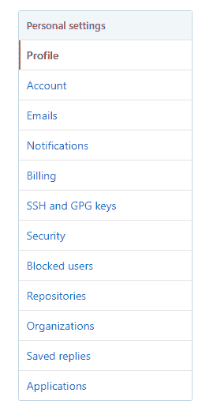

# Kubernetes SIGs、孵化项目和 CNCF

在本章中，我们将讨论如何参与 Kubernetes 生态系统中的社交方面。我们将详细讲解**云原生计算基金会**（**CNCF**）的运作方式，以及全球范围内协调开源软件的各种努力。我们生态系统中的兴趣遍及各个层次，从个人贡献者到财富 100 强大公司。

我们将探讨 CNCF 及其前身——Linux 和 Apache 基金会，如何引导对人力和软件经济的兴趣和贡献。重点领域将管理治理、跟踪和流程，旨在保持人、过程和技术在可持续、可靠的模型中不断发展。在本章中，我们将探索几个关键领域：

+   Kubernetes 生态系统中的社区是如何构建的？它与传统的**自由和开源软件**（**FOSS**）或**开源软件**（**OSS**）运动有何不同？

+   你如何参与讨论，以便理解并参与生态系统的发展？

+   主要项目是什么，它们是如何分类的？

+   如何在变化中选择适合的工具？

+   如何一般性地参与开源软件？

# 技术要求

为了更快地推进本章内容，你应确保已经设置好 GitHub 账号，并正确配置了 SSH 密钥和账户信息。你可能会问，为什么这很重要？因为，要参与 CNCF，以及 Linux 或 Apache 基金会，你需要一种方式来浏览、使用并贡献代码。Git 是参与的底层工具和流程，因此我们会在这里确保我们的工具集已正确设置，然后再进入更高级的话题。

你可以注册 GitHub 账号，一旦添加了账户，你可以在网站的**GitHub 指南**部分查看帮助内容，网址为[`guides.github.com/`](https://guides.github.com/)。在本章中，你需要设置 SSH 密钥，才能开始克隆、签名和提交代码。

如果你使用 Windows，你需要使用 Git Bash 或类似工具来生成密钥。你可以从[`gitforwindows.org/`](https://gitforwindows.org/)下载 Git Bash。

首先安装软件，然后我们将设置你的环境。安装过程如下所示：


# 设置 Git 进行贡献

输入以下命令，用你的电子邮件地址替换我的地址：

```
$ ssh-keygen -t rsa -b 4096 -C "jesse@gsw-k8s-3rd.com"
Generating public/private rsa key pair.
Enter file in which to save the key (/c/Users/jesse/.ssh/id_rsa):
Created directory '/c/Users/jesse/.ssh'.
Enter passphrase (empty for no passphrase):
Enter same passphrase again:
Your identification has been saved in /c/Users/jesse/.ssh/id_rsa.
Your public key has been saved in /c/Users/jesse/.ssh/id_rsa.pub.
The key fingerprint is:
SHA256:AtDI+/yPNxi8y6WzdTecvd6U/ir6Q8pBtg0dv/ZhHlY jesse@gsw-k8s-3rd.com
The key's randomart image is:
+---[RSA 4096]----+
| ..o             |
|  o..       . |
|   ..    . o |
|  . .    + . . E|
|   o .. So +   ..|
|    o o. o.ooo=.|
|     . +o..+=.=o+|
|     .==o.o.o..=.|
|      **...o.++o+|
+----[SHA256]-----+
$ ~/Documents/Code
```

这将生成一个密钥对，你可以将其添加到你的`ssh-agent`中。如果你不想使用 SSH 密钥，也可以选择使用 GitHub Desktop，但我们建议你使用本地 CLI 工具。

确保代理正在运行，使用以下命令：

```
$ eval $(ssh-agent -s)
Agent pid 11684
```

然后你可以按照以下步骤将密钥添加到代理中：

```
$ ssh-add ~/.ssh/id_rsa
Identity added: /c/Users/jesse/.ssh/id_rsa (/c/Users/jesse/.ssh/id_rsa)
```

我们这里不详细介绍操作步骤，但你可以在[`help.github.com/articles/generating-a-new-ssh-key-and-adding-it-to-the-ssh-agent/`](https://help.github.com/articles/generating-a-new-ssh-key-and-adding-it-to-the-ssh-agent/)找到 macOS 和 Linux 的操作说明。

接下来，我们将把你的公共密钥添加到 GitHub 账户，以便继续进行本章的其他内容。访问[`github.com`](https://github.com)，点击你的个人资料，打开设置页面：


接下来，我们点击 SSH 和 GPG 密钥，并添加你在机器上创建的密钥：



点击“New SSH key”，然后添加你生成的`id_rsa.pub`密钥。重要的是，不要添加`id_rsa`密钥，因为它是私密的，应该保密并且离线存储！

你可以通过以下命令在 Windows 中将你的公共 SSH 密钥复制到剪贴板：

```
$ clip < ~/.ssh/id_rsa.pub
```

配置好后，你可以通过以下命令来测试它：

```
$ ssh -vT git@github.com
OpenSSH_7.7p1, OpenSSL 1.0.2o 27 Mar 2018
debug1: Reading configuration data /etc/ssh/ssh_config
debug1: Connecting to github.com [192.30.253.113] port 22.
debug1: Connection established.
….SNIP...
Hi anonymuse! You've successfully authenticated, but GitHub does not provide shell access.
debug1: channel 0: free: client-session, nchannels 1
Transferred: sent 3328, received 2048 bytes, in 0.1 seconds
Bytes per second: sent 36660.1, received 22560.1
debug1: Exit status 1
```

如果你看到欢迎信息显示你的用户名，说明一切设置完成！

# Git 的好处

一旦你拥有了密钥，添加到你的 GitHub 账户中，以完成两项重要任务：

+   **Fork、拉取请求和贡献**：你将能够使用自己的代码库创建私有的 fork 和拉取请求，从而开始为容器生态系统中的项目做贡献。你需要 SSH 密钥以及前面提到的程序，才能与 Git 进行交互，而 Git 是支持这一协作的底层技术。GitLab 和 Bitbucket 也有类似的设置，但 GitHub 目前是最受欢迎的工具，恰好是所有 CNCF 项目所在的地方。

+   **数字化监控链**：你将能够签署你的提交。为了参与许多前沿的 Kubernetes 生态系统项目，你需要数字签名你的提交，以便能够追溯到你。我们在本书中提到的许多技术被用于支撑世界上最先进公司的大型基础设施，对于开源软件（OSS）来说，建立一个强大的代码开发监控链至关重要。SSL 的指纹和你的机器是验证和授权的关键组成部分。

# CNCF 结构

作为复习，让我们回顾一下整个 Kubernetes 系统，以便概念上理解本章所提到的生态系统在其中的位置：


在本章中，我们讨论的是前面图示中最顶层、最绿色的那一层。该层由数百家公司和产品组成，支持运行 Kubernetes 所需的软件和框架。你可以在以下几个地方找到这一层的最高级别分组：

+   第一个需要检查的地方是 Kubernetes 社区的 GitHub 仓库：

    +   你可以在[`github.com/kubernetes/community`](https://github.com/kubernetes/community)找到代码库，它是任何有兴趣加入 Kubernetes 系统代码部分的人的良好起点。在前面的图示中，考虑从内核到接口的层次，也就是第一到第四层。这里将是我们找到**特别兴趣小组**（**SIGs**）的地方，SIGs 将帮助我们扩展到生态系统层，探索支撑技术，使 Kubernetes 能够专注于其核心功能。

+   你可以进一步调查生态系统的第二个地方——CNCF 生态图：

    +   该生态系统实际上被分为几个有用的部分，可以帮助从个人用户到大型企业的所有人做出决策，选择采用哪些技术、等待哪些技术的成熟、以及舍弃哪些技术。这里是我们深入了解支持生态系统的地方，目的是理解哪些是 Kubernetes 核心所必需的，哪些是由生态系统提供的。

Kubernetes 文档通过以下引述简洁地回答了 Kubernetes 是什么这个问题：

Kubernetes 提供了一个以容器为中心的管理环境。它代表用户工作负载协调计算、网络和存储基础设施。这结合了平台即服务（PaaS）的简单性与基础设施即服务（IaaS）的灵活性，并使得跨基础设施提供商的可移植性成为可能。

欲了解更多信息，请访问[`kubernetes.io/docs/concepts/overview/what-is-kubernetes/`](https://kubernetes.io/docs/concepts/overview/what-is-kubernetes/)。

那么，如果这就是 Kubernetes，那它不是做什么呢？

# Kubernetes 不是

关于 Kubernetes 生态系统的最简洁——也是目前最好的——观点，以适合既运行自己小型集群的个人，又适合希望理解 Kubernetes 生态系统巨大范围的高管的层次，便是**云原生路线图**，如图所示：


路线图帮助我们拆解当前在 Kubernetes 核心容器管理环境之外所进行的所有支持工作，正如我们在上一部分所提到的那样。除了网络、存储和计算之外，还有许多活动的部分需要协同工作，才能使复杂的、基于微服务的、云原生应用在大规模上运行。要支持 Kubernetes PaaS 系统，还需要什么？

你应该将每一层视为一个选择；选择一项技术（或多项技术，来展示概念验证和决策）并查看它如何运作。

例如，让我们以容器化为例：此时，将应用程序作为容器化工作负载运行已成为标准，但你的组织可能需要一些时间来重新架构应用程序，或学习如何使用 Dockerfile 构建云原生应用。

在将应用程序迁移到云端或容器编排与调度平台时，传统上涉及到的有*6Rs*。

这是一个展示前面提示框中提到的 6Rs 的图示，你可以利用它来更新你的应用程序：


虽然这个 6Rs 公式最初是为了考虑迁移到云端而设计的，但在迁移到容器时也非常有用。请记住，并非所有应用程序都适合在容器中运行（**保留**），而有些应该为开源软件（OSS）淘汰（**退役**）。开始迁移到容器化工作负载的一个好方法是直接将一个大型的单体应用程序，如`Java .war`文件或 Python 程序，放入容器中并按原样运行（**重新托管**）。为了实现容器化的最大效益，并利用 Kubernetes 的前沿特性，你很可能需要探索重构、重新构想和重新设计你的应用程序（**重构**）。

任何运行平台的人接下来的关注点是**持续集成与持续交付**（**CICD**）。你需要管理基础设施和应用程序作为代码，以实现无缝发布、更新和测试。在这个新世界中，基础设施和应用程序在软件领域都是一等公民。

可观测性和分析在控制基础设施和应用程序的高度复杂软件系统中同样重要。CNCF 将解决方案分为沙盒、已毕业和孵化区域：

+   **沙盒**：OpenMetrics 旨在创建一个通用标准，基于 Prometheus 构建，以大规模传输度量数据。OpenMetrics 使用标准文本格式，以及协议缓冲区来序列化结构化数据，以语言和平台中立的方式进行处理。

+   **孵化中**：在这里，我们看到了 Fluentd、Jaeger 和 OpenTracing。Fluentd 已经存在一段时间了，对于那些使用**Elasticsearch、Logstash、Kibana**（**ELK**）栈收集度量数据的人来说，它是一个开源的数据聚合器，允许你将来自不同来源的日志统一起来。Jaeger 帮助运维人员通过提供追踪功能来监控和解决复杂分布式系统中的问题，这些追踪有助于发现现代微服务系统中的问题。与 OpenMetrics 类似，OpenTracing 是一个旨在为微服务和开源软件建立分布式追踪标准的努力。随着我们的系统越来越多地与不知道细节的 API 互联，检查这些系统之间的连接变得愈发重要。

+   **已毕业**：与 Kubernetes 一起，Prometheus 仍然是 CNCF 中目前唯一一个已毕业的项目。Prometheus 是一个监控和告警系统，可以使用多种不同的时间序列数据库来显示系统状态。

服务网格和发现是沿着云原生路线图的下一个步骤。这个层级可以被视为 Kubernetes 基础功能之上的额外能力集，Kubernetes 可以被视为以下能力集合的组合：

+   一个单一的 Kubernetes API 控制平面

+   一个身份验证和授权模型

+   一个命名空间化、可预测、集群范围的资源描述方案

+   一个容器调度和编排域

+   一个 Pod 到 Pod 和入口网络路由域

该地图中的三个产品是 CoreDNS、Envoy 和 Linkerd。CoreDNS 替代了集群中的`kube-dns`，并提供了将多个插件链接在一起的能力，以创建更深层次的功能用于查找客户提供者。CoreDNS 将很快取代`kube-dns`，成为 Kubernetes 的默认 DNS 提供者。Envoy 是一个服务代理，内置于流行的 Istio 产品中。Istio 是一个控制层，使用 Envoy 二进制作为数据平面，为一组同质的软件或服务提供通用功能。Envoy 为在 Kubernetes 上运行的应用程序提供服务网格的基础能力，提供了额外的韧性层，包括断路器、速率限制、负载均衡、服务发现、路由以及通过度量和日志形式的应用程序自省。Linkerd 几乎具备与 Envoy 相同的所有功能，它也是服务网格的数据平面。

网络是我们可以加入 Kubernetes 生态系统的下一个构建模块。**容器网络接口**（**CNI**）是当前在 CNCF 生态系统内开发的多个接口之一。为了应对现代应用程序的复杂功能需求，Kubernetes 集群网络的多个选项正在开发中。当前的选项包括：

+   Calico

+   Flannel

+   Weave Net

+   Cilium

+   Contiv

+   SR-IOV

+   Knitter

Kubernetes 团队还提供了一组核心插件，用于管理系统中的 IP 地址分配和接口创建。

在[`github.com/containernetworking/plugins/`](https://github.com/containernetworking/plugins)了解更多关于标准插件的信息。

从 GitHub 项目主页读取，CNI 被描述如下：

CNI（*容器网络接口*），是一个云原生计算基金会（Cloud Native Computing Foundation，CNCF）项目，包含用于编写插件以配置 Linux 容器中网络接口的规范和库，以及一些受支持的插件。CNI 只关心容器的网络连接性，并在容器被删除时移除已分配的资源。由于专注于这一点，CNI 得到了广泛的支持，且其规范易于实现。

欲了解更多关于云原生计算基金会的信息，请访问[`www.cncf.io/`](https://www.cncf.io/)。

目前在分布式数据库部分的路线图中活动并不多，原因在于目前大多数在 Kubernetes 上运行的工作负载通常是无状态的。目前有一个正在孵化的项目，名为 Vitess，旨在为广受欢迎的 MySQL 数据库系统提供横向扩展模型。为了在 Kubernetes 的 Pod 结构化基础设施上扩展 MySQL，Vitess 的开发者专注于对 MySQL 的数据存储进行分片，以便将其分布到集群的各个节点上。这与其他 NoSQL 系统类似，通过这种方式，数据依赖于在多个节点之间进行复制和分散。自 2011 年起，Vitess 就已在 YouTube 大规模使用，是那些希望深入探索 Kubernetes 上有状态工作负载的用户的一个有前景的技术。

对于那些推动 Kubernetes 系统极限的操作员来说，有几种高性能选项可以提高系统速度。gRPC 是一个由 Google 开发的**远程过程调用**（**RPC**）框架，旨在帮助客户端和服务器透明地进行通信。gRPC 支持多种语言，包括 C++、Java、Python、Go、Ruby、C#、Node.js 等。gRPC 使用 ProtoBuf，并基于一个简单的概念：服务应具有可以从另一个远程服务调用的方法。通过在代码中定义这些方法和参数，gRPC 允许构建大型复杂的应用程序，并将其拆分成多个部分。NATS 是一个消息队列，实施了一个分布式队列系统，提供发布/订阅和请求/回复功能，从而为**进程间通信**（**IPC**）提供一个高度可扩展且安全的基础。

容器运行时部分的路线图是一个存在一定争议的领域。目前在 CNCF 中有两个选项：`containerd` 和 `rkt`。这两种技术目前并未遵循**容器运行时接口**（**CRI**）标准，这是一个新的标准，旨在创建对容器运行时应具备功能的共同理解。在 CNCF 之外，有一些示例目前已符合 CRI 标准：

+   CRI-O

+   Docker CRI shim

+   Frakti

+   rkt

也有一些有趣的参与者，例如 Kata Containers，它符合**开放容器倡议**（**OCI**）标准，并试图通过利用 Hyper 的 runV 和 Intel 的 Clear Containers 技术，提供运行在轻量级虚拟机上的容器。在这里，Kata 取代了传统的 runC 运行时，提供带有其独立迷你内核的轻量级虚拟机容器。

最后一块拼图是软件分发，它由 Notary 和 TUF 框架覆盖。这些工具旨在帮助安全分发软件。Notary 是一个客户端/服务器框架，允许人们在可选择的数据集合中建立信任。简而言之，发布者可以签署数据内容，然后将其发送给有权限访问公钥加密系统的消费者，这样他们就可以验证发布者的身份和数据。

TUF 框架被 Notary 使用，Notary 是一个允许安全更新软件系统的框架。TUF 被用于通过**空中下载**（**OTA**）向汽车提供安全更新。

# Kubernetes SIGs

除了前面提到的所有参与者，还有一组互补的 SIG 定期召开会议，讨论来自 Kubernetes 生态系统中某个特定领域的问题和机会。在这些 SIG 内部，还有一些子领域工作组，旨在实现特定目标。还有一些子项目，进一步细分兴趣领域，以及委员会，专门定义元标准并处理社区范围内的问题。

以下是当前运行中的 SIG 列表，包括当前的主席和会议安排：

| **名称** | **主席** | **会议** |
| --- | --- | --- |
| API Machinery ([`github.com/kubernetes/community/blob/master/sig-api-machinery/README.md`](https://github.com/kubernetes/community/blob/master/sig-api-machinery/README.md)) |

+   Daniel Smith ([`github.com/lavalamp`](https://github.com/lavalamp))，Google

+   David Eads ([`github.com/deads2k`](https://github.com/deads2k))，Red Hat

| 定期 SIG 会议：每周三上午 11:00 PT（太平洋时间）（每两周一次） ([`docs.google.com/document/d/1FQx0BPlkkl1Bn0c9ocVBxYIKojpmrS1CFP5h0DI68AE/edit`](https://docs.google.com/document/d/1FQx0BPlkkl1Bn0c9ocVBxYIKojpmrS1CFP5h0DI68AE/edit)) |
| --- |
| Apps ([`github.com/kubernetes/community/blob/master/sig-apps/README.md`](https://github.com/kubernetes/community/blob/master/sig-apps/README.md)) |

+   Matt Farina ([`github.com/mattfarina`](https://github.com/mattfarina))，Samsung SDS

+   Adnan Abdulhussein ([`github.com/prydonius`](https://github.com/prydonius))，Bitnami

+   Kenneth Owens ([`github.com/kow3ns`](https://github.com/kow3ns))，Google

| 定期 SIG 会议：每周一上午 9:00 PT（太平洋时间）（每周一次） |
| --- |
| 架构 ([`github.com/kubernetes/community/blob/master/sig-architecture/README.md`](https://github.com/kubernetes/community/blob/master/sig-architecture/README.md)) |

+   Brian Grant ([`github.com/bgrant0607`](https://github.com/bgrant0607))，Google

+   Jaice Singer DuMars ([`github.com/jdumars`](https://github.com/jdumars))，Google

| 定期 SIG 会议：每周四 19:00 UTC（每周一次） |
| --- |
| Auth ([`github.com/kubernetes/community/blob/master/sig-auth/README.md`](https://github.com/kubernetes/community/blob/master/sig-auth/README.md)) |

+   Jordan Liggitt ([`github.com/liggitt`](https://github.com/liggitt)), Red Hat

+   Mike Danese ([`github.com/mikedanese`](https://github.com/mikedanese)), Google

+   Tim Allclair ([`github.com/tallclair`](https://github.com/tallclair)), Google

| 定期 SIG 会议：每周三 太平洋时间 11:00 (每两周一次) |
| --- |
| AWS ([`github.com/kubernetes/community/blob/master/sig-aws/README.md`](https://github.com/kubernetes/community/blob/master/sig-aws/README.md)) |

+   Justin Santa Barbara ([`github.com/justinsb`](https://github.com/justinsb))

+   Kris Nova ([`github.com/kris-nova`](https://github.com/kris-nova)), Heptio

+   Nishi Davidson ([`github.com/d-nishi`](https://github.com/d-nishi)), AWS

| 定期 SIG 会议：每周五 太平洋时间 9:00 (每两周一次) |
| --- |
| Azure ([`github.com/kubernetes/community/blob/master/sig-azure/README.md`](https://github.com/kubernetes/community/blob/master/sig-azure/README.md)) |

+   Stephen Augustus ([`github.com/justaugustus`](https://github.com/justaugustus)), Red Hat

+   Shubheksha Jalan ([`github.com/shubheksha`](https://github.com/shubheksha)), Microsoft

| 定期 SIG 会议：每周三 UTC 16:00 (每两周一次) |
| --- |
| 大数据 ([`github.com/kubernetes/community/blob/master/sig-big-data/README.md`](https://github.com/kubernetes/community/blob/master/sig-big-data/README.md)) |

+   Anirudh Ramanathan ([`github.com/foxish`](https://github.com/foxish)), Rockset

+   Erik Erlandson ([`github.com/erikerlandson`](https://github.com/erikerlandson)), Red Hat

+   Yinan Li ([`github.com/liyinan926`](https://github.com/liyinan926)), Google

| 定期 SIG 会议： 每周三 UTC 17:00 (每周一次) |
| --- |

如果你想参加其中一场会议，可以查看这里的主列表：[`github.com/kubernetes/community/blob/master/sig-list.md`](https://github.com/kubernetes/community/blob/master/sig-list.md)。

# 如何参与

我们想与您分享的最后一件事是，帮助您指引正确的方向，以便您能够直接开始为 Kubernetes 或其他相关软件做贡献。Kubernetes 有一个很棒的贡献者指南，您应该考虑贡献，理由有很多：

+   这是理解 Kubernetes 核心概念和内部工作机制的绝佳方式。编写该系统的软件将为你作为操作员或开发人员提供独特的视角，了解一切如何运作。

+   这是一个结识其他有动力、聪明的人的有趣方式。世界变得越来越互联互通，开源软件正在推动一些全球最大公司的发展。直接参与这些技术的工作将让你接触到世界上最先进公司的工程师，甚至可能为你打开重大的职业机会之门。

+   Kubernetes 本质上是一个社区项目，依赖于成员和用户的贡献。直接参与文档更新、错误修复和功能创建的贡献，推动了生态系统的发展，并为每个人提供了更好的体验。

如果你想了解更多关于如何成为 Kubernetes 贡献者的信息，可以阅读 [`github.com/kubernetes/community/tree/master/contributors/guide/`](https://github.com/kubernetes/community/tree/master/contributors/guide/)。

# 总结

在这一章中，你了解了围绕 Kubernetes 系统的 Kubernetes 生态系统。你阅读了 CNCF 的核心组成部分，我们还探索了 Cloud Native Trail Map，以了解所有支持的技术。我们还了解了 SIGs，以及你如何开始为 Kubernetes 本身做出贡献以及为什么这很重要！

# 问题

1.  请列举至少一个在 CNCF 中毕业的项目

1.  请列举至少三个在 CNCF 孵化的项目

1.  请列举至少一个 CNCF 沙箱中的项目

1.  CNCF 中委员会的目标是什么？

1.  为什么参与开源软件开发很重要？

1.  Git 贡献需要什么样的加密材料？

# 进一步阅读

如果你想了解更多关于如何精通 Git 的内容，可以查看 Packt Publishing 提供的以下资源：[`www.packtpub.com/application-development/mastering-git`](https://www.packtpub.com/application-development/mastering-git)。
