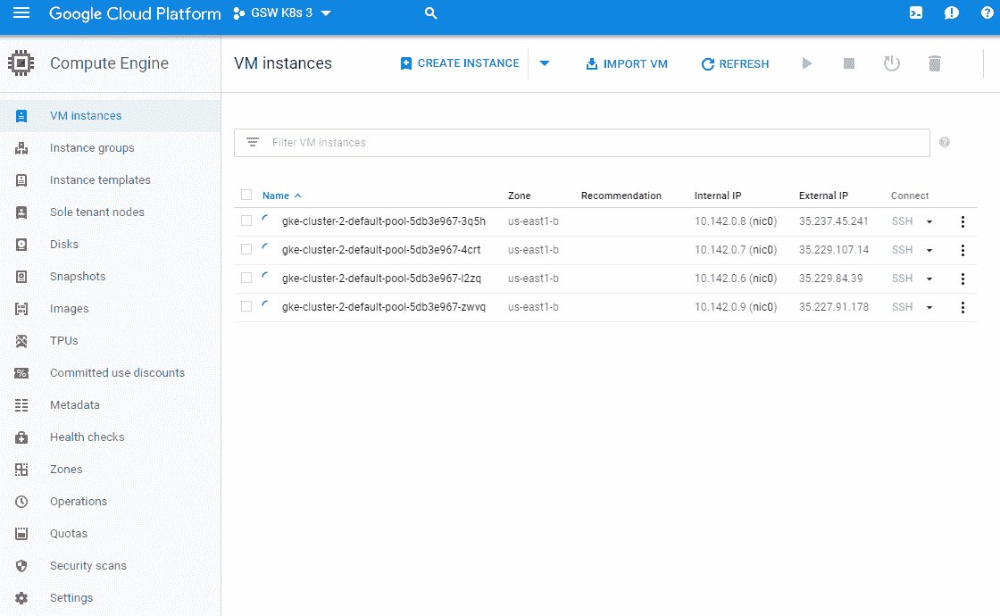

# 第十二章：集群联合与多租户

本章将讨论新的联合能力以及如何使用它们来管理跨云提供商的多个集群。我们还将涵盖核心构件的联合版本。我们将带你了解联合的 Deployments、ReplicaSets、ConfigMaps 和 Events。

本章将讨论以下主题：

+   联合集群

+   联合多个集群

+   检查和控制跨多个集群的资源

+   在多个集群中启动资源

# 技术要求

你需要启用并登录你的 Google Cloud Platform 账户，或者可以使用本地的 Minikube 实例。你还可以使用 Web 上的 Play with Kubernetes：[`labs.play-with-k8s.com/`](https://labs.play-with-k8s.com/)。此外，还有 Katacoda 的在线沙箱：[`www.katacoda.com/courses/kubernetes/playground`](https://www.katacoda.com/courses/kubernetes/playground)。

你还需要 GitHub 凭证，我们将在本章稍后介绍如何设置。以下是本章的 GitHub 仓库：[`github.com/PacktPublishing/Getting-Started-with-Kubernetes-third-edition/tree/master/Code-files/Chapter12`](https://github.com/PacktPublishing/Getting-Started-with-Kubernetes-third-edition/tree/master/Code-files/Chapter12)。

# 联合简介

虽然联合在 Kubernetes 中仍然是一个相对较新的概念，但它为一个备受追捧的跨云提供商解决方案奠定了基础。通过使用联合，我们可以在本地和一个或多个公共云提供商中运行多个 Kubernetes 集群，并利用我们所有组织资源的完整集合来管理应用程序。

这为避免云提供商锁定和实现高可用部署提供了路径，可以将应用程序服务器放置在多个集群中，并允许与我们联合集群中单点服务的其他服务进行通信。我们可以在特定提供商或地理位置发生故障时改善隔离，同时为扩展和利用整体基础设施提供更大的灵活性。

当前，联合平面支持以下资源：ConfigMap、DaemonSets、Deployment、Events、Ingress、Namespaces、ReplicaSets、Secrets 和 Services。请注意，联合及其组件仍处于 alpha 和 beta 阶段，因此功能可能会有些不稳定。

# 为什么使用联合？

使用 Kubernetes 集群联合有几个主要的优点。正如前面提到的，联合可以提高 Kubernetes 集群的可用性和租户能力。通过在单一**云服务提供商**（**CSP**）的可用区或区域之间进行扩展，或者跨多个 CSP 进行扩展，联合将高可用性的概念提升到了一个新的水平。有些人称之为全球调度，这将使你能够引导流量，以最大化在现货市场中变得可用的便宜 CSP 资源。你还可以利用全球调度将工作负载集群迁移到最终用户群体，提高应用程序的性能。

还有机会将整个集群视为 Kubernetes 对象，并按集群而不是按机器处理故障。集群联合可以让操作员通过将流量引导到冗余的、可用的集群来自动恢复整个集群的故障。

应该注意的是，尽管联合增加了集群的高可用性潜力，但显著增加的复杂性也降低了可靠性，特别是在集群管理不当的情况下。你可以通过使用 Kubernetes 的托管 PaaS 版本（例如 GKE）来管理一些复杂性，将集群管理交给 GCP，将大大减轻团队的操作负担。

联合还可以使你的团队支持混合环境，将本地集群与云中的资源配对。根据你的流量路由要求，这可能需要额外的工程支持，通常表现为服务网格。

联合提供了许多技术特性，这些特性使得可用性有更高的潜力。

# 联合的构建模块

联合通过提供两种不同类型的构建模块，使得跨集群管理资源变得容易。第一种是资源，第二种是服务发现：

+   **跨集群资源同步**：联合是将你需要的许多资源保持同步的粘合剂，以运行一组应用程序。当你在多个集群中运行大量应用程序，并且涉及许多资源和对象类型时，联合是保持集群有序和管理良好的关键。你可能会发现需要在多个集群中保持应用程序部署，并提供单一的管理视图。

+   **多集群服务发现**：有许多资源在集群之间共享得很好，例如 DNS、负载均衡器、对象存储和入口。联合使你能够自动配置这些服务，使其具备多集群感知能力，从而可以在多个集群之间路由应用流量，并管理控制平面。

正如我们接下来要学习的，Kubernetes 联邦是通过一个名为`kubefed`的工具来管理的，该工具有许多命令行标志，可以让你管理多个集群以及我们之前讨论的构建块。我们将使用的`kubefed`的主要构建块如下：

+   `kubefed init`：初始化联邦控制平面

+   `kubefed join`：将一个集群加入到联邦中

+   `kubefed options`：打印所有命令继承的标志列表

+   `kubefed unjoin`：将一个集群从联邦中移除

+   `kubefed version`：打印客户端和服务器版本信息

这里有一个方便的选项列表，可以使用：

```
      --alsologtostderr                              log to standard error as well as files
      --as string                                    Username to impersonate for the operation
      --as-group stringArray                         Group to impersonate for the operation, this flag can be repeated to specify multiple groups.
      --cache-dir string                             Default HTTP cache directory (default "/Users/jrondeau/.kube/http-cache")
      --certificate-authority string                 Path to a cert file for the certificate authority
      --client-certificate string                    Path to a client certificate file for TLS
      --client-key string                            Path to a client key file for TLS
      --cloud-provider-gce-lb-src-cidrs cidrs        CIDRs opened in GCE firewall for LB traffic proxy & health checks (default 130.211.0.0/22,209.85.152.0/22,209.85.204.0/22,35.191.0.0/16)
      --cluster string                               The name of the kubeconfig cluster to use
      --context string                               The name of the kubeconfig context to use
      --default-not-ready-toleration-seconds int     Indicates the tolerationSeconds of the toleration for notReady:NoExecute that is added by default to every pod that does not already have such a toleration. (default 300)
      --default-unreachable-toleration-seconds int   Indicates the tolerationSeconds of the toleration for unreachable:NoExecute that is added by default to every pod that does not already have such a toleration. (default 300)
  -h, --help                                         help for kubefed
      --insecure-skip-tls-verify                     If true, the server's certificate will not be checked for validity. This will make your HTTPS connections insecure
      --ir-data-source string                        Data source used by InitialResources. Supported options: influxdb, gcm. (default "influxdb")
      --ir-dbname string                             InfluxDB database name which contains metrics required by InitialResources (default "k8s")
      --ir-hawkular string                           Hawkular configuration URL
      --ir-influxdb-host string                      Address of InfluxDB which contains metrics required by InitialResources (default "localhost:8080/api/v1/namespaces/kube-system/services/monitoring-influxdb:api/proxy")
      --ir-namespace-only                            Whether the estimation should be made only based on data from the same namespace.
      --ir-password string                           Password used for connecting to InfluxDB (default "root")
      --ir-percentile int                            Which percentile of samples should InitialResources use when estimating resources. For experiment purposes. (default 90)
      --ir-user string                               User used for connecting to InfluxDB (default "root")
      --kubeconfig string                            Path to the kubeconfig file to use for CLI requests.
      --log-backtrace-at traceLocation               when logging hits line file:N, emit a stack trace (default :0)
      --log-dir string                               If non-empty, write log files in this directory
      --log-flush-frequency duration                 Maximum number of seconds between log flushes (default 5s)
      --logtostderr                                  log to standard error instead of files (default true)
      --match-server-version                         Require server version to match client version
  -n, --namespace string                             If present, the namespace scope for this CLI request
      --password string                              Password for basic authentication to the API server
      --request-timeout string                       The length of time to wait before giving up on a single server request. Non-zero values should contain a corresponding time unit (e.g. 1s, 2m, 3h). A value of zero means don't timeout requests. (default "0")
  -s, --server string                                The address and port of the Kubernetes API server
      --stderrthreshold severity                     logs at or above this threshold go to stderr (default 2)
      --token string                                 Bearer token for authentication to the API server
      --user string                                  The name of the kubeconfig user to use
      --username string                              Username for basic authentication to the API server
  -v, --v Level                                      log level for V logs
      --vmodule moduleSpec                           comma-separated list of pattern=N settings for file-filtered logging
```

这里有一个高层次的图示，展示了当这些组件被串联起来时的样子：


# 关键组件

Kubernetes 中的联邦功能有两个关键组件。这些组件构成了联邦控制平面。

第一个是`federation-controller-manager`，它嵌入了操作联邦所需的核心控制循环。`federation-controller-manager`通过`apiserver`监视集群的状态，并进行更改，以达到期望的状态。

第二个是`federation-apiserver`，它验证并配置 Kubernetes 对象，如 pods、services 和 controllers。`federation-apiserver`是集群的前端，所有其他组件都通过它进行交互。

# 联邦服务

现在我们已经在脑海中构建了联邦的基础框架，接下来让我们在设置联邦之前，再回顾一下一个方面：一个跨多个集群部署的公共服务是如何工作的？

联邦服务的创建方式与常规服务非常相似：首先，将服务的期望状态和属性发送到 API 端点，然后通过 Kubernetes 架构实现。主要的区别有两个：

+   一个非联邦服务将直接向集群 API 端点发出 API 调用

+   联邦服务将向`federation/v1beta1`的联邦 API 端点发出调用，然后将 API 调用重定向到联邦控制平面内的所有单个集群。

第二种类型的服务允许我们扩展诸如跨集群边界的 DNS 服务发现等功能。DNS `resolv`链能够利用服务联邦和公共 DNS 记录，在多个集群之间解析名称。

联邦服务的 API 与常规服务 100%兼容。

当创建服务时，联邦会处理几件事。首先，它在所有`kubefed`指定的集群中创建匹配的服务。这些服务的健康状况会被监控，以便流量可以路由或重新路由到它们。最后，联邦确保通过 Route 53 或 Google Cloud DNS 等提供商，有一组确切的公共 DNS 记录可用。

在你的 Kubernetes 集群内，不同 Pod 上的微服务将利用这一切机制来定位联邦服务，无论是在自己的集群内，还是导航到你联邦图中最近的健康实例。

# 设置联邦

虽然我们可以使用已经运行的集群来完成其余的示例，但我强烈建议你从头开始。集群和上下文的默认命名对于联邦系统可能会产生问题。请注意，`--cluster-context`和`--secret-name`标志可以帮助你绕过默认命名，但对于首次进行联邦设置来说，仍然可能会令人困惑且不太直接。

因此，从头开始是我们在本章中演示示例的方式。你可以使用新的独立云服务提供商（AWS 和/或 GCE）账户，或者通过运行以下命令摧毁当前集群并重置你的 Kubernetes 控制环境：

```
$ kubectl config unset contexts $ kubectl config unset clusters
```

使用以下命令仔细检查确保没有列出任何内容：

```
$ kubectl config get-contexts $ kubectl config get-clusters
```

接下来，我们将需要将`kubefed`命令添加到路径中并使其可执行。返回到你提取 Kubernetes 下载的文件夹。`kubefed`命令位于`/kubernetes/client/bin`文件夹中。运行以下命令进入`bin`文件夹并更改执行权限：

```
$ sudo cp kubernetes/client/bin/kubefed /usr/local/bin
$ sudo chmod +x /usr/local/bin/kubefed
```

# 上下文

上下文由 Kubernetes 控制平面使用，以便存储多个集群的认证信息和配置。这允许我们通过同一个`kubectl`访问和管理多个集群。你总是可以通过之前使用的`get-contexts`命令查看可用的上下文。

# 联邦的新集群

再次确保你进入 Kubernetes 下载的文件夹，并进入`cluster`子文件夹：

```
$ cd kubernetes/cluster/
```

在我们继续之前，请确保你已安装、验证并配置了 GCE 命令行工具和 AWS 命令行工具。如果你在新机器上需要帮助，可以参考第一章，*Kubernetes 简介*。

首先，我们将创建 AWS 集群。请注意，我们正在添加一个名为`OVERRIDE_CONTEXT`的环境变量，这将允许我们将上下文名称设置为符合 DNS 命名标准的名称。DNS 是联邦的关键组件，因为它使我们能够进行跨集群发现和服务通信。在一个联邦环境中，集群可能位于不同的数据中心甚至不同的提供商之间，这一点尤为重要。

运行以下命令以创建你的 AWS 集群：

```
$ export KUBERNETES_PROVIDER=aws
$ export OVERRIDE_CONTEXT=awsk8s
$ ./kube-up.sh
```

接下来，我们将再次使用`OVERRIDE_CONTEXT`环境变量创建一个 GCE 集群：

```
$ export KUBERNETES_PROVIDER=gce
$ export OVERRIDE_CONTEXT=gcek8s
$ ./kube-up.sh
```

如果我们现在查看上下文，我们会注意到刚才创建的`awsk8s`和`gcek8s`。`gcek8s`前面的星号表示`kubectl`当前指向并正在执行的上下文：

```
$ kubectl config get-contexts 
```

前面的命令应该会产生如下所示的输出：


# 初始化联邦控制平面

现在我们有了两个集群，接下来在 GCE 集群中设置联邦控制平面。首先，我们需要确保处于 GCE 环境中，然后初始化联邦控制平面：

```
$ kubectl config use-context gcek8s
$ kubefed init master-control --host-cluster-context=gcek8s --dns-zone-name="mydomain.com" 
```

上述命令创建了一个新的联邦环境，名为`master-control`。它使用`gcek8s`集群/环境来托管联邦组件（如 API 服务器和控制器）。它假定 GCE DNS 作为联邦的 DNS 服务。你需要更新`dns-zone-name`，并填写你管理的域名后缀。

默认情况下，DNS 提供商是 GCE。你可以使用`--dns-provider="aws-route53"`将其设置为 AWS `route53`；然而，许多用户发现开箱即用的实现仍然存在问题。

如果我们再次检查环境，会看到三个环境：

```
$ kubectl config get-contexts 
```

上述命令应生成如下内容：


在继续之前，我们先确保所有联邦组件都在运行。联邦控制平面使用`federation-system`命名空间。使用带有命名空间的`kubectl get pods`命令来监控进度。当看到两个 API 服务器 pod 和一个控制器 pod 时，表示已就绪：

```
$ kubectl get pods --namespace=federation-system 
```


现在我们已经设置并运行了联邦组件，接下来让我们切换到该环境以进行后续步骤：

```
$ kubectl config use-context master-control
```

# 向联邦系统添加集群

现在我们有了联邦控制平面，可以将集群添加到联邦系统中。首先，我们将加入 GCE 集群，然后加入 AWS 集群：

```
$ kubefed join gcek8s --host-cluster-context=gcek8s --secret-name=fed-secret-gce
$ kubefed join awsk8s --host-cluster-context=gcek8s --secret-name=fed-secret-aws
```

# 联邦资源

联邦资源允许我们跨多个集群和/或区域进行部署。目前，Kubernetes 1.5 版本支持联邦 API 中的多个核心资源类型，包括 ConfigMap、DaemonSets、Deployment、Events、Ingress、Namespaces、ReplicaSets、Secrets 和 Services。

让我们看一下一个联邦部署，它将允许我们在 AWS 和 GCE 之间调度 pods。将以下文件保存为`node-js-deploy-fed.yaml`：

```
apiVersion: extensions/v1beta1
kind: Deployment
metadata:
  name: node-js-deploy
  labels:
    name: node-js-deploy
spec:
  replicas: 3
  template:
    metadata:
      labels:
        name: node-js-deploy
    spec: 
      containers: 
      - name: node-js-deploy 
        image: jonbaier/pod-scaling:latest 
        ports: 
        - containerPort: 80
```

使用以下命令创建此部署：

```
$ kubectl create -f node-js-deploy-fed.yaml
```

现在，尝试列出这个部署的 pods：

```
$ kubectl get pods
```


我们应该看到类似于前面显示的消息。这是因为我们仍在使用`master-control`或联邦环境，它本身不运行 pods。然而，我们会在联邦平面中看到部署，如果检查事件，我们会看到该部署实际上已经在我们的两个联邦集群上创建：

```
$ kubectl get deployments
$ kubectl describe deployments node-js-deploy 
```

我们应该看到如下内容。注意，`Events:`部分显示了我们在 GCE 和 AWS 环境中的部署：


我们还可以使用以下命令查看联邦事件：

```
$ kubectl get events
```


所有三个 Pod 启动可能需要一段时间。一旦启动，我们可以切换到每个集群的上下文，并查看每个集群中的一些 Pod。请注意，我们现在可以使用`get pods`，因为我们在单个集群中，而不是在控制平面中：

```
$ kubectl config use-context awsk8s
$ kubectl get pods
```


```
$ kubectl config use-context gcek8s
$ kubectl get pods
```


我们应该看到三个 Pod 分布在集群中，其中两个在一个集群，第三个在另一个集群。Kubernetes 已经在集群中分配了它们，无需人工干预。任何失败的 Pod 将被重新启动，但现在我们有了来自两个云提供商的冗余。

# 联邦配置

在现代软件开发中，将配置变量与应用程序代码本身分离是很常见的做法。这样，可以更容易地更新服务 URL、凭证、公共路径等。将这些值保存在外部配置文件中意味着我们可以轻松更新配置，而不需要重新构建整个应用程序。

这种分离解决了最初的问题，但真正的可移植性来自于当你能够完全去除应用程序中的依赖时。Kubernetes 提供了一个配置存储库，专门用于这个目的。ConfigMap 是一个简单的结构，用来存储键值对。

Kubernetes 还支持用于更敏感的配置数据的 Secrets。这个内容将在第十章，*集群身份验证、授权和容器安全性*中详细介绍。你可以在单集群或联邦控制平面中使用此处的示例，就像我们在这里演示`ConfigMap`一样。

让我们看一个例子，它将允许我们存储一些配置，然后在多个 Pod 中使用这些配置。以下列表适用于联邦集群和单集群，但我们将在这个例子中继续使用联邦配置。

`ConfigMap`类型可以通过字面量值、平面文件和目录，最终通过 YAML 定义文件来创建。以下列表是`configmap-fed.yaml`文件的 YAML 定义：

```
apiVersion: v1
kind: ConfigMap
metadata:
  name: my-application-config
  namespace: default
data:
  backend-service.url: my-backend-service
```

首先，让我们切换回我们的联邦平面：

```
$ kubectl config use-context master-control
```

现在，使用以下命令创建此列表：

```
$ kubectl create -f configmap-fed.yaml
```

让我们展示一下我们刚刚创建的`configmap`对象。`-o yaml`标志帮助我们显示完整信息：

```
$ kubectl get configmap my-application-config -o yaml
```


现在我们有了一个`ConfigMap`对象，让我们启动一个可以使用该`ConfigMap`对象的联邦`ReplicaSet`。这将创建跨集群的 Pod 副本，这些副本可以访问`ConfigMap`对象。`ConfigMap`可以通过环境变量或挂载卷访问。这个例子将使用一个挂载卷，提供一个文件夹层次结构以及每个键的文件，文件内容表示相应的值。将以下文件保存为`configmap-rs-fed.yaml`：

```
apiVersion: extensions/v1beta1
kind: ReplicaSet
metadata:
  name: node-js-rs
spec:
  replicas: 3
  selector:
    matchLabels:
      name: node-js-configmap-rs
  template:
    metadata:
      labels:
        name: node-js-configmap-rs
    spec:
      containers:
      - name: configmap-pod
        image: jonbaier/node-express-info:latest
        ports:
        - containerPort: 80
          name: web
        volumeMounts:
        - name: configmap-volume
          mountPath: /etc/config
volumes:
      - name: configmap-volume
        configMap:
          name: my-application-config
```

使用`kubectl create -f configmap-rs-fed.yaml`创建此 Pod。创建后，我们需要切换到其中一个 Pod 正在运行的集群。你可以选择任意一个，但我们在这里使用 GCE 上下文：

```
$ kubectl config use-context gcek8s
```

现在我们专门进入了 GCE 集群，让我们在这里检查`configmaps`：

```
$ kubectl get configmaps
```

如你所见，`ConfigMap`被本地传播到每个集群。接下来，让我们从我们的联邦`ReplicaSet`中找到一个 Pod：

```
$ kubectl get pods
```


让我们从列表中选择一个`node-js-rs` Pod 名称，并使用`kubectl exec`运行一个 bash shell：

```
$ kubectl exec -it node-js-rs-6g7nj bash
```

然后，进入我们在 Pod 定义中设置的`/etc/config`文件夹。列出该目录会显示一个文件，其名称是我们之前定义的`ConfigMap`：

```
$ cd /etc/config
$ ls
```

如果我们使用以下命令显示文件的内容，我们应该能看到之前输入的值`my-backend-service`：

```
$ echo $(cat backend-service.url)
```

如果我们查看我们联邦集群中的任何 Pod，都会看到相同的值。这是一种很好的方法，将配置与应用程序解耦并分发到我们的集群阵列中。

# 联邦水平 Pod 自动伸缩器

让我们看看另一个可以与联邦模型一起使用的新资源：**水平 Pod 自动伸缩器**（**HPAs**）。

这是在单个集群中它们的架构：


资料来源：**[`kubernetes.io/docs/tasks/run-application/horizontal-pod-autoscale/#how-does-the-horizontal-pod-autoscaler-work`](https://kubernetes.io/docs/tasks/run-application/horizontal-pod-autoscale/#how-does-the-horizontal-pod-autoscaler-work)**。

这些 HPA 的行为与普通 HPA 相似，具有相同的功能和基于 API 的兼容性——只是通过联邦，管理将遍历你的集群。这是一个 alpha 功能，因此默认情况下在集群中未启用。为了启用它，你需要使用`--runtime-config=api/all=true`选项运行`federation-apiserver`。目前，唯一有效的度量标准是 CPU 利用率度量。

首先，让我们创建一个包含 HPA 配置的文件，命名为`node-hpa-fed.yaml`：

```
apiVersion: autoscaling/v1
kind: HorizontalPodAutoscaler
metadata:
 name: nodejs
 namespace: default
spec:
 scaleTargetRef:
   apiVersion: apps/v1beta1   kind: Deployment
name: nodejs
 minReplicas: 5
 maxReplicas: 20
 targetCPUUtilizationPercentage: 70
```

我们可以使用以下命令将其添加到我们的集群：

```
kubectl --context=federation-cluster create -f node-hpa-fed.yaml
```

在这种情况下，`--context=federation-cluster`是告诉`kubectl`将请求发送到`federation-apiserver`而不是`kube-apiserver`。

例如，如果你想将此 HPA 限制为某些 Kubernetes 集群的子集，可以使用集群选择器来限制联邦对象，方法是使用`federation.alpha.kubernetes.io/cluster-selector`注解。它的功能类似于 nodeSelector，但作用于完整的 Kubernetes 集群。很酷！你需要创建一个 JSON 格式的注解。以下是 ClusterSelector 注解的具体示例：

```
metadata:
  annotations:
     federation.alpha.kubernetes.io/cluster-selector: '[{"key": "hipaa", "operator":
       "In", "values": ["true"]}, {"key": "environment", "operator": "NotIn", "values": ["nonprod"]}]'
```

这个示例将保持带有`hipaa`标签的工作负载不在带有`nonprod`标签的环境中运行。

要查看顶级联合 API 对象的完整列表，请参见以下链接：[`kubernetes.io/docs/reference/federation/`](https://kubernetes.io/docs/reference/federation/)

你可以检查你的集群，查看是否在单个位置创建了 HPA，通过指定上下文：

```
kubectl --context=gce-cluster-01 get HPA nodejs
```

完成 HPA 后，可以使用以下 `kubectl` 命令将其删除：

```
kubectl --context=federation-cluster delete HPA nodejs
```

# 如何使用联合 HPA

以前使用的 HPA 是确保你的集群在工作负载增加时进行扩展的必要工具。HPA 在集群中的默认行为是首先在所有集群中均匀分配最大副本。假设你在联合控制平面中注册了 10 个 Kubernetes 集群。如果你的 `spec.maxReplicas = 30`，那么每个集群将收到以下 HPA `spec`：

```
spec.maxReplicas = 10
```

如果你将 `spec.minReplicas = 5` 设置为值，那么一些集群将接收到以下内容：

```
spec.minReplicas = 1
```

这是由于无法将副本总数设置为 0。需要注意的是，联合会操作它在联合集群中创建的最小/最大副本，而不是直接监控目标对象的指标（在我们的例子中是 CPU）。联合 HPA 控制器依赖于联合集群中的 HPA 来监控 CPU 利用率，然后根据需要调整副本数（例如当前副本数和期望副本数）。

# 其他联合资源

到目前为止，我们已经看到联合部署（Deployments）、副本集（ReplicaSets）、事件（Events）和配置映射（ConfigMaps）的实际应用。守护进程集（DaemonSets）、入口（Ingress）、命名空间（Namespaces）、秘密（Secrets）和服务（Services）也受到支持。你的具体设置可能会有所不同，你可能有一组与我们这里的示例不同的集群。如前所述，这些资源仍处于测试阶段，因此值得花一些时间来实验各种资源类型，并了解联合构建在你的基础设施组合中得到的支持程度。

让我们来看一些示例，这些示例展示了如何从联合视角利用其他常见的 Kubernetes API 对象。

# 事件

如果你想查看仅存储在联合控制平面中的事件，可以使用以下命令：

```
kubectl --context=federation-cluster get events
```

# 作业

当你去创建一个作业时，你将使用与之前类似的概念。以下是你在联合上下文中创建作业时的样子：

```
kubectl --context=federation-cluster create -f fedjob.yaml
```

你可以通过以下命令，在联合上下文中获取这些作业的列表：

```
kubectl --context=gce-cluster-01 get job fedjob
```

与 HPA 一样，你可以使用适当的规格将作业分布到多个基础集群中。相关定义为 `spec.parallelism` 和 `spec.completions`，可以通过指定正确的 `ReplicaAllocationPreferences` 和 `federation.kubernetes.io/job-preferences` 键来修改。

# 真正的多云

这是一个值得关注的激动人心的领域。随着它的成长，它为我们提供了一个很好的起点，来进行多云实施，并提供跨区域、数据中心甚至云提供商的冗余。

虽然 Kubernetes 提供了一个简单而激动人心的路径来实现多云基础设施，但需要注意的是，生产环境中的多云不仅仅是分布式部署。除了日志记录、监控、合规性和主机加固等功能外，在多提供商环境中，还需要管理更多的能力。

真正的多云采用需要一个精心规划的架构，而 Kubernetes 在实现这一目标方面迈出了重要一步。

# 开始多云部署

在本次练习中，我们将使用 Istio 的多云功能将两个集群连接起来。通常，我们会从头开始在两个云服务提供商（CSP）中创建两个集群，但为了更专注于逐步探讨单一的隔离概念，我们将使用 GKE 来启动集群，这样我们可以专注于 Istio 多云功能的内部工作原理。

让我们开始吧，首先登录到你的 Google Cloud 项目！首先，你需要在 GUI 中创建一个名为`gsw-k8s-3`的项目，如果还没创建的话，并将你的 Google Cloud Shell 指向该项目。如果你已经指向了你的 GCP 账户，可以忽略这一步。

点击此按钮，轻松访问 CLI 工具：


启动 Shell 后，你可以将其指向你的项目：

```
anonymuse@cloudshell:~$ gcloud config set project gsw-k8s-3
Updated property [core/project].
anonymuse@cloudshell:~ (gsw-k8s-3)$
```

接下来，我们将为项目 ID 设置一个环境变量，通过该变量可以回显查看：

```
anonymuse@cloudshell:~ (gsw-k8s-3)$ proj=$(gcloud config list --format='value(core.project)')
anonymuse@cloudshell:~ (gsw-k8s-3)$ echo $proj
Gsw-k8s-3
```

现在，让我们创建一些集群。设置区域和集群名称的变量：

```
zone="us-east1-b"
cluster="cluster-1"
```

首先，创建集群一：

```
gcloud container clusters create $cluster --zone $zone --username "
 --cluster-version "1.10.6-gke.2" --machine-type "n1-standard-2" --image-type "COS" --disk-size "100" \
 --scopes gke-default \
 --num-nodes "4" --network "default" --enable-cloud-logging --enable-cloud-monitoring --enable-ip-alias --async

WARNING: Starting in 1.12, new clusters will not have a client certificate issued. You can manually enable (or disable) the issuance of the client certificate using the `--[no-]issue-client-certificate` flag. This will enable the autorepair feature for nodes. Please see https://cloud.google.com/kubernetes-engine/docs/node-auto-repair for more information on node autorepairs.

WARNING: Starting in Kubernetes v1.10, new clusters will no longer get compute-rw and storage-ro scopes added to what is specified in --scopes (though the latter will remain included in the default --scopes). To use these scopes, add them explicitly to --scopes. To use the new behavior, set container/new_scopes_behavior property (gcloud config set container/new_scopes_behavior true).

NAME       TYPE LOCATION    TARGET STATUS_MESSAGE  STATUS START_TIME  END_TIME
cluster-1        us-east1-b                   PROVISIONING
```

你可能需要将集群版本更新到更新的 GKE 版本，因为随着更新的发布，旧版本会逐渐不再支持。例如，你可能会看到如下消息：

`ERROR: (gcloud.container.clusters.create) ResponseError: code=400, message=EXTERNAL: Master version "1.9.6-gke.1" is unsupported.` 你可以访问以下网页，了解当前支持的 GKE 版本：[`cloud.google.com/kubernetes-engine/release-notes`](https://cloud.google.com/kubernetes-engine/release-notes)。

接下来，指定`cluster-2`：

```
cluster="cluster-2"
```

现在，创建它，你会看到上面的消息。我们这次会省略这些：

```
gcloud container clusters create $cluster --zone $zone --username "admin" \
--cluster-version "1.10.6-gke.2" --machine-type "n1-standard-2" --image-type "COS" --disk-size "100" \
 --scopes gke-default \
 --num-nodes "4" --network "default" --enable-cloud-logging --enable-cloud-monitoring --enable-ip-alias --async
```

你会看到上面的相同消息。你可以通过点击**+**图标来创建另一个 Google Cloud Shell 窗口，并创建一些`watch`命令来查看集群的创建情况。在实例创建期间，花点时间这样做：


在该窗口中，执行以下命令：`gcloud container clusters list`。你应该会看到如下内容：

```
gcloud container clusters list
<snip>
Every 1.0s: gcloud container clusters list                                     cs-6000-devshell-vm-375db789-dcd6-42c6-b1a6-041afea68875: Mon Sep 3 12:26:41 2018

NAME       LOCATION MASTER_VERSION  MASTER_IP MACHINE_TYPE  NODE_VERSION NUM_NODES STATUS
cluster-1  us-east1-b 1.10.6-gke.2    35.237.54.93 n1-standard-2  1.10.6-gke.2 4 RUNNING
cluster-2  us-east1-b 1.10.6-gke.2    35.237.47.212 n1-standard-2  1.10.6-gke.2 4 RUNNING
```

在仪表板上，它会显示如下：


接下来，我们将获取集群凭据。此命令将允许我们为每个特定集群设置`kubeconfig`上下文：

```
for clusterid in cluster-1 cluster-2; do gcloud container clusters get-credentials $clusterid --zone $zone; done
Fetching cluster endpoint and auth data.
kubeconfig entry generated for cluster-1.
Fetching cluster endpoint and auth data.
kubeconfig entry generated for cluster-2.
```

让我们确保可以使用`kubectl`获取每个集群的上下文：

```
anonymuse@cloudshell:~ (gsw-k8s-3)$ kubectl config use-context "gke_${proj}_${zone}_cluster-1"
Switched to context "gke_gsw-k8s-3_us-east1-b_cluster-1".
```

如果在执行每个集群上下文切换后，你运行`kubectl get pods --all-namespaces`，你应该会看到每个集群类似的输出：

```
anonymuse@cloudshell:~ (gsw-k8s-3)$ kubectl get pods --all-namespaces
NAMESPACE NAME READY STATUS RESTARTS AGE
kube-system event-exporter-v0.2.1-5f5b89fcc8-2qj5c 2/2 Running 0 14m
kube-system fluentd-gcp-scaler-7c5db745fc-qxqd4 1/1 Running 0 13m
kube-system fluentd-gcp-v3.1.0-g5v24 2/2 Running 0 13m
kube-system fluentd-gcp-v3.1.0-qft92 2/2 Running 0 13m
kube-system fluentd-gcp-v3.1.0-v572p 2/2 Running 0 13m
kube-system fluentd-gcp-v3.1.0-z5wjs 2/2 Running 0 13m
kube-system heapster-v1.5.3-5c47587d4-4fsg6 3/3 Running 0 12m
kube-system kube-dns-788979dc8f-k5n8c 4/4 Running 0 13m
kube-system kube-dns-788979dc8f-ldxsw 4/4 Running 0 14m
kube-system kube-dns-autoscaler-79b4b844b9-rhxdt 1/1 Running 0 13m
kube-system kube-proxy-gke-cluster-1-default-pool-e320df41-4mnm 1/1 Running 0 13m
kube-system kube-proxy-gke-cluster-1-default-pool-e320df41-536s 1/1 Running 0 13m
kube-system kube-proxy-gke-cluster-1-default-pool-e320df41-9gqj 1/1 Running 0 13m
kube-system kube-proxy-gke-cluster-1-default-pool-e320df41-t4pg 1/1 Running 0 13m
kube-system l7-default-backend-5d5b9874d5-n44q7 1/1 Running 0 14m
kube-system metrics-server-v0.2.1-7486f5bd67-h9fq6 2/2 Running 0 13m
```

接下来，我们需要创建一个 Google Cloud 防火墙规则，以便每个集群能够相互通信。我们需要收集所有集群的网络数据（标签和 CIDR），然后使用 `gcloud` 创建防火墙规则。CIDR 范围大概是这样的：

```
anonymuse@cloudshell:~ (gsw-k8s-3)$ gcloud container clusters list --format='value(clusterIpv4Cidr)'
10.8.0.0/14
10.40.0.0/14
```

这些标签将是每个节点的，总共会有八个标签：

```
anonymuse@cloudshell:~ (gsw-k8s-3)$ gcloud compute instances list --format='value(tags.items.[0])'
gke-cluster-1-37037bd0-node
gke-cluster-1-37037bd0-node
gke-cluster-1-37037bd0-node
gke-cluster-1-37037bd0-node
gke-cluster-2-909a776f-node
gke-cluster-2-909a776f-node
gke-cluster-2-909a776f-node
gke-cluster-2-909a776f-node
```

现在让我们运行完整的命令来创建防火墙规则。注意 `join_by` 函数是一个巧妙的技巧，允许我们在 Bash 中将多个数组元素连接起来：

```
function join_by { local IFS="$1"; shift; echo "$*"; }
ALL_CLUSTER_CIDRS=$(gcloud container clusters list --format='value(clusterIpv4Cidr)' | sort | uniq)
echo $ALL_CLUSTER_CDIRS
ALL_CLUSTER_CIDRS=$(join_by , $(echo "${ALL_CLUSTER_CIDRS}"))
echo $ALL_CLUSTER_CDIRS
ALL_CLUSTER_NETTAGS=$(gcloud compute instances list --format='value(tags.items.[0])' | sort | uniq)
echo $ALL_CLUSTER_NETTAGS
ALL_CLUSTER_NETTAGS=$(join_by , $(echo "${ALL_CLUSTER_NETTAGS}"))
echo $ALL_CLUSTER_NETTAGS
gcloud compute firewall-rules create istio-multicluster-test-pods \
 --allow=tcp,udp,icmp,esp,ah,sctp \
 --direction=INGRESS \
 --priority=900 \
 --source-ranges="${ALL_CLUSTER_CIDRS}" \
 --target-tags="${ALL_CLUSTER_NETTAGS}" 
```

这将设置我们的安全防火墙规则，完成后在 GUI 中应该类似于这个样子：


让我们创建一个管理员角色，以便在未来的步骤中使用。首先，使用 `KUBE_USER="<YOUR_EMAIL>"` 设置 `KUBE_USER` 为与你的 GCP 账户相关联的电子邮件地址。接下来，我们将创建一个 `clusterrolebinding`：

```
kubectl create clusterrolebinding gke-cluster-admin-binding \
 --clusterrole=cluster-admin \
 --user="${KUBE_USER}"
clusterrolebinding "gke-cluster-admin-binding" created
```

接下来，我们将使用 Helm 安装 Istio 控制平面，创建一个命名空间，并使用 chart 部署 Istio。

使用 `kubectl config current-context` 检查确保你正在使用 `cluster-1` 作为上下文。接下来，我们将使用以下命令安装 Helm：

```
curl https://raw.githubusercontent.com/kubernetes/helm/master/scripts/get > get_helm.sh
 chmod 700 get_helm.sh
./get_helm.sh
Create a role for tiller to use. Youll need to clone the Istio repo first:
git clone https://github.com/istio/istio.git && cd istio
Now, create a service account for tiller.
kubectl apply -f install/kubernetes/helm/helm-service-account.yaml
And then we can intialize Tiller on the cluster.
/home/anonymuse/.helm
Creating /home/anonymuse/.helm/repository
...
To prevent this, run `helm init` with the --tiller-tls-verify flag.
For more information on securing your installation see: https://docs.helm.sh/using_helm/#securing-your-helm-installation
Happy Helming!
anonymuse@cloudshell:~/istio (gsw-k8s-3)$
```

现在，切换到另一个 Istio 特定的上下文，我们将在其自己的命名空间中安装 Istio：

```
kubectl config use-context "gke_${proj}_${zone}_cluster-1"
```

将 Istio 的安装 chart 复制到我们的主目录：

```
helm template install/kubernetes/helm/istio --name istio --namespace istio-system > $HOME/istio_master.yaml
```

为其创建一个命名空间并进行安装，同时启用注入：

```
kubectl create ns istio-system \
 && kubectl apply -f $HOME/istio_master.yaml \
 && kubectl label namespace default istio-injection=enabled
```

我们现在将设置更多的环境变量，以便收集 pilot、statsD、policy 和 telemetry pod 的 IP 地址：

```
export PILOT_POD_IP=$(kubectl -n istio-system get pod -l istio=pilot -o jsonpath='{.items[0].status.podIP}')
export POLICY_POD_IP=$(kubectl -n istio-system get pod -l istio=mixer -o jsonpath='{.items[0].status.podIP}')
export STATSD_POD_IP=$(kubectl -n istio-system get pod -l istio=statsd-prom-bridge -o jsonpath='{.items[0].status.podIP}')
export TELEMETRY_POD_IP=$(kubectl -n istio-system get pod -l istio-mixer-type=telemetry -o jsonpath='{.items[0].status.podIP}')
```

现在我们可以为我们的远程集群 `cluster-2` 生成一个清单：

```
helm template install/kubernetes/helm/istio-remote --namespace istio-system \
 --name istio-remote \
 --set global.remotePilotAddress=${PILOT_POD_IP} \
 --set global.remotePolicyAddress=${POLICY_POD_IP} \
 --set global.remoteTelemetryAddress=${TELEMETRY_POD_IP} \
 --set global.proxy.envoyStatsd.enabled=true \
 --set global.proxy.envoyStatsd.host=${STATSD_POD_IP} > $HOME/istio-remote.yaml
```

现在，我们将在目标集群 `cluster-2` 上安装最小的 Istio 组件，并启用 sidecar 注入。按顺序运行以下命令：

```
kubectl config use-context "gke_${proj}_${zone}_cluster-2"
kubectl create ns istio-system
kubectl apply -f $HOME/istio-remote.yaml
kubectl label namespace default istio-injection=enabled
```

现在，我们将创建更多的框架来利用 Istio 的功能。我们需要创建一个文件，以便配置 `kubeconfig` 与 Istio 一起使用。首先，使用 `cd` 切换回主目录。`--minify` 标志将确保您仅看到与当前上下文相关的输出。现在，输入以下一组命令：

```
export WORK_DIR=$(pwd)
CLUSTER_NAME=$(kubectl config view --minify=true -o "jsonpath={.clusters[].name}")
CLUSTER_NAME="${CLUSTER_NAME##*_}"
export KUBECFG_FILE=${WORK_DIR}/${CLUSTER_NAME}
SERVER=$(kubectl config view --minify=true -o "jsonpath={.clusters[].cluster.server}")
NAMESPACE=istio-system
SERVICE_ACCOUNT=istio-multi
SECRET_NAME=$(kubectl get sa ${SERVICE_ACCOUNT} -n ${NAMESPACE} -o jsonpath='{.secrets[].name}')
CA_DATA=$(kubectl get secret ${SECRET_NAME} -n ${NAMESPACE} -o "jsonpath={.data['ca\.crt']}")
TOKEN=$(kubectl get secret ${SECRET_NAME} -n ${NAMESPACE} -o "jsonpath={.data['token']}" | base64 --decode)
```

使用以下 `cat` 命令创建一个文件。这将把这里的内容注入到位于 `~/${WORK_DIR}/{CLUSTER_NAME}` 的文件中：

```
cat <<EOF > ${KUBECFG_FILE}
apiVersion: v1
clusters:
 - cluster:
 certificate-authority-data: ${CA_DATA}
 server: ${SERVER}
 name: ${CLUSTER_NAME}
contexts:
 - context:
 cluster: ${CLUSTER_NAME}
 user: ${CLUSTER_NAME}
 name: ${CLUSTER_NAME}
current-context: ${CLUSTER_NAME}
kind: Config
preferences: {}
users:
 - name: ${CLUSTER_NAME}
 user:
 token: ${TOKEN}
EOF
```

接下来，我们将创建一个 secret，使得在 `cluster-1` 上的 Istio 控制平面可以访问 `cluster-2` 上的 `istio-pilot`。切换回第一个集群，创建一个 Secret，并给它加上标签：

```
anonymuse@cloudshell:~ (gsw-k8s-3)$ kubectl config use-context gke_gsw-k8s-3_us-east1-b_cluster-1
Switched to context "gke_gsw-k8s-3_us-east1-b_cluster-1".
kubectl create secret generic ${CLUSTER_NAME} --from-file ${KUBECFG_FILE} -n ${NAMESPACE}
kubectl label secret ${CLUSTER_NAME} istio/multiCluster=true -n ${NAMESPACE}
```

完成这些任务后，让我们利用这些工具将 Google 的代码示例之一 `bookinfo` 部署到两个集群中。首先在第一个集群上运行：

```
kubectl config use-context "gke_${proj}_${zone}_cluster-1"
kubectl apply -f samples/bookinfo/platform/kube/bookinfo.yaml
kubectl apply -f samples/bookinfo/networking/bookinfo-gateway.yaml
kubectl delete deployment reviews-v3
```

现在，为了将 `bookinfo` 部署到远程集群，创建一个名为 `reviews-v3.yaml` 的文件。文件内容可以在本章的代码库目录中找到：

```
##################################################################################################
# Ratings service
##################################################################################################
apiVersion: v1
kind: Service
metadata:
 name: ratings
 labels:
 app: ratings
spec:
 ports:
 - port: 9080
 name: http
---
##################################################################################################
# Reviews service
##################################################################################################
apiVersion: v1
kind: Service
metadata:
 name: reviews
 labels:
 app: reviews
spec:
 ports:
 - port: 9080
 name: http
 selector:
 app: reviews
---
apiVersion: extensions/v1beta1
kind: Deployment
metadata:
 name: reviews-v3
spec:
 replicas: 1
 template:
 metadata:
 labels:
 app: reviews
 version: v3
 spec:
 containers:
 - name: reviews
 image: istio/examples-bookinfo-reviews-v3:1.5.0
 imagePullPolicy: IfNotPresent
 ports:
 - containerPort: 9080
```

让我们在远程集群 `cluster-2` 上安装这个部署：

```
kubectl config use-context "gke_${proj}_${zone}_cluster-2"
kubectl apply -f $HOME/reviews-v3.yaml
```

完成后，你需要获取 Istio 的`isto-ingressgateway`服务的外部 IP，以便查看`bookinfo`主页上的数据。你可以运行此命令来打开它。你需要多次重新加载该页面才能看到 Istio 的负载均衡生效。你可以按住*F5*键来多次重新加载页面。

你可以访问`http://<GATEWAY_IP>/productpage`来查看评论。

# 删除集群

为了在完成后清理控制面板，你可以运行以下命令。

首先，删除防火墙规则：

```
gcloud compute firewall-rules delete istio-multicluster-test-pods
The following firewalls will be deleted:
 - [istio-multicluster-test-pods]
Do you want to continue (Y/n)? y
Deleted [https://www.googleapis.com/compute/v1/projects/gsw-k8s-3/global/firewalls/istio-multicluster-test-pods].
anonymuse@cloudshell:~ (gsw-k8s-3)$

```

接下来，我们将删除我们的`cluster-admin-rolebinding`：

```
anonymuse@cloudshell:~ (gsw-k8s-3)$ kubectl delete clusterrolebinding gke-cluster-admin-bindingclusterrolebinding "gke-cluster-admin-binding" deleted
anonymuse@cloudshell:~ (gsw-k8s-3)$
```

最后，让我们删除我们的 GKE 集群：

```
anonymuse@cloudshell:~ (gsw-k8s-3)$ gcloud container clusters delete cluster-1 --zone $zone
The following clusters will be deleted. - [cluster-1] in [us-east1-b]
Do you want to continue (Y/n)? y
Deleting cluster cluster-1...done.
Deleted [https://container.googleapis.com/v1/projects/gsw-k8s-3/zones/us-east1-b/clusters/cluster-1].
anonymuse@cloudshell:~ (gsw-k8s-3)
```

在 GUI 中，你可以看到集群正在被删除：


你也可以通过你的`watch`命令在命令行中看到它：


使用你的其他集群运行相同的命令。你可以再次检查计算引擎控制台，确保你的实例正在被删除：



# 总结

在本章中，我们了解了 Kubernetes 中的新联邦功能。我们看到了如何将集群部署到多个云提供商，并从单一的控制平面管理它们。我们还在 AWS 和 GCE 中跨集群部署了一个应用程序。尽管这些功能是新的，且主要还处于 Alpha 和 Beta 阶段，但我们现在应该具备利用它们的技能，随着它们的不断发展，它们将成为 Kubernetes 标准操作模型的一部分。

在下一章中，我们将探讨另一个高级话题：安全性。我们将介绍安全容器的基础知识以及如何保护你的 Kubernetes 集群。我们还将介绍 Secrets 构建块，它让我们能够存储敏感的配置数据，类似于我们之前的`ConfigMap`示例。

# 问题

1.  联邦的主要目标是什么？

1.  使用联邦的主要优势是什么？

1.  联邦的构建块是什么？

1.  控制联邦的 Kubernetes CLI 命令是什么？

1.  Kubernetes 联邦的两个软件组件是什么？

1.  HPA 和联邦 HPA 的主要区别是什么？

1.  有哪些类型的联邦资源？

# 进一步阅读

如果你想了解更多关于掌握 Kubernetes 的信息，可以查看另一本优秀的 Packt 资源《*Mastering Kubernetes*》([`www.packtpub.com/application-development/mastering-kubernetes-second-edition`](https://www.packtpub.com/application-development/mastering-kubernetes-second-edition))。
