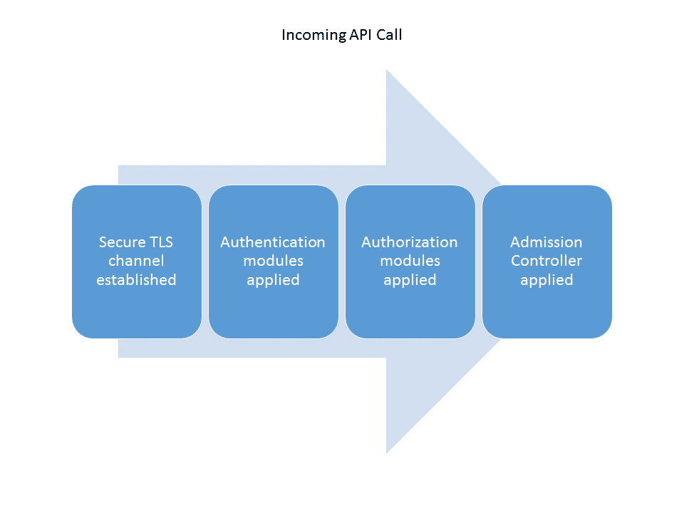
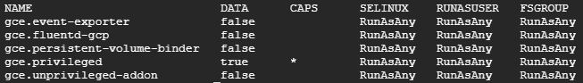
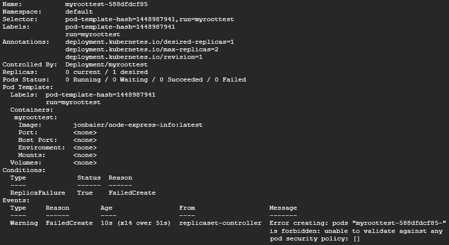

# 集群认证、授权和容器安全

本章将讨论容器安全的基础知识，从容器运行时级别到主机本身。我们将讨论如何将这些概念应用到 Kubernetes 集群中运行的工作负载，并探讨一些与运行 Kubernetes 集群相关的安全问题和实践。

本章将讨论以下主题：

+   基本容器安全

+   容器镜像安全与持续漏洞扫描

+   Kubernetes 集群安全

+   Kubernetes secrets

# 容器安全基础

容器安全是一个深奥的领域，本身就可以写成一本书。话虽如此，我们将覆盖一些高层次的关注点，并为你提供一个起点，让你开始思考这个领域。

在*第一章*，*Kubernetes 简介*中的*容器简要概述*部分，我们查看了 Linux 内核中一些核心的隔离功能，这些功能使容器技术成为可能。理解容器如何工作是掌握管理容器时各种安全问题的关键。

深入探讨的好资料是*NCC 的白皮书*，*理解与强化 Linux 容器*。在*第七部分*，该论文探讨了容器部署中各种攻击向量的关注点，我将在此进行总结。

# 保持容器隔离

在前一节提到的论文中，讨论的最明显的一个特性是逃脱容器隔离/虚拟化的构造。现代容器实现通过使用命名空间来隔离进程，并允许控制容器可用的 Linux 功能，从而防止此类逃脱。此外，越来越多地采用对容器环境的安全默认配置。例如，Docker 默认只启用一小部分功能。网络也是逃脱的一个途径，由于大多数现代容器设置中有多种网络选项，这可能会非常具有挑战性。

论文中讨论的下一个领域是两个容器之间的攻击。*用户*命名空间模型在这里为我们提供了额外的保护，通过将容器内的 root 用户映射到主机机器上的低权限用户。网络仍然是一个问题，这需要在选择和实施容器网络解决方案时进行适当的谨慎和关注。

容器内部的攻击是另一种攻击向量，和之前的关注点一样，命名空间和网络在这里是保护的关键。另一个至关重要的方面是应用程序安全。代码仍然需要遵循安全编码实践，并且软件应该保持最新并定期打补丁。最后，容器镜像的高效性有一个附加好处——减少攻击面。镜像应当仅包含必要的包和软件。

# 资源耗尽和调度安全

类似于**拒绝服务**（**DoS**）攻击，我们在计算领域的其他方面也见过资源耗尽的现象，这在容器世界中同样是一个重要问题。虽然 cgroups 在 CPU、内存和磁盘使用等资源上提供了一些限制，但资源耗尽仍然是一个有效的攻击途径。像 Docker 这样的工具提供了对 cgroups 限制的默认设置，而 Kubernetes 也提供了可以施加在集群中容器组上的额外限制。理解这些默认设置并根据你的部署进行调整非常重要。

虽然 Linux 内核和支持容器的特性为我们提供了一定程度的隔离，但它们对于 Linux 操作系统来说还是相对较新的功能。因此，它们仍然存在一些自身的漏洞和缺陷。内置的能力和命名空间机制可能存在问题，并且这些问题在进行安全容器操作时需要被追踪。

NCC 文档中最后提到的一个领域是容器管理层本身的攻击。Docker 引擎、镜像仓库和调度工具都是重要的攻击载体，在制定策略时应考虑到这些因素。我们将在接下来的章节中更深入地讨论如何解决仓库和 Kubernetes 作为调度层的问题。

如果你有兴趣了解更多关于 Docker 实现的具体安全特性，可以查看这里：[`docs.docker.com/engine/security/security/`](https://docs.docker.com/engine/security/security/)。

# 镜像仓库

漏洞管理是任何现代 IT 操作的关键组成部分。零日漏洞在不断增加，即使是有补丁的漏洞，修复起来也可能相当繁琐。首先，应用程序的所有者必须了解他们的漏洞和潜在的修复措施。然后，这些补丁必须集成到系统和代码中，通常这需要额外的部署或维护窗口。即使有漏洞的可视化，修复通常也会滞后，通常需要大型组织几个月的时间才能进行修补。

尽管容器极大地改善了应用程序更新和减少停机时间的过程，但在漏洞管理方面仍然存在一个固有的挑战。特别是因为攻击者只需暴露一个这样的漏洞，因此任何不到 100%的系统修补都可能存在被攻破的风险。

所需的是一个更快速的反馈循环来解决漏洞问题。持续扫描并与软件部署生命周期紧密结合，是加速漏洞信息处理和修复的关键。幸运的是，这正是最新的容器管理和安全工具中正在构建的方法。

# 持续的漏洞扫描

一个在这一领域出现的开源项目是 **clair**。clair 是一个用于静态分析 appc ([`github.com/appc/spec`](https://github.com/appc/spec)) 和 Docker ([`github.com/moby/moby/blob/master/image/spec/v1.md`](https://github.com/moby/moby/blob/master/image/spec/v1.md)) 容器漏洞的开源项目。

你可以通过以下链接访问 clair：[`github.com/coreos/clair`](https://github.com/coreos/clair)。

clair 会扫描你的代码以检查 **常见漏洞和暴露** (**CVE**) 。它可以集成到你的 CI/CD 管道中，并在新的构建响应时运行。如果发现漏洞，可以作为反馈进入管道，甚至停止部署并使构建失败。这迫使开发人员在正常发布过程中意识到并修复漏洞。

clair 可以与多个容器镜像仓库和 CI/CD 管道集成。

clair 甚至可以在 Kubernetes 上部署：[`github.com/coreos/clair/blob/master/Documentation/running-clair.md#kubernetes-helm`](https://github.com/coreos/clair/blob/master/Documentation/running-clair.md#kubernetes-helm)。

clair 也被用作 CoreOS 的 Quay 镜像仓库中的扫描机制。Quay 提供了许多企业功能，包括持续漏洞扫描 ([`quay.io/`](https://quay.io/))。

Docker Hub 和 Docker Cloud 都支持安全扫描。同样，推送到仓库的容器会自动扫描 CVE，并在发现漏洞时发送通知。此外，还会对代码进行二进制分析，匹配组件的签名与已知版本的签名。

还有许多其他扫描工具也可以用来扫描你的镜像仓库，包括 OpenSCAP、Twistlock、Aqua Sec 等等。

# 镜像签名与验证

无论你是在内部使用私有镜像仓库，还是使用像 Docker Hub 这样的公共仓库，了解你只运行开发人员编写的代码非常重要。恶意代码或中间人攻击下载的潜在风险，是保护容器镜像时必须考虑的重要因素。

因此，rkt 和 Docker 都支持签名镜像的能力，并验证内容未发生变化。发布者可以在将镜像推送到仓库时使用密钥进行签名，用户则可以在客户端下载时验证客户端的签名。

这是来自 rkt 文档的内容：

<q>"在执行远程获取的 ACI 之前，rkt 将根据 ACI 创建者生成的附加签名对其进行验证。</q>

欲了解更多信息，请访问以下链接：

+   [`github.com/rkt/rkt/blob/master/Documentation/subcommands/trust.md`](https://github.com/rkt/rkt/blob/master/Documentation/subcommands/trust.md)

+   [`github.com/rkt/rkt/blob/master/Documentation/signing-and-verification-guide.md`](https://github.com/rkt/rkt/blob/master/Documentation/signing-and-verification-guide.md)[ ](https://coreos.com/rkt/docs/latest/signing-and-verification-guide.html)

以下内容摘自 Docker 文档：

<q>“内容信任使你能够验证通过任何通道从注册中心接收到的所有数据的完整性和发布者。”</q>

欲了解更多信息，请访问[`docs.docker.com/engine/security/trust/content_trust/`](https://docs.docker.com/engine/security/trust/content_trust/)。 [](https://docs.docker.com/engine/security/trust/content_trust/) 以下内容摘自 Docker Notary GitHub 页面：

<q>“Notary 项目包括一个服务器和一个客户端，用于运行和与受信的集合进行交互。”</q>

欲了解更多信息，请访问 [`github.com/docker/notary`](https://github.com/docker/notary)。

# Kubernetes 集群安全

Kubernetes 在其最新版本中继续增加了许多安全功能，并拥有一套完善的控制点，可以在你的集群中使用——从安全节点通信到 pod 安全，甚至敏感配置数据的存储。

# 安全 API 调用

每次 API 调用时，Kubernetes 都会应用一系列安全控制。这个安全生命周期如下图所示：



API 调用生命周期

在建立安全的 TLS 通信后，API 服务器会经过授权和身份验证。最后，申请会在到达 API 服务器之前，经过一个入站控制器循环处理。

# 安全节点通信

Kubernetes 支持在 API 服务器和任何客户端之间使用安全通信通道，包括节点本身。无论是图形界面还是像 `kubectl` 这样的命令行工具，我们都可以使用证书与 API 服务器进行通信。因此，API 服务器是集群中任何变更的核心交互点，必须加以保护。

在 GCE 等部署环境中，每个节点上的 `kubelet` 默认会进行安全通信部署。此设置使用 TLS 引导和新的证书 API 来通过 TLS 客户端证书与 API 服务器建立安全连接，并使用 **证书颁发机构** (**CA**) 集群。

# 授权和身份验证插件

Kubernetes 中用于身份验证和授权的插件机制仍在开发中。它们已经取得了很大进展，但仍有一些插件处于测试阶段，且增强功能仍在开发中。这里还有一些与这些功能集成的第三方提供商，因此在构建强化策略时请考虑到这一点。

目前，认证支持令牌、密码和证书形式，并计划在后续阶段添加插件功能。支持 OpenID Connect 令牌，并且提供了几个第三方实现，如 CoreOS 的 Dex 和 Cloud Foundry 的用户帐户和认证。

授权目前已经支持三种模式。**基于角色的访问控制** (**RBAC**) 模式在 1.8 版本中已正式发布，并将基于角色的标准认证模型引入 Kubernetes。**基于属性的访问控制** (**ABAC**) 长期以来一直得到支持，并允许用户通过文件中的属性定义权限。

此外，还支持 Webhook 机制，它允许通过 REST Web 服务调用与第三方授权进行集成。最后，我们还提供了新的节点授权方法，根据节点运行的 Pods 授予 kubelet 权限。

您可以通过以下链接了解更多关于各个领域的内容：

+   [`kubernetes.io/docs/admin/authorization/`](http://kubernetes.io/docs/admin/authorization/)

+   [`kubernetes.io/docs/admin/authentication/`](http://kubernetes.io/docs/admin/authentication/)

+   [`kubernetes.io/docs/reference/access-authn-authz/node/`](https://kubernetes.io/docs/reference/access-authn-authz/node/)

# 准入控制器

Kubernetes 还提供了一种机制来集成，并以额外的验证作为最后一步。这可以采取镜像扫描、签名检查或任何能够以指定方式响应的形式。

当 API 调用被发出时，钩子会被调用，服务器可以进行验证。准入控制器还可以用于转换请求，并添加或更改原始请求。一旦操作执行完毕，便会发送一个响应，指示 Kubernetes 允许或拒绝该调用。

如前一节所提到的，这对于验证或测试镜像尤其有帮助。`ImagePolicyWebhook` 插件提供了一种准入控制器，允许与额外的镜像检查进行集成。

欲了解更多信息，请访问以下文档中的“使用准入控制器”页面：[`kubernetes.io/docs/admin/admission-controllers/`](https://kubernetes.io/docs/admin/admission-controllers/)。

# RBAC

如本章前面提到的，Kubernetes 现在已将 RBAC 作为集群内授权的核心组件。Kubernetes 为这种控制提供了两种级别。首先是 *ClusterRole*，它提供对集群范围内资源的授权。这对于跨多个团队、产品或集群范围的资源（如底层集群节点）执行访问控制非常有用。其次是 *Role*，它仅提供对特定命名空间内资源的访问。

一旦你有了一个角色，你需要一种方式来为用户提供该角色的成员身份。这些被称为*绑定*，我们有*ClusterRoleBinding*和*RoleBinding*。与角色本身一样，前者用于集群范围的访问，而后者则用于特定命名空间内的应用。

本书不会深入讲解 RBAC 的细节，但这是你在准备生产环境部署时需要探索的内容。下一节中讨论的*PodSecurityPolicy*通常利用 Roles 和 RoleBindings 来控制每个用户可以访问哪些策略。

有关更多信息，请参阅此文档：[`kubernetes.io/docs/reference/access-authn-authz/rbac/`](https://kubernetes.io/docs/reference/access-authn-authz/rbac/)。

# Pod 安全策略和上下文

Kubernetes 安全工具包中的最新功能之一是 Pod 安全策略和上下文。这些功能允许用户控制容器进程和附加卷的用户和组，限制使用主机网络或命名空间，甚至将根文件系统设置为只读。此外，我们还可以限制可用的功能，并为每个 Pod 中容器应用的标签设置 SELinux 选项。

除了 SELinux，Kubernetes 还通过注释增加了对在 Pod 中使用 AppArmor 的 beta 支持。有关更多信息，请参考以下文档页面：[`kubernetes.io/docs/admin/apparmor/`](https://kubernetes.io/docs/admin/apparmor/)。

PodSecurityPolicies 是通过我们在本书中早些时候提到的准入控制器来强制执行的。默认情况下，Kubernetes 并没有启用 PodSecurityPolicy，因此，如果你有一个正在运行的 GKE 集群，你可以尝试以下操作：

```
$ kubectl get psp
```

你应该看到`'No resources found.'`，假设你还没有启用它们。

让我们通过使用前几章中的 Docker 镜像来尝试一个示例。如果我们在没有应用 PodSecurityPolicy 的集群上使用以下`run`命令，它将顺利运行：

```
$ kubectl run myroottest --image=jonbaier/node-express-info:latest
```

接下来，使用`kubectl get pods`命令，过一分钟左右，我们应该能在列表中看到以`myroottest`开头的 Pod。

在继续之前，请使用以下代码清理一下：

```
$ kubectl delete deployment myroottest 
```

# 启用 PodSecurityPolicies

现在，让我们在一个可以利用 PodSecurityPolicies 的集群上尝试。如果你使用的是 GKE，创建一个启用了 PodSecurityPolicy 的集群非常简单。请注意，你需要启用 Beta API：

```
$ gcloud beta container clusters create [Cluster Name] --enable-pod-security-policy --zone=[Zone To Deply Cluster]
```

如果你有一个现有的 GKE 集群，你可以使用类似于前面命令的方式启用它。只需将`create`关键字替换为`update`。

对于使用 `kube-up` 创建的集群，像我们在第一章《Kubernetes 入门》中看到的那样，*Kubernetes*，您需要在 API 服务器上启用准入控制器。查看此处以获取更多信息：[`kubernetes.io/docs/concepts/policy/pod-security-policy/#enabling-pod-security-policies`](https://kubernetes.io/docs/concepts/policy/pod-security-policy/#enabling-pod-security-policies)。

一旦启用 PodSecurityPolicy，您可以使用以下代码查看已应用的策略：

```
$ kubectl get psp
```



GKE 默认的 Pod 安全策略

您会注意到 GKE 已经定义了一些预定义的策略。您可以使用以下代码探索这些策略的详细信息及其用于创建这些策略的 YAML 文件：

```
$ kubectl get psp/[PSP Name] -o yaml
```

需要注意的是，PodSecurityPolicies 与 Kubernetes 的 RBAC 功能协同工作。GKE 定义了一些默认角色、角色绑定和命名空间。因此，我们在与 Kubernetes 交互时会看到不同的行为。例如，在 GCloud Shell 中使用`kubectl`时，您可能以集群管理员身份发送命令，因此可以访问所有策略，包括 `gce.privileged`。然而，使用之前的`kubectl run`命令会通过 kube-controller-manager 调用 Pods，这将受到绑定到其角色的策略的限制。因此，如果您仅使用 `kubectl` 创建一个 Pod，它将顺利创建，但通过使用 `run` 命令时，我们将受到限制。

继续使用我们之前的 `kubectl run` 方法，让我们尝试与前述相同的部署：

```
$ kubectl run myroottest --image=jonbaier/node-express-info:latest
```

现在，如果我们接着使用`kubectl get pods`，将不会看到任何以`myroottest`为前缀的 Pods。我们可以通过描述我们的部署进一步调查：

```
$ kubectl describe deployment myroottest
```

通过使用前述命令输出中列出的副本集名称，我们可以获取失败的详细信息。运行以下命令：

```
$ kubectl describe rs [ReplicaSet name from deployment describe]
```

在底部的事件下，您将看到以下 Pod 安全策略验证错误：



Replica set Pod 安全策略验证错误

再次强调，因为`run`命令使用了控制器管理器，而该角色没有绑定允许使用现有**PodSecurityPolicies**，所以我们无法运行任何 Pods。

理解安全地运行容器不仅仅是管理员添加约束的任务非常重要。必须与开发人员合作，确保他们正确地创建镜像。

您可以在源代码中找到所有 PodSecurityPolicies 的可能参数，但为了方便起见，我已创建以下表格。您可以在我的新站点 [`www.kubesheets.com`](http://www.kubesheets.com) 上找到更多这样的实用查询：

| **参数** | **类型** | **描述** | **是否必需** |
| --- | --- | --- | --- |
| `Privileged` | `bool` | 允许或禁止以特权模式运行 Pod。 | 否 |
| `DefaultAddCapabilities` | `[]v1.Capaility` | 定义一个默认的能力集，这些能力会添加到容器中。如果 pod 指定了丢弃的能力集，这里添加的能力将被覆盖。值是 POSIX 能力的字符串，去掉前缀 `CAP_`。例如，`CAP_SETUID` 应为 `SETUID` ([`man7.org/linux/man-pages/man7/capabilities.7.html`](http://man7.org/linux/man-pages/man7/capabilities.7.html))。 | 否 |
| `RequiredDropCapabilities` | `[]v1.Capaility` | 定义一个必须从容器中丢弃的能力集。Pod 不能指定这些能力中的任何一个。值是 POSIX 能力的字符串，去掉前缀 `CAP_`。例如，`CAP_SETUID` 应为 `SETUID` ([`man7.org/linux/man-pages/man7/capabilities.7.html`](http://man7.org/linux/man-pages/man7/capabilities.7.html))。 | 否 |
| `AllowedCapabilities` | `[]v1.Capaility` | 定义一个允许的能力集，可以添加到容器中。Pod 可以指定这些能力中的任何一个。值是 POSIX 能力的字符串，去掉前缀 `CAP_`。例如，`CAP_SETUID` 应为 `SETUID` ([`man7.org/linux/man-pages/man7/capabilities.7.html`](http://man7.org/linux/man-pages/man7/capabilities.7.html))。 | 否 |
| `Volumes` | `[]string` | 此列表定义可以使用哪些卷。若要支持所有类型，请保持为空 ([`github.com/kubernetes/kubernetes/blob/release-1.5/pkg/apis/extensions/v1beta1/types.go#L1127`](https://github.com/kubernetes/kubernetes/blob/release-1.5/pkg/apis/extensions/v1beta1/types.go#L1127))。 | 否 |
| `HostNetwork` | `bool` | 允许或不允许 pod 使用主机网络。 | 否 |
| `HostPorts` | `[]HostPortRange` | 允许我们限制可以暴露的主机端口。 | 否 |
| `HostPID` | `bool` | 允许或不允许 pod 使用主机 PID。 | 否 |
| `HostIPC` | `bool` | 允许或不允许 pod 使用主机 IPC。 | 否 |
| `SELinux` | `SELinuxStrategyOptions` | 将其设置为以下策略选项之一，如此处定义：[`kubernetes.io/docs/concepts/policy/pod-security-policy/#selinux`](https://kubernetes.io/docs/concepts/policy/pod-security-policy/#selinux)。 | 是 |
| `RunAsUser` | `RunAsUserStrategyOptions` | 将其设置为以下策略选项之一，如此处定义：[`kubernetes.io/docs/concepts/policy/pod-security-policy/#users-and-groups`](https://kubernetes.io/docs/concepts/policy/pod-security-policy/#users-and-groups)。 | 是 |
| `SupplementalGroups` | `SupplementalGroupsStrategyOptions` | 将其设置为以下策略选项之一，如此处定义：[`kubernetes.io/docs/concepts/policy/pod-security-policy/#users-and-groups`](https://kubernetes.io/docs/concepts/policy/pod-security-policy/#users-and-groups) | 是 |
| `FSGroup` | `FSGroupStrategyOptions` | 将其设置为此处定义的策略选项之一：[`kubernetes.io/docs/user-guide/pod-security-policy/#strategies`](https://kubernetes.io/docs/user-guide/pod-security-policy/#strategies) | 是 |
| `ReadOnlyRootFilesystem` | `bool` | 将此设置为 `true` 将拒绝该 Pod 或强制其以只读根文件系统运行。 | 否 |
| `allowedHostPaths` | `[]AllowedHostPath` | 提供可以在卷中使用的主机路径的白名单。 | 否 |
| `allowedFlexVolumes` | `[]AllowedFlexVolume` | 提供可以挂载的 Flex Volumes 白名单。 | 否 |
| `allowPrivilegeEscalation` | `bool` | 控制是否可以使用 `setuid` 来改变进程运行的用户。默认值为 `true`。 | 否 |
| `defaultAllowPrivilegeEscalation` | `bool` | 设置 `allowPrivilegeEscalation` 的默认值。 | 否 |

# 其他考虑事项

除了我们刚刚回顾的功能外，Kubernetes 还有许多其他构造体应纳入整个集群硬化过程。在本书早些时候，我们介绍了命名空间，它为多租户提供了逻辑隔离。虽然命名空间本身并不隔离实际的网络流量，但一些网络插件（如 Calico 和 Canal）为网络策略提供了额外的功能。我们还介绍了可以为每个命名空间设置的配额和限制，这些配额和限制应该用于防止单个租户或项目在集群中消耗过多资源。

# 保护敏感应用数据（Secrets）

有时，我们的应用程序需要保存敏感信息。这些信息可能是登录数据库或服务的凭证或令牌。将这些敏感信息存储在镜像本身中是需要避免的。在这里，Kubernetes 提供了一个通过 Secrets 进行管理的解决方案。

Secrets 为我们提供了一种存储敏感信息的方法，避免将明文版本包含在资源定义文件中。Secrets 可以挂载到需要它们的 Pod 上，然后在 Pod 内部作为文件访问，文件内容为敏感值。或者，你也可以通过环境变量暴露这些 secrets。

由于 Kubernetes 仍然依赖于明文存储在 etcd 中，你可能希望探索与更成熟的秘密存储库（如 Hashicorp 的 Vault）的集成。甚至有一个 GitHub 项目用于集成：[`github.com/Boostport/kubernetes-vault`](https://github.com/Boostport/kubernetes-vault)。

我们可以轻松地通过 YAML 或命令行创建一个 secret。Secrets 需要进行 base64 编码，但如果我们使用 `kubectl` 命令行工具，这一编码过程会为我们自动完成。

让我们从以下 Secret 开始：

```
$ kubectl create secret generic secret-phrases --from-literal=quiet-phrase="Shh! Dont' tell"
```

我们可以使用以下命令检查 secret：

```
$ kubectl get secrets
```

现在我们已经成功创建了机密，接下来让我们创建一个可以使用该机密的 Pod。机密在 Pod 中通过附加的卷进行消费。在以下的`secret-pod.yaml`文件中，您会注意到我们使用`volumeMount`将机密挂载到容器中的一个文件夹：

```
apiVersion: v1
kind: Pod
metadata:
  name: secret-pod
spec:
  containers:
  - name: secret-pod
    image: jonbaier/node-express-info:latest
    ports:
    - containerPort: 80
      name: web
    volumeMounts:
      - name: secret-volume
        mountPath: /etc/secret-phrases
  volumes:
  - name: secret-volume
    secret:
      secretName: secret-phrases
```

使用`kubectl create -f secret-pod.yaml`创建此 Pod。创建后，我们可以通过`kubectl exec`进入 Pod 并更改目录到我们在 Pod 定义中设置的`/etc/secret-phrases`文件夹。列出该目录会显示一个文件，文件名是我们之前创建的机密的名称：

```
$ kubectl exec -it secret-pod bash
$ cd /etc/secret-phrases
$ ls
```

如果我们显示其内容，应该看到我们之前编码的短语，`Shh! Dont' tell`：

```
$ cat quiet-phrase
```

通常，这会用于数据库或服务的用户名和密码，或任何敏感的凭据和配置信息。

请记住，机密信息仍处于初期阶段，但它们是生产操作中至关重要的组成部分。未来版本计划进行多项改进。目前，机密信息仍然以明文形式存储在 etcd 服务器中。然而，机密结构确实允许我们控制哪些 Pods 可以访问它，并且它将信息存储在 tmpfs 中，但不会为每个 Pod 存储静态数据。您可以限制访问 etcd 的用户，并在停用服务器时执行额外的清除操作，但对于准备投入生产的系统，您可能需要更多的保护措施。

# 总结

在本章中，我们回顾了基本的容器安全性和一些关键的考虑领域。我们还简单讨论了基本的镜像安全性和持续的漏洞扫描。随后，我们探讨了 Kubernetes 的整体安全特性，包括存储敏感配置信息的机密、API 调用的安全性，甚至为在集群中运行的 Pods 设置安全策略和上下文。

现在，您应该有一个坚实的起点来保护您的集群并朝着生产环境迈进。为此，下一章将介绍朝生产环境迈进的整体策略，并将讨论一些第三方供应商提供的工具，以填补空白并在过程中提供帮助。

# 问题

+   哪个组件可以作为管理的中心点，并防止漏洞被释放？

+   在 Kubernetes 集群中，有哪三种授权方法？

+   PodSecurityPolicy 中的哪个参数禁止运行特权容器？

+   如何列出您在集群中有权访问的所有机密信息？

# 深入阅读

+   [`www.nccgroup.trust/globalassets/our-research/us/whitepapers/2016/april/ncc_group_understanding_hardening_linux_containers-10pdf/`](https://www.nccgroup.trust/us/our-research/understanding-and-hardening-linux-containers/)

+   [`github.com/moby/moby/blob/89dac8427e7366cbd6a47e713fe8f445198ca3d4/oci/defaults.go#L14`](https://github.com/moby/moby/blob/89dac8427e7366cbd6a47e713fe8f445198ca3d4/oci/defaults.go#L14)

+   [`github.com/kubernetes/kubernetes/blob/2d7b92ee743de20d17406003e463a829a0db5a51/pkg/apis/policy/types.go#L145`](https://github.com/kubernetes/kubernetes/blob/2d7b92ee743de20d17406003e463a829a0db5a51/pkg/apis/policy/types.go#L145)
