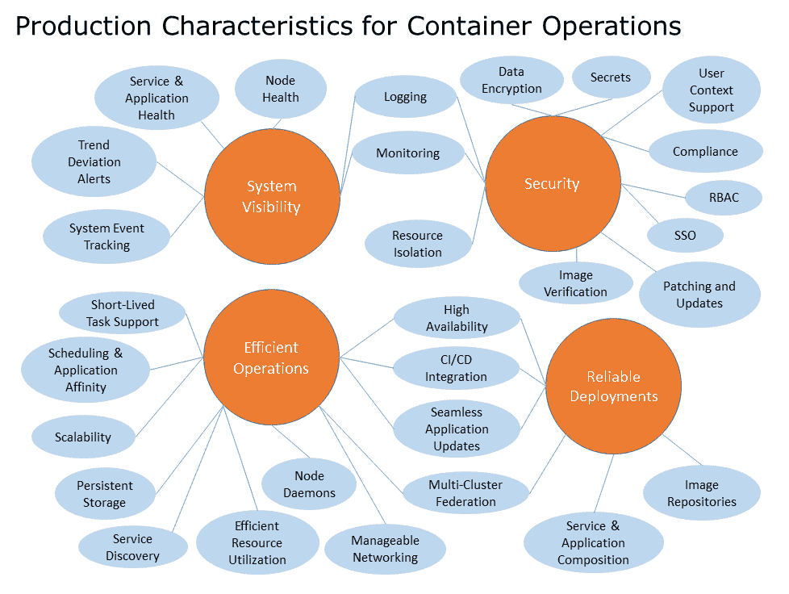

# 加固 Kubernetes

本章我们将讨论迁移到生产环境时的注意事项。我们还将向你展示一些有用的工具和第三方项目，这些工具和项目在整个 Kubernetes 社区中可用，并告诉你可以去哪里获得更多帮助。

本章将讨论以下主题：

+   生产特性

+   从 Kubernetes 生产环境中学到的经验

+   加固集群

+   Kubernetes 生态系统

+   哪里可以获得帮助？

# 准备好进入生产环境

到目前为止，本书我们已经走过了许多使用 Kubernetes 的典型操作。如我们所见，K8s 提供了多种特性和抽象，简化了容器部署日常管理的负担。

有许多特性定义了适用于容器的生产就绪系统。下图提供了生产就绪集群的主要关注点的高层次视图。这并不是一个详尽无遗的列表，但它旨在为进入生产操作提供一些可靠的基础：



容器操作的生产特性

我们已经看到 Kubernetes 的核心概念和抽象如何解决其中的一些问题。服务抽象提供了内建的服务发现和健康检查功能，既适用于服务层，也适用于应用层。我们还通过复制控制器和部署构造获得了无缝的应用更新和可扩展性。所有的核心抽象，如服务、复制控制器、副本集和 Pod，都与核心调度和亲和规则集协同工作，提供了简便的服务和应用组合。

Kubernetes 内建支持多种持久存储选项，网络模型提供了可管理的网络操作，并可以与其他第三方提供商合作。我们还简要了解了与一些市场上流行工具的 CI/CD 集成。

此外，我们还内建了系统事件跟踪，并且与主要的云服务提供商一起，提供了开箱即用的监控和日志记录设置。我们还看到如何将其扩展到第三方提供商，如 Stackdriver 和 Sysdig。这些服务还涵盖了节点的整体健康状况和主动的趋势偏离警报。

核心构造还帮助我们解决了应用和服务层的高可用性问题。调度器可以与自动扩展机制一起使用，在节点级别提供这一功能。然后，还支持使 Kubernetes 主节点本身实现高可用性。在第十二章《集群联邦与多租户》中，我们简要回顾了新联邦功能，这些功能预示着未来的多云和多数据中心模型。

最后，我们探索了一种新的操作系统，它为我们提供了一个轻量的基础，可以构建在其上，并提供安全的更新机制用于修补和更新。这个轻量的基础与调度相结合，可以帮助我们实现高效的资源利用。此外，我们还关注了一些强化的安全问题，并探索了可用的镜像信任和验证工具。安全性是一个广泛的话题，针对这个话题本身就有能力矩阵。

# 准备好，开始吧

尽管仍然存在一些漏洞，但剩余的各种安全和操作问题正在被第三方公司积极解决，正如我们将在接下来的章节中看到的那样。展望未来，Kubernetes 项目将继续发展，围绕 K8s 和 Docker 的项目和合作伙伴社区也将不断壮大。社区正在以惊人的速度弥补剩余的空白。

# 从生产中获得的经验教训

Kubernetes 已经存在足够长的时间，现在有很多公司在运行 Kubernetes。在我们的日常工作中，我们看到 Kubernetes 在多个行业的生产环境中运行，并且在各种配置下使用。让我们来探索一下业界在提供面向客户的工作负载时的做法。从一个高层次的角度来看，有几个关键领域：

+   确保在集群中设置限制。

+   为你的应用程序使用适当的工作负载类型。

+   给所有东西打标签！标签非常灵活，可以包含很多信息，帮助识别对象、路由流量或决定放置位置。

+   不要使用默认值。

+   调整 Kubernetes 核心组件的默认值。

+   使用负载均衡器，而不是直接在节点的端口上暴露服务。

+   构建你的基础设施即代码，并使用诸如 CloudFormation 或 Terraform 之类的预配置工具，以及 Chef、Ansible 或 Puppet 之类的配置工具。

+   在你还没有建立 Kubernetes 的专业知识之前，考虑不要在生产集群中运行有状态的工作负载。

+   调查更高功能的模板语言，以维护集群的状态。在接下来的章节中，我们将探索几种不可变基础设施的选项。

+   在可能的情况下，使用 RBAC、最小特权原则和关注点分离。

+   所有集群间的通信都使用启用 TLS 的方式。你可以为集群中的`kubelet`通信设置 TLS 和证书轮换。

+   在你还不熟悉 Kubernetes 的管理之前，构建大量的小型集群。这虽然带来更多的操作开销，但它能帮助你更快地进入深水区，看到更多的失败，体验更多的运维负担。

+   随着你对 Kubernetes 的熟练掌握，构建更大的集群，使用命名空间、网络分段和授权功能将集群拆分成多个部分。

+   一旦你管理了几个大型集群，就使用`kubefed`进行管理。

+   如果可能，使用云服务提供商内建的高可用性功能，在 Kubernetes 平台上运行。例如，在 GCP 上使用 GKE 运行区域集群。此功能将你的节点分布在区域中的多个可用区。这使得系统能够抵御单一区域的故障，并为主节点的零停机时间升级提供概念性的构建模块。

在接下来的部分，我们将更详细地探讨这些概念之一——限制。

# 设置限制

如果你之前做过容器相关的工作，你会知道，设置容器资源限制是容器管理中最先和最容易设置的事项之一，通常形式为以下几种指标：

+   CPU

+   内存

+   请求

你可能熟悉使用 Docker 的 CLI 来设置资源的运行时限制，指定标志以限制这些项目及其他：

```
docker run --it --cpu-rt-runtime=950000 \
 --ulimit rtprio=99 \
 --memory=1024m \
 --cpus=".5"
 alpine /bin/sh
```

在这里，我们设置了一个运行时参数，创建了一个`ulimit`，并设置了内存和 CPU 配额。在 Kubernetes 中，故事稍有变化，因为你可以将这些限制应用于特定的命名空间，这使你可以根据集群的域来定义你的限制。你有四个主要的参数来在 Kubernetes 中设置资源限制：

```
spec.containers[].resources.limits.cpu
spec.containers[].resources.requests.cpu
spec.containers[].resources.limits.memory
spec.containers[].resources.requests.memory
```

# 调度限制

当你创建一个带有内存限制的 Pod 时，Kubernetes 会寻找一个带有正确标签和选择器的节点，并确保该节点拥有 Pod 所需的足够资源类型，包括 CPU 和内存。Kubernetes 负责确保一个节点上所有 Pod 的总内存请求不小于该节点的总资源。这有时会导致意想不到的结果，因为即使 Pod 的实际利用率较低，节点的容量限制也可能已经达到。这是系统的设计方式，旨在适应不同的负载水平。

你可以查看 Pod 日志，找出何时发生了这个问题：

```
$ kubectl describe pod web| grep -C 3 Events
Events:
FirstSeen LastSeen Count From Subobject PathReason Message
74s 15s 2 {scheduler } FailedScheduling Failed for reason PodExceedsFreeCPU and possibly others
```

你可以通过删除不需要的 Pod，确保你的 Pod 整体大小不超过任何一个可用节点，或者简单地为集群添加更多资源来解决这些问题。

# 内存限制示例

让我们通过一个例子来演示。首先，我们将创建一个命名空间来容纳我们的内存限制：

```
master $ kubectl create namespace low-memory-area
namespace "low-memory-area" created
```

一旦我们创建了命名空间，我们可以创建一个设置`LimitRange`对象的文件，这将允许我们强制执行内存限制和请求的默认值。创建一个名为`memory-default.yaml`的文件，内容如下：

```
apiVersion: v1
kind: LimitRange
metadata:
 name: mem-limit-range
spec:
 limits:
 - default:
     memory: 512Mi
   defaultRequest:
     memory: 256Mi
   type: Container
```

现在，我们可以在该命名空间中创建它：

```
master $ kubectl create -f test.ym --namespace=low-memory-area
limitrange "mem-limit-range" created
```

让我们在低内存区域命名空间中创建一个没有内存限制的 Pod，看看会发生什么。

创建以下 `low-memory-pod.yaml` 文件：

```
apiVersion: v1
kind: Pod
metadata:
 name: low-mem-demo
spec:
 containers:
 - name: low-mem-demo
   image: redis
```

然后，我们可以使用这个命令来创建 Pod：

```
kubectl create -f low-memory-pod.yaml --namespace=low-memory-area
pod "low-mem-demo" created
```

让我们看看是否已经将我们的资源限制添加到容器的 Pod 配置中，而无需在 Pod 配置中显式指定。注意内存限制已经生效！我们已删除了一些信息输出以提高可读性：

```
kubectl get pod low-mem-demo --output=yaml --namespace=low-memory-area
```

以下是前面代码的输出：

```
apiVersion: v1
kind: Pod
metadata:
 annotations:
 kubernetes.io/limit-ranger: 'LimitRanger plugin set: memory request for container
 low-mem-demo; memory limit for container low-mem-demo'
 creationTimestamp: 2018-09-20T01:41:40Z
 name: low-mem-demo
 namespace: low-memory-area
 resourceVersion: "1132"
 selfLink: /api/v1/namespaces/low-memory-area/pods/low-mem-demo
 uid: 52610141-bc76-11e8-a910-0242ac11006a
spec:
 containers:
 - image: redis
 imagePullPolicy: Always
 name: low-mem-demo
 resources:
 limits:
 memory: 512Mi
 requests:
 memory: 256Mi
 terminationMessagePath: /dev/termination-log
 terminationMessagePolicy: File
 volumeMounts:
 - mountPath: /var/run/secrets/kubernetes.io/serviceaccount
 name: default-token-t6xqm
 readOnly: true
 dnsPolicy: ClusterFirst
 nodeName: node01
 restartPolicy: Always
 schedulerName: default-scheduler
 securityContext: {}
 serviceAccount: default
 serviceAccountName: default
 terminationGracePeriodSeconds: 30
 tolerations:
 - effect: NoExecute
 key: node.kubernetes.io/not-ready
 operator: Exists
 tolerationSeconds: 300
 - effect: NoExecute
 key: node.kubernetes.io/unreachable
 operator: Exists
 tolerationSeconds: 300
 volumes:
 - name: default-token-t6xqm
 secret:
 defaultMode: 420
 secretName: default-token-t6xqm
 hostIP: 172.17.1.21
 phase: Running
 podIP: 10.32.0.3
 qosClass: Burstable
 startTime: 2018-09-20T01:41:40Z

```

你可以使用以下命令删除 Pod：

```
Kubectl delete pod low-mem-demo --namespace=low-memory-area
pod "low-mem-demo" delete
```

配置资源限制有很多选项。如果你创建了内存限制，但没有指定默认请求，则请求将设置为最大可用内存，这将与内存限制相对应。看起来会像下面这样：

```
resources:
 limits:
   memory: 4096m
 requests:
   memory: 4096m
```

在具有多样化工作负载和基于 API 的关系的集群中，为你的容器和相应应用程序设置内存限制非常重要，以防止不当行为的应用程序干扰集群。服务之间不会隐式地了解彼此，因此如果你没有正确配置限制，它们非常容易因资源耗尽而出现问题。

# 调度 CPU 约束

让我们来看另一种资源管理类型，即约束。这里我们使用 CPU 维度，探讨如何为命名空间中的给定容器和 Pod 设置可用资源的最大值和最小值。你可能想在 Kubernetes 集群上限制 CPU 的原因有很多：

+   如果你有一个命名空间集群，里面有不同级别的生产和非生产工作负载，你可能想为生产工作负载指定更高的资源限制。你可以允许生产环境使用四核 CPU；将开发、预发布或 UAT 类型的工作负载限制为单个 CPU；或者根据环境需求错开它们。

+   你还可以禁止请求比节点可用 CPU 资源更多的 Pod。如果你在云服务提供商上运行某种类型的机器，你可以确保需要 X 核心的工作负载不会被调度到小于 X 核心的机器上。

# CPU 约束示例

让我们继续创建另一个命名空间来容纳我们的示例：

```
kubectl create namespace cpu-low-area
```

现在，让我们为 CPU 约束设置一个 `LimitRange`，它使用毫核（millicpus）作为度量单位。如果你请求 500 m，那意味着你请求的是 500 毫核或毫 CPU，等同于符号表示法中的 0.5。当你请求 0.5 或 500 m 时，意味着你请求了平台提供的任何形式的半个 CPU（vCPU、核心、超线程、vCore 或 vCPU）。

就像我们之前做的那样，让我们为 CPU 约束创建一个 `LimitRange`：

```
apiVersion: v1
kind: LimitRange
metadata:
 name: cpu-demo-range
spec:
 limits:
 - max:
     cpu: "500m"
   min:
     cpu: "300m"
   type: Container
```

现在，我们可以创建 `LimitRange`：

```
kubectl create -f cpu-constraint.yaml --namespace=cpu-low-area
```

一旦我们创建了 `LimitRange`，就可以检查它了。你会注意到，`defaultRequest` 被指定为与最大值相同，因为我们没有特别指定。Kubernetes 会将 `defaultRequest` 设置为最大值：

```
kubectl get limitrange cpu-demo-range --output=yaml --namespace=cpu-low-area

limits:
- default:
 cpu: 500m
 defaultRequest:
 cpu: 500m
 max:
 cpu: 500m
 min:
 cpu: 300m
 type: Container
```

这是预期的行为。当在此命名空间中进一步调度容器时，Kubernetes 会首先检查 Pod 是否指定了请求和限制。如果没有，它会应用默认值。接着，控制器会确认 CPU 请求是否超过 `LimitRange` 中的下限，即 300 m。此外，它还会检查上限，以确保对象的请求不超过 500 m。

你可以通过查看 Pod 的 YAML 输出再次检查容器约束：

```
kubectl get pod cpu-demo-range --output=yaml --namespace=cpu-low-area

resources:
 limits:
 cpu: 500m
 requests:
 cpu: 300m
```

现在，别忘了删除这个 Pod：

```
kubectl delete pod cpu-demo-range --namespace=cpu-low-area
```

# 集群安全性

让我们看一下在生产中加强集群安全的其他常见建议。这些使用案例涵盖了对集群的有意恶意攻击以及意外误用。让我们看看如何保护集群。

首先，你需要确保对 Kubernetes API 的访问是受控的。鉴于 Kubernetes 中的所有操作都是通过 API 驱动的，我们应该首先保护这个接口。我们可以通过几个设置来控制对该 API 的访问：

+   **加密所有流量**：为了保持通信安全，你应该确保为集群中的 API 通信设置**传输层安全性**（**TLS**）。我们在本书中回顾的多数安装方法都会创建必要的组件证书，但始终由集群操作员负责识别所有可能没有使用更安全设置的本地端口。

+   **认证你的访问**：就像任何大型计算机系统一样，你需要确保用户的身份已经建立。对于小型集群，你可以使用证书或令牌，而对于更大的生产集群，则应使用 OpenID 或 LDAP。

+   **控制访问权限**：在你确定了访问 API 角色的身份后，你需要确保通过 Kubernetes 内置的**基于角色的访问控制** (**RBAC**) 过滤器来传递已认证的访问请求，它帮助操作员通过角色和用户限制控制和访问。有两个授权插件可供使用，分别是节点插件和 RBAC 插件，以及`NodeRestriction`准入插件。需要记住的一个关键点是，随着集群规模的增大，角色粒度应该增大，特别是从非生产环境到生产环境时。

默认情况下，`kubelet`的身份验证是关闭的。你可以通过开启证书轮换来启用`kubelet`的授权/身份验证功能。

你可以在这里阅读更多关于证书轮换的内容：[`kubernetes.io/docs/reference/command-line-tools-reference/kubelet-authentication-authorization/`](https://kubernetes.io/docs/reference/command-line-tools-reference/kubelet-authentication-authorization/)。

我们还可以在运行时修改 Kubernetes 的使用方式：

+   长期在生产环境中使用 Kubernetes 的操作员会将其视为我们之前关于限制和策略讨论的参考点。如前所述，资源配额限制了在命名空间中提供的资源数量，而限制范围则约束了资源的最小和最大尺寸。

+   你可以通过定义安全上下文来确定 Pod 的权限。在这里，你可以指定像特定的 Linux 用户、组、卷挂载访问、是否允许权限提升等设置。

+   你还可以通过使用网络策略来限制对集群逻辑分区的访问。你可以确保某些命名空间对用户不可访问，或者决定用户是否能够设置带有特定负载均衡器配置的服务，或在主机节点上开放端口。

虽然前述的模式对于 Kubernetes 内部的操作非常有用，但在从外部角度保护集群时，你还应该采取一些额外的措施：

+   首先，启用并监控日志！虽然这看起来是显而易见的，但我们常常看到很多问题来自于没有监控日志，或者没有根据日志设置警报的人。另一个提示：不要将日志存储在集群内部！如果你的集群被攻破，日志将成为恶意代理的重要信息来源。

+   确保限制对 etcd 集群的访问。这可以通过设置安全组或防火墙来实现，并确保 etcd 集群节点从基础设施角度具有适当的身份和访问管理。从集群角度来看，确保始终使用 TLS 证书进行身份验证，并使用强身份凭证。在任何情况下，集群中的任何组件都不应具有对整个 etcd 键值空间的读写权限。

+   确保审核 alpha/beta 组件并检查第三方集成。确保你了解启用它时在使用什么，并且知道它启用后会做什么！新兴功能或第三方工具可能会创建攻击面或威胁模型，而你未必了解它们的依赖关系。特别要小心需要在 kube-system 内部执行工作的工具，因为它是集群中特别强大的部分。

+   在 etcd 中加密你的机密数据。这是对任何计算机系统的良好建议，Kubernetes 也不例外。备份同样需要加密，以确保攻击者无法通过检查这些资源来获取集群访问权限。

对于你的生产集群，你还应该做一些事情，如扫描容器镜像、运行 YAML 文件的静态分析、尽可能以非 root 用户身份运行容器，并运行**入侵检测系统**（**IDS**）。当你完成这些设置后，就可以开始探索外部服务网格的功能能力。

# 第三方公司

自 Kubernetes 项目初始发布以来，合作伙伴的生态系统逐渐壮大。我们在前几章中已经看到了 CoreOS、Sysdig 和许多其他公司，但在这个领域中还有许多不同的项目和公司。我们将重点介绍一些可能在你向生产环境过渡时有用的内容。这绝不是一份详尽的列表，仅仅是为了提供一些有趣的起点。

# 私有注册表

在许多情况下，组织不希望将其应用程序和/或知识产权放入公共仓库。对于这种情况，私有仓库解决方案可以帮助安全地将部署整合到底端。

谷歌云提供**Google 容器注册表**，地址是[`cloud.google.com/container-registry/`](https://cloud.google.com/container-registry/)。

Docker 有自己信任的注册表服务，地址是[`www.docker.com/docker-trusted-registry`](https://www.docker.com/docker-trusted-registry)。

Quay 还提供安全的私有仓库、漏洞扫描，并且来自 CoreOS 团队，可以在[`quay.io/`](https://quay.io/)找到。

# Google Kubernetes Engine

谷歌是原始 Kubernetes 项目的主要作者，并且仍然是一个主要贡献者。尽管本书主要集中在我们自己运行 Kubernetes 上，谷歌也通过 Google Cloud Platform 提供完全托管的容器服务。

在**Google Kubernetes Engine**（**GKE**）网站上查找更多信息，地址是[`cloud.google.com/container-engine/`](https://cloud.google.com/container-engine/)。

Kubernetes 将在 GKE 上安装并由谷歌工程师管理。他们还提供私有仓库和与现有私有网络的集成。

你可以通过以下步骤创建你的第一个 GKE 集群：

1.  在 GCP 控制台中，在计算部分点击容器引擎，然后点击容器集群。

1.  如果这是你第一次创建集群，页面中间会有一个信息框。点击创建容器集群按钮。

1.  为你的集群选择一个名称和区域。你还可以选择节点的机器类型（实例大小）和集群中的节点数量（集群大小）。你还会看到一个节点镜像选项，允许你为节点选择基础操作系统和机器镜像。主节点由谷歌团队自己管理和更新。

1.  保留**Stackdriver 日志**和**Stackdriver 监控**的选项。点击创建，几分钟后，你将有一个新的集群可以使用。

1.  你将需要`kubectl`，它包含在 Google SDK 中，来开始使用你的 GKE 集群。有关安装 SDK 的详细信息，请参考第一章，*Kubernetes 简介*。一旦拥有 SDK，我们可以使用[`cloud.google.com/container-engine/docs/before-you-begin#install_kubectl`](https://cloud.google.com/container-engine/docs/before-you-begin#install_kubectl)中概述的步骤配置`kubectl`和 SDK，以适应我们的集群。

# Azure Kubernetes 服务

另一个云托管的产品是微软的 **Azure Kubernetes 服务** (**AKS**)。AKS 非常棒，因为它允许你选择 Docker Swarm、Kubernetes 和 Mesos 等行业标准工具。然后它为你创建一个托管的集群，但使用其中一个工具集作为基础。其优点是，你仍然可以使用该工具的原生 API 和管理工具，但将云基础设施的管理交给 Azure。

你可以在以下链接了解更多关于 ACS 的信息：[`azure.microsoft.com/en-us/services/container-service/`](https://azure.microsoft.com/en-us/services/container-service/)。

# ClusterHQ

ClusterHQ 提供了一种将有状态数据引入容器化应用程序的解决方案。它们提供了 Flocker，这是一个用于管理持久存储卷与容器的工具，以及 FlockerHub，它为您的数据卷提供了一个存储库。

# Portworx

Portworx 是另一个在存储领域的参与者。它提供将持久化存储引入容器的解决方案。此外，它还具备快照、加密，甚至是多云复制等功能。

如需了解更多信息，请参考 Portworx 网站：[`portworx.com/`](https://portworx.com/)。

# Shippable

Shippable 是一个持续集成、持续部署和发布自动化平台，内置支持多种现代容器环境。该产品宣称支持任何语言，并提供统一的打包和测试支持。

如需了解更多信息，请参考 Shippable 网站：[`app.shippable.com/`](https://app.shippable.com/)。

# Twistlock

Twistlock.io 是一款专为容器量身定制的漏洞扫描和硬化工具。它提供了执行策略、根据 CIS 标准进行硬化，并扫描任何流行注册表中的镜像漏洞的能力。它还与流行的 CI/CD 工具和许多编排工具（如 Kubernetes）提供了 RBAC 解决方案的扫描集成。

如需了解更多信息，请参考 Twistlock 网站：[`www.twistlock.com/`](https://www.twistlock.com/)。

# Aqua Sec

Aqua Sec 是另一种安全工具，提供多种功能。包括与流行注册表的镜像扫描、策略执行、用户访问控制以及容器强化等功能。此外，Aqua Sec 还具有网络分段等有趣的功能。

如需了解更多信息，请参考 Aqua 网站：[`www.aquasec.com/`](https://www.aquasec.com/)。

# Mesosphere（Kubernetes on Mesos）

Mesosphere 本身正在围绕开源的 Apache Mesos 项目构建一款商业化支持的产品。Apache Mesos 是一个集群管理系统，提供调度和资源共享，类似于 Kubernetes，但层次更高。该开源项目被多家知名公司使用，如 Twitter 和 Airbnb。

你可以在以下网站找到有关 Mesos OS 项目和 Mesosphere 产品的信息：

+   [`mesos.apache.org/`](http://mesos.apache.org/)

+   [`mesosphere.com/`](https://mesosphere.com/)

Mesos 本质上是模块化的，允许为各种平台使用不同的框架。现在有了 Kubernetes 框架，我们可以在保持 K8s 应用级抽象的同时，利用 Mesos 中的集群管理。有关更多信息，请参阅以下链接：[`github.com/kubernetes-incubator/kube-mesos-framework`](https://github.com/kubernetes-incubator/kube-mesos-framework)。

# Deis

Deis 项目提供了一个基于 Kubernetes 的开源**平台即服务**（**PaaS**）解决方案。这使得公司可以在本地或公有云上部署自己的 PaaS。Deis 提供应用组合和部署工具、包管理（在 Pod 级别）以及服务代理。

# OpenShift

另一种 PaaS 解决方案是 Red Hat 的 OpenShift。OpenShift 平台使用 Red Hat Atomic 平台作为运行容器的安全、精简操作系统。在版本 3 中，Kubernetes 作为所有容器操作的编排层被添加到 PaaS 中。这是一个用于大规模管理 PaaS 安装的绝佳组合。

有关 OpenShift 的更多信息，请访问[`enterprise.openshift.com/.`](https://enterprise.openshift.com/)

# 总结

在本章中，我们留下了一些线索，帮助你在继续使用 Kubernetes 的旅程中前进。你应该已经掌握了一些生产特征，以帮助你起步。Docker 和 Kubernetes 的社区都非常庞大。如果你在过程中需要一些帮助，我们也提供了一些额外的资源。

到目前为止，你已经了解了 Kubernetes 中容器操作的全貌。你应该对 Kubernetes 如何简化容器部署管理以及如何规划将容器从开发者的笔记本转移到生产服务器上充满信心。现在，出去吧，开始部署你的容器！

# 问题

+   生产系统的一些关键特征是什么？

+   有哪些第三方监控系统的示例？

+   哪些工具可以帮助你构建基础设施即代码？

+   什么是 RBAC？

+   你可以在 Kubernetes 集群中设置哪些限制？

+   可以在哪些维度上设置约束？

+   应该使用哪种技术来确保集群内的通信安全？

# 进一步阅读

Kubernetes 项目是一个开源努力，因此有一个广泛的贡献者和爱好者社区。为了获得更多帮助，一个很好的资源是 Kubernetes 的 Slack 频道：[`slack.kubernetes.io/`](http://slack.kubernetes.io/)。

Google Groups 上也有一个 Kubernetes 小组。你可以通过[`groups.google.com/forum/#!forum/kubernetes-users`](https://groups.google.com/forum/#!forum/kubernetes-users)加入。

如果你喜欢这本书，你可以在我的博客和 Twitter 页面找到更多的文章、操作指南和各种想法：

+   [`medium.com/@grizzbaier`](https://medium.com/@grizzbaier)

+   [`twitter.com/grizzbaier`](https://twitter.com/grizzbaier)
