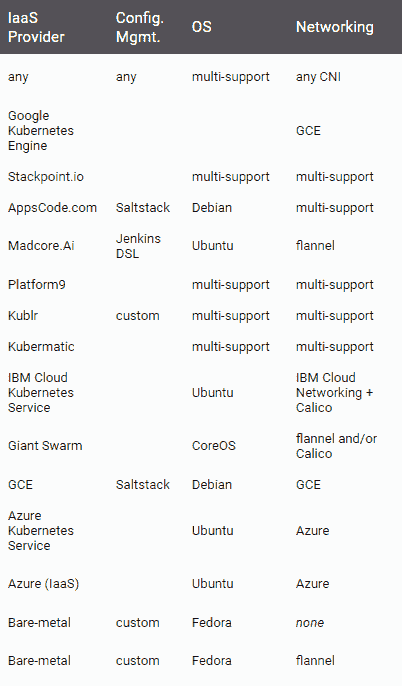
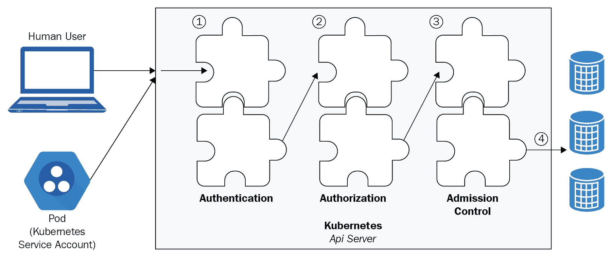

# 第十五章：Kubernetes 基础设施管理

在本章中，我们将讨论如何更改支持 Kubernetes 基础设施的基础设施，无论它是完全公共云平台还是混合安装。我们将讨论如何处理底层实例和资源不稳定的方法，以及如何在部分可用的底层硬件上运行高可用工作负载的策略。本章将涵盖一些关键主题，以帮助你理解如何以这种方式管理基础设施：

+   我们如何规划部署 Kubernetes 组件？

+   我们如何保护 Kubernetes 基础设施？

+   我们如何升级集群和`kubeadm`？

+   我们如何扩展集群？

+   我们有哪些外部资源可用？

在本章中，你将学习以下内容：

+   集群升级

+   如何管理`kubeadm`

+   集群扩展

+   集群维护

+   SIG 集群生命周期组

# 技术要求

你需要启用并登录到 Google Cloud Platform 账户，或者可以使用本地 Minikube Kubernetes 实例。你还可以通过网络使用 Play with Kubernetes：[`labs.play-with-k8s.com/`](https://labs.play-with-k8s.com/)。

本章的 GitHub 仓库链接是：[`github.com/PacktPublishing/Getting-Started-with-Kubernetes-third-edition/tree/master/Code-files/Chapter15`](https://github.com/PacktPublishing/Getting-Started-with-Kubernetes-third-edition/tree/master/Code-files/Chapter15)[.](https://github.com/PacktPublishing/Getting-Started-with-Kubernetes-third-edition/tree/master/Code%20files/Chapter%2015)

# 规划集群

回顾我们在本书中迄今为止完成的工作，构建 Kubernetes 集群时有许多选择。让我们简要概述一下在计划构建集群时可用的选项。我们有几个关键领域需要在规划时进行调查。

# 选择正确的方案

选择集群时，第一步也是最重要的一步是选择适合你 Kubernetes 集群的托管平台。从高层次来看，以下是你可以选择的方案：

+   本地解决方案包括以下内容：

    +   **Minikube**：一个单节点 Kubernetes 集群

    +   **LXD 上的 Ubuntu**：这使用 LXD 来部署一个包含九个实例的 Kubernetes 集群

    +   **IBM 的 Cloud Private-CE**：这使用 VirtualBox 在*n+1*实例上部署 Kubernetes

    +   `kubeadm-dind`（Docker-in-Docker）：这允许多节点 Kubernetes 集群

+   托管解决方案包括以下内容：

    +   谷歌 Kubernetes 引擎

    +   亚马逊弹性容器服务

    +   Azure Kubernetes 服务

    +   Stackpoint

    +   Openshift 在线

    +   IBM 云 Kubernetes 服务

    +   Giant Swarm

+   在所有上述云平台及更多平台上，都有许多即用型解决方案，允许你使用社区维护的脚本快速启动完整的集群

截至本书出版时，以下是项目和解决方案的列表：



访问此链接了解更多现成解决方案：[`kubernetes.io/docs/setup/pick-right-solution/#turnkey-cloud-solutions`](https://kubernetes.io/docs/setup/pick-right-solution/#turnkey-cloud-solutions)。

# 保护集群

如我们所讨论的，确保在保护集群时关注几个关键领域。确保您已经阅读并对以下领域的集群配置（代码中）进行了更改：

+   **日志记录**：确保您的 Kubernetes 日志已启用。您可以在这里了解更多关于审计日志的信息：[`kubernetes.io/docs/tasks/debug-application-cluster/audit/`](https://kubernetes.io/docs/tasks/debug-application-cluster/audit/)。

+   确保启用了身份验证，以便您的用户、操作员和服务可以作为唯一标识符进行身份识别。有关身份验证的更多信息，请参见：[`kubernetes.io/docs/reference/access-authn-authz/authentication/`](https://kubernetes.io/docs/reference/access-authn-authz/authentication/)。

+   确保您已正确分离职责、使用基于角色的访问控制，并通过授权实现细粒度权限。您可以在这里了解有关基于 HTTP 的控制的更多信息：[`kubernetes.io/docs/reference/access-authn-authz/authorization/`](https://kubernetes.io/docs/reference/access-authn-authz/authorization/)。

+   确保您已将 API 限制为特定权限和组。您可以在这里了解更多关于 API 访问的信息：[`kubernetes.io/docs/reference/access-authn-authz/controlling-access/`](https://kubernetes.io/docs/reference/access-authn-authz/controlling-access/)。

+   在适当的情况下，启用准入控制器，以便在请求通过身份验证和授权控制后进一步重新验证请求。这些控制器可以执行额外的、基于业务逻辑的验证步骤，以进一步保护您的集群。您可以在这里了解更多关于准入控制器的信息：[`kubernetes.io/docs/reference/access-authn-authz/controlling-access`](https://kubernetes.io/docs/reference/access-authn-authz/controlling-access/)。

+   通过 `sysctl` 接口调整 Linux 系统参数。这允许您修改节点级别和命名空间 `sysctl` 功能的内核参数。系统参数分为安全和不安全两类。`sysctl` 可以调整多个子系统。可能的参数如下：

    +   `abi`：执行域和个性

    +   `fs`：特定文件系统、文件句柄、inode、目录项和配额调优

    +   `kernel`：全局内核信息/调优

    +   `net`：网络

    +   `sunrpc`：SUN **远程过程调用**（**RPC**）

    +   `vm`：内存管理调优、缓冲区和缓存管理

    +   `user`：每个用户每个用户命名空间限制

您可以在这里了解更多关于 `sysctl` 调用的信息：[`kubernetes.io/docs/tasks/administer-cluster/sysctl-cluster/`](https://kubernetes.io/docs/tasks/administer-cluster/sysctl-cluster/)。

您可以通过运行以下命令启用不安全的 `sysctl` 值：

`kubelet --allowed-unsafe-sysctls ‘net.ipv4.route.min_pmtu'`

这是授权、身份验证和准入控制协同工作的示意图：



# 调优示例

如果你想尝试修改`sysctls`，你可以按每个 pod 设置一个安全上下文，方法如下：

```
apiVersion: v1
kind: Pod
metadata:
 name: sysctl-example
spec:
 securityContext:
   sysctls:
   - name: kernel.shm_rmid_forced
     value: "0"
   - name: net.core.somaxconn
     value: "10000"
   - name: kernel.msgmax
     value: "65536"
   - name: ipv4.ip_local_port_range
      value: ‘1024 65535'
```

你也可以调整诸如 ARP 缓存等变量，因为 Kubernetes 在大规模运行时会消耗大量 IP，这可能会耗尽 ARP 缓存空间。改变这些设置在大规模 HPC 集群中很常见，也能帮助解决 Kubernetes 地址耗尽的问题。你可以按以下方式设置这些值：

```
net.ipv4.neigh.default.gc_thresh1 = 90000
net.ipv4.neigh.default.gc_thresh2 = 100000
net.ipv4.neigh.default.gc_thresh3 = 120000
```

# 升级集群

为了长时间运行你的集群，你需要根据需要更新集群。管理集群升级有多种方式，升级的难度取决于你之前选择的平台。通常，托管的**平台即服务**（**PaaS**）选项较为简单，而自己搭建的选项则需要你来管理集群升级。

# 升级 PaaS 集群

升级 PaaS 集群比更新自己搭建的集群要简单得多。让我们来看看主要的云服务提供商是如何更新他们的托管 Kubernetes 平台的。

在 Azure 中，管理集群的控制平面和节点的升级相对简单。你可以使用以下命令检查你的集群可以升级到哪些版本：

```
az aks get-upgrades --name “myAKSCluster” --resource-group myResourceGroup --output table
Name ResourceGroup MasterVersion NodePoolVersion Upgrades

------- --------------- --------------- ----------------- -------------------

default gsw-k8s-aks 1.8.10 1.8.10 1.9.1, 1.9.2, 1.9.6
```

在升级 AKS 集群时，你必须通过次要版本进行升级。AKS 会处理向集群中添加新节点的过程，并且会管理 cordon 和 drain 过程，以防止对正在运行的应用程序造成任何中断。你可以在接下来的部分中查看 drain 过程的工作方式。

你可以按如下方式运行`upgrade`命令。在在生产工作负载上运行之前，你应该先进行此功能的实验，以便了解它对运行中应用程序的影响：

```
az aks upgrade --name myAKSCluster --resource-group myResourceGroup --kubernetes-version 1.9.6
```

你应该看到很多输出，标识出更新内容，通常类似于这样：

```
{
  "id": "/subscriptions/<Subscription ID>/resourcegroups/myResourceGroup/providers/Microsoft.ContainerService/managedClusters/myAKSCluster",
  "location": "eastus",
  "name": "myAKSCluster",
  "properties": {
    "accessProfiles": {
      "clusterAdmin": {
        "kubeConfig": "..."
      },
      "clusterUser": {
        "kubeConfig": "..."
      }
    },
    "agentPoolProfiles": [
      {
        "count": 1,
        "dnsPrefix": null,
        "fqdn": null,
        "name": "myAKSCluster",
        "osDiskSizeGb": null,
        "osType": "Linux",
        "ports": null,
        "storageProfile": "ManagedDisks",
        "vmSize": "Standard_D2_v2",
        "vnetSubnetId": null
      }
    ],
    "dnsPrefix": "myK8sClust-myResourceGroup-4f48ee",
    "fqdn": "myk8sclust-myresourcegroup-4f48ee-406cc140.hcp.eastus.azmk8s.io",
    "kubernetesVersion": "1.9.6",
    "linuxProfile": {
      "adminUsername": "azureuser",
      "ssh": {
        "publicKeys": [
          {
            "keyData": "..."
          }
        ]
      }
    },
    "provisioningState": "Succeeded",
    "servicePrincipalProfile": {
      "clientId": "e70c1c1c-0ca4-4e0a-be5e-aea5225af017",
      "keyVaultSecretRef": null,
      "secret": null
    }
  },
  "resourceGroup": "myResourceGroup",
  "tags": null,
  "type": "Microsoft.ContainerService/ManagedClusters"
}
```

你还可以显示当前版本：

```
az aks show --name myAKSCluster --resource-group myResourceGroup --output table
```

要升级 GCE 集群，你将遵循类似的流程。在 GCE 的情况下，有两种机制可以让你更新集群：

+   对于管理节点的升级，GCP 删除并重新创建主节点，使用相同的**持久磁盘**（**PD**）以保持你的状态在升级过程中不变。

+   在你的工作节点上，你将使用 GCP 的托管实例组，并执行滚动升级集群的操作，其中每个节点都会被销毁并替换，以避免对工作负载造成中断。

你可以将集群主节点升级到特定版本：

```
cluster/gce/upgrade.sh -M v1.0.2
```

或者，你也可以使用此命令更新整个集群：

```
cluster/gce/upgrade.sh -M v1.0.2
```

要升级 Google Kubernetes Engine 集群，你有一个简单的用户发起的选项。你需要设置你的项目 ID：

```
gcloud config set project [PROJECT_ID]
```

另外，确保你拥有最新的`gcloud`组件：

```
gcloud components update
```

在 GCP 上更新 Kubernetes 集群时，您将获得以下好处。您可以降级节点，但不能降级主节点：

+   GKE 会在不中断应用程序的情况下处理节点和 Pod 的排空操作

+   替换节点将以与前一个节点相同的配置重新创建

+   GKE 将更新集群中的以下软件组件：

    +   `kubelet`

    +   `kube-proxy`

    +   Docker 守护进程

    +   操作系统

您可以使用以下命令查看您的服务器有哪些升级选项：

```
gcloud container get-server-config
```

请注意，存储在`hostPath`和`emptyDir`目录中的数据将在升级过程中被删除，只有 PD（持久磁盘）会被保留。您可以为集群启用 GKE 的自动节点更新，也可以手动执行更新。

要启用自动节点自动升级，请阅读此文档：**[`cloud.google.com/kubernetes-engine/docs/concepts/node-auto-upgrades`](https://cloud.google.com/kubernetes-engine/docs/concepts/node-auto-upgrades)。**

您也可以使用 `--enable-autoupgrade` 命令创建默认启用自动升级的集群：

```
gcloud container clusters create [CLUSTER_NAME] --zone [COMPUTE_ZONE] \
 --enable-autoupgrade
```

如果您希望手动更新集群，可以发出特定的命令。对于生产环境系统，建议关闭自动升级，并在低流量或维护窗口期间进行升级，以确保对应用程序的干扰最小化。建立对升级的信心后，您可以尝试自动升级。

要手动启动节点升级，您可以运行以下命令：

```
gcloud container clusters upgrade [CLUSTER_NAME]
```

如果您想升级到特定版本的 Kubernetes，可以添加 `--cluster-version` 标签。

您可以查看集群上正在进行的操作列表，以跟踪更新操作：

```
gcloud beta container operations list
NAME TYPE ZONE TARGET STATUS_MESSAGE STATUS START_TIME END_TIME
operation-1505407677851-8039e369 CREATE_CLUSTER us-west1-a my-cluster DONE 20xx-xx-xxT16:47:57.851933021Z 20xx-xx-xxT16:50:52.898305883Z
operation-1505500805136-e7c64af4 UPGRADE_CLUSTER us-west1-a my-cluster DONE 20xx-xx-xxT18:40:05.136739989Z 20xx-xx-xxT18:41:09.321483832Z
operation-1505500913918-5802c989 DELETE_CLUSTER us-west1-a my-cluster DONE 20xx-xx-xxT18:41:53.918825764Z 20xx-xx-xxT18:43:48.639506814Z
```

然后，您可以使用以下命令描述您的特定升级操作：

```
gcloud beta container operations describe [OPERATION_ID]
```

上述命令将告诉您有关集群升级操作的详细信息：

```
gcloud beta container operations describe operation-1507325726639-981f0ed6
endTime: '20xx-xx-xxT21:40:05.324124385Z'
name: operation-1507325726639-981f0ed6
operationType: UPGRADE_CLUSTER
selfLink: https://container.googleapis.com/v1/projects/.../kubernetes-engine/docs/zones/us-central1-a/operations/operation-1507325726639-981f0ed6
startTime: '20xx-xx-xxT21:35:26.639453776Z'
status: DONE
targetLink: https://container.googleapis.com/v1/projects/.../kubernetes-engine/docs/zones/us-central1-a/clusters/...
zone: us-central1-a
```

# 扩展集群

与 PaaS 和托管集群类似，您有多个选项可以扩展您的生产 Kubernetes 集群。

# 在 GKE 和 AKS 上

升级 GKE 集群时，您需要做的就是发出一个扩缩命令，修改您的从属组中的实例数量。您可以使用以下命令调整控制集群的节点池大小：

```
gcloud container clusters resize [CLUSTER_NAME] \
 --node-pool [POOL_NAME]
 --size [SIZE]
```

请记住，新的节点将与当前节点池中的机器具有相同的配置创建。当额外的 Pod 被调度时，它们将调度到新的节点上。现有的 Pod 不会被迁移或重新平衡到新节点上。

扩展 AKS 集群引擎是一个类似的操作，您需要指定 `--resource-group` 节点计数为所需的节点数量：

```
az aks scale --name myAKSCluster --resource-group gsw-k8s-group --node-count 1
```

# DIY 集群

当你向手动搭建的 Kubernetes 集群中添加资源时，你需要做更多的工作。为了使节点在通过扩展组自动添加或通过基础设施代码手动添加时能够自动加入，你需要确保通过`--register-node`标志启用节点的自动注册。如果该标志开启，新的节点将尝试自动注册自己。这是默认行为。

你也可以使用预验证过的令牌手动将节点加入到集群中。如果你使用以下令牌初始化 `kubeadm`：

```
kubeadm init --token=101tester101 --kubernetes-version $(kubeadm version -o short)
```

然后你可以使用这个命令将其他节点添加到集群中：

```
kubeadm join --discovery-token-unsafe-skip-ca-verification --token=101tester101:6443
```

通常在 `kubeadm` 的生产环境安装中，你不会指定令牌，需要从 `kubeadm init` 命令中提取并存储它。

# 节点维护

如果你正在扩展或缩减集群，了解手动节点注销和排水的过程是至关重要的。我们将在这里使用 `kubectl` drain 命令，在从集群中移除节点之前，先将所有 Pod 从节点中移除。从节点中移除所有 Pod 可以确保当你移除实例或虚拟机时，不会有正在运行的工作负载。

使用以下命令获取可用节点列表：

```
kubectl get nodes
```

一旦我们有了节点列表，排水节点的命令就很简单：

```
kubectl drain <node>
```

该命令执行需要一些时间，因为它需要重新调度节点上的工作负载到其他有可用资源的机器上。一旦排水完成，你可以通过你喜欢的编程 API 移除该节点。如果你只是为了维护而移除节点，你可以使用 `uncordon` 命令将其重新加入可用节点：

```
kubectl uncordon <node>
```

# 其他配置选项

一旦你建立了对 Kubernetes 集群配置管理的理解，建议探索那些提供增强机制或抽象的额外工具，以便配置集群的状态。

ksonnet 是一个这样的工具，它允许你围绕不同的配置构建一个结构，以保持多个环境的配置。ksonnet 使用另一个强大的工具叫做 Jsonnet 来维护集群的状态。ksonnet 是一种与我们在之前章节中讨论的 Helm 方法不同的集群管理方式，它不是通过依赖关系定义包，而是采取可组合的原型方法，你构建 JSON 模板，这些模板会被 ksonnet CLI 渲染并应用到集群上。你从创建原型的部分开始，配置后变成组件，这些组件可以组合成应用程序。这有助于避免代码库中的重复代码。你可以在这里查看：[`ksonnet.io/`](https://ksonnet.io/)。

# 摘要

在本章中，我们讨论了如何对提供计算、存储和网络能力的基础设施进行更改，无论它是纯粹的公共云平台还是混合安装。在观察公共云平台时，我们讨论了处理底层实例和资源不稳定性的方法，以及如何在部分可用的底层硬件上运行高可用性工作负载的策略。

此外，我们还介绍了一个关键主题，讲解如何使用诸如 `kubeadm`、`kubectl` 以及公共云提供商工具等工具来构建基础设施，这些工具能够按需扩展和缩减你的集群。

# 问题

1.  列举两个可用的 Kubernetes 本地解决方案

1.  列举三个 Kubernetes 的托管解决方案

1.  确保集群安全的四个关键领域是什么？

1.  升级每个主要云服务提供商托管的 Kubernetes 集群的命令是什么？

1.  哪个云提供商的 PaaS 解决方案最适合 Kubernetes 的生产环境？

1.  哪个命令用于将一个节点从轮换中移除？

1.  哪个命令用于将其重新添加？

# 深入阅读

如果你想了解更多关于 Jsonnet 的信息，可以查看这个链接：[`jsonnet.org/`](https://jsonnet.org/)。
