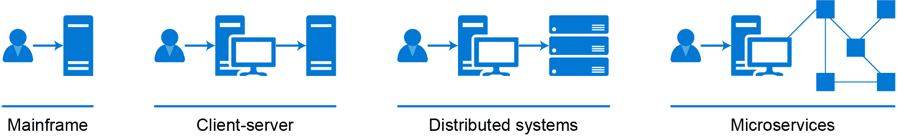
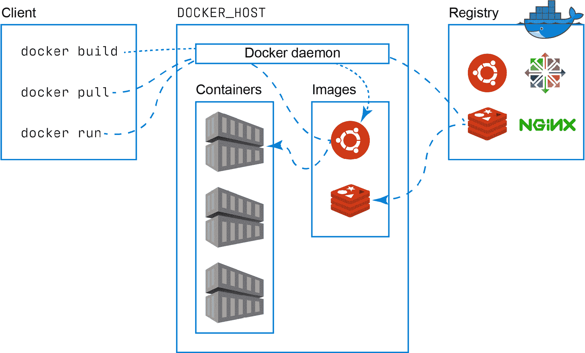
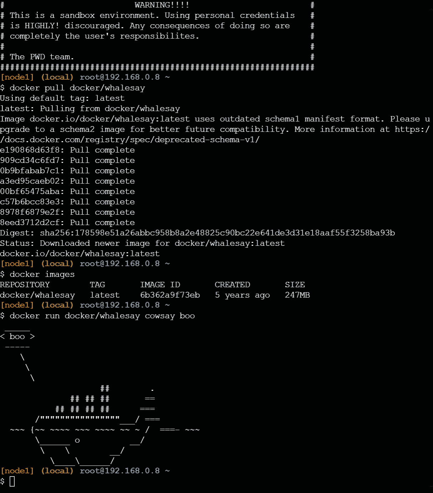
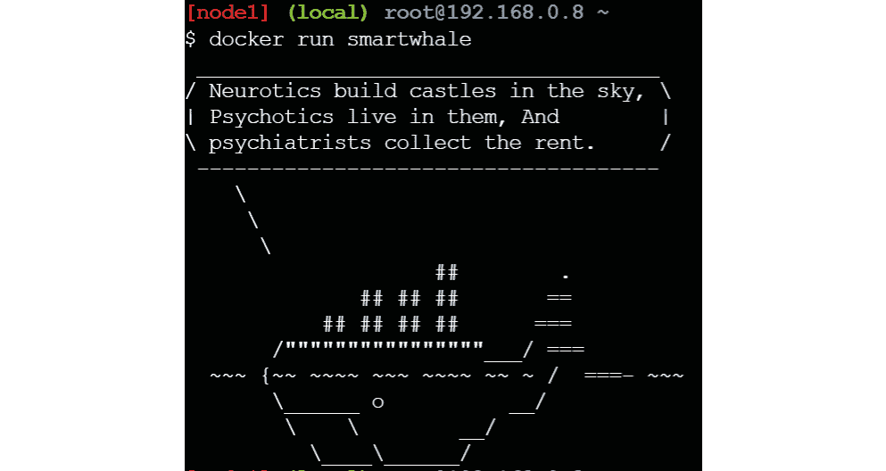
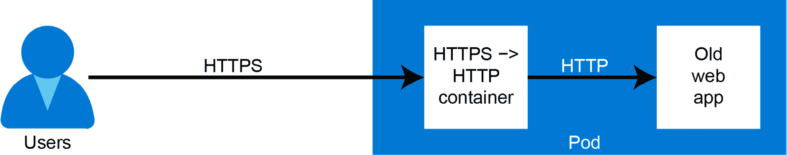
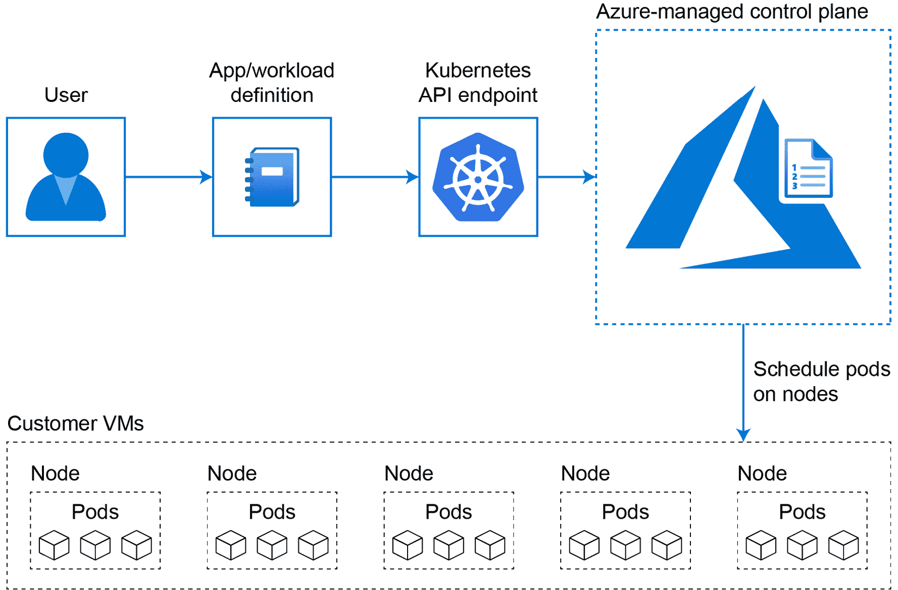

# 第二章：1\. 容器和 Kubernetes 简介

Kubernetes 已经成为容器编排的领先标准。自 2014 年推出以来，Kubernetes 已经获得了极大的流行。它被初创企业和主要企业广泛采用，所有主要的公共云供应商都提供了托管的 Kubernetes 服务。

Kubernetes 建立在 Docker 容器革命的成功基础之上。Docker 既是一个公司，也是一种技术。作为一种技术，Docker 是创建和运行软件容器（称为 Docker 容器）的最常见方式。容器是一种打包软件的方式，使得能够在任何平台上运行这些软件，从您的笔记本电脑到数据中心的服务器，再到公共云中运行的集群。

尽管核心技术是开源的，Docker 公司专注于通过多种商业提供来简化开发者的复杂性。

Kubernetes 将容器技术推向了新的高度。Kubernetes 是一个容器编排器。容器编排器是一个软件平台，使得在成千上万台机器上运行成千上万个容器变得非常容易。它自动化了部署、运行和扩展应用程序所需的许多手动任务。编排器负责在正确的机器上调度正确的容器运行。它还负责健康监控、故障转移以及扩展您部署的应用程序。

Docker 使用的容器技术和 Kubernetes 都是开源软件项目。开源软件允许来自多家公司的开发者共同协作开发单一软件。Kubernetes 本身有来自微软、谷歌、红帽、VMware 等公司的贡献者。

三大公共云平台——Azure，**亚马逊网络服务**（**AWS**），以及**谷歌云平台**（**GCP**）——都提供了托管的 Kubernetes 服务。这些托管服务因其几乎无限的计算能力和易用性而在市场上引起了极大的关注，使得构建和部署大规模应用变得非常容易。

**Azure Kubernetes 服务**（**AKS**）是 Azure 的 Kubernetes 托管服务。它降低了构建和管理 Kubernetes 集群的复杂性。在本书中，您将学习如何使用 AKS 来运行您的应用程序。每一章都将介绍新的概念，并通过本书中的许多示例进行应用。

然而，作为用户，了解支持 AKS 的技术仍然非常有用。我们将在本章中探讨这些基础知识。您将了解 Linux 进程及其与 Docker 和容器的关系。您将看到各种进程如何很好地适配到容器中，以及容器如何很好地适配到 Kubernetes 中。

本章介绍了 Docker 的基础概念，以便你可以开始你的 Kubernetes 之旅。本章还简要介绍了帮助你构建容器、实现集群、进行容器编排并在 AKS 上排除故障的基本知识。掌握本章内容的基本知识，将揭开在 AKS 上构建经过认证、加密和高可扩展性应用所需工作的神秘面纱。在接下来的几章中，你将逐步构建可扩展和安全的应用程序。

本章将涵盖以下主题：

+   将我们带到这里的软件演变

+   容器基础

+   Kubernetes 基础

+   AKS 基础

本章的目的是介绍基础知识，而不是提供一个详细的信息来源来描述 Docker 和 Kubernetes。首先，我们将回顾软件是如何演变，最终带我们到今天的。

## 将我们带到这里的软件演变

有两个主要的软件开发演变使得容器和 Kubernetes 得以流行。一个是微服务架构风格的采用。微服务允许将一个应用程序构建成由多个小服务组成，每个服务承担一个特定功能。另一个推动容器和 Kubernetes 发展的演变是 DevOps。DevOps 是一组文化实践，允许人们、流程和工具更快、更频繁、更可靠地构建和发布软件。

虽然你可以在不使用微服务或 DevOps 的情况下使用容器和 Kubernetes，但这些技术最广泛的应用是在采用 DevOps 方法论的微服务部署中。

在本节中，我们将讨论这两种演变，从微服务开始。

### 微服务

软件开发随着时间的推移发生了巨大的变化。最初，软件是在单一系统上开发和运行的，通常是大型主机。客户端通过终端连接到主机，并且只能通过该终端连接。随着计算机网络的普及，客户端-服务器编程模型出现了。这时，客户端可以远程连接到服务器，甚至在自己的系统上运行应用程序的一部分，同时连接到服务器获取应用程序所需的数据。

客户端-服务器编程模型已经演变成分布式系统。分布式系统与传统的客户端-服务器模型不同，因为它们在多个不同的系统上运行多个不同的应用程序，并且所有系统都是相互连接的。

如今，微服务架构在开发分布式系统时已变得非常常见。基于微服务的应用程序由一组服务组成，这些服务共同协作以构成应用程序，而单独的服务本身可以独立构建、测试、部署和扩展。该风格有许多优点，但也存在一些缺点。

微服务架构的一个关键特点是每个服务只执行一个核心功能。每个服务专注于单一的业务功能。不同的服务协同工作，形成完整的应用程序。这些服务通过网络通信协作，通常使用 HTTP REST API 或 gRPC：



图 1.1：标准微服务架构

这种架构方法通常被容器和 Kubernetes 运行的应用程序采纳。容器作为单个服务的打包格式，而 Kubernetes 则是部署和管理多个协同工作的服务的协调器。

在深入了解容器和 Kubernetes 的具体内容之前，首先让我们探讨一下采用微服务的优缺点。

### 运行微服务的优势

运行基于微服务的应用程序有多个优势。首先，每个服务是独立的。服务被设计得足够小（因此称为微服务），以便能够处理业务领域的需求。由于它们很小，可以将其做成自包含的，并且能够独立测试，因此也可以独立发布。

这带来了一个好处，即每个微服务都是独立可扩展的。如果某个应用程序的部分需求增加，该部分可以与应用程序的其余部分独立扩展。

服务的独立可扩展性也意味着它们可以独立部署。微服务有多种部署策略，其中最流行的是滚动部署和蓝绿部署。

通过滚动升级，新版本的服务只会部署到应用程序的一部分。这个新版本会被仔细监控，如果服务保持健康，逐渐增加流量。如果发生故障，之前的版本仍然在运行，流量可以轻松切换。

使用蓝绿部署时，你将新版本的服务孤立部署。一旦新版本的服务部署并测试完毕，你就将 100%的生产流量切换到新版本。这种方法实现了服务版本之间的平滑过渡。

微服务架构的另一个好处是，每个服务可以用不同的编程语言编写。这被称为**多语言支持**——即能够理解和使用多种语言。例如，前端服务可以使用流行的 JavaScript 框架开发，后端可以用 C#开发，机器学习算法可以用 Python 开发。这使得你能够为不同的服务选择合适的语言，并让开发人员使用他们最熟悉的语言。

### 运行微服务的劣势

每个硬币都有两面，微服务也不例外。尽管基于微服务的架构有多个优点，但这种架构也有其缺点。

微服务的设计和架构需要较高的软开发成熟度，才能正确实现。对领域有深刻理解的架构师必须确保每个服务是有边界的，且不同服务之间是紧密协作的。由于服务是相互独立的且独立版本化，确保不同服务之间的软合同是非常重要的。

微服务设计的另一个常见问题是，监控和排除此类应用程序故障时带来的额外复杂性。由于不同的服务组成了一个应用程序，而这些服务运行在多个服务器上，因此记录日志和追踪此类应用程序是一项复杂的工作。

与之前提到的缺点相关的是，通常在微服务中，你需要为应用程序构建更多的容错机制。由于应用程序中不同服务的动态性质，故障更容易发生。为了保证应用程序的可用性，重要的是在构成应用程序的不同微服务中构建容错机制。实现重试逻辑或断路器等模式对于避免单一故障导致应用程序停机至关重要。

在本节中，你了解了微服务、它们的优点和缺点。微服务通常与 DevOps 相关，但它是一个独立的主题。我们将在下一节探讨 DevOps 的含义。

### DevOps

DevOps 字面意思是开发和运维的结合。更具体地说，DevOps 是将人员、流程和工具结合起来，以更快、更频繁、更可靠地交付软件。DevOps 更多的是一套文化实践，而不是任何特定的工具或实现。通常，DevOps 涵盖软件开发的四个领域：规划、开发、发布和运行软件。

#### 注意

DevOps 有多种定义。作者采用了这个定义，但作为读者，鼓励你在有关 DevOps 的文献中探索不同的定义。

DevOps 文化从规划开始。在 DevOps 项目的规划阶段，会明确项目的目标。这些目标既包括高层次的目标（称为史诗），也包括较低层次的目标（如功能和任务）。DevOps 项目中的不同工作项会被记录在功能待办事项列表中。通常，DevOps 团队采用敏捷规划方法，通过编程冲刺来工作。看板通常用于表示项目状态并跟踪工作。当任务状态从*待办*变为*进行中*再到*已完成*时，它会从看板的左侧移动到右侧。

当工作被规划好后，实际开发就可以进行。在 DevOps 文化中的开发不仅仅是编写代码，还包括测试、审查和与团队成员集成代码。版本控制系统，如 Git，被用来让不同的团队成员共享代码。自动化的**持续集成**（**CI**）工具被用来自动化大多数手动任务，如测试和构建代码。

当一个特性完成编码、测试并构建完成后，它就准备好交付了。DevOps 项目的下一个阶段可以开始交付。使用**持续交付**（**CD**）工具来自动化软件的部署。通常，软件会部署到不同的环境中，如测试、质量保证和生产环境。在进入下一个环境之前，会使用自动化和手动检查相结合的方式确保质量。

最后，当软件在生产环境中运行时，运营阶段可以开始。这个阶段涉及到应用程序在生产中的维护、监控和支持。最终目标是以尽可能少的停机时间，可靠地运营一个应用程序。任何问题都要尽可能主动地进行识别。软件中的漏洞将在待办事项中进行跟踪。

DevOps 过程是一个迭代过程。单个团队永远不会处于过程的某一个单一阶段。整个团队在不断地规划、开发、交付和运营软件。

存在多种工具来实施 DevOps 实践。有针对单一阶段的工具，例如用于规划的 Jira，或用于持续集成和持续交付的 Jenkins，以及完整的 DevOps 平台，如 GitLab。微软运营着两个使客户能够采用 DevOps 实践的解决方案：Azure DevOps 和 GitHub。Azure DevOps 是一个支持 DevOps 过程所有阶段的服务套件。GitHub 是一个独立的平台，用于支持 DevOps 软件开发。GitHub 被公认为领先的开源软件开发平台，托管着超过 4000 万个开源项目。

微服务和 DevOps 通常与容器和 Kubernetes 结合使用。现在我们已经了解了微服务和 DevOps 的基本概念，我们将继续本章的内容，介绍容器的基本概念，接着是 Kubernetes 的基本概念。

### 容器基础

一种容器技术自 1970 年代以来就存在于 Linux 内核中。今天容器背后的技术被称为**cgroups**（**控制组**的缩写），它在 2006 年由 Google 引入到 Linux 内核中。Docker 公司在 2013 年通过引入一种简便的开发者工作流程，使这一技术普及开来。虽然“Docker”一词可以指代公司或技术，但通常我们用 Docker 指的是技术本身。

#### 注意事项

尽管 Docker 技术是构建和运行容器的流行方式，但它并不是唯一的方式。存在许多替代方案，用于构建或运行容器。其中一个替代方案是 containerd，它也是 Kubernetes 使用的容器运行时。

Docker 作为一种技术，既是打包格式也是容器运行时。打包是一个过程，它将应用程序及其依赖项（如二进制文件和运行时）打包在一起。运行时则指向运行容器镜像的实际过程。

Docker 架构中有三个重要组成部分：客户端、守护进程和注册中心：

+   Docker 客户端是一个客户端工具，用于与 Docker 守护进程进行交互，可以在本地或远程运行。

+   Docker 守护进程是一个长时间运行的进程，负责构建容器镜像并运行容器。Docker 守护进程可以运行在本地计算机或远程计算机上。

+   Docker 注册中心是存储 Docker 镜像的地方。有公共注册中心，如 Docker Hub，其中包含公共镜像，也有私有注册中心，如**Azure 容器注册中心**（**ACR**），你可以使用它来存储自己的私有镜像。如果本地没有镜像，Docker 守护进程可以从注册中心拉取镜像：



图 1.2：Docker 架构基础

你可以通过在 Docker Hub 上创建一个免费的 Docker 账户（[`hub.docker.com/`](https://hub.docker.com/)），并使用该账户登录打开 Docker Labs（[`labs.play-with-docker.com/`](https://labs.play-with-docker.com/)）来尝试 Docker。这将为你提供一个 Docker 已预安装的环境，有效期为 4 小时。在本节中，我们将使用 Docker Labs 来构建我们自己的容器和镜像。

#### 注意

尽管我们在本章中使用基于浏览器的 Docker Labs 来介绍 Docker，但你也可以在本地桌面或服务器上安装 Docker。对于工作站，Docker 提供了一款名为 Docker Desktop 的产品（[`www.docker.com/products/docker-desktop`](https://azure.microsoft.com/resources/designing-distributed-systems/)），适用于 Windows 和 Mac，可以在本地创建 Docker 容器。在服务器上——无论是 Windows 还是 Linux——Docker 也可以作为容器的运行时环境。

### 容器镜像

要启动一个新的容器，你需要一个镜像。镜像包含了你在容器内运行所需的所有软件。容器镜像可以保存在本地计算机上，也可以保存在容器注册中心。有公共注册中心，比如公共的 Docker Hub（[`hub.docker.com/`](https://hub.docker.com/)），也有私有注册中心，如 ACR。当你作为用户本地没有镜像时，可以通过 `docker pull` 命令从注册中心拉取镜像。

在接下来的示例中，我们将从公共 Docker Hub 仓库拉取一个镜像并运行实际的容器。你可以按照这些说明在 Docker Labs 中运行这个示例，正如我们在上一节中介绍的那样：

```
#First, we will pull an image
docker pull docker/whalesay
#We can then look at which images are stored locally
docker images
#Then we will run our container
docker run docker/whalesay cowsay boo
```

这些命令的输出将类似于*图 1.3*：



图 1.3：在 Docker Labs 中运行容器的示例

这里发生的事情是，Docker 首先将镜像分多个部分拉取并存储在运行它的机器上。当你运行实际的应用程序时，它使用这个本地镜像来启动一个容器。如果我们详细查看命令，你会看到`docker pull`接受了一个参数，`docker/whalesay`。如果没有提供私有容器仓库，Docker 会在公共的 Docker Hub 中查找镜像，正是 Docker 从这里拉取了这个镜像。`docker run`命令接受了几个参数，第一个参数是`docker/whalesay`，即镜像的引用。接下来的两个参数，`cowsay boo`，是传递给正在运行的容器执行的命令。

在前面的示例中，你学习了如何在不先构建镜像的情况下运行容器。然而，通常你会想要构建自己的镜像。为此，你需要使用一个 Dockerfile。Dockerfile 包含了一系列 Docker 会按照步骤来构建镜像的指令。这些指令可以包括从添加文件到安装软件或设置网络等操作。

在下一个示例中，你将构建一个自定义 Docker 镜像。这个自定义镜像将在鲸鱼输出中显示励志名言。以下的 Dockerfile 将用于生成这个自定义镜像。你将在你的 Docker 练习环境中创建它：

```
FROM docker/whalesay:latest
RUN apt-get -y -qq update
RUN apt-get install -qq -y fortunes
CMD /usr/games/fortune -a | cowsay
```

这个 Dockerfile 包含四行指令。第一行会告诉 Docker 使用哪个镜像作为新镜像的基础镜像。接下来的两行是运行命令，用于向镜像添加新功能，在这个例子中是更新`apt`仓库并安装一个名为`fortunes`的应用程序。`fortunes`是一个小型命令行工具，可以生成励志名言。我们将使用它来在输出中包含名言，而不是用户输入。最后，`CMD`命令告诉 Docker 在基于此镜像运行容器时执行哪个命令。

通常，你会将 Dockerfile 保存在一个名为`Dockerfile`的文件中，不带扩展名。要构建镜像，你需要执行`docker build`命令并指向你创建的 Dockerfile。在构建 Docker 镜像时，Docker 守护进程会读取 Dockerfile 并执行其中的不同步骤。这个命令还会输出运行容器和构建镜像所经过的步骤。让我们通过一个演示来走一遍构建镜像的过程。

为了创建这个 Dockerfile，使用`vi Dockerfile`命令打开文本编辑器。**vi**是 Linux 命令行上的一个高级文本编辑器。如果你不熟悉它，我们将一步步演示如何在其中输入文本：

1.  在你打开 vi 之后，按下*I*键进入插入模式。

1.  然后，复制并粘贴或手动输入这四行代码。

1.  然后，按下*Esc*键，输入`:wq!`来写入`(w)`你的文件并退出`(q)`文本编辑器。

下一步是执行`docker build`来构建镜像。我们会向该命令中添加最后的一部分，即为我们的镜像添加标签，这样我们就可以通过一个有意义的名称来调用它。要构建镜像，你需要使用`docker build -t smartwhale.`命令（别忘了在这里加上最后的句点）。

现在你将看到 Docker 执行一系列步骤——此处是四个步骤——来构建镜像。镜像构建完成后，你可以运行你的应用程序。要运行你的容器，你需要执行`docker run smartwhale`，然后你应该看到类似*图 1.4*的输出。然而，你可能会看到不同的智能引号。这是因为`fortunes`应用程序会生成不同的引言。如果你多次运行容器，你将看到不同的引言，如*图 1.4*所示：



图 1.4：运行自定义容器

这就是我们对容器的概述和演示。在这一部分，你从现有的容器镜像开始，并在 Docker Labs 上启动它。随后，你又进一步操作，构建了你自己的容器镜像，并使用该镜像启动了容器。你现在已经了解了构建和运行容器的步骤。在接下来的部分，我们将介绍 Kubernetes。Kubernetes 允许你在大规模环境下运行多个容器。

## Kubernetes 作为容器编排平台

构建和运行一个单一容器似乎很简单。然而，当你需要在多个服务器上运行多个容器时，事情可能会变得复杂。这时，容器编排器可以派上用场。容器编排器负责调度容器在服务器上运行，在容器失败时重新启动容器，当主机变得不健康时，将容器迁移到新的主机，等等。

当前领先的编排平台是 Kubernetes（[`kubernetes.io/`](https://kubernetes.io/)）。Kubernetes 的灵感来源于 Google 的 Borg 项目，Borg 本身在生产环境中运行了数百万个容器。

Kubernetes 采用声明式的编排方式；也就是说，你只需指定你需要什么，Kubernetes 会负责部署你指定的工作负载。你不再需要手动启动这些容器，因为 Kubernetes 会自动启动你指定的容器。

#### 注意

尽管 Kubernetes 曾经支持 Docker 作为容器运行时，但在 Kubernetes 1.20 版本中，这一支持已被弃用。在 AKS 中，**containerd** 从 Kubernetes 1.19 开始成为默认的容器运行时。

在本书中，您将构建多个在 Kubernetes 中运行容器的示例，并深入了解 Kubernetes 中的不同对象。在这一介绍章节中，您将学习 Kubernetes 中三个基本对象，这三个对象在每个应用程序中几乎都会出现：Pod、Deployment 和 Service。

### Kubernetes 中的 Pod

在 Kubernetes 中，**Pod** 是基本的调度元素。Pod 是一个或多个容器的组合。这意味着 Pod 可以包含单个容器或多个容器。在创建单容器 Pod 时，您可以将容器和 Pod 互换使用。然而，Pod 这个术语仍然是首选术语，并且是本书中使用的术语。

当一个 Pod 包含多个容器时，这些容器共享相同的文件系统和相同的网络命名空间。这意味着，当 Pod 中的某个容器写入文件时，其他容器也能读取该文件。这还意味着，Pod 中的所有容器可以使用 localhost 网络进行相互通信。

在设计方面，您应该只将需要紧密集成的容器放在同一个 Pod 中。想象一下以下情况：您有一个不支持 HTTPS 的旧 Web 应用程序。您希望将该应用程序升级以支持 HTTPS。您可以创建一个包含旧 Web 应用程序的 Pod，并在其中添加另一个容器，该容器将为该应用程序执行 **传输层安全性**（**TLS**）卸载，如 *图 1.5* 所示。用户将通过 HTTPS 连接到您的应用程序，而中间的容器将 HTTPS 流量转换为 HTTP：



图 1.5：一个执行 HTTPS 卸载的多容器 Pod 示例

#### 注意

这种设计原则被称为 sidecar（旁车模式）。微软提供了一本免费的电子书，介绍了多种多容器 Pod 设计以及分布式系统的设计（[`azure.microsoft.com/resources/designing-distributed-systems/`](https://azure.microsoft.com/resources/designing-distributed-systems/)）。

无论是单容器 Pod 还是多容器 Pod，Pod 都是一个临时资源。这意味着，Pod 可以在任何时候终止并在另一个节点上重新启动。当发生这种情况时，Pod 中存储的状态将会丢失。如果您需要在应用程序中存储状态，则需要将状态存储在外部存储中，如外部磁盘或文件共享，或者将状态存储在 Kubernetes 外部的数据库中。

### Kubernetes 中的部署

Kubernetes 中的**部署**（deployment）提供了一个关于 Pod 的功能层。它允许你根据相同的定义创建多个 Pod，并且能够轻松地对已部署的 Pod 进行更新。部署还帮助你对应用程序进行扩展，甚至可能实现应用程序的自动扩展。

在内部，部署会创建一个**副本集**（ReplicaSet），该副本集会创建你请求的副本 Pod。**副本集**是 Kubernetes 中的另一种对象。副本集的目的是在任何给定时间内维护一个稳定的副本 Pod 集合。如果你对部署进行更新，Kubernetes 会创建一个新的副本集，其中包含更新后的 Pod。默认情况下，Kubernetes 会执行滚动升级到新版本。这意味着它会先启动一些新的 Pod，验证这些 Pod 是否正确运行，如果确认无误，Kubernetes 将终止旧的 Pod，并继续这个循环，直到只剩下新的 Pod 在运行：


图 1.6：部署、副本集与 Pod 之间的关系

### Kubernetes 中的服务

Kubernetes 中的**服务**（service）是一个网络层的抽象。这使得你能够通过一个单一的 IP 地址和 DNS 名称暴露多个 Pod。

Kubernetes 中的每个 Pod 都有自己的私有 IP 地址。理论上，你可以使用这个私有 IP 地址连接到你的应用程序。然而，正如前面所提到的，Kubernetes 中的 Pod 是临时的，这意味着它们可能会被终止并移动，从而改变它们的 IP 地址。通过使用服务，你可以通过一个单一的 IP 地址连接到你的应用程序。当 Pod 从一个节点移动到另一个节点时，服务确保流量被路由到正确的端点。如果有多个 Pod 在一个服务后面提供流量，这些流量将会在不同的 Pod 之间进行负载均衡。

在本节中，我们介绍了 Kubernetes 以及与 Kubernetes 相关的三个基本对象。在下一节中，我们将介绍 AKS。

### Azure Kubernetes 服务

AKS 使得创建和管理 Kubernetes 集群更加容易。

一个典型的 Kubernetes 集群由若干个主节点和若干个工作节点组成。在 Kubernetes 中，一个节点相当于一台服务器或一台**虚拟机**（**VM**）。主节点包含 Kubernetes API 以及一个包含集群状态的数据库。工作节点则是实际运行工作负载的机器。

AKS 使得创建集群变得更加简单。当你创建一个 AKS 集群时，AKS 会为你设置 Kubernetes 的主节点。然后，AKS 会在你的订阅中创建一个或多个**虚拟机规模集**（**VMSS**），并将这些 VMSS 中的虚拟机转化为你网络中 Kubernetes 集群的工作节点。在 AKS 中，你可以选择使用免费的 Kubernetes 控制平面，或者为带有财务担保 SLA 的控制平面付费。在这两种情况下，你还需要支付托管工作节点的虚拟机费用：



图 1.7：在 AKS 中调度 pod

在 AKS 中，运行在 Kubernetes 上的服务与 Azure 负载均衡器集成，Kubernetes 的 Ingress 也可以与 Azure 应用程序网关集成。Azure 负载均衡器是一个第 4 层网络负载均衡服务；应用程序网关是一个基于第 7 层 HTTP 的负载均衡器。这两者与 Kubernetes 的集成意味着，当你在 Kubernetes 中创建服务或 Ingress 时，Kubernetes 将分别在 Azure 负载均衡器或 Azure 应用程序网关中创建规则。然后，Azure 负载均衡器或应用程序网关将流量路由到集群中托管 pod 的正确节点。

此外，AKS 增加了许多功能，使得集群管理更加容易。AKS 包含逻辑来升级集群到更新的 Kubernetes 版本。它还可以通过添加或移除节点来轻松地扩展集群。

AKS 还提供了一些集成功能，使得操作更加简便。AKS 集群可以与**Azure Active Directory**（**Azure AD**）集成，以简化身份管理和**基于角色的访问控制**（**RBAC**）的配置过程。RBAC 是定义哪些用户可以访问资源以及他们对资源可以执行哪些操作的配置过程。AKS 还可以轻松与 Azure Monitor for containers 集成，使得监控和故障排除应用程序变得更加简单。你将在本书中了解所有这些功能。

## 总结

在本章中，你了解了容器和 Kubernetes 的概念。你运行了多个容器，首先使用了现有镜像，然后使用自己构建的镜像。演示后，你了解了三个关键的 Kubernetes 对象：pod、deployment 和 service。

这为接下来的章节提供了背景，在这些章节中，你将使用 Microsoft AKS 部署容器化应用程序。你将看到，Microsoft 提供的 AKS 服务如何通过处理许多管理和操作任务，简化了部署过程，这些任务如果你自己管理和操作 Kubernetes 基础设施，则需要亲自完成。

在下一章中，你将使用 Azure 门户创建你的第一个 AKS 集群。
