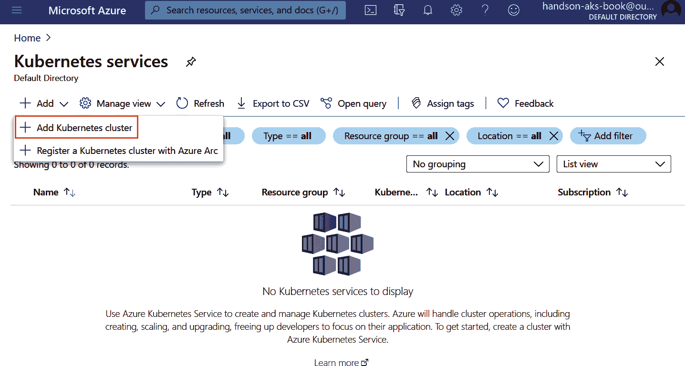
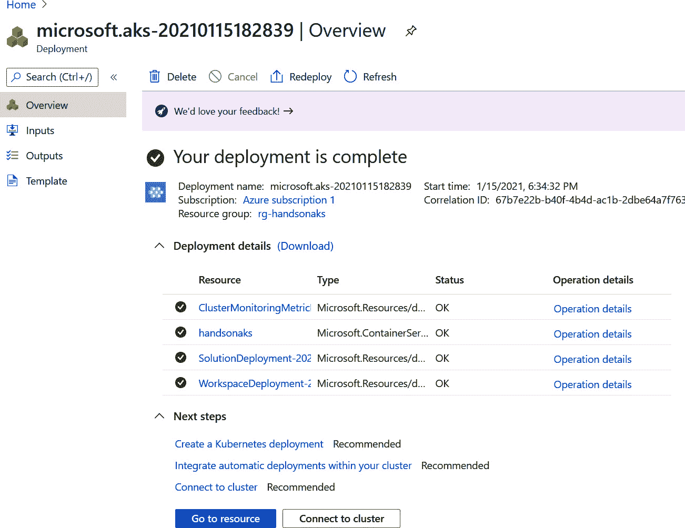
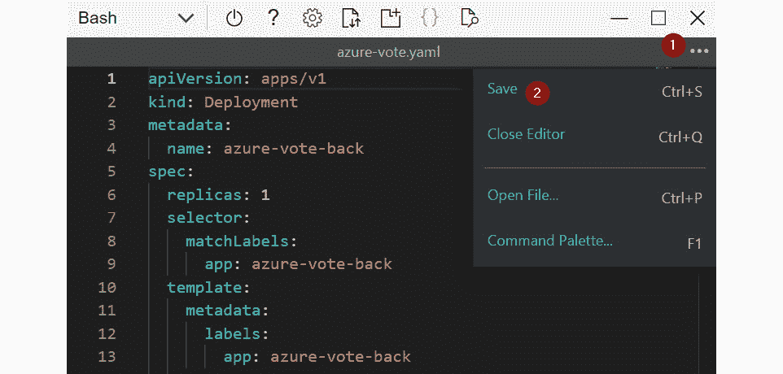

# 2\. 开始使用 Azure Kubernetes Service

正确、安全地安装和维护 Kubernetes 集群是困难的。幸运的是，所有主要的云服务提供商，如**Azure**、**Amazon Web Services**（**AWS**）和**Google Cloud Platform**（**GCP**），都提供了安装和维护集群的支持。在本章中，您将通过 Azure 门户导航，启动自己的集群并运行示例应用程序。所有这些操作都将在您的浏览器中完成。

本章将涵盖以下主题：

+   创建一个新的 Azure 免费帐户

+   创建并启动您的第一个集群

+   部署并检查您的第一个示范应用程序

我们首先来看看创建**Azure Kubernetes Service**（**AKS**）集群的不同方式，然后运行我们的示例应用程序。

## 创建 AKS 集群的不同方式

在本章中，您将使用 Azure 门户来部署 AKS 集群。然而，也有多种方式可以创建 AKS 集群：

+   **使用门户**：门户提供了一个**图形用户界面**（**GUI**），通过向导部署您的集群。这是部署第一个集群的好方法。对于多个部署或自动化部署，推荐使用以下方法之一。

+   **使用 Azure CLI**：Azure **命令行界面**（**CLI**）是一个跨平台的 CLI 工具，用于管理 Azure 资源。它允许您脚本化集群部署，并且可以集成到其他脚本中。

+   **使用 Azure PowerShell**：Azure PowerShell 是一组 PowerShell 命令，用于直接从 PowerShell 管理 Azure 资源。它也可以用来创建 Kubernetes 集群。

+   **使用 ARM 模板**：**Azure 资源管理器**（**ARM**）模板是 Azure 原生的一种部署 Azure 资源的方法，使用**基础设施即代码**（**IaC**）。您可以声明式地部署集群，允许您创建一个模板，供多个团队重用。

+   **使用 Terraform for Azure**：Terraform 是由 HashiCorp 开发的开源 IaC 工具。该工具在开源社区中非常受欢迎，用于部署云资源，包括 AKS。与 ARM 模板一样，Terraform 也使用声明式模板来部署集群。

在本章中，您将使用 Azure 门户创建集群。如果您有兴趣通过 CLI、ARM 模板或 Terraform 部署集群，以下的 Azure 文档包含了如何使用这些工具创建集群的步骤 [`docs.microsoft.com/azure/aks`](https://docs.microsoft.com/azure/aks)。

## 开始使用 Azure 门户

我们将从使用 Azure 门户开始部署初始集群。Azure 门户是一个基于 Web 的管理控制台。它允许您通过单一控制台在全球范围内构建、管理和监控所有 Azure 部署。

#### 注意

为了跟随本书中的示例，你需要一个 Azure 账户。如果你没有 Azure 账户，可以按照 [azure.microsoft.com/free](http://azure.microsoft.com/free) 上的步骤创建一个免费账户。如果你打算在现有订阅中运行此内容，你需要订阅的所有者权限并能够在 **Azure Active Directory** (**Azure AD**) 中创建服务主体。

本书中的所有示例都已在免费试用账户上验证。

我们将直接开始创建我们的 AKS 集群。通过这样做，我们也将熟悉 Azure 门户。

### 创建你的第一个 AKS 集群

首先，浏览到 Azure 门户 [`portal.azure.com`](https://portal.azure.com)。在 Azure 门户顶部的搜索栏中输入关键词 `aks`。在搜索结果中点击服务类别下的 Kubernetes 服务：


图 2.1：使用搜索栏搜索 AKS

这将带你进入门户中的 AKS 面板。正如你可能预料的那样，你还没有任何集群。继续点击 + 添加 按钮，并选择 + 添加 Kubernetes 集群选项：



图 2.2：点击 + 添加 按钮和 + 添加 Kubernetes 集群按钮以开始集群创建过程

#### 注意

在创建 AKS 集群时，有很多选项可以配置。对于第一次创建集群，我们建议使用门户中的默认设置，并在本示例中遵循我们的命名规范。以下设置已经过我们测试，适用于免费账户。

这将带你进入创建向导，开始创建你的第一个 AKS 集群。这里的第一步是创建一个新的资源组。点击创建新建，给你的资源组命名，然后点击 OK。如果你想跟随本书中的示例，请将资源组命名为 `rg-handsonaks`：


图 2.3：创建新资源组

接下来，我们将提供集群的详细信息。给你的集群命名——如果你想跟随书中的示例，请将其命名为 `handsonaks`。我们将在书中使用的区域是 `（US）West US 2`，但你可以选择任何靠近你位置的其他区域。如果你选择的区域支持可用性区域，请取消选择所有区域。

选择 Kubernetes 版本——截至写作时，版本 1.19.6 是最新的受支持版本；如果该版本对你不可用，也无需担心。Kubernetes 和 AKS 发展非常迅速，经常会推出新版本：

#### 注意

对于生产环境，建议在可用区中部署集群。然而，由于我们正在部署一个小型集群，不使用可用区对于本书中的示例来说是最合适的。


图 2.4：提供集群详细信息

接下来，将节点数量更改为 2。为了本书中的演示，默认的`Standard DS2 v2`节点大小足够。这将使您的集群大小类似于*图 2.5*所示的样子：


图 2.5：更新的节点大小和节点数量

#### 注意

您的免费帐户有四核限制，如果使用默认配置，将会超过限制。

第一个窗格的最终视图应类似于*图 2.6*。有多个配置窗格，您无需为本书中将使用的演示集群更改这些配置。既然您已准备好，点击“审核+创建”按钮进行最终审核并创建您的集群：


图 2.6：设置集群配置

在最终视图中，Azure 将验证应用于您的第一个集群的配置。如果您看到“验证通过”消息，请点击创建：


图 2.7：集群配置的最终验证

部署集群大约需要 10 分钟。部署完成后，您可以查看如*图 2.8*所示的部署详情：



图 2.8：集群成功部署后的部署详情

如果您遇到配额限制错误，如*图 2.9*所示，请检查设置并重试。确保选择`Standard DS2_v2`节点大小，并且节点数量为 2：


图 2.9：由于配额限制错误，尝试使用较小的集群大小

进入下一部分，我们将快速查看您的集群；点击如*图 2.8*所示的“转到资源”按钮。这将把您带到 Azure 门户中的 AKS 集群仪表板。

### 在 Azure 门户中快速概览您的集群

如果您在上一节点击了“转到资源”按钮，您将看到 Azure 门户中的集群概览：


图 2.10：Azure 门户中的 AKS 窗格

这是您集群的快速概览。它显示了集群名称、位置和 API 服务器地址。左侧的导航菜单提供了不同的选项来控制和管理您的集群。我们将快速浏览一些门户提供的有趣选项。

Kubernetes 资源部分为您提供关于运行在集群上的工作负载的洞察。例如，您可以查看正在运行的部署和正在运行的 pods。它还允许您在集群上创建新的资源。我们将在本章稍后使用此部分，在您将第一个应用程序部署到 AKS 后。

在节点池面板中，您可以通过添加或删除节点来扩展现有的节点池（即集群中的节点或服务器），实现向上或向下扩展。您可以添加一个新的节点池，可能使用不同的虚拟机规格，还可以单独升级您的节点池。在*图 2.11*中，您可以看到左上角的 + 添加节点池 选项，如果选择了您的节点池，顶部的 升级 和 扩展 选项也会变得可用：


图 2.11：添加、扩展和升级节点池

在**集群配置面板**中，您可以指示 AKS 将控制平面升级到较新版本。通常，在 Kubernetes 升级中，您首先升级控制平面，然后分别升级各个节点池。该面板还允许您启用**基于角色的访问控制**（**RBAC**）（默认启用），并可选择将集群与 Azure AD 集成。您将在*第八章，AKS 中的基于角色的访问控制*中了解更多有关 Azure AD 集成的信息：


图 2.12：使用升级面板升级 API 服务器的 Kubernetes 版本

最后，**Insights** 面板允许您监控集群基础设施和运行在集群上的工作负载。由于您的集群是全新的，因此没有太多数据可以调查。我们将在*第七章*中返回此部分，*监控 AKS 集群和应用程序*：


图 2.13：使用 Insights 面板显示集群利用率

这就是我们对集群和 Azure 门户中一些有趣配置选项的简要概述。在接下来的部分，我们将使用 Cloud Shell 连接到我们的 AKS 集群，并在该集群上启动一个演示应用程序。

### 通过 Azure Cloud Shell 访问您的集群

一旦部署成功完成，找到靠近搜索栏的小 Cloud Shell 图标，如*图 2.14*所示，然后点击它：


图 2.14：点击 Cloud Shell 图标以打开 Azure Cloud Shell

门户会要求您选择 PowerShell 或 Bash 作为默认的 shell 环境。由于我们主要处理 Linux 工作负载，请选择 Bash：


图 2.15：选择 Bash 选项

如果这是您第一次启动 Cloud Shell，系统会要求您创建一个存储账户；请确认并创建它：


图 2.16：为 Cloud Shell 创建新存储账户

在创建存储后，您可能会收到包含挂载存储错误的错误信息。如果发生这种情况，请重启您的 Cloud Shell：


图 2.17：在收到挂载存储错误时点击重启按钮

点击电源按钮。它应该会重启，您应该会看到类似 *图 2.18* 的界面：


图 2.18：成功启动 Cloud Shell

您可以上下拖动分隔符/分隔线，以查看更多或更少的 Shell 内容：


图 2.19：使用分隔符调整 Cloud Shell 大小

用于与 Kubernetes 集群交互的命令行工具是 `kubectl`。使用 Azure Cloud Shell 的好处是，这个工具以及许多其他工具都预安装并定期维护。`kubectl` 使用存储在 `~/.kube/config` 中的配置文件来存储访问集群的凭证。

#### 注意

在 Kubernetes 社区中，关于 `kubectl` 的正确发音有一些讨论。常见的发音方式是 *kube-c-t-l*、*kube-control* 或 *kube-cuddle*。

为了获取访问您集群所需的凭证，您需要输入以下命令：

```
az aks get-credentials \
  --resource-group rg-handsonaks \
  --name handsonaks
```

#### 注意

本书中，您将经常看到较长的命令分布在多行中，并使用反斜杠符号。这有助于提高命令的可读性，同时仍然允许您复制粘贴。如果您正在输入这些命令，可以安全地忽略反斜杠，并将完整命令输入在同一行中。

为了验证您是否有访问权限，请输入以下内容：

```
kubectl get nodes
```

您应该看到类似 *图 2.20* 的内容：


图 2.20：`kubectl get nodes` 命令的输出

该命令已验证您可以连接到您的 AKS 集群。在下一节中，您将继续启动第一个应用程序。

### 部署并检查您的第一个演示应用

既然您已经连接成功，让我们启动您的第一个应用程序。在本节中，您将部署第一个应用，并通过 `kubectl` 以及稍后通过 Azure 门户检查它。我们先从部署应用开始。

### 部署演示应用

在这一部分，你将部署你的演示应用程序。为此，你需要写一些代码。在 Cloud Shell 中，有两种方式可以编辑代码。你可以通过命令行工具，如`vi`或`nano`，来编辑代码，或者你可以通过在 Cloud Shell 中输入`code`命令使用基于 GUI 的代码编辑器。在本书中，示例会主要指导你使用图形编辑器，但你可以自由选择你最熟悉的任何工具。

为了本书的目的，所有代码示例都托管在一个 GitHub 仓库中。你可以将此仓库克隆到你的 Cloud Shell 中，并直接使用这些代码示例。要将 GitHub 仓库克隆到 Cloud Shell 中，请使用以下命令：

```
git clone https://github.com/PacktPublishing/Hands-on-Kubernetes-on-Azure-Third-Edition.git Hands-On-Kubernetes-on-Azure
```

要访问本章的代码示例，请进入代码示例的目录，并转到`Chapter02`目录：

```
cd Hands-On-Kubernetes-on-Azure/Chapter02/
```

现在你将直接使用`Chapter02`文件夹中的代码。此时，你不必专注于代码文件中的内容。本章的目标是启动一个集群，并在其上部署一个应用程序。在接下来的章节中，我们将深入探讨 Kubernetes 配置文件的构建方式，以及如何创建你自己的配置文件。

你将根据`azure-vote.yaml`文件中的定义创建一个应用程序。要在 Cloud Shell 中打开该文件，可以输入以下命令：

```
code azure-vote.yaml
```

这是便于你参考的代码示例：

```
1 	apiVersion: apps/v1
2 	kind: Deployment
3 	metadata:
4 	  name: azure-vote-back
5 	spec:
6 	  replicas: 1
7 	  selector:
8 		matchLabels:
9 		  app: azure-vote-back
10	  template:
11		metadata:
12		  labels:
13			app: azure-vote-back
14		spec:
15		  containers:
16		  - name: azure-vote-back
17			image: redis
18			resources:
19			  requests:
20				cpu: 100m
21				memory: 128Mi
22			  limits:
23				cpu: 250m
24				memory: 256Mi
25			ports:
26			- containerPort: 6379
27			  name: redis
28	---
29	apiVersion: v1
30	kind: Service
31	metadata:
32	  name: azure-vote-back
33	spec:
34	  ports:
35	  - port: 6379
36	  selector:
37		app: azure-vote-back
38	---
39	apiVersion: apps/v1
40	kind: Deployment
41	metadata:
42	  name: azure-vote-front
43	spec:
44	  replicas: 1
45	  selector:
46		matchLabels:
47		  app: azure-vote-front
48	  template:
49		metadata:
50		  labels:
51			app: azure-vote-front
52		spec:
53		  containers:
54		  - name: azure-vote-front
55			image: microsoft/azure-vote-front:v1
56			resources:
57			  requests:
58				cpu: 100m
59				memory: 128Mi
60			  limits:
61				cpu: 250m
62				memory: 256Mi
63			ports:
64			- containerPort: 80
65			env:
66			- name: REDIS
67			  value: "azure-vote-back"
68	---
69	apiVersion: v1
70	kind: Service
71	metadata:
72	  name: azure-vote-front
73	spec:
74	  type: LoadBalancer
75	  ports:
76	  - port: 80
77	  selector:
78		app: azure-vote-front
```

你可以在 Cloud Shell 代码编辑器中对文件进行更改。如果你做了更改，可以通过点击右上角的...图标，然后点击保存来保存文件，如*图 2.21*所示：



图 2.21：保存 azure-vote.yaml 文件

文件应该已保存。你可以通过以下命令来检查：

```
cat azure-vote.yaml
```

#### 注意：

按下*Tab*按钮会在 Linux 中展开文件名。在前述情况下，如果你在输入`az`后按下*Tab*，它应该会展开为`azure-vote.yaml`。

现在，让我们启动应用程序：

```
kubectl create -f azure-vote.yaml
```

你应该很快看到如*图 2.22*所示的输出，它会告诉你哪些资源已被创建：


图 2.22：kubectl create 命令的输出

你已经成功创建了演示应用程序。在接下来的部分，你将检查 Kubernetes 为该应用程序创建的所有不同对象，并连接到你的应用程序。

### 探索演示应用程序

在上一部分，你已经部署了一个演示应用程序。在这一部分，你将探索 Kubernetes 为该应用程序创建的不同对象并连接到它。

你可以通过输入以下命令来检查部署的进度：

```
kubectl get pods
```

如果你在创建应用程序后不久输入此命令，你可能会看到某个 Pod 仍处于`ContainerCreating`过程：


图 2.23：kubectl get pods 命令的输出

#### 注意

输入`kubectl`可能会变得乏味。你可以使用`alias`命令来简化操作。你可以使用`k`代替`kubectl`作为别名，命令如下：`alias k=kubectl`。执行上述命令后，你可以直接使用`k get pods`。为了本书的教学目的，我们将继续使用完整的`kubectl`命令。

按*上箭头*键并按*Enter*重复执行`kubectl get pods`命令，直到所有 Pod 的状态为`Running`。设置所有 Pod 需要一些时间，你也可以选择使用以下命令跟踪它们的状态：

```
kubectl get pods --watch
```

要停止跟踪 Pod 的状态（当它们都处于运行状态时），你可以按*Ctrl* + *C*。

为了使你的应用能够公开访问，你还需要一个额外的信息。你需要知道负载均衡器的公共 IP 地址，这样你才能访问它。如果你记得在*第一章*，《容器与 Kubernetes 简介》中提到，Kubernetes 中的服务将创建一个 Azure 负载均衡器。这个负载均衡器会为你的应用获取一个公共 IP，从而使你能够公开访问它。

输入以下命令以获取负载均衡器的公共 IP：

```
kubectl get service azure-vote-front --watch
```

一开始，外部 IP 可能显示为`pending`。等待公共 IP 出现后，再按*Ctrl* + *C*退出：


图 2.24：观察服务 IP 从待定状态变化为实际 IP 地址

请注意外部 IP 地址并在浏览器中输入。你应该看到类似*图 2.25*的输出：


图 2.25：你刚刚启动的实际应用

点击“Cats”或“Dogs”，并观察计数增加。

要查看为你的应用在 Kubernetes 中创建的所有对象，你可以使用`kubectl get all`命令。这将显示类似*图 2.26*的输出：


图 2.26：探索为你的应用创建的所有 Kubernetes 对象

如你所见，创建了许多对象：

+   Pods：你将看到两个 Pod，一个用于后端，一个用于前端。

+   服务：你还会看到两个服务，一个用于后端，类型为`ClusterIP`，另一个用于前端，类型为 LoadBalancer。这些类型的含义将在*第三章*，《在 AKS 上进行应用部署》中探讨。

+   部署：你还将看到两个部署。

+   副本集：最后你将看到两个副本集。

你也可以通过 Azure 门户查看这些对象。例如，要查看两个部署，你可以点击 AKS 面板左侧导航菜单中的**工作负载**，然后你将看到集群中的所有部署，如*图 2.27*所示。此图显示了集群中的所有部署，包括系统部署。在列表底部，你可以看到你自己的部署。正如图中所示，你还可以通过顶部菜单查看其他对象，如 pod 和 ReplicaSet：


图 2.27：在 Azure 门户中查看应用程序的两个部署部分

你现在已经启动了自己的集群和第一个 Kubernetes 应用程序。请注意，Kubernetes 处理了连接前端和后端、将其暴露到外部以及为服务提供存储等任务。

在进入下一章节之前，让我们清理一下你的部署。由于你是从文件创建的一切，你也可以通过将 Kubernetes 指向该文件来删除所有内容。输入`kubectl delete -f azure-vote.yaml`，然后观察所有对象被删除：


图 2.28：清理应用程序

在本节中，你已经通过 Cloud Shell 连接到你的 AKS 集群，成功启动并连接到演示应用程序，探索了通过 Cloud Shell 和 Azure 门户创建的对象，并最终清理了已创建的资源。

## 总结

完成本章后，你将能够访问并导航 Azure 门户，以执行所有部署 AKS 集群所需的功能。我们利用 Azure 的免费试用版，深入了解了 AKS 的各个方面。我们还启动了自己的 AKS 集群，并能够根据需要通过 Azure 门户自定义配置。

我们还使用了 Cloud Shell，而无需在计算机上安装任何东西。这对于接下来的所有章节非常重要，因为你将不仅仅是启动简单的应用程序。最后，我们启动了一个公开可访问的服务。这个应用程序的框架与我们将在后续章节中讨论的复杂应用程序相同。

在下一章节中，我们将深入研究不同的部署选项，以将应用程序部署到 AKS 上。
