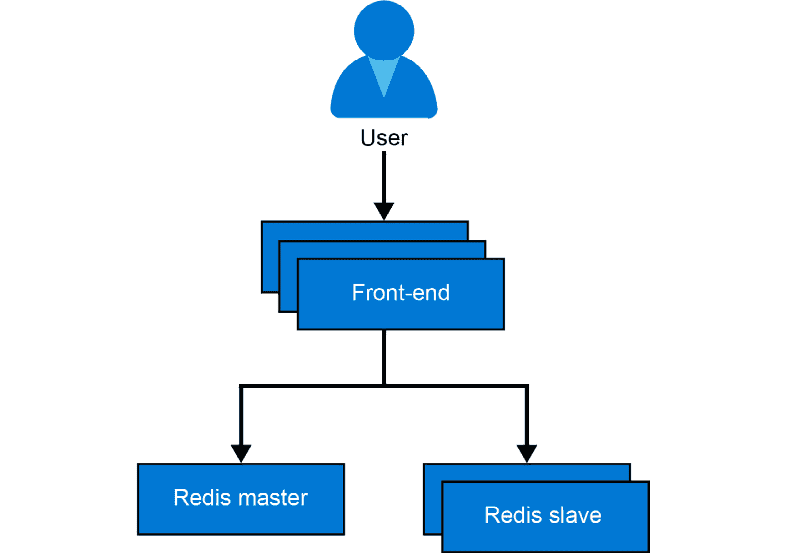
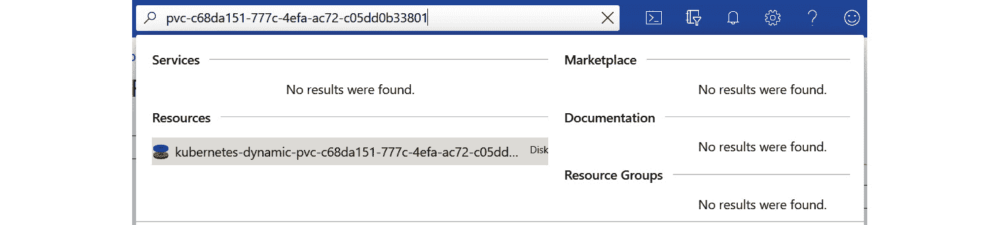
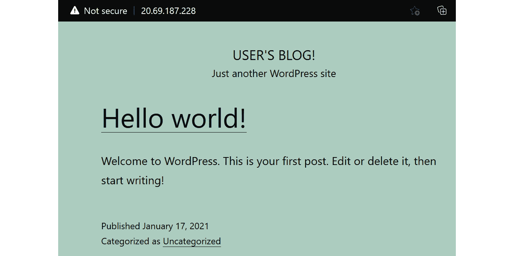

# 第四章：3. 在 AKS 上部署应用程序

在本章中，你将在 **Azure Kubernetes Service**（**AKS**）上部署两个应用程序。一个应用程序由多个部分组成，你将一步一步地构建这些应用程序，同时解释它们背后的概念模型。你将能够轻松地将本章中的步骤应用到 AKS 上部署任何其他应用程序。

为了部署应用程序并对其进行更改，你将使用**YAML**文件。YAML 是 **YAML Ain't Markup Language** 的递归缩写。YAML 是一种用于创建配置文件以部署到 Kubernetes 的语言。虽然你可以使用 JSON 或 YAML 文件将应用程序部署到 Kubernetes，但 YAML 是最常用的语言。YAML 之所以受欢迎，是因为它比 JSON 或 XML 更易于人类阅读。你将在本章和整本书中看到多个 YAML 文件的示例。

在部署示例的留言簿应用程序时，你将看到 Kubernetes 概念的实际应用。你将看到**部署**是如何与**ReplicaSet**关联的，且**ReplicaSet**又是如何与已部署的**pods**关联的。部署是 Kubernetes 中的一个对象，用于定义应用程序的期望状态。**部署**将创建一个 ReplicaSet。**ReplicaSet**是 Kubernetes 中的一个对象，确保始终有一定数量的**pods**可用。因此，ReplicaSet 将创建一个或多个 pods。Pod 是 Kubernetes 中的一个对象，它是一个或多个容器的集合。让我们再来看一下部署、ReplicaSets 和 pods 之间的关系：


图 3.1：部署、ReplicaSet 和 pod 之间的关系

在部署示例应用程序时，你将使用**service**对象连接到应用程序。Kubernetes 中的服务对象用于为应用程序提供一个静态的 IP 地址和 DNS 名称。由于 pod 可能被销毁并移动到集群中的不同节点，服务确保你可以通过静态端点连接到应用程序。

你还将编辑示例应用程序，使用**ConfigMap**提供配置详细信息。ConfigMap 是一个对象，用于向 pod 提供配置信息。它允许你将配置设置保留在实际容器之外。然后，你可以通过将 ConfigMap 连接到你的部署，将这些配置信息提供给你的应用程序。

最后，你将接触到 Helm。Helm 是 Kubernetes 的一个包管理工具，帮助简化部署过程。你将使用 Helm 部署一个 WordPress 网站，并了解 Helm 为 Kubernetes 带来的价值。这个 WordPress 安装使用了 Kubernetes 中的持久存储，你将学习如何在 AKS 中设置持久存储。

本章将涵盖以下主题：

+   分步部署示例留言簿应用程序

+   示例留言簿应用程序的完整部署

+   使用 Helm 安装复杂的 Kubernetes 应用程序

我们将从示例留言簿应用程序开始。

## 分步部署示例留言簿应用程序

在本章中，你将部署经典的留言簿示例 Kubernetes 应用程序。你将主要按照 [`kubernetes.io/docs/tutorials/stateless-application/guestbook/`](https://kubernetes.io/docs/tutorials/stateless-application/guestbook/) 上的步骤进行，并做一些修改。你将使用这些修改来展示一些额外的概念，例如 ConfigMaps，这些在原始示例中并未出现。

示例留言簿应用程序是一个简单的多层次 Web 应用程序。该应用程序中的不同层次将拥有多个实例。这对高可用性和可扩展性都非常有益。留言簿的前端是一个无状态应用程序，因为前端不存储任何状态。后端的 Redis 集群是有状态的，因为它存储所有留言簿条目。

你将在下一章中使用该应用程序作为基础，测试后端和前端的独立扩展。

在我们开始之前，让我们考虑一下我们将要部署的应用程序。

### 介绍该应用程序

该应用程序存储和显示留言簿条目。你可以用它记录所有访问你酒店或餐馆的人的意见。

*图 3.2* 显示了该应用程序的高层概述。该应用程序使用 PHP 作为前端。前端将通过多个副本进行部署。该应用程序使用 Redis 进行数据存储。Redis 是一个内存中的键值数据库。Redis 最常用作缓存。



图 3.2：留言簿应用程序的高层概述

我们将通过部署 Redis 主节点开始部署该应用程序。

### 部署 Redis 主节点

在本节中，你将部署 Redis 主节点。你将学习此部署所需的 YAML 语法。在下一节中，你将对这个 YAML 进行更改。在进行更改之前，我们先开始部署 Redis 主节点。

执行以下步骤以完成任务：

1.  打开你友好的 Azure 云 Shell，如 *图 3.3* 所示：

    图 3.3：打开云 Shell

1.  如果你还没有克隆本书的 GitHub 仓库，请现在使用以下命令进行克隆：

    ```
    git clone https: //github.com/PacktPublishing/Hands-on-Kubernetes-on-Azure-Third-Edition/
    ```

1.  使用以下命令切换到第三章的目录：

    ```
    cd Hands-On-Kubernetes-on-Azure/Chapter03/
    ```

1.  输入以下命令以部署主节点：

    ```
    kubectl apply -f redis-master-deployment.yaml
    ```

    应用程序下载并启动需要一些时间。等待时，让我们来理解一下你刚刚输入并执行的命令。我们先从探索用于该命令的 YAML 文件内容开始（行号用于解释代码片段中的关键元素）：

    ```
    1   apiVersion: apps/v1
    2   kind: Deployment
    3   metadata:
    4     name: redis-master
    5     labels:
    6       app: redis
    7   spec:
    8     selector:
    9       matchLabels:
    10        app: redis
    11        role: master
    12        tier: backend
    13    replicas: 1
    14    template:
    15      metadata:
    16        labels:
    17          app: redis
    18          role: master
    19          tier: backend
    20      spec:
    21        containers:
    22        - name: master
    23          image: k8s.gcr.io/redis:e2e 
    24          resources:
    25            requests:
    26              cpu: 100m
    27              memory: 100Mi
    28            limits:
    29              cpu: 250m
    30              memory: 1024Mi
    31          ports:
    32          - containerPort: 6379
    ```

    让我们逐行深入分析代码，理解提供的参数：

    +   `deployment` 被命名为 `redis-master`。

    +   `app: redis, role: master, and tier: backend`）。前面的标签与第*14-19*行提供的标签完全匹配。

    +   `master`。在多容器 Pod 的情况下，每个容器都需要一个唯一的名称。

    +   `redis` 镜像标记为 `e2e`（已通过端到端[`e2e`]测试的最新 Redis 镜像）。

    +   `cpu/memory` 为容器请求的资源。在 Kubernetes 中，资源请求是资源的保留，其他 Pod 无法使用这些资源。如果这些资源在集群中不可用，Pod 将无法启动。在这种情况下，请求的是 0.1 CPU，等于 `100m`，也通常称为 100 毫核。请求的内存是 `100Mi`，即 104,857,600 字节，约等于 105 MB。CPU 和内存限制以类似方式设置。限制是容器可以使用的最大资源。如果 Pod 达到 CPU 限制，它将被限制使用，而如果达到了内存限制，它将被重启。在 Kubernetes 中，设置请求和限制是最佳实践。更多信息，请参见 [`kubernetes.io/docs/concepts/configuration/manage-compute-resources-container/`](https://kubernetes.io/docs/concepts/configuration/manage-compute-resources-container/)。

    +   `6379`。

如你所见，部署的 YAML 定义包含多个 Kubernetes 将用于部署和配置应用程序的设置和参数。

#### 注意

Kubernetes 的 YAML 定义类似于给 Docker 运行特定容器镜像时提供的参数。如果你需要手动运行该命令，你将以以下方式定义此示例：

`# 运行一个名为 master 的容器，监听端口 6379，内存为 100M，CPU 为 100m，使用 redis:e2e 镜像。`

`docker run --name master -p 6379:6379 -m 100M -c 100m -d k8s.gcr.io/redis:e2e`

在本节中，你已经部署了 Redis 主节点，并了解了用于创建此部署的 YAML 文件的语法。在下一节中，你将检查部署并了解创建的不同元素。

### 检查部署

`redis-master` 部署现在应该已完成。在你之前打开的 Azure Cloud Shell 中继续输入以下命令：

```
kubectl get all
```

你应该会看到类似于*图 3.4*中的输出。在你的情况中，Pod 和 ReplicaSet 的名称可能会在名称末尾包含不同的 ID。如果你没有看到 Pod、部署和 ReplicaSet，请按照上一节第 4 步中的说明再次运行代码。


图 3.4：由你的部署创建的对象

你可以看到你创建了一个名为 `redis-master` 的部署。它控制一个名为 `redis-master-f46ff57fd` 的 ReplicaSet。进一步检查后，你还会发现该 ReplicaSet 控制着一个 pod，`redis-master-f46ff57fd-b8cjp`。*图 3.1* 以图示方式展示了这种关系。

可以通过执行 `kubectl describe <object> <instance-name>` 命令获取更多详细信息，如下所示：

```
kubectl describe deployment/redis-master
```

这将生成如下输出：


图 3.5：部署的描述

现在，你已经使用默认配置启动了一个 Redis 主节点。通常情况下，你会使用特定于环境的配置来启动应用程序。

在下一部分，你将了解一个新概念，叫做 ConfigMap，并重建 Redis 主节点。因此，在继续之前，请清理当前版本，你可以通过运行以下命令来完成：

```
kubectl delete deployment/redis-master
```

执行此命令将生成以下输出：

```
deployment.apps "redis-master" deleted
```

在本节中，你检查了所创建的 Redis 主节点部署。你看到了部署如何与 ReplicaSet 关联，ReplicaSet 又如何与 pods 关联。在接下来的部分，你将使用通过 ConfigMap 提供的特定环境配置重新创建这个 Redis 主节点。

### 带有 ConfigMap 的 Redis 主节点

上一次的部署没有问题。在实际使用中，很少会在没有一些配置设置的情况下启动应用程序。在这种情况下，你将使用 ConfigMap 设置 `redis-master` 的配置设置。

ConfigMap 是一种便携式配置容器的方式，无需为每个环境使用专门的镜像。它包含一个键值对，用于设置容器中的数据。ConfigMap 用于非敏感配置。Kubernetes 还有一个单独的对象叫做 **Secret**。Secret 用于存储包含敏感数据（如密码）的配置。关于这一点将在本书的 *第十章，AKS 中的秘密存储* 中详细探讨。

在本示例中，你将创建一个 ConfigMap。在此 ConfigMap 中，你将配置 `redis-config` 作为键，值将是以下两行内容：

```
maxmemory 2mb
maxmemory-policy allkeys-lru
```

现在，让我们来创建这个 ConfigMap。有两种方法可以创建 ConfigMap：

+   从文件创建 ConfigMap

+   从 YAML 文件创建 ConfigMap

在接下来的两部分中，你将探索这两种方法。

### 从文件创建 ConfigMap

以下步骤将帮助我们从文件创建 ConfigMap：

1.  在终端中输入 `code redis-config` 打开 Azure Cloud Shell 代码编辑器。复制并粘贴以下两行，并将文件保存为 `redis-config`：

    ```
    maxmemory 2mb
    maxmemory-policy allkeys-lru
    ```

1.  现在你可以使用以下代码创建 ConfigMap：

    ```
    kubectl create configmap \
      example-redis-config --from-file=redis-config
    ```

    你应该获得如下输出：

    ```
    configmap/example-redis-config created
    ```

1.  你可以使用相同的命令描述此 ConfigMap：

    ```
    kubectl describe configmap/example-redis-config
    ```

    输出将如 *图 3.6* 所示：


图 3.6：ConfigMap 描述

在这个例子中，你通过引用磁盘上的文件来创建了 ConfigMap。另一种部署 ConfigMap 的方式是通过从 YAML 文件中创建它们。让我们在下一节中看看如何做到这一点。

### 从 YAML 文件创建 ConfigMap

在本节中，你将使用 YAML 文件重新创建上一节中的 ConfigMap：

1.  首先，删除先前创建的 ConfigMap：

    ```
    kubectl delete configmap/example-redis-config
    ```

1.  将以下内容复制并粘贴到名为 `example-redis-config.yaml` 的文件中，然后保存：

    ```
    1  apiVersion: v1
    2  data:
    3    redis-config: |-
    4      maxmemory 2mb
    5      maxmemory-policy allkeys-lru
    6  kind: ConfigMap
    7  metadata:
    8    name: example-redis-config
    ```

1.  现在你可以通过以下命令创建你的 ConfigMap：

    ```
    kubectl create -f example-redis-config.yaml
    ```

    你应该会得到如下输出：

    ```
    configmap/example-redis-config created
    ```

1.  接下来，运行以下命令：

    ```
    kubectl describe configmap/example-redis-config
    ```

    此命令返回与之前相同的输出，如 *图 3.6* 所示。

如你所见，通过使用 YAML 文件，你成功创建了相同的 ConfigMap。

#### 注意

`kubectl get` 具有有用的 `-o` 选项，可以用来获取对象的输出，无论是 YAML 还是 JSON 格式。这在你手动更改系统并希望查看结果对象的 YAML 格式时非常有用。你可以使用以下命令获取当前 ConfigMap 的 YAML 输出：

`kubectl get -o yaml configmap/example-redis-config`

现在你已经定义了 ConfigMap，接下来我们来使用它。

### 使用 ConfigMap 读取配置数据

在本节中，你将重新配置 `redis-master` 部署，以从 ConfigMap 读取配置：

1.  首先，修改 `redis-master-deployment.yaml` 以使用 ConfigMap，修改方法如下。你需要做的更改将在源代码后解释：

    ```
    1  apiVersion: apps/v1
    2  kind: Deployment
    3  metadata:
    4    name: redis-master
    5    labels:
    6      app: redis
    7  spec:
    8    selector:
    9      matchLabels:
    10       app: redis
    11       role: master
    12       tier: backend
    13   replicas: 1
    14   template:
    15     metadata:
    16       labels:
    17         app: redis
    18         role: master
    19         tier: backend
    20     spec:
    21       containers:
    22       - name: master
    23         image: k8s.gcr.io/redis:e2e
    24         command:
    25         - redis-server
    26         - "/redis-master/redis.conf"
    27         env:
    28         - name: MASTER
    29           value: "true"
    30         volumeMounts:
    31         - mountPath: /redis-master
    32           name: config
    33         resources:
    34           requests:
    35             cpu: 100m
    36             memory: 100Mi
    37         ports:
    38         - containerPort: 6379
    39       volumes:
    40         - name: config
    41           configMap:
    42             name: example-redis-config
    43             items:
    44             - key: redis-config
    45               path: redis.conf
    ```

    #### 注意

    如果你下载了本书的源代码，在 *第三章，应用程序在 AKS 上部署* 中，有一个文件叫做 `redis-master-deployment_Modified.yaml`，其中应用了必要的更改。

    让我们深入分析代码，理解不同的部分：

    +   `redis-server` 指向特定的配置文件。

    +   `docker run -e "MASTER=true". --name master -p 6379:6379 -m 100M -c 100m -d Kubernetes /redis:v1`。这将环境变量 `MASTER` 设置为 `true`。你的应用程序可以读取环境变量设置来进行配置。

    +   `config`（该卷在第 39-45 行定义）位于正在运行的容器中的 `/redis-master` 路径。它将隐藏原容器中 `/redis-master` 上的内容。

    +   用 Docker 的术语来说，这等同于 `docker run -v config:/redis-master. -e "MASTER=TRUE" --name master -p 6379:6379 -m 100M -c 100m -d Kubernetes /redis:v1`。

    +   `config`。这个名称将在该 pod 的上下文中使用。

    +   `example-redis-config` ConfigMap。该 ConfigMap 应该已经存在于系统中。你已经定义了它，所以一切正常。

    +   `redis-config` 键（两行 `maxmemory` 设置）作为 `redis.conf` 文件。

通过将 ConfigMap 作为卷添加并挂载卷，你可以加载动态配置。

1.  让我们创建这个更新后的部署：

    ```
    kubectl create -f redis-master-deployment_Modified.yaml
    ```

    这应该输出以下内容：

    ```
    deployment.apps/redis-master created
    ```

1.  现在让我们确认配置是否成功应用。首先，获取 Pod 的名称：

    ```
    kubectl get pods
    ```

    这应该返回类似于*图 3.7*的输出：

    

    图 3.7：Pod 详情

1.  然后 `exec` 进入 Pod 并验证设置是否已应用：

    ```
    kubectl exec -it redis-master-<pod-id> -- redis-cli
    ```

    这会打开一个与正在运行的 Pod 连接的 `redis-cli` 会话。现在你可以获取 `maxmemory` 配置：

    ```
    CONFIG GET maxmemory
    ```

    然后你可以获取 `maxmemory-policy` 配置：

    ```
    CONFIG GET maxmemory-policy
    ```

    这应该给你类似于*图 3.8*的输出：

    

    图 3.8：在 Pod 中验证 Redis 配置

1.  要离开 Redis shell，请键入 `exit` 命令。

总结一下，你刚刚完成了配置云原生应用程序的重要步骤，即为应用程序提供动态配置数据。你还会注意到，应用程序必须配置为动态读取配置。在你设置应用程序配置后，你访问了一个运行中的容器来验证运行配置。你将在本书中频繁使用这种方法来验证正在运行的应用程序的功能。

#### 注意

使用 `kubectl exec` 命令连接到正在运行的容器对于故障排除和诊断非常有用。由于容器是短暂的，绝不要通过连接容器来进行额外的配置或安装。这些应该是容器镜像的一部分，或者是通过 Kubernetes 提供的配置（就像你刚才做的那样）。

在本节中，你配置了 Redis 主服务从 ConfigMap 加载配置数据。在下一节中，我们将部署端到端应用程序。

## 完整部署示例访客簿应用程序

通过绕道了解使用 ConfigMap 动态配置应用程序后，你将返回到部署其余访客簿应用程序的部分。你将再次遇到部署、ReplicaSets 和 Pod 的概念。除此之外，你还将接触到另一个关键概念——服务。

要启动完整部署，我们将创建一个服务来暴露 Redis 主服务。

### 暴露 Redis 主服务

在普通 Docker 中暴露端口时，暴露的端口仅限于运行该容器的主机。使用 Kubernetes 网络时，集群中的不同 Pod 之间有网络连接。然而，Pod 本身是短暂的，意味着它们可以被关闭、重启，甚至移到其他主机而不保持其 IP 地址。如果你直接连接到 Pod 的 IP 地址，如果该 Pod 被移到新主机，可能会失去连接。

Kubernetes 提供了 `service` 对象，用于解决这个问题。通过使用标签匹配选择器，它将流量发送到正确的 pods。如果有多个 pods 为一个服务提供流量，它还会进行负载均衡。在这种情况下，主节点只有一个 pod，所以它确保流量无论 pod 运行在哪个节点上，都会被定向到该 pod。要创建服务，请运行以下命令：

```
kubectl apply -f redis-master-service.yaml
```

`redis-master-service.yaml` 文件包含以下内容：

```
1   apiVersion: v1
2   kind: Service
3   metadata:
4     name: redis-master
5     labels:
6       app: redis
7       role: master
8       tier: backend
9   spec:
10   ports:
11   - port: 6379
12     targetPort: 6379
13    selector:
14      app: redis
15      role: master
16      tier: backend
```

现在，让我们看看您使用前面的代码创建了什么：

+   `redis-master`，它具有与我们的 `redis-master` 服务器 pod 相同的标签。

+   将 `6379` 端口转发到与第 13 行到第 16 行之间定义的选择器匹配的 pods 的 `6379` 端口。

+   `app: redis, role: master and tier: backend`）预计处理 `6379` 端口流量。如果回顾前面的示例，这些正是我们应用于该部署的标签。

您可以通过运行以下命令检查服务的属性：

```
kubectl get service
```

这将为您提供一个输出，如 *图 3.9* 所示：


图 3.9：创建的服务的属性

您看到已创建一个名为 `redis-master` 的新服务。它的 Cluster-IP 为 `10.0.106.207`（在您的情况下，IP 可能不同）。请注意，这个 IP 仅在集群内部有效（因此是 `ClusterIP` 类型）。

#### 注意

现在您正在创建一个 `ClusterIP` 类型的服务。后续章节将介绍其他类型的服务。

服务还会引入一个 `<service-name>.<namespace>.svc.cluster.local`；在本例中，它将是 `redis-master.default.svc.cluster.local`。为了查看这个功能，我们将在 `redis-master` pod 上进行域名解析。默认镜像没有安装 `nslookup`，所以我们通过运行 `ping` 命令来绕过这一点。如果该流量没有返回，请不要担心；这是因为您没有在服务中暴露 `ping`，只暴露了 `redis` 端口。然而，这个命令对于查看完整的 DNS 名称以及域名解析的工作非常有用。让我们来看一下：

```
kubectl get pods
#note the name of your redis-master pod
kubectl exec -it redis-master-<pod-id> -- bash
ping redis-master
```

这应该会输出结果的名称解析，显示 `exit` 命令，如 *图 3.10* 所示：


图 3.10：使用 ping 命令查看服务的 FQDN

在本节中，您通过服务暴露了 Redis 主节点。这确保了即使一个 pod 移动到不同的主机，也可以通过服务的 IP 地址访问。在下一节中，您将部署 Redis 副本，它们有助于处理更多的读取流量。

### 部署 Redis 副本

在云端运行单一后端并不推荐。你可以将 Redis 配置为主从（leader-follower）模式。这意味着你可以有一个主节点处理写操作流量，多个副本处理读操作流量。这有助于处理增加的读流量和提高可用性。

让我们来配置这个：

1.  通过运行以下命令创建部署：

    ```
    kubectl apply -f redis-replica-deployment.yaml
    ```

1.  让我们检查一下当前已创建的所有资源：

    ```
    kubectl get all
    ```

    输出将如*图 3.11*所示：

    

    图 3.11：部署 Redis 副本会创建多个新对象

1.  根据之前的输出，你可以看到你创建了两个 `redis-replica` Pods 的副本。可以通过查看 `redis-replica-deployment.yaml` 文件来确认这一点：

    ```
    1   apiVersion: apps/v1
    2   kind: Deployment
    3   metadata:
    4     name: redis-replica
    5     labels:
    6       app: redis
    7   spec:
    8     selector:
    9       matchLabels:
    10       app: redis
    11       role: replica
    12       tier: backend
    13   replicas: 2
    14   template:
    15     metadata:
    16       labels:
    17         app: redis
    18         role: replica
    19         tier: backend
    20     spec:
    21       containers:
    22       - name: replica
    23         image: gcr.io/google-samples/gb-redis-follower:v1 24         resources:
    25           requests:
    26             cpu: 100m
    27             memory: 100Mi
    28         env:
    29         - name: GET_HOSTS_FROM
    30           value: dns
    31         ports:
    32         - containerPort: 6379
    ```

    除了以下几点，其余部分都是相同的：

    +   将 `GET_HOSTS_FROM` 设置为 `dns`。这是一个设置，指定 Redis 应该使用 DNS 获取主节点的主机名。

    如你所见，这与之前创建的 Redis 主节点类似。

1.  与主服务一样，你需要通过运行以下命令暴露副本服务：

    ```
    kubectl apply -f redis-replica-service.yaml
    ```

    这个服务和 `redis-master` 服务的唯一不同之处在于，它将流量代理到具有 `role:replica` 标签的 Pods。

1.  通过运行以下命令检查 `redis-replica` 服务：

    ```
    kubectl get service
    ```

    这将给出*图 3.12*中所示的输出：


图 3.12：Redis-master 和 redis-replica 服务

现在你已经拥有一个运行中的 Redis 集群，其中包含一个主节点和两个副本。在接下来的部分，你将部署并暴露前端。

### 部署并暴露前端

到目前为止，你主要集中在 Redis 后端。现在你已经准备好部署前端了。这将为你的应用程序添加一个可以交互的图形网页。

你可以使用以下命令创建前端：

```
kubectl apply -f frontend-deployment.yaml
```

要验证部署，请运行以下命令：

```
kubectl get pods
```

这将显示在*图 3.13*中展示的输出：


图 3.13：验证前端部署

你会注意到，这个部署指定了`3`个副本。这个部署有通常的组成部分，只有少许改动，如下代码所示：

```
1  apiVersion: apps/v1
2   kind: Deployment
3   metadata:
4     name: frontend
5     labels:
6       app: guestbook
7   spec:
8     selector:
9       matchLabels:
10        app: guestbook
11        tier: frontend
12    replicas: 3
13    template:
14      metadata:
15        labels:
16          app: guestbook
17          tier: frontend
18      spec:
19        containers:
20        - name: php-redis
21          image: gcr.io/google-samples/gb-frontend:v4
22          resources:
23            requests:
24              cpu: 100m
25              memory: 100Mi
26          env:
27          - name: GET_HOSTS_FROM
28            value: env
29          - name: REDIS_SLAVE_SERVICE_HOST
30            value: redis-replica
31          ports:
32          - containerPort: 80
```

让我们来看一下这些变化：

+   **第 11 行**：副本数量设置为 3。

+   `app: guestbook` 和 `tier: frontend`。

+   使用 `gb-frontend:v4` 作为镜像。

你现在已经创建了前端部署。接下来，你需要将其暴露为服务。

### 暴露前端服务

定义 Kubernetes 服务有多种方式。我们创建的两个 Redis 服务都是 `ClusterIP` 类型。这意味着它们在一个仅能从集群内部访问的 IP 上暴露，如*图 3.14*所示：


图 3.14：Kubernetes ClusterIP 类型服务

另一种服务类型是`NodePort`类型。`NodePort`类型的服务可以通过连接到节点的 IP 和指定端口从集群外部访问。此服务在每个节点上通过静态端口进行暴露，如*图 3.15*所示：


图 3.15：Kubernetes 类型为 NodePort 的服务

一个最终的类型——在本示例中使用的类型——是`LoadBalancer`类型。它将创建一个**Azure 负载均衡器**，该负载均衡器会获取一个公共 IP，你可以用来连接，如*图 3.16*所示：


图 3.16：Kubernetes 类型为 LoadBalancer 的服务

以下代码将帮助你理解前端服务是如何暴露的：

```
1   apiVersion: v1
2   kind: Service
3   metadata:
4     name: frontend
5     labels:
6       app: guestbook
7       tier: frontend
8   spec:
9     type: LoadBalancer # line uncommented
10    ports:
11    - port: 80
12    selector:
13      app: guestbook
14      tier: frontend
```

这个定义与之前创建的服务类似，唯一的区别是，在*第 9 行*你定义了`type: Load Balancer`。这将创建这种类型的服务，从而使 AKS 在 Azure 负载均衡器中添加规则。

现在你已经看到了前端服务是如何暴露的，接下来让我们通过以下步骤使留言簿应用程序准备就绪：

1.  要创建服务，请运行以下命令：

    ```
    kubectl create -f frontend-service.yaml
    ```

    当你第一次运行时，这一步需要一些时间来执行。在后台，Azure 必须执行几个操作以确保无缝连接。它需要创建一个 Azure 负载均衡器和一个公共 IP，并设置端口转发规则，将`80`端口的流量转发到集群的内部端口。

1.  运行以下命令，直到`EXTERNAL-IP`列中有值为止：

    ```
    kubectl get service -w
    ```

    这应该显示如*图 3.17*所示的输出：

    

    图 3.17：外部 IP 值

1.  在 Azure 门户中，如果你点击“所有资源”并过滤负载均衡器，你将看到一个 Kubernetes 负载均衡器。点击它会显示类似*图 3.18*的内容。高亮部分显示了一个负载均衡规则，接受`80`端口的流量，你有两个公共 IP 地址：


图 3.18：Azure 门户中的 Kubernetes 负载均衡器

如果你点击这两个公共 IP 地址，你会看到这两个 IP 地址都与集群相关联。其中一个将是你实际前端服务的 IP 地址，另一个则由 AKS 用于发起出站连接。

#### 注意

Azure 有两种类型的负载均衡器：基础型和标准型。

基础型负载均衡器背后的虚拟机可以在没有任何特定配置的情况下进行出站连接。标准型负载均衡器（这是 AKS 当前的默认设置）背后的虚拟机需要在负载均衡器上设置出站规则才能进行出站连接。这就是为什么你会看到第二个 IP 地址被配置的原因。

你终于准备好看到你的留言簿应用程序运行了！

### 留言簿应用程序正在运行

在你喜欢的浏览器中输入服务的公共 IP 地址，你应该能看到*图 3.19*所示的输出：


图 3.19：Guestbook 应用的运行情况

继续记录你的留言，它们将被保存。再打开一个浏览器，输入相同的 IP 地址，你将看到你输入的所有留言。

恭喜你——你已经完成了第一个完全部署的、多层的、云原生的 Kubernetes 应用！

为了节省你免费试用虚拟机的资源，最好使用以下命令删除已创建的部署，以便运行下一轮的部署：

```
kubectl delete deployment frontend redis-master redis-replica
kubectl delete service frontend redis-master redis-replica
```

在前面的章节中，你已部署了 Redis 集群，并部署了一个公开可访问的 web 应用。你已经了解了部署、ReplicaSets 和 pods 之间的关联，也学会了 Kubernetes 如何使用 `service` 对象来路由网络流量。在本章的下一节中，你将使用 Helm 在 Kubernetes 上部署一个更复杂的应用。

## 使用 Helm 安装复杂的 Kubernetes 应用

在上一节中，你使用静态的 YAML 文件来部署应用程序。当需要部署更加复杂的应用程序，跨多个环境（如开发/测试/生产）时，手动编辑每个环境的 YAML 文件可能会变得繁琐。这时，Helm 工具就派上用场了。

Helm 是 Kubernetes 的包管理器。Helm 帮助你在大规模下部署、更新和管理 Kubernetes 应用。为此，你需要编写一个叫做 Helm Charts 的东西。

你可以将 Helm Charts 看作是带参数的 Kubernetes YAML 文件。如果你回想一下我们在上一节中编写的 Kubernetes YAML 文件，那些文件是静态的。你需要进入文件并编辑它们来进行更改。

Helm Charts 允许你编写带有特定参数的 YAML 文件，这些参数可以动态设置。你可以通过 values 文件或作为命令行变量在部署 chart 时设置这些参数。

最后，使用 Helm 时，你不一定要自己编写 Helm Charts；你还可以使用丰富的预编写 Helm Charts 库，并通过简单的命令如`helm install --name my-release stable/mysql`在集群中安装流行软件。

这正是你将在下一节中要做的事情。你只需执行两条命令，就可以在你的集群上安装 WordPress。在接下来的章节中，你还将深入了解自定义的 Helm Charts，并进行编辑。

#### 注意

2019 年 11 月 13 日，Helm v3 的第一个稳定版本发布。我们将在接下来的示例中使用 Helm v3。Helm v2 和 Helm v3 之间最大的区别是 Helm v3 是一个完全的客户端工具，不再需要名为**Tiller**的服务器端工具。

让我们从使用 Helm 在你的集群上安装 WordPress 开始。在本节中，你还将学习 Kubernetes 中的持久存储。

### 使用 Helm 安装 WordPress

如介绍中所提到，Helm 拥有丰富的预编写 Helm Charts 库。要访问此库，你需要将仓库添加到你的 Helm 客户端中：

1.  使用以下命令添加包含稳定 Helm Charts 的仓库：

    ```
    helm repo add bitnami \
      https://charts.bitnami.com/bitnami
    ```

1.  要安装 WordPress，运行以下命令：

    ```
    helm install handsonakswp bitnami/wordpress
    ```

    这个操作将导致 Helm 安装[`github.com/bitnami/charts/tree/master/bitnami/wordpress`](https://github.com/bitnami/charts/tree/master/bitnami/wordpress)中详细说明的 chart。

Helm 安装需要一些时间，网站加载时我们先来看一个关键概念：`PersistentVolumeClaims`。讲解完这个概念后，我们再回头看看已创建的网站。

### PersistentVolumeClaims

一个典型的过程需要计算、内存、网络和存储。在 Guestbook 示例中，我们看到 Kubernetes 如何帮助我们抽象计算、内存和网络。这些相同的 YAML 文件适用于所有云服务商，包括云服务商特定的公共负载均衡器设置。WordPress 示例展示了最后一块拼图——即存储——如何从底层云服务商中抽象出来。

在这种情况下，WordPress Helm Chart 依赖于 MariaDB helm chart ([`github.com/bitnami/charts/tree/master/bitnami/mariadb`](https://github.com/bitnami/charts/tree/master/bitnami/mariadb)) 来进行数据库安装。

与无状态应用程序（例如我们的前端）不同，MariaDB 需要仔细处理存储。为了让 Kubernetes 处理有状态工作负载，它有一个特定的对象，称为 `<pod-name>-#`，其中 `#` 从第一个 pod 的 `0` 开始，第二个 pod 为 `1`。

运行以下命令，你可以看到 MariaDB 附加了一个可预测的数字，而 WordPress 部署则在末尾附加了一个随机数字：

```
kubectl get pods
```

这将生成如 *图 3.20* 所示的输出：


图 3.20：附加到 MariaDB 和 WordPress Pod 的数字

编号强调了部署 Pod 与 StatefulSet Pod 的短暂性质。

另一个区别是 Pod 删除的处理方式。当删除一个部署 Pod 时，Kubernetes 会在任何地方重新启动它，而当删除一个 StatefulSet Pod 时，Kubernetes 只会在原本运行该 Pod 的节点上重新启动它。只有当节点从 Kubernetes 集群中移除时，Pod 才会被迁移到其他节点。

通常，你需要将存储附加到 StatefulSet。为此，StatefulSet 需要一个 **PersistentVolume** (**PV**)。这个存储可以由多种机制支持（包括块存储，如 Azure Blob、EBS 和 iSCSI，以及网络文件系统，如 AFS、NFS 和 GlusterFS）。StatefulSets 需要一个预先配置的存储卷或由 **PersistentVolumeClaim** (**PVC**) 动态管理的存储卷。PVC 允许用户动态请求存储，这将导致 PV 的创建。

请参考[`kubernetes.io/docs/concepts/storage/persistent-volumes/`](https://kubernetes.io/docs/concepts/storage/persistent-volumes/)以获取更详细的信息。

在这个 WordPress 示例中，您正在使用一个 PVC。PVC 提供了对底层存储机制的抽象。让我们通过运行以下命令来查看 MariaDB Helm Chart 的操作：

```
kubectl get statefulset -o yaml > mariadbss.yaml
code mariadbss.yaml
```

在前面的命令中，您获得了创建的 StatefulSet 的 YAML 定义，并将其存储在一个名为 `mariadbss.yaml` 的文件中。让我们来看看该 YAML 文件中最相关的部分。代码已被截断，仅显示最相关的部分：

```
1   apiVersion: v1
2   items:
3   - apiVersion: apps/v1
4     kind: StatefulSet
...
285           volumeMounts:
286           - mountPath: /bitnami/mariadb
287             name: data
...           
306 volumeClaimTemplates:
307 - apiVersion: v1
308   kind: PersistentVolumeClaim
309   metadata:
310     creationTimestamp: null
311     labels:
312       app.kubernetes.io/component: primary
313       app.kubernetes.io/instance: handsonakswp
314       app.kubernetes.io/name: mariadb
315     name: data
316   spec:
317     accessModes:
318     - ReadWriteOnce
319     resources:
320       requests:
321         storage: 8Gi
322     volumeMode: Filesystem
...
```

前面代码的大部分元素在部署时已经涵盖。接下来的几点我们将重点突出关键的区别，单独查看 PVC：

#### 注意

PVC 可以被任何 pod 使用，而不仅仅是 StatefulSet pod。

让我们详细讨论前面代码中的不同元素：

+   `StatefulSet` 声明。

+   `data` 并将其挂载到 `/bitnami/mariadb` 路径下。

+   `data`，在*第 285 行*重复使用。

+   `ReadWriteOnce`，这将创建块存储，在 Azure 上即为磁盘。还有其他访问模式，分别是 `ReadOnlyMany` 和 `ReadWriteMany`。顾名思义，`ReadWriteOnce` 卷只能附加到单个 pod 上，而 `ReadOnlyMany` 或 `ReadWriteMany` 卷可以同时附加到多个 pod 上。这两种类型需要不同的底层存储机制，如 Azure 文件或 Azure Blob。

+   **第 321 行**：此行定义了磁盘的大小。

根据前面的信息，Kubernetes 动态请求并将一个 8 GiB 的卷绑定到这个 pod。此时，使用的是由 Azure 磁盘提供支持的默认动态存储提供者。动态存储提供者是在创建集群时由 Azure 设置的。要查看集群中可用的存储类，您可以运行以下命令：

```
kubectl get storageclass
```

这将显示类似于*图 3.21*的输出：


图 3.21：集群中不同的存储类

我们可以通过运行以下命令获取关于 PVC 的更多详细信息：

```
kubectl get pvc
```

生成的输出显示在*图 3.22*中：


图 3.22：集群中不同的 PVC

当我们在 StatefulSet 描述中请求存储时（*第 128-143 行*），Kubernetes 执行了特定于 Azure 磁盘的操作，以获取一个具有 8 GiB 存储的 Azure 磁盘。如果您复制 PVC 的名称并将其粘贴到 Azure 搜索栏中，您应该能找到已创建的磁盘：



图 3.23：获取与 PVC 关联的磁盘

PVC 的概念抽象了云提供商存储的具体实现。这允许相同的 Helm 模板在 Azure、AWS 或 GCP 上都能正常工作。在 AWS 上，它将由**弹性块存储**（**EBS**）支持，而在 GCP 上，它将由 Persistent Disk 支持。

另外，注意 PVC 可以在不使用 Helm 的情况下进行部署。

本节介绍了在 Kubernetes 中使用**PersistentVolumeClaim**（**PVC**）的存储概念。您了解了它们是如何通过 WordPress Helm 部署创建的，以及 Kubernetes 如何创建 Azure 磁盘来支持 MariaDB 使用的 PVC。在下一节中，您将更详细地探索 Kubernetes 中的 WordPress 应用程序。

### 检查 WordPress 部署

在我们分析了 PVC 之后，让我们回到 Helm 部署。您可以使用以下命令检查部署状态：

```
helm ls
```

这应该返回如*图 3.24*所示的输出：


图 3.24：WordPress 应用程序部署状态

我们可以使用以下命令从 Helm 部署中获取更多信息：

```
helm status handsonakswp
```

这将返回如*图 3.25*所示的输出：


图 3.25：获取更多部署详情

这显示了您的 chart 已成功部署。它还提供了如何连接到站点的更多信息。您目前不会使用这些步骤；您将在*第五章，处理 AKS 中的常见故障*中重新访问这些步骤，在我们讨论修复存储挂载问题的部分。现在，让我们看看 Helm 为您创建的所有内容：

```
kubectl get all
```

这将生成一个类似于*图 3.26*的输出：


图 3.26：由 Helm 创建的对象列表

如果您还没有外部 IP，请等待几分钟并重试命令。

然后，您可以连接到您的外部 IP 并访问您的 WordPress 站点。*图 3.27*是结果输出：



图 3.27：通过外部 IP 连接显示的 WordPress 站点

为确保在接下来的章节中不会遇到问题，让我们删除 WordPress 站点。可以通过以下方式进行：

```
helm delete handsonakswp
```

按设计，PVC 不会被删除。这确保了持久数据得以保存。由于您没有持久数据，您可以安全地删除 PVC：

```
kubectl delete pvc --all
```

#### 注意

执行`kubectl delete <object> --all`时要非常小心，因为它将删除命名空间中的所有对象。生产集群不推荐这样操作。

本节中，您已使用 Helm 部署了完整的 WordPress 站点。您还了解了 Kubernetes 如何使用 PVC 处理持久存储。

## 概要

在本章中，您部署了两个应用程序。您从部署 guestbook 应用程序开始。在该部署过程中，探讨了 Pods、ReplicaSets 和 Deployments 的细节。您还使用了 ConfigMaps 进行动态配置。最后，您了解了如何使用服务来将流量路由到已部署的应用程序。

你部署的第二个应用程序是 WordPress 应用程序。你通过 Helm 包管理器部署了它。在这次部署中，使用了 PVC，并且你探索了它们如何在系统中使用，以及如何与 Azure 上的磁盘关联。

在*第四章，构建可扩展应用程序*中，你将探讨如何扩展应用程序及其集群。你将首先学习应用程序的手动和自动扩展，之后，你将学习集群本身的手动和自动扩展。最后，将解释应用程序在 Kubernetes 上的不同更新方式。
