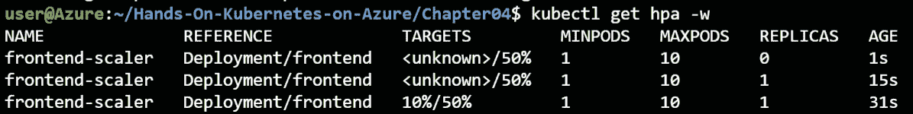

# 4. 构建可扩展的应用程序

在高效运行应用程序时，能够扩展和升级应用程序至关重要。扩展可以让你的应用程序处理额外的负载。而在升级过程中，扩展是保持应用程序最新并引入新功能的必要手段。

按需扩展是使用云原生应用程序的关键好处之一。它还可以帮助优化应用程序的资源。如果前端组件遇到高负载，你可以单独扩展前端，同时保持后端实例的数量不变。你可以根据工作负载和高峰时段调整所需的**虚拟机**（**VM**）数量。本章将详细介绍应用程序及其基础设施的扩展维度。

在本章中，你将学习如何扩展在*第三章*中介绍的示例访客簿应用程序，即*在 AKS 上部署应用程序*。你将首先使用手动命令扩展该应用程序，然后你将学习如何使用`kubectl`进行自动扩展，`kubectl`是管理运行在**Azure Kubernetes** **Service**（**AKS**）上的应用程序的重要工具。扩展应用程序后，你还将扩展集群。你将首先手动扩展集群，然后使用**集群自动扩展器**来自动扩展集群。此外，你还将简要了解如何升级在 AKS 上运行的应用程序。

本章将涵盖以下主题：

+   扩展你的应用程序

+   扩展你的集群

+   升级你的应用程序

本章的开始部分将讨论如何在 AKS 上扩展应用程序的不同维度。

## 扩展你的应用程序

在 AKS 上运行的应用程序有两个扩展维度。第一个扩展维度是部署中 Pod 的数量，而第二个扩展维度是集群中节点的数量。

通过向部署中添加新的 Pod，也称为扩展，你可以为已部署的应用程序增加计算能力。你可以手动扩展应用程序，或者通过 HPA 让 Kubernetes 自动处理这一过程。HPA 可以监控 CPU 等指标，以判断是否需要为你的部署添加 Pod。

AKS 中的第二个扩展维度是集群中节点的数量。集群中的节点数量定义了所有在该集群上运行的应用程序可以使用的 CPU 和内存资源。你可以通过更改节点数量手动扩展集群，或者使用集群自动扩展器自动扩展集群。集群自动扩展器会监视集群中的 Pod，如果由于资源限制导致 Pod 无法调度，它会向集群添加节点，确保你的应用程序能够运行。

本章将涵盖两个规模维度。在本节中，您将学习如何扩展您的应用程序。首先，您将手动扩展应用程序，然后，您将学习如何自动扩展应用程序。

### 手动扩展您的应用程序

为了演示手动扩展，让我们使用上一章中使用的留言簿示例。按照以下步骤学习如何实现手动扩展：

#### 注

在上一章中，我们在 Cloud Shell 中克隆了示例文件。如果您当时没有执行此操作，我们建议现在进行操作：

`git clone https://github.com/PacktPublishing/Hands-On-Kubernetes-on-Azure-third-edition`

本章中，请导航到 `Chapter04` 目录：

`cd Chapter04`

1.  通过在 Azure 命令行中运行 `kubectl create` 命令来设置留言簿：

    ```
    kubectl create -f guestbook-all-in-one.yaml
    ```

1.  在输入前面的命令后，您应该会在命令行输出中看到类似*图 4.1*所示的内容：通过运行 kubectl create 命令设置留言簿应用程序

    图 4.1：启动留言簿应用程序

1.  目前，所有服务都不可公开访问。我们可以通过运行以下命令来验证这一点：

    ```
    kubectl get service
    ```

1.  如*图 4.2*所示，所有服务都没有外部 IP：验证确保没有任何服务是公开可访问的

    图 4.2：确认没有服务具有公共 IP 的输出

1.  为了测试应用程序，您需要将其公开。为此，我们将介绍一个新命令，允许您在不修改文件系统中文件的情况下编辑 Kubernetes 中的服务。要开始编辑，请执行以下命令：

    ```
    kubectl edit service frontend
    ```

1.  这将打开一个 `vi` 环境。使用下箭头键导航到显示 `type:` `ClusterIP` 的行，并将其更改为 `type: LoadBalancer`，如*图 4.3*所示。要进行此更改，按下 *I* 键，将 `type` 改为 `LoadBalancer`，然后按 *Esc* 键，输入 `:wq!`，并按 *Enter* 保存更改：将类型从 ClusterIP 更改为 LoadBalancer

    图 4.3：将该行更改为 type: LoadBalancer

1.  一旦更改保存完毕，您可以观察服务对象，直到公共 IP 可用。为此，请输入以下命令：

    ```
    kubectl get service -w
    ```

1.  更新的 IP 地址将需要几分钟时间才能显示。一旦看到正确的公共 IP，您可以通过按 *Ctrl* + *C* 退出 `watch` 命令：显示前端服务获取公共 IP 的输出

    图 4.4：显示前端服务获取公共 IP 的输出

1.  将前面输出的 IP 地址输入到浏览器导航栏中，如下所示：`http://<EXTERNAL-IP>/`。结果如*图 4.5*所示：

在浏览器中输入 IP 地址查看留言簿示例

图 4.5：浏览到留言簿应用程序

熟悉的留言板示例应该可见。这表明你已成功公开访问了留言板。

现在你已经部署了留言板应用程序，可以开始扩展应用程序的不同组件。

### 扩展留言板前端组件

Kubernetes 让我们能够动态地扩展应用的每个组件。在本节中，我们将展示如何扩展留言板应用的前端。目前，前端部署已部署了三个副本。你可以通过以下命令确认：

```
kubectl get pods
```

这应该会返回如*图 4.6*所示的输出：


图 4.6：确认前端部署中的三个副本

要扩展前端部署，你可以执行以下命令：

```
kubectl scale deployment/frontend --replicas=6
```

这将导致 Kubernetes 为部署添加额外的 pod。你可以设置所需的副本数量，Kubernetes 会处理剩余的工作。你甚至可以将副本数扩展到零（这是当应用程序不支持动态配置重新加载时，重新加载配置的一种技巧）。要验证整体扩展是否正确工作，你可以使用以下命令：

```
kubectl get pods
```

这应该会给你与*图 4.7*中相同的输出：


图 4.7：扩展后在留言板应用中运行的不同 pod

如你所见，前端服务扩展到了六个 pod。Kubernetes 还将这些 pod 分布到集群中的多个节点上。你可以通过以下命令查看这些 pod 运行在哪些节点上：

```
kubectl get pods -o wide
```

这将生成以下输出：


图 4.8：显示 pod 运行在哪些节点上

在本节中，你已经看到如何使用 Kubernetes 扩展 pod 是多么简单。这个功能为你提供了一个强大的工具，不仅可以动态调整应用组件，还能通过同时运行多个组件实例提供具有故障转移能力的弹性应用。然而，你并不总是希望手动扩展你的应用程序。在下一节中，你将学习如何通过在部署中自动添加和删除 pod 来自动扩展应用程序。

### 使用 HPA

手动扩展在你操作集群时非常有用。例如，如果你知道负载将增加，你可以手动扩展应用程序。然而，在大多数情况下，你会希望应用程序能够进行某种形式的自动扩展。在 Kubernetes 中，你可以使用一个叫做**水平 Pod 自动扩展器**（**HPA**）的对象来配置部署的自动扩展。

HPA 定期监控 Kubernetes 度量标准，并根据您定义的规则自动扩展部署。例如，您可以配置 HPA，在应用程序的 CPU 利用率超过 50%时，自动向部署中添加更多 Pods。

在本节中，您将配置 HPA 以自动扩展应用程序的前端：

1.  要开始配置，首先让我们手动将部署规模缩小到一个实例：

    ```
    kubectl scale deployment/frontend --replicas=1
    ```

1.  接下来，我们将创建一个 HPA。通过在 Cloud Shell 中输入`code hpa.yaml`来打开代码编辑器，并输入以下代码：

    ```
    1   apiVersion: autoscaling/v1
    2   kind: HorizontalPodAutoscaler
    3   metadata:
    4     name: frontend-scaler
    5   spec:
    6     scaleTargetRef:
    7       apiVersion: apps/v1
    8       kind: Deployment
    9       name: frontend
    10    minReplicas: 1
    11    maxReplicas: 10
    12    targetCPUUtilizationPercentage: 50
    ```

    让我们来看看这个文件中配置了什么内容：

    +   `HorizontalPodAutoscaler`。

    +   **第 6-9 行**：这些行定义了我们希望自动扩展的部署。

    +   **第 10-11 行**：在这里，我们配置了部署中的最小和最大 Pods 数量。

    +   **第 12 行**：在这里，我们定义了部署的目标 CPU 利用率百分比。

1.  保存此文件，并使用以下命令创建 HPA：

    ```
    kubectl create -f hpa.yaml
    ```

    这将创建我们的自动扩展器。您可以使用以下命令查看您的自动扩展器：

    ```
    kubectl get hpa
    ```

    这最初将输出类似于*图 4.9*所示的内容：

    

    图 4.9：目标未知表示 HPA 尚未准备好

    HPA 读取度量标准需要几秒钟的时间。等待 HPA 的返回，输出应类似于*图 4.10*所示：

    

    图 4.10：当目标显示百分比时，HPA 已准备好

1.  您现在需要做两件事：首先，您将观察 Pods，以查看是否创建了新 Pods。然后，您将创建一个新的 shell 并为系统生成一些负载。让我们从第一个任务开始——观察我们的 Pods：

    ```
    kubectl get pods -w
    ```

    这将持续监控创建或终止的 Pods。

    现在，让我们在新的 shell 中创建一些负载。在 Cloud Shell 中，点击**打开新会话**图标以打开一个新的 shell：

    

    图 4.11：使用此按钮打开新的 Cloud Shell 会话

    这将打开浏览器中的新标签页，并在 Cloud Shell 中启动一个新的会话。您将从该标签页为应用程序生成负载。

1.  接下来，您将使用一个名为`hey`的程序来生成负载。`hey`是一个小型程序，用于向 Web 应用程序发送负载。您可以使用以下命令安装并运行`hey`：

    ```
    export GOPATH=~/go
    export PATH=$GOPATH/bin:$PATH
    go get -u github.com/rakyll/hey
    hey -z 20m http://<external-ip>
    ```

    `hey`程序现在将尝试创建多达 2000 万个连接到前端。这将产生系统的 CPU 负载，触发 HPA 开始扩展部署。触发扩展操作需要几分钟时间，但在某个时刻，您应该看到多个 Pods 被创建以处理额外的负载，如*图 4.12*所示：

    

    图 4.12：新 Pod 由 HPA 启动

    此时，您可以通过按*Ctrl* + *C*终止`hey`程序。

1.  让我们通过运行以下命令来更仔细地查看 HPA 做了什么：

    ```
    kubectl describe hpa
    ```

    我们可以在`describe`操作中看到一些有趣的点，如*图 4.13*所示：

    

    图 4.13：HPA 的详细视图

    *图 4.13*中的注释解释如下：

    +   这显示了当前的 CPU 利用率（`384%`）与期望值（`50%`）的对比。当前的 CPU 利用率在您的环境中可能会有所不同。

    +   这表明当前的期望副本数高于您配置的实际最大副本数。这确保了单个部署不会消耗集群中的所有资源。

    +   这显示了 HPA 所采取的扩展动作。它首先将副本数扩展到 4，然后到 8，最后扩展到 10 个 Pod。

1.  如果等待几分钟，HPA 应该会开始缩减。您可以使用以下命令跟踪这个缩减操作：

    ```
    kubectl get hpa -w
    ```

    这将跟踪 HPA 并显示部署逐渐缩减的过程，如*图 4.14*所示：

    

    图 4.14：观看 HPA 缩减

1.  在进入下一节之前，让我们清理一下本节中创建的资源：

    ```
    kubectl delete -f hpa.yaml
    kubectl delete -f guestbook-all-in-one.yaml
    ```

在本节中，您首先手动然后自动扩展了应用程序。然而，支撑该应用程序的基础设施是静态的；您在一个两节点的集群上运行它。在许多情况下，您可能还会遇到集群资源不足的情况。在下一节中，您将处理这个问题，并学习如何自己扩展 AKS 集群。

## 扩展集群

在上一节中，您处理了在集群上运行的应用程序的扩展问题。在本节中，您将学习如何扩展您运行的实际集群。首先，您将手动将集群缩放到一个节点。然后，您将配置集群自动扩展器。集群自动扩展器将监控您的集群，当集群中有无法调度的 Pod 时，它会进行扩展。

### 手动扩展集群

您可以通过为集群设置静态节点数来手动扩展 AKS 集群。集群的扩展可以通过 Azure 门户或命令行进行。

在本节中，您将学习如何通过手动将集群缩减到一个节点来扩展集群。这将导致 Azure 从您的集群中移除一个节点。首先，即将移除的节点上的工作负载将被重新调度到另一个节点上。一旦工作负载安全地重新调度，节点将从集群中移除，然后虚拟机将从 Azure 中删除。

要扩展您的集群，请按照以下步骤操作：

1.  打开 Azure 门户并进入您的集群。进入后，转到 **Node pools**，然后点击 **Node count** 下方的数字，如 *图 4.15* 所示：

    图 4.15：手动扩展集群

1.  这将打开一个弹出窗口，提供扩展集群的选项。在我们的示例中，我们将把集群缩小到一个节点，如 *图 4.16* 所示：

    图 4.16：确认新集群大小的弹出窗口

1.  点击屏幕底部的 **Apply** 按钮以保存这些设置。这将导致 Azure 从您的集群中移除一个节点。此过程大约需要 5 分钟完成。您可以通过点击 Azure 门户顶部的通知图标来跟踪进度，如下所示：


图 4.17：可以通过 Azure 门户中的通知跟踪集群扩展进度

当此缩减操作完成后，请在此小型集群上重新启动 guestbook 应用：

```
kubectl create -f guestbook-all-in-one.yaml
```

在下一节中，您将扩展 guestbook，以使其无法在这个小型集群上运行。然后，您将配置集群自动扩展器来扩展集群。

### 使用集群自动扩展器扩展集群

在本节中，您将探索集群自动扩展器。集群自动扩展器将监视集群中的部署，并根据应用程序需求自动扩展集群。集群自动扩展器会监视由于资源不足而无法调度的 pod 数量。您将首先强制部署中出现无法调度的 pod，然后配置集群自动扩展器以自动扩展集群。

为了强制集群资源不足，您将手动扩展 `redis-replica` 部署。为此，使用以下命令：

```
kubectl scale deployment redis-replica --replicas 5
```

您可以通过查看集群中的 pod 来验证该命令是否成功：

```
kubectl get pods
```

这应该会显示类似于 *图 4.18* 所示的输出：


图 4.18：五个 pod 中有四个处于 Pending 状态，表示它们无法调度

如您所见，当前有两个 pod 处于 `Pending` 状态。在 Kubernetes 中，`Pending` 状态意味着该 pod 无法调度到节点上。在这种情况下，是由于集群资源不足导致的。

#### 注意

如果您的集群运行在比 DS2v2 更大的虚拟机上，现在可能不会看到处于 `Pending` 状态的 pod。在这种情况下，您可以增加副本数，直到看到 pod 处于 Pending 状态。

现在你将配置集群自动缩放器以自动扩展集群。与前一部分的手动缩放类似，你可以通过两种方式配置集群自动缩放器。你可以通过 Azure 门户配置它，类似于我们之前手动缩放的方式，或者你可以使用命令行界面（CLI）配置它。在这个例子中，你将使用 CLI 启用集群自动缩放器。以下命令将为你的集群配置集群自动缩放器：

```
az aks nodepool update --enable-cluster-autoscaler \
  -g rg-handsonaks --cluster-name handsonaks \
  --name agentpool --min-count 1 --max-count 2
```

此命令配置了在你的集群中的节点池上的集群自动缩放器。它将其配置为具有一个节点的最小值和两个节点的最大值。这将需要几分钟来配置。

一旦配置了集群自动缩放器，你可以使用以下命令观察集群中节点的数量：

```
kubectl get nodes -w
```

新节点在集群中显示并变为`Ready`大约需要 5 分钟时间。一旦新节点状态为`Ready`，你可以通过按下 *Ctrl* + *C* 停止监视节点。你应该会看到类似 *Figure 4.19* 的输出：


图 4.19：新节点加入集群

新节点应确保你的集群有足够的资源来调度扩展的`redis-` `replica`部署。要验证这一点，请运行以下命令以检查 pod 的状态：

```
kubectl get pods
```

这应该会显示所有处于`Running`状态的 pod，如下所示：


图 4.20：所有 pod 现在处于 Running 状态

现在清理你创建的资源，禁用集群自动缩放器，并确保你的集群有两个节点，以便进行下一个示例。要执行此操作，请使用以下命令：

```
kubectl delete -f guestbook-all-in-one.yaml
az aks nodepool update --disable-cluster-autoscaler \
  -g rg-handsonaks --cluster-name handsonaks --name agentpool
az aks nodepool scale --node-count 2 -g rg-handsonaks \
  --cluster-name handsonaks --name agentpool
```

#### 注意

前一个示例中的最后一个命令将显示一个错误消息，如果集群已经有两个节点，则会显示`The new node count is the same as the current node count.`。你可以安全地忽略此错误。

在本节中，你首先手动缩减了集群，然后使用集群自动缩放器扩展了集群。你使用 Azure 门户手动缩减了集群，然后使用 Azure CLI 配置了集群自动缩放器。在接下来的部分，你将了解如何升级在 AKS 上运行的应用程序。

## 升级你的应用程序

使用 Kubernetes 中的部署（deployments）可以使升级应用程序变得简单明了。与任何升级一样，如果出现问题，应该有良好的回滚策略。你可能会在升级过程中遇到大部分问题。云原生应用程序应该能够相对轻松地处理这些问题，如果你有一个非常强大的开发团队，他们秉承 DevOps 原则。

DevOps 状态报告（[`puppet.com/resources/report/2020-state-of-devops-report/`](https://puppet.com/resources/report/2020-state-of-devops-report/)）多年来报告称，软件部署频率较高的公司，其应用程序的可用性和稳定性也更高。这可能看起来有些反直觉，因为进行软件部署会增加问题的风险。然而，通过更频繁地部署，并采用自动化的 DevOps 实践，你可以减少软件部署带来的影响。

你可以通过多种方式更新在 Kubernetes 集群中运行的应用程序。在本节中，你将探索以下几种更新 Kubernetes 资源的方法：

+   通过更改 YAML 文件进行升级：当你有权限访问完整的 YAML 文件进行更新时，使用这种方法。这可以通过命令行或自动化系统来完成。

+   使用 `kubectl edit` 升级：这种方法主要用于集群上的小规模变更。它是一种快速在集群上实时更新配置的方法。

+   使用 `kubectl patch` 升级：当你需要脚本化进行 Kubernetes 中某些小的更新，但没有访问完整 YAML 文件的权限时，可以使用这种方法。这可以通过命令行或自动化系统进行。如果你有原始的 YAML 文件，通常更好的做法是编辑 YAML 文件并使用 `kubectl apply` 应用更新。

+   使用 Helm 升级：当你的应用程序通过 Helm 部署时，使用这种方法进行升级。

以下章节描述的方法非常适用于无状态应用程序。如果你有任何状态存储在某个地方，请确保在尝试升级应用程序之前备份该状态。

让我们从通过更改 YAML 文件进行的第一次升级开始这节内容。

### 通过更改 YAML 文件进行升级

为了升级 Kubernetes 服务或部署，你可以更新实际的 YAML 定义文件，并将其应用到当前已部署的应用程序。通常，我们使用 `kubectl create` 来创建资源。同样，我们可以使用 `kubectl apply` 来对资源进行更改。

部署会检测更改（如果有的话），并将运行状态与期望状态进行匹配。让我们看看这是如何实现的：

1.  从我们的 guestbook 应用程序开始，探索这个例子：

    ```
    kubectl apply -f guestbook-all-in-one.yaml
    ```

1.  几分钟后，所有的 Pods 应该都在运行。现在我们来进行第一次升级，将服务从 `ClusterIP` 改为 `LoadBalancer`，就像你在本章前面所做的那样。不同的是，现在你将编辑 YAML 文件，而不是使用 `kubectl edit`。使用以下命令编辑 YAML 文件：

    ```
    code guestbook-all-in-one.yaml
    ```

    取消注释该文件中的第 102 行，将 `type` 设置为 `LoadBalancer`，并保存文件，如 *图 4.21* 所示：

    

    图 4.21：在 guestbook-all-in-one YAML 文件中将类型设置为 LoadBalancer

1.  如以下代码所示，应用更改：

    ```
    kubectl apply -f guestbook-all-in-one.yaml
    ```

    您应该看到类似于*图 4.22*的输出：

    

    图 4.22：服务的前端已更新

    如*图 4.22*所示，只有在 YAML 文件中更新的对象（在此案例中是服务）在 Kubernetes 上被更新，其他对象保持不变。

1.  现在您可以使用以下命令获取服务的公共 IP：

    ```
    kubectl get service
    ```

    给它几分钟，您应该会看到显示的 IP，如*图 4.23*所示：

    

    图 4.23：输出显示公共 IP

1.  现在您将进行另一个更改。您将把第 127 行中的前端镜像`image: gcr.io/google-samples/gb-frontend:v4`降级为以下内容：

    ```
    image: gcr.io/google-samples/gb-frontend:v3
    ```

    可以通过使用此熟悉的命令打开 guestbook 应用程序并进行更改：

    ```
    code guestbook-all-in-one.yaml
    ```

1.  运行以下命令执行更新并观察 Pod 的变化：

    ```
    kubectl apply -f guestbook-all-in-one.yaml && kubectl get pods -w
    ```

    这将生成类似于*图 4.24*的输出：

    

    图 4.24：从新 ReplicaSet 创建的 Pods

    在这里，您可以看到一个新的 Pod 版本被创建（基于新的 ReplicaSet）。一旦新 Pod 启动并准备好，旧的 Pod 之一将被终止。这个创建-终止循环将不断重复，直到只有新的 Pods 在运行。在*第五章，处理 AKS 中的常见故障*中，您将看到一个升级失败的示例，并且您会看到 Kubernetes 不会继续升级过程，直到新 Pod 健康运行。

1.  运行`kubectl get events | grep ReplicaSet`将显示部署使用的滚动更新策略，该策略用于更新前端镜像：

    ```
    kubectl get replicaset
    ```

    这将显示*图 4.26*所示的输出：

    

    图 4.26：两个不同的 ReplicaSets

1.  Kubernetes 还会保留您的滚动更新历史记录。您可以使用此命令查看滚动更新历史：

    ```
    kubectl rollout history deployment frontend
    ```

    这将生成如*图 4.27*所示的输出：

    

    图 4.27：应用程序的部署历史

1.  由于 Kubernetes 会保留滚动更新的历史记录，这也启用了回滚功能。让我们对您的部署进行回滚：

    ```
    kubectl rollout undo deployment frontend
    ```

    这将触发回滚。这意味着新的 ReplicaSet 将被缩减为零实例，而旧的 ReplicaSet 将再次扩展为三个实例。您可以使用以下命令验证这一点：

    ```
    kubectl get replicaset
    ```

    结果输出如*图 4.28*所示：

    

    图 4.28：旧的 ReplicaSet 现在有三个 Pod，而新的 ReplicaSet 已缩减为零个 Pod

    如预期的那样，旧的 ReplicaSet 被缩放回三实例，而新的 ReplicaSet 被缩放为零实例。

1.  最后，运行`kubectl delete`命令再次进行清理：

    ```
    kubectl delete -f guestbook-all-in-one.yaml
    ```

    恭喜！你已经完成了应用程序的升级以及回滚到先前的版本。

在这个示例中，你使用了`kubectl apply`命令来修改应用程序。你也可以类似地使用`kubectl edit`来进行修改，下一节将进一步探讨这一方法。

### 使用 kubectl edit 升级应用程序

你还可以通过使用`kubectl edit`来修改运行在 Kubernetes 上的应用程序。你之前在本章的*手动扩展应用程序*部分使用过此命令。当运行`kubectl edit`时，会打开`vi`编辑器，允许你直接对 Kubernetes 中的对象进行修改。

让我们重新部署 guestbook 应用程序，取消使用公共负载均衡器，并使用`kubectl`创建负载均衡器：

1.  撤销你在上一步所做的更改。你可以通过使用以下命令来实现：

    ```
    git reset --hard
    ```

1.  然后，你将部署 guestbook 应用程序：

    ```
    kubectl create -f guestbook-all-in-one.yaml
    ```

1.  要开始编辑，执行以下命令：

    ```
    kubectl edit service frontend
    ```

1.  这将打开一个`vi`环境。导航到当前显示为`type:` `ClusterIP`（第 27 行）的行，并将其更改为`type: LoadBalancer`，如*图 4.29*所示。要进行修改，按下*I*键，输入更改内容，按下*Esc*键，输入`:wq!`，然后按*Enter*保存更改：

    图 4.29：将这一行更改为`type: LoadBalancer`

1.  一旦保存了更改，你可以通过观察服务对象，直到公网 IP 变为可用。为此，可以输入以下命令：

    ```
    kubectl get svc -w
    ```

1.  显示更新后的 IP 可能需要几分钟时间。一旦看到正确的公网 IP，你可以通过按下*Ctrl* + *C*退出`watch`命令。

这是一个使用`kubectl edit`命令对 Kubernetes 对象进行修改的示例。该命令将打开一个文本编辑器，以交互的方式进行修改。这意味着你需要与文本编辑器进行交互来进行更改。这个方法不适用于自动化环境。要进行自动化修改，可以使用`kubectl patch`命令。

### 使用 kubectl patch 升级应用程序

在前面的示例中，你使用了文本编辑器来修改 Kubernetes。在这个示例中，你将使用`kubectl patch`命令来对 Kubernetes 中的资源进行修改。`patch`命令在自动化系统中尤其有用，特别是当你无法访问集群中部署的原始 YAML 文件时。例如，在脚本或持续集成/持续部署系统中都可以使用此命令。

使用`kubectl patch`有两种主要方式：一种是创建一个包含更改的文件（称为补丁文件），另一种是直接在命令行内提供更改。这里将解释这两种方法。首先，在这个示例中，你将使用补丁文件将前端的图像从`v4`更改为`v3`：

1.  从创建一个名为`frontend-image-patch.yaml`的文件开始这个示例：

    ```
    code frontend-image-patch.yaml
    ```

1.  使用以下文本作为该文件中的补丁：

    ```
    spec:
      template:
        spec:
          containers:
          - name: php-redis
            image: gcr.io/google-samples/gb-frontend:v3
    ```

    这个补丁文件使用与典型 YAML 文件相同的 YAML 布局。补丁文件的关键之处在于，它只需包含更改，而不必具备部署整个资源的能力。

1.  要应用补丁，请使用以下命令：

    ```
    kubectl patch deployment frontend \
      --patch "$(cat frontend-image-patch.yaml)"
    ```

    该命令执行两项操作：首先，它使用`cat`命令读取`frontend-image-patch.yaml`文件，然后将其传递给`kubectl patch`命令以执行更改。

1.  你可以通过描述前端部署并查找`Image`部分来验证更改：

    ```
    kubectl describe deployment frontend
    ```

    这将显示如下输出：

    

    图 4.30：补丁后，我们正在运行旧图像

    这是使用补丁文件执行`patch`命令的一个示例。你也可以直接在命令行中应用补丁，而无需创建 YAML 文件。在这种情况下，你将以 JSON 格式描述更改，而不是 YAML 格式。

    让我们演示一个示例，在其中我们将图像更改恢复为`v4`：

1.  运行以下命令将图像补丁回`v4`版本：

    ```
    kubectl patch deployment frontend \
    --patch='
    {
        "spec": {
            "template": {
                "spec": {
                    "containers": [{
                        "name": "php-redis",
                        "image": "gcr.io/google-samples/gb-frontend:v4"
                    }]
                }
            }
        }
    }'
    ```

1.  你可以通过描述部署并查找`Image`部分来验证这一更改：

    ```
    kubectl describe deployment frontend
    ```

    这将显示在*图 4.31*中所示的输出：


图 4.31：再次补丁后，我们正在运行新版本

在进入下一个示例之前，让我们从集群中移除 guestbook 应用程序：

```
kubectl delete -f guestbook-all-in-one.yaml
```

到目前为止，你已经探索了三种升级 Kubernetes 应用程序的方法。首先，你修改了实际的 YAML 文件，并使用`kubectl apply`应用了更改。随后，你使用了`kubectl edit`和`kubectl patch`进行更多的更改。在本章的最后一节中，你将使用 Helm 来升级应用程序。

### 使用 Helm 升级应用程序

本节将解释如何使用 Helm 运维进行升级：

1.  运行以下命令：

    ```
    helm install wp bitnami/wordpress
    ```

    你将强制更新 MariaDB 容器的图像。首先，我们检查当前图像的版本：

    ```
    kubectl describe statefulset wp-mariadb | grep Image
    ```

    在写作时，图像版本为`10.5.8-debian-10-r46`，如下所示：

    

    ```
    kubectl get secret wp-mariadb -o yaml
    ```

    这将生成在*图 4.33*中所示的输出：

    

    ```
    echo "<password>" | base64 -d
    ```

    这将显示解码后的根密码和解码后的数据库密码，如*图 4.34*所示：

    

    ```
    kubectl get secret wp-wordpress -o yaml
    echo "<WordPress password>" | base64 -d
    ```

1.  您可以使用 Helm 更新镜像标签，然后通过以下命令查看 Pod 的变化：

    ```
    helm upgrade wp bitnami/wordpress \
    --set mariadb.image.tag=10.5.8-debian-10-r44\
    --set mariadb.auth.password="<decoded password>" \
    --set mariadb.auth.rootPassword="<decoded password>" \
    --set wordpressPassword="<decoded password>" \
    && kubectl get pods -w
    ```

    这将更新 MariaDB 的镜像并启动一个新的 Pod。您应该会看到类似于*图 4.35*的输出，其中可以看到前一个版本的数据库 Pod 被终止，新 Pod 启动：

    

    ```
    kubectl describe pod wp-mariadb-0 | grep Image
    ```

    这将生成一个输出，如*图 4.36*所示：

    

    图 4.36：显示新镜像

1.  最后，通过运行以下命令进行清理：

    ```
    helm delete wp
    kubectl delete pvc --all
    kubectl delete pv --all
    ```

您现在已经学会了如何使用 Helm 升级应用程序。正如您在这个例子中看到的，使用 Helm 升级可以通过使用 `--set` 操作符来完成。这使得使用 Helm 执行升级和多次部署变得更加高效。

## 总结

本章涵盖了关于构建可扩展应用程序的大量信息。目标是向您展示如何使用 Kubernetes 来扩展部署，方法是创建应用程序的多个实例。

我们通过研究如何定义负载均衡器的使用以及如何利用 Kubernetes 中的部署扩展功能来实现可扩展性，开始了本章内容。通过这种类型的可扩展性，您还可以通过使用负载均衡器和多个无状态应用程序的实例来实现故障转移。我们还研究了如何使用 HPA 根据负载自动扩展您的部署。

之后，我们研究了如何扩展集群本身。首先，我们手动扩展了集群，随后我们使用集群自动扩展器根据应用程序需求扩展集群。

我们通过研究不同的方式来升级已部署的应用程序结束了本章内容：首先，通过手动更新 YAML 文件，然后学习了两个额外的 `kubectl` 命令（`edit` 和 `patch`），这些命令可以用来进行更改。最后，我们了解了如何使用 Helm 来执行这些升级。

在下一章中，我们将讨论在将应用程序部署到 AKS 时可能遇到的几种常见故障及其解决方法。
