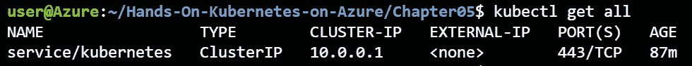

# 第六章：5. 处理 AKS 中的常见故障

Kubernetes 是一个分布式系统，包含许多工作组件。AKS 为你抽象了大部分内容，但了解如何在故障发生时找到问题所在并作出响应，仍然是你的责任。大部分故障处理是由 Kubernetes 自动完成的；然而，你仍会遇到需要手动干预的情况。

在部署在 AKS 上的应用中，有两个方面可能会出现问题。要么是集群本身出现问题，要么是部署在集群上的应用出现问题。本章专注于集群问题。集群可能会出现几种故障。

第一个可能出错的情况是集群中的一个节点变得不可用。这可能是由于 Azure 基础设施故障或虚拟机本身的问题，比如操作系统崩溃。无论是哪种情况，Kubernetes 都会监控集群的节点故障并自动恢复。你将在本章中看到这一过程的实际操作。

Kubernetes 集群中的第二个常见问题是资源不足故障。这意味着你尝试部署的工作负载需要的资源超过了集群中可用的资源。你将学习如何监控这些信号，以及如何解决它们。

另一个常见问题是存储挂载问题，这通常发生在节点不可用时。当 Kubernetes 中的节点变得不可用时，Kubernetes 不会卸载与该故障节点附加的磁盘。这意味着这些磁盘无法被其他节点上的工作负载使用。你将看到一个实际示例，并学习如何从这种故障中恢复。

本章将深入探讨以下主题：

+   处理节点故障

+   解决资源不足故障

+   处理存储挂载问题

在本章中，你将了解常见的故障场景以及这些场景的解决方案。首先，我们将介绍节点故障。

#### 注意：

请参考 Kubernetes the Hard Way（[`github.com/kelseyhightower/kubernetes-the-hard-way`](https://github.com/kelseyhightower/kubernetes-the-hard-way)），这是一个很好的教程，可以帮助你了解 Kubernetes 构建的基础。对于 Azure 版本，请参考 Kubernetes the Hard Way – Azure 翻译版（[`github.com/ivanfioravanti/kubernetes-the-hard-way-on-azure`](https://github.com/ivanfioravanti/kubernetes-the-hard-way-on-azure)）。

## 处理节点故障

无论是有意（为了节省成本）还是无意中，节点可能会宕机。当这种情况发生时，你不希望接到凌晨三点的电话，告诉你系统宕机了。Kubernetes 可以自动处理在故障节点上迁移工作负载。在本练习中，你将部署一个访客留言簿应用，并将集群中的一个节点关闭，以观察 Kubernetes 如何响应：

1.  确保你的集群至少有两个节点：

    ```
    kubectl get nodes
    ```

    这应该会生成如*图 5.1*所示的输出：

    

    图 5.1: 集群中的节点列表

    如果你的集群中没有两个节点，请在 Azure 门户中查找你的集群，导航到节点池，选择要扩展的池，并点击“缩放”。然后你可以将节点计数器缩放到 2 节点，如*图 5.2*所示：

    

    图 5.2: 扩展集群

1.  作为本节的示例应用程序，请部署访客留言应用程序。部署此应用程序的 YAML 文件已在本章的源代码中提供（`guestbook-all-in-one.yaml`）。要部署访客留言应用程序，请使用以下命令：

    ```
    kubectl create -f guestbook-all-in-one.yaml
    ```

1.  监视 `service` 对象，直到公共 IP 可用为止。为此，请输入以下命令：

    ```
    kubectl get service -w
    ```

    #### 注意

    你也可以通过使用 `kubectl get svc` 而不是完整的 `kubectl get service` 来获取 Kubernetes 中的服务。

1.  这将花费几秒钟时间来显示更新后的外部 IP。*图 5.3*显示了服务的公共 IP。一旦你看到公共 IP 出现（在本例中为 20.72.244.113），你可以通过按下*Ctrl* + *C*退出 watch 命令：

    图 5.3: 前端服务的外部 IP 从 <pending> 变为实际 IP 地址

1.  访问 `http://<EXTERNAL-IP>`（在本例中为 `http://20.72.244.113`），如*图 5.4*所示：

    图 5.4: 浏览访客留言应用程序

1.  让我们看看当前运行的 Pod 使用以下命令：

    ```
    kubectl get pods -o wide
    ```

    这将生成如*图 5.5*所示的输出：

    

    图 5.5: Pod 分布在节点 0 和节点 2 之间

    这显示你应该将工作负载分布在节点 0 和节点 2 之间。

    #### 注意

    在*图 5.5*中的示例中，工作负载分布在节点 0 和节点 2 之间。你可能注意到这里缺少节点 1。如果你按照*第四章，构建可扩展应用程序*的示例操作，你的集群应该处于类似状态。这是因为 Azure 在从集群中移除旧节点并添加新节点时（正如你在*第四章，构建可扩展应用程序*中所做的），它会不断增加节点计数器。

1.  在引入节点故障之前，你可以执行两个可选步骤来验证你的应用程序是否能够继续运行。你可以每 5 秒运行以下命令，以访问访客留言前端并获取 HTML。建议在新的 Cloud Shell 窗口中打开此命令：

    ```
    while true; do 
      curl -m 1 http://<EXTERNAl-IP>/; 
      sleep 5;
    done
    ```

    #### 注意

    前述命令将持续调用你的应用程序，直到你按下*Ctrl* + *C*。可能会有间歇性时间，你将不会收到回复，这在 Kubernetes 重新平衡系统时是正常的。

    你还可以添加一些留言本条目，以查看当你使节点关闭时它们会发生什么。这将显示如下所示的输出，见*图 5.6*：

    

    图 5.6：在留言本中写入几条信息

1.  在这个示例中，你正在探索 Kubernetes 如何处理节点故障。为了演示这一点，关闭集群中的一个节点。你可以关闭任何一个节点，虽然为了达到最大影响，建议关闭*第 6 步*中托管了最多 pods 的节点。在这个示例中，节点 2 将被关闭。

    要关闭这个节点，查找`kubectl get nodes`，你会看到节点 2 处于 NotReady 状态。在 Kubernetes 中有一个配置项叫做`pod-eviction-timeout`，它定义了系统等待多长时间以便在健康的主机上重新调度 pods。默认值为 5 分钟。

1.  如果你在*第 7 步*中记录了多个留言本条目，回到留言本应用的公共 IP 地址时，你会发现所有的留言都不见了！这表明在节点故障时，任何希望能持久保存的数据都应该使用**持久卷声明**（**PVCs**），而我们的应用程序中并没有这样做。你将在本章的最后一节看到一个关于此的示例。

在本节中，你学习了 Kubernetes 如何通过在健康节点上重新创建 pods 自动处理节点故障。在接下来的章节中，你将学习如何诊断和解决资源耗尽的问题。

## 解决资源耗尽故障

Kubernetes 集群中另一个常见的问题是集群资源耗尽。当集群没有足够的 CPU 或内存来调度额外的 pods 时，pods 将会进入`Pending`状态。你在*第四章，构建可扩展应用程序*中也看到了这种行为。

Kubernetes 使用请求来计算某个 pod 所需的 CPU 或内存量。留言本应用对所有的部署都定义了请求。如果你打开文件夹`Chapter05`中的`guestbook-all-in-one.yaml`文件，你会看到如下关于`redis-replica`部署的内容：

```
63  kind: Deployment
64  metadata:
65    name: redis-replica
...
83          resources:
84            requests:
85              cpu: 200m
86              memory: 100Mi
```

本节解释了`redis-replica`部署中的每个 pod 需要`200m`的 CPU 核心（`200`毫或`20%`）和`100MiB`（兆字节）的内存。在你有 2 个 CPU 的集群（且节点 1 已关闭）的情况下，将其扩展到 10 个 pods 会导致可用资源的问题。我们来看看这个情况：

#### 注意

在 Kubernetes 中，你可以使用二进制前缀表示法或十进制表示法来指定内存和存储。二进制前缀表示法意味着使用 KiB（千字节）表示 1,024 字节，MiB（兆字节）表示 1,024 KiB，Gib（吉字节）表示 1,024 MiB。十进制表示法意味着使用 kB（千字节）表示 1,000 字节，MB（兆字节）表示 1,000 kB，GB（千兆字节）表示 1,000 MB。

1.  让我们先将 `redis-replica` 部署扩展到 10 个 pods：

    ```
    kubectl scale deployment/redis-replica --replicas=10
    ```

1.  这将导致创建几个新的 pods。我们可以使用以下命令检查我们的 pods：

    ```
    kubectl get pods
    ```

    这将生成如下所示的输出，类似于 *图 5.10*：

    

    图 5.10：一些 pods 处于 Pending 状态

    这里突出显示的是一个处于 Pending 状态的 pod。这通常发生在集群资源不足时。

1.  我们可以使用以下命令获取有关这些待处理 pod 的更多信息：

    ```
    kubectl describe pod redis-replica-<pod-id>
    ```

    这将显示更多详细信息。在 `describe` 命令的底部，你应该看到类似于 *图 5.11* 所示的内容：

    

    图 5.11：Kubernetes 无法调度此 pod

    它解释了两件事：

    +   其中一个节点的 CPU 资源不足。

    +   其中一个节点有一个污点（node.kubernetes.io/unreachable），该 pod 没有容忍这个污点。这意味着处于 `NotReady` 状态的节点无法接受 pods。

1.  我们可以通过启动节点 2 来解决这个容量问题，如 *图 5.12* 所示。这可以通过类似于关闭过程的方式来完成：

    图 5.12：重新启动节点 2

1.  在 Kubernetes 中，另一个节点重新变为可用需要几分钟时间。你可以通过执行以下命令来监控 pods 的进度：

    ```
    kubectl get pods -w
    ```

    这将在几分钟后显示类似于 *图 5.13* 的输出：

    

    图 5.13：Pods 从 Pending 状态转变为 ContainerCreating 再到 Running

    在这里，你再次看到容器状态从 Pending 变为 ContainerCreating，再到最后的 Running。

1.  如果你重新执行前一个 pod 的 `describe` 命令，你将看到类似于 *图 5.14* 所示的输出：


图 5.14：当节点再次可用时，待处理的 pods 会被分配到该节点

这表明在节点 2 可用后，Kubernetes 将该 pod 调度到该节点，并启动了容器。

在本节中，你学习了如何诊断资源不足错误。你通过向集群中添加另一个节点解决了该错误。在进入最终的故障模式之前，请清理 guestbook 部署。

#### 注意

在 *第四章，构建可扩展应用程序* 中，介绍了 **集群自动扩缩器**。集群自动扩缩器会监控资源不足错误，并自动向集群添加新节点。

让我们通过运行以下 `delete` 命令清理 guestbook 部署：

```
kubectl delete -f guestbook-all-in-one.yaml
```

现在也可以安全地关闭你之前打开的另一个 Cloud Shell 窗口。

到目前为止，您已经学习了如何从 Kubernetes 集群中的两种节点故障模式中恢复。首先，您看到 Kubernetes 如何处理节点离线，并将 Pod 重新调度到工作节点。之后，您看到了 Kubernetes 如何使用请求来管理 Pod 在节点上的调度，并且当集群资源不足时会发生什么。在接下来的部分中，您将了解 Kubernetes 遇到存储挂载问题时会发生什么。

## 修复存储挂载问题

在本章的前面，您注意到当 Redis 主节点移动到另一个节点时，访客留言应用程序丢失了数据。这是因为该示例应用程序没有使用任何持久存储。在本节中，您将看到一个示例，说明当 Kubernetes 将附有 PVC 的 Pod 移动到另一个节点时会发生的常见错误，并学习如何修复这些错误。

为此，您将重复使用上一章中的 WordPress 示例。在开始之前，让我们确保集群处于干净的状态：

```
kubectl get all
```

这应该只显示一个 Kubernetes 服务，如图 *5.15* 所示：



图 5.15：目前您只应该有一个运行中的 Kubernetes 服务

让我们确保两个节点都在运行并处于 Ready 状态：

```
kubectl get nodes
```

这应该显示我们两个节点都处于 Ready 状态，如图 *5.16* 所示：


图 5.16：您应该在集群中有两个可用的节点

在前面的示例中，在 *处理节点故障* 部分下，您看到如果 Pod 重新启动，存储在 `redis-master` 中的消息将丢失。原因是 `redis-master` 将所有数据存储在其容器中，每次重新启动时都使用不带数据的清洁镜像。为了在重新启动时保留数据，数据必须存储在外部。Kubernetes 使用 PVC 来抽象底层存储提供程序，以提供这种外部存储。

要启动此示例，请设置 WordPress 安装。

### 启动 WordPress 安装

让我们开始安装 WordPress。我们将演示其工作原理，然后验证在重新启动后存储是否仍然存在。

如果您在之前的章节中还没有执行此操作，请添加 Bitnami 的 Helm 仓库：

```
helm repo add bitnami https://charts.bitnami.com/bitnami
```

使用以下命令开始重新安装：

```
helm install wp bitnami/wordpress
```

这将需要几分钟的时间来处理。您可以通过执行以下命令来跟踪安装的状态：

```
kubectl get pods -w
```

几分钟后，这应该显示两个 Pod 都处于 Running 状态，并且两个 Pod 的 Ready 状态为 1/1，如图 *5.17* 所示：


图 5.17：几分钟后，所有的 Pod 都将处于运行状态

你可能注意到，`wp-wordpress` pod 曾经历过错误状态，并在之后重启。这是因为 `wp-mariadb` pod 没有及时准备好，导致 `wp-wordpress` pod 进行了重启。你将在*第七章，监控 AKS 集群和应用程序*中学到更多关于就绪性的信息，以及它如何影响 pod 重启。

在本节中，你学习了如何安装 WordPress。接下来，你将了解如何使用持久化卷避免数据丢失。

### 使用持久化卷避免数据丢失

**持久卷**（**PV**）是在 Kubernetes 集群中存储持久数据的方式。有关 PV 的详细讨论，请参考*第三章，AKS 上的应用部署*。让我们一起探讨为 WordPress 部署创建的 PV：

1.  你可以使用以下命令获取 PersistentVolumeClaims：

    ```
    kubectl get pvc
    ```

    这将生成如*图 5.18*所示的输出：

    

    ```
    kubectl get pv
    ```

    这将显示你两个 PersistentVolumes：

    

    ```
    kubectl describe pv <pv name>
    ```

    这将显示该卷的详细信息，如*图 5.20*所示：

    

    图 5.20：某个 PV 的详细信息

    这里，你可以看到哪个 PVC 声明了这个卷以及 Azure 中的磁盘名称是什么。

1.  验证你的网站是否正常工作：

    ```
    kubectl get service
    ```

    这将显示我们 WordPress 网站的公网 IP，如*图 5.21*所示：

    

    图 5.21：WordPress 网站的公网 IP

1.  如果你还记得*第三章，AKS 应用部署*中的内容，Helm 向你展示了获取我们 WordPress 网站管理员凭证所需的命令。让我们获取这些命令并执行它们，以便登录网站，操作如下：

    ```
    helm status wp
    echo Username: user
    echo Password: $(kubectl get secret --namespace default wp-wordpress -o jsonpath="{.data.wordpress-password}" | base64 -d)
    ```

    这将显示用户名和密码，如*图 5.22*所示：


图 5.22：获取 WordPress 应用程序的用户名和密码

你可以通过以下地址登录我们的网站：`http://<external-ip>/admin`。使用上一步获取的凭证登录。然后，你可以开始为你的网站添加一篇帖子。点击“写下你的第一篇博客文章”按钮，然后创建一个简短的帖子，如*图 5.23*所示：


图 5.23：写下你的第一篇博客文章

现在输入一些文本并点击发布按钮，如*图 5.24*所示。文本本身并不重要；你是写这篇文章来验证数据是否确实持久化到磁盘：


图 5.24：发布一篇带有随机文本的帖子

如果你现在访问网站的主页 `http://<external-ip>`，你会看到你的测试文章，如*图 5.25*所示：


图 5.25：已发布的博客文章出现在主页上

在本节中，你部署了一个 WordPress 网站，登录了你的 WordPress 网站，并创建了一个文章。你将在下一节中验证该文章是否能在节点故障时存活。

### 处理涉及 PVC 的 Pod 故障

你对 PVC 进行的第一个测试是杀死 Pod，并验证数据是否确实已持久化。为此，让我们做两件事：

1.  **监控你应用程序中的 Pod**：为此，请使用当前的 Cloud Shell 并执行以下命令：

    ```
    kubectl get pods -w
    ```

1.  你之前执行的 `watch` 命令。你应该看到类似*图 5.27*所示的输出：

    图 5.27：删除 Pod 后，Kubernetes 会自动重新创建这两个 Pod

    如你所见，两个原始 Pod 进入了 Terminating 状态。Kubernetes 很快开始创建新的 Pod 以恢复 Pod 故障。Pod 经历了与原始 Pod 类似的生命周期，从 Pending 到 ContainerCreating，再到 Running。

1.  如果你访问你的网站，你应该看到你的演示文章已经持久化。这就是 PVC 如何帮助你防止数据丢失的方式，因为它们持久化了本应不会在 Pod 中持久化的数据。

在本节中，你了解了 PVC 如何帮助当 Pod 在同一节点上重新创建时。在下一节中，你将看到当节点发生故障时，PVC 是如何使用的。

### 处理涉及 PVC 的节点故障

在之前的示例中，你看到 Kubernetes 如何处理具有 PV 附加的 Pod 故障。在本示例中，你将了解 Kubernetes 如何处理附加卷的节点故障。

1.  首先让我们检查哪个节点托管了你的应用程序，使用以下命令：

    ```
    kubectl get pods -o wide
    ```

    在*图 5.28*中所示的示例中，节点 2 托管了 MariaDB，节点 0 托管了 WordPress 网站：

    

    图 5.28：检查托管 WordPress 网站的节点

1.  引入故障并通过 Azure 门户停止托管 WordPress Pod 的节点。你可以按照之前的示例中的相同方式进行操作。首先，查找支持你集群的扩展集，如*图 5.29*所示：

    图 5.29：查找托管你集群的扩展集

1.  然后，通过点击左侧菜单中的“Instances”，选择需要关闭的节点并点击停止按钮，关闭节点，如 *图 5.30* 所示：

    图 5.30：关闭节点

1.  执行此操作后，再次观察 pod，查看集群中发生了什么：

    ```
    kubectl get pods -o wide -w
    ```

    如前例所示，Kubernetes 将需要 5 分钟的时间才会开始对失败的节点采取行动。你可以在 *图 5.31* 中看到这一过程：

    

    图 5.31：处于 ContainerCreating 状态的 pod

1.  这里出现了一个新的问题。新的 pod 被卡在了 ContainerCreating 状态。让我们来弄清楚发生了什么。首先，描述这个 pod：

    ```
    kubectl describe pods/wp-wordpress-<pod-id>
    ```

    你将看到如下所示的输出，类似于 *图 5.32*：

    

    图 5.32：解释 pod 处于 ContainerCreating 状态的输出

    这表明卷存在问题。你看到与该卷相关的两个错误：`FailedAttachVolume` 错误说明该卷已经被另一个 pod 使用，而 `FailedMount` 错误说明当前 pod 无法挂载该卷。你可以通过手动强制删除卡在 `Terminating` 状态的旧 pod 来解决此问题。

    #### 注意

    pod 处于 `Terminating` 状态的行为并不是一个 bug。这是 Kubernetes 的默认行为。Kubernetes 文档中说明如下：*“Kubernetes（版本 1.5 或更高）不会仅仅因为节点不可达而删除 pod。运行在不可达节点上的 pod 会在超时后进入 Terminating 或 Unknown 状态。当用户尝试在不可达节点上优雅删除 pod 时，pod 也可能进入这些状态。”* 你可以在 [`kubernetes.io/docs/tasks/run-application/force-delete-stateful-set-pod/`](https://kubernetes.io/docs/tasks/run-application/force-delete-stateful-set-pod/) 阅读更多内容。

1.  要强制从集群中移除终止中的 pod，请使用以下命令获取完整的 pod 名称：

    ```
    kubectl get pods
    ```

    这将显示类似于 *图 5.33* 的输出：

    

    图 5.33：获取处于 Terminating 状态的 pod 名称

1.  使用 pod 的名称强制删除此 pod：

    ```
    kubectl delete pod wordpress-wp-<pod-id> --force
    ```

1.  在 pod 被删除后，其他 pod 进入 Running 状态大约需要几分钟时间。你可以使用以下命令监控 pod 的状态：

    ```
    kubectl get pods -w
    ```

    这将返回类似于 *图 5.34* 的输出：

    

    图 5.34：新的 WordPress pod 返回到 Running 状态

1.  如您所见，这使得新 Pod 恢复到了健康状态。系统确实花了几分钟时间来识别更改并将卷挂载到新 Pod。让我们使用以下命令再次查看 Pod 的详细信息：

    ```
    kubectl describe pod wp-wordpress-<pod-id>
    ```

    这将生成如下输出：

    

    图 5.35：新 Pod 现在正在挂载卷并拉取容器镜像

1.  这表明新 Pod 成功地挂载了卷，并且容器镜像已经被拉取。这也使您的 WordPress 网站重新可用，您可以通过访问公共 IP 来验证这一点。在继续下一章之前，请使用以下命令清理应用程序：

    ```
    helm delete wp
    kubectl delete pvc --all
    kubectl delete pv --all
    ```

1.  让我们也启动已关闭的节点：返回 Azure 门户中的规模集面板，点击左侧菜单中的实例，选择需要启动的节点，然后点击“启动”按钮，如*图 5.36*所示：


图 5.36：重新启动节点 0

在本节中，您学习了如何在 PVC 未能挂载到新 Pod 时从节点故障中恢复。您所需要做的就是强制删除卡在`Terminating`状态的 Pod。

## 总结

在本章中，您了解了 Kubernetes 中的常见故障模式以及如何从中恢复。本章从 Kubernetes 如何自动检测节点故障并启动新 Pod 以恢复工作负载的示例开始。接着，您扩展了工作负载，并让集群资源耗尽。您通过重新启动故障节点并为集群添加新资源来恢复了这种情况。

接下来，您看到如何使用 PVs 将数据存储在 Pod 外部。您删除了集群中的所有 Pod，并查看了 PVs 如何确保您的应用程序中的数据没有丢失。在本章的最后一个示例中，您看到了如何在 PVs 被挂载时从节点故障中恢复。您通过强制删除终止中的 Pod 成功恢复了工作负载。这使得您的工作负载恢复到了健康状态。

本章已经解释了 Kubernetes 中的常见故障模式。在下一章中，我们将为我们的服务引入 HTTPS 支持，并介绍与 Azure Active Directory 的认证。
