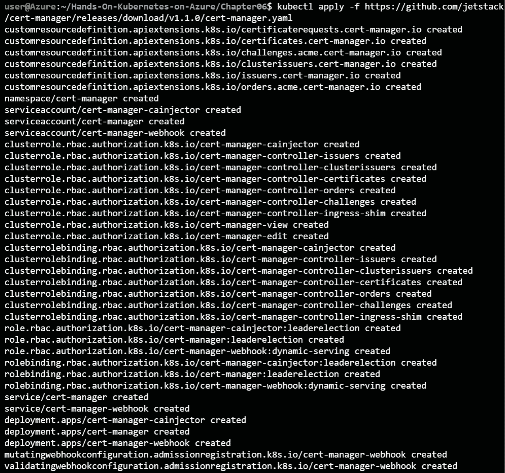
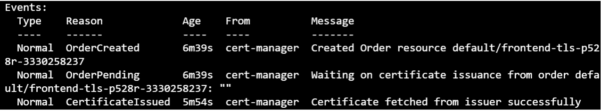

# 6. 使用 HTTPS 保护你的应用程序

HTTPS 已成为任何面向公众网站的必备条件。它不仅提高了你网站的安全性，而且在新的浏览器功能中也逐渐成为一种要求。HTTPS 是 HTTP 协议的安全版本。HTTPS 使用**传输层安全性**（**TLS**）证书加密终端用户与服务器之间，或两个服务器之间的流量。TLS 是**安全套接字层**（**SSL**）的继任者。术语 *TLS* 和 *SSL* 经常被交替使用。

过去，你需要从**证书颁发机构**（**CA**）购买证书，然后将其设置在 Web 服务器上，并定期更新。虽然今天仍然可以这样做，但**Let's Encrypt** 服务和 Kubernetes 中的辅助工具使得在集群中设置经过验证的 TLS 证书变得非常容易。Let's Encrypt 是一个由**互联网安全研究小组**（**ISRG**）运营并得到多家公司支持的非营利组织。它是一个免费的服务，提供自动化的经过验证的 TLS 证书。自动化是 Let's Encrypt 服务的一个关键优势。

在 Kubernetes 辅助工具方面，你将了解一个新对象，称为**Ingress**，并使用一个 Kubernetes 插件，叫做 **cert-manager**。Ingress 是 Kubernetes 中的一个对象，用于管理外部访问服务，通常用于 HTTP 服务。Ingress 在我们在*第三章*《应用程序部署在 AKS 上》中解释的服务对象之上添加了额外的功能。它可以配置为处理 HTTPS 流量。它还可以配置为根据主机名将流量路由到不同的后端服务，主机名是由**域名系统**（**DNS**）分配的，用于连接。

`cert-manager` 是一个 Kubernetes 插件，帮助自动化创建 TLS 证书。当证书即将过期时，它还帮助进行证书的轮换。`cert-manager` 可以与 Let's Encrypt 接口，自动请求证书。

在本章中，你将看到如何将 Azure 应用网关设置为 Kubernetes Ingress，并使用 `cert-manager` 与 Let's Encrypt 进行接口对接。

本章将涵盖以下主题：

+   设置 Azure 应用网关作为 Kubernetes Ingress

+   在服务前设置 Ingress

+   向 Ingress 添加 TLS 支持

让我们从设置 Azure 应用网关作为 AKS 的 Ingress 开始。

## 设置 Azure 应用网关作为 Kubernetes Ingress

在 Kubernetes 中，Ingress 是一个对象，用于将来自集群外部的 HTTP 和 HTTPS 流量路由到集群中的服务。通过 Ingress 暴露服务，而不是像到目前为止那样直接暴露它们，有许多优势。这些优势包括能够将多个主机名路由到同一个公共 IP 地址，并将 TLS 终止从实际应用程序卸载到 Ingress。

要在 Kubernetes 中创建一个入口（ingress），你需要安装一个入口控制器。入口控制器是能够在 Kubernetes 中创建、配置和管理入口的软体。Kubernetes 并没有预装入口控制器。入口控制器有多种实现方式，完整的列表可以在此网址查看：[`kubernetes.io/docs/concepts/services-networking/ingress-controllers/`](https://kubernetes.io/docs/concepts/services-networking/ingress-controllers/)

在 Azure 中，应用程序网关是一个第七层负载均衡器，可以通过使用 **应用程序网关入口控制器（AGIC）** 将其作为 Kubernetes 的入口。第七层负载均衡器是工作在应用层的负载均衡器，而应用层是 OSI 网络参考模型中的第七层，也是最高层。Azure 应用程序网关拥有许多高级功能，如自动扩展和 **Web 应用防火墙（WAF）**。

配置 AGIC 有两种方式：使用 Helm 或作为 **Azure Kubernetes Service** (**AKS**) 附加组件。通过 AKS 附加组件功能安装 AGIC，将得到一个微软支持的配置。此外，使用附加组件的部署方式会由微软自动更新，确保你的环境始终保持最新。

在这一节中，你将创建一个新的应用程序网关实例，使用附加组件方式设置 AGIC，最后部署一个入口资源以暴露一个应用程序。在本章稍后的部分，你将扩展这个设置，使用 Let's Encrypt 证书加入 TSL。

### 创建新的应用程序网关

在这一节中，你将使用 Azure CLI 创建一个新的应用程序网关。然后，在下一节中，你将使用此应用程序网关与 AGIC 集成。本节中的不同步骤已在本章的 `setup-appgw.sh` 文件中的代码示例中进行了总结，这个文件是随书提供的代码示例的一部分。

1.  为了组织本章中创建的资源，建议你创建一个新的资源组。确保在你部署 AKS 集群的相同位置创建新的资源组。你可以通过以下命令在 Azure CLI 中完成此操作：

    ```
    az group create -n agic -l westus2
    ```

1.  接下来，你需要创建应用程序网关所需的网络组件。这些组件包括一个带 DNS 名称的公共 IP 和一个新的虚拟网络。你可以使用以下命令来完成此操作：

    ```
    az network public-ip create -n agic-pip \
       -g agic --allocation-method Static --sku Standard \
       --dns-name "<your unique DNS name>"
    az network vnet create -n agic-vnet -g agic \
      --address-prefix 192.168.0.0/24 --subnet-name agic-subnet \
      --subnet-prefix 192.168.0.0/24
    ```

    #### 注意

    `az network public-ip create` 命令可能会显示一个警告信息 `[Coming breaking change] 在即将发布的版本中，当 sku 为 Standard 且未提供区域时，默认行为将发生变化：对于区域性区域，你将获得一个区域冗余的 IP，表示为 zones:["1","2","3"]; 对于非区域性区域，你将获得一个非区域冗余的 IP，表示为 zones:[]。`

1.  最后，你可以创建应用程序网关。此命令的执行可能需要几分钟时间。

    ```
    az network application-gateway create -n agic -l westus2 \
      -g agic --sku Standard_v2 --public-ip-address agic-pip \
      --vnet-name agic-vnet --subnet agic-subnet
    ```

1.  应用程序网关的部署需要几分钟时间。一旦创建完成，你可以在 Azure 门户中查看该资源。要查找它，可以在 Azure 搜索栏中搜索 `agic`（或你为应用程序网关设置的名称），然后选择你的应用程序网关。

    图 6.1：在 Azure 搜索栏中查找应用程序网关

1.  这将显示你的应用程序网关在 Azure 门户中的样子，如 *图 6.2* 所示：

    图 6.2：Azure 门户中的应用程序网关

1.  要验证是否已成功创建，浏览到你为公共 IP 地址配置的 DNS 名称。这将显示类似于 *图 6.3* 的输出。请注意，所显示的错误消息是预期中的，因为你还没有在应用程序网关后面配置任何应用程序。你将在 *为 guestbook 应用程序添加 Ingress 规则* 一节中使用 AGIC 配置应用程序。


图 6.3：验证是否可以连接到应用程序网关

现在你已经创建了一个新的应用程序网关并成功连接，我们将继续将这个应用程序网关与现有的 Kubernetes 集群集成。

### 配置 AGIC

在本节中，你将使用 AGIC AKS 插件将应用程序网关与 Kubernetes 集群集成。你还将设置虚拟网络对等连接，以便应用程序网关可以将流量发送到你的 Kubernetes 集群。

1.  要启用集群与应用程序网关之间的集成，请使用以下命令：

    ```
    appgwId=$(az network application-gateway \
      show -n agic -g agic -o tsv --query "id") 
    az aks enable-addons -n handsonaks \
      -g rg-handsonaks -a ingress-appgw \
      --appgw-id $appgwId
    ```

1.  接下来，你需要将应用程序网关网络与 AKS 网络进行对等连接。要进行网络对等连接，可以使用以下代码：

    ```
    nodeResourceGroup=$(az aks show -n handsonaks \
      -g rg-handsonaks -o tsv --query "nodeResourceGroup")
    aksVnetName=$(az network vnet list \
      -g $nodeResourceGroup -o tsv --query "[0].name")
    aksVnetId=$(az network vnet show -n $aksVnetName \
      -g $nodeResourceGroup -o tsv --query "id")
    az network vnet peering create \
      -n AppGWtoAKSVnetPeering -g agic \
      --vnet-name agic-vnet --remote-vnet $aksVnetId \
      --allow-vnet-access
    appGWVnetId=$(az network vnet show -n agic-vnet \
      -g agic -o tsv --query "id")
    az network vnet peering create \
      -n AKStoAppGWVnetPeering -g $nodeResourceGroup \
      --vnet-name $aksVnetName --remote-vnet $appGWVnetId --allow-vnet-access
    ```

这标志着应用程序网关与 AKS 集群的集成完成。你已经启用了 AGIC 插件，并将两个网络连接在一起。在接下来的章节中，你将使用 AGIC 集成为演示应用程序创建一个 Ingress。

### 为 guestbook 应用程序添加 Ingress 规则

到目前为止，你已经创建了一个新的应用程序网关，并将其与 Kubernetes 集群集成。在本节中，你将部署 guestbook 应用程序，然后通过 Ingress 将其暴露。

1.  要启动 guestbook 应用程序，请输入以下命令：

    ```
    kubectl create -f guestbook-all-in-one.yaml
    ```

    这将创建你在前几章中使用过的 guestbook 应用程序。你应该能看到如 *图 6.4* 所示的对象正在创建：

    

    图 6.4：创建 guestbook 应用程序

1.  然后，你可以使用以下 YAML 文件通过入口暴露前端服务。这在本章的源代码中提供为 `simple-frontend-ingress.yaml`：

    ```
    1   apiVersion: networking.k8s.io/v1
    2   kind: Ingress
    3   metadata:
    4     name: simple-frontend-ingress
    5     annotations:
    6       kubernetes.io/ingress.class: azure/application-gateway
    7   spec:
    8     rules:
    9     - http:
    10        paths:
    11        - path: /
    12          pathType: Prefix
    13          backend:
    14            service:
    15              name: frontend
    16              port:
    17                number: 80
    ```

    让我们看看这个 YAML 文件中定义了什么：

    +   `Ingress` 对象。

    +   `azure/application-gateway`。

    以下几行定义了实际的入口：

    +   **第 8-12 行**：在这里，你定义了该入口监听的路径。在我们的案例中，这是顶级路径。在更高级的情况下，你可以使用不同的路径指向不同的服务。

    +   **第 13-17 行**：这些行定义了该流量应指向的实际服务。

    你可以使用以下命令来创建此入口：

    ```
    kubectl apply -f simple-frontend-ingress.yaml
    ```

1.  如果你现在访问你在*创建新应用程序网关*部分中创建的 http://dns-name/，你应该会看到如*图 6.5*所示的输出：

    图 6.5：通过入口访问 guestbook 应用程序

    #### 注意

    你不需要像前几章那样公开暴露前端服务。你已经将入口作为公开的服务，前端服务仍然对集群保持私有。

    

    图 6.6：显示公开可访问入口的流程图

1.  你可以通过运行以下命令来验证这一点：

    ```
    kubectl get service
    ```

1.  这应该能显示出你没有公共服务，因为在*图 6.7*中看不到`EXTERNAL-IP`：


图 6.7：输出显示你没有公共服务

在本节中，你启动了 guestbook 应用程序的一个实例。然后，你通过创建入口将其公开，从而配置了你之前创建的应用程序网关。只有入口是公开可访问的。

接下来，你将扩展 AGIC 的功能，并学习如何使用 Let's Encrypt 的证书来保护流量。

## 向入口添加 TLS

现在，你将为应用程序添加 HTTPS 支持。为此，你需要一个 TLS 证书。你将使用 `cert-manager` Kubernetes 插件来向 Let's Encrypt 请求证书。

#### 注意

尽管本节重点介绍了使用 Let's Encrypt 等自动化服务，但你仍然可以选择传统方式，购买现有证书颁发机构（CA）的证书并将其导入 Kubernetes。有关如何操作的更多信息，请参考 Kubernetes 文档：[`kubernetes.io/docs/concepts/services-networking/ingress/#tls`](https://kubernetes.io/docs/concepts/services-networking/ingress/#tls )

这其中涉及几个步骤。将 HTTPS 添加到应用程序的过程如下：

1.  安装 `cert-manager`，它与 Let's Encrypt API 进行交互，为你指定的域名请求证书。

1.  安装证书颁发者，它将从 Let's Encrypt 获取证书。

1.  为给定的**完全限定域名**（**FQDN**）创建 SSL 证书。FQDN 是一个完全限定的 DNS 记录，包含顶级域名（例如.org 或.com）。你在*第 2 步*的*创建新应用程序网关*部分中创建了一个与公共 IP 关联的 FQDN。

1.  通过使用*第 3 步*中创建的证书，创建一个入口（ingress）来保护前端服务。在本节的示例中，你不会单独执行这一步。你将重新配置入口，以自动获取在*第 3 步*中创建的证书。

让我们从在集群中安装`cert-manager`的第一步开始。

### 安装 cert-manager

`cert-manager` ([`github.com/jetstack/cert-manager`](https://github.com/jetstack/cert-manager)) 是一个 Kubernetes 插件，它自动化管理和颁发来自各种颁发源的 TLS 证书。它负责续订证书，并确保证书定期更新。

#### 注意

`cert-manager`项目不是由微软管理或维护的。它是一个开源解决方案，最初由**Jetstack**公司管理，最近该公司将其捐赠给了 Cloud Native Computing Foundation。

以下命令将在你的集群中安装`cert-manager`：

```
kubectl apply -f https://github.com/jetstack/cert-manager/releases/download/v1.2.0/cert-manager.yaml
```

这将安装集群中的多个组件，如*图 6.8*所示。有关这些组件的详细解释，请参见`cert-manager`文档：[`cert-manager.io/docs/installation/kubernetes/`](https://cert-manager.io/docs/installation/kubernetes/)。



图 6.8：在集群中安装 cert-manager

`cert-manager`利用了 Kubernetes 的一个功能，称为`cert-manager`，它会创建六个 CRD，之后你将在本章中使用其中的一些。

现在你已经安装了`cert-manager`，可以进行下一步操作：设置证书颁发者。

### 安装证书颁发者

在本节中，你将安装 Let's Encrypt 的暂存证书颁发者。证书可以由多个颁发者颁发。例如，`letsencrypt-staging`是用于测试的。当你构建测试时，会使用暂存服务器。证书颁发者的代码已在本章的源代码中提供，位于`certificate-issuer.yaml`文件中。像往常一样，使用`kubectl create -f certificate-issuer.yaml`；该 YAML 文件的内容如下：

```
1   apiVersion: cert-manager.io/v1
2   kind: Issuer
3   metadata:
4     name: letsencrypt-staging
5   spec:
6     acme:
7       server: https://acme-staging-v02.api.letsencrypt.org/directory
8       email: <your e-mail address>
9       privateKeySecretRef:
10        name: letsencrypt-staging
11      solvers:
12      - http01:
13          ingress:
14            class: azure/application-gateway
```

让我们看看我们在这里定义了什么：

+   `cert-manager`已创建。在这种情况下，特别是，你指向`Issuer`对象。颁发者是你的 Kubernetes 集群与实际的证书颁发机构之间的联系，本例中是 Let's Encrypt。

+   **第 6-10 行**：在这里，你提供了 Let's Encrypt 的配置，并指向暂存服务器。

+   **第 11-14 行**：这是 ACME 客户端的附加配置，用于认证域名所有权。您将 Let's Encrypt 指向 Azure 应用程序网关入口，以验证您拥有稍后申请证书的域名。

安装证书颁发机构后，您现在可以继续执行下一步：在入口上创建 TLS 证书。

### 创建 TLS 证书并保护入口

在本节中，您将创建一个 TLS 证书。您可以通过两种方式配置 `cert-manager` 来创建证书。您可以手动创建证书并将其链接到入口，或者您可以配置入口控制器，使得 `cert-manager` 自动创建证书。

在这个示例中，您将使用后一种方法配置入口。

1.  首先，编辑入口文件使其像下面的 YAML 代码一样。此文件在 GitHub 上的源代码中以 `ingress-with-tls.yaml` 存在：

    ```
    1   apiVersion: networking.k8s.io/v1
    2   kind: Ingress
    3   metadata:
    4     name: simple-frontend-ingress
    5     annotations:
    6       kubernetes.io/ingress.class: azure/application-gateway
    7       cert-manager.io/issuer: letsencrypt-staging
    8       cert-manager.io/acme-challenge-type: http01
    9   spec:
    10    rules:
    11    - http:
    12        paths:
    13        - path: /
    14          pathType: Prefix
    15          backend:
    16            service:
    17              name: frontend
    18              port:
    19                number: 80
    20      host: <your dns-name>.<your azure region>.cloudapp.azure.com
    21    tls:
    22      - hosts:
    23        - <your dns-name>.<your azure region>.cloudapp.azure.com 
    24        secretName: frontend-tls 
    ```

    您应该对原始入口做出以下更改：

    +   `acme-challenge` 以证明域名所有权。

    +   **第 20 行**：此处添加入口的域名。因为 Let's Encrypt 只为域名颁发证书，所以这是必需的。

    +   **第 21-24 行**：这是入口的 TLS 配置。它包含主机名以及将创建的用于存储证书的密钥名称。

1.  您可以使用以下命令更新之前创建的入口：

    ```
    kubectl apply -f ingress-with-tls.yaml
    ```

    `cert-manager` 大约需要一分钟的时间来请求证书并配置入口以使用该证书。在等待期间，让我们来看看 `cert-manager` 为您创建的中间资源。

1.  首先，`cert-manager` 为您创建了一个 `certificate` 对象。您可以使用以下命令查看该对象的状态：

    ```
    kubectl get certificate
    ```

    此命令将生成如*图 6.9*所示的输出：

    

    图 6.9：证书对象的状态

1.  如您所见，证书尚未准备好。`cert-manager` 还创建了另一个对象来实际获取证书。这个对象是 `certificaterequest`。您可以使用以下命令获取其状态：

    ```
    kubectl get certificaterequest
    ```

    这将生成如*图 6.10*所示的输出：

    

    ```
    kubectl describe certificaterequest
    ```

    在等待证书颁发期间，状态将类似于*图 6.11*所示：

    

    图 6.11：使用 kubectl describe 命令获取证书请求对象的详细信息

    如您所见，`certificaterequest` 对象显示了订单已创建并且处于待处理状态。

1.  几秒钟后，`describe` 命令应该会返回成功创建证书的消息。运行以下命令获取更新的状态：

    ```
    kubectl describe certificaterequest
    ```

    此命令的输出如*图 6.12*所示：

    

    图 6.12：已发放的证书

    这应该使前端入口通过 HTTPS 提供服务。

1.  让我们在浏览器中试试，通过浏览到你在*创建新的应用程序网关*部分中创建的 DNS 名称。根据浏览器的缓存，你可能需要在 URL 前加上 `https://`。

1.  一旦你到达入口点，它会在浏览器中显示错误，提示证书无效，类似于*图 6.13*。这是可以预期的，因为你正在使用 Let's Encrypt 的暂存服务器：


图 6.13：使用 Let's Encrypt 暂存服务器时，证书默认不被信任

你可以通过点击**高级**并选择**继续**来浏览到你的应用程序。

在本节中，你成功地为你的入口添加了 TLS 证书，以保护到它的流量。既然你已经能够使用暂存证书完成测试，现在可以继续进入生产系统。

### 从暂存切换到生产环境

在本节中，你将从暂存证书切换到生产级证书。为此，你可以通过在集群中创建新的发行者来重新进行之前的操作，类似以下内容（该代码在 `certificate-issuer-prod.yaml` 文件中提供，作为本书代码示例的一部分）。别忘了在文件中更改你的电子邮件地址。以下代码包含在该文件中：

```
1   apiVersion: cert-manager.io/v1alpha2
2   kind: Issuer
3   metadata:
4     name: letsencrypt-prod
5   spec:
6     acme:
7       server: https://acme-v02.api.letsencrypt.org/directory
8       email: <your e-mail>
9       privateKeySecretRef:
10        name: letsencrypt-prod
11      solvers:
12      - http01:
13          ingress:
14            class: azure/application-gateway 
```

然后，在 `ingress-with-tls.yaml` 文件中将发行者的引用替换为 `letsencrypt-prod`，如所示（在 `ingress-with-tls-prod.yaml` 文件中提供）：

```
1   apiVersion: networking.k8s.io/v1
2   kind: Ingress
3   metadata:
4     name: simple-frontend-ingress
5     annotations:
6       kubernetes.io/ingress.class: azure/application-gateway
7       cert-manager.io/issuer: letsencrypt-prod
8       cert-manager.io/acme-challenge-type: http01
9   spec:
10    rules:
11    - http:
12        paths:
13        - path: /
14          pathType: Prefix
15          backend:
16            service:
17              name: frontend
18              port:
19                number: 80
20      host: <your dns-name>.<your azure region>.cloudapp.azure.com
21    tls:
22      - hosts:
23        - <your dns-name>.<your azure region>.cloudapp.azure.com
24        secretName: frontend-prod-tls 
```

要应用这些更改，请执行以下命令：

```
kubectl create -f certificate-issuer-prod.yaml
kubectl apply -f ingress-with-tls-prod.yaml
```

证书再次激活需要大约一分钟的时间。新证书发放后，你可以再次访问你的 DNS 名称，并且不再会看到有关证书无效的警告。如果你点击浏览器中的锁形图标，你应该会看到你的连接是安全的并且使用了有效证书：


图 6.14：显示有效证书的网页

在本节中，你学习了如何为入口添加 TLS 支持。你通过安装 `cert-manager` Kubernetes 插件完成了这项工作。`cert-manager` 从 Let's Encrypt 获得了免费证书，并将其添加到已部署在应用程序网关上的现有入口中。这里描述的过程并非特定于 Azure 和 Azure 应用程序网关。这种为入口添加 TLS 的过程也适用于其他入口控制器。

让我们删除本章中创建的资源：

```
kubectl delete -f https://github.com/jetstack/cert-manager/releases/download/v1.1.0/cert-manager.yaml
az aks disable-addons -n handsonaks \
  -g rg-handsonaks -a ingress-appgw 
```

## 总结

在本章中，您为 guestbook 应用程序添加了 HTTPS 安全性，而无需实际更改源代码。您首先设置了一个新的应用程序网关，并在 AKS 上配置了 AGIC。这使您能够创建可以在应用程序网关上配置的 Kubernetes ingress。

接下来，您安装了一个与 Let's Encrypt API 接口的证书管理器，用于请求后续指定的域名证书。您利用证书颁发机构从 Let's Encrypt 获取证书。然后，您重新配置了 ingress，以便在集群中向该证书颁发机构请求证书。借助证书管理器和 ingress 的这些功能，您现在能够通过 TLS 来保护您的网站。

在下一章中，您将学习如何监控您的部署并设置警报。您还将学习如何在错误发生时快速识别根本原因，以及如何调试在 AKS 上运行的应用程序。同时，您将学习在识别根本原因后如何进行正确的修复。
