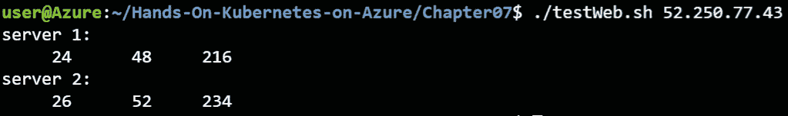
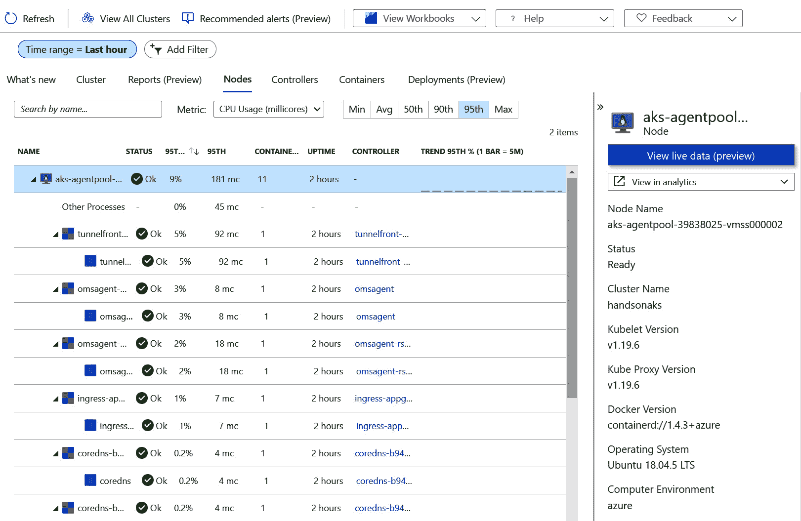

# 7\. 监控 AKS 集群和应用程序

现在你已经知道如何在 AKS 集群上部署应用程序，让我们集中讨论如何确保你的集群和应用程序保持可用。在本章中，你将学习如何监控集群和运行在其上的应用程序。你将探索 Kubernetes 如何通过就绪探针和存活探针确保你的应用程序可靠运行。

你还将学习**AKS 诊断**和**Azure 监视器**的使用方法，以及它们如何在 Azure 门户中集成。你将看到如何使用 AKS 诊断来监控集群本身的状态，以及 Azure 监视器如何帮助监控集群中的 Pods，并允许你在大规模上访问 Pods 的日志。

简而言之，本章将涵盖以下主题：

+   使用`kubectl`监控和调试应用程序

+   审查 Kubernetes 报告的指标

+   审查来自 Azure 监视器的指标

让我们通过回顾一些`kubectl`命令来开始本章内容，这些命令可以帮助你监控应用程序。

## 用于监控应用程序的命令

监控部署在 Kubernetes 上的应用程序及其 Kubernetes 基础设施的健康状况，对于向客户提供可靠的服务至关重要。监控有两个主要的使用场景：

+   持续监控，获取异常警报

+   故障排除和调试应用程序错误

在观察运行在 Kubernetes 集群上的应用程序时，你需要并行检查多个方面，包括容器、Pods、服务以及集群中的节点。对于持续监控，你需要使用像 Azure 监视器或 Prometheus 这样的监控系统。Azure 监视器将在本章后续介绍。Prometheus（[`prometheus.io/`](https://prometheus.io/)）是 Kubernetes 生态系统中流行的开源解决方案，用于监控 Kubernetes 环境。对于故障排除，你需要与实时集群进行交互。最常用的故障排除命令如下：

```
kubectl get <resource type> <resource name>
kubectl describe <resource type> <resource name>
kubectl logs <pod name>
```

本章稍后将详细描述每个命令。

为了开始实际示例，使用以下命令重新创建 guestbook 示例：

```
kubectl create -f guestbook-all-in-one.yaml
```

在`create`命令运行时，你将观察其在以下部分的进度。让我们先来探索`get`命令。

### `kubectl get`命令

要查看部署应用程序的整体情况，`kubectl`提供了`get`命令。`get`命令列出你指定的资源。资源可以是 Pods、ReplicaSets、ingresses、节点、部署、机密等。你已经在前几章中运行过此命令，以验证应用程序是否已准备好使用。

执行以下步骤：

1.  运行以下`get`命令，获取资源及其状态：

    ```
    kubectl get all
    ```

    这将显示你命名空间中的所有部署、ReplicaSets、Pods 和服务：

    

    图 7.1：默认命名空间中运行的所有资源

1.  集中注意力查看你部署中的 pods。你可以使用以下命令获取 pods 的状态：

    ```
    kubectl get pods
    ```

    你将只看到 pods，如 *图 7.2* 所示。让我们详细查看：

    

    图 7.2：你命名空间中的所有 pods

    第一列显示 pod 名称，例如 `frontend-766d4f77cb-ds6gb`。第二列显示 pod 中有多少容器已经准备好，相对于 pod 中容器的总数。就绪状态通过 Kubernetes 中的就绪探针定义。本章稍后会有一个专门的章节介绍 *就绪性和存活性探针*。

    第三列显示状态，例如 `Pending`、`ContainerCreating`、`Running` 等。第四列显示重启次数，第五列显示创建 pod 时的年龄。

1.  如果你需要更多关于 pod 的信息，可以通过在命令中添加 `-o wide` 来扩展 `get` 命令的输出，像这样：

    ```
    kubectl get pods -o wide
    ```

    这将显示更多信息，如 *图 7.3* 所示：


图 7.3：添加 -o wide 显示 pods 的更多细节

额外的列包括 pod 的 IP 地址、它所运行的节点、提名节点和就绪门控。提名节点仅在高优先级 pod 抢占低优先级 pod 时设置。提名节点字段随后会设置在高优先级 pod 上。这表示在低优先级 pod 平稳终止后，高优先级 pod 将会调度到此节点。就绪门控是一种将外部系统组件引入为 pod 就绪状态的方法。

执行 `get pods` 命令仅显示当前 pod 的状态。正如我们接下来将看到的，任何状态下都有可能发生失败，我们需要使用 `kubectl describe` 命令来深入探讨。

### kubectl describe 命令

`kubectl describe` 命令会提供你正在描述的对象的详细视图。它包含了该对象本身的细节，以及与该对象相关的任何最新事件。而 `kubectl get events` 命令列出了整个命名空间的所有事件，使用 `kubectl describe` 命令时，你只会看到与特定对象相关的事件。如果你只对 pods 感兴趣，可以使用以下命令：

```
kubectl describe pods
```

上述命令列出了与所有 pods 相关的所有信息。通常这些信息过于繁杂，无法在普通的 shell 中显示。

如果你只想查看特定 pod 的信息，可以输入以下命令：

```
kubectl describe pod/<pod-name>
```

#### 注意

你可以在 `pod` 和 `<pod-name>` 之间使用斜杠或空格。以下两个命令将产生相同的输出：

`kubectl describe pod/<pod-name>`

`kubectl describe pod <pod-name>`

你将得到一个类似于 *图 7.4* 的输出，稍后将详细解释：


图 7.4：描述一个对象，显示该对象的详细输出

从描述中，你可以获取 Pod 运行的节点、运行了多久、其内部 IP 地址、Docker 镜像名称、暴露的端口、`env` 变量以及事件（来自过去一小时内的事件）。

在前面的例子中，Pod 的名称是 `frontend-766d4f77cb-ds6gb`。正如 *第一章，容器和 Kubernetes 入门* 中提到的，它采用 `<ReplicaSet 名称>-<随机 5 个字符>` 格式。`replicaset` 名称本身是从前端的部署名称随机生成的：`<deployment 名称>-<随机字符串>`。

*图 7.5* 显示了部署、ReplicaSet 和 Pod 之间的关系：


图 7.5：部署、ReplicaSet 和 Pod 之间的关系

该 Pod 运行的命名空间是 `default`。到目前为止，你一直在使用名为 `default` 的命名空间。

来自前面输出的另一个重要部分是 `node` 部分：

```
Node:         aks-agentpool-39838025-vmss000000/10.240.0.4 
```

`node` 部分让你知道 Pod 正在运行的物理节点/虚拟机。如果 Pod 一直在重启或出现运行问题，而其他一切看起来正常，那可能是节点本身的问题。获得这些信息对于进行高级调试至关重要。

以下是 Pod 最初预定的时间：

```
Start Time:   Tue, 26 Jan 2021 02:10:33 +0000 
```

这并不意味着 Pod 从那个时间点开始就一直在运行，所以从这个意义上来说，时间可能具有误导性。如果发生健康事件（例如，容器崩溃），Pod 会自动重置。

你可以通过使用 `Labels` 在 Kubernetes 中添加更多关于工作负载的信息，如下所示：

```
Labels:app=guestbook
pod-template-hash=57d8c9fb45
tier=frontend
```

标签是 Kubernetes 中常用的功能。例如，这就是如何在对象之间建立链接的方式，如 `service` 到 `pod` 和 `deployment` 到 `ReplicaSet` 再到 `pod`（*图 7.5*）。如果你发现流量没有从服务路由到 Pod，这是你首先需要检查的地方。同时，你还会注意到 `pod-template-hash` 标签也出现在 Pod 名称中。这就是 ReplicaSet 和 Pod 之间链接的方式。如果标签不匹配，资源将无法连接。

以下显示的是 Pod 的内部 IP 和其状态：

```
Status:       Running
IP:           10.244.0.44
IPs:
  IP:           10.244.0.44 
```

如前章所述，在构建应用程序时，Pod 可能会迁移到不同的节点并获取不同的 IP，因此应避免使用这些 IP 地址。然而，在调试应用程序问题时，获取 Pod 的直接 IP 有助于排查问题。你可以不通过服务对象连接到应用程序，而是通过直接连接到其他 Pod 的 IP 地址来测试连接性。

在 Pod 中运行的容器以及暴露的端口列在以下代码块中：

```
Containers:
  php-redis:
    ...
    Image:          gcr.io/google-samples/gb-frontend:v4
    ...
    Port:           80/TCP
    ...
    Requests:
      cpu:     10m
      memory:  10Mi
    Environment:
      GET_HOSTS_FROM:  dns
    ...
```

在这种情况下，你正在从`gcr.io`容器注册表获取`v4`标签的`gb-frontend`容器，仓库名称是`google-samples`。

端口`80`暴露给外部流量。由于每个 Pod 都有自己的 IP 地址，即使在同一主机上运行多个相同 Pod 的实例，仍然可以暴露相同的端口。例如，如果你有两个 Pod 在同一节点上运行 Web 服务器，它们都可以使用端口`80`，因为每个 Pod 都有自己的 IP 地址。这是一个巨大的管理优势，因为你不需要担心在同一节点上的端口冲突。

过去一小时内发生的任何事件都会显示在这里：

```
Events:
```

使用`kubectl describe`非常有助于获取有关你正在运行的资源的更多上下文。最后一部分包含与你描述的对象相关的事件。你可以使用`kubectl get events`命令获取集群中的所有事件。

要查看系统中所有资源的事件，请运行以下命令：

```
kubectl get events
```

#### 注意

Kubernetes 默认只保留 1 小时的事件记录。

如果一切顺利，你应该会看到类似*图 7.6*的输出：


图 7.6：获取事件显示过去一小时内的所有事件

*图 7.6*只显示了一个 Pod 的事件，但正如你在输出中看到的，这个命令的输出包含了最近创建、更新或删除的所有资源的事件。

在这一部分，你已经了解了可以用来检查 Kubernetes 应用程序的命令。在下一部分，你将专注于调试应用程序故障。

### 调试应用程序

现在你已经基本了解了如何检查应用程序，你可以开始了解如何调试部署中的问题。

在这一部分，将介绍常见错误，并帮助你确定如何调试和修复它们。

如果你还没有实现 Guestbook 应用程序，请运行以下命令：

```
kubectl create -f guestbook-all-in-one.yaml
```

几秒钟后，应用程序应该能够正常运行。

### 镜像拉取错误

在这一部分，你将通过将镜像标签值设置为一个不存在的标签来引入镜像拉取错误。当 Kubernetes 无法下载所需容器的镜像时，就会发生镜像拉取错误。

1.  在 Azure Cloud Shell 中运行以下命令：

    ```
    kubectl edit deployment/frontend
    ```

    接下来，执行以下步骤，将镜像标签从`v4`更改为`v_non_existent`。

1.  输入`/gb-frontend`并按下*Enter*键，将光标带到镜像定义位置。

    按下*I*键进入插入模式。删除 `v4` 并输入 `v_non_existent`，如*图 7.7*所示：

    

    图 7.7：将镜像标签从 v4 更改为 v_non_existent

1.  现在，首先按下*Esc*键关闭编辑器，然后输入`:wq!`并按*Enter*键。

1.  运行以下命令以列出当前命名空间中的所有 pod：

    ```
    kubectl get pods
    ```

    上述命令应该会显示错误，如*图 7.8*所示：

    

    图 7.8：其中一个 pod 的状态为 ErrImagePull 或 ImagePullBackOff

    你可能会看到 `ErrImagePull` 或 `ImagePullBackOff` 状态。这两种错误都表示 Kubernetes 无法从注册表中拉取镜像。`ErrImagePull` 错误正是描述这一点；`ImagePullBackOff` 则表示 Kubernetes 会在重试下载镜像之前等待，这种回退有一个指数级的延迟，从 10 秒到 20 秒到 40 秒，以此类推，最多可达 5 分钟。

1.  运行以下命令获取完整的错误细节：

    ```
    kubectl describe pods/<failed pod name>
    ```

    一个示例错误输出显示在*图 7.9*中，关键的错误信息用红色标出：

    

    图 7.9：使用 describe 显示更多的错误细节

    事件清楚地显示镜像不存在。将无效凭证传递给私有 Docker 仓库等错误也会在此显示。

1.  通过将镜像标签设置回`v4`来修复错误。首先，在 Cloud Shell 中输入以下命令以编辑部署：

    ```
    kubectl edit deployment/frontend
    ```

1.  输入`/gb-frontend`并按下*Enter*键，将光标带到镜像定义位置。

1.  按下*I*键进入插入模式。删除 `v_non_existent`，并输入 `v4`。

1.  现在，首先按下*Esc*键关闭编辑器，然后输入`:wq!`并按*Enter*键。

1.  这应该会自动修复部署。你可以通过再次获取 pod 的事件来验证它。

    #### 注意

    由于 Kubernetes 进行了滚动更新，前端服务保持持续可用，且没有停机时间。Kubernetes 识别到新规范中的问题，并停止自动推送额外的更改。

镜像拉取错误可能会发生在镜像不可用或无法访问容器注册表时。在接下来的章节中，你将探索应用程序本身的错误。

### 应用程序错误

现在你将看到如何调试应用程序错误。本节中的错误将是自我引发的，类似于上一节。调试该问题的方法与我们用来调试正在运行的应用程序的错误相同。

1.  首先，获取前端服务的公共 IP：

    ```
    kubectl get service 
    ```

1.  通过将公共 IP 粘贴到浏览器中来连接到服务。创建几个条目：


图 7.10：在访客留言应用中添加几个条目

你现在已经有一个运行中的访客留言应用实例。为了改善示例体验，最好缩减前端，使其只运行一个副本。

### 缩减前端

在*第三章*，*在 AKS 上部署应用*中，你学到了前端部署的配置是`replicas=3`。这意味着应用接收到的请求可以由任何 pod 处理。为了引入应用错误并记录这些错误，你需要在所有三个 pod 中进行更改。

但为了简化这个示例，将`replicas`设置为`1`，这样你只需要对一个 pod 进行更改：

```
kubectl scale --replicas=1 deployment/frontend
```

只运行一个副本将使引入错误变得更加容易。现在我们来引入这个错误。

### 引入应用错误

在这种情况下，你将使**提交**按钮无法工作。你需要修改应用代码来实现这一点：

#### 注意：

不建议通过使用`kubectl exec`在 pod 中执行命令来对应用进行生产环境中的更改。如果你需要更改应用，推荐的方式是创建一个新的容器镜像并更新你的部署。

1.  你将使用`kubectl exec`命令。此命令允许你在该 pod 的命令行上运行命令。使用`-it`选项，它将一个交互式终端附加到 pod 上，并为你提供一个可以运行命令的 shell。以下命令将在 pod 上启动一个 Bash 终端：

    ```
    kubectl exec -it <frontend-pod-name> -- bash
    ```

    这将进入一个 Bash shell 环境，如*图 7.11*所示：

    

    图 7.11：获取 pod 名称并访问 pod 内的 shell

1.  一旦进入容器 shell，运行以下命令：

    ```
    apt update
    apt install -y vim
    ```

    上面的代码安装了`vim`编辑器，以便我们可以编辑文件并引入错误。

1.  现在，使用`vim`打开`guestbook.php`文件：

    ```
    vim guestbook.php
    ```

1.  在第 17 行，在`if ($_GET['cmd'] == 'set') {`下添加以下代码。记住，在`vim`中编辑一行时，按下*I*键。编辑完成后，按*Esc*键退出，然后输入`:wq!`并按*Enter*：

    ```
    $host = 'localhost';
    if(!defined('STDOUT')) define('STDOUT', fopen('php://stdout', 'w'));
    fwrite(STDOUT, "hostname at the beginning of 'set' command "); fwrite(STDOUT, $host);
    fwrite(STDOUT, "\n");
    ```

    文件将如下所示，如*图 7.12*所示：

    

    图 7.12：引入错误和附加日志记录的更新代码

1.  现在你已经引入了一个错误，阅读消息会正常工作，但无法写入消息。你通过让前端连接到不存在的本地主机 Redis 主服务器来实现这一点。写入操作应该会失败。同时，为了让这个演示更加直观，我们在这段代码中添加了一些额外的日志记录。

    打开你的访客留言应用，通过浏览其公共 IP 地址，你应该能看到之前的条目：

    

    图 7.13：先前的条目仍然存在

1.  现在，通过输入一条消息并点击**提交**按钮来创建一条新消息：

    图 7.14：创建了新消息

    提交新消息后，它会出现在应用程序中。如果你不了解，可能会认为条目已经成功写入数据库。然而，如果你刷新浏览器，你会看到消息已经不在了。

1.  为了验证消息没有写入数据库，请在浏览器中点击**刷新**按钮；你将只看到最初的条目，而新条目已经消失：


图 7.15：新消息已消失

作为应用程序开发人员或运维人员，你可能会收到这样的工单：`新部署后，新条目未保存。请修复此问题。`

### 使用日志识别根本原因

解决的第一步是获取日志。

1.  现在退出前端 Pod 并获取此 Pod 的日志：

    ```
    exit
    kubectl logs <frontend-pod-name>
    ```

    #### 注意：

    你可以在`kubectl logs`后添加`-f`标志以获得实时日志流，命令如下：`kubectl logs <pod-name> -f`。在实时调试会话中非常有用。

1.  你将看到像*图 7.16*中显示的条目：

    图 7.16：新消息作为应用程序日志的一部分显示出来

1.  因此，你知道错误发生在写入数据库的代码的`set`部分。当你看到条目`hostname at the beginning of 'set' command localhost`时，你就知道错误发生在这一行和客户端开始之间，所以`$host = 'localhost'`的设置一定是引发错误的地方。这个错误并不像你想象的那样不常见，正如你刚才看到的，除非有特别的指示要求刷新浏览器，否则很容易通过 QA。这对开发者来说可能是完全没问题的，因为他们可能在本地机器上运行了 Redis 服务器。

现在你已经通过 Kubernetes 日志定位了问题的根本原因，让我们开始解决这个错误，并让应用程序恢复到健康状态。

### 解决问题

有两种方法可以修复你引入的这个错误：你可以进入 Pod 并修改代码，或者你可以请求 Kubernetes 给我们一个健康的新 Pod。我们不建议对 Pod 进行手动修改，因此在下一步中，你将使用第二种方法。让我们通过删除故障 Pod 来修复这个错误：

```
kubectl delete pod <podname>
```

由于有一个 ReplicaSet 控制着这些 Pod，你应该立即获得一个新的 Pod，该 Pod 从正确的镜像启动。尝试再次连接到留言板并验证消息是否能在浏览器刷新后仍然存在。

以下几点总结了本节内容，讲解了如何识别错误以及如何修复它：

+   错误可能以多种形式出现。

+   部署团队遇到的大多数错误都是配置问题。

+   使用日志来识别根本原因。

+   在容器上使用 `kubectl exec` 是一个有用的调试策略。

+   请注意，广泛允许 `kubectl exec` 是一个严重的安全风险，因为它允许 Kubernetes 操作员直接在他们有权限访问的 pod 中执行命令。确保只有一部分操作员能够使用 `kubectl exec` 命令。你可以使用基于角色的访问控制来管理这种访问限制，正如你将在*第八章、AKS 中的基于角色的访问控制*中学到的那样。

+   任何打印到 `stdout` 和 `stderr` 的内容都会出现在日志中（与应用程序/语言/日志框架无关）。

在本节中，你向留言本应用程序引入了一个应用程序错误，并利用 Kubernetes 日志来定位代码中的问题。在下一节中，你将学习 Kubernetes 中一个强大的机制，称为**就绪探针**和**存活探针**。

## 就绪探针和存活探针

就绪探针和存活探针在上一节中曾简要提到过。在本节中，你将更深入地探讨它们。

Kubernetes 使用存活探针和就绪探针来监控应用程序的可用性。每个探针有不同的用途：

+   **存活探针**监控应用程序在运行时的可用性。如果存活探针失败，Kubernetes 将重新启动你的 pod。这对于捕获死锁、无限循环或“卡住”的应用程序很有用。

+   **就绪探针**监控应用程序何时变得可用。如果就绪探针失败，Kubernetes 将不会向未就绪的 pod 发送流量。这在应用程序需要通过某些配置才能变得可用，或者应用程序已超载但正在从额外负载中恢复时非常有用。通过让就绪探针失败，应用程序将暂时不会接收更多流量，从而给予其从负载增加中恢复的能力。

存活探针和就绪探针不需要从应用程序中的同一端点提供服务。如果你有一个智能应用程序，该应用程序可以在仍然健康的情况下将自己从轮换中移除（意味着不再向该应用程序发送流量）。为此，它会让就绪探针失败，但存活探针保持活动。

让我们通过一个示例来构建这个过程。你将创建两个 nginx 部署，每个部署都有一个索引页面和一个健康检查页面。索引页面将用作存活探针。

### 构建两个 Web 容器

对于这个示例，你将使用几个网页，这些网页将用来连接到就绪探针和存活探针。文件已包含在本章的代码文件中。让我们首先创建 `index1.html`：

```
<!DOCTYPE html>
<html>
  <head>
    <title>Server 1</title>
  </head>
  <body>
    Server 1
  </body>
</html>
```

之后，创建 `index2.html`：

```
<!DOCTYPE html>
<html>
  <head>
    <title>Server 2</title>
  </head>
  <body>
    Server 2
  </body>
</html>
```

我们还可以创建一个健康页面，`healthy.html`：

```
<!DOCTYPE html>
<html>
  <head>
    <title>All is fine here</title>
  </head>
  <body>
    OK
  </body>
</html>
```

在接下来的步骤中，您将把这些文件挂载到 Kubernetes 部署中。为此，您将把这些文件转化为 `configmap`，并将其连接到您的 Pod。您已经在 *第三章 AKS 上的应用程序部署* 中学习了 configmap。使用以下命令创建 `configmap`：

```
kubectl create configmap server1 --from-file=index1.html
kubectl create configmap server2 --from-file=index2.html
kubectl create configmap healthy --from-file=healthy.html
```

这样一来，您可以继续创建两个 Web 部署。两个部署非常相似，唯一的区别是 `configmap` 的不同。第一个部署文件（`webdeploy1.yaml`）如下所示：

```
1   apiVersion: apps/v1
2   kind: Deployment
...
17     spec:
18       containers:
19         - name: nginx-1
20           image: nginx:1.19.6-alpine
21           ports:
22             - containerPort: 80
23           livenessProbe:
24             httpGet:
25               path: /healthy.html
26               port: 80
27             initialDelaySeconds: 3
28             periodSeconds: 3
29           readinessProbe:
30             httpGet:
31               path: /index.html
32               port: 80
33             initialDelaySeconds: 3
34             periodSeconds: 3
35           volumeMounts:
36             - name: html
37               mountPath: /usr/share/nginx/html
38             - name: index
39               mountPath: /tmp/index1.html
40               subPath: index1.html
41             - name: healthy
42               mountPath: /tmp/healthy.html
43               subPath: healthy.html
44           command: ["/bin/sh", "-c"]
45           args: ["cp /tmp/index1.html /usr/share/nginx/html/index.html; cp /tmp/healthy.html /usr/share/nginx/html/healthy.html; nginx; sleep inf"]
46       volumes:
47         - name: index
48           configMap:
49             name: server1
50         - name: healthy
51           configMap:
52             name: healthy
53         - name: html
54           emptyDir: {}
```

在此部署中，有几个需要注意的地方：

+   **第 23-28 行**：这是存活探针。存活探针指向健康页面。记住，如果健康页面失败，容器将会重启。

+   **第 29-32 行**：这是就绪探针。在我们的例子中，就绪探针指向索引页面。如果此页面失败，Pod 将暂时不接收任何流量，但会继续运行。

+   `sleep` 命令（这样容器会继续运行）。

您可以使用以下命令创建该部署。您还可以部署第二个版本的 `server 2`，它与 `server 1` 类似：

```
kubectl create -f webdeploy1.yaml
kubectl create -f webdeploy2.yaml
```

最后，您还可以创建一个服务（`webservice.yaml`），该服务将流量路由到两个部署中：

```
1   apiVersion: v1
2   kind: Service
3   metadata:
4     name: web
5   spec:
6     selector:
7       app: web-server
8     ports:
9     - protocol: TCP
10     port: 80
11     targetPort: 80
12   type: LoadBalancer
```

您可以使用以下命令来创建该服务：

```
kubectl create -f webservice.yaml
```

现在您的应用程序已启动并运行。在下一部分中，您将引入一些故障，以验证存活探针和就绪探针的行为。

### 实验存活探针和就绪探针

在上一部分中，我们解释了存活探针和就绪探针的功能，并创建了一个示例应用程序。在这一部分中，您将故意在应用程序中引入错误，并验证存活探针和就绪探针的行为。您将看到，就绪探针失败会导致 Pod 继续运行，但不再接受流量。之后，您将看到存活探针失败会导致 Pod 被重启。

让我们首先使就绪探针失败。

### 失败就绪探针会导致流量暂时停止

现在您已经启动了一个简单的应用程序，您可以尝试存活探针和就绪探针的行为。首先，让我们获取服务的外部 IP，以便通过浏览器连接到我们的 Web 服务器：

```
kubectl get service
```

如果在浏览器中访问外部 IP，您应该会看到一行文本，显示为 **服务器 1** 或 **服务器 2**：


图 7.17：我们的应用程序正在从服务器 1 返回流量

在接下来的测试中，你将使用一个名为 `testWeb.sh` 的小脚本，它已包含在本章的代码示例中，用于连接到你的网页 50 次，这样你可以监控服务器 1 和服务器 2 之间的流量分配。你需要先将该脚本设置为可执行，然后在部署完全健康时运行该脚本：

```
chmod +x testWeb.sh
./testWeb.sh <external-ip>
```

在健康运行期间，我们可以看到服务器 1 和服务器 2 几乎均匀地被访问，服务器 1 被访问了 `24` 次，服务器 2 被访问了 `26` 次：



图 7.18：当应用健康时，流量在服务器 1 和服务器 2 之间进行负载均衡

现在让我们继续进行操作，使服务器 1 的就绪探针失败。为此，你将使用 `kubectl exec` 命令将索引文件移动到不同的位置：

```
kubectl get pods #note server1 pod name
kubectl exec <server1 pod name> -- \
  mv /usr/share/nginx/html/index.html \
  /usr/share/nginx/html/index1.html
```

执行此操作后，我们可以使用以下命令查看 pod 状态的变化：

```
kubectl get pods -w
```

你应该会看到服务器 1 pod 的就绪状态变化为 `0/1`，如 *图 7.19* 所示：


图 7.19：失败的就绪探针导致服务器 1 没有任何 READY 容器

这将不再将流量导向服务器 1 pod。让我们验证这一点：

```
./testWeb.sh <external-ip>
```

流量应该被重定向到服务器 2：


图 7.20：现在所有流量都由服务器 2 提供

你现在可以通过将文件移回正确的位置来恢复服务器 1 的状态：

```
kubectl exec <server1 pod name> -- mv \
  /usr/share/nginx/html/index1.html \
  /usr/share/nginx/html/index.html
```

这将使 pod 恢复为 **就绪** 状态，并应该再次平等分配流量：

```
./testWeb.sh <external-ip>
```

这将显示类似 *图 7.21* 的输出：


图 7.21：恢复就绪探针后，流量再次进行负载均衡

失败的就绪探针会导致 Kubernetes 不再将流量发送到失败的 pod。你已经通过使示例应用中的就绪探针失败来验证了这一点。在下一节中，你将探索失败的存活探针的影响。

### 失败的存活探针会重启 pod

你也可以使用存活探针重复之前的过程。当存活探针失败时，Kubernetes 会重启该 pod。让我们尝试通过删除健康文件来做到这一点：

```
kubectl exec <server 2 pod name> -- \
  rm /usr/share/nginx/html/healthy.html
```

让我们看看这对 pod 产生了什么影响：

```
kubectl get pods -w
```

你应该会看到 pod 在几秒钟内重启：


图 7.22：失败的存活探针将导致 pod 被重启

如 *图 7.22* 所示，pod 已成功重启，影响有限。你可以通过运行 `describe` 命令来检查 pod 中发生的情况：

```
kubectl describe pod <server2 pod name>
```

上述命令将给出类似*图 7.23*的输出：


图 7.23：更多关于 Pod 的详细信息，显示存活性探针如何失败

在 `describe` 命令中，你可以清楚地看到 Pod 未通过存活性探针测试。在三次失败后，容器被终止并重启。

这就结束了存活性探针和就绪性探针的实验。请记住，这两者对你的应用程序都很有用：就绪性探针可以用来临时停止流量进入 Pod，从而减少负载；而存活性探针则用于在 Pod 出现实际故障时重启 Pod。

让我们确保清理刚刚创建的部署：

```
kubectl delete deployment server1 server2
kubectl delete service web
```

存活性探针和就绪性探针对于确保只有健康的 Pod 接收流量非常有用。在下一节中，你将探索 Kubernetes 报告的不同指标，这些指标可以帮助你验证应用程序的状态。

## Kubernetes 报告的指标

Kubernetes 报告多个指标。在本节中，你将首先使用一些 `kubectl` 命令来获取这些指标。之后，你将查看 Azure 容器监控，看看 Azure 如何帮助进行容器监控。

### 节点状态和消耗

你 Kubernetes 中的节点是运行你应用程序的服务器。Kubernetes 会将 Pods 调度到集群中的不同节点。你需要监控节点的状态，以确保节点本身健康，并且节点有足够的资源来运行新的应用程序。

运行以下命令以获取集群中节点的信息：

```
kubectl get nodes
```

上述命令列出了它们的名称、状态和年龄：


图 7.24：该集群中有两个节点

你可以通过传递 `-o wide` 选项获得更多信息：

```
kubectl get -o wide nodes
```

输出列出了底层的 `OS-IMAGE` 和 `INTERNAL-IP` 以及其他有用信息，可以在*图 7.25*中查看：


图 7.25：使用 -o wide 添加更多关于节点的详细信息

你可以使用以下命令找出哪些节点消耗的资源最多：

```
kubectl top nodes
```

它显示了节点的 CPU 和内存使用情况：


图 7.26：节点的 CPU 和内存利用率

请注意，这是当时的实际消耗，而不是某个节点的请求数。要获取请求数，可以执行以下命令：

```
kubectl describe node <node name>
```

这将显示每个 Pod 的请求和限制，以及整个节点的累计值：


图 7.27：描述节点显示了请求和限制的详细信息

正如你在 *图 7.27* 中所见，`describe node` 命令输出了每个 pod 跨命名空间的请求和限制。这是集群运营商验证集群负载的好方法，适用于所有命名空间。

您现在知道可以在哪里找到有关节点利用率的信息。在下一节中，您将深入了解如何获取单个 pod 的相同指标。

### Pod 消耗

Pod 从 AKS 集群消耗 CPU 和内存资源。请求和限制用于配置 pod 可以消耗的 CPU 和内存量。请求用于保留最小数量的 CPU 和内存，而限制则用于设置每个 pod 的最大 CPU 和内存量。

在本节中，您将学习如何使用 `kubectl` 获取有关 pod 的 CPU 和内存利用率的信息。

让我们从探索如何查看当前正在运行的 pod 的请求和限制开始：

1.  对于此示例，您将使用在 `kube-system` 命名空间中运行的 pods。获取此命名空间中的所有 pods：

    ```
    kubectl get pods -n kube-system
    ```

    这应该显示类似于 *图 7.28*：

    

    图 7.28：运行在 kube-system 命名空间中的 pods

1.  让我们获取一个 `coredns` pod 的请求和限制。这可以通过使用 `describe` 命令完成：

    ```
    kubectl describe pod coredns-<pod id> -n kube-system
    ```

    在 `describe` 命令中，应该有一个类似于 *图 7.29* 的部分：


图 7.29：CoreDNS pod 的限制和请求

这显示了这个 pod 的内存限制为 `170Mi`，没有 CPU 限制，并且请求了 100 m CPU（即 0.1 CPU）和 `70Mi` 内存。这意味着如果该 pod 消耗超过 170 MiB 的内存，Kubernetes 将重新启动该 pod。Kubernetes 还为该 pod 保留了 0.1 CPU 核心和 70 MiB 内存。

请求和限制用于在集群中执行容量管理。您还可以获取 pod 的实际 CPU 和内存消耗。运行以下命令，您将得到所有命名空间中实际的 pod 消耗：

```
kubectl top pods --all-namespaces
```

这应该显示类似于 *图 7.30* 的输出：


图 7.30：查看 pod 的 CPU 和内存消耗

使用 `kubectl top` 命令显示了在运行命令时的 CPU 和内存消耗。在这种情况下，您可以看到 `coredns` pods 使用了 `3m` CPU 和 `10Mi` 内存。

在本节中，你使用了 `kubectl` 命令来获取集群中节点和 pod 的资源使用情况。这是有用的信息，但仅限于特定时刻。下一节，你将使用 Azure 门户来获取有关集群和集群上应用程序的更详细信息。你将从探索**AKS Diagnostics**面板开始。

## 使用 AKS Diagnostics

当你在 AKS 中遇到问题时，开始探索的好地方是**AKS Diagnostics**面板。它为你提供了有助于调查与基础设施或系统集群组件相关的任何问题的工具。

#### 注：

AKS Diagnostics 在本书编写时处于预览状态。这意味着功能可能会添加或删除。

要访问 AKS Diagnostics，请在 AKS 菜单中点击**诊断并解决问题**选项。这将打开 Diagnostics，如*图 7.31*所示：


图 7.31：访问 AKS Diagnostics

AKS Diagnostics 提供了两个工具来诊断和探索问题，一个是**Cluster Insights**，另一个是**Networking**。Cluster Insights 利用集群日志和配置执行健康检查，并将集群与最佳实践进行对比。如果集群中有任何配置错误，它将包含有用的信息和相关的健康指标。Cluster Insights 的示例输出如*图 7.32*所示：


图 7.32：Cluster Insights 的示例输出

AKS Diagnostics 的 Networking 部分允许你交互式地排查集群中的网络问题。当你打开 Networking 视图时，会显示几个问题选项，选择其中一个选项后，将触发网络健康检查和配置审查。一旦选择了其中一个选项，交互式工具将给出这些检查的输出，如*图 7.33*所示：


图 7.33：使用 AKS Diagnostics 诊断网络问题

当你在集群中遇到基础设施问题时，使用 AKS Diagnostics 非常有用。该工具会扫描你的环境，验证所有内容是否正常运行和配置良好。然而，它不会扫描你的应用程序。这时，Azure Monitor 就派上用场了；它允许你监控你的应用程序并访问应用程序日志。

## Azure Monitor 指标和日志

在本章之前，你已经使用 `kubectl` 命令行工具查看了集群中节点和 pod 的状态及指标。在 Azure 中，你可以获取更多来自节点和 pod 的指标，并探索集群中 pod 的日志。现在，让我们从 Azure 门户开始探索 AKS Insights。

### AKS Insights

AKS 面板的 **Insights** 部分提供了你需要了解的大部分集群指标。它还具有深入到容器级别的能力。你还可以查看容器的日志。

#### 注意：

AKS 面板的 Insights 部分依赖于 Azure Monitor for containers。如果你使用门户默认

Kubernetes 提供了指标，但不会存储它们。Azure Monitor 可以用于存储这些指标，并使其可以随时间查询。为了收集相关的指标和日志并将其存储到 Insights 中，Azure 连接到 Kubernetes API 收集这些指标和日志，然后将其存储到 Azure Monitor。

#### 注意：

容器的日志可能包含敏感信息。因此，查看日志的权限应当受到控制和审计。

让我们从 AKS 面板的 **Insights** 选项卡开始，首先查看集群指标。

### 集群指标

**Insights** 显示集群指标。*图 7.34* 显示了集群中所有节点的 CPU 和内存利用率。你还可以选择添加额外的过滤器来筛选特定的命名空间、节点或节点池。还有一个实时选项，可以让你获得集群状态的更多实时信息：


图 7.34：Cluster 选项卡显示集群的 CPU 和内存利用率

集群指标还显示节点数量和活动 Pod 数量。节点数量很重要，因为你可以追踪是否有任何节点处于 **Not Ready** 状态：


图 7.35：Cluster 选项卡显示节点数量和活动 Pod 数量

**Cluster** 选项卡可用于监控集群中节点的状态。接下来，你将探索 **Reports** 选项卡。

### 报告

AKS Insights 中的 **Reports** 选项卡让你访问多个预配置的监控工作簿。这些工作簿将文本、日志查询、指标和参数结合在一起，提供丰富的互动报告。你可以深入每个单独的报告以获取更多信息和预建的日志查询。可用的报告显示在 *图 7.36* 中：

#### 注意

报告功能在本书写作时仍处于预览阶段。


图 7.36：Reports 选项卡让你访问预配置的监控工作簿

作为示例，你可以探索 **Deployments** 工作簿。它在 *图 7.37* 中显示：


图 7.37：Deployments 工作簿显示你的部署状态

默认情况下，这会显示所有部署的健康状况和最新状态。正如您所看到的，它显示了**server1**在您使用存活性和就绪性探针进行探索时曾暂时不可用。

您可以进一步深入查看单个部署的状态。如果您点击*图 7.37*中突出的**日志**按钮，将重定向到 Log Analytics，并展示一个预构建的查询。然后，您可以修改此查询并深入分析您的工作负载，如*图 7.38*所示。


图 7.38：在 Log Analytics 中深入查看，获取更多关于部署的详细信息

#### 注意：

在 Log Analytics 中使用的查询利用了**Kusto 查询语言**（**KQL**）。要了解更多关于 KQL 的信息，请参考文档：[`docs.microsoft.com/azure/data-explorer/kusto/concepts/`](https://docs.microsoft.com/azure/data-explorer/kusto/concepts/)

AKS Insights 中的**Reports**标签页为您提供了多个预构建的监控工作簿。下一个标签页是**节点**标签页。

### 节点

**节点**视图为您展示了节点的详细指标。它还显示了每个节点上运行的 Pod，您可以在*图 7.39*中看到：



图 7.39：节点面板中的节点详细指标

请注意，您可以从搜索栏旁边的下拉菜单中查看不同的指标。如果需要更多详细信息，您还可以点击查看 Kubernetes 事件日志：


图 7.40：点击“查看 Kubernetes 事件日志”以获取集群日志

这将打开 Azure Log Analytics，并为您预先创建一个查询，显示您的节点日志。在*图 7.41*中，您可以看到该节点重启了几次，并且触发了`InvalidDiskCapacity`警告：


图 7.41：Log Analytics 显示节点日志

这将为您提供节点状态的信息。接下来，您将探索**Controllers**标签页。

### 控制器

**Controllers**标签页为您展示集群中所有控制器（即 ReplicaSets、DaemonSets 等）及其运行的 Pod。这为您提供了一个以控制器为中心的运行中的 Pod 视图。例如，您可以找到**server1** ReplicaSet，并查看其中运行的所有 Pod 和容器，如*图 7.42*所示：


图 7.42：Controllers 标签页显示 ReplicaSet 中运行的所有 Pod

下一个标签页是**容器**标签页，它将显示容器的指标、日志和环境变量。

### 容器指标、日志和环境变量

点击**容器**标签页可以列出容器的指标、环境变量，并访问其日志，如*图 7.43*所示：


图 7.43：容器标签页显示所有单独的容器

#### 注意：

你可能会注意到一些容器处于`Unknown`状态。如果容器处于`unknown`状态，那是因为 Azure Monitor 已有该容器的日志和信息，但该容器已不再集群中运行。

你还可以通过此视图访问容器的日志：


图 7.44：访问容器的日志

这将显示 Kubernetes 从你的应用程序记录的所有日志。在本章早些时候，你使用了`kubectl`来访问容器日志。使用这种方法可能更高效，因为你可以编辑日志查询，并在一个视图中关联来自不同 Pod 和应用程序的日志：


图 7.45：日志被收集并可以查询

除了日志外，此视图还显示为容器设置的环境变量。要查看环境变量，请在**容器**视图的右侧单元格中向下滚动：


图 7.46：为容器设置的环境变量

AKS Insights 中的最后一个标签页是**部署**标签页，接下来你将探索该标签页。

### 部署

最后一个标签页是**部署**标签页。此标签页提供集群中所有部署的概览，并允许你通过选择部署获取其定义。如*图 7.47*所示，你可以以**描述**（文本格式）或**RAW**（YAML 格式）查看此视图：


图 7.47：AKS Insights 中的“部署”标签页

使用 AKS 中的**Insights**面板，你可以获取有关集群的详细信息。在本节中，你探索了不同的标签页，并学习了如何深入挖掘并访问可定制的日志查询，以获取更多信息。

这部分内容到此结束。让我们确保通过以下命令清理本章中创建的所有资源：

```
kubectl delete -f 
```

在本节中，你探讨了如何监控在 Kubernetes 上运行的应用程序。你使用了 Azure 门户中的 AKS **Insights** 标签页，以详细查看集群及其上运行的容器。

## 小结

你从学习如何使用不同的`kubectl`命令来监控一个应用程序开始。然后，你探索了如何利用 Kubernetes 中创建的日志来调试该应用程序。这些日志包含了所有写入 `stdout` 和 `stderr` 的信息。

接下来，你切换到 Azure 门户并开始使用 AKS 诊断工具来探索基础设施问题。最后，你探索了使用 Azure Monitor 和 AKS Insights 来显示 AKS 的指标和环境变量，以及带有日志过滤的日志。

在下一个章节中，你将学习如何将 AKS 集群连接到 Azure PaaS 服务。你将特别关注如何将 AKS 集群连接到 Azure 管理的 MySQL 数据库。
