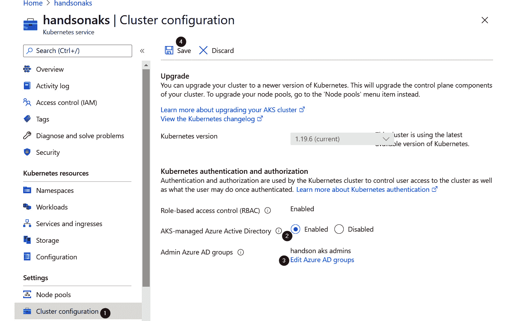
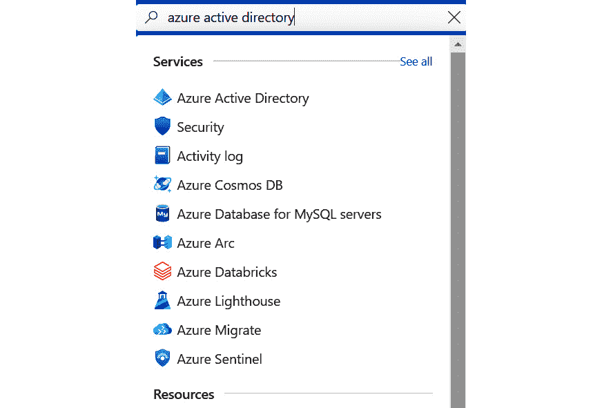
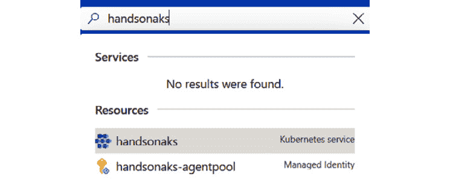

# 第九章：8. 在 AKS 中基于角色的访问控制

到目前为止，你一直在使用一种访问方式来访问 **Azure Kubernetes Service** (**AKS**)，该方式允许你创建、读取、更新和删除集群中的所有对象。这对于测试和开发非常有效，但在生产集群中不推荐使用。在生产集群中，建议利用 Kubernetes 中的 **基于角色的访问控制** (**RBAC**) 仅授予用户一组有限的权限。

本章你将深入探索 Kubernetes RBAC。你将首先了解 Kubernetes 中 RBAC 的概念。然后，你将配置 Kubernetes 中的 RBAC，并将其与 **Azure Active Directory** (**Azure AD**) 集成。

本章将涉及以下主题：

+   Kubernetes 中的 RBAC

+   在 AKS 集群中启用 Azure AD 集成

+   在 Azure AD 中创建用户和组

+   配置 AKS 中的 RBAC

+   验证用户的 RBAC

    #### 注意

    要完成 RBAC 示例，你需要一个 Azure AD 实例，并拥有全局管理员权限。

让我们通过解释 RBAC 开始本章内容。

## Kubernetes 中的 RBAC 解析

在生产系统中，你需要允许不同的用户访问不同级别的资源；这就是 **RBAC**。建立 RBAC 的好处不仅是作为防护措施，防止意外删除关键资源，还能作为一项重要的安全功能，限制集群的完全访问权限仅授予真正需要的角色。在启用 RBAC 的集群中，用户只能访问和修改他们有权限的资源。

到目前为止，使用 Cloud Shell 时，你一直以 *root* 身份操作，这使得你可以在集群中做任何事情。对于生产环境，root 权限是危险的，应该尽可能限制。使用 **最小权限原则** (**PoLP**) 登录任何计算机系统是公认的最佳实践。这可以防止访问安全数据和通过删除关键资源造成的意外停机。大约 22% 到 29% 的数据丢失归因于人为错误。你不想成为这个统计数字的一部分。

Kubernetes 开发者意识到这是一个问题，并在 Kubernetes 中添加了 RBAC 以及服务角色的概念，以控制对集群的访问。Kubernetes RBAC 有三个重要概念：

+   `无权限`，并且每个权限需要被明确指定。权限示例包括 `get`、`watch` 和 `list`。角色还包含这些权限授予的资源。资源可以是所有的 pods、deployments 等，或者是特定对象（例如 `pod/mypod`）。

+   **主体**：主体可以是被分配角色的用户或服务账户。在与 Azure AD 集成的 AKS 集群中，这些主体可以是 Azure AD 用户或组。

+   **RoleBinding**：RoleBinding 将一个主体与某个命名空间中的角色关联，或者在 ClusterRoleBinding 的情况下，关联整个集群。

需要理解的一个重要概念是，在与 AKS 交互时，有两层 RBAC：Azure RBAC 和 Kubernetes RBAC，如*图 8.1*所示。Azure RBAC 处理赋予用户在 Azure 中进行更改的角色，例如创建、修改和删除集群。Kubernetes RBAC 处理对集群中资源的访问权限。这两者是独立的控制平面，但可以使用源自 Azure AD 的相同用户和组。


图 8.1：两个不同的 RBAC 平面，Azure 和 Kubernetes

RBAC 在 Kubernetes 中是一个可选功能。AKS 的默认设置是创建启用 RBAC 的集群。然而，默认情况下，集群并未与 Azure AD 集成。这意味着，默认情况下你无法将 Kubernetes 权限授予 Azure AD 用户。在接下来的部分中，你将启用 Azure AD 集成到你的集群中。

## 启用 Azure AD 集成到你的 AKS 集群中

在本节中，你将更新现有集群，以包括 Azure AD 集成。你将使用 Azure 门户来完成此操作：

#### 注意

一旦集群与 Azure AD 集成，此功能将无法禁用。

1.  首先，你需要一个 Azure AD 组。稍后，你将为这个组授予 AKS 集群的管理员权限。要创建此组，在 Azure 搜索栏中搜索 `azure active directory`：

    图 8.2：在 Azure 搜索栏中搜索 Azure Active Directory

1.  在左侧面板中，选择“组”，这将带你进入“所有组”屏幕。点击 + 新建组，如*图 8.3*所示：

    图 8.3：创建一个新的 Azure AD 组

1.  在随后的页面中，创建一个安全组并为其命名和描述。选择你的用户为该组的所有者和成员。点击屏幕上的创建按钮：

    图 8.4：为创建 Azure AD 组提供详细信息

1.  现在，创建了这个组，在 Azure 搜索栏中搜索你的 Azure 集群，打开 AKS 面板：

    图 8.5：在 Azure 搜索栏中搜索你的集群

1.  在 AKS 面板中，在设置下选择集群配置。在此面板中，你可以启用 AKS 管理的 Azure Active Directory。启用此功能并选择你之前创建的 Azure AD 组，作为管理员 Azure AD 组。最后，点击命令栏中的保存按钮，如*图 8.6*所示：



图 8.6：启用 AKS 管理的 Azure Active Directory 并点击保存按钮

这将在你的 AKS 集群上启用与 Azure AD 集成的 RBAC。在下一节中，你将创建一个新用户和新组，并将在接下来的部分中使用它们来设置和测试 Kubernetes 中的 RBAC。

## 在 Azure AD 中创建用户和组

在这一部分，你将创建一个新的用户和一个新的组，并将在本章后面使用它们来为你的 AKS 集群分配权限：

#### 注意

你需要在 Azure AD 中具有 *用户管理员角色*，才能创建用户和组。

1.  首先，在 Azure 搜索栏中搜索 `azure active directory`：

    图 8.7：在搜索栏中搜索 Azure Active Directory

1.  点击左侧面板中的所有用户，然后选择 + 新建用户以创建一个新用户：

    图 8.8：点击 + 新建用户以创建一个新用户

1.  提供有关用户的信息，包括用户名。确保记下密码，因为登录时需要用到：

    图 8.9：提供用户详细信息

1.  用户创建后，返回 Azure AD 面板并选择组。然后点击 + 新建组按钮以创建一个新组：

    图 8.10：点击 + 新建组以创建一个新组

1.  创建一个新的安全组。将该组命名为 `handson aks users`，并将 `Tim` 添加为该组的成员。然后点击底部的创建按钮：

    图 8.11：提供组类型、组名称和组描述

1.  现在，你已经创建了一个新用户和一个新组。接下来，你将把该用户设为 AKS RBAC 中的集群用户。这使得他们可以使用 Azure CLI 来访问集群。为此，搜索你的集群名称并在 Azure 搜索栏中查找：

    图 8.12：在 Azure 搜索栏中搜索你的集群

1.  在集群面板中，点击访问控制（IAM），然后点击 + 添加按钮来添加一个新的角色分配。选择 Azure Kubernetes Service Cluster User 角色，并将其分配给你刚刚创建的用户：

    图 8.13：将集群用户角色分配给你创建的新用户

1.  由于你还将使用 Cloud Shell 和新用户，因此你需要为他们提供对 Cloud Shell 存储账户的贡献者访问权限。首先，在 Azure 搜索栏中搜索 `storage`：

    图 8.14：在 Azure 搜索栏中搜索存储

1.  在资源组下应该有一个存储账户，名称以 cloud-shell-storage 开头。点击资源组：

    图 8.15：选择资源组

1.  转到访问控制（IAM），点击 + 添加按钮。为新创建的用户授予存储账户贡献者角色：


图 8.16：将存储账户贡献者角色分配给新用户

这已经完成了新用户和组的创建，并为该用户授予了访问 AKS 的权限。在下一部分，您将为该用户和组配置 AKS 中的 RBAC。

## 在 AKS 中配置 RBAC

为了演示 AKS 中的 RBAC，您将创建两个命名空间并在每个命名空间中部署 Azure 投票应用。您将授予该组集群范围的只读访问权限，并授予用户仅在一个命名空间中删除 Pods 的权限。实际上，您需要在 Kubernetes 中创建以下对象：

+   `ClusterRole` 用于授予只读访问权限

+   `ClusterRoleBinding` 用于授予该组访问此角色的权限

+   `Role` 用于在 `delete-access` 命名空间中授予删除权限

+   `RoleBinding` 用于授予用户访问此角色的权限


图 8.17：该组获得整个集群的只读访问权限，而用户则获得 `delete-access` 命名空间的删除权限

让我们在集群上设置不同的角色：

1.  要开始我们的示例，您需要获取该组的 ID。以下命令将检索组 ID：

    ```
    az ad group show -g 'handson aks users' \
      --query objectId -o tsv
    ```

    这将显示您的组 ID。请记下它，因为您将在下一步中用到：

    

    图 8.18：获取组 ID

1.  在 Kubernetes 中，您将为此示例创建两个命名空间：

    ```
    kubectl create ns no-access
    kubectl create ns delete-access
    ```

1.  您还将在两个命名空间中部署 `azure-vote` 应用：

    ```
    kubectl create -f azure-vote.yaml -n no-access
    kubectl create -f azure-vote.yaml -n delete-access
    ```

1.  接下来，您将创建 `ClusterRole` 对象。此操作在 `clusterRole.yaml` 文件中提供：

    ```
    1   apiVersion: rbac.authorization.k8s.io/v1
    2   kind: ClusterRole
    3   metadata:
    4     name: readOnly
    5   rules:
    6   - apiGroups: [""]
    7     resources: ["pods"]
    8     verbs: ["get", "watch", "list"]
    ```

    让我们更仔细地查看这个文件：

    +   `ClusterRole` 实例

    +   `ClusterRole` 实例

    +   `get`，`watch` 和 `list`

    我们将使用以下命令创建 `ClusterRole`：

    ```
    kubectl create -f clusterRole.yaml
    ```

1.  下一步是创建集群角色绑定。绑定将角色与用户或组关联。此操作在 `clusterRoleBinding.yaml` 文件中提供：

    ```
    1   apiVersion: rbac.authorization.k8s.io/v1
    2   kind: ClusterRoleBinding
    3   metadata:
    4     name: readOnlyBinding
    5   roleRef:
    6     kind: ClusterRole
    7     name: readOnly
    8     apiGroup: rbac.authorization.k8s.io
    9   subjects:
    10  - kind: Group
    11    apiGroup: rbac.authorization.k8s.io
    12    name: "<group-id>"
    ```

    让我们更仔细地查看这个文件：

    +   `ClusterRoleBinding` 实例。

    +   `ClusterRoleBinding`

    +   我们在前一步创建的 `ClusterRole` 对象

    +   用您之前获取的组 ID 替换 *第 12 行* 中的 `<group-id>`。

    我们可以使用以下命令创建 `ClusterRoleBinding`：

    ```
    kubectl create -f clusterRoleBinding.yaml
    ```

1.  接下来，您将创建一个仅限于 `delete-access` 命名空间的角色。此操作在 `role.yaml` 文件中提供：

    ```
    1   apiVersion: rbac.authorization.k8s.io/v1
    2   kind: Role
    3   metadata:
    4     name: deleteRole
    5     namespace: delete-access
    6   rules:
    7   - apiGroups: [""]
    8     resources: ["pods"]
    9     verbs: ["delete"]
    ```

    这个文件类似于之前提到的 `ClusterRole` 对象。它有两个重要的区别：

    +   `Role` 实例，而不是 `ClusterRole` 实例

    +   使用以下命令创建 `Role`：

        ```
        kubectl create -f role.yaml
        ```

    +   最后，你将创建一个 `RoleBinding` 实例，将我们的用户与命名空间角色关联。这个文件在 `roleBinding.yaml` 中提供：

        ```
        1   apiVersion: rbac.authorization.k8s.io/v1
        2   kind: RoleBinding
        3   metadata:
        4     name: deleteBinding
        5     namespace: delete-access
        6   roleRef:
        7     kind: Role
        8     name: deleteRole
        9     apiGroup: rbac.authorization.k8s.io
        10  subjects:
        11  - kind: User
        12    apiGroup: rbac.authorization.k8s.io
        13    name: "<user e-mail address>"
        ```

        这个文件类似于之前提到的 `ClusterRoleBinding` 对象。它有几个重要的区别：

        +   创建 `RoleBinding` 实例，而不是 `ClusterRoleBinding` 实例

        +   创建 `RoleBinding` 实例

        +   `ClusterRole` 实例

        +   使用以下命令创建 `RoleBinding`：

            ```
            kubectl create -f roleBinding.yaml
            ```

这已经完成了 RBAC 的要求。你已经创建了两个角色——`ClusterRole` 和一个命名空间绑定角色，并设置了两个 `RoleBindings` 对象——`ClusterRoleBinding` 和命名空间绑定的 `RoleBinding`。在下一部分，你将通过以新用户身份登录集群来探索 RBAC 的影响。

## 验证用户的 RBAC

为了验证 RBAC 是否按预期工作，你将使用新创建的用户登录到 Azure 门户。打开 https://portal.azure.com 的新浏览器窗口或 InPrivate 窗口，并使用新创建的用户登录。系统会立即提示你更改密码。这是 Azure AD 的一项安全功能，确保只有该用户知道他们的密码：


图 8.19：系统会提示你更改密码

一旦你更改了密码，就可以开始测试不同的 RBAC 角色：

1.  你将通过为新用户设置 Cloud Shell 来开始此实验。启动 Cloud Shell 并选择 Bash:

    图 8.20：在 Cloud Shell 中选择 Bash

1.  在下一个对话框中，选择显示高级设置:

    图 8.21：选择显示高级设置

1.  然后，将 Cloud Shell 指向现有的存储帐户并创建一个新的文件共享:

    图 8.22：指向现有存储帐户并创建新文件共享

1.  一旦 Cloud Shell 可用，获取连接到 AKS 集群的凭据：

    ```
    az aks get-credentials -n handsonaks -g rg-handsonaks
    ```

    然后，在 `kubectl` 中尝试一个命令。我们来尝试获取集群中的节点：

    ```
    kubectl get nodes
    ```

    由于这是针对启用了 RBAC 的集群执行的第一个命令，你需要重新登录。浏览至 https://microsoft.com/devicelogin，并提供 Cloud Shell 显示给你的代码（这个代码在 *图 8.24* 中高亮显示）。确保使用新用户的凭据登录：

    

    图 8.23：复制并粘贴 Cloud Shell 在提示中显示给你的代码

    登录后，您应该会收到来自`kubectl`的`Forbidden`错误消息，通知您没有权限查看集群中的节点。由于该用户仅配置了查看 pods 的权限，因此这是预期的：

    

    图 8.24：提示您登录的消息以及 Forbidden 错误

1.  现在，您可以验证您的用户是否具有查看所有命名空间中 pods 的权限，并且该用户是否有权限删除`delete-access`命名空间中的 pods：

    ```
    kubectl get pods -n no-access
    kubectl get pods -n delete-access
    ```

    这应该在两个命名空间中都成功。原因是为用户组配置的`ClusterRole`对象：

    

    图 8.25：用户可以查看两个命名空间中的 pods

1.  让我们也验证一下`delete`权限：

    ```
    kubectl delete pod --all -n no-access
    kubectl delete pod --all -n delete-access
    ```

    正如预期的那样，在`no-access`命名空间中被拒绝访问，而在`delete-access`命名空间中允许访问，如*图 8.26*所示：


图 8.26：在 no-access 命名空间中删除操作被拒绝，在 delete-access 命名空间中允许删除操作

在这一部分，您已验证了 Kubernetes 集群中 RBAC 的功能。由于这是本章的最后一部分，我们需要确保清理集群中的部署和命名空间。请确保使用您的主用户从 Cloud Shell 执行这些步骤，而不是新用户：

```
kubectl delete -f azure-vote.yaml -n no-access
kubectl delete -f azure-vote.yaml -n delete-access
kubectl delete -f .
kubectl delete ns no-access
kubectl delete ns delete-access
```

本章结束了 AKS 上 RBAC 的概述。

## 摘要

在本章中，您了解了 AKS 上的 RBAC。您在集群中启用了 Azure AD 集成的 RBAC。之后，您创建了一个新用户和组，并在集群上设置了不同的 RBAC 角色。最后，您使用该用户登录并验证了配置的 RBAC 角色是否限制了您对集群的访问。

这一部分介绍了用户如何获取对 Kubernetes 集群的访问权限。运行在集群上的 pods 可能还需要在 Azure AD 中有一个身份，供它们访问 Azure 服务中的资源，如 Blob 存储或密钥保管库。在下一章中，您将了解更多关于此用例的信息，以及如何在 AKS 中使用 Azure AD pod 身份来设置此功能。
