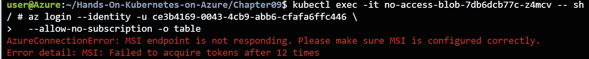

# 第十章：9\. AKS 中的 Azure Active Directory Pod 托管身份

在上一章中，*第八章，AKS 中的基于角色的访问控制*，您将 AKS 集群与**Azure Active Directory**（**Azure AD**）进行了集成。然后，您将 Kubernetes 角色分配给 Azure AD 中的用户和组。在本章中，您将探讨如何将运行在 AKS 上的应用程序与 Azure AD 集成，并学习如何为您的 Pod 在 Azure 中分配一个身份，使其能够与其他 Azure 资源交互。

在 Azure 中，应用程序身份使用一种称为服务主体的功能。服务主体是云中服务帐户的等价物。应用程序可以使用服务主体进行身份验证，以便访问 Azure AD 并获取资源。这些资源可以是 Azure 资源，例如 Azure Blob 存储或 Azure 密钥库，或者是您开发的与 Azure AD 集成的应用程序。

有两种方式可以对服务主体进行身份验证：您可以使用密码或证书与私钥的组合。尽管这些是安全的身份验证方式，但管理密码或证书及其轮换可能会很繁琐。

Azure 中的托管身份是一项使身份验证服务主体变得更加简便的功能。它通过为 Azure 中的计算资源（如虚拟机或 Azure 函数）分配一个身份来实现。那些计算资源可以通过调用仅该机器能够访问的端点来使用该托管身份进行身份验证。这是一种安全的身份验证方式，不需要您管理密码或证书。

Azure AD Pod 托管身份允许您为 Kubernetes 中的 Pod 分配托管身份。由于 Kubernetes 中的 Pod 运行在虚拟机上，默认情况下，每个 Pod 都能够访问托管身份端点，并使用该身份进行身份验证。使用 Azure AD Pod 托管身份后，Pod 不再能访问虚拟机的内部端点，而只能访问分配给特定 Pod 的身份。

在本章中，您将为 AKS 集群配置 Azure AD Pod 托管身份，并使用它访问 Azure Blob 存储。在下一章中，您将使用这些 Azure AD Pod 托管身份访问 Azure Key Vault 并管理 Kubernetes 密钥。

本章将简要介绍以下主题：

+   Azure AD Pod 托管身份概述

+   使用 Azure AD Pod 托管身份设置新集群

+   将身份链接到您的集群

+   使用托管身份的 Pod

让我们从 Azure AD Pod 托管身份的概述开始。

## Azure AD Pod 托管身份概述

本节的目标是描述 Azure 托管身份和 Azure AD Pod 托管身份。

如介绍中所述，Azure 中的托管身份是一种用于安全地验证在 Azure 内部运行的应用程序的方法。Azure 中有两种托管身份类型。它们之间的区别在于如何与资源关联：

+   **系统分配**：这种类型的托管身份与资源（例如虚拟机）本身是 1:1 关联的。这个托管身份还共享资源的生命周期，意味着一旦资源被删除，托管身份也会被删除。

+   **用户分配**：用户分配的托管身份是独立的 Azure 资源。用户分配的托管身份可以与多个资源关联。当一个资源被删除时，托管身份不会被删除。

一旦托管身份被创建并与资源关联，两种类型的托管身份的工作方式是相同的。以下是从应用程序的角度来看托管身份的工作原理：

1.  运行在 Azure 中的应用程序请求一个令牌到 `169.254.169.254`。

1.  IMDS 会向 Azure AD 请求一个令牌。它使用为你的托管身份配置的证书，且该证书仅由 IMDS 知道。

1.  Azure AD 会将令牌返回给 IMDS，IMDS 再将该令牌返回给你的应用程序。

1.  你的应用程序可以使用此令牌对其他资源进行身份验证，例如 Azure Blob 存储。


图 9.1：Azure 虚拟机中的托管身份

在 Kubernetes 集群中在单个虚拟机上运行多个 Pod 时，默认情况下每个 Pod 都可以访问 IMDS 端点。这意味着每个 Pod 都可能访问该虚拟机配置的身份。

AKS 的 Azure AD Pod 托管身份附加组件会以一种方式配置你的集群，使得 Pod 无法直接访问 IMDS 端点来请求访问令牌。它将集群配置为当 Pod 尝试访问 IMDS 端点时（1），会连接到集群上运行的一个 DaemonSet。这个 DaemonSet 被称为 **节点托管身份**（**NMI**）。NMI 将验证该 Pod 应该访问哪些身份。如果该 Pod 被配置为可以访问请求的身份，那么 DaemonSet 会连接到 IMDS（2 到 5）以获取令牌，然后将令牌传递给 Pod（6）。然后，Pod 可以使用这个令牌访问 Azure 资源（7）。


图 9.2：Azure AD Pod 托管身份

通过这种方式，你可以控制集群中的哪些 Pod 可以访问某些身份。

Azure AD Pod 托管身份最初是由微软在 GitHub 上作为开源项目开发的。最近，微软将 Azure AD Pod 托管身份发布为 AKS 附加组件。使用 Azure AD Pod 托管身份作为 AKS 附加组件的好处是该功能由微软支持，软件将作为常规集群操作的一部分自动更新。

#### 注意

截至撰写时，Azure AD Pod 管理的身份插件处于预览阶段。目前，它也不支持 Windows 容器。在产品用例中使用预览功能并不推荐。

现在你已经了解了 Azure AD Pod 管理身份的工作原理，让我们在下一节中在 AKS 集群上进行设置。

## 使用 Azure AD Pod 管理的身份设置新集群

如前一节所述，有两种方式可以在 AKS 中设置 Azure AD Pod 管理的身份。可以使用 GitHub 上的开源项目，或者将其设置为 AKS 插件。通过使用插件，你将获得受支持的配置，因此在本节中你将使用插件设置集群。

截至撰写时，尚无法在现有集群上启用 Azure AD Pod 管理的身份插件，因此在以下的操作中，你将删除现有集群并创建一个安装了插件的新集群。等你阅读此内容时，可能已经可以在现有集群上启用此插件，而无需重新创建集群。

另外，由于该功能在撰写时处于预览阶段，你需要注册预览功能。这将是本节的第一步：

1.  首先，打开 Cloud Shell 并注册 Azure AD Pod 管理的身份预览功能：

    ```
    az feature register --name EnablePodIdentityPreview \
      --namespace Microsoft.ContainerService
    ```

1.  你还需要一个 Azure CLI 的预览扩展，你可以使用以下命令来安装：

    ```
    az extension add --name aks-preview
    ```

1.  现在你可以继续删除现有集群。这是为了确保你在 Azure 中有足够的核心配额。你可以使用以下命令来执行此操作：

    ```
    az aks delete -n handsonaks -g rg-handsonaks --yes
    ```

1.  一旦你的旧集群被删除，你需要等待直到 Pod 身份预览功能在你的订阅中注册。你可以使用以下命令来验证此状态：

    ```
    az feature show --name EnablePodIdentityPreview \
      --namespace Microsoft.ContainerService -o table
    ```

    等待直到状态显示为已注册，如*图 9.3*所示：

    

    图 9.3：等待功能注册

1.  如果功能已注册并且旧集群已删除，你需要在创建新集群之前刷新命名空间的注册。让我们首先刷新命名空间的注册：

    ```
    az provider register --namespace Microsoft.ContainerService
    ```

1.  现在，你可以使用 Azure AD Pod 管理的身份插件创建一个新的集群。你可以使用以下命令创建一个启用了插件的新集群：

    ```
    az aks create -g rg-handsonaks -n handsonaks \
      --enable-managed-identity --enable-pod-identity \
      --network-plugin azure --node-vm-size Standard_DS2_v2 \
      --node-count 2 --generate-ssh-keys
    ```

1.  这将花费几分钟时间来完成。命令执行完毕后，获取凭据以访问你的集群，并使用以下命令验证你可以访问集群：

    ```
    az aks get-credentials -g rg-handsonaks \
      -n handsonaks --overwrite-existing
    kubectl get nodes
    ```

    这应该返回类似于*图 9.4*的输出：


图 9.4：获取集群凭据并验证访问

现在你已经有了一个启用了 Azure AD pod 管理身份的新的 AKS 集群。在接下来的章节中，你将创建一个管理身份并将其与集群关联。

## 将身份链接到你的集群

在上一节中，你创建了一个启用了 Azure AD pod 管理身份的新集群。现在你已经准备好创建一个管理身份并将其与集群关联。让我们开始吧：

1.  首先，你需要通过 Azure 门户创建一个新的管理身份。在 Azure 门户中，在搜索框中搜索`managed identity`，如*图 9.5*所示：

    图 9.5：在 Azure 门户中导航到 Managed Identities

1.  在结果面板中，点击顶部的+新建按钮。为了将本章的资源整理在一起，建议创建一个新的资源组。在结果面板中，点击“创建新建”按钮以创建一个新的资源组。将其命名为`aad-pod-id`，如*图 9.6*所示：

    图 9.6：创建新的资源组

1.  现在，选择你创建集群时使用的区域作为管理身份的区域，并为它命名（在本例中为`aad-pod-id`），如*图 9.7*所示。最后，点击“查看 + 创建”按钮，在最后一个窗口中点击“创建”按钮来创建你的管理身份：

    图 9.7：为管理身份提供实例详细信息

1.  一旦管理身份创建完成，点击“转到资源”按钮进入资源页面。在这里，你需要复制客户端 ID 和资源 ID。它们将在本章稍后使用。将这些值复制并粘贴到一个方便以后访问的位置。首先，你需要管理身份的客户端 ID。你可以在管理身份的概览面板中找到它，如*图 9.8*所示：

    图 9.8：获取管理身份的客户端 ID

1.  最后，你还需要管理身份的资源 ID。你可以在管理身份的属性面板中找到它，如*图 9.9*所示：

    图 9.9：获取管理身份的资源 ID

1.  现在你已经准备好将管理身份链接到你的 AKS 集群。为此，你需要在 Cloud Shell 中运行一个命令，之后你将能够验证该身份是否已在你的集群中可用。我们先从链接身份开始。确保将 `<Managed identity resource ID>` 替换为你之前复制的资源 ID：

    ```
    az aks pod-identity add --resource-group rg-handsonaks \
      --cluster-name handsonaks --namespace default \
      --name access-blob-id \
      --identity-resource-id <Managed identity resource ID>
    ```

1.  你可以通过运行以下命令来验证你的身份是否成功地链接到集群：

    ```
    kubectl get azureidentity
    ```

    这应该会给你类似于*图 9.10*的输出：


图 9.10：验证身份在集群中的可用性

这意味着该身份现在可以在你的集群中使用。如何操作将在下一节中说明。

## 使用托管身份的 Pod

在上一节中，你创建了一个托管身份并将其链接到你的集群。在本节中，你将创建一个新的 Blob 存储帐户，并赋予你创建的托管身份对该存储帐户的权限。然后，你将在集群中创建一个新 Pod，该 Pod 可以使用该托管身份与存储帐户进行交互。让我们从创建一个新的存储帐户开始：

1.  要创建新的存储帐户，搜索 Azure 搜索栏中的 `storage accounts`，如 *图 9.11* 所示：

    图 9.11：在 Azure 搜索栏中查找存储帐户

    在弹出的窗格中，点击屏幕顶部的“+ 新建”按钮，如 *图 9.12* 所示：

    

    图 9.12：创建新的存储帐户

    选择你之前创建的 `aad-pod-id` 资源组，给帐户指定一个唯一的名称，并选择与你的集群相同的区域。为了优化成本，建议选择标准性能、StorageV2 作为帐户类型，并选择本地冗余存储（LRS）作为复制选项，如 *图 9.13* 所示：

    

    图 9.13：配置新的存储帐户

1.  在提供所有值后，点击“查看 + 创建”，然后在弹出的屏幕上点击“创建”按钮。这将需要大约一分钟的时间来完成创建。存储帐户创建完成后，点击“转到资源”按钮继续下一步。

1.  首先，你需要赋予托管身份访问存储帐户的权限。为此，在左侧导航栏中点击“访问控制（IAM）”，然后点击“+ 添加”并选择“添加角色分配”。接下来，选择“Storage Blob Data Contributor”角色，在“分配访问权限给”下拉菜单中选择“用户分配的托管身份”，然后选择你创建的 access-blob-id 托管身份，如 *图 9.14* 所示。最后，点击屏幕底部的“保存”按钮：

    图 9.14：为托管身份提供存储帐户访问权限

1.  接下来，你将上传一个随机文件到该存储帐户。稍后，你将尝试从 Kubernetes Pod 中访问该文件，以验证你是否有权限访问存储帐户。为此，返回存储帐户的“概览”窗格。在那里，点击“容器”，如 *图 9.15* 所示：

    图 9.15：在概述窗格中单击容器

1.  然后，在屏幕顶部点击“+ 容器”按钮。给容器命名，例如`uploadedfiles`。确保将公共访问级别设置为私有（无匿名访问），然后在屏幕底部点击“创建”按钮，如*图 9.16*所示：

    图 9.16：创建一个新的 Blob 存储容器

1.  最后，将一个随机文件上传到此存储容器中。要做到这一点，请单击容器名称，然后在屏幕顶部单击“上传”按钮。从您的计算机中选择一个随机文件，然后单击“上传”，如*图 9.17*所示：

    图 9.17：将新文件上传到 blob 存储

1.  现在您已经在 blob 存储中有一个文件，并且您的托管身份可以访问此存储帐户，您可以继续尝试从 Kubernetes 连接到它。为此，您将使用 Azure CLI 容器映像创建一个新的部署。此部署将包含链接到先前创建的托管身份的链接。本章的代码文件中提供了名为 `deployment-with-identity.yaml` 的部署文件：

    ```
    1   apiVersion: apps/v1
    2   kind: Deployment
    3   metadata:
    4     name: access-blob
    5   spec:
    6     selector:
    7       matchLabels:
    8         app: access-blob
    9     template:
    10      metadata:
    11        labels:
    12          app: access-blob
    13          aadpodidbinding: access-blob-id
    14      spec:
    15        containers:
    16        - name: azure-cli
    17          image: mcr.microsoft.com/azure-cli
    18          command: [ "/bin/bash", "-c", "sleep inf" ]
    ```

    在定义此部署时需要注意以下几点：

    +   `mcr.microsoft.com/azure-cli`) 指的是 Azure CLI，您正在该容器中运行 `sleep` 命令，以确保容器不会持续重新启动。

1.  您可以使用以下命令创建此部署：

    ```
    kubectl create -f deployment-with-identity.yaml
    ```

1.  观察 pod 直到 `access-blob` pod 处于 `exec` 状态，并使用以下命令进入其中：

    ```
    kubectl exec -it <access-blob pod name> -- sh
    ```

1.  一旦连接到 pod，您可以使用以下命令对 Azure API 进行身份验证。用先前复制的客户端 ID 替换 `<托管身份的客户端 ID>`：

    ```
    az login --identity -u <client ID of managed identity> \
      --allow-no-subscription -o table
    ```

    这应该会返回类似 *图 9.18* 的输出：

    

    图 9.18：使用 Azure AD 管理身份登录 Azure CLI

1.  现在，您可以尝试访问 blob 存储帐户并下载文件。您可以执行以下命令来完成这一操作：

    ```
    az storage blob download --account-name <storage account name> \
     --container-name <container name> --auth-mode login \
     --file <filename> --name <filename> -o table
    ```

    这应该会返回类似 *图 9.19* 的输出：

    

    图 9.19：使用托管身份下载 blob 文件

1.  您现在可以使用 `exit` 命令退出容器。

1.  如果您希望验证未配置托管身份且无法下载文件的 pod，您可以使用名为 `deployment-without-identity.yaml` 的文件：

    ```
    1   apiVersion: apps/v1
    2   kind: Deployment
    3   metadata:
    4     name: no-access-blob
    5   spec:
    6     selector:
    7       matchLabels:
    8         app: no-access-blob
    9     template:
    10      metadata:
    11        labels:
    12          app: no-access-blob
    13      spec:
    14        containers:
    15        - name: azure-cli
    16          image: mcr.microsoft.com/azure-cli
    17          command: [ "/bin/bash", "-c", "sleep inf" ]
    ```

    正如您所看到的，此部署与本章早期创建的部署不同。这里的区别在于 pod 定义不包含带有 Azure AD pod-managed identity 的标签。这意味着该 pod 将无法使用任何托管身份登录 Azure。您可以使用以下命令创建此部署：

    ```
    kubectl create -f deployment-without-identity.yaml
    ```

1.  观察 pod，直到 `no-access-blob` pod 进入 `access-blob` pod，并使用以下命令 `exec` 进入它：

    ```
    kubectl exec -it <no-access-blob pod name> -- sh
    ```

1.  一旦连接到 pod，你可以尝试使用以下命令通过 Azure API 进行身份验证，应该会失败：

    ```
    az login --identity -u <client ID of managed identity> \
      --allow-no-subscription -o table
    ```

    这应返回类似于*图 9.20*的输出：

    

    图 9.20：新 pod 无法使用托管身份进行身份验证

1.  最后，你可以使用`exit`命令退出容器。

这成功地展示了如何使用 Azure AD pod 管理的身份在 Kubernetes 集群内连接到 Blob 存储。带有身份标签的部署可以登录 Azure CLI 并访问 Blob 存储，而没有此身份标签的部署则无法登录 Azure CLI，因此也无法访问 Blob 存储。

本章内容已结束。让我们确保删除你为本章创建的资源：

```
az aks pod-identity delete --resource-group rg-handsonaks \
  --cluster-name handsonaks --namespace default \
  --name access-blob-id 
az group delete -n aad-pod-id --yes
kubectl delete -f
```

你可以保留本章创建的集群，因为在下一章你将使用 Azure AD pod 管理的身份来访问 Key Vault 秘密。

## 摘要

在本章中，你继续探索了 AKS 中的安全性。*第八章，AKS 中的基于角色的访问控制* 关注的是用户身份，而本章则聚焦于在 pod 中运行的 pod 和应用程序的身份。你学习了 Azure 中的托管身份，并了解了如何使用 Azure AD pod 管理的身份将这些托管身份分配给 pod。

你创建了一个启用了 Azure AD pod 管理的身份附加组件的新集群。然后，你创建了一个新的托管身份，并将其与集群关联。在最后的部分，你为该身份授予了 Blob 存储帐户的权限，并最终验证了带有托管身份的 pod 能够登录 Azure 并下载文件，但没有托管身份的 pod 无法登录 Azure。

在下一章，你将深入了解 Kubernetes 秘密。你将了解内置的秘密，并学习如何将 Kubernetes 安全地连接到 Azure Key Vault，甚至使用 Azure AD pod 管理的身份来实现这一点。
