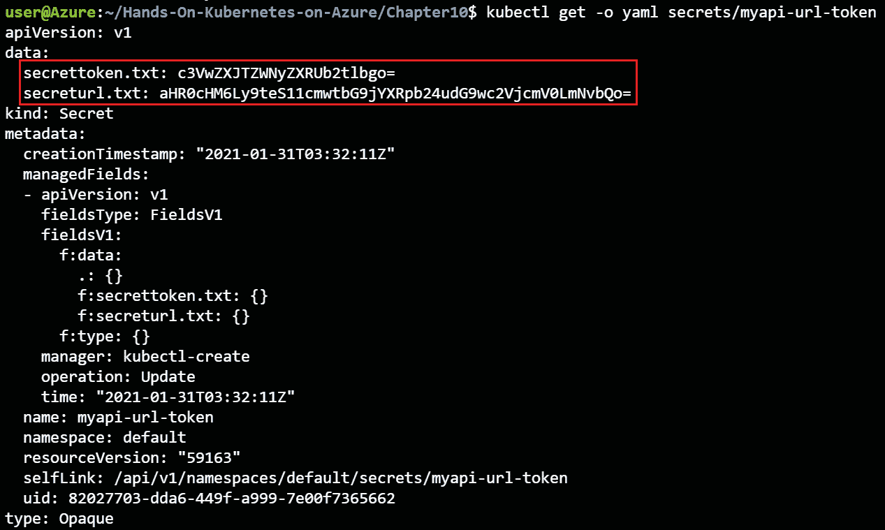
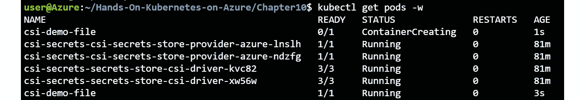

# 第十一章：10. 在 AKS 中存储密钥

所有生产应用程序都需要一些敏感信息来正常运行，比如密码或连接字符串。Kubernetes 提供了一个可插拔的后端来管理这些密钥。Kubernetes 还提供了多种方法来在部署中使用这些密钥。能够管理密钥并正确使用它们将使你的应用程序更加安全。

你已经在本书中之前使用过密钥。当你在 *第三章、在 AKS 上部署应用程序* 和 *第四章、构建可扩展应用程序* 中连接 WordPress 网站并创建博客文章时，你使用了密钥。你还在 *第六章、使用 HTTPS 保护你的应用程序* 中使用了密钥，当时你正在配置带有 TLS 的应用程序网关入口控制器。

Kubernetes 拥有一个内置的密钥系统，它将密钥以半加密方式存储在默认的 Kubernetes 数据库中。这个系统运行良好，但并不是在 Kubernetes 中处理密钥的最安全方法。在 AKS 中，你可以利用一个名为 **Azure 密钥保管库提供程序的密钥存储 CSI 驱动程序**（**CSI 驱动程序**）的项目，它是一种更安全的处理 Kubernetes 密钥的方式。该项目允许你在 Azure 密钥保管库中存储和检索密钥。

在本章中，你将了解 Kubernetes 中的各种内建密钥类型以及你可以创建这些密钥的不同方式。之后，你将安装 CSI 驱动程序到集群中，并使用它来检索密钥。

本章将涵盖以下主题：

+   Kubernetes 中不同类型的密钥

+   在 Kubernetes 中创建和使用密钥

+   安装 Azure 密钥保管库提供程序的密钥存储 CSI 驱动程序

+   使用 Azure 密钥保管库提供程序进行密钥存储 CSI 驱动程序

让我们从探索 Kubernetes 中的不同类型的密钥开始。

## Kubernetes 中不同类型的密钥

如本章介绍中所提到的，Kubernetes 自带默认的密钥实现。该默认实现将密钥存储在 Kubernetes 用来存储所有对象元数据的 etcd 数据库中。当 Kubernetes 在 etcd 中存储密钥时，它会以 base64 编码格式存储它们。Base64 是一种以模糊方式编码数据的方式，但这并不是一种安全的加密方法。任何能够访问 base64 编码数据的人都可以轻松地解码它。AKS 在此基础上增加了一层安全性，通过在 Azure 平台内对所有数据进行静态加密。

Kubernetes 中的默认密钥实现允许你存储多种类型的密钥：

+   **不透明密钥**：这些可以包含任何用户定义的任意密钥或数据。

+   **服务帐户令牌**：这些由 Kubernetes pod 用于内置集群 RBAC。

+   **Docker 配置密钥**：这些用于存储 Docker 注册表凭据，以进行 Docker 命令行配置。

+   **基本认证密钥**：这些用于存储以用户名和密码形式的认证信息。

+   **SSH 认证秘密**：用于存储 SSH 私钥。

+   **TLS 证书**：用于存储 TLS/SSL 证书。

+   **引导令牌秘密**：用于存储在创建新集群或将新节点加入现有集群时使用的令牌。

作为 Kubernetes 的用户，你最常接触的通常是透明的秘密和 TLS 证书。你已经在 *第六章，用 HTTPS 保护你的应用程序* 中使用过 TLS 秘密。在本章中，你将重点关注不透明的秘密。

Kubernetes 提供了三种创建秘密的方法，具体如下：

+   从文件创建秘密

+   从 YAML 或 JSON 定义创建秘密

+   从命令行创建秘密

使用上述任何方法，你都可以创建任何类型的秘密。

Kubernetes 提供了两种使用秘密的方法：

+   将秘密作为环境变量使用

+   在 pod 中将秘密挂载为文件

在接下来的章节中，你将通过这里提到的三种方式创建秘密，之后你将使用这里列出的两种方法来使用这些秘密。

## 在 Kubernetes 中创建秘密

在 Kubernetes 中，有三种不同的创建秘密的方法：通过文件、通过 YAML 或 JSON 定义，或直接通过命令行。让我们从通过文件创建秘密开始探索。

### 从文件创建秘密

在 Kubernetes 中创建秘密的第一种方法是通过文件创建。在这种方法中，文件的内容将成为秘密的值，而文件名将是每个值在秘密中的标识符。

假设你需要存储一个 URL 和一个用于访问 API 的安全令牌。要实现这一点，请按照以下步骤操作：

1.  将 URL 存储在 `secreturl.txt` 中，如下所示：

    ```
    echo https://my-url-location.topsecret.com \
      > secreturl.txt
    ```

1.  将令牌存储在另一个文件中，如下所示：

    ```
    echo 'superSecretToken' > secrettoken.txt
    ```

1.  让 Kubernetes 从文件中创建秘密，如下所示：

    ```
    kubectl create secret generic myapi-url-token \
      --from-file=./secreturl.txt --from-file=./secrettoken.txt
    ```

    请注意，你正在 Kubernetes 中创建一个单一的秘密对象，引用了两个文本文件。在此命令中，你正在通过使用 `generic` 关键字创建一个不透明的秘密。

    命令应返回类似 *图 10.1* 的输出：

    

    图 10.1：创建一个不透明的秘密

1.  你可以使用 `get` 命令检查秘密是否已经以与其他 Kubernetes 资源相同的方式创建：

    ```
    kubectl get secrets
    ```

    该命令将返回类似 *图 10.2* 的输出：

    

    图 10.2：已创建的秘密列表

    在这里，你将看到你刚刚创建的秘密，以及 `default` 命名空间中存在的其他秘密。这个秘密是 `Opaque` 类型，这意味着从 Kubernetes 的角度来看，内容的架构是未知的。它是一个任意的键值对，没有任何约束，与例如 SSH 认证或 TLS 秘密不同，后者有一个架构，并且会被验证是否包含所需的详细信息。

1.  要了解有关机密的更多信息，你还可以运行 `describe` 命令：

    ```
    kubectl describe secrets myapi-url-token
    ```

    你将获得类似 *图 10.3* 的输出：

    

    图 10.3：已创建机密的描述

    如你所见，前面的命令都没有显示实际的机密值。

1.  要查看机密的值，你可以运行以下命令：

    ```
    kubectl get -o yaml secrets/myapi-url-token
    ```

    你将获得类似 *图 10.4* 的输出：

    

    图 10.4：使用 kubectl get secret 的 -o yaml 选项获取机密的编码值

    数据以键值对的形式存储，文件名作为键，文件的 base64 编码内容作为值。

1.  上述值是 base64 编码的。Base64 编码并不安全。它模糊了机密信息，使其不容易被操作员读取，但任何恶意行为者都可以轻松解码 base64 编码的机密。要获取实际的值，你可以运行以下命令：

    ```
    echo 'c3VwZXJTZWNyZXRUb2tlbgo=' | base64 -d
    echo 'aHR0cHM6Ly9teS1zZWNyZXQtdXJsLWxvY2F0aW9uLnRvcHNlY3JldC5jb20K'| base64 -d
    ```

    你将获得最初创建的机密的值：


图 10.5：Base64 编码的机密可以轻松解码

这表明机密在默认的 Kubernetes 秘密存储中并没有被安全加密。

在本节中，你能够创建一个包含示例 URL 和安全令牌的机密，文件作为源。你还能够通过解码 base64 编码的机密来获取实际的机密值。

让我们继续探索创建 Kubernetes 秘密的第二种方法，即从 YAML 定义中创建秘密。

### 使用 YAML 文件手动创建机密

在上一节中，你是通过文本文件创建了机密。在本节中，你将通过以下步骤使用 YAML 文件创建相同的机密：

1.  首先，你需要将机密编码为 `base64`，如下所示：

    ```
    echo 'superSecretToken' | base64
    ```

    你将获得以下值：

    ```
    c3VwZXJTZWNyZXRUb2tlbgo=
    ```

    你可能会注意到，这是在上一节获取机密的 `yaml` 定义时出现的相同值。

1.  类似地，对于 `url` 值，你可以获得 base64 编码的值，如下所示：

    ```
    echo 'https://my-secret-url-location.topsecret.com' | base64
    ```

    这将给你 base64 编码的 URL：

    ```
    aHR0cHM6Ly9teS1zZWNyZXQtdXJsLWxvY2F0aW9uLnRvcHNlY3JldC5jb20K
    ```

1.  现在你可以手动创建机密定义，然后保存文件。此文件已经在代码包中作为 `myfirstsecret.yaml` 提供：

    ```
    1   apiVersion: v1
    2   kind: Secret
    3   metadata:
    4     name: myapiurltoken-yaml
    5   type: Opaque
    6   data:
    7     url: aHR0cHM6Ly9teS1zZWNyZXQtdXJsLWxvY2F0aW9uLnRvcHNlY3JldC5jb20K
    8     token: c3VwZXJTZWNyZXRUb2tlbgo=
    ```

    让我们查看这个文件：

    +   `Opaque` 机密，意味着从 Kubernetes 的角度来看，值是无约束的键值对。

    +   **第 7-8 行**：这些是机密的 base64 编码值。

    你可能会注意到，这个 YAML 文件与上一节中你得到的返回结果非常相似。这是因为你用来创建 Kubernetes 中机密的对象在 Kubernetes API 中存储时包含了更多的元数据。

1.  现在，你可以像使用任何其他 Kubernetes 资源一样，通过使用 `create` 命令来创建机密：

    ```
    kubectl create -f myfirstsecret.yaml
    ```

    这将返回一个类似于*图 10.6*的输出：

    

    图 10.6：通过 YAML 文件成功创建的 Secret

1.  你可以通过以下命令验证 Secret 是否成功创建：

    ```
    kubectl get secrets
    ```

    这将显示一个类似于*图 10.7*的输出：

    

    图 10.7：已创建秘密的列表

1.  你可以通过在之前描述的相同方式使用`kubectl get -o yaml secrets myapiurltoken-yaml`来仔细检查秘密是否相同。

这描述了在 Kubernetes 中创建秘密的第二种方式。在下一节中，你将学习通过 kubectl 中的字面量创建秘密的最终方法。

### 使用字面量在 kubectl 中创建通用秘密

创建秘密的第三种方法是使用`literal`方法，这意味着你在命令行上通过 kubectl 传递值。正如你在前面的例子中看到的，Kubernetes 中的单个秘密可以包含多个值。在创建使用`literal`方法的 Secret 的命令中，你使用语法`--from-literal=<key>=<value>`来标识秘密中的不同值：

1.  要使用`literal`方法创建 Secret，请运行以下命令：

    ```
    kubectl create secret generic myapiurltoken-literal \
      --from-literal=token='superSecretToken' \
      --from-literal=url=https://my-secret-url-location.topsecret.com
    ```

    这将返回一个类似于*图 10.8*的输出：

    

    图 10.8：通过 kubectl 中的字面量值成功创建的 Secret

1.  你可以通过运行以下命令来验证 Secret 是否已创建：

    ```
    kubectl get secrets
    ```

    这将给我们一个类似于*图 10.9*的输出：


图 10.9：验证通过字面量方法创建的 Secret

因此，你已经通过字面量值创建了秘密，除了之前的两种方法。

在这一节中，你已经使用三种方法创建了 Kubernetes 的秘密。在下一节中，你将探索两种在 Pod 和应用中使用这些秘密的方法。

## 使用你的秘密

一旦创建了秘密，它们就需要与应用程序关联。这意味着 Kubernetes 需要以某种方式将秘密的值传递给正在运行的 Pods。Kubernetes 提供了两种将秘密链接到应用程序的方法：

+   使用秘密作为环境变量

+   将秘密挂载为文件

将秘密挂载为文件是应用中使用秘密的最佳方式。在本节中，我们将解释这两种方法，并且展示为什么第二种方法是最好的。首先，从作为环境变量访问秘密开始。

### 将秘密作为环境变量

你可以通过将秘密作为环境变量来使用它。然后可以在 Pod 定义中的`containers`和`env`部分引用这些秘密。你将使用之前创建的秘密，在 Pod 中学习如何在应用程序中使用它们：

1.  您可以像在 `pod-with-env-secrets.yaml` 中提供的定义那样，配置带有环境变量机密的 pod：

    ```
    1   apiVersion: v1
    2   kind: Pod
    3   metadata:
    4     name: secret-using-env
    5   spec:
    6     containers:
    7     - name: nginx
    8       image: nginx
    9       env:
    10        - name: SECRET_URL
    11          valueFrom:
    12            secretKeyRef:
    13              name: myapi-url-token
    14              key: secreturl.txt
    15        - name: SECRET_TOKEN
    16          valueFrom:
    17            secretKeyRef:
    18              name: myapi-url-token
    19              key: secrettoken.txt
    20    restartPolicy: Never
    ```

    让我们检查这个文件：

    +   `secreturl.txt` 文件位于 `myapi-url-token` 秘密中。

    +   `secrettoken.txt` 文件位于 `myapi-url-token` 秘密中。

    当 Kubernetes 在需要使用机密的节点上创建 pod 时，它会将机密存储在该主机的 `tmpfs` 中，这是一种临时文件系统，不会写入磁盘。当最后一个引用该机密的 pod 在该节点上停止运行时，机密会从该节点的 `tmpfs` 中删除。如果节点关闭或重启，`tmpfs` 将被清除。

1.  现在让我们创建 pod 并查看是否可以访问这些机密：

    ```
    kubectl create -f pod-with-env-secrets.yaml
    ```

1.  检查环境变量是否设置正确：

    ```
    kubectl exec -it secret-using-env -- sh
    echo $SECRET_URL
    echo $SECRET_TOKEN
    ```

    这应该显示类似于*图 10.10*的结果：

    

    图 10.10：您可以在 pod 内获取机密

1.  您现在可以使用 `exit` 命令退出容器的 shell。

在这个示例中有几点需要注意。首先，请注意，当您访问环境变量时，您会返回机密的实际值，而不是 base64 编码的值。这是预期的行为，因为 base64 编码仅在 Kubernetes API 层应用，而不是在应用程序层。

需要注意的第二点是，您能够通过进入正在运行的容器并回显机密来访问该机密。为 Kubernetes 中的 pod 应用适当级别的 RBAC（角色基础访问控制）非常重要，以确保不是每个集群用户都能运行 `exec` 命令并打开 shell。

还要注意的是，无论是作为容器镜像的应用程序，还是 pod 定义中，都没有硬编码机密。机密是通过 Kubernetes 中的动态配置提供的。

最后需要注意的一点是，任何应用程序都可以通过引用适当的 `env` 变量来使用机密值。没有办法限制容器中哪些进程可以访问哪些环境变量。

关于作为环境变量使用的机密，有一点很重要，那就是当机密本身更新时，环境变量的值不会被更新。这可能会导致您遇到这样一种情况：在机密更新后创建的 pod 与更新前创建的 pod 在环境变量值上有所不同。

在本节中，您探讨了如何通过环境变量从正在运行的 pod 中访问机密。在下一节中，您将探讨如何通过文件来实现这一点。

### 机密作为文件

让我们看看如何将相同的机密作为文件而不是环境变量进行挂载：

1.  您将使用以下 pod 定义来演示如何完成此操作。它位于`pod-with-vol-secrets.yaml`文件中：

    ```
    1   apiVersion: v1
    2   kind: Pod
    3   metadata:
    4     name: secret-using-volume
    5   spec:
    6     containers:
    7     - name: nginx
    8       image: nginx
    9       volumeMounts:
    10      - name: secretvolume
    11        mountPath: "/etc/secrets"
    12        readOnly: true
    13    volumes:
    14    - name: secretvolume
    15      secret:
    16        secretName: myapi-url-token
    ```

    让我们更仔细地查看这个文件：

    +   `/etc/secrets` 目录为只读。

    +   `env` 定义，因为您不必为每个机密定义名称。然而，应用程序需要有特殊代码来读取文件的内容，以便正确加载它。

    +   让我们看看机密是否已经通过。使用以下命令创建 Pod：

        ```
        kubectl create -f pod-with-vol-secret.yaml
        ```

    +   输出挂载卷中文件的内容：

        ```
        kubectl exec -it secret-using-volume -- sh
        cd /etc/secrets/
        cat secreturl.txt
        cat secrettoken.txt
        ```

        如*图 10.11*所示，机密出现在 Pod 中：

        

        图 10.11：机密作为文件在我们的 Pod 中可用

    +   现在，您可以使用 `exit` 命令退出容器的 shell。

这里也有几个要注意的地方。首先，请注意机密再次以明文显示，而不是以 base64 编码的形式。

其次，由于机密作为文件挂载，因此文件系统权限适用于这些机密。这意味着您可以限制哪些进程可以访问这些文件的内容。

最后，作为文件挂载的机密将在机密更新时动态更新。

您现在已经学习了将机密传递给运行容器的两种方式。在下一部分中，将解释为什么将机密作为文件的方法是最佳实践。

### 为什么将机密作为文件是最好的方法

尽管将机密作为环境变量使用是常见做法，但将机密作为文件挂载更加安全。Kubernetes 将机密作为环境变量安全地处理，但容器运行时并不会安全地处理它们。为了验证这一点，您可以运行以下命令，在 Docker 运行时以明文查看机密：

1.  首先，使用以下命令获取使用环境变量的 Pod 所在节点：

    ```
    kubectl describe pod secret-using-env | grep Node
    ```

    这应该显示实例 ID，如*图 10.12*所示：

    

    图 10.12：获取实例 ID

1.  接下来，获取正在运行的 Pod 的 Docker ID：

    ```
    kubectl describe pod secret-using-env | grep 'Container ID'
    ```

    这应该会给您容器 ID：

    

    图 10.13：获取 Docker ID

1.  最后，您将在运行容器的节点上执行一个命令，以显示作为环境变量传递的机密。首先，让我们设置几个您稍后会用到的变量：

    ```
    INSTANCE=<provide instance number>
    DOCKERID=<provide Docker ID>
    VMSS=$(az vmss list --query '[].name' -o tsv)
    RGNAME=$(az vmss list --query '[].resourceGroup' -o tsv)
    ```

    #### 注意

    上一个命令假设您在订阅中有一个单节点池的 AKS 集群。如果不是这种情况，请将 `VMSS` 和 `RGNAME` 的值更改为正在运行集群的规模集和资源组的名称。

1.  根据您的节点版本，您将运行以下命令之一。对于运行 Kubernetes 版本 1.18.x 或更早版本的集群，运行以下命令：

    ```
    az vmss run-command invoke -g $RGNAME -n $VMSS --command-id \
    RunShellScript --instance-id $INSTANCE --scripts \
    "docker inspect -f '{{ .Config.Env }}' $DOCKERID" \
    -o yaml | grep SECRET
    ```

    这应该返回类似于*图 10.14*的输出：


图 10.14：机密在 Docker 运行时被解码

对于运行版本 1.19 或更高版本的集群，运行以下命令：

```
az vmss run-command invoke -g $RGNAME -n $VMSS --command-id \
RunShellScript --instance-id $INSTANCE --scripts \
"crictl inspect --output yaml $DOCKERID" \
-o yaml | grep SECRET
```

这将显示类似于 *图 10.15* 的输出：


图 10.15：在 containerd 运行时解码的秘密

这显示了容器运行时中的明文秘密，无论是 Docker（1.19 之前的 AKS 版本）还是 containerd（1.19 及以上的 AKS 版本）。

如你所见，秘密是在容器运行时命令中解码的。这意味着大多数日志系统将记录这些敏感的秘密。因此，建议将秘密作为文件使用，因为它们除了传递给 Pod 和应用程序外，不会以明文形式传递。

让我们确保清理在本示例中创建的资源：

```
kubectl delete pod --all
kubectl delete secret myapi-url-token \
myapiurltoken-literal myapiurltoken-yaml
```

现在，你已经使用 Kubernetes 的默认秘密机制探索了秘密，让我们继续使用更安全的选项，即 Azure Key Vault。

## 安装 Azure Key Vault 提供程序以使用 Secrets Store CSI 驱动程序

在上一节中，你探索了存储在 Kubernetes 中的本地秘密。这意味着它们在 Kubernetes API 服务器上是 base64 编码的。你在上一节中看到，base64 编码的秘密根本不安全。对于高度安全的环境，你将希望使用更好的秘密存储。

Azure 提供了一个符合行业标准的密钥和秘密存储解决方案，称为 Azure Key Vault。它是一个托管服务，可以轻松创建、存储和检索密钥和秘密，并提供对密钥和秘密访问的审计。

Kubernetes 社区维护一个名为 Kubernetes Secrets Store CSI 驱动程序的项目（[`github.com/kubernetes-sigs/secrets-store-csi-driver`](https://github.com/kubernetes-sigs/secrets-store-csi-driver)）。该项目允许你通过 CSI 驱动程序将外部机密存储与 Kubernetes 中的卷进行集成。容器存储接口（CSI）是 Kubernetes 与存储系统交互的标准化方式。Secret Store CSI 驱动程序有多个实现。目前的实现包括 Hashicorp Vault、Google Cloud Platform 和 Azure Key Vault。

微软维护了 Secret Store CSI 驱动程序的 Key Vault 实现，名为 Azure Key Vault 提供程序。这个实现允许用户从 Kubernetes 内部访问 Key Vault 秘密。它还与 Pod 身份集成，以限制对秘密的访问。可选地，此实现还可以将 Key Vault 秘密与 Kubernetes 秘密同步，以便在需要时将其用作环境变量。

#### 注意

为了简洁起见，我们将 Azure Key Vault 提供程序称为 Key Vault 的 CSI 驱动程序。

在写作时，Key Vault 的 CSI 驱动程序仅作为开源项目提供，你可以将其安装在集群中。值得注意的是，未来这个解决方案可能会作为 AKS 的托管附加组件引入。如需更详细的最新信息，请参阅 GitHub 上的此问题：[`github.com/Azure/AKS/issues/1876`](https://github.com/Azure/AKS/issues/1876)。

要使用 Key Vault 的 CSI 驱动程序，您需要做两件事。首先，您需要在集群上设置驱动程序。这是本节的目标。其次，您需要为每个需要访问的 Key Vault 秘密，在 Kubernetes 中创建一个名为 `SecretProviderClass` 的对象。您将在下一节中了解更多内容。

在本节中，您将设置 Key Vault 的 CSI 驱动程序。首先，您将创建一个新的用户分配的托管身份。然后，您将创建一个新的密钥库，并授予该用户分配的托管身份对密钥库的访问权限。最后，您将为您的集群设置 Key Vault 的 CSI 驱动程序。

让我们从创建新的托管身份开始。

### 创建托管身份

Key Vault 的 CSI 驱动程序支持多种从 Key Vault 获取数据的方式。建议您使用托管身份将 Kubernetes 集群与 Key Vault 连接。为此，您可以使用上一章中设置的 AAD pod 托管身份附加组件。在本节中，您将创建一个新的托管身份，以便稍后与 Key Vault 一起使用：

1.  让我们创建一个新的托管身份。您将使用 Azure 门户来完成这一步。首先，在 Azure 搜索框中查找 `managed identity`，如*图 10.16*所示：

    图 10.16：在 Azure 搜索框中查找托管身份

1.  在弹出的面板中，点击顶部的 + 新建按钮。为了将本章的资源组织在一起，建议创建一个新的资源组。在弹出的面板中，点击创建新建按钮来创建一个新的资源组。命名为 `csi-key-vault`，如*图 10.17*所示：

    图 10.17：创建新的资源组

1.  现在，选择您创建集群的区域作为托管身份的区域，并为其命名，如果按照示例，可以命名为 `csi-key-vault`，如*图 10.18*所示。完成后，点击审核 + 创建按钮，在最后的窗口中点击创建按钮来创建您的托管身份：

    图 10.18：提供实例详细信息

1.  托管身份创建完成后，点击转到资源按钮进入该资源。在这里，您需要复制将在下一步骤中使用的资源 ID。您可以在托管身份的属性面板中找到该 ID，如*图 10.19*所示：

    图 10.19：获取托管身份的资源 ID

1.  现在，您准备将托管身份链接到您的 AKS 集群。为此，您将像上一章一样，在云命令行中运行一个命令。之后，您将验证该身份是否在集群中可用。让我们从链接身份开始：

    ```
    az aks pod-identity add --resource-group rg-handsonaks \
      --cluster-name handsonaks --namespace default \
      --name csi-to-key-vault \
      --identity-resource-id <Managed identity resource ID>
    ```

1.  您可以通过运行以下命令验证您的身份是否成功链接到您的集群：

    ```
    kubectl get azureidentity
    ```

    这应该会生成类似于 *图 10.20* 的输出：


图 10.20：验证集群中身份的可用性

在本节中，您创建了一个新的托管标识，并使用 AAD Pod 托管标识附加组件将其链接到了您的 Kubernetes 集群。在下一节中，您将创建一个密钥保管库，并授予您创建的新标识对密钥保管库中秘密的访问权限。最后，您将在 Key Vault 中创建一个秘密，稍后从您的集群中尝试访问它。

### 创建密钥保管库

在前一节中，您设置了用于 Key Vault 的 CSI 驱动器的托管标识。在本节中，您将创建将使用的密钥保管库：

1.  要开始创建过程，请在 Azure 搜索栏中查找`Key vaults`：

    图 10.21：通过 Azure 门户导航到密钥保管库

1.  单击“+ 新建”按钮开始创建过程：

    图 10.22：单击“添加”按钮开始创建密钥保管库

1.  提供创建密钥保管库的详细信息。在之前步骤创建的资源组中创建密钥保管库。密钥保管库的名称必须全局唯一，因此考虑在名称中添加您的缩写。建议您将密钥保管库创建在与您的集群相同的区域：

    图 10.23：提供创建密钥保管库的详细信息

1.  提供密钥保管库详细信息后，单击“下一步：访问策略 >”按钮，为托管标识授予对秘密的访问权限。单击“+ 添加访问策略”为您的托管标识授予权限，如 *图 10.24* 所示：

    图 10.24：添加访问策略

    在结果面板中，选择“秘密管理模板”，单击“选择主体”下的“未选择”按钮，在结果面板中查找您之前创建的`csi-to-key-vault`。最后，单击屏幕底部的“选择”，然后单击“添加”，如 *图 10.25* 所示：

    

    图 10.25：将秘密管理模板分配给您的托管标识

1.  一旦您为此托管标识提供了权限，请单击“审阅 + 创建”按钮审阅并创建您的密钥保管库。单击“创建”按钮完成创建过程。

1.  创建你的密钥库需要几秒钟时间。一旦密钥库创建完成，点击“转到资源”按钮，进入“Secrets”部分，点击“生成/导入”按钮以创建一个新密钥，如*图 10.26*所示：

    图 10.26：创建新密钥

1.  在密钥创建向导中，提供密钥的详细信息。为了使这个演示更易于跟随，使用名称 `k8s-secret-demo`。给密钥一个容易记住的值，比如 `secret-coming-from-key-vault`。点击屏幕底部的“创建”按钮以创建密钥：


图 10.27：为新密钥提供详细信息

现在你在 Key Vault 中有了一个密钥，你可以继续在集群中安装实际的 Key Vault CSI 驱动程序。

### 安装 Key Vault CSI 驱动程序

在本节中，你将在集群中设置 Key Vault CSI 驱动程序。这将允许你在下一节中从 Key Vault 中检索密钥。安装过程很简单，正如你将在这里看到的：

1.  安装 Key Vault CSI 驱动程序最简单的方法是使用 Helm，正如你之前所做的那样。请注意，在本书发布后，此功能可能会作为附加组件提供。为此，添加 Key Vault CSI 驱动程序的仓库：

    ```
    helm repo add csi-secrets-store-provider-azure \
      https://raw.githubusercontent.com/Azure/secrets-store-csi-driver-provider-azure/master/charts
    ```

1.  一旦添加了仓库，你可以使用以下命令安装实际的 Key Vault CSI 驱动程序：

    ```
    helm install csi-secrets \
      csi-secrets-store-provider-azure/csi-secrets-store-provider-azure
    ```

1.  为了验证安装是否成功，你可以通过以下命令验证 SecretProviderClass CRD 是否已被添加到你的集群中：

    ```
    kubectl get crd
    ```

    这将显示包含 SecretProviderClass CRD 的输出，如*图 10.28*所示：


图 10.28：SecretProviderClass CRD 已被添加到集群中

这标志着 Key Vault CSI 驱动程序的安装完成。在本节中，你首先创建了一个托管身份，然后创建了一个包含密钥的密钥库，最后在集群中设置了 Key Vault 的 CSI 驱动程序。

现在你已经准备好使用 Key Vault 的 CSI 驱动程序，下一节中你将开始使用它。

## 使用 Azure Key Vault 提供程序的 Secrets Store CSI 驱动程序

现在 Key Vault 的 CSI 驱动程序已经在你的集群中设置完成，你可以开始使用它了。在本节中，你将通过两个示例来演示如何使用 Key Vault 的 CSI 驱动程序。首先，你将使用它将一个密钥作为文件挂载到 Kubernetes 中。接下来，你还将使用它将 Key Vault 中的密钥同步到 Kubernetes 秘密，并将它们用作环境变量。

让我们开始第一个示例，如何将 Key Vault 密钥挂载为文件。

### 将 Key Vault 密钥挂载为文件

在这个第一个示例中，你将在集群中创建一个新的 SecretProviderClass。这个对象将允许你将 Key Vault 中的密钥链接到 Kubernetes 中的 Pod。之后，你将创建一个使用该 SecretProviderClass 的 Pod，并将密钥挂载到该 Pod 中。让我们开始吧：

1.  SecretProviderClass 需要你知道 Azure Active Directory 租户 ID。要获取此信息，请运行以下命令：

    ```
    az account show --query tenantId
    ```

    这将显示一个类似于*图 10.29*的输出。复制并粘贴此值，并将其存储在以后可以引用的文件中：

    

    ```
    1   apiVersion: secrets-store.csi.x-k8s.io/v1alpha1
    2   kind: SecretProviderClass
    3   metadata:
    4     name: key-vault-secret-file
    5   spec:
    6     provider: azure
    7     parameters:
    8       usePodIdentity: "true"
    9       keyvaultName: "<key vault name>"
    10      objects:  |
    11        array:
    12          - |
    13            objectName: k8s-secret-demo
    14            objectType: secret        
    15      tenantId: "<your tenant ID>"
    ```

    让我们研究一下这个文件：

    +   `SecretProviderClass`。

    +   `SecretProviderClass`。

    +   **第 15 行**：你的 AAD 租户的 AAD 租户 ID。

    确保根据你的环境值进行编辑。

1.  你可以使用以下命令创建此 `SecretProviderClass`：

    ```
    kubectl create -f secretproviderclass-file.yaml
    ```

1.  一旦创建了 SecretProviderClass，你就可以继续创建一个引用该 SecretProviderClass 的 Pod。示例已提供在 `pod-keyvault-file.yaml` 文件中：

    ```
    1   kind: Pod
    2   apiVersion: v1
    3   metadata:
    4     name: csi-demo-file
    5     labels:
    6       aadpodidbinding: "csi-to-key-vault"
    7   spec:
    8     containers:
    9       - name: nginx
    10        image: nginx
    11        volumeMounts:
    12        - name: keyvault
    13          mountPath: "/mnt/secrets-store"
    14          readOnly: true
    15    volumes:
    16      - name: keyvault
    17        csi:
    18          driver: secrets-store.csi.k8s.io
    19          readOnly: true
    20          volumeAttributes:
    21            secretProviderClass: "key-vault-secret-file"
    ```

    让我们来看看这个文件的关键部分：

    +   **第 5-6 行**：在这里，你将 Pod 与之前创建的托管身份关联。

    +   **第 11-14 行**：在这里，你定义了要挂载密钥的位置。

    +   **第 15-21 行**：在这里，你定义了实际的卷和与 Key Vault 的链接。在第 21 行，你引用了之前创建的 SecretProviderClass。

1.  你可以使用以下命令创建这个 Pod：

    ```
    kubectl create -f pod-keyvault-file.yaml
    ```

1.  使用以下命令监控 Pod 的创建：

    ```
    kubectl get pods -w
    ```

    这应该会返回一个类似于*图 10.30*的输出：

    

    图 10.30：csi-demo-file Pod 的状态变更为 Running

1.  一旦 Pod 创建并运行，你可以使用 `kubectl exec` 命令在 Pod 中打开一个 Shell，并验证密钥是否存在：

    ```
    kubectl exec -it csi-demo-file -- sh
    cd /mnt/secrets-store
    cat k8s-secret-demo
    ```

    这应该会输出你在 Key Vault 中创建的密钥，如*图 10.31*所示：

    

    图 10.31：你在 Key Vault 中配置的密钥作为文件挂载在 Pod 中

    正如预期的那样，你能够将你在 Key Vault 中配置的密钥显示在 Kubernetes 中。

1.  现在，你可以使用 `exit` 命令退出容器的 Shell。

如你所见，你成功地使用了 CSI 驱动程序从 Key Vault 获取密钥，并将其作为文件显示在 Pod 中。

你也可以将 Key Vault 中的密钥同步到 Kubernetes 中的密钥，然后在运行中的 Pod 中将它们作为环境变量使用。接下来和本章的最后一部分将会探讨这一点。

### 使用 Key Vault 密钥作为环境变量

在前一部分中，你看到如何将 Key Vault 密钥作为文件在 Pod 中访问。如本章之前所学，建议你将 Kubernetes 密钥作为文件使用。

然而，有些情况下你不能修改应用程序以将秘密用作文件，而必须将其用作环境变量。你可以通过使用 Key Vault 的 CSI 驱动程序来完成这一点，在本节中你将配置该驱动程序。请注意，为了让 CSI 驱动程序将 Key Vault 中的秘密同步到 Kubernetes 中的 Secrets，你需要将秘密作为卷挂载到 Kubernetes；不能仅依赖于秘密的同步。

让我们配置所有这些内容：

1.  首先，你将创建 SecretProviderClass。示例代码已在本章的代码文件中提供，位于 `secretproviderclass-env.yaml` 文件中：

    ```
    1   apiVersion: secrets-store.csi.x-k8s.io/v1alpha1
    2   kind: SecretProviderClass
    3   metadata:
    4     name: key-vault-secret-env
    5   spec:
    6     provider: azure
    7     parameters:
    8       usePodIdentity: "true"
    9       keyvaultName: "<key vault name>"
    10      objects:  |
    11        array:
    12          - |
    13            objectName: k8s-secret-demo
    14            objectType: secret
    15      tenantId: "<tenant ID>"
    16    secretObjects:
    17    - secretName: key-vault-secret
    18      type: Opaque
    19      data:
    20      - objectName: k8s-secret-demo
    21        key: secret-content 
    ```

    让我们查看此文件与之前创建的文件有什么不同：

    +   `secretName`：这指的是将在 Kubernetes 中创建的秘密名称。

    +   `objectName`：这指的是第 13 行的 `objectName`，即 Key Vault 中秘密的名称。

    +   `key`：这是 Kubernetes 中秘密的键名称。如本章前面所解释的，Kubernetes 中的单个秘密可以包含多个键。

    文件的其余部分与之前你创建的 SecretProviderClass 类似。

1.  你可以使用以下命令创建这个 SecretProviderClass：

    ```
    kubectl create -f secretproviderclass-env.yaml
    ```

1.  一旦 SecretProviderClass 创建完成，你可以继续创建一个引用该 SecretProviderClass 的 pod。你不能仅依赖于秘密的同步，必须将 SecretProviderClass 挂载才能使 CSI 驱动程序同步秘密。在 `pod-keyvault-env.yaml` 文件中提供了一个示例：

    ```
    1   apiVersion: v1
    2   kind: Pod
    3   metadata:
    4     name: csi-demo-env
    5     labels:
    6       aadpodidbinding: "csi-to-key-vault"
    7   spec:
    8     containers:
    9     - name: nginx
    10      image: nginx
    11      env:
    12        - name: KEYVAULT_SECRET
    13          valueFrom:
    14            secretKeyRef:
    15              name: key-vault-secret
    16              key: secret-content
    17      volumeMounts:
    18        - name: keyvault
    19          mountPath: "/mnt/secrets-store"
    20          readOnly: true
    21    volumes:
    22      - name: keyvault
    23        csi:
    24          driver: secrets-store.csi.k8s.io
    25          readOnly: true
    26          volumeAttributes:
    27            secretProviderClass: "key-vault-secret-env" 
    ```

    这个 pod 和你之前创建的 pod 的区别在于*第 11 到第 16 行*。这应该很熟悉，因为这是使用秘密作为环境变量的典型方式。

1.  你可以使用以下命令创建这个 pod：

    ```
    kubectl create -f pod-keyvault-env.yaml
    ```

1.  使用以下命令监控 Pod 的创建：

    ```
    kubectl get pods -w
    ```

    这应该返回类似于*图 10.32*的输出：

    

    图 10.32：等待 csi-demo-env pod 启动

1.  一旦 pod 创建并运行，你可以使用 `kubectl exec` 命令打开 pod 中的 shell，并验证秘密是否存在：

    ```
    kubectl exec -it csi-demo-env -- sh
    echo $KEYVAULT_SECRET
    ```

    这应该输出你在 Key Vault 中创建的秘密，如*图 10.33*所示：

    

    图 10.33：你在 Key Vault 中配置的秘密作为环境变量使用

1.  现在你可以使用 `exit` 命令退出容器的 shell。

1.  最后，你还可以通过运行以下命令验证秘密是否在 Kubernetes 中创建：

    ```
    kubectl get secret
    ```

    这应该显示类似于*图 10.34*的输出：

    

    图 10.34：Kubernetes 中的 key-vault-secret 秘密与 Key Vault 中的秘密同步

1.  一旦没有挂载该 Secret 的 Pod 存在时，这个 Secret 就会消失。您可以通过以下命令验证这一点：

    ```
    kubectl delete -f pod-keyvault-env.yaml
    kubectl get secret
    ```

    这应该会显示类似于*图 10.35*的输出：


图 10.35：删除 Pod 会自动删除 Secret

这显示了尽管您有一个 SecretProviderClass，尝试将 Key Vault 密钥同步到 Kubernetes 密钥，但该同步仅在 Pod 引用该 SecretProviderClass 并挂载密钥时发生。

在本节中，您已经能够将 Key Vault 中的一个密钥同步到 Kubernetes 中的密钥。您能够通过环境变量在 Pod 中访问该密钥的值。

本章也就此结束，关于 Kubernetes 中的密钥。让我们确保清理所有我们创建的对象：

```
kubectl delete -f .
helm delete csi-secrets
az aks pod-identity delete --resource-group rg-handsonaks \
  --cluster-name handsonaks --namespace default \
  --name csi-to-key-vault 
az group delete -n csi-key-vault --yes
```

一旦资源被删除，您就可以继续下一章关于 AKS 中网络安全的内容。

## 摘要

在本章中，您了解了 Kubernetes 中的密钥。您既使用了 Kubernetes 中的默认密钥机制，也使用了 Azure Key Vault 提供的 Secrets Store CSI 驱动程序。

本章开始时介绍了 Kubernetes 中的不同密钥类型。接下来，您使用 Kubernetes 中的不同机制创建了密钥。然后，您使用了两种访问密钥的方法：通过文件或通过环境变量。

之后，您创建了一个托管身份和一个密钥库，以便实验 Key Vault 的 CSI 驱动程序。您将其安装在集群中，并使用两种机制访问 Key Vault 中的密钥：通过文件或通过环境变量。

在下一章，您将进一步了解 AKS 中的网络安全。
