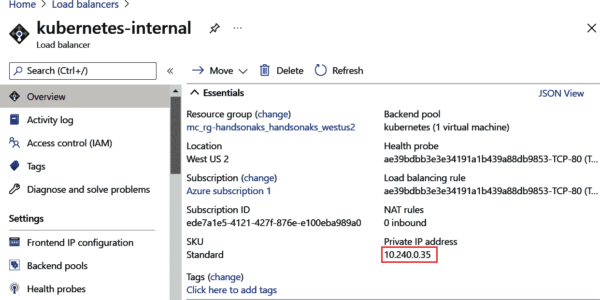
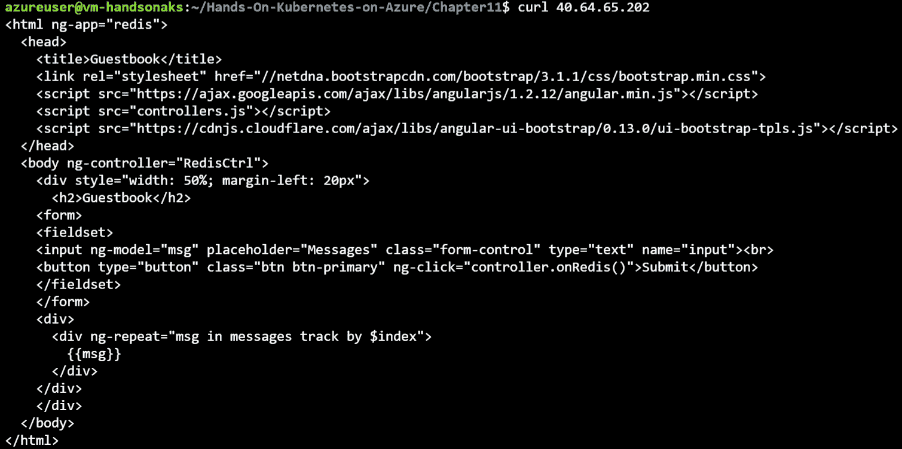

# 11. AKS 中的网络安全

网络安全是保护应用程序的关键活动。安全网络的目标，一方面是允许用户连接到你的应用程序并使用你提供的所有功能；另一方面，你还需要保护你的网络免受攻击者的侵害。这意味着要确保攻击者无法访问你网络的关键部分，即使他们获得了访问权限，这种访问也应该受到限制。

在 AKS 中谈到网络安全时，网络的保护有两个不同的层次。第一个是控制平面。控制平面指的是托管 Kubernetes API 的托管 Kubernetes 主服务器。默认情况下，控制平面是暴露在互联网的。你可以通过限制哪些公共 IP 地址可以访问它（使用名为 **授权 IP 范围** 的功能）或通过部署私有集群来保护控制平面，这意味着只有连接到你虚拟网络的机器才能访问控制平面。

要保护的第二个网络层是运行在集群上的工作负载。保护工作负载有多种方法。第一种方法是使用 Azure 网络功能，例如 Azure 防火墙或 **网络安全组**（**NSGs**）。第二种保护工作负载的方法是使用 Kubernetes 功能，称为网络策略。

在本章中，你将探索保护 AKS 集群网络的不同方式。具体来说，本章包含以下几个部分：

+   AKS 中的网络和网络安全

+   控制平面网络安全

+   工作负载网络安全

由于 AKS 集群的大多数网络配置只能在集群创建时进行配置，因此你将在本章中创建和销毁多个集群。

让我们从探讨 AKS 中的网络和网络安全概念开始本章内容。

## AKS 中的网络和网络安全

本节作为 AKS 中网络和安全概念的介绍。你将首先覆盖控制平面，然后是工作负载网络，再到网络安全。

### 控制平面网络

Kubernetes 集群的控制平面是承载集群 Kubernetes API 服务器、管理调度器并存储集群状态的基础设施。当你与 Kubernetes 集群交互时，例如通过使用 `kubectl`，你实际上是在向 Kubernetes API 服务器发送命令。在 AKS 中，控制平面由微软管理，并作为一项服务提供给你。

默认情况下，控制平面通过互联网暴露，并且任何连接到互联网的人都可以访问它。这并不意味着控制平面不安全。即便攻击者能够访问你的控制平面，他们仍然需要集群凭证才能对控制平面执行命令。

然而，许多组织仍然希望限制对其 AKS 集群控制平面的网络访问。AKS 中有两种功能可以帮助你限制对集群控制平面的网络访问。

第一个功能叫做**授权 IP 地址范围**。通过在你的 AKS 上配置授权 IP 地址范围，你可以设置哪些 IP 地址允许访问你的 API 服务器。这意味着，不允许访问你的 API 服务器的 IP 地址将无法与 API 服务器交互。这一点在*图 11.1*中有所说明：


图 11.1：授权 IP 范围解释

限制网络访问控制平面的另一种方法是使用称为**私有集群**的功能。通过配置私有集群，你不会为控制平面分配一个公开可访问的地址。集群只能通过私有网络进行访问。要连接到控制平面，你需要使用一台连接到**Azure 虚拟网络**（**VNet**）的机器。这台机器将通过 Azure 的功能——Azure Private Link 与控制平面通信。

Private Link 是 Azure 的一项功能，允许你使用虚拟网络中的私有 IP 地址连接到托管服务。在使用 Private Link 时，会在你的虚拟网络中创建一个 Private Link 端点。要连接到这个 Private Link 端点，你必须从托管在同一虚拟网络中的虚拟机，或者在对等虚拟网络中，或者通过连接到该虚拟网络的 VPN 或 Azure ExpressRoute 进行连接。在*图 11.2*中，你可以看到一个示例，展示了如何使用托管在同一虚拟网络中的虚拟机实现此功能。你可以看到，承载工作负载的节点池（1）以及连接到同一虚拟网络的虚拟机（2）可以连接到控制平面，但通过互联网连接的用户（3）无法连接：


图 11.2：私有集群解释

需要理解的是，授权 IP 地址范围和私有集群仅为 Kubernetes 控制平面提供网络安全；它们不会影响工作负载网络。工作负载网络将在下一部分讨论。

### 工作负载网络

你的工作负载在 AKS 中部署在一个虚拟网络中的集群上。在虚拟网络中配置和保护网络安全有很多方法。在这一部分，我们将介绍一些用于保护部署在虚拟网络中工作负载的网络安全配置选项。但这仅仅是对这些概念的介绍。在部署生产集群之前，请参考 AKS 文档，详细了解不同的配置选项：[`docs.microsoft.com/azure/aks/concepts-network`](https://docs.microsoft.com/azure/aks/concepts-network)。

你首先需要选择一个网络模型来部署你的集群。这个配置对安全性的影响有限，但从网络的角度理解是很重要的。有两种选择：

+   **Kubenet 网络（默认）**：使用 kubenet 网络时，集群节点从 VNet 中的一个子网获取 IP 地址。运行在这些节点上的 Pod 从一个覆盖网络中获取 IP 地址，这个覆盖网络使用与节点不同的地址空间。Pod 到 Pod 之间的网络通过**网络地址转换**（**NAT**）来实现。kubenet 的好处是只有节点会消耗集群子网中的一个 IP 地址。

+   **Azure 容器网络接口（CNI）网络（高级）**：使用 Azure CNI 时，Pod 和节点都会从集群创建所在的子网中获取 IP 地址。这个模型的好处是，Pod 可以直接被集群外部的资源访问。缺点是，你需要进行谨慎的 IP 地址规划，因为每个 Pod 都需要在集群子网中占用一个 IP 地址。

在这两种网络模型中，你可以选择在现有的虚拟网络（VNet）中创建集群，或者让 AKS 代表你创建一个新的 VNet。

第二个需要考虑的网络安全配置是通过外部防火墙来路由进出流量。这可以是一个 Azure 防火墙，也可以是第三方的**网络虚拟设备**（**NVA**）。通过将流量路由到外部防火墙，你可以应用集中式的安全规则、进行流量检查，并记录流量访问模式。要配置这一点，你需要在集群子网上配置一个**用户定义路由**（**UDR**），将流量从集群路由到外部防火墙。如果你想进一步了解，可以参考文档：[`docs.microsoft.com/azure/aks/limit-egress-traffic`](https://docs.microsoft.com/azure/aks/limit-egress-traffic)。

另一个网络安全选项是使用 Azure 中的 NSG 来限制进出流量。默认情况下，当你在 AKS 中创建一个 `LoadBalancer` 类型的服务时，AKS 还会配置一个 NSG，允许来自任何地方的流量访问该服务。你可以在 AKS 中调整该 NSG 的配置，以限制哪些 IP 可以访问这些服务。

最后，你可以通过使用 Kubernetes 的一种功能——**网络策略**，来限制集群中的流量。网络策略是一个 Kubernetes 对象，它允许你配置哪些流量可以在特定的 Pod 上进行。通过网络策略，你可以保护 Pod 到 Pod 之间的流量、外部到 Pod 的流量，以及 Pod 到外部的流量。建议你主要将网络策略用于 Pod 到 Pod 之间的流量（也叫做东西向流量），而将外部到 Pod 或 Pod 到外部的流量（也叫做南北向流量）交给外部防火墙或 NSG 来处理。

AKS 在集群的网络策略配置上支持两种选项。您可以使用 Azure 网络策略或 Calico 网络策略。Azure 网络策略由 Microsoft 开发、维护和支持，而 Calico 网络策略作为一个开源项目开发，并由一个名为 Tigera 的公司提供可选的商业支持 ([`tigera.io/`](http://tigera.io/))。

在工作负载网络安全部分，您将为集群配置网络安全组和网络策略。配置外部防火墙超出了本书的范围；请参考之前提到的文档，了解更多关于此配置的信息。

## 控制平面网络安全

在本节中，您将探索两种保护 AKS 集群控制平面的方法：授权 IP 范围和私有集群。您将首先通过更新现有集群来使用授权的 IP 范围。

### 使用授权 IP 范围保护控制平面

在 AKS 上配置授权的 IP 范围将限制哪些公共 IP 地址可以访问 AKS 集群的控制平面。在本节中，您将为现有集群配置授权的 IP 范围。您将限制流量到一个随机的公共 IP 地址，以验证流量阻止功能是否正常工作。然后，您将配置 Azure Cloud Shell 中的 IP 地址为授权 IP，看看它是如何允许流量通过的。

1.  首先，浏览到 Azure 门户并打开您的 AKS 集群面板。在左侧导航中选择“网络”选项。然后，选择“设置授权 IP 范围”旁边的复选框，并在下方的框中输入 IP 地址 `10.0.0.0`，如 *图 11.3* 所示。您并不使用这个 IP；此配置仅用于验证如果您的 IP 地址没有被授权，您将无法连接到 Kubernetes 控制平面。最后，点击屏幕顶部的保存按钮。

    图 11.3：配置授权的 IP

1.  现在，打开 Azure Cloud Shell。在 Cloud Shell 中，执行以下命令：

    ```
    Watch kubectl get nodes
    ```

    最初，这可能仍然会返回节点列表，如 *图 11.4* 所示。这是因为在 AKS 上配置授权的 IP 范围需要几分钟时间。

    

    图 11.4：命令最初可能仍然会显示节点列表

    然而，几分钟后，这条命令的输出应该会返回错误，如 *图 11.5* 所示。这是预期的结果，因为您已将对控制平面的访问权限限制了。

    

    图 11.5：错误显示您无法再连接到控制平面

1.  你可以通过按 *Ctrl + C* 停止 `watch` 命令。现在，你将获得当前 Cloud Shell 会话使用的 IP 地址，然后将其配置为授权 IP。要获取当前 Cloud Shell 会话使用的 IP 地址，你可以连接到 [icanhazip.com](http://icanhazip.com)，这是一个简单的网站，会返回你的公共 IP 地址。执行以下命令来实现：

    ```
    curl icanhazip.com
    ```

    这将返回类似于*图 11.6*的输出：

    

    图 11.6：获取 Cloud Shell 使用的 IP 地址

1.  现在，你可以将此 IP 地址配置为 AKS 中的授权 IP 地址。你可以像在*步骤 1*中那样，在 AKS 面板的网络部分中完成此操作。具体操作见*图 11.7*。确保点击屏幕顶部的保存按钮。

    图 11.7：将 Cloud Shell 的 IP 地址配置为 AKS 中的授权 IP

1.  现在，执行与之前相同的命令，以获取你 AKS 集群中的节点列表。

    ```
    watch kubectl get nodes
    ```

    最初，这可能仍然会返回你之前看到的错误，如*图 11.8*所示。这是因为 AKS 配置授权 IP 范围需要几分钟时间。


图 11.8：命令最初仍然会返回错误

然而，过了几分钟后，这个命令的输出应该返回一个节点列表，如*图 11.9*所示。这表明你已经成功配置了授权的 IP 范围。


图 11.9：通过配置授权的 IP，现在你可以连接到 API 服务器

通过配置授权的 IP 范围，你可以确认当 Cloud Shell 的 IP 地址未被允许访问 Kubernetes 控制平面时，连接会超时。通过将 Cloud Shell 的 IP 地址配置为授权 IP，你成功连接到了控制平面。

在典型的生产环境中，你不会将 Cloud Shell 的 IP 地址配置为 AKS 集群的授权 IP，而是会配置你的 Kubernetes 管理员、数据中心或你使用的工具的已知 IP 地址或范围。这里使用 Cloud Shell 仅作为一个示例，展示其功能。

还有第二种保护控制平面的方法，即通过部署私有集群。你将在接下来的章节中完成此操作。

### 使用私有集群保护控制平面

通过在 AKS 中配置授权的 IP 范围，你可以限制哪些公共 IP 地址可以访问你的集群。你还可以通过部署私有集群，完全限制任何公共流量访问你的集群。私有集群只能通过私有连接访问，该连接是通过 Azure Private Link 建立的。

让我们从配置私有集群并尝试访问它开始：

1.  私有集群功能只能在集群创建时启用。这意味着你必须创建一个新的集群。若要在免费试用订阅中执行此操作，你需要删除现有的集群。你可以使用以下命令在 Cloud Shell 中完成：

    ```
    az aks delete -n handsonaks -g rg-handsonaks -y
    ```

    这个命令将花费几分钟来完成。请耐心等待，直到它成功删除你之前的集群。

1.  你现在可以创建一个新的集群了。因为在后续步骤中，你还将创建一个新的虚拟机来访问集群（如 *图 11.2* 所示），你将创建一个新的 VNet，而不是让 AKS 为你创建 VNet。要创建 VNet，请使用以下命令：

    ```
    az network vnet create -o table \
        --resource-group rg-handsonaks \
        --name vnet-handsonaks \
        --address-prefixes 192.168.0.0/16 \
        --subnet-name akssubnet \
        --subnet-prefix 192.168.0.0/24
    ```

1.  你需要获取在 VNet 中创建的子网的 ID。要获取该 ID，请使用以下命令：

    ```
    VNET_SUBNET_ID='az network vnet subnet show \
      --resource-group rg-handsonaks \
      --vnet-name vnet-handsonaks \
      --name akssubnet --query id -o tsv'
    ```

1.  你还需要一个具有在刚创建的子网中创建资源权限的托管身份。要创建托管身份并授予其访问子网的权限，请使用以下命令：

    ```
    az identity create --name handsonaks-mi \
      --resource-group rg-handsonaks
    IDENTITY_CLIENTID='az identity show --name handsonaks-mi \
      --resource-group rg-handsonaks \
      --query clientId -o tsv'
    az role assignment create --assignee $IDENTITY_CLIENTID \
      --scope $VNET_SUBNET_ID --role Contributor
    IDENTITY_ID='az identity show --name handsonaks-mi \
      --resource-group rg-handsonaks \
      --query id -o tsv' 
    ```

    上述代码将首先创建托管身份。之后，它会获取托管身份的客户端 ID 并授予对该子网的访问权限。在最后的命令中，它获取托管身份的资源 ID。

1.  最后，你可以使用以下命令创建私有 AKS 集群。如你所见，你正在创建一个只包含一个节点的小型集群。这是为了在免费试用订阅下节省核心配额：

    ```
    az aks create \
      --resource-group rg-handsonaks \
      --name handsonaks \
      --vnet-subnet-id $VNET_SUBNET_ID \
      --enable-managed-identity \
      --assign-identity $IDENTITY_ID \
      --enable-private-cluster \
      --node-count 1 \
      --node-vm-size Standard_DS2_v2 \
      --generate-ssh-keys
    ```

    该命令创建一个新的 AKS 集群，并包含一些此前未在书中介绍的特殊配置。第一个新配置是 `--vnet-subnet-id`。这允许你在现有 VNet 中的现有子网中创建 AKS 集群。`--enable-managed-identity` 参数使集群能够使用托管身份，`--assign-identity` 参数配置使用哪个托管身份。最后一个新配置选项是 `--enable-private-cluster`，它将创建一个带有私有端点的私有集群。

1.  上述命令将花费几分钟来完成。完成后，你可以尝试通过 Azure Cloud Shell 访问你的集群。然而，这将失败，因为 Azure Cloud Shell 并未部署在你的 VNet 中。让我们进一步探索。首先，获取集群凭据：

    ```
    az aks get-credentials -n handsonaks -g rg-handsonaks
    ```

    这将询问你是否要覆盖现有的 `kubeconfig` 文件两次。按下 *y* 键确认，如 *图 11.10* 所示：

    

    ```
    kubectl get nodes
    ```

    这将返回一个错误，如*图 11.11*所示。这个错误是预期中的，因为你的 Cloud Shell 无法通过私有连接访问 Private Link 端点。

    

    图 11.11：显示无法再从 Cloud Shell 访问控制平面的错误

    #### 注意

    在之前的命令中，你注意到你的 Cloud Shell 无法访问 Kubernetes API 服务器。实际上，可以将 Azure Cloud Shell 连接到 Azure 中的 VNet，并通过该方式连接到 Kubernetes API 服务器。你在本示例的接下来的步骤中不会使用这种方法，但如果你对这种方法感兴趣，请参考文档：[`docs.microsoft.com/azure/cloud-shell/private-vnet`](https://docs.microsoft.com/azure/cloud-shell/private-vnet)。

1.  如前言所述，当你创建一个私有 AKS 集群时，AKS 会使用名为 Private Link 的服务将控制平面连接到你的 VNet。你实际上可以在 Azure 门户中看到这个端点。在门户中查看私有端点时，搜索 Azure 搜索栏中的 Private Link，如*图 11.12*所示：

    图 11.12：在 Azure 搜索栏中搜索 Private Link

    在结果窗格中，点击“私有端点”以查看当前的 Private Link 端点。你应该能在这里看到一个名为 kube-apiserver 的私有端点，如*图 11.13*所示。在这里，你会看到指向集群以及创建该私有端点的子网的链接。

    

    图 11.13：你订阅中的私有端点

    Private Link 利用 Azure DNS 私有区域将集群的 DNS 名称与私有端点的私有 IP 地址关联起来。要查看 Azure DNS 私有区域，请通过 Azure 搜索栏搜索“Private DNS 区域”，如*图 11.14*所示：

    

    图 11.14：通过 Azure 门户导航到私有 DNS 区域

    在结果窗格中，你应该能看到一个私有 DNS 区域。如果点击该区域，你将看到更多来自 DNS 区域的详细信息，如*图 11.15*所示。你会看到这里为你的集群 DNS 名称创建了一个 DNS 记录，该记录指向你 VNet 中的一个私有 IP 地址。

    

    图 11.15：由 AKS 创建的 Azure DNS 私有区域中的 DNS 记录

1.  为了建立与控制平面的私有连接，你将创建一个新的虚拟机，并使用它连接到控制平面。为了方便管理，你将在一个新的资源组中创建这个虚拟机，这样以后删除虚拟机会更容易。使用以下命令在 VNet 中创建一个新的子网，并在该子网中创建虚拟机：

    ```
    az network vnet subnet create \
      --resource-group rg-handsonaks \
      --vnet-name vnet-handsonaks \
      --name vmsubnet \
      --address-prefix 192.168.1.0/24
    VM_SUBNET_ID='az network vnet subnet show \
      --resource-group rg-handsonaks \
      --vnet-name vnet-handsonaks \
      --name vmsubnet --query id -o tsv'
    az group create -l <your Azure location> \
      --name rg-handsonaks-vm
    az vm create --name vm-handsonaks \
      --resource-group rg-handsonaks-vm \
      --image UbuntuLTS \
      --admin-username azureuser \
      --ssh-key-values ~/.ssh/id_rsa.pub \
      --subnet $VM_SUBNET_ID \
      --size Standard_D2_v2
    ```

    创建虚拟机大约需要一分钟。一旦创建完成，你应该会看到类似于*图 11.16*的输出。复制输出中的公共 IP 地址：

    

    图 11.16：创建新虚拟机并获取其公共 IP 地址

1.  现在虚拟机已创建，你将把包含集群凭据的 Kubernetes 配置文件移动到该虚拟机。这避免了你必须在目标机器上安装 Azure CLI 来获取 Kubernetes 凭据。确保将`<public IP>`替换为上一步的结果。

    ```
    scp ~/.kube/config azureuser@<public IP>:~
    ```

    系统将提示你是否信任此主机。通过输入`yes`确认。这将生成类似于*图 11.17*的输出：

    

    图 11.17：将 Kubernetes 凭据复制到目标机器

1.  现在你可以使用以下命令访问远程机器：

    ```
    ssh azureuser@<public IP>
    ```

1.  现在你已连接到远程机器，你需要使用`kubectl`。下载它，使其可执行，并使用以下命令将其移动到二进制文件夹中：

    ```
    curl -LO https://dl.k8s.io/release/v1.20.0/bin/linux/amd64/kubectl
    chmod +x kubectl 
    sudo mv ./kubectl /usr/local/bin/kubectl
    ```

1.  为了让`kubectl`识别你上传的配置文件，你需要将其移动到`kube`目录中。你可以使用以下命令来完成：

    ```
    mkdir .kube
    mv config .kube/config
    ```

1.  现在你已配置虚拟机以连接到集群，你可以通过执行以下命令来验证是否可以连接到集群：

    ```
    kubectl get nodes
    ```

    这应该会生成类似于*图 11.18*的输出：

    

    图 11.18：从同一 VNet 中的虚拟机访问私有 AKS 集群

1.  你还可以验证虚拟机用于连接集群的 DNS 记录。为此，首先使用`nslookup`命令获取 DNS 记录。你可以使用以下命令来执行此操作：

    ```
    kubectl cluster-info
    nslookup <cluster FQDN>
    ```

    这应该会生成类似于*图 11.19*的输出：


图 11.19：获取集群的 FQDN 并使用 nslookup 查找其 IP 地址

如*图 11.19*所示，从`nslookup`命令返回的地址是一个私有 IP 地址。这意味着只有连接到该 VNet 的机器才能连接到 Kubernetes 控制平面。

现在，你已经成功创建了一个 AKS 私有集群，并验证了只有连接到 AKS VNet 的机器才能连接到控制平面。你无法从 Azure Cloud Shell 连接到控制平面，但可以从同一 VNet 中的虚拟机连接。由于你现在已经部署了一个私有集群，暂时不要删除正在使用的虚拟机。你将在下一个示例中使用它。在本章的最后一个示例中，你将删除此私有集群和虚拟机。

本节关于控制平面安全的内容到此结束。你已经了解了授权的 IP 范围和私有集群。下一节，你将进一步了解如何保护你的工作负载。

## 工作负载网络安全

你现在已经了解了如何保护 AKS 集群控制平面的网络安全。然而，这并没有影响到工作负载的网络安全。在本节中，你将探讨三种保护工作负载的方法。首先，你将使用 Azure 内部负载均衡器创建一个 Kubernetes 服务。接着，你将使用 NSG 来保护 Kubernetes 中服务的流量。最后，你将使用网络策略来保护 Pod 到 Pod 的流量。

### 使用内部负载均衡器保护工作负载网络

Kubernetes 有多种类型的服务，正如你在*第三章*《*在 AKS 上部署应用程序*》中所学的那样。你之前多次使用过服务类型为负载均衡器，以便让 AKS 创建一个 Azure 负载均衡器。这些负载均衡器一直是公共负载均衡器。你还可以将 AKS 配置为创建一个内部负载均衡器。这在你创建的服务仅需要从 VNet 或与该 VNet 连接的网络内访问时非常有用。

在本节中，你将创建这样的一个服务：

1.  如果你不再连接到之前示例中创建的虚拟机，请重新连接。你可以使用以下命令获取虚拟机的公共 IP 地址：

    ```
    az vm show -n vm-handsonaks \
      -g rg-handsonaks-vm -d --query publicIps
    ```

    你可以使用以下命令连接到虚拟机：

    ```
    ssh azureuser@<public IP>
    ```

1.  一旦连接到此虚拟机，你需要获取与本书相关联的 git 仓库。你可以使用以下命令来获取：

    ```
    git clone https://github.com/PacktPublishing/Hands-on-Kubernetes-on-Azure-Third-Edition
    ```

    一旦仓库被克隆，使用以下命令进入本章的示例：

    ```
    cd Hands-On-Kubernetes-on-Azure-Third-Edition/Chapter11
    ```

1.  本节中的示例应用程序将使用你在本书前半部分已经使用过的 guestbook 应用程序。然而，你之前使用的单一 YAML 文件已被拆分为两个文件：`guestbook-without-service.yaml` 和 `front-end-service-internal.yaml`。这样做的目的是为了让你更方便地查看与服务相关的配置。

    `front-end-service-internal.yaml` 文件包含使用 Azure 内部负载均衡器创建 Kubernetes 服务的配置。以下代码是该示例的一部分：

    ```
    1   apiVersion: v1
    2   kind: Service
    3   metadata:
    4     name: frontend
    5     annotations:
    6       service.beta.kubernetes.io/azure-load-balancer-internal: "true"
    7     labels:
    8       app: guestbook
    9       tier: frontend
    10  spec:
    11    type: LoadBalancer
    12    ports:
    13    - port: 80
    14    selector:
    15      app: guestbook
    16      tier: frontend
    ```

    你在 YAML 代码中使用注解来指示 AKS 创建一个 Azure 内部负载均衡器。你可以看到在前面的代码示例中的第 5-6 行，你将 `service.beta.kubernetes.io/azure-load-balancer-internal` 注解设置为 `true`。

    你可以通过执行以下命令来创建 guestbook 应用程序和使用内部负载均衡器的服务：

    ```
    kubectl create -f guestbook-without-service.yaml
    kubectl create -f front-end-service-internal.yaml
    ```

    你可以然后通过以下命令获取服务，并等待它获得外部 IP：

    ```
    kubectl get service -w
    ```

    这将返回类似于*图 11.20*的输出：

    

    图 11.20：获取服务的外部 IP

1.  如您所见，服务具有作为外部 IP 的私有 IP。您只能从集群部署到的 VNet 或与该 VNet 连接的其他网络访问此 IP。

    #### 注意

    ```
    curl <external IP>
    ```

    这将返回与*图 11.21*类似的结果：

    

    图 11.21：通过内部负载均衡器访问服务

1.  AKS 创建了一个内部负载均衡器来公开此服务。您还可以在 Azure 门户中看到这个负载均衡器。要查看此内部负载均衡器，请首先在 Azure 搜索栏中搜索负载均衡器，如*图 11.22*所示：

    图 11.22：通过 Azure 门户导航到负载均衡器

1.  在结果窗格中，您应该看到两个负载均衡器，如*图 11.23*所示：

    图 11.23：默认目录中负载均衡器的列表

1.  单击 kubernetes-internal 负载均衡器。这将带您进入类似*图 11.24*的窗格：

    图 11.24：内部负载均衡器的详细信息

    在这里，您可以看到此内部负载均衡器的详细信息。正如您在屏幕截图中看到的亮点所示，与`kubectl`命令的输出相同的 IP 配置在负载均衡器上。

1.  这结束了使用内部负载均衡器的示例。您现在可以通过应用以下命令删除服务使用内部负载均衡器：

    ```
    kubectl delete -f front-end-service-internal.yaml
    kubectl delete -f guestbook-without-service.yaml
    ```

    这将删除 guestbook 应用程序和服务。删除服务时，将删除 Kubernetes 中的服务以及 Azure 中的内部负载均衡器。这是因为一旦集群中不再需要内部负载均衡器的服务，AKS 将删除该内部负载均衡器。

在本节中，您使用内部负载均衡器部署了一个 Kubernetes 服务。这使您能够创建不向互联网公开的服务。然而，有时您需要将服务暴露给互联网，但需要确保只有信任的方可以连接。在下一节中，您将学习如何在 AKS 中创建使用网络安全组限制入站流量的服务。

### 使用网络安全组保护工作负载网络

到目前为止，你已经在 Kubernetes 中暴露了多个服务。你使用 Kubernetes 中的服务对象以及 Ingress 来暴露它们。然而，除了在上一节通过部署内部负载均衡器来限制访问之外，你从未限制过应用程序的访问。这意味着该应用程序始终可以公开访问。在接下来的示例中，你将创建一个具有公共 IP 的 Kubernetes 集群服务，但你将通过 AKS 配置的 NSG 限制对其的访问。

1.  在本节的示例应用中，你将再次使用留言簿应用。与上一节相同，前端服务的配置已移到一个单独的文件中。对于这个示例，你将从使用`front-end-service.yaml`文件创建服务开始，稍后会使用`front-end-service-secured.yaml`文件更新它。

    首先，通过应用以下命令部署应用，保持原样，不做任何 NSG 配置：

    ```
    kubectl apply -f guestbook-without-service.yaml
    kubectl apply -f front-end-service.yaml
    ```

    然后，使用以下命令获取前端服务的 IP 地址：

    ```
    kubectl get service -w
    ```

    这将生成类似于*图 11.25*的输出。一旦获取到公共 IP，你可以通过按 *Ctrl + C* 来退出命令：

    

    图 11.25：获取前端服务的 IP 地址

    现在，你可以通过浏览器或通过虚拟机本身连接到此服务。如果你通过浏览器连接，你应该期望看到类似于*图 11.26*的输出：

    

    图 11.26：通过网页浏览器访问留言簿应用

1.  你也可以通过命令行连接到这个应用。为此，请使用以下命令：

    ```
    curl <public IP>
    ```

    这应该返回一个类似于*图 11.27*的输出：

    

    图 11.27：通过命令行连接到留言簿应用

1.  现在，让我们通过只允许你的浏览器连接到应用来配置前端服务的额外安全性。为此，你将需要你当前使用的公共 IP 地址。如果你不知道它，你可以访问[`www.whatismyip.com/`](https://www.whatismyip.com/)来获取你的 IP 地址，如*图 11.28*所示：

    ```
    1   apiVersion: v1
    2   kind: Service
    3   metadata:
    4     name: frontend
    5     labels:
    6       app: guestbook
    7       tier: frontend
    8   spec:
    9     type: LoadBalancer
    10    ports:
    11    - port: 80
    12    selector:
    13      app: guestbook
    14      tier: frontend
    15    loadBalancerSourceRanges:
    16    - <your public IP address>
    ```

    这个文件与之前在本书中创建的服务非常相似。然而，在第 15 行和第 16 行中，你现在看到 `loadBalancerSourceRanges` 和添加你自己的公共 IP 地址的选项。你可以在这里提供多个公共 IP 地址或范围；每个地址或范围前面会加上一个破折号。如果你希望输入单个 IP 地址而不是范围，则在该 IP 地址后附加 `/32`。你需要这样做，因为 Kubernetes 期望的是 IP 范围，而 `/32` 的范围表示单个 IP 地址。

    要在此文件中编辑或添加你自己的 IP 地址，请使用以下命令：

    ```
    vi front-end-service-secured.yaml
    ```

    在生成的应用程序中，使用箭头键导航到底部，按下 *i* 键进入 `insert` 模式，删除占位符，添加你的 IP 地址，然后在后面加上 `/32`。要关闭并保存文件，按 *Esc* 键，输入 `:wq!` 写入并关闭文件，最后按 *Enter* 键。示例如 *图 11.29* 所示：

    

    图 11.29：带有 IP 地址的 front-end-service-secured.yaml 文件示例

1.  你可以使用以下命令更新之前部署的现有服务：

    ```
    kubectl apply -f front-end-service-secured.yaml
    ```

    这将导致 AKS 更新与此集群关联的 NSG，只允许来自你的公共 IP 地址的流量。你可以通过再次浏览服务的 IP 地址来确认这一点，你应该能够看到 guestbook 应用程序。然而，如果你从虚拟机中重试之前的命令，你会看到连接最终超时：

    ```
    curl <public IP>
    ```

    这将在 2 分钟后超时，输出类似于 *图 11.30* 所示：

    

    图 11.30：虚拟机内的连接超时

1.  你也可以在 Azure 中验证 NSG 配置。要验证这一点，通过 Azure 搜索栏查找网络安全组，如 *图 11.31* 所示：

    图 11.31：通过 Azure 门户导航到网络安全组

1.  在生成的面板中，你应该能看到两个 NSG。选择名称以 aks-agentpool 开头的一个，如 *图 11.32* 所示：

    图 11.32：选择 aks-agentpool NSG

1.  在该 NSG 的详细视图中，你应该能看到一个规则，允许来自你的 IP 地址到服务公共 IP 地址的流量，如 *图 11.33* 所示：

    图 11.33：NSG 包含一个规则，只允许来自先前定义的公共 IP 的流量

    注意，这个规则是由 AKS 创建并管理的；你不需要自己创建这个规则。

1.  这里，我们已经完成了这个示例。现在清理部署、虚拟机（VM）和私有集群。在虚拟机内，使用以下命令删除应用程序：

    ```
    kubectl delete -f guestbook-without-service.yaml
    kubectl delete -f front-end-service-secured.yaml
    ```

    然后，使用 `exit` 命令退出虚拟机。这将把你带回到 Cloud Shell。现在，你可以删除私有集群和用于连接的虚拟机：

    ```
    az group delete -n rg-handsonaks-vm -y
    az aks delete -g rg-handsonaks -n handsonaks -y
    ```

通过向 Kubernetes 服务添加额外配置，你成功地限制了能够连接到你的服务的人。你能够确认，只有允许连接到该服务的公共 IP 地址才能连接，而来自其他 IP 地址的连接则会超时。

这是一个保护所谓的北南流量的示例，意味着来自外部到你集群的流量。你还可以为东西流量提供额外的保护，即集群内部的流量。为此，你将使用 Kubernetes 中的网络策略功能。你将在下一节中完成这项操作。

### 使用网络策略保护工作负载网络

在前一节中，你让 Kubernetes 在 Azure 中配置了一个 NSG 以保护北南流量。这是限制公共服务流量的好做法。在大多数情况下，你还需要保护东西流量，也就是在你的 Pod 之间的流量。这样，你可以确保如果潜在的攻击者获取了你应用的一部分访问权限，他们就无法轻易连接到应用的其他部分或其他应用。这也被称为防止横向移动。

为了保护 Pod 之间的流量，Kubernetes 提供了一种称为网络策略的功能。网络策略可以用来保护外部流量到你的 Pod、从你的 Pod 到外部的流量以及 Pod 之间的流量。由于你已经学习了如何保护外部流量到你的 Pod，本节将介绍如何使用网络策略来保护 Pod 到 Pod 之间的流量。

在 AKS 中，网络策略是在集群创建时需要配置的（截至目前是这种情况）。如果你的集群启用了网络策略，你可以在集群中创建新的网络策略对象。当没有网络策略选择特定 Pod 时，所有进入和离开该 Pod 的流量都将被允许。当你将网络策略应用于 Pod 时，根据配置，所有进入和/或离开该 Pod 的流量将被阻止，除非该网络策略允许该流量。

让我们试试看：

1.  首先创建一个启用了网络策略的新集群。在这个示例中，你将创建一个启用了 Azure 网络策略的集群。你可以使用以下命令创建此新集群：

    ```
    az aks create \
      --resource-group rg-handsonaks \
      --name handsonaks \
      --enable-managed-identity \
      --node-count 2 \
      --node-vm-size Standard_DS2_v2 \
      --generate-ssh-keys \
      --network-plugin azure \
      --network-policy azure
    ```

1.  创建集群后，请确保刷新凭据以获取对集群的访问权限。你可以使用以下命令来完成此操作：

    ```
    az aks get-credentials -g rg-handsonaks -n handsonaks
    ```

    这将提示你覆盖现有凭据。你可以通过在两个提示中输入 *y* 来确认，如*图 11.34*所示：

    

    图 11.34：获取新集群的凭据

1.  在这个示例中，你将测试运行 `nginx` 的 Pod 中两个 Web 服务器之间的连接。这些代码已提供在 `web-server-a.yaml` 和 `web-server-b.yaml` 文件中。以下是 `web-server-a.yaml` 的代码：

    ```
    1   apiVersion: v1
    2   kind: Pod
    3   metadata:
    4     name: web-server-a
    5     labels:
    6       app: web-server
    7       env: A
    8   spec:
    9     containers:
    10    - name: webserver
    11      image: nginx:1.19.6-alpine
    ```

    这是 `web-server-b.yaml` 的代码：

    ```
    1   apiVersion: v1
    2   kind: Pod
    3   metadata:
    4     name: web-server-b
    5     labels:
    6       app: web-server
    7       env: B
    8   spec:
    9     containers:
    10    - name: webserver
    11      image: nginx:1.19.6-alpine
    ```

    如你所见，每个 Pod 的代码中都有一个标签 app，`web-server`，以及另一个名为 `env` 的标签，值分别为每个服务器的标识（A 对应 `web-server-a`，B 对应 `web-server-b`）。稍后你将在本示例中使用这些标签，以选择性地允许这些 Pod 之间的流量。

    要创建这两个 Pod，使用以下命令：

    ```
    kubectl create -f web-server-a.yaml
    kubectl create -f web-server-b.yaml
    ```

    在继续之前，通过运行以下命令验证 Pod 是否正在运行：

    ```
    kubectl get pods -w
    ```

    这应该返回类似于 *图 11.35* 的输出：

    

    图 11.35：两个 Pod 都在运行

1.  在本示例中，我们将使用 Pod 的 IP 地址来测试连接。使用以下命令获取 `web-server-b` 的 IP 地址：

    ```
    kubectl get pods -o wide
    ```

    这应该返回类似于 *图 11.36* 的输出，其中你会看到突出显示的 IP 地址：

    

    图 11.36：获取 web-server-b 的 IP 地址

1.  现在，尝试从 `web-server-a` 连接到 `web-server-b`。你可以使用以下命令测试此连接：

    ```
    kubectl exec -it web-server-a -- \
      wget -qO- -T 2 http://<web-server-b IP>
    ```

    这应该返回类似于 *图 11.37* 的输出：

    

    图 11.37：验证 web-server-a 是否能连接到 web-server-b

1.  现在，让我们创建一个新的 `NetworkPolicy` 对象，限制所有流量进出带有标签 app 为 `web-server` 的 Pod。此策略已在 `deny-all.yaml` 文件中提供：

    ```
    1   kind: NetworkPolicy
    2   apiVersion: networking.k8s.io/v1
    3   metadata:
    4     name: deny-all
    5   spec:
    6     podSelector:
    7       matchLabels:
    8         app: web-server
    9     ingress: []
    10    egress: []
    ```

    让我们探索一下代码中包含的内容：

    +   `NetworkPolicy` 对象。

    +   `app: web-server`。

    +   **第 9-10 行**：在这里，你定义了允许规则。正如你所看到的，你并没有定义任何允许规则，这意味着所有流量将被阻止。

    在本示例稍后，你将添加更多具体的入口和出口规则，以选择性地允许流量流动。

1.  现在，让我们创建这个网络策略。你可以使用以下命令来创建：

    ```
    kubectl create -f deny-all.yaml
    ```

    这将返回类似于 *图 11.38* 的输出：

    

    图 11.38：创建网络策略

1.  现在让我们再次测试 `web-server-a` 和 `web-server-b` 之间的连接。你可以使用以下命令进行测试。

    ```
    kubectl exec -it web-server-a -- \
      wget -qO- -T 2 http://<web-server-b IP>
    ```

    这应该返回类似于 *图 11.39* 的输出：

    

    图 11.39：流量不再在 web-server-a 和 web-server-b 之间流动

1.  现在，你将创建另一个网络策略，选择性地允许从 `web-server-a` 到 `web-server-b` 的流量。此策略包含在 `allow-a-to-b.yaml` 文件中：

    ```
    1   kind: NetworkPolicy
    2   apiVersion: networking.k8s.io/v1
    3   metadata:
    4     name: allow-a-to-b
    5   spec:
    6     podSelector:
    7       matchLabels:
    8         app: web-server
    9     ingress:
    10    - from:
    11      - podSelector:
    12          matchLabels:
    13            env: A
    14    egress:
    15    - to:
    16      - podSelector:
    17          matchLabels:
    18            env: B
    ```

    让我们更深入地探索该文件与早期网络策略之间的差异：

    +   `env: A`。

    +   `env: B`。

    同时请注意，你正在以一个新名称创建这个网络策略。这意味着你将在集群中激活两个网络策略，选择带有标签`app: web-server`的 pod。`deny-all`和`allow-a-to-b`两个网络策略都将在你的集群中存在，并且都适用于标签为`app: web-server`的 pod。网络策略本质上是累加的，这意味着如果其中任何一个策略允许流量，那么该流量就会被允许。

1.  我们使用以下命令创建这个策略：

    ```
    kubectl create -f allow-a-to-b.yaml
    ```

    这将返回类似于*图 11.40*的输出：

    

    图 11.40：创建一个新的网络策略，允许来自 web-server-a 的流量到 web-server-b

1.  让我们再次测试`web-server-a`和`web-server-b`之间的连接。你可以通过应用以下命令来进行测试：

    ```
    kubectl exec -it web-server-a -- \
      wget -qO- -T 2 http://<web-server-b IP>
    ```

    这应该返回类似于*图 11.41*的输出：

    

    图 11.41：流量再次被允许从 web-server-a 到 web-server-b

1.  你现在已经允许了来自`web-server-a`到`web-server-b`的流量。然而，你并没有允许流量反向通过，这意味着从`web-server-b`到`web-server-a`的流量被阻止了。我们也来测试一下。要进行测试，使用以下命令获取`web-server-a`的 IP 地址：

    ```
    kubectl get pods -o wide
    ```

    这将返回类似于*图 11.42*的输出，其中`web-server-a`的 IP 地址已被高亮显示：

    

    ```
    kubectl exec -it web-server-b -- \
      wget -qO- -T 2 http://<web-server-a IP>
    ```

    这应该返回类似于*图 11.43*的输出：

    

    图 11.43：从 web-server-b 到 web-server-a 的流量未被允许，符合预期

    正如你在*图 11.43*中看到的，从`web-server-b`到`web-server-a`的流量超时，显示该流量被阻止。

1.  这结束了关于 Azure 网络策略的示例。在下一章中，你将再次创建一个新的集群，因此，作为本章的结尾，安全删除启用了网络策略的集群，使用以下命令：

    ```
    az aks delete -n handsonaks -g rg-handsonaks -y
    ```

现在你已经使用网络策略来保护 pod 之间的流量。你看到了默认策略如何拒绝所有流量，以及如何添加新策略来选择性地允许流量。你还看到，如果允许一个 pod 到另一个 pod 的流量，反向流量不会自动被允许。

## 小结

本章介绍了 AKS 中的多种网络安全选项。你探讨了如何保护控制平面和集群中的工作负载。

为了保护控制平面，你首先使用授权的 IP 范围验证只有允许的公共 IP 地址能够访问集群的控制平面。之后，你创建了一个新的私有集群，该集群只能通过私有连接访问。你使用 Azure Private Link 连接到这个私有集群。

之后，你还探讨了工作负载网络安全。最初，你部署了一个公共服务，该服务对所有用户开放。然后，你让 AKS 配置 Azure NSGs，仅允许特定的连接访问该服务。你验证了可以从你的机器连接到该服务，但无法从 Azure 中的虚拟机连接，符合预期。最后，你还在一个新集群中配置了 Kubernetes 网络策略。你利用这些策略来保护 Pod 之间的流量，成功地确保了集群中不同 Pod 之间的流量安全。

在下一章中，你将学习如何使用 AKS 通过 Azure Service Operator 创建 Azure 资源，例如 Azure MySQL 数据库。
