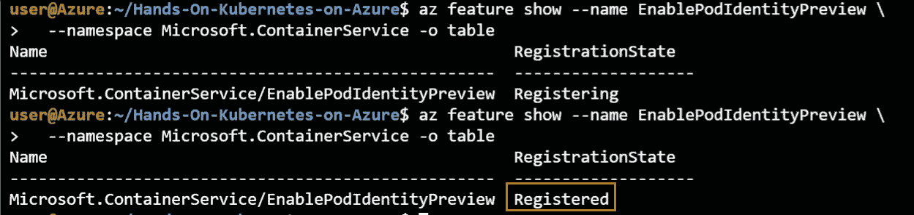
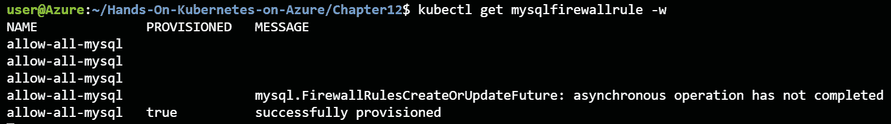

# 12\. 将应用程序连接到 Azure 数据库

在前几章中，你将应用程序的状态存储在集群中，无论是 Redis 集群还是 MariaDB。你可能记得，它们在高可用性方面都有一些问题。本章将带你通过连接到 Azure 托管 MySQL 数据库的过程。

我们将讨论使用托管数据库的好处，而不是在 Kubernetes 上运行**StatefulSets**。为了创建这个托管和管理的数据库，你将使用**Azure 服务操作器**（**ASO**）。ASO 是一种通过 Kubernetes 集群内部创建 Azure 资源（如托管的 MySQL 数据库）的方法。在本章中，你将了解更多关于 ASO 项目的细节，并将在你的集群上设置和配置 ASO。

然后你将使用 ASO 在 Azure 中创建一个 MySQL 数据库。你将使用这个托管数据库作为 WordPress 应用的一部分。这将向你展示如何将应用程序连接到托管数据库。本章分为以下几个主题：

+   Azure 服务操作器

+   在你的集群上安装 ASO

+   使用 ASO 创建 MySQL 数据库

+   使用 MySQL 数据库创建应用程序

我们从探索 ASO 开始。

## Azure 服务操作器

在这一部分，你将了解更多关于 ASO 的内容。我们将从探索使用托管数据库与直接在 Kubernetes 上运行 StatefulSets 的优缺点开始，然后进一步了解 ASO 的细节。

到目前为止，你所经历的所有示例都是自包含的；也就是说，所有内容都在 Kubernetes 集群内部运行。几乎所有的生产应用程序都有状态，这些状态通常存储在数据库中。尽管大部分云无关的架构有很大优势，但当涉及到管理像数据库这样的有状态工作负载时，这会带来巨大的劣势。

当你在 Kubernetes 集群上运行自己的数据库时，你需要处理可扩展性、安全性、高可用性、灾难恢复和备份等问题。云服务提供商提供的托管数据库服务可以减轻你或你的团队执行这些任务的负担。例如，Azure Database for MySQL 提供企业级的安全性和合规性，内建高可用性和自动备份，且服务能够在几秒钟内进行扩展。最后，你还可以选择将灾难恢复配置为次要区域。

从 Azure 获取一个生产级别的数据库比在 Kubernetes 上设置并管理自己的数据库要简单得多。在接下来的部分中，你将探索如何使用 Kubernetes 来在 Azure 上创建这些数据库的方法。

### 什么是 ASO？

与如今的大多数应用程序一样，许多繁重的工作已经由开源社区（包括微软员工）为我们完成。微软意识到许多用户希望从 Kubernetes 中使用他们的托管服务，并且需要一种更简便的方式来使用 Kubernetes 部署中使用的方法。ASO 项目就是为了解决这个问题而创建的。

ASO 是一个于 2020 年启动的新项目，它继承了 **Open Service Broker for Azure** (**OSBA**) 项目。OSBA 是微软最初的实现，允许你在 Kubernetes 中创建 Azure 资源，但这个项目现在不再维护，已被弃用。ASO 实现了相同的功能，并且在积极维护和开发中。

ASO 包含两个部分：一组 **CustomResourceDefinitions** (**CRDs**) 和一个管理这些 CRDs 的控制器。CRDs 是 Kubernetes 的一组 API 扩展，允许你指定想要创建的 Azure 资源。资源组、虚拟机、MySQL 数据库等都有对应的 CRD。

ASO 中的大多数 API 仍处于 alpha 或 beta 阶段，意味着它们可能在未来发生变化。请参考文档 [`github.com/Azure/azure-service-operator`](https://github.com/Azure/azure-service-operator) 获取最新的资源定义，因为本章使用的定义可能已经发生变化。

控制器是一个运行在集群中的 pod，监视 Kubernetes API 中通过这些 CRDs 创建的任何对象。正是这个控制器与 Azure API 交互，并创建你使用 ASO 创建的资源。

ASO 依赖于另外两个你已经在本书中学到的项目，即 **Azure Active Directory** (**Azure AD**) pod 管理身份和 cert-manager。ASO 使用 Azure AD pod 管理身份将托管身份链接到 ASO pod。这也意味着该托管身份需要有权限来创建这些资源。ASO 使用 cert-manager 获取证书以供 ASO pod 使用。

默认情况下，ASO 会将连接字符串等秘密存储在 Kubernetes secrets 中。正如你在前几章中学到的，最好将秘密存储在 Key Vault 中，而不是 Kubernetes 中。ASO 也有将秘密存储在 Key Vault 中的选项，在设置过程中，你将配置 ASO 将秘密存储在 Key Vault 中。

从用户使用 ASO 的角度来看，*图 12.1* 描述了当你创建资源时发生的情况：

1.  作为用户，你将一个 Azure 资源的 YAML 定义提交给 Kubernetes API。Azure 资源在 CRD 中定义。

1.  ASO pod 正在监视 Kubernetes API 中 Azure CRD 对象的变化。

1.  当检测到变化时，ASO 将在 Azure 中创建资源。

1.  如果在资源创建过程中生成了连接字符串，这个连接字符串将存储在 Kubernetes secret 中（默认情况下），或者存储在 Key Vault 中（如果已配置）。


图 12.1：使用 ASO 创建资源的高级过程图

在本节中，你已经了解了 ASO 项目的基本知识。在接下来的章节中，你将开始在集群上安装 ASO。

## 在集群上安装 ASO

要在集群上安装 ASO，你需要一个集群。在上一章结束时，你删除了集群，因此这里你需要创建一个新集群。之后，你需要创建一个托管身份和一个密钥库。设置 ASO 时，创建这两项资源是最佳实践，这就是本章将解释如何以这种方式设置 ASO 的原因。创建这些资源后，你需要确保 cert-manager 已在集群中设置。确认后，你可以使用 Helm chart 安装 ASO。

让我们从第一步开始，创建一个新的 AKS 集群。

### 创建一个新的 AKS 集群

由于你在上一章结束时删除了集群，接下来我们从创建一个新集群开始。你可以通过 Cloud Shell 执行所有这些步骤。让我们开始吧：

1.  首先，你需要创建一个新集群。由于你将使用 pod 身份进行 ASO 授权，你还需要在新集群上启用 pod 身份附加组件。在写这篇文章时，pod 身份附加组件处于预览阶段。

    如果你还没有按照*第九章*，*Azure Active Directory 在 AKS 中的 pod 管理身份*中的说明为你的订阅注册此预览，请使用以下命令进行注册：

    ```
    az feature register --name EnablePodIdentityPreview \
      --namespace Microsoft.ContainerService
    ```

    你还需要安装 Azure CLI 的预览扩展，可以使用以下命令进行安装：

    ```
    az extension add --name aks-preview
    ```

    你需要等到 pod 身份预览在你的订阅中注册完成。你可以使用以下命令来验证此状态：

    ```
    az feature show --name EnablePodIdentityPreview \
      --namespace Microsoft.ContainerService -o table
    ```

    等待状态显示为已注册，如*图 12.2*所示：

    

    ```
    az provider register --namespace Microsoft.ContainerService
    ```

1.  一旦你注册了预览提供程序，或者如果你已经在*第九章*，*Azure Active Directory 在 AKS 中的 pod 管理身份*部分完成了此操作，你可以使用以下命令创建一个新集群：

    ```
    az aks create -g rg-handsonaks -n handsonaks \
      --enable-managed-identity --enable-pod-identity \
      --network-plugin azure --node-vm-size Standard_DS2_v2 \
      --node-count 2 --generate-ssh-keys 
    ```

1.  一旦命令执行完成，使用以下命令获取凭证以访问你的集群：

    ```
    az aks get-credentials -g rg-handsonaks \
      -n handsonaks --overwrite-existing
    ```

现在你已经有了一个启用了 pod 身份的新 Kubernetes 集群。为了继续设置 ASO，让我们现在创建一个托管身份。

### 创建一个托管身份

在本节中，你将使用 Azure 门户创建一个托管身份。然后，你将授权 AKS 集群管理这个托管身份，并授予托管身份访问你的订阅，以便创建资源。让我们开始：

1.  在 Azure 搜索栏中，查找*托管身份*，如*图 12.3*所示：

    图 12.3：搜索托管身份

1.  在结果页面中，点击+ 新建以创建新的托管身份，如*图 12.4*所示：

    图 12.4：创建新的托管身份

1.  为了将本章的资源进行组织，创建一个名为 ASO 的新资源组，如*图 12.5*所示：

    图 12.5：创建新的资源组

1.  为托管身份提供位置和名称；如果你希望遵循此示例，请使用名称`aso-mi`，如*图 12.6*所示。确保选择与集群所在区域相同的区域：

    图 12.6：提供项目和实例详细信息以创建托管身份

1.  点击屏幕底部的“审核 + 创建”并创建托管身份。

1.  托管身份创建完成后，你需要捕获客户端 ID 和资源 ID 以备后用。复制并粘贴这些信息到可以稍后访问的位置。你可以在概览窗格中找到客户端 ID，如*图 12.7*所示：

    图 12.7：从托管身份获取客户端 ID

    你可以在属性窗格中找到资源 ID，如*图 12.8*所示：

    

    图 12.8：获取托管身份的资源 ID

1.  下一步是为托管身份赋予 AKS 集群权限。为此，点击左侧窗格中的“访问控制 (IAM)”，点击屏幕顶部的+ 添加按钮，点击下拉菜单中的“添加角色分配”，选择“托管身份操作员”角色，在“分配访问权限给”下拉菜单中选择“用户分配的托管身份”，然后选择 handsonaks-agentpool 身份并保存。此过程如*图 12.9*所示：

    图 12.9：为 AKS 赋予对托管身份的访问权限

1.  现在，你将为托管身份赋予在你的订阅上创建资源的权限。为此，查找 Azure 搜索栏中的“订阅”，如*图 12.10*所示，然后选择你的订阅：

    图 12.10：在 Azure 搜索栏中查找订阅

1.  在订阅窗格中，点击“访问控制 (IAM)”，点击屏幕顶部的+ 添加按钮，点击“添加角色分配”，选择“贡献者”角色，在“分配访问权限给”下拉菜单中选择“用户分配的托管身份”，然后选择 aso-mi 身份并保存。此过程如*图 12.11*所示：


图 12.11：为你的订阅赋予 aso-mi 权限

这完成了托管标识的设置。在下一节中，您将创建一个密钥保管库，并允许您刚刚创建的托管标识进行机密的创建和读取。

### 创建密钥保管库

在本节中，您将创建 ASO 将用于存储连接字符串和机密的密钥保管库。虽然在 ASO 设置过程中这是可选步骤，但我们推荐执行此操作。

1.  首先，在 Azure 搜索栏中搜索“密钥保管库”，如*图 12.12*所示：

    图 12.12：在 Azure 搜索栏中寻找密钥保管库

1.  点击屏幕顶部的“+ 新建”按钮以创建新的密钥保管库。选择您之前创建的 ASO 资源组，并为您的密钥保管库命名。请注意，密钥保管库的名称必须唯一，如果不唯一，请考虑在名称中添加额外的字符。另外，确保在与 AKS 集群相同的区域创建密钥保管库。最终的配置如*图 12.13*所示：

    图 12.13：密钥保管库配置

1.  现在选择“下一步：访问策略 >”以配置新的访问策略。在此处，您将为前面部分创建的 aso-mi 托管标识授予在此密钥保管库中进行机密管理的权限。为此，首先点击“+ 添加访问策略”按钮，如*图 12.14*所示：

    图 12.14：点击“+ 添加访问策略”按钮

1.  在弹出的窗口中，选择“机密管理”模板，然后点击“未选择”以选择您的托管标识。在接下来的弹窗中，找到 aso-mi 托管标识，选择它，然后点击“选择”，接着点击“添加”，如*图 12.15*所示：

    图 12.15：为托管标识添加机密管理权限

1.  这已配置了密钥保管库中的访问策略。现在点击“审核 + 创建”按钮，在最后的窗口中点击“创建”以创建密钥保管库。完成这一过程应该需要几分钟时间。

一旦您的密钥保管库部署完成，您就可以开始安装 ASO，下一节将详细说明如何操作。

### 在集群上设置 ASO

现在您已经具备了所需的托管标识和密钥保管库，您可以开始在集群上部署 ASO。您可以使用 Cloud Shell 执行所有这些步骤。让我们开始吧：

1.  您在*创建新的 AKS 集群*一节中创建了一个新集群。您需要将之前创建的托管标识链接到该集群。ASO 组件将创建在它们自己的命名空间中，因此您还需要为此创建一个新的命名空间：

    ```
    kubectl create namespace azureoperator-system
    az aks pod-identity add --resource-group rg-handsonaks \
      --cluster-name handsonaks --namespace azureoperator-system \
      --name aso-identity-binding \
      --identity-resource-id <resource ID of managed identity>
    ```

1.  现在你可以在集群上安装 cert-manager。你之前在*第六章*《用 HTTPS 保护你的应用》中已经安装过一次，但在该章结尾时要求你移除这个组件。你可以使用以下命令重新安装：

    ```
    kubectl apply -f https://github.com/jetstack/cert-manager/releases/download/v1.1.0/cert-manager.yaml
    ```

1.  使用以下命令跟踪 cert-manager 的部署状态：

    ```
    kubectl rollout status \
      -n cert-manager deploy cert-manager-webhook
    ```

    等待直到部署显示成功完成，如*图 12.16*所示：

    

    图 12.16：检查 cert-manager 的部署状态

1.  一旦 cert-manager 完全部署完毕，你可以开始安装 ASO。首先使用以下命令添加 ASO 的 Helm 仓库：

    ```
    helm repo add azureserviceoperator \
    https://raw.githubusercontent.com/Azure/azure-service-operator/master/charts
    ```

1.  接下来，你需要为 ASO 安装提供配置值。使用以下命令打开本章附带代码示例中的 `values.yaml` 文件：

    ```
    code values.yaml
    ```

    按照此处所示，填写该文件中的所有必需值：

    ```
    1   azureTenantID: "<tenant ID>"
    2   azureSubscriptionID: "<subscription ID>"
    3   azureOperatorKeyvault: "<key vault name>"
    4   azureClientID: "<client ID>"
    5   cloudEnvironment: AzurePublicCloud
    6   azureUseMI: true
    7   image:
    8     repository: mcr.microsoft.com/k8s/azureserviceoperator:0.1.16800
    9   installAadPodIdentity: true
    10  aad-pod-identity:
    11    azureIdentityBinding:
    12      name: aso-identity-binding
    13      selector: aso_manager_binding
    14    azureIdentity:
    15      enabled: True
    16      name: aso-identity
    17      type: 0
    18      resourceID: "<resource ID>"
    19      clientID: "<client ID>"
    ```

    如前面的代码示例所示，你需要提供租户 ID、订阅 ID、密钥库名称、托管身份的客户端 ID（两次）以及托管身份的资源 ID。你可以使用以下命令查找租户 ID 和订阅 ID：

    ```
    az account show
    ```

    这将返回类似*图 12.17*的输出，其中租户 ID 和订阅 ID 已经被突出显示：

    

    图 12.17：获取订阅 ID 和租户 ID

1.  一旦填入这些值，你可以使用以下命令安装 ASO：

    ```
    helm upgrade --install aso \
      azureserviceoperator/azure-service-operator \
      -n azureoperator-system --create-namespace \
      -f values.yaml
    ```

1.  安装过程需要几分钟。等待直到以下命令返回成功的部署信息：

    ```
    kubectl rollout status deploy \
      -n azureoperator-system azureoperator-controller-manager
    ```

    输出应类似于*图 12.18*：

    

    图 12.18：检查 ASO 部署状态

1.  在写作时，`azureoperator-controller-manager` 部署的 `aadpodidbinding` 标签存在问题。不过，通过应用一个补丁可以修复此问题，给该部署应用一个新标签。这个补丁文件已经包含在本章的文件中，特别是在 `patch.yaml` 文件中：

    ```
    spec:
      template:
        metadata:
          labels:
            aadpodidbinding: aso-identity-binding
    ```

    如你所见，补丁本身会将一个新的标签应用到部署中的 pod。你可以使用以下命令应用这个补丁：

    ```
    kubectl patch deployment \
      azureoperator-controller-manager \
      -n azureoperator-system \
      --patch "$(cat patch.yaml)"
    ```

    这将确保你可以在下一部分中使用 ASO。

现在，ASO 已经在你的集群上部署完毕，你准备好开始使用 Kubernetes 和 ASO 部署 Azure 资源了。你将在下一节中进行操作。

## 使用 ASO 部署 Azure MySQL 数据库

在上一节中，你已经在 Kubernetes 集群上部署了 ASO。这意味着现在你可以使用 Kubernetes API 部署 Azure 资源。在本节中，你将使用 YAML 文件创建一个运行在 Azure MySQL 数据库服务上的 MySQL 数据库，并使用 `kubectl` 提交这些文件到 Kubernetes。让我们开始吧：

1.  首先，你需要创建一个资源组。资源组定义的代码也可以在本章的代码示例中找到。创建此文件并将其保存为 `rg.yaml`：

    ```
    apiVersion: azure.microsoft.com/v1alpha1
    kind: ResourceGroup
    metadata:
      name: aso-resources
    spec:
      location: <cluster location>
    ```

    如你所见，在资源的代码中，`apiVersion` 指向 `azure.microsoft.com`，而 `kind` 是 `ResourceGroup`。此外，你需要提供资源组的详细信息，包括其名称和位置。确保将 `location` 更改为你集群的位置。

    你可以使用以下命令创建该资源组：

    ```
    kubectl create -f rg.yaml
    ```

    若要监视资源组创建过程，可以使用以下命令：

    ```
    kubectl get resourcegroup -w
    ```

    这将返回一个类似于*图 12.19*的输出：

    

    图 12.19：监视新资源组的创建

1.  让我们还验证一下资源组是否已在 Azure 中创建。为此，请在 Azure 搜索栏中查找资源组名称（例如本示例中的 `aso-resources`），如*图 12.20*所示：

    图 12.20：在 Azure 门户中搜索资源组

    如你所见，资源组已在搜索结果中返回，表示资源组已成功创建。

1.  现在你可以创建 MySQL 服务器了。你不会创建虚拟机来运行 MySQL，而是创建一个在 Azure 上管理的 MySQL 服务器。要创建此服务器，可以使用为你提供的 `mysql-server.yaml` 文件：

    ```
    1   apiVersion: azure.microsoft.com/v1alpha1
    2   kind: MySQLServer
    3   metadata:
    4     name: <mysql-server-name>
    5   spec:
    6     location: <cluster location>
    7     resourceGroup: aso-resources
    8     serverVersion: "8.0"
    9     sslEnforcement: Disabled
    10    createMode: Default
    11    sku:
    12      name: B_Gen5_1
    13      tier: Basic
    14      family: Gen5
    15      size: "5120"
    16      capacity: 1
    ```

    该文件包含 MySQL 服务器的特定配置。以下几个要点值得注意：

    +   `MySQLServer` 实例。

    +   `location` 为你集群的位置。

    +   本演示中已禁用 `sslEnforcement`。这样做是为了使演示更容易理解。如果你创建的是生产集群，强烈建议启用 `sslEnforcement`。

    +   **第 11-16 行**：在这里你定义了 MySQL 服务器的大小。在这种情况下，你正在创建一个基本服务器，容量为 5 GB。如果你计划将其用于生产环境，可能需要更大的服务器。

    你可以使用以下命令创建 MySQL 服务器：

    ```
    kubectl create -f mysql-server.yaml
    ```

    这将需要几分钟时间才能完成。你可以使用以下命令跟踪进度：

    ```
    kubectl get mysqlserver -w 
    ```

    这将返回一个类似于*图 12.21*的输出：

    

    图 12.21：监视 MySQL 服务器的创建

    如果在创建 MySQL 服务器时遇到错误，请参考 [`github.com/Azure/azure-service-operator/blob/master/docs/troubleshooting.md`](https://github.com/Azure/azure-service-operator/blob/master/docs/troubleshooting.md) 上的 ASO 文档。

    一旦你收到服务器成功配置的消息，可以按 *Ctrl + C* 退出此命令。

1.  在创建 MySQL 服务器之后，你可以创建 MySQL 数据库。MySQL 数据库的定义已在 `mysql-database.yaml` 文件中提供：

    ```
    1   apiVersion: azure.microsoft.com/v1alpha1
    2   kind: MySQLDatabase
    3   metadata:
    4     name: wordpress-db
    5   spec:
    6     resourceGroup: aso-resources
    7     server: <mysql-server-name>
    ```

    数据库的定义是提供一个名称并引用你之前创建的服务器。要创建数据库，你可以使用以下命令：

    ```
    kubectl create -f mysql-database.yaml
    ```

    这将需要几秒钟才能完成。你可以使用以下命令来跟踪进度：

    ```
    kubectl get mysqldatabase -w 
    ```

    这将返回类似于*图 12.22*的输出：

    

    图 12.22：监控 MySQL 数据库的创建

    一旦你收到数据库已成功配置的消息，你可以通过按*Ctrl + C*退出此命令。

1.  你可以创建一个允许数据库流量的防火墙规则。在此示例中，你将创建一个允许来自所有来源的流量的规则。在生产环境中，不建议这样做。有关 Azure Database for MySQL 的推荐网络配置，请参阅文档：[`docs.microsoft.com/azure/mysql/flexible-server/concepts-networking`](https://docs.microsoft.com/azure/mysql/flexible-server/concepts-networking)。防火墙规则的配置已在 `mysql-firewall.yaml` 文件中提供：

    ```
    1   apiVersion: azure.microsoft.com/v1alpha1
    2   kind: MySQLFirewallRule
    3   metadata:
    4     name: allow-all-mysql
    5   spec:
    6     resourceGroup: aso-resources
    7     server: <mysql-server-name>
    8     startIpAddress: 0.0.0.0
    9     endIpAddress: 255.255.255.255
    ```

    如你所见，我们引用了先前创建的 MySQL 服务器，并允许来自所有 IP 地址的流量（即从 `0.0.0.0` 到 `255.255.255.255`）。

    要创建防火墙规则，你可以使用以下命令：

    ```
    kubectl create -f mysql-firewall.yaml
    ```

    这将需要几秒钟才能完成。你可以使用以下命令来跟踪进度：

    ```
    kubectl get mysqlfirewallrule -w 
    ```

    这将返回类似于*图 12.23*的输出：

    

    图 12.23：监控 MySQL 防火墙规则的创建

    一旦你收到防火墙规则已成功配置的消息，你可以通过按*Ctrl + C*退出此命令。

1.  让我们验证一下这些内容是否已经成功创建在 Azure 门户中。为此，首先在 Azure 搜索框中搜索 MySQL 服务器名称（在此示例中为 `wp-helm-mysql`），如*图 12.24*所示。点击服务器以查看详细信息：

    图 12.24：在 Azure 门户中搜索 MySQL 服务器

1.  这将带你到 MySQL 服务器的概览面板。在此面板中向下滚动并展开“可用资源”部分。在这里，你应该能看到 `wordpress-db` 已被创建，如*图 12.25*所示：

    图 12.25：通过 ASO 创建的数据库在 Azure 门户中的显示

1.  在 MySQL 服务器面板中，点击左侧导航栏中的“连接安全性”以验证防火墙规则。你应该能在此面板上看到你通过 ASO 创建的防火墙规则，如*图 12.26*所示：


图 12.26：通过 ASO 创建的防火墙规则已设置在 MySQL 服务器上

这验证了您能够在 Azure 中创建一个具有数据库的 MySQL 服务器，并配置其防火墙设置。

在本节中，您使用 ASO 创建了一个 MySQL 服务器，以及该服务器上的一个数据库，然后最终配置了其防火墙。您能够使用 Kubernetes YAML 文件完成所有这些操作。ASO 将这些 YAML 文件转换为 Azure，并为您创建了资源。最后，您确认在 Azure 门户中一切都已创建和配置完成。

在下一节，您将使用此数据库来支持 WordPress 应用程序。

## 使用 MySQL 数据库创建应用程序

您现在拥有一个 MySQL 数据库。为了展示您可以使用此数据库来配置一个应用程序，您将使用 WordPress 应用程序。您可以使用 Helm 安装它，并在 Helm 配置中提供与您的数据库的连接信息：

1.  首先，您需要连接到数据库服务器的连接信息。当您在集群上安装 ASO 时，您配置它使用 Key Vault 作为秘密存储而不是 Kubernetes 秘密。您需要此连接信息将 WordPress 连接到 Azure MySQL 数据库。在 Azure 搜索栏中搜索 `Key Vaults`，如*图 12.27*所示，点击 Key vaults，然后选择您在本章前面创建的密钥库：

    图 12.27：在 Azure 门户中搜索密钥库

1.  在结果窗格中，点击左侧导航中的 Secrets，然后点击秘密，如*图 12.28*所示。此秘密的命名遵循命名约定 `<object type>-<Kubernetes namesapce>-<object name>`。

    图 12.28：Azure 门户中的 MySQL 秘密

1.  您将看到一个包含多个版本秘密的视图；点击当前版本，如*图 12.29*所示：

    图 12.29：您的密钥库中不同的秘密版本

    现在，复制秘密的值，如*图 12.30*所示：

    

    图 12.30：将秘密的值复制到剪贴板

1.  该秘密包含与您的数据库连接相关的多个信息，您将在 Helm 安装中需要这些信息。它包含完全限定的服务器名称、用户名和密码。秘密中的值是 Base64 编码的。为了更轻松地处理此秘密，提供了一个 shell 脚本，该脚本将为您提供所需的解码值。要运行此脚本，请使用以下命令：

    ```
    sh decode-secret.sh <secret value>
    ```

    示例如*图 12.31*所示：

    

    图 12.31：解码秘密

1.  您可以使用前一步输出的值配置 Helm，使用您的 Azure MySQL 数据库。以下 Helm 命令将设置 WordPress 在您的集群上运行，但会使用外部数据库：

    ```
    helm repo add bitnami https://charts.bitnami.com/bitnami
    helm install wp bitnami/wordpress \
      --set mariadb.enabled=false \ 
      --set externalDatabase.host='<decoded host value>' \
      --set externalDatabase.user='<decoded user value>' \
      --set externalDatabase.password='<decoded password value>' \
      --set externalDatabase.database='wordpress-db' \
      --set externalDatabase.port='3306'
    ```

    如您所见，使用此命令，您通过将`mariadb.enabled`值设置为`false`，禁用了 MariaDB 安装，然后提供了外部数据库的连接信息。

    要监控 WordPress 的设置，您可以使用以下命令：

    ```
    kubectl get pods -w
    ```

    这将需要几分钟才能完全设置，最终，您应该能看到 WordPress pod 处于运行状态并准备就绪，如*图 12.32*所示：

    

    图 12.32：WordPress pod 处于运行状态

    一旦 pod 运行并准备就绪，您可以通过按*Ctrl + C*来停止此命令。如果您还记得*第三章*中的 WordPress 部署，即*AKS 上的应用程序部署*，在 WordPress 安装中曾有一个第二个 pod，它托管了一个 MariaDB 数据库。由于我们已将其替换为 Azure MySQL 数据库，因此这个 pod 不再存在。

1.  现在，让我们最终连接到这个 WordPress 应用程序。您可以使用以下命令获取 WordPress 网站的公共 IP 地址：

    ```
    kubectl get service
    ```

    这将显示公共 IP，如*图 12.33*所示：

    

    图 12.33：获取 WordPress 网站的公共 IP

    在您的网页浏览器的地址栏中输入此 IP 地址并按*Enter*键。您应该能看到带有默认示例帖子的 WordPress 登录页面，如*图 12.34*所示：

    

    图 12.34：浏览到 WordPress 网站

    现在，您已经在 Kubernetes 上托管了一个功能完整的 WordPress 网站，数据库由 Azure MySQL 数据库支持。

1.  本章的示例已结束。您创建了多个资源并安装了多个集群组件。让我们使用以下命令将它们从集群中清理掉：

    ```
    helm uninstall wp
    kubectl delete -f mysql-firewall.yaml
    kubectl delete -f mysql-database.yaml
    kubectl delete -f mysql-server.yaml
    kubectl delete -f rg.yaml
    helm uninstall aso -n azureoperator-system
    az aks pod-identity delete --resource-group rg-handsonaks \
      --cluster-name handsonaks --namespace azureoperator-system \
      --name aso-identity-binding
    kubectl delete namespace azureoperator-system
    kubectl delete -f https://github.com/jetstack/cert-manager/releases/download/v1.1.0/cert-manager.yaml
    az group delete -n aso --yes
    ```

您已经成功将 Kubernetes 上的应用程序连接到 Azure 托管的 MySQL 数据库。您使用了 WordPress Helm 图表，并提供了自定义值来配置该 Helm 图表，使其连接到托管数据库。

## 总结

本章介绍了**Azure 服务操作员**（**ASO**）。ASO 是一个开源项目，使得通过 Kubernetes 创建 Azure 服务成为可能。这样，您作为用户就无需在 Azure 门户或 CLI 和 Kubernetes 资源定义之间切换。

在本章中，您创建了一个新的 AKS 集群，然后在该集群上安装了 ASO。接着，您使用 ASO 在 Azure 上创建了一个 MySQL 数据库。您通过 Azure 门户验证了此数据库在 Azure 中的可用性。

最后，你在 Kubernetes 集群上创建了一个 WordPress 应用，并连接到外部数据库。你验证了应用程序正在运行并且可用，就像你在前面的章节中看到的那样。

在下一章，你将了解其他与 AKS 集成的 Azure 服务，即 Azure 安全中心和 Azure Defender for Kubernetes，这些服务用于监控集群的安全配置并减少威胁。
