# 13. Kubernetes 的 Azure 安全中心

Kubernetes 是一个非常强大的平台，拥有大量配置选项。正确配置你的工作负载并确保遵循最佳实践可能是困难的。你可以遵循行业基准，以获得如何安全部署工作负载的指南，例如 **互联网安全中心**（**CIS**）为 Kubernetes 提供的基准：https://www.cisecurity.org/benchmark/kubernetes/。

Azure 安全中心是一个统一的基础设施安全管理平台。它为 Azure 中的资源以及混合工作负载提供持续的安全监控和警报。它为许多 Azure 资源提供保护，包括 Kubernetes 集群。这样，你可以确保你的工作负载配置安全并且受到保护。

Azure 安全中心提供两种类型的保护。首先，它监控你的资源配置，并将其与安全最佳实践进行比较，然后为你提供可操作的建议来改善你的安全状况。其次，它还通过评估你的工作负载并在发现潜在威胁时发出警报来进行威胁保护。这一威胁检测功能是 Azure 安全中心中的一个功能，名为 Azure Defender。

在监控 Kubernetes 工作负载时，Azure 安全中心可以同时监控你的集群配置以及在集群中运行的工作负载的配置。为了监控集群中工作负载的配置，Azure 安全中心使用微软 Azure Kubernetes 策略。这个免费的附加组件适用于 **Azure Kubernetes 服务**（**AKS**），它将使 Azure 安全中心能够将你的工作负载配置与已知的最佳实践进行比较。

Azure Defender 还为 Kubernetes 提供特定的威胁检测能力。它监控 Kubernetes 审计日志、节点日志以及集群和工作负载配置的组合，以识别潜在的威胁。可以发现的威胁示例包括加密矿工、高权限角色的创建或暴露 Kubernetes 仪表板。

在本章中，你将启用 Azure 安全中心、Azure Kubernetes 策略以及 Azure Kubernetes 防御器，并监控几个示例应用程序以防范威胁。

在本章中，我们将涵盖以下主题：

+   Kubernetes 的 Azure 安全中心

+   Azure Defender for Kubernetes

+   部署有问题的工作负载

+   使用 Azure 安全得分分析配置

+   使用 Azure Defender 中和威胁

我们首先来设置 Kubernetes 的 Azure 安全中心。

## 为 Kubernetes 设置 Azure 安全中心

本章将从为 Kubernetes 设置 Azure Security Center 开始。要启用 Azure Security Center for Kubernetes，您需要在集群上启用 Azure Policy for AKS。这将允许 Azure Security 监控您的工作负载配置。为了利用 Azure Defender 的威胁防护，您还需要在订阅中启用 Azure Defender for Kubernetes。

让我们开始吧。

1.  在 Azure 搜索栏中查找您的 AKS 集群，如*图 13.1*所示：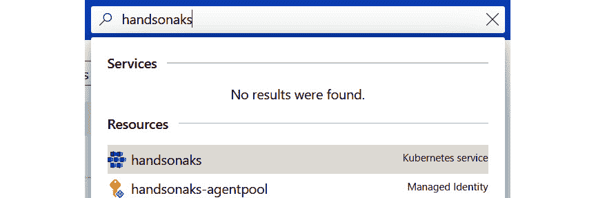

    图 13.1：在 Azure 搜索栏中查找您的集群

1.  现在，您将为 AKS 启用 Azure Policy。要启用此功能，请点击左侧的 Policies 按钮，在弹出的面板中，点击 Enable add-on，如*图 13.2*所示：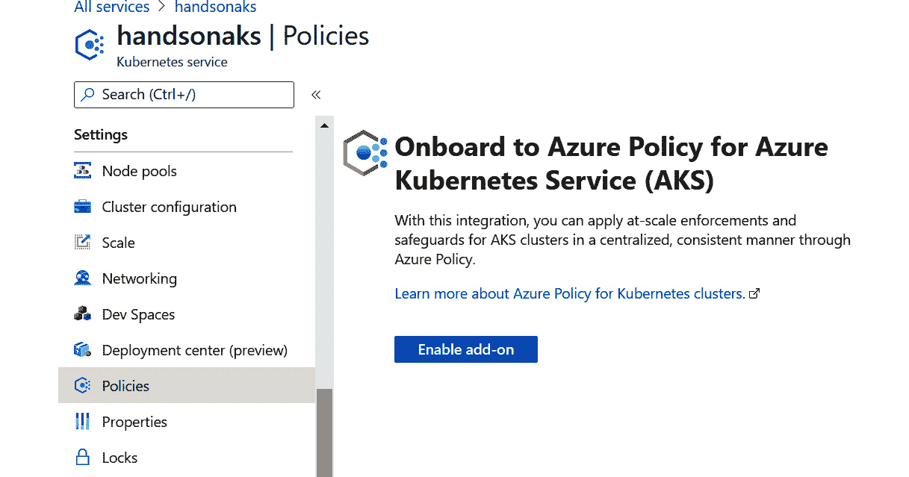

    图 13.2：为 AKS 启用 Azure Policy

    启用插件需要几分钟时间来完成。稍后，您应该会看到一条消息，显示服务已经启用，如*图 13.3*所示：

    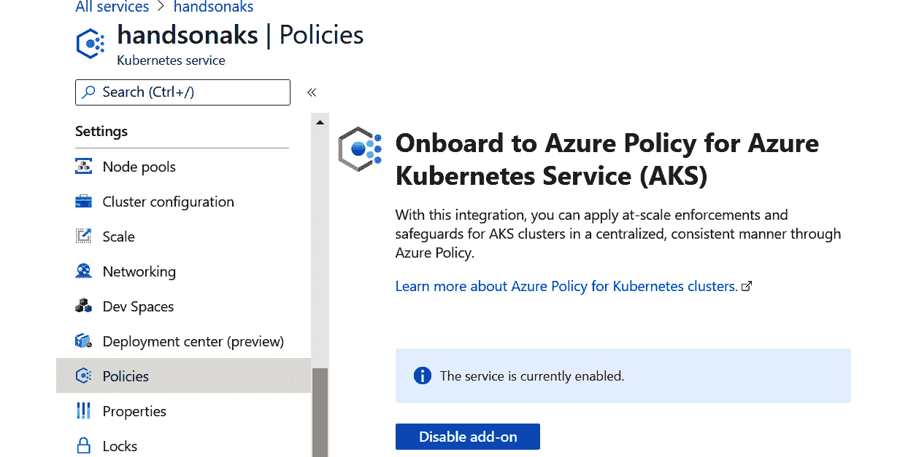

    图 13.3：Azure Policy for AKS 已启用

1.  这已经为 AKS 启用了 Azure Policy。接下来，您将启用 Azure Defender，以便从 Azure Security Center 获取威胁防护功能。为此，请在 Azure 门户的搜索栏中查找 `security center`，如*图 13.4*所示：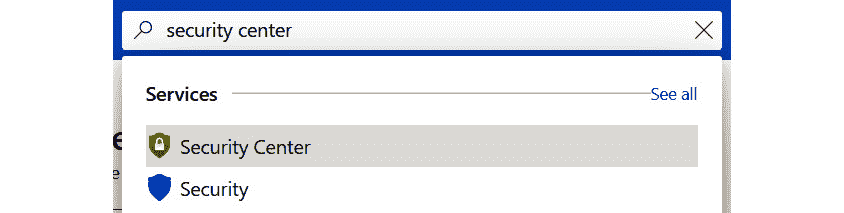

    图 13.4：在 Azure 门户的搜索栏中搜索安全中心

1.  如果这是您第一次在订阅中访问 Azure Security Center，您会看到如*图 13.5*所示的消息。要启用 Azure Defender，请点击屏幕底部的 Upgrade：

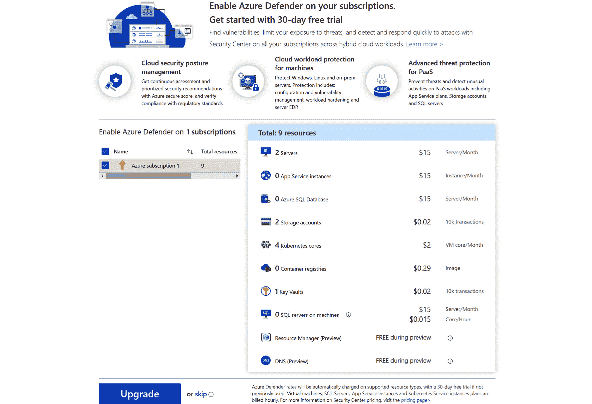

图 13.5：升级到 Azure Defender

如果您不是第一次在订阅中访问 Azure Security Center，可能不会看到启用 Azure Defender 的消息。要启用它，请点击左侧的 Pricing & settings 并选择您的订阅，如*图 13.6*所示：

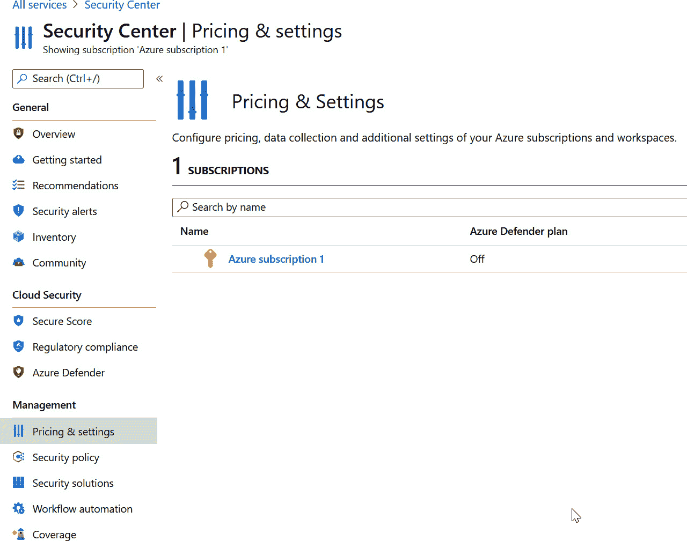

图 13.6：手动升级到 Azure Defender

在弹出的面板中，选择标题为 Azure Defender on 的框，并点击屏幕顶部的 Save 按钮以启用 Azure Defender。您也可以选择调节要启用/禁用 Azure Defender 的服务，如*图 13.7*所示：

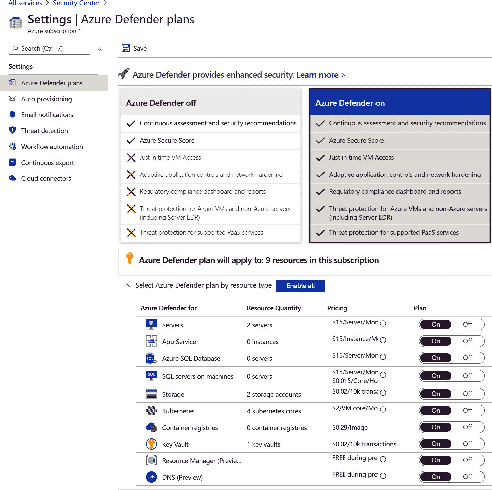

图 13.7：为您的订阅启用 Azure Defender

现在您已经启用了 Azure Security Center 和 Azure Defender，系统配置默认策略并开始检测需要最多 30 分钟时间。

在等待此配置生效期间，你将在你的集群上部署多个有问题的工作负载，这将在 Azure Defender 中触发警报。

## 部署有问题的工作负载

要触发 Azure 安全中心的推荐和威胁警报，你需要在你的集群上部署有问题的工作负载。在本节中，你将部署一些可能未按照最佳实践配置甚至包含潜在恶意软件（如加密货币挖矿程序）的工作负载到你的集群中。让我们看一下本章节代码示例中的有问题的工作负载示例：

+   `crypto-miner.yaml`: 此文件包含一个部署，将在你的集群上创建一个加密货币挖矿程序。

    ```
    1   apiVersion: apps/v1
    2   kind: Deployment
    3   metadata:
    4     name: crypto-miner
    5     labels:
    6       app: mining
    7   spec:
    8     replicas: 1
    9     selector:
    10      matchLabels:
    11        app: mining
    12    template:
    13      metadata:
    14        labels:
    15          app: mining
    16      spec:
    17        containers:
    18        - name: mining
    19          image: kannix/monero-miner:latest
    ```

这个文件是 Kubernetes 中的一个常规部署。正如你在*第 19 行*所见，此部署的容器镜像将是一个加密货币挖矿程序。

#### 注意

确保在完成本章后立即停止运行加密货币挖矿程序，如*使用 Azure Defender 中和解中立化威胁*部分所述。没有必要让加密货币挖矿程序长时间运行超过本示例所需的时间。

+   `escalation.yaml`: 此文件包含一个允许容器特权提升的部署。这意味着容器中的进程可以访问主机操作系统。有些情况下，这是期望的行为，但通常不希望这样配置。

    ```
    1   apiVersion: apps/v1
    2   kind: Deployment
    3   metadata:
    4     name: escalation
    5     labels:
    6       app: nginx-escalation
    7   spec:
    8     replicas: 1
    9     selector:
    10      matchLabels:
    11        app: nginx-escalation
    12    template:
    13      metadata:
    14        labels:
    15          app: nginx-escalation
    16      spec:
    17        containers:
    18        - name: nginx-escalation
    19          image: nginx:alpine
    20          securityContext:
    21            allowPrivilegeEscalation: true
    ```

正如在前面的代码示例中所见，在*第 20–21 行*，你使用 `securityContext` 配置了容器的安全上下文。你在*第 21 行*允许提权。

+   `host-volume.yaml`: 此文件包含一个在容器中挂载主机目录的部署。这不被推荐，因为这样容器可以访问主机。

    ```
    1   apiVersion: apps/v1
    2   kind: Deployment
    3   metadata:
    4     name: host-volume
    5     labels:
    6       app: nginx-host-volume
    7   spec:
    8     replicas: 1
    9     selector:
    10      matchLabels:
    11        app: nginx-host-volume
    12    template:
    13      metadata:
    14        labels:
    15          app: nginx-host-volume
    16      spec:
    17        containers:
    18        - name: nginx-host-volume
    19          image: nginx:alpine
    20          volumeMounts:
    21          - mountPath: /test-pd
    22            name: test-volume
    23            readOnly: true
    24        volumes:
    25        - name: test-volume
    26          hostPath:
    27            # Directory on host
    28            path: /tmp
    ```

这个代码示例包含一个 `volumeMount` 字段和一个卷。正如你在*第 24–28 行*所见，该卷使用 `hostPath`，意味着它在运行容器的节点上挂载一个卷。

+   `role.yaml`: 具有非常广泛权限的角色。建议在 Kubernetes 中采用最小特权原则来处理角色，以确保权限受到严格控制。具有广泛权限的角色首先是一个糟糕的配置，更糟的是，可能是集群受到威胁的迹象。

    ```
    1   apiVersion: rbac.authorization.k8s.io/v1
    2   kind: ClusterRole
    3   metadata:
    4     name: super-admin
    5   rules:
    6   - apiGroups: ["*" ]
    7     resources: ["*"]
    8     verbs: ["*"]
    ```

这个 `ClusterRole` 实例赋予了非常广泛的权限，正如你在*第 6–8 行*所见。这种配置将任何被分配此角色的人赋予 Kubernetes 中所有 API 的所有资源的所有权限。

这些代码示例中的任何部署都不包含资源请求和限制。正如*第三章*中*在 AKS 上部署应用*中所解释的那样，建议配置资源请求和限制，因为这些可以防止工作负载消耗过多资源。

最后，你还将把 Kubernetes 仪表盘部署到公共服务上。这也是强烈不推荐的，因为这可能无意中让攻击者访问你的集群。你将看到 Azure Defender 如何检测到这一点。

现在开始部署这些文件。

1.  在 Azure 门户中打开云 shell 并导航到本章的代码示例。

1.  到达后，执行以下命令来创建有问题的工作负载。

    ```
    kubectl create -f crypto-miner.yaml
    kubectl create -f escalation.yaml
    kubectl create -f host-volume.yaml
    kubectl create -f role.yaml
    ```

    这将生成类似于*图 13.8*的输出：

    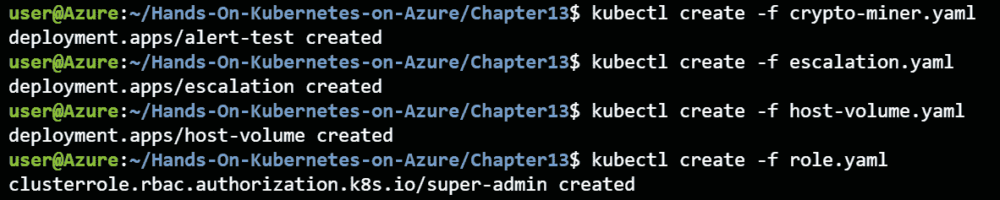

    图 13.8：创建有问题的工作负载

1.  现在，使用以下命令部署 Kubernetes 仪表盘：

    ```
    kubectl apply -f `https://raw.githubusercontent.com/kubernetes/dashboard/v2.0.0/aio/deploy/recommended.yaml`
    ```

    这将生成类似于*图 13.9*的输出：

    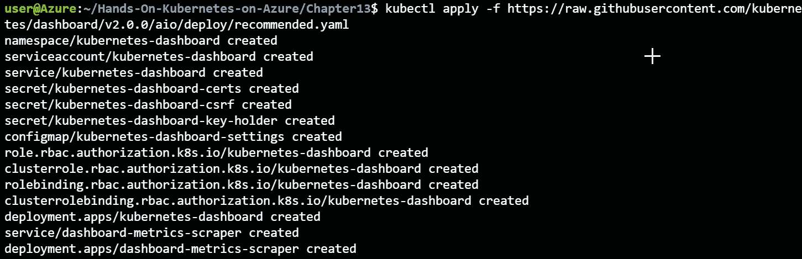

    图 13.9：创建 Kubernetes 仪表盘

1.  默认情况下，Kubernetes 仪表盘不会通过负载均衡器暴露。这也是推荐的配置，因为仪表盘可以广泛访问你的集群。然而，在本章中，你将创建这种不推荐的配置，以触发 Azure Defender 中的安全警报。要将负载均衡器添加到 Kubernetes 仪表盘，请使用以下命令：

    ```
    kubectl patch service \
      kubernetes-dashboard -n kubernetes-dashboard \
      -p '{"spec": {"type": "LoadBalancer"}}'
    ```

    这将修补服务并将其转换为 `LoadBalancer` 类型的服务。使用以下命令验证此修补是否成功，并获取服务的公共 IP 地址：

    ```
    kubectl get service -n kubernetes-dashboard
    ```

    这将生成类似于*图 13.10*的输出：

    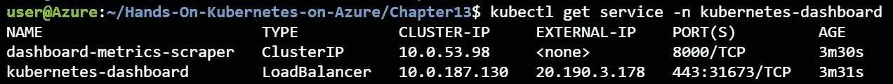

    图 13.10：获取 kubernetes-dashboard 服务的公共 IP

1.  验证你是否可以通过浏览器访问此服务，方法是浏览到 `https://<public IP>`。根据你的浏览器配置，你可能会遇到证书错误，可以通过选择“继续访问 <public IP>（不安全）”来绕过此错误，如*图 13.11*所示：

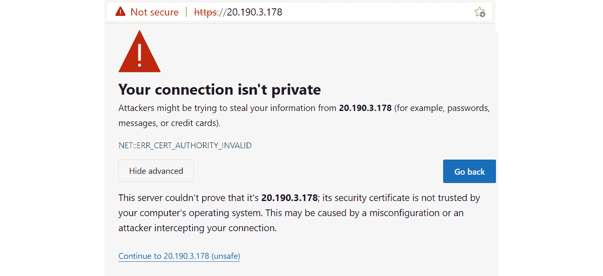

图 13.11：Kubernetes 仪表盘服务的证书安全警告

一旦继续进入仪表盘，你应该看到一个登录屏幕，如*图 13.12*所示：

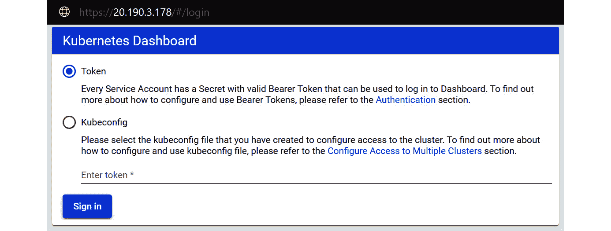

图 13.12：暴露的 Kubernetes 仪表盘

你在这里不会登录仪表盘，但如果你希望探索其功能，请参考 Kubernetes 文档，网址为 [`kubernetes.io/docs/tasks/access-application-cluster/web-ui-dashboard/`](https://kubernetes.io/docs/tasks/access-application-cluster/web-ui-dashboard/)。

你现在在集群中运行着五个有问题的工作负载。其中一些会在 Azure 安全中心中引发配置警告；另一些甚至会触发安全警报。你将在本章的接下来的两节中探索这些问题。

## 使用 Azure Secure Score 分析配置

在上一节中，你创建了几个故意配置错误的工作负载。在这一节中，你将回顾与这些工作负载相关的 Azure 安全中心推荐。

#### 注意

在工作负载创建后，可能需要最多 30 分钟时间，推荐和警报才会显示出来。

1.  在你创建了有问题的工作负载后，你将会在 Azure 安全中心中收到安全推荐。首先，在 Azure 安全中心的左侧导航中点击“安全评分”。这将显示一个类似于*图 13.13*的面板：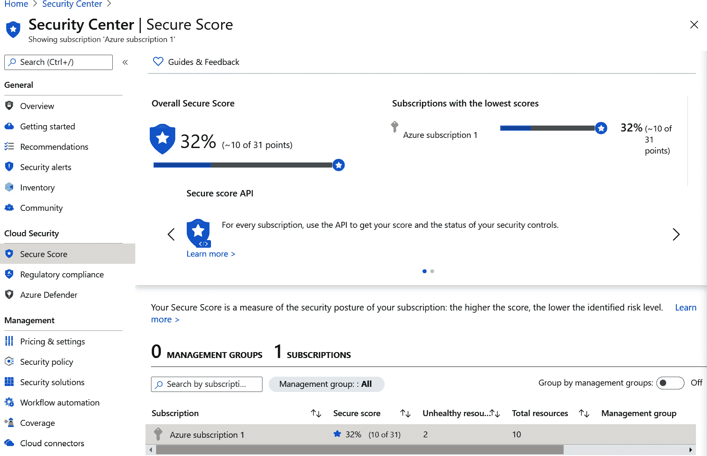

    图 13.13：Azure 安全中心中的安全评分

    这里显示的是你环境的安全态势概述。在*图 13.13*所示的示例中，你可以看到整体安全评分为 32%。如果你管理多个 Azure 订阅，这个视图可以为你提供一个快速的全局安全配置视图。

1.  让我们通过点击*图 13.13*底部的“Azure 订阅 1”订阅，深入了解 Kubernetes 集群的配置。这将带你进入一个与*图 13.14*类似的面板：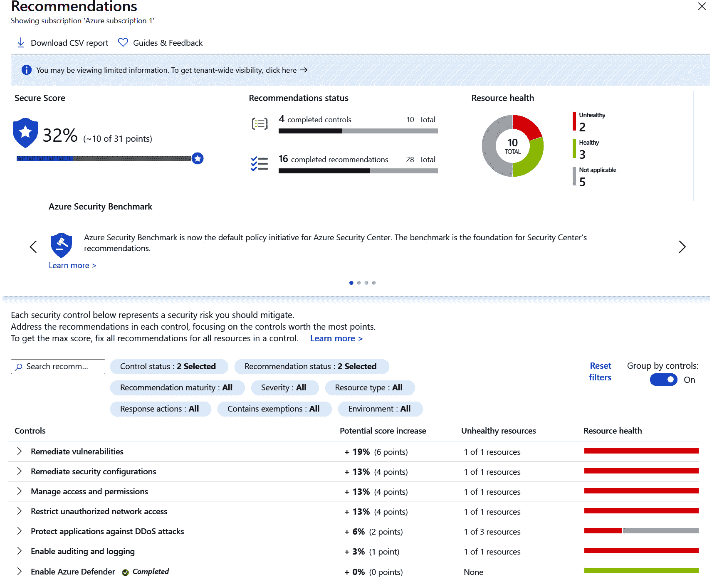

    图 13.14：订阅的安全评分详情

    这个视图包含了有关该订阅的安全评分的更多细节。它再次向你展示安全评分、推荐状态和资源健康状况。屏幕底部包含了有关具体推荐的更多信息。

1.  调整此屏幕，以便深入了解 Kubernetes 推荐。为此，请在屏幕右侧禁用“按控件分组”选项，并将资源类型过滤器设置为“托管集群”，如*图 13.15*所示：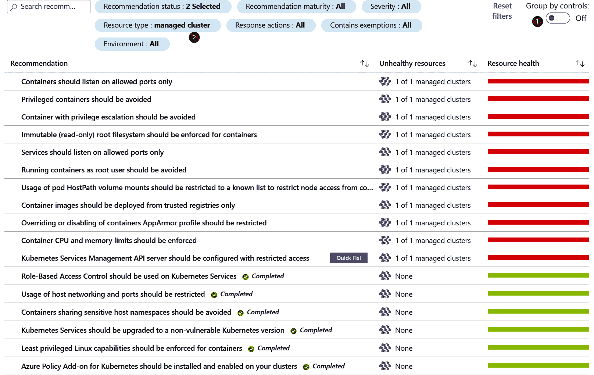

    图 13.15：Azure 安全中心中的 Kubernetes 推荐

    你现在正查看 Azure 安全中心推荐的 Kubernetes 安全推荐列表。该列表内容过于详细，无法在本章中完全涵盖，但如果你想了解每个推荐的更多细节，请参考 AKS 文档以获取更详细的描述：[`docs.microsoft.com/azure/aks/policy-reference`](https://docs.microsoft.com/azure/aks/policy-reference)

1.  然而，让我们探索一些由你之前创建的有问题的工作负载导致的推荐。从点击名为“应该避免具有特权提升的容器”推荐开始。这将带你进入一个与*图 13.16*类似的视图：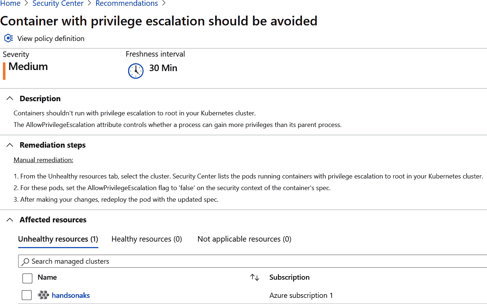

    图 13.16：“应该避免具有特权提升的容器”推荐详情

    如你所见，这个推荐包含了对推荐项本身的描述，以及一系列需要遵循的修复步骤。它还展示了受影响的资源，在本例中是 AKS 集群。如果你点击集群，甚至可以看到更多关于问题工作负载的细节，如*图 13.17*所示：

    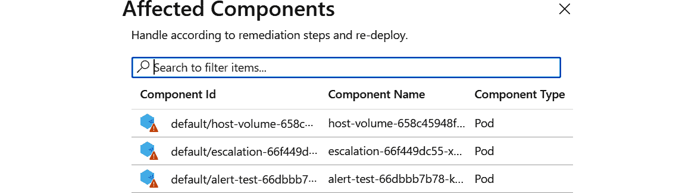

    图 13.17：受权限提升推荐影响的 Pods

    在这种情况下，你创建的每个 Pod 都触发了这个推荐，而不仅仅是允许权限提升的那个。这表明 Kubernetes 默认允许这种权限提升，因此你应该在所有部署中实施这一保护措施。这也展示了像 Azure 安全中心这样的安全监控解决方案的优势，用于监控默认配置可能带来的潜在副作用。

1.  让我们应用建议的修复措施来解决这个问题。为了解决权限提升问题，你需要配置容器的安全上下文，以不再允许权限提升。这可以通过使用以下命令更新每个部署来实现：

    ```
    kubectl patch deployment crypto-miner -p '
      {
        "spec": {
          "template": {
            "spec": {
              "containers": [
                {
                  "name": "mining",
                  "securityContext": {
                    "allowPrivilegeEscalation": false
                  }
                }
              ]
            }
          }
        }
      }
      '
    kubectl patch deployment escalation -p '
      {
        "spec": {
          "template": {
            "spec": {
              "containers": [
                {
                  "name": "nginx-escalation",
                  "securityContext": {
                    "allowPrivilegeEscalation": false
                  }
                }
              ]
            }
          }
        }
      }
      '
    kubectl patch deployment host-volume -p '
      {
        "spec": {
          "template": {
            "spec": {
              "containers": [
                {
                  "name": "nginx-host-volume",
                  "securityContext": {
                    "allowPrivilegeEscalation": false
                  }
                }
              ]
            }
          }
        }
      }
      '
    ```

    如命令中所示，你正在为每个部署打补丁。在每个补丁中，你配置了`securityContext`字段，并将`allowPrivilegeEscalation`字段设置为`false`。

    在你应用补丁之后，Azure 安全中心可能需要最多 30 分钟来刷新安全推荐。时间过后，你的集群应该会显示为此推荐的健康资源，如*图 13.18*所示：

    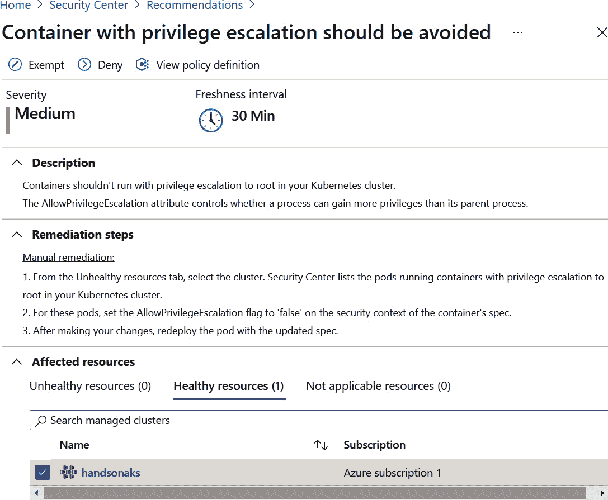

    图 13.18：集群现在对权限提升推荐是健康的

1.  让我们调查另一个推荐项，即名为“Pod HostPath 卷挂载的使用应限制在已知列表中，以限制受损容器对节点的访问”。点击此推荐项以查看更多细节，如*图 13.19*所示：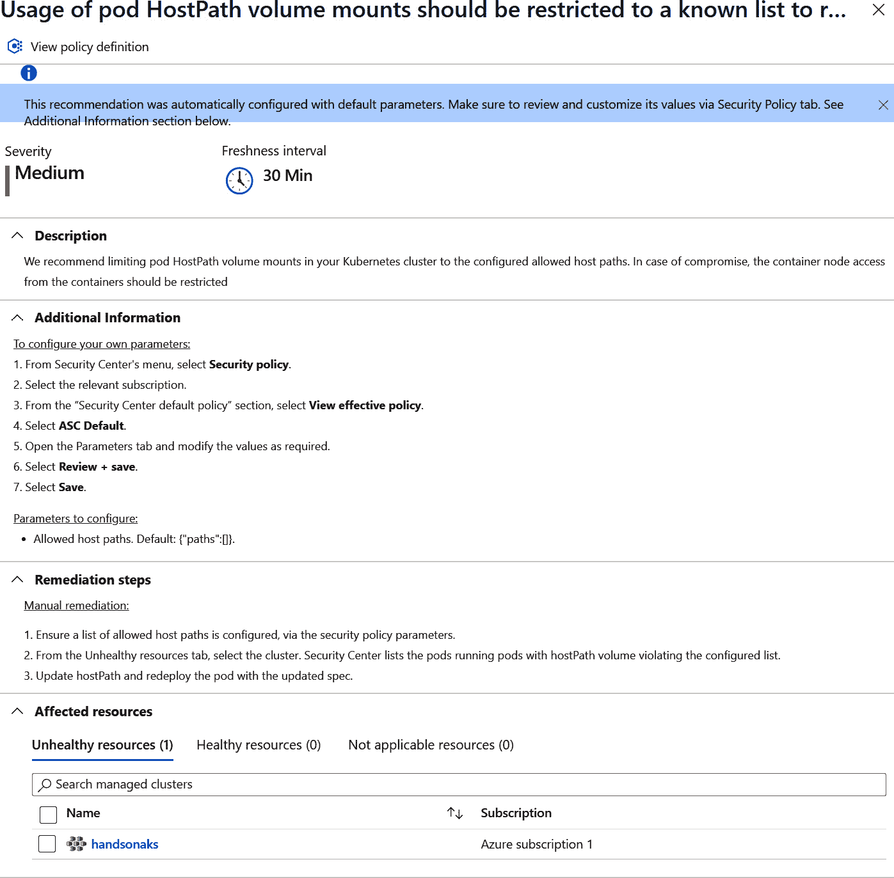

    图 13.19：更多关于 HostPath 推荐的细节

    这个推荐向你展示了类似于之前的推荐信息。然而，触发这个推荐的策略可以进行调整，以允许访问某些`HostPath`。让我们探索如何编辑策略以允许此操作。

1.  返回 Azure 安全中心主面板，在左侧点击“安全策略”。在弹出的面板中，点击你的订阅，然后点击显示在*图 13.20*中的 ASC 默认分配：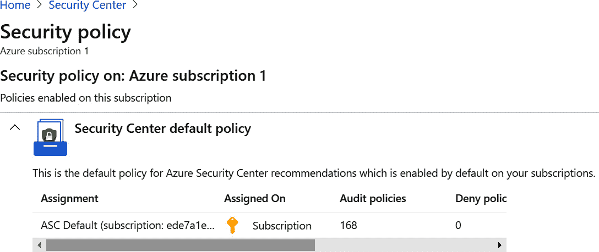

    图 13.20：ASC 默认策略分配

1.  在弹出的窗格中，点击屏幕顶部的“参数”选项。查找参数列表中的“允许的主机路径”，并将该参数更改为以下内容：

    ```
    {  "paths": ["/tmp"]}
    ```

    结果如 *图 13.21* 所示：

    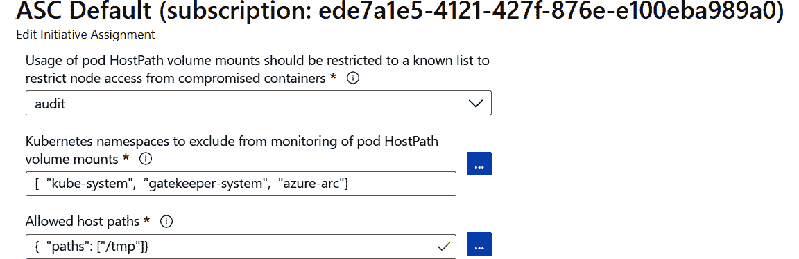

    图 13.21：将路径添加到允许的主机路径

    要应用更改，请点击屏幕底部的“审查 + 保存”，然后在最后一个屏幕上点击“保存”：

    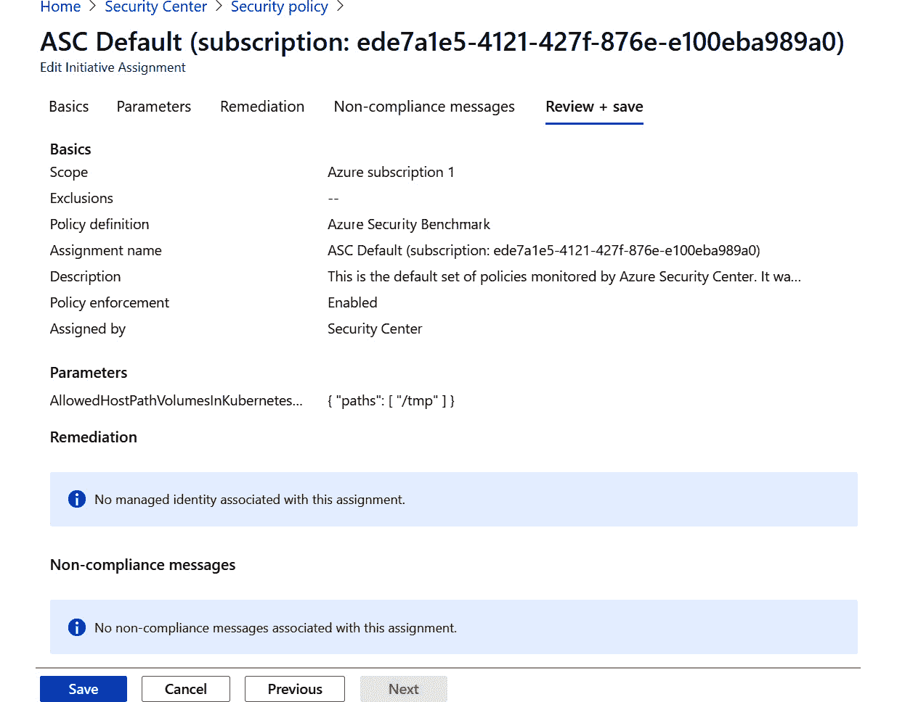

    图 13.22：点击保存以确认策略更改

    现在大约需要 30 分钟来刷新建议。30 分钟后，由于你已将 `/tmp` 路径设置为允许，此建议将不再有效。

1.  这个列表中还有一个值得特别提到的建议。那就是 Kubernetes 服务管理 API 服务器应配置为限制访问。如果你记得的话，在 *第十一章*，《AKS 网络安全》中，你已经为你的集群配置了授权的 IP 范围。微软建议这样做，并且它也会出现在 Azure 安全中心的建议中。点击该建议以获取更多详细信息，如 *图 13.23* 所示：

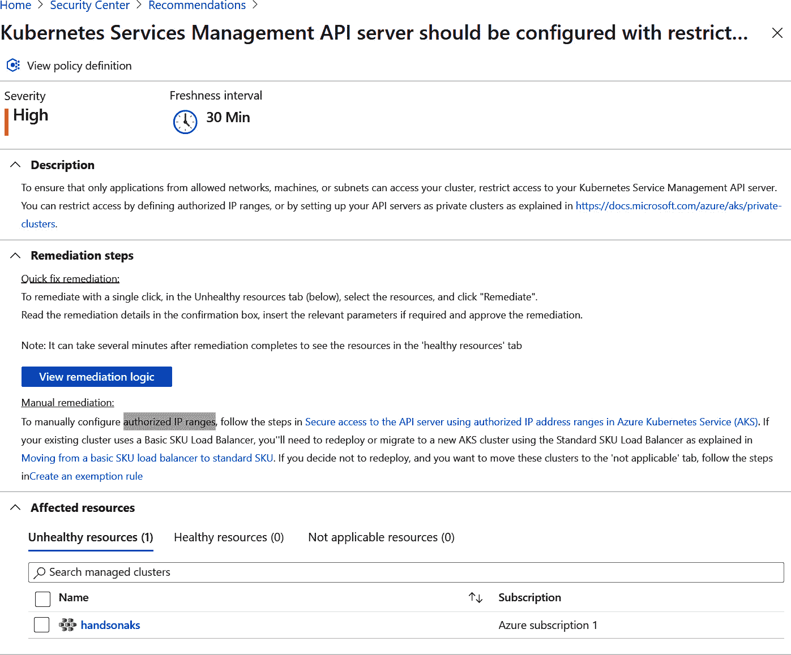

图 13.23：详细说明应启用授权 IP 范围

如你所见，你会再次看到建议和修复步骤的描述。之所以特别强调这个建议，是因为它在 Azure 安全中心内提供了一个快速修复方法。要快速修复此建议，选择你的 AKS 集群，然后点击屏幕底部的“修复”按钮，如 *图 13.24* 所示：

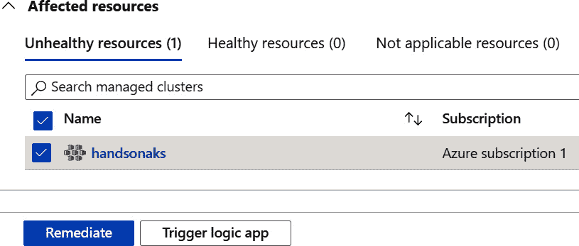

图 13.24：修复授权 IP 建议

这将显示一个类似 *图 13.25* 的视图，你可以在其中输入需要授权访问的 IP 范围。

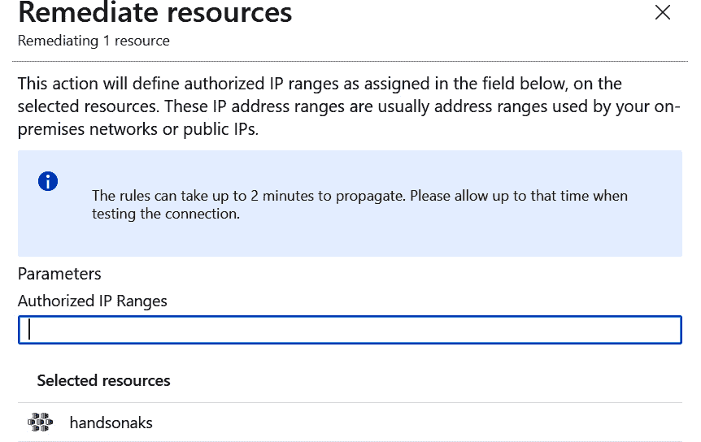

图 13.25：通过 Azure 安全中心设置授权的 IP 范围

你可以从 Azure 安全中心内配置这个设置。由于在接下来的步骤和章节中你将使用 Cloud Shell，而 Cloud Shell 并没有固定的 IP，因此在本书中操作时不建议应用此修复方法。不过，值得一提的是，Azure 安全中心允许你直接在安全中心内修复某些配置建议。

你现在已经查看了 Azure Security Center 中的建议和安全分数。如果你想了解更多内容，请参考 Azure 文档，文档中包含了一个完整配置了所有建议的 YAML 部署示例：https://docs.microsoft.com/azure/security-center/kubernetes-workload-protections。

## 使用 Azure Defender 中和威胁

现在你已经通过 Azure Security Center 和安全分数探索了配置最佳实践，你将探索如何调查和处理安全警报和主动威胁。你创建的一些工作负载应该已经触发了安全警报，你可以在 Azure Defender 中调查这些警报。

具体来说，在*部署违规工作负载*部分，你创建了三个会触发 Azure Defender 安全警报的工作负载：

+   `crypto-miner.yaml`：通过部署此文件，你在集群中创建了一个加密矿工。这个加密矿工将在 Azure Defender 中生成两个安全警报，如本节所示。一个警报将通过监控 Kubernetes 集群本身生成，另一个警报将基于 DNS 流量生成。

+   `role.yaml`：这个文件包含一个具有非常广泛权限的集群级角色。这将在 Azure Defender 中生成一个安全警报，通知你存在风险。

+   Kubernetes 仪表板：你还创建了 Kubernetes 仪表板并公开了它。Azure Defender 也会基于此生成一个安全警报。

让我们详细探索每一个安全警报：

1.  首先，在 Azure Security Center 中，点击左侧导航栏中的 Azure Defender。这将打开 Azure Security Center 中的 Azure Defender 面板，显示你的覆盖范围、安全警报和高级保护选项，如*图 13.26*所示。在本节中，你将重点关注生成的四个安全警报。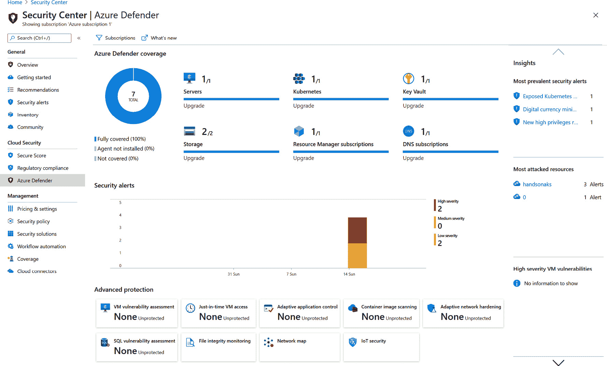

    图 13.26：Azure Defender - 概览面板

1.  要查看有关安全警报的更多详细信息，请点击屏幕中间的安全警报柱状图。这将带你到一个新面板，如*图 13.27*所示：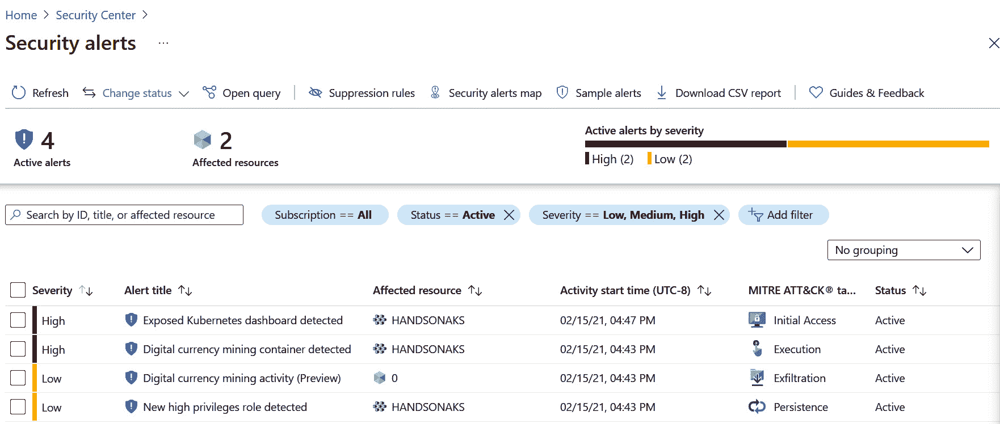

    图 13.27：Azure Defender 中的安全警报

    如*图 13.27*所示，四个安全警报已被触发：一个是暴露的 Kubernetes 仪表板，两个是加密矿工，另一个是高权限角色。我们将更详细地探索每个警报。

1.  我们首先探索检测到的暴露的 Kubernetes 仪表板警报。点击警报标题以获取更多详细信息。要查看所有细节，请点击结果面板中的“查看完整详情”，如*图 13.28*所示：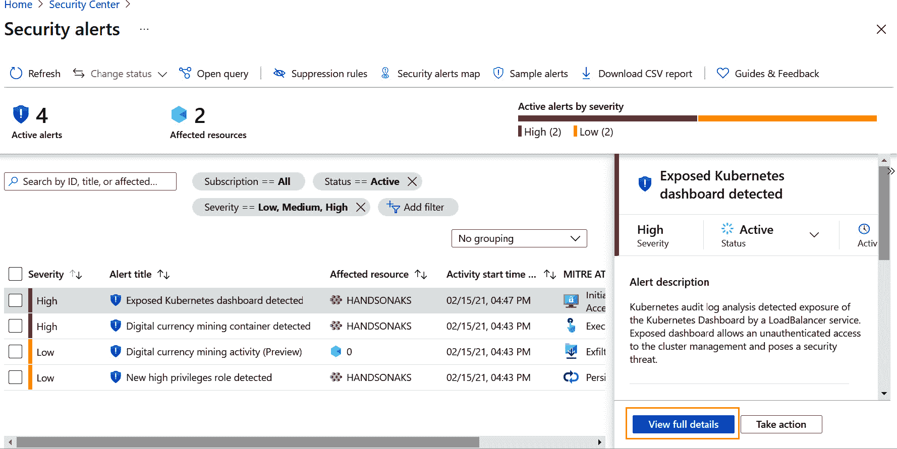

    图 13.28：获取警报的完整详情

    这将带你到一个新面板，如*图 13.29*所示：

    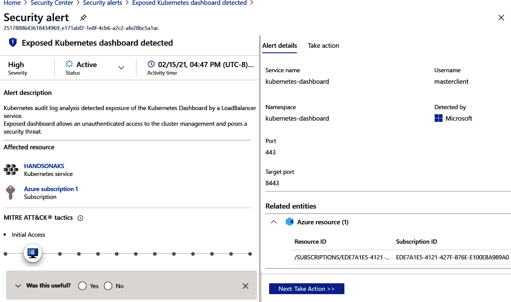

    图 13.29：暴露的 Kubernetes 仪表板检测到的警报详细信息

    这显示了几个信息点。首先，它将此警报分类为高严重性，标记为活动状态，并标记首次出现的时间。接下来，你将看到警报的描述，在此案例中，它解释了仪表板不应公开暴露。它还显示了受影响的资源。最后，你会看到该攻击针对的是 MITRE ATT&CK®战术框架中的哪个阶段。MITRE ATT&CK®战术框架描述了网络攻击的多个阶段。有关 MITRE ATT&CK®战术的更多信息，请参阅[`attack.mitre.org/versions/v7/`](https://attack.mitre.org/versions/v7/)。

    在屏幕的右侧，你将获得更多关于警报的详细信息。这些信息包括服务名称、命名空间、服务的端口、后端 Pod 上暴露的目标端口，以及受影响的 Azure 资源 ID 和订阅 ID。如果你点击屏幕底部的“下一步：采取行动 >>”按钮，你将进入一个新面板，如*图 13.30*所示：

    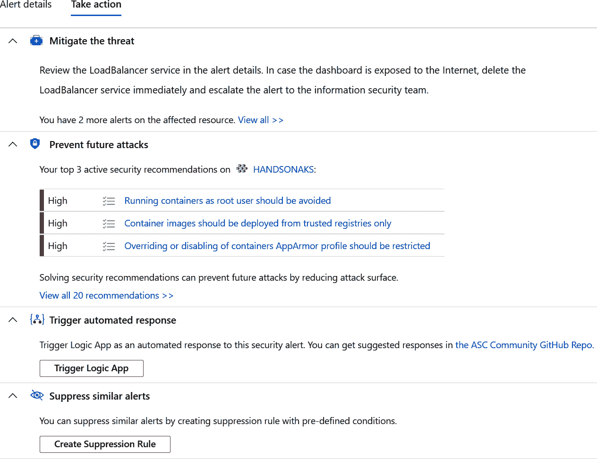

    图 13.30：仪表板警报的安全建议

    在操作面板中，你可以获得关于如何缓解威胁和如何防止未来类似攻击的信息。请注意，“防止未来攻击”部分包含了你在前一节中查看的安全建议的链接。

1.  让我们采取建议的行动，使用以下命令更新 Kubernetes 仪表板服务，使其不再是`LoadBalancer`类型。此命令将删除 Kubernetes 设置的通过负载均衡器暴露服务的`nodePort`，并将服务类型更改回仅在集群内部可用的`ClusterIP`类型。

    ```
    kubectl patch service \
      kubernetes-dashboard -n kubernetes-dashboard \
      -p '{
            "spec": {
              "ports": [
                {
                  "nodePort": null,
                  "port": 443
                }
              ],
              "type": "ClusterIP"
            }
          }'
    ```

    最后，你将看到可以选择触发自动响应或在未来抑制类似的警报，以防该警报是误报。

1.  现在你已经缓解了威胁，可以关闭该警报。这样，使用相同订阅的其他人就不会看到相同的警报。要关闭警报，请点击屏幕左侧的状态，选择“已关闭”，然后点击“确定”，如*图 13.31*所示：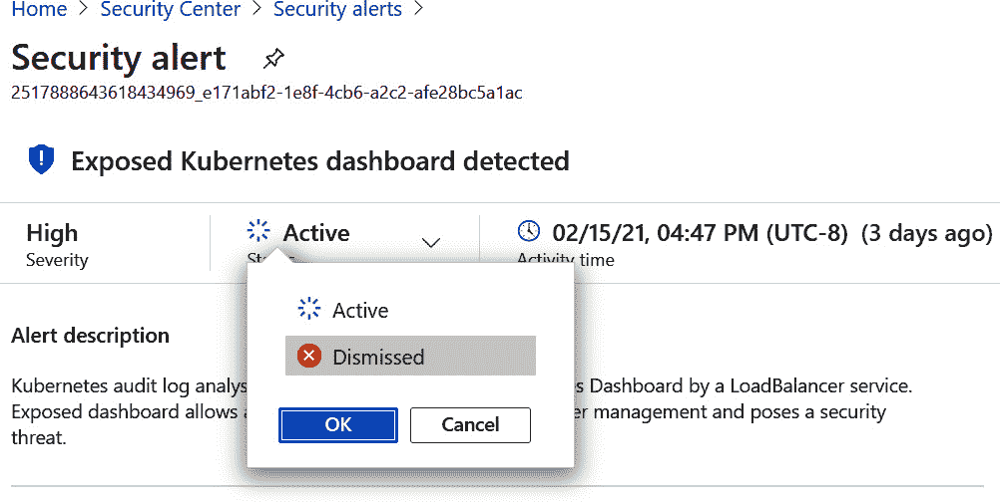

    图 13.31：关闭仪表板警报

1.  让我们继续查看下一个警报。通过点击屏幕顶部的 X 关闭仪表盘警报的详细窗格。现在让我们关注第一个“数字货币挖掘容器检测警报”。选择该警报并像之前一样点击“查看完整详情”。这将带你进入一个与*图 13.32*相似的窗格：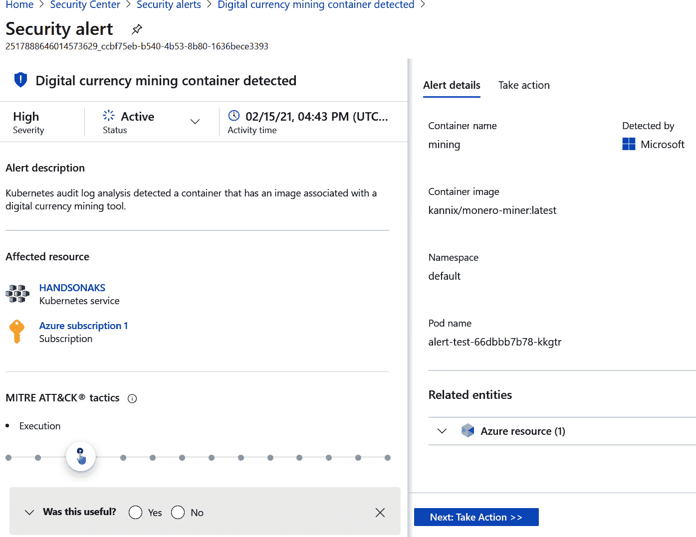

    图 13.32：数字货币挖掘容器检测警报的详情

    这个视图包含了与上一个警报类似的详细信息。正如你所看到的，这个警报属于 MITRE ATT&CK®策略框架中的“执行”阶段。在窗格的右侧，你现在可以看到受影响容器的名称、它使用的镜像、它的命名空间以及受影响 pod 的名称。

    如果你点击屏幕底部的“Next: Take Action >>”按钮，你将进入该警报的“Take action”视图，如*图 13.33*所示：

    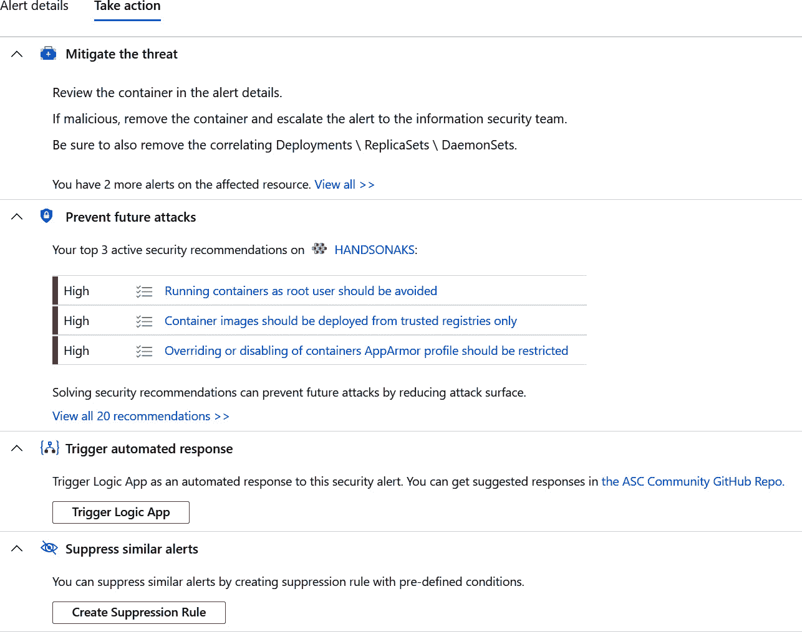

    图 13.33：数字货币挖掘容器检测警报的安全建议

    在这里，你再次看到与上一个警报类似的详细信息。在“缓解威胁”部分，你会看到如何缓解当前威胁的不同描述。暂时不要采取任何缓解措施，因为你还需要查看与加密矿工相关的另一个警报。

1.  要查看该警报，首先通过点击屏幕顶部的 X 关闭第一个加密矿工警报的详细窗格。现在选择第二个警报，名为“数字货币挖掘活动（预览）”。这实际上不是一个 Kubernetes 警报，而是一个基于 DNS 的警报，正如*图 13.34*所示：

    #### 注意

    ```
    kubectl delete -f crypto-miner.yaml
    ```

1.  这将解决警报。要真正标记为已解决，你可以在 Azure 门户中取消警报。为此，点击屏幕左侧的状态，选择“已取消”状态，然后点击“确定”，如*图 13.36*所示：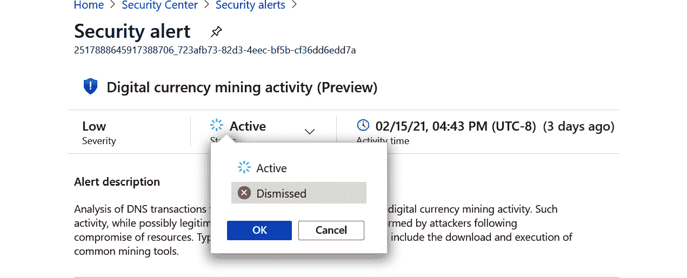

    图 13.36：取消数字货币 DNS 警报

1.  在安全警报窗格中，点击最后一个警报，名为“检测到新的高权限角色”，然后在出现的窗格中点击“查看完整详情”。这将带你进入一个与*图 13.37*相似的窗格：

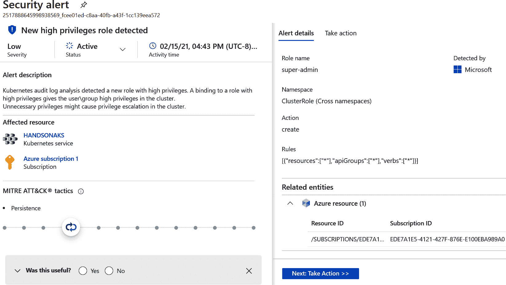

图 13.37：新的高权限角色检测警报

这是一个低严重性的警报。与之前的警报一样，你会看到描述、受影响的资源以及 MITRE ATT&CK®策略框架中的阶段，在这种情况下是“持久性”阶段。这意味着攻击者可能利用此潜在攻击获得对环境的持久访问权限。

在右侧，你还可以看到警报的详细信息，包括角色名称、命名空间（在本例中是整个集群，因为这是一个`ClusterRole`）以及该角色所授予的访问规则。如果你点击“下一步：采取行动 >>”按钮，你将看到有关缓解措施的更多信息，如*图 13.38*所示：

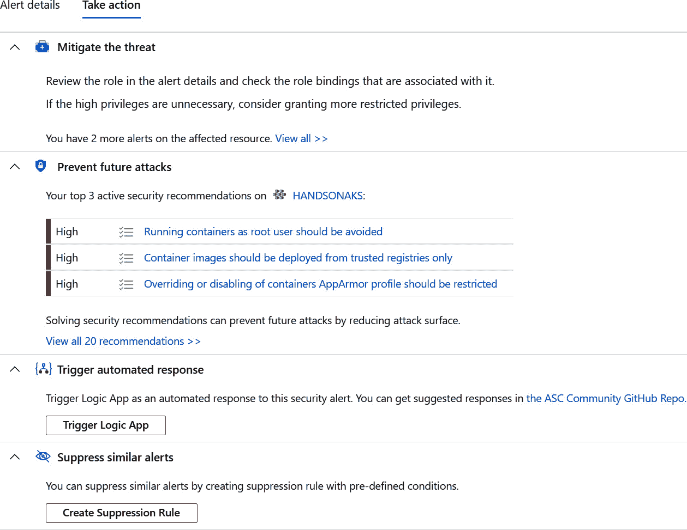

图 13.38：新的高权限警报上的安全建议

如你所见，Azure 建议你查看警报中的角色并检查与该角色关联的任何角色绑定。同时建议授予比该角色中提供的开放权限更为严格的权限。让我们使用以下命令从集群中移除这个威胁：

```
kubectl delete -f role.yaml
```

这将从集群中删除该角色。你还可以通过点击屏幕左侧的状态，选择“已取消”状态，并点击确定来取消此警报，如*图 13.39*所示：

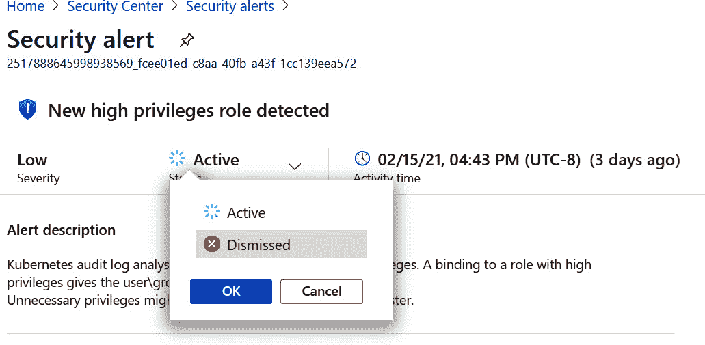

图 13.39：取消新的高权限警报

这涵盖了本章中你之前创建的资源所生成的所有警报。与警报相关的资源已经在修复过程中被删除，但让我们也删除本章中创建的其他资源：

```
kubectl delete -f escalation.yaml
kubectl delete -f host-volume.yaml
kubectl delete -f https://raw.githubusercontent.com/kubernetes/dashboard/v2.0.0/aio/deploy/recommended.yaml
```

本章内容到此结束。

## 总结

本章中，你探索了 Azure 安全中心和 Azure Defender。Azure 安全中心是一个基础设施安全监控平台，提供安全配置监控以及潜在正在进行的威胁监控。为了监控 Kubernetes 集群中的工作负载，Azure 安全中心利用了 Azure Policy for AKS。

首先，你启用了 AKS 的 Azure Policy。然后你在订阅中启用了 Azure 安全中心和 Azure Defender。

然后你在集群中创建了五个有害的工作负载。其中一些在 Azure 安全中心触发了配置建议，另一些甚至在 Azure Defender 中触发了安全警报。你查看了四个安全警报，并按照推荐的缓解步骤解决了这些警报。
