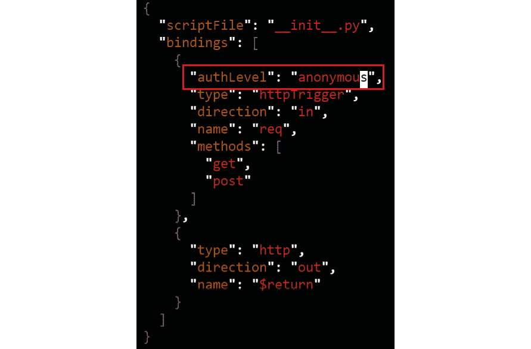

# 第十五章：14. 无服务器函数

由于可扩展性和减少管理开销，近年来无服务器计算和无服务器函数获得了巨大关注。Azure Functions、AWS Lambda 和 GCP Cloud Run 等云服务使用户可以轻松地将代码作为无服务器函数运行。

**无服务器**一词指的是任何不需要管理服务器的解决方案。无服务器函数是无服务器计算的一个子集，允许你按需运行代码作为函数。这意味着当有需求时，函数中的代码才会运行和执行。这种架构风格称为事件驱动架构。在事件驱动架构中，当发生事件时，事件消费者会被触发。在无服务器函数的情况下，事件消费者就是这些无服务器函数。事件可以是从队列中的一条消息到上传到存储的新对象，甚至是一个 HTTP 调用。

无服务器函数通常用于后台处理。一个常见的无服务器函数示例是创建上传到存储的图片的缩略图，如*图 14.1*所示。由于你无法预测会有多少图片被上传以及何时上传，因此很难规划传统基础设施以及需要多少服务器来处理这个过程。如果你将生成缩略图的过程实现为无服务器函数，那么每上传一张图片，该函数就会被调用。你无需规划函数的数量，因为每张新图片都会触发一个新的函数执行。


图 14.1：生成图片缩略图的无服务器函数示例架构

正如你在之前的示例中看到的，函数会自动扩展以应对增加或减少的需求。此外，每个函数可以独立于其他函数进行扩展。然而，这种自动扩展只是使用无服务器函数的一个好处。无服务器函数的另一个好处是开发的简便性。使用无服务器函数，你可以专注于编写代码，而无需处理底层基础设施。无服务器函数允许代码在无需担心管理服务器和中间件的情况下进行部署。最后，在公共云无服务器函数中，你按每次执行函数计费。这意味着你每次函数运行时都需要付费，而在函数未运行时，你不会为闲置时间收费。

公有云无服务器函数平台的流行促使了多个开源框架的出现，这些框架使用户能够在 Kubernetes 上创建无服务器函数。在本章中，你将学习如何直接使用 Azure Functions 的开源版本在 **Azure Kubernetes Service** (**AKS**) 上部署无服务器函数。你将从运行一个基于 HTTP 消息触发的简单函数开始。之后，你将安装一个 **autoscaler** 功能到你的集群中。你还将把 AKS 部署的应用程序与 Azure 存储队列集成。我们将涵盖以下主题：

+   不同函数平台概览

+   部署一个 HTTP 触发的函数

+   部署队列触发的函数

本章将从探索 Kubernetes 上可用的各种函数平台开始。

## 各种函数平台

函数平台，如 Azure Functions、AWS Lambda 和 Google Cloud Functions，已经获得了巨大的普及。能够在无需管理服务器的情况下运行代码，并且几乎可以实现无限扩展，非常受欢迎。使用云服务商的函数实现的缺点是，你被锁定在该云服务商的基础设施和编程模型中。此外，你只能在公有云中运行函数，不能在自己的数据中心运行。

为了解决这些缺点，推出了多个开源的函数框架。现在有多个受欢迎的框架可以在 Kubernetes 上运行：

+   **Knative** (https://cloud.google.com/knative/): Knative 是一个由 Google 开发的、使用 Go 语言编写的无服务器平台。你可以将 Knative 函数完全托管在 Google Cloud 上运行，或者在你自己的 Kubernetes 集群上运行。

+   `OpenFaaSCloud`。该平台使用 Go 语言编写。

+   `Kubeless`。

+   **Fission.io** (https://fission.io/): Fission 是一个由 Platform9 公司支持的无服务器框架。它使用 Go 语言编写，并且是 Kubernetes 原生的。它可以在任何 Kubernetes 集群上运行。

+   **Apache OpenWhisk** (https://openwhisk.apache.org/): OpenWhisk 是由 Apache 组织维护的开源分布式无服务器平台。它可以在 Kubernetes、Mesos 或 Docker Compose 上运行。主要使用 Scala 语言编写。

微软在其函数平台上采取了一种有趣的策略。微软将 Azure Functions 作为 Azure 上的托管服务进行运营，并且已将完整的解决方案开源，允许在任何系统上运行（https://github.com/Azure/azure-functions-host）。这也使得 Azure Functions 编程模型能够在 Kubernetes 上运行。

微软还与 Red Hat 合作发布了一个额外的开源项目，名为 **Kubernetes 事件驱动自动扩展** (**KEDA**)，旨在简化 Kubernetes 上函数的扩展操作。KEDA 是一个自定义的自动扩展器，允许 Kubernetes 上的部署从零个 Pod 扩展到任意数量的 Pod，这在 Kubernetes 的默认 **水平 Pod 自动扩展器** (**HPA**) 中是无法实现的。从零扩展到一个 Pod 是非常重要的，因为这样应用程序可以开始处理事件，而扩展到零实例对于在集群中节省资源也非常有用。KEDA 还为 Kubernetes HPA 提供了额外的度量标准，以便基于来自集群外部的度量（例如队列中的消息数）做出扩展决策。

#### 注意

我们在 *第四章*，*构建可扩展应用程序* 中介绍并解释了 HPA。

在本章中，你将通过两个示例将 Azure Functions 部署到 Kubernetes 上：

+   一个 HTTP 触发的函数（不使用 KEDA）

+   一个队列触发的函数（使用 KEDA）

在开始这些函数之前，下一节将考虑这些部署所需的必要前提条件。

## 设置前提条件

在本节中，你将设置在 Kubernetes 集群上构建和运行函数所需的前提条件。你需要在 Azure 中设置一个 **Azure 容器注册表** (**ACR**) 和一个用于开发函数的 **虚拟机** (**VM**)。ACR 将用于存储包含你将要开发的函数的自定义容器镜像。你还将使用虚拟机来构建这些函数并创建 Docker 镜像，因为你不能通过 Azure Cloud Shell 来执行此操作。

容器镜像和容器注册表在 *第一章*，*容器与 Kubernetes 简介* 中的 *容器镜像* 部分介绍过。容器镜像包含启动实际运行容器所需的所有软件。在本章中，你将构建包含函数的自定义容器镜像。你需要一个存储这些镜像的地方，以便 Kubernetes 可以拉取它们并按需扩展运行容器。你将使用 ACR 来实现这一点。ACR 是一个由 Azure 完全管理的私有容器注册表。

到目前为止，本书中的所有示例都在 Azure Cloud Shell 上运行。对于本章的示例，你需要一个单独的虚拟机，因为 Azure Cloud Shell 不允许你构建容器镜像。你将需要在 Azure 中创建一个新的虚拟机来执行这些任务。

让我们从创建一个 ACR 开始。

### Azure 容器注册表

Azure Functions 在 Kubernetes 上需要一个镜像注册表来存储其容器镜像。在本节中，你将创建一个 ACR，并配置 Kubernetes 集群以访问该注册表：

1.  在 Azure 搜索栏中，搜索 `container registry`，然后点击容器注册表，如 *图 14.2* 所示：

    图 14.2：通过 Azure 门户导航到容器注册表服务

1.  点击顶部的“添加”按钮以创建新的注册表。为了将本章中的资源组织在一起，创建一个新的资源组。为此，在资源组字段下点击“创建新资源组”以创建一个新的资源组，并将其命名为 `Functions-KEDA`，如 *图 14.3* 所示：

    图 14.3：创建新的资源组

    提供创建注册表的详细信息。注册表名称需要全局唯一，因此可以考虑在注册表名称中添加你的首字母。建议在与集群相同的位置创建注册表。为了减少演示成本，可以将 SKU 更改为 Basic。选择底部的“审核 + 创建”按钮以创建注册表，如 *图 14.4* 所示：

    

    图 14.4：提供创建注册表的详细信息

    在结果窗格中，点击“创建”按钮以创建注册表。

1.  注册表创建完成后，打开 Cloud Shell，这样你就可以配置 AKS 集群以访问容器注册表。使用以下命令为 AKS 提供访问注册表的权限：

    ```
    az aks update -n handsonaks \
    -g rg-handsonaks --attach-acr <acrName>
    ```

    这将返回类似于 *图 14.5* 的输出。图像已被裁剪，仅显示输出的顶部部分：


图 14.5：允许 AKS 集群访问容器注册表

现在，你已经拥有了与 AKS 集成的 ACR。在下一部分，你将创建一个虚拟机，用于构建 Azure 函数。

### 创建虚拟机

在本节中，你将创建虚拟机并安装在该机器上运行 Azure 函数所需的工具：

+   Docker 运行时

+   Azure CLI

+   Azure 函数

+   Kubectl

    #### 注意

    为确保一致的体验，你将在 Azure 上创建一个虚拟机，用于开发。如果你更喜欢在本地机器上运行示例，可以在本地安装所有必需的工具。

让我们开始创建虚拟机：

1.  为了确保这个示例能在 Azure 试用订阅中运行，你需要将集群缩放到一个节点。你可以使用以下命令来做到这一点：

    ```
    az aks scale -n handsonaks -g rg-handsonaks --node-count 1
    ```

1.  要对你将创建的虚拟机进行身份验证，你需要一组 SSH 密钥。如果你按照 *第九章* 中的示例操作，在 *使用 AAD Pod 管理身份设置新集群* 部分的 *Azure Active Directory Pod 管理身份* 中，你已经拥有了一组 SSH 密钥。要验证你是否拥有 SSH 密钥，运行以下命令：

    ```
    ls ~/.ssh
    ```

    这应该会显示 SSH 私钥（`id_rsa`）和公钥（`id_rsa.pub`）的存在，如 *图 14.6* 所示：

    

    ```
    ssh-keygen
    ```

    系统会提示你输入位置和密码短语。保留默认位置，并输入一个空的密码短语。

1.  现在，你将创建虚拟机。使用以下命令创建一个 Ubuntu 虚拟机：

    ```
    az vm create -g Functions-KEDA -n devMachine \
      --image UbuntuLTS --ssh-key-value ~/.ssh/id_rsa.pub \
      --admin-username handsonaks --size Standard_D1_v2
    ```

1.  这需要几分钟时间完成。一旦虚拟机创建完成，Cloud Shell 应该会显示其公共 IP 地址，如 *图 14.7* 中所示：

    ```
    ssh handsonaks@<public IP>
    ```

    系统将提示您是否信任该机器的身份。键入 `yes` 以确认。

1.  您现在已连接到 Azure 上的新虚拟机。在这台机器上，我们将首先安装 Docker：

    ```
    sudo apt-get update
    sudo apt-get install docker.io -y
    sudo systemctl enable docker
    sudo systemctl start docker
    ```

1.  为了使操作更加顺畅，将用户添加到 Docker 组。这将确保您能够在不使用 `sudo` 的情况下运行 Docker 命令：

    ```
    sudo usermod -aG docker handsonaks
    newgrp docker
    ```

    现在，您应该能够运行 `hello-world` 命令：

    ```
    docker run hello-world
    ```

    这将显示与 *图 14.8* 类似的输出：

    

    图 14.8：验证 Docker 是否在虚拟机上运行

1.  接下来，您将在此虚拟机上安装 Azure CLI。您可以使用以下命令安装 CLI：

    ```
    curl -sL https://aka.ms/InstallAzureCLIDeb | sudo bash
    ```

1.  通过登录来验证 CLI 是否成功安装：

    ```
    az login
    ```

    这将显示一个登录代码，您需要在 https://microsoft.com/devicelogin 输入该代码：

    

    ```
    az acr login -n <registryname>
    ```

    ACR 的凭证在 3 小时后过期。如果在演示过程中遇到以下错误，您可以使用以下命令重新登录 ACR：

    

    图 14.10：未来可能出现的身份验证错误

1.  接下来，您将在您的机器上安装 `kubectl`。Azure CLI 提供了一个安装 CLI 的快捷方式，您可以使用它来安装：

    ```
    sudo az aks install-cli
    ```

    让我们验证 `kubectl` 是否能连接到我们的集群。为此，我们首先获取凭证，然后执行 `kubectl` 命令：

    ```
    az aks get-credentials -n handsonaks -g rg-handsonaks
    kubectl get nodes
    ```

1.  现在，您可以在此机器上安装 Azure Functions 工具。为此，请运行以下命令：

    ```
    wget -q https://packages.microsoft.com/config/ubuntu/18.04/packages-microsoft-prod.deb
    sudo dpkg -i packages-microsoft-prod.deb
    sudo apt-get update
    sudo apt-get install azure-functions-core-tools-3 -y
    ```

    这将返回类似于 *图 14.11* 的输出：


图 14.11：安装 Functions 核心工具

#### 注意

如果您使用的是比 18.04 更新的 Ubuntu 版本，请确保通过更改第一行中的 URL 以匹配您的 Ubuntu 版本，来下载正确的 `dpkg` 包。

现在，您已具备开始在 Kubernetes 上使用函数的先决条件。您已经创建了一个 ACR 用于存储自定义容器镜像，并且拥有一台将用于创建和构建 Azure 函数的虚拟机。在下一部分，您将构建第一个函数，它是 HTTP 触发的。

## 创建一个 HTTP 触发的 Azure 函数

在这个第一个示例中，您将创建一个 HTTP 触发的 Azure 函数。这意味着您可以浏览到托管实际函数的页面：

1.  首先，创建一个新目录并导航到该目录：

    ```
    mkdir http
    cd http
    ```

1.  现在，您将使用以下命令初始化一个函数：

    ```
    func init --docker
    ```

    `––docker` 参数指定您将把函数构建为 Docker 容器。这将导致生成一个 Dockerfile。选择 Python 语言，这是下图中的选项 3：

    

    图 14.12：创建 Python 函数

    这将创建使函数能够工作的所需文件。

1.  接下来，你将创建实际的函数。请输入以下命令：

    ```
    func new
    ```

    这应该会产生如下输出。选择第八个选项，HTTP 触发器，并将函数命名为`python-http`：

    

    图 14.13：创建 HTTP 触发的函数

1.  函数的代码存储在名为`python-http`的目录中。你不需要对这个函数进行代码更改。如果你想查看该函数的源代码，可以运行以下命令：

    ```
    cat python-http/__init__.py
    ```

1.  你需要对函数的配置文件进行一次修改。默认情况下，函数需要经过认证的请求。为了本次演示，你将此设置更改为`anonymous`。通过执行以下命令使用`vi`命令进行修改：

    ```
    vi python-http/function.json
    ```

    在*第 5 行*将`authLevel`替换为`anonymous`。要进行此更改，请按*I*进入插入模式，然后删除`function`并用`anonymous`替换：

    

    图 14.14：将 authLevel 函数更改为 anonymous

    按下*Esc*键，输入`:wq!`，然后按*Enter*键保存并退出`vi`。

    #### 注意

    你已将函数的认证要求更改为`anonymous`。这样做会使演示更易于执行。如果你计划将函数发布到生产环境，需要仔细考虑此设置，因为它控制了谁可以访问你的函数。

1.  现在，你已准备好将函数部署到 AKS。你可以使用以下命令部署该函数：

    ```
    func kubernetes deploy --name python-http \
    --registry <registry name>.azurecr.io
    ```

    这将导致函数运行时执行几个步骤。首先，它会构建一个容器镜像，然后将该镜像推送到注册表，最后，它将函数部署到 Kubernetes：

    

    图 14.15：将函数部署到 AKS

    你可以点击显示的 Invoke url URL 来访问你的函数。不过，在执行此操作之前，让我们先了解一下在集群上创建的内容。

1.  为了创建这个函数，使用了一个常规的 Kubernetes 部署。要检查部署状态，你可以运行以下命令：

    ```
    kubectl get deployment
    ```

    这将展示你的部署，如*图 14.16*所示：

    

    图 14.16：部署详细信息

1.  该过程还在 Kubernetes 集群上创建了一个服务。你可以获取已部署服务的公共 IP，并连接到它：

    ```
    kubectl get service
    ```

    这将展示服务及其公共 IP，如*图 14.17*所示。请注意，这个公共 IP 与*步骤 4*中输出的 IP 是相同的。


图 14.17：获取服务的公共 IP

打开浏览器并访问`http://<external-ip>/api/python-http?name=handsonaks`。您应该看到一个网页，显示“Hello, handsonaks. This HTTP triggered function executed successfully.” 这在*图 14.18*中展示：


图 14.18：HTTP 触发函数的输出

现在，您已经创建了一个带有 HTTP 触发器的函数。使用 HTTP 触发的函数在负载模式不可预测的情况下提供 HTTP API 时非常有用。在进入下一节之前，让我们清理一下这个部署：

```
kubectl delete deployment python-http-http
kubectl delete service python-http-http
kubectl delete secret python-http
```

在本节中，您使用 HTTP 触发器创建了一个示例函数。让我们进一步提升，将一个新函数与存储队列集成，并在下一节中设置 KEDA 自动扩缩容。

## 创建队列触发的函数

在上一节中，您创建了一个示例 HTTP 函数。在本节中，您将构建另一个示例，使用队列触发的函数。队列常用于在应用程序的不同组件之间传递消息。可以根据队列中的消息触发函数，从而对这些消息执行额外的处理。

在本节中，您将创建一个与 Azure 存储队列集成的函数，以处理事件。您还将配置 KEDA，以便在流量较低时允许自动扩缩容，达到零 Pods。

让我们开始在 Azure 中创建一个队列。

### 创建队列

在本节中，您将创建一个新的存储帐户，并在该存储帐户中创建一个新队列。您将在下一节*创建队列触发的函数*中将函数连接到该队列。

1.  首先，创建一个新的存储帐户。在 Azure 搜索栏中搜索`storage accounts`并选择存储帐户：

    图 14.19：通过 Azure 门户导航到存储帐户服务

1.  点击顶部的 + 新建按钮，创建一个新的存储帐户。提供创建存储帐户的详细信息。存储帐户名称必须是全局唯一的，因此可以考虑添加您的首字母。建议将存储帐户创建在与您的 AKS 集群相同的区域。最后，为了节省成本，建议将复制设置降级为本地冗余存储（LRS），如*图 14.20*所示：

    图 14.20：提供详细信息以创建存储帐户

    准备好后，点击底部的“审核 + 创建”按钮。在弹出的屏幕中，选择“创建”开始创建过程。

1.  创建存储账户大约需要一分钟。一旦创建完成，点击“转到资源”按钮打开该账户。在存储账户面板中，选择左侧导航栏中的“访问密钥”，点击“显示密钥”，并复制主连接字符串，如*图 14.21*所示。暂时记下这个字符串：

    图 14.21：复制主连接字符串

    #### 注意

    对于生产用例，不建议使用访问密钥连接到 Azure 存储。任何拥有该访问密钥的用户都可以完全访问存储账户，并可以读取和删除其中的所有文件。建议生成**共享访问签名**（**SAS**）令牌来连接到存储，或使用 Azure AD 集成的安全性。要了解更多关于 SAS 令牌身份验证的信息，请参阅 https://docs.microsoft.com/rest/api/storageservices/delegate-access-with-shared-access-signature。要了解更多关于 Azure AD 身份验证到 Azure 存储的信息，请参阅 https://docs.microsoft.com/rest/api/storageservices/authorize-with-azure-active-directory。

1.  最后一步是创建我们的队列存储账户。在左侧导航栏中查找`queue`，点击+ Queue 按钮添加一个队列，并为其提供名称。为了跟随本演示，使用`function`作为队列名称：


图 14.22：创建一个新队列

你现在已经在 Azure 中创建了一个存储账户，并且拥有了它的连接字符串。你还在该存储账户中创建了一个队列。在下一部分，你将创建一个函数来消费队列中的消息。

### 创建一个队列触发的函数

在上一部分中，你已经在 Azure 中创建了一个队列。在本节中，你将创建一个新的函数来监视此队列并从队列中删除消息。你需要使用该队列的连接字符串来配置此函数：

1.  在虚拟机中，首先创建一个新目录并导航到该目录：

    ```
    cd ..
    mkdir js-queue
    cd js-queue
    ```

1.  现在我们可以创建函数了。我们将从初始化开始：

    ```
    func init --docker
    ```

    现在，它将询问你两个问题。对于运行时，选择 node（选项 2），对于语言，选择 JavaScript（选项 1）。这应该会显示在*图 14.23*中所示的输出：

    

    ```
    func new
    ```

    这将要求你选择一个触发器。选择 Azure 队列存储触发器（选项 10）。为新的函数命名为`js-queue`。这应该会显示在*图 14.24*中所示的输出：

    

    图 14.24：创建一个队列触发的函数

1.  现在，你需要进行一些配置更改。你需要为你创建的函数提供连接字符串到 Azure 存储，并提供队列名称。首先，打开`local.settings.json`文件来配置存储的连接字符串：

    ```
    vi local.settings.json
    ```

    按照以下步骤进行更改：

    +   按 *I* 进入插入模式。

    +   将 `AzureWebJobsStorage` 的连接字符串替换为您之前复制的连接字符串，并在该行末尾添加逗号。

    +   添加一行并在该行中添加以下文本：

    ```
    "QueueConnString": "<your connection string>"
    ```

    结果应类似于 *图 14.25*：

    

    图 14.25：编辑 local.settings.json 文件

    +   按 *Esc* 键保存并关闭文件，输入 `:wq!`，然后按 *Enter*。

1.  接下来需要编辑的文件是函数的配置文件。在此，您将引用之前的连接字符串，并提供我们在 *创建队列* 部分中选择的队列名称。为此，请使用以下命令：

    ```
    vi js-queue/function.json
    ```

    按照以下步骤进行更改：

    +   按 *I* 进入插入模式。

    +   将队列名称更改为您创建的队列的名称（`function`）。

    +   接下来，将 `QueueConnString` 添加到 `connection` 字段中。

    您的配置现在应该类似于 *图 14.26*：

    

    图 14.26：编辑 js-queue/function.json 文件

    +   按 *Esc* 键保存并关闭文件，输入 `:wq!`，然后按 *Enter*。

1.  现在，您已准备好将函数发布到 Kubernetes。首先，您需要在 Kubernetes 集群上设置 KEDA：

    ```
    kubectl create ns keda
    func kubernetes install --keda --namespace keda
    ```

    这应返回类似于 *图 14.27* 的输出：

    

    ```
    kubectl get pod -n keda
    ```

    这应返回类似于 *图 14.28* 的输出：

    

    图 14.28：验证 KEDA 安装是否成功

1.  现在，您可以将函数部署到 Kubernetes。您将配置 KEDA 每 5 秒查看一次队列消息的数量（`polling-interval=5`），最多允许 15 个副本（`max-replicas=15`），并在移除 Pod 前等待 15 秒（`cooldown-period=15`）。要以这种方式部署和配置 KEDA，请使用以下命令：

    ```
    func kubernetes deploy --name js-queue \
    --registry <registry name>.azurecr.io \
    --polling-interval=5 --max-replicas=15 --cooldown-period=15
    ```

    这将返回类似于 *图 14.29* 的输出：

    

    ```
    kubectl get all
    ```

    这将展示您已部署的所有资源。如 *图 14.30* 所示，设置过程中创建了部署、ReplicaSet 和 HPA。在 HPA 中，您应该看到当前没有副本在运行：

    

    图 14.30：验证设置创建的对象

1.  现在，您将创建一条消息以触发 KEDA 并创建一个 Pod。要查看扩展事件，运行以下命令：

    ```
    kubectl get hpa -w
    ```

1.  要在队列中创建一条消息，我们将使用 Azure 门户。打开您之前创建的存储中的队列，点击屏幕顶部的 + 添加消息按钮，创建一条测试消息，然后点击 OK。如 *图 14.31* 所示：


图 14.31：向队列添加消息

创建完这条消息后，查看你之前执行的命令的输出。可能需要几秒钟，但很快，你的 HPA 应该会扩展到一个副本。之后，它还应该会缩减回零副本：


图 14.32：KEDA 从 0 扩展到 1，再缩减回 0 副本

这向你展示了 KEDA 如何使 Kubernetes HPA 在队列中有消息时从零扩展到一个 Pod，当这些消息被处理后，又从一个 Pod 缩减到零 Pod。

你现在已经创建了一个由队列中添加的消息触发的函数。你已经验证了，当你在队列中创建消息时，KEDA 将 Pod 从 0 扩展到 1，而当队列中没有消息时，它又会缩减回 0。在下一部分，你将执行扩展测试，创建多个消息到队列中，观察函数如何反应。

### 扩展测试功能

在上一部分，你看到了当队列中有一条消息时，函数是如何反应的。在这个示例中，你将向队列发送 1,000 条消息，看看 KEDA 是如何首先扩展函数，然后再缩减，并最终缩减回零的：

1.  在当前的 Cloud Shell 中，使用以下命令观察 HPA：

    ```
    kubectl get hpa -w
    ```

1.  要开始推送消息，你需要打开一个新的 Cloud Shell 会话。要打开新会话，在 Cloud Shell 中选择“Open new session”按钮：

    ```
    pip install azure-storage-queue==12.1.5
    ```

    安装完毕后，你需要为这个脚本提供你的存储帐户连接字符串。为此，使用以下命令打开文件：

    ```
    code sendMessages.py
    ```

    编辑*第 8 行*中的存储连接字符串为你的连接字符串：

    

    图 14.34：在第 8 行粘贴你的存储帐户连接字符串

1.  一旦你粘贴了连接字符串，你可以执行 Python 脚本并向队列发送 1,000 条消息：

    ```
    python sendMessages.py
    ```

    在消息发送的过程中，切换回之前的 Cloud Shell 实例，观察 KEDA 从 0 扩展到 1，然后观察 HPA 扩展到副本数。HPA 使用 KEDA 提供的度量数据来做出扩展决策。Kubernetes 默认情况下不知道 KEDA 提供给 HPA 的 Azure 存储队列中消息的数量。

    #### 注意

    根据你集群中 KEDA 扩展应用的速度，你的部署可能无法扩展到*图 14.29*中显示的 15 个副本。

    一旦队列为空，KEDA 将再次缩减回零副本：


图 14.35：KEDA 将从 0 扩展到 1，而 HPA 将扩展到 15 个 Pod

正如你在该命令输出中所看到的，部署首先从零扩展到一个副本，然后逐渐扩展到最多 15 个副本。当队列中没有更多消息时，部署又缩减回零副本。

这就结束了在 Kubernetes 上运行无服务器函数的示例。让我们确保清理已创建的对象。请在你创建的虚拟机中运行以下命令（最后一步会删除该虚拟机；如果你希望保留虚拟机，请不要运行最后一步）：

```
kubectl delete secret js-queue
kubectl delete scaledobject js-queue
kubectl delete deployment js-queue
func kubernetes remove --namespace keda
az group delete -n Functions-KEDA  --yes
```

在本节中，你运行了一个由存储队列中的消息触发的函数，运行在 Kubernetes 上。你使用了一个名为 KEDA 的组件来根据队列消息的数量实现扩展。你看到了 KEDA 如何从 0 扩展到 1，然后再缩减回 0。你还看到了 HPA 如何使用 KEDA 提供的指标来扩展部署。

## 总结

在本章中，你在 Kubernetes 集群上部署了无服务器函数。为此，你首先创建了一个虚拟机和一个 ACR。

你通过部署一个使用 HTTP 触发器的函数启动了函数部署。使用 Azure Functions 核心工具来创建该函数并将其部署到 Kubernetes。

随后，你在 Kubernetes 集群上安装了一个名为 KEDA 的额外组件。KEDA 允许在 Kubernetes 中进行无服务器扩展。它允许部署从零个 Pod 到任意数量的 Pod，并且还向 HPA 提供了额外的指标。你使用了一个在 Azure 存储队列中消息触发的函数。

在本书的下一个也是最后一章中，你将学习如何使用 GitHub Actions 在 **持续集成和持续交付** (**CI/CD**) 流水线中集成容器和 Kubernetes。
