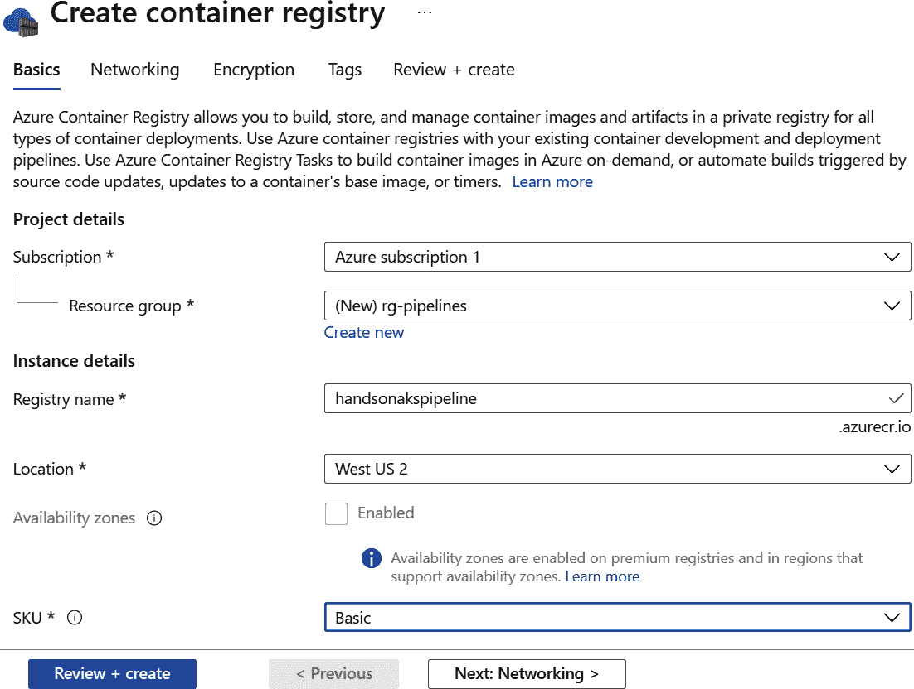
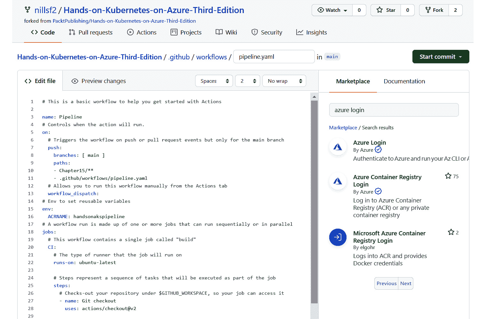

# 15. AKS 的持续集成与持续部署

DevOps 是人、流程和工具的结合，旨在更快速、更频繁和更可靠地交付软件。在 DevOps 文化中包含了 **持续集成和持续部署**（**CI/CD**）的实践。CI/CD 是一组通过一种或多种工具实施的实践，用于自动测试、构建和交付软件。

CI 阶段指的是持续测试和构建软件的实践。CI 阶段的结果是一个可部署的构件。这个构件可以是多种形式；例如，对于 Java 应用程序，它可能是一个 `JAR` 文件，对于基于容器的应用程序，它可能是一个容器镜像。

CD 阶段指的是持续发布软件的实践。在 CD 阶段，CI 生成的构件将被部署到多个环境中，通常是从测试环境到质量保证（QA）环境，再到预发布环境，最后到生产环境。

有多种工具可以实现 CI/CD，其中 GitHub Actions 就是一个这样的工具。GitHub Actions 是一个内置于 GitHub 的工作流自动化系统。使用 GitHub Actions，你可以构建、测试和部署用任何语言编写的应用程序到多种平台。它还允许你构建容器镜像并将应用程序部署到 Kubernetes 集群中，你将在本章中进行操作。

本章将具体覆盖以下主题：

+   容器和 Kubernetes 的 CI/CD 流程

+   设置 Azure 和 GitHub

+   设置 CI 流水线

+   设置 CD 流水线

让我们从探索容器和 Kubernetes 的 CI/CD 生命周期开始。

## 容器和 Kubernetes 的 CI/CD 流程

在开始构建流水线之前，了解容器和 Kubernetes 的典型 CI/CD 流程是很有帮助的。在本节中，将更深入地探讨 *图 15.1* 所示的高层次流程。如果你想更详细地了解 Kubernetes 的 CI/CD 和 DevOps，推荐你阅读微软提供的免费在线电子书：[`docs.microsoft.com/dotnet/architecture/containerized-lifecycle/`](https://docs.microsoft.com/dotnet/architecture/containerized-lifecycle/)。


图 15.1：容器和 Kubernetes 的 CI/CD 流程

这个过程从某人进行代码更改开始。代码更改可能意味着应用程序代码的更改、更改用于构建容器的 Dockerfile，或更改用于在集群中部署应用程序的 Kubernetes YAML 文件。

一旦代码更改完成，这些更改会被提交到源代码管理系统。通常，这会是一个 Git 仓库，但也有其他系统，比如 Subversion（SVN）。在 Git 仓库中，通常会有多个代码分支。分支使得多个个人和团队可以并行在同一个代码库上工作，而不互相干扰。一旦一个分支上的工作完成，它会与主分支（或主分支）合并。分支合并后，该分支的更改将与使用该代码库的其他人共享。

#### 注意事项

分支是 Git 源代码管理系统的强大功能。管理代码库中分支的使用有多种方式。请参考 Scott Chacon 和 Ben Straub 的 *Pro Git*（Apress，2014）一书中的分支章节，深入了解此主题：https://git-scm.com/book/en/v2/Git-Branching-Branches-in-a-Nutshell。

代码推送到源代码管理系统后，无论是在主分支还是功能分支，CI 流水线都可以被触发。在基于容器的应用程序中，这意味着代码被构建成容器镜像，镜像经过测试，如果测试通过，它会被推送到容器注册表中。根据分支的不同，你可能会包含不同的步骤和测试。例如，在功能分支上，你可能只构建并测试容器以验证代码是否有效，但不会将其推送到注册表中，而在主分支上，你可能会构建并测试容器，并将其推送到容器注册表中。

最终，可以触发 CD 流水线来部署或更新你的 Kubernetes 应用程序。通常，在 CD 流水线中，部署会经过不同的阶段。你可以先将更新后的应用程序部署到暂存环境，在那里你可以对应用程序进行自动化和手动测试，然后再将其推送到生产环境。

现在你已经了解了容器和 Kubernetes 的 CI/CD 流程，你可以开始构建本章的示例部分。让我们从设置 Azure 和 GitHub 开始。

## 设置 Azure 和 GitHub

在本节中，你将设置用于创建和运行流水线的基本基础设施。为了托管容器镜像，你需要一个容器注册表。你可以使用多个容器注册表，但在这里你将创建一个 Azure 容器注册表实例，因为它与 **Azure Kubernetes 服务**（**AKS**）集成得很好。在创建容器注册表后，你需要将该容器注册表与 AKS 集群链接，并创建一个新的服务主体，接着你需要设置一个 GitHub 仓库来运行本章的示例部分。按照以下七个步骤完成此活动：

1.  首先，创建一个新的容器注册表。在 Azure 搜索栏中，搜索 `container registry` 并点击“容器注册表”，如*图 15.2*所示：

    图 15.2：通过 Azure 门户导航到容器注册表服务

1.  点击顶部的“创建”按钮来创建新的注册表。为了将本章的资源组织在一起，创建一个新的资源组。为此，点击“创建新建”以创建一个新的资源组，并命名为 `rg-pipelines`，如*图 15.3*所示：

    图 15.3：创建一个新的资源组

    提供创建注册表所需的详细信息。注册表名称需要是全球唯一的，因此建议在注册表名称中添加你的首字母。建议在与你的集群相同的位置创建注册表。为了优化演示的开销，你可以将 SKU 更改为 Basic。选择底部的“查看 + 创建”按钮来创建注册表，如*图 15.4*所示：

    

    图 15.4：创建新的容器注册表

    在弹出的面板中，点击“创建”按钮以创建注册表。

1.  当注册表创建完成后，打开 Cloud Shell，以便配置你的 AKS 集群以获取对容器注册表的访问权限。使用以下命令授予 AKS 对注册表的权限：

    ```
    az aks update -n handsonaks \
    -g rg-handsonaks --attach-acr <acrName>
    ```

    这将返回一个类似于*图 15.5*的输出，已裁剪为只显示输出的顶部部分：

    

    图 15.5：允许 AKS 集群访问容器注册表

1.  接下来，你需要创建一个服务主体，GitHub Actions 将使用它来连接到你的订阅。你可以使用以下命令创建此服务主体：

    ```
    az ad sp create-for-rbac --name "cicd-pipeline" \
    --sdk-auth --role contributor
    ```

    你需要该命令的完整输出 JSON，如*图 15.6*所示，稍后在 GitHub 中使用。复制此输出：

    

    图 15.6：创建一个新的服务主体

1.  这完成了 Azure 部分的设置。接下来，你需要登录 GitHub，fork 本书附带的仓库，并在该仓库中配置一个 secret。如果你还没有 GitHub 帐户，请通过 https://github.com/join 创建一个。如果你已有帐户，请通过 https://github.com/login 登录。

1.  一旦你登录 GitHub，浏览到本书相关的仓库：https://github.com/PacktPublishing/Hands-On-Kubernetes-on-Azure-third-edition。通过点击屏幕右上角的“Fork”按钮，在你的帐户中创建一个该仓库的 fork，如*图 15.7*所示：

    图 15.7：Fork GitHub 仓库

    fork 仓库会在您自己的 GitHub 账户中创建一个副本。这将允许您对仓库进行更改，就像在本章中构建管道时所做的那样。

1.  fork 仓库只需要几秒钟。一旦在您自己的账户中有了 fork，您将需要在此仓库中配置 Azure 秘密。首先点击您仓库右上角的设置，如 *图 15.8:* 所示。


图 15.8: 点击 GitHub 仓库中的设置按钮

这将带您进入仓库的设置。在左侧，点击 Secrets，然后在结果屏幕上方点击 New repository secret 按钮，如 *图 15.9:* 所示。


图 15.9: 创建新的仓库秘密

这将带您到创建新秘密的屏幕。将此秘密称为 `AZURE_CREDENTIALS`，作为秘密的值，粘贴 CLI 命令输出中的内容，该命令在本节的*步骤 4* 中显示，如 *图 15.10:* 所示。


图 15.10: 设置新秘密的值

最后，在此屏幕底部点击 Add secret 以保存秘密。

现在您已经设置好了 Azure 和 GitHub 来开始构建您的管道。您已经创建了一个服务主体，GitHub 将用它与 Azure 进行交互，并且您创建了一个容器注册表，您的 CI 管道可以将镜像推送到其中，AKS 可以从中拉取镜像。现在让我们构建一个 CI 管道。

## 设置一个 CI 管道

您现在已经准备好构建一个 CI 管道了。作为本节演示的一部分，您将构建一个带有小型自定义网页的 `nginx` 容器。容器构建完成后，您将把 `nginx` 容器推送到之前在上一节创建的容器注册表中。接下来的 13 个步骤中逐步构建 CI 管道：

1.  首先，打开 fork 后的 GitHub 仓库并打开 `Chapter 15` 文件夹。在该文件夹中，您会找到一些文件，包括 `Dockerfile` 和 `index.html`。这些文件用于构建自定义容器。在示例中，您将更改 `index.html` 以触发 GitHub 动作中的更改。让我们来看看 `index.html` 的内容：

    ```
    1   <html>
    2   <head>
    3       <title>Version 1</title>
    4   </head>
    5   <body>
    6       <h1>Version 1</h1>
    7   </body>
    8   </html>
    ```

    这是一个简单的 HTML 文件，具有标题和标题，都说 `Version 1`。在*设置 CD 管道*部分，您将被要求增加版本号。

    接下来，您还提供了一个 Dockerfile 文件。该文件的内容如下：

    ```
    1   FROM nginx:1.19.7-alpine
    2   COPY index.html /usr/share/nginx/html/index.html
    ```

    这个 Dockerfile 从一个`nginx-alpine`基础镜像开始。Nginx 是一个流行的开源 Web 服务器，Alpine 是一个轻量级操作系统，通常用于容器镜像。在第二行，您将本地的`index.html`文件复制到容器中，复制到`nginx`加载网页的位置。

    现在你已经了解了应用程序本身，接下来可以开始构建 CI 流水线。供你参考，CI 流水线的完整定义已作为`pipeline-ci.yaml`文件包含在本章的代码文件中，但接下来会逐步指导你如何构建这条流水线。

1.  让我们从创建一个 GitHub Actions 工作流开始。在 GitHub 屏幕顶部，点击 "Actions"，然后点击 "set up a workflow yourself" 链接，如*图 15.11*所示：

    图 15.11：创建新的 GitHub 操作

1.  这将带你进入一个 GitHub 代码编辑器。首先，将流水线文件的名称改为 `pipeline.yaml`，并将*第 3 行*的名称改为 `pipeline`，如*图 15.12*所示：

    图 15.12：更改流水线名称

1.  接下来，你将关注工作流的触发条件。在本示例中，你只会使用主分支。然而，你并不希望工作流对每个代码更改都执行。你只希望当对 `Chapter 15` 文件夹中的流水线定义或代码进行更改时，工作流才会运行。为此，你可以设置以下代码来控制工作流的触发：

    ```
    4   # Controls when the action will run. 
    5   on:
    6     # Triggers the workflow on push or pull request events but only for the main branch
    7     push:
    8       branches: [ main ]
    9       paths: 
    10      - Chapter15/**
    11      - .github/workflows/pipeline.yaml  
    12    # Allows you to run this workflow manually from the Actions tab
    13    workflow_dispatch:
    ```

    这段代码配置的是以下内容：

    +   `Chapter15` 目录以及 `.github/workflows/` 目录中 `pipeline.yaml` 文件的更改将触发工作流的运行。

    +   将 `ACRNAME` 变量设置为你创建的容器注册表的名称。通过使用变量，你可以避免在多个地方配置相同的值。

        这解释了流水线是如何触发的，以及如何配置变量；接下来让我们看看流水线中将会运行什么。

    +   在定义流水线中执行的命令之前，让我们先了解 GitHub Actions 工作流的结构，如*图 15.13*所示：


图 15.13：GitHub Actions 工作流

一个 GitHub Actions 工作流由多个作业组成。每个作业可以包含多个步骤。作业默认并行运行，但可以配置为顺序运行。作业中的步骤将按顺序执行。作业中的每个步骤将包含作为流水线一部分实际执行的命令。一个步骤的例子可能是构建容器镜像。在工作流中有多种方式运行命令：你可以像在常规终端中一样直接运行 shell 命令，也可以运行 GitHub 社区提供的预构建操作。

作业和步骤是在所谓的运行器上运行的。默认情况下，工作流在托管的运行器上运行。这些托管的运行器运行在由 GitHub 设置和管理的基础设施上。你也可以选择在自托管运行器上运行作业和步骤。这样可以让你对运行器有更多的配置能力，例如，允许使用特殊硬件或安装特定软件。自托管的运行器可以是物理的、虚拟的、容器中的、本地的或云中的。

在本节中，你将运行来自社区的工作流步骤以及 shell 命令。有关社区提供的动作的概览，请访问 GitHub Marketplace：https://github.com/marketplace?type=actions。

在你正在构建的 CI 管道中，你需要执行以下步骤：

1.  获取 GitHub 仓库到动作运行器，也称为检出你的仓库。

1.  登录到 Azure CLI。

1.  登录到 Azure 容器注册表。

1.  构建一个容器镜像并将此容器镜像推送到 Azure 容器注册表。

让我们一步步构建管道。

1.  在构建实际步骤之前，你需要配置作业和作业的配置。具体来说，对于这个示例，你可以使用以下配置：

    ```
    18  jobs:
    19    # This workflow contains a single job called "CI"
    20    CI:
    21      # The type of runner that the job will run on
    22      runs-on: ubuntu-latest
    ```

    你正在配置以下内容：

    +   目前是 `CI`。你稍后会添加 CD 作业。

    +   `ubuntu-latest`。

    这配置了 GitHub 运行器的步骤。现在，让我们开始构建各个步骤。

1.  第一步是检查 Git 仓库。这意味着代码将在运行器中加载。可以使用以下几行代码来实现：

    ```
    25      steps:
    26        # Checks-out your repository under $GITHUB_WORKSPACE, so your job can access it
    27        - name: Git checkout
    28          uses: actions/checkout@v2
    ```

    这里表示的第一行（*第 25 行*）是打开 `steps` 块和所有后续步骤的地方。第一步叫做 `Git checkout`（*第 27 行*），指的是一个名为 `actions/checkout@v2` 的预构建动作。`@v2` 表示你正在使用该动作的第二个版本。

1.  接下来，你需要登录 Azure CLI，然后使用 Azure CLI 登录到 Azure 容器注册表。为此，你将使用市场中的一个动作。你可以通过屏幕右侧的搜索栏找到市场中的项目，如*图 15.14 所示：* 

    ```
    30        - name: az CLI login
    31          uses: azure/login@v1
    32          with:
    33            creds: ${{ secrets.AZURE_CREDENTIALS }}
    34
    35        - name: ACR login
    36          run: az acr login -n $ACRNAME
    ```

    第一步是在 GitHub Actions 运行器上登录 Azure CLI。为了登录 Azure CLI，它使用了你在上一节中配置的密钥。第二个任务执行一个 Azure CLI 命令，以登录 Azure 容器注册表。它使用你在*第 14-15 行*配置的变量。它将 `login` 命令作为常规 shell 命令执行。在接下来的步骤中，你将把镜像推送到此容器注册表。

1.  接下来，你将构建容器镜像。虽然有多种方式可以做到这一点，但在这个示例中你将使用 `docker/build-push-action`：

    ```
    39        - name: Build and push image
    40          uses: docker/build-push-action@v2
    41          with:
    42            context: ./Chapter15
    43            push: true
    44            tags: ${{ env.ACRNAME }}.azurecr.io/website/website:${{ github.run_number }}
    ```

    这一步将构建你的容器镜像并推送到注册表。你配置了在`Chapter15`文件夹中运行，因此 Dockerfile 中对`index.html`页面的引用保持有效。它将使用你的容器注册表的名称为镜像打标签，并且将 GitHub Actions 的运行号作为容器镜像的版本号。为了获取工作流的运行号，你使用了 GitHub 配置的默认环境变量之一。有关完整的列表，请参考 GitHub 文档：[GitHub 文档](https://docs.github.com/actions/reference/environment-variables)。

    #### 注意

    在这个例子中，你使用工作流的运行号作为容器镜像的版本。为容器镜像打标签很重要，因为标签版本表示容器的版本。还有许多其他策略可以用来为容器镜像版本化。

    一个不推荐的策略是使用`latest`标签标记容器镜像，并在 Kubernetes 部署中使用该标签。`latest`标签是 Docker 在未提供标签时会自动添加到镜像的默认标签。使用`latest`标签的问题在于，如果容器注册表中的`latest`标签的镜像发生变化，Kubernetes 不会立即获取这个变化。在拥有本地`latest`标签镜像副本的节点上，Kubernetes 不会在超时过期之前拉取新镜像；但是，没有该镜像副本的节点会在需要运行此镜像的 Pod 时拉取更新版本。这可能导致在单个部署中运行不同版本的镜像，这是应当避免的。

1.  现在你已经准备好保存并运行这个 GitHub Actions 工作流了。你可以点击“Start Commit”按钮保存工作流配置文件，然后通过点击“Commit new file”进行确认，正如*图 15.16*所示：

    图 15.16：保存 Action 配置文件

1.  一旦文件被保存，工作流将触发运行。要查看工作流运行的日志，你可以点击屏幕顶部的“Actions”。这应该会显示一个类似于*图 15.17*的屏幕：

    图 15.17：获取 Actions 运行历史

    点击顶部条目以获取更多关于你工作流运行的详情。这将带你到一个类似于*图 15.18*的屏幕：

    

    图 15.18：Action 运行的详细屏幕

    这显示了你的工作流详情，并告诉你在工作流中只有一个任务。点击 CI 查看该任务的日志。这将显示一个类似于*图 15.19*的屏幕：

    

    图 15.19：CI 任务的日志

    在这个屏幕上，你可以看到工作流中每一步的输出日志。你可以通过点击每一步前面的箭头图标来展开该步骤的日志。

1.  在这个示例中，你构建了一个容器镜像，并将其推送到 Azure 上的容器注册表。接下来，我们来验证这个镜像是否已经成功推送到注册表。为此，返回 Azure 门户，在搜索栏中输入`container registry`，如*图 15.20 所示*：

    图 15.20：通过 Azure 门户导航到容器注册服务

    在结果页面中，点击你之前创建的注册表。接下来，点击左侧的 Repositories 选项，应该会显示出`website/website`仓库，如*图 15.21 所示*：

    

    图 15.21：显示容器注册表中的网站/网站仓库

1.  如果点击`website/website`仓库的链接，你应该会看到你的容器镜像的镜像标签，如*图 15.22 所示*：


图 15.22：容器镜像的镜像标签

如果你对比*图 15.18*和*图 15.22*的输出，你会发现动作的运行号也是镜像的标签。在你的例子中，运行号和标签可能是 1。

现在，你已经构建了一个基本的 CI 流水线。当`Chapter 15`文件夹中的代码发生变化时，流水线会运行并构建一个新的容器镜像，该镜像将被推送到容器注册表。在下一节中，你将向流水线中添加一个 CD 任务，用于将镜像部署到 Kubernetes 中的部署。

## 设置 CD 流水线

你已经拥有一个包含 CI 任务的流水线，该任务会构建一个新的容器镜像。在本节中，你将向该流水线中添加一个 CD 任务，该任务会将更新后的容器镜像部署到 Kubernetes 中的部署。

为了简化应用部署，`website`文件夹中已提供应用程序的 Helm Chart。你可以通过部署 Helm Chart 来部署应用程序。通过 Helm Chart 部署时，你可以使用命令行覆盖 Helm 值。你在*第十二章，将应用连接到 Azure 数据库*中也做过类似操作，当时你配置了 WordPress 使用外部数据库。

在这个 CD 任务中，你需要执行以下步骤：

1.  查看代码。

1.  获取 AKS 凭证。

1.  设置应用程序。

1.  （可选）获取服务的公共 IP。

让我们开始构建 CD 流水线。为了方便参考，完整的 CI 和 CD 流水线已经在`pipeline-cicd.yaml`文件中提供：

1.  要向流水线中添加 CD 任务，你需要编辑`pipeline.yaml`文件。为此，在你自己的仓库中，点击屏幕顶部的“Code”按钮，然后进入`.github/workflows`文件夹。在该文件夹中，点击`pipeline.yaml`文件。文件打开后，点击右上角的笔图标，如*图 15.23 所示*：

    图 15.23：编辑 pipeline.yaml 文件

1.  在文件底部，首先添加以下几行来定义 CD 作业：

    ```
    46    CD:
    47      runs-on: ubuntu-latest
    48      needs: CI
    49      steps:
    ```

    在这段代码中，你正在创建 CD 作业。该作业将再次在 `ubuntu-latest` 运行器上运行。在 *第 48 行*，你定义了该作业依赖于 CI 作业。这意味着该作业只有在 CI 作业完成之后才会开始，并且只有在 CI 作业成功完成的情况下才会运行。最后，*第 49 行* 打开了 `steps` 块，接下来你将在其中填写内容。

1.  第一步将是 Git 检出。这将使用你在 CI 作业中使用的相同步骤：

    ```
    50        - name: Git checkout
    51          uses: actions/checkout@v2
    ```

1.  接下来，你需要登录到 Azure CLI 并获取 AKS 凭据。你可以使用与 CI 作业中相同的方法来完成这一步，意味着你可以执行 Azure CLI 登录，然后在运行器上运行 `az aks get-credentials` 命令。不过，也有一个单独的 GitHub 动作可以为 AKS 完成这项工作：

    ```
    53        - name: Azure Kubernetes set context
    54          uses: Azure/aks-set-context@v1
    55          with:
    56            creds: ${{ secrets.AZURE_CREDENTIALS }}
    57            resource-group: rg-handsonaks
    58            cluster-name: handsonaks
    ```

    这一步使用了 Microsoft 的 `Azure/aks-set-context` 动作。你使用你创建的 Azure 凭证密钥对其进行配置，然后定义你要使用的资源组和集群名称。这将配置 GitHub 动作运行器使用这些 AKS 凭证。

1.  现在，你可以在集群上创建应用程序。如本节开头所提到的，你将使用本章中的 `website` 文件夹中创建的 Helm Chart 部署该应用程序。要在集群上部署这个 Helm Chart，你可以使用以下代码：

    ```
    60        - name: Helm upgrade
    61          run: |
    62            helm upgrade website Chapter15/website --install \
    63              --set image.repository=$ACRNAME.azurecr.io/website/website \
    64              --set image.tag=${{ github.run_number }}
    ```

    这段代码执行一个 `Helm upgrade` 命令。第一个参数（`website`）指的是 Helm 发布的名称。第二个参数（`Chapter15/website`）指的是 Helm Chart 的位置。`--install` 参数将 Helm 配置为，如果 Chart 尚未安装，它会自动安装。这将在你第一次运行该动作时发生。

    在接下来的两行中，你设置了 Helm 值。你将镜像仓库设置为容器注册表中的 `website/website` 仓库，并将标签设置为操作的运行编号。这是你在 CI 步骤中用来标记镜像的相同值。

1.  最后，你可以在工作流中包括一个可选步骤。这是获取将被创建并用于服务你网站的服务的公网 IP 地址。这是可选的，因为你可以在 Azure Cloud Shell 中使用 `kubectl` 获取该 IP 地址，但为了方便起见，这里为你提供了该步骤：

    ```
    66        - name: Get service IP
    67          run: |
    68            PUBLICIP=""
    69            while [ -z $PUBLICIP ]; do
    70              echo "Waiting for public IP..."
    71              PUBLICIP=$(kubectl get service website -o jsonpath='{.status.loadBalancer.ingress[0].ip}')
    72              [ -z "$PUBLICIP" ] && sleep 10
    73            done
    74            echo $PUBLICIP
    ```

    这段代码将运行一个小的 Bash 脚本。虽然公网 IP 尚未设置，它将不断使用 `kubectl` 从服务中获取公网 IP。一旦公网 IP 设置好，公网 IP 将会显示在 GitHub Actions 日志中。

1.  现在，你已经准备好保存更新后的流水线并第一次运行它。要保存流水线，点击屏幕右上角的“开始提交”按钮，并在弹出的窗口中点击“提交更改”，如 *图 15.24 所示：* 

    图 15.24：流水线工作流

1.  一旦你提交了更改到 GitHub，工作流将被触发运行。为了跟踪部署情况，点击屏幕顶部的 Actions。点击这里的顶部条目查看运行的详细信息。最初，输出将类似于*图 15.25：*

    图 15.25：操作运行时的详细输出

    如你所见，现在你可以访问该工作流中两个作业，CI 作业和 CD 作业。当 CI 作业正在运行时，CD 作业的日志将不可用。一旦 CI 作业成功完成，你将能够访问 CD 作业的日志。等待几秒钟，直到屏幕显示如*图 15.26*所示，表明工作流已成功完成：

    

    图 15.26：两个作业完成后操作运行的详细输出

1.  现在，点击 CD 作业查看该作业的日志。点击“获取服务 IP”旁边的箭头，查看创建的服务的公共 IP，如*图 15.27：*所示。

    图 15.27：CD 作业日志，显示服务的公共 IP 地址

    在你的网页浏览器中打开一个新标签页，访问你的网站。你应该能看到类似于*图 15.28：*的输出。

    

    图 15.28：网站运行版本 1

1.  现在让我们通过修改`index.html`文件来测试端到端的管道。为此，在 GitHub 中，点击屏幕顶部的 Code，打开`Chapter15`，然后点击`index.html`文件。在打开的窗口中，点击右上角的铅笔图标，如*图 15.29：*所示。

    图 15.29：点击铅笔图标编辑 index.html 文件

1.  现在你可以编辑文件。将网站的版本更改为`version 2`（或进行其他你可能想要的更改），然后滚动到屏幕底部以保存更改。点击提交更改按钮将更改提交到 GitHub，如*图 15.30：*所示。

    图 15.30：保存对 index.html 文件的更改

1.  这将触发工作流运行。它将依次运行 CI 和 CD 作业。这意味着一个新容器将被构建，并更新`index.html`文件。你可以像之前一样，通过点击屏幕顶部的 Actions 并点击顶部的运行条目来跟踪工作流的状态。等待作业完成，如*图 15.31：*所示。

    图 15.31：更新 index.html 后的操作运行

1.  如果你现在返回到 *第 9 步* 输出的 IP 地址，你应该会看到更新后的网页，显示版本 2，如 *图 15.32：* 所示。


图 15.32：网页已更新为版本 2

这表明流水线成功执行，并将你的代码更改部署到生产环境。

#### 注意

在此示例中，你直接更新了生产版本的网站，而没有任何审批流程。GitHub Actions 还允许你配置手动审批，以便在将更改推广到生产环境之前进行测试。要配置手动审批，你可以使用 GitHub Actions 中的环境功能。有关更多信息，请参阅 https://docs.github.com/en/actions/reference/environments。

本示例的 CI 和 CD 使用 GitHub Actions 也到此结束。让我们确保清理为本章创建的资源。在 Cloud Shell 中执行以下命令：

```
helm uninstall website
az group delete -n rg-pipelines --yes
```

由于这也标志着本书示例的结束，如果你不再需要集群，你现在也可以删除它。如果你想这么做，可以使用以下命令删除集群：

```
az group delete -n rg-handsonaks --yes
```

通过这种方式，你可以确保在完成本书中的示例后，如果不再使用这些资源，你就不需要为它们支付费用。

## 总结

现在，你已经成功创建了一个 CI/CD 流水线用于 Kubernetes 集群。CI 是频繁构建和测试软件的过程，而 CD 是定期部署软件的实践。

在本章中，你使用了 GitHub Actions 作为平台来构建 CI/CD 流水线。你首先构建了 CI 流水线。在该流水线中，你构建了一个容器镜像并将其推送到容器注册中心。

最后，你还添加了一个 CD 流水线，将容器镜像部署到 Kubernetes 集群。你能够通过修改网页代码来验证，当代码更改时，流水线被触发并将代码更改推送到集群中。

你在本章中构建的 CI/CD 流水线是一个入门流水线，为更强大的 CI/CD 流水线奠定基础，后者可用于将应用程序部署到生产环境。在将其投入生产之前，你应该考虑向流水线添加更多的测试，并将其与不同的分支进行集成。

## 最后的思考

本章也标志着本书的结束。在本书的过程中，你通过一系列实践示例学习了如何使用 AKS。

本书从基础知识开始，你学习了容器和 Kubernetes，并创建了一个 AKS 集群。

下一节聚焦于在 AKS 上部署应用程序。你学习了将应用程序部署到 AKS 的不同方式，如何扩展应用程序，如何调试故障，以及如何使用 HTTPS 来保护服务。

接下来的章节集中讨论了 AKS 的安全性。你了解了 Kubernetes 中的基于角色的访问控制以及如何将 AKS 与 Azure Active Directory 集成。随后，你学习了 pod 身份，并且 pod 身份在接下来的几个章节中有应用。之后，你学习了如何在 AKS 中安全存储机密信息，接着我们专注于网络安全。

本书的最后一部分集中讨论了 AKS 与其他服务的多种高级集成。你通过 Kubernetes API 部署了一个 Azure 数据库，并将其与集群中的 WordPress 应用集成。接着，你探索了如何使用 Azure Security Center 监控配置并修复集群中的威胁。然后，你在集群中部署了 Azure Functions，并通过 KEDA 进行扩展。在最后一章中，你配置了一个 CI/CD 管道，基于代码更改自动将应用部署到 Kubernetes。

如果你已经成功完成了本书中提供的所有示例，那么你现在应该已经准备好在 AKS 上构建和运行大规模应用。
