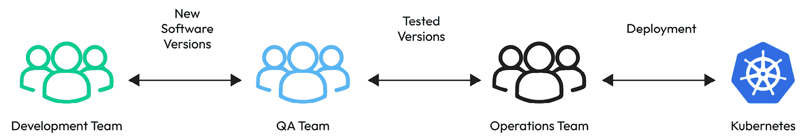
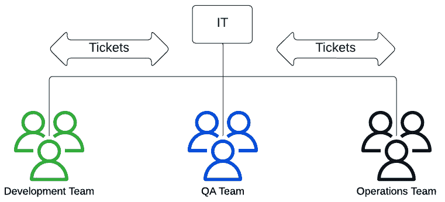
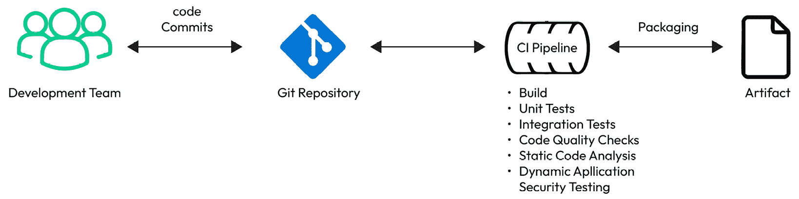
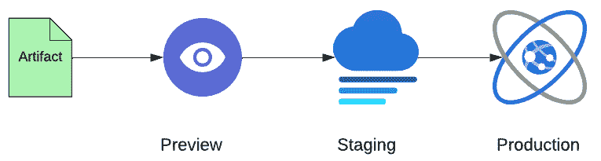
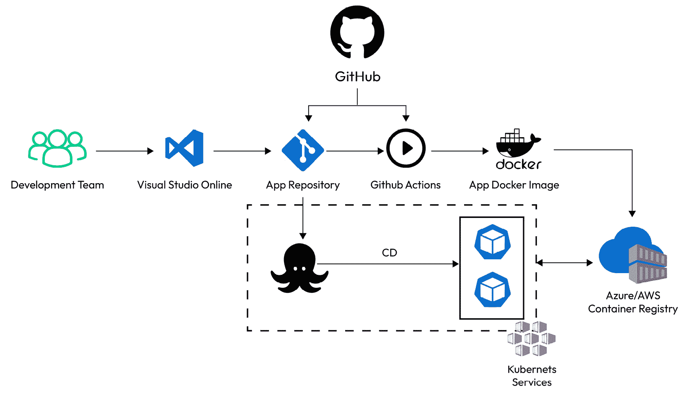

# 第一章：GitOps 简介

在本章的开篇，我们将深入探讨 GitOps，这种革新的方法正在改变软件开发和运营的方式。本章的开头讲述了 GitOps 的来龙去脉，重点关注它对组织文化和工作流程的转变影响。*GitOps 基础* 部分概述了其核心原则，如 Git 的集中管理、声明式方法和自动同步。*传统 CI/CD 与 DevOps 对比 GitOps* 追溯了软件部署的演变过程，将 GitOps 置于该领域更广泛的历史背景中。本章还对比了传统的 CI/CD 和 DevOps 方法论与 GitOps，突出 GitOps 作为管理复杂系统的一种进化。我们将总结讨论在平台工程中采用 GitOps 的优势，同时说明它的效率、一致性和适应性。

本章节将涵盖以下主题：

+   揭示 GitOps - 重塑开发文化和实践

+   GitOps 的基本原理以及在平台工程中采用它的优势

+   为什么选择 GitOps？

+   GitOps、IaC 和 Kubernetes 的集成

# 技术要求

若要跟进本章内容，您需要对 **版本控制**、**基础设施即代码**（**IaC**）、**持续集成**（**CI**）、**持续交付**（**CD**）和 Kubernetes 有基本的了解。熟悉主要云服务提供商如 **Google Cloud Platform**（**GCP**）、**AWS** 和 Azure 也会有所裨益。

# 揭示 GitOps - 重塑开发文化和实践

在现代软件开发和运营领域，GitOps 出现为各种思想和实践的交汇点，重新定义了管理复杂系统的方法。

GitOps 这个术语最早由 **Alexis Richardson** 提出，他是 **Weaveworks** 的联合创始人，通过一系列博客文章于 2017 年 8 月首次引入。Richardson 将 GitOps 描述为一种方法论，其中开发者工具在推动运维流程中至关重要。这种方法强调使用声明性工具的重要性，并倡导将配置视为代码的最佳实践。因此，这些配置应该受到版本控制的管理，与 GitOps 的核心原则保持一致。

这一创新理念标志着软件开发和 IT 运营团队在管理基础设施和应用程序的方式上发生了变革，推动了更高效、透明和可靠的流程。

GitOps 是一个突破性的范式，改变了软件开发和运维团队管理和部署应用程序及基础设施的方式。其核心思想是将广泛使用的版本控制系统 **Git** 作为声明性基础设施和应用程序的唯一真理源。

**版本控制**，也称为源代码管理，是一种记录文件或文件集随时间变化的系统，使您能够稍后调用特定的版本。它允许多人同时在同一文档上工作，版本控制系统提供了一种管理多人之间变更的方式。

## 传统 CI/CD 与 DevOps 对比 GitOps

在传统的 IT 运维中，如*图 1.1*所示，开发团队定期将新版本的软件交给**质量保证**（**QA**）团队。该团队对软件进行测试，然后交给运维团队进行部署。

随着软件发布周期的缩短，传统的运维模型难以跟上步伐。运维团队负责为新版本的软件配置基础设施，同时专注于系统的可靠性、弹性和安全性：

图 1.1 – 传统 IT 运维工作流示例

在没有先进框架的情况下管理基础设施可能会变得复杂，需要专业的知识。IT 运维涵盖了 IT 员工为满足企业技术需求提供的所有过程和服务。这包括处理维护工作和应对客户问题。在传统模型中，开发、QA 和运维团队往往在不同的管理结构下工作，因此详细的交接过程和完善的文档至关重要：

图 1.2 – 分离团队的传统组织模型

传统的组织模型，特点是团队之间明确分离，往往会**使交付过程复杂化**。这种分离通常导致部署速度变慢和部署频率降低。此外，团队之间任务的交接增加了沟通不畅的风险，这可能导致测试疏漏和部署错误。

大多数开发团队使用自动化构建系统和 CI 来编译、测试和生成可部署的工件。

CI 是现代软件开发中的基础过程，它自动化了构建、测试和打包应用程序的过程，如*图 1.3*所示：

图 1.3 – CI 工作流示例

在这一系统中，软件工程师经常将代码更改提交到中央代码库（例如**Git 仓库**），这些更改会自动构建、测试并准备好与主代码分支进行集成。这种方法确保软件始终处于可以部署到生产环境的状态，强调了持续集成（CI）在保持软件开发持续流动中的重要性。

CI 的自动化流程对于确保代码在与主分支合并之前的质量和完整性至关重要。通过自动化这些阶段，CI 最小化了与人为错误相关的风险，并加快了开发周期。然而，过程通常在部署阶段停止，许多组织的这一环节仍然是人工的。人工部署可能涉及复杂的程序或半自动化脚本，且通常需要运维工程师在服务器上物理地转移和重启应用程序。这种人工干预容易出错，缺乏强有力的控制机制，使得其效率低下且具有风险。

在 CI 的基础上，**CD** 将自动化推进了一步：

图 1.4 – CD 工作流示例

CD 是一种实践，在这种实践中，代码更改在通过 CI 的构建和测试阶段后，自动准备并可以发布到生产环境。它始终保持软件处于**发布就绪**状态，极大简化了更新和新特性发布的流程。

CD 与持续部署

CD 和持续部署是软件开发中的密切相关实践，旨在简化发布流程。CD 确保每次代码更改都被自动构建、测试并准备好发布，从而允许手动部署到生产环境。持续部署更进一步，自动将每个通过测试的更改直接部署到生产环境中，消除了手动步骤。这加速了发布流程，但要求对自动化和测试协议有高度的信任。

CD 不仅通过启用较小且频繁的更新来减少与发布相关的风险，这些更新比大型且不频繁的更新更易于管理，而且它还显著缩短了通常需要的长时间测试周期，特别是在大规模代码更改的情况下。这种方法增强了开发、运维和其他团队之间的协作，使各方朝着快速且高效交付高质量软件的共同目标迈进。CD 有效地管理并缓解了与大规模代码修改相关的潜在风险，推动了更加灵活和响应迅速的软件开发生命周期。

CD 使企业能够快速适应市场变化和客户反馈，在创新和客户满意度上保持竞争优势。

**DevOps** 标志着组织框架和思维方式的重大转变，着重强调自动化。从本质上讲，DevOps 作为一种粘合剂，将 CI/CD 的技术高效性与组织的战略目标结合在一起。它强调在整个开发过程中持续的反馈、监控和优化，确保部署后的持续改进。这种方法确保软件开发不仅仅是一个以部署为终点的线性过程，而是一个循环过程，其中反馈和性能数据会反哺开发过程。

GitOps 是一种影响力巨大的运营模型，它在 DevOps 的核心实践基础上发展，将其应用于基础设施自动化。它整合了版本控制、协作工作、遵守合规标准以及使用 CI/CD 工具等基本原则。这一策略有助于有效且可靠地管理 IaC 过程。

通过将 DevOps 集成到 CI/CD 管道中，组织可以创造一个更加整体、高效和协作的环境。这不仅加速了创新和交付的步伐，而且显著提升了产品质量和客户满意度，使组织在日益发展的数字化环境中保持竞争力。

在这种模型中，部署和运营的传统角色从运营团队转移到应用程序的开发团队。DevOps 将软件**开发**（**Dev**）与 IT **运营**（**Ops**）集成，旨在缩短整体系统开发生命周期。这种整合促进了功能、修复和更新的频繁交付，确保它们与业务目标紧密对接。

以下是采纳 DevOps 的一些关键优势：

+   加强开发和运营团队之间的协作

+   提高开发产品的质量

+   发布频率的提高

+   缩短将新功能推向市场的时间

+   降低设计、开发和运营过程中的成本

+   降低**平均恢复时间**（**MTTR**），增强系统的韧性并最小化中断的影响

从 DevOps 到 GitOps 的演变代表了追求更高效、更可靠的软件开发和运营实践的自然进展。DevOps 旨在打破软件开发与运营之间的障碍，培养合作和持续改进的文化，而 GitOps 通过围绕 Git 版本控制系统构建整个运营工作流，将这一点进一步深化。GitOps 将 Git 作为声明式基础设施和应用程序的唯一真理来源。

降低 MTTR

减少 MTTR 指的是改善 **DevOps 研究与评估** (**DORA**) 指标中的一个关键指标，即恢复系统或服务故障或中断的平均时间。这个指标对于理解和增强 IT 运维的弹性和可靠性至关重要。通过减少 MTTR，组织可以确保在出现中断后，系统能够更快恢复，最大限度地减少对用户和业务运营的影响。这一改进通常通过更有效的事件管理流程、自动化和更好的故障处理准备来实现。

这种方法不仅简化了部署和管理过程，还提高了透明度、问责制和可重现性。

从 DevOps 到 GitOps 的过渡是由在管理复杂和动态的云原生环境中对更高自动化、一致性和安全性的需求所驱动的。

GitOps 通过利用 Git 强大的版本控制功能来自动化部署过程，这意味着系统中的每一个更改都可以被跟踪、回滚，并经过同行评审过程，就像软件开发中的代码更改一样。这一转变将软件开发的严谨性和精确性带入了运维领域，大大减少了人为错误的可能性，并提高了生产环境的稳定性和安全性。

此外，GitOps 与当今云环境中流行的容器化和微服务架构完美契合，使得企业能够实现更快速、更高效的部署管道，这对于在快速变化的数字环境中保持敏捷和响应能力至关重要。

在本章接下来的部分，我们将深入探讨采用 GitOps 的好处。我们将探讨为什么应该使用它、它与 Kubernetes 的集成以及与 Argo CD 和 Flux CD 等工具的结合。

# GitOps 的基本原理及其在平台工程中采用的优势

DevOps 是对这些孤岛现象的回应，融合了开发和运维的角色。它将 CI/CD 原则扩展到包括文化转变，促进协作，旨在打破开发人员和 IT 运维之间的隔阂。重点是对软件生命周期的整体性方法，确保开发和运维的考虑从一开始就得到集成。DevOps 采用了如 IaC 和监控等实践，营造了一个更具响应性和敏捷性的环境。

GitOps 是一种较新的创新，建立在这些基础上，但引入了一个重要转变：它将 DevOps 和 CI/CD 的原则集中在 Git 仓库周围。

在 GitOps 的故事中，如*图 1.5*所示，一切从一个 Git 仓库开始，其中存储并版本控制着系统的完整状态——代码、配置、环境设置，甚至文档。这种方法允许高水平的透明度、可追溯性和审计性，因为每次更改都会被记录，并可以追溯到某个提交：

图 1.5 – 一个包含 DevOps 的 GitOps 管道示例

在 GitOps 中，Git 不仅仅是一个版本控制系统；它是应用代码和基础设施配置的唯一真实来源。这种方法利用了 Git 的优势——如版本控制、协作功能和拉取请求工作流——来管理整个部署和运营过程。GitOps 强调**声明式方法**，即系统的期望状态在 Git 中定义，自动化过程确保实际状态与期望状态一致。

从应用代码到基础设施配置，所有内容都存储在 Git 仓库中。这样的集中化不仅简化了管理和追踪变更的过程，还确保了开发和部署各个阶段的一致性和透明度。

在 GitOps 场景中的工作流优雅地实现了自动化且高效。开发人员通过拉取请求提交更改，随后这些更改将经过自动化测试和审查。一旦获得批准，这些更改会自动部署到生产环境，符合前面提到的 CI/CD 原则。

拉取请求

**拉取请求**是版本控制系统中的一项功能，特别是在 Git 中，它促进了软件开发中的协作。作为一个检查点，拉取请求允许开发人员通知其他人他们已经推送到托管服务（如 GitHub 或 GitLab）上仓库中的更改。在推送包含更新的分支后，开发人员可以发起拉取请求，将这些更改合并到主分支中。这个过程邀请其他人对提议的更改进行审查和讨论，确保代码在合并之前经过协作审查和优化，从而提高了代码质量并促进了团队成员之间的共享理解。

这种自动化不仅简化了部署过程，还显著减少了人为错误的可能性。此外，由于整个系统的状态都受到版本控制，因此在出现问题时，回滚到先前的状态变得非常简单。

这个过程通常被称为**以 Git 为中心**，它使团队能够使用与代码开发相同的工具和流程来管理基础设施和应用程序，从而为软件交付带来统一的方法。

GitOps 代表了从传统实践到现代方法的重大进化，它利用了 Git、自动化和声明式模型的优势。这一方法为实现 DevOps 文化提供了框架，提供了一种与各种工具（如 Kubernetes 和 CI/CD 解决方案）兼容的通用方法。

GitOps 工作组通过其定义的 GitOps 原则支撑了这一方法，强调声明式配置、版本化和不可变状态、自动拉取和持续协调的重要性。

随着我们进一步探讨，这些基础原则将通过实际示例加以说明，展示采用 GitOps 思维方式在平台工程中的现实影响和优势。

# 为什么选择 GitOps？

采用 GitOps 进行平台工程带来了众多优势，重新塑造了团队与基础设施和应用程序的互动方式。这一方法利用了 Git、自动化和声明式配置的优势，为管理复杂系统提供了强有力的框架。以下是一些关键的好处：

+   **声明式与不可变特性**：GitOps 关注于声明系统的期望状态，而不是详细说明命令式脚本。它采用不可变基础设施的方法，通过替换资源而不是修改现有资源来进行变更，从而增强一致性和稳定性。

+   **自动化同步**：GitOps 的核心在于自动同步系统状态与 Git 中描述的配置，涵盖了基础设施和应用程序的整个生命周期，包括部署、更新、扩展和恢复。

+   **拉取请求工作流集成**：GitOps 中的操作流程与拉取请求工作流深度集成，体现了将一切视为代码的理念。这种集成有助于代码审查、协作讨论、共享知识和责任。

+   **持续反馈与监控**：GitOps 强调持续监控，以检测并修正任何与期望状态的偏差，促进持续的系统维护和改进。

+   **提高效率与生产力**：通过自动化平台工程的各个方面，GitOps 减少了人工操作和人为错误，使团队能够更多地专注于创新。

+   **提高一致性与可靠性**：将 Git 作为唯一的真实数据源，并采用声明式配置，确保了在不同环境中的基础设施一致性和可靠性。

+   **更快的恢复与回滚**：GitOps 使得快速回滚到先前状态成为可能，增强了系统的弹性并加速了从故障中的恢复。

+   **协作与透明性**：该方法鼓励协作平台工程，通过同行评审和讨论促进知识共享和透明性。

+   **简化的审计与合规性**：所有更改都在 Git 中追踪，简化了审计过程，并便于遵循监管要求和内部政策的合规性。

+   **可扩展性和灵活性**：GitOps 能够高效地随组织需求进行扩展，并适应各种类型的基础设施，包括云、内部部署和混合环境。

+   **增强的安全性**：使用拉取请求和代码审查增加了额外的安全层，确保对基础设施和应用程序的更改进行彻底审查。

+   **简化的入职和知识共享**：Git 仓库提供了系统当前状态的清晰概览，有助于新团队成员的入职，并促进知识共享的环境。

+   **持续改进与适应**：GitOps 固有的反馈循环和监控使团队能够迭代地改进系统，并适应变化的需求。

采用 GitOps 对公司来说会带来一些挑战，这些挑战可能会影响公司向这种方法论的过渡。首先，存在学习曲线，需要针对 Kubernetes、Helm 或 Argo CD 等特定工具进行培训，这可能会暂时降低生产力。实施 GitOps 还需要在文化上发生转变，要求严格的代码管理和 CI/CD 实践。初期的设置和集成过程可能复杂且耗时，需要在时间和资源上进行大量投入。

此外，有效组织 Git 仓库结构至关重要，因为它直接影响部署的可管理性和可扩展性。如果管理不善，可能会导致运营效率低下和错误增加。另一个关键方面是秘密管理；GitOps 工作流要求小心处理敏感数据，以防止安全漏洞。必须实施适当的策略来安全存储、访问和管理 GitOps 过程中的秘密，以确保自动化部署保持安全高效。

在本节中，我们重点介绍了采用 GitOps 进行平台工程的显著优势和挑战。这种方法论利用 Git、自动化和声明式配置的优势，提供了一个强大的框架来管理复杂的系统。下一节将介绍 GitOps、IaC 与 Kubernetes 的集成。

# GitOps、IaC 与 Kubernetes 的集成

在本节中，我们将深入探讨 GitOps、IaC 和 Kubernetes 的复杂集成，以及诸如 Argo CD 和 Flux CD 等关键工具。我们将探索这种紧密结合如何增强云原生操作，简化部署流程并加强安全性，从而彻底改变基础设施管理和应用程序部署的方式，特别是在现代软件开发环境中。

## GitOps 与 IaC

IaC 通过代码而非手动程序来管理和提供基础设施。该方法包括创建配置文件，详细说明您的基础设施需求，从而简化修改和传播这些配置的过程。IaC 保证每次都能一致地提供相同的环境，同时将配置规范转化为编码文档，从而改进配置管理。

这种方法有助于避免没有文档记录的、临时的配置更改。

GitOps 将熟悉的 Git 版本控制系统扩展到基础设施和部署管理，并与 IaC 原则紧密对接。这个集成允许开发人员像管理软件开发过程一样管理基础设施配置和代码部署，带来诸多优势：

+   **加速生产时间**：更快速的基础设施提供，减少人为错误，导致更加可预测的结果。

+   **基于模板的可重用性**：将 IaC 配置文件作为模板，提供进一步相关配置的基准。

+   **统一部署**：实现一致的基础设施部署，避免那些可能导致未来重大问题的小差异。

+   **可追溯性和可审计性**：将 IaC 与代码库集成以进行源代码追踪，提供详细的变更历史记录，包括版本控制和审计轨迹，识别是谁在何时进行了更改。

+   **增强的组织知识**：版本控制记录了更改背后的理由，成为新员工和现有员工的重要资源。

+   **改进的灾难恢复**：IaC 确保在发生故障时能够快速重建环境，最小化停机时间和业务中断。

## GitOps 和 Kubernetes

GitOps 和 Kubernetes ([`kubernetes.io/docs/concepts/overview/`](https://kubernetes.io/docs/concepts/overview/)) 在现代软件开发和基础设施管理领域形成了强大的组合。Kubernetes 是一个开源平台，用于自动化跨主机集群部署、扩展和操作应用容器的过程，为管理大规模容器化应用提供了坚实的基础。而 GitOps 则是一个操作框架，将 Git 的原则——版本控制、协作和合规性——应用于基础设施自动化。两者结合时，GitOps 和 Kubernetes 提供了一个高效、可扩展和可靠的系统，用于管理复杂的应用和基础设施。

Kubernetes 已成为编排容器化应用程序的关键工具，提供了自动化发布和回滚、服务发现与负载均衡（它能够为 Pods 和服务分配 IP 地址以实现负载均衡）、存储编排、以及在不暴露密钥或不需要重建 Docker 镜像的情况下进行机密和配置管理等功能，并具备自愈机制，如重新启动失败的容器和在节点出现问题时重新调度 Pods。

此外，Kubernetes 支持基于 CPU 使用情况的横向扩展，并且以声明式方式操作。这些功能随着每次 Kubernetes 发布而不断发展。

GitOps 与 Kubernetes 的融合显著加快并提高了部署过程的效率。这个组合通过启用 CD 自动化并集成必要的反馈和控制系统，促进了更频繁的部署。通过使用 Git 的声明式定义，开发人员可以采用知名的工作流，这简化了创建新开发或测试环境以及将新功能部署到集群的能力。因此，这导致了每日变化的频率增加，加速了新功能和功能交付给最终用户。

GitOps 还使团队能够变得更加自给自足。传统上，开发团队依赖运维团队将变更部署到生产环境中。GitOps 改变了这种动态，允许开发团队在部署和管理生产环境中的代码和配置变更时，减少对平台和运维团队的依赖。只需将更改提交到 Git 仓库并合并拉取请求，就可以通过 GitOps 工具触发其余的过程。这种自服务特性提高了效率和战略能力。

GitOps 通过将 Git 作为声明式配置的**真实来源**，提升了部署和基础设施管理的能力。在声明式系统中，重点是定义期望的结果，而不是实现它的步骤。这种方法与命令式方法不同，后者涉及指定一系列步骤，通常会增加操作人员的额外工作负担。在 GitOps 中，环境的每个组件都可以在 Git 仓库中进行编码和声明。一旦进行更改并提交到 Git，系统会自动处理这些声明，以创建或更新必要的对象。

与 Kubernetes 的声明式特性**无缝集成**，是 GitOps 真正发挥作用的地方。Kubernetes 在**协调循环**中操作，持续调整集群的实际状态，以匹配其配置定义的期望状态。当检测到当前状态与期望状态之间的差异时，Kubernetes 会采取自动措施以协调这些差异。这可能涉及创建、更新或删除资源，以确保集群的配置与 Git 仓库中定义的内容一致。

GitOps 与 Kubernetes 协调循环的结合提供了一个强大的自动化系统管理框架。这确保了所有系统组件根据 Git 中定义的精确配置一致地部署，遵循完全声明式的方法，简化操作，提高可靠性，并保持开发、预发布和生产环境之间的一致性。

**可观察性**是 GitOps 在 Kubernetes 环境中的另一个关键方面。它涉及持续监控集群中实际的状态，并与期望的状态进行比较。GitOps 帮助衡量和监控集群中运行的内容，并提醒团队任何不一致之处。现代 GitOps 工具有监控和通知功能，以支持这一功能。

从 **合规性与审计** 的角度来看，GitOps 提供了显著的优势。以 Git 作为唯一的事实来源，审计变得简单：审计员可以通过检查源代码库来评估期望的状态，并通过查看底层基础设施提供商和 Kubernetes 集群状态来验证当前状态。这简化了跨各种领域的合规性和审计流程。

对于那些为不同业务和团队需求使用 *多个 Kubernetes 集群* 的组织来说，管理这些集群并保持一致的配置和安全策略是一项重大挑战。GitOps 通过允许跨这些集群运行的 GitOps 代理代替运维团队管理一切，从而解决了这一问题，使其成为多集群配置管理的理想解决方案。

**灾难恢复**（**DR**）对于组织从中断业务运营的事件中迅速恢复至关重要，主要目标是快速恢复关键系统和 IT 基础设施。从 GitOps 的角度来看，DR 主要处理配置管理，而非数据恢复。这个区别非常重要，因为虽然配置保存在 Git 中，但实际数据并不在其中。像 Git 这样的工具对于配置的版本控制非常有用，但不支持数据恢复。例如，如果数据库被删除，Git 无法帮助恢复它；因此，需要单独的数据恢复策略，专门用于恢复丢失的数据。

在 Kubernetes 生态系统中，使用 GitOps 自动化基础设施配置的趋势正在上升。这包括部署、服务和各种 Kubernetes 实体的创建。DevOps 和 **站点可靠性工程**（**SRE**）团队越来越多地转向 GitOps 来管理所有基础设施配置文件作为代码。这种方法利用了 GitOps 固有的基础设施即代码（IaC）特性。

此外，GitOps 还增强了 *安全* 协议。它在 Git 中使用复杂的加密方法来监视和管理变更，还可以验证变更以确认作者和来源。这种实践确保了集群的安全定义状态。在安全漏洞发生时，Git 的不可变性和审计性质使得可以重建一个与受损系统分离的系统，从而最大程度地减少停机时间并提高事件响应的效率。

软件打包和发布到生产环境中的责任分离实践进一步遵循最小特权原则，降低了安全漏洞发生的可能性和严重性，并提供了更小的攻击面。

GitOps 通过确保整个基础设施环境和组件在 Git 仓库中以声明方式定义，促进了这一过程。在灾难事件发生时，只需从 Git 中重新应用配置文件，快速恢复生态系统。

## Kubernetes 和 Argo CD

Argo CD 是针对 Kubernetes 的 GitOps CD 工具 ([argo-cd.readthedocs.io](http://argo-cd.readthedocs.io))，是一个声明性工具，专为 Kubernetes 的持续交付而设计。它可以作为独立解决方案运行，也可以集成到现有的 CI/CD 流水线中，以高效地在 Kubernetes 集群中部署必要的资源。

使用 Argo CD 将 GitOps 与 Kubernetes 集成，为在 Kubernetes 上管理云原生应用程序和作业提供了一种简化的方法。Argo CD 是 Argo 项目系列的一部分，提供了一套工具，包括 Workflows、Events 和 Rollouts，这些工具增强了 Kubernetes 原生应用程序的交付能力。对于转向容器化环境和 Kubernetes 部署的组织来说尤为重要，此时 Argo CD 可作为一个全面的解决方案。

在大型企业典型的大规模部署中，拥有众多开发人员和大量微服务的情况下，GitOps 方法论显得尤为突出。然而，为了有效实施，通常需要额外的工具和服务。在这样的组织中，每个团队独立运行和管理其 Kubernetes 集群并不现实。更有效的策略是在一个集中平台上操作和维护多租户集群。这种设置为团队在这些集群中管理其工作负载提供了自主权，同时仍提供集中的监视和维护。

Argo CD 在促进这种集中式集群管理方法方面发挥了关键作用，推动了 GitOps 的采用。以下是在 Kubernetes 中使用 Argo CD 创建有效 GitOps 策略时需要考虑的一些关键因素：

+   **用户入职**：简化入职流程至关重要。集中部署操作员的安装、设置和维护工作，可以减轻将多个微服务迁移到 Kubernetes 的过程，而不是将这一负担交给各个团队。在用户数量庞大的系统中，采用**单点登录**（**SSO**）尤为有利，能够简化新用户的引入。

+   **多租户和管理**：在多租户环境中，用户需要对资源进行安全且灵活的访问。Kubernetes 的**基于角色的访问控制**（**RBAC**）系统是一个强大的功能，但可能不足以管理大量集群。Argo CD 通过额外的访问控制功能增强了这一点，与 SSO 提供商无缝集成，便于访问多个集群。

+   **可观察性**：有效 CD 工具的一个关键特性是使开发人员能够监控和跟踪应用程序的状态。Argo CD 的用户友好界面提供了详细的应用程序配置洞察，例如与 Git 的同步状态、特定的不同步元素和任何操作问题。

在接下来的章节中，我们将探讨 Flux CD，这是一款与 Kubernetes 集成后，能够实现可扩展性并确保各种部署类型之间环境一致性的工具。

## Kubernetes 与 Flux CD

Flux（[fluxcd.io](http://fluxcd.io)）是一个开放且可扩展的 Kubernetes CD 解决方案，是现代 DevOps 生态系统中的一个关键组成部分。

在撰写本文时，Weaveworks 的首席执行官 Alexis Richardson 在 LinkedIn 上宣布，公司正面临经济挑战，将关闭并停止商业运营。Weaveworks 将与一位财务受托人合作，受托人将很快公布，以管理关闭过程。尽管公司创造了可观的收入并扩大了客户基础，这一决定仍然做出，突显了在维持运营过程中面临的财务波动和战略挑战。原始公告可在此查阅：[`www.linkedin.com/posts/richardsonalexis_hi-everyone-i-am-very-sad-to-announce-activity-7160295096825860096-ZS67/`](https://www.linkedin.com/posts/richardsonalexis_hi-everyone-i-am-very-sad-to-announce-activity-7160295096825860096-ZS67/)。

作为一款 GitOps 工具，Flux 确保 Git 仓库中清单的状态与 Kubernetes 集群中的运行状态始终保持同步。GitOps 不仅仅是另一个工具，它为开发人员提供了一种使用 Git 来管理 Kubernetes 中操作工作流的方法。这种方法强调使用如 Git 这样的版本控制系统来部署 Kubernetes 中的应用程序，使开发人员能够直接将代码推送到生产环境中。更改可以轻松追踪并在必要时回滚，从而增强部署的可靠性。

以下是 Flux CD 的主要特性：

+   版本控制仓库与集群之间的自动同步

+   仓库变更在集群中的即时反映

+   从仓库直接部署代码到生产环境

+   版本控制的配置，确保所有配置都是最新的

+   灾难恢复能力，能够以相同的配置设置新集群

在 Kubernetes 的背景下，作为强大的容器编排平台，Flux CD 起着至关重要的作用。Kubernetes 在自动化和简化应用程序部署与管理方面表现出色，尤其是在跨多种部署场景中扩展和保持一致的环境方面。Flux CD 遵循 GitOps 原则，通过不断同步应用程序和基础设施的状态与存储在 Git 仓库中的配置，加入了一层自动化和安全性。这确保了实际状态与期望状态在安全和受控的方式下保持一致。Kubernetes 和 Flux CD 之间的协同作用提供了以下几个关键优势：

+   **自动化部署**：Flux CD 的自动更新和配置会被提交到 Git 仓库

+   **可扩展性和可靠性**：Kubernetes 在处理容器化应用程序方面的强大能力与 Flux CD 在配置上的一致性相得益彰

+   **增强的安全性**：Flux CD 将 Git 作为唯一的事实来源，增加了额外的安全层

+   **运营效率**：集成优化了操作，减少了人工干预，提高了效率

总结来说，Kubernetes 与 Flux CD 的结合为现代软件部署和管理提供了全面的解决方案。它们的集成增强了自动化、可扩展性、安全性和效率，使其成为云原生技术和 DevOps 实践中不可或缺的工具。

# 总结

本章深入介绍了 GitOps，探讨了其对软件开发和运维的变革性影响。我们首先将 GitOps 与传统的 CI/CD 和 DevOps 方法进行了对比，突出了其独特的方法和优势。

接着，我们介绍了推动 GitOps 产生的部署策略的历史和演变。讨论了 Git 集中化、声明式方法、自动化同步和持续反馈等关键原则，强调了 GitOps 在提升平台工程效率、一致性和协作方面的作用。

此外，我们还深入探讨了 GitOps 与 Kubernetes 等工具的集成，展示了其在现代云环境中的可扩展性和安全性优势。最后，我们强调了采用 GitOps 的重要性，因为它提供了强大的框架并能适应不断变化的技术环境。

在*第二章*中，我们将深入探讨 GitOps 在云原生环境中的实际应用，分析它与 Kubernetes 的无缝集成、轻量级 Kubernetes 发行版的架构以及云原生 CI/CD 管道的设计。

# 进一步阅读

要了解本章中讨论的更多主题，请查看以下资源：

+   *Argo CD – Kubernetes 的声明式 GitOps CD*： [`argo-cd.readthedocs.io/en/stable/`](https://argo-cd.readthedocs.io/en/stable/)

+   *Flux* *CD*： [`fluxcd.io/`](https://fluxcd.io/)
