# 第二章：使用 GitOps 导航云原生操作

在*第一章*中，我们深入探讨了 GitOps 的基础概念，并将其方法与传统的 CI/CD 和 DevOps 方法进行了对比。我们探讨了 GitOps 的历史发展、关键原则（如 Git 集中化和自动化同步）以及其与 Kubernetes 的融合。本章将强调 GitOps 在提升现代云环境中的可扩展性和安全性方面的作用。到本章结束时，你将对 GitOps 在软件部署和操作中的变革性影响有全面的理解，为其在云原生操作中的应用打下基础。

在本章中，我们将重点讨论以下几个关键领域：

+   GitOps 与云原生技术

+   Kubernetes 简介

+   探索 K3s 作为一种轻量级的 Kubernetes 发行版

+   容器

+   示例工作流——使用 Docker 和 K3s 轻松实现持续交付（CD）

# 技术要求

为了操作本章中的示例，你需要一个 Kubernetes 集群。虽然我们将引导你如何安装 K3s 以适应这些示例，但任何 Kubernetes 设置都可以满足需求。

K3s 已针对 Linux 系统进行了优化，因此请确保你可以访问 Linux 环境。如果你使用的是非 Linux 系统，可以考虑使用**Windows 子系统 Linux**（**WSL**）或**Virtual Box**（参见本章末尾的*进一步阅读*部分中的[*1*]和[*2*]）。

本章的代码可以在本书 GitHub 仓库中的`Chapter02`文件夹中找到：[`github.com/PacktPublishing/Implementing-GitOps-with-Kubernetes`](https://github.com/PacktPublishing/Implementing-GitOps-with-Kubernetes)。

# GitOps 与云原生技术融合的概述

在*第一章*中，我们探讨了 GitOps，这是 DevOps 和 Git 的融合，强调其通过将软件开发技术应用于基础设施管理，从而提升操作效率和系统稳定性的能力。接下来，*第二章*基于这一基础，进一步探讨了 GitOps 如何与云原生技术融合。这项技术标志着应用开发的重大转变，具有容器化、微服务和动态编排的特点，提升了可扩展性和弹性。

GitOps 通过启用系统化、版本控制管理复杂系统，进一步补充了这一点。GitOps 与云原生技术，特别是 Kubernetes 之间的协同作用，带来了更加动态、灵活和可靠的系统管理方式。本章旨在展示 GitOps 如何简化并提升云原生环境的能力。

此外，GitOps 是从 DevOps 和版本控制的交汇处衍生出来的一种方法，它利用 Git 的强大功能来管理和自动化软件系统的部署与操作。通过将基础设施视为代码，GitOps 使得使用 Git 的常见拉取请求和合并操作来审查、版本控制和部署更改变得容易。这种方法确保了一致性、可追溯性，并且易于回滚，特别在云原生环境中具有强大的作用。

云原生技术则代表了一种关于应用程序构建和部署的范式转变。它涉及使用容器、微服务和动态编排来创建强大、可扩展且可独立部署的应用程序。这项技术最大化了云的灵活性，使得快速扩展和弹性变得可能。当与 GitOps 集成时，云原生技术变得更加强大，使团队能够更有效地管理复杂系统，并且信心倍增。

在深入了解 GitOps 的实际应用之前，首先有必要介绍 Kubernetes，这是云原生技术的核心编排平台。此外，我们还将讨论 **K3s**，这是一个 Kubernetes 的轻量级变体。K3s 特别适用于个人开发环境，因为它允许在单个笔记本电脑上部署 Kubernetes 集群。这种设置使得进行动手实验和学习成为可能，为理解和应用 Kubernetes 环境中的 GitOps 技巧提供了一个实用的基础。随着我们进入更高级的话题和 GitOps 实践演示，这些知识将至关重要。

# Kubernetes 简介

在接下来的章节中，我们将介绍 Kubernetes，包括该项目的简要历史概述以及 Kubernetes 架构的核心概念。在第二部分，我们将深入探讨 K3s，并探索如何使用它在笔记本电脑上运行本地的 Kubernetes 集群。

## 什么是 Kubernetes？

Kubernetes 是一个强大且开源的平台，旨在简化应用容器的部署、扩展和管理的自动化过程。它在容器编排的领域中扮演着核心角色，提供了一个可靠的框架，能够有效地管理跨多个环境（包括物理数据中心、公有云和私有云）的容器化应用程序。

最初，Google 的 Kubernetes 项目代号为*Project 7*，向*《星际迷航》*中的“七人组”致敬，象征着一种更易接近的版本，改良自 Google 的 Borg 系统。由于许可限制，采用了“Kubernetes”这一希腊语单词，意为舵手，并体现在其七辐车轮的标志中，巧妙地向其*《星际迷航》*的灵感来源致敬。2014 年发布后，Joe Beda、Brendan Burns 和 Craig McLuckie 以及其他 Google 工程师共同推动了其开发。与 Borg 的 C++ 编码不同，Kubernetes 使用了**Go**。其第一个版本 Kubernetes 1.0 于 2015 年发布。通过与 Linux 基金会的合作，Kubernetes 成为了**云原生计算基金会**(**CNCF**)的基石，并迅速获得了红帽、VMware、Mesosphere、Docker、Microsoft Azure 和 AWS 等主要技术公司提供的服务的整合。

Kubernetes 在云计算中扮演着至关重要的角色，促进了声明式配置和自动化。它支持多种容器工具，包括 Docker，并且能够跨多个主机管理复杂的容器架构，这使得它极具价值。

Kubernetes 简化了应用程序的部署和扩展，其针对容器化应用的自动化发布和回滚功能增强了可靠性和效率。它允许在多个主机上编排容器，处理应用程序的部署和扩展，并覆盖它们的网络和存储需求。

该平台的自愈功能会在容器失败时自动重启、替换和重新调度容器。它还会根据负载变化扩展容器，并通过多种部署模式在不发生停机的情况下更新容器。

Kubernetes 支持多种工作负载，包括**无状态**、**有状态**和**数据处理**工作负载。它足够灵活，可以交付复杂的应用程序，同时提供可扩展性和可靠性，并有效管理工作负载。

总体来说，Kubernetes 革新了容器化应用程序的部署和管理方式，成为现代软件开发和运维领域的关键工具。

## Kubernetes 架构

Kubernetes 架构旨在管理和编排容器化应用程序。它由多个组件组成，这些组件共同协作。

在 Kubernetes 架构中，集群被分为两个主要组件：**控制平面**和**工作节点**（或**数据平面**）。控制平面负责全球决策和管理集群的状态。它包括如**API 服务器**、**etcd**、**调度器**、**控制器管理器**和**云控制器管理器**等核心元素。

相反，节点组件负责运行实际的工作负载。每个节点包含至关重要的服务，如 **Kubelet**、**容器运行时** 和 **kube-proxy**，它们确保容器按预期运行，并处理集群内部和外部的网络通信。

这种架构使得系统具有健壮性和可扩展性，控制平面保持控制，节点高效地管理工作负载。

控制平面包括以下组件：

+   **API 服务器（kube-apiserver）**：该中央管理实体处理 REST 请求，验证请求，并更新对应的 etcd 中的对象。它是 Kubernetes 控制平面的主要接口。

+   **etcd**：这是一个一致且高可用的 **键值存储**，作为所有集群数据的主要存储。它对集群状态管理至关重要。

+   **调度器（kube-scheduler）**：调度器负责根据资源可用性、用户定义的约束、污点和选择器将 Pods 分配到节点上。这确保每个 Pod 被放置在满足资源需求且遵循调度策略（如污点和亲和性/反亲和性选择器）的最佳节点上。

+   **控制器管理器（kube-controller-manager）**：该组件在后台运行各种控制器过程。它监控集群的状态，管理工作负载的生命周期，并处理节点上的操作，以确保 Kubernetes 集群的期望状态得到维持。

+   **云控制器管理器**：一个架构组件，嵌入了特定云平台的控制逻辑，允许云服务提供商将其平台与 Kubernetes 连接。它将与云平台相关的代码从 Kubernetes 核心逻辑中抽象出来，使得每个云服务可以独立开发其插件。每个托管 Pods 的节点组件，包含了维护和管理容器及网络通信的基本组件：

    +   **Kubelet**：该代理确保容器按照 Pod 配置中定义的规范在 **Pod** 中运行。它管理每个节点上 Pod 的状态，并与主节点的控制平面（或在高可用 Kubernetes 集群中与多个主节点）进行通信。

    +   **容器运行时**：这是负责运行容器的底层软件。Kubernetes 支持多种容器运行时，如 Docker、containerd 和 CRI-O，使其能够运行容器化应用。

    +   **kube-proxy**：该组件负责管理 Pods 的网络交互。它路由 TCP 和 UDP 包，并促进连接转发，添加一个作为代理的 Kubernetes 服务抽象。

*图 2.1* 展示了此处描述的 Kubernetes 架构，包含了控制平面和每个组件节点：

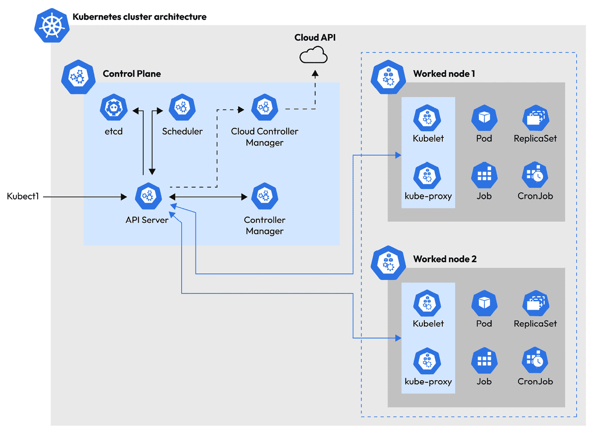

图 2.1 – Kubernetes 集群架构

若要深入了解 Kubernetes 架构中的每个组件，请参考官方 Kubernetes 文档（[`kubernetes.io/`](https://kubernetes.io/)）。该资源提供了关于 Kubernetes 系统各个方面的全面信息和详细说明，包括其主节点和节点组件。

现在我们已经基本了解了 Kubernetes 及其在 Kubernetes 集群中运行的主要组件，是时候学习如何使用 K3s（一种轻量级的 Kubernetes 发行版）在笔记本电脑上设置本地集群了。

# 探索 K3s 作为轻量级 Kubernetes 发行版

如前所述，在本书中，特别是在本章中，我们将使用 K3s 这个**轻量级**的 Kubernetes 发行版（[`k3s.io/`](https://k3s.io/)）来运行我们的示例。

K3s 特别适合于那些**全规模** Kubernetes 实施可能过于消耗资源或复杂的场景。

其轻量特性使其非常适合边缘计算和物联网（IoT）场景，这些环境中资源通常有限，而效率至关重要。在这些环境中，K3s 提供了必要的 Kubernetes 特性，同时消除了额外的开销。此外，Loft 的 vCluster 等解决方案已经利用 K3s 在 Kubernetes 内部运行 Kubernetes，促进了宿主集群中的多租户管理。这种方式允许在单一集群内创建独立的 Kubernetes 环境，优化了资源使用，并在多租户架构中提供了可扩展性。这些使用案例展示了 K3s 在多种计算环境中的多功能性和高效性。更多关于 K3s 的信息，请参阅官方文档：[`docs.k3s.io/`](https://docs.k3s.io/)。

K3s 名称的由来

如官方文档中所解释的（https://docs.k3s.io/），K3s 的名称源于创建一个内存占用显著更小的 Kubernetes 安装版本的意图。命名规则沿用了 Kubernetes 的命名惯例，Kubernetes 常被缩写为 K8s，由 10 个字母组成。将其字母数减半得出了 K3s，并且这个命名风格代表了 Kubernetes 更紧凑的版本。与 Kubernetes 不同，K3s 并没有扩展形式，其发音也未被官方定义。这个命名反映了创建一个更轻量、更高效的 Kubernetes 版本的目标。

K3s 简化了 Kubernetes 集群的部署过程，使其即便对于小规模操作或开发用途也变得可行。通过去除非必要的组件并使用更轻量的替代方案，K3s 大幅减少了 Kubernetes 的体积和复杂度，同时保持了其核心功能。

K3s 保持与更大 Kubernetes 生态系统的兼容性，确保为 Kubernetes 设计的工具和应用程序通常也能与 K3s 一起使用。

K3s 的一个关键特点是其单一二进制文件安装，包含了 Kubernetes 服务器和代理，简化了设置过程。这使得它成为开发人员的理想选择，尤其是那些希望快速设置一个用于测试或开发的 Kubernetes 环境，而无需完整的 Kubernetes 安装。

K3s 还提供灵活的网络和存储选项，满足从小型本地集群到更大、更复杂环境的各种用例需求。它的多功能性和易用性使其成为那些希望探索 Kubernetes 而不需要庞大基础设施的人的热门选择。

最后，K3s 的轻量化和高效性使其成为**持续集成**/**持续部署**（**CI/CD**）管道的理想选择，在资源有限的环境中能够加快构建和测试周期。在*第五章*中，我们将学习如何使用 K3s 在 Kubernetes 上运行 Kubernetes。

## 本地集群设置

在开始我们的第一个部署示例之前，首先需要设置环境，并了解 Kubernetes，特别是 K3s，如何帮助我们完成部署。K3s 主要设计用于 Linux 环境，因此请确保你有一个现代的 Linux 系统，如 Red Hat Enterprise Linux、CentOS、Fedora、Ubuntu/Debian，甚至是 Raspberry Pi。如果你是 Windows 用户，仍然可以通过设置**WSL**或通过**VirtualBox**运行 Linux**虚拟机**（**VM**）来使用 K3s。这些设置将帮助你准备好利用 Kubernetes 的强大功能进行部署。

### 选择你的本地 Kubernetes 环境——K3s、Minikube 和替代方案

本章中，我们选择使用 K3s 是因为它轻量化且易于设置，特别适合开发和测试 Kubernetes 环境。然而，还有许多其他替代方案可以用来设置本地 Kubernetes 集群，满足不同的需求和平台。例如，Colima（[`github.com/abiosoft/colima`](https://github.com/abiosoft/colima)）是 macOS 用户的一个优秀选择，提供了一个直接在 macOS 上运行的 Docker 和 Kubernetes 环境，几乎无需配置。**Minikube**（[`minikube.sigs.k8s.io`](https://minikube.sigs.k8s.io)）是另一个流行的选择，它支持 Windows、macOS 和 Linux，适合那些希望在单个节点上模拟 Kubernetes 集群的人，在这个节点上可以进行 Kubernetes 应用程序的实验和测试。

尽管在本章中我们选择使用 K3s，但我们鼓励你根据自己的平台或偏好使用最适合的本地集群设置。在后续章节中，我们将主要集中讨论如何使用 K3s 或 Minikube。这些平台为学习和部署 Kubernetes 应用程序提供了一个便捷且一致的环境，确保无论使用何种本地集群技术，我们所探讨的概念和过程都能轻松掌握。

### 设置 WSL

关于 WSL 的性质以及在 Windows 上安装它的过程超出了本书的范围。然而，关于安装步骤的全面指南和 WSL 的深入信息可以通过官方的 Microsoft 文档获取（请参见本章末尾的*进一步阅读*部分中的 [*1*]）：


图 2.2 – 一张表示 Windows 操作系统上运行 WSL 的概念图

请记住，通过官方站点保持更新最新的 WSL 版本和功能，将增强您的体验，并确保与最新的 Windows 更新兼容。

### 设置 VirtualBox

**VirtualBox** 是由 Oracle 开发的开源 **虚拟化软件**。它允许用户在一台物理计算机上运行多个操作系统，创建能够独立运行的虚拟机。这使得它成为软件测试、开发和教育目的的重要工具，因为它为运行和实验不同操作系统提供了一个灵活且隔离的环境，且不会影响宿主系统：

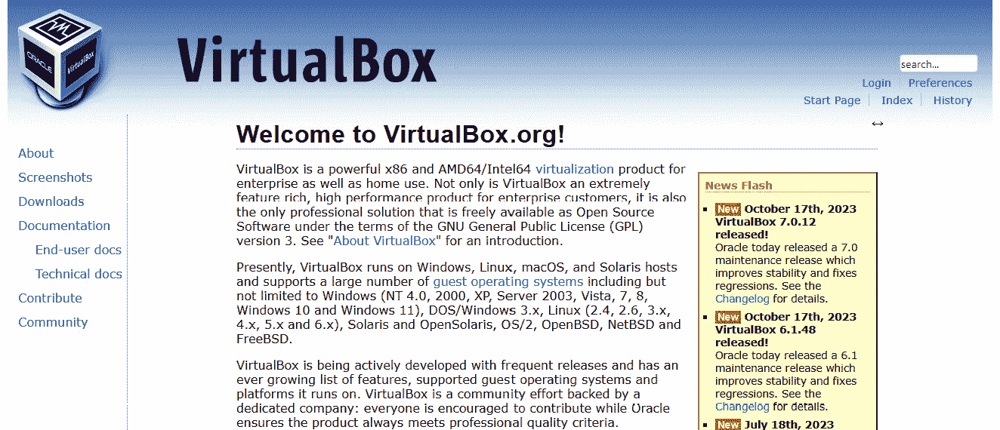

图 2.3 – VirtualBox 首页，网址：https://www.virtualbox.org/。

安装 VirtualBox 的详细步骤超出了本书的范围。然而，您可以在官方文档中找到全面的安装说明和其他信息 [*2*]。

为了获取最新的信息和技巧，强烈建议访问官方 VirtualBox 文档。

除非另有说明，本章及后续章节将假设在 WSL 中使用 **Ubuntu-22.04 LTS** 版本进行安装。此设置为我们的示例和演示提供了一个一致且可控的环境。

通过聚焦于特定版本的 Ubuntu，我们确保所提供的指导和场景尽可能相关和适用，紧密契合在 WSL 中使用的最常见且稳定的 Linux 发行版。

## K3s 设置和安装验证

本节将介绍使用默认配置的 K3s 建立 Kubernetes 集群所需的基本步骤，假设 WSL 已经安装并正常运行。

### 下载并安装 K3s

按照以下步骤下载并安装 K3s：

1.  让我们从打开一个新的终端窗口并输入以下命令开始：

    ```
    pietro), which does not need to match your Windows username. The next step involves setting the password that will be used to run a command as an administrator (sudo). If the operations are completed correctly, the Terminal window should look like this:
    ```

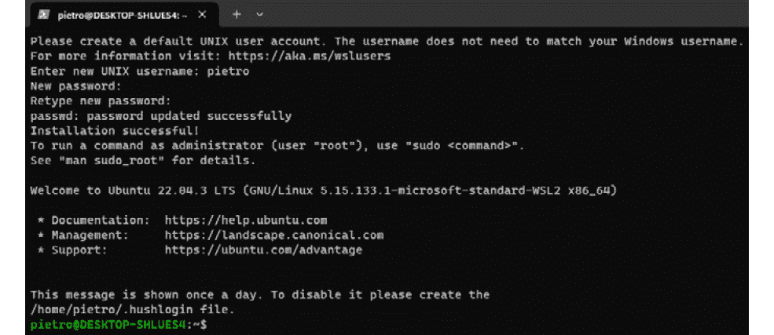

图 2.4 – 在 WSL 上成功安装 Ubuntu 22.04.3 LTS 实例

1.  在继续进行 K3s 设置之前，最好执行命令以更新操作系统并安装最新的补丁：

    ```
    $ sudo apt update
    $ sudo apt upgrade
    ```

    这确保您使用的是最新且安全的软件版本。

apt update 和 apt upgrade 命令

`apt update` 和 `apt upgrade` 命令在使用 APT 包管理器的系统中，尤其是在基于 Debian 的 Linux 发行版（如 Ubuntu）中，起着至关重要的作用。`apt update` 命令通过从配置的源获取可用软件包及其版本的最新信息来刷新本地包索引。这不会安装或升级任何软件包，而是更新包列表，以通知系统有关新软件、已删除软件或已更新软件的信息。包索引更新后，`apt upgrade` 命令用于将已安装的软件包升级到最新版本。它会下载并安装所有有新版本的软件包更新，确保系统是最新的，并可能更加安全。

如果需要，输入在安装 Ubuntu 时设置的密码。执行这些命令后，终端窗口应如下所示：


图 2.5 – 执行 `apt update` 和 `apt upgrade` 命令后的终端窗口

1.  下一步是使用以下命令安装 K3s：

    ```
    $ curl -sfL https://get.k3s.io | sh -s - --write-kubeconfig-mode 644
    ```

    上述命令将下载并设置必要的工具，随后启动 K3s 服务器。K3s 实例的成功设置如*图 2.6*所示：

    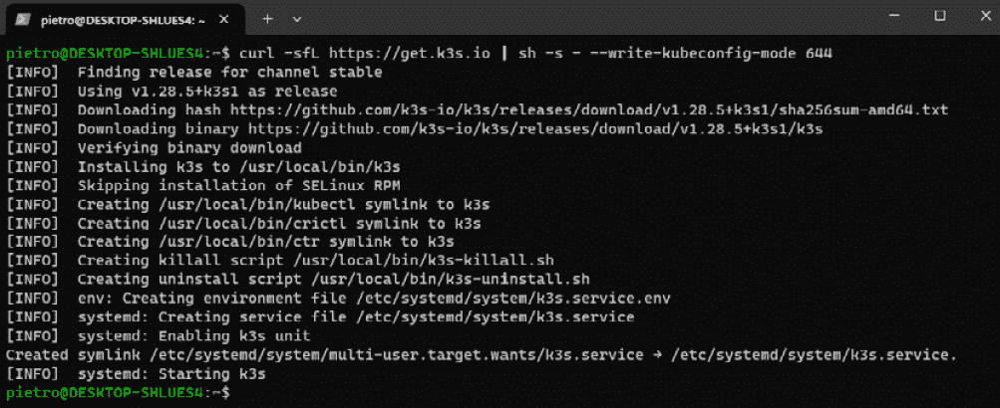

图 2.6 – 成功设置 K3s

### 验证 K3s 安装

必须使用两个命令来检查 K3s 设置和配置的正确性。第一个命令如下：

```
$ k3s --version
```

上述命令用于检查我们正在运行的 K3s 版本。如果 K3s 服务器运行正常，我们应该能看到类似以下内容的信息：


图 2.7 – 执行 `k3s –version` 命令的结果

检查 K3s 设置正确性的第二个命令如下：

```
$ k3s check-config
```

`k3s check-config` 命令对系统配置进行诊断检查，以确保其适合运行 K3s 集群。它验证关键方面，例如内核兼容性、所需的系统依赖项，以及必要功能和模块的存在。此命令有助于在进行 K3s 安装之前识别潜在问题或缺失的配置，从而确保更顺利的安装过程：

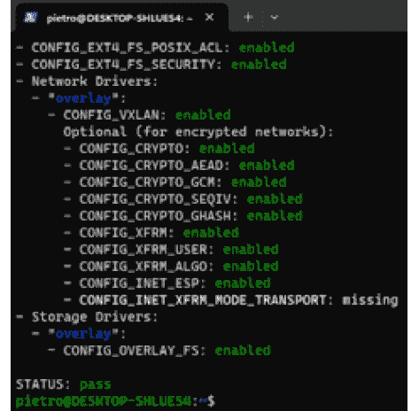

图 2.8 – 成功配置 k3s check-config 命令

恭喜！你已确认 K3s 服务器已经在本地开发环境中安装成功。现在是时候验证 Kubernetes 集群并部署一个测试应用程序了。

### 检查 Kubernetes 集群

为了确认我们的 K3s 节点正在运行，我们可以输入以下命令：

```
$ kubectl get nodes
```

如果 Kubernetes 集群正常工作，前述命令将产生以下输出：

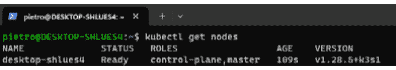

图 2.9 – 运行 kubectl get nodes 命令后的示例输出

确认节点正常运行后，我们可以运行以下命令以获取更多关于运行中的集群的信息：

```
$ kubectl cluster-info
```

`kubectl cluster-info` 命令是 Kubernetes 中一个非常有用的工具，用于获取关于集群的重要信息。执行此命令后，它会显示一些关键细节，如 Kubernetes 主节点和服务端点地址。这个命令帮助用户快速了解集群的控制平面及核心服务（如 KubeDNS 和适用时的仪表板）的状态和连通性。它对于故障排除和确保 Kubernetes 集群配置正确并正常运行特别有价值。使用简单，`kubectl cluster-info` 通常是验证 Kubernetes 环境健康状态和状态的第一个命令，如下所示：

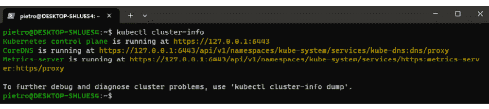

图 2.10 – 执行 kubectl cluster-info 命令后提供的信息

kubectl

**kubectl** 是一个命令行工具，是与 Kubernetes 进行交互的主要接口。它允许用户部署应用程序、检查和管理集群资源以及查看日志。基本上，kubectl 提供了有效控制 Kubernetes 集群所需的命令。用户可以使用这个多功能工具创建、删除和更新 Kubernetes 应用程序和基础设施的各个部分。它旨在用户友好，提供全面的帮助命令和输出格式选项，使用户更容易理解和管理复杂的 Kubernetes 环境。kubectl 是开发人员和系统管理员处理 Kubernetes 的不可或缺的工具，为在各种环境中处理容器化应用程序和服务提供了一种强大且灵活的方式。

## Kubernetes 清单

Kubernetes 清单是一个配置文件，通常使用 YAML 或 JSON 编写，定义了应该部署到 Kubernetes 集群的资源。它指定了对象（如 Pods、Services 或 Deployments）所需的状态，Kubernetes 需要根据这些清单创建和管理这些对象。这个清单使得用户能够以结构化且可版本化的格式声明应用程序的要求、网络和存储配置等设置。

例如，部署一个简单应用程序的基本 Kubernetes 清单可能如下所示：

```
apiVersion: v1
kind: Pod
metadata:
  name: hw-gitops-folks
spec:
  containers:
  - name: hw-gitops-folks-container
    image: k8s.gcr.io/echoserver:1.4
    ports:
    - containerPort: 8080
```

在这个清单中，定义了一个名为 `hw-gitops-folks` 的 Pod。它包含一个名为 `hw-gitops-container` 的容器，该容器使用 Kubernetes 容器注册表中的 `echoserver:1.4` 镜像。该容器暴露了 `8080` 端口。当这个清单应用到 Kubernetes 集群时，它将创建一个运行简单回显服务器的 Pod，可用于基本的测试。

## 我们的第一次 K3s 部署

现在我们已经成功地设置、配置并验证了我们的 K3s 集群，我们准备开始一个激动人心的阶段：为我们的首次部署做准备。此步骤标志着我们旅程中的一个重要里程碑，标志着我们从 K3s 的基础配置转向实际使用集群来进行实际应用。即将进行的部署过程不仅会加强我们对 Kubernetes 概念的理解，还将展示我们 K3s 环境的实际应用价值。这是一个理论与实践相结合的时刻，让我们亲眼看到我们配置的集群如何托管和管理应用程序。让我们带着探索 Kubernetes 配置的能力的热情前进，同时牢记我们所学的实践和已建立的强大基础设施：

1.  让我们首先输入以下命令，这将列出所有正在运行的 Pods：

    ```
    $ kubectl get pods
    ```

    执行该命令的结果应该如下所示：

    ```
    No resources found in default namespace
    ```

1.  上面的输出是正常的，因为到目前为止还没有执行任何部署。让我们试试另一个命令：

    ```
    kube-system namespace. These Pods are essential for the operation of the Kubernetes system. The specific Pods and their statuses are detailed in *Figure 2**.11*, offering a comprehensive view of the active system components within this crucial namespace:
    ```

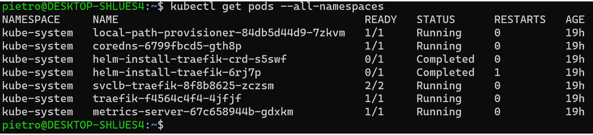

图 2.11 – 在 kube-system 命名空间中运行 Pods 的示例

什么是 Kubernetes 中的命名空间？

在 Kubernetes 中，命名空间是一个基本概念，用于将集群组织成逻辑上隔离的子组。它提供了一种在多个用户和应用程序之间划分集群资源的方法。本质上，命名空间就像是物理 Kubernetes 集群中的虚拟集群。它们允许进行资源管理、访问控制和配额管理，从而实现高效、安全的多租户环境。例如，不同的开发团队或项目可以在各自的命名空间中操作，而不相互干扰。命名空间还便于资源命名，确保具有相同名称的资源可以在不同的命名空间中共存。命名空间在 Kubernetes 中发挥着至关重要的作用，特别是在具有大量应用程序和团队的大型系统中，它们有助于实现可扩展性和维持秩序。

在 Kubernetes 中创建不同的命名空间被广泛认为是一种最佳实践，原因有很多。命名空间提供了集群的逻辑分区，使资源管理更加有序和高效。特别是在多个团队或项目的环境中，这种分隔尤为重要，它可以确保资源之间的清晰区分，减少命名冲突，并通过隔离工作负载来提高安全性。此外，命名空间还便于精细化访问控制，管理员可以为不同的命名空间分配特定的权限和资源限制，从而防止不同部分的集群之间发生意外或未经授权的互动。通过使用命名空间，团队还可以简化部署过程，更有效地监控资源使用情况，从而使 Kubernetes 环境更加健壮和可扩展。本质上，命名空间在维护复杂 Kubernetes 集群的秩序、安全性和效率方面至关重要。那么，让我们开始创建一个命名空间吧：

1.  让我们继续，在继续进行首次部署之前，先创建一个新的命名空间：

    ```
    $ kubectl create namespace gitops-kubernetes
    ```

    执行此命令后的响应应该类似于以下内容：

    ```
    namespace/gitops-kubernetes created
    ```

1.  删除命名空间的命令如下：

    ```
    hello-world image and a service to make the deployment accessible (the complete version of the manifest mentioned here can be found in this book’s GitHub repository):

    ```

    apiVersion: apps/v1

    kind: Deployment

    metadata:

    name: hello-world-deployment

    namespace: gitops-kubernetes

    ...

    spec:

    ...

    spec:

    containers:

    - name: hello-world

    image: nginxdemos/hello

    ports:

    - containerPort: 80

    ---

    apiVersion: v1

    kind: Service

    metadata:

    name: hello-world-service

    namespace: gitops-kubernetes

    spec:

    type: NodePort

    ...

    ports:

    - protocol: TCP

    port: 80

    nodePort: 30007

    ```

    To apply the manifest, we need to save it in a `.yaml` (or .`yml`) file, such as `hello-world-deployment.yaml` (its name isn’t important).
    ```

1.  要编辑文件，我们可以使用像 `nano` 这样的编辑器，运行以下命令：

    ```
    hello-world-deployment that runs a container using the nginxdemos/hello image, which serves a simple HTML page. The container is configured to expose port 80. In the metadata section, we have specified to run the Pod in the namespace we created previously – that is, namespace: gitops-kubernetes.
    ```

1.  `hello-world-service` 是 `NodePort` 类型，用于暴露部署。这项服务使得 hello-world 应用程序可以通过集群节点上的端口访问（在这个例子中是 `port 30007`）。在元数据部分，我们已指定在之前创建的命名空间中运行该服务——即 `namespace: gitops-kubernetes`。

NodePort

在这个 hello-world 服务示例中，选择了 `NodePort` 服务类型，以展示在 Kubernetes 中暴露服务给外部流量的一种简单方式。`NodePort` 会在所有节点上打开一个特定的端口，任何发送到该端口的流量都会被转发到该服务。虽然这对开发和测试很有用，但在实际的云环境中可能并不理想，特别是在云中的虚拟机（VM）上运行时。这是因为 `NodePort` 会暴露主机虚拟机/节点的端口，可能会通过让服务对外部可访问，造成安全风险。在生产环境中，通常更倾向于使用更安全和可控的服务暴露方法。

1.  要应用此清单，请使用 `kubectl apply -f <``filename>.yaml` 命令：

    ```
    $ kubectl apply -f hello-world-deployment.yaml
    ```

    执行此命令后的响应应该类似于以下内容：

    ```
    deployment.apps/hello-world-deployment created
    service/hello-world-service unchanged
    ```

1.  现在，我们可以使用以下命令列出在 `gitpos-kubernetes` 命名空间中运行的 Pods 和服务：

    ```
    $ kubectl get pods --namespace gitops-kubernetes & kubectl get services --namespace gitops-kubernetes
    ```

    此命令的结果显示在 *图 2.12* 中：

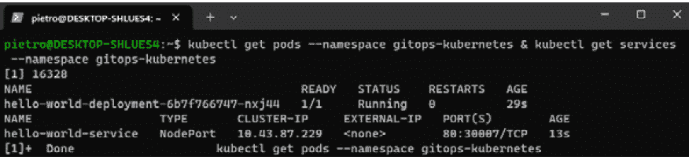

图 2.12 – 应用部署文件的结果，我们可以看到有用的信息，如集群 IP 和分配的端口

现在，我们已经在 Kubernetes 集群中部署了应用程序，下一步是测试其功能。这就是 **端口转发** 起到关键作用的地方。

## 端口转发

使用 kubectl 进行端口转发可以临时将流量从本地计算机路由到 Kubernetes 集群中的 Pod。此方法对于测试特别有用，因为它使我们能够像在本地运行应用程序一样与之交互，而无需公开暴露它。通过将本地端口转发到 Pod 的端口，我们可以验证部署的运行情况，确保应用程序在受控环境中按预期运行，然后再将其暴露给外部流量。以下步骤概述了在运行中的 Pod 上执行端口转发并使用 **curl** 测试其功能的过程：

1.  `kubectl` 命令将本地端口转发到 Pod 的端口：

    ```
    [POD_NAME] with the name of your Pod. For instance, in *Figure 2**.12*, the name of the pod is hello-world-deployment-6b7f766747-nxj44. Here, [LOCAL_PORT] should be replaced with the local port on your machine – for example, 9000 (ensure that the local port is not already used by another running service!) – while [REMOTE_PORT] should be replaced with the port on the Pod that you want to forward traffic to. In our case, as reported in *Figure 2**.10*, the Pod port is 80.
    ```

1.  此时，我们正在使用 Pod 的名称 `hello-world-deployment-6b7f766747-nxj44`。因此，如果我们想将本地端口 `9000` 转发到 Pod 的端口 `80`，命令如下：

    ```
    $ kubectl port-forward hello-world-deployment-6b7f766747-nxj44 --namespace gitops-kubernetes 9000:80
    ```

    这将产生以下输出：

    ```
    Forwarding from 127.0.0.1:9000 -> 80
    Forwarding from [::1]:9000 -> 80
    ```

    上述输出表明，端口转发已经在你的机器上设置好，将流量从本地端口重定向到 Kubernetes Pod 或其他网络服务的端口。保持此命令运行，因为它会维持端口转发会话。

1.  打开一个新的终端或命令提示符，并键入以下命令以打开新的 WSL shell：

    ```
    curl to send a request to the local port that is being forwarded:

    ```

    9000，kubectl 然后将其转发到 Pod 的端口（80）。你应该在终端中看到请求的输出。通常，这是由你的应用程序在 Kubernetes Pod 中提供的内容，如 *图 2.13* 所示：

    ```

    ```

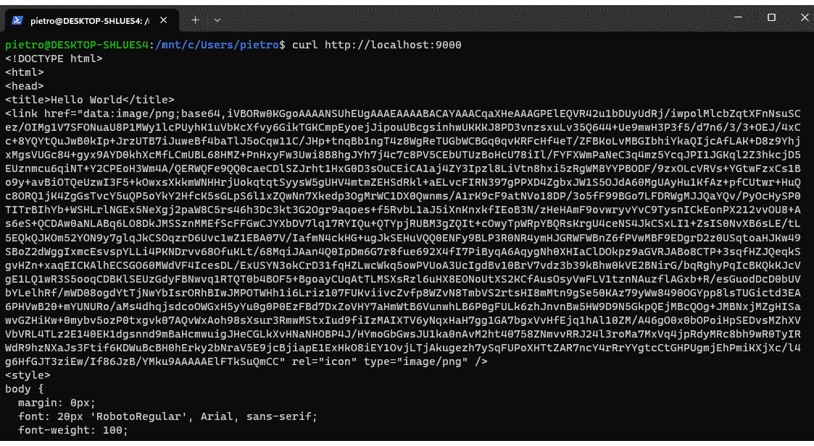

图 2.13 – 我们的应用程序在 Kubernetes Pod 中运行时提供的内容示例

恭喜你取得了这一了不起的成果！你已经成功在 Kubernetes 中部署了第一个应用程序，并且内容已经正确提供，正如通过成功的 `curl` 调用所证明的那样。这是你在 Kubernetes 旅程中的一个重要里程碑，展示了你不仅能部署应用程序，还能确保它在集群中的正常运行。

在接下来的章节中，我们将深入探讨 Docker，详细研究其基本组件、功能和实际应用。我们将构建我们的第一个 Docker 镜像，并展示如何将其作为容器在本地运行。

# 开始使用容器

由于其能够将应用程序及其所有依赖项打包和隔离，容器已成为云原生应用程序开发的基石。这种隔离确保了在各种环境中的一致性，使其在开发和部署中极为高效。**容器镜像**是包含可执行代码和依赖项的静态文件，采用**分层**结构以实现高效的修改和存储，每一层代表变更或添加。

尽管容器具有很强的多用途性，但 Kubernetes 并未提供用于构建这些镜像的原生机制，因此需要像**Docker**这样的外部工具。

Docker，作为一个开放源代码平台，通过简化应用程序在容器中的创建、部署和执行，改变了容器化的世界。它使开发人员能够以统一的格式封装带有其依赖项的应用程序，从而促进软件开发。Docker 的容器提供了半隔离的环境，平衡了隔离性与效率，允许多个容器在单个主机上并发运行。这些容器既轻量又便携，确保在从本地笔记本到云基础设施等各种平台上的统一功能性。

Docker 文件在创建这些镜像方面起着关键作用，指定包括的步骤和组件。

**开放容器倡议**（**OCI**）标准化容器镜像格式和运行时，进一步增强了在不同容器技术之间的互操作性和可移植性。

## Docker 设置

到目前为止，我们一直专注于在 WSL 中使用 Ubuntu 22.04 作为实例。虽然本书不涵盖 Docker 的逐步设置过程，但您可以在官方 Docker 文档中找到全面的安装指南和故障排除提示：[`docs.docker.com/engine/install/ubuntu/`](https://docs.docker.com/engine/install/ubuntu/)。成功安装 Docker 后，您可以在终端中输入以下命令验证其安装并检查 Docker 是否在系统上正常运行：

```
$ sudo docker run hello-world
```

`sudo docker run hello-world` 命令通过运行一个非常简单的容器快速验证了 Docker 的安装和设置。执行时，它执行以下操作：

+   `sudo`：确保命令以超级用户权限运行，这通常是 Docker 命令所需的。

+   `docker run`：告诉 Docker 运行一个容器。

+   `hello-world`：指定要使用的镜像。在这种情况下，它是 `hello-world` 镜像，这是由 Docker, Inc 创建的一个最小的 Docker 镜像，通常用作验证 Docker 是否安装和运行正常的测试镜像。

如果 Docker 已正确安装和配置，该命令将从 Docker Hub 拉取 `hello-world` 镜像（如果尚未下载），并基于该镜像创建一个新容器并运行。该容器仅显示一条消息，确认 Docker 安装正确，然后退出，如 *图 2.14* 所示：


图 2.14 – 执行 `docker run hello-world` 命令的结果

## Docker 替代方案

尽管 Docker 是构建容器镜像的最流行工具之一，但也有多个可用的替代工具：

+   **Podman**：一个开源的、无守护进程的容器引擎，可在 Linux 系统上运行。它与 Docker 兼容，但不需要运行守护进程。Podman 以简化容器和 Pod 管理而闻名。

+   **Rancherdesktop**：一款开源应用程序，提供在桌面上与容器和 Kubernetes 配合使用的所有必需工具。

+   **containerd**：一个核心容器运行时，遵循行业标准，作为服务可用于 Linux 和 Windows。它能够管理主机系统上容器的整个生命周期。

+   **CRI-O**：这是 Kubernetes 容器运行时接口的实现，便于使用与 OCI 兼容的运行时。它充当桥梁，将 OCI 兼容的运行时与 kubelet 连接起来。

+   **rkt（发音为“rocket”）**：由 CoreOS 开发，是一个适用于 Linux 的 Pod 原生容器引擎。它在现代集群环境中旨在提供安全性、简洁性和可组合性。

+   **LXD**：一个先进的系统容器和虚拟机管理器，通过使用 Linux 容器提供类似虚拟机的用户体验。

+   **OpenVZ**：这是一个基于容器技术的虚拟化解决方案，适用于 Linux 系统，能够在单一物理服务器上生成多个安全和隔离的 Linux 容器。

为了帮助选择最适合您特定需求的容器化工具，以下表格提供了多个 Docker 替代方案的比较。它突出了它们的主要特点和理想使用场景，为您提供有关哪个工具最符合您项目需求或偏好的见解：

| **替代方案** | **描述** |
| --- | --- |
| Podman | 最适合优先考虑安全性并且用户希望使用无守护进程的解决方案的环境。它与 Docker 的 CLI 完全兼容，使其成为无缝替代方案。 |
| Rancherdesktop | 一款用户友好的基于 GUI 的工具，专为希望更轻松地管理容器和 Kubernetes 的开发人员设计，特别适用于开发和测试环境中的桌面环境。 |
| Containerd | 由于其在生产环境中作为容器运行时的性能和可靠性而被选中。缺乏 Docker 的镜像构建功能，但在高效运行容器方面表现出色。 |
| Rkt | 以前是一个可行的替代方案，但其开发已停止，可能会限制其在长期项目中的适用性。 |
| OpenVZ | 适合托管解决方案或需要在单个主机上创建多个隔离的 Linux 环境的场景，专注于资源效率和可扩展性。 |

表 2.1 – 容器化工具的比较概览 – 评估不同开发需求下 Docker 的替代方案

## Dockerfile

创建容器镜像的第一步是定义一个 **Dockerfile**，它本质上是镜像的 **蓝图**。这个文件包含了一组指令和命令，告诉 Docker 如何构建镜像。它首先指定一个基础镜像，通常是一个操作系统的精简版本，比如 Ubuntu 或 Alpine Linux。接着，通过指定依赖项、复制应用程序文件和设置环境变量，逐步添加额外的层。Dockerfile 中的每一条命令都会创建镜像中的新层，逐步构建运行应用程序所需的环境。以下是一个 Dockerfile 的示例：

```
# Use an official Python runtime as a parent image
FROM python:3.8-slim
# Set the working directory in the container
WORKDIR /usr/src/app
# Copy the current directory contents into the container at /usr/src/app
COPY . .
# Install any needed packages specified in requirements.txt
RUN pip install --no-cache-dir -r requirements.txt
# Make port 80 available to the world outside this container
EXPOSE 80
# Define environment variable
ENV NAME World
# Run app.py when the container launches
CMD ["python", "app.py"]
```

让我们更仔细地查看这个文件：

+   `FROM python:3.8-slim`：这一行指定了构建时使用的基础镜像。该 Dockerfile 以 Python 3.8 镜像开始，特别是 slim 版本，它是一个较小、更紧凑的版本。

+   `WORKDIR /usr/src/app`：这一行设置容器内的工作目录为 `/usr/src/app`。以后所有的命令都将在该目录中运行。

+   `COPY . .`：这一行将 Dockerfile 当前目录中的文件复制到容器中的工作目录(`/usr/src/app`)。

+   `RUN pip install --no-cache-dir -r requirements.txt`：这一行在容器内执行一个命令，即安装 `requirements.txt` 中列出的 Python 依赖项。

+   `EXPOSE 80`：这一行通知 Docker 容器在运行时监听 `80` 端口。注意，这并不会发布端口。

+   `ENV NAME World`：这一行将 `NAME` 环境变量设置为 `World`。容器中运行的应用程序可以使用这个变量。

+   `CMD ["python", "app.py"]`：容器启动时执行的默认命令。该行启动 Python 应用程序。

这个 Dockerfile 提供了一个简单的示例，说明如何从一个简单的 `requirements.txt` 文件构建 Docker 镜像。你可以使用以下命令构建该镜像：

```
$ sudo docker build -t hello-world-py-app:1.0 .
```

此时，正如 *图 2.15* 所示，你的容器镜像正在构建过程中。在此过程中，Docker 会从 **公共容器注册表**（如 DockerHub、Quay 或 Red Hat Registry）中获取任何现有的层。容器注册表的相关内容将在接下来的页面介绍。然后，它会根据 Dockerfile 中的指令添加新的层。如果某些层已经存在于本地，Docker 会从容器缓存或 Docker 缓存中使用这些层，从而通过避免冗余下载来加速构建过程：

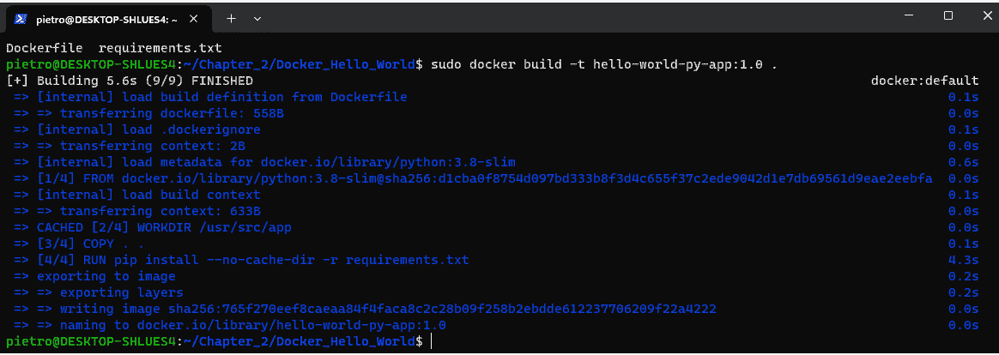

图 2.15 – docker build 命令的结果

容器镜像现在已在本地 Docker 缓存中可用，准备使用。可以使用以下命令验证其存在：

```
$ docker images
REPOSITORY           TAG       IMAGE ID       CREATED         SIZE
hello-world-py-app   1.0       765f270eef8c   7 minutes ago   139MB
hello-world          latest    d2c94e258dcb   8 months ago    13.3kB
```

一旦镜像创建完成，就可以在本地使用或上传到公共容器注册表以供外部使用，例如在 CI/CD 流水线中。为了我们的目的，我们将在本地运行容器镜像。为此，请使用以下命令：

```
$ sudo docker run -p 8080:8080 -ti hello-world-py-app:1.0
```

上述命令包含几个选项：

+   `-p`选项将主机上的端口绑定到容器上的端口，从而允许外部访问容器的服务

+   `-t`选项分配一个伪 TTY，为容器提供一个终端

+   `-i`选项启用交互模式，允许与容器进行交互

+   `-d`选项将在后台运行容器并输出一个哈希值，可用于与容器进行异步交互

公共容器注册表

公共容器注册表是一个在线服务，用户可以在其中存储和共享容器镜像。它作为一个集中式存储库，促进容器化应用程序的分发。为了上传和管理镜像，用户通常需要在注册表提供商处创建一个账户。该账户允许用户发布、更新和维护镜像，使其对他人可访问。Docker Hub、Google Container Registry 和 Amazon Elastic Container Registry 等公共注册表是流行的选择，提供便捷的互联网访问。这些平台不仅为容器镜像提供存储，还通常提供版本控制、目录管理和安全扫描等附加功能。拥有这些服务的账户使得开发人员能够在不同环境中一致地部署应用程序，简化软件开发，并更有效地与社区中的其他人进行协作。

请注意，创建公共容器注册表账户的过程虽然是管理和分发容器镜像的关键步骤，但超出了本章和本书的范围。每个注册表（如 Docker Hub 或 Google Container Registry）都有自己的一套账户创建和管理指南和程序。建议您参考这些服务提供的具体文档，了解设置账户的详细说明。

上述命令将在 Docker 网络内启动应用程序，并将其绑定到我们本地机器的端口`8080`。然后，它将等待传入的请求，如*图 2.16*所示：

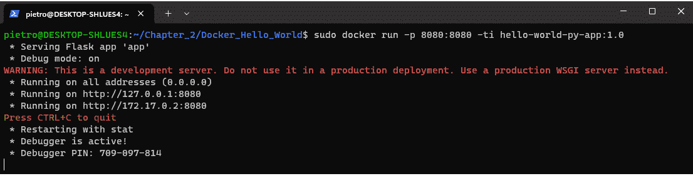

图 2.16 – docker run 命令的结果

在新的终端中，我们可以尝试使用`curl`访问正在运行的容器：

```
$ curl http://localhost:8080
```

或者，我们可以运行以下命令：

```
$ curl localhost:8080/[YOUR_NAME_HERE]
```

你将收到一个类似于*图 2.17*中的响应，我使用了我的名字来获取输出：

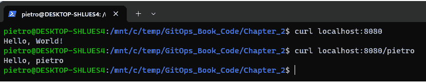

图 2.17 – 从我们作为容器化镜像运行的 Python Flask 应用程序接收到的响应示例

现在我们已经具备了必要的工具和对 Docker 及容器的理解，在接下来的章节中，我们将整合这些元素，构建第一个使用 Docker 和 K3s 的 CD 管道。

# 示例工作流——使用 Docker 和 K3s 实现轻松的 CD

到此为止，我们已经准备好使用迄今为止探索的工具创建一个非常简单的 CD 管道。基本思路是模拟开发人员执行的操作，更新我们到目前为止使用的 Flask 应用程序，添加一个新功能，允许获取当前的日期和时间。

我们的示例将包括执行以下步骤：

1.  **本地开发**：我们将编辑之前的 Python Flask 应用程序，暴露一个新的服务，返回当前的日期和时间。

1.  **将应用程序 Docker 化并在本地运行**：我们将像之前一样使用 `docker build` 命令在本地构建新版本的 Docker 镜像。使用 *Dockerfile* 部分作为参考。

    在构建镜像后，我们将使用 Docker 在本地运行它，以确保容器化应用程序按预期工作。使用 *Dockerfile* 部分作为参考。

1.  **将镜像发布到公共容器注册表**：我们将把构建的镜像发布到公共注册表仓库。

1.  **部署到 K3s**：我们将编写 Kubernetes 清单文件，指定应用程序如何在 K3s 上部署，包括使用哪个 Docker 镜像以及所需的副本数。

你将使用在本章 *探索 K3s 作为轻量级 Kubernetes 发行版* 部分中学到的命令，将此配置应用到你的 K3s 集群中。

让我们开始吧！

## 本地开发

编辑此书 GitHub 仓库中的 `app.py` 文件，添加以下 Python 代码：

```
…
@app.route('/datetime')
def datetime():
    import datetime
    now = datetime.datetime.now()
    return now.strftime("%Y-%m-%d %H:%M:%S")
…
```

你可以自由选择任何你喜欢的代码编辑器来编辑这个文件——这无关紧要。

## 将应用程序 Docker 化并在本地运行

按照以下步骤将应用程序 Docker 化并在本地运行：

1.  在 *Dockerfile* 部分，我们创建了第一个版本的 Docker 镜像，标签为 `hello-world-py-app:1.0`。现在我们添加了一个新功能，是时候创建这个镜像的新版本了。我们将使用标签 `2.0`，通过以下 `docker` `build` 命令进行构建：

    ```
    $ sudo docker build -t hello-world-py-app:2.0 .
    ```

1.  输入以下命令后，你应该能看到列出两个镜像：

    ```
    $ sudo docker images
    ```

    该命令的结果应如下所示：

    ```
    hello-world-py-app   2.0       a7d7ab4514fa   19 seconds ago      145MB
    hello-world-py-app   1.0       3f8f095a7b37   About an hour ago   145MB
    ```

1.  我们可以使用以下 `docker` 命令在本地运行 Docker 镜像：

    ```
    $ sudo docker run -p 8080:8080 -ti hello-world-py-app:2.0
    ```

    这将产生类似以下的结果：

    ```
    * Serving Flask app 'app'
    * Debug mode: on
    WARNING: This is a development server. Do not use it in a production deployment. Use a production WSGI server instead.
     * Running on all addresses (0.0.0.0)
     * Running on http://127.0.0.1:8080
     * Running on http://172.17.0.2:8080
    Press CTRL+C to quit
    …
    ```

1.  在一个新的终端中，我们可以尝试使用 `curl` 访问正在运行的容器：

    ```
    $ curl http://localhost:8080/datetime
    ```

    我们将获得当前的响应：

    ```
    2024-01-13 12:39:50
    ```

做得好——作为开发人员，你已经测试了新功能是否按预期工作！现在，我们可以将我们的镜像发布到公共仓库。

## 将镜像发布到容器注册表

将我们的 `hello-world-py-app:2.0` Docker 镜像发布到公共仓库涉及几个步骤：

1.  假设你已经在公共容器注册表（例如 Docker Hub）上有一个账户，第一步是打开一个新的终端，并使用 Docker CLI 登录到注册表：

    ```
    username/repository:tag format. Run the following command to tag the previously built image:

    ```

    $ sudo docker tag hello-world-py-app:2.0 [yourusername]/hello-world-py-app:2.0

    ```

    ```

1.  然后，我们需要推送标记的镜像：

    ```
    hello-world-py-app:2.0 image is listed there.
    ```

## 部署到 K3s

现在终于到了将镜像部署到本地 Kubernetes 集群的时刻！我们可以重用在 *我们的第一次 K3s 部署* 部分中使用的 Kubernetes 清单文件，但我们将做几个修改，最重要的是更新清单文件，指明 Kubernetes 集群需要从哪里下载镜像，使用我们的容器仓库。现在，让我们开始吧：

1.  在清单文件的 `deployment` 部分，我们需要将镜像值从 `nginxdemos/hello` 更改为 `[yourusername]/hello-world-py-app:2.0`。然后，我们需要将文件中指定的位置的名称从 `hello-world` 更改为 `first-cd-pipeline`：

    ```
        spec:
          sectioners:
          - name: first-cd-pipeline
            image: [yourusername]/hello-world-py-app:2.0
    ```

    在这里，我们还将部署的名称更改为 `first-cd-pipeline-deployment`。部署文件可以在本书的 GitHub 仓库中的 `Chapter02` 文件夹找到。

1.  保存新文件，命名为 `first-cd-pipeline-deployment.yaml`，并使用以下命令应用该部署：

    ```
    $ kubectl apply -f first-cd-pipeline-deployment.yaml
    ```

    响应应该像这样：

    ```
    deployment.apps/first-cd-pipeline-deployment created
    service/first-cd-pipeline-service created
    ```

1.  在建立端口转发之前，如 *我们的第一次 K3s 部署* 部分末尾所述，我们需要通过运行以下命令获取一些有用的信息：

    ```
    $ kubectl get pods --namespace gitops-kubernetes & kubectl get services --namespace gitops-kubernetes
    ```

    这将产生类似以下的输出：

    ```
    NAME                        TYPE       CLUSTER-IP     EXTERNAL-IP   PORT(S)        AGE
    first-cd-pipeline-service   NodePort   10.43.172.10   <none>        80:30007/TCP   29s
    NAME                         READY   STATUS    RESTARTS   AGE
    first-cd-pipeline-deployment-5b85cfd665-5626b   1/1     Running   0          29s
    ```

1.  到此为止，我们已经拥有执行端口转发所需的所有信息：

    ```
    curl to test that the new feature has been deployed and hosted by the K3s cluster:

    ```

    $ curl http://localhost:8080/datetime

    ```

    You should see an output similar to the following:

    ```

    2024-01-13 17:59:39

    ```

    ```

1.  要删除部署，输入以下命令：

    ```
    $ kubectl delete -f first-cd-pipeline-deployment.yaml
    ```

恭喜你通过手动 CD 部署达到了这个里程碑！

这里概述的将 Docker 镜像发布到公共容器注册表的步骤，应该视为一个手动示例，展示了 CD 的基本原理。然而，在实际操作中，这个过程通常使用 Git Actions 等工具进行自动化，从而简化和优化部署周期。尽管这些手动步骤提供了基础理解，现实应用中通常依赖更复杂的自动化工具来提高效率和一致性。在下一章中，我们将深入探讨如何将这些工具集成到工作流程中，从而增强 CD 过程并减少手动干预。

# 总结

在本章中，我们探讨了使用 Kubernetes 和 K3s 部署云原生应用的实践方面，重点介绍了高效的容器管理和编排的关键技术。本章侧重于构建管理云原生环境所需的基础技能，包括理解 Kubernetes 资源和部署方法。

随着我们进入下一章，重点将转向介绍 Git 工具。我们将探讨如何利用这些工具创建一个自动化的 CI/CD 流水线，这是无缝部署和管理云原生应用的核心组件，同时提升开发和运营工作流程。

# 进一步阅读

要了解更多关于本章所涉及的主题，请查看以下资源：

+   [*1*] [`learn.microsoft.com/en-us/windows/wsl/about`](https://learn.microsoft.com/en-us/windows/wsl/about)

+   [*2*] [`www.virtualbox.org/`](https://www.virtualbox.org/)
