# 第三章：版本控制与 Git 和 GitHub 的集成

到目前为止，我们的探索已经揭示了 GitOps 的基础概念及其在管理云原生操作中的关键作用。这一过程涉及了解 GitOps 在基础设施管理中的原理、优势及其变革性特征，以及它如何提升和简化云原生流程。

本章将进一步扩展这些概念。它将深入探讨 Git 在**版本控制**中的重要性，这一内容是现代软件开发的关键组成部分。本章还将探讨 GitHub 在协作开发中的贡献，以及如何最大化其在团队效率中的作用。此外，它还将讨论将 GitOps 实践与 Git 和 GitHub 集成的方式，强调自动化集成流程。

本章概述了在 GitOps 框架内使用 Git 和 GitHub 的最佳实践，旨在提升工作流效率，并促进强大的 DevOps 文化。

本章将重点讨论以下几个关键领域：

+   版本控制系统

+   为什么选择 Git？

+   探索 GitHub

+   集成 GitOps 和 GitHub

# 技术要求

为了充分理解本章中提出的概念和实践，需要满足一些技术要求。你应该具备基本的软件开发流程知识，并且熟悉命令行工具。为了跟随涉及 Git 和 GitHub 的示例，你需要一台能连接互联网的计算机。通过这种实践方法，你将能够将 GitOps 的理论和实践应用到现实世界的场景中。

本章的代码可以在我们的 GitHub 仓库的`Chapter03`文件夹中找到，网址：[`github.com/PacktPublishing/Implementing-GitOps-with-Kubernetes`](https://github.com/PacktPublishing/Implementing-GitOps-with-Kubernetes)。

# 探索版本控制系统——本地、集中式和分布式

**版本控制系统**（**VCSs**）是现代软件开发中不可或缺的工具，它们负责高效管理文件变化，特别是代码。Git 作为一种广泛使用的版本控制系统，通过跟踪修改记录，允许用户根据需要查看和恢复特定版本的文件，展现了这一功能的优势。对于协作项目而言，这种功能尤为重要，它提供了一个完整的记录，能够明确谁在什么时候、出于什么原因做了更改，从而增强了责任感和透明度。

本质上，版本控制是关于记录随时间变化的更改。这使得恢复项目的先前状态变得更加容易，无论是修复 bug、测试还是撤销更改。它不仅限于软件代码；版本控制可以应用于任何类型的文件，因此它成为了像图形设计师或网页设计师这样的专业人士的宝贵工具，他们可能需要管理工作版本。使用 VCS 可以最小化与文件丢失或错误相关的风险，因为它提供了一个安全网，能够轻松回退到早期状态并理解项目的演变。这提高了效率并且使工作流程更加结构化，同时减少了额外负担。

通过将版本控制集成到工作流程中，团队和个人获得了一个强大的工具，帮助他们应对项目开发中的复杂性，确保更顺畅、更可控的持续改进和协作过程。

版本控制系统（VCS）可以分为三种主要类型：本地、集中式和分布式：

+   **本地 VCS**（**LVCS**）：这是最简单的形式。它通过使用一个数据库来跟踪本地计算机中文件的更改，通常会将所有更改存储在版本控制下。这个系统直观易用，但有一些局限性，尤其是在协作和数据备份的环境中。*图 3.1*展示了左侧是 LVCS 的示例。

+   **集中式 VCS**（**CVCS**）：这些系统，如**Subversion**（**SVN**），有一个包含所有版本文件的单一服务器。各种客户端从这个中心位置检出文件。这种设置比 LVCS 大大增强了协作性，因为每个人都知道别人正在做什么。然而，中央服务器也是单点故障；如果它出现故障，就没有人可以继续协作或保存版本更改。

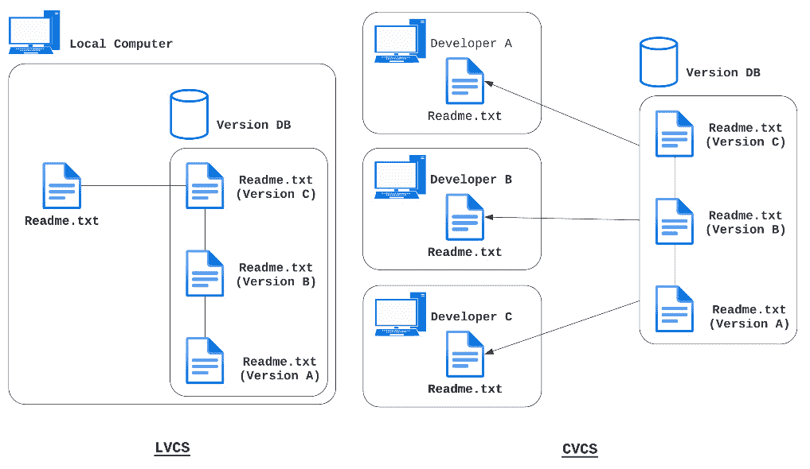

图 3.1 – LCVS 和 CVCS 的示例

并行版本控制系统与 SVN

**并行版本控制系统**（**CVS**）是早期的版本控制系统，它通过允许团队在集中式代码库中同时进行协作开发来促进软件开发。然而，它存在一些局限性，尤其是在处理二进制文件时。它还缺乏一些高级功能。SVN 作为 CVS 的现代替代方案应运而生，解决了这些问题。SVN 也是一个集中式系统，它通过允许多个用户高效地协作工作，提供了集中式的文件变更源，改善了协作，提高了不同团队成员所做变更的跟踪与管理。

+   **分布式版本控制系统**（**DVCSs**）：像 Git 这样的系统属于这一类别。与单一的中央仓库不同，每个用户都拥有整个仓库的完整副本。这种方式支持更复杂的工作流程，增加了冗余性和备份选项，还能实现离线工作。同时，它支持各种形式的**合并**和**分支**，为版本控制提供了更灵活的方式，尤其适用于有众多贡献者的大型项目。

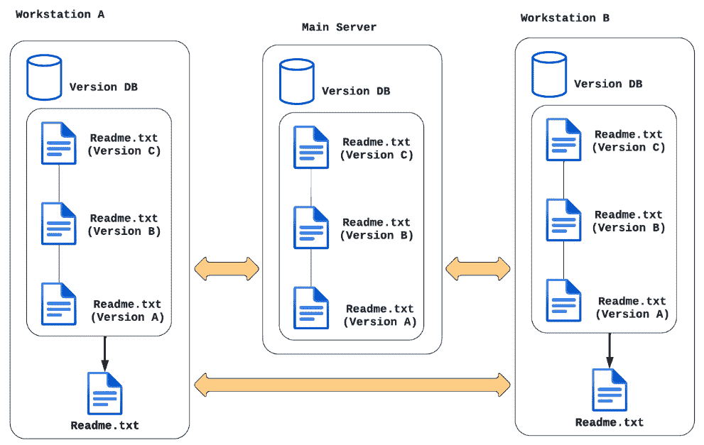

图 3.2 – 分布式版本控制系统示例

在探索过包括 LVCS、CVCS 和 DVCS 在内的多种版本控制系统（VCS）后，我们可以清楚地看到 Git 在 DVCS 中为何如此突出。接下来，我们将深入探讨 Git 的独特优势和功能，了解它为何成为现代软件开发中的必备工具。

# 为什么选择 Git？

Git 的故事始于 2000 年代初期 Linux 内核项目的开发挑战。这一时期，Linux 的创始人 Linus Torvalds 遇到了现有版本控制工具的困境。当时 Linux 社区使用的专有分布式版本控制系统（DVCS）BitKeeper 存在诸多限制和约束，迫切需要一个新系统。这促使了 2005 年 Git 的诞生，标志着版本控制系统领域的重大转变。

Git 的设计目标明确，汲取了使用 BitKeeper 时的经验教训。其中最关键的目标包括速度、简洁的设计以及对非线性开发的强大支持。该系统特别针对 Linux 内核等大型项目进行优化，既提高了速度，也有效处理了数据量。这种对效率和灵活性的关注在面对如此规模和复杂性的项目时至关重要。

Git 的结构独特且高效。它是一个分布式版本控制系统，意味着每个用户都在本地存储项目的完整历史。这样的设计不仅提升了速度，还为版本控制提供了更加灵活和安全的方式。在 Git 中，**仓库**包含**提交**，这些提交本质上是项目在不同阶段的快照，以及对这些提交的引用（称为**头**）。多年来，Git 逐渐发展和成熟，在保留最初特点的同时，也变得更加用户友好。它与 GitHub 等平台的集成（我们将在本章的 *探索 GitHub* 部分深入探讨 GitHub）以及 **Bitbucket** 和 **GitLab** 的结合进一步增强了其功能，提供了集中式的协作、代码共享和项目管理平台。

为了说明 Git 的广泛应用，值得一提的是，GitHub 社区宣布其平台上的开发者数量已超过 1 亿人：

[`github.blog/2023-01-25-100-million-developers-and-counting/`](https://github.blog/2023-01-25-100-million-developers-and-counting/)

在 GitOps 实践中使用 Git 强调了其可靠性和高效性，使其成为现代软件开发和版本控制的基石。

在从多个角度理解了 Git 的重要性之后，我们现在将转向更实际的方式。在接下来的部分中，我们将从 Git 命令的基础和示例开始，提供一个实践经验。

## Git 设置

本章不深入介绍 Git 安装的细节，但你可以在官方 Git 文档中找到一份详细的逐步指南（请参见本章末的*进一步阅读*部分中的[1]）。在我们讨论的过程中，我们假设 Git 已经安装在**Windows Subsystem for Linux**（**WSL**）Ubuntu 22.04 发行版上。需要强调的是，Git 可以在 Windows（无需 WSL）、macOS 和 Linux 上本地安装。

有关设置 WSL 的更多信息，请参阅*第二章*，特别是其中的*WSL 设置*部分，其中提供了相关的指导和见解。

要验证您的 Git 安装，您可以在命令提示符中输入一个特定的命令。此命令将帮助您确认 Git 是否已正确安装并正常运行：

```
$ git version
```

预期的响应应类似于以下内容：

```
git version 2.45.1
```

做得好！在接下来的部分中，我们将深入探讨 Git 的基础，学习其命令，并研究 GitOps 中必不可少的最有趣的功能。

## 创建和克隆 Git 仓库

Git 仓库是 Git 版本控制系统的基石，包含所有项目文件及其修订历史。它通过包含必要变更跟踪数据的 `.git` 目录进行标识。仓库可以是用户计算机上的本地实体，也可以是 GitHub 等服务器上的远程版本，支持个人工作和协作工作。它们在项目版本管理和演化中扮演着至关重要的角色，以提交的结构化链表格式存储文件和历史记录。该设置支持多种交互，如**克隆**（从远程服务器创建仓库的本地副本）、**分支**（从主代码库分支出独立版本进行开发或测试，且不影响原始代码）以及**代码版本比较**（检查不同版本代码文件之间的差异，以跟踪变更或合并更新）。

可以通过两条命令来启动一个 Git 仓库：

+   `git init`：此命令用于在尚未受版本控制的目录中初始化一个新的 Git 仓库。执行此命令会在目录中创建一个名为 `.git` 的隐藏子文件夹，设置仓库管理和版本控制所需的结构。

+   `git clone`：此命令用于创建现有 Git 仓库的本地副本，通常是托管在远程服务器上的仓库，例如 GitHub。当你克隆一个仓库时，它不仅下载项目文件，还将完整的历史记录和所有分支下载到你的本地仓库中。这个过程确保你可以访问项目的完整开发历史。

打开命令提示符并激活一个 WSL 实例，具体步骤详见*第二章*中，*设置 WSL*部分，然后按照随后的编号步骤创建并克隆一个 Git 仓库：

1.  创建一个名为`Chapter_3`的新目录：

    ```
    Chapter_3 as the current working directory, type cd Chapter_3 into the command prompt.
    ```

1.  一旦进入`Chapter_3`目录，你就可以使用`git init`命令初始化一个新的 Git 仓库。此步骤对于在新项目目录中启动版本控制至关重要：

    ```
    $ git init
    ```

    命令的输出应该如下所示：

    ```
    hint: Using 'master' as the name for the initial branch. This default branch name
    hint: is subject to change. To configure the initial branch name to use in all
    …
    hint:   git branch -m <name>
    Initialized empty Git repository in /home/pietro/Chapter_3/.git/
    ```

1.  使用`ls -a`命令列出工作目录的内容后，你应该能够看到新创建的`.git`隐藏目录。这个目录表明 Git 仓库已成功初始化：

    ```
    .git directory, you can use the ls -a ./.git command. This will display all the files and subdirectories within the .git directory, providing insight into the structure of the initialized Git repository:

    ```

    $ ls -a ./git

    ```

    The output should look like the following:

    ```

    .  ..  HEAD  branches  config  description  hooks  info  objects  refs

    ```

    ```

1.  要通过克隆初始化一个仓库，首先需要导航到另一个目录。然后，在该目录中执行克隆命令，并使用适当的 URL 在新位置创建一个现有 Git 仓库的副本。这个过程将复制仓库，包括其历史记录和分支，进入你指定的目录：

    ```
    $ git clone https://github.com/PacktPublishing/Implementing-GitOps-with-Kubernetes
    ```

    命令的输出应该如下所示：

    ```
    Cloning into 'Implementing-GitOps-with-Kubernetes'...
    remote: Enumerating objects: 151, done.
    remote: Compressing objects: 100% (94/94), done.
    ...
    Resolving deltas: 100% (32/32), done.
    ```

我们现在已经学会了如何从头开始创建一个新仓库，或通过克隆一个现有的仓库来创建一个新仓库。接下来，我们将重点了解和使用基本的 Git 命令来开始记录我们仓库中的更改。此步骤对于管理和跟踪项目文件的演变至关重要。

## Git 基础知识

理解 Git 的基础知识包括熟悉一系列基本命令，这些命令有助于软件开发中的版本控制。通过这些命令，你可以跟踪并管理项目文件的更改，控制项目演变的每个方面。从暂存和提交更改到管理分支和更新项目以获取最新开发，掌握这些命令对于有效使用 Git 至关重要。本介绍将带你了解`git status`、`git add`、`git commit`、`git branch`、`git merge`、`git pull`和`git push`等关键命令，每个命令在 Git 工作流中都发挥着至关重要的作用：

+   `git status`：此命令显示更改的状态，指示这些更改是未跟踪、已修改还是已暂存。

+   `git add`：此命令将更改暂存到你的项目历史中。它为下一步做准备，允许你控制哪些内容成为项目历史的一部分。

+   `git commit`：此命令将暂存的更改保存到项目的历史记录中，类似于捕捉快照。它完成了使用 `git add` 暂存的内容。

+   `git branch`：使用此命令查看本地正在工作的分支，从而了解不同的开发线路。

+   `git merge`：此命令将不同的开发线路合并，通常用于将一个分支的更改整合到另一个分支（例如，将 `feature` 分支合并到 `master` 分支）。

+   `git fetch`：此命令更新你本地的远程仓库变更数据库，在将这些变更整合到本地分支之前，用于查看更新内容。

+   `git pull`：此命令将远程仓库的更改更新到你的本地开发分支。当你需要在本地环境中同步他人做出的更改时，这非常有用。

+   `git push`：此命令将本地提交更新到远程仓库，确保远程仓库反映出你的最近更改。

### 基本的 Git 提交状态推送循环示例

让我们从一个实际的例子开始，展示如何在本地使用 Git，使用*Git 基础*部分列出的命令。你可以自由使用本章*创建和克隆 Git 仓库*部分初始化的仓库，也可以从一个新的仓库开始：

1.  设置 GIT 身份：

    ```
    $ git config --global user.email "you@example.com"
    git status command to see the current state of your files, whether they are untracked, modified, or ready to be committed:

    ```

    $ git status

    ```

    The response to this command should look something like this:

    ```

    在主分支上

    尚未提交

    无需提交（创建/复制文件并使用“git add”进行跟踪）

    ```

    This indicates that your working directory is clean, meaning that no tracked files have been modified and no untracked files are present. Additionally, it confirms that you’re on a specific branch (`master`) that hasn’t diverged from its remote counterpart.
    ```

1.  在工作目录中创建一个新的非空文件：

    ```
    README file in the current working directory.
    ```

1.  再次执行 `git status` 命令：

    ```
    On branch master
    No commits yet
    Untracked files:
       (use "git add <file>..." to include in what will be committed)
           README
    README file appears with the untracked status because Git recognizes it as a file that is not present in the last commit and that hasn’t been prepared for inclusion in future commits. The untracked status prevents Git from automatically adding files that might not be intended for version control, such as binary files. To include the README file in your project’s version history, you need to explicitly track it with Git, ensuring it’s considered for subsequent commit snapshots.
    ```

1.  要跟踪修改，添加新文件，请使用 `git` `add` 命令：

    ```
    git status command again:

    ```

    在主分支上

    尚未提交

    待提交更改：

    （使用 "git rm --cached <file>..." 来取消暂存）

    README 文件现在已被标记为暂存，因为它出现在“待提交更改”部分，表示它已准备好进行下一次提交。

    ```

    ```

1.  通过将暂存区准备好，如所需的，现在是时候使用 `git commit -m "添加 README 文件"` 将更改记录到仓库历史中了，这样我们就能指定我们已实现的修改：

    ```
    git commit command should be like the following:

    ```

    [master (root-commit) f933b54] 添加 README 文件。

    1 个文件已更改，1 个插入（+）

    创建模式 100644 README

    ```

    Whenever you add, modify, or delete one or more files (or non-empty folders), you’ll need to repeat *steps 5* and *7* to ensure that those changes are properly staged and committed.
    ```

### Git 工作流

基本的 Git 工作流涉及一种战略性分支方法，有助于高效的开发和发布过程。此策略包括不同类型的分支：

+   `Main (或 Master)`：项目生命周期中维护生产就绪代码的基础分支

+   `Develop`：与主分支一起启动，包含预生产代码和正在测试的功能

+   `Feature`：用于开发新功能，这些分支在完成后会合并回 `develop` 分支

+   `Release`：专门用于准备代码发布到生产环境

+   `Hotfix`：直接在主分支上修复紧急问题

在此工作流中，变更通过提交进行跟踪。提交记录了文件修改的历史，包括修改内容、修改者以及修改时间。这种结构不仅有效地组织了工作，还通过明确定义每个分支的目的并简化新特性、修复和发布的整合，加速了发布周期。*图 3.3* 展示了一个 Git 工作流示例。

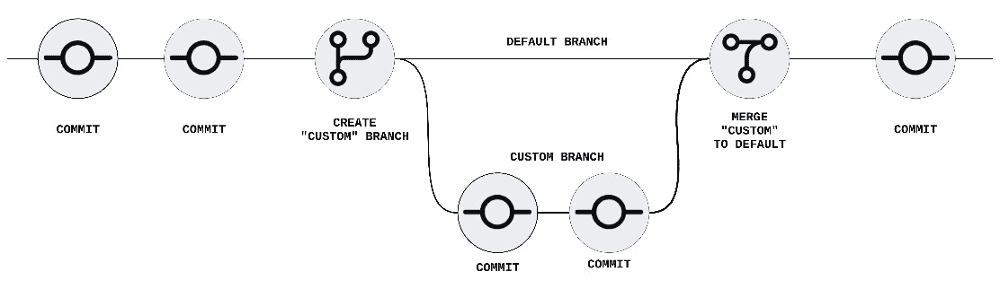

图 3.3 – Git 工作流示例

最初，仓库的内容位于默认分支中。为了进行修改或添加，建议创建并在自己的分支上进行工作。这种做法可以确保主代码库保持稳定，同时开发特性或修复。深入探讨 Git 的复杂性，如分支、合并和远程策略，超出了本书的范围。然而，对于那些希望深入了解的人，可以参考 PACKT 出版的《Mastering Git》，*第[3]章* 在*进一步阅读*部分中提供了关于高级 Git 概念的全面见解。这是扩展 Git 知识的极好资源，帮助你超越基础知识。

本节结束了我们对 Git 的简要探讨，标志着我们进入 GitHub 之旅的开始。接下来的章节将介绍并深入探讨 GitHub，展示其在 GitOps 世界中的重要性和实用性。

# 探索 GitHub

GitHub 是软件开发领域的一个重要平台，作为使用 Git 的协作项目的中心。它通过提供基于 Web 的图形界面，扩展了 Git 的功能。GitHub 使得托管公共和私有仓库变得更加便捷，便于个人和团队无论地理位置如何都能共同协作。它的重要性不仅仅体现在代码存储上，还在于促进了一个社区，在这个社区中，开发者可以分享、贡献并在彼此的工作基础上进行建设，推动开源开发文化的发展。

注意

创建 GitHub 账户对于在这个广泛使用的平台上存储源代码至关重要。本书将引导你通过使用 GitHub 来管理公共和私有仓库中的代码。有关账户创建的详细说明可以在 GitHub 网站上找到，你可以在其中找到所有开始使用所需的信息（[`github.com/`](https://github.com/)）。

SSH 访问提供了一种安全的方式与 Git 仓库进行交互，免去了每次命令输入用户名和密码的需求。它对于无需账户即可克隆公共项目特别有用。然而，对于分叉或推送更改，仍然需要一个账户。有关详细的设置说明，请参阅 GitHub 官方的 SSH 访问指南（[`docs.github.com/en/authentication/connecting-to-github-with-ssh`](https://docs.github.com/en/authentication/connecting-to-github-with-ssh)）。

GitHub 显著提升了协作软件开发，通过支持远程团队合作并简化诸如错误跟踪和持续集成等流程。其拉取请求系统促进了协作，便于代码审查和合并。此外，GitHub 作为一个综合的代码托管平台，支持公共和私人仓库，从而增强了开源和私人项目的支持。这种可访问性和与开发工具的集成使得 GitHub 对全球开发者来说是不可或缺的。

## GitHub 的生态系统

GitHub 的生态系统是一个全面而动态的环境，超越了简单的代码托管。它涵盖了一系列支持整个软件开发生命周期的工具、集成、社区功能和服务。这些包括项目管理工具、问题跟踪、持续集成和部署服务以及代码审查设施。此外，GitHub 还提供了一个庞大的社区和开发者网络，贡献开源项目、分享见解，并在各种项目上进行合作。这个生态系统已经成为软件开发世界的一个重要组成部分，促进了全球开发者之间的创新与合作：

+   **版本控制**：GitHub 的核心功能是提供基于 Git 的版本控制，用于管理和跟踪代码更改

+   **问题跟踪**：包括报告和跟踪项目中的错误、功能请求和任务的工具

+   **协作功能**：诸如拉取请求和代码审查等功能促进了协同编程和团队互动

+   **GitHub Actions**：用于自动化工作流，例如**持续集成**和**持续部署**（**CI/CD**）

+   **项目管理**：用于组织和优先排序工作的工具，例如项目和看板

+   **社区与网络**：为开发者提供一个平台，贡献开源项目、建立网络并进行合作

+   **Marketplace**：提供第三方应用和集成，以扩展 GitHub 功能

+   **GitHub Pages**：提供直接从 GitHub 仓库托管静态网站和文档的服务

+   **安全功能**：包括漏洞扫描和管理访问控制的功能

在了解了 GitHub 是什么以及如何访问之后，现在是时候将我们的注意力转向实际应用了。

GitHub 通过集成更好的代码质量工具来增强软件开发流程，例如命令行操作、问题讨论、拉取请求和代码审查，以及 GitHub Marketplace 中可用的大量应用。

它通过 GitHub flow 促进了协作，使开发者能够高效地管理仓库中的工作，概述项目方向，并在彻底讨论和达成一致后无缝合并更新。它从而改变了传统的软件构建方法。

## GitHub flow

GitHub 流程是一种基于分支的工作流程，集成了 Git 命令，适用于全球团队。它包括为并行开发创建分支，为可逆的项目点添加提交，并使用拉取请求促进透明度（见本章中的*Git 工作流*部分）。代码审查是核心，促进了开放文化。合并操作无缝地整合了变更，而部署确保了代码的稳健性。这种工作流程适应了各种协作规模，从小团队到全球贡献，强调拉取请求的讨论和整合。GitHub 的工具取代了传统的邮件审查，简化了开发过程。我们可以将 GitHub 流程总结为以下步骤：

1.  创建仓库。首先需要在我们的 GitHub 空间中创建一个仓库。在 GitHub 空间的每个页面的右上角，点击**+**，然后点击**新建仓库**，如*图 3.4*所示。

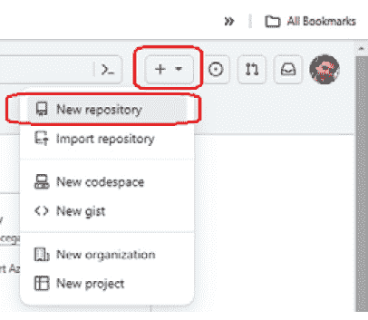

图 3.4 – 创建一个新的 GitHub 仓库

对于仓库名称，你可以选择像`gitops-for-k8s-gitops-integration`这样的名称。**描述**是可选的。根据你对开放访问或限制可见性的偏好，决定是选择私有仓库还是公共仓库。确保勾选**添加 README 文件**复选框，然后点击**创建仓库**按钮，如*图 3.5*所示。

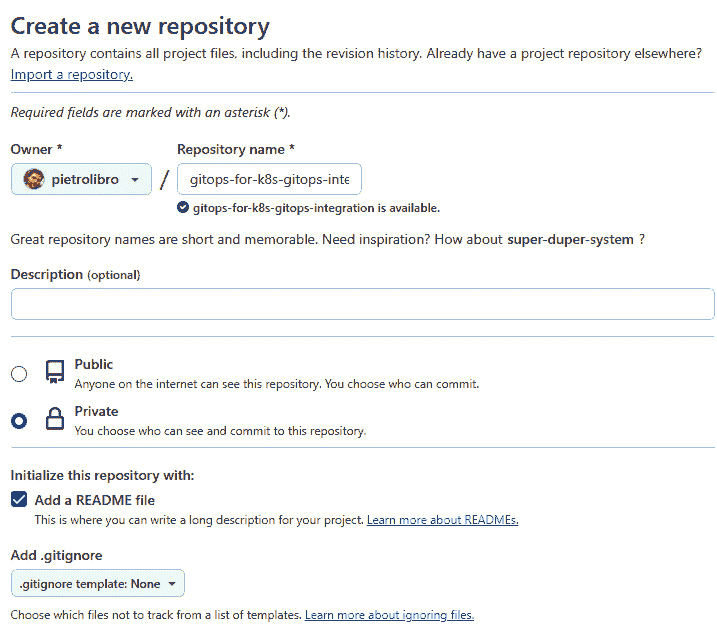

图 3.5 – 创建一个新 GitHub 仓库的表单

1.  创建分支。默认情况下，创建的仓库有一个名为`main`的分支，认为它包含生产就绪的代码。最佳实践建议为我们要实现的每个功能使用不同的`feature`分支。要在 GitHub 中创建新分支，点击`main`项目，如*图 3.6*所示。要创建新分支，点击**创建分支 features/docker-file-and-ci**，如*图 3.6*所强调的那样。

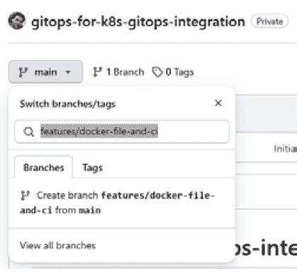

图 3.6 – 创建一个新的 features/docker-file-and-ci 功能分支

1.  添加提交。现在是时候向我们的仓库中添加一些有用的文件了。在本练习中，我们将使用本书中*第二章*的*Dockerfile*部分中看到的相同 Docker 文件。要添加 Docker 文件，请点击**添加文件**按钮（见*图 3.7*）。如果选择**创建新文件**，将会打开一个编辑器，在其中粘贴 Docker 文件内容并提交。另一种选择是选择**上传文件**，直接从你的计算机上传 Docker 文件。

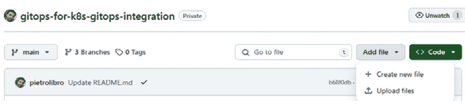

图 3.7 – 添加新文件或上传现有文件的菜单

1.  复制 Docker 文件的内容并将文件命名为`dockerfile`，如*图 3.8*所示。点击在*第二章*的*Dockerfile*部分中使用的`requirements.txt`文件。

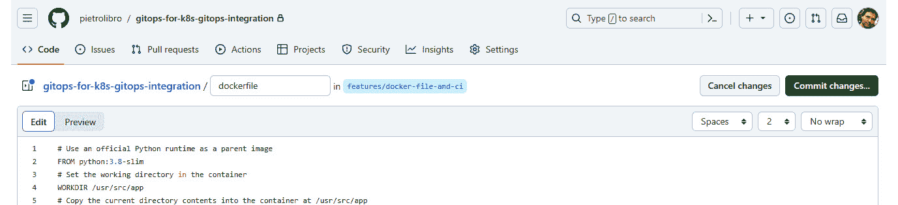

图 3.8 – GitHub 编辑器界面用于编辑仓库文件

1.  通过指定所采取的操作来采用最佳的提交信息实践，例如`Create dockerfile`作为建议的描述，并提交你的更改。在主页中，选择`README`文件并在文件开头添加以下行，然后使用默认描述提交更改：

    ```
    ## This repository will be used to show GitOps and GitHub capabilities
    ```

    请参见* [2]*中的*进一步阅读*部分，了解有关提交最佳实践的有用列表。

1.  打开一个拉取请求。在`main`分支派生的分支中进行更改后，你可以启动一个拉取请求，这是 GitHub 协作的核心元素。此功能允许你建议更改，寻求审查以将你的贡献合并到另一个分支，并通过颜色突出显示差异。即使代码尚未最终确定，你也可以在提交后立即使用拉取请求开始讨论。在自己的仓库中练习这一操作，通过自己合并来熟悉 GitHub 的协作流程，是在进行更大项目之前的一个极好的方法。

1.  在仓库的标签页中，点击仓库的**Pull requests**标签，然后点击**New Pull request**。在**Example Comparison**框中，选择**features/dockerfile-and-ci**分支与**main**分支进行比较，如*图 3.9*所示，然后点击**Create pull request**按钮。

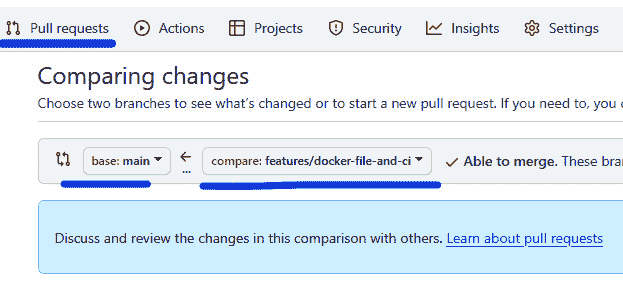

图 3.9 – 创建拉取请求并选择比较的分支

1.  在页面底部的比较视图中查看更改。如果它们准确反映了你想要的修改，继续创建拉取请求。为你的拉取请求指定一个标题，并简要描述你的更改，比如详细说明添加了一个 Docker 文件以及使用 GitHub Actions 自动化 Docker 镜像构建。你可以在描述中添加表情符号、图片或 GIF，并通过创建拉取请求来完成。

1.  讨论和审查代码。开始协作时，需要从同事那里寻求对拉取请求的审查。此步骤允许协作者在最终合并到`main`分支之前提供反馈或建议修改，从而确保代码集成是以达成共识为基础的。

1.  在最后一步，将你的`features/dockerfile-and-ci`分支合并到`main`分支以添加更新。如果你的拉取请求与`main`分支之间出现任何冲突，GitHub 会提示你在合并之前解决这些冲突。如果没有冲突，合并应该是顺利的。完成此过程后，选择`main`分支。

我们已经介绍了 GitHub 和 GitFlow 的基本概念，并提供了一个动手示例。我们鼓励你按照本章中 *Git 仓库* 部分的指导，使用 Git 命令行工具来克隆仓库。掌握了这些基础知识后，我们准备深入了解将 GitOps 与 GitHub 集成，特别是通过提交自动化 Docker 部署。

# 集成 GitOps 和 GitHub

GitHub Actions 提供了一个强大的自动化工具，能够在 GitHub 生态系统内帮助开发人员简化软件开发工作流。具体而言，GitHub Action 可以显著增强 GitOps 工作流，通过自动构建和推送 Docker 镜像到服务，并随后将新版本部署到 Kubernetes 集群。这一功能简化了 CI/CD 过程，使团队能够更轻松地在云原生环境中高效维护和更新他们的应用程序。

最佳实践建议，当你想使用这个 GitHub Action 时，你的 GitHub 仓库应该有一个 `dev` 分支和一个 `master` 或 `main` 分支，并且应该使用标签进行发布。在以下示例中，为了简便起见，我们将直接在 `main` 分支上工作。最佳实践建议在不同的分支中进行操作。

以下是使用 GitHub Actions 自动化 Docker 镜像创建的步骤：

1.  点击仓库选项卡中的 **Actions**，如 *图 3.10* 所示：

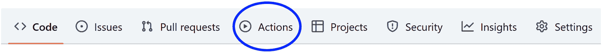

图 3.10 – 以圆圈标出的 Actions 按钮所在的选项卡菜单

1.  在新页面上，点击 **set up a workflow yourself**，如 *图 3.11* 所示：

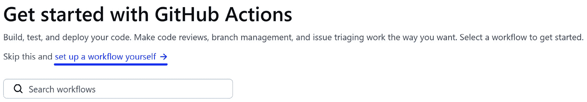

图 3.11 – 在 GitHub 中手动定义工作流

1.  在编辑器中，添加以下内容：

    ```
    name: Create Docker Image CI
    on:
      push:
        branches: [ main ]
      pull_request:
        branches: [ main ]
    jobs:
      build:
        runs-on: ubuntu-latest
        steps:
        - uses: actions/checkout@v4.1.1
        - name: Build the Docker image
          run: docker build . --file dockerfile --tag my-image-name:$(date +%s)
    ```

    `name` 字段作为我们操作的标识符。在 `on` 部分，我们指定触发该操作的事件，主要关注特定分支。通常设置为 `main`。如果你创建了一个新分支并想触发该操作，你需要相应地修改此部分。

    在 `jobs` | `build` 部分，你会找到 `runs-on` 字段，它指定了我们的任务将在哪种类型的 GitHub 服务器上运行。这与我们的 Docker 镜像版本不同，后者由 `Dockerfile` 确定。在这个例子中，我们的 Docker 镜像将基于 Ubuntu 20.04。Docker 镜像的构建将在运行 `uses` 字段指令的 GitHub 服务器上进行，该字段指示工作流执行仓库的检出操作。`name` 字段为该步骤提供一个标签。最后，`run` 字段指定要执行的命令。通过这种配置，我们准备好在基于 Ubuntu 20.04 的 Docker 镜像上进行第一次构建。

1.  为了启动新的构建，我们需要对 `main` 分支进行修改。你可以通过在 GitHub 的集成编辑器中对 Docker 文件进行简单的注释更改，或者编辑 `README` 文件来轻松完成这一操作。在*图 3.12*中，构建是通过更新 `README` 文件触发的。

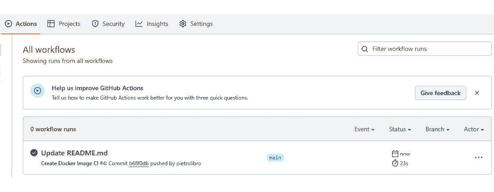

图 3.12 – 提交触发的工作流列表，位于 Actions 页面

一旦你在仓库中进行了更改，GitHub 将自动检测到这一变化并启动新的构建。你会看到一个指示符，表示构建已被触发。

1.  要访问构建日志，只需点击 **构建**，如*图 3.13*所示。这将引导你到该构建的专用页面。一旦进入该页面，你可以深入了解构建过程的各个步骤，并查看与每个步骤相关的日志，如*图 3.14*所示。GitHub 还会在构建失败时提供电子邮件通知，你可以方便地在 GitHub 平台中配置你的警报偏好设置。

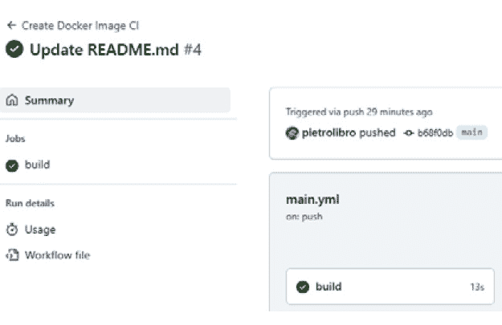

图 3.13 – 成功构建的总结

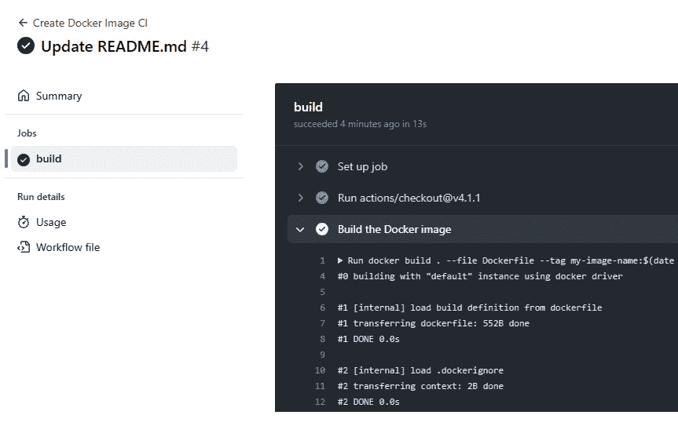

图 3.14 – 构建过程的详细步骤，包含每个步骤的日志

在此阶段，你应该对 Git、GitFlow、GitHub 以及如何开发 CI 流程以便为每次提交构建 Docker 镜像有一个全面的理解。

# 摘要

本章深入探讨了 Git 在版本控制中的关键作用，以及 GitHub 在 GitOps 框架中对协作软件开发的支持。本文概述了这些工具在提升团队效率、自动化部署流程和促进稳健 DevOps 文化中的重要性。涉及的关键内容包括使用 Git 和 GitHub 的技术要求、VCS 的好处、Git 和 GitHub 的功能以及 GitOps 实践的整合。最后，本章总结了一些利用 Git 和 GitHub 精简工作流程效率的最佳实践。

在接下来的章节中，我们将探讨额外的工具，如 Argo CD 和 Flux CD，并将它们与 GitOps 集成，从而使我们能够通过部署环节完善我们的流水线。

# 深入阅读

+   [1] [`git-scm.com/book/en/v2/Getting-Started-Installing-Git`](https://git-scm.com/book/en/v2/Getting-Started-Installing-Git)

+   [2] [`gist.github.com/luismts/495d982e8c5b1a0ced4a57cf3d93cf60`](https://gist.github.com/luismts/495d982e8c5b1a0ced4a57cf3d93cf60)

+   [3] [`www.packtpub.com/product/mastering-git/9781783553754`](https://www.packtpub.com/product/mastering-git/9781783553754)
