# 第四章：GitOps 的规模化与多租户

本章深入探讨了**GitOps**的高级应用，重点是 Kubernetes 环境中的扩展性和**多租户**问题。内容针对那些已具备如**Argo CD**等工具基础知识的人，并希望在更复杂的场景中扩展知识。

我们将从讨论如何使用 GitOps 构建可扩展的集群基础设施开始。这包括设计能够适应日益增长的需求的 Kubernetes 集群，所有这些都通过 GitOps 方法进行管理。讨论的一个重要部分是如何高效地在多个集群间部署应用，重点关注可扩展性和定制化。

我们将重点讨论在共享的 Kubernetes 环境中强制实施多租户。我们将探讨如何使用 GitOps 工具（如 Argo CD）实现这一目标，并遵循其操作哲学。与此同时，我们还将介绍如**vCluster**等工具，这些工具简化了多租户的强制执行，同时保持 GitOps 原则。

本章的重点是概念而非工具。尽管工具可能会发展变化，但其背后的基本原则保持不变，为理解这些技术提供了稳定的基础。

我们还将讨论如何实现轻量级的**内部开发平台**(**IDP**)，以便通过**Kubernetes 服务目录**(**KSC**)促进第三方工具的**部署**。这种方法简化了 Kubernetes 中的应用管理。

现实世界的见解是本章的重要组成部分，借鉴了在不同项目环境中积累的经验和教训。这个实践视角对于理解这些策略在实际应用中的效果至关重要。

本章面向**中级学习者**，不会深入探讨 Argo CD 的安装或基本操作。相反，它将重点介绍这些工具在复杂的现实场景中的应用，展示为每种情况选择最合适工具的实际使用。目标是通过关注方法而非工具，帮助你全面理解如何使用 GitOps 在 Kubernetes 中扩展和管理多租户环境，并结合现实世界的应用和见解。

本章内容较为艰难，但我希望你在完成后能够学到很多。我尽量以简洁的方式将项目中的所有见解与您分享。本章可以逻辑上分为两个部分。第一部分涵盖了使用 GitOps 进行规模化应用的策略及通过 KSC 进行的必要设置。第二部分，从第 45 页开始，侧重于使用 GitOps 进行多租户管理，以便最大化地利用设置。

本章将涵盖以下主要内容：

+   理解“应用之应用”方法

+   理解多集群管理

+   理解有效的 Git 仓库策略

+   构建 Kubernetes 的服务目录

+   探索使用 Argo CD 实现本地多租户功能

+   使用 vCluster 和 Argo CD 探索多租户

# 技术要求

由于空间有限，许多示例已被简化或不完整。因此，我们提供了一个包含完整示例的代码库。它遵循 `chapter05`/`section` 的模式 —— 即 `chapter05`/`chapter-5-building-a-service-catalog-for-kubernetes`。所有讨论过的代码示例以及其他资源，请参考书籍 GitHub 仓库中的 `Chapter05` 文件夹，网址为 [`github.com/PacktPublishing/Implementing-GitOps-with-Kubernetes`](https://github.com/PacktPublishing/Implementing-GitOps-with-Kubernetes)。

# 传统 CI/CD 与 GitOps CD 的对比

传统 CI/CD 和 Argo CD 之间的主要区别在于部署处理方式

：

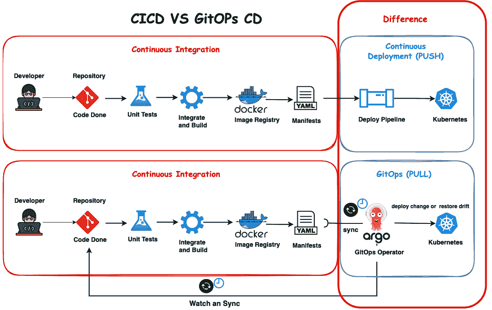

图 5.1 – 传统 CI/CD 与 GitOps CD 的对比

传统 CI/CD 遵循一种工作流，在该工作流中，变更会自动集成、测试并部署，而 Argo CD 使用同步机制确保实际状态与 Git 仓库中的期望状态匹配。Argo CD 依赖 CI 步骤，这意味着任何更改必须经过 CI 流程，Argo CD 才能检测到并采取行动。这确保了只有经过验证的更改会被部署。与 CI/CD 不同，CI/CD 可能需要手动干预，这可能导致不一致，而 Argo CD 持续监控并同步系统状态与 Git 仓库，减少漂移的风险并保持一致性。

在接下来的部分，我们将探讨平台工程与 IDP 之间的区别

# 平台工程与 IDP 的对比

在我看来，**内部开发平台**（**IDP**）和**内部开发门户**（**IDPO**）之间的区别变得越来越重要，已经成为许多讨论的话题。为了澄清这些不同的概念，以下是我对这些术语的区分：

+   **平台工程**：这是传统的方法，专门的团队负责拥有、运营和持续改进 Kubernetes 平台本身。团队的关注点是底层基础设施，确保其稳定性、可扩展性和安全性。开发人员通常使用这个平台，专注于他们的软件或平台团队未提供的第三方工具。这是许多项目中常见的方法。

+   **内部开发平台 (IDP)**：该方法引入了一种 IDP 解决方案，如 Spotify 的 backstage.io。IDP 团队负责提供和维护 IDP 本身，其中包括广泛的文档、构建块和开发人员模板，并充当开发人员的门户（IDPO）。开发人员可以利用这些资源，在定义的 Kubernetes 环境中自我部署应用。这样，开发人员就可以通过贡献或请求对 IDP 的内容和功能产生一定的影响。平台团队的工程重点从核心 Kubernetes 操作转向管理和发展 IDP。然而，开发人员仍然负责其部署的 Kubernetes 环境的日常操作，包括更新和故障排除。

现在，让我们探索“应用之应用”方法。

# 理解“应用之应用”方法

在管理多个应用时，主要有两种成熟的策略：**应用之应用**方法和**应用集**。本节将解决几个关键问题：

+   “应用之应用”方法克服了哪些挑战？

+   在哪些情况下“应用之应用”方法最为有利？

+   “应用之应用”方法如何提升 GitOps 实践？

在此上下文中，*应用* 指的是存储清单的 Git 仓库和文件夹，这些清单是运行应用在 Kubernetes 中所需的基本定义。Argo CD 很灵活，它支持原始 **YAML** 清单、自定义配置管理以及流行的工具，如 **Kustomize**、**Helm** 和 **Jsonnet**。

那么，对于必须部署多个应用的场景怎么办？我们应该如何管理这些清单？每个部署的应用都需要一个应用定义。然而，当这些应用是相关实体的集合时，如果 Argo CD 能识别这种关系，将会更有利。为了解决这一需求，Argo 社区开发了“应用之应用”方法。实际上，这种方法允许定义一个根 Argo CD *应用*，进而定义和同步多个子应用。这种方法通过利用分层的文件夹结构，简化了管理流程，特别是在复杂部署中。

*图 5**.2* 说明了“应用之应用”方法的一个示例。在此示例中，单个 Argo CD *应用* 仅对应一个特定的 Web 应用：

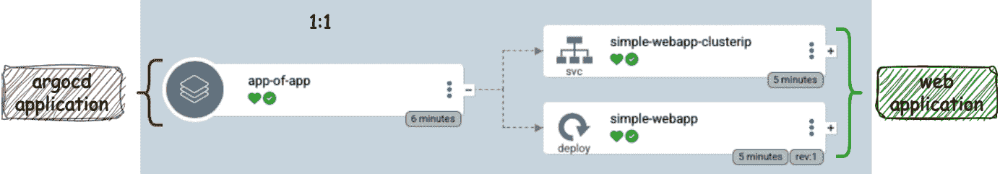

图 5.2 – 应用之应用方法

检查应用清单可揭示关键细节：

```
project: default
source:
  repoURL: 'git@github.com:PacktPublishing/Implementing-GitOps-with-Kubernetes.git'
  path: ./chapter05/chapter-5-the-app-of-apps-approach/app-of-app/simple-webapp
  targetRevision: main
destination:
  server: 'https://kubernetes.default.svc'
  namespace: app-of-app
syncPolicy:
  automated:
    prune: true
    selfHeal: true
```

在这里，`path` 被设置为直接指向特定应用。接下来，让我们探索 *图 5**.3* 中展示的“应用之应用”方法，以便更全面地理解：

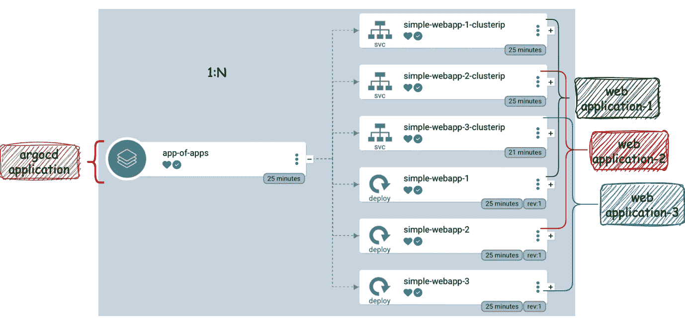

图 5.3 – 应用之应用

与之前指向单个应用程序清单不同，根应用现在引用 Git 仓库中的特定文件夹。该文件夹包含所有单独的应用程序清单，这些清单定义并促进每个应用程序的创建和部署。通过采用这种方法，您可以在统一的 YAML 清单中声明所有应用程序。以下示例展示了这一模式，以便更好地理解：

```
project: default
source:
  repoURL: 'git@github.com:PacktPublishing/Implementing-GitOps-with-Kubernetes.git'
  path: ./chapter05/chapter-5-the-app-of-apps-approach app-of-apps/simple-webapps
  targetRevision: main
  directory:
    recurse: true
 destination:
  server: 'https://kubernetes.default.svc'
  namespace: app-of-apps
syncPolicy:
  automated:
    prune: true
    selfHeal: true
```

在提供的定义中，`path` 属性指示 Argo CD 定位到仓库中的特定目录——在此例中为 `simple-webapps`。该目录包含定义应用程序的 Kubernetes 清单，并支持诸如 Helm、Kustomize 或普通 YAML 文件等多种格式。在所提供的配置中，有两个值得注意的属性：`selfHeal: true` 和 `directory.recurse: true`。`selfHeal` 功能确保在检测到任何变化时自动更新子应用程序，保持一致的部署状态。此外，`recurse` 设置允许迭代 `webapps` 文件夹，从而促进所有包含应用程序的部署。

因此，App of Apps 方法使您能够通过简单地更新 Git 仓库中的清单来管理您的*应用程序*资源——根据需要添加或删除应用程序资源。这种方法减少了对通过 Web UI 或 **CLI** 与 Argo CD *应用程序*直接交互的依赖。

## App of Apps 的用例及示例

Argo CD 中的 App of Apps 方法对于将多个应用程序作为单个实体进行管理，同时确保它们在部署过程中的隔离性非常有利。这在诸如集群引导和管理 Argo CD 应用程序而不依赖 CLI 或 UI 等场景中特别有用。让我们通过相关示例来探讨这些用例：

+   **集群引导**：假设您有一组标准的应用程序，需要在每个新的 Kubernetes 集群中安装。与其单独部署每个应用程序，不如将它们分组为一个“根”应用程序。这样可以简化过程，允许您同时部署整个应用程序集，从而提高不同部署之间的效率和一致性。

    **开发者和服务提供者示例**：假设您正在开发或提供涉及为每个部署部署一个自定义但相似的技术栈的服务，如下所示：

    +   前端

    +   后端与前端

    +   数据库

    App of Apps 方法允许您将这些组件封装为一个单一的部署实体，从而简化过程。

+   **无需 CLI 或 GUI 管理 Argo CD 应用程序**：你可以使用 Git 操作修改现有的根应用程序，例如添加新的文件夹到其监视的路径中。这个功能让 Argo CD 能够自动部署新的应用程序或更新现有应用程序，而无需通过 CLI 或 Web UI 进行交互，这与 GitOps 的版本控制和可审计性原则保持一致。

    **平台工程师示例**：作为平台工程师，假设你为每个客户在 Kubernetes 上提供类似的技术栈，例如如下所示：

    +   **Ingress-Controller**

    +   **Cert-Manager**

    +   **External-DNS**

    “应用的应用”方法在这里非常有用，因为它使你能够有效地管理这些组件，确保每个客户的环境都能始终如一地配置所需的工具。

在这两种使用场景中，“应用的应用”方法使得部署过程更加简洁、高效和一致，无论你是在作为服务提供商处理不同的客户需求，还是作为平台工程师确保多个 Kubernetes 集群的一致性。

## ApplicationSets 方法

在本节中，你将了解通过使用*ApplicationSet* [*1*] 控制器来创建、更新、管理和删除多个 Argo CD *应用程序*的过程。

我们将深入探讨*ApplicationSet*的概念，并解答以下关键问题：

+   *ApplicationSet*究竟由什么组成？

+   *ApplicationSet*的功能和优势是什么？

+   为什么需要生成器，且有哪些不同种类？

在 Argo CD 框架中，*ApplicationSet* [*2*] 显著提升了 Kubernetes 中**持续部署**（**CD**）的 GitOps 策略。该工具巧妙地处理了管理各种 Kubernetes 清单的复杂性，例如部署、服务、密钥和配置文件，所有这些都保存在 Git 仓库中。与 Argo CD *应用程序*资源不同，后者仅限于从单一 Git 仓库部署资源到一个集群或命名空间，而 ApplicationSet 扩展了这一功能。它利用模板化自动化来同时创建、修改和管理多个 Argo CD 应用程序，从而扩大了其操作范围，涵盖多个集群和命名空间。

安装在与 Argo CD 相同命名空间中的 ApplicationSet 控制器发挥着至关重要的作用。它通过 ApplicationSet 的**自定义资源**（**CR**）生成多个 Argo CD 应用程序。这种安排确保你的 Argo CD 应用程序与指定的资源保持同步，实质上将 ApplicationSet 转化为一个或多个 Argo CD 应用程序，从而提升整体部署效率和可扩展性。

*生成* 指的是控制器使用各种 **生成器** 的过程，那么这些生成器到底是什么呢？在 ApplicationSet 资源中，生成器通过创建将被纳入模板字段的参数，从而发挥重要作用，最终生成 Argo CD 应用程序。关于这一过程的实际示例，请参阅本章引言。生成器的功能由其数据源决定。例如，List 生成器从预定义的列表中获取参数，Cluster 生成器使用 Argo CD 集群列表，Git 生成器从 Git 仓库中的文件或目录中获取源。

ApplicationSets 中有许多不同的生成器，适用于不同的使用场景和角色。例如，Cluster 生成器非常适合 **平台工程师** 用于扩展他们的平台，而 Pull Request 生成器则允许开发人员通过 GitOps 部署功能给 QA。此外，**Matrix 生成器** 允许将最多两个生成器组合在一起，以满足更具体的需求。

我们将利用 Cluster 生成器来大规模实现 GitOps。超越理论，让我们深入探讨它的实际应用。我们将从一个单一集群开始，给它添加一个标签，如 *env=prod*。可以在 Argo CD 用户界面中通过导航到 **设置** | **集群** | **选择集群内** | **编辑** | **添加标签** 来完成：

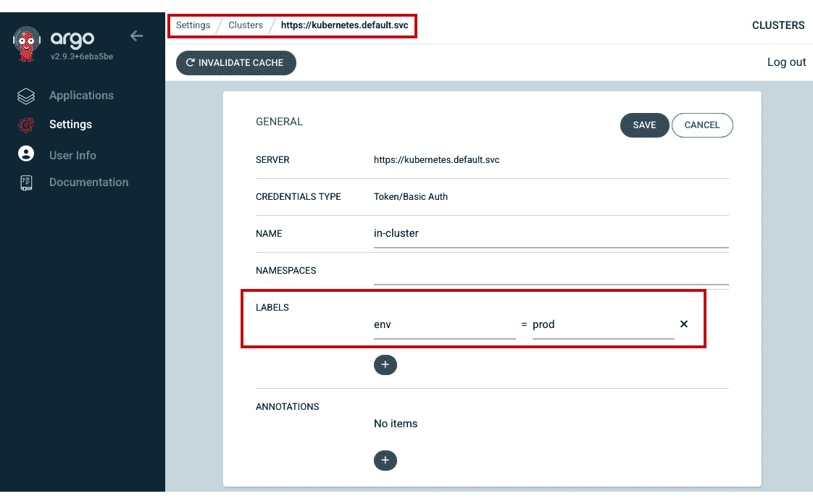

图 5.4 – 添加标签

现在，创建一个 `ApplicationSet` 清单，如下所示：

```
apiVersion: argoproj.io/v1alpha1
kind: ApplicationSet
metadata:
  name: simple-webapp
  namespace: argocd
spec:
  generators:
    - clusters:
        selector:
          matchLabels:
            env: prod
        values:
          branch: main
  template:
    metadata:
      name: "{{name}}-simple-webapp"
      annotations:
        argocd.argoproj.io/manifest-generate-paths: ".;.."
    spec:
      project: default
      sources:
        - repoURL: git@github.com:PacktPublishing/Implementing-GitOps-with-Kubernetes.git
          targetRevision: "{{values.branch}}"
          path: ./chapter05/chapter-5-the-app-of-apps-approach/applicationsets/simple-webapp
      destination:
        name: "{{name}}"
        namespace: "argocd"
        syncOptions:
          - CreateNamespace=true
```

在这里，我们使用了 Cluster 生成器，它旨在将我们的 `simple-webapp` 部署到多个 Kubernetes 集群中。通过使用 `env=prod` 选择器，*ApplicationController* 会根据集群的数量创建多个应用程序。每个应用程序的名称将被修改为包含集群名称，例如 `in-cluster-simple-webapp`。

要应用 `ApplicationSet`，请使用以下命令：

```
kubectl apply -f simple-webapp-applicationset.yaml
```

要查看 `ApplicationSet`，请运行以下命令：

```
kubectl get applicationsets -n argocd
```

你也可以通过以下方式查看模板化的应用程序：

```
kubectl get application -n argocd
```

当你检查 Argo CD 用户界面时，你不会直接找到 ApplicationSet，但你会看到名为 `in-cluster-simple-webapp` 的模板化应用程序。该应用程序由应用程序控制器以如下方式管理：

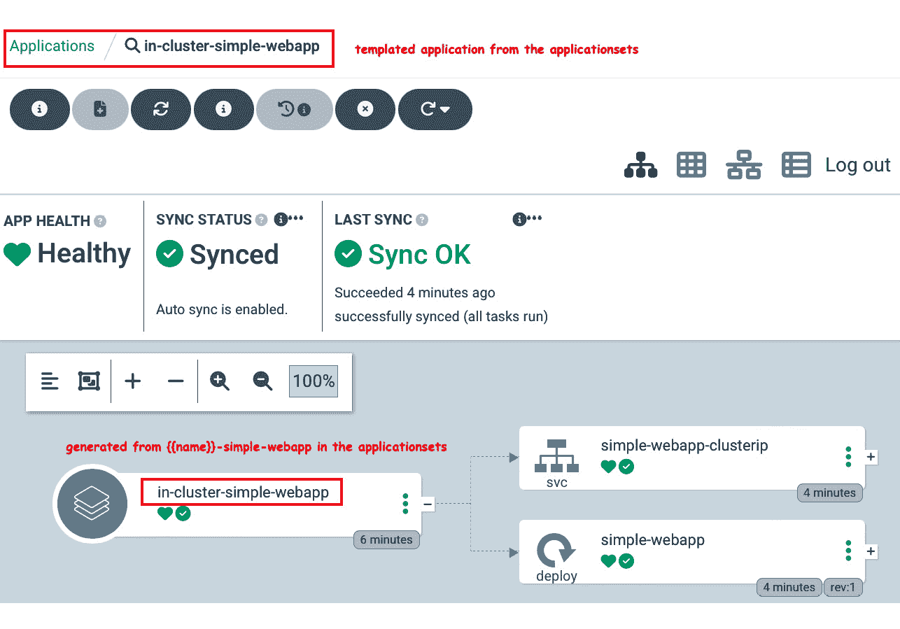

图 5.5 – 通过 ApplicationSet 模板化的应用程序，由应用程序控制器管理，并通过 Cluster 生成器提供信息

通过 `ApplicationSet` 清单可以查看模板化的应用程序，其中应用程序控制器使用 Cluster 生成器来设置必要的参数。

## 应该使用哪种方法？

在我参与的多数项目中，团队倾向于使用单独的应用程序和 ApplicationSets，而不是应用程序的应用程序方法。从平台工程师的[*3*]角度来看，为了通过 GitOps 创建可扩展的基础设施，ApplicationSets 方法似乎是最合逻辑的选择。

Argo CD 中的“应用程序的应用程序”模式适用于以下方面：

+   **引导多个应用程序**：高效地同时部署多个应用程序。

+   **将应用程序作为单一单元进行管理**：简化多个应用程序的管理。

+   **优化部署工作流**：简化应用程序的部署和更新过程。

ApplicationSets 在以下场景中特别有用：

+   **为多样化的环境创建灵活的部署策略**：可以部署到多个 Kubernetes 集群，部署到不同集群中的不同命名空间，或部署到单一集群中的不同命名空间（开发人员、DevOps 和平台工程师）。

+   **在 Monorepos 中管理应用程序**：从不同的 Git 仓库、SCM 提供商或文件夹中部署（开发人员、DevOps、平台工程师）。

+   **为多租户集群启用自服务**：ApplicationSets 可以促进自服务模型，特别是通过 Pull Request 生成器。这允许开发人员在多租户集群中更自主地部署应用程序，无需集群级别的权限（开发人员与平台工程师的协作）。

+   **跨多个集群部署集群附加组件**：通过集群生成器，你可以将附加组件部署到 Argo CD 管理的特定集群，这对于大规模的多集群环境非常有用（平台工程师、**站点可靠性工程师**（**SREs**）和 DevSecOps 工程师）。

与“应用程序的应用程序”方法相比，后者更适合在单一仓库或集群内管理一组相关的应用程序，ApplicationSets 提供了更多的灵活性和可扩展性，特别是在具有多样化部署需求的环境中。它们允许更细粒度和分布式的控制，与复杂的基础设施需求和多集群策略保持一致。

稍后，我们将采用 ApplicationSet 来开发一个 IDP 的可扩展模型，称为 KSC。该平台旨在高效管理大量 Kubernetes 集群，同时确保持续更新的安全措施得到维护。

接下来，我们将深入了解在 Argo CD 的 GitOps 环境中，多集群管理意味着什么以及它为我们打开了哪些可能性。

# 理解多集群管理

在本节中，我们将深入探讨两种不同的方法，来管理 GitOps 框架中的多集群环境。我们的重点不在于工具本身，而是在于如何将这些集群作为一个统一的平台来协调和管理的总体战略。通过这次探索，我们希望能够传达一种更深入的理解，强调有效的协调才是关键，而不是具体工具的对比。我们将讨论两个不同的概念：

+   **一个控制台，统领一切**：该概念强调以集中管理和协调多个集群，作为一个统一的平台。

+   **一个控制台 – 多样化舰队管理**：该概念侧重于从单一控制点管理多个 Argo CD 集群，同时考虑集群间通信的安全性问题。

在工具选择方面，我们的经验表明，Argo CD 由于其支持集群、ApplicationSets 和生成器，比 Flux 更适合在多集群环境中通过 GitOps 进行扩展，后者缺乏专门的多集群管理概念。当管理扩展到超出专用集群的场景，如主机集群中的**vCluster**方法时，这种差异更为明显。

这里有一些关于在 GitOps 框架中进行多集群管理的额外考虑因素：

+   **高可用性和灾难恢复**：包括在多个区域部署，甚至使用多个提供商，以确保系统的稳健性和恢复力。

+   **现有专业知识**：组织内 Kubernetes、云计算或 GitOps 的知识水平起着至关重要的作用。

+   **预算限制**：多集群管理的成本不应超过预定的金额。

+   **合规性和法规要求**：确保在不同区域或行业遵守行业标准和法律法规。

+   **网络基础设施和延迟**：优化网络性能和减少延迟，这在地理分布较广的集群中尤其重要。

+   **云或服务提供商实现**：例如，AKS 与 Flux CD 一起使用进行 GitOps 实现，而 OpenShift 使用 Argo CD 进行 GitOps 部署。

总体而言，选择 Argo CD 或 Flux CD 的关键在于它们在协调和管理多集群环境方面的能力，以及具体的使用案例需求。

## 一个控制台，统领一切

在这种方法中，开发人员和平台工程师共享一个 Argo CD 实例（*图 5.6*）。这个共享实例使平台工程师能够提供集中式管理功能，并对各个 Kubernetes 集群进行全面控制。他们管理和监控所有的部署，确保开发人员能够访问所需的资源，同时遵循公司政策和安全标准。这种方法促进了协作，并提供了所有集群的统一视图，有效地减少了大型分布式组织中的复杂性：

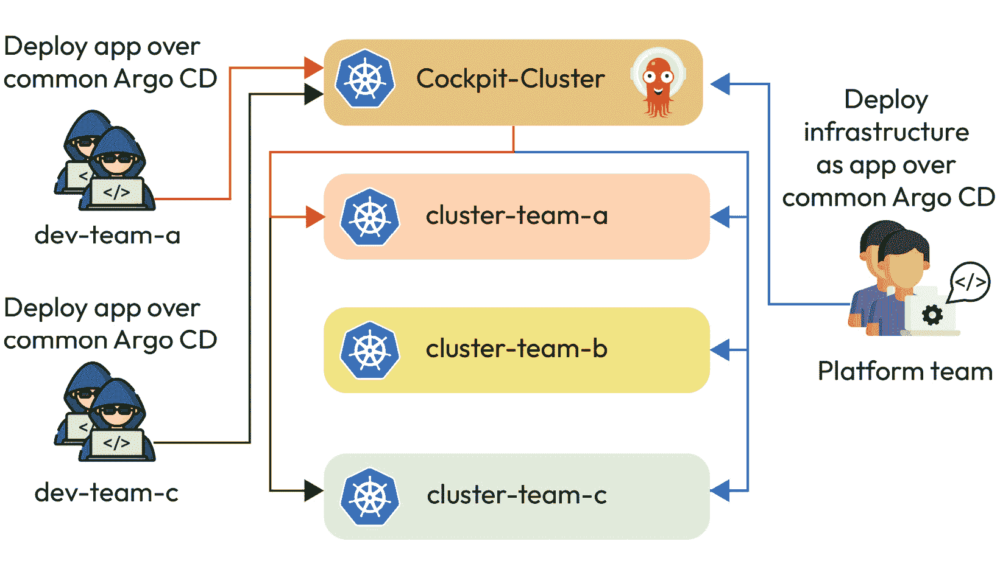

图 5.6 – 一机掌控 – 使用共享 Argo CD 实例

在 GitOps 使用 Argo CD 的 *一机掌控* 方法中，以下是一些关键的考虑事项：

+   **开发人员访问**：确定开发人员访问 Argo CD UI 需要建立与组、项目和角色相关的 **基于角色的访问控制** (**RBAC**)，可能还包括 Dex 和 OIDC 提供者的集成。

+   **项目访问控制**：限制团队对特定项目的访问，以防止在集群间未经授权的部署。

+   **资源分配**：节省是否在正确的领域进行？这个问题促使对资源分配进行关键评估，质疑成本节省是否有效地集中在最大化效率和整体价值的领域。

+   **版本更新**：协调多个团队共享实例中 Argo CD 的更新至关重要。这种协调确保版本兼容性，防止与 API 废弃相关的问题，保持一个稳定和功能齐全的 GitOps 环境供所有团队使用。

与多个团队合作时，这种方法带来了众多问题和考虑因素，需要解决，强调了有效实施所需的复杂性和规划。

以下是我们在使用这种方法时的几点经验：

+   共享 Argo CD 的使用常常导致系统负载增加，偶尔引发故障

+   Argo CD 的 PR-生成器等功能的集成增加了复杂性

+   这需要强大的多租户框架和工具

+   Argo CD 作为唯一的控制点，引入了系统故障的更高风险

+   团队数量的增加显著提高了沟通和系统维护的要求

+   虽然在硬件资源上有节省，但这些节省被对人力资源的更大需求所抵消，这些人力资源用于管理和协调。

我们采用这种方法来共享集群，以便促进冷启动、节省资金和资源、提供学习平台，并提供共享服务，如文档和执行器。共享集群更适合孵化项目，当一个项目成熟或需要进入生产阶段时，应该转移到自己的集群上。

## 一机掌控 – 多舰队指挥官概念

在这一概念中，平台团队将使用一个 Argo CD 实例来部署和管理开发团队所需的整个基础设施。平台团队还会为每个团队部署专用的 Argo CD 实例，并为每个团队提供**专用 UI**。重点依然相同，但更侧重于编排过程以及将这些集群管理为一个统一平台的方式。开发者将获得自己的专用 Argo CD 实例：

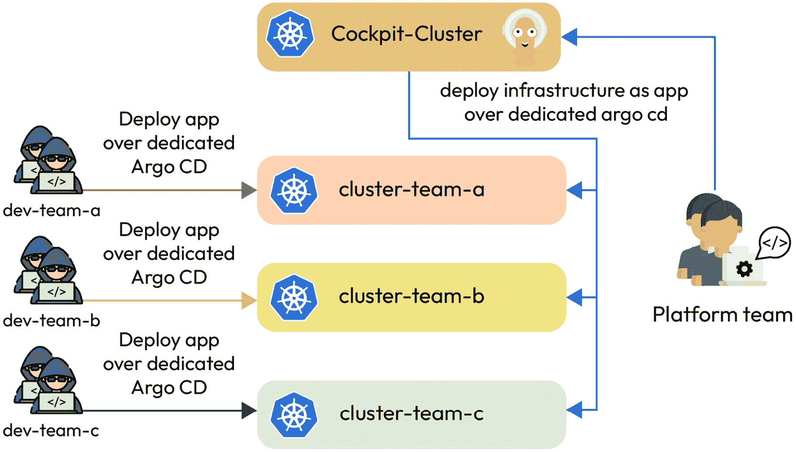

图 5.7：一个驾驶舱 – 多样化舰队管理，每个集群都有专用的 Argo CD 实例

与*一个驾驶舱掌控一切*的方法相比，这种方法涉及以下几个方面：

+   **专用的 Argo CD 实例**：每个集群由其自身的 Argo CD 实例管理，从而增强了每个集群的自主性并减少了单点故障的风险。

+   **自主项目管理**：每个团队在其指定的集群内管理项目，从而实现更大的控制和定制化。

+   **资源分配**：与其依赖共享的 Argo CD 实例，不如每个集群运行自己的堆栈。虽然这种方式可以在每个集群的独立 Argo CD 实例内提供集中的资源管理，但可能会导致整体资源消耗增加。

+   **版本控制自主性**：每个团队控制其 Argo CD 实例的版本更新，确保在其集群环境内的平稳运行和兼容性。

下面是我们在使用*一个驾驶舱 – 多样化舰队* *管理*方法中的一些经验：

+   **更高的自主性**：专用资源和 UI 访问权限赋予更多的**自由**、**灵活性**和**责任**。这种设置允许开发者进行自助服务并扩展控制，让他们专注于开发。

+   **轻松上手**：这种模式简化了 GitOps 的采用，使其适合新手和有经验的团队。采用这种方法，新的同事上手所需的时间更少。

+   **资源消耗**：尽管提供了明确的团队隔离，但这种方法可能导致更高的资源使用。

+   **增强的安全性**：一个 Argo CD 实例的被攻破不会影响其他实例，从而提高了整体安全性。

+   **平台团队专注**：平台团队专注于为可扩展的自助式方法扩展和工程化服务。与开发团队的互动时间减少，同时创建和加固与共享 Argo CD 实例相关的多租户功能所需的时间也更少。

+   **韧性和隔离**：这种方法增强了每个项目或开发团队的韧性和隔离性。它消除了邻居噪声问题，其他团队或项目对 Kubernetes 或基础设施的升级不会影响单个团队，确保更平稳的操作并减少干扰。

这种方法用于处理**关键工作负载**，确保严格的租户隔离，增强开发人员的自服务能力，并在符合安全、治理和合规性严格要求的情况下增强安全性。在 GitOps 领域，尤其是在从安全角度进行 DevOps 实践时，随着规模的扩大，这种方法变得尤为重要。

在大规模管理多集群环境时，GitOps 的重点不仅仅是监督专用 Kubernetes 集群。它还涉及利用 Argo CD 来满足不同的需求并部署多种工作负载，包括客户应用程序和基础设施组件，同时在不同集群之间维持安全合规性。这种方法旨在弥合开发人员和平台工程师之间的差距，促进可扩展性，并提高两个领域的生产力。

然而，GitOps 还有另一个缺口，涉及如何设定最佳的暂存概念。这将在下一节中进行更详细的解释。

# 理解有效的 Git 仓库策略

在 GitOps 框架中有效地推动应用程序在各个阶段之间的推广，尤其是在大规模操作时，是开发人员和平台工程师面临的一个关键挑战。将应用程序部署到不同的环境涉及超越单一部署场景的复杂性。使用 Argo CD 后，整个过程变得更加可管理，能够在多个集群间部署，而无需多个 CD 管道。

本节深入探讨了管理环境的各种方法：环境分支、每个 Git 的环境以及环境文件夹。每种方法都有其优缺点，选择通常取决于项目的具体需求和团队的专业知识。像**Codefresh** [*4*]这样的公司已经开发了解决方案，以便通过 Argo CD 促进阶段传播。然而，本书更侧重于理解这些方法，而非具体工具，引导你选择最适合你环境的策略。

## 环境分支

GitOps 中的每分支一个环境[*4*]方法，涉及使用分支来表示不同的环境，如暂存环境或生产环境，通常被认为是一种反模式。这种方法可能会使拉取请求和分支之间的合并变得复杂，产生配置漂移，并在管理大量环境时增加维护难度。它也与 Kubernetes 生态系统相矛盾，通常更适合传统应用程序。在 GitOps 中，建议将应用程序源代码和环境配置分开存储在不同的仓库中，避免使用每分支一个环境的模式。对于部署推广，Git 合并可能会因为冲突和无意更改而变得复杂，这使得推广管理比看起来更为复杂。

每个分支环境方法的优点包括对许多开发人员的熟悉性，以及通过 git 合并推广版本的理论简单性。

然而，如果你正在使用 GitOps 和 Kubernetes，缺点是显而易见的：

+   **复杂合并**：通过 Git 合并的推广可能会导致冲突和意外的更改

+   **配置漂移**：不同的分支可能导致环境特定的代码，造成配置漂移

+   **维护挑战**：管理大量分支可能变得难以控制

+   **依赖变更**：管理有依赖的变更会遇到困难，因为并非所有提交都能干净地挑选出来

现在，让我们探索一个简单的部署清单作为示例。

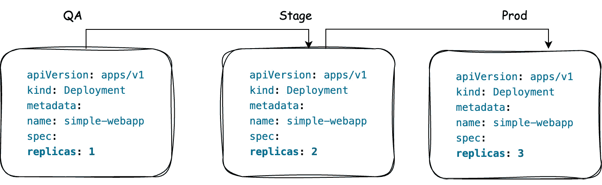

图 5.8：如何在各阶段之间传播

这个基本示例说明了在部署清单中结合传播逻辑的必要性，确保特定的值，例如副本数量，能够根据每个阶段的独特需求进行适当扩展。使用 Helm 或 Kustomize 与 GitOps 一起时可能会遇到挑战，因为 Helm 为各个阶段使用不同的`values.yaml`文件，而 Kustomize 依赖于覆盖。此外，基于 Kubernetes 生态系统的 GitOps 也带来了自身的复杂性，必须加以管理。

虽然这种方法可能适用于传统应用程序，但对于现代的 Kubernetes 环境来说并不理想。分支仍然可以用于功能开发和 PR 用于测试变更。然而，你仍然需要管道或工作流将变更提交到 Git 中。也有一种在 Argo CD 外部将变更写回 Git 的选项。像 Argo CD 及其 PR 生成器这样的工具可以帮助管理这些过程，但请注意，PR 生成器是将 Git 内容传递到集群中，而不是反向操作。

## 每个环境一个 Git

`main`分支通过拉取请求和审查工作流。对于需要更高安全性的需求，组织可以使用两个 git 仓库：一个用于所有与生产相关的配置和环境，另一个用于非生产元素，在确保安全的同时平衡可管理的仓库数量。

在我的职业生涯中，我只遇到过一个团队采用这种方法，专门为了防止初级开发人员无意中访问和暴露敏感数据。

## 环境文件夹

在 GitOps 和 Kubernetes 中采用 **按环境分文件夹** 的方法，涉及将不同环境的配置组织在单个 Git 仓库的独立文件夹中。每个文件夹代表一个特定的环境，如 **development**、**staging** 或 **production**。这种结构使得每个环境的配置能够清晰地分离和管理，简化了更新和维护。它使得 Kubernetes 的部署过程更加简洁，与 GitOps 原则保持一致，通过将所有环境配置保存在统一的仓库中，确保更改的一致性和可追溯性。

要有效地为 Kubernetes 创建文件夹结构，首先需要了解你的业务需求，例如为不同国家开发高度可用的门户以及各自的版本要求。然后，将与业务相关的值（如公司徽标）整合到所有环境中。此外，还要考虑动态的客户相关值，例如客户状态等级，如 *silver*、*gold* 或 *platinum*。这种方法确保你的 Kubernetes 设置（如最小副本数）与通用和特定的业务需求保持一致。

我们将使用之前在按文件夹分环境方法中所做的相同示例：

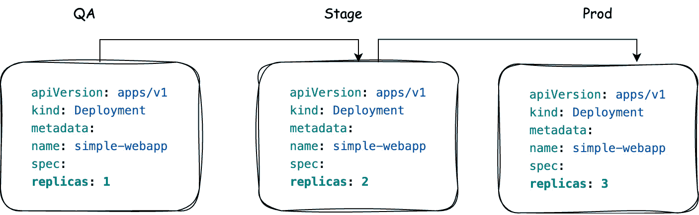

图 5.9：如何通过环境文件夹在阶段之间传播

我们将展示如何使用 **Kustomize** 轻松实现跨环境的变更传播。第一步是设置特定的文件夹结构来促进这一过程：

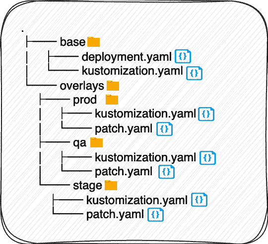

图 5.10：带有环境文件夹的示例阶段

探索文件结构时，`base` 目录包含跨所有环境共享的配置，通常进行的更改较少。对于多个环境同时修改的情况，`base` 文件夹是管理这些更改的理想位置，因为它为影响不同部署设置的更新提供了一个集中的更新点：

./base/deployment.yaml

```
apiVersion: apps/v1
kind: Deployment
metadata:
  name: simple-webapp
spec:
  replicas: 2
  selector:
    matchLabels:
      app: simple-webapp
  template:
    metadata:
      labels:
        app: simple-webapp
    spec:
      containers:
        - image: "ghcr.io/la-cc/simple-webapp:1.0.1-stable" #specific version
          name: simple-webapp
          env:
            - name: UI_X_COLOR #business-related values
              value: darkblue
            - name: SUBSCRIPTION_TIER
              value: silver
```

在这个简单的示例中，你可以看到我们涵盖了之前描述中所有的要点，比如具体版本、与业务相关的值等：

./base/kustomization.yaml:

```
resources:
  - deployment.yaml
```

`base` 文件夹，也称为 mixins 或组件，包含不同环境共享的配置。其内容根据你认为在各个环境中共享的特性来定义，这一决策由你的应用程序的具体需求来指导。在我们的示例中，这个文件夹包括 QA、staging 和生产环境的配置。

在本节中，我们将通过应用 QA 特定的配置，使用 `patch.yaml` 文件修改基础部署。这种方法允许我们为 QA 环境自定义基础设置，而无需更改通用的部署设置：

./overlays/qa/kustomization.yaml:

```
apiVersion: kustomize.config.k8s.io/v1beta1
kind: Kustomization
resources:
  - ../../base
patches:
  - path: patch.yaml
namePrefix: qa-
commonLabels:
  variant: qa
```

以下代码展示了如何使用补丁覆盖基础版本中的颜色，从而允许针对 `qa` 配置的特定阶段：

./overlays/qa/patch.yaml:

```
apiVersion: apps/v1
kind: Deployment
metadata:
  name: simple-webapp
spec:
  replicas: 1
  template:
    spec:
      containers:
        - image: "ghcr.io/la-cc/simple-webapp:1.1.5-new-ui"
          name: simple-webapp
          env:
            - name: UI_X_COLOR
              value: aqua
```

重要提示

Kubernetes 中的 `kustomize` 工具允许你自定义 YAML 配置，而无需修改原始文件。它通过使用补丁、覆盖层和其他技术，以更结构化和可扩展的方式管理配置变化，从而生成最终的配置清单。

你可以通过在 `..chapter05/chapter-5-effective-git-repository-strategies/folders-for-environments` 文件夹内执行以下命令，轻松查看补丁更改，这将显示基础覆盖层已被打补丁：

```
kustomize build overlays/qa
```

在这一阶段，我们将对一个包含业务相关值的特定版本进行测试。这个版本将最终成为我们未来“黄金”客户的新版本。

以下代码块展示了如何引用基础版本，链接到正确的补丁，并为所有生成的资源设置相应的名称前缀：

./overlays/stage/kustomization.yaml:

```
apiVersion: kustomize.config.k8s.io/v1beta1
kind: Kustomization
resources:
  - ../../base
patches:
  - path: patch.yaml
namePrefix: stage-
commonLabels:
  variant: stage
```

该过程遵循与 QA 环境类似的补丁方法。

以下代码块展示了如何使用补丁覆盖基础版本中的颜色，从而允许针对 Staging 配置的特定阶段：

./overlays/stage/patch.yaml:

```
apiVersion: apps/v1
kind: Deployment
metadata:
  name: simple-webapp
spec:
  replicas: 2
  template:
    spec:
      containers:
        - image: "ghcr.io/la-cc/simple-webapp:1.1.4-feature-login"
          name: simple-webapp
```

GitOps 中基于文件夹的方法提供了一个简化的所有阶段概览，消除了在不同分支间切换和比较的需要。然而，这个简单的示例只是表面上的一点。实际上，你将管理各种文件和环境特定的配置。该结构的适应性还允许扩展到区域特定的环境，如 `qa-europe` 或 `qa-asia`，并根据独特的区域需求和业务目标进行定制。

以下场景展示了这个方法的强大之处：

重要提示

这个过程是一个外部工作流，独立于 Argo CD，极大地简化了部署管理，通过便于在各个阶段之间进行比较和传播。

+   Linux 中的 `diff` 命令用于比较两个文件或目录，以行对行的格式显示它们内容的差异。

    你可以通过运行 `diff` `qa/patch.yaml stage/patch.yaml` 来查看 QA 和 Staging 环境之间的差异。

+   **用例 2**：将应用版本从 QA 环境推广到 Staging 环境：

重要提示

Linux 中的 `cp` 命令用于将文件和目录从一个位置复制到另一个位置。

1.  首先，使用 `cp` 命令将新版本文件复制到 `qa/version.yaml` 和 `staging-us/version.yaml`。

1.  然后，提交并推送更改到 Git。

+   `base`。

+   现在，再次提交并推送更改到 Git。

+   此时，你可以从 QA、Staging 和生产环境中移除多余的配置，因为配置已经存在于 `base` 中。

+   最后一次，提交并推送更改到 Git。

这种方法通过允许你轻松比较不同的阶段，大大简化了部署的管理。你可以通过选择文件或文件夹快速比较差异，避免了像 **挑选提交** 这样复杂的 Git 操作。不同阶段之间的变化，例如从 QA 到 staging，能够通过复制和粘贴文件高效处理。此方法的灵活性扩展到不同地区、国家、Kubernetes 发行版和工具，只受限于你的需求。它为多种部署场景提供了可定制和适应性强的解决方案，并且可以通过任何工作流机制实现自动化。

那么，是什么使得这种方法在 Kubernetes 和尤其是在扩展 GitOps 操作时如此有效呢？

这种方法在大规模 Kubernetes 和 GitOps 中的适用性固有于 Kubernetes 本身。Kubernetes 设计为声明式和以配置为中心，能够与结构化的、基于文件夹的方法无缝集成。这种方法支持 GitOps 强调版本控制和可追溯性的核心特性，这对于在大规模 Kubernetes 环境中有效管理配置至关重要。该方法的简洁性和组织性使其成为 Kubernetes 和 GitOps 框架在可扩展性和系统化部署需求中的理想选择。

## 使用 ApplicationSet 生成器进行扩展

我们已经深入探讨了在 Kubernetes 上以大规模 GitOps 操作中，App of Apps [*5*] 方法与 *ApplicationSets* 之间的区别。现在，我们将探讨如何使用带生成器的 *ApplicationSets* 来开发一个简化的开发者平台，在本书中被称为 KSC。具体来说，我们将展示如何通过 *ApplicationSet* 在不同的集群中部署 ingress 控制器，每个控制器根据集群特定的值进行定制。我们的重点是使用 `kube-prometheus-stack`，它采用了带有 **子图** 的 **伞形图**，例如 Grafana。

以下是使用伞形 `ingress-nginx` `Chart.yaml` 文件的简要概述：

```
apiVersion: v2
name: ingress-nginx #umbrella chart
version: 1.0.0
description: This Chart deploys ingress-nginx.
dependencies:
  - name: ingress-nginx #subchart
    version: 4.8.0
    repository: https://kubernetes.github.io/ingress-nginx
```

对于 `ingress-nginx` 伞形图，使用相同的名称来处理 `ingress-nginx.controller.resources` —— 用于特定的覆盖设置。这个区别对于不熟悉伞形图的人来说至关重要，因为许多团队因命名重叠而难以将值按预期应用。

现在，让我们了解一下，哪些部分使得我们能够通过 Argo CD 构建可扩展的部署，下面是 `nginx-ingress-applicationset.yaml` 的相关摘录：

```
spec:
  generators:
    - clusters:
        selector:
          matchLabels:
            env: prod
        values:
          branch: main
  template:
    metadata:
      name: "{{name}}-ingress-nginx "
    spec:
      sources:
        - repoURL: git@github.com:PacktPublishing/Implementing-GitOps-with-Kubernetes.git
          targetRevision: main
          ref: valuesRepo
        - repoURL: git@github.com:PacktPublishing/Implementing-GitOps-with-Kubernetes.git
          targetRevision: "{{values.branch}}"
          path: "./chapter05/chapter-5-building-a-service-catalog-for-kubernetes/networking/ingress-nginx"
          helm:
            releaseName: "ingress-nginx"
            valueFiles:
              - "values.yaml"
              - "$valuesRepo/chapter05/chapter-5-building-a-service-catalog-for-kubernetes/cluster/{{name}}/networking/ingress-nginx/values.yaml"
```

你可以通过提供的名称，在本书的 GitHub 仓库中找到完整的示例。

如前所述，生成器的概念保持不变。变化在于应用控制器如何获取主图（见 **1**，*图 5.11*），为特定目标集群获取自定义值（见 **2**，*图 5.11*），然后使用 Helm 对这些值进行模板化，并将其部署到目标集群（见 **3**，*图 5.11*）。以下图示将进一步澄清潜在的过程，增强对后台操作的理解：

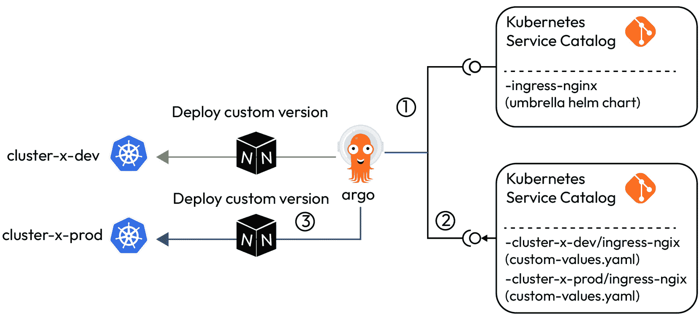

图 5.11：带有环境文件夹的示例阶段

这个由应用控制器使用的 ApplicationSet，利用生成器集群修改 Helm 图表，包括主图和子图。该方法有助于在大规模实施 GitOps。市场上广泛使用的工具 Argo CD 在支持这一方法的实施中起着至关重要的作用，支持应用部署的动态和可扩展管理。

在下一节中，我们将展示如何构建 KSG，允许您从该目录中部署跨集群分布的不同服务，并采用扩展方式。

# 构建 Kubernetes 的服务目录

在本节中，我们将为 Kubernetes 作为轻量级 IDP 开发一个服务目录。该平台将通过 Kubernetes 部署简化必要基础设施的提供。轻量级 IDP 旨在通过 GitOps 灵活地扩展 Kubernetes 集群，随着项目的增长，确保快速的市场交付时间。此外，它还将根据需要促进安全性（**security**）、财务运营（**FinOps**）和服务网格（**service-mesh**）等服务的扩展，同时确保集群保持最新，并简化集群管理，无论涉及多少个集群。这种方法强调了 Kubernetes、GitOps 和可扩展基础设施管理之间的协同作用。

在继续之前，建立您的标签或标记策略非常重要，特别是如果您不希望将整个堆栈部署到每个集群。此时，提供创建和扩展服务目录的机会可能是有益的。在这种情况下，建议部署一个针对不同特定目的的基础 Kubernetes 集群。一个潜在的方式可能如下：

| **标签** | **堆栈将** **被部署** | **备注** |
| --- | --- | --- |
| `env: dev`、`staging`、`prod` | `none`、`plain cluster` | 不会部署任何堆栈。Dev 应仅用于测试目的，不稳定。 |
| `core-basic: enabled` | `argocd`、`external-dns` 和 `ingress-nginx` | 如果您希望通过 cert-manager 颁发证书，应与 security-basic 一起部署。 |
| `security-basic: enabled` | `cert-manager`、`acme-issuer`、`falco`、`kyverno`、`sealed-secrets`、`external-secrets` 和 `rbac` | 应该在每个集群上部署以保持集群安全。 |
| `monitoring-basic: enabled` | `grafana`，`victoria metrics`，`msteams-proxy`，`mailhog`，`stunnel`，`prometheus-node-exporter`，`prometheus-alertmanager`，`falco-exporter`，和 `cluster-alerting` | 将部署没有日志技术栈的监控技术栈。 |
| `monitoring-medium: enabled` | `loki`，`promtail` 和 `minio-loki-tenant` | 这个技术栈需要存储，并且应该与 `storage-basic: enabled` 一起部署。 |
| `storage-basic: enabled` | `minio-operator` 和 `nfs-subdir-provisioner` | 这个技术栈是 `monitoring-medium` 技术栈所需的。你也可以在没有 `monitoring-medium` 技术栈的情况下部署这个技术栈，用于对象存储或 NFS 的其他用途。 |

表 5.1：使用标签管理不同技术栈的潜在方法

例如，基于你的工作流，使用一个操作员或 CI/CD 流水线，你可以高效地将标签从你的 Kubernetes 集群映射并传输到 Argo CD 集群。

## 构建服务目录

为了避免超出范围，我们将集中关注构建服务目录时的一些服务，并将使用以下文件夹结构：

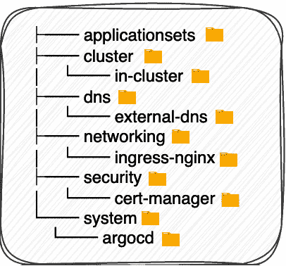

图 5.12：目录中可能的服务示例

这里，`applicationsets` 是一个专门用于通过标签在多个 Kubernetes 集群中部署各种服务的目录。在内部，`cluster` 目录包含多个集群，每个集群都在 *ApplicationSet* 中进行迭代，并通过集群生成器的参数进行增强。其他目录，如 `dns`、`networking` 等，将服务按逻辑分组。它们包括 Helm 伞形图表以及针对特定服务的子图表，如 `external-dns` 或 `ingress-nginx`。

我们现在将回顾著名的 `nginx-ingress-applicationset.yaml` 文件，该文件已更新以包含标签方法：

```
apiVersion: argoproj.io/v1alpha1
kind: ApplicationSet
metadata:
  name: ingress-nginx
  namespace: argocd
spec:
  generators:
    - clusters:
        selector:
          matchLabels:
            env: dev
            core-basic: enabled
        values:
          branch: main
    - clusters:
        selector:
          matchLabels:
            env: prod
            core-basic: enabled
        values:
          branch: main
....
```

现在，`ApplicationController` 仅将应用程序部署到匹配 `env = dev | prod` 和 `core-basic = enabled` 标签的集群。结构上类似于 *图 5.11* 中显示的其他服务的 ApplicationSets，但在来自安全文件夹的 cert-manager 中有一个独特的方面，加入了一个额外的标签，`security-basic: enabled`，在其 `ApplicationSet` 中。

以下代码块展示了如何实现它：

```
apiVersion: argoproj.io/v1alpha1
kind: ApplicationSet
metadata:
  name: cert-manager
  namespace: argocd
spec:
  generators:
    - clusters:
        selector:
          matchLabels:
            env: dev
            core-basic: enabled
            security-basic: enabled
        values:
          branch: main
    - clusters:
        selector:
          matchLabels:
            env: prod
            core-basic: enabled
            security-basic: enabled
        values:
          branch: main
...
```

现在，Argo CD 的应用程序控制器仅将 `cert-manager` 部署到带有特定附加标签的集群。

标签是强大的工具，通过单一的中央 Argo CD 单元，允许你管理本地和公共云环境中的不同技术栈。这种灵活性使得跨多个环境的无缝管理成为可能。结合不同角色的多样化视角，标签促进了以下内容：

+   平台工程师可以采用这种方法，结合 SRE 原则，提供可扩展的 Cluster-as-a-Service。

+   DevSecOps 工程师可以在所有集群中实施政策，确保治理和合规性。

+   开发人员可以利用这种方法，在各种客户集群中部署具有自定义值的可扩展应用程序

这种统一的方法简化了操作，并确保在不同环境和角色之间保持一致性。

如果您有额外的清单，专门为您的特定需求量身定制，其中服务需要扩展——例如，如果 Argo CD 在部署到目标集群时需要一个可选的入口，以便通过入口进行外部访问，而不是通过 Kubernetes API 进行直接访问——您可以在`system.argocd`下引入一个额外的`templates`文件夹。在此文件夹中，您可以包括一个类似于`templates.ingress.yaml`的清单，例如以下摘录：

```
{{- if .Values.ingress -}}
apiVersion: networking.k8s.io/v1
kind: Ingress
metadata:
  name: argocd-server-ingress
  annotations:
    kubernetes.io/ingress.class: {{ .Values.ingress.className }}
    ingress.kubernetes.io/force-ssl-redirect: "true"
    nginx.ingress.kubernetes.io/ssl-passthrough: {{ .Values.ingress.sslPassthrough | default "false" | quote }}
    cert-manager.io/cluster-issuer: {{ .Values.ingress.issuer }}
    cert-manager.io/renew-before: 360h #15 days
    cert-manager.io/common-name: {{ .Values.ingress.host }}
    kubernetes.io/tls-acme: "true"
    nginx.ingress.kubernetes.io/backend-protocol: "HTTPS"
spec:
  rules:
    - host: {{ .Values.ingress.host }}
…
```

这种方法使您能够覆盖伞形图表中的值，并在必要时部署额外的入口，如下所示：

```
#overwrite helm umbrella chart values:
ingress:
  host: argocd.your-domain.com
  issuer: "letsencrypt"
  className: "nginx"
```

如果您的组织使用来自根 CA 的通用证书，所有外部 DNS 都需要这些证书，您可以利用`kustomize`来建立一个文件夹结构。例如，您可以创建`kustomize.dns.external-dns-secrets`，并将您的`root-ca.yaml`文件放入其中。然后，您可以通过几行代码将其集成到`external-dns`的 ApplicationSet 中，如下所示：

```
...
      sources:
        - repoURL: git@github.com:PacktPublishing/Implementing-GitOps-with-Kubernetes.git
          targetRevision: "{{values.branch}}"
          path: "./kustomize/dns/external-dns-secrets"
        - repoURL: git@github.com:PacktPublishing/Implementing-GitOps-with-Kubernetes.git
...
```

有了这一点，我们成功创建了一个目录，将扩展我们的服务、政策和应用程序组合的范围。

一个关键点是关注实现大规模 GitOps 的整体方法，而不是专注于诸如 Argo CD 等特定工具。工具可能会更替，例如 Flux 或 Argo CD 的继任者，但保持灵活的战略始终是至关重要的。这类似于不同框架和语言中开发实践的演变，同时保持其基础方法。通过仔细组织各种环境的文件夹，并将此结构与*ApplicationSet*结合，便形成了一个高效且可扩展的 GitOps 解决方案。这样的策略不仅简化了管理，还显著减少了对任何给定环境的维护需求。KSC 描述了将 CNCF/OSS 项目结合在一起，为开发人员、平台工程师和 SRE 创建一个安全、自管理的服务平台的力量。

奖励——大规模维护与 GitOps 和 KSC

假设您正在管理数百个 Kubernetes 集群，每个集群都有不同的技术栈，并且在每个集群中都有部署核心服务。这导致大约 2000 个应用程序分布在这些集群中。关键需求是保持所有内容的最新和安全。您已经出色地扩展并保持了应用程序的一致性。突然间，在同一天，您使用的 Ingress-NGINX 镜像暴露了两个关键的**常见漏洞和暴露（CVEs）**，同时还有 Cert-Manager 的 bug 修复和增强 External-DNS 弹性的额外配置。所有集群都受到影响。考虑到一切都通过 Helm 图表进行管理，您如何一次性维护所有集群？解决方案如下：

+   您可以手动检查所有 Helm chart 版本，查看差异，然后升级版本并通过 Argo CD 在所有集群中部署。然而，CVE 和更改并不会在特定时间发布；它们是在发现漏洞后发布的。

+   您的 Kubernetes 集群中有一个管道或作业，它定期检查服务目录中的 Helm chart 新版本。如果发现新版本，它会创建一个拉取请求，显示所有更改的值，并在满足所有条件或经过审核后自动合并。

第二个选项听起来更好，并且您可以在管道中运行一个脚本，完成这项工作。或者，您也可以使用 GitHub Action 来实现这一目的。

这就是拉取请求的样子：

```
Name: External DNS
Version in Chart.yaml: 6.23.6
Latest Version in Repository: 6.26.4
between     /tmp/tmp.aJBFfh/diff_value.yaml
and /tmp/tmp.aJBFfh/diff_latest_value.yaml
     _        __  __
   _| |_   _ / _|/ _|
 / _' | | | | |_| |_ 
| (_| | |_| |  _|  _|
 \__,_|\__, |_| |_|           
|___/
returned three differences
image.tag
  ± value change
    - 0.13.5-debian-11-r79
    + 0.13.6-debian-11-r28
```

之后，GitOps 方法接管，跨所有集群推出更改。通过这种方式，您可以通过 GitOps 中央管理更改并进行部署，从而最小化维护工作，而无需考虑涉及的集群数量。

以下部分将介绍如何仅使用 Argo CD 提供的资源来实现多租户概念。

# 探索使用 Argo CD 的原生多租户

本章不是关于使用 Argo CD 设置最安全、最优化的多租户环境。这是因为*最佳*设置取决于您的具体 SRE 动机、安全团队的限制、治理、公司合规政策、行业要求以及团队的技能水平。此外，工具经常发生变化，通常每年有多次小版本更新，引入新功能。因此，我们在这里的重点是创建多租户的实现方法，同时考虑到您应该注意的方面、当前可以解决的问题以及未来的考虑因素。

那么，为什么选择使用 Argo CD 设置多租户环境，而不是为每个项目使用独立的集群呢？

有几个原因：

+   减少集群数量使得维护诸如 Kubernetes 版本升级等方面变得更加容易。

+   为了最大化资源利用率和效率，多租户是至关重要的。

+   在非动态、基于票务的冷启动环境中，尤其是在不是每个 Kubernetes 集群都运行在云中的情况下，多租户成为一种必需。

+   通过实施 FinOps 实践，每台机器的成本都能得到密切监控和优化。多租户帮助通过最大化多个团队或项目之间资源的利用率来降低整体成本，从而确保高效支出并减少浪费。

在本节中，您将学习如何使用 Argo CD 作为中央管理工具来实施多租户设置，以管理来自不同团队的工作负载。

此设置的环境是一个位于公司自有数据中心的 Kubernetes 平台，受到存储等资源的约束。由平台团队提供的核心 Argo CD 实例用于 GitOps 方法。此核心实例以声明性方式提供平台上下文（如**ExternalDNS**、**Cert Manager**等）。开发团队维护自己的 Git 仓库，访问 Kubernetes 集群则通过**Active Directory**（**AD**）组进行管理。

挑战在于如何在相同的核心 Argo CD 实例上进行部署，同时防止团队滥用该实例并突破各自的隔离环境。

以下是启用安全多客户操作的要求：

+   团队应当独立工作

+   每个团队只能访问其指定的命名空间

+   团队必须避免对其他团队造成负面影响，例如，通过不当的资源配置。

+   维持声明性 GitOps 方法

+   扩展的 GitOps 以声明性方式为新项目和新团队进行管理

此外，平台团队的责任起始和结束边界需要清晰明确。为此，您可以考虑以下方法：

+   平台团队提供平台和上下文，但仅限于初始仓库的设置：

    +   **优点**：无需管理如**个人访问令牌**（**PATs**）或**SSH 密钥**等凭证。

    +   **缺点**：**灾难恢复**更加具有挑战性；例如，在旋转集群后，开发人员必须重新初始化对仓库的访问。

+   平台团队提供平台、上下文和初始仓库：

    +   **优点**：灾难恢复变得更加简化。可以丢弃或迁移无状态集群，GitOps 方法会正确恢复一切。

    +   **缺点**：必须管理不同团队仓库的凭证。

通过理解并实施这些策略，您可以在资源受限的基于 Kubernetes 的基础设施中有效地管理多租户环境，使用 Argo CD。策略的实施基于开发团队和平台团队的 GitOps 经验。

从平台团队的角度，我们将采用第二种方法，在我们的 Git 仓库中创建一个文件夹，由 Argo CD 聚合，并采用特定的文件夹结构。但首先，让我们看看*图 5.13*。在这里，您可以看到不同的团队可以访问特定的命名空间，这些命名空间由**RBAC**、**配额**和**网络策略**进行管理，并通过一个共同的 Argo CD 实例进行管理，包含项目和应用。平台团队还使用 Argo CD 实例为开发团队的新项目提供新的命名空间作为服务：

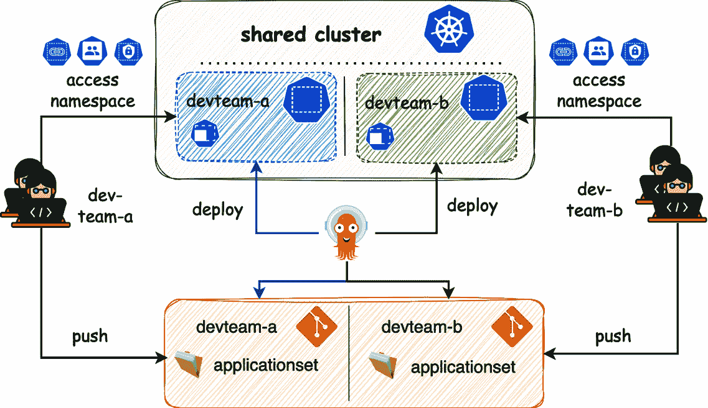

图 5.13：使用 GitOps 和 Argo CD 的多租户管理

每个团队将创建的文件夹结构如下所示：

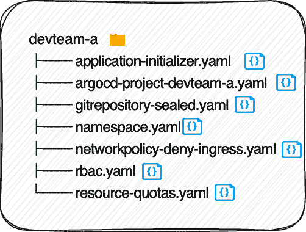

图 5.14：使用 GitOps 和 Argo CD 的多租户管理

在 Argo CD 中，项目代表团队的规章制度。你可以为每个开发团队设置一个项目，从而定义相关的规则集。这样，平台团队可以为开发人员提供足够的“游乐场”。

让我们看一下 `argocd-project-devteam-a.yaml`：

```
apiVersion: argoproj.io/v1alpha1
kind: AppProject
metadata:
  name: devteam-a
  namespace: argocd  finalizers:
    - resources-finalizer.argocd.argoproj.io
spec:  description: Enable DevTeam-A Project to deploy new applications  sourceRepos:
    - "*"
  destinations:
    - namespace: "devteam-a"
      server: https://kubernetes.default.svc
  # Restrict Namespace cluster-scoped resources from being created
  clusterResourceBlacklist:
    - group: ""
      kind: "Namespace"
  # Restrict namespaced-scoped resources from being created
  namespaceResourceBlacklist:
    - group: "argoproj.io"
      kind: "AppProject"
    - group: "argoproj.io"
      kind: "Application"
    - group: ""
      kind: "ResourceQuota"
    - group: "networking.k8s.io"
      kind: "NetworkPolicy"
```

在这个上下文中，`AppProject` 的结构很简单，包括 `sourceRepos`、`destinations`、`roles`、`clusterResourcesBlackList` 或 `WhiteList`，以及 `namespaceResourceBlacklist` 或 `WhiteList` 等元素。

操作流程涉及确定资源的来源、它们可以部署到的集群以及项目中允许部署的命名空间。它定义了项目可以在集群中创建的资源和命名空间资源，并可选择允许或明确禁止（`!`）某些操作。

可以设置全局项目，以将配置分发到其他项目。这意味着你可以实施集群范围的限制，这些限制会被其他*AppProjects*继承，从而不必为每个项目复制整个配置块。

项目角色可以用于授予或拒绝对项目中特定资源的访问权限。这里也使用了全局角色（`argo-rbac-cm`）和团队或项目角色。然而，如果用户的 Kubernetes RBAC 权限比项目中定义的权限更广泛，项目设置将无法限制他们访问或修改资源的能力。因此，在 RBAC 集群层级约束用户权限是至关重要的。

参考以下示例：

```
destinations:
    - namespace: "!kube-system"
      server: https://kubernetes.default.svc
    - namespace: "devteam-a-*"
      server: https://kubernetes.default.svc
    - namespace: "*"
      server: https://kubernetes.default.svc
```

重要说明

在这里，你显式禁止了部署到 `kube-system`，同时允许部署到 `devteam-a` 命名空间。然而，这也无意间允许了部署到其他命名空间，如 `devteam-b`，因为它们与拒绝模式不匹配。这种情况凸显了对 Kubernetes 及相关工具的深入理解在实施大规模 GitOps 多租户方法中的重要性。

现在，让我们看看如何在这个环境中设置应用程序：

```
apiVersion: argoproj.io/v1alpha1
kind: Application
metadata:
  name: application-initializer-devteam-a
  namespace: argocd
spec:
  project: devteam-a
  source:
    repoURL: https://dev.azure.com/ORGA-X/devteam-a/_git/application
    targetRevision: main
    path: ./applicationset
  destination:
    server: https://kubernetes.default.svc
    namespace: devteam-a
…
```

资源由 Argo CD 核心实例收集，并通过 GitOps 方法进行部署。此时，平台团队负责管理应用程序，并不允许开发人员自行部署应用程序（参见限制）。你应该小心，因为限制创建资源与操作资源不同。因此，根据你的环境、公司治理和安全指南，你可能需要配置额外的策略和**WebHook**验证。

`devteam-a` 在他们的代码库中有一个名为 `applicationset` 的文件夹。该文件夹表示 Argo CD 的起点。开发人员可以确定应用程序的顺序，并通过 `kustomize`、Helm 或直接的 Kubernetes 清单文件来部署应用程序。在此配置中，开发人员无法创建诸如应用程序、ApplicationSets 和 AppProjects 等自定义资源。

这种基于 GitOps 的多租户方法存在一些限制：

+   **限制团队访问 Argo CD UI/CLI**：团队通常无法通过 Argo CD 的 UI 或 CLI 创建和管理应用程序。如果你希望提供此类访问权限，则需要使用 Dex 服务器，在 **RBAC ConfigMap** 中创建策略，映射组到角色，或使用项目角色。

+   **限制对监控堆栈的访问**：团队可能无法访问监控堆栈。在这个层次上实现多租户也是必要的。

+   **CRD 版本冲突的潜在问题**：如果两个团队选择为同一服务部署不同版本的 CRD，就必须解决这些冲突。一个解决方法是通过拉取请求阻止此类操作并进行处理。

+   **声明式管理的挑战**：声明式管理的概念可能与多租户原则冲突。这是因为 Argo CD 要求自定义资源，如应用程序，必须与 Argo CD 本身位于同一命名空间。一个目前正在开发的 beta 功能可能允许将应用程序部署到不同的命名空间。

选择使用 GitOps 实现多租户时，你可以节省硬件资源。然而，需要考虑的是，维护和执行多租户配置所需的工程资源可能会增加。GitOps 可以简化管理和执行，但它也有自己的约束，取决于使用的工具以及底层 Kubernetes 版本和核心方法。

这就是为什么 *AppProject* 对于多租户来说不够的原因。为了让开发团队获得完整的 GitOps 体验，单独使用 Argo CD 需要一些执行措施。由于这里描述的限制，可以使用一些工具来减少这些限制。我们将在下一节中讨论这个问题。

# 探索 vCluster 与 Argo CD 的多租户实现

在上一节中，我们探讨了如何使用 Argo CD 原生实现多租户，并介绍了编写时的当前限制。虽然这些限制未来可能会得到解决，但目前无法确定。

在本节中，我们将通过引入一个名为 vCluster 的工具来扩展多租户方法。该工具通过 Argo CD 以声明性方式启用 GitOps 扩展，解决了之前讨论的大部分限制。这种方法从 Namespaces-as-a-Service 模式转变为更全面的 **虚拟 Kubernetes 服务（VKaaS）** 或 **Kubernetes 服务（KaaS）** 方法。

vCluster 是一个开源解决方案，用于创建和管理虚拟 Kubernetes 集群，提出了一种新的 Kubernetes 集群管理方法。它通过建立一个宿主集群，在其上运行类似种子集群的 vCluster，这些 vCluster 在命名空间内操作。此设置允许部署多个集群。必要的 Kubernetes 组件和一个额外的 **syncer** 作为 Pod 在命名空间内运行，提供一个具有专用 API 的独特虚拟集群。这些虚拟集群尽管运行在宿主集群的单一命名空间内，但提供了独立且完全成熟的集群的假象。特别是在命名空间限制是问题，并且需要与宿主集群的多租户设置不兼容的特定配置时，这种方式尤其有用。

这里的重点不仅仅是工具本身，而是它如何帮助我们满足前面部分中列出的需求。我们将保持相同的需求，并探索 vCluster 如何克服之前讨论的限制。

在我们的上下文中，**租户** (*图 5.15*) 是指由 vCluster 管理的项目，这些项目运行在专用节点上，每个节点都有自己的 Argo CD 实例。因此，在我们的框架中，每个项目都是一个租户，每个租户对应一个命名空间，符合 vCluster 在共享集群中基于命名空间的方法：

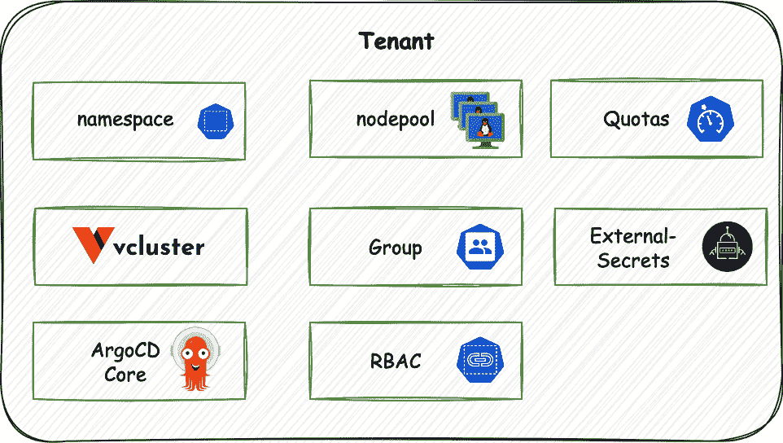

图 5.15：如何根据服务将租户分组的示例

完成此设置过程后，如 *图 5.16* 所示，您的系统将呈现一个配置，其中共享工作负载和隔离工作负载在宿主集群上同时存在。这种并存的程度取决于您如何应用污点和容忍度，以及如何采用其他策略来指导 Kubernetes 的部署决策。这一能力对于有效地将共享工作负载分布到集群中至关重要。

我们即将探讨的方法展示了如何区分客户种子集群的工作负载，这些集群运行在专用节点池上，以及默认节点池和宿主集群的工作负载。需要注意的是，这些宿主集群工作负载对于 Kubernetes 或平台团队的操作至关重要，例如部署种子集群：

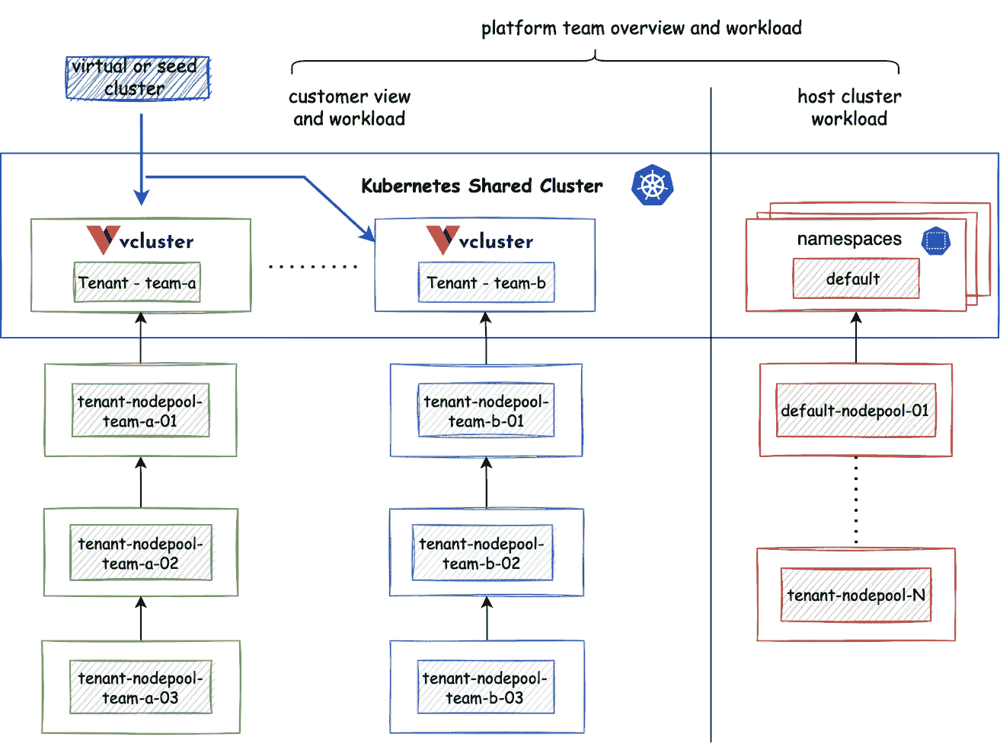

图 5.16：vCluster 多租户设置

我们将把工作流分为四个步骤。然而，只有前两个步骤是构建 vCluster 多租户设置所必需的：

1.  **步骤 1 –** **部署 vCluster**：

重要提示

对于这一部分，KSC 通过优化/vCluster 进行扩展。

以下代码摘自应用程序，可以在 GitHub 上找到 `vcluster-application.yaml` 文件，该文件重点关注核心内容。需要理解的是，多个仓库作为源被引用，并且创建了一个 Helm 发布，并使用特定的值覆盖它：

```
  sources:
    - repoURL: git@github.com:PacktPublishing/Implementing-GitOps-with-Kubernetes.git
      targetRevision: main
      ref: valuesRepo
  # - repoURL: git@github.com:PacktPublishing/Implementing-GitOps-with-Kubernetes.git
  #   path: "./chapter05chapter-5-building-a-service-catalog-for-kubernetes/cluster/vcluster-team-a/" #this part allows to deploy additional manifest like rbac.yaml
  #   targetRevision: main
    - repoURL: git@github.com:PacktPublishing/Implementing-GitOps-with-Kubernetes.git
      targetRevision: main
      path: "./chapter05/chapter-5-building-a-service-catalog-for-kubernetes/optimization/vcluster"
      helm:
        releaseName: "vcluster-team-a"
        valueFiles:
          - "values.yaml"
          - "$valuesRepo/chapter05/chapter-5-building-a-service-catalog-for-kubernetes/cluster/vcluster-team-a/optimization/vcluster/values.yaml"
```

此外，我们将部署特定的 Kubernetes 资源，如`networkpolicy-deny-ingress.yaml`和`rbac.yaml`，以在命名空间级别有效地管理访问控制。这些资源对于确保多租户环境中的安全性和访问协议至关重要。

1.  **第 2 步 – 将运行在主集群上的 Argo CD 连接到** **vCluster**：

    1.  这一步涉及使用 vCluster 和 Argo CD 设置多租户环境。重点是建立 Argo CD（在主集群上运行）与运行在主集群上的 vCluster 之间的连接。此过程从连接 vCluster 开始。你可以通过一条命令来实现这一连接。如果是端口转发连接，可以使用以下命令：

    ```
    vcluster connect vcluster-team-a -n vcluster-team-a
    ```

    1.  当使用 ingress 进行 SSL 透传时，可以通过以下命令建立连接：

    ```
    vcluster connect vcluster-team-a \
    -n vcluster-team-a \
    --server=https://vcluster-team-a.example.com
    ```

    记得配置一些特定于 vCluster 和 ingress-controller 的参数，以启用 SSL 透传。

    1.  一旦设置完成，将主系统上的 Argo CD 连接到 vCluster 的过程就非常简单，可以通过一行命令来完成：

    ```
    argocd cluster add vcluster_vcluster-team-a \
    --label env=vdev \
    --upsert \
    --name vcuster-team-a
    ```

重要提示

在这个阶段，我们已经有效地解决了多租户的挑战。团队现在可以使用熟悉的`vcluster connect`命令连接到虚拟集群。这一功能对于促进团队的自给自足至关重要。

1.  **第 3 步 – 指向** **KSC**：

    在这里，重点是将虚拟 Kubernetes 环境与服务目录集成。此步骤涉及创建一个应用程序，该应用程序指向一个包含为虚拟集群专门设计的一套应用程序的仓库。这就像之前提供的应用程序示例。通过建立**虚拟 KSC**（**vKSC**），你可以区分不同的环境，并通过标签来部署，就像管理专用 Kubernetes 集群一样。

    为了实现这一目标，你可以参考我博客中提供的逐步指南[*7*]。该指南提供了详细的说明和见解，帮助你构建 vKSC。这个资源对于理解如何在多租户环境中使用 vCluster 有效地管理和部署应用程序非常有帮助，确保你的 Kubernetes 环境能够平稳且可扩展地运行。

1.  **第 4 步 – 在 vCluster 中部署 Argo CD，同时在** **主集群上运行 Argo CD**：

    在设置 vCluster 的多租户环境时，我们已经建立了一个代表 vKSC 的文件夹结构。该结构对于组织 vCluster 中的各种服务和应用至关重要。在将 Argo CD 集成到这个服务目录后，与 KSC 中的其他服务类似，我们现在必须使用在主集群上运行的 Argo CD，通过 GitOps 在所有集群中部署 Argo CD。这种方法使得部署过程自动化且一致，有助于避免代码冗余，并能够为每个集群单独修补清单文件。此设置确保了在多租户 Kubernetes 环境中，通过在所有集群中统一部署 Argo CD，能够高效地进行管理和部署。

## 奖励—简化连接多个 vCluster—一个实用的 bash 脚本

管理多个 vCluster 通常会变得繁琐且混乱，特别是当涉及到单独连接每个集群时。为了解决这个挑战并简化工作流，我开发了一个简单的 bash 脚本。这个脚本大大简化了过程。它基于主集群的上下文运行，并采用一致的命名模式，例如命名空间为`vcluster-demo`，入口格式为`vcluster-team-a.example.com`。使用这个脚本，你可以高效地遍历并连接所有 vCluster，从而节省大量时间和精力，轻松管理多集群环境。

## 使用 GitOps 解决的多租户限制—回顾

使用 vCluster 和 Argo CD 实现多租户，如前面步骤所述，解决了几个关键限制：

+   **团队对 Argo CD UI/CLI 的访问受限**：可以通过实施*步骤 3*和*步骤 4*来解决。每个团队都会获得一个 Argo CD 实例，提供 UI 和 CLI 访问权限，从而增强了自治性和操作效率。

+   **访问监控栈的权限受限**：可以通过在 vCluster 中部署额外的监控栈来解决。此步骤确保团队可以使用必要的监控工具，以便有效地管理集群。

+   **与 CRD 版本的潜在冲突**：这个问题不再存在，因为每个虚拟 Kubernetes 集群都维护着一个独立的键值存储，具有不同的 CRD 版本。这种分离有效地消除了由于 CRD 版本不一致引发的冲突。

+   **声明式管理的挑战**：这一问题通过平台团队在 Argo CD 上提供虚拟集群的能力得以解决，从而使各个团队能够有效地管理他们的专属 vCluster。从开发者的角度来看，按照*步骤 3*和*步骤 4*的实施（参见《探索 vCluster 和 Argo CD 的多租户功能》部分）可以确保顺利的声明式管理过程。

然而，重要的是要注意这种方法固有的权衡。虽然与每个项目/团队单独使用一个集群的专用方法相比，这一概念看起来更为高效，特别是在资源利用方面，但 vCluster 确实比原生方法消耗更多资源。虚拟集群中的大多数资源可以同步到主集群，而**loft.sh**（vCluster 的创造者）正在致力于扩展这种双向同步。此外，还有 vCluster Pro 企业版本，提供进一步的增强功能，例如主集群和 vCluster 之间的自定义同步、休眠 vCluster、创建模板等。然而，这里关注的重点不仅仅是工具，而是方法——如何在大规模下使用 GitOps 有效地实施多租户策略。

随着本章的结束，以下部分总结了关键要点。

# 总结——来自多租户经验的见解和教训。

随着本章的结束，回顾一下我们所学到的关键主题和经验教训是非常有启发性的。从*App of Apps 方法*开始，我们为理解在 Kubernetes 环境中管理应用程序的复杂性奠定了基础。这个方法强调了采用结构化、可扩展的方式来处理应用程序部署和编排的重要性。

接着是*多集群管理*，我们探讨了管理多个 Kubernetes 集群的复杂性，这对大规模运营的组织至关重要。这个探索与关于有效 Git 仓库策略的部分相辅相成，重点优化了仓库管理，以提升 GitOps 中心环境中的运营效率。

这一过程进一步展开，涉及了*ApplicationSet 生成器*和*构建 Kubernetes 服务目录*。这些部分深入探讨了在多个 Kubernetes 集群中有效地扩展应用和服务所需的技术和工具，强调了 Kubernetes 固有的可扩展性和灵活性。

*Argo CD 的本地多租户*和*使用 vCluster 和 Argo CD 的多租户*部分提供了对不同方法和工具的透彻理解，帮助实现高效的多租户管理。它们强调了如何使用 Argo CD 和 vCluster 实现和管理多租户环境，提供了创建隔离、高效的多租户环境的见解。

在整个探索过程中，出现了几个关键的经验教训和见解：

+   策略往往比工具的选择更为重要，这加强了方法相对于具体技术的重要性。

+   本地实现多租户可以节省硬件资源，但可能会增加对工程资源的需求。

+   使用如 App of Apps 和 ApplicationSets 等模式，可以大大帮助构建适用于不同角色和用例的可扩展部署策略。

+   使用 Argo CD 管理多个集群变得更简便，特别是结合有效使用标签和 GitOps 方法时。

+   标签在与 ApplicationSets 和 Cluster 生成器结合使用时，可以促进跨集群的选择性和灵活的部署策略。

+   尽管本地多租户方法看似资源高效，但它们可能带来复杂性，并且需要更多的工程资源。

+   像 vCluster 这样的工具提供了一种更为隔离的多租户方法，同时保持声明式管理并利用 GitOps。

+   需要谨慎管理节省硬件资源与增加工程师和开发者入职培训工作之间的平衡。

+   大规模的 GitOps 赋能平台工程团队和开发者，使他们能够专注于应用开发，而不是运营负担。

本章结尾时，显而易见的是，理解底层方法为创造多样化且具有深远影响的现实世界解决方案和产品打开了无数可能性。

其中包括以下产品：

+   **平台即服务（PaaS）产品**：作为一个平台工程团队，理解这些概念能够帮助创建一个 PaaS 产品。该平台提供一套必不可少的工具和服务，简化了应用开发和部署过程。

+   **面向多样化客户的软件即服务（SaaS）解决方案开发**：通过利用 GitOps 和 Argo CD，开发者可以创建可定制的 SaaS 解决方案，这些解决方案易于在不同地区和版本的 Kubernetes 集群中部署。该方法确保了自动化、一致的部署，使开发者能够高效地满足不同客户群体的独特需求。

+   **面向 SRE 团队的部署解决方案**：SRE 团队可以利用这些知识来改善他们的部署策略，确保运营中的高可用性和高效率。

+   **面向安全团队的治理与合规工具**：安全团队可以利用这些策略在所有集群中实施强有力的治理和合规措施。通过有效使用标签，他们可以建立全面的服务包，以确保遵守安全标准和监管要求。

这些应用展示了本章讨论的策略的多样性和现实世界影响，突显了深入理解 GitOps 和多租户架构如何促成多样化、可扩展且安全的技术解决方案的创造。

# 总结

总结来说，本章不仅阐明了实现 Kubernetes 中多租户和扩展的各种策略和工具，还强调了深入理解这些概念的重要性。通过 GitOps 和多租户架构的深入探讨，可以发现尽管有多种方法可以提高 Kubernetes 的效率，但每种方法都有其权衡。最终的选择应与组织的特定需求及开发团队的目标相一致。

在下一章中，我们将介绍本章中已部分应用的不同架构，以说明诸如*一个驾驶舱控制所有*的多集群管理方法，并讨论它们的优缺点、使用案例以及从多个项目中获得的见解。

# 参考文献

+   [*1*] [`docs.akuity.io/tutorials/cluster-addons-with-applicationsets/`](https://docs.akuity.io/tutorials/cluster-addons-with-applicationsets/)

+   [*2*] [`argocd-applicationset.readthedocs.io/en/stable/Generators/`](https://argocd-applicationset.readthedocs.io/en/stable/Generators/)

+   [*3*] [`codefresh.io/blog/argo-cd-best-practices/`](https://codefresh.io/blog/argo-cd-best-practices/)

+   [*4*] [`codefresh.io/docs/docs/pipelines/deployment-environments/`](https://codefresh.io/docs/docs/pipelines/deployment-environments/)

+   [*5*] [`codefresh.io/blog/codefresh-gitops-app-of-apps/`](https://codefresh.io/blog/codefresh-gitops-app-of-apps/)

+   [*6*] [`www.vcluster.com/docs/using-vclusters/access`](https://www.vcluster.com/docs/using-vclusters/access)

+   [*7*] [`medium.com/devops-dev/multi-tenancy-with-vcluster-794de061fff1`](https://medium.com/devops-dev/multi-tenancy-with-vcluster-794de061fff1)
