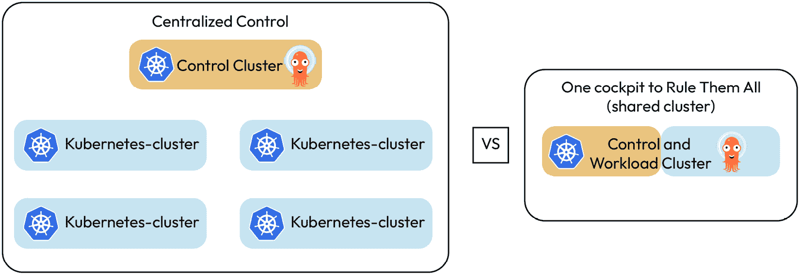
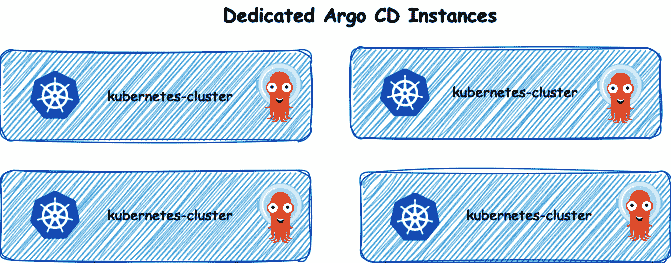
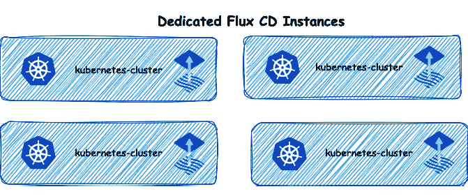
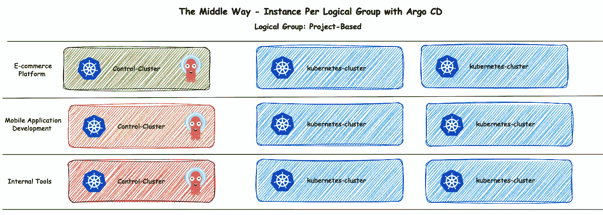
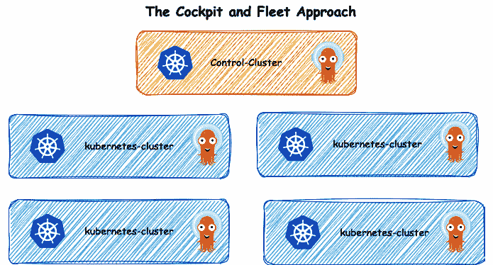
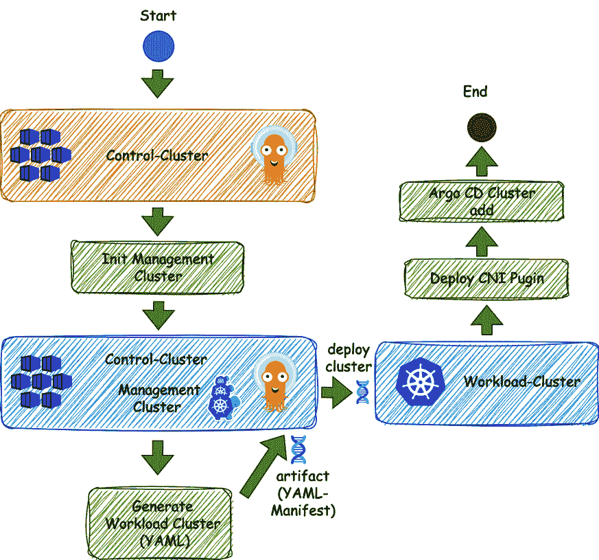

# 第五章：GitOps 架构设计与操作控制

在快速发展的云原生技术领域，理解并有效实施多种架构框架，对于那些希望充分利用 Kubernetes 潜力的组织来说至关重要。随着我们在本章深入探讨这一主题，我们将探索多种架构，这些架构不仅支持多集群管理——这是上一章部分介绍的主题——还促进了 **GitOps** 在服务和产品部署中的有效实施，这些部署被许多公司所使用。

我们的旅程将带领我们通过实际场景和从采用不同架构方法的项目中获得的实践见解。通过分析不同公司如何成功地将 GitOps 方法论整合到服务和产品的部署与管理中，我们能够获得在不同背景下有效的方法的宝贵视角。本章特别适合 **平台工程师**、**SRE** 和 **内部开发平台** 构建者，因为它专注于部署团队使用的各种运营模型，来提供他们的工作负载或平台环境。

我们将深入研究使用 **Argo CD**、**Flux CD** 和 **Cluster API** 等工具来管理 Kubernetes 集群和工作负载的细微差别。这些工具在实现 Kubernetes 环境高效和可扩展管理方面处于前沿。

到本章结束时，你将全面理解不同架构选择如何影响 Kubernetes 部署的效果和效率，特别是在 GitOps 背景下。无论你是构建基础设施的平台工程师，确保可靠性的 SRE，还是构建内部平台的开发者，这里分享的见解都将在你追求云原生环境中卓越运营的过程中发挥重要作用。

因此，本章将涉及以下主题：

+   探索适用于 Kubernetes 环境的多种 GitOps 架构框架

+   探讨架构选择对 GitOps 效率的影响

+   为云原生部署量身定制可扩展性、弹性和效率的设计

+   集中控制 – 使用单个 Argo 实例管理集群

+   专用实例 – 每个集群一个实例，使用 Argo CD

+   专用实例 – 每个集群一个实例，使用 Flux CD

+   中间路径 – 每个逻辑组一个实例，使用 Argo CD

+   使用 Argo CD 的驾驶舱和舰队方法

+   集中式 Kubernetes 集群创建 – 利用 Cluster API 和 Argo CD 简化集群部署

+   深入探讨 Cluster API 和 GitOps – 实践操作

# 探索适用于 Kubernetes 环境的多种 GitOps 架构框架

探索适用于 Kubernetes 环境的多种 GitOps 架构框架，对于希望简化部署管道和操作工作流的组织至关重要。GitOps 由 **Weaveworks** 提出，强调将 Git 作为声明性基础设施和应用程序的唯一可信来源。在 Kubernetes 环境中，这转化为一系列最佳实践和模式，指导容器编排的管理与自动化。

GitOps 中的多个架构框架针对不同的组织需求和技术环境。框架的选择通常取决于环境的复杂性、操作的规模和治理需求。

GitOps 的采用在 Kubernetes 架构决策中有多方面的影响：

+   **基础设施即代码（IaC）**：通过 GitOps，整个 Kubernetes 架构都定义为代码——通常是 YAML 文件，描述系统的期望状态。这种方法使开发人员和运维团队能够协作处理基础设施变更，且这些变更可以像应用程序代码一样进行版本控制、审查和审计。

+   **不可变基础设施**：采用 GitOps 的架构框架通常优先考虑不可变性。一旦资源被部署，就不应该在运行环境中手动更改。相反，任何修改都会在 Git 仓库中进行，这会触发部署流程以更新基础设施。

+   **模块化设计**：GitOps 鼓励对基础设施采取模块化方法。每个模块，或一组 Kubernetes 资源，都可以作为 Git 中的一个独立项目进行管理。这种模块化与 Kubernetes 的微服务架构哲学相契合，其中每个服务都可以独立部署、扩展和管理。

+   **自动化部署策略**：GitOps 下的架构框架通常包含先进的部署策略，如金丝雀发布、蓝绿部署和 A/B 测试。GitOps 工具自动化了这些策略的发布和监控，使得它们能够以受控的方式更容易地实施。

+   **环境一致性**：GitOps 确保每个环境——从开发到预生产到生产——都能以高度一致性进行复制。这是通过在不同环境中使用相同的声明性配置来实现的，从而减少了“在我机器上能工作”的现象。

+   **安全性和合规性**：通过将架构元素作为代码定义在 Git 仓库中，GitOps 使得安全策略和合规检查能够成为 **持续集成/持续部署** (**CI/CD**) 流水线的一部分。这意味着安全性作为架构的一部分被设计，而不是事后的考虑。

+   **单一仓库与多个仓库**：一些组织选择使用一个包含所有配置和应用的仓库，这简化了管理，但在大团队或复杂应用中可能难以扩展。另一些组织则偏好多个仓库，将配置和应用分开，以提供更精细的访问控制和更清晰的关注点分离。

+   **推送与拉取部署模型**：在基于推送的模型中，变更从仓库推送到 Kubernetes 集群，通常通过 CI/CD 流水线进行。相反，基于拉取的模型涉及 Kubernetes 集群内的一个操作员监视仓库，并在检测到变更时拉取更新。虽然推送模型提供即时性，但拉取模型因其与 Kubernetes 声明式哲学的契合及增强的安全性而受到赞扬。

+   **单体架构与微服务架构**：在 Kubernetes 中的应用架构方面，GitOps 可以应用于单体架构和微服务架构。由于单体架构的单一特性，GitOps 可能更易于管理，但微服务架构通过 GitOps 能够独立部署和扩展服务，从中受益。

GitOps 赋能的 Kubernetes 架构框架正在不断发展，以促进更强大、可扩展和安全的应用部署。拥抱 GitOps 不仅简化了操作工作流程，还加强了软件架构的最佳实践。随着组织采用这些框架，它们必须保持灵活，并愿意适应云原生技术快速变化的格局。

在下一部分，我们将探讨架构选择对使用 GitOps 的影响。

# 检查架构选择对 GitOps 效果的影响

GitOps 本质上与 Kubernetes 的声明式基础设施管理方法一致，其中系统的期望状态通过代码描述。此状态被提交到 Git 仓库，并作为唯一的“真相来源”。GitOps 的有效性取决于架构选择如何支持声明式模型，从而实现以下几个方面：

+   **版本控制**：跟踪变化历史，提供历史背景，并支持回滚到先前状态

+   **变更管理**：促进基础设施代码变更的同行评审和批准，提高部署的质量和安全性

+   **自动化同步**：确保系统的实际状态自动 converges 到在仓库中定义的期望状态

## 影响 GitOps 的架构选择

在考虑架构选择对 GitOps 影响时，有几个关键因素需要考虑：

+   **仓库结构**：在单一仓库（单体仓库）和多仓库（每个服务或团队一个仓库）之间的选择，可能会显著影响应用程序的可管理性和可扩展性。单体仓库可能简化依赖追踪和版本管理，但随着规模扩大可能变得难以处理。多仓库策略提高了模块化和关注点分离，但需要更复杂的同步机制。

+   **部署策略**：架构必须支持多种部署策略，例如金丝雀发布、蓝绿部署或滚动更新。GitOps 工具自动化这些策略的执行，策略选择会影响资源利用、部署期间的停机时间以及在类似生产环境中测试变更的能力。

+   **环境隔离**：关于如何隔离和管理环境（开发、预发布和生产）的架构决策将影响 GitOps 工作流。可以通过独立的分支、目录甚至独立的仓库来处理环境特定的配置，每种方法都会影响访问控制、可追溯性和复杂性。

+   **可扩展性**：随着组织的规模扩大，架构应能够支持处理更大的工作负载、更复杂的部署以及更多服务的 GitOps 方法。这可能涉及到集群分区、采用多集群策略或利用专门针对可扩展性设计的云原生工具。

+   **安全考虑**：架构决策必须确保安全性融入 GitOps 工作流中。这包括从保护 Git 仓库访问权限到加密敏感数据，以及在整个 CI/CD 流水线中自动执行策略。

## 做出有根据的架构决策

为确保 GitOps 的有效性，组织必须做出有根据的架构决策：

+   **评估组织需求**：了解组织在规模、复杂性、合规性和团队工作流程方面的需求。

+   **评估工具兼容性**：选择与所选架构兼容并能支持所需部署策略的 GitOps 工具。

+   **促进协作**：架构应鼓励开发、运维和安全团队之间的协作，以便利用集体的专业知识支持 GitOps 工作流。

+   **持续优化**：架构决策应根据持续运营中的反馈进行重新评估和优化，以适应新的挑战和机会。

总之，在设置 Kubernetes 环境时所做的架构选择对 GitOps 方法的成功具有深远的影响。通过构建一个拥抱版本控制、变更管理和自动同步的架构，组织可以利用 GitOps 提升基础设施的灵活性和稳定性。对仓库结构、部署策略、环境隔离、可扩展性和安全性做出明智决策，将使团队能够充分利用 GitOps 的潜力，从而打造一个更加弹性和响应迅速的基础设施。

# 为云原生部署量身定制可扩展性、韧性和效率的设计

为实现可扩展性、韧性和效率而量身定制架构设计是云原生部署的基础，因为云环境的动态特性可能带来机遇与挑战。云原生架构使系统能够对故障具有韧性，适应不断变化的负载，并高效利用资源。在融入 GitOps 实践时，这些设计可以系统地实施并持续改进。

## 云原生架构中的可扩展性

云原生部署预计能够优雅地处理不同的负载。这种灵活性对在需求高峰期间维持性能并在较为平静的时期优化成本至关重要。以下是实现高可扩展性的一些方法：

+   **水平扩展**：架构应设计为支持水平扩展，这意味着通过增加应用程序实例来处理增加的负载。

+   **微服务**：将应用程序拆分成微服务可以使各个组件独立扩展，从而对资源分配进行精细控制。

+   **无状态应用**：无状态应用本质上具有更好的可扩展性，因为任何实例都可以处理任何请求，从而实现简便的水平扩展。

GitOps 可以通过根据 Git 仓库中定义的负载自动调整实例数量来管理这些服务的部署和扩展。

## 通过冗余和隔离增强韧性

一个具有韧性的系统能够在不产生重大停机或数据丢失的情况下承受并从故障中恢复。以下是实现更强韧性的一些方法：

+   **高可用性**：架构必须设计为具有高可用性，并具备冗余组件，在发生故障时可以接管。

+   **故障隔离**：微服务架构天然支持故障隔离。一个服务中的问题不应蔓延并导致系统级的故障。

+   **灾难恢复**：一个强大的备份与恢复策略以及多区域部署可以确保应用程序在发生灾难性事件时仍然能够存活。

在 GitOps 工作流中，仓库中的期望状态反映了这些高可用性配置，允许系统通过自动重新部署失败的组件来实现自我修复。

## 主动优化以提高效率。

云原生部署的效率是指用更少的时间、更少的资源和更少的人工干预实现更多的目标。如果事先优化以下方面，你可以在早期就实现高效：

+   **自动扩展**：实施自动扩展策略，根据实时指标调整资源，确保高效使用基础设施。

+   **负载均衡**：有效的负载均衡将流量分配到各个实例，以优化资源利用并确保一致的性能。

+   **资源限制**：在 Kubernetes 中设置适当的资源限制和请求有助于防止任何单一服务消耗过多资源，从而实现更高效的系统。

GitOps 通过基于 Git 仓库中定义的配置触发操作，自动化执行这些策略的过程。

## 利用 GitOps 量身定制设计。

设计具有可扩展性、韧性和高效性的架构需要精心规划，并使用合适的工具来管理云原生应用的部署和运行。在定制设计时，考虑以下方面：

+   **基础设施即代码（IaC）**：将你的基础设施和策略定义为代码，以保持清晰且可审计的资源分配和管理过程。

+   **可观测性**：实施全面的日志记录、监控和告警，以深入了解系统的性能和健康状态，指导设计调整的决策。

+   **持续改进**：利用 GitOps 持续部署更新和改进架构，确保其不断发展以应对不断变化的需求和挑战。

为了让云原生部署在弹性且常常不可预测的云环境中茁壮成长，量身定制具备可扩展性、韧性和高效性的设计至关重要。通过利用 GitOps，团队可以确保这些设计原则在所有环境中得到一致应用，从而快速响应变化并维持强大高效的系统。随着云技术的不断演进，支持这些技术的架构和实践也必须与时俱进，GitOps 为这一持续演化提供了框架。

在 *第十一章* 中，我们将探讨不同 GitOps 方法在实际应用中部署真实世界应用程序的实际用法。下一部分深入探讨应用程序设计在 GitOps 中的重要性，强调操作设置的重要性。团队的关注点不仅仅应该是部署应用程序，还应该是选择合适的 GitOps 实例策略以实现有效部署。在使用 Argo CD 等工具实施 GitOps 之前，必须仔细考虑所需的集群数量。我们在前一章简要介绍了单实例方法，同时重点讨论了可扩展性。下一部分将考察各种方法、组织在实际应用中的经验，以及在这些场景中经历的优缺点，特别强调 GitOps 实例的操作控制。

# 集中控制 - 使用单一 Argo 实例管理集群

随着组织的发展和演变，对可扩展、安全和高效部署策略的需求变得越来越重要。**Argo CD** 作为 GitOps 领域的关键角色之一 [*1*, *2*]，凭借其在多个方面的全面能力脱颖而出，例如性能、安全性、可用性和故障转移过程。在这一部分，我们将深入探讨不同架构模型的细微差别以及操作管理的复杂性。然而，在我们深入讨论这些话题之前，必须首先解决一些在这一领域显著影响决策的前提问题：

+   **安全性考虑**：在使用 Argo CD 扩展时，安全性涉及 **基于角色的访问控制** (**RBAC**) 和 **单点登录** (**SSO**) 机制的强大组合。一个关键的安全特性是清单的客户端渲染，这可以减少威胁面。然而，像 **Helm**、**Kustomize** 和 **Jsonnet** 等工具在生成清单时的强大功能带来了潜在风险，因为它们允许执行任意代码。这就需要谨慎考虑，特别是在较大的实例中，以防止在清单生成中被滥用。

+   **可扩展性的可用性**：即使在 Argo CD 扩展时，它的易用性和可扩展性的声誉依然保持不变。然而，在多个 Kubernetes 实例中管理应用程序可能会导致复杂性，例如需要独特的应用程序命名约定，以及在单个 UI 实例中管理大量应用程序的挑战。尽管该工具的 UI 过滤器功能强大，但无法保存，迫使团队寻找创造性的解决方案，比如使用书签保存过滤器。

+   **故障转移策略**：GitOps 方法，由 Argo CD 体现，通过简单的 git 提交促进快速变更和恢复。然而，这种设置和拆卸的简便性也暴露了由于配置错误可能带来的重大影响。例如，更新配置管理插件时出现的一个小错误，可能导致大规模的应用程序故障。这引发了“爆炸半径”（blast radius）的疑问——一个配置错误可能带来的影响范围。

+   **性能扩展**：Argo CD 有两个版本：标准版和 **高可用性** (**HA**) 版。后者专为可扩展性设计，部署多个关键组件的副本，例如 repo-server。Argo CD 的可扩展性体现在它支持最多 1,500 个应用程序、14,000 个对象、50 个集群和 200 个开发人员，而无需进行重大调整。这个基准虽然保守，但考虑到了应用程序的差异，例如它们的对象数量、清单复杂性和更新频率。这些数据来自 *Joseph Sandoval* 在 KubeCon 上的演讲以及 *Adobe 和 Dan Garfield from Codefresh* [*3*] 的分享，提供了规划扩展需求的基础指导。

总结来说，虽然 Argo CD 是一个强大的工具，能够处理现代软件环境中的复杂扩展问题，但它在性能能力、安全风险、可用性挑战和故障转移策略方面需要仔细考虑。根据组织的具体需求做出正确的架构选择，可以充分发挥 Argo CD 的优势，同时降低与扩展相关的潜在风险。

## 这种方法——集中控制

这种方法对你来说可能很熟悉。在托管集群方法中，多个团队使用单个 Argo CD 实例来完成不同的任务。平台团队使用这个共享实例来为其他团队部署必要的平台上下文。

重要提示

平台上下文，根据各个公司的需求量身定制，包括有效的 Kubernetes 平台操作所需的关键工具，如 Ingress Controllers 和 Cert-Managers。

开发人员使用相同的 Argo CD 实例来部署他们的应用程序。类似地，**SRE 团队**利用它部署帮助识别瓶颈、分析性能问题等的工具。安全团队也利用这个共享的 Argo CD 实例来部署其策略，并通过策略引擎强制执行。此外，他们还部署像 **kubeclarity** [*4*] 或 **trivy operator** [*5*] 这样的安全工具，以监控集群中运行的镜像中的漏洞，跟踪使用的包并检查许可证。然而，现在的重大变化是，取而代之的是一个 Argo CD 实例管理多个集群（*图 6**.1*）：



图 6.1 – 集中控制与单一驾驶舱控制所有集群的区别

下表概述了优缺点：

| **优点** | **缺点** |
| --- | --- |
| **集中视图和控制**：跨所有集群的统一视图，用于部署活动 | **扩展性和性能**：扩展需要对单个组件进行调优 |
| **简化管理**：管理单个 Argo CD 实例以管理多个 Kubernetes 集群简化了行政任务 | **单点故障**：部署可能存在单点故障的风险 |
| **API/CLI 集成**：只需一个服务器 URL，API 和 CLI 集成变得更加简单 | **安全影响**：所有集群的管理员凭据集中化 |
|  | **网络流量和成本影响**：负责 Kubernetes 监控的应用控制器可能会产生显著的网络成本，特别是当集群位于不同区域时 |

表格 6.1 – 集中控制方法的优缺点

单一控制平面方法涉及一个 Argo CD 实例管理所有集群，这是一种常见的做法，旨在提供统一的应用视图并提升开发者体验。

对于那些根据环境分配访问权限并担心在一个实例下管理所有应用程序的组织，**RBAC** 策略和 **AppProjects** 可以建立必要的边界，定义部署位置和访问控制。

该架构还要求建立和维护一个专门的管理集群，用于托管 Argo CD 控制平面，并直接访问所有其他集群。该管理集群的位置可能引发安全问题，特别是如果它涉及到公共暴露。

这里的关键问题是如何在保持协作的同时确保租户分离。在使用 Argo CD 的 GitOps 方法中，内置的 **自定义资源** 如 **项目**、**角色** 和 **组** 被用来实现多租户框架。然而，确定谁负责实施、维护和扩展这种方法，以优化共享的 Argo CD 实例，是至关重要的。

如果平台团队负责管理，他们还必须处理安全性、治理和合规性等方面，特别是如果他们拥有集群的管理员权限。这一可行性取决于团队的资源和专业知识。例如，一个资源充足、对平台有核心知识并在安全性和**FinOps**等领域具有专业技能的平台团队，能够有效地管理这一任务。然而，较小的团队可能会发现维护安全性是一个挑战。

一些公司采纳的解决方案是不同团队之间的协作：

+   平台团队 ↔ 安全团队

+   平台团队 ↔ 开发者

+   平台团队 ↔ FinOps 团队

+   平台团队 ↔ SRE 团队

平台团队负责与这些团队沟通并实施承诺。他们还必须为安全团队强制执行的必要更改提供合理解释。这个模型适用于员工不超过 30-50 名的较小公司。超过 50 名员工后，平台团队与开发者/SRE 团队之间增加的互动可能会拖慢开发进度。

## 何时使用集中控制方法

集中控制方法通常是团队在多个集群中实现 Argo CD 时的初步选择。它特别适用于在小型团队框架内管理开发、暂存和生产环境。该模型支持高可用性、可扩展组件、RBAC 和 SSO，适合小规模操作和简洁的网络配置。

## 何时避免集中控制方法

拥有多个独立团队、广泛网络或需要高灵活性的较大组织应谨慎采用此方法。该模型在关键故障时可能导致较大的“爆炸半径”，且对于大量用户的灵活性有限，可能会带来负面影响。对于托管在虚拟专用云或防火墙后面的 Kubernetes 网络，尽管可以实现，但网络隧道的增加会增加复杂性。

总结来说，集中控制方法的单一控制平面方法，尽管在简化和管理方便性方面提供了诸多优势，但在安全性、可扩展性和性能方面存在风险。组织在采纳这种模型之前，必须仔细权衡这些因素，同时考虑其具体需求、团队规模和网络架构。

下一节讨论每个 Kubernetes 集群的独立 Argo CD 实例及其相关挑战。

# 独立实例 - 每个集群一个 Argo CD 实例

一个 Argo CD 实例被安装并与其管理的集群共存，这意味着每个集群都有自己的独立 Argo CD 实例。这种方法有多个优点和挑战。本节旨在帮助你理解并实现 Kubernetes 环境中的独立 Argo CD 实例。每个 Argo CD 实例都将安装并与其管理的集群共存，如*图 6.2*所示。

每个集群和每个团队都从拥有独立的 Argo CD 实例中受益。这意味着每个集群可以独立配置、管理和监控，从而允许根据每个集群的具体需求制定量身定制的管理策略。但这种方法也意味着每个 Argo CD 实例都需要其自己的资源。确保每个集群拥有足够的资源来支持其 Argo CD 实例至关重要。这一要求需要详细的规划和评估，以高效分配资源并避免潜在的资源短缺或不平衡：



图 6.2 – 每个集群的专用 Argo CD 实例示例

让我们来看看一些优缺点，以更好地理解这种方法：

| **优点** | **缺点** |
| --- | --- |
| **可靠性提升**：每个集群独立运行，提高了整体的可靠性 | **管理复杂性**：每个实例都需要单独管理和更新，增加了整体复杂性 |
| **关注点隔离**：这种设置提供更好的安全性，因为每个集群是自包含的 | **访问复杂性**：为跨多个实例的用户提供访问权限可能会带来挑战 |
| **无需外部网络访问**：独立的 Argo CD 实例不依赖于外部网络访问，这对边缘部署甚至是通过 USB 驱动器进行更新的隔离环境至关重要 | **灾难恢复考虑**：由于设置的去中心化特性，灾难恢复需要特别的规划 |
| **适用于边缘部署**：其独立性质非常适合边缘的集群，确保每个集群完全独立地运行 |  |

表 6.2 – 专用实例方法的优缺点

一开始看，这种方式似乎优点大于缺点。经过多年的实践，两个显著的好处已经得到证明。

提高的安全性可能是最突出的好处。通过使用独立的 Argo CD 实例，安全措施可以精确地根据每个集群的独特需求和脆弱性进行定制。这种定制化确保安全协议不仅坚固，而且精心设计，以应对特定威胁，为每个独特的环境提供坚固的防御。

另一个关键优势是 **隔离风险管理**。在传统设置中，单一的故障或漏洞可能会导致系统范围的危机。然而，通过使用专用的 Argo CD 实例，这类风险被限制在受影响的集群内，显著减少了发生广泛问题的可能性。风险隔离在一个单一漏洞可能导致重大操作中断的环境中至关重要。

然而，根据实际经验，有一个缺点超过了许多优点，特别是当集群和 Argo CD 实例数量增加，维护工作量大幅上升时。

维护负担是另一个重要因素。管理多个 Argo CD 实例意味着每个实例都需要单独的关注——从更新和配置调整到常规监控。增加的工作量可能会给 IT 团队带来压力，要求采用更强大和高效的管理策略，以应对额外的管理任务。

## 何时使用专用的 Argo CD 实例

**独立 Argo CD** 实例在需要最大可靠性和可访问性的场景中最为有利，尤其是在外部网络受限或不存在的情况下。这些实例是部署到边缘集群的默认选择，因为它们具有完全的操作独立性。为了扩展这些部署，通常会与基础设施管理工具，如 Crossplane 或 Terraform 进行集成，以简化设置和拆卸。另一种变体是使用中心辐射模型来管理跨多个集群的多个独立 Argo CD 实例。

## 何时避免使用专用的 Argo CD 实例

然而，独立实例带来了显著的管理开销。在单个团队管理简单的从预发布到生产的工作流的场景下，为每个集群分开使用 Argo CD 可能效率不高。在多个实例之间进行测试和实施变更也会带来挑战。采用金丝雀发布策略来更新一批实例虽然有效，但也为过程增添了另一个复杂层次。

总之，是否使用独立的 Argo CD 实例应该根据组织的具体需求和能力来决定。虽然它们提供了更高的可靠性和安全性，但在管理、更新和灾难恢复规划方面的复杂性必须谨慎考虑。对于某些环境，特别是边缘环境，独立的方式是理想选择，但对于较简单的设置或较小的团队来说，这种方式可能会引入不必要的复杂性。

是否决定为每个集群使用一个 Argo CD 实例，取决于你们组织的具体需求和能力。虽然这种方法能提供更高的可靠性和安全性，但在管理、更新和灾难恢复的复杂性方面需要仔细考虑。这一策略对于边缘部署和外部网络受限的环境非常有效，但对于简单的设置或较小的团队来说，可能过于复杂。

下一节将讨论每个 Kubernetes 集群使用专用 Flux CD 实例及其相关挑战。

# 专用实例 – 每个集群使用 Flux CD 实例

在 GitOps 工具领域，Argo CD 和 **Flux CD** 之间的区别至关重要，特别是在考虑它们在每个集群使用专用实例时。虽然 Argo CD 在 GitOps 领域是一个知名工具，但 Flux CD 也占据了重要地位，拥有强大的社区和大量的用户基础。理解这些工具的多样性对掌握 Kubernetes 集群管理的多种选择至关重要。

我的 GitOps 之旅始于 Flux CD，这是一款在长期使用中表现出色的工具，特别是在不需要扩展和管理多个集群的项目中。Flux CD 的这一特定适用性源于其与 Argo CD 不同的方式和功能。

乍一看，Flux CD 的使用可能看起来与 Argo CD 类似，几乎就像是一个简单的图标替换，如 *图 6.3* 所示，每个集群都有一个专用的 Flux CD 实例。然而，实际使用 Flux CD 的经验揭示了更深层次的复杂性。与 Argo CD 不同，Flux CD 需要在 Kubernetes 和 Helm 上具有更高水平的专业知识，要求团队精通如 *Helm*、*Kustomize* 和 *Kubernetes* 等工具：



图 6.3: 每个集群的专用 Flux CD 实例示例

Flux CD 管理部署的方法围绕 Helm 发布和 Helm 控制器。这些元素对于处理 Kubernetes 中的包部署和生命周期管理至关重要。Flux CD 中的 Helm 控制器提供了一种声明式的方法来安装、升级和管理 Kubernetes 环境中的 Helm 图表，符合 GitOps 原则。这要求团队对 Helm 图表及其管理有扎实的理解。

此外，Flux CD 使用 **Kustomizations** 来应用 Kubernetes 清单。此功能允许在将资源应用到集群之前进行定制，为管理复杂部署提供了强大的工具。理解并有效使用 Flux Kustomization 需要对 Kubernetes 清单的工作原理以及如何根据特定部署需求进行定制有深刻的了解。

在组织结构方面，有效采用 Flux CD 通常涉及小型、自治的团队，通常由 5-7 名成员组成。这些团队作为更大组织中的独立单元，处理项目并交付特定的产品或服务。这种结构虽然有利于聚焦和高效交付，但由于 Flux CD 的复杂性和所需的高级技能，带来了入职培训的挑战。

使用 Flux CD 进行团队每个集群管理的主要优势在于其灵活性和适应性，使其成为复杂部署场景的理想选择。Flux CD 支持高级定制选项，尤其对具有全面 Kubernetes 和 Helm 知识的团队特别有利。

然而，这种复杂性伴随着陡峭的学习曲线。Flux CD 的高级功能和定制选项增加了其设置和操作的复杂性。因此，将团队融入 Flux CD 工作流可能是耗时的，并且需要更高水平的技术能力。

这次讨论并不集中在比较 Flux CD 和 Argo CD，而是关注“每个集群实例化”方法在两者上的有效性。前面提到的优缺点同样适用于 Flux CD，因为这两个工具都在 Kubernetes 上运行，并采用原生 Kubernetes 方法来促进部署到集群中。然而，需要注意的是，虽然 Flux CD 需要更高的技能水平和对 Helm 图表或自定义化的先验经验，但 Argo CD 也可以直接与普通的 Kubernetes 清单一起使用。

此区分突显了尽管 Argo CD 和 Flux CD 在复杂性和要求上有所不同，但它们都可以有效地集成到每个集群实例化模型中。虽然 Argo CD 提供了更适合较简单场景的用户友好方法，但 Flux CD 的适应性和技术要求使其非常适合更复杂的部署，特别是对于精通 Kubernetes 和 Helm 的团队而言。

理解每个工具的操作细节、优势和需求对于希望优化其 Kubernetes 管理策略的组织至关重要。在集群实例化方法中，选择 Argo CD 和 Flux CD 应基于部署场景的特定需求以及管理团队的技能水平。通过将工具的能力与团队的专业知识和项目需求对齐，组织可以实现其 Kubernetes 集群的高效管理和有效管理。

下一节将会很有趣，因为将结合已经提出的各种概念来帮助您找到一种中间路径。

# The middle way – instance per logical group with Argo CD

**The middle way – instance per logical group with Argo CD** 是一种以使用带有 Argo CD 的控制集群来管理一组集群为中心的方法。这种方法提出了一个精炼的架构，旨在在 Kubernetes 集群管理中平衡可扩展性、可管理性和效率。它涉及每个逻辑集群组（如团队、地区或环境）运行一个 Argo CD 实例，具体取决于组织结构和需求。

在这种模型中，Argo CD 部署在属于特定组的控制集群上。从这个中心点出发，Argo CD 管理该组内的所有集群。这种安排旨在通过整合控制来简化管理流程，但仍保持了不同集群组之间的分离（*图 6**.4*）：



图 6.4 – 基于 Argo CD 项目中逻辑组实例的示例

这种架构通过将多个集群有效地划分为逻辑组来平衡管理的需求。它提供了一种解决方案，缓解了维护过多独立实例的挑战，同时提供了一种更易于管理和可扩展的方法。此分组不仅提高了操作效率，还增强了系统的安全性和可靠性。与每个集群一个实例的架构相比，开发人员的体验得到了改善，因为按照明确和易懂的分组约定减少了认知负担，简化了集成过程。

让我们来看一下可能的和最合理的分组方式。例如，组可以根据部门进行逻辑排序：

+   **基于部门**：不同的部门，如开发、运营或 QA，每个部门都有自己的 Argo CD 实例来管理他们的特定集群。

    +   **开发**：为开发人员提供一个实例，用于开发新产品特性

    +   **运营**：为运营团队提供一个独立的实例来管理部署和基础设施

    +   **QA**：为 QA 团队提供一个实例，用于测试和验证产品

此时，开发人员已经拥有一个具有不同工作负载集群的开发环境，可以自主使用。运营部门也有集群组，可以操作对组织至关重要的基础设施组件，例如 LDAP 服务器、DNS 服务器、ACME 服务器、数据库等。QA 部门可以在不同的集群上测试交付的软件特性，进行不同版本的测试，并使用他们的工具进行负载测试。

现在，让我们来看一下项目和地理位置：

+   **基于项目**：对于处理多个项目的公司，可以为每个项目分配一个独立的实例，从而促进集中管理和自主性：

    +   **电子商务平台**：为电子商务项目团队提供一个专用实例

    +   **移动应用开发**：为从事移动应用的团队提供一个独立的实例

    +   **内部工具**：用于开发和维护公司内部工具的团队

    在这种情况下，每个项目都会分配到一个独立的 Argo CD 实例。例如，负责电子商务平台的团队可以完全控制他们的部署管道和功能发布，将工作流程定制为项目的具体需求。同样，专注于移动应用开发的团队可以集中管理他们的部署，重点关注移动特定的需求和测试环境。对于内部工具，专用的实例允许团队快速迭代并部署更新，确保内部操作的顺利和高效运行。

+   **地理位置**：拥有全球运营的公司可以根据地理区域对集群进行分组，以便更好的本地化和合规性管理：

    +   **北美运营**：用于北美地区集群的实例

    +   **欧洲**：为管理欧洲国家集群提供一个专用实例

    +   **亚太地区**（**APAC**）：一个专注于亚太地区特定需求和合规性的实例

    例如，专门为北美运营设立的 Argo CD 实例使团队能够根据当地的合规性和运营标准管理集群。在欧洲，团队可以通过专注于欧洲的实例解决特定地区的要求，如**GDPR 合规性**。同样，对于亚太地区，可以通过实例满足独特的运营和监管环境，确保部署优化以符合当地的偏好和法律要求。这样的地域性分组不仅提高了效率，还确保了遵守地区性法规和文化细微差别，成为全球运营中的重要策略。

这些分组是有效的，我个人在多个公司中见过这种设置。然而，这与组织结构和项目管理方式更为相关。我还没有看到 Argo CD 在生产环境中的实际使用；我只了解它的概念或概念验证。

尽管集中式控制器减少了某些缺点，例如部署中的潜在单点故障、所有集群的管理员凭证集中化、以及需要为扩展调优单个组件等问题，但这些问题被转移到群组层面。

通过这种设置，出现以下优缺点：

| **优点** | **缺点** |
| --- | --- |
| **负载分配**：通过将集群分组，这种方法使得工作负载在各组间分配更加均衡，减轻了应用控制器、仓库服务器和 API 服务器的负担。 | **多个实例维护**：这种方法需要维护多个 Argo CD 实例，每个群组一个，这可能会增加管理工作量。 |
| **群组特定凭证**：凭证是按群组范围划定的，这简化了访问管理，同时保持了安全性。 | **减少单点故障**：虽然每个群组拥有一个控制集群作为中央管理点能减少单点故障，但它也引入了一种新的脆弱性。如果控制集群出现问题，可能会中断所有群组部署的管理。 |
| **统一部署活动视图**：每个群组都有一个统一的视图来展示所有部署活动，从而简化了监控和管理流程。 | **集中的管理员凭证**：所有群组集群的管理员凭证都存储在控制集群中，简化了访问管理。这种集中方式可以增强安全措施，因为它减少了需要保护的访问点数量。 |
| **减少配置重复**：由于一个组中的集群可能具有相似的 RBAC、*AppProject* 和其他配置，这种模型大大减少了重复配置的需求。 | **管理集群要求**：需要一个单独的管理集群来托管 Argo CD 实例，这为基础设施增加了一层，需要设置和维护，可能使整体系统架构更加复杂。 |

表 6.3 – 中庸方法的优缺点

## 何时使用中庸方法

中庸方法特别适用于管理每个逻辑组中不同类型集群的组织。它在以下场景中表现尤为出色：不同部门（如开发、运维或质量保证）需要独立控制各自的集群。此方法非常适合处理多个项目的企业，每个项目都有独特的需求，从而实现专注和自主管理。此外，对于跨国公司来说，这种方法有助于根据地理位置有效管理集群，确保符合地区标准并提高运营效率。

## 何时不使用中庸方法

尽管中庸方法有其优点，但并不适用于每个场景。对于资源有限的小型组织来说，维护多个 Argo CD 实例可能是一个艰巨且资源密集的任务。需要在规模上调整每个实例，再加上需要一个单独的管理集群，这增加了复杂性，而小型或较简单的环境可能并不需要这种复杂性。在集中式控制更为实用和高效，尤其是对于小型设置时，这种方法可能会带来不必要的复杂性。

这种方法在个人管理和集中管理模型之间提供了一个折衷方案，将工作负载分配到各个组，并减少了配置的重复性。它通过限制潜在故障对特定组的影响，增强了系统的安全性和可靠性。然而，它需要仔细规划和考虑组织结构、资源可用性以及运营规模，以确保其与组织的具体需求相匹配。尽管这种方法并不适用于所有情况，但它为中型到大型 Kubernetes 环境提供了灵活高效的解决方案。

下一节将介绍如何使用中央 Argo CD 实例为集群提供所需的工具，并确保开发人员通过集群上的专用 Argo CD 实例保持自主性。

# 与 Argo CD 配合使用的驾驶舱和舰队方法

在 Kubernetes 和 GitOps 的动态世界中，**驾驶舱与舰队**方法提供了一种创新的解决方案，结合了集中管理和个体自主性。这种方法涉及平台团队使用一个中央 Argo CD 实例进行总体控制，同时为每个开发者的集群提供各自的 Argo CD 实例（*图 6.5*）。这种方法专为那些旨在简化 Kubernetes 操作的组织设计，同时也赋予各个团队或部门在集群管理中的自主权。自 2023 年 7 月以来，Flux 已经实现了一个类似的方法，称为 Hub 和 Spoke [*6*]：



图 6.5 – 驾驶舱与舰队方法的示例

该方法的核心原则依托于两个关键组件——驾驶舱和舰队：

+   **驾驶舱**：由平台团队管理，驾驶舱涉及操作一个集中式的 Argo CD 实例。这个中央实例作为指挥与控制中心，负责在组织的所有 Kubernetes 集群中部署和管理关键基础设施组件。驾驶舱的主要角色是确保所有集群之间的关键基础设施元素应用一致。这包括强制执行组织的标准和政策，从而建立一个一致且安全的基础设施框架。

+   **舰队**：与驾驶舱的集中式特性不同，舰队为每个开发者或特定团队提供各自的 Argo CD 实例，专门管理其集群。通过这种去中心化，团队能够独立管理应用程序的生命周期，从配置到部署和更新。这样的自主性在促进创新和敏捷性方面至关重要，尤其是在快速发展的开发环境中，快速部署和迭代更新已成为常态。

## 深入探讨该方法

驾驶舱与舰队方法的双层结构旨在解决大型组织中多个集群的多样化需求：

+   集中的驾驶舱提供了一个简洁、全面的视图，展示组织的 Kubernetes 基础设施。这种集中化对于大规模操作至关重要，因为在基础设施管理和政策执行中一致性是必要的。通过拥有统一的控制点，平台团队可以高效地管理共享资源、应用全球安全政策，并确保各集群之间的合规性。

+   而去中心化的舰队则满足了各个开发团队或部门的具体需求。每个团队都可以根据项目需求灵活地调整其集群配置。这种设置在不同团队从事各种项目，每个项目有自己独特的要求和部署策略的环境中尤其有益。

## 操作动态

实施控制台与舰队方法需要一个精心协调的操作模型，平衡集中治理与去中心化自主性：

+   一方面，平台团队必须确保集中式控制台有效地管理共享组件，并维护所有集群中所需的标准。这涉及到定期更新、安全补丁和对集中式基础设施的监控。

+   另一方面，通过舰队模型管理集群的各个团队需要将他们的开发和部署策略与更广泛的组织目标对齐。他们还必须确保自己的实践符合平台团队设定的安全性和政策指南。

以下表格比较了这种方法的一些优缺点：

| **优点** | **缺点** |
| --- | --- |
| **集中式视图和控制**：为所有集群提供*平台上下文*部署活动的统一视图。 | **安全性隐患**：集中管理所有舰队集群的管理员凭证可能带来安全风险。 |
| **简化的管理**：为多个 Kubernetes 集群管理单个 Argo CD 实例简化了管理任务，简化了为舰队集群提供和维护*平台上下文*的过程。 | **资源消耗**：管理集群和舰队集群都需要消耗额外资源，包括硬件和工程资源。 |
| **可靠性提升**：每个舰队集群独立运行，这增强了整体的可靠性，并且允许团队之间严格分离。 | **单点故障**：对于舰队集群部署提供平台上下文来说，存在单点故障的潜在风险。 |
| **舰队集群的维护和扩展**：对于平台团队来说，更容易同时在所有集群中推出新的工具或政策。这也影响着在平台上下文中维护或升级工具的过程。 | **扩展性和性能**：扩展要求对平台上下文中的各个组件进行调优。 |

表 6.4 – 控制台与舰队方法的优缺点

## 何时使用控制台与舰队方法

座舱和舰队方法特别适用于管理跨多个集群的多种项目的大型组织。这种策略非常适合那些既需要集中控制共享资源，又需要分散自治权供个别团队或部门使用的环境。它在复杂的多集群环境中尤其有益，在这些环境中需要简化的操作来高效地管理公共基础设施元素和策略。此外，拥有多个团队或部门的组织，每个团队或部门都有独特的操作需求，可以利用这种方法为每个单位提供所需的工具和自主权，以适应其特定项目。跨多个地区运营的全球公司也发现这种方法很有优势，因为它允许集中管理全球标准，同时使地方团队能够根据地区需求管理集群。

## 何时不使用座舱和舰队方法

相反，座舱和舰队方法可能不适合小型到中型企业，这些企业的集群数量有限且复杂性较低。在这种情况下，创建并维护集中式和分散式系统的设置所带来的开销可能会超过其带来的好处。那些集群需求一致的组织可能会发现更简化、更加集中的方法更高效且实用。此外，资源有限的公司（无论是人力还是基础设施方面）可能会在有效维护双重管理系统方面面临挑战。对于工作流程简化的环境来说，其中开发和部署过程简单且在整个组织中一致，可能无法从混合方法带来的额外复杂性中获得显著的价值。

座舱和舰队方法见证了 Kubernetes 管理不断发展的趋势，提供了一个既全面又灵活的解决方案。它巧妙地解决了大规模组织管理庞大 Kubernetes 基础设施的挑战，在集中控制和分散管理的灵活性之间找到了平衡。这种方法促进了一个协作高效的环境，在这个环境中，平台团队和各个开发团队和谐合作，各自有着独特但相互关联的角色。随着组织在 Kubernetes 之旅中的不断成长和发展，像座舱和舰队这样的方案变得越来越重要，帮助在大规模集群管理的复杂性中找到方向。

## 为您的 GitOps 需求选择合适的方法

决定采用哪种 GitOps 方法可能具有挑战性，因为没有一种方法适用于所有情况。在我在各行业和公司中的经验中，主要出现了两种方法：大型组织中的驾驶舱和集群方法，随着项目需求进行扩展；以及小型独立团队的每个集群实例方法。然而，每种方法都有其缺点，尤其是在安全性方面，特别是在公共云操作中。为了应对这些挑战并缓解不足之处，请参阅*第十三章*，*使用 GitOps 的安全性*。像**Akuity**这样的公司已经开始提供 SaaS 和自托管解决方案，这些方案建立在 Argo CD 的 GitOps 基础上，但颠覆了这一原则。

这一点在下图中得到了说明：

![图 6.6 – Akuity 平台的 Argo CD SaaS 和自托管服务示例 [6]](img/B22100_06_06.jpg)

图 6.6 – Akuity 平台的 Argo CD SaaS 和自托管服务示例 *[6]*

Akuity 平台巧妙地整合了 Argo CD 管理的驾驶舱和集群方法，其中在集群上的 Argo CD 实例会向 Akuity 平台中的中央 Argo CD“驾驶舱”注册。该模型融合了每个集群实例和单一实例架构的优点，有效解决了它们大多数的局限性。

在这个混合代理架构中，代理运行在每个集群内，并建立与控制平面的出站通信，回到驾驶舱中。这种设置显著减少了控制平面和集群之间的网络流量，并且因为不需要直接访问集群或管理员凭证，从而解决了常见的安全问题。这种架构尤其适用于将外部 Argo CD 实例连接到受限环境中的集群，比如本地开发集群。

Akuity 平台简化了 Argo CD 的操作方面。与传统模型不同，传统模型需要一个专用的管理集群来托管 Argo CD，而 Akuity 平台则托管 Argo CD 实例和自定义资源。这一创新不仅简化了管理流程，还引入了自动快照和灾难恢复功能，有效消除了关于单点故障的担忧。

从可见性的角度来看，Akuity 平台提供了所有组织中 Argo CD 实例的集中视图，类似于单一实例架构。该平台通过为每个实例提供仪表盘，展示应用程序健康指标和同步历史，增强了开源功能。它还简化了设置管理，允许通过用户友好的向导轻松编写通常复杂的 YAML 配置文件。此外，所有 Argo CD 实例的活动审核日志功能的加入，极大地简化了合规报告和监控。

如果你查看驾驶舱和舰队方法的缺点，你就能明白为什么 Akuity 提供了创新的解决方案。

下表展示了 Akuity 平台如何最小化或消除*表 6.4*中提到的大多数缺点：

| **缺点** | **解释** |
| --- | --- |
| **安全性隐患**：集中管理所有舰队集群的管理员凭证可能会带来安全风险。 | 舰队集群中的代理消除了驾驶舱中的中央凭证。它通过回到驾驶舱的出站访问操作，消除了对集群的直接访问或管理员凭证的需求，从而降低了安全隐患。 |
| **资源消耗**：管理集群和舰队集群都需要消耗额外的资源，包括硬件和工程资源。 | 控制平面与舰队集群之间的网络流量得到了减少。Argo CD 不再需要在特定时间间隔内建立与舰队集群的连接。应用程序同步被减少，因为它们现在驻留在舰队集群中，从而减轻了负担。 |
| **单点故障**：舰队集群部署存在单点故障的潜在风险，以提供平台上下文。 | 舰队集群通过自定义资源在集群内部自主获取和存储平台上下文，确保即使在连接丢失的情况下也能保持持续性。 |
| **扩展性和性能**：扩展需要在平台上下文中调优各个组件。 | 无消除。调优要求转移到不同的方面，如为每个舰队集群设置特定的 External-DNS 域过滤器，这是扩展的关键。这需要调节值，以便适应每个集群的需求。 |

表 6.5 - Akuity 平台如何最小化或消除*表 6.4*中提到的大多数缺点

本质上，Akuity 平台采用并增强了驾驶舱和舰队方法，允许舰队集群中的 Argo CD 实例连接回中央的“驾驶舱”，从而提供了一种无缝、安全且高效的方式来管理大规模 Kubernetes 环境。Akuity 的方法作为一种创新解决方案，尤其适用于那些应对 Kubernetes 集群管理中的复杂性和安全问题的组织。

到目前为止，我们已经讨论了 Kubernetes 集群已经存在的情况。接下来，我们将退后一步，使用 GitOps 方法自己创建 Kubernetes 集群。

# 集中式 Kubernetes 集群创建——利用 Cluster API 和 Argo CD 简化集群部署

在现代软件部署的世界里，集群 API 与 Argo CD 的协同作用展示了 GitOps 实践的强大和高效。这种方法不仅使 Argo CD 在集群内的操作变得更加容易，还利用 GitOps 方法学来部署集群本身。这些集群构成了 Argo CD 和它所管理的工作负载（包括通过 Argo CD 部署的各种应用程序）的基础设施。

本节深入探讨了如何利用 Argo CD，或者如何为团队提供自服务门户，以简化 Kubernetes 集群的部署。这一方法的有效性得到了 **Kubermatic**、**CLASTIX** 和 **Giant Swarm** 等公司验证，它们利用这一方法为客户提供了多样化的托管 Kubernetes 解决方案。这些解决方案从独立产品到全面的托管服务不等，旨在简化 Kubernetes 部署。

这一策略使得组织能够集中化并自动化 Kubernetes 集群的创建和管理，确保使用 Argo CD 部署和管理应用程序时，基础设施的一致性和可靠性。在此背景下使用 GitOps，不仅提升了这些流程的效率，还提供了管理复杂多集群环境所需的可扩展性和灵活性。通过将集群 API 与 Argo CD 集成，组织可以创建一个强大的管道，用于部署和管理 Kubernetes 集群，进而用于部署各种工作负载，包括 Argo CD 工具集本身以及为开发人员提供的应用栈。

这种方法标志着 Kubernetes 集群配置和管理方式的重大转变，向着更加自动化、可扩展且开发人员友好的环境迈进。它展示了 GitOps 的潜力，不仅可以简化应用部署，还能优化底层基础设施管理，从而使组织能够专注于创新和开发。

## 集群 API 介绍

**集群 API** [*7*] 项目是 Kubernetes 生态系统中的一项关键计划，旨在简化 Kubernetes 集群的设置、更新和管理。该项目由 **Kubernetes 特殊兴趣小组**（**SIG**）集群生命周期组发起，利用符合 Kubernetes 标准的 API 和设计原则，自动化管理平台运维人员所负责的集群生命周期的过程。它有助于定义和管理底层基础设施组件——如虚拟机、网络资源、负载均衡器以及 **虚拟私有云**（**VPC**）——类似于应用开发人员处理应用部署的方式。这种方法确保了在不同基础设施环境中，集群的部署具有一致性和可靠性。

Cluster API 的一个关键特点是它能够为 AWS 提供 Kubernetes 本地的声明式基础设施。这吸收了之前集群管理工具（如 *kops* 和 *kubicorn*）的经验和原则。它的功能包括能够管理 VPC、网关、安全组和实例，支持 **弹性 Kubernetes 服务**（**EKS**），并能够在私有子网中部署 Kubernetes 控制平面，同时使用单独的堡垒服务器。SSH 不用于节点引导，且只安装最小组件来引导控制平面和工作节点。

Cluster API 采用 Apache-2.0 许可证，并为开发者和希望贡献进一步开发的爱好者提供了一个活跃的社区。开发者可以在与维护者的定期办公时间内参与讨论并获得支持。

Cluster API 在 Kubernetes 集群管理领域提供了多种应用场景，满足云原生生态系统中不同需求。以下是一些 Cluster API 特别有用的常见场景：

+   **多集群管理**：Cluster API 简化了跨各种环境的多个 Kubernetes 集群的管理。它允许对多个集群进行一致的自动化配置、升级和操作任务，使其成为管理大量 Kubernetes 集群的组织的理想选择。

+   **自动化集群生命周期管理**：它自动化了 Kubernetes 集群的整个生命周期，包括创建、扩展、升级和删除。在集群需要根据需求频繁扩展或缩减，或者需要更新到最新的 Kubernetes 版本时，这种自动化尤其有用。

+   **混合云和多云部署**：对于在混合云或多云环境中运营的组织，Cluster API 使得 Kubernetes 集群能够在不同的云提供商之间进行一致的部署和管理。这种一致性对于那些希望避免厂商锁定并保持云策略灵活性的企业至关重要。

+   **基础设施即代码（IaC）**：Cluster API 与 IaC 模式兼容，允许团队通过声明性方式定义和管理集群。这种方法对于 DevOps 团队通过代码保持基础设施和配置的一致性非常有益。

+   **自助服务集群**：在大型组织中，不同的团队可能需要自己的 Kubernetes 集群。Cluster API 提供了一个自助服务模型，使团队可以在遵守集中式政策和标准的同时，自主地配置和管理自己的集群。

+   **CI/CD 管道**：将 Cluster API 与 CI/CD 管道集成，可以简化测试和推出新应用或更新的过程。它允许在 CI/CD 流程中动态创建和销毁集群，从而实现更高效的测试和部署工作流。

+   **灾难恢复**：Cluster API 在灾难恢复策略中可以发挥重要作用。自动创建备份集群并快速复制集群状态有助于减少停机时间，确保高可用性。

+   **边缘计算**：对于需要在多个边缘位置部署 Kubernetes 集群的边缘计算场景，Cluster API 提供了一种统一的方式，从一个中心点管理这些集群。

+   **学习与实验**：对于教育目的或实验，Cluster API 允许用户快速创建和销毁 Kubernetes 集群。这对于学习 Kubernetes、测试新功能或尝试不同配置非常有用。

每一个使用案例都展示了 Cluster API 在高效管理 Kubernetes 集群和大规模应用中的多样性和实用性，满足现代云原生应用和基础设施的不同需求。

## Cluster API 如何被不同公司利用

在探索 Kubernetes 管理的多样化领域时，可以明显看到不同组织有各自独特的需求和策略。这些需求根据其具体的运营需求、基础设施偏好和长期技术目标而有所不同。因此，出现了各种不同的 Cluster API 实现，每种实现都经过量身定制，以满足这些不同的需求。有些组织选择完全托管的 Kubernetes 服务，而其他组织则倾向于自管理解决方案，以避免供应商锁定并保持对基础设施的更大控制。

以下仅是部分使用 Cluster API 的公司：

+   **VMware Kubernetes 解决方案 (vSphere with Tanzu)**：VMware 将 Kubernetes 直接集成到 vSphere 平台中，充分利用了 Cluster API，特别是在 vSphere 提供者方面。这使得开发者可以直接从 vSphere 部署和管理 Kubernetes 集群。

+   **Cluster API 提供者 Azure (CAPZ)**：这是微软为 Azure 实现的 Cluster API，并取代了 AKS Engine 用于自管理 Kubernetes 集群。CAPZ 利用 Azure 强大的可扩展基础设施，提供了一种无缝且高效的方式来操作 Kubernetes，简化集群管理任务，并增强 Azure 云服务固有的自动化功能。这一实现确保用户可以完全控制自己的 Kubernetes 环境，同时享受 Azure 提供的本地集成和服务。

+   **Giant Swarm (Kubernetes 平台)**：Giant Swarm 使用 Cluster API 创建一个统一的应用入口，支持跨多个云服务提供商端点的自管理 Kubernetes 集群。它提供一个托管的 Kubernetes 解决方案，具备灵活性，可以部署到多个目标云服务提供商，强调低供应商锁定和基于订阅的定价模式。

+   **CLASTIX（Kamaji）**：Kamaji 是 Cluster API 的一个完全开源实现，以其在管理集群上高效扩展控制平面而著称，从而降低了成本。该方法涉及创建工作节点，并使它们能够加入相应的租户。

+   **Kubermatic Kubernetes Platform (KKP)**：该平台自 Cluster API 的第一个版本起就开始了，专注于创建和管理工作节点实例，并将它们加入集群。架构包括一个主集群和种子集群，并配备了一个特殊的机器控制器进行精确管理。

这些实现反映了不同的策略和优先事项，例如供应商锁定考虑、定制能力、资源节约和与现有基础设施的集成。选择特定的实现取决于组织的需求，包括治理、合规性和操作需求。

在这种背景下，考察不同公司如何使用 Cluster API 提供了有价值的洞察，帮助理解这个工具的实际应用和好处。例如，Cluster API 的 Azure 提供者（**CAPZ**）架起了微软 Azure 管理的 Kubernetes 服务 AKS 和 Kubernetes 本地管理之间的桥梁，与 Cluster API 的标准化声明式方法相契合。同时，像 **CLASTIX 的 Kamaji** 等开源解决方案强调灵活性和控制，适用于那些希望避免供应商锁定的组织。相比之下，**VMware 的 vSphere with Tanzu** 将 Kubernetes 集成到其平台中，简化了工作流，提供无缝的 Kubernetes 本地环境。同样，**Giant Swarm** 和 **Kubermatic Kubernetes Platform** 针对特定的操作需求，如与 Cluster API 版本的兼容性和资源节约进行优化。这些实现展示了 Cluster API 的适应性，突出了它在提供灵活的、与云无关的 Kubernetes 解决方案方面的重要性。

Cluster API 和任何技术一样，既有优点也有缺点。了解这些优缺点有助于判断它是否适用于特定的 Kubernetes 管理场景。

以下是 Cluster API 的一些优点：

+   **一致性和标准化**：Cluster API 提供了一种标准化的方式来管理 Kubernetes 集群。这种一致性对于大规模和多云环境至关重要。

+   **自动化和可扩展性**：它自动化了 Kubernetes 集群的创建、配置和管理过程，对那些需要高效扩展运营的组织来说非常有利。

+   **声明式 API**：与 Kubernetes 的声明式配置原则相一致，Cluster API 允许用户定义其期望的集群状态，系统随后会努力实现这一状态。

+   **与云原生生态系统的集成**：它与 Kubernetes 生态系统中的其他工具集成良好，提供了无缝的体验，将集群管理作为更广泛的云原生基础设施的一部分。

+   **多云与混合云支持**：Cluster API 支持多个云服务提供商，使得在混合云或多云环境中管理集群变得更加容易。

+   **社区支持**：作为 Kubernetes 项目的一部分，它受益于强大的社区支持和持续的开发工作。

以下是 Cluster API 的一些缺点：

+   **复杂性**：Cluster API 可能较难理解和实现，特别是对于那些刚接触 Kubernetes 或云原生技术的用户。

+   **某些领域的定制化有限**：尽管它提供了标准化的方案，但有时这会限制特定使用场景或环境的定制化选项。

+   **依赖于 Kubernetes 专业知识**：有效使用 Cluster API 需要对 Kubernetes 概念和架构有很好的理解。

+   **资源开销**：运行额外的控制器和资源来管理集群可能会导致 Kubernetes 环境中资源消耗增加。

+   **学习曲线**：对于不熟悉 Kubernetes 声明式模型和基于 API 的管理的团队来说，可能会面临显著的学习曲线。

总结来说，Cluster API 是一个强大的工具，适用于那些希望自动化和标准化 Kubernetes 集群管理的组织，尤其是在大规模和多云环境下。然而，它的复杂性和对 Kubernetes 专业知识的需求可能会给某些团队带来挑战。和任何技术决策一样，重要的是在特定组织需求和能力的背景下评估这些因素。

在下一部分中，我们将进行实践操作，使用 Cluster API 和 GitOps 在 Azure 上部署 Kubernetes 集群。

# 深入探讨 Cluster API 和 GitOps – 实践操作

在这一部分中，我们将使用 Cluster API，通过在虚拟机上使用 Argo CD 的声明式方法，在 Azure 中预置 Kubernetes 集群。

首先，让我们看看我们的环境长什么样：

+   Azure：

    +   Azure 租户 ID

    +   Azure 订阅

    +   Azure 应用注册，具有对订阅的贡献者访问权限

    +   **Azure Kubernetes** **服务**（**AKS**）

    +   所需的 Azure 基础设施，包括 **虚拟机规模集**（**VMSS**）、虚拟网络等

+   托管集群 – AKS：

    +   Argo CD 运行在托管集群上

+   工作负载集群 – VMSS：

    +   控制平面

    +   节点

+   工具：

    +   `kubectl`

    +   `clusterctl`

    +   `az cli`

    +   `helm`

## 初始化管理集群

`clusterctl` 命令接收一个提供商列表作为输入。当首次执行时，`clusterctl init` 会自动将 `cluster-api` 核心提供商包括在列表中。如果未指定，它还会添加 `kubeadm` 启动引导和 `kubeadm` 控制平面提供商：

```
#export AZURE_SUBSCRIPTION_ID="<SubscriptionId>"
# Initialize Azure Service Principal credentials and Azure related config below
export AZURE_TENANT_ID="<Tenant>"
export AZURE_CLIENT_ID="<AppId>"
export AZURE_CLIENT_SECRET="<Password>"
export AZURE_SUBSCRIPTION_ID="<SubscriptionId>"
# Define the names and namespace for AzureClusterIdentity resources
export AZURE_CLUSTER_IDENTITY_SECRET_NAME="cluster-identity-secret"
export CLUSTER_IDENTITY_NAME="cluster-identity"
export AZURE_CLUSTER_IDENTITY_SECRET_NAMESPACE="default"
# Convert credentials to Base64 for secure storage
export AZURE_SUBSCRIPTION_ID_B64="$(echo -n "$AZURE_SUBSCRIPTION_ID" | base64 | tr -d '\n')"
export AZURE_TENANT_ID_B64="$(echo -n "$AZURE_TENANT_ID" | base64 | tr -d '\n')"
export AZURE_CLIENT_ID_B64="$(echo -n "$AZURE_CLIENT_ID" | base64 | tr -d '\n')"
export AZURE_CLIENT_SECRET_B64="$(echo -n "$AZURE_CLIENT_SECRET" | base64 | tr -d '\n')"
# Construct a Kubernetes secret for Azure Service Principal, to be used by AzureCluster
# This step secures the Service Principal's password within the Kubernetes environment
kubectl create secret generic "${AZURE_CLUSTER_IDENTITY_SECRET_NAME}" –from-literal=clientSecret="${AZURE_CLIENT_SECRET}" –namespace "${AZURE_CLUSTER_IDENTITY_SECRET_NAMESPACE}"
# Begin the setup of the management cluster with Cluster API for Azure
clusterctl init --infrastructure azure
```

你应该看到类似以下的输出：

```
Fetching providers
Skipping installing cert-manager as it is already installed.
Installing Provider="cluster-api" Version="v1.6.0" TargetNamespace="capi-system"
Installing Provider="bootstrap-kubeadm" Version="v1.6.0" TargetNamespace="capi-kubeadm-bootstrap-system"
Installing Provider="control-plane-kubeadm" Version="v1.6.0" TargetNamespace="capi-kubeadm-control-plane-system"
Installing Provider="infrastructure-azure" Version="v1.12.1" TargetNamespace="capz-system"
Your management cluster has been initialized successfully!
You can now create your first workload cluster by running the following:
  clusterctl generate cluster [name] --kubernetes-version [version] | kubectl apply -f -
```

输出还提到，由于`cert-manager`已经安装，所以跳过了安装该组件。此步骤很重要，因为`cert-manager`在 Kubernetes 环境中管理证书，确保集群组件之间的安全通信，通过自动化颁发和续订 TLS 证书来发挥关键作用。

此外，输出显示成功设置了一个管理集群，并为 Kubernetes 集群管理安装了必要的提供商，包括 Cluster API、Kubeadm 和 Azure 基础设施，这些都安装在特定的命名空间中。此步骤对于简化 Kubernetes 操作至关重要，因为工作负载集群可以通过一个简单的命令创建，从而促进集群的高效部署和管理。

## 创建你的第一个工作负载集群

一旦管理集群准备好，你就可以创建你的第一个工作负载集群。

重要提示

确保选择一个在你所选区域内可用的虚拟机规格。要查看可用的 SKUs，请使用命令`az vm list-skus -l <your_location> -r virtualMachines -o table`。

请将以下变量替换为你的具体值：

```
# Specify the Virtual Machine sizes for the control plane and nodes.
export AZURE_CONTROL_PLANE_MACHINE_TYPE="Standard_D2s_v3"
export AZURE_NODE_MACHINE_TYPE="Standard_D2s_v3"
# Define the Azure region for resource deployment. Modify to match your preferred region
export AZURE_LOCATION="centralus"
```

以下命令为部署名为`capi-quickstart`的 Kubernetes 集群准备了一个 YAML 清单，并指定了 Kubernetes 版本`1.29.0`、一个控制平面节点和三个工作节点。通过将此配置保存为`capi-quickstart.yaml`，它可以实现自动化和一致的集群部署，将集群的期望状态和结构封装在一个文件中。

现在，你已经准备好生成集群 YAML 清单：

```
clusterctl generate cluster capi-quickstart \
    --kubernetes-version v1.29.0 \
    --control-plane-machine-count=1 \
    --worker-machine-count=3 \
    > capi-quickstart.yaml
```

此时，你应该在`capi-quickstart.yaml`文件中拥有包含以下自定义资源的内容：

+   `KubeadmConfigTemplate`：这是`kubeadmconfigtemplates` API 的架构。

+   `AzureClusterIdentity`：这是`azureclustersidentities` API 的架构。

+   `AzureMachineTemplate`：这些模板定义了在集群中创建 Azure 虚拟机的规格。它是`azuremachinetemplates` API 的架构。

+   `MachineDeployment`：这个自定义资源指定了所需的工作节点数量及其属性。它有助于通过自动管理工作节点的创建和扩展来扩展集群。

+   `KubeadmControlPlane`：这定义了 Kubernetes 集群的控制平面，包括控制平面节点的数量及其配置等设置。

+   `AzureCluster`：这个自定义资源表示集群的 Azure 特定详细信息，例如网络配置和虚拟网络的详细信息。

+   `Cluster`：这定义了高层次的集群配置，包括控制平面设置、工作节点引用和特定于提供商的详细信息。它是表示整个 Kubernetes 集群的顶级资源。

现在，你可以使用 `kubectl` 应用文件。但是，我们将利用 Argo CD 和 GitOps 最大化声明式方法的好处。所以，创建一个 *应用程序*，如下所示：

```
apiVersion: argoproj.io/v1alpha1
kind: Application
metadata:
  name: capi-capz-quickstart
spec:
  destination:
    name: ''
    namespace: capi-capz-quickstart
    server: 'https://kubernetes.default.svc'
  source:
    path: >-
      ./chapter-6-gitops-architectural-designs-and-operational-control/chapter-6-centralized-kubernetes-cluster-creation/
    repoURL: git@github.com:PacktPublishing/Implementing-GitOps-with-Kubernetes.git
    targetRevision: HEAD
  sources: []
  project: default
  syncPolicy:
    automated:
      prune: false
      selfHeal: true
    syncOptions:
      - CreateNamespace=true
      - Validate=false
```

在此时，你可以查看集群的配置状态：

```
kubectl get cluster
#Output like:
NAME              CLUSTERCLASS   PHASE          AGE   VERSION
capi-quickstart                  Provisioning   2m
```

现在，查看集群的配置状态：

```
clusterctl describe cluster capi-quickstart
#Output like:
NAME                                                                READY
Cluster/capi-quickstart                                             True
├─ClusterInfrastructure - AzureCluster/capi-quickstart               True
├─ControlPlane - KubeadmControlPlane/capi-quickstart-control-plane  True
│ └─Machine/capi-quickstart-control-plane-dct9z                     True
└─Workers
  └─MachineDeployment/capi-quickstart-md-0
    └─3 Machines...
```

从前面的输出可以看出，集群部分投入使用。输出中各个组件显示 `READY True` 表明集群的操作状态。具体来说，集群 (`Cluster/capi-quickstart`)、其 Azure 基础设施 (`AzureCluster/capi-quickstart`) 和 `KubeadmControlPlane/capi-quickstart-control-plane` 被标记为 `True`，这表明这些集群的关键部分已完全投入使用。控制平面节点正在运行，但工作节点尚未启动。

重要提示

控制平面在我们安装 **容器网络** **接口** (**CNI**) 之前无法就绪。

工作节点尚未投入使用，因为我们需要部署 CNI 组件。需要注意的是，Azure 目前不支持 Calico 网络。使用默认 Calico 配置的 CAPZ 集群将会遇到 DNS 功能的问题。为了解决这个问题，我们将部署一个使用 VXLAN 封装的 Calico 配置来处理 Pod 流量。你可以使用此处提供的模板来部署 Azure **Calico CNI**。

若要获取 `kubeconfig`，以便与集群交互，请按照以下步骤操作：

1.  以下命令会获取 `capi-quickstart` Kubernetes 集群的 `kubeconfig` 详情，并保存到文件中：

    ```
    clusterctl get kubeconfig capi-quickstart > capi-quickstart.kubeconfig
    ```

1.  现在，我们需要使用以下命令在工作负载集群中安装 CNI 插件：

    ```
    helm repo add projectcalico https://docs.tigera.io/calico/charts --kubeconfig=./capi-quickstart.kubeconfig && \
    provisioned, and you gain access to the nodes:

    ```

    kubectl --kubeconfig=./capi-quickstart.kubeconfig get nodes

    # 输出类似于：

    名称                                  状态   角色           年龄

    capi-quickstart-control-plane-kcqmm   Ready    control-plane   8m26s

    capi-quickstart-md-0-2kj9c            Ready    <none>          6m58s

    capi-quickstart-md-0-7krx6            Ready    <none>          6m56s

    capi-quickstart-md-0-b8m7r            Ready    <none>          7m2s

    ```

    ```

1.  现在你可以将集群添加到你的 Argo CD 操控台中，作为一个舰队船只并继续工作。

在 Azure 中，由于 CNI 的特殊性，执行此操作需要一些额外的工作，例如设置一个 webhook，在 `status control-plane=true` 达成时立即部署 CNI 插件。这稍微限制了自服务的能力，并且需要通过 **CI/CD 和 webhooks** 等方式进行扩展。然而，Cluster API 提供了其他多个提供程序，在这些情况下可能不需要这样做：



图 6.7 – 流程可视化

在这个例子中，我们演示了如何利用 Cluster API 创建一个声明式设置，该设置可以通过 Argo CD 部署，以提供基础设施或工作负载集群。*图 6.7* 说明了这一过程。随后，Argo CD 可以通过 `argocd cluster add` 层叠到其上。这使得你能够使用 **Kubernetes 服务目录** (**KSC**) 等工具，根据标签部署服务。

# 总结

本章中，我们全面探索了 Kubernetes 环境中的 GitOps，揭示了现代云原生部署中至关重要的见解和策略。我们首先探讨了根据可扩展性、韧性和高效性量身定制架构设计的关键性，这些都是当今动态云环境中的基础原则。这一架构框架的探索强调了基础设施即代码（IaC）的不可或缺性，它不仅为协作和版本控制提供了益处，还通过建立不可更改的基础设施，防止了在生产环境中的手动修改。强调模块化设计，我们突出了高效的微服务管理如何转变操作工作流。

然后，我们的探索深入了架构选择及其对 GitOps 效能的重大影响。我们学习了采用声明性模型的重要性，这种方法无缝集成了版本控制、变更管理和自动同步。本节阐明了在选择仓库结构时所需的考虑因素，权衡了单体仓库与多仓库策略的优缺点。它还讨论了部署策略、环境隔离、可扩展性和安全性在实现强大 GitOps 实施过程中的重要作用。

随后，我们转向理解 GitOps 在推动云原生架构系统化改进中的作用。我们详细分析了横向扩展、微服务、无状态应用程序、高可用性、故障隔离和灾难恢复等关键方面。我们探讨了 GitOps 如何通过自动扩展、负载均衡和设置资源限制等策略管理部署，确保系统的韧性和高效性。

本章的第二部分将我们的重点转向了适用于 Kubernetes 环境中 GitOps 的各种架构方法。随着组织的发展，规模化、安全性和高效部署策略的需求变得至关重要。我们深入探讨了 Argo CD，分析了它在性能扩展、安全性、可用性和故障转移过程中的能力。我们对比了使用集中式 Argo CD 实例与为每个集群设置专用实例之间的细微差别。同时，我们也突出了 Argo CD 与 Flux CD 之间的差异，提供了对它们各自优缺点的平衡视角。

此外，我们还探索了 Argo CD 的创新驾驶舱和舰队方法，这一策略不仅仅局限于 Kubernetes 集群管理，还包括使用 Cluster API 声明式地配置集群。

随着我们为下一个章节铺路，我们将深入探讨成功实施和操作 GitOps 所需的文化转变。我们将探讨将基础设施视为应用程序的转型，以及不可变基础设施的原则，然后再深入探讨各种 **DevOps 研究与评估** (**DORA**) 指标。我们还将讨论 GitOps 持续改进的关键需求，以及克服可能妨碍其采用的文化障碍。这为我们对成功 GitOps 的深刻理解奠定了基础——成功的 GitOps 不仅仅依赖于正确的工具和技术，还依赖于 IT 领域内的文化适应和演变。

# 参考文献

+   [*1*] [`akuity.io/blog/argo-cd-architectures-explained`](https://akuity.io/blog/argo-cd-architectures-explained)

+   [*2*] [`codefresh.io/blog/a-comprehensive-overview-of-argo-cd-architectures-2023/`](https://codefresh.io/blog/a-comprehensive-overview-of-argo-cd-architectures-2023/)

+   [*3*] [`www.youtube.com/watch?v=p8BluR5WT5w`](https://www.youtube.com/watch?v=p8BluR5WT5w)

+   [*4*] [`github.com/openclarity/kubeclarity`](https://github.com/openclarity/kubeclarity)

+   [*5*] [`github.com/aquasecurity/trivy-operator`](https://github.com/aquasecurity/trivy-operator)

+   [*6*] [`github.com/fluxcd/flux2/releases/tag/v2.0.0`](https://github.com/fluxcd/flux2/releases/tag/v2.0.0)

+   [*7*] [`cluster-api.sigs.k8s.io`](https://cluster-api.sigs.k8s.io)
