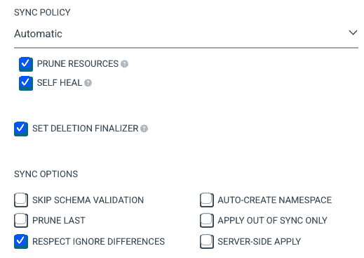

# 7

# IT 部门文化转型，迎接 GitOps 的到来

在信息技术快速发展的环境中，采用**GitOps**标志着一个重大的范式转变，它不仅带来技术变革，同时也在 IT 部门内部引发了一场深刻的**文化**变革。本章将深入探讨这一变化的多层面，重点阐述 GitOps 如何从根本上重新定义运维流程和方法论。

从本质上讲，GitOps 代表了软件开发与 IT 运维的融合，基于版本控制和协作的原则，这些原则是 Git 所固有的。它是一种将基础设施和应用部署视为代码的方法，能够实现高度的**自动化**和精确的 IT 运维。该方法确保了应用开发过程中所应用的严格标准同样被扩展到基础设施的管理，尤其是在 Kubernetes 环境中。

GitOps 最具变革性的一面是建立**不可变基础设施**。通过对比和同步循环，GitOps 自动化地将基础设施的实际状态与在 Git 仓库中定义的目标状态对齐。这种对齐减少了人工干预的需求，降低了人为错误的潜力，并提高了 IT 系统的整体可靠性和安全性。

本章的重要部分是理解 GitOps 对 IT 性能的影响。我们将通过**DevOps 研究与评估**（**DORA**）指标的视角来探讨这一点，DORA 指标是一组广泛认可的指标，用于衡量 DevOps 实践的有效性。通过将这些指标应用于 GitOps，组织可以定量评估在部署频率、变更交付时间、变更失败率和平均恢复时间等领域的改进。

然而，采用 GitOps 的过程不仅仅是实现像 Argo CD 这样的工具。它需要不断参与到 GitOps 趋势和实践的演变中。像任何新兴技术一样，GitOps 也面临着一系列挑战。这些挑战包括需要提升团队技能、调整现有工作流程，以及**持续优化**流程，以符合 GitOps 的最佳实践。

本章的最后部分讨论了实施 GitOps 对组织的更广泛影响。采纳 GitOps 不仅仅是一个技术升级，它是推动组织内部文化转型的催化剂。我们将分享来自不同公司多个项目的见解和经验，展示 GitOps 如何推动一个更加协作、透明和高效的 IT 文化。这些真实的案例提供了关于将 GitOps 融入组织结构中的挑战、策略和成功的宝贵经验。

这篇关于 GitOps 的全面探讨，从其技术基础到文化影响，旨在让你清晰地理解这一方法论的变革力量。这是一场超越技术采纳的旅程，描绘了通向更加敏捷、响应迅速和创新的 IT 文化之路。

我们将在本章讨论以下主要主题:

+   将基础设施视为应用程序

+   不可变基础设施的原则

+   DORA 指标简介

+   理解在 GitOps 中持续改进的必要性

+   克服文化障碍以采用 GitOps

# 将基础设施视为应用程序

在不断发展的 **DevOps** 景观中，将基础设施视为应用程序的概念 —— 通常称为 **infra-as-apps** —— 在 GitOps 的背景下尤为流行。为了理解这一点，我们需要快速了解 **基础设施即代码** (**IaC**)。IaC 将在 *第十章* 中详细讨论。这是一个关键组成部分，例如 Terraform 采用其声明式方法，使基础设施可以像应用程序一样处理。

## 理解 IaC

IaC 是一种现代方法，用于通过代码而非传统手动流程管理和配置 IT 基础设施。这种方法允许你自动化设置、管理和配置服务器、存储、网络和应用程序等计算资源。将基础设施视为软件，IaC 应用软件开发实践，如版本控制和测试，来管理基础设施。

IaC 的主要目标是增强基础设施部署和管理的效率、可靠性和一致性。通过使用代码定义基础设施，减少了人为错误，加快了部署速度。IaC 实现了更为一致和可重复的资源配置和部署过程，简化了基础设施随时间的扩展和管理。

重要提示

**命令式**：直接使用 kubectl 命令创建、更新或删除 Kubernetes 资源，适合开发和实验中的快速调整。

**声明式**：在 YAML 文件中定义所需状态并应用它们，让 Kubernetes 确保实际状态与声明状态一致。这在生产环境中非常理想，带来诸如版本控制和可重复性等好处。

IaC 通常采用**声明式**或**命令式**方法定义基础设施的期望状态。这种规范使得 IaC 工具可以自动进行必要的更改，从而实现更加敏捷、高效和可靠的 IT 环境，更好地支持现代业务需求。

### IaC 的重要性

云计算的兴起是推动 IaC 日益普及的重要因素。组织面临着在多个环境中（如公共云、私有云和混合云）管理和部署资源的挑战。IaC 自动化了这些资源的部署和管理，简化了复杂环境的管理。

此外，企业快速高效地交付应用程序和服务的需求，使得 IaC 变得越来越重要。在当今快速变化的数字世界中，组织必须迅速适应市场和客户的需求。IaC 简化了 IT 操作，实现了更快速、更灵活的扩展。

此外，IaC 支持**DevOps 原则**，弥合了软件开发和 IT 运维之间的差距。将基础设施视为代码使得组织能够将软件开发方法应用于基础设施，增强了开发和运维团队之间的协作与沟通。

### IaC 如何工作

IaC 的基本概念是将基础设施视为软件。这包括采用严格的软件开发实践，如版本控制、基础设施代码测试以及持续集成和部署。这种方法确保了基础设施的一致性，减少了停机时间和维护时间。

IaC 过程从编写脚本开始，这些脚本使用声明性语言描述基础设施的期望状态。这些脚本像任何软件一样存储在版本控制系统中，允许进行版本管理、审计和回滚。然后，IaC 工具将这些脚本应用于实际的基础设施，确保其与期望状态一致。这个可重复性确保了一致性，减少了人为错误。

## 在 Argo CD 的 GitOps 框架中理解基础设施即应用

在 Argo CD 的领域中，应用程序的概念超越了传统的定义 [*1*]。在这里，应用程序不仅仅包括软件，还涵盖了其期望的状态配置、目标部署环境以及管理这些资源如何同步和管理的策略。这种方法标志着与传统应用程序理解方式的显著转变。

通常，工程团队将应用程序视为在独立基础设施上运行的软件层。标准流程首先涉及手动或使用像**Terraform**或**Cloud Formation**模板这样的工具来设置基础设施。一旦这项基础工作完成，另一个团队会将他们的应用程序部署到已准备好的基础设施上。然而，Argo CD 提供了一种更为集成的视角。在这个以 GitOps 驱动的环境中，应用程序的部署会被持续监控。Argo CD 会不断地将应用程序的实时状态与其预定义的期望状态进行比较。这种持续的比较对于保持一致性和可靠性至关重要。实际状态与期望状态之间的偏差可能由两个主要原因造成。首先，实际状态可能会发生漂移，这指的是环境中未预见的变化或修改。其次，期望状态本身可能会更新，从而需要对部署进行更改。

每当这种偏差发生时，Argo CD 就会介入来调和这些差异。调和这一差异的行为是 GitOps 部署方式的核心，Argo CD 正是这种方式的践行者。这一方法与**OpenGitOps 标准**所设立的原则相符，确保了系统化和标准化的部署及基础设施管理方法。

这一范式的转变，把基础设施视为类似应用程序的存在，带来了更加无缝和集成的工作流。它强调了以与应用程序开发同等的细致和关怀来对待基础设施管理，突出了一种系统性的方法来进行系统部署和管理。

## 拥抱基础设施即应用——连接 GitOps 与基础设施管理

传统上，通过声明性配置创建和管理基础设施一直是一个挑战，尽管像**Terraform**、**Cloud Formation**模板、**Pulumi**、**Cloud Development Kit for Terraform**（**CDKTF**）等工具的流行使得这一过程变得更加便捷。这些工具通常通过**CI/CD 管道**一次性或通过触发更改来应用期望状态。然而，这种方法在 GitOps 的一个关键方面存在不足：持续的状态监控。

问题在于，虽然 CI/CD 管道在部署新计划或更新时效率很高，但它们并不会持续监控状态漂移。例如，如果执行了一个 Terraform 计划，而实际状态后来被外部改变，CI/CD 系统对此变化毫无察觉。这就是像 Argo CD 这样的 GitOps 操作员不可或缺的地方。Argo CD 的作用是不断监控基础设施的实际状态，并确保它与期望状态一致，从而防止漂移。

采用这种*不允许漂移的方法*已被证明对团队有益，不仅能够更高效地管理应用程序，还能提升他们快速恢复故障的能力。在这种模型中，回滚到之前的状态就像执行`git revert`一样简单。

团队在管理应用程序时所获得的好处，现在已经可以扩展到基础设施管理中，这得益于这一范式的转变。然而，我们的重点将放在 Crossplane 上。作为一个开源的 CNCF 项目，Crossplane 使用户能够通过 Kubernetes API 配置和管理各种云资源。当与像 Argo CD 这样的 GitOps 操作符结合时，Crossplane 允许部署表示各种云资源的应用程序，如 **Azure Key Vault**、**数据库**、**Kubernetes 集群**和负载均衡器，跨 **Azure**、**AWS** 及其他云平台进行管理。这一集成标志着基础设施管理的新时代，结合了 GitOps 的强大功能和现代云资源的多样性。

## 如何使用 IaC 部署基础设施

现在我们已经掌握了所有必要的背景信息，并希望对 GitOps 方法和使用 Terraform 将基础设施视为应用程序之间的差异有了充分的理解，让我们通过检查三个用例来实际阐明这一点。

在开始之前，我们简要介绍一下用于此设置的工具及其选择原因。从 Azure 开始：

+   **Azure Kubernetes Service (AKS)**：该服务提供一个托管的 Kubernetes 环境，简化了容器化应用程序的部署、管理和扩展，同时具备 Azure 基础设施的强大可靠性。

+   **容器注册表**：该服务提供一个安全、可扩展的私有 Docker 容器镜像注册表，提升了容器化应用程序的管理和部署能力。

+   **Azure 上的 PostgreSQL 服务器**：该服务提供可靠且可扩展的云数据库服务，确保高效管理和存储应用数据。

+   **Azure Key Vault**：这是一个用于安全存储和访问密钥、证书及机密信息的工具。它对于管理敏感信息和增强整体安全性至关重要。

对于 Kubernetes，我们有以下内容：

+   **Argo CD**：一个声明式的 GitOps 持续交付工具，用于 Kubernetes，支持自动化部署和管理应用程序。

+   **External-DNS**：该工具自动化管理 DNS 记录，简化了将 Kubernetes 服务与外部 DNS 名称连接的过程。

+   **Cert-Manager**：该工具管理 Kubernetes 的 SSL/TLS 证书，自动化证书的签发和更新过程。

+   **External-Secrets Operator**：该工具与 Azure Key Vault 等系统集成，安全地将机密信息注入 Kubernetes，提升对敏感数据的安全访问。

对于 IaC 部分的部署，我们有以下内容：

+   **Terraform 模块**：这些是 Terraform 中的组件，Terraform 是一个 IaC 工具，旨在实现模块化和可重用的基础设施定义。它们通过允许用户以代码方式定义所需的基础设施状态，从而促进声明式方法，Terraform 会执行这些定义，创建并管理实际的基础设施，确保它与指定的状态匹配。

+   **Crossplane**：这是一个与 Kubernetes 生态系统集成的 IaC 工具，允许通过 Kubernetes **自定义资源定义**（**CRDs**）管理外部资源，如云服务。它采用声明式模型，用户以 Kubernetes 本地方式定义基础设施需求，实现对 Kubernetes 内部资源和外部云基础设施的一致性和统一管理。

这些工具的结合形成了一个完整的生态系统。Azure 的服务提供了一个安全且可扩展的云平台，而 Kubernetes 工具如 Argo CD 和 Cert-Manager 确保了高效且安全的应用部署和管理。Azure Key Vault 与 Kubernetes 中的 External-Secrets Operator 的集成，展示了云基础设施与 Kubernetes 如何无缝协作，以提高安全性和运营效率。现在，让我们来看一下用例。

### 用例 1 – 通过 Terraform 部署所有内容

在第一个用例中，如*图 7.1*所示，所有内容都是通过 Terraform 部署的。这意味着最初，所需的云基础设施是通过 Terraform 部署的：


图 7.1 – 用例 1 – 通过 Terraform 部署所有内容

为了简化这个示例，我们移除了任何不必要的复杂性，比如 CI/CD 流水线。在生产环境中，你应该避免手动执行此操作，除非是用于初步启动或解决鸡与蛋的问题。一旦基础设施部署完成，后续的 Terraform 模块将用于在 Kubernetes 环境中部署更多的基础设施。

重要说明

值得注意的是，已有原生的方法可将 Terraform 与 GitOps 集成，例如 **Terraform 控制器**。该工具支持多种针对 Terraform 资源的 GitOps 模型，包括全自动、部分基础设施管理的混合自动化、状态强制和漂移检测，所有这些都在一个原生框架中进行。然而，本章更多聚焦于工具的原生使用。

这种方法是合理的，几年前甚至是标准做法。在这里，基础设施通过声明式模块方法作为一个应用进行处理和部署。

然而，这种方法也有一些缺点：

+   **缺乏持续监控**：这种方法无法持续监控基础设施状态的漂移，而这是 GitOps 中的关键组成部分。

+   **可扩展性的复杂性**：随着基础设施的增长，仅通过 Terraform 进行管理可能会变得越来越复杂，尤其是在状态管理、多阶段和模块依赖关系方面。

+   **有限的动态响应**：这种方法缺乏 GitOps 工作流所提供的动态响应能力，在 GitOps 工作流中，基础设施可以更无缝地进行实时调整。

+   **管理模块的开销**：在每个部署环节中都依赖 Terraform 模块可能会导致模块管理和版本控制的开销。

+   **配置漂移的潜在风险**：如果没有持续的协调，随着时间的推移，配置漂移的风险会更高，因为手动更新可能无法持续跟踪或记录。

### 用例 2 – 将 Terraform 和 Argo CD 集成用于部署流程

下一种方法，如*图 7.2*所示，结合了第一种方法，然后将任务委托给 Argo CD。这种方法在实践中非常常见，并且经常出现在不同客户的各种项目中。在这种方法中，首先使用 Terraform 模块进行 Azure 基础设施的部署。随后，Argo CD 被作为初始实例通过 Terraform 模块进行部署。然后，Argo CD 接管 GitOps 部分并部署与 Kubernetes 上下文相关的基础设施。在这种方法中，声明性方法最为合适。Terraform 模块以声明方式呈现，基础设施，如 **Cert-Manager**，也作为*应用程序*或*应用程序集*以声明性方式呈现，如前几章所述：


图 7.2 – 用例 2 – 将 Terraform 和 Argo CD 集成用于部署流程

尽管这种方法有其优势，但也有需要考虑的潜在缺点：

+   **集成的复杂性**：将 Terraform 与 Argo CD 结合使用可能会增加复杂性，要求对这两种工具都有扎实的理解。

+   **初期学习曲线**：对于那些对 Terraform 或 Argo CD 不熟悉的团队，由于这两种不同范式的结合，学习曲线可能较为陡峭。

+   **维护的开销**：这种组合方法可能需要更多的维护工作，因为它涉及管理两个系统而不是一个。

+   **配置错误的风险**：随着两种强大工具的并行使用，配置错误的风险增加，这可能导致部署问题或安全漏洞。

+   **更新协调**：在 Terraform 管理的基础设施和 Argo CD 管理的应用程序之间协调更新，需要仔细规划以避免冲突并确保顺利运行。

### 用例 3 – 在 Kubernetes 上的统一管理 – 使用 CR 和 Crossplane 进行全面编排

接下来的方法，如 *图 7.3* 所示，充分利用 Kubernetes API，同时聚焦于 **CRD** 和 **自定义资源**（**CR**），允许用户定义自己的资源类型，并实例化这些类型以进行自定义配置和功能扩展。该方法使用 Crossplane 来配置云基础设施，并部署 Kubernetes 基础设施所需的第三方工具，如 Cert-Manager。通过 CR 的声明性特性，它将基础设施视为应用程序，提供一个完全可追踪的解决方案，利用 Kubernetes 生态系统作为编排平台以保持资源同步。这个概念可以扩展，使几乎所有的云基础设施都通过 Argo CD 与 Crossplane 结合进行配置。所有内容都在集群内进行维护，只需了解 Kubernetes 清单——在这种情况下，是 CRD 和 CR：


图 7.3 – 用例 3 – 在 Kubernetes 上的统一管理 – 使用 CR 和 Crossplane 的全规模编排

为了更好地理解如何使用 Crossplane、CR 和 Argo CD 在 Azure 上创建资源，下面是一个使用 CR `VirtualNetwork` 类型的小示例。此操作的要求是安装 Kubernetes，并且安装和配置了 Azure 提供者 [*3*]。

一旦准备工作完成，并且网络提供者已安装，我们可以创建一个 `VirtualNetwork` 类型的已管理资源，举例来说，这可以用于 AKS。

首先，创建一个 CR，像这样：

```
apiVersion: network.azure.upbound.io/v1beta1
kind: VirtualNetwork
metadata:
  name: crossplane-quickstart-network
spec:
  forProvider:
    addressSpace:
      - 10.0.0.0/16
    location: "West Europe"
    resourceGroupName: docs
```

然后，将 CR 推送到由 Argo CD 管理的 Git 仓库中。现在，CD 部分应通过 GitOps 与 Argo CD 完成，您应该能够在门户中看到已创建的 Azure 网络资源。

然而，这种设置假设存在一个已管理的集群，其中部署和配置了必要的工具。它有以下潜在的弱点：

+   **Kubernetes 生态系统的复杂性**：它需要对 Kubernetes 有深入的理解，包括 CRD 和 CR，这对于不太熟悉这些概念的团队可能具有挑战性

+   **依赖于已管理的集群**：这种方法依赖于已管理的 Kubernetes 集群，因此在没有这种设置的环境中，其适用性受到限制

+   **资源密集型**：这种方法可能资源密集，要求集群内有更多的计算能力和内存

+   **配置和维护**：管理和维护 CRD 和 CR 的配置可能会繁琐且容易出错，特别是在大规模部署和版本升级时

正如你所看到的，没有一种“通用”方法能够满足所有需求。团队的正确方法在很大程度上取决于公司的具体需求、团队规模、团队在各个领域的技能等因素。然而，我们仍然应该花些时间重新思考为什么将 infra-as-apps 视为颠覆性创新。

## 为什么 infra-as-apps 是一个颠覆性创新？

总结一下，以下是 infra-as-apps 作为一个颠覆性创新的优势列表：

+   **安全性**：通过集中密钥管理并将直接的云访问转变为通过 Git 进行的变更管理，infra-as-apps 增强了安全性。这种方法减少了直接云访问带来的风险，并通过版本控制追踪变更，改进了审计日志。

+   **高效的资源管理**：该模型简化了新资源的配置和现有资源的升级。它允许更灵活和响应更快的基础设施管理，减少了资源分配和更新所需的时间和精力。

+   **改进的 CI/CD 拉取请求**：infra-as-apps 专注于提升 CI/CD 管道中的拉取请求，提供自动回滚和更彻底的测试。这使得部署过程更为稳健和可靠，确保生产环境中的更高质量和稳定性。

+   **更简便的多云资源配置**：借助 Crossplane 等工具，infra-as-apps 使得在多个云环境中配置资源变得更加简便。此功能简化了多云战略的实施，使得跨不同云平台管理和部署资源变得更加高效。

+   **简化的基础设施管理**：这种方法显著简化了管理基础设施的过程，使其更加高效，减少人为错误的发生。

+   **开发者的入门和资源配置简易性**：它简化了开发者入门和管理资源的过程，减少了设置和部署应用时所需的时间和复杂性。

+   **更快的平均恢复时间（MTTR）**：它提高了从故障中恢复的速度。

+   **稳固的可审计性**：它提供了全面的审计日志和清晰的责任追踪，使得跟踪变更和保持合规性变得更加容易。

许多公司，如 CERN、Splash、Grafana Labs、IBM 和 SAP，已经采用了 Crossplane 用于各种用例。CERN 在 GitOpsCon US 2021 上由 Ricardo Rocha 展示的《*A Multi-Cluster, Multi-Cloud Infrastructure with GitOps at CERN*》[*2*]是一个实践中应用 infra-as-apps 的典范。CERN 以运营大型强子对撞机而闻名，利用 infra-as-apps 管理广泛的基础设施，包括超过 600 个集群、3000 个节点、13000 个核心、30 TB 的内存和 160 TB 的原始存储，以处理来自实验的大量数据。他们使用 Kubernetes 管理大规模的集群和计算资源。CERN 的实施涉及使用带有 Crossplane 配置的 Helm 图表进行集群和资源管理，支持快速扩展和多云资源分配。

作为第二个例子，IBM 使用 Crossplane 和 GitOps 管理基础设施生命周期和应用程序部署的做法也值得注意。在*GitOpsify Everything: When Crossplane Meets Argo CD* [*4*]中，IBM 的 CI/CD 工程师 Ken Murray 和软件工程师 Ying Mo 探讨了 Crossplane 与 Argo CD 在不同 IT 环境中的集成。IBM 的方法是将 Crossplane 作为基础设施提供和集群管理的抽象层，使他们能够高效地维护 Kubernetes 集群池。该方法利用 Helm 模板来定义资源配置，并通过允许用户与简单的资源类型进行交互，从而简化了集群管理，而 Crossplane 则处理与云服务提供商的通信。

Infra-as-apps 与传统的**infra-as-code**不同，它在各个层面上完全拥抱 GitOps。这种方法将基础设施的手动更改视为偏离 Git 定义的期望状态，从而增强了基础设施管理的安全性和可预测性。它代表了基础设施管理方式的重大转变，使其与应用程序开发和部署的动态和自动化特性更加契合。

GitOps 发生了很大的变化，创建了不可变基础设施，同时也影响了公司的文化。在接下来的部分，我们将探讨不可变基础设施。

# 理解不可变基础设施的原理

**不可变基础设施的原理**结合 GitOps 方法，为现代软件开发环境中的基础设施和部署管理提供了一种变革性的方式。不可变基础设施指的是一种模型，其中服务器一旦部署，就永远不再直接修改。相反，更改需要通过用新实例替换服务器来实现。这种模型大大减少了由配置漂移引发的问题，并通过将服务器视为可快速替换的可丢弃单元，提高了系统的可靠性，从而在部署过程中提供了更大的可扩展性和效率。

将 GitOps 融入这一模型能够放大这些好处。GitOps 利用 Git 作为管理软件应用程序和基础设施的中央真实来源。它将云原生模式应用于部署，这种模式通常与 Kubernetes 相关，但也适用于各种平台。GitOps 的核心原则包括将基础设施视为代码，确保版本化和不可变的部署，自动拉取所需状态，并持续协调期望状态与实际状态之间的差异。

## 不可变基础设施的本质

不可变基础设施是一种概念，一旦服务器部署完成，便不再修改；如果需要更改，则会创建新的实例并替换旧的实例。这种方法与传统的可变基础设施截然不同，后者的服务器会不断更新和修改。不可变模型带来了几个关键优势。

不可变基础设施的优势如下：

+   **一致性和可靠性**：不可变服务器保持在已知的稳定状态，显著减少了由于环境漂移或不一致性引发的意外问题的风险。

+   **增强的安全性**：由于服务器在部署后不再修改，攻击面保持不变，简化了安全管理和异常检测。

+   **简化的管理和调试**：故障排除变得更加简单，因为基础设施保持在可预测的状态。

+   **可扩展性与性能**：可以高效地启动和关闭新的实例以满足需求，保持一致的性能水平。

然而，这种方法并非没有挑战：

+   **增加的存储和资源需求**：不可变基础设施可能需要更多的存储，因为每次更改都涉及创建一个新实例。

+   **潜在的部署开销**：每次更改都需要设置一个全新的实例，这可能比更新现有实例更耗费资源。

+   **配置管理的复杂性**：管理大量的服务器实例可能变得非常复杂，尤其是在大规模环境中。

## 将不可变基础设施与 GitOps 集成

将 GitOps 融入不可变基础设施利用了 Git 的核心原则——版本控制、协作和自动化——来进行运营管理，使得基础设施被视为代码，所有配置和状态都被精心维护在 Git 仓库中，从而增强了一致性和可追溯性。

GitOps 的优势如下：

+   **唯一真实来源**：为应用程序和基础设施代码提供单一的代码库，确保一致性和可追溯性。

+   **自动化、可靠的部署**：通过 GitOps 操作员进行持续部署，自动化并简化了部署过程。

+   **增强的协作与透明度**：拉取请求工作流增强了协作，提供清晰的审计跟踪，确保变更的可追责性。

+   **增强的安全性和合规性**：Git 固有的特性有助于强大的访问控制、加密和合规性遵循。

尽管有这些优势，GitOps 也有其缺点：

+   **扩展性复杂性**：管理多个仓库并处理大规模部署的复杂性可能具有挑战性。

+   **Git 在操作任务中的局限性**：Git 主要设计用于代码版本控制，可能并不适合用于操作性更新，可能导致潜在冲突。

+   **学习曲线和采纳阻力**：团队可能面临陡峭的学习曲线，或者对采用新工作流、工具和思维方式的抵触情绪。我将在后面讨论这一部分。

### 协同效应与挑战

当不可变基础设施与 GitOps 结合时，它们创造了强大的协同效应：

+   **将基础设施视为动态的、版本控制的实体**：基础设施被视为类似于应用程序代码的对象，所有变更都通过 GitOps 方法进行追踪、审查和部署。

+   **快速恢复和回滚能力**：这种组合能够快速从故障中恢复，并轻松回滚到之前的稳定状态。

+   **简化的操作**：这种方法减少了手动干预的需求，最小化了人为错误并简化了操作流程。

然而，这种集成也带来了独特的挑战：

+   **复杂的工作流管理**：平衡基础设施的不可变性与 GitOps 工作流的动态特性需要仔细的规划和执行。

+   **依赖于工具和流程**：这一方法的有效性在很大程度上依赖于正确的工具和明确定义的流程。

+   **平衡安全性和敏捷性**：在快速变化的环境中确保安全性需要在严格控制与操作灵活性之间找到微妙的平衡。

### 使用不可变基础设施实现有效的生产环境

最佳的生产环境不可变基础设施可以通过整合若干关键实践来构建，这些实践通过经验不断优化。以下是有效的生产环境可能呈现的样子及其原因：

+   **Kubernetes 生产集群的只读访问**：在生产环境中，Kubernetes 集群应从开发人员的角度看待为一个受管服务或*黑箱*。这意味着对集群的访问应主要为只读，开发人员不应被允许手动更改集群，从而确保环境的可控性和稳定性。

+   **仅通过 GitOps 创建和删除资源**：这一原则规定，所有进入集群的资源应仅通过 GitOps 进行管理。这包括整个创建过程，涵盖命名空间、部署、服务、入口、服务帐户等元素。此方法确保所有变更**可追溯**、**可逆**，并与 Git 仓库中的真相源保持**一致**。

+   **不要创建命名空间覆盖应用程序**：在 Argo CD 及其应用程序概念的背景下，一个应用程序不应该能够创建命名空间。这是因为 Argo CD 不支持删除由应用程序创建的命名空间*[5]*。此限制是为了防止命名空间的 uncontrolled 创建，避免在共享环境中引发冲突和管理问题。接下来的示例将通过具体实例来阐明在使用 Argo CD 的共享环境中管理命名空间的实际影响和潜在风险。

    假设五个团队共享一个 Kubernetes 命名空间。每个团队创建自己的 Argo CD 应用程序来部署其服务组件，贡献于整体微服务架构。假设 A 团队决定停用其服务。它们会删除自己的应用程序和相关的已部署服务，并尝试通过应用程序删除共享的命名空间。然而，Argo CD 应用程序本身并不了解或连接到同一命名空间内的其他应用程序或未链接的资源。因此，如果允许这种删除操作，它将无意中导致命名空间及其中其他团队部署的所有服务被删除。幸运的是，这种情况在实践中是不可行的，因为 Argo 项目团队并未实现此类功能，以避免这些破坏性和意外的后果。

+   **使用合适的工具，如 PR-Generator**：将 PR-Generator 等工具集成到与 Argo CD 的 GitOps 工作流中，可以极大地提升测试和部署过程。PR-Generator 可以在 PR 启动时立即创建带有特定前缀的资源，确保资源正确创建并被清理，同时遵守*不要创建命名空间覆盖* *应用程序*原则。

遵循这些实践可以实现以下几个好处：

+   每次更改都通过 Git 进行，确保了集中化和版本控制的变更管理过程。

+   所有更改都记录在 Git 历史中，提供了透明且可追溯的所有修改记录。

+   资源得到清晰的管理，集群中不会留下任何残余的“孤立”资源。

+   使用 PR 和 Git 进行干净高效的工作流管理，借助如 PR-Generator 等工具。

+   它在组织内建立了标准和承诺，使这些实践可以在不同项目之间复制。

在生产环境中实施这些原则，创建了一个强大、安全、可管理的基础设施，充分利用了不可变基础设施和 GitOps 方法的优点。

一个同时使用**Kustomize**和 Argo CD 的应用程序的潜在文件夹结构可能如下所示：

```
.
├── base
│   ├── kustomization.yaml
│   ├── namespace.yaml
│   ├── role.yaml
│   ├── rolebinding.yaml
│   ├── service.yaml
│   ├── serviceaccount.yaml
│   ├── statefulset.yaml
│   ├── templates
│   │   └── statefulset_template.yaml
│   └── values.yaml
└── overlays
    ├── production
    │   ├── kustomization.yaml
    │   ├── namespace.yaml
    │   └── statefulset.yaml
    └── staging
        ├── kustomization.yaml
        ├── namespace.yaml
        └── statefulset.yaml
```

这种结构确保所有资源都可以通过 Argo CD 和 GitOps 方法进行部署和清理，从而消除了在应用同步选项中设置 `自动创建命名空间` 选项以创建命名空间的需求。

### 不可变基础设施的应用配置

接下来，我们将检查一个可能有助于不可变基础设施设置的应用配置：



图 7.4 – 应用同步策略配置示例

如果您希望获得最具不可变性的基础设施设置，请设置以下标志：

+   **修剪资源**：启用此选项，允许 Argo CD 自动删除集群中存在但在 Git 仓库中不再定义的资源。这样可以确保集群中的所有资源都通过 GitOps 方法进行管理。

+   **自我修复**：启用此选项。它确保直接在集群中进行的任何偏离 Git 仓库的更改都会被 Argo CD 自动修正，从而保持 Git 中定义的期望状态。

+   **设置删除最终器**：启用此选项，以确保资源仅在从 Git 仓库中移除后才会从集群中删除。这可以防止过早删除，并确保只有在资源从 Git 中移除后才进行清理。

+   **忽略差异**：启用此选项以指示 Argo CD 忽略其无法识别的特定差异。您可以在 Argo CD 配置中定义要忽略的具体差异。

+   **自动创建命名空间**：确保禁用此选项，以防止 Argo CD 自动创建命名空间。命名空间应在您的 Git 仓库中作为资源显式定义。

通过设置这些策略，您可以确保资源的创建、删除和同步都通过 Git 仓库中的更改进行管理，同时遵循 GitOps 原则。这种方法确保了 Git 中声明的状态与集群中的实际状态之间的紧密耦合。

不可变基础设施与 GitOps 的结合代表了 IT 运维和开发的现代方法。它将稳定性、安全性和动态自动化工作流的最佳特性结合在一起。虽然在可靠性、安全性和效率方面提供了显著的优势，但也在复杂性、资源需求以及对特定工具和实践的依赖方面带来了挑战。与任何 IT 方法论一样，成功实施这些概念依赖于对其优缺点的清晰理解、精心的规划以及应对不断变化的 IT 环境的适应性。

到目前为止，我们已经探讨了与 GitOps 相关的各种转型方面。但是，如果无法从中获得或衡量任何附加值，那这一切又有什么意义呢？因此，在下一节中，我们将探讨使产品质量可衡量的具体指标。

# 引入 DORA 指标

在本节中，我们将向您介绍 DORA 指标，并深入探讨 DORA 团队开发的一组关键绩效指标。这些指标对于评估和提升 IT 团队的软件交付和运营绩效至关重要。四个主要的 DORA 指标是**部署频率**、**变更领先时间**、**变更失败率**和**MTTR**：

+   **部署频率**：这是评估团队成功将代码部署到生产环境的频率。频繁的部署表明开发过程高效且响应迅速，能够更快地获得反馈并实现**持续改进**。为了提高部署频率，可以采用 CI/CD 实践。使用如**Jenkins**、**GitHub Actions**或**GitLab CI**等工具自动化构建和部署流水线。定期的小规模部署可以降低风险并加速反馈。此外，特性标志可以用于管理部署并逐步推出新特性。

+   **变更领先时间**：这是指从代码提交到生产环境部署的时间长度。这个指标反映了开发过程的速度和敏捷性。较短的领先时间通常意味着能更快速地获得用户反馈，并且能够迅速适应和改进软件。通过优化开发过程可以缩短领先时间。这包括采用敏捷方法论、增强团队之间的协作，并将代码审查和测试整合到开发流程中。利用自动化测试和**持续集成**工具，确保代码更改能够快速进行测试和集成。可以使用跟踪工具来监控从代码提交到部署的时间，帮助识别瓶颈。

+   **变更失败率**：这个指标关注导致生产环境失败的部署比例。该指标对于理解软件开发过程的可靠性和稳定性至关重要。较低的变更失败率意味着软件部署的质量和可靠性较高。为了降低变更失败率，可以专注于提升**代码质量**和部署的可靠性。实施自动化测试，包括单元测试、集成测试和端到端测试，及早发现问题。使用静态代码分析工具并进行全面的代码审查。实践持续部署并进行自动回滚，采用**金丝雀发布**或**蓝绿部署**等方式以最小化失败部署的影响。

+   **MTTR**：这是从生产环境故障中恢复所需的平均时间。这个指标非常关键，因为它反映了团队快速修复问题的能力，从而最小化停机时间并保持服务质量。减少 MTTR 需要改善事件响应和恢复流程。实施监控和警报工具，如 Prometheus、Grafana 或 New Relic，以便快速检测问题。建立清晰的事件管理协议和值班轮换。使用基础设施即代码（IaC）工具如 Terraform，实现快速且一致的环境恢复。定期进行事件响应演练，确保团队能够快速恢复。

这些指标与 GitOps 方法非常契合，该方法强调自动化、监控和快速反馈。GitOps 通过自动化管道可以提高部署频率和变更交付时间。它还通过启用更快速的回滚和通过持续集成与交付等实践促进更可靠的部署，从而有助于减少变更失败率和平均恢复时间（MTTR）。

然而，尽管 DORA 指标提供了宝贵的见解，但它们也带来了一些挑战。实施这些指标需要一个成熟的 DevOps 团队和完善的 CI/CD 流程。数据收集和标记需要精确且具有可操作性。指标必须根据不同团队和产品的独特节奏和流程进行调整。

在独立于特定的 Git **源版本控制**（**SVCs**）如 DevOps、GitHub 或 GitLab 测量这些指标时，组织可以通过集成提供必要数据可视化和仪表盘的各种工具来进行。团队可以利用不同工具的 API 收集相关数据点，以计算这些指标。例如，可以使用跟踪代码部署的工具来监控部署频率，而变更交付时间则可以通过从版本控制系统中提取代码提交和部署的时间戳来计算。

组织可以选择通过开发适合其环境的逻辑来实施 DORA 指标，或者使用像 **GitLab 的价值流分析仪表盘** 等成熟工具。GitLab 的仪表盘 [*6*] 能有效可视化软件开发生命周期并计算 DORA 指标。它提供了一个互动界面，用于追踪软件交付过程中的关键阶段，并使团队能够自定义仪表盘，以适应其特定的工作流程，从而提高对交付时间、周期时间和其他重要指标的理解。这个功能有助于识别瓶颈和需要改进的领域，从而提高部署频率和整体 DevOps 性能。

同样，**SquaredUp** 专注于 Azure DevOps 集成 [*7*] 并提供专为 DevOps 团队设计的 DORA 指标仪表盘。该仪表盘提供了关键性能指标的全面视图，包括部署频率、变更的交付时间、变更失败率和 MTTR。它帮助团队监控和分析他们的软件交付过程，便于识别需要改进的领域。SquaredUp 的解决方案强调了数据驱动的决策在软件开发中的重要性，展示了指标在优化 DevOps 工作流中的关键作用。

成功利用 DORA 指标的关键在于理解这些测量的背景，将它们作为一个整体而非单独分析，并根据不同团队和项目的独特需求进行调整。

总结来说，DORA 指标提供了一种结构化和可量化的评估与改进 DevOps 性能的方法。它们为软件交付过程提供了全面的视角，突出需要改进的领域，并促进了**持续开发**和运营效率的文化。

# 理解 GitOps 中持续改进的必要性

在快速发展的软件开发领域，GitOps 的采用标志着协作方法和运营效率的显著转变。GitOps 是一种将 Git 与 Kubernetes 操作流程相结合的方法论，它不仅仅是一套实践，它代表了一个持续改进和适应的过程。本节探讨了 GitOps 如何促使和促进在安全性、开发、平台工程和财务运营等多个领域的**持续改进**：

+   **与 GitOps 一起演变的安全实践**：GitOps 领域的安全性是动态的，且在**持续演变**。团队使用诸如 **Kyverno** 等工具部署策略，以适应快速变化的安全威胁环境。新漏洞和攻击途径的出现要求采取主动和适应性的策略。GitOps 通过支持快速迭代和部署**安全策略**来应对这一需求。然而，管理机密的方式发生了变化——从使用 Sealed Secrets 等工具，到采用 External-Secrets Operators。这一转变强调了团队需要不断发展其工具和实践，在一个停滞就意味着脆弱的领域中保持领先。

+   **开发者通过 GitOps 的持续创新**：对于开发者而言，GitOps 不仅仅是一种部署方法，更是**持续创新**的催化剂。像**蓝绿部署**和**金丝雀部署**等技术变得更加流畅，同时像 PR-Generators 这样的新工具提升了部署流程。这些创新在一个部署策略和工具不断变化的环境中至关重要。GitOps 赋能开发者快速部署、实验和迭代，从而促进了持续改进的文化，并能够灵活应对市场和技术的变化。

+   **平台工程和可扩展基础设施**：平台工程团队认为 GitOps 是管理基础设施的高效和可扩展的得力助手。像 Argo CD 中的*App of Apps*和*ApplicationSets with Cluster Generator*等模式展示了基础设施管理的发展趋势。像 Crossplane 和 Cluster API 这样的工具，扩展了 GitOps 的能力，从仅仅应用部署，拓展到管理和配置多样化的云资源。这一发展凸显了团队必须不断适应并提升技能和工具，以有效管理日益复杂和分布式的系统。

+   **FinOps – GitOps 时代的财务优化**：在 FinOps 领域，GitOps 引入了如**OpenCost**等工具，使得能够在命名空间级别进行详细的成本跟踪和分配。如此细化的成本分配以及根据使用模式调整资源可用性的能力，标志着云成本管理方式的重大转变。这也表明，财务运营团队需要不断整合新工具和策略，以持续优化成本。像**Kubegreen**这样的工具，通过根据需求调整资源，证明了云环境中财务运营的不断发展。

GitOps 的旅程是持续且多面的。来自不同领域的团队——从安全、开发到平台工程，再到 FinOps——不仅要采纳 GitOps，还要拥抱其持续改进的理念。这包括定期评估、愿意采纳新工具和实践，以及对学习和适应的承诺。

在本章的最后部分，我们将探讨如何克服**文化障碍**，采纳 GitOps，并了解不同团队如何采用不同的方式进行工作。

# 克服文化障碍以采纳 GitOps

采用 GitOps 不仅仅是工具实施；它还意味着组织内部的文化转变。这一转变涉及到打破传统的部门壁垒，培养协作，并将团队统一到共同目标上。GitOps 作为一个统一的力量，简化了操作和开发，朝着更高效的 IT 环境迈进。在软件开发的动态世界中，GitOps 的持续改进至关重要。这段旅程注重学习、适应和不断发展实践。

在检视不同定义或将 GitOps 与 DevOps 对比时，技术方面可以通过 Weaveworks 博客上关于 GitOps 文化的内容进行总结，博客详细阐述了 GitOps 如何不仅仅是工具或实践的集合，而是代表着组织内部更广泛的文化转变。这一方法将 Git 集成到运营和开发过程的核心，强调透明性、问责制和协作。GitOps 文化的特点是将 Git 集中用于管理基础设施、应用程序和 CI/CD 流程，从而增强自动化、稳定性和一致性。它培养了一个团队成员不断改进的环境，这一切得益于 Git 基础的工作流所提供的可见性和控制力。

关于 GitOps 方法及其相关的技术挑战、责任、协作等内容可能是正确的。我并不是说它错了，因为它并没有错。然而，我想将焦点转移到一个视角，考虑到不同行业的日常工作。并不是每个公司都像 Weaveworks 那样是软件公司。

## 一个项目的故事——交流、经验与学习

根据我与**DevOps 专业人员**、**CTO**和**平台工程师**的经验和讨论，显然工具和方法的变化比改变团队或公司心态更为直接，因为后者需要时间进行转变。

一些公司是这样处理的：

+   在我们使用 Argo CD 进行 GitOps 管理基础设施和应用服务的过程中，我们注意到显著的改进。例如，我们可以轻松识别我们在预生产和生产环境中的偏差，这些环境会被密切监控。对于开发和临时环境，我们使用 Helm 和 CD 流水线，不跟踪变更。

+   Weaveworks 在 GitOps 文化中的强调表明，GitOps，特别是通过 Weave GitOps，促进了一个强大的团队文化，特点是**优秀的沟通**、**协调**和**合作**。GitOps 提供的**角色**和**职责**的清晰度使团队能够**保持自治**，同时借助 Kubernetes 命名空间来组织和隔离工作负载。此外，Weave 收购 Magalix 进一步强调了 GitOps 中的安全策略，使管理员能够在整个 GitOps 过程中设定并执行策略。这种方法突显了 GitOps 文化的运营性质，有别于 DevOps 的理想文化，专注于精准和责任。

我相信当你超越技术层面并仔细阅读时，Weaveworks 确实抓住了问题的关键。对话暗示，GitOps 方法促进了不同团队之间的文化变革，这些团队应掌握相同的工具，但使用场景各不相同。各团队可以独立工作，但这需要出色的沟通、协调和合作。此外，还需要定义角色和职责。每一次变更或倡议都应清晰且透明地传达给其他团队。这一切听起来都很棒，但在涉及不同团队的实际项目中，情况如何呢？我将尝试通过一个我项目中的例子来说明。

在该项目中，存在一个平台团队、若干开发团队和一个安全团队。安全团队的职责不仅是确保组织内遵守安全指南，还包括 IT 治理和合规性。因此，它感到有责任通过一切可行的手段保护公司，并在 GitOps 过程中执行政策。

平台团队为开发人员提供了必要的 Kubernetes 集群和上下文环境，因此他们只需要专注于自己的应用程序，最多关注第三方工具。他们将自己的角色视为开发者的支持者，开发者作为客户购买并使用平台，平台的核心价值最大程度地强调**自助服务**、**可用性**和**性能**。开发团队将 Kubernetes 视为产品并进行应用程序开发。让我们看看一个团队的合理决策如何无意中对另一个团队造成伤害：

+   安全团队执行了一项策略，禁止任何应用程序以提升的权限运行，结果，一些平台上下文中的应用程序以及自研应用停止工作。这导致了应用程序的停机和软件故障。

    采取这一行动的*理由*是确保公司受到保护。

+   平台团队进行了从 Kubernetes 1.24 到 1.25 的升级，因为前一版本已结束支持。结果，安全团队使用的第三方工具不再工作，一些开发者的应用程序也停止了运行。此次变更未考虑到升级过程中将*PodSecurityPolicies*替换为*PodSecurityStandards*。

    该行动的*理由*是确保提供支持的版本，并确保平台按照安全团队的要求保持最新。这项责任包括确保性能得到优化和可靠，同时遵守与 Kubernetes 生态系统相关的最新安全协议和合规标准。

+   开发者使用他们的自主权，在具有外部 IP 地址的节点上打开一个*NodePort*进行测试。应用程序变得可以外部访问。调试功能正常，但测试所需时间更长。幸运的是，应用程序使用**Log4j**版本 2.10 进行日志记录，简化了调试过程。

    该行动的*理由*是提高测试和调试的性能。开发者面临着完成任务的压力，选择了一种快速解决方案来测试他们的应用程序，将即时功能优先于长期的安全性和合规性考虑。

不同措施所导致的可能后果包括：客户感到沮丧，公司每分钟都在亏损，公司的声誉下降。这些是修改后的使用案例，幸运的是，我的项目没有受到 Log4J 事件的影响。但这里的重点不是发生了什么，而是这些情况的出现是可以理解的，从团队的角度来看是有道理的。

反思最近挑战的原因，似乎不同团队提供的各种解释都是合理的。例如，当检查安全团队和平台团队所做的变更时，他们从自己的角度承担了责任，确保公司得到了充分的保护和代表。然而，他们并未认为自己对应用程序的停机或客户的损失负有责任，认为他们的行动是正当的。如果团队之间能够提前进行简单的沟通和透明化，关于即将发生的变更，这种情况本可以避免。

从开发者的角度来看，他们面临着完成任务的压力，以防止已有进度延误的功能进一步拖延，这已经导致客户感到沮丧。调试仅在开发环境中启用，并且他们认为没有必要通知安全团队或平台团队，认为这些团队无法理解变更，并且没有理由阻碍变更。开发者认为他们是在为公司的最大利益行事，旨在满足客户需求。

从开发者的角度来看，他们感受到强烈的责任感，需要按时完成任务。然而，他们忽视了与安全团队或平台团队之间简单沟通和透明度的重要性，认为这些团队可能无法理解变更，并可能不必要地阻碍这一变更。在追求为公司争取最大利益和满足客户需求的过程中，他们错失了与这些团队合作的机会，这本可以使他们的工作与更广泛的组织目标相协调。

### 这些经验

从这些事件中汲取的教训促成了一个公会的成立，各团队的代表定期参加会议。这使得变更及其影响能够被讨论和公开，促进了团队间的清晰沟通和合作。此外，它帮助不同团队理解彼此的观点、需求和原因，从而提高了透明度。虽然并非所有决策都经过讨论，而且有时由于时间限制或紧迫性（例如关键的安全漏洞问题），决策是迅速做出的，但总体情况已有所改善。提高的透明度有助于更好地理解变更的影响，减少了这些变更的爆炸半径。团队成员间的同理心增加了，指责文化大大减少了。

整体情况有所改善吗？*是的*！

所有决策都是在讨论后作出的吗？*不是*，因为时间压力和紧迫性通常会导致决策迅速做出。

## 来自另一个近期项目的关键问答

本节将聚焦于某个公司和多个项目中的具体问题和答案，这些项目仍在转型过程中，从 DevOps 方法开始，现已转向平台工程，同时也会分享他们进行这种转型的真实原因：

+   Q1：GitOps 是如何重构你们的团队组织结构的？

    A1：最初，我们每个项目都有单独的 DevOps 团队。GitOps 促成了一个中央平台团队的创建，以高效管理 Kubernetes 集群。

+   Q2：转型到 GitOps 时遇到了哪些挑战？

    A2：我们的主要挑战是适应 GitOps 提供的**不可变基础设施**，特别是理解所有的变更都需要通过 Git 提交来流转。

+   Q3：你们从 GitOps 中获得了哪些好处？

    A3：GitOps 为我们带来了一个清晰且可追溯的工作流程。每一个变更，无论大小，现在都通过 Git 进行精确跟踪。

+   Q4：GitOps 如何影响了团队沟通？

    A4：沟通有了显著改善。我们的平台团队对开发者的需求有了**更深入的理解**，这促进了**更有同理心的合作**。

+   Q5：你能分享一些成功的文化转型案例吗？

    A5：绝对如此。我们发展了**主动错误文化**，专注于自动化和**持续学习**，这从根本上改变了我们的解决问题的方法。

+   Q6：GitOps 如何改变了你们团队的日常工作？

    A6：团队成员的**动力**和**责任感**显著提升，他们在自己的角色中有了更大的**自主性**。

+   Q7：你的团队是如何适应 GitOps 的？

    A7：出乎意料的是，团队的抵触情绪很小。团队理解这次转型的必要性，并且对此非常接受。

+   Q8：你们如何衡量这次转型的成功？

    A8：虽然我们还没有精确的衡量指标，但**手动干预**的减少和**Git 活动**的增加是成功的重要指标。

+   Q9: 你的团队规模是多少？

    A9: 我们的团队由大约 20 名开发人员和三名平台工程师组成。

这种对话格式使得人们能够清晰理解 GitOps 如何改变团队动态、面临的挑战以及工作流效率。

采用 GitOps 不仅仅是实施一套工具；它涉及组织内的文化变革。克服传统部门之间的壁垒，培养协作和持续学习的文化，并将不同的团队对齐到共同的运维目标上，是这条旅程中的重要步骤。因此，GitOps 的采用成为了一个统一的力量，将各类运维和开发工作对齐，推动形成一个更高效、透明和响应迅速的 IT 环境。

总结来说，GitOps 的持续改进不仅仅是一个建议；它是快速变化、节奏快速的软件开发和 IT 运维世界中的必需品。在团队进行这项旅程时，重点应始终放在学习、适应和发展实践上，以保持在变化是唯一常态的环境中的领先地位。因此，GitOps 更像是一条通向卓越运维和持续改进的道路，而非一个最终目标。

# 总结

本章提供了 GitOps 推动的 IT 文化革命的有力视角。它首先确立了 GitOps 不仅仅是技术上的转变，而是 IT 部门内部深刻的文化变革。这种方法通过 Git 将软件开发与 IT 运维结合，改变了运维流程和方法论，将基础设施视为应用程序。它实现了自动化和精准，并将严格的软件开发实践延伸到基础设施管理中。

GitOps 带来的一个关键变化是建立了不可变的基础设施，自动化地将基础设施的实际状态与期望状态对齐，减少了人工干预和错误。本章还通过 DORA 指标探讨了 GitOps 对 IT 性能的影响，提供了部署频率、变更前置时间、失败率和恢复时间的定量评估。本章还讨论了 GitOps 采用对整个组织的影响。这不仅仅是工具的实现；它是推动深远文化转变的催化剂，促进了一个协作、透明和高效的 IT 文化。来自不同组织的实际案例展示了 GitOps 如何推动这些变化。

总的来说，本章揭示了 GitOps 的变革力量，它超越了技术层面，为走向更敏捷、更具创新力的 IT 文化指引了方向。

在下一章中，我们将探讨 GitOps 与 OpenShift 的结合应用，OpenShift 是来自 Red Hat 的 Kubernetes 下游发行版，并分析它的管理方式有何不同。

# 参考文献

+   [*1*] [`codefresh.io/blog/infrastructure-as-apps-the-gitops-future-of-infra-as-code/`](https://codefresh.io/blog/infrastructure-as-apps-the-gitops-future-of-infra-as-code/)

+   [*2*] [`www.youtube.com/watch?v=h6xDWc6fXao`](https://www.youtube.com/watch?v=h6xDWc6fXao)

+   [*3*] [`docs.crossplane.io/latest/getting-started/provider-azure/`](https://docs.crossplane.io/latest/getting-started/provider-azure/)

+   [*4*] [`www.youtube.com/watch?v=9odjdVqJkws`](https://www.youtube.com/watch?v=9odjdVqJkws)

+   [*5*] [`github.com/argoproj/argo-cd/issues/7875`](https://github.com/argoproj/argo-cd/issues/7875)

+   [*6*] [`docs.gitlab.com/ee/user/analytics/value_streams_dashboard.html`](https://docs.gitlab.com/ee/user/analytics/value_streams_dashboard.html)

+   [*7*] [`squaredup.com/dashboard-gallery/dora-metrics-dashboard-devops-team/`](https://squaredup.com/dashboard-gallery/dora-metrics-dashboard-devops-team/)

# 第三部分：动手实践 GitOps 自动化基础设施和 CI/CD

在这一部分，你将亲身体验使用 GitOps 自动化基础设施和 CI/CD 流程。你将探索在 OpenShift、Azure 和 AWS 等平台上的具体实施，并集成 Terraform 和 Flux CD 等工具以增强自动化。本实操部分旨在为你提供在不同环境中应用 GitOps 所需的技能，确保你能够高效且有效地管理基础设施和 CI/CD 流水线。

本部分包括以下章节：

+   *第八章*，OpenShift 上的 GitOps

+   *第九章*，GitOps 在 Azure 和 AWS 部署中的应用

+   *第十章*，GitOps 在基础设施自动化中的应用——Terraform 和 Flux CD

+   *第十一章*，在 Kubernetes 上使用 GitOps 部署实际项目
