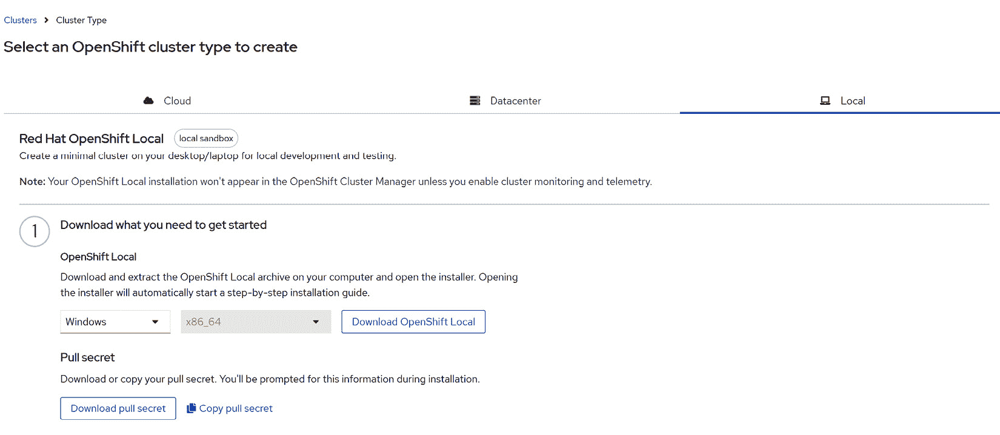
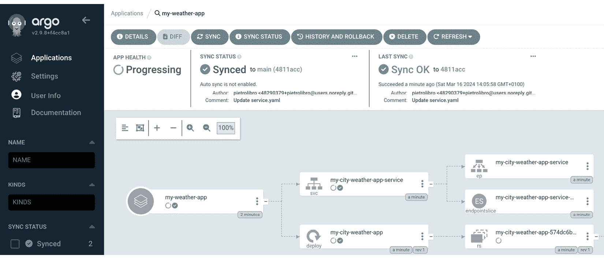

# 8

# 使用 OpenShift 进行 GitOps

本章将深入探讨**GitOps**在**Red Hat OpenShift**中的应用，这是一种彻底改变我们部署、管理和运营容器化应用程序的方式。

在本章中，我们将探索 GitOps 的基本原则，重点介绍它们如何与 Red Hat OpenShift 的强大功能无缝集成。这种结合不仅提升了部署的效率和可靠性，还与现代 DevOps 实践保持一致，促进了开发与运维团队之间的协作。

我们将从使用**CodeReady Containers**（**CRC**）设置本地 OpenShift 环境开始，通过实践的方法来理解 OpenShift 如何运作以及如何使用 GitOps 原则进行管理。接下来，我们将深入实际示例和最佳实践，包括配置自动化部署、管理应用程序配置，并确保 OpenShift 集群中的高可用性和安全性。

无论你是 OpenShift 的新手，还是希望增强现有工作流，本章对 GitOps 的探索将为优化你的云原生开发过程提供有价值的见解和技巧。

在本章中，我们将重点关注以下几个关键领域：

+   Red Hat OpenShift 简介

+   在 Red Hat OpenShift 中设置 GitOps

+   利用 Red Hat OpenShift 的 CI/CD 实现 GitOps

+   自动化和配置最佳实践

+   Kubernetes 与 Red Hat OpenShift 的比较

# 技术要求

对于本章，确保你有 Red Hat OpenShift 集群的访问权限，或者通过 Red Hat OpenShift Local 进行本地设置。熟悉 GitOps 实践和工具，如 Argo CD，以及基本的开发工具如 Git 和代码编辑器，是必要的。对于容器技术、Kubernetes 架构和 YAML 语法的基础理解将有助于跟随实践练习。确保有稳定的互联网连接以便下载工具和访问集群。如果在本地运行 OpenShift，您的机器最好至少有 16GB 的 RAM 和足够的存储空间。

本章相关的代码和资源文件可以在我们的专用 GitHub 仓库中的`Chapter08`文件夹找到：[`github.com/PacktPublishing/Implementing-GitOps-with-Kubernetes`](https://github.com/PacktPublishing/Implementing-GitOps-with-Kubernetes)。

# Red Hat OpenShift 简介

OpenShift（[`www.redhat.com/en/technologies/cloud-computing/openshift`](https://www.redhat.com/en/technologies/cloud-computing/openshift)），由 Red Hat 开发，是一个领先的企业级 Kubernetes 平台，提供了一整套功能，旨在简化容器化应用的部署、扩展和操作。它通过简化许多与部署和管理容器化基础设施相关的复杂任务，扩展了 Kubernetes，使其成为希望实施现代 DevOps 和 GitOps 实践的企业的理想选择。

OpenShift 的核心优势之一是它对**开发者生产力**和**操作效率**的关注。它提供了一整套丰富的开发者工具和一个用户友好的控制台，使开发者可以更轻松地构建、部署和管理他们的应用。OpenShift 的**集成开发环境**（**IDE**）和内建的 CI/CD 功能使开发者能够自动化软件交付过程的许多环节，从代码构建到测试、部署和监控。

**安全性**是 OpenShift 的另一个亮点。它在应用栈的每个层级都集成了内建的安全特性，从**操作系统**（**OS**）到网络，再到应用服务。这种集成方法确保了安全性不是事后的补充，而是深深融入应用生命周期的每一个环节。诸如**增强型安全 Linux**（**SELinux**）强制隔离、自动化漏洞扫描和默认安全配置等功能有助于保护应用和数据免受外部威胁和内部配置错误的影响。

SELinux

SELinux 是一项内核集成的安全功能，强制执行**强制访问控制**（**MAC**）策略，以增强系统安全性。它遵循最小权限原则，将系统进程和用户的权限限制在完成其功能所需的最低权限内。SELinux 有助于防止未经授权的访问，并可以在强制模式下运行，阻止并记录未经授权的操作，或者在宽松模式下运行，只记录违规操作而不加以阻止。这为基于 Linux 的系统，包括 OpenShift，增加了一个重要的安全层，通过比传统访问控制更精细的方式来控制访问。

此外，OpenShift 旨在支持各种工作负载，从传统的单体应用到微服务和无服务器功能。它的灵活架构支持多种编程语言、框架和数据库，允许团队使用最适合其需求的工具和技术。此外，OpenShift 的容器原生存储和网络解决方案提供了高需求应用所需的可扩展性和性能。

在 GitOps 的背景下，OpenShift 提供了一个强大的平台，用于实现声明式的、版本控制的基础设施和应用部署工作流。通过利用 OpenShift 的能力，团队可以实现更高水平的**自动化**、**可重复性**和**一致性**，这些都是 GitOps 哲学的核心。凭借其强大的生态系统，OpenShift 使组织能够简化部署管道，增强安全性并提高操作效率，是采用 GitOps 方法论的理想选择。

## Red Hat OpenShift 环境设置

在设置 OpenShift 集群用于学习、测试或开发时，您有多个选项可供考虑，每个选项都有其独特的优点。了解这些替代方案将帮助您根据目标、可用资源和技术舒适度选择最合适的方案。

+   **OpenShift 开发者沙箱**：这是一个很好的起点，适合初学者或希望在没有任何设置的情况下测试 OpenShift 功能的人。开发者沙箱（[`developers.redhat.com/developer-sandbox`](https://developers.redhat.com/developer-sandbox)）提供了一个免费的预配置 OpenShift 环境。您只需要注册，即可获得 30 天的免费访问权限，使用共享的 OpenShift 和 Kubernetes 集群。这个选项非常适合那些希望避免手动设置复杂性并寻找快速开始实验 OpenShift 功能的用户。

+   **云端 OpenShift 集群**：在云端（如 Azure、AWS 或 GCP）设置 OpenShift 集群是一种强大的解决方案，提供了可扩展性和现实世界的适用性。这种方法适合那些希望模拟生产环境或从事更大、更复杂项目的用户。然而，需要注意的是，在云端运行集群可能会产生费用，具体费用取决于云服务提供商和所消耗的资源。

+   **裸金属设置**：在裸金属上设置 OpenShift Local 是一项具有挑战性且资源密集的任务。与云环境不同，您必须手动管理网络、存储和硬件兼容性，这需要较高的技术水平。系统要求大量的内存、多个 CPU 核心以及可观的存储，这对于最初没有为这种负载设计的环境来说可能会显得令人生畏。尽管裸金属安装提供了更大的控制权和潜在的性能优势，但它也带来了复杂性和潜在的障碍，需要仔细规划和理解。

+   **Red Hat OpenShift Local**：对于那些偏好本地解决方案的用户，通过使用 Red Hat CRC 在本地机器上设置 OpenShift 集群是一种有效的方法。这种方法允许更深入的操作体验，适合个人学习和开发场景。

Red Hat OpenShift Local 提供了一种快速简便的方式来启动 OpenShift 集群的构建。它针对本地机器操作进行了优化，简化了设置和测试过程，提供了一个类似云环境的开发环境，直接在桌面上运行。此工具支持多种编程语言，通过提供一个最小化的预配置 OpenShift 集群，简化了基于容器应用的开发，无需依赖服务器基础设施。

OpenShift Local 使得可以直接将微服务创建、构建并部署到 Kubernetes 托管的容器中，支持包括 Linux、macOS 和 Windows 10 等多种操作系统。这使得它成为本地开发和测试的理想平台，模拟了真实 OpenShift 集群的环境。

在本章剩余部分，我们选择使用 OpenShift Local，因其便捷性和与本地开发场景的相关性。需要特别注意的是，要有效运行示例，最低硬件配置要求是为本地集群分配 6 个虚拟 CPU 和 12GB 内存。这个要求确保用户能够在 GitOps 上下文中充分体验 OpenShift Local 的全部功能，而不会出现显著的性能问题。

首先，导航到[`developers.redhat.com/products/openshift-local/overview`](https://developers.redhat.com/products/openshift-local/overview)，然后点击**在您的笔记本电脑上安装 OpenShift**，如*图 8.1*所示。


图 8.1 – Red Hat OpenShift Local (CRC)首页

要继续设置集群，必须通过创建一个 Red Hat 账户来下载安装程序（如果您还没有账户的话）。在显示的页面（*图 8.2*）中，选择与您的操作系统（Linux、Windows 或 macOS）对应的安装程序，并确保选择**下载拉取密钥**或**复制拉取密钥**选项，因为安装过程中需要拉取密钥。记住，如果需要，您可以随时返回此页面。



图 8.2 – 根据目标操作系统下载 CRC 安装程序的起始网页

在这一点上，需要注意的是，详细的安装步骤超出了本文的范围。然而，您可以在 Red Hat 提供的官方文档中找到全面的指南。

要查看完整的操作流程，请访问以下链接：[`access.redhat.com/documentation/en-us/red_hat_codeready_containers/1.0/html/getting_started_guide/getting-started-with-codeready-containers_gsg#doc-wrapper`](https://access.redhat.com/documentation/en-us/red_hat_codeready_containers/1.0/html/getting_started_guide/getting-started-with-codeready-containers_gsg#doc-wrapper)。

该资源概述了建立本地 OpenShift 集群所需的所有步骤。作为验证安装正确性的标准步骤，请执行以下命令：

```
$ crc version
```

这应生成如下所示的输出：

```
CodeReady Containers version: 1.25.0+0e5748c8
OpenShift version: 4.7.13
```

## OpenShift CRC 设置问题排查

设置环境可能是一个复杂的过程，且可能会遇到一些困难。它需要对系统配置和依赖项的细致了解和谨慎处理。虽然遵循提供的指南和文档可以简化过程，但您仍然可能遇到意想不到的挑战。重要的是以耐心的态度进行设置，并准备好进行一些故障排除，以解决出现的问题。请记住，使用以下命令正确启动集群：

```
$ crc start --cpus 6 --memory 12288
```

此命令确保您的 CRC 实例以指定的计算资源启动：6 个 CPU 和 12288 MB（大约 12 GB）内存。这些设置对您的 OpenShift 集群的最佳性能至关重要。

如果在设置过程中遇到任何问题，请尝试执行以下命令序列来进行故障排除并重置您的环境：

+   `crc delete -f`：强制*删除*现有的 CRC 实例，清除任何当前的配置。

+   `crc cleanup`：此命令有助于*清理*之前实例留下的任何残留文件或配置，确保一个干净的环境。

+   `crc setup`：重新运行设置命令，以再次为 CRC 配置您的系统。

+   `crc config unset proxy-ca-file`：这将移除可能导致问题的任何代理配置设置。

+   `crc start --log-level debug`：再次启动 CRC 实例，这次启用调试日志记录。这将提供更详细的输出，有助于识别设置过程中的问题所在。

为了完成集群的设置，还需要一个关键步骤：安装 OpenShift `oc`。该工具对于与 OpenShift 集群交互至关重要，允许用户通过命令行执行各种任务，例如部署应用程序、检查集群资源和管理管理活动。`oc` CLI 专为开发人员和系统管理员设计，提供了超越 Kubernetes 基本功能的高级功能。因此，`oc` CLI 是希望通过脚本自动化流程或更直接地管理集群的用户必不可少的组件，确保在 OpenShift 生态系统内高效运作。

安装`oc` CLI 的详细步骤可以在官方文档中找到。请访问`oc` CLI 以管理您的 OpenShift 集群。

输入以下命令检查`oc`是否已正确安装：

```
$ oc version
```

前述命令的预期输出应如下所示：

```
Client Version: 4.15.2
Kustomize Version: v5.0.4-0.20230601165947-6ce0bf390ce3
Server Version: 4.14.12
Kubernetes Version: v1.27.10+28ed2d7
```

现在集群设置完成，我们准备进入下一部分，重点将是设置 GitOps 在我们的 Red Hat OpenShift 集群中。

通过应用 GitOps，我们可以充分发挥新配置的 OpenShift 环境的潜力，确保更高效和自动化的操作框架。让我们继续前进，探索 GitOps 在 OpenShift 中的令人兴奋的功能。

# 在 Red Hat OpenShift 中设置 GitOps

首先安装必要的 GitOps 工具。Argo CD（请参见 *第四章* 中的 *Argo CD* 部分）是 OpenShift 的流行选择，因为它可以无缝集成到 Kubernetes 环境中。您可以通过 **OperatorHub** 将 Argo CD 直接安装到 OpenShift 集群中，OperatorHub 提供了一个简单的安装过程并自动管理应用程序生命周期：

1.  要获取在 CRC 上运行的本地 OpenShift 集群的地址，请在终端中使用以下命令：

    ```
    crc start command will typically include several important pieces of information relevant to your local OpenShift cluster setup. Here’s an example of what you might see:

    ```

    INFO 正在加载捆绑包：crc_vfkit_4.14.12_arm64...

    INFO 已经启动了 OpenShift 4.14.12 的 CRC 虚拟机

    启动了 OpenShift 集群。

    该服务器可以通过 Web 控制台访问：

    https://console-openshift-console.apps-crc.testing

    以管理员身份登录：

    用户名：kubeadmin

    密码：C57Yw-465gL-NXcpv-nri5w

    以用户身份登录：

    用户名：developer

    密码：developer

    使用 'oc' 命令行接口：

    $ eval $(crc oc-env)

    $ oc login -u developer https://api.crc.testing:6443

    ```

    This output provides you with the URL for the OpenShift web console, along with login credentials for both the administrator and regular (developer) user accounts. It also includes instructions for logging in to your cluster using the `oc` CLI. Ensure you save these details, as you will need them to access your local OpenShift cluster.
    ```

1.  导航至 [`console-openshift-console.apps-crc.testing`](https://console-openshift-console.apps-crc.testing)，并根据 *图 8.3* 中的说明使用 `crc start` 命令登录。这将使您可以完全访问 OpenShift 集群的管理功能。


图 8.3 – 管理员模式下的集群页面

1.  在 OpenShift Web 控制台中，导航至左侧面板并展开 **Operators** 部分。

1.  点击 `OpenShift GitOps` 定位并安装相关的 Operator。此操作将显示 OpenShift GitOps operator，您可以继续将其安装到您的集群中（有关指导，请参见 *图 8.4*）。

OpenShift Operators

**OpenShift Operator** 是一种打包、部署和管理 Kubernetes 应用程序的方法。OpenShift Operators 扩展了 Kubernetes API，用于代表 Kubernetes 用户创建、配置和管理复杂的有状态应用实例。它们自动化管理的软件生命周期，包括从初始部署到升级，再到日常操作，遵循最佳实践。这种方法简化了复杂应用程序和服务的管理，使开发人员和运维人员可以专注于应用程序的细节，同时利用 Kubernetes 系统的可扩展性和可靠性。从本质上讲，Operators 封装了运行服务所需的人工操作知识，提供了一种更高效、更可靠的方式来管理云原生环境中的应用程序。


图 8.4 – 导航至 OperatorHub 并搜索 OpenShift GitOps 操作员

1.  找到 Red Hat OpenShift GitOps 操作员后，点击它以查看更多详细信息。然后，继续点击**安装**按钮。当系统提示时，保留默认值并继续安装过程（参见*图 8.5*）。这将启动在集群中设置 OpenShift GitOps 操作员，为您的环境提供 GitOps 工作流所需的工具。


图 8.5 – 安装操作员前显示详细信息的面板

1.  对于**安装模式**，选择**集群中的所有命名空间（默认）**，以允许操作员跨所有命名空间进行操作。

1.  对于**安装命名空间**，选择**操作员推荐的命名空间 openshift-gitops-operator**，这是专门为 GitOps 操作员推荐的。

1.  点击**安装**并等待安装操作完成。这可能需要几分钟时间。安装完成后，点击**查看操作员**以验证安装是否成功，并确保一切设置正确。

1.  在 Web 控制台中保持在**管理员**模式，导航到**创建项目**以启动一个新项目。填写项目创建表单，按照项目要求或具体指南进行填写（参见*图 8.6*）。这将为您的 GitOps 部署和相关资源创建一个专用命名空间。


图 8.6 – Red Hat OpenShift – 创建项目

注意！

您项目的显示名称可以根据您的偏好进行调整，但重要的是要记住这个名称，因为您将在后续步骤中始终使用它。确保您选择的名称易于记忆且与项目相关，以避免日后混淆。

1.  一旦项目创建完成，您新建立的项目的仪表板应该会在 OpenShift Web 控制台中出现，如*图 8.7*所示。它将提供有关项目资源、活动和状态的概览。确保详细信息与您的期望和配置一致，因为这个仪表板将是您在接下来的步骤中管理和监控项目组件的核心。


图 8.7 – 新创建项目的仪表板

1.  在 OpenShift Web 控制台中，转到**操作员** | **已安装的操作员**。找到并点击**Red Hat OpenShift GitOps**，然后选择**所有实例**以查看并管理您的 GitOps 操作员实例（参见*图 8.8*获取指导）。


图 8.8 – 操作员已安装的实例列表及其状态

1.  在继续之前，请确保左上角选择的项目是 `gitopsk8sdeployments`。然后，点击 **创建新项** 并选择 **Argo CD** 来设置一个新的实例。

1.  在出现的表单中，输入 `argocd-for-gitops-deployments` 作为名称。

1.  要为 Argo CD 服务器创建外部路由，点击 **服务器** | **路由** 并确保勾选 **已启用**。这将允许您从 OpenShift 集群外部访问 Argo CD 界面。

1.  等待 **状态** 值变为 **可用**，如 *图 8.9* 所示。这表明您的 Argo CD 实例已经完全部署，并可以在 OpenShift 集群中使用。状态更改可能需要几分钟时间，因为系统正在完成设置和部署过程。


图 8.9 – 显示为特定命名空间创建的 Argo CD 实例的新项

切换到 OpenShift Web 控制台中的 **开发者** 模式，点击 **拓扑**。此视图将为您提供一个已部署资源的图形表示，帮助您直观地理解所选项目中应用程序和服务的结构及其关系。


图 8.10 – 部署资源的图形表示

1.  为了进一步测试 Argo CD 是否正确设置，您可以使用 `oc` 并运行以下命令：

    ```
    gitopsk8sdeployments namespace, allowing you to verify that the Argo CD pods have been successfully deployed and are running as expected. If the Argo CD setup was successful, you should see the related pods listed without issues (all of them in the Running status):

    ```

    名称                                                   就绪     状态     重启次数   存在时间

    argocd-for-gitops-deployments-application-controller-0       1/1      运行中    0          6m1s

    argocd-for-gitops-deployments-redis-6c9476c7dc-76c6n         1/1      运行中    0          6m1s

    argocd-for-gitops-deployments-repo-server-65cdc966d4-qzpvt   1/1      运行中    0          6m1s

    ```

    ```

现在我们已经成功设置了 Argo CD 并验证了其正确安装，我们可以继续进行部署。接下来，让我们进入下一步，在 OpenShift 环境中利用我们的 GitOps 工作流高效地管理和部署应用程序。

# 利用 Red Hat OpenShift 的 CI/CD 进行 GitOps

在本节中，我们将深入探讨如何利用 Red Hat OpenShift 的 CI/CD 能力进行 GitOps。具体来说，我们将应用这些原则来部署天气应用程序，该应用程序在 *第四章*的 *我的城市天气应用程序* 部分中已经介绍过。通过使用部署 YAML 文件，我们将在 OpenShift 集群中通过我们的 Argo CD 实例来编排应用程序的发布，目标命名空间为 `gitopsk8sdeployments`。这个实际示例将展示 OpenShift 的 CI/CD 工具与 GitOps 方法相结合，如何简化和自动化部署过程，确保一致、可追踪且高效的应用程序交付流水线。

让我们探讨如何整合这些强大的技术，以无缝部署我们的天气应用：

1.  在 OpenShift web 控制台中，确保你处于**管理员**模式。

1.  然后，在列表中导航到`argocd-for-gitops-deployments-server`。


图 8.11 – 管理员模式下的路由部分

1.  点击`gitopsk8sdeployments`命名空间中提供的 URL。


图 8.12 – 我们演示项目创建的 Argo CD 实例的登录页面

1.  要获取管理员凭证，请切换到 OpenShift web 控制台中的**开发者**模式。

1.  然后，点击`argocd-for-gitops-deployments-cluster`。在该秘密的详细信息中，找到并复制`admin.password`条目的值。


图 8.13 – gitopsk8sdeployments 项目的 Secrets 部分

1.  一旦你访问 Argo CD 界面，应用列表最初应该是空的，正如*图 8.14*所示，因为还没有使用 Argo CD 部署任何应用。在这一点上，你已经准备好创建一个新的应用。这一步将涉及定义源代码库、代码库中存放 Kubernetes 清单的路径以及应用应部署的目标位置，在此案例中是 OpenShift 本地集群。


图 8.14 – Argo CD 实例的初始空应用列表

要创建新的 Argo CD 应用，你可以选择使用 Argo CD 的 Web UI 或`oc` CLI。如果选择 CLI，正如前面章节所示，你可以应用一个部署文件（例如`argocd-deployment.yaml`），该文件指定了应用的配置。

1.  利用本章附带的代码仓库中的代码，你可以通过执行以下命令创建新的应用：

    ```
    argocd-deployment.yaml file is as follows:

    ```

    apiVersion: argoproj.io/v1alpha1

    kind: Application

    metadata:

    name: my-weather-app

    spec:

    目标：

    name: ''

    namespace: gitopsk8sdeployments

    server: 'https://kubernetes.default.svc'

    来源：

    path: deployment/base

    repoURL: 'https://github.com/pietrolibro/gitops-k8s-deployments-book-weather-app.git'

    targetRevision: main

    sources: []

    project: default

    syncPolicy:

    automated: null

    CreateNamespace: true

    ```

    At this point, a new application titled `my-weather-app` will be visible in the Argo CD dashboard that was previously opened.
    ```


图 8.15 – 已填充新创建应用的 Argo CD 实例

1.  应用程序最初会显示为**OutofSync**状态，表示集群的实际状态与 Git 仓库中定义的期望状态不匹配。为了解决此问题，点击**Sync**以将应用同步到仓库中定义的期望状态。此操作将根据 Git 仓库中定义的配置开始部署过程。

1.  一旦应用程序完成同步，如*图 8.16-17*所示，它将与清单中定义的配置保持一致。这包括根据清单设置部署的两个副本。应用程序的状态应反映它现在与期望状态同步，且两个副本在 OpenShift 集群中按预期运行。


图 8.16 – 同步成功后的应用面板



图 8.17 – 同步后已部署资源的详细状态

为了测试 GitOps CI/CD 部署方法，你可以使用 Git 将仓库拉取到本地，然后修改部署文件中指定的副本数。

仅对应用代码的更改不会导致同步状态被标记为不同步。同步状态只会受到与部署相关的更改的影响（例如，YAML 配置文件）。GitOps 工具（如 Argo CD）会监控仓库中配置文件的状态。如果配置文件中定义的期望状态与 Kubernetes 集群中的实际状态之间存在差异，它将被标记为不同步。因此，只有对部署文件（如 YAML 文件）的修改才会影响同步状态，而不会影响应用代码本身的更改。

此操作体现了 GitOps 工作流中典型的迭代和受控更改。如果你不喜欢直接使用 Git，你可以选择直接在 GitHub 上编辑文件，这样可以简化过程，同时实现相同的结果。

1.  一旦你进行了更改并提交，这时 Argo CD 中的应用状态将转为**Out of Sync**（不同步）。这表示实际部署的状态与 Git 仓库中定义的期望状态不匹配。在我们的演示中，我们采用手动同步方法，这意味着在任何更改后，你需要手动触发 Argo CD 中的同步操作。这一步是应用新配置的关键，突显了 GitOps 原则，即通过版本控制的文件进行更新，最小化人工干预，以确保更改是有意为之并且有记录的。


图 8.18 – 在更改清单文件后，应用处于 OutOfSync 状态

1.  要重新同步应用程序并应用更新的配置，只需在 Argo CD 仪表盘中点击 **同步** 按钮。启动同步后，监控过程以确保其成功完成。一旦同步成功，应用程序的状态将更新，以反映它现在与 Git 仓库中定义的目标状态同步，包括您所做的更改，如更新后的副本数。

随着我们从理解 Red Hat OpenShift 和 Kubernetes 的基础概念过渡，现在我们将焦点转向在这些环境中应用自动化和配置最佳实践。

# 自动化和配置最佳实践

OpenShift 被广泛用于全球托管关键应用程序。因此，应用程序必须满足高可用性标准，通常目标是五个 9（99.999%），以确保持续的服务交付。OpenShift 有助于以高可用的方式部署应用程序，减少故障，即使实例或基础设施出现问题也能保证服务不中断。

本总结概述了在 OpenShift 上部署高可用应用程序的一些关键实践：

+   **多个副本**：部署多个 Pod 实例可以确保单个 Pod 的删除或故障不会导致停机。推荐的做法是为每个应用至少配置两个副本，以确保持续性。

+   推荐使用 `RollingUpdate`。

+   根据需要设置 `terminationGracePeriodSeconds`，以便为应用程序提供足够的时间完成任务。

+   **探针**：使用 **存活探针**、**就绪探针** 和 **启动探针** 来监控应用程序的健康状态。存活探针帮助在应用失败时重启应用，就绪探针管理应用的流量，启动探针在其他探针开始监控之前为应用启动提供时间。

+   使用 `initContainers` 或 `startupProbes` 来确保在启动主应用程序之前，依赖项已经准备好，并使用就绪探针来维持健康检查。

+   **Pod 中断预算（PDB）**：实施 PDBs 限制在维护过程中可以同时不可用的 Pod 数量，从而保护应用程序的可用性。

+   **自动扩展**：利用 **水平 Pod 自动扩展器**（**HPA**）和 **垂直 Pod 自动扩展器**（**VPA**）根据当前负载动态调整 Pod 副本数或每个 Pod 的资源，以确保应用程序能够应对不同水平的流量。

+   **Pod 拓扑扩展约束**：将 Pod 副本分布在不同的故障域（例如节点、机架或区域）中，以避免同时停机并确保更好的可用性和弹性。

+   **部署策略**：使用蓝绿部署或金丝雀部署策略，以最小化应用程序更新过程中的中断。这些策略能够实现更安全的发布，并且在出现问题时可以轻松回滚。

对于托管在 OpenShift 上的关键应用，采用这些最佳实践将显著提高可用性、韧性和持续的服务交付，满足甚至超越企业级的期望和**服务级别** **协议**（**SLA**）。

此外，节点大小、资源分配和调度策略等因素在提升 OpenShift 框架的性能和可靠性方面起着至关重要的作用。关于应用安全，我们强烈建议遵循以下最佳实践，以增强应用的安全防护：

+   **使用可信的基础容器镜像**：优先使用官方或供应商提供的容器镜像，因为这些镜像经过严格的测试、加固和维护。如果选择社区支持的镜像，确保它们来自可靠的来源。避免使用来自未知来源的镜像，尤其是在公共注册表（如 Docker Hub）中找到的镜像，因为这些镜像可能存在安全风险。

+   **定期更新基础容器镜像**：保持容器镜像的最新版本非常重要，因为它们包含了最新的安全补丁和修复。在你的 CI 管道中实现自动化流程，以便在构建过程中拉取最新的基础镜像，并在新的基础镜像更新发布时触发应用镜像的重建。

+   **区分构建镜像和运行时镜像**：通过使用不同的镜像来分离构建环境和运行时环境。构建镜像应仅包含编译和构建应用所需的内容，而运行时镜像则应精简，仅包括运行应用所需的基本组件。这种方法通过减少不必要的依赖和漏洞来最小化攻击面。

+   **遵循限制性的安全上下文约束（SCC）**：在可能的情况下，配置容器镜像以遵守 OpenShift 的限制性 SCC。此约束执行严格的安全策略，限制潜在的安全漏洞。将应用程序调整为在限制性 SCC 下运行，可以最大化安全级别，在应用程序遭到入侵时保护集群。有关更多指导，请参考 OpenShift 关于支持任意用户 ID 的文档。

+   **确保组件间通信安全**：确保应用组件间的通信是安全的，特别是当传输敏感数据时。虽然 OpenShift 的网络设计本身就是安全的，但使用**传输层安全性**（**TLS**）可以增加额外的保护层。为了更简化的方案，可以考虑利用**OpenShift 服务网格**，它可以管理 TLS，从而减轻单个应用的负担，并提供对安全策略的集中控制。

探讨了在 OpenShift 中提升应用可用性、韧性和安全性的关键实践后，我们结束了本节内容。这些指南为保持符合企业标准的强大、安全的应用程序提供了基础。接下来的部分将深入对比分析 Kubernetes 和 Red Hat OpenShift。这一比较将揭示每个平台的独特功能和优势，帮助你理解它们在各种操作环境中的独特优势。让我们继续揭示 Kubernetes 和 Red Hat OpenShift 的异同，为容器编排策略中的明智决策奠定基础。

# Kubernetes 和 Red Hat OpenShift 的比较

*表 8.1* 提供了 Kubernetes 和 OpenShift 之间的高级对比。Kubernetes 提供了一个灵活且广泛采用的容器编排平台，而 OpenShift 提供了一个更集成、更注重安全性的企业解决方案，具有广泛的支持和内建的功能，以提高开发者生产力和操作效率。

| **功能/方面** | **Kubernetes** | **OpenShift** |
| --- | --- | --- |
| **来源** | Google 的开源项目 | Red Hat 的企业版 Kubernetes 发行版 |
| **安装** | 手动，需要设置网络、存储等 | 通过自动化设置和配置简化 |
| **Web UI** | 提供基础的仪表板 | 提供功能全面且用户友好的控制台，具有高级功能 |
| **安全性** | 基本的安全功能：通常需要额外的工具 | 提供增强的安全性，内置身份验证和授权，SELinux 集成 |
| **CI/CD 集成** | 需要插件和第三方工具 | 内置 CI/CD 工具，如 OpenShift Pipelines 和 **Source-to-Image** (**S2I**) |
| **网络** | 可插拔的 **容器网络** **接口** (**CNI**) | 默认 SDN，附加网络功能 |
| **存储** | 支持 PersistentVolumes，需手动配置 | 简化的存储集成，自动化供应 |
| **开发者工具** | 内置工具有限 | 包括 OpenShift Do (`odo`)、S2I 和 DevSpaces 在内的广泛工具 |
| **监控** **和日志记录** | 基本的第三方集成（例如，Prometheus） | 集成的监控和日志记录堆栈 |
| **注册表** | 需要外部或第三方注册表 | 集成的容器镜像注册表 |
| **企业支持** | 通过第三方提供商提供 | 来自 Red Hat 的直接支持 |
| **社区** **和支持** | 大型开源社区 | 拥有强大的开源社区和企业支持 |
| **定价** | 免费，但与云服务商或基础设施相关的成本 | 基于订阅的定价，提供多种企业使用计划 |

表 8.1 – Kubernetes 和 Red Hat OpenShift 功能/方面对比

在结束我们对 Kubernetes 和 Red Hat OpenShift 的对比时，我们揭示了每个平台的独特特性、优势和考虑因素。这一分析使您能够根据具体的操作需求和目标做出明智的决策。接下来，让我们将这些理解应用于进一步增强我们的部署策略和操作效率，尤其是在容器编排和云原生开发的背景下。

# 总结

在本章中，我们深入探索了如何在 Red Hat OpenShift 环境中利用 GitOps，强调了自动化和配置最佳实践的整合，以提升操作效率和安全性。我们首先通过使用 CRC 设置了一个本地 OpenShift 集群，为读者提供了一个沙盒环境，可以应用 GitOps 原则的实际应用。这个实践方法让容器化应用使用声明性配置和自动化工作流的部署与管理过程变得更加清晰。

我们深入探讨了各种最佳实践，从使用受信任的基础镜像、设置适当的资源限制，到实施强大的安全措施，如用于组件间通信的 TLS。每项实践都旨在加强部署过程，减少漏洞，并确保应用保持弹性和可用性。通过将 Kubernetes 与 Red Hat OpenShift 进行对比，我们提供了 OpenShift 如何扩展 Kubernetes 能力的见解，展示了为满足企业需求而增强的特性。

本章中，重点放在了实际操作示例上，确保读者不仅理解理论概念，还能有效地将其应用于自己的 OpenShift 环境中。随着我们结束讨论，这里提到的知识和策略为更安全、高效、可靠的应用部署铺平了道路，反映了云原生开发的不断变化的格局以及 GitOps 方法论日益重要的趋势。

在下一章中，我们将探索 GitOps 实践在 Azure 和 AWS 中的整合，揭示云原生部署的先进策略。
