# 9

# Azure 和 AWS 部署的 GitOps

在不断发展的云计算环境中，GitOps 实践的采用作为一种变革性方法，突显了简化应用程序和基础设施部署与管理的优势。本章将详细探讨如何在 Azure 和 **亚马逊 Web 服务** (**AWS**) 这两大领先的云平台中应用 GitOps 原则。本章旨在解开利用云原生能力的复杂性，向读者全面展示如何在 GitOps 工作流中充分发挥 **Azure Kubernetes 服务** (**AKS**)、**Azure DevOps**、**弹性 Kubernetes 服务** (**EKS**) 和 **AWS CodePipeline** 的潜力。

通过真实案例研究、专家见解和实用指导，我们将深入探讨如何设置 **持续集成/持续部署** (**CI/CD**) 管道、管理配置，并确保在这些平台上的一致性和自动化部署。到本章结束时，读者将具备实施高效、安全、可扩展的 GitOps 工作流的知识，迈出云原生之旅的重要一步。

本章将重点关注以下几个关键领域：

+   云 GitOps 基础知识 – Azure 和 AWS

+   在 Azure 和 AWS 上使用 GitOps 部署

+   在 GitOps 工作流中集成 Azure 和 AWS

+   GitOps 在云环境中的应用

+   Azure 和 AWS 部署的 Kubernetes GitOps 策略

# 技术要求

在深入探讨如何为 Azure 和 AWS 部署实现 GitOps 之前，必须基于本书前几章中建立的基础知识进行学习。此前讨论的 GitOps 原则、Docker 等容器化技术、Kubernetes 概念以及 CI/CD 原则，为理解本章中突出的高级应用提供了坚实的起点。此外，访问 Azure 和 AWS 账户以及对其服务的基本理解，将对跟随实际操作和案例研究至关重要。对版本控制系统的熟悉，尤其是 Git，不仅能提高理解力，还能促进有效应用我们在 Azure 和 AWS 上的云原生部署过程中详细介绍的 GitOps 实践。

本章的相关代码和资源文件可以在我们的专用 GitHub 仓库中的 `Chapter09` 文件夹找到：[`github.com/PacktPublishing/Implementing-GitOps-with-Kubernetes`](https://github.com/PacktPublishing/Implementing-GitOps-with-Kubernetes)。

## Azure 和 AWS 账户

本书深入探讨了在 Azure 和 AWS 生态系统中实施 GitOps 的复杂性，全面探索了各自的工具和实践，但详细的创建 Azure 和 AWS 账户的步骤超出了本书的范围。为了开始实际应用接下来各章节中阐述的概念和示例，读者必须拥有有效的 Azure 和 AWS 账户。我们鼓励您查阅 Azure 官方文档 [`azure.microsoft.com/en-us/`](https://azure.microsoft.com/en-us/) 和 AWS 官方文档 [`aws.amazon.com/`](https://aws.amazon.com/)，以获取最新和最详细的账户设置说明。这些账户对于部署示例和应用讨论中的 GitOps 实践至关重要，是您构建和实验 Azure 和 AWS 云原生功能的基础。

在接下来的章节中，我们假设读者拥有一个有效且已正确配置的 Azure 或 AWS 账户，并具备 **Azure CLI**、**AWS CLI** 或相应网页门户的基础知识。

# 云 GitOps 基础知识 – Azure 和 AWS

随着云计算领域的不断发展，GitOps 原则的采用已成为实现 **云原生部署**操作卓越性和自动化的基石。本章介绍了 Azure 和 AWS 的 GitOps 基础知识，展示了这两大云平台如何支持 GitOps 工作流的无缝集成，以提升部署速度、可靠性和可扩展性。

云原生开发与部署

云原生开发代表了一种变革性的应用构建与部署方法，充分利用了云计算模型的优势。其核心在于利用托管服务、微服务架构、容器和声明式 API 来创建具有可扩展性、韧性并且易于更新的应用。这个范式的转变鼓励组织摆脱单体架构，实现更快速的开发周期、更强的可扩展性，以及在应对市场需求时的更大灵活性。云原生技术，包括 Kubernetes、Docker 和无服务器功能，在这一生态系统中扮演着至关重要的角色，提供了开发人员构建不仅具有高可用性和容错能力，而且能够在动态的云环境中蓬勃发展的应用所需的工具。通过采用云原生实践，企业能够加速其数字化转型，提升创新和竞争能力，以应对日益数字化的世界。

Azure 和 AWS 各自提供独特的工具和服务——如 AKS、Azure DevOps、EKS 和 AWS CodePipeline——这些工具帮助团队有效实施 GitOps 实践。通过对这些基础内容的全面探索，读者将深入了解如何利用 Azure 和 AWS 的云原生能力来简化部署流程，确保基础设施和应用管理尽可能高效且无错误。这种统一的方法为理解如何在 Azure 和 AWS 这两个各具特色但互补的生态系统中最佳地应用 GitOps 提供了坚实的基础。

## Azure GitOps 基础

Azure 以其丰富的生态系统和集成功能为实施 GitOps 原则提供了肥沃的土壤，增强了部署过程中的自动化、一致性和可扩展性。在 Azure 的 GitOps 能力核心中，AKS 简化了 Kubernetes 的部署、管理和操作，实现了无缝的 GitOps 工作流。结合 **Azure DevOps** —— 一个提供多种工具套件，包括用于 Git 托管的 **Azure Repos** 和用于 CI/CD 的 **Azure Pipelines** —— 开发者可以建立一个强大的 GitOps 流水线，确保持续集成和部署，最大限度减少人工干预。通过利用这些服务，用户可以保持对部署的高度控制和可视化，借助 GitOps 的声明性特点，高效地管理基础设施和应用。

### Azure DevOps

Azure DevOps 是微软提供的一套开发工具，旨在支持完整的软件开发生命周期。在其核心，Azure DevOps 促进了 CI/CD 实践，使团队能够自动化应用程序的构建、测试和部署阶段。特别是在 GitOps 环境下，Azure DevOps 成为一个强大的盟友，允许团队在 Git 仓库中管理基础设施和应用代码，自动将更改应用于 Kubernetes 环境，并在开发、测试和生产环境中保持一致的状态。

在使用 Azure DevOps 实施 Kubernetes GitOps 部署时，以下基本步骤可以帮助你完成该过程：

1.  **设置 Git 仓库**：首先在 Azure Repos 或任何其他 Git 托管服务中设置一个 Git 仓库。这个仓库将保存你的 Kubernetes 清单文件，以声明性方式表示应用和基础设施的期望状态。

1.  **创建 Azure Pipelines**：利用 Azure Pipelines 来定义你的 CI/CD 工作流。对于 GitOps，CD 流水线起着至关重要的作用。它应当被配置为在仓库主分支发生更改时自动触发，主分支存放着 Kubernetes 清单文件。

1.  **定义环境**：在 Azure DevOps 中，定义环境来表示你的部署目标，例如开发、预发布和生产环境。这些环境可以与由 AKS 管理的 Kubernetes 集群或任何 Kubernetes 集群相关联。

1.  **使用 Helm 或 Kustomize 自动化部署**：使用 Helm charts 或 Kustomize 来管理复杂的 Kubernetes 应用程序。可以配置 Azure Pipelines 来使用 Helm 或 Kustomize 打包和部署应用程序，遵循 GitOps 声明式配置的原则。

1.  `kubectl`、Helm 或 GitOps 工具，如 Flux 或 Argo CD。此步骤涉及从你的 Git 仓库中获取最新配置，并将其应用到指定环境中，确保实际状态与 Git 中声明的期望状态相匹配。

1.  **监控与回滚**：最后，利用 Azure Monitor 和其他可观察性工具来监控你的部署。如果出现任何问题，你的 GitOps 工作流应支持通过简单地还原 Git 仓库中的更改并重新运行流水线来恢复先前的状态，从而实现轻松回滚。

### Kubernetes 部署与 Azure DevOps

在本节中，我们将进行实践操作，使用 Terraform、**Azure 容器注册表**（**ACR**）和 Azure DevOps 流水线的强大组合，在 Azure 上部署 Kubernetes 集群。我们将从创建一个简单的 AKS 集群和 ACR 开始，然后在它们之间建立一个系统托管身份，以便进行安全的交互。我们的旅程高潮将涉及通过精心构建的 Azure DevOps 流水线，将这个镜像部署到 AKS 集群中。本实践教程旨在展示这些组件的无缝集成，说明它们如何汇聚以简化 GitOps 框架中的部署过程。通过这个示例，读者将全面了解如何使用 Azure 强大的生态系统将应用程序部署到 Kubernetes。以下是成功完成此示例所需的步骤。

在实际场景中，执行 Terraform 脚本需要创建一个具有适当权限的**Azure 服务主体**来配置资源。然而，在这个示例中，我们通过使用一个具有完全权限的 Azure 管理员帐户来简化这一过程。需要注意的是，由于安全问题，这种方法不推荐用于生产环境。通过在新终端窗口中输入以下命令登录 Azure：

```
$ az login
```

要初始化 Terraform，我们使用 `terraform init` 命令。在此步骤中，我们将使用位于 GitHub 仓库 `iac/azure` 文件夹中的 `main.tf` 和 `versions.tf` Terraform 文件，这些文件与本章内容一同提供。

为什么选择 Terraform？

Terraform 是一种首选的**基础设施即代码**（**IaC**）工具，因为它使用声明性配置语言，通过指定基础设施的期望最终状态，简化了复杂环境的定义和管理。它支持多个云提供商，包括 AWS、Azure 和 Google Cloud，使得不同平台间能够一致地实践 IaC。此外，Terraform 的状态管理功能能够跟踪当前的基础设施状态，允许它高效地规划和应用更改，同时最小化错误。其广泛的模块生态系统和强大的社区支持，进一步增强了它在大规模自动化和管理基础设施方面的能力。

`main.tf` 文件负责编排 Kubernetes 基于的部署所需的 Azure 服务的设置。首先，它在`switzerlandnorth`区域建立一个名为`aks-k8s-deployments-rg`的资源组，作为所有相关 Azure 资源的容器。接下来，在同一资源组和区域中，提供了一个名为`aksgitops3003204acr`的 ACR，随后创建了一个名为`aksgitopscluster`的`AKS`集群，集群配置了一个默认的节点池，资源最小化以确保成本效率。该集群配置了系统分配的身份，从而简化了 Azure 服务之间的身份验证过程。

最后，Terraform 配置确保 AKS 集群与 ACR 之间的集成，通过分配必要的角色权限，实现了从注册表到 Kubernetes 环境的无缝容器镜像拉取。你可以自由修改资源组或 ACR 的名称，以及资源部署的区域。在终端窗口中执行以下命令。整个过程将需要几分钟才能完成：

```
$ terraform init
$ terraform plan -out aksplan
$ terraform apply -auto-approve aksplan
```

等待资源成功配置，然后整合 `kubectl` 配置以进行集群管理：

```
$ az aks get-credentials --resource-group aks-k8s-deployments-rg --name aksgitopscluster
```

以下是创建一个新的 Azure DevOps 项目并正确设置 Azure DevOps 管道的必要步骤：

1.  在现有的 Azure 账户中建立一个新的 Azure DevOps 项目，如*图 9.1*所示，用于管理 CI/CD 管道和项目工件，选择`gitops-k8s-deployment`，并可选择添加项目描述。将**可见性**设置为**私有**，然后点击**创建**按钮。

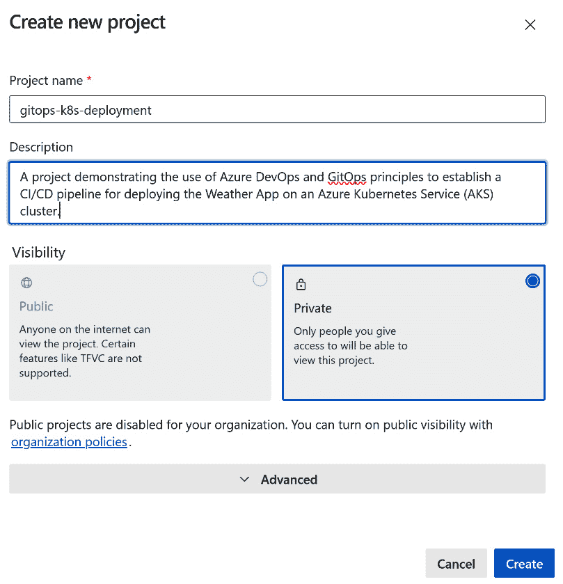

图 9.1 – 创建新项目的 Azure DevOps 窗口

1.  在**你的代码在哪里？**窗口中，选择 GitHub 选项旁的**选择**，以选择你希望与之前创建的 Azure DevOps 项目关联的 GitHub 仓库。你可以直接使用本章关联的 GitHub 仓库，或者选择你创建的一个仓库，如*图 9.2*所示。

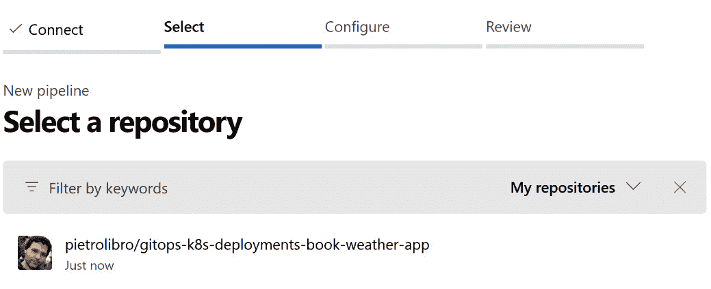

图 9.2 – 选择仓库面板

1.  在此阶段，我们已准备好配置流水线。在配置面板中，选择**部署到 Azure Kubernetes 服务**，如*图 9.3*所示。

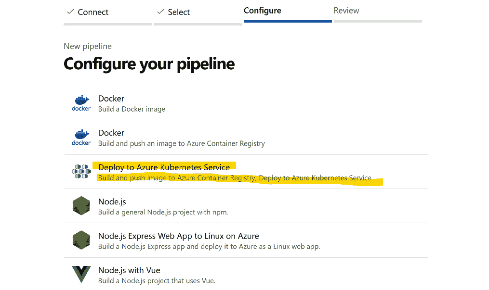

图 9.3 – 配置向导中的流水线部分

1.  按提示操作，如*图 9.4*所示，选择之前使用 Terraform 脚本配置和部署的 Azure 订阅。

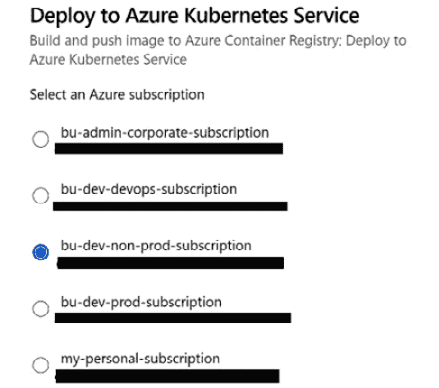

图 9.4 – 弹出窗口，选择 Azure 订阅

1.  在 `weather-app-namespace` 中。

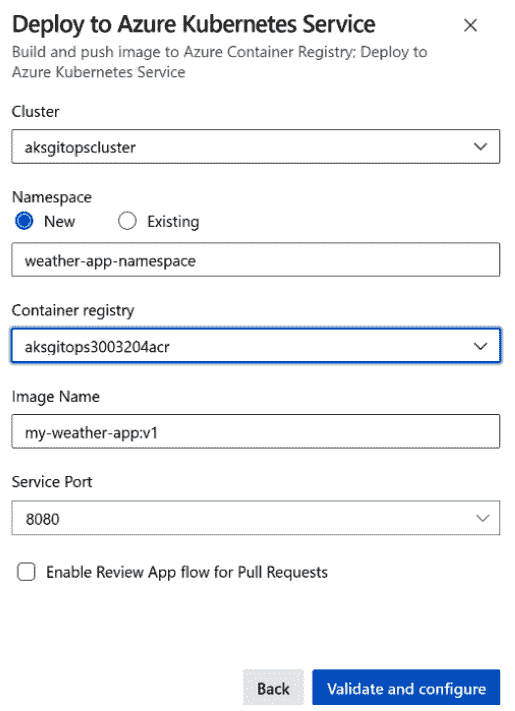

图 9.5 – 部署到 AKS 设置窗口

1.  点击 `src` 子目录，我们需要编辑以下代码的最后一行：

    ```
    variables:
    # Container registry service connection …
    dockerfilePath: '**/Dockerfile'
    ```

    我们按照如下方式编辑前面的代码：

    ```
    dockerfilePath: '**/src/dockerfile'
    ```

1.  然后，点击**保存并运行**按钮，保持默认值不变，再次点击**保存并运行**按钮。流水线将按照*图 9.6*所示触发。

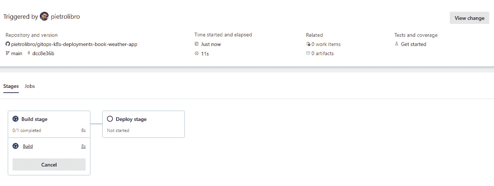

图 9.6 – 触发的 Azure DevOps 流水线示例

1.  点击**构建**阶段以查看更多详细信息，如*图 9.7*所示。这一次，无需在本地构建镜像并将其推送到注册表，因为所有操作都由 Azure DevOps 流水线处理。

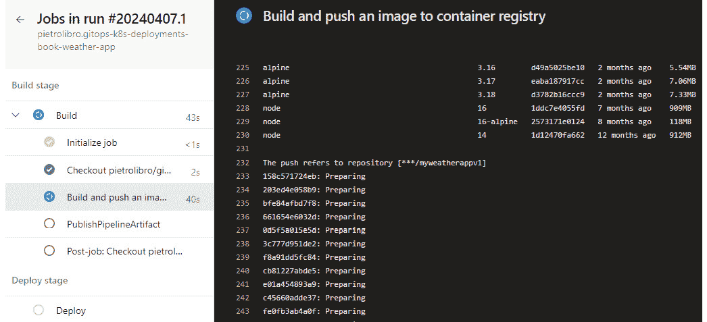

图 9.7 – 构建并推送镜像到容器注册表的详细信息

如果需要，授权流水线的权限，如*图 9.8*所示。

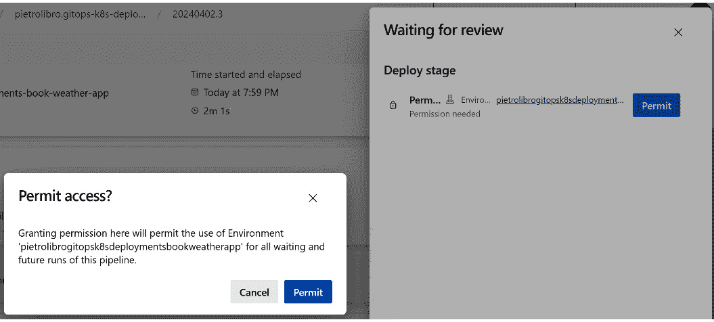

图 9.8 – 弹出窗口，授予当前及后续流水线运行的权限

1.  此时，几秒钟后，流水线应该成功完成，如*图 9.9*所示。一封邮件将发送到您的账户，通知您流水线成功完成。


图 9.9 – 流水线成功完成

1.  为了验证部署，您可以使用 Visual Studio Code 等工具，或者在终端执行以下命令：

    ```
    $ kubectl get pods --namespace weather-app-namespace
    ```

    输出应如下所示：

    ```
    NAME                 READY   STATUS    RESTARTS   AGE
    myweathera…        1/1     Running   0          7m50s
    ```

    在此时，我们可以执行一个 `port-forward` 命令，将应用显示在浏览器中，如*图 9.10*所示。

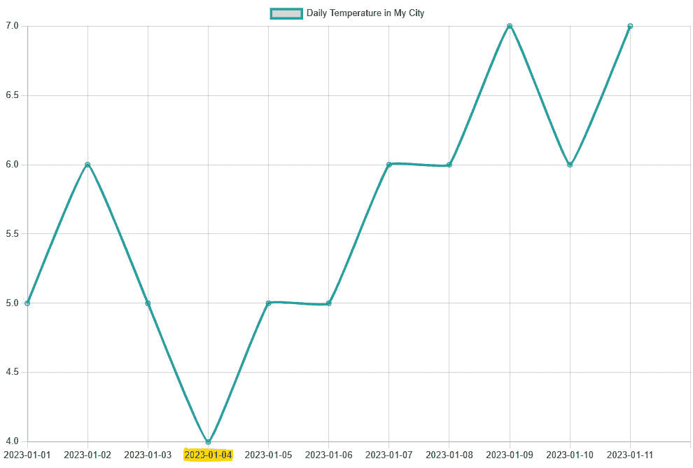

图 9.10 – 运行在 AKS 上的容器中的 weather-app 截图

1.  现在，为了探索 Azure DevOps 的 CI/CD 功能，你可以编辑`data.csv`文件，将`2023-01-04`这一天的值从`4.0`改为例如`5.0`（参见*图 9.11*）。这个文件可以直接在你的 GitHub 仓库中编辑，或者通过克隆仓库到本地并使用 Git 进行编辑。

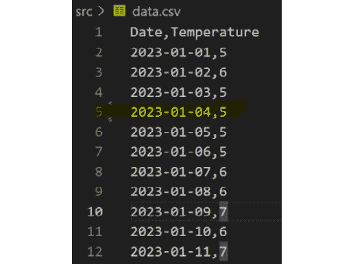

图 9.11 – 用作天气应用程序数据源的更新后的 data.csv 文件

在此阶段，一旦再次触发，管道将自动执行，如*图 9.12*所示。

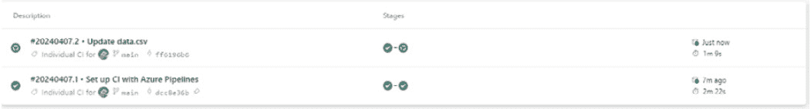

图 9.12 – 推送更新后的 data.csv 文件后的新执行管道

1.  通过执行一个新的`port-forward`命令，目标是刚刚部署的新 pod，我们将有机会可视化更新后的图表（参见*图 9.13*）。

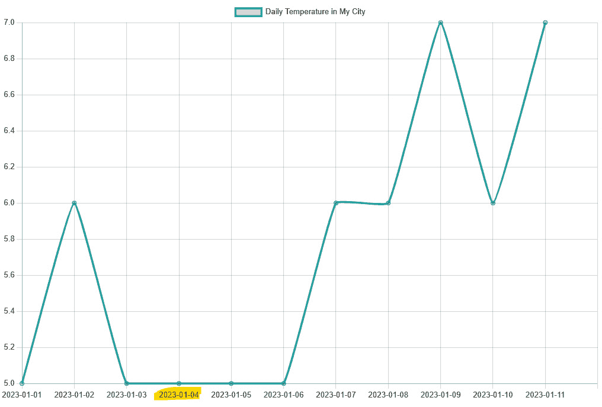

图 9.13 – 新部署后的天气应用程序，触发条件为推送更新后的 data.csv 文件

1.  为了避免产生不必要的费用，请记得通过输入以下命令（或使用 Azure 门户）销毁为本示例创建的所有 Azure 资源：

    ```
    $ terraform destroy --auto-approve
    ```

恭喜！你已经成功完成了 Azure DevOps CI/CD 管道，并将部署到 AKS，使用了 ACR 实例。现在，是时候转向 AWS 生态系统，探索那一侧的操作方式了。

## AWS GitOps 基础知识

AWS 通过提供一套服务来支持 GitOps 模型，旨在以高效可靠的方式促进云原生应用程序和基础设施的管理。EKS 作为 AWS 的托管 Kubernetes 服务，相较于其他主要云服务提供商的产品，如 Google Cloud 的**Google Kubernetes Engine**（**GKE**）和 Microsoft Azure 的 AKS，具有独特的功能。尽管它们提供类似的功能，但每个系统都针对其各自的生态系统进行了定制，优化了部署过程，并确保容器化应用程序的自动扩展和管理。将 EKS 与 AWS CodePipeline 集成，这是一个自动化构建、测试和部署发布过程的服务，可以实现 GitOps 方法，将整个基础设施视为代码。这种集成使团队能够实施 CD 实践，从而实现快速且安全的应用程序更新。AWS 对 GitOps 的承诺体现在其工具和服务中，这些工具支持不可变基础设施、自动化部署和详细监控，符合 GitOps 的声明式配置和版本控制原则。

### AWS CodePipeline

**AWS CodePipeline** (https://aws.amazon.com/codepipeline/) 是一个完全托管的 CI/CD 服务，自动化了发布过程中的构建、测试和部署阶段。它允许您创建管道，自动化发布软件变更所需的步骤。通过 CodePipeline，您可以将发布过程定义为一系列阶段，每个阶段执行特定操作，如从版本控制系统获取源代码、构建和测试应用程序，以及将其部署到您的基础设施。

AWS CodePipeline 的一个关键特点是其灵活性和与其他 AWS 服务的集成。您可以轻松将 CodePipeline 与 **AWS CodeBuild**（用于构建应用程序）、**AWS CodeDeploy**（将其部署到 EC2 实例或 **AWS Lambda 函数**）、以及 **AWS Elastic Beanstalk**（用于部署和管理 Web 应用程序）等服务集成。

CodePipeline 还支持通过自定义操作与第三方工具和服务集成，允许您扩展其功能以满足您的特定需求。此外，它通过基于 Web 的控制台提供发布过程的可视化，您可以通过该控制台监控管道进度并排查出现的问题。以下是使用 AWS CodePipeline 实现 Kubernetes GitOps 部署的步骤：

1.  **设置 AWS CodePipeline**：首先设置 AWS CodePipeline，它负责协调 Kubernetes 部署的 CI/CD 工作流。

1.  **连接到 GitHub 仓库**：在 CodePipeline 配置中，连接到存储 Kubernetes 清单和部署脚本的 GitHub 仓库。

1.  **配置源阶段**：在 CodePipeline 配置中定义源阶段，指定从中拉取 Kubernetes 清单的 GitHub 仓库和分支。

1.  **添加构建阶段**：在 CodePipeline 配置中创建一个构建阶段，执行 Kubernetes 部署所需的构建步骤，例如编译代码或打包工件。

1.  **与 EKS 集成**：将 EKS 纳入 CodePipeline 工作流。这可能涉及设置 AWS 服务和 CodePipeline 之间的连接或权限。

1.  **实施 GitOps 原则**：确保您的 CI/CD 管道遵循 GitOps 原则，例如将所有配置和部署清单存储在版本控制中，自动化部署流程，并使用基于拉取的同步方式进行集群更新。

1.  **定义部署策略**：定义 Kubernetes 应用程序的部署策略，指定如滚动策略、扩展选项和健康检查等参数。

1.  **触发部署**：配置 AWS CodePipeline，使其在每次推送更改到 GitHub 仓库时自动触发部署，保持 Kubernetes 应用程序的持续部署。

1.  **监控和调试**：实现监控和日志记录机制，以跟踪 Kubernetes 部署的性能和健康状况。确保您有工具来调试和排查部署过程中可能出现的任何问题。

1.  **迭代和改进**：持续迭代您的 CI/CD 流水线，结合反馈并进行改进，以提高 Kubernetes 部署的效率、可靠性和安全性。

总结来说，AWS CodePipeline 精简了发布过程，帮助团队更快速、更可靠地交付软件更改。通过自动化部署流水线，CodePipeline 加速了市场投放时间，并提升了整体生产力，使组织能够迅速响应客户需求和市场变化。

### AWS CodePipeline 下的 Kubernetes 部署

在本节中，我们将进行一次动手实践，通过 Terraform、EKS 和 AWS CodePipeline 部署 Kubernetes 集群。我们将从配置一个 EKS 集群和一个 Amazon **Elastic Container Registry**（**ECR**）开始。我们旅程的亮点是使用 AWS CodePipeline 将此镜像部署到 EKS 集群中。就像在 *Azure DevOps 下的 Kubernetes 部署* 部分对 Azure 所做的那样，本实践示范展示了这些组件的无缝集成，展示了它们如何在 GitOps 框架中简化部署过程。通过这个示例，读者将全面理解如何利用 AWS 强大的服务将应用程序部署到 Kubernetes 上。

在以下演示示例中，我们假设读者已拥有有效的 AWS 账户，并已安装并配置 AWS CLI 版本 2。请参考以下 AWS 链接以供参考：

+   **AWS CLI 用户** **指南**：[`docs.aws.amazon.com/cli/latest/userguide/cli-chap-welcome.html`](https://docs.aws.amazon.com/cli/latest/userguide/cli-chap-welcome.html)

+   **AWS CLI** **示例**：[`docs.aws.amazon.com/cli/latest/userguide/welcome-examples.html`](https://docs.aws.amazon.com/cli/latest/userguide/welcome-examples.html)

以下是成功完成本示例所需的步骤：

1.  通过输入以下命令，确保 AWS CLI 配置正确：

    ```
    terraform init command. For this step, we will utilize the main.tf Terraform files located in the iac/aws folder of the GitHub repository accompanying this chapter.This `main.tf` Terraform configuration file orchestrates the setup of essential AWS infrastructure components for deploying a Kubernetes cluster and managing container images. It begins by defining the AWS provider and version required for the deployment. Following this, it creates an ECR repository named `eksgitops3003204ecr` to store Docker images with mutable tag mutability. Next, the configuration provisions a `terraform-aws-modules/vpc/aws` module. This VPC, named `eks-cluster-vpc`, spans across two availability zones in the `eu-central-1` AWS region. Subsequently, the configuration sets up an EKS cluster utilizing the `terraform-aws-modules/eks/aws` module. The cluster, named `eksgitopscluster`, operates on version 1.29 and allows public access to its endpoint. It’s integrated with the previously created VPC and utilizes private subnets for enhanced security.Additionally, the configuration establishes a managed node group within the EKS cluster, configured with one instance of the `t3.small` type. This node group provides the computing resources necessary for running containerized applications within the Kubernetes environment. To facilitate seamless interaction between the EKS cluster and the ECR repository, an `ecr-pull-policy` is created. This policy grants EKS nodes the permissions required to pull container images from the specified ECR repository.Finally, the IAM policy is attached to the IAM role associated with the EKS cluster, ensuring that the cluster nodes have the necessary permissions to retrieve container images for deployment.
    ```

IAM 策略

IAM 策略是一个定义权限的文档，用于管理对 AWS 资源的访问。IAM 策略授予用户、组或角色特定的权限，决定他们可以在哪些资源上执行什么操作。这些策略由包含以下内容的声明组成：**Effect**（允许或拒绝）、**Action**（允许或拒绝的具体操作）、**Resource**（操作应用的特定资源）。IAM 策略有助于确保 AWS 环境中的安全和精细化访问控制，使管理员能够通过只授予实体执行任务所需的权限来贯彻最小权限原则。

1.  输入以下命令以启动集群创建：

    ```
    $ terraform init
    $ terraform plan -out aksplan
    $ terraform apply -auto-approve aksplan
    ```

    整个过程大约需要 10 分钟才能完成。*图 9.14* 显示了 AWS 控制台中的 EKS 集群，而 *图 9.15* 显示了创建的 ECR 注册表。

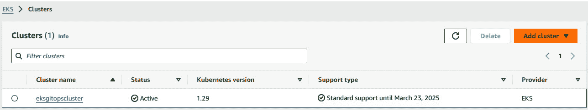

图 9.14 – 执行 Terraform 脚本后的 EKS 集群

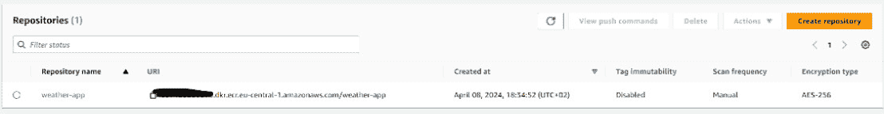

图 9.15 – 执行 Terraform 脚本后的 ECR 注册表

1.  集成 `kubectl` 配置以进行集群管理：

    ```
    $ aws eks --region eu-central-1 update-kubeconfig --name eksgitopscluster
    ```

1.  输入以下命令测试访问：

    ```
    $ kubectl cluster-info
    ```

    输出应如下所示：

    ```
    Kubernetes control plane is running at https://54CE9D2FAC3008E8E5B3D4873E92E7B2.yl4.eu-central-1.eks.amazonaws.com
    CoreDNS is running at https://54CE9D2FAC3008E8E5B3D4873E92E7B2.yl4.eu-central-1.eks.amazonaws.com/api/v1/namespaces/kube-system/services/kube-dns:dns/proxy
    ```

如果在合并集群管理后遇到身份验证问题或其他常规问题，您需要为 EKS 集群添加一个访问条目。这包括向为 AWS CLI 配置的用户添加以下权限，如本节开头所述：

1.  在 AWS 控制台中，导航到 `eksgitopscluster` 并点击**创建访问条目**按钮，如*图 9.16*所示：

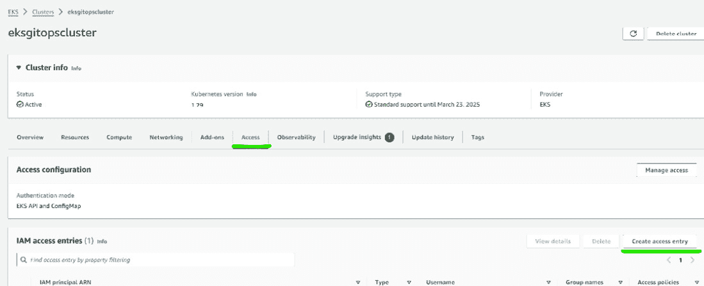

图 9.16 – EKS 集群页面及创建新访问条目的“访问”标签

1.  在 **IAM 主体 ARN** 字段中，您需要选择已用于配置 AWS CLI 并执行 AWS CLI 命令的 IAM ARN，如*图 9.17*所示：

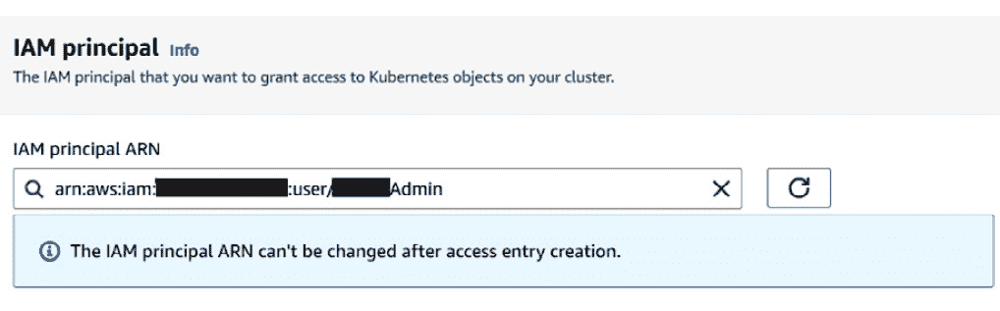

图 9.17 – AWS CLI 配置的 IAM 主体 ARN 选择

1.  然后，点击页面底部的 **下一步** 按钮，并为本示例添加以下所有策略名称（参见*图 9.18*），选择 **Cluster** 作为选定的 **访问范围**：

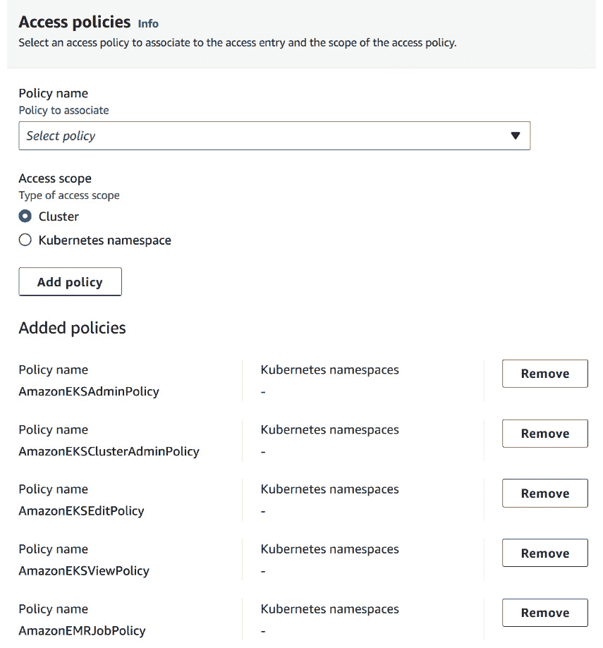

图 9.18 – 为新 IAM 主体附加权限的访问策略部分

1.  点击 **下一步** 按钮，然后点击 **创建**。现在，您应该可以使用 AWS CLI 管理集群，而不会遇到任何问题。更多信息，请参阅官方文档：https://docs.aws.amazon.com/eks/latest/userguide/access-entries.html#updating-access-entries。

1.  在创建 AWS CodePipeline 实例之前，我们首先需要创建一个 `GitOpsCodeBuildRole`。该角色将允许管道在将新代码提交到仓库时为我们的 `weather-app` 应用程序构建新镜像，推送该镜像到创建的 ECR，并将其部署到 EKS。在 AWS 控制台中，导航到 **IAM** |**角色**，然后点击 **创建角色** 按钮，如*图 9.19*所示。

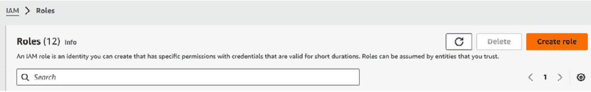

图 9.19 – 在 AWS 管理控制台中的角色页面，您可以开始创建新的 IAM 角色

IAM 角色

在 AWS 中，**IAM 角色**是一组权限，用于定义可以对 AWS 资源执行哪些操作。角色用于在 AWS 内部将访问权限委托给用户、应用程序或服务，使它们能够与各种 AWS 服务安全地交互。角色通过策略定义，这些策略指定了允许或拒绝的操作，并且角色由 AWS 服务、IAM 用户或 AWS 资源等实体来承担。这种方法确保了安全的访问控制，并有助于执行最小权限原则，即用户和服务仅获得执行其任务所需的权限。

1.  在 **选择受信实体** 部分，选择 **AWS 服务**，在 **用例** 面板中选择 **CodeBuild**，如 *图 9.20* 所示。

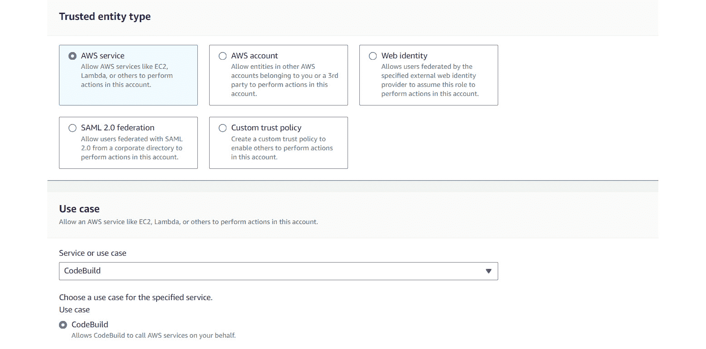

图 9.20 – 创建角色页面上的受信实体类型和用例部分

1.  在 `AmazonEC2ContainerRegistryFullAccess` 上

1.  `AmazonS3FullAccess`

1.  `AWSCodeBuildAdminAccess`

1.  `AWSCodeCommitFullAccess`

1.  `CloudWatchLogsFullAccess`

然后，添加以下 **内联策略**：

```
{
     "Version": "2012-10-17",
     "Statement": [
          {
               "Effect": "Allow",
               "Action": "eks:Describe*",
               "Resource": "*"
          }
     ]
}
```

内联策略

**内联策略**是一组可以直接附加到 IAM 用户、组或角色的权限。与托管策略不同，后者是独立的实体，内联策略是直接嵌入到它们所控制的资源中的。这允许在更具体的层次上进行更细粒度的权限控制和管理。内联策略通常用于仅将某些权限应用于特定用户、组或角色，而不是在多个实体之间共享。

在审核和创建新的 IAM 角色之前，确保添加指定的信任关系以控制谁可以承担该角色，从而增强安全性和合规性。此设置可防止未经授权的访问，并确保只有指定的实体才能访问某些 AWS 资源：

```
{
    "Version": "2012-10-17",
    "Statement": [
        {
            "Effect": "Allow",
            "Principal": {
                "Service": "codebuild.amazonaws.com"
            },
            "Action": "sts:AssumeRole"
        }
    ]
}
```

完成过程后，点击 **创建** 按钮。现在，我们已经准备好创建 AWS CodePipeline 实例。

1.  遵循类似于 Azure DevOps 的方法，参考本章中的 *Kubernetes 部署与 Azure DevOps* 部分；现在是时候使用 AWS CodePipeline 自动化将应用程序部署到 AWS EKS 了。

    要正确设置 CodePipeline，请导航到 AWS 控制台，进入 `weather-app-pipeline`

1.  **管道** **类型**: **V2**

1.  **执行** **模式**: **排队中**

1.  **服务角色**: **新建** **服务角色**

然后，点击 **下一步** 按钮。

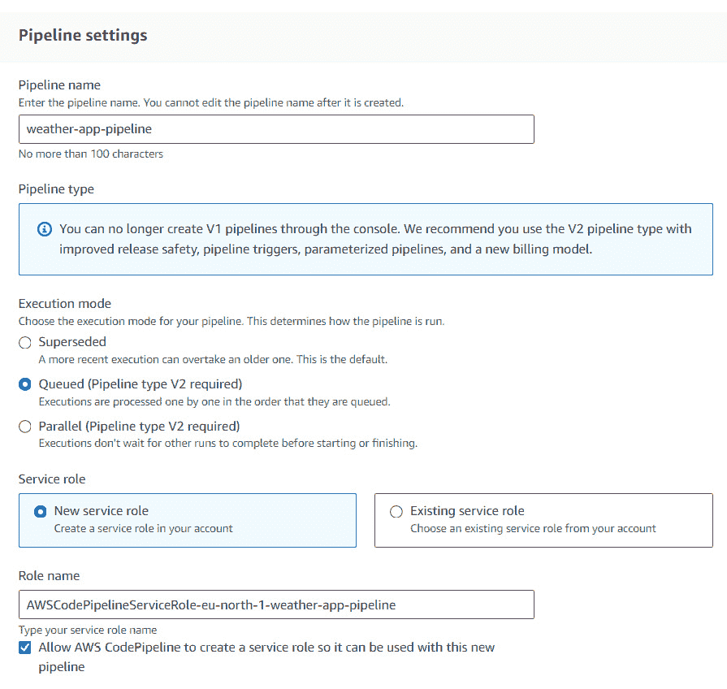

图 9.21 – 新的 AWS CodePipeline 的初始配置

1.  在 `GitHub (版本 2)` 中选择 `main`。对于 `CodePipeline` 选择默认设置。最后，点击 **下一步** 按钮。

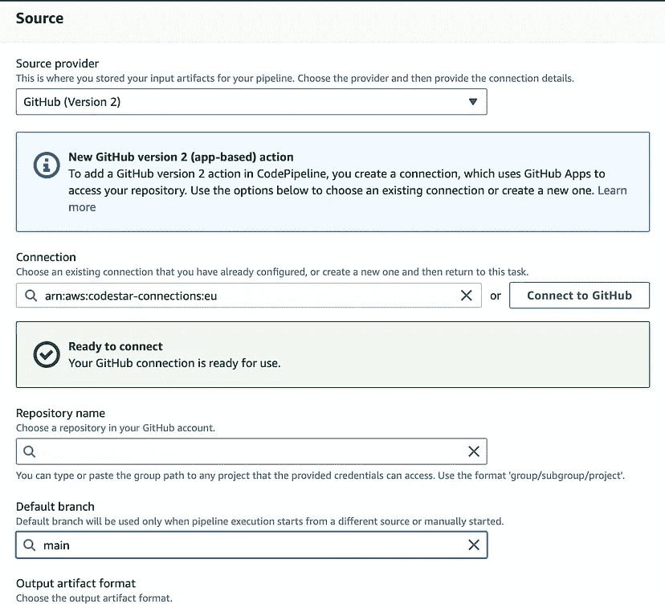

图 9.22 – 与 GitHub 存储库源的连接

1.  在**添加构建阶段**中，选择**AWS CodeBuild**作为构建提供者（参见*图 9.23*）。选择之前已部署 EKS 和 ECR 资源的相同区域，然后点击**创建项目**。

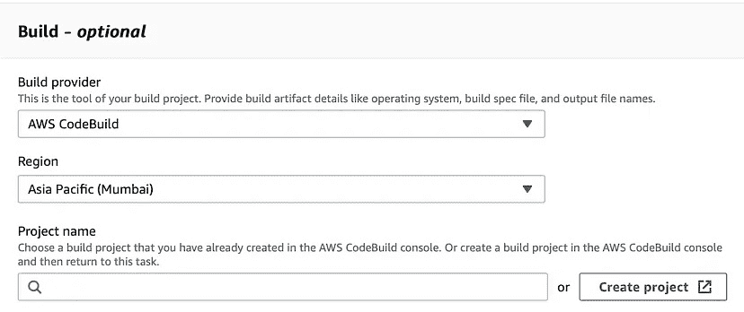

图 9.23 – 与选择构建提供者和区域相关的构建面板部分

1.  在 `weather-app-build` 作为项目名称，保持其他所有值为默认，除了 `arn:aws:iam::[AWS_ACCOUNT_ID]:role/GitOpsCodeBuildRole`。

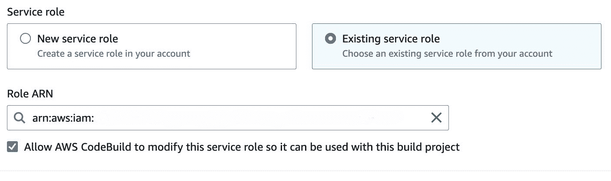

图 9.24 – 与选择服务角色和角色相关的构建面板部分

1.  在 `buildspec.yaml` 文件中。然后，点击 `ECR_REPOSITORY_URI`：`[AWS_ACCOUNT_ID].dkr.ecr.eu-central-1.amazonaws.com`

1.  `IMAGE_AND_TAG`：`weather-app:latest`

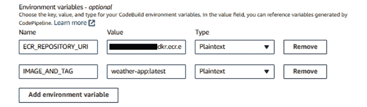

图 9.25 – 与添加环境变量相关的构建面板部分

1.  对于**构建类型**，选择**单一构建**。点击**下一步**按钮。在**添加部署阶段**步骤中，点击**跳过部署阶段**按钮，然后点击**下一步**。在最后阶段检查流水线并点击**创建流水线**按钮。此时，CodePipeline 将触发并在一分钟内成功完成（见*图 9.26*）。

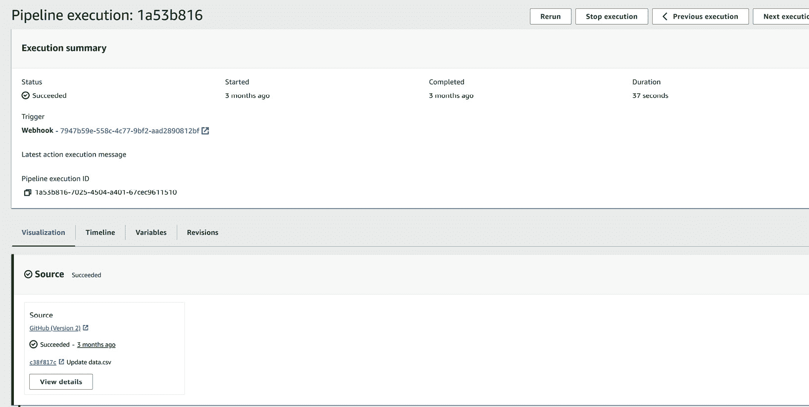

图 9.26 – 定义后的 weather-app-pipeline

1.  在流水线执行结束时，我们可以验证 `weather-app` 的 Docker 镜像已正确构建并推送到 ECR，如*图 9.27*所示。

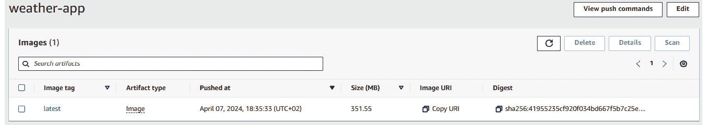

图 9.27 – weather-app:latest 镜像成功推送到 ECR

1.  为了验证部署是否成功完成，执行以下命令：

    ```
    $ kubectl get deployments
    ```

    这里是输出：

    ```
    NAME                  READY   UP-TO-DATE   AVAILABLE   AGE
    my-city-weather-app   1/1     1            1           64m
    ```

1.  在这一点上，我们可以执行 `port-forward` 命令，在浏览器中显示应用，如*图 9.28*所示。

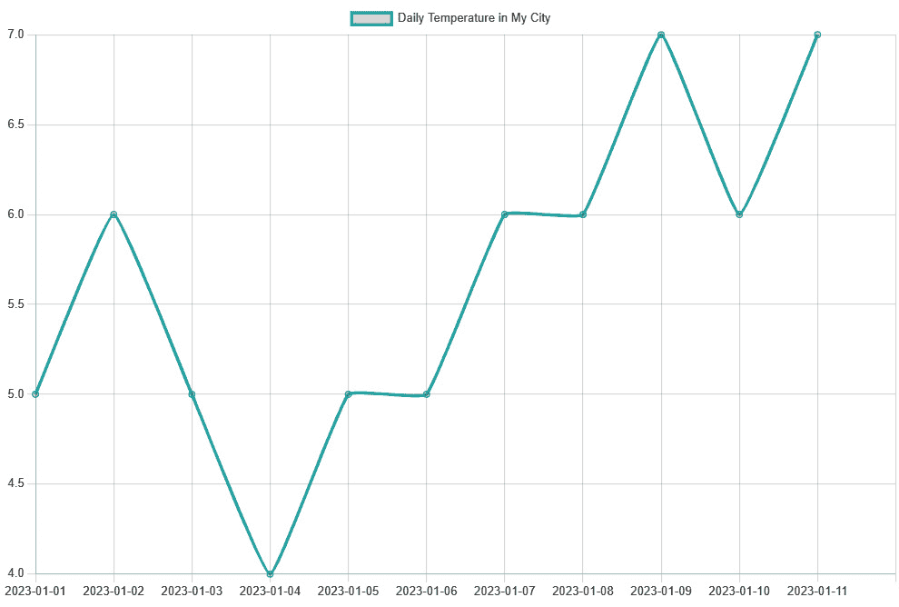

图 9.28 – 部署后在浏览器中呈现的 weather-app

1.  尝试编辑数据源文件，按照*Kubernetes 部署与 Azure DevOps*部分的*步骤 11*进行操作。在推送更改后，`weather-pipeline` 将立即触发，如*图 9.29*所示。执行新的 `port-forward` 命令以查看更新后的图表版本。

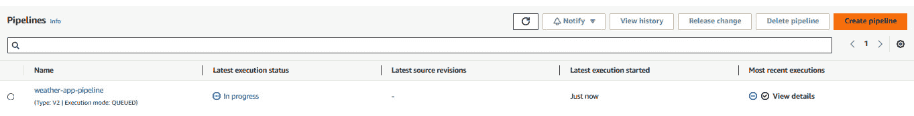

图 9.29 – 推送更新后的 data.csv 文件后，管道立即触发

为了避免产生不必要的费用，请记得在完成示例后，通过执行适当的命令或使用 AWS 管理控制台删除为此示例创建的所有 AWS 资源。

恭喜！在这一阶段，你已经成功地通过 Azure DevOps 在 Azure 上部署了天气应用，并通过 CodePipeline 在 AWS 上部署了应用。接下来，让我们在下一节深入探讨云环境中的 GitOps 应用。

# 云环境中的 GitOps 应用

GitOps 的出现极大地革新了云环境的管理和部署方式，将版本控制和协作的原则嵌入到云原生应用的操作框架中。GitOps 应用不仅仅是自动化部署，它涵盖了云资源和服务的整个生命周期，包括资源配置、扩展、更新和退役，这一切都通过 Git 拉取请求进行管理。该方法论促进了一个透明、可审计、且易于回滚的过程，提高了云应用的安全性和合规性。此外，GitOps 实践确保了云环境的期望状态被声明性地定义并维护，促进了不同开发和生产阶段的一致性和可靠性。这种系统化方法最小化了环境间的差异，显著减少了*在我机器上能运行*的问题，并简化了向生产环境的过渡。

## 跨云策略

在今天的多云格局中，组织通常利用 Azure、AWS 和其他云提供商的独特优势来优化其操作和成本。管理跨这些多样化环境的部署可能会面临挑战，特别是在保持一致性和效率方面。GitOps 提供了一种统一的策略来管理这些部署，促进了跨云的互操作性和配置管理。以下是采用 GitOps 跨云部署的好处列表：

+   **统一的配置管理**：通过将基础设施定义和配置作为代码存储在 Git 仓库中，团队可以使用相同的 GitOps 工作流来管理 Azure、AWS 和其他云平台的部署。这使得控制集中化，并确保了云环境的一致性。

+   **互操作性和可移植性**：利用容器化和 Kubernetes，应用程序可以设计为无缝地跨不同的云平台运行。结合这些技术的 GitOps 实践，简化了部署和管理这些应用程序的过程，无论基础云平台如何。

+   **自动同步**：像 Argo CD 或 Flux 这样的工具可以用来自动同步 Git 仓库中的期望状态与各个云环境中的实际状态。这确保了所有环境遵循相同的配置和策略，从而在跨云操作中实现顺畅一致的工作流程。

+   **环境一致性**：GitOps 使团队能够在不同的云平台间以高精度复制环境。这对于测试尤其有用，在 Azure 上部署的应用可以在 AWS 上以类似的条件进行测试，从而确保应用在不同平台上的行为一致。

+   **机密管理**：在跨云环境中，管理机密和敏感信息可能具有挑战性。GitOps 工作流可以与云平台特定的机密管理服务（如 Azure Key Vault 或 AWS Secrets Manager）集成，既能安全处理机密，又能保持跨云部署的灵活性。

采用 GitOps 方法进行跨云策略，不仅简化了多云环境固有的复杂性，还提高了操作效率、安全性和合规性。通过将基础设施和应用配置视为代码，团队能够迅速适应变化，确保部署始终与组织目标和行业最佳实践保持一致。在下一节中，我们将介绍在 Azure 和 AWS 上为 Kubernetes 部署应采用哪些 GitOps 策略。

# Azure 和 AWS 上的 Kubernetes 部署的 GitOps 策略

在 Kubernetes 部署领域，GitOps 策略提供了一种向更高效、透明和可靠的操作方式转变的模式。通过利用 GitOps 原则，组织可以自动化部署过程，确保环境一致性，并显著提升操作工作流。以下是针对 Azure 和 AWS 上的 Kubernetes 部署量身定制的 GitOps 策略见解。

## Azure GitOps 策略

采用 GitOps 策略管理 AKS 涉及将源代码控制、CI/CD 管道和配置管理集成的详细方法，以增强部署过程。一项关键策略是使用 ARM 模板或 Terraform 等工具部署基础设施即代码（IaC），这些工具存储在 Git 仓库中。这种方法使 AKS 配置的声明性管理成为可能。*第十章*和*第十一章*将提供关于如何在 Azure 上使用 Terraform 自动化 IaC 的全面示例。这些自动化流程促进了自动化和可重复的部署，从而提高了应用的稳定性和可扩展性。

将 Azure Policy 与 GitOps 配合使用，进一步加强了 Kubernetes 集群的合规性和治理，确保部署符合组织和监管标准。将 Azure Monitor 与 GitOps 工作流集成，使团队能够将可观察性作为其操作的核心组成部分，进行主动监控和排除 AKS 部署的故障。

## AWS GitOps 策略

AWS 提供了一个强大的生态系统，用于实施 GitOps 与 EKS。AWS GitOps 策略的基础在于利用 Amazon ECR 作为 Docker 容器注册表，AWS CodeCommit 作为源代码管理工具，AWS CodePipeline 用于持续集成和部署。与 Azure 类似，AWS 提倡使用基础设施即代码（IaC），AWS CloudFormation 或 Terraform 是首选工具，用于声明式管理 EKS 集群配置和资源。

在 AWS 上，执行有效的 GitOps 策略包括将 AWS CodeBuild 和 AWS CodeDeploy 集成到 CI/CD 管道中，从 Git 仓库直接自动化构建、测试和部署阶段。此外，AWS App Mesh 服务可以集成到 GitOps 工作流中，更有效地管理微服务，提供跨应用的端到端可见性和网络流量控制。

对于 Azure 和 AWS，实施 GitOps 进行 Kubernetes 部署围绕着四个关键原则：版本控制、自动化部署、通过合并/拉取请求进行变更管理，以及可观察性。通过遵循这些原则，组织能够实现自动化、可预测和安全的应用部署，规模化管理 Kubernetes 集群。利用 GitOps 不仅简化了 Kubernetes 集群管理，还将操作实践与开发工作流对齐，促进了协作与持续改进的文化。

# 总结

到目前为止，我们已经深入理解了如何在 Azure 和 AWS 云环境中有效地实施 GitOps。本章介绍了必要的工具和流程，例如 AKS、Azure DevOps、AWS EKS 和 AWS CodePipeline，用于建立强大的 CI/CD 管道并无缝管理部署。通过实际示例和专家建议，本章确保读者能够将这些概念应用于实现更自动化、一致性和安全的云原生部署。强调了 Git、Docker 和 Kubernetes 的基础知识的重要性，本章为读者准备了充分利用 GitOps 在云计算项目中发挥最大潜力的准备。在下一章中，我们将探讨 GitOps 与 Terraform 和 Flux 的集成，重点讨论基础设施方面。我们将涵盖将基础设施作为代码与实时操作对齐的关键步骤，使用 Terraform 进行资源配置，使用 Flux 实现 CD。讨论还将重点介绍这一过程中最佳实践和常见挑战。
