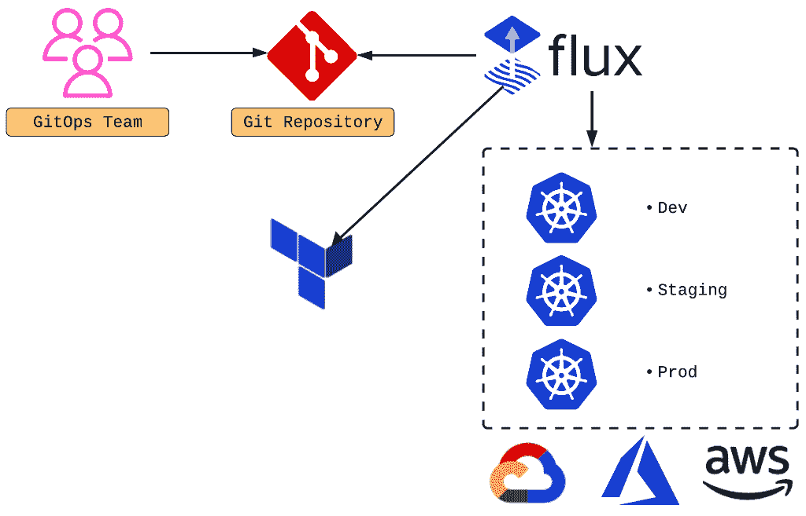
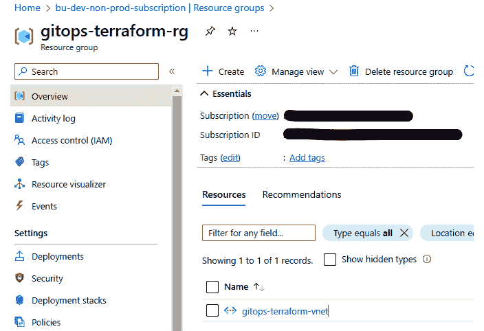
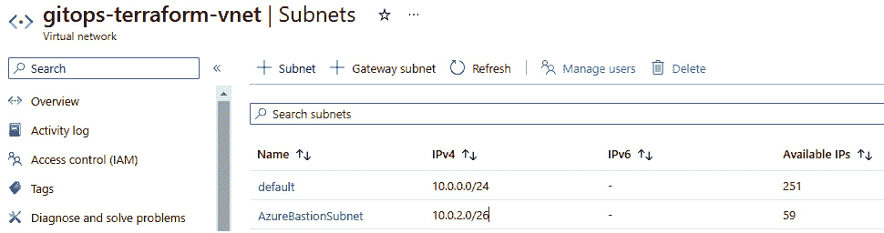
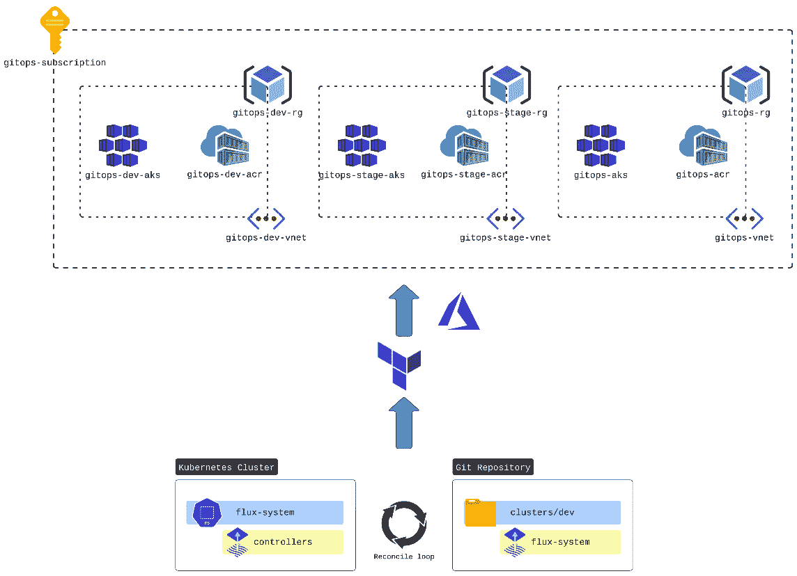
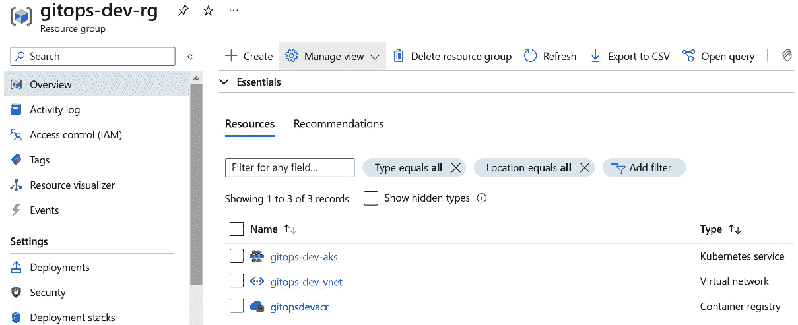

# 第九章：GitOps 与基础设施自动化 – Terraform 和 Flux CD

本章将探讨 Terraform 和 Flux CD 之间强大的协同效应，这两个关键工具体现了 GitOps 和**基础设施即代码**（**IaC**）的原则。随着云架构日益复杂和动态化，需要先进的自动化工具来管理这些环境变得尤为关键。Terraform 允许用户使用高级配置语言定义和提供云基础设施，创建一个可版本化和重用的资源蓝图。与之互补，Flux CD 通过持续同步 Git 仓库中的应用程序和基础设施变更到 Kubernetes 集群来实现自动化部署。这种集成不仅简化了云资源的管理，还确保了部署流水线各个阶段的一致性和可靠性。通过详细的讨论、实用的示例和专家见解，本章将帮助你掌握 Terraform 和 Flux CD 的组合力量，让你能够在云原生世界中高效、可预测地自动化你的基础设施。

本章我们将深入探讨以下关键内容：

+   使用 Terraform 和 Flux CD 引入基础设施自动化

+   在 GitOps 工作流中设置 Terraform

+   探索 Flux CD – 在 Kubernetes 中启用**持续部署**（**CD**）

+   结合 Terraform 和 Flux CD 实现更强的自动化

+   使用 Terraform 和 Flux CD 进行版本控制和自动化

+   使用 Terraform 和 Flux CD 进行多环境管理

# 技术要求

在深入了解 Terraform 和 Flux CD 在 GitOps 工作流中的集成之前，务必牢固掌握本书前几章中讨论的基础概念。理解 IaC 的基本原理、Kubernetes 的关键概念，以及我们专门的 GitHub 仓库中的`Chapter10`文件夹：[`github.com/PacktPublishing/Implementing-GitOps-with-Kubernetes`](https://github.com/PacktPublishing/Implementing-GitOps-with-Kubernetes)。

# 使用 Terraform 和 Flux CD 引入基础设施自动化

在当今快速发展的云计算环境中，管理基础设施时对敏捷性、可扩展性和可靠性的需求至关重要。传统的手动方法已不足以满足现代应用的需求。此时，IaC 和 GitOps 应运而生，重新定义了云原生环境下的基础设施管理。对于平台工程师来说，手动工作仍然至关重要，例如理解云资源以编写有效的 Terraform 脚本，通常也是更新 Terraform Git 仓库之前的第一步。通过利用 GitOps 框架，解决云原生交付中面临的挑战，比如防止配置漂移，确保安全、无误的部署。在 Kubernetes 上实施 GitOps 会带来一些挑战，包括管理复杂配置和保持 Git 仓库与集群之间的同步。IaC 是一种将基础设施供应、配置和管理视为代码的方法。从本质上讲，它使开发人员和运维团队能够使用声明式或命令式代码来定义基础设施资源，如**虚拟机**（**VMs**）、网络和存储。我们在上一章已经探讨了 IaC 的概念，当时我们利用 Terraform 脚本在 Azure 和 AWS 上配置了必要的资源。

这段代码是版本控制的，可以实现可复现、一致和自动化的部署。通过将基础设施配置编码化，基础设施即代码（IaC）简化了部署过程，减少了人为错误，并增强了开发和运维团队之间的协作。

GitOps 则将 IaC 的原则扩展到持续交付和部署领域。基础设施的变化通过 Git 提交进行，实现了版本控制、审计和协作。GitOps 提倡一种声明式的基础设施管理方法，其中存储在 Git 仓库中的期望状态配置会自动与基础设施的实际状态进行协调。这一协调过程通常由 Flux CD 等专门的工具来完成。

在前面介绍的 IaC 和 GitOps 的基础原则之上，我们来考虑一个实际的示例，如*图 10.1*所示，展示了公司如何利用 Terraform 和 Flux CD 来高效地管理基础设施。

假设有一家公司需要在多个云环境中快速扩展其业务，同时保持严格的合规性和安全标准。通过使用 Terraform，公司可以将基础设施要求编码为版本控制的配置文件，这样可以在 AWS、Azure 或 Google Cloud 等环境中快速部署和轻松复制环境。通过将 Flux CD 集成到这一设置中，对 Git 仓库中 Terraform 配置的任何更改都会自动触发 Kubernetes 集群中的更新。这种无缝集成确保基础设施与应用程序代码一致发展，减少了差异和潜在错误。结果是一个强大、可扩展且符合合规要求的基础设施，能够迅速适应业务需求的变化，同时最大限度地减少手动监督和干预：



图 10.1 – 利用 Terraform 和 Flux CD 进行高效基础设施管理的公司示例

在现代云环境中，敏捷性和可扩展性至关重要，采用基础设施即代码（IaC）和 GitOps 提供了诸多优势。首先，它使组织能够实现基础设施自动化，快速进行资源的配置、扩展和修改。其次，它增强了不同环境间的可复制性和一致性，减少了配置漂移的风险，确保了可靠性。第三，它促进了协作和可见性，因为基础设施配置被存储并在可访问的 Git 仓库中进行版本控制。最后，它提升了弹性和可观察性，自动化的协调机制确保基础设施保持在期望的状态。我们将在本章的后续部分深入探讨 IaC 和 GitOps 的主题，并通过实际示例进行说明。

现在，是时候开始配置我们的环境了。

# 在 GitOps 工作流中设置 Terraform

在建立了 IaC 和 GitOps 的基础概念后，我们现在理解了 Terraform 和 Flux CD 的集成如何*改变基础设施管理*。在这一坚实的基础上，我们将引导您配置 Terraform，使其与 Flux CD 无缝配合，为符合现代云原生实践的、连贯且自动化的基础设施部署过程打下基础。Terraform 在*第四章*中介绍并简要讨论，并在*第九章*中进一步探讨了与*使用 Azure DevOps 和 AWS CodePipeline 进行 Kubernetes 部署*的相关内容。在本章的剩余部分，我们假设读者已经对 Terraform 有了扎实的理解，并且它已在本地正确安装。有关 Terraform 是什么以及如何安装的更多信息，请访问以下链接：[`developer.hashicorp.com/terraform/tutorials/aws-get-started/install-cli`](https://developer.hashicorp.com/terraform/tutorials/aws-get-started/install-cli)。要检查 Terraform 是否正确安装，请在新的终端中键入以下命令：

```
$ terraform version
```

前面命令的输出应该类似于以下内容：

```
Terraform v1.7.5
```

在我们设置 Terraform 与 GitOps 工作流的示例中，我们将使用 Flux 来监视包含 Terraform 脚本的 Git 存储库中的更改。然后，Flux 将应用这些更改来管理 Azure 云资源，具体目标是指定的资源组、虚拟网络和子网。

要成功实施此设置，您必须满足以下先决条件：

+   在本地安装了`minikube`。另外，您也可以选择托管的集群环境，如**Azure Kubernetes Service**（**AKS**）或**Amazon Elastic Kubernetes** **Service**（**EKS**）。

+   **Helm 和 kubectl**：确保这两个工具已正确安装并配置。

+   **GitHub 账户**：虽然本示例使用 GitHub，但 Flux 引导支持其他存储库。有关更多详细信息，请参阅 Flux 文档：[`fluxcd.io/flux/installation/#bootstrap-providers`](https://fluxcd.io/flux/installation/#bootstrap-providers)。

+   **GitHub 个人访问令牌（PAT）**：这对于私有存储库或需要身份验证的操作是必需的。有关 PAT 的更多信息，请访问[`docs.github.com/en/authentication/keeping-your-account-and-data-secure/managing-your-personal-access-tokens`](https://docs.github.com/en/authentication/keeping-your-account-and-data-secure/managing-your-personal-access-tokens)。

+   **一个 Azure 账户**：您也可以根据个人喜好使用 Azure 账户（请注意，本节及后续部分中的示例专门为 Azure 设计）。

在深入讨论工作流的设置之前，下一节将讨论 Tofu Controller 是什么，以及它为何是对账过程的引擎和核心。

## Tofu Controller（前身为 Weave TF-Controller）

**Tofu Controller**（请参考 https://github.com/flux-iac/tofu-controller），前身为 **Weave TF-Controller**，是 Flux 生态系统中的关键元素，使得 **OpenTofu** 和 Terraform 资源能够以 GitOps 方式进行协调。

OpenTofu

OpenTofu，前身为 OpenTF，是一个由 Linux 基金会管理的开源社区驱动的 Terraform 分支。OpenTofu 旨在增强云原生环境中 IaC 的管理，能够与现有的 GitOps 工作流无缝集成，使用户能够使用如 Terraform 等工具以声明式方式管理基础设施。OpenTofu 和 Terraform 都使用声明式的 **HashiCorp 配置语言**（**HCL**）语法来配置基础设施，但在许可上有所不同：Terraform 目前采用 **商业源代码许可证**（**BSL**），而 OpenTofu 采用开源的 **Mozilla 公共许可证**（**MPL**）。OpenTofu 的主要目标是弥补复杂基础设施设置与现代云环境所需的可扩展、自动化管理能力之间的差距。通过利用 OpenTofu，组织可以高效地将 GitOps 原则应用于其基础设施，确保一致性、可靠性以及快速部署云资源。

使用 Tofu Controller，组织可以根据其操作需求和准备情况，按适合的节奏采用 GitOps 实践——这意味着不需要立即将所有资源都转化为 GitOps。

强调灵活性和节奏的 **按自己节奏** 方法，Tofu Controller 允许逐步采用 GitOps。这种灵活性对于那些可能希望逐渐转型的组织至关重要，无需进行大规模的立即转型。它使团队能够更加舒适地管理变更和适应，确保每个向 GitOps 迈进的步骤都能经过充分规划和实施。

Tofu Controller 支持多种 GitOps 模式，每种模式都针对基础设施管理的不同需求和阶段：

+   **GitOps 自动化模型**：该模型提供了一种全面的 GitOps 方法，涵盖了从配置到执行的各个方面。例如，它可以通过 GitOps 管理整个 AKS/EKS 集群的生命周期，自动化许多底层过程。

+   **混合 GitOps 自动化模型**：适用于已有资源的环境，该模型允许选择性地采用 GitOps。例如，如果一个组织已经有 AKS/EKS 集群，它可以选择在只集成某些组件（如节点组或安全组）时使用 GitOps，同时保持现有配置。

+   `TFSTATE`），使用 GitOps 原则强制执行期望状态，而不做额外修改，并纠正任何偏差，以保持一致性和可靠性。

+   `TFSTATE` 文件，并允许组织主动处理和管理这些变更。

对于当前示例以及接下来的部分，我们将使用之前提到的 **GitOps 自动化** 模式。

## 开始设置

现在我们已经介绍了主要主题并概述了必要的要求，我们已经进入了工作流设置的实际操作部分。要完成设置的第一部分，我们需要完成以下编号步骤：

1.  `minikube` 集群专门用于 Flux 设置，在新的终端中，输入以下命令：

    ```
    $ minikube start --profile flux-cluster
    ```

    几分钟后，输出应如下所示：

    ```
    😄  [flux-cluster] minikube v1.33.0 on Ubuntu 22.04 (amd64)
    ✨  Automatically selected the docker driver
    📌  Using Docker driver with root privileges
    👍  Starting "flux-cluster" primary control-plane node in "flux-cluster" cluster
    …
    🌟  Enabled addons: storage-provisioner, default-storageclass
    🏄  Done! kubectl is now configured to use "flux-cluster" cluster and "default" namespace by default
    ```

    这表示您的集群已经准备好使用。

1.  **安装** **Flux CLI**：

    1.  设置 Flux CLI，请输入以下命令：

    ```
    gitops-terraform-workflow, but feel free to create a repository according to your preferences. We will use a private repository for this setup. To create a GitHub account, please refer to the *GitHub account* section in *Chapter 3* of this book. After creating the GitHub repository, clone it locally to your laptop. For the Git commands, please refer to the *Basics of Git* section in *Chapter 3* of this book.
    ```

1.  `flux bootstrap` GitHub 命令会在 Kubernetes 集群上安装 Flux 控制器，使其能够与 GitHub 仓库同步。此设置涉及将 Flux 清单提交到仓库，并配置 Flux 从 Git 自行更新。执行后，所有集群操作，包括 Flux 更新，都可以通过 `git push` 管理，免去了直接与集群交互的需求。为了与 GitHub API 进行交互，该命令需要一个具有管理权限的 GitHub PAT，可以将其设置为环境变量：

```
$ export GITHUB_TOKEN=[GITHUB_PAT_TOKEN]
```

1.  现在，您可以通过输入以下命令，在您个人的 GitHub 账户上运行仓库的引导程序：

```
    flux bootstrap github \
      --token-auth \
      --owner=[GITHUB_ACCOUNT] \
      --repository=gitops-terraform-workflow \
      --branch=main \
      --path=clusters/local \
      --personal
```

执行命令应当需要几分钟时间，成功输出应该如下所示：

```
► connecting to github.com
► cloning branch "main" from Git repository "https://github.com/pietrolibro/gitops-terraform-workflow.git"
…
► confirming components are healthy
✔ helm-controller: deployment ready
✔ kustomize-controller: deployment ready
✔ notification-controller: deployment ready
✔ source-controller: deployment ready
✔ all components are healthy
```

1.  通过运行以下 `kubectl` 命令，您应该会注意到已经创建了一个 `flux-system` 命名空间：

```
$ kubectl get namespaces
NAME              STATUS   AGE
default           Active   26m
flux-system       Active   3m30s
kube-node-lease   Active   26m
kube-public       Active   26m
kube-system       Active   26m
```

+   **安装 TF-Controller**：现在，我们准备安装之前提到的 TF-Controller：

    1.  输入以下命令：

    ```
    $ kubectl apply -f https://raw.githubusercontent.com/flux-iac/tofu-controller/main/docs/release.yaml
    ```

    1.  现在，我们准备安装之前提到的 Tofu Controller。输入以下命令：

    ```
    helmrepository.source.toolkit.fluxcd.io/tf-controller created
    helmrelease.helm.toolkit.fluxcd.io/tf-controller created
    ```

    +   `Contributor` 角色。为此，请键入以下命令：

    ```
    subscriptionId="$(az account list --query "[?name=='AZURE_SUBSCRIPTION_NAME'].id" --output tsv)"
    az account set --subscription=$subscriptionId
    az ad sp create-for-rbac --role="Contributor" --scopes="/subscriptions/$subscriptionId" --name gitops-terraform-sp
    ```

    输出包含了敏感凭据，您必须保护这些凭据。确保不要将这些凭据包含在您的代码中或将其检查到源代码管理系统中。有关管理 Azure SP 的更多信息，请访问 [`aka.ms/azadsp-cli`](https://aka.ms/azadsp-cli)：

    ```
    {
      "appId": "application-id",
      "displayName": "gitops-terraform-sp",
      "password": "generated-password",
      "tenant": "tenant-uid"
    }
    ```

    这些值对应于 Terraform 变量，具体如下：`appId` 作为 `client_id` 变量，`password` 用作 `client_secret` 变量，`tenant` 是之前定义的 `tenant_id` 变量。

    +   `github-repository-secret.yaml` 文件位于本章仓库的定义文件夹中。文件内容如下：

```
apiVersion: v1
kind: Secret
metadata:
  name: github-repository-secret
  namespace: flux-system
type: Opaque
data:
  username: <github_accountname-base64>
  password: <github_pat-base64>
```

1.  用户名和密码需要进行 `base64` 编码。要使用命令行进行编码，您可以使用以下命令：`echo -n 'your-string' | base64`。编码后，按照常规方式使用 `kubectl` 应用该秘密：

```
$ kubectl apply -f github-repository-secret.yaml
```

1.  现在，我们需要为之前创建的 SP 的 Azure 凭据创建一个 Kubernetes 秘密。使用以下命令来完成此操作：

```
$ kubectl create secret generic azure-creds \
    --from-literal=ARM_SUBSCRIPTION_ID='SP_SUB_ID' \
    --from-literal=ARM_TENANT_ID='SP_TENANT_ID' \
    --from-literal=ARM_CLIENT_ID='SP_APPID' \
    --from-literal=ARM_CLIENT_SECRET='SP_PASSWORD' \
    --namespace flux-system
```

1.  要验证秘密的创建，请使用以下命令：

```
$ kubectl get secrets -n flux-system
NAME       TYPE                       DATA   AGE
azure-creds               Opaque      4      16s
flux-system               Opaque      2      34m
github-repository-secret  Opaque      2      25s
…
```

Kubernetes 秘密

Kubernetes Secret 是 Kubernetes 中的一种资源，用于存储少量敏感数据，如密码、令牌或密钥。这些数据以 `base64` 编码格式存储，可以被 pods 用来处理需要机密性和安全性的操作，帮助防止敏感信息在应用程序代码或日志中暴露。Kubernetes Secrets 中的 *opaque* 一词指的是默认的 Secret 类型。当不需要指定 Secret 的具体类型（如服务账户令牌或 Docker 配置）时，会使用此类型。实质上，*opaque* 表示 Secret 的内容是任意的，并未按任何特定类型的机密数据进行结构化表示。

1.  现在，我们需要通过位于定义文件夹中的 `github-repository-definition.yaml` 文件（在本章随附的仓库中的 `flux-gitops-definitions` 文件夹）将 GitHub 仓库与 GitHub 仓库 Secret 关联。使用常规命令应用它：

    ```
    $ kubectl apply -f github-repository-definition.yaml
    gitrepository.source.toolkit.fluxcd.io/gitops-terraform-repository created
    ```

1.  **TF-Controller 的 Docker 镜像**：现在，我们需要创建一个自定义的 Docker 镜像来运行 TF-Controller。Dockerfile 定义包含在 Docker 目录中。有关 Docker 命令，请参阅 *第二章* 中的 *发布镜像到容器仓库* 部分。要构建自定义 Docker 镜像，请使用以下命令：

    ```
    $ docker build -f ./Docker/dockerfile -t pietrolibro/gitops-terraform:tf_az_cli_1_1 .
    ```

1.  然后，您需要将其发布到 Kubernetes 集群可以访问的仓库中。登录 Docker 后，使用以下命令推送该镜像：

    ```
    main.tf in the iac/azure/vnet subfolder of the repository accompanying this chapter.  The Terraform script provisions a set of network resources in Microsoft Azure. It configures the Azure provider and defines a resource group named gitops-terraform-rg in the Switzerland North region, serving as a container for related Azure resources. The script also establishes a virtual network called gitops-terraform-vnet within this resource group, with an address space of 10.0.0.0/16. Additionally, it creates a default subnet within this virtual network, allocated with an address range of 10.0.0.0/24. This setup structures the Azure cloud infrastructure effectively, facilitating the management and scalability of network components within the specified region.
    ```

此时，我们可以将代码提交并推送到 GitHub 仓库，结束我们在 GitOps 工作流中设置 Terraform 的第一部分。接下来的一部分，我们将在接下来的章节中描述，重点是使用 Flux 在 Kubernetes 中启用 CD。

# 探索 Flux CD – 在 Kubernetes 中启用 CD

Flux CD 根据推送到 Git 仓库的更改，自动将配置和更新应用到 Kubernetes 集群。这种方法不仅确保了各环境之间的一致性，还通过维护所有部署的清晰版本控制历史，提高了安全性和可审计性。Flux 持续监控指定的 Git 仓库，检查 Kubernetes 清单、Helm 图表或配置文件的更改。当检测到更改时，Flux 会自动将这些更新应用到相应的 Kubernetes 集群中。这种自动化是全面的，不仅适用于应用程序，还适用于 Kubernetes 基础设施本身，使得整个环境能够像代码一样进行管理。

Flux CD 的主要功能包括以下几点：

+   **自动同步**：Flux 定期检查 Git 仓库的更改，并相应地同步集群的状态。

+   **不可变部署**：通过将基础设施视为不可变，Flux 遏制了人工干预，并促进了可重复性。

+   **安全性与合规性**：更改从 Git 中拉取，确保仅部署批准的更改，从而增强了安全性和合规性。

现在是时候回到我们在上一部分暂停的旅程了。我们需要配置 Flux 实例，以跟踪 Git 仓库中相应的目录或分支。此时，Terraform Controller 的强大之处便显现出来——它为你完成了所有繁重的工作。

我们需要创建一个 YAML 文件（参考本章中仓库中定义的`azvnet-gitops-automation.yaml`文件），如下所示：

```
apiVersion: infra.contrib.fluxcd.io/v1alpha2
kind: Terraform
metadata:
  name: gitops-terraform-automation
  namespace: flux-system
spec:
  interval: 1m
  approvePlan: auto
  destroyResourcesOnDeletion: true
  path: ./iac/azure/vnet
  sourceRef:
…
  runnerPodTemplate:
    spec:
      env:
        - name: ARM_SUBSCRIPTION_ID
          valueFrom:
            secretKeyRef:
              name: azure-creds
              key: ARM_SUBSCRIPTION_ID
        …
```

这个 YAML 文件定义了一个`Terraform`资源，供 Flux CD 框架内使用，专门设计用于自动管理 IaC（基础设施即代码）部署。配置详细说明了 API 版本，并指定资源类型为`Terraform`，这表明它在通过 Flux 管理和应用 Terraform 配置中的作用。

该资源命名为`gitops-terraform-automation`，位于`flux-system`命名空间中，该命名空间通常用于 Flux CD 操作。规格包括 1 分钟的间隔设置，指示 Flux 检查 Git 仓库中指定目录的变更频率。它被配置为自动批准并应用更改（`approvePlan: auto`），并且如果此 Terraform 配置从 Kubernetes 中删除，则销毁所有受管理的资源（`destroyResourcesOnDeletion: true`）。`./iac/azure/vnet`路径指定了 Git 仓库中 Terraform 配置的位置，Flux 将监控该路径。

`sourceRef`实例指向名为`flux-system`的 Git 仓库，标识出 Flux 应当监控的具体仓库。此设置使 Flux 能够自动管理更新，并保持仓库中指定的环境。

`runnerPodTemplate`部分配置了执行 Terraform 命令的 Pod 的环境变量，以确保能够安全访问 Azure 服务。`ARM_SUBSCRIPTION_ID`、`ARM_CLIENT_ID`、`ARM_CLIENT_SECRET`和`ARM_TENANT_ID`等变量对于 Azure 的交互至关重要，它们从一个名为`azure-creds`的 Kubernetes 机密中安全提取。这确保了敏感凭证得到了安全管理，并且只对必要的进程可用。

通过利用此配置，Flux CD 自动化部署和管理在仓库中指定路径的 Terraform 配置所定义的 Azure 虚拟网络。自动化包括监控更改、应用更新，并确保环境保持与仓库中声明的状态一致。此设置体现了 GitOps 的原则，通过使用 Git 作为**单一****真实来源**（**SSOT**），并自动化 Git 中定义的期望状态与 Azure 中基础设施的实际状态之间的对账过程。

要实现这一魔法并使配置生效，我们需要使用`kubectl`来应用它：

```
$ kubectl apply -f ./definitions/azvnet-gitops-automation.yaml
kubectl command to query the status of resources managed by Flux. Here’s how to check the reconciliation process:

```

$ kubectl get terraforms.infra.contrib.fluxcd.io -n flux-system  -w

```

			This command displays the current status of the Terraform configuration:

```

名称    就绪   状态                      时间

gitops-ter… 未知   对账进行中   9 秒

gitops-ter… 未知   初始化中   15 秒

gitops-ter… 未知   Terraform 计划中   22 秒

gitops-ter… 未知   计划已生成   30 秒

gitops-ter… 未知   应用中   30 秒

gitops-ter… 未知   应用中   30 秒

gitops-ter… 未知   应用成功：main@sha1:2eeaefba687fbd3d4caea404fc332ee7c5d8b144   43 秒

gitops-ter… True   应用成功：main@sha1:2eeaefba687fbd3d4caea404fc332ee7c5d8b144   44 秒

```

			As indicated by the output of the previous command, the Terraform script has been successfully applied at a certain point. For further confirmation, we can open the Azure portal and visually inspect the provisioned infrastructure, as illustrated in *Figure 10**.2*:
			

			Figure 10.2 – Azure resources provisioned by Terraform and GitOps
			Fantastic work! You have successfully integrated IaC using Terraform along with GitOps principles through Flux CD. By adopting this approach, you have laid a robust foundation for managing your cloud resources in a way that promotes consistency, reduces errors, and streamlines operations.
			Combining Terraform and Flux CD for enhanced automation
			Combining Terraform and Flux CD for enhanced automation offers significant advantages in managing cloud infrastructure efficiently and resiliently. Here’s how this integration can be advantageous in various practical scenarios.
			Providing new infrastructure by updating Terraform files
			One of the standout benefits of integrating Terraform with Flux CD is the simplicity with which new infrastructure components can be added. For example, suppose you need to add a new subnet to an existing Azure virtual network. By merely updating the Terraform file to include the new subnet definition and committing this change to your repository, Flux CD automatically detects the update and applies it. This seamless process eliminates the need for manual intervention in the cloud environment, thereby reducing the potential for human error and accelerating deployment times. Automation ensures that infrastructure adjustments, such as scaling out to accommodate growth, are handled promptly and accurately.
			We can immediately test this aspect by updating the `main.tf` file presented in *step 8* of the *Setting up Terraform in a GitOps workflow* section. Append the following code block to the end of the file:

```

资源 "azurerm_subnet" "azure_bastion_subnet" {

名称                   = «AzureBastionSubnet"

resource_group_name  = azurerm_resource_group.gitops_terraform_rg.name

virtual_network_name = azurerm_virtual_network.gitops_terraform_vnet.name

address_prefixes     = [«10.0.1.0/26"]

}

```

			This Terraform code block creates a subnet named `AzureBastionSubnet` within a specified Azure virtual network and resource group. It assigns the subnet an IP address range of `10.0.1.0/26`. The subnet resource is identified within Terraform as `azure_bastion_subnet`, and it references the names of both the virtual network and resource group from other resources defined in the Terraform configuration.
			At this point, simply commit and push the code to trigger a reconciliation loop. You will then see the process in action, as illustrated next:

```

gitops-ter…   未知   对账进行中   3 小时 12 分钟

gitops-ter…   未知   初始化中   3 小时 12 分钟

gitops-ter…   未知   Terraform 计划中   3 小时 12 分钟

gitops-ter…   未知   计划已生成   3 小时 12 分钟

gitops-ter…   未知   应用中   3 小时 12 分钟

gitops-ter…   未知   应用成功：main@sha1:a3b32ed48dda027b0c5e40a65c7be56e1cc7dd50   3 小时 13 分钟

gitops-ter…   True   应用成功：main@sha1:a3b32ed48dda027b0c5e40a65c7be56e1cc7dd50   3 小时 13 分钟

```

			Open the Azure portal to visually verify the results, as illustrated in *Figure 10**.3*:
			

			Figure 10.3 – After the reconciliation process, the gitops-terraform-vnet virtual network in the Azure portal contains two subnets
			Enhanced disaster recovery capabilities
			In the event of a disaster, the combination of Terraform and Flux CD significantly enhances recovery capabilities. Terraform’s ability to describe the complete IaC means that entire environments can be replicated swiftly and accurately. Flux CD plays a crucial role by continuously ensuring that the state of the cloud environment matches the configurations defined in your Git repository. If a disaster strikes, you can quickly redeploy your infrastructure to a known good state as defined in the repository, drastically reducing downtime and the complexity often associated with recovery processes.
			Creating and managing multi-stage environments
			When managing complex deployments that involve multiple stages, such as development, staging, and production, the division of the repository becomes essential. With Terraform and Flux CD, you can split your repository appropriately to manage these environments separately yet consistently. Each environment can have its configuration files and Terraform plans, which Flux CD can manage independently. This setup not only keeps your deployments organized but also enforces consistency and isolation between environments. Changes can be tested in development or staging environments through automated pipelines and only promoted to production once verified, ensuring stability and reliability in your production deployments.
			As seen so far, this strategic integration of Terraform and Flux CD not only streamlines the operational aspects of cloud infrastructure management but also enhances strategic capabilities such as quick scaling, robust **disaster recovery** (**DR**), and effective multi-environment handling. With Flux CD, updates and changes are applied systematically and predictably, reducing the likelihood of human error and the overhead associated with manual deployments.
			In the next section, we will explore how Terraform and Flux CD utilize version control and automation to enhance infrastructure management, ensuring transparency, collaboration, and security throughout the deployment process.
			Version control and automation with Terraform and Flux CD
			Terraform uses version control to manage the state of your infrastructure, which allows for tracking changes, auditing, and collaborating on infrastructure development. By storing Terraform configurations in version-controlled repositories, teams can review changes through pull requests, maintain a history of configurations, and revert to previous states when necessary. This process enhances transparency and collaboration among team members, fostering a more controlled and secure environment for deploying infrastructure.
			Security and best practices with Terraform and Flux CD
			When combining Terraform with Flux CD, security is significantly enhanced by the inherent design of GitOps and the nature of declarative infrastructure management. All changes to the infrastructure are committed to version control, which means every change is auditable and traceable.
			To enhance security further, we can deploy the following:

				*   **Access control**: Implement strict access controls on your Git repositories. Use branch protection rules to ensure that changes are reviewed and approved before they are merged, preventing unauthorized modifications to your infrastructure.
				*   **Secrets management**: Never store secrets directly in your Git repositories. Instead, leverage Kubernetes Secrets or integrate with a secrets management tool such as HashiCorp Vault or Azure Key Vault. Flux CD can securely pull secrets and inject them into the deployment pipeline.
				*   **Automated compliance scans**: Integrate compliance scanning tools into your CI/CD pipeline to automatically check Terraform plans for compliance with security policies and best practices before they are applied.

			Best practices for configuration and maintenance
			Here are some best practices for configuration and maintenance:

				*   **Immutability**: Treat infrastructure as immutable. Rebuild infrastructure from scratch frequently to ensure that the actual state aligns with the state defined in Terraform configurations.
				*   **Code review and pair programming**: Enforce code reviews for all infrastructure changes. Pair programming can also be used for critical changes, involving more than one set of eyes before changes go live.
				*   **CI**: Integrate CI processes to test infrastructure changes automatically. This includes testing Terraform plans and applying them to a non-production environment before they affect your production infrastructure.

			Best practices for managing multi-environment configurations
			Managing multiple environments (dev, staging, production) effectively requires a well-organized repository structure.
			Here are some best practices:

				*   **Environment branching**: Maintains a single repository, but uses different branches for each environment, merging changes from development branches to production branches through a controlled process.
				*   **Parameterization**: Use variables and outputs to customize Terraform configurations for different environments. Avoid hardcoding values directly into Terraform files.
				*   **Environment parity**: Keep your development, staging, and production environments as similar as possible. This reduces the chances of encountering unexpected behaviors in production that weren’t evident in dev or staging. The optimal approach to managing multi-environment configurations hinges on several factors, such as organization size, project complexity, regulatory demands, and the balancing act between security and operational efficiency. For organizations in highly regulated industries, such as finance or healthcare, where security is paramount, using separate repositories for each environment might be advisable to enhance security by isolating production settings from development and testing environments. This method limits access to sensitive configurations and minimizes the risk of inadvertent changes. Alternatively, if rapid development and deployment are critical, a single repository with separate directories for each environment can simplify the management of changes across environments, though it necessitates strict access controls and vigilant monitoring to protect production configurations. For those seeking a balance between security and simplicity, a hybrid approach could be suitable, involving a single repository for all non-sensitive environments and a separate one for production. Regardless of the chosen strategy, implementing robust version control practices, clear access controls, and automated deployment pipelines will be essential to maintain efficiency and safeguard the integrity of environments.

			Git workflow strategies
			To effectively manage your infrastructure and streamline your development workflow, it’s essential to adopt best practices that align with your team’s dynamics and project requirements. Consider the following strategies:

				*   **Trunk-based development versus Git Flow**: Choose a Git workflow that suits your team’s needs. Trunk-based development encourages shorter-lived branches and might be more suitable for fast-paced environments, while Git Flow can provide more control through designated branches for features, releases, and hotfixes.
				*   **Automated testing and promotion**: Use automated testing to validate changes in lower environments. Only promote changes to the next environment once they pass all tests. Automate this promotion using Flux CD, which can monitor different branches or folders and apply changes to the respective environments.

			Now that we have a comprehensive understanding of Terraform, GitOps, and Flux, along with best practices, we can combine all these elements in a practical example. This example will focus on managing a multi-environment setup, which we will describe in the next section.
			Multi-environment management with Terraform and Flux CD
			In the final section of this book, you’ll explore a detailed application of the concepts we’ve discussed, using a Kubernetes cluster (`minikube`) to manage a multi-environment setup with Flux CD for IaC. This real-world example will demonstrate how to effectively deploy separate environments for `dev`), `staging`), and `prod`). *Figure 10**.4* illustrates the described example:
			

			Figure 10.4 – Example of multi-environment management with Terraform and Flux CD
			GitHub will serve as the VCS, and the directory hierarchy will be organized as follows:

```

|---clusters/mgmt

|---flux-gitops-definitions

|---multi-env

|---iac

|---azure

|---base

|---dev

|---staging

|---prod

```

			In this structure, we have the following:

				*   `clusters/mgmt`: Contains the Flux configuration files installed by the bootstrap for the management cluster (`minikube`, running locally).
				*   `multi-env/iac/azure`: Contains subdirectories for the different environments (`dev`, `staging`, and `prod`), each intended for managing infrastructure specific to that environment using Terraform scripts.
				*   `Base`: Contains the main Terraform files (`main.tf` and `variables.tf`), which define the Azure resources (such as AKS, virtual network, **Azure Container Registry** (**ACR**), and so on) from an infrastructure perspective. These files are copied into the corresponding environment subfolder as needed to tailor the infrastructure setup for each specific environment.

			The `flux-gitops-definitions` directory contains various manifest YAML files essential for configuring the GitHub repository and secret. This setup involves the following:

				*   **GitHub repository configuration**: YAML files in this directory help link the Flux installation with the GitHub repository, specifying where Flux should listen for updates and which branch to monitor.
				*   **Secrets management**: Includes the setup for Kubernetes secrets that store sensitive information, such as GitHub access tokens or cloud provider credentials. These secrets ensure that Flux can securely access the repository and interact with other services as needed.
				*   **Resource definitions**: Manifests that define how resources should be applied, rolled out, and managed across different environments.

			For the following example, we will continue using the same GitHub repository as before (although you are welcome to create a new one if you prefer). Additionally, we will initiate a new `minikube` cluster:

				1.  To do this, start by opening a new terminal window and enter the following command:

    ```

    GITHUB_TOKEN。这可以通过在终端中输入以下命令来完成：

    ```
    GITHUB_TOKEN is set, you can proceed to install Flux on your cluster using the bootstrap command. Execute the following in your terminal:

    ```

    flux bootstrap github \

    --token-auth \

    --context=mgmt-cluster \

    --owner=[GITHUB_ACCOUNT] \

    --repository=[GITHUB_REPOSITORY] \

    --branch=develop \

    --path=clusters/mgmt \

    --personal

    ```

    Once the command has finished executing, you should see an output similar to the following:

    ```

    ► 正在连接到 github.com

    ► 从 Git 仓库 "https://github.com/..." 克隆分支 "develop"

    ✔ 已克隆仓库

    ► 正在生成组件清单

    …

    ✔ kustomize-controller: 部署就绪

    ✔ notification-controller: 部署就绪

    ✔ source-controller: 部署就绪

    ✔ 所有组件正常

    ```

    ```

    ```

    				2.  Now that Flux is successfully bootstrapped, the next step is to install the TF-Controller. Here’s how to proceed:

    ```

    flux-system 命名空间或为其指定的特定命名空间：

    ```
    $ kubectl get pods -n flux-system
    NAME                      READY   STATUS    RESTARTS  AGE
    helm-controller…          1/1     Running   0         4m47s
    kustomize-contr…            1/1     Running   0         4m47s
    notification-co…          1/1     Running   0         4m47s
    Running state.
    ```

    ```

    				3.  Since we are using a new `minikube` cluster (or alternative cluster) and our goal is to provision resources on Azure, we need to create the corresponding secret:

    ```

    $ kubectl create secret generic azure-creds \

    --from-literal=ARM_SUBSCRIPTION_ID='SP_SUB_ID' \

    --from-literal=ARM_TENANT_ID='SP_TENANT_ID' \

    --from-literal=ARM_CLIENT_ID='SP_APPID' \

    --from-literal=ARM_CLIENT_SECRET='SP_PASSWORD' \

    每个环境特定子目录（dev、staging、prod）中的 main.tf 文件，位于 multi-env/iac/azure 主目录内。以下是如何为每个环境结构化 main.tf 文件：

    ```
    provider "azurerm" {
      features {}
    }
    ```

    ```

    				4.  Now, change your working directory to where `flux-gitops-definitions` is located. This directory should contain your YAML files for the GitHub repository configuration (`github-repository-definition.yaml`) and the secret (`github-repository-secret.yaml`). First, apply the *GitHub repository secret*, which contains the credentials that Flux CD will use to access your GitHub repository:

    ```

    $ kubectl apply -f github-repository-secret.yaml

    ```

    				5.  Next, apply the *GitHub repository definition*. This  definition will link your Kubernetes setup with the GitHub repository, setting the groundwork for Flux CD to monitor changes and manage resources according to GitOps principles:

    ```

    $ kubectl apply -f github-repository-definition.yaml

    ```

    				6.  Before continuing, it’s important to commit and push the changes we’ve made so far. Then, we need to apply the automation configurations for each environment by executing the following commands:

    ```

    $ kubectl apply -f dev-iac-automation.yaml

    $ kubectl apply -f staging-iac-automation.yaml

    $ kubectl apply -f prod-iac-automation.yaml

    ```

    				7.  Afterward, check the reconciling process to ensure that the configurations are being applied correctly:

    ```

    $ kubectl get terraforms.infra.contrib.fluxcd.io -n flux-system  -w

    NAME                          准备就绪   状态                                                            年龄

    dev-cluster-tf-automation       True    没有漂移: develop@sha1:c93...   3m48s

    prod-cluster-tf-automation      True    没有漂移: develop@sha1:c93...   3m31s

    staging-cluster-tf-automation   True    没有漂移: develop@sha1:c93...   3m37s

    dev-cluster-tf-automation       未知   正在进行协调                                                          3m48s

    staging-cluster-tf-automation   未知   正在进行协调                                                          3m38s

    prod-cluster-tf-automation      未知   正在进行协调                                                          3m33s

    ```

    				8.  At this point, the reconciliation process is in progress, but no resources will be provisioned because the `main.tf` file in each directory does not define any resources. To address this, copy the `main.tf` and `variables.tf` files from the `base` directory to each subdirectory corresponding to the specific environments. Then, for each environment, open the `variables.tf` file and update it according to the needs of the `dev`, `staging`, and `prod` environments:

    ```

    variable "environment" {

    …

    default     = "dev"

    }

    variable "location" {

    …

    }

    variable "rg" {

    …

    default     = «gitops-dev-rg"

    }

    ```

    				9.  Now, it’s time to commit and push the updated code to your Git repository. After doing so, you can observe the reconciliation process to see how Flux CD responds to the changes:

    ```

    $ kubectl get terraforms.infra.contrib.fluxcd.io -n flux-system  -w

    ```

    This procedure provides real-time feedback on how Flux CD manages and applies updates from your Git repository. The reconciliation process may take some time to fully provision the resources defined in the Terraform scripts. The results are illustrated in *Figure 10**.5*:

			

			Figure 10.5 – Resources provisioned by the GitOps automation reconciliation process
			Well done! Now, you can try making changes to the infrastructure code in one of the environments and see how the GitOps automation updates and syncs the infrastructure with your repository. What we’ve explored is just a glimpse of using GitOps for managing multi-environment setups. We haven’t covered using pull requests or installing applications yet—these topics will be addressed in the next chapter.
			Summary
			In this chapter, we explored the dynamic synergy between Terraform and Flux CD, showcasing how these tools bolster infrastructure automation using GitOps and IaC principles. The chapter introduced Terraform for defining and provisioning cloud infrastructure, alongside Flux CD, which automates the deployment process by continuously syncing changes from Git repositories to Kubernetes clusters. It thoroughly covered the fundamentals of integrating Terraform within a GitOps workflow, ensuring seamless management and scaling of cloud resources. Special attention was given to best practices for maintaining multiple environments such as development, QA, and staging, emphasizing the importance of environment-specific configurations to maintain consistency, reduce errors, and streamline operations across various cloud setups. Practical examples throughout the chapter demonstrated how to utilize these tools to effectively manage complex deployments, with a strong focus on the critical roles of version control and automated reconciliation.
			Building on the foundational concepts and best practices discussed, the next chapter will delve deeper into practical applications and real-world scenarios, showcasing how these strategies can be effectively implemented to optimize cloud infrastructure management.

```
