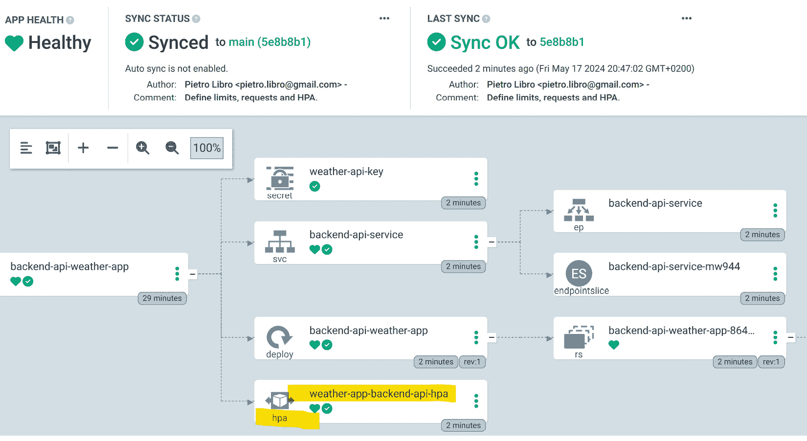

# 第十章：在 Kubernetes 上使用 GitOps 部署真实世界项目

本章将带你进行一次实践之旅，弥合理论知识与实际应用之间的鸿沟。在深入了解设置基于 GitOps 和 Kubernetes 的开发环境的复杂过程时，你将亲身体验在这一创新框架下设计、开发和部署应用程序的过程。本章通过对架构设计、**持续集成和持续交付**（**CI/CD**）流程、应用程序扩展性和安全性的详细指导，旨在帮助你掌握实现这些前沿技术所需的基本技能和见解，帮助你在项目中有效地应用它们。无论你是希望提升组织能力，还是提升个人技术水平，这里提供的全面真实案例将成为任何有志于在实际环境中掌握 GitOps 和 Kubernetes 的人的宝贵资源。

本章将重点关注以下几个关键领域：

+   建立 GitOps 和 Kubernetes 开发环境

+   使用 GitOps 实现 CI/CD

+   为扩展性和效率设计

+   资源管理和扩展性

+   监控和保护你的应用程序

# 技术要求

本章基于你在前面章节中学到的 Git、Kubernetes 以及 GitOps 工具（如**Argo CD**和 Flux CD）的知识。我们将使用一个通过 GitHub 工作流使用 Terraform 部署的**Azure AKS**集群。确保你能够访问 Kubernetes 环境，并且熟悉 CI/CD 原则，以便充分利用本章的练习。

所有必要的代码和资源都已提供在我们的专用 GitHub 仓库的*第十一章*文件夹中：

[`github.com/PacktPublishing/Implementing-GitOps-with-Kubernetes`](https://github.com/PacktPublishing/Implementing-GitOps-with-Kubernetes)

# 建立 GitOps 和 Kubernetes 开发环境

建立一个合适的开发环境对于成功实施 GitOps 实践至关重要。这个环境作为开发和运维团队的支柱，使应用程序能够无缝集成和持续交付。一个配置良好的开发环境确保所有应用程序和基础设施的变更都经过版本控制、可追溯，并与存储在 Git 中的声明性配置对齐。这种开发环境与生产环境之间的一致性减少了错误和部署失败的可能性，从而促进了更加可靠和健壮的交付管道。通过强调从一开始就正确设置的重要性，团队可以充分发挥 GitOps 的潜力，确保自动化过程有效且高效地管理部署和基础设施。

安装和配置 Kubernetes 以支持 GitOps 涉及以一种与 GitOps 工具（如 Flux CD（参见*第四章*中的*Flux 与 Kubernetes 集成*部分））或 Argo CD（参见*第四章*中的*Argo CD 与 Kubernetes 集成*部分））无缝集成的方式来配置 Kubernetes 集群。接下来是一个逐步指南，涵盖了设置过程，确保你的 Kubernetes 环境为 GitOps 工作流做好准备：

1.  安装一个 Kubernetes 集群并选择你的环境。对于学习和开发，考虑使用**K3s**（参见*第二章*中的*探索 K3s 作为轻量级 Kubernetes 发行版*部分）或**minikube**。这两者都适合在本地机器上运行 Kubernetes。对于生产环境或更具可扩展性的环境，考虑使用云解决方案，如**Amazon EKS**、Azure AKS 或 **Google GKE**。要安装 minikube，请参考官方的 minikube 安装指南：[`minikube.sigs.k8s.io`](https://minikube.sigs.k8s.io)。对于在云平台上部署 Kubernetes，请参阅各云提供商提供的具体设置指南。在本章描述的实际场景中，我们将使用 AKS 集群。

1.  验证安装。确保已安装并配置了 `kubectl`，Kubernetes 的命令行工具，确保它可以与集群通信。你可以通过运行以下命令来验证：

    ```
    $ kubectl cluster-info
    ```

    此命令应返回集群的详细信息，确认 Kubernetes 已正常运行：

    ```
    Kubernetes control plane is running at https://127.0.0.1:32769
    CoreDNS is running at https://127.0.0.1:32769/api/v1/namespaces/kube-system/services/kube-dns:dns/proxy
    ```

1.  设置你的命名空间。建议为你的 GitOps 工具创建一个专用的命名空间：

    ```
    $ kubectl create namespace gitops
    ```

1.  设置权限。设置**基于角色的访问控制**（**RBAC**）规则，以确保你的 GitOps 工具具有管理资源所需的权限。大多数 GitOps 工具在其安装指南中都列出了具体的 RBAC 配置。我们将在本章的*为用户和角色管理配置 Kubernetes RBAC*部分看到如何设置 RBAC 的具体示例。

1.  安装你的 GitOps 工具。根据你的偏好，从 Flux CD、Argo CD、Helm 或 Kustomize 等工具中选择。每个工具都有独特的优点和支持的社区。有关上述 GitOps 工具的更多详细信息，请参阅*第四章*中的*流行 GitOps 工具概览*部分。此外，你还可以探索本章中关于*深入了解 Helm 和 Kustomize*、*Argo CD 与 Kubernetes 集成*和*Flux CD 与 Kubernetes 集成*的部分。

1.  设置 Git 仓库。配置 GitOps 工具以跟踪存储 Kubernetes 清单的 Git 仓库。有关指导，请参阅 *第四章* 中的 *使用 Azure DevOps 部署 Kubernetes* 或 *使用 AWS CodePipeline 部署 Kubernetes* 部分。此设置过程包括将工具指向您的仓库，并指定要监控更改的分支和路径。

1.  验证和测试。首先，使用您的 GitOps 工具部署一个简单的应用程序，以确认 Git 仓库中的更改会自动触发 Kubernetes 集群中的部署。通过 GitOps 工具的仪表板或 CLI 监控部署，确保应用程序已按预期部署并运行。通过修改 Git 仓库中的应用程序清单并观察更改是否自动应用，测试更新和回滚。

大部分流水线的要点在前几章中已有详细介绍。它们将在下一部分重新提及，我们将看到如何实现一个真实世界的 CI/CD GitOps 场景。

# 使用 GitOps 实现 CI/CD

为了实现一个真实世界的 CI/CD GitOps 场景，我们需要一个不再使用模拟数据而是使用具体数据的应用程序。

在本节中，我们将为天气应用程序暴露一个后端服务，该服务从一个真实的天气服务（例如 **OpenWeatherMap**，[`openweathermap.org/`](https://openweathermap.org/)）获取数据，并使其公开互联网。

鉴于在本章前一部分中已经完成了设置 GitOps 环境的要求（安装 Kubernetes 集群、选择环境、验证安装以及安装 GitOps 工具），下一步是创建一个新的 GitHub 仓库。例如，您可以创建 `gitops-for-real-world`，并创建一个名为 `Step-01` 的目录。此目录将用于添加后续步骤的代码和文件。

在继续之前，您需要在 `OpenWeatherMap` 服务或您选择的其他类似服务上创建一个免费账户。这类服务通常需要一个令牌来查询其 API，用于身份验证和计费目的。保护该令牌的*机密性*至关重要，切勿共享它。请参阅 `OpenWeatherMap` 文档以创建新令牌。稍后，我们将把此令牌作为 **秘密** 添加到 Kubernetes 集群中。

## 最终目标和实现

为了实现我们的最终目标，本节及其后续章节将演示如何使用 **Python Flask 应用程序**，并将其打包为 **Docker 镜像**。每次提交时，这个镜像都会使用新的标签构建，并在 Azure AKS 集群上部署，该集群由管道使用 Terraform 自动化提供，用于 **基础设施即代码** (**IaC**) 组件。最初，整个部署链——包括 IaC 和应用程序——将完全由我们的 GitHub CI/CD 管道管理。之后，我们将过渡到使用 Argo CD 进行部署，同时保持 CI 过程在 GitHub 工作流内。

最终，为了在我们的服务公开到公共互联网后进行测试，我们将通过 URL 中的查询字符串进行**天气**请求，指定城市，例如 [`public-ip/weather?city=zurich`](http://public-ip/weather?city=zurich)。响应将以 JSON 格式返回，可以直接在浏览器中呈现，或者使用 **curl** 等工具。

我们的管道将作为 GitHub 工作流进行开发，并将按 *图 11.1* 所示进行组成。


图 11.1 – GitHub 工作流管道

## 使用 GitHub Actions 和 Terraform 的 CI/CD 管道

*图 11.1* 中的管道利用 Terraform 进行基础设施管理，并将 Docker 化的应用程序部署到 AKS 集群中，提供了现代 DevOps 实践的一个实际示例。由于管道的代码过长，无法在本章中明确添加为内容，接下来列出了一些需要考虑的重要方面，以便更好地理解。工作流描述包含在存储库的 `.github/workflows/` 目录中的 `gitops-for-real-ci-cd-pipeline.yml` 文件中。

### 工作流触发条件

该管道被配置为在对主分支进行任何推送或拉取请求时触发，有一个例外：仅在 `Step-01/deployment` 目录中的更改不会启动工作流。此预防措施可防止在仅更新 Kubernetes 清单文件时发生冗余运行，从而确保资源的高效使用，并避免在持续部署场景中可能出现的冲突。

### Terraform 计划和应用

工作流以 `terraform-plan` 作业开始。此作业执行几个关键步骤：

1.  **环境设置**：作业开始时会检出存储库，并设置带有 GitHub 密钥安全存储的 Azure CLI 凭据。此步骤确保工作流能够访问 Azure 以管理资源。

    管道中使用的所有密码、令牌和其他敏感信息需要配置为 GitHub Actions 密钥，如 *图 11.2* 所示。


图 11.2 – GitHub 在 Actions 秘密和变量页面上的密钥

1.  `terraform init` 用于准备 Terraform 环境，并在 Azure Blob Storage 中配置 Terraform 状态文件的后端存储。以下代码摘自主管道：

    ```
    - name: Terraform Init
      run: |
        terraform init \
        --backend-config=»resource_group_name=${{ secrets.BACKEND_RESOURCE_GROUP_NAME }}» \
        --backend-config=»storage_account_name=${{ secrets.BACKEND_STORAGE_ACCOUNT_NAME }}» \
        --backend-config=»container_name=${{ secrets.BACKEND_CONTAINER_NAME }}» \
        --backend-config=»key=${{ secrets.BACKEND_KEY }}» \
        --reconfigure
        working-directory: ./Step-01/terraform
        env:
        ARM_CLIENT_ID: ${{ secrets.ARM_CLIENT_ID }}
        ARM_CLIENT_SECRET: ${{ secrets.ARM_CLIENT_SECRET }}
        ARM_SUBSCRIPTION_ID: ${{ secrets.ARM_SUBSCRIPTION_ID }}
        ARM_TENANT_ID: ${{ secrets.ARM_TENANT_ID }}
    ```

1.  `terraform plan`，该计划会自动进行审查，以确定是否有更改需要应用。该计划会保存为 `terraform-apply` 作业。

GitHub 工件

GitHub Actions 中的工件是工作流运行过程中生成的一个文件或文件集合。工件可以包括二进制文件、日志、测试结果或任何其他需要在作业完成后存储的数据。这些工件通常用于存储构建和测试输出，以供调试、部署或在后续步骤或未来运行中进一步处理。GitHub 会在指定时间内存储这些工件，允许在同一工作流中的不同作业之间下载或共享这些工件。该功能通过确保工作流中的一部分输出可以轻松地在其他部分访问和利用，从而促进了有效的 CI/CD 实践，增强了软件开发生命周期中的自动化和连续性。

在规划完成后，`terraform-apply` 作业将已批准的更改应用到基础设施，确保实际状态与在 Terraform 配置中定义的预期状态匹配。由于资源在 Azure 上的配置，这部分可能需要几分钟。在打开 Azure 门户后，最终的配置应与*图 11.3*中所示相似。


图 11.3 – 由 GitHub 工作流自动配置的 Azure 资源

### Docker 镜像构建和推送

与基础设施管理并行，`docker-build-and-push` 作业处理应用程序方面：

1.  **Docker 准备**：该作业使用 QEMU 和 Buildx 设置 Docker 环境，这些工具增强了 Docker 在 CI 环境中的功能。

1.  `Step-01` 目录并将其推送到 Docker Hub，使用 **commit SHA** 进行标记，以确保不可变性和可追溯性，如*图 11.4*所示。


图 11.4 – 一个 Docker 仓库，其中包含带有 SHA 编号标签的构建镜像

### Kubernetes 部署

在 Docker 镜像推送并且基础设施准备就绪后，`deploy-to-kubernetes` 作业继续进行：

1.  使用 Kubernetes 集群凭证的 `kubectl`，确保命令在正确的集群上执行，具体代码如下所示：

    ```
    - name: Update Kubeconfig
      run: az aks get-credentials --resource-group gitops-dev-rg --name gitops-dev-aks --overwrite-existing
    ```

1.  **机密和配置**：接着，它部署应用程序所需的 Kubernetes 机密和配置，如 API 密钥，采用最佳的机密管理实践。以下代码摘自管道：

    ```
    - name: Deploy to Kubernetes
      run: |
        cd ./Step-01/deployment
        kubectl create namespace weather-app-for-real \
           --dry-run=client -o yaml | kubectl apply -f -
        kubectl create secret generic weather-api-key \
           --from-literal=WEATHER_API_KEY=${{ secrets.WEATHER_API_TOKEN }} \
           --namespace weather-app-for-real \
           --dry-run=client -o yaml | kubectl apply -f - command sequence can play a significant role in ensuring that a Kubernetes deployment is idempotent.
    ```

幂等性

在部署资源的上下文中，幂等性意味着多次运行相同的部署命令将导致相同的状态，而不会在初次应用后产生不必要的更改或副作用。

1.  `Step-01/deployment/backend-api-deployment.yaml`)，该文件引用了新构建的 Docker 镜像，确保部署的是应用的最新版本：

    ```
    $ kubectl apply -f backend-api-deployment.yaml
    ```

注意！

如果你想从本地开发访问远程 AKS 集群，你需要登录 Azure 并执行以下命令：`az aks get-credentials --resource-group gitops-real-rg --name gitops-real-aks`

1.  **测试**：与本地开发不同，在这个实际的例子中，我们在部署文件中指定了一个**LoadBalancer**端口，因此 AKS 会自动使用公共 IP 地址将我们的服务暴露到公共互联网，如*图 11.5*所示。


图 11.5 – 用于将 backand-api-service 暴露到公共互联网的公共 IP 地址

1.  在此时，我们可以使用类似于*图 11.6*所示的 URL 查询我们的服务以获取响应：


图 11.6 – 使用实时天气数据查询苏黎世市服务的示例

到目前为止，我们已经获得了一个完全可工作的 CI/CD 管道，将服务暴露到现实世界。我们希望更进一步，通过使用 ArgoCD 将 CI 管道和 CD 管道分开，正如下一节所述。

## 使用 Argo CD 进行持续部署

在现代软件交付的世界里，确保我们的部署实践尽可能可靠和可扩展至关重要。Argo CD，作为一种声明式的 GitOps 持续交付工具，专为 Kubernetes 设计，通过自动化部署过程并将 Git 仓库中定义的目标应用状态与生产环境同步，显著提升了这些方面。

### 向 Argo CD 过渡

在本节中，我们将通过将`deploy-app-to-kubernetes`阶段过渡为`argo-cd-deployment`阶段来发展我们的 GitHub Actions 工作流。我们 GitHub Actions 工作流中的`argo-cd-deployment`阶段封装了以下关键操作：

1.  **Argo CD 设置**：首先，如果 Kubernetes 集群中未安装 Argo CD，工作流将初始化它。这包括设置必要的命名空间，并直接从官方来源应用 Argo CD 安装清单。

1.  **仓库配置**：接下来，工作流将包含 Kubernetes 清单的 Git 仓库添加到 Argo CD。此步骤涉及配置 Argo CD 来监视仓库中的更改，该仓库托管应用的部署定义。

1.  **通过 Argo CD 进行应用部署**：接着，它确保为应用创建并准备好特定的命名空间以供部署。

1.  `argocd_deployment.yaml` 文件定义了 Argo CD 应用程序。该清单指定了 Git 仓库中 Kubernetes 部署清单的路径、修订目标（例如，`branch`）和同步策略。

1.  **同步触发**：可选地，如果需要立即部署，此步骤会触发手动同步，尽管通常 Argo CD 会根据其轮询策略自动检测到变更。

管理停机时间并确保 Argo CD 的连续性

当 Argo CD 发生短暂停机时，主要的影响是 Kubernetes 环境中部署的同步和自动对比过程。在此期间，提交到 Git 仓库的任何更改都不会与 Kubernetes 集群同步，这意味着更新、修复和新功能的部署会被推迟。自动对比过程——即确保 Kubernetes 环境的实际状态与 Git 仓库中指定的期望状态相匹配——也会中断。这意味着，在停机期间发生的任何不一致或配置漂移都不会得到解决，直到 Argo CD 恢复上线。恢复 Argo CD 后，它将自动开始处理并应用在停机期间所做的所有更改。系统将从 Git 获取最新的配置，并进行必要的对比，以使 Kubernetes 集群与仓库中的期望状态保持一致。需要注意的是，运行中的应用程序本身不会受到 Argo CD 停机的直接影响；它们将继续按停机前的配置运行。然而，为了在此类停机期间管理关键更新，团队可能需要执行手动干预，这应该小心处理，以避免 Argo CD 恢复正常运行后出现进一步的问题。建议采用强大的监控和警报系统，以快速检测 Argo CD 的任何问题，并最大限度地减少停机带来的影响。

1.  要查看新工作流的运行效果，我们需要将 `Step-02-ArgoCD-Deployment` 文件夹中 `gitops-for-real-ci-cd-pipeline.yml` 文件的内容替换为 `.github/workflows` 子目录中同名文件的内容。然后，我们必须提交并推送更新的代码，以触发工作流的运行，如*图 11.7*所示：


图 11.7 – 在提交并推送新的工作流定义后触发一个新的工作流运行

在设置过程中自动生成的外部 IP 和管理员密码可以在 `Setup ArgoCD on AKS` 任务的日志中找到，如*图 11.8*所示。请注意：此类信息不应在实际生产环境中公开。这只是本示例范围内的一个快捷方式。


图 11.8 – 包含敏感信息的 AKS 上设置 ArgoCD 任务日志

此时，我们可以通过在首选浏览器中输入[`4.226.41.44/`](https://4.226.41.44/)来登录到已部署实例的 Argo CD 管理员界面（见*图 11.9*）：


图 11.9 – 登录后的 Argo CD 主页，显示 backend-api-weather-app pod 的部署情况

就这样！在这个例子中，我们没有启用**自动同步**，所以我们只需要点击**同步应用**按钮来同步我们的天气应用，如*图 11.10*所示。


图 11.10 – Argo CD 应用已正确同步到 GitHub 仓库

为了测试 Argo CD 的同步过程，尝试将`backend-api-deployment.yaml`文件中的副本数量从`1`更改为`5`（例如），并将更改推送到 GitHub。由于我们指定了以下值，工作流不会被触发：

```
paths-ignore:
- 'Step-01/deployment/**'
```

然而，Argo CD 会注意到不同步的状态，并且需要进行新的同步。现在，我们已经建立并完美运行了 CI/CD 流水线，接下来是介绍下一节中的可扩展性和效率主题。

# 可扩展性和效率设计

在本节中，我们将深入探讨可扩展性和效率的设计。这些特性在现代应用程序的架构中至关重要，以我们的天气应用为例。可扩展性确保应用能够应对增长，无论是用户数量、数据量还是交易频率的增加，而不会影响性能。效率则涉及资源使用的优化，对于降低成本和提高响应速度至关重要。我们将探讨支持可扩展性的架构原则，例如**微服务**和负载均衡，并讨论如何有效管理计算、存储和网络资源。此外，我们还将研究测试可扩展性的工具和策略，以确保架构能够应对现实世界的需求。通过掌握这些元素，你将学会如何设计一个可扩展且高效的架构，这种架构非常适合部署在 Kubernetes 上，提升像我们的天气应用这样的应用的整体性能和可靠性。

## 架构原则

设计可扩展和高效系统的架构原则在现代应用开发中至关重要，尤其是当对性能和可靠性的需求增加时。关键策略包括解耦组件以最小化依赖关系，从而便于维护和扩展。强调无状态性允许组件的复制和分布，从而增强应用的韧性和响应能力。

负载均衡对于将传入的网络负载均匀分配到多个系统至关重要，防止任何单一服务器过载，并提高应用的可用性。横向扩展，即通过增加更多实例而不是为单一实例增加资源，是一种更具成本效益的方式，并且提高了容错能力。

数据库分片将数据划分为更小、更易管理的部分，尤其对大数据集或高吞吐量的需求非常有益。分片有助于提升性能。缓存常访问的数据可以通过直接处理常见请求而不进行冗余数据处理，减少延迟并降低后端负载。

异步处理任务通过以非阻塞方式处理操作，提升了吞吐量和用户体验。采用微服务架构允许每个服务独立部署、扩展和管理。这种模块化方法不仅提高了性能，而且随着应用的演变简化了管理，使其非常适合由如 Kubernetes 这样的平台管理的云原生环境。尽管提到了微服务架构，但它不会是本章讨论的示例的一部分。

微服务架构

微服务架构是一种将应用结构化为一组松耦合服务的架构风格，每个服务实现特定的业务功能。这种方法使开发者能够独立构建和部署服务，从而提高灵活性并加速开发周期。通过将应用拆解为小的、可管理的组件，微服务使得更精细的扩展和高效的资源利用成为可能。每个服务都可以独立开发、部署和扩展，通常使用最适合任务的不同编程语言和技术。这种模块化提高了故障隔离，使得在不影响整个系统的情况下，更容易识别和修复问题。此外，微服务促进了 CI/CD 实践，推动了更加敏捷和韧性的开发过程。总体来说，微服务架构促进了一个更强大、更具可扩展性的应用环境，能够适应不断变化的业务需求和技术进步。

## 资源管理

有效的资源管理在应用设计和操作中至关重要，特别是在那些旨在最大化效率和性能，同时最小化成本的环境中。管理计算、存储和网络资源需要精心规划和协调，以确保应用的每个组件都拥有足够的资源，能够在没有浪费的情况下发挥最佳性能：

+   **计算管理**：涉及为满足应用需求而提供适当数量的 CPU 和内存资源。像**自动扩展**和负载均衡等技术有助于将计算工作负载均匀分配到可用基础设施上。

+   **存储管理**：确保数据存储资源得以高效分配，同时考虑数据的可访问性和冗余性。这包括选择适当的存储类型和实施数据分区策略，以提高性能和可扩展性。

+   **网络管理**：重点在于高效配置网络资源，以确保应用组件之间的数据传输快速且安全。适当的网络配置能够减少延迟，防止瓶颈，这对于实时数据处理和交付至关重要。

这些资源管理实践共同确保应用能够有效扩展，并在不同的操作条件下保持稳健。实施资源管理策略还需要监控和分析资源使用情况，以做出明智的调整和改进决策，确保资源以最有效的方式被利用。

## 可扩展性测试

可扩展性测试对于确保应用在预期负载下能够良好运行，并且能够高效处理用户、事务和数据的增长至关重要。可扩展性测试涉及多种技术，模拟不同的环境和系统压力，旨在在问题影响用户之前发现潜在问题：

+   **负载测试**：模拟特定预期数量的并发用户或事务，以评估应用在正常条件下的表现。

+   **压力测试**：将应用推向其正常操作极限，以发现其最大容量并了解其在极端条件下的行为。

+   **浸泡测试**：在重负载下长时间运行应用，以发现如内存泄漏或性能逐渐下降等问题。

+   **激增测试**：检查应用在面对突如其来的大量流量时的处理能力。

+   **可扩展性测试**：通过逐步增加负载并观察额外资源如何影响应用的容量，测试应用是否能够根据需求进行扩展或缩减。

这些测试通常使用自动化测试工具，并在阶段性环境中进行，这些环境非常接近真实的流量模式。诸如**Apache JMeter**、**LoadRunner**和**Gatling**等工具，以及**AWS CloudWatch**和**Google Cloud Monitoring**等云服务，通常用于促进这些测试。通过在开发和部署阶段进行定期的可扩展性测试，团队可以确保他们的应用程序是强健的、可扩展的，并能够应对真实世界的操作需求。

# 资源管理与可扩展性

在本节中，我们将继续使用天气应用程序，看看资源管理、水平扩展和可扩展性测试在实际场景中的运作方式。我们可以从资源使用优化开始。

## 优化资源使用

为了优化 Kubernetes 中的资源使用，设置资源请求和限制至关重要。这些设置确保 Pod 获得正确数量的 CPU 和内存资源以正常运行，同时也防止任何单个应用程序消耗过多的集群资源，从而影响其他应用程序：

+   **Requests**：这是 Kubernetes 为容器保证的资源数量。如果容器所需的资源超过其请求并且节点上有足够的资源，它可以消耗更多的资源。

+   **Limits**：这是容器可以使用的最大资源数量。如果容器尝试超过此限制，系统将限制其 CPU 使用。如果容器超过其内存限制，Kubernetes 可能会终止它，具体情况取决于当时的情况。

为了测试请求和限制的使用，我们可以尝试更新`Step-01/deployment/backend-api-deployment.yaml`文件，在`key:` `WEATHER_API_KEY row`之后立即添加以下代码块：

```
…         key: WEATHER_API_KEY
resources:
          requests:
            cpu: «100m»
            memory: "100Mi"
          limits:
            cpu: «150m»
            memory: "150Mi"
```

前面提到的代码块指定了容器的资源请求和限制。以下是每行代码的含义：

+   `requests`：

    +   `cpu: "100m"`：这请求容器使用 100 毫核（1,000 毫核等于 1 个 CPU 核心）

    +   `memory: "100Mi"`：这请求 100 MiB 的内存

+   `limits`：

    +   `cpu: "150m"`：这设置了容器 CPU 使用的 150 毫核限制

    +   `memory: "150Mi"`：这设置了 150 MiB 的内存限制

现在我们已经定义了请求和限制，在下一节中，我们将看到如何在下一节中实现**水平 Pod 自动扩展器**（**HPA**）。

## 实现 HPA

在 Kubernetes 中实现 HPA 是一种有效的方法，可以根据观察到的 CPU 利用率或其他选定的度量标准（如内存使用或自定义指标）自动扩展部署、复制控制器或副本集中的 Pod 副本数量。以下是设置 HPA 的逐步指南：

1.  确保 **Metrics Server** 已在集群中安装，该服务器从 Kubelets 收集资源指标，并通过 Kubernetes 的 Metrics API 将其暴露。这个组件对于 HPA 做出扩缩容决策至关重要。我们可以使用以下命令进行安装：

    ```
    $ az aks update --enable-azure-monitor-metrics --name gitops-real-aks --resource-group gitops-for-real-rg
    ```

1.  设置过程将需要几分钟时间。完成后，请使用以下命令验证安装是否正确：

    ```
    $ kubectl get deployment metrics-server -n kube-system
    ```

    该命令应返回部署详情，确认 Metrics Server 已启动并运行：

    ```
    NAME            READY   UP-TO-DATE   AVAILABLE   AGE
    metrics-server  2/2     2            2           3h37m
    ```

1.  创建一个基于 CPU 利用率进行扩缩容的 HPA：

    ```
    apiVersion: autoscaling/v1
    kind: HorizontalPodAutoscaler
    metadata:
      name: weather-app-backend-api-hpa
      namespace: weather-app-for-real
    spec:
      scaleTargetRef:
        apiVersion: apps/v1
        kind: Deployment
        name: backend-api-weather-app
      minReplicas: 1
      maxReplicas: 5
      targetCPUUtilizationPercentage: 5
    ```

    该 HPA 配置为保持 pod 数量在 `1` 到 `5` 之间，当 CPU 利用率达到 50% 时进行扩缩容。

1.  在 `Step-01/deployment` 文件夹中创建一个新的 `hpa.yaml` 文件，内容如我们所描述。提交并推送代码，然后等待 Argo CD 应用程序同步，或者如果自动同步关闭，则强制同步。



图 11.11– Argo CD 应用程序与 HPA 配置同步

1.  使用以下命令监控你的 HPA 状态和效果：

    ```
    $ kubectl get hpa -w --namespace weather-app-for-real
    ```

    这将显示当前的副本数，并显示 HPA 是否正在根据当前的 CPU 利用率对比设置目标进行扩缩容。

## 测试可扩展性——一个示例

现在我们已经实现了 HPA 并设置了监控，接下来的步骤是观察 Kubernetes 如何根据 CPU 利用率变化动态地扩缩容 pod 数量。通过模拟不同的负载，我们可以看到 HPA 如何调整 pod 数量以保持最佳性能。这个过程确保我们的应用能够高效扩展，自动应对需求的增加或减少，而无需人工干预。理解这一行为对于优化 Kubernetes 环境中的资源管理和成本效益至关重要。以下是逐步测试场景：

1.  创建一个用于测试 HPA 的 Bash 脚本。使用 `curl` 命令对暴露的天气服务发起请求，使用不同的城市，并在查询字符串中加入随机值以避免缓存。你可以参考本章附带的 `hpa-testing.sh` 脚本。在执行脚本之前，请更新 `$baseUrl`，使其与天气服务的 URL 匹配。具体如下所示：

    ```
    # Base URL of your weather service
    baseUrl="http://20.250.198.208/weather"
    ```

1.  运行该 Bash 脚本：

    1.  打开一个新的终端，并使用以下命令使脚本可执行：

    ```
    TARGET column should increase. To speed up the testing scenario and see the number of pods increase faster, execute another instance of the same script in another terminal.
    ```

1.  检查 HPA 状态（参见本章 *实现 HPA* 部分的第六点）。使用以下命令检查 HPA 状态：

    ```
    $ kubectl get hpa -w --namespace weather-app-for-real
    ```

    你应该看到当前的副本数以及它们基于 CPU 利用率的扩缩容活动：

    ```
    NAME                TARGETS     MINPODS      MAXPODS       REPLICAS
    weather-app-…       cpu: <unk>%/5%  1     5             1
    weather-app-…    cpu: 5%/5%  1            5             1
    weather-app-…    cpu: 20%/5% 1            5             4
    …
    weather-app-…    cpu: 3%/5%  1         5             4
    weather-app-…    cpu: 1%/5%    1             5             4
    ```

HPA 监控部署的 CPU 利用率，并根据需要调整 pod 数量，以确保最佳性能。

最初，CPU 使用率标记为`<unknown>`，这可能是由于指标不可用或仍在初始化。当使用率稳定在 5% 时，且与 HPA 中设置的目标匹配，副本数量没有变化，仍保持为一个。当 CPU 使用率增加到 20%——远高于 5% 的目标时，HPA 通过将副本数量从`1`扩展到`4`来应对增加的负载。

这种较高水平的资源使用持续了一段时间，副本数保持在`4`。然而，当使用率显著下降至 3% 并进一步下降到 1% 时，HPA 最初并未立即缩减副本数，这可能是由于稳定性设置防止了 Pod 数量的波动。最终，随着低使用率的持续，HPA 将 Pod 数量缩减回`1`。

该序列展示了 HPA 根据实时数据动态扩展应用资源的能力，从而确保部署能够高效地响应工作负载变化。这种动态调整有助于有效管理资源，保持应用响应能力并优化运营成本。HPA 对 CPU 使用率变化的响应示例了 Kubernetes 如何自动调整扩展，以保持性能和资源效率，而无需人工干预。

在确保资源管理和可扩展性的同时，关注监控和保护应用程序同样重要。在接下来的部分，我们将探讨运营卓越的这些关键方面。

# 监控和保护你的应用程序

软件部署和管理中的运营卓越是任何技术驱动型组织成功的关键因素。实现这一卓越的关键在于监控、扩展和安全，这三者作为基础支柱，确保了应用程序在生产环境中的平稳高效运行。

监控至关重要，因为它提供了实时了解应用程序和系统行为所需的可见性。有效的监控策略有助于识别性能瓶颈、预测系统故障，并收集有价值的数据，以支持决策过程。这种持续的监督使团队能够主动响应问题，在它们影响用户体验或导致更大干扰之前解决问题。

安全实践对于保护敏感数据和防止基础设施受到入侵和攻击至关重要。在网络威胁迅速演变的时代，确保采取强有力的安全措施是不可谈判的。安全协议有助于维护与客户的信任，遵守监管要求，并避免与数据泄露相关的财务和声誉损害。

监控、扩展和安全构成了运营卓越的支柱，支持一个稳定、高效、安全的环境，用于部署和管理应用程序。掌握这些方面的组织更能有效地利用技术推动业务成功，确保在不断变化的数字环境中持续为用户创造价值。

## 监控

Grafana 和 Prometheus 是广泛使用的强大工具，在监控和可观察性领域中具有重要价值。它们对于管理在动态环境中部署的云原生应用（如 Kubernetes）尤其有用：

+   **Prometheus**：Prometheus 是一个开源的监控系统，具有强大的查询语言。它将度量值作为时间序列数据收集和存储，这意味着每个度量值都会记录其准确的时间。Prometheus 在高可用性环境中记录实时度量值非常有效。它支持通过拉取模型从监控服务中获取数据，允许它按照指定的间隔主动抓取来自注册目标的数据。然后可以查询和分析这些数据，以监控应用程序的健康状况和性能。

+   **Grafana**：Grafana 是一个开源的分析和可视化平台，能够与多种数据源（包括 Prometheus）无缝集成。Grafana 用于创建全面的仪表板，提供度量数据的可视化。这些仪表板帮助开发人员和运维团队通过可视化的方式解读复杂数据，理解应用程序的行为和资源使用，从而更容易发现趋势、模式和潜在问题。

结合使用，Prometheus 和 Grafana 提供了强大的数据收集、存储和可视化组合，增强了观察系统行为、排查问题以及确保系统性能与用户期望和业务目标一致的能力。这个组合在 DevOps 环境中尤为有效，持续监控和反馈回路对软件开发和部署生命周期至关重要。

## 设置 Prometheus 和 Grafana

以下是设置 Prometheus 和 Grafana 在 AKS 集群上的必要步骤：

1.  添加 Prometheus 和 Grafana Helm chart 仓库：

    ```
    $ helm repo add prometheus-community https://prometheus-community.github.io/helm-charts
    ```

1.  更新 Helm 仓库。确保我们使用的是最新版本：

    ```
    gitops-real-monitoring:

    ```

    $ helm install prometheus \

    prometheus-community/kube-prometheus-stack \

    --namespace gitops-real-monitoring \

    --create-namespace

    ```

    ```

1.  输入以下命令检查整个部署：

    ```
    LoadBalancer service’s type, to log in to Grafana, we need to execute a port-forward:

    ```

    admin 用户名和为 prom-operator 定义的密码。

    ```

    ```

1.  使用以下命令暴露 Prometheus：

    ```
    $ kubectl port-forward svc/prometheus-kube-prometheus-prometheus -n gitops-real-monitoring 9001:9090
    ```

1.  登录后，你应该能够看到 Grafana 的主页。点击**仪表板**菜单项，如*图 11.12*所示：


图 11.12 – Grafana 首页，突出显示仪表板菜单项

1.  点击`weather-app-for-real`。你将看到一些关于正在运行的 Pods 的有趣指标，如*图 11.13*所示。


图 11.13 – `backend-api-weather` Pod 的 CPU、内存及其他指标

此时，你已经正确并成功地设置了 Grafana 和 Prometheus。现在，你可以查看关于`backend-api-weather-app`使用情况的有趣统计数据，这些数据可以用来微调资源限制和请求，正如本章的*优化资源使用*部分所讨论的那样。在接下来的部分，我们将介绍 Kubernetes 管理中的另一个重要方面：Kubernetes 安全性。

## 理解 Kubernetes 安全性

Kubernetes 虽然强大且可扩展，但也带来了独特的安全挑战，这些挑战源于其动态和分布式的特性。保护 Kubernetes 集群涉及保护基础设施、运行其上的应用程序以及它所处理的数据。鉴于 Kubernetes 环境的复杂性，安全性必须集成到集群的每一层。Kubernetes 安全的关键方面包括以下几点：

+   **身份验证与授权**：确保只有经过验证的用户才能访问集群，方法包括证书和令牌等。它还通过 RBAC 和**基于属性的访问控制**（**ABAC**）等机制控制用户的操作。

+   **API 安全性**：保护 Kubernetes API 服务器（它充当集群的中央控制单元）至关重要。保护 API 访问包括使用 SSL/TLS 加密、API 请求审计和通过网络策略限制 IP 访问。

+   **网络安全**：强制执行控制 Pod 与外部网络之间流量的政策，有助于防止未经授权的访问，并限制集群内横向移动的潜力。

+   **Pod 安全准入**：这是一个 Kubernetes 准入控制器，在 Pod 创建时强制执行安全设置，使用预定义的安全配置文件（**特权**、**基准**和**受限**）确保符合最佳安全实践并防止权限升级。

+   **秘密管理**：Kubernetes 使用秘密来管理敏感数据（如密码和令牌）。正确处理和保护这些秘密，包括静态和传输中的加密，对于保护敏感信息至关重要。

分层安全方法的重要性

鉴于 Kubernetes 的复杂性，单一的安全措施通常不足以应对威胁。一个包含网络分段、威胁检测、安全访问控制和持续漏洞管理的分层安全方法对于保护 Kubernetes 环境免受威胁至关重要。

在接下来的部分，我们将看到一个实际示例，展示如何使用 RBAC 管理对特定命名空间中天气应用资源的访问。

### 配置 Kubernetes RBAC 进行用户和角色管理

这是配置天气应用 RBAC 的逐步指南：

1.  定义一个角色，指定管理与天气应用相关的特定资源（例如部署、服务和 Pod）所需的权限，范围是在指定命名空间内。以下是 `weather-app-manager` 角色的定义：

    ```
    apiVersion: rbac.authorization.k8s.io/v1
    kind: Role
    metadata:
      namespace: weather-app-for-real
      name: weather-app-manager
    rules:
    - apiGroups: ["", "apps"]
      resources: ["deployments", "replicasets", "pods", "services"]
    weather-app-user role:

    ```

    apiVersion: rbac.authorization.k8s.io/v1

    类型：Role

    元数据：

    命名空间：weather-app-for-real

    名称：weather-app-user

    规则：

    - apiGroups: ["", "apps"]

    资源：["pods", "services"]

    动作：RoleBinding 资源将指定的角色授予用户。此绑定将 `weather-app-manager` 角色应用于名为 `weather-app-user` 的用户：

    ```
    apiVersion: rbac.authorization.k8s.io/v1
    kind: RoleBinding
    metadata:
      name: weather-app-manager-binding
      namespace: weather-app-for-real
    subjects:
    - kind: User
      name: weather-app-user
      apiGroup: rbac.authorization.k8s.io
    roleRef:
      kind: Role
      name: weather-app-manager
      apiGroup: rbac.authorization.k8s.io
    ```

    ```

    ```

1.  创建另一个 `RoleBinding` 资源，将 `weather-app-user` 角色授予名为 `weather-app-operator` 的用户：

    ```
    apiVersion: rbac.authorization.k8s.io/v1
    kind: RoleBinding
    metadata:
      name: weather-app-operator-binding
      namespace: weather-app-for-real
    subjects:
    - kind: User
      name: weather-app-operator
      apiGroup: rbac.authorization.k8s.io
    roleRef:
      kind: Role
      name: weather-app-operator
      apiGroup: rbac.authorization.k8s.io
    ```

1.  将 YAML 文件移动到 `Step-01/deployment` 文件夹，推送更改到 GitHub，并同步 Argo CD 应用程序。

1.  使用 `kubectl auth` `can-i` 命令，验证 `weather-app-user` 和 `weather-app-operator` 用户是否具备必要的权限：

    ```
    $ kubectl auth can-i delete pods --as weather-app-operator -n weather-app-for-real
    $ kubectl auth can-i delete pods --as weather-app-manager -n weather-app-for-real
    ```

    预期的输出应该如下所示：

    ```
    no
    yes
    ```

1.  我们可以使用以下命令列出命名空间中的所有角色和角色绑定，或列出影响用户的集群角色：

    ```
    $ kubectl get rolebindings,roles,clusterrolebindings,clusterroles --all-namespaces -o yaml
    ```

作为参考，本章附带的代码库中的 `Step-03-Security` 目录包含了迄今为止所描述的角色和角色绑定定义的 YAML 文件。

小心！

为避免因 Azure 资源而产生意外费用，请记得销毁任何不需要的 Azure 提供的资源。

本部分结束了我们对实际 GitOps 流水线和部署的探讨。虽然一本书可能不足以深入探讨 GitOps 与 Kubernetes、安全性和部署的每个方面，但我们相信，到目前为止所覆盖的章节提供了一个全面的概述。它们为设置有效的 GitOps 流水线并应用于未来的 Kubernetes 项目提供了宝贵的见解。

# 总结

本章提供了一个关于如何在 Kubernetes 上使用 GitOps 部署真实世界项目的综合指南。通过遵循详细的指示和示例，你学会了如何设置 GitOps 和 Kubernetes 开发环境、实现 CI/CD 流程、进行可扩展性和高效性的设计、管理资源并保护应用程序。这些实践知识使你掌握了在项目中有效应用这些前沿技术的技能，增强了你的组织能力和个人技术专长。

由于你已经在 Kubernetes 上使用 GitOps 部署和管理应用程序打下了坚实的基础，下一章将深入探讨 GitOps 的可观察性，提供监控和深入了解应用程序性能与健康的关键策略。

# 第四部分：通过 GitOps 最佳实践实现运营卓越

在本部分中，你将专注于通过 GitOps 中的最佳实践实现运营卓越。你将学习集成可观察性、增强安全性、管理财务运营以及为 GitOps 中的未来趋势做好准备。本节旨在提供一份全面的指南，以保持高标准的运营效率和安全性，同时考虑到可持续性和财务因素，确保你的 GitOps 实践既前沿又可持续。

本部分包括以下章节：

+   [*第十二章*，GitOps 中的可观察性

+   *第十三章*，GitOps 中的安全性

+   *第十三章*，FinOps、可持续性、AI 和 GitOps 的未来趋势
