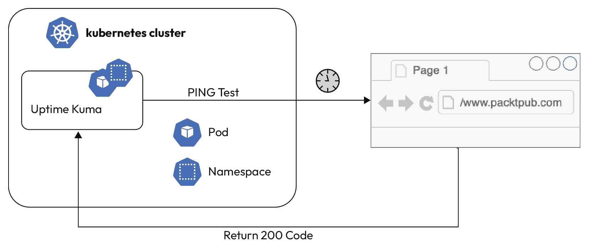

# 第十一章：GitOps 中的可观察性

欢迎来到通过**GitOps**实践深入探索在 Kubernetes 环境中集成可观察性的专题。随着云原生应用的复杂性和规模不断增长，能够观察、理解并应对其行为变得愈发重要。本章旨在弥合传统操作方法与 GitOps 的动态自动化世界之间的鸿沟，提供一个通向更加可靠、响应迅速和高效的系统的路径。

本次旅程的核心是将**站点可靠性工程**（**SRE**）原则与 GitOps 框架相融合。GitOps 是一个在 DevOps 社区中迅速崛起的术语，它利用 Git 作为声明式基础设施和应用程序的唯一真实来源。通过应用 GitOps，我们不仅可以自动化和简化部署流程，还能增强 Kubernetes 环境的可观察性和可管理性。

本章深入探讨了**GitOps**范式中**可观察性**的核心概念，区分了内部和外部可观察性，以便全面理解系统状态。内部可观察性通过**指标**、**日志**和**追踪**来揭示系统内部的工作原理，而外部可观察性则关注系统外部的体验，如用户互动和外部依赖。

**SLO 驱动**的性能管理被赋予了显著的重视。**服务水平目标**（**SLOs**）作为衡量性能和可靠性的量化标准，指导着我们在系统优化和改进方面的努力。结合**DevOps 研究与评估**（**DORA**）指标——部署频率、变更的交付时间、变更失败率和恢复服务的时间——这一方法为评估和提升 GitOps 实践的有效性提供了一个强有力的框架。

此外，本章介绍了分布式追踪的概念，这是理解请求在微服务架构中流动的关键组件。在 GitOps 工作流中实施分布式追踪，借助如**Linkerd**等工具，可以深入了解系统组件之间的互动和依赖关系，帮助快速诊断和解决问题。

最后，我们讨论了使用如**OpenTelemetry**等前沿工具来设置监控和报警系统。这一设置对于主动管理系统至关重要，使团队能够在问题升级为更大问题之前及时发现并应对异常。

本章主要讨论理论和思路，建议从头到尾阅读。读完后，你将能够将这些思路以特别的方式结合起来，并通过一个真实的例子亲自尝试。

开始阅读这篇中级 GitOps 可观察性指南，你正在迈向掌握保持高度可观察、性能优越、可靠的云原生应用程序的艺术与科学的一步。让我们深入探讨，释放 Kubernetes 部署的全部潜力。

因此，本章涵盖了以下主要主题：

+   探索 GitOps 和 Kubernetes 的 SRE 基础

+   理解内部与外部可观察性的区别

+   探索基于 SLO 的多阶段性能与 DORA

+   在 GitOps 中使用 Linkerd 实现分布式追踪

+   使用 Uptime Kuma 和 OpenTelemetry 等工具在 GitOps 中实现监控

+   在 GitOps 框架中查看告警策略

+   使用 GitOps 扩展可观察性

# 探索 GitOps 和 Kubernetes 的 SRE 基础

在不断发展的云原生应用程序领域，将 SRE 原则与 GitOps 和 Kubernetes 相结合，代表了向操作卓越迈出的重要一步。本节旨在提供这些基础概念的简要概述，帮助你掌握如何在 GitOps 工作流和 Kubernetes 环境中有效应用 SRE 实践。

## SRE 与 GitOps 的交集

SRE 是一门将软件工程的各个方面融入 IT 运维领域的学科。SRE 的核心理念是将运维视为一个软件问题，专注于自动化和优化系统的可靠性和性能。Google 推出 SRE 是为了维持具有高可用性和高性能目标的大规模服务。其关键原则包括定义明确的 SLO，减少组织之间的壁垒，拥抱风险，并自动化手动任务。

GitOps 是一种将 Git 版本控制系统应用于管理基础设施和应用配置的范式。它强调自动化、不变性和声明性规范，使其成为实现 SRE 实践的理想框架。GitOps 使团队能够将软件开发原则，如**代码审查**、**版本控制**和**持续集成/持续部署**（**CI/CD**）应用于基础设施管理，确保一致性、可靠性和速度。

## Kubernetes 环境中的 SRE 原则

Kubernetes 是一个开源平台，用于自动化应用容器的部署、扩展和操作，它通过提供一个动态和可扩展的环境来管理容器化应用程序，从而补充了 GitOps 方法。

通过 GitOps 将 SRE 原则集成到 Kubernetes 中涉及几个关键实践：

+   **自动化部署和扩展**：利用 GitOps 自动化 Kubernetes 资源和应用程序的部署，确保它们符合预定义的 SLO。根据流量模式或系统负载自动化扩展决策，帮助保持性能和可靠性。

+   **错误预算与风险管理**：将错误预算定义为 SLO 的一部分，以平衡变更速率与系统稳定性。GitOps 可以通过根据错误预算的消耗自动回滚或部署程序来帮助执行这些预算。

+   **监控与可观察性**：实现全面的监控与可观察性框架，以跟踪服务的健康状况。Kubernetes 提供了内置的工具，如用于监控的 Prometheus 和用于可视化的 Grafana，可以集成到你的 GitOps 管道中，实现实时洞察和警报。

+   **事件管理**：在你的 GitOps 工作流中自动化事件响应。利用 Kubernetes 的自愈功能，如自动重启失败的容器和滚动更新，来最小化停机时间并保持服务可用性。

将 SRE 原则与 GitOps 和 Kubernetes 相结合，提供了一种强大的方法来管理云原生应用程序。通过专注于自动化、监控和可靠性，团队可以实现更高效和更高性能的水平。这些基础知识为掌握现代 IT 操作的复杂性奠定了基础，使你能够在不断变化的技术环境中构建和维护具有韧性和可扩展性的系统。

在下一节中，我们将探讨内部可观察性与外部可观察性之间的区别，以及如何通过平衡这两种可观察性来实现系统性能的最佳状态。

# 理解内部（白盒）与外部（黑盒）可观察性的区别

理解内部可观察性与外部可观察性之间的细微差别，对于有效管理和优化云原生应用程序至关重要。这一区分指导我们如何监控和解读通过 GitOps 实践在 Kubernetes 环境中部署的系统行为。在这里，我们深入探讨了什么构成了内部和外部可观察性，它们各自的角色，以及如何利用这两者实现对系统的全面*健康*和*性能*的视角。

## 内部或白盒可观察性的解释

**内部可观察性** 专注于从系统内部生成的指标、日志和追踪。这类似于在汽车运行时检查引擎和其他组件的健康状况与性能。在 Kubernetes 和 GitOps 的背景下，内部可观察性涉及以下内容：

+   **指标**：表示系统在任何给定时刻状态的数值数据。这可能包括 CPU 使用率、内存消耗、网络 I/O 等。

+   **日志**：记录系统中发生的事件的文本记录。日志对于调试问题和理解导致事件发生的顺序至关重要。

+   **追踪**：有关请求在系统中流动的详细信息，突出显示不同组件如何交互，以及瓶颈或故障发生的位置。

为了明确在此上下文中“*内部*”的含义，创建了 *图 12**.1*。然而，在详细解释图表之前，应该先解释框架。本章并不是要解释 OpenTelemetry 等工具（请参见本章末尾的[*1*]“进一步阅读”部分）、**Grafana Loki** [*2*]、**Prometheus** [*3*] 或 **Jaeger** [*4*]。也不是要详细阐述 OpenTelemetry 的工作原理及最佳配置方法——这将需要一章甚至一本专门的书。稍后将在本章中概述 OpenTelemetry 的基本功能，以及 GitOps 的必要背景。因此，我们将 *图 12**.1* 视为一个黑箱，专注于 Kubernetes 集群中的发生的事件，以及内部可观测性与其之间的关系。

图 12.1：使用 OpenTelemetry 的内部可观测性

重要提示 – 日志格式

为了确保收集到的系统和应用日志（*图 12**.1*）能够有效地利用，它们必须采用标准化和结构化的格式。这个格式应该能够便于提取和分析相关信息。分析后的数据可以转化为具体的 SLO（服务水平目标），帮助监控和确保服务的性能与可靠性。

以下是作为 *图 12**.1* 中终端的工具的简要分类：

+   **OpenTelemetry** 是一个统一的可观测性框架，用于收集、处理和导出遥测数据（日志、指标和追踪数据），帮助理解软件的性能和行为。

+   **Grafana Loki** 是一个日志聚合系统，经过优化，能够高效地存储和查询大量日志数据，并与 Grafana 无缝集成，进行可视化展示。

+   **Prometheus** 是一个开源监控系统，拥有强大的查询语言，专为在时间序列数据库中记录实时指标而设计。

+   **Jaeger** 是一个分布式追踪系统，允许你监控和排查复杂分布式系统中的事务。

在我们的示例中，一切都运行在 Kubernetes 集群中。例如，我们有一个 web 应用，如在线商店，它会生成应用日志，例如用户登录记录，系统日志，如意外关机记录，指标数据，如单个容器的 CPU 和内存使用情况，以及追踪数据，映射请求在应用组件中的流转路径（*1* 在 *图 12**.1* 中）。

然后，**OpenTelemetry Collector**（*2* 在 *图 12**.1* 中）收集指标、日志和追踪数据，并通过相关数据如时间戳、服务名称和环境详情进行增强。随后，Collector 中的一部分导出器将日志、指标和追踪数据提供给适当的终端（*3* 在 *图 12**.1* 中）。

例如，日志被推送到 Grafana Loki，Grafana 可以将其用作数据库。指标被推送到 Prometheus，它也可以作为 Grafana 的数据库。追踪数据被推送到 Jaeger，Jaeger 同样可以作为 Grafana 的数据库。这使得可以在 Grafana 中构建可观测性仪表板和警报，从而提供对系统性能和健康状况的全面洞察。

当然，也可以争辩说，节点可以是全球分布式的，日志的收集也可以跨分布式集群进行，等等。

然而，这里需要理解的关键是，*内部*指的是运行节点上的 Pod 生成日志、指标和追踪数据。

我希望到此为止，*内部*的含义已经变得清晰，并且所有内容都涉及到节点层面的系统，或者是写入节点上的应用日志，或者是节点之间通过网络覆盖层传输数据包（服务网格）的网络层面。

## 外部或黑盒可观测性定义

**外部可观测性**，另一方面，关注的是从外部者的角度理解系统，主要关注最终用户的体验。它衡量系统的输出以及系统内部的变化如何影响这些输出。关键方面包括以下内容：

+   **用户体验指标**：这些指标从用户的角度衡量应用程序的响应能力和可靠性，如页面加载时间、交易完成率和错误率。

+   **合成监控**：通过模拟用户与应用程序的交互来测试和衡量其在全球各地的性能和可用性。

+   **依赖检查**：监控应用程序所依赖的外部服务的健康状况和性能。这有助于确定系统中的问题是否源自外部依赖。

本节重点讨论外部监控。为了更好地可视化，我们使用一个名为 Uptime Kuma[*5*]的服务，如*图 12.2*所示。例如，它运行在 Kubernetes 集群上，并通过一个可在互联网上访问的 URL 监控 Web 应用，如在线商店。为了更好地说明外部方面，我们使用 `packthub` 网站作为示例。

获取外部可观测性意味着使用系统范围的度量标准，这些度量标准并不是我们应用程序核心功能的一部分。这包括监控外部服务和第三方组件，如网络和 CPU 使用情况。例如，在 Kubernetes 集群中，同一命名空间中的内部服务可以直接进行监控。或者，在不同的命名空间中，也可以通过内部 DNS 名称进行监控。这种方法并不在节点的系统层面上运作，而是通过在覆盖网络中使用服务网格与 kube-proxy 进行允许的访问。

重要说明

Uptime Kuma 是一款自托管的监控工具，可以在 Kubernetes 集群中运行，监控像 Web 应用程序这样的服务。通过监控互联网可访问的 URL，如在线商店，它从外部视角提供关于这些服务的正常运行时间和性能的洞察。这种外部监控不仅仅是监控节点级别的系统指标，还能通过 Kubernetes 网络模型和服务网格，通过内部 DNS 名称观察跨命名空间的服务。

在*图 12.2*中，设置了一个简单的*HTTP(s)*检查，期望返回`200`–`299`代码。这允许对站点进行外部监控，并在站点停机、证书到期或响应时间增加时设置警报。

图 12.2：使用 Uptime Kuma 的外部可观测性

在*图 12.3*中，你可以看到正常运行时间为 100%。此外，你还可以看到证书何时过期以及响应时间或平均响应时间。

图 12.3：使用 Uptime Kuma 的外部可观测性 – 仪表板第一部分

仪表板的第二部分（*图 12.4*）显示了特定时间间隔内的响应时间，以及当前的`200`代码。

图 12.4：使用 Uptime Kuma 的外部可观测性 – 仪表板第二部分

此时，应该已经澄清了*外部*的含义，以及如何借助像 Uptime Kuma 这样的工具来实现这一点。这使得可以确定**服务级别协议**（**SLA**），根据紧急程度或合同的不同，SLA 可能极其重要。理解这一点并配合警报是非常关键的。

## 平衡内部和外部可观测性

为了实现最佳的系统性能和可靠性，平衡内部和外部可观测性是至关重要的。内部可观测性使你能够诊断并解决基础设施和应用程序中的问题，而外部可观测性则确保这些修复能转化为更好的用户体验。将 GitOps 实践集成到 Kubernetes 中，通过自动化部署和管理可观测性工具和实践，增强了这种平衡：

+   **在 GitOps 中实施可观测性**：使用 Git 仓库定义你的可观测性堆栈，确保监控、日志记录和追踪工具在所有环境中被一致地自动部署和配置。

+   **自动化反馈回路**：建立自动化反馈回路，将可观测性数据集成到你的 GitOps 工作流中。这可以帮助自动回滚对系统性能或用户体验产生负面影响的更改。

总之，掌握内部与外部可观察性之间的相互作用是保持和优化云原生应用程序的关键。通过利用这两个视角，团队可以确保其系统不仅在内部运行顺利，而且能够为用户提供期望的结果和体验。将这些可观察性实践融入到 GitOps 和 Kubernetes 策略中，能够实现一种更为主动、数据驱动的系统管理和改进方法。

下一节将介绍可以收集的有用指标，以便获得跨多个阶段或集群的部署洞察。

# 探索基于 SLO 的多阶段性能与 DORA

在云原生应用程序领域，特别是在 Kubernetes 环境中通过 GitOps 进行管理的应用程序，采用 SLO 和集成 DORA 指标提供了一种战略框架，用于实现并保持高性能。这种方法将 SLO 的精确性与 DORA 指标提供的洞察力相结合，以指导应用程序开发和部署的多个阶段或集群中的持续改进。

此时（*图 12.5*），它是关于观察公司定义的指标，如延迟、错误率等，GitOps 如何帮助在整个 CI/CD 过程中衡量性能和可靠性。

图 12.5：GitOps 与 DORA 和 SLO 如何促进可观察性

可以在多个 Kubernetes 集群中评估应用程序或整个堆栈的性能和效率。GitOps 不仅在促进应用程序在这些集群中的分布式部署中起着关键作用，还能使团队更深入地理解系统行为，从而促进软件交付过程中的持续改进。

让我们首先了解什么是 SLO 以及 DORA 的作用：

+   **理解 SLO**：SLO 是具体且可衡量的目标，反映了期望的服务性能和可靠性水平。SLO 源自**服务级别指标**（**SLI**），它们是衡量服务水平的定量指标，如延迟、错误率或正常运行时间。设定 SLO 涉及确定这些指标的可接受阈值，并在保证可靠性与追求创新和快速开发之间找到平衡。

+   **DORA 指标的作用**：**DORA**指标（**部署频率**、**变更交付时间**、**变更失败率**和**恢复服务时间**）作为 DevOps 性能的关键指标。这些指标提供了软件交付流程效率和有效性的洞察，帮助团队识别改进的领域。在 GitOps 的上下文中，这些指标可以被密切监控，以确保 GitOps 工作流提供的自动化和编排正在优化软件交付流水线。

## 集成 SLO 与 DORA 指标

将 SLO 与 DORA 指标结合创建了一个强大的框架，用于管理 Kubernetes 环境中的性能：

+   **部署频率和 SLOs**：通过将部署频率与 SLO 对齐，团队可以确保发布新功能和更新的速度不会影响服务的可靠性。

+   **变更交付时间和 SLOs**：监控变更交付时间与 SLO 性能的关系，可以帮助团队简化开发和部署流程，确保变更迅速实施而不影响服务质量。

+   **变更失败率和 SLOs**：将变更失败率保持在 SLO 定义的阈值范围内，确保大多数变更能增强而非削弱服务性能。

+   **恢复服务时间和 SLOs**：当服务水平低于 SLO 阈值时，恢复服务的时间指标变得至关重要。快速恢复不仅能满足 SLO 要求，还能最大限度地减少对终端用户的干扰。

## 应用多阶段方法

SLO 驱动的多阶段性能方法在 GitOps 工作流的每个阶段利用 DORA 指标：

+   **规划**：在项目或功能开发开始时，使用 SLO 定义性能和可靠性目标。

+   **开发**：将 DORA 指标集成到开发过程中，跟踪进展并确保编码实践与 SLO 对齐。

+   **部署**：通过 GitOps 自动化部署流程，保持高频率的部署，并遵守 SLO 定义的性能标准。

+   **观察**：在部署后持续监控 SLI 和 DORA 指标，以评估是否达到 SLO 并识别改进的领域。

将以 SLO 为驱动的性能策略和 DORA 指标融入 GitOps 和 Kubernetes 实践，为提升云原生应用的*可靠性*、*效率*和*质量*提供了一个结构化的路径。这种方法不仅优化了运营流程，还促进了持续改进的文化，确保组织能够在快速发展的云计算世界中适应并蓬勃发展。为了实现这一反馈循环，SRE 团队应与应用开发人员合作，获得端到端的改进。

下面的部分概述了如何通过 GitOps 集成跟踪，通过自动化 Linkerd 的部署和配置来提高云原生应用程序的可观察性和可靠性实践。

# 在 GitOps 工作流中实现使用 Linkerd 的分布式跟踪

在复杂的云原生应用程序生态系统中，理解服务交互的复杂网是诊断问题、优化性能和确保可靠性的关键。分布式跟踪作为这一背景中的重要工具，提供了对跨微服务请求流的可见性。

重要说明 - 跟踪 OpenTelemetry 与 Linkerd

虽然之前提到过 OpenTelemetry 用于分布式跟踪，但重要的是要解释 OpenTelemetry 和 Linkerd 之间的区别及其首选用例。OpenTelemetry 是一组工具、API 和 SDK，用于对软件性能和行为进行仪表化、生成、收集和导出遥测数据（指标、日志和跟踪），以帮助理解软件的性能和行为。

在您需要在 Kubernetes 环境中管理和观察服务之间通信时，特别是在不修改应用程序代码的情况下实现无缝集成时，首选 Linkerd 作为强大的服务网格。

当与 Kubernetes 的 GitOps 工作流集成时，诸如 Linkerd 之类的工具可以简化分布式跟踪的部署和管理，增强可观察性和操作效率：

+   **分布式跟踪**：分布式跟踪提供了对请求如何在微服务架构中的各个服务之间传播的详细视图。每个请求都标记有唯一标识符，可以跟踪其路径和在服务之间的交互。这种可见性对于定位故障、理解延迟和优化服务交互至关重要。

+   **为什么选择 Linkerd 进行分布式跟踪？**：Linkerd 是专为 Kubernetes 设计的轻量级开源服务网格。它提供了关键功能，如安全的服务间通信、可观察性和可靠性，无需修改您的代码。Linkerd 对分布式跟踪的支持允许开发人员和运维人员深入了解请求路径、各个服务的延迟贡献以及服务网格的整体健康状况。

将 Linkerd 集成到您的 GitOps 工作流中涉及在 Git 仓库中定义服务网格配置和分布式跟踪设置。这种 GitOps 方法确保 Linkerd 的部署和配置完全自动化、一致且可追溯，适用于所有环境。让我们逐步分解集成过程：

+   **安装和配置**：

+   **定义 Linkerd 安装**：使用 Git 管理 Linkerd 安装和配置的声明规范，确保与您组织的安全性和可观察性要求保持一致。

+   **自动化部署**：利用 Argo CD 和 GitOps 自动化将 Linkerd 部署到 Kubernetes 集群中。此自动化包括安装 Linkerd 控制平面和将 Linkerd sidecar 注入到服务 Pod 中。

+   **配置** **分布式追踪**：

+   **追踪收集器集成**：在 Git 仓库中指定配置，以将 Linkerd 与分布式追踪系统（如 Jaeger 或 Zipkin）集成。这包括配置 Linkerd 将追踪数据发送到收集器。

+   **服务注释**：在 Kubernetes 服务清单中添加注释，以启用与 Linkerd 的追踪。这些注释指示 Linkerd sidecar 参与分布式追踪并转发追踪数据。

+   **可视化** **和分析**：

+   **利用追踪仪表板**：使用 Jaeger（*图 12.6*）或 Zipkin 提供的集成追踪仪表板来可视化和分析追踪数据。这些工具提供强大的功能，能够筛选、搜索并深入查看单个追踪的详细信息。

图 12.6：Jaeger UI 用于在 Kubernetes 集群中分布式追踪服务调用

在 GitOps 框架中实施 Linkerd 的分布式追踪显著增强了云原生应用程序的可观察性和可靠性。通过 GitOps 自动化部署和配置 Linkerd，团队可以确保监控微服务交互的一致性和可扩展性。这一能力对于在 Kubernetes 环境的动态变化中保持高性能和弹性应用至关重要。

在本章的下一部分，我们将讨论如何通过 GitOps 的帮助，使用像 Uptime Kuma 和 OpenTelemetry 这样的工具启用外部和内部的可观察性。

# 在 GitOps 中实施监控，使用像 Uptime Kuma 和 OpenTelemetry 这样的工具

在云原生应用程序的动态和分布式世界中，有效的监控和告警对于确保系统的可靠性、性能和安全性至关重要。将这些实践整合到 GitOps 框架中，不仅简化了监控工具的部署和管理，还使操作实践与**基础设施即代码**（**IaC**）的原则保持一致。特别是当利用 OpenTelemetry 等强大工具时，这种方法提供了一个连贯且自动化的体系，用于观察系统行为并从内部视角响应事件。同时，你也可以使用像 Uptime Kuma 这样的工具来实现服务的外部可观察性。

在 GitOps 框架中的**监控**涉及从整个基础设施和应用程序中收集、分析和展示指标和日志。这种数据驱动的方法使团队能够了解系统性能、识别趋势并检测异常。通过将监控配置和仪表板作为代码定义在 Git 仓库中，团队可以将版本控制、审查流程和自动化部署应用于监控基础设施，确保一致性和可靠性。例如，这些仪表板的分发可以通过 GitOps 部署到*N*个集群中。

## Uptime Kuma – 您在线服务的外部看门狗

**Uptime Kuma**是一个开源监控工具，旨在跟踪各种服务和网站的正常运行时间、停机时间和性能。它是一个自托管的解决方案，意味着它运行在您的硬件或云基础设施上，提供对监控环境的完全控制。Uptime Kuma 提供了一个用户友好的界面，因其简洁性、灵活性和高性价比，正在成为开发人员和系统管理员的热门选择。Uptime Kuma 通过定期向您的服务或网站发送请求并监控其响应来确定其可用性和响应时间。

相比之下，**Datadog**和**Prometheus 与 Grafana**提供了不同的监控方法。Datadog 是一个全面的云基础监控和分析平台，提供端到端的应用程序、基础设施和日志性能可视化。它特别以其与广泛的第三方服务的集成能力和先进的分析功能而闻名。

另一方面，Prometheus 是一个开源监控和告警工具包，主要设计用于可靠性和可扩展性。它擅长收集和存储时间序列数据，然后可以使用 Grafana（一个强大的开源监控与可观察性平台）进行可视化。Grafana 允许用户创建可定制的仪表板，以可视化 Prometheus 收集的指标。虽然 Prometheus 通过使用诸如 Blackbox Exporter 之类的导出器支持监控 HTTP、HTTPS、DNS、TCP 和 ICMP Ping 等各种协议，但实现这一点需要额外的设置和配置。

在接下来的各个小节中，我们将探讨 Uptime Kuma 的各种关键功能和优势，以便更好地理解该工具。

### 关键功能

Uptime Kuma 的主要功能如下：

+   **多协议支持**：Uptime Kuma 支持通过 HTTP(S)、TCP、DNS 等协议进行监控。

+   **可定制的警报**：用户可以根据各种标准配置警报，并选择他们偏好的通知方式。

+   **性能指标**：跟踪响应时间，使用户能够监控其服务的性能，而不仅仅是可用性。

+   **SSL 证书监控**：可以监控 SSL 证书的过期情况，在证书过期前提醒用户

+   **Ping 监控**：提供使用 ICMP ping 监控服务器可用性和延迟的功能

### 核心功能

以下是其核心功能及工作原理的详细介绍：

+   **监控服务**：Uptime Kuma 可以监控多种类型的服务，包括 HTTP(S) 网站、TCP 端口、具有特定预期状态的 HTTP(s) 端点、DNS 记录等。它允许用户配置监控间隔、超时和定义每项服务可用性的特定条件。

+   **告警和通知**：当服务停机或满足用户设置的特定条件（例如高响应时间）时，Uptime Kuma 可以通过多种渠道发送告警。它支持多种通知方式，包括电子邮件、短信（通过第三方服务）、Telegram、Discord、Slack 等，确保用户能及时收到状态变化的通知。

+   **状态页面**：Uptime Kuma 提供一个公开或私有的状态页面，显示所有监控服务的运行状态。此页面可以用来与团队成员或客户沟通各种服务的当前状态，增强透明度和信任度。

+   **详细的报告**：它提供关于监控服务的正常运行时间、停机时间和响应时间的详细报告和分析。这些信息有助于识别模式、潜在问题以及改善基础设施或应用性能的领域。

+   **简单的设置和配置**：Uptime Kuma 的设置过程非常简单。它可以部署在多个平台上，包括 Docker，这使得它在大多数环境中都容易安装和运行。基于 Web 的界面提供了一种简单直观的方式来添加和配置你想要监控的服务。

Uptime Kuma 是一个多功能且易于使用的工具，用于监控网站和服务的正常运行时间及性能。其自托管特性使用户能够完全控制监控设置，从而为企业和个人用户提供了一个安全且可定制的选择。凭借其广泛的协议支持、灵活的告警系统和详细的分析功能，Uptime Kuma 为确保在线服务的可靠性和性能提供了全面的解决方案。

## OpenTelemetry – 一个统一的可观察性框架

OpenTelemetry 是一个开源的可观察性框架，旨在提供对软件应用程序行为的全面洞察。它通过收集、处理和导出遥测数据——具体来说是日志、指标和追踪——来实现这一目标。OpenTelemetry 旨在使开发人员和运维人员轻松获得系统的可见性，帮助调试、优化，并确保应用程序在各种环境中的可靠性。

### 主要功能

OpenTelemetry 的核心是**仪表化**，这是一种将 OpenTelemetry 库或代理集成到应用程序代码或运行时环境中的过程。此集成使 OpenTelemetry 能够从应用程序捕获详细的遥测数据：

+   **手动仪表化**：开发人员可以使用 OpenTelemetry API 手动仪表化代码。这包括添加特定的代码片段，以生成遥测数据，如自定义指标、日志或用于应用程序中具体操作的跟踪。

+   **自动仪表化**：OpenTelemetry 提供了可以附加到应用程序的自动仪表化代理。这些代理自动捕获遥测数据，无需修改应用程序代码，非常适合遗留系统或常见库和框架。

OpenTelemetry 收集三种主要类型的遥测数据：

+   **日志**：记录应用程序中发生的离散事件，提供有关操作、错误和其他重要活动的详细上下文。

+   **指标**：表示应用程序和系统性能各个方面的数值数据，随着时间的推移，诸如请求率、错误计数和资源利用率等。

+   **跟踪**：关于事务或请求执行路径的详细信息，它们在应用程序及其服务中流动，展示了系统不同部分如何互动。

### 核心功能

以下是其核心功能及其工作原理的细分：

1.  **处理与增强**：一旦遥测数据被收集，OpenTelemetry 可以处理并增强这些数据。处理可能包括聚合指标、过滤日志或向跟踪中添加额外的上下文，以使数据更有用和有意义。这一步骤对于减少噪音并增强收集数据的相关性至关重要。

1.  **导出数据**：OpenTelemetry 支持将遥测数据导出到各种后端可观察性平台，在这些平台上可以分析、可视化和监控数据。它为流行的监控解决方案、云原生可观察性工具和自定义后端提供导出工具。OpenTelemetry Collector 是一个可以作为基础设施的一部分部署的组件，在这一过程中起着关键作用。它可以接收、处理并导出来自多个来源的遥测数据，充当可观察性数据的中央枢纽。

1.  **分析与行动**：OpenTelemetry 工作流中的最后一步是使用可观察性平台分析导出的遥测数据。这些平台允许团队通过仪表盘可视化数据，基于特定条件设置警报，并从中提取可用于故障排除、性能优化和决策过程的见解。

### 实现 OpenTelemetry 监控

以下是如何在 GitOps 中实现 OpenTelemetry 监控：

+   **将监控配置定义为代码**：将 OpenTelemetry Collector 配置存储在 Git 仓库中，指定数据的收集、处理和导出方式。此设置确保监控配置与应用代码一样，受到相同的审查和部署实践的管理。

+   **监控基础设施的自动化部署**：使用 GitOps 管道自动部署和更新 OpenTelemetry Collectors 以及其他监控组件，覆盖您的 Kubernetes 集群。此自动化确保监控基础设施在所有环境中始终如一地部署。

+   **应用程序的仪器化**：将 OpenTelemetry SDK 集成到您的应用代码中，以捕获详细的性能指标和追踪信息。通过 Git 管理 SDK 配置，能够实现受控更新并确保跨服务的一致性。

OpenTelemetry 提供了一个统一且供应商中立的框架，用于捕获、处理和导出遥测数据，使开发人员和运维人员能够深入观察应用的性能。通过简化日志、指标和追踪的收集，并使这些数据能够轻松导出到分析工具，OpenTelemetry 有助于更好地理解软件的性能和行为，最终提升应用的可靠性和效率。

OpenTelemetry 提供了一个统一的、供应商中立的框架，用于从应用和基础设施收集追踪、指标和日志。它简化了代码的仪器化和代理的部署，提供了一种标准化的方式来收集遥测数据，这些数据可以由各种可观察性平台进行分析。

下一部分讨论了可以集成到 GitOps 框架中的可能警报策略。

# 查看 GitOps 框架中的警报策略

有效的警报是指在正确的时间，将正确的信息通知给正确的人。在 GitOps 框架内，警报规则和通知配置作为代码定义，并与应用和基础设施配置一起进行管理：

+   **将警报规则定义为代码**：将警报规则的定义存储在 Git 仓库中，指定触发警报的条件。这种方法能够实现版本控制和警报规则的自动化部署，确保它们得到一致的应用。

+   **与通知渠道的集成**：将与通知渠道（如电子邮件、Slack 或 PagerDuty）的集成配置作为 GitOps 工作流的一部分。这样可以确保警报通知可靠地发送给合适的团队或个人。

+   **持续改进的反馈循环**：实施反馈循环，利用监控和警报数据来指导开发和运维实践。将这些反馈融入到 GitOps 流程中，有助于持续改进应用性能和运营效率。

*图 12.7* 展示了如何将 GitOps 与 Argo CD 一起使用，以将规则和通知通道作为代码部署到不同的集群中：

图 12.7：通过 GitOps 和可观察性实现持续改进

开发人员或平台工程师可以利用观察得到的信息，通过反馈锁的形式优化他们的应用。这可以用于例如在某些事情被忽视时定义新规则，并且借助 GitOps 方法，可以在 *N* 个集群中推行这些规则。

## 一些相关的警报规则

以下是来自不同项目的一些见解，说明平台工程师团队如何定义规则集并在各处部署 Kubernetes 集群，帮助开发人员更好地理解他们的应用，并践行 SRE 方法：

+   **动态调整阈值**：实施规则，根据历史数据或当前负载调整阈值，以最小化误报并提高通知的相关性。

+   **监控依赖关系**：设置规则来监控服务和组件之间的依赖关系，主动识别潜在问题，以免它们影响用户体验。

+   **确保日志完整性**：建立规则，检查日志的完整性和结构化。这有助于提高故障排除和分析的有效性。

+   **资源利用率警报**：创建规则来监控 CPU、内存和磁盘空间等资源的利用情况。设置警报，当使用接近临界阈值时，表明可能出现过度承诺或资源耗尽的风险。

+   **延迟监控**：实施规则来监控关键操作或 API 调用的延迟。高延迟可能是系统负载过重或处理资源过度承诺的早期指示。

+   **Kubernetes 中的节点过度承诺**：这是我最喜欢的警报规则之一，已经帮助了大量团队，尤其是那些拥有许多小型定制集群的团队。通过监控和警报节点过度承诺，它帮助防止性能下降，并确保在 Kubernetes 上运行的应用程序的可靠性。通过为节点过度承诺设置警报规则，团队可以在节点需求超过其容量时及时采取预防措施，防止性能下降，确保应用程序保持可靠。这种方法不仅提高了系统的稳定性，还支持了资源的最佳利用，是维护 Kubernetes 集群健康和高效的重要实践。

## 深入了解 Kubernetes 中的节点过度承诺

我将在这里进一步拆解 **Kubernetes 中的节点过度承诺** 规则，让大家清楚为什么如此简单的规则及其相关警报会附加在此规则上：

+   **资源利用的可持续性**：监控节点过度承诺可以更高效地使用计算资源，减少能源消耗，并有助于组织的可持续发展目标。高效的资源利用减少了不必要的工作负载和空闲资源，符合环保实践。

重要提示

**FinOps**，即**财务运营**，是一种结合了系统、最佳实践和文化的做法，旨在帮助组织更有效地管理和优化云成本。它专注于创建一个跨职能团队合作的方式，将财务问责制引入云的可变支出模型，从而使企业能够做出更快速、更明智的决策。

+   **FinOps 与成本优化**：通过防止过度承诺和优化资源分配，组织可以遵循 FinOps 原则，确保云支出与业务价值相一致。针对节点过度承诺发出警报有助于避免过度配置和资源未充分利用，从而带来显著的成本节约和更可预测的云开支。

+   **增强的应用性能**：主动管理节点资源确保应用程序在需要时能够获得所需的计算能力，从而提升用户体验和应用性能。

+   **可靠性和可用性**：避免节点过度承诺有助于提升服务的整体可靠性和可用性，因为资源得到了平衡，潜在的故障点得到了最小化。

+   **可扩展性**：有效的监控和管理节点过度承诺为基础设施的可扩展性做好准备，使得在不影响性能或产生不必要成本的情况下，可以平稳地扩展以适应不断增长的工作负载。

将这些考虑因素融入 Kubernetes 资源管理实践中，不仅解决了即时的运营问题，还使组织能够更好地将技术战略与环境可持续性、财务问责制和长期可扩展性对齐。

在 GitOps 框架中采用监控和警报策略提供了一种系统化和自动化的可观察性方法。在该框架内利用像 OpenTelemetry 这样的工具可以增强遥测数据的粒度和实用性，从而推动更为明智的决策制定和运营弹性。这种方法不仅确保了系统性能和可靠性的高水平，还促进了云原生环境中持续改进和卓越运营的文化。

本章的最后部分讨论了如何借助 GitOps 实现可观察性的扩展。

# 使用 GitOps 扩展可观察性

随着组织的增长以及技术栈的日益复杂，确保在大规模环境下的有效可观察性变得异常具有挑战性。云原生架构、微服务和动态环境，所有这些都通过如 GitOps 等实践进行管理，带来了传统可观察性策略难以适应的复杂性。 本节探讨了为实现大规模的全面可观察性所必需的先进实践、工具和组织策略，确保系统不仅是可观察的，而且是可管理的，无论其规模和复杂性如何。

## 扩展可观察性组件

大规模可观察性的基础在于有效地管理三大支柱：*日志记录*、*监控*和*追踪*。这三个组件必须经过深思熟虑地扩展，以处理大型分布式系统生成的大量数据，同时不影响从数据中得出见解的速度或准确性。高效的数据管理不仅对技术性能至关重要，还对成本管理至关重要，因为存储和分析的数据量会显著影响项目开销。

接下来，我们将探讨在大规模环境下，日志记录、监控和追踪的行为表现：

+   **大规模日志记录**：实施结构化日志记录，以标准化服务之间的日志格式，使它们更容易聚合和分析。利用集中式日志解决方案，处理大量数据，提供强大的搜索和分析工具，从日志中快速得出见解。

+   **大规模监控**：利用支持高频数据收集的可扩展监控解决方案，并能够根据云原生环境的拓扑变化动态调整。采用像 Linkerd 或 Istio 这样的服务网格，它们为 Kubernetes 集群提供内置的可观察性功能，减少了对单个服务的开销。

+   **大规模追踪**：在微服务架构中，分布式追踪变得至关重要，用于追踪请求在各个服务之间的流动。像 Jaeger、Zipkin 或服务网格提供的解决方案，结合 OpenTelemetry，提供可扩展的追踪功能。实施追踪采样策略，平衡追踪数据的粒度与收集和存储数据的开销。

大规模可观察性的高级工具

采用合适的工具对于大规模管理可观察性至关重要。像*Prometheus 用于监控*、*Elasticsearch 用于日志记录*、以及*OpenTelemetry 用于仪表化*这样的工具之所以被选用，是因为它们是开源的，遵循 OpenTelemetry 指南，并提供强大的社区支持解决方案。将这些工具集成到 GitOps 工作流中，确保可观察性基础设施可以像其所监控的应用程序和服务一样高效地部署、扩展和管理。

我们可以使用 GitOps 实践，根据系统当前的需求和规模动态配置可观察性工具。这包括根据系统的增长自动扩展数据存储、处理能力，并部署额外的监控或追踪代理。

另一个不错的想法是结合 AI 和 ML 技术进行异常检测和预测分析，帮助在大数据集中筛选噪声，并在问题影响用户之前识别潜在问题。

在接下来的子章节中，我们将探讨如何通过跨职能合作、持续教育和战略性反馈循环来培养可观察性文化。

## 有效可观察性的组织策略

大规模的可观察性不仅仅是技术挑战，还是一个组织性挑战。培养可观察性的文化需要整个组织的参与，从开发人员到运维人员，再到业务利益相关者：

+   **跨职能团队**：鼓励开发、运维和业务团队之间的合作，确保可观察性目标与业务目标和操作需求对齐。这种合作促进了对需要观察的内容及其原因的共同理解。

+   **教育与倡导**：投资培训和资源，确保团队理解可观察性的重要性，并能够在大规模环境中有效利用工具和实践。倡导可观察性作为系统设计和操作的基本组成部分，确保其在整个开发生命周期中得到整合。

+   **持续反馈循环**：建立反馈循环，将可观察性数据反馈到开发过程中，帮助决策并推动持续改进。这包括利用可观察性数据来优化性能基准、调整告警阈值，并优先考虑开发工作。

在大规模实现可观察性需要一种全面的方法，不仅仅是依赖工具，还要涵盖组织的实践和文化。通过将可扩展的可观察性工具与 GitOps 工作流结合，利用先进的数据处理技术，培养协作和持续改进的文化，组织可以确保其系统在任何规模下都能保持可观察、可管理和高效。这个全面的方法不仅解决了大规模可观察性的技术挑战，还将可观察性实践与更广泛的商业目标对齐，从而在当今动态复杂的技术环境中推动价值和竞争优势。

在接下来的部分，我将分享一些洞察，帮助你决定哪些工具可能对你的配置有用。

## 为特定用例选择合适的可观察性工具

选择合适的可观测性工具取决于你的具体监控需求和预期结果。通常这并不容易，因为许多使用场景看似相似，但要求不同。以下是一些见解，帮助你将不同的工具组合成最佳的可观测性堆栈。目标不是找到完美的工具，而是专注于不同的可观测性层级。为了更清晰地理解可观测性及其不同需求，我已添加了可能的相关方。这份清单并不详尽，但包含了基于多个实际项目的关键相关方及其利益。我希望这些见解能够帮助你充分利用可观测性设置。

重要提示

本节更多地关注何时使用哪些工具，而不是 GitOps 本身，提供了可观测性的全面视角。许多问题可能会出现，比如，“*我理解了带有可观测性的 GitOps，但我应该在何时使用哪些工具？*”通过探索各种使用场景，我们希望帮助你了解每种特定场景下哪个工具最适合。

让我们探索一些常见场景及最适合每种使用场景的工具。

**监控应用程序的可用性和证书的过期**：

+   **使用场景**：你希望确保应用程序可用，分配 SLA，监控 SSL 证书过期，并接收警报。

+   **推荐工具**：Uptime Kuma

+   **解释**：Uptime Kuma 非常适合这种场景，因为它支持多协议监控（HTTP(S)、TCP、DNS），并提供可定制的停机和 SSL 证书过期提醒。它操作简单且性价比高，非常适合进行基础的可用性监控。

+   **相关方**：

    +   **服务负责人**：监控整体服务健康，确保所有服务正常运行

    +   **开发人员**：理解变更如何影响用户体验，并诊断生产环境中的问题

    +   **客户**：确保服务满足所提供的 SLA

**监控资源利用率和** **应用日志**：

+   **使用场景**：你需要追踪 CPU、RAM 和存储使用情况等指标，并分析应用日志。你还希望在这些指标超过某个阈值时接收通知。

+   **推荐工具**：Prometheus + Grafana-Stack + Alertmanager

+   **解释**：Prometheus 擅长收集和存储时间序列数据，包括资源利用率指标。Grafana-Stack 不仅提供强大的可视化功能，允许创建详细的仪表盘，还能够收集和丰富日志。Alertmanager 与 Prometheus 集成，用于基于预定义阈值处理警报。

+   **相关方**：

    +   **站点可靠性工程师**：监控系统健康和资源使用情况，确保系统的可靠性和性能

    +   **开发人员**：使用日志和指标调试和优化应用性能

    +   **DevOps 工程师**：自动化监控和警报，以简化操作

**检测应用程序在** **主机系统中的异常行为**:

+   **使用场景**: 你希望在应用程序对主机系统执行未授权操作（例如打开 shell）时获得通知。

+   **推荐工具**: Falco + Prometheus + Alertmanager

+   **说明**: Falco 是一个运行时安全工具，它可以检测应用程序和主机系统中的异常行为。它与 Prometheus 集成用于监控，并与 Alertmanager 配合处理警报，为检测和响应安全威胁提供了全面的解决方案。

+   **利益相关者**:

    +   **安全团队**: 监控并响应潜在的安全威胁

    +   **系统管理员**: 确保系统的完整性和合规性

**追踪数据包丢失和** **识别瓶颈**:

+   **使用场景**: 你需要了解为何数据包丢失以及请求在哪些地方遇到延迟，而不需要修改应用程序代码。

+   **推荐工具**: Linkerd + Jaeger

+   **说明**: Linkerd 是一个轻量级的服务网格，它能够提供服务间通信的可观察性，而无需修改代码。Jaeger 是一个分布式追踪系统，它与 Linkerd 集成，追踪请求在微服务中的流动，帮助你识别并优化性能瓶颈。

+   **利益相关者**:

    +   **网络工程师**: 诊断并解决与网络相关的问题

    +   **开发者**: 识别并修复应用程序中的性能瓶颈

    +   **站点可靠性工程师**: 识别并修复性能瓶颈，以确保系统的可靠性

**通过** **SDK** 定制和丰富日志:

+   **使用场景**: 你想通过 SDK 调整和丰富应用日志。

+   **推荐** **工具**: OpenTelemetry

+   **说明**: OpenTelemetry 提供了全面的支持，用于收集、处理和导出遥测数据（日志、指标和追踪）。它支持手动和自动化的代码仪表化，允许对日志进行详细的定制和丰富。

+   **利益相关者**:

    +   **开发者**: 定制和丰富日志，以便更好地进行调试和性能监控

    +   **站点可靠性工程师**: 定制和丰富日志，以确保系统的可靠性和性能

所有提到的工具都是开源的。这一点很重要，因为使用开源工具可以确保我们避免厂商锁定，依赖强大的社区，并且在需要时具有灵活性，可以进行贡献并获取帮助。

在接下来的部分，我们将了解 GitOps 中的可观察性如何影响我们在公司中的日常工作。

## 企业级最佳实践：具有可观察性和 GitOps 的最佳实践

我不知道这些是否真的是企业级的最佳实践。我只能说，在本节中分享的内容是我们在多个不同项目中使用的良好实践，并将这些见解与大家分享。在本节中，我将提供关于 GitOps 如何最大化我们可观察性堆栈的效率和效果的详细见解。

接下来，我们将探讨不同的利益相关者如何使用 GitOps 方法为自己创造附加价值。

+   **服务负责人**：GitOps 允许负责多个集群中不同服务的服务负责人，只需定义一次其 Grafana 仪表盘，然后可以独立地将其作为 *ConfigMaps* 在所有相关集群中推广。这一方法也适用于他们各自服务的警报。

+   **平台团队**：GitOps 使我们作为平台团队能够部署我们的监控栈，而不受集群数量的限制。这一能力使我们能够高效地监控我们的基础设施和提供的服务，按需扩展栈，并轻松维护。

+   **实习生**：例如，我们的实习生可以定义自己的 Grafana 仪表盘，以集成用于测量汉堡市桥梁下净空高度的传感器。这些仪表盘只需定义一次，然后就可以在所有必要的集群中推广。

+   **服务提供商**：这些负责多个集群中的服务，如 RabbitMQ（消息中间件），并使用 GitOps 方法在所有集群中部署警报配置，并将其集成到外部警报系统中。

+   **开发人员**：这些人员采用与服务提供商类似的方法，通过相应的仪表盘和警报交付他们的软件。

+   **安全团队**：一种新兴但前景广阔的做法是将安全团队纳入可观察性流程。然而，这种做法并未成功，因为例如，在我们的项目中，安全团队习惯于根据公司利益独立制定规则。为此，他们使用自己的工具，这会造成额外的开销。

+   **财务运维部门**：目前，这一做法无法实施，因为可观察性主题和 Kubernetes 平台在技术上都过于复杂。例如，根据与项目相对应的 *Namespace* 计算的成本，通过 YAML 清单创建预算警报是具有挑战性的。

目前，在大多数项目中，平台团队通过推出 Falco 规则和 Prometheus 警报配置来处理安全问题，例如，检测节点上的不必要的系统调用，如 shell 打开，并据此触发警报。然而，这通常会增加责任负担，可能导致警报未被彻底调查。

GitOps 方法显著提升了我们的可观察性实践，通过节省时间和成本，向利益相关者提供必要的自主权，并提高整体动力。通过创建一个让团队能够管理他们的可观察性配置，而无需不断往返工单的环境，我们促进了独立性和健康的错误文化。团队明白，如果出现问题，简单的提交回滚就能恢复到之前的状态，从而使得流程更加可靠和具有韧性。这种方法改变了不同部门之间的协作，确保了可观察性无缝融入我们的开发和运维工作流中。

内在动机驱动了公司内部对可观察性的基本技术理解，这是一个显著的优势。这有助于提高员工的参与度和创新能力。赋能所有员工为可观察性栈做出贡献并加以改进，使得组织更加具有韧性、适应性，并且更好地准备应对新的挑战。这种协作方法不仅提升了团队效率，还促进了持续改进和共同责任的文化。

坦白说，我真的很喜欢文化的变化方式！这是我们在传统的 DevOps 和 CI/CD 中无法实现的一点，尽管 DevOps 具有讽刺意味地正好描述了这种文化。

# 摘要

本章全面探讨了云原生应用中的可观察性，强调了它在 GitOps 和 Kubernetes 环境中各个维度中的关键作用。从 SRE 的基础原则入手，我们探索了这些实践如何无缝地融入 GitOps 工作流，提升了 Kubernetes 部署的可靠性和性能。明确了内部和外部可观察性的区别，突出了平衡方法对全面系统洞察的重要性。我们进一步深入探讨了与 DORA 指标对齐的 SLO 驱动的性能指标的战略实施，提供了一个持续改进的结构化框架。通过 Linkerd 的视角，我们审视了在 GitOps 中部署分布式追踪，突显了它为微服务架构带来的增强可视性和诊断能力。讨论了通过 OpenTelemetry 等工具支持的监控和告警策略，以建立主动的事件管理和系统健康监控。最后，针对满足日益复杂和庞大系统需求的可观察性扩展进行了探讨，展示了先进工具、组织策略以及重视可观察性的文化的必要性。本章概述了在现代云原生生态系统中实施和扩展可观察性的整体视角，确保系统不仅可观察，而且具有韧性和高效性。

但最重要的学习内容应该是，希望你能理解可观察性是多元化的，不仅仅是日志、指标和追踪！

在下一章，我们将探讨与 GitOps 相关的安全部分，并查看使用 Argo CD 时的攻击可能性以及如何将这些风险降到最低。

# 参考文献

+   [*1*] [`opentelemetry.io`](https://opentelemetry.io)

+   [*2*] [`github.com/grafana/loki`](https://github.com/grafana/loki)

+   [*3*] [`github.com/prometheus/prometheus`](https://github.com/prometheus/prometheus)

+   [*4*] [`github.com/jaegertracing/jaeger`](https://github.com/jaegertracing/jaeger)

+   [*5*] [`github.com/louislam/uptime-kuma`](https://github.com/louislam/uptime-kuma)
