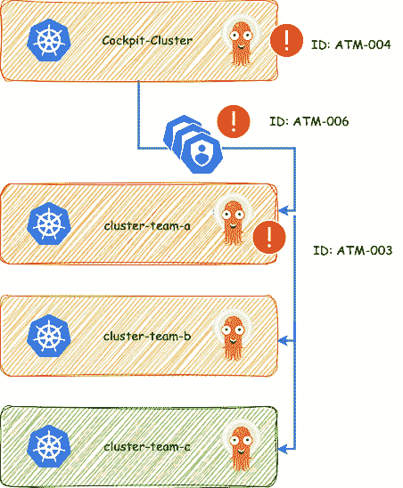

# 第十二章：GitOps 安全性

实现 GitOps 为软件开发过程的安全性提供了多个好处。通过将 Git 用作配置和代码的中央源，可以确保环境的完整性和可追溯性。在本章中，我们将探讨 GitOps 背景下的安全性各个方面。

我们将从分析广为人知的 **Cockpit** 和 **Fleet** 方法开始，并通过它们突出使用 Argo CD 时的各种安全考虑。接下来，我们将重点关注 **Kyverno** 作为 **策略引擎**，它充当门卫，定义集群中允许的操作以及哪些部署是被允许的。

权限问题在 GitOps 的背景中占据核心地位。因此，我们将讨论安全处理密钥，并介绍已在行业中成功采用的两种工具。

从平台团队的角度，我们将考虑为开发人员提供上下文信息，如 cert-manager、Ingress 控制器等。在这里，我们将使用经过验证的 **Kubernetes 服务目录** 原则，并探索其安全应用和更新。

最后，我们将看看 **KubeClarity** 工具，它能清晰地显示运行应用程序中的漏洞，包括以下各个层级：

+   **配置**：Kubernetes 资源的错误配置

+   **镜像**：容器镜像中的漏洞

+   **代码**：应用代码中的安全漏洞

此外，我们还将简要介绍操作系统级别或内核级别，并查看 **Falco** 工具。该工具可用于检测主机上的可疑活动，例如执行不应执行的操作。

本章的目标是阐明不同层面的不同视角，从而更好地理解 GitOps 如何帮助团队提升安全性。

我们将在本章中讨论以下主要话题：

+   加固 Kubernetes 上的声明式 GitOps CD

+   将所有内容提交到 Git 吗？那密钥怎么办？

+   利用策略引擎进行政策即代码实践

+   自动化安全扫描与合规性

+   保持平台目录的最新状态

# 加固 Kubernetes 上的声明式 GitOps CD

在这一部分，我们将深入探讨加固 Kubernetes 上声明式 GitOps **持续交付**（**CD**）所必需的实践，重点提升安全性并减少配置错误的风险——这是云安全漏洞的主要原因之一。向云原生技术的转变简化了系统、操作理论和技能的复杂性，为构建和管理应用提供了更清晰、更安全的框架。然而，这些系统的安全性不仅仅涉及软件开发和供应链方面；它还至关重要地涉及解决配置漏洞。

## 解决配置漏洞

云原生技术简化了技能组合、操作理论和系统复杂性，提升了系统架构的可理解性和安全性。然而，主要的云安全风险仍然是配置错误，这往往在专注于开发和供应链安全时被忽视。GitOps 模式的采用，特别是在渐进式应用交付方面，已经变得广泛，提供了一种比传统的直接构建到生产环境的服务器更安全的替代方案。这种方法使用 Git 仓库来管理更改，能够进行部署前的安全评估，并最大限度地减少权限提升和配置漂移。

云原生计算基金会委托**ControlPlane**[*1*]对 Argo CD 进行详细的威胁建模分析，Argo CD 是 GitOps 方法的典型工具，重点关注其在多租户 Kubernetes 环境中的部署。该分析揭示了 19 个已识别的威胁，其中 6 个被列为高优先级，强调了需要采取严格安全措施的必要性。硬化建议包括加强密码管理、集成**单点登录**、并应用严格的**基于角色的访问控制**（**RBAC**）原则，以限制对敏感信息的访问。

来自 ControlPlane 的报告[*1*]还提供了最关键威胁的可视化攻击树，帮助利益相关者理解并减轻风险，同时对 Argo CD 部署架构提供全面概述。报告中包括用于复制设置的 Terraform 代码，确保能够有效验证安全控制。这些措施基于报告的发现，旨在加强 Argo CD 部署的安全性，使其符合组织的安全标准，并最大化 GitOps 在云原生生态系统中的应用优势。

我们将从报告中整合部分内容，并将其与广为人知的 Cockpit 和 Fleet 方法结合起来。该报告来自 2023 年，涉及*Argo CD 版本 2.67*，一些问题可能已经在更新的 Argo CD 版本中得到解决。撰写本文时，*Argo CD 版本 2.10*被认为是稳定版本。我们将对比报告中的具体内容与*Argo CD* *版本 2.10*进行比较。

在本节中，我们不会逐一讲解整个报告，而是选择几个项目进行讨论。每个潜在威胁将缩写为**ATM-ID**，并根据优先级从低到高进行分类。这些威胁将分为三类。*表 13.1*展示了**变更影响评估**（**CIA**）如下：

| **机密性** | 高 | 由于管理员凭证泄露导致集群接管（操作、租户） |
| --- | --- | --- |
| 中等 | 敏感信息与应用或集群状态相关被泄露 |
| 低 | 非敏感信息泄露 |
| **完整性** | 高 | 源代码仓库和应用部署被破坏 |
| 中等 | 因配置错误/无效配置导致应用同步失败 |
| 低 | 由于配置错误/无效配置，非关键操作被阻止 |
| **可用性** | 高 | 集群（操作、租户）面临**拒绝服务**（**DoS**）风险 |
| 中 | 托管的应用程序在一段时间内被阻止 |
| 低 | 托管的应用程序同步在短时间内被阻止 |

表 13.1 – 变更影响评估 [1]

## 增强密码管理和 RBAC

现在，让我们来查看我们在 Cockpit 和 Fleet 方法中可以识别出威胁的部分。这将在*图 13.1*中用感叹号和 ID 标出：



图 13.1 – Cockpit 和 Fleet 方法结合威胁模型

现在，第一个 ID，*ATM-004*，位于*表 13.2*中的*Argo* *CDs RBAC*类别下：

| **ID** | **UID** | **类别** | **优先级** |
| --- | --- | --- | --- |
| ATM-004 | KR-AR-002 | Argo CD RBAC | 高 |

表 13.2 – ATM-004：UI 本地用户的凭证永不过期，并且没有强身份验证

这里的风险在于，Argo CD UI 本地用户的凭证永不过期，且仅基于用户名和密码，没有二次身份验证。优先级已经设置得过高。考虑到 Cockpit 可以访问其他集群，我个人认为这一点变得更加关键。

危险在于，如果凭证被泄露，可能会发生未经授权的更改。

重要提示

**OAuth2**和**OpenID Connect** (**OIDC**)是安全授权和身份验证协议。OAuth2 允许安全地访问资源，而 OIDC 则在 OAuth2 的基础上添加了用户身份验证。它们通过基于令牌的身份验证，确保在不暴露凭证的情况下安全地共享数据，从而增强了应用程序的安全性。

**Dex**是一个开源身份服务，使用 OIDC 对用户进行身份验证，并提供对各种应用程序和服务的访问。

**Microsoft Entra ID**，前身为**Azure Active Directory** (**AAD**)，是微软提供的一种基于云的身份与访问管理服务。

因此，建议仅在初始配置时使用本地管理员账户，然后通过提供的 Dex 服务器和支持 OAuth2 的 OIDC 提供程序（如 Microsoft Entra ID）切换到单点登录，从而实现角色与相应组的映射。随后，应禁用管理员访问，因为管理员访问并不会提供比将管理员组映射到 Azure 组的最高权限更广泛的权限。

然后，可以在`argocd-rbac-cm`配置映射中进行如下调整：

```
apiVersion: v1
data:
  policy.csv: |
    p, role:org-admin, applications, *, */*, allow
    p, role:org-admin, clusters, get, *, allow
    p, role:org-admin, repositories, get, *, allow
    p, role:org-admin, repositories, create, *, allow
    p, role:org-admin, repositories, update, *, allow
    p, role:org-admin, repositories, delete, *, allow
    g, "GROUP_ID", role:org-admin
  policy.default: role:readonly
kind: ConfigMap
metadata:
  labels:
    app.kubernetes.io/name: argocd-rbac-cm
    app.kubernetes.io/part-of: argocd
  name: argocd-rbac-cm
  namespace: argocd
```

随后，可以在`argocd-cm`中禁用本地管理员：

```
apiVersion: v1
kind: ConfigMap
metadata:
  name: argocd-cm
  namespace: argocd
  labels:
    app.kubernetes.io/name: argocd-cm
    app.kubernetes.io/part-of: argocd
data:
  admin.enabled: "false"
```

如果我们还考虑到管理员密码（*ATM-003*）作为 Kubernetes Secret 存在，那么希望它能清楚地说明，如果攻击者获得了 Fleet 集群的访问权限，或者更糟的是，获得了 Cockpit 的访问权限，从而能够访问 *ServiceAccounts* 进而访问其他集群，这可能会有多么危险。

| **ID** | **UID** | **类别** | **优先级** |
| --- | --- | --- | --- |
| ATM-003 | KR-AR-001 | Argo CD RBAC | 高 |

表 13.3 – ATM-003：初始管理员密码作为 Kubernetes Secret 存储

如果攻击者获得对 Fleet 集群的访问权限，或者更糟的是，获得对控制 *ServiceAccounts* 的 Cockpit 的访问权限，从而可以访问其余集群，则存在重大风险。这种情况可能导致由于未经授权读取 Argo CD 初始管理员密码从 Kubernetes Secrets 中，导致 Argo CD 配置的*未经授权更改*。

因此，建议旋转 Argo CD 管理员密码并删除该秘密，因为 Argo CD 仅创建该秘密用于访问目的，但不需要该秘密本身。根据 Argo CD 的文档，该秘密仅用于存储初始生成的密码的明文，并且可以在任何时候安全地删除。

要修改管理员密码，请按照以下步骤操作。建议将此指南传递给每个管理舰队集群的用户或团队。最佳做法是过渡到 OIDC，然后按照之前的说明停用管理员账户。然而，如果需要更改密码，则应遵循以下程序：

重要提示

这些命令在类似 Unix 的操作系统上运行，如 Ubuntu、Debian 或其他 Linux 发行版，以及 macOS。

1.  首先，转发到 `argocd server`：

    ```
    kubectl port-forward --namespace argocd service/argocd-server 8080:443
    ```

1.  密码可以通过 Argo CD **命令行** **接口**（**CLI**）轻松访问：

    ```
    admin as username  and password, log in to Argo CD’s IP or hostname:

    ```

    argocd login <ARGOCD_SERVER>

    ```

    ```

1.  使用以下命令更改密码：

    ```
    argocd account update-password
    ```

1.  作为之前步骤的替代方法，您可以通过将命令合并成一行来使用更简洁的方法，如下所示：

    ```
    kubectl port-forward svc/argocd-server -n argocd 8080:443 & argocd login localhost:8080 --username admin --password $(kubectl -n argocd get secret argocd-initial-admin-secret -o jsonpath="{.data.password}" | base64 -d) --insecure --grpc-web
    ```

1.  然后，按如下方式更新密码：

    ```
    argocd account update-password
    ```

1.  现在，按如下方式终止在后台运行的转发进程：

    ```
    kill $(ps aux | grep 'kubectl port-forward svc/argocd-server -n argocd 8080:443' | grep -v grep | awk '{print $2}')
    ```

现在我们已经更新了密码，让我们来看最后一部分，*ATM-006*（*表 13.4*），它在 Cockpit 和 Fleet 方法的背景下尤为重要：

| **ID** | **UID** | **类别** | **优先级** |
| --- | --- | --- | --- |
| ATM-006 | KR-ASM-001 | Argo CD 秘密管理 | 高 |

表 13.4 – ATM-006：永不过期的租户集群凭据作为 Kubernetes Secrets 存储

这里的风险在于 Argo CD 租户集群凭据作为 Kubernetes Secrets 存储，并且租户集群上的 Argo CD `argocd-manager` 服务账户令牌配置为永不过期。

因此，攻击者可能会由于未经授权访问 Kubernetes Secret 中的永不过期的租户承载令牌，从而在租户集群上执行未经授权的操作。

根据提供商和 Kubernetes 分发版本的不同，可以应用不同的缓解策略。建议使用 **工作负载身份或托管身份**，特别是在像 Azure Kubernetes 服务等服务中，这样可以让集群在没有机密的情况下访问 Azure 资源。或者，可以考虑利用外部的 **密钥管理服务**（例如 **AWS 密钥管理服务**）来安全管理和暴露 Argo CD 租户集群凭证。至关重要的是，确保 Argo CD 租户集群的持有令牌定期轮换，遵循组织的安全政策。对于手动轮换，删除租户集群中相应的 Kubernetes Secret 将触发新令牌的创建。

然而，本节的目的是不讨论所有安全漏洞，因为我认为由于其多样性，覆盖所有漏洞是没有必要的。本节旨在提高对使用 GitOps 时可能出现的安全漏洞的意识，以及如何尝试应对这些问题。

*图 13.2* 现在应该能够清楚地表明，我们仅减轻了三种可能的高级攻击：


图 13.2 – Cockpit 和 Fleet 方法结合威胁模型 – 减少攻击面视图

大多数系统常见的机制，如防火墙规则，应当被实现，以限制对 Cockpit 集群的访问，确保只有指定的 IP 地址范围可以访问。同样，访问 Fleet 集群的权限也可以通过防火墙进行限制，防火墙可能来自 Cockpit 集群本身，并且仅限于某些 IP 范围。保护集群访问尤其是 Cockpit 集群的安全至关重要，**多因素身份验证**（**MFA**）可以显著减少初始攻击面。尽可能地，应该用身份解决方案替换永久令牌，从而无需使用机密就能便捷访问。

我强烈建议深入了解 **ControlPlane** 提供的 *威胁模型* 文档。文档中包括详细的 **攻击树**，展示了如何利用多个漏洞可能带来深远影响。对这些内容的全面了解对于有效保护你的基础设施至关重要。

下一节将讨论 GitOps 的做法，即一切都在 Git 中，但机密怎么办？本节将探讨如何在 Git 中安全存储机密。

# 把所有内容都提交到 Git 中？那机密怎么办？

在 GitOps 工作流中，将每一项配置提交到 Git 仓库是核心思想。这确保了您的基础设施的整个状态被声明式地表示，并且可以进行版本控制、审计和审查。然而，这种方法在处理机密信息（如密码、令牌和私钥）时会带来挑战。将这些敏感信息直接存储在 Git 仓库中并不安全。这时，像密封机密和外部机密这样的工具就派上用场，它们为在 GitOps 工作流中管理机密提供了安全的机制。

## 密封机密

密封机密 [*2*] 是一个 Kubernetes 控制器和工具集，旨在加密可以安全存储在 Git 仓库中的机密。当您将密封机密应用到集群时，Sealed Secrets 控制器会解密它并创建一个常规的 Kubernetes 机密。这个过程允许您通过 Git 管理机密的生命周期，而不会暴露敏感内容。

如下使用：

1.  在本地机器上使用`kubeseal` CLI 工具，如下所示：

    ```
    helm repo add sealed-secrets https://bitnami-    labs.github.io/sealed-secrets
    helm install sealed-secrets sealed-secrets/sealed-secrets
    #Install e.g. CLI on MacOS
    brew install kubeseal
    ```

1.  **密钥对**：生成密钥对或使用部署的 Sealed Secrets Operator 中的证书：

    ```
    kubectl -n sealed-secrets get secret sealed-secrets-… -o json -o=jsonpath="{.data.tls\.crt}" | base64 -d > sealed-secret.crt
    ```

1.  **密封机密**：使用 kubeseal CLI 工具加密您的机密。CLI 会生成一个*SealedSecret* 资源，您可以将其提交到您的 Git 仓库中：

    ```
    mysealedsecret.yaml to your Git repository. When you apply this file to your cluster, the Sealed Secrets controller decrypts it and creates a standard Kubernetes secret.
    ```

1.  **与 GitOps 的自动化**：将此过程集成到您的 GitOps 工作流中。每当您在 Git 中更新密封机密时，您的 CI/CD 流水线可以自动将其应用到集群中。

## 外部机密

外部机密 [*3*] 是一个开源项目，它将外部机密管理系统（如 **AWS Secrets Manager**、**Azure Key Vault** 和 **Google Secret Manager**）与 Kubernetes 集成。它允许您安全地将机密注入到应用程序中，而无需在 Git 仓库中暴露这些机密。

如下使用：

1.  **部署**：在您的 Kubernetes 集群中部署 External Secrets Operator：

    ```
    helm repo add external-secrets https://charts.external-secrets.io
    helm install external-secrets external-secrets/external-secrets
    ```

1.  **配置**：定义一个*ExternalSecret* 资源，指定外部机密存储和机密密钥。操作器从外部存储中获取机密，并在集群中创建一个 Kubernetes 机密：

    ```
       apiVersion: external-secrets.io/v1beta1
       kind: ExternalSecret
       metadata:
         name: my-external-secret
       spec:
         secretStoreRef:
           name: my-secret-store
           kind: SecretStore
         target:
           name: my-kubernetes-secret
         data:
         - secretKey: external-secret-key
           remoteRef:
             key: name-of-the-secret-in-external-store
    ```

1.  **应用外部机密**：将*ExternalSecret* 资源提交到您的 Git 仓库。External Secrets Operator 将根据外部源自动在您的集群中创建或更新 Kubernetes 机密。

1.  **与 GitOps 集成**：将外部机密纳入您的 GitOps 流水线。对 Git 仓库中*ExternalSecret* 定义的更改会触发操作器同步机密，确保您的集群机密始终保持最新。

工具的选择取决于各种因素。例如，如果您没有用于存储机密、密钥或证书的金库，那么 External Secrets 可能不适合。最初，必须建立 External Secrets Operator 与 Secret Store 或 **ClusterSecretStore** 之间的连接。在我们的项目中，我们利用托管身份来确保这一点。否则，通常需要一个 ID 和一个密钥，这在大规模的 GitOps 环境中可能难以安全管理，因为 ID 和密钥必须通过 CI/CD 流水线安全传输到集群。External Secrets 的一个显著优势是它可以在运行时获取机密，而无需依赖集群。

然而，通过金库访问机密管理器并非始终可用。因此，Sealed Secrets Operator，尤其是在本地环境中，目前被认为是业界标准。

团队需要决定哪种选项更适合。在我看来，这两种选项都很稳固，并且能够很好地融入 GitOps 生态系统。这不仅可以在采用 GitOps 方法的同时安全地存储机密、密钥和证书，还为 GitOps 大规模应用开辟了全新的可能性，例如在特定注册表中部署拉取机密。平台团队通过结合 External Secrets 和 Kyverno，可以将机密部署到所有集群中，Kyverno 会将其分发到各个命名空间。因此，每个团队都有必要的拉取机密，可以从中央镜像注册表拉取镜像。这增强了安全性，因为每个镜像都可以进行扫描，并提供操作中镜像的概览。

通过利用 Sealed Secrets 和 External Secrets，您可以在安全管理机密的同时，保持 GitOps 原则，即将所有配置存储在 Git 中。这些工具帮助您自动化机密管理，保持基础设施安全并确保部署一致性。

每个添加到 Kubernetes 服务目录中的工具都会增加系统引入更多安全漏洞的可能性。我们将在下一部分讨论如何维护您的目录。

在接下来的部分，我们将深入探讨通过 GitOps 和 **策略引擎**增强安全性。这种方法能够在部署过程中采取主动措施，确定允许部署的内容并识别相关风险。这种前瞻性策略确保只有安全且符合要求的配置才能进入生产环境，从而强化您的安全姿态。

# 利用策略引擎进行政策即代码实践

在当今的软件开发领域，我们确保系统安全性和合规性的方法发生了显著变化。这一变化的关键方面是采纳了政策即代码的实践，使得治理和安全策略能够直接融入开发和操作流程。在这种背景下，Kyverno [*4*] 和 **Open Policy Agent** (**OPA**) [*5*] 等策略引擎发挥着至关重要的作用。这些工具使组织能够将其安全、合规性和治理要求定义为代码，从而确保其基础设施和应用程序的一致性和透明性。

Kyverno 和 OPA 都是功能强大、灵活的工具，专门用于在 Kubernetes 环境及其他场景中实现政策即代码。Kyverno 侧重于通过使用用户友好的、原生的 Kubernetes 语法简化 Kubernetes 安全性，允许开发人员直接在 CI/CD 管道中定义和执行安全策略。另一方面，OPA 是一个更为通用的策略引擎，采用了一种名为 **Rego** 的高度灵活、与领域无关的语言，使得在多种软件系统中创建和实施细粒度、上下文感知的策略成为可能。

将这些策略引擎集成到基于 GitOps 的工作流架构中显著提升了安全性，因为它确保了合规性的持续执行和验证。通过采用 GitOps，团队能够将基础设施和应用程序设置作为代码进行管理，创建一个版本化、可重复和可自动化的环境。在这一过程中融入 Kyverno 或 OPA 意味着基础设施或应用程序的更改将在实施之前自动根据预定义的策略进行验证。这确保了所有部署符合组织的安全标准，并且能够在对生产环境产生影响之前主动识别并修复潜在的安全漏洞或配置错误。

## 集成 Kyverno 和 OPA

本部分将探讨如何将 Kyverno 和 OPA 等工具集成到开发和操作工作流中，不仅增强安全性和合规性，还促进开发周期的效率和速度。在 GitOps 框架内 *自动化* 策略执行，使团队能够更快速、更安全地交付，从而打造更强大、更安全的应用程序和基础设施。

我们将重点关注 Kyverno，以便更好地理解，因为我认为这是一个用户可以更轻松理解的工具，而无需学习 Rego。然而，在深入讨论之前，让我们先看一下 Kyverno 操作的层次以及它与 GitOps 的集成。*图 13.3* 将详细阐述这些内容：


图 13.3 – Kyverno 操作层与 GitOps

如图所示，Kyverno 在两个层次上运作，充当有效的守门人。当你尝试部署违反其规则的内容时，Kyverno 会介入，导致部署失败。然而，Kyverno 的功能不仅限于此；它还可以验证 Kubernetes 集群中已运行的服务，或对资源进行修改。这种多功能性使得将 Kyverno 放置在这些层之间成为一个有利的选择。

通过利用 GitOps，你可以在整个集群中部署 Kyverno 实例，确保一致的策略执行。此外，*一次定义，处处部署*的方法简化了多集群部署，优化了跨不同环境的策略管理。通过与安全团队合作，你可以实施针对特定环境的不同规则集，增强部署的安全性和合规性。Kyverno 与 GitOps 之间的协同作用不仅简化了治理，还强化了基础设施的整体安全态势。

现在，让我们来看一下它在实际操作中的表现。

## 实践操作 – 让我们将理论付诸实践 *[6]*

首先，我们为 Kubernetes 服务目录建立一个简化的文件夹结构，如下所示：

```
.
├── applicationsets
│   └── security
│       └── kyverno-applicationset.yaml
├── kustomize
│   └── security
│       └── kyverno
│           └── policies
│               └── base
│                   ├── disallow-latest-tag.yaml
│                   ├── kustomization.yaml
│                   └── restrict-nodeport.yaml
└── security
    └── kyverno
        ├── Chart.yaml
        └── values.yaml
```

通过启动 `kyverno-applicationset.yaml` 的部署，你将针对每个被 `env=prod` 或 `env=development` 标签标识的集群进行部署。该部署不仅在这些集群上设置 Kyverno 工具，还会将 `kustomize` 文件夹中的特定策略应用到每个集群。在我们的示例中，我们使用了一个基础的文件夹结构；然而，你可以灵活配置不同的文件夹——例如，用于不同阶段的文件夹。这些文件夹可以与集群标签对齐，从而使你能够将适当的规则集部署到相应的集群。这种安排对于在开发集群中实施更宽松的策略、在生产环境中实施更严格的策略非常有益。

现在，让我们检查一个示例策略，它将在每个匹配指定标签的集群上部署。我们将重点关注 `disallow-latest-tag.yaml` 策略。

在第一部分中，我们看到注释、`最佳实践`类别，然后是版本、严重性分类、受影响的主题，以及由此可能引发的负面后果描述。我觉得它简洁明了，清晰易懂，且易于配置：

```
apiVersion: kyverno.io/v1
kind: ClusterPolicy
metadata:
  name: disallow-latest-tag-example
  annotations:
    policies.kyverno.io/title: Disallow Latest Tag Example
    policies.kyverno.io/category: Best Practices
    policies.kyverno.io/minversion: 1.6.0
    policies.kyverno.io/severity: medium
    policies.kyverno.io/subject: Pod
    policies.kyverno.io/description: >-
      The ':latest' tag is mutable and can lead to unexpected errors if the
      image changes.. This policy validates that the image
      specifies a tag and that it is not called `latest`.
```

在随后的规范部分，我们观察到该动作被指定为 `Audit` 而不是 `Enforce`，这意味着它不是强制性的。接下来，建立了两条规则。第一条规则对容器的标签进行验证，使用 `*:*` 模式，确保其符合特定标准。随后，第二条规则提升到资源层级，通过直接针对 pods 来应用更广泛的范围。它规定了一个约束，禁止使用带有 `latest` 标签的模式，从而强化了对部署实践的治理：

```
spec:
  validationFailureAction: Audit
  background: true
  rules:
    - name: require-image-tag
      match:
        any:
          - resources:
              kinds:
                - Pod
      validate:
        message: "An image tag is required."
        pattern:
          spec:
            containers:
              - image: "*:*"
    - name: validate-image-tag
      match:
        any:
          - resources:
              kinds:
                - Pod
      validate:
        message: "Using a mutable image tag e.g. 'latest' is not allowed."
        pattern:
          spec:
            containers:
              - image: "!*:latest"
```

在实践中，结果如下：当规则被应用并尝试部署一个带有 `latest` 标签的 pod 及其容器时，部署会被阻止。让我们尝试部署一个带有 `latest` 镜像标签的 Nginx pod：

```
kubectl run nginx --image nginx:latest
```

现在，你可以获得一个类似下面的 Kyverno `policyreport`：

```
kubectl get policyreport fbe08ffd-bee6-497f-aee8-f96e9cd022f8  -n default -o yaml | grep image -A 8
```

输出应该是如下所示：

```
- category: Best Practices
  message: 'validation error: Using a mutable image tag e.g. ''latest'' is not allowed.
    rule validate-image-tag failed at path /spec/containers/0/image/'
  policy: disallow-latest-tag
  result: fail
  rule: validate-image-tag
  scored: true
  severity: medium
  source: kyverno
```

如你所见，我们违反了最佳实践策略，特别是 `disallow-latest-tag` 策略。

我称这种设置为门卫（gatekeeper），因为它允许你通过简单的规则来控制可以和不可以部署到集群中的内容。然而，这种设置的功能更为广泛。例如，你可以配置 Kyverno 策略来强制执行镜像签名，或确保仅允许从某些注册表拉取镜像，等等。策略引擎是一个强大的工具。与门卫不同，Kyverno 或 OPA 还可以操作已经部署的资源或那些通过门卫检查并因此被放置在两个层次之间的资源，如*图 13.3*所示。

当与 GitOps 方法结合时，它开辟了超越团队边界的新可能性，增强了项目的安全性。这种集成不仅简化了部署过程，还确保了操作标准的一致性，从而增强了基础设施的整体安全态势。

在接下来的部分，我们将探讨如何通过两种不同的工具在两个不同的层次上提升安全性。

# 自动化安全扫描和合规性

在当今快速发展的、安全意识日益增强的 IT 环境中，保持持续的安全性和合规性至关重要。自动化的安全扫描和合规性是强大网络安全战略的核心组成部分，特别是在 Kubernetes 集群中，应用程序和服务会动态扩展和更新。在这里，我们将讨论如何使用 **KubeClarity** [*7*] 或 **Falco** [*8*] 工具来增强 Kubernetes 环境中的安全态势。下图展示了 KubeClarity 操作的层级：


图 13.4 – KubeClarity 操作层

KubeClarity 是一款开源工具，旨在 Kubernetes 环境中进行安全扫描和合规性分析。它提供了容器镜像和 Kubernetes 配置中潜在漏洞的全面概览。

## KubeClarity

首先让我们了解 KubeClarity 如何增强安全性：

+   **漏洞扫描**：KubeClarity 会扫描容器镜像中的已知漏洞，利用各种数据库和漏洞跟踪源。它提供有关镜像安全缺陷的详细洞察，包括缺陷的严重性等级，帮助你优先修复问题。

+   **合规性保证**：该工具会将你的 Kubernetes 配置与最佳实践和合规标准进行对比，确保你的部署符合行业和组织的安全政策。

+   **持续监控**：KubeClarity 会持续监控你的容器化应用程序中的新漏洞，提供实时警报和更新。这种持续的警觉有助于维护一个安全的 Kubernetes 环境。

通过在 GitOps 框架内集成 KubeClarity，组织可以显著增强其安全性和合规性，确保其 Kubernetes 集群能够抵御不断变化的威胁。采用 GitOps 原则使得安全扫描和合规检查的自动化成为可能，从而使这些流程变得更加一致、高效和可扩展。KubeClarity 提供的主动安全保障不仅保护了你的基础设施，还通过展示对维护安全合规环境的承诺，增强了与客户的信任。GitOps 启用的持续监控和自动与安全政策的一致性，确保任何偏差都会被迅速检测并修正，从而保持强有力的防御，抵御潜在漏洞。

## Falco

Falco 是一款开源工具，专门为 Kubernetes 环境设计，用于实时安全监控和分析。它充当 **入侵检测系统**（**IDS**），使团队能够检测其应用程序和基础设施中可能表明安全漏洞或其他威胁的异常活动。下图展示了 Falco 的操作层级。


图 13.5 – Falco 操作层

Falco 在系统级别运行（*图 13.5*），监控底层 Linux 内核功能，或者更准确地说，是容器编排平台的系统级活动。它利用 Linux 内核的功能，特别是 **扩展 BPF**（**Berkeley 数据包过滤器**）或传统的 **系统调用**（**syscalls**）监控，通过内核模块实时观察和分析系统范围的事件。Falco 可以捕获并评估在容器内运行的应用程序的系统调用，识别异常或不良行为。

集成 Falco 与 GitOps 的优势如下：

+   **自动化安全监控**：通过将 Falco 集成到 GitOps 流水线中，安全策略可以作为代码定义，并自动应用于基础设施或应用程序中的每次变更，从而实现对安全标准的持续和自动化监控。

+   **实时警报**：Falco 可以配置为在违反定义规则时发送实时警报。在 GitOps 环境中，这些警报有助于迅速响应潜在的安全事件。

+   **一致性和合规性**：通过 GitOps，Falco 配置可以版本化、审查并自动部署，确保在不同环境中一致地执行安全策略。

+   **透明性和可追溯性**：所有对 Falco 策略的更改都会记录在 Git 中，提供清晰的审计痕迹。这促进了关于安全监控的透明度，并有助于符合法规要求。

将 Falco 集成到 GitOps 策略中，不仅能增强团队的安全防护姿态，还能采取一种主动的方式来识别和应对 Kubernetes 环境中的安全威胁。

然而，每个工具的引入也伴随着潜在的风险，即使它是为了提高安全性，这就是为什么在设计或选择工具时不能忽视维护问题，并且需要特别关注这一点。这正是我们将在下一节中简要讨论的内容。

# 保持平台目录的最新状态

本节内容已经在*第五章*的*附加内容 – 使用 GitOps 进行大规模维护和 KSC* 部分中进行了详细讲解。它提醒我们，随着每个工具的加入，目录不断扩展，必须始终保持对安全性的高度关注。

当**常见漏洞与曝光**（**CVE**）威胁被揭示并且您选择 Cockpit 和 Fleet 方法时，采用大规模的 GitOps 同样促进了漏洞管理的规模化战略。因此，在概念的早期阶段，尤其应考虑这一点。

实施这样的战略确保了随着基础设施的扩展，处理漏洞的策略也能相应扩展。这种主动的姿态有助于快速解决整个舰队中的安全问题，保持系统的完整性和安全性。在概念框架的早期集成这些做法，对于建立一个稳健、可扩展和安全的基础设施至关重要。

本章的总结部分，*图 13.6* 展示了数据包（应用程序或服务）必须经过的各个阶段或关卡，突出了不同的安全机制可以介入的地方，确保尽可能全面地扫描数据包：


图 13.6 – 多层次安全

然而，数据包可能会通过某些阶段，因此需要像 Falco 和 Kyverno 这样的工具来实现持续扫描。这些工具依赖于定义好的规则，幸运的是，可以通过 GitOps 容易地部署这些规则。

# 总结

在本章中，应该已经明确，安全性不仅仅依赖于单一层面，也不应仅由一个团队来强制执行。安全性是一个文化问题，可以通过 GitOps 等方法和像 Argo CD 等工具在大规模中进行扩展，包括定义规则集或策略。安全性不仅仅是工具的问题；它还包括如何处理敏感数据，如机密信息，并确保生态系统中的第三方工具保持最新和安全。有效的安全实践需要跨团队的协作、持续的监控和主动的管理，以确保一个强大且具有韧性的基础设施。

在下一章中，我们将探讨 FinOps 与 GitOps 的集成，以实现可持续、成本效益高的运营。我们将涵盖核心的 FinOps 原则、成本预测、优化以及碳足迹的理解。此外，我们还将探讨 GitOps 的未来趋势，包括 AI 驱动的自动化。

# 参考文献

+   [1] [`github.com/argoproj/`](https://github.com/argoproj/)

+   [2] [`github.com/bitnami-labs/sealed-secrets`](https://github.com/bitnami-labs/sealed-secrets)

+   [3] [`external-secrets.io/latest/`](https://external-secrets.io/latest/)

+   [4] [`kyverno.io`](https://kyverno.io)

+   [5] [`www.openpolicyagent.org`](https://www.openpolicyagent.org)

+   [6] [`github.com/PacktPublishing/Implementing-GitOps-with-Kubernetes/tree/main/chapter13`](https://github.com/PacktPublishing/GitOps-for-Kubernetes-Deployment/tree/main/chapter13)

+   [7] [`github.com/openclarity/kubeclarity`](https://github.com/openclarity/kubeclarity)

+   [8] [`falco.org`](https://falco.org)
