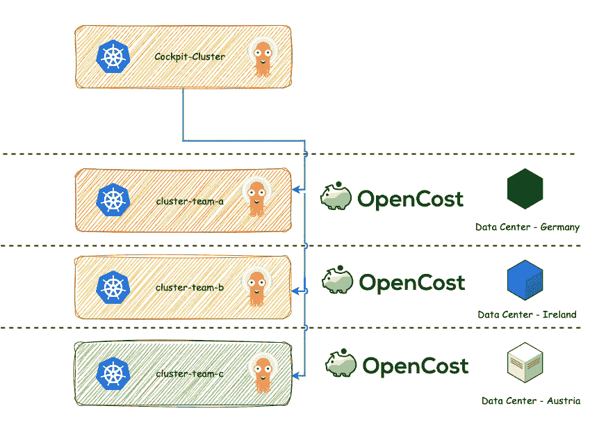

# 第十三章：FinOps、可持续性、AI 和 GitOps 的未来趋势

在本章中，我们超越了 GitOps 的常规边界，探索了其在书籍主章节未涵盖的各个领域中的广泛范围和多方面影响。我们的旅程被结构化为若干不同但互相关联的模块，每个模块都揭示了 GitOps 扩展影响力的不同维度，提供了对这种实践潜力和多样性的全面洞察。

我们从 **FinOps** 和 **成本管理** 的基础开始，财务智慧与操作专业知识的融合在此成为焦点。该部分阐明了 FinOps 框架如何与 GitOps 方法论结合，使组织能够精确控制其云支出。通过在 GitOps 驱动的环境中使用如 **OpenCost** 和 **Kubecost** 等工具，企业能够实现前所未有的透明度和高效性，管理集群、项目及其他领域的成本，确保每一美元的支出都是面向创新和增长的投资。

过渡到可持续性和绿色操作领域，我们深入探讨了 GitOps 如何成为推动环保 IT 实践的催化剂。该模块强调了可持续操作的重要性，不仅从经济角度看，还在于为环境保护做出贡献。我们讨论了诸如自动化关闭开发集群等实际策略，展示了 GitOps 如何将技术进步与生态责任对接，从而在科技行业中培养可持续发展的文化。

该探索扩展到包括 GitOps 和 **人工智能** (**AI**) 驱动的自动化，这是一个连接 AI 和 GitOps 高级领域的环节。这种融合正在彻底改变组织部署、监控和管理 IT 环境的方式，超越了炒作，提供了切实有效的自动化解决方案。通过现实世界的案例和案例研究，我们考察了 AI 在提升 DevOps 实践和简化跨公司服务部署中的双重优势，所有这些都在 GitOps 框架内进行。

最后，我们回顾了 GitOps 的发展趋势，思考 GitOps 原则的持续演变及其在各个领域的变革性影响。这个总结部分预测了 GitOps 的未来发展轨迹，推测它在新兴技术中的角色以及重新定义行业标准的潜力。我们深入探讨了 GitOps 在预测和监控云成本方面的 **关键** 作用，从而帮助组织在现代云环境的复杂性中保持信心和战略眼光。

这些模块各自聚焦不同，但共同强调了 GitOps 的广泛影响力，展示了它作为现代 IT 战略基石的角色。本章旨在拓宽读者的视野，鼓励他们将 GitOps 视为不仅仅是提升运营效率的工具，而是一个将技术创新、财务智慧、环保意识和前瞻性适应力融合的整体方法。

本章将涵盖以下主要主题：

+   探讨 FinOps 的基础知识

+   使用 GitOps 进行成本预测和监控

+   云支出优化技巧

+   评估碳足迹并推动绿色运营

+   探讨 GitOps 和人工智能驱动的自动化

+   GitOps 中的未来挑战与机会

+   GitOps 在新兴技术中的角色

# 探讨 FinOps 的基础知识

**FinOps**，一个将财务和 DevOps 原则融合的运营框架，根本上是一种文化实践，旨在最大化云投资的商业价值。它促进了一个协作环境，在这个环境中，工程、财务和业务团队共同工作，促进基于数据的决策，提高财务责任感并优化云成本。

FinOps 的本质在于它能够弥合传统上分隔的部门之间的鸿沟，推动一种共享责任模型，使所有利益相关者都参与到云的成本效益和运营效率中。这种跨职能的协同对于加速产品交付并确保财务透明度和控制至关重要。

FinOps 的关键方面包括实时监控云开支，使组织能够做出平衡成本、速度和质量的明智决策。这种方法不仅仅是削减成本；它是通过利用云的可变支出模型来推动创新、收入增长和在技术基础设施中的战略投资。

寻求采用 FinOps 的组织可以从探索 FinOps 基金会提供的资源开始，该基金会提供教育、最佳实践和社区参与，支持不同成熟度水平的 FinOps 之旅。FinOps 倡导的**爬行、行走、跑步**成熟度模型使组织能够逐步发展其财务操作，不断优化其云架构和投资策略。

**爬行、行走、跑步**模型

**Crawl, Walk, Run** 模型是描述学习和实施逐步阶段的框架。在 **Crawl** 阶段，个人或组织专注于理解基本原则，范围有限且高度依赖指导。**Walk** 阶段涉及更大的熟悉度和信心，任务变得更加复杂，效率提高。最后，在 **Run** 阶段，完全掌握并独立、创新地使用新概念、新流程或新技术。这个模型有助于管理期望，并提供一个结构化的成长路径，确保在进阶到更复杂的层级之前建立扎实的基础。

FinOps 框架的核心原则包括指导协作努力、个人对云资源使用的责任以及云投资与业务价值的战略对齐。这些原则确保从高管到工程师的每个团队成员都能理解并为高效、创新地使用云资源做出贡献。

将 FinOps 融入组织的运营模式，不仅承诺增强成本管理和优化，还能使云支出与业务结果对齐，确保投资转化为实际价值。这种战略对齐在当今动态的云环境中至关重要，因为适应性规划和成本效益资源利用是保持竞争优势和促进长期增长的关键。

在下一节中，我们将使用 OpenCost [*1*] 和 Kubecost [*2*] 来确定集群或命名空间的成本，举例来说，这些命名空间可以代表一个项目。

# 使用 GitOps 进行成本预测和监控

GitOps 可以与 FinOps 无缝集成，以增强云资源的财务治理，同时**保持敏捷性**和运营效率。GitOps 和 FinOps 实践的结合，使组织能够通过自动化、版本控制和持续监控，更有效地管理其云基础设施和成本。

## GitOps 如何补充 FinOps

首先，让我们了解 GitOps 如何补充 FinOps：

+   **自动化成本优化**：GitOps 允许自动化部署和扩展云资源，可以与 FinOps 策略结合，确保资源利用在不牺牲性能的前提下优化成本。这意味着基础设施可以自动扩展或收缩，符合财务目标和运营需求。

+   **版本控制的支出**：使用 GitOps，每次对基础设施的更改都会在 Git 仓库中进行版本控制，提供对所做更改的审计追踪，包括更改内容、执行人以及更改的原因。这与 FinOps 原则一致，通过为操作变更的财务影响提供透明度，帮助更好地进行预算跟踪和成本分配。

+   **协作与可视化**：GitOps 通过使用 Git 作为**单一事实来源**（**SSOT**）促进开发、运维和财务团队之间的协作。这种协作环境确保了财务考虑被纳入到基础设施规划和应用开发的最早阶段，推动了一个成本意识的文化。

+   **政策执行**：将**政策即代码**（**PaC**）工具集成到 GitOps 工作流中，可以执行财务治理，确保资源的使用高效且在预算内。可以设定政策来防止超支，强制使用成本优化的资源，或确保遵守预算约束。

+   **持续的成本监控和反馈**：GitOps 使得持续监控和反馈环路成为可能，帮助团队快速识别并解决云资源使用中的低效问题。这种持续的警觉性有助于在操作效率、成本和速度之间保持平衡，符合 FinOps 目标。

+   **主动的财务管理**：通过使用 GitOps，组织可以主动管理其云端开支。存储在 Git 仓库中的**基础设施即代码**（**IaC**）模板可以被分析，用来预测成本，并在执行之前了解计划更改的财务影响。

## 使用 GitOps 与 FinOps

以下几点描述了如何将成本监控、预算执行、资源优化和财务操作自动化集成到 GitOps 管道中，以提升成本效率并确保财务治理：

+   **实施成本监控工具**：将云成本监控工具集成到 GitOps 管道中，以提供有关代码更改和基础设施更新对财务影响的实时反馈。

+   **强制执行预算政策**：通过 IaC 使用 GitOps 强制执行预算政策，确保部署符合预定的财务约束和操作预算。

+   **优化资源分配**：利用 GitOps 自动化成本优化资源的部署，例如使用抢占实例，并关闭利用率低的资源，确保云支出的高效性。

+   **简化财务操作**：通过 GitOps 自动化财务操作任务，例如成本报告、预算提醒和资源标签，从而确保财务治理在所有云资源中得到一致应用。

通过将 GitOps 与 FinOps 实践相结合，组织可以确保其云基础设施不仅在操作上高效，而且与其财务目标保持一致，从而最大化其云投资的价值。这种全方位的方法实现了一个更加灵活、透明和成本效益高的云管理战略。

现在，让我们看看它在实践中是如何运作的。为此，我们将考察两个工具：OpenCost，作为一个开源选项，以及基于 OpenCost 构建的 Kubecost，后者在接下来的部分中提供了许多额外的功能。

## OpenCost 与 Kubecost 配合 GitOps 使用

OpenCost 和 Kubecost 是在 Kubernetes 成本监控和分析领域使用的工具，它们提供关于资源利用的洞察，并帮助管理与 Kubernetes 环境相关的云端成本。我们将简要介绍这两个工具及其差异。

### OpenCost

OpenCost 是一款开源工具，它为与 Kubernetes 集群相关的成本和使用情况提供**透明度**。它通过提供详细的资源利用和相关费用洞察，帮助团队监控、分析和优化其 Kubernetes 成本。OpenCost 提供以下功能：

+   按 pod、部署、命名空间或集群级别进行成本拆分

+   支持多集群环境

+   与云服务提供商的集成，以实现更准确的成本估算

+   永远免费且开源，由专家支持和维护

这一切如何与 GitOps 相结合，或者更具体地说，GitOps 在 FinOps 上下文中带来了什么价值？OpenCost 基于 `us-central-1` 区域设置本地定价配置——例如，`"CPU": "0.031611"$` 和 `"RAM": "0.004237"$` 按小时计算。然而，OpenCost 也允许定制定价。此时，GitOps 就派上用场了，它不仅能在不同集群间部署 OpenCost 工具（*图 14.1*），还可以根据需要配置价格。例如，如果你在欧洲有三个数据中心，分别位于三个不同的国家，由于电力价格、采购、折旧等因素，CPU 和 RAM 的价格会有所不同。

在 `optimization/opencost` 下有全球定义的值，此外每个特定国家还有自定义定价模型。其视觉效果如下：



图 14.1 – 配合 GitOps 和本地定价配置的 OpenCost

对于*图 14.1*中的场景，我们建立以下文件夹结构 [*3*]：

```
.
├── applicationsets
│   └── optimization
│       └── opencost-applicationset.yaml
├── cluster
│   ├── in-cluster-austria
│   │   └── optimization
│   │       └── opencost
│   │           └── values.yaml
│   ├── in-cluster-germany
│   │   └── optimization
│   │       └── opencost
│   │           └── values.yaml
│   └── in-cluster-ireland
│       └── optimization
│           └── opencost
│               └── values.yaml
└── optimization
    └── opencost
        ├── Chart.yaml
        └── values.yaml
```

它还可以与**混合云**和**多云**结合使用；然后，它可能看起来像这样：


图 14.2 – 配合 GitOps 和混合设置定价配置的 OpenCost

GitOps 与 OpenCost 相结合，在 FinOps 中开辟了新的可能性，提供了跨分布式基础设施的用户和基础设施定义的成本可见性，从而加强了财务监管、精确的成本分配和云环境中的战略预算优化。

然而，如果你需要团队协作、预算规划、警报、估算月度节省等功能，则应考虑探索 Kubecost。

### Kubecost

Kubecost 是一个基于 OpenCost 的产品。它是一个商业解决方案，提供比 OpenCost 项目核心功能更多的附加功能和支持。Kubecost 包含了 OpenCost 的所有功能，并且增加了以下内容：

+   高级预算和成本预测

+   个性化优化建议

+   额外的安全性和合规性功能

+   专业支持和咨询

此外，你可以灵活地利用 GitOps，不仅仅是为了在多个集群中部署 Kubecost，还可以让团队根据命名空间、集群或标签设置**预算**，并指定在预算超标时需要采取的行动（*图 14.3*）：


图 14.3 – Kubecost 与 GitOps：定义预算和成本警报

通过将 GitOps 与 Kubecost 集成，组织能够赋予团队更多的控制权，简化这一强大工具的部署。这种协同作用不仅让团队能够高效地大规模部署 Kubecost，还能定义与预算需求对齐的关键参数。这种集成在促进成本管理的协作环境中至关重要，使组织内的各个团队能够共享最佳实践、见解和策略，共同优化资源。

Kubecost 与 GitOps 相结合的能力进一步丰富了这种协作氛围，促进了主动的成本管理。通过设置预定义的阈值并配置自动警报，团队可以积极监控和管理云支出。这种主动的立场确保了任何潜在的预算超支能迅速被识别并解决，同时有效优化整体云支出。

GitOps 和 Kubecost 的融合改变了云成本管理的方式，从反应型转变为主动型模型。团队不再对自己的支出趋势一无所知，而是提供了一个清晰的、可操作的框架，使他们能够保持财务效率，同时充分利用云资源的可扩展性和灵活性。这种集成确保了成本优化不仅仅是月底的后续工作，而是**日常运营**的基本组成部分，赋予团队合理经济地利用云资源的能力。

### OpenCost 与 Kubecost 的区别

以下是这两个工具之间最重要的区别：

+   **开源与商业版**：OpenCost 是一个开源项目，邀请社区自由使用和适配，而 Kubecost 是一个商业版，提供增强的功能和支持，面向企业客户。

+   **功能集**：Kubecost 在 OpenCost 的基础上进行了扩展，增加了专门为企业客户设计的附加商业功能。例如，OpenCost 为 Kubernetes 集群提供基本的成本监控，而 Kubecost 则提供自动化成本优化建议以及为不同团队和项目提供详细的成本分配报告。

+   **支持**：Kubecost 提供专业的支持和咨询服务，超出了通常从开源项目中预期的范围。

这两款工具旨在提升 Kubernetes 使用相关费用的透明度和控制力，但它们面向的用户群体和需求不同，从开源社区到大型企业均有涵盖。

GitOps 与 OpenCost 或 Kubecost 的结合，不仅简化了操作效率，还显著提升了 Kubernetes 环境的战略财务管理。

在下一部分，我们将探讨如何优化云成本，以及 GitOps 与 Kubecost 如何为此作出贡献。

# 云支出优化技术

对于希望最大化**云投资**并最小化不必要成本的组织来说，云支出优化技术至关重要。将 GitOps 与如 Kubecost 等工具结合，可以显著简化这一过程，提供一种系统化的方法来管理和减少云费用。以下是如何利用这一组合来提升云支出优化的方式。

## GitOps 与 Kubecost 结合进行云支出优化

GitOps 通过自动化、可预测性和透明度将其带入云操作中。它将 Git 存储库作为整个基础设施的 SSOT，这意味着每一次变更都有版本控制、可追溯且可回滚。这种方法化的方式对云支出优化至关重要。

重要提示

在 GitHub 上的一个示例，*第十四章*，`...optimization/kubecost`，展示了如何通过 Kubecost UI 和 Helm Chart 部署，利用`values.yaml`文件配置告警。

当 GitOps 与 Kubecost 结合使用时，它们为持续的云支出优化提供了强大的框架：

+   **自动化资源优化**：GitOps 可以自动化部署 Kubecost 的建议，确保节省成本的措施能及时且一致地应用于基础设施。

+   **持续监控与调整**：这一组合能够持续监控云支出，并根据预定义的策略进行自动调整，确保云环境始终以最具成本效益的方式运行。

+   **增强协作**：通过整合这些工具，财务团队与运营团队可以更有效地协作，GitOps 提供操作框架，而 Kubecost 提供财务洞察，进而促进更加明智的决策。

假设有一个新项目进来。平台团队提供 Kubernetes 平台，但 FinOps 团队负责管理每个项目固定预算为 500 美元的成本。FinOps 团队可以在 UI 中创建一个预算并设置警报，或者让 GitOps 团队通过 GitOps 项目命名空间和集群预算部署警报，并设置 **警报**。

例如，如果 FinOps 团队想知道为什么命名空间中的累计预算在 70-100 美元之间，但总支出预算约为 600 美元，他们可以使用警报和 UI 来调查根本原因。Kubecost UI (*图 14**.4*) 显示，集群效率低于 12%，并且通过 7 天的回顾，已经可以节省大约 50 美元：


图 14.4 – Kubecost 集群效率 ~12% 持续 7 天

然后，FinOps 团队会检查 *图 14**.5* 中的潜在节省，以了解成本的来源。很快就能明显看出，项目的集群规模过大。与平台团队合作，并利用 Kubecost，项目中的各个团队可以实施规模调整和机制，以便相应地调整行动。在这一阶段，团队之间的协作至关重要，所有团队都应以公司、可持续性和项目的利益为出发点。这就是如何合理优化云成本的方式：


图 14.5 – Kubecost 节省建议

总结来说，结合 GitOps 和 Kubecost 可以将云支出优化从被动转变为主动。这种整合不仅提供了关于云使用和支出的详细见解，还自动应用节省成本的策略，确保云资源得到高效和经济的利用，并使云支出与组织的预算目标和运营需求保持一致。

在接下来的部分，我们将探讨如何利用 GitOps 以及多种工具朝着可持续性目标迈进。

# 评估碳足迹并推动绿色运营

评估碳足迹并推动云环境中的绿色运营是实现 IT 运营可持续性的关键步骤。像 `kube-green` [*4*] 和 **Armada** [*5*] 这样的工具提供了创新的方法来管理和减少云计算的环境影响。

## 使用 kube-green 评估碳足迹

`kube-green` 工具专注于以直接与能源消耗相关的方式优化资源使用，从而减少环境影响。它是如何推动绿色运营的：

+   `kube-green` 工具可以智能地调度工作负载，使其在能源电网由可再生能源供应时运行，从而促进绿色能源的使用。

+   **资源优化**：帮助微调资源分配，确保应用程序仅使用所需的资源，并减少数据中心的总体能耗。

+   **空闲资源管理**：该工具可以自动缩减或关闭空闲资源，显著减少能源浪费和相关的碳排放。

实施`kube-green`使组织能够朝着碳中和计算迈进，将 IT 运营与更广泛的环境可持续性目标对齐。

## 通过 Armada 促进绿色运营。

虽然不像`kube-green`那样是一个直接的工具，Armada 代表了 Kubernetes 中的舰队管理方法的概念，可以适应以促进绿色运营。通过高效管理集群，Armada 可以在以下方面提供帮助：

+   **集群整合**：根据需求优化活动集群和节点的数量，**通过避免资源过度配置来减少能源消耗**。

+   **节能部署**：以节能的方式促进应用程序的部署，可能与预测绿色能源可用性的工具集成。

+   **监控与报告**：提供集群能耗和效率的洞察，帮助做出减少碳足迹的决策。

采用 Armada 这样的策略使组织能够以可持续发展的眼光监督其 Kubernetes 集群，确保基础设施尽可能节能高效。

## 通过与 GitOps 集成评估碳足迹。

将`kube-green`等工具和 Armada 等概念集成到 GitOps 工作流中，可以进一步提升其效果：

+   `kube-green`策略和 Armada 策略在所有集群中的应用，确保统一遵循可持续发展实践。

+   **持续优化**：通过 GitOps，可以在应用程序生命周期内持续调整和优化绿色政策，确保每次部署时都将可持续性作为优先考虑。

+   **透明度和问责制**：GitOps 的声明式特性提供了所有绿色操作变更的清晰版本控制历史，促进了可持续发展努力中的透明度和问责制。

通过评估碳足迹并促进绿色运营，组织不仅为其云基础设施的环境可持续性做出贡献，还与全球减少碳排放的努力保持一致。这些做法与 GitOps 的整合确保了可持续云计算的系统化、可扩展性和有效性。

随着人工智能变得越来越重要，并且已有工具可以为团队提供有用的支持，我们将在下一节中详细了解这些工具。

# 探讨 GitOps 与 AI 驱动的自动化。

随着 IT 领域日益复杂，尤其是在没有 GitOps 或其他工具帮助的情况下，详细解析 Kubernetes 的各个方面时，许多层次逐渐堆叠，从操作系统层到网络，再到**公钥基础设施**（**PKI**）。我发现现在越来越多的新员工在这个领域中，发现起步变得越来越困难，不知道从哪里开始，尤其是当他们被投入一个项目时。因此，存在一些实用的 AI 工具，可以在这一领域提供支持。

在这一章中，我们将探索两个工具。第一个工具，**Robusta.dev**，充当开发者的**故障排除副驾驶**，为他们提供实时的洞察和解决方案。第二个工具是**检索增强生成**（**RAG**）模型，它是**iits**自实现的中间件解决方案，可以用作增强工具，支持开发者的知识库。通过将这两个工具结合起来，并通过 GitOps 在相关项目中进行部署，我相信它们不仅对新入行的开发者极为有利，对那些已经有经验的开发者同样有帮助。这种集成有可能带来生产力的提升。

## Robusta.dev

Robusta [*6*] 是一个开源平台，旨在增强 Kubernetes 的可观察性和调试功能。它是一个帮助 DevOps 团队、**站点可靠性工程师**（**SRE**）和开发者深入了解 Kubernetes 集群的工具，从而促进更好的监控、警报和故障排除。

Robusta 的主要特点包括以下几点：

+   **增强的可观察性**：Robusta 提供 Kubernetes 环境的详细洞察，提供丰富的、可操作的警报和通知。它将普通的日志文件转化为更具交互性、富有数据的内容，帮助更快地理解和解决问题。

+   **自动化故障排除**：该平台可以自动化常见 Kubernetes 问题的故障排除过程，从而减少诊断和解决问题所需的人工努力。

+   **可自定义的操作手册**：用户可以创建自定义的操作手册，以自动化响应特定的事件或警报。这允许根据基础设施的需求演变定制响应机制。

+   **与现有工具的集成**：它与现有的 DevOps 工具生态系统良好集成，提供与监控解决方案、警报工具以及像 Slack 这样的消息平台的无缝连接。

+   **开源社区**：作为开源工具，它允许开发者和用户为该工具做出贡献，推动社区驱动的方式来增强 Kubernetes 的可观察性和管理能力。

我们将使用增强版的**ChatGPT**机器人 [*7*]，配合可自定义的操作手册，使 Robusta 工具更加高效。但接下来让我们按照指南中的步骤进行操作。我们将在接下来的示例中使用 Prometheus 和 ChatGPT。

重要提示

**Prometheus** 是一个开源的监控和告警工具包，因其强大的查询语言和能够处理多维数据（如来自云和容器化环境的指标）而被广泛使用，而**ChatGPT**是由**OpenAI**开发的先进 AI 语言模型，能够生成类人文本、进行对话、回答问题，并提供涵盖广泛主题的信息。

让我们开始吧：

1.  安装 Robusta Python CLI：

    ```
    python3 -m pip install -U robusta-cli --no-cache
    ```

1.  为 Helm 生成一个 values 文件：

    ```
    robusta gen-config
    ```

    你将被引导完成所有必要的步骤：

    ```
    Configure Slack integration? This is HIGHLY recommended. [Y/n]: Y
    If your browser does not automatically launch, open the below url:
    https://api.robusta.dev/integrations/slack?id=05b9c718-7f2e-4749-82fe-c3f545266692
    You've just connected Robusta to the Slack of: poc-chatgpt-kubernetes
    Which slack channel should I send notifications to? # pocs
    Configure MsTeams integration? [y/N]: N
    Configure Robusta UI sink? This is HIGHLY recommended. [Y/n]: Y
    Enter your Google/Gmail/Azure/Outlook address. This will be used to……
    ```

1.  在最新版本中，它们通过 Helm lint 验证 Helm，因此你需要添加 `clusterName`：

    ```
    clusterName: "aks-excelsior-development-2"
    globalConfig:
      signing_key: ea657a0b******
      account_id: 7935371f******
    sinksConfig:
    - slack_sink:
        name: main_slack_sink
        slack_channel: pocs
        api_key: xoxb******
    enablePrometheusStack: true
    enablePlatformPlaybooks: true
    runner:
      sendAdditionalTelemetry: true
    rsa:
      private: ******
      public: ******
    ```

    然后，你可以修改 `generated_values.yaml` 文件，创建多个触发器。为了展示，我会保持简单，并在下一步通过 Helm 应用它。

1.  使用 Helm 安装 Robusta：

    ```
    kubectl create ns robusta
    helm repo add robusta https://robusta-charts.storage.googleapis.com && helm repo update
    helm install robusta robusta/robusta -f .generated_values.yaml
    ```

1.  运行示例以查看触发器（**Prometheus**）、动作（**Logs-Enricher**）和接收端（Slack）是否正常工作：

    ```
    k apply -n robusta -f https://raw.githubusercontent.com/robusta-dev/kubernetes-demos/main/pending_pods/pending_pod_resources.yaml
    robusta playbooks trigger prometheus_alert alert_name=KubePodCrashLooping namespace=robusta pod_name=pending-pod-resources-579664598d-j6s9n
    ```

    你应该会在 Slack 中收到一条通知，如*图 14.6*所示，包含元信息以及 pod 的日志：


图 14.6 – 使用 Slack 作为接收端没有 ChatGPT 的 Robusta

1.  我们现在需要包括 playbook 仓库，并集成为 ChatGPT 动作量身定制的自定义 playbook，如下所示：

    ```
    clusterName: "aks-excelsior-development-2"
    globalConfig:
      chat_gpt_token: sk-dw******
      signing_key: ea657a******
      account_id: 7935371f******
    sinksConfig:
    - slack_sink:
        name: main_slack_sink
        slack_channel: pocs
        api_key: xoxb******
    - robusta_sink:
        name: robusta_ui_sink
        token: eyJhY2NvdW******
    enablePrometheusStack: true
    # This part is added to the default generated_values.yaml
    enablePlatformPlaybooks: true
    runner:
      sendAdditionalTelemetry: true
    rsa:
      private: ******
      public: ******
    # This part is added to the default generated_values.yaml
    playbookRepos:
      chatgpt_robusta_actions:
        url: "https://github.com/robusta-dev/kubernetes-chatgpt-bot.git"
    # This part is added to the default generated_values.yaml
    customPlaybooks:
    # Add the 'Ask ChatGPT' button to all Prometheus alerts
    - triggers:
      - on_prometheus_alert: {}
      actions:
      - chat_gpt_enricher: {}
    ```

    高亮部分是额外的部分。

1.  现在，你应该使用以下代码再次激活 Prometheus 告警：

    ```
    robusta playbooks trigger prometheus_alert alert_name=KubePodCrashLooping namespace=robusta pod_name=pending-pod-resources-579664598d-j6s9n
    ```

你现在应该能够看到**Ask ChatGPT**按钮，如*图 14.7*所示：


图 14.7 – 使用 Slack 作为接收端与 ChatGPT 配合的 Robusta

点击按钮后，你应该会收到一份关于发生情况、常见原因、潜在故障排除步骤和可行解决方案的详细说明，如*图 14.8*所示。此功能显著帮助开发人员节省大量时间，减少排查问题的麻烦。通过与 Argo CD 一起使用 GitOps，你不仅可以在多个集群上部署 Robusta，还可以部署扩展功能，正如本书中反复展示的那样：


图 14.8 – 使用 Slack 作为接收端与 ChatGPT 配合的 Robusta：支持

Robusta 的目标是简化管理 Kubernetes 集群的操作复杂性，使团队更容易保持**高可用性**（**HA**）、性能和容器化应用的可靠性。通过与 GitOps 集成，Robusta 提升了自动化水平，确保通过声明式配置保持一致的环境，并促进快速恢复和扩展，从而简化了部署过程并增强了基础设施的弹性。

### 私有 LLM 解决方案与 iitsAI

借助 **Robusta.dev** 等工具，我们已经在 Kubernetes 环境中为可观察性和 **事件管理**（**IM**）提供了很好的支持，但我们如何进一步提高生产力、帮助新开发者上手并提升现有开发者的能力呢？我们推出了一个名为 **iitsAI** 的附加工具，由 **iits-consulting** 公司开发，运作在 **iitsAI** 下。该工具允许开发者在预训练模块（如 **Mistral 7B**）的基础上，补充自己的数据源，并利用多种 **大型语言模型**（**LLMs；** **混合模型**）。

重要提示

**Ollama** 是一个跨平台框架，允许你在本地计算机上使用 **Mistral 7B** 等 LLM。

LLM 是一种 AI 程序，能够识别和生成文本、翻译语言、编写各种创意内容，并以信息性方式回答你的问题。

RAG 是一种通过从外部源整合事实信息，来提高 **生成性 AI**（**GenAI**）模型的准确性和可靠性的技术。

**Mistral 7B** 是一个拥有 73 亿参数的 **神经网络**（**NN**）模型，经过大量文本和代码数据集的训练，能够执行各种任务，包括生成文本、翻译语言、撰写不同类型的创意内容，并以信息性方式回答你的问题。

**iitsAI** 提供一个私有 LLM 解决方案，运行在 Kubernetes 中，属于你的 **自有基础设施**，并且包含你自己的 **数据**，为你提供完整的端到端控制。或者，你也可以选择由 iits 提供的托管版本，通过德国的 **主权云提供商**提供。这两种解决方案都包括 **单点登录**（**SSO**）和通过你定义的角色映射来对数据进行细粒度访问控制。

LLM 的功能简化如下：

+   LLM 的助手是经过大量数据训练的大型神经网络。

+   每个 LLM 会处理其部分提示，并根据其知识和能力生成响应。

+   来自 LLM 的响应随后会被合并，生成一个全面且信息丰富的响应给用户。

通过这种方式，复杂任务可以被分解为更小的部分，并由多个 LLM 并行处理。结果是更快速、更高效的提示处理。可以想象，一个提示被拆分成多个部分，分别发送给不同的 **AI 助手**。每个助手处理它的部分，然后将所有答案汇总为最终响应。

由 iits 开发的工具提供以下架构：

![图 14.9 – Ollama 与 RAG：服务架构 [8]](img/B22100_14_09.jpg)

图 14.9 – Ollama 与 RAG：服务架构 [8]

重要提示

**Weaviate** 是一个开源向量数据库，允许你存储数据对象和向量。

**Airbyte** 是一个开源数据集成平台，帮助你在不同的数据源和目标之间移动数据。

用户通过 Web UI 输入提示，正如他们习惯于使用**ChatGPT**，它通过**Ollama**引用一个模型，如**Mistral 7B**，并在后台提供基础 LLM 模型。然后，**iitsAI** 开发了一种中间件来节省资源并从提示中提取最佳结果。提示被分割成多个部分，经过几次迭代，并通过多个**LLM**进行处理。在这里，LLM 充当一个向量数据库（**Weaviate**），通过定制开发的连接器与**Airbyte**连接，或者使用 Airbyte 从不同来源加载文档并将其提供给 LLM 代理。最终，用户根据提供的文档收到对其询问的响应，如下所示：


图 14.10 – iitsAI 与物流行业共同开发内部知识库

该解决方案的一个有趣之处在于，它运行在 Kubernetes 上，并通过 GitOps 部署。因此，整个解决方案，从 UI 到加载基础模型和配置文件，都由公司在自己的基础设施上管理。这种自主性对于欧洲企业在使用 AI、Kubernetes 和 GitOps 等技术时至关重要。

现在让我们探讨它如何与 GitOps 集成，以及这一组合所带来的机会。

在用例 A（*图 14**.11*）中，提供给不同客户的产品可以由开发团队交付。**同时**，团队还可以为客户提供如何使用产品的知识库。用户可以通过简单的语言请求解决所有必要的查询，而无需翻阅外部文档：


图 14.11 – iitsAI 与自定义应用程序知识库

对于用例 B（*图 14**.12*），当平台团队部署平台时，他们还可以创建一个关于所有交付工具、潜在问题、发布、响应时间、常见问题等的内部知识库，该知识库可以通过**自然语言**（**NL**）的聊天助手访问。这不仅提高了效率，还消除了多个迭代步骤，例如联系服务台，这通常需要查找提供的文档并在第一层支持中提供帮助：


图 14.12 – iitsAI 与平台知识库

得益于 GitOps，部署过程简单且可以在集群之间扩展。此外，GitOps 方法有助于节省资源，因为 LLM 是**GPU 密集型**的。它支持如*图 14**.13*所示的设置，其中只有 UI 部署在工作负载集群上，而中间件、向量数据库和基础模型可以在服务集群上运行，提供**GPU** **节点池**：


图 14.13 – iitsAI 分离 UI 和 LLM 后端以节省资源

如我们所见，GitOps 在这一阶段为我们提供了巨大的灵活性，使我们想起了之前章节中的**Kubernetes 服务目录**（**KSC**），以及如何使用标签来控制自己的堆栈。这使得部署的控制更加精细。通过集成 AI，如前所示，我们可以主动协助故障排除，并提供一个互动的知识库，帮助我们清晰地展现所增加的价值。

在下一部分，我们将探讨与未来使用 GitOps 相关的潜在挑战和机遇。

# GitOps 的未来挑战和机遇

在这一部分，至关重要的是要解决多个团队在相同操作框架内协作的动态和所需的总体战略，尤其是当他们需要共享像代码库这样的资源时。关键是从一开始就建立明确的协议，定义哪些是允许的，哪些需要协调，就像设定贡献指南，规定更改的顺序和考虑事项。

这种方法反映了**开源软件**（**OSS**）模型，全球的贡献者在项目上有效合作，而该项目并不由单一实体拥有。这样的模型突显了 GitOps 的潜力，能够在不同的团队之间协调工作，超越传统的 DevOps 边界。GitOps 旨在统一开发、运营、财务、可持续性、隐私、安全等多个领域，使它们能够共同交付一个统一且强大的产品。

可持续性将在 GitOps 领域中发挥重要作用。与可能基于代码更改运行的传统**持续集成/持续部署**（**CI/CD**）流水线不同，GitOps 通常将系统的实际状态与 Git 中定义的目标状态进行协调。虽然这确保了一致性和**可靠性**，但这也意味着随着应用程序数量的增加，资源消耗可能相应增加。因此，必须采取深思熟虑的方法，以优化 GitOps 实践，减少对环境的影响，同时不妥协系统的效率和可靠性。GitOps 的未来可能会出现创新，使其能够在可持续的基础上扩展，在保持**高标准**的自动化、一致性和声明性基础设施管理的同时，明智地管理资源消耗。

# GitOps 在新兴技术中的角色

在快速发展的技术领域中，GitOps 作为一种关键的方法论脱颖而出，尤其在新兴技术领域。它代表了一种范式转变，强调将 Git 作为单一真实来源（SSOT）并自动化部署过程，从而比以往任何时候都更紧密地将开发与运维结合在一起。在组织应对现代软件部署的复杂性，特别是在云原生环境中以及处理创新技术时，这种方法论变得越来越重要。以下是 GitOps 在新兴技术中的作用总结：

+   **增强云原生生态系统**：随着组织越来越多地采用云原生技术，管理这些环境的复杂性也在增加。GitOps 提供了一种结构化、可预测的方法来管理这种复杂性，使用版本控制来管理整个云原生基础设施的状态。这对于 Kubernetes、无服务器架构和服务网格技术尤为重要，因为这些技术的配置和状态至关重要。GitOps 不仅简化了这些技术的管理，还增强了安全性、可审计性和透明度，这些在云原生生态系统中至关重要。

+   **促进边缘计算**：随着边缘计算的兴起，一致性和安全地管理众多远程环境已成为一项挑战。GitOps 提供了一种可靠的方法，用于跨各个边缘位置部署和管理应用程序。通过将配置保存在 Git 中，组织可以确保更改是可追溯的、可验证的，并且可以自动部署，从而减少人为错误的可能性并提高运营效率。

+   **加速人工智能和机器学习（ML）操作**：GitOps 在人工智能和机器学习操作中的集成简化了复杂 AI 模型的部署和 ML 基础设施的持续交付。它确保数据科学家和 ML 工程师可以专注于模型开发和实验，而无需担心基础设施。GitOps 自动化了部署过程，确保了 AI 应用程序的一致性、可重复性和可靠交付。

+   **支持物联网（IoT）部署**：物联网涉及管理大量设备，每个设备可能运行不同的软件版本。GitOps 在自动化这些设备上软件的部署和管理中发挥着至关重要的作用，确保一致性、可靠性和安全性。GitOps 的声明式方法意味着物联网基础设施的期望状态可以进行版本控制并自动应用，从而减少复杂性并提高物联网操作的可扩展性。

+   **提升 DevSecOps 中的安全性**：在 DevSecOps 世界中，将安全性融入 **开发与运维生命周期** 是至关重要的。GitOps 通过确保所有更改都经过审查、批准并可追溯，支持这一点。这有助于**严格的审计追踪**、在出现问题时快速回滚，并且提供一个更加安全的基础设施部署管道，从而提升组织整体的安全态势。

GitOps 不仅仅是一个趋势，更是我们管理新兴技术的一种根本性变革。它架起了开发和运维之间的桥梁，确保了更快、更安全和更可靠的软件交付。在我们继续拥抱新技术并面对新挑战时，GitOps 的原则为管理现代 IT 环境的复杂性提供了坚实的基础，使其成为当今技术领导者必备的工具。

# 总结

在这一章中，我们希望你能清晰地理解 GitOps 如何通过使用各种工具，促进经济和生态行动。采用 GitOps 的文化变革的重要性也应该变得更加明显，因为它使得多个团队能够协作，并自主部署符合公司利益的工具、政策等。虽然解读未来趋势并不简单，但结合我们讨论的 AI 工具所释放的潜力现在应该显而易见。最终，GitOps 旨在大规模地在分布式集群环境或逻辑分组的集群中部署、扩展和维护来自不同团队的各种工具或政策。

在《*使用 Kubernetes 实现 GitOps*》一书中，我们采取了实践的方式，探索了基于实际场景的可扩展和简单解决方案。从基础概念到高级实现，本书旨在为你提供必要的知识和工具，使你能够在 Kubernetes 环境中充分发挥 GitOps 的潜力。通过实际案例、行业专家的见解以及最佳实践的详细说明，我们希望你现在已经准备好有效地实施 GitOps 策略。

在你读完本书后，下一步就是将你所学的知识应用到实际项目中。尝试不同的工具，优化你的工作流程，并不断寻找优化和保护部署的方法。保持与社区的互动，跟进最新趋势，永远不要停止学习。

祝你在接下来的 GitOps 旅程中好运。愿你在运维卓越、可扩展性和创新方面取得新高度。感谢你与我们一起踏上这段旅程，祝你在所有 GitOps 相关的事业中取得成功。祝一切顺利，Pietro 和 Artem。

# 参考文献

+   [*1*] [`github.com/opencost/opencost`](https://github.com/opencost/opencost)

+   [*2*] [`github.com/kubecost`](https://github.com/kubecost)

+   [*3*] [`github.com/PacktPublishing/`](https://github.com/PacktPublishing/GitOps-for-Kubernetes-Deployment)实施 GitOps 与 Kubernetes

+   [*4*] [`github.com/kube-green/kube-green`](https://github.com/kube-green/kube-green)

+   [*5*] [`github.com/armadaproject/armada`](https://github.com/armadaproject/armada)

+   [*6*] [`home.robusta.dev`](https://home.robusta.dev)

+   [*7*] [`github.com/robusta-dev/kubernetes-chatgpt-bot`](https://github.com/robusta-dev/kubernetes-chatgpt-bot)

+   [*8*] [`github.com/iits-consulting/otc-terraform-template`](https://github.com/iits-consulting/otc-terraform-template)
