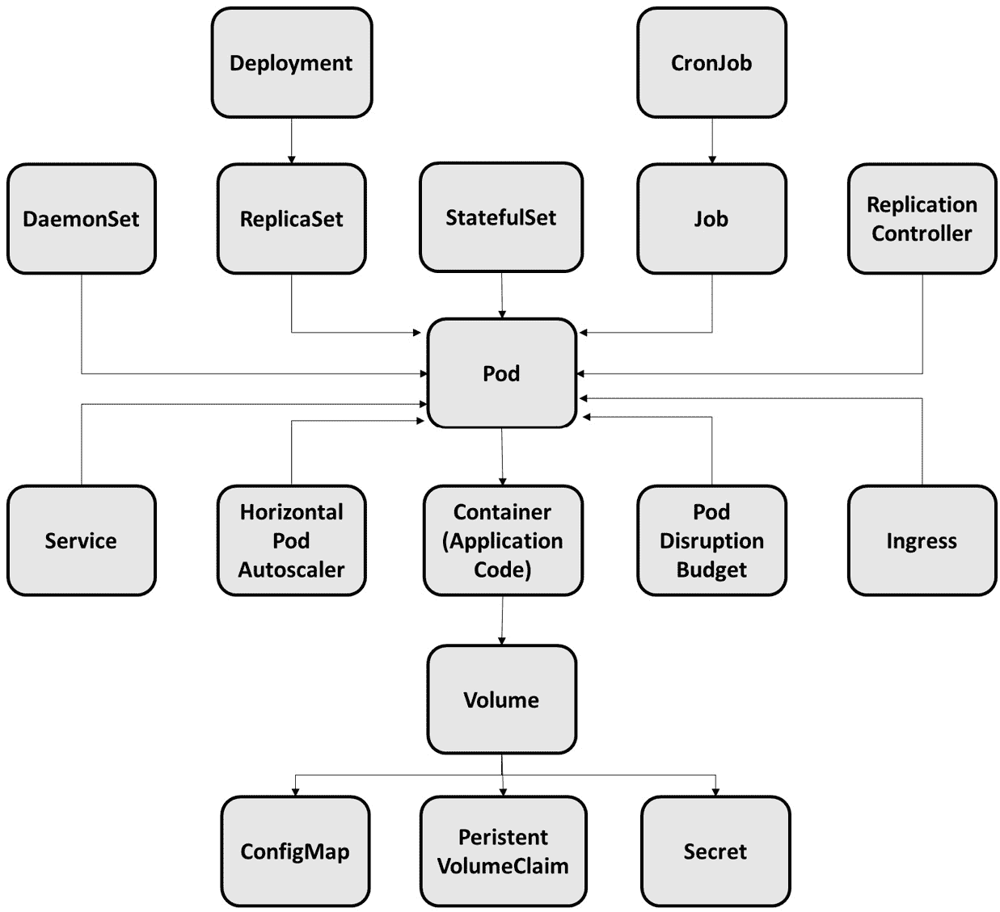

# 第一章：开始使用 Kubernetes

**Kubernetes**是一个开源容器编排引擎，自动化了容器应用程序的部署、扩展和管理。自 7 年前首次发布以来，它在短短的时间内取得了巨大的进展。它曾经需要与像 Cloud Foundry Diego、CoreOS 的 Fleet、Docker Swarm、Kontena、HashiCorp 的 Nomad、Apache Mesos、Rancher 的 Cattle、Amazon ECS 等容器编排引擎竞争并超越它们。如今，Kubernetes 正在一个完全不同的环境中运行。这表明，开发人员只需要掌握一个容器编排引擎，就能够应对 90%的容器相关工作。

Kubernetes 容器编排框架是一个适用于生产的开源平台，建立在谷歌 15 年以上运行生产工作负载的经验基础上，同时结合了社区贡献的最佳实践和理念。Kubernetes 将应用程序的容器划分为逻辑单元，以便更容易地进行管理和发现。容器（cgroups）自 2007 年初首次被包含在主线 Linux 内核中以来便存在。容器的小巧和可移植性使得它能够比虚拟机容纳更多的容器，降低了基础设施成本，并使得更多的程序能够更快地部署。然而，直到 Docker（2013 年）问世之前，由于可用性问题，它并未引起显著关注。

Docker 与标准虚拟化不同；它基于操作系统级虚拟化。容器不同于使用中介层（虚拟机监控器）在物理硬件上运行虚拟机的虚拟化，容器运行在操作系统内核之上的用户空间中。因此，容器非常轻量且快速。这可以从下图中看到：


图 1.1 – 虚拟机与容器

Kubernetes 容器编排框架自动化了运行容器化工作负载和服务所需的大部分操作工作。这涵盖了资源配置、部署、扩展（上下）、网络、负载均衡以及软件团队必须执行的其他任务，以管理容器的生命周期。Kubernetes 为开发人员带来的一些关键好处如下：

+   **声明式应用拓扑**：描述了每个服务的实现方式，以及它们对其他服务的依赖关系和资源需求。由于我们将这些数据以可执行格式呈现，我们可以在开发初期就测试应用的部署部分，并将其视为可编程的应用基础设施：


图 1.2 – 声明式应用拓扑

+   **声明式服务部署**：一组容器的更新和回滚过程被封装，使其成为一个重复的自动化过程。

+   **动态部署应用程序**：这允许根据应用程序需求、可用资源和管理策略，在集群上以可预测的顺序部署应用程序。

+   **灵活的调度器**：在定义条件方面具有很大的灵活性，能够将 Pods 分配到满足这些条件的特定或一组工作节点。

+   **应用程序弹性**：容器和管理平台通过多种方式帮助应用程序提高韧性，如下所示：

    +   资源消耗策略，如 CPU 和内存配额

    +   使用断路器、超时、重试等处理故障

    +   故障切换和服务发现

    +   自动扩展和自愈

+   **自服务环境**：这些环境允许团队和个人实时从集群中创建隔离的环境，用于持续集成/持续交付（CI/CD）、实验和测试。

+   **服务发现、负载均衡和断路器**：在不使用应用程序代理的情况下，服务可以发现并消费其他服务。这里列举的内容远不止这些。

本章将涵盖以下主要内容：

+   容器的演变

+   Kubernetes 概述 – 理解 Kubernetes 组件

+   理解 Pods

+   理解部署（Deployments）

+   理解 StatefulSets 和 DaemonSets

+   理解作业和 CronJobs

+   理解服务

# 容器的演变

容器技术是一种将应用程序打包的方式，使其能够在分离的依赖项中运行，计算机系统的隔离性已经彻底改变了今天的软件开发。在本节中，我们将探讨一些关键方面，包括这项技术的起源以及容器技术背后的背景：


图 1.3 – 容器技术简史

早期的容器（带有 Unix 版本 7 的 chroot 系统），在 1970 年代开发，提供了一种隔离的环境，使服务和应用程序能够在不干扰其他进程的情况下运行，从而为程序、服务和其他进程的测试创建了沙箱。最初的概念是将容器的工作负载与生产系统的工作负载分离，使开发者能够在不干扰其他服务的情况下，在生产硬件上测试他们的应用程序和过程。随着时间的推移，容器在用户、数据、网络等方面的隔离能力不断提升。

随着 2000 年代初期 Free BSD Jails 的发布，容器技术终于得到了广泛关注。"Jails" 是计算机分区，可以在同一系统上有多个监狱/分区。这种监狱架构是在 2001 年通过 Linux VServer 开发的，它包括资源分区，并在 2005 年通过 OpenVZ 与 Linux 内核连接。监狱架构与边界分离技术合并，成为了 2004 年的 Solaris 容器。

容器技术在 2006 年引入控制组后得到了显著进展。控制组（或 cgroups）用于跟踪和隔离资源使用情况，如 CPU 和内存。它们很快被采纳，并在 2008 年的**Linux 容器**（**LXC**）中得到了改进，这是当时最完整和稳定的容器技术版本，因为它在运行时不需要对 Linux 内核进行任何更改。许多新技术因为 LXC 的可靠性和稳定性而应运而生，最早的是 2011 年的 Warden，更重要的是 2013 年的 Docker。

自 2013 年以来，容器得到了广泛应用，因为许多 Linux 发行版发布了新的部署和管理工具。运行在 Linux 系统上的容器已经转变为操作系统级别的虚拟化解决方案，旨在为单个 Linux 主机提供多个隔离的 Linux 环境。Linux 容器无需拥有自己的客户操作系统；它们共享主机操作系统的内核。容器的启动速度远快于虚拟机，因为它们不需要专门的操作系统。

容器可以利用 Linux 内核技术，如命名空间、Apparmor、SELinux 配置文件、chroot 和 cgroups 来创建一个隔离的操作环境，同时 Linux 安全模块提供额外的保护，确保容器无法访问主机机器或内核。从 Linux 角度看，容器化通过允许容器在同一 CPU 架构下运行各种 Linux 发行版，提供了更大的灵活性。

Linux 容器为我们提供了一种基于各种 Linux 发行版构建容器镜像的方法，以及一个管理容器生命周期的 API。Linux 发行版还包括用于处理 API 的客户端工具，以及快照功能和支持将容器实例从一个容器主机迁移到另一个容器主机的功能。

然而，虽然在 Linux 平台上运行的容器拓宽了其适用性，但它们仍然面临一些基本的难题，包括统一管理、真正的可移植性、兼容性和扩展控制。

Apache Mesos、Google Borg 和 Facebook Tupperware 的出现，标志着容器编排和集群管理能力的显著进展，这些平台提供了不同程度的容器编排和集群管理功能，允许即时创建数百个容器，并提供支持自动故障转移等容器大规模管理所需的关键功能。然而，直到 Docker —— 容器的一种变体 —— 的出现，容器革命才真正开始。

由于 Docker 的流行，出现了多个管理平台，包括 Marathon、Kubernetes、Docker Swarm，以及更广泛的 DC/OS 环境，Mesosphere 基于 Mesos 构建了该环境来管理不仅是容器，还包括各种遗留应用程序和数据服务，例如使用 Java 编写的程序。尽管每个平台在编排和管理上的方法不同，但它们都有一个共同的目标：使容器在工作场所中更加主流。

容器技术的势头在 2017 年随着 Kubernetes 的发布而加速，Kubernetes 是一种高效的容器编排解决方案。Kubernetes 被 CNCF 采纳并获得 Docker 的支持后，成为行业标准。因此，结合 Kubernetes 和其他容器工具的使用成为了行业的标准做法。

随着 cgroups v2（Linux 版本 4.5）的发布，增加了多个新特性，包括无根容器、增强的管理功能，以及最重要的，cgroup 控制器的简化。

在过去几年中，容器的使用爆炸式增长（[`juju.is/cloud-native-kubernetes-usage-report-2021`](https://juju.is/cloud-native-kubernetes-usage-report-2021)），不仅在新兴的 "*云原生*" 应用中，也在 IT 组织希望将现有遗留程序“容器化”以便更容易迁移到云端的场景中。随着云原生开发方法的成熟，容器现已成为应用交付的事实标准。

我们将在下一节中深入探讨 Kubernetes 组件。

# Kubernetes 概述 – 理解 Kubernetes 组件

在本节中，我们将介绍 Kubernetes 系统的各个组件及其抽象。

下图展示了构建一个功能齐全的 Kubernetes 集群所需的各个组件：


图 1.4 – 一个 Kubernetes 系统及其抽象

让我们描述一下 Kubernetes 集群的组件：

+   *节点*，即运行容器化工作单元的工作机器，构成了 Kubernetes 集群。每个集群至少有一个工作节点。

+   有一个 API 层（Kubernetes API）可以与 Kubernetes 集群进行通信，用户可以通过一个名为 *kubectl* 的命令行界面访问该层。

在 Kubernetes 集群中有两种资源类型（如前面的图所示）：

+   控制平面，负责控制和管理集群

+   节点，即运行应用程序的工作节点

所有在集群中的操作都由控制平面协调，包括应用程序调度、维持应用程序的预期状态、扩展应用程序以及部署新更新。

集群的节点可以是**虚拟机**（**VMs**）或作为工作机器的物理计算机。Kubelet 是一个节点管理代理，它将每个节点连接到 Kubernetes 控制平面。容器管理工具，如 Docker，也应该在节点上存在。

控制平面执行命令以启动应用程序容器，每当需要在 Kubernetes 上启动应用程序时。容器由控制平面调度到集群的节点上运行。

节点通过控制平面提供的 Kubernetes API 连接到控制平面。Kubernetes API 允许最终用户直接与集群接口。主组件提供集群的控制平面功能。

API 服务器、控制器管理器和调度器是构成 Kubernetes 控制平面的三个进程。Kubernetes API 通过 API 服务器暴露，它是 Kubernetes 控制平面的前端。控制器管理器负责管理集群的控制器，这些控制器处理日常活动。调度器监视没有分配节点的新 pod，并为其分配一个节点。集群中的每个工作节点负责以下进程：

+   **Kubelet**：负责与 Kubernetes 主控平面进行所有通信。

+   **kube-proxy**：处理每个节点上的所有网络代理服务。

+   容器运行时，例如 Docker。

控制平面组件负责做出全局集群决策（如应用程序调度），以及监控和响应集群事件。对于集群，有一个基于 Web 的 Kubernetes 仪表盘。这允许用户管理和调试基于集群的应用程序以及集群本身。Kubernetes 集群可以运行在各种平台上，包括你的笔记本电脑、云托管的虚拟机和裸机服务器。

**MicroK8s** 是一种简化的 Kubernetes 实现，它在本地工作站上构建一个 Kubernetes 集群，并在仅包含一个节点的小集群上部署所有 Kubernetes 服务。它可以用来在本地 Kubernetes 环境中进行实验。MicroK8s 兼容 Linux、macOS X、树莓派和 Windows，并可以用于本地 Kubernetes 设置的实验或边缘生产用例。启动、停止、查看状态和删除是 MicroK8s CLI 提供的基本引导程序，用于与集群进行交互。我们将在下一章学习如何安装 MicroK8s，检查安装状态，监控和控制 Kubernetes 集群，以及部署示例应用和附加组件。

除了*图 1.4*中列出的组件外，系统状态的其他对象也存在。以下是一些最基本的 Kubernetes 对象：

+   Pod

+   部署（Deployments）

+   有状态集（StatefulSets）和守护进程集（DaemonSets）

+   作业（Jobs）和定时作业（CronJobs）

+   服务（Services）

在 Kubernetes 系统中，Kubernetes 对象是持久性实体。这些实体由 Kubernetes 用来表示集群的状态。一旦创建，Kubernetes 将无限期地运行，以验证该对象是否存在。你只是通过构建一个对象来告诉 Kubernetes 框架你的集群工作负载应该是什么样子；这就是你集群的理想状态。无论是创建、更新还是删除 Kubernetes 对象，你都必须使用 Kubernetes API 与其交互。例如，当你使用 `kubectl` 命令行界面时，CLI 会处理所有 Kubernetes API 查询。你也可以通过使用任何客户端库，在你的应用程序中直接访问 Kubernetes API。以下图示展示了各种 Kubernetes 对象：



图 1.5 – Kubernetes 对象概述

Kubernetes 提供了前述的一组对象（如 Pod、服务和控制器）来满足我们应用程序的需求并推动其架构。我们用来构建任何新服务的设计原则和设计模式，都是由这些新的原始对象和平台能力决定的。例如，*部署*对象是一个 Kubernetes 对象，可以表示在集群中运行的应用程序。当你构建*部署*时，可以指示在*部署*规范中应运行三个副本。Kubernetes 系统解析*部署*规范，并部署你所需应用的三个实例，根据需要调整其状态。如果这些实例中的任何一个因任何原因失败，Kubernetes 框架会通过纠正规范和状态之间的不一致来响应这一变化——在这种情况下，通过建立一个新的实例。

理解 Kubernetes 如何工作是至关重要的，但理解如何与 Kubernetes 进行通信同样重要。在下一节中，我们将讨论与 Kubernetes 集群交互的一些方式。

## 与 Kubernetes 集群交互

在本节中，我们将探讨与 Kubernetes 集群交互的不同方式。

**Kubernetes 仪表盘**是一个可以通过 Web 访问的用户界面。它可用于将容器化应用程序部署到 Kubernetes 集群，进行故障排除并控制集群资源。该仪表盘可用于多种用途，包括以下几项：

+   所有节点和持久存储卷都列在 **管理员** 概览中，并附有每个节点的汇总指标。

+   **工作负载**视图显示了按命名空间列出的所有正在运行的应用程序，以及当前 Pod 的内存利用率和在部署中当前就绪的 Pod 数量。

+   **发现**视图显示了已公开并启用集群发现的服务列表。

+   你可以通过 **日志** 视图深入查看属于同一个 Pod 的容器的日志。

+   对于每个集群中的应用程序以及集群中运行的所有 Kubernetes 资源，**存储**视图会识别任何持久卷声明。


图 1.6 – Kubernetes 仪表盘

+   借助 Kubernetes 命令行工具 `kubectl`，你可以对 Kubernetes 集群执行命令。`kubectl` 是一个命令行工具，用于部署应用程序、检查和管理集群资源以及查看日志。`kubectl` 可以安装在各种 Linux、macOS 和 Windows 平台上。

`kubectl` 的基本语法如下：

```
kubectl [command] [type] [name] [flags]
```

让我们更详细地查看一下`command`、`type`、`name`和`flags`：

+   `command`：这定义了你希望在一个或多个资源上执行的操作，如`create`、`get`、`delete`和`describe`。

+   `type`：这定义了资源的类型，如 Pods 和 Jobs。

+   `name`：这定义了资源的名称。名称区分大小写。如果省略名称，则显示所有资源的详细信息；例如，`kubectl get pods`。

+   `flags`：这定义了可选的标志。

在接下来的章节中，我们将更详细地了解这些 Kubernetes 对象。

# 理解 Pods

Pods 是在 Kubernetes 中构建和管理的最小可部署计算单元。它们由一个或多个共享存储和网络资源以及运行指令的容器组成。Pods 具有以下组件：

+   一个专用的 IP 地址，使它们能够相互通信

+   基于应用程序需求的持久存储卷

+   决定容器如何运行的配置信息

以下图示展示了 Pod 的各个组件：


图 1.7 – Pod 的组件

被称为工作负载资源的控制器创建 pod，并监督 pod 在集群中的部署、复制和健康状态。

最常见的控制器类型如下：

+   **Jobs** 适用于短生命周期的批处理任务，这些任务会执行直到完成。

+   **部署**适用于无状态和持久化的应用程序，如 Web 服务器。

+   **StatefulSets** 适用于既有状态又持久化的应用程序，如数据库。

这些控制器使用来自 pod 模板的配置信息构建 pod，并通过在部署中指定的实例数创建副本，确保运行的 pod 满足 pod 模板中提供的部署规范。

如前所述，Kubectl 命令行界面包括各种命令，允许用户构建 pods、部署它们、检查正在运行的 pod 状态，并删除不再需要的 pod。

以下是最常用的关于 pods 的 `kubectl` 命令：

+   `create` 命令创建 pod：

    ```
    kubectl create -f FILENAME.
    ```

例如，`kubectl create -f ./mypod.yaml` 命令将从 `mypod` YAML 文件创建一个新的 pod。

+   `get pod`/`pods` 命令将显示一个或多个资源的信息。可以使用相应的标签选择器来过滤信息：

    ```
    kubectl get pod pod1
    ```

+   `delete` 命令删除 pod：

    ```
    kubectl delete -f FILENAME.
    ```

例如，`kubectl delete -f ./mypod.yaml` 命令将从集群中删除 `mypod` pod。

由此我们了解到，pod 是 Kubernetes 应用程序的最小单元，由一个或多个 Linux 容器组成。在下一部分中，我们将学习部署。

# 理解部署

部署允许你对 pods 和 ReplicaSets 进行声明式的变更。你可以为部署提供期望的状态，部署控制器将逐步将实际状态更改为期望状态。

部署可用于创建新的 ReplicaSets，或者用新的部署替换现有部署。当新版本准备好上线时，部署可以通过使用预定义规则轻松处理升级，且无需停机。以下图示展示了一个部署的示例：


图 1.8 – 部署

以下是一个部署的示例。它创建了一个 ReplicaSet 来启动三个 `nginx` pod：

```
apiVersion: apps/v1
kind: Deployment
metadata:
  name: nginx-sample-deployment
  labels:
    app: nginx
spec:
  replicas: 3
  selector:
    matchLabels:
      app: nginx
  template:
    metadata:
      labels:
        app: nginx
    spec:
      containers:
      - name: nginx
        image: nginx:1:21
        ports:
        - containerPort: 80
```

在上述示例中，发生了以下情况：

+   创建了一个名为 `nginx-sample-deployment` 的部署，正如 `metadata.name` 字段所示。

+   此部署的镜像由 `Spec.containers.image` 字段设置（`nginx:latest`）。

+   部署创建了三个副本 pod，如 `replicas` 字段所示。

最常用的关于部署的 `kubectl` 命令如下：

+   `apply` 命令创建 pod：

    ```
    kubectl apply -f FILENAME.
    ```

例如，`kubectl apply -f ./nginx-deployment.yaml` 命令将从 `nginx-deployment.yaml` YAML 文件创建一个新的部署。

+   `get deployments` 命令检查部署的状态：

    ```
    kubectl get deployments 
    ```

这将产生以下输出：

```
NAME               READY   UP-TO-DATE   AVAILABLE   AGE
nginx-sample-deployment   3/3     0            0           1s
```

显示以下字段：

+   `NAME` 表示命名空间中部署的名称。

+   `READY` 显示有多少副本的应用程序可用。

+   `UP-TO-DATE` 显示已更新到达所需状态的副本数量。

+   `AVAILABLE` 显示可用副本的数量。

+   `AGE` 表示应用程序运行的时间长度。

+   `describe deployments` 命令显示部署的详细信息：

    ```
    kubectl describe deployments
    ```

+   `delete` 命令删除由 `apply` 命令创建的部署：

    ```
    kubectl delete -f FILENAME.
    ```

通过这一点，我们已经了解到，部署用于定义应用程序的生命周期，包括使用哪个容器镜像、应该有多少个 Pod，以及它们如何更新。在下一节中，我们将探讨 StatefulSets 和 DaemonSets。

# 理解 StatefulSets 和 DaemonSets

在本节中，我们将介绍两种在 Kubernetes 上部署应用程序的不同方法：使用 StatefulSets 和 DaemonSets。

## StatefulSets

StatefulSet API 对象用于处理有状态的应用程序。像部署一样，StatefulSet 处理具有相同容器规范的 Pod。不同于部署，StatefulSet 为每个 Pod 保持持久的身份。虽然这些 Pod 是基于相同的规范生成的，但它们不能相互替换：每个 Pod 都有一个独特的身份，并且这个身份会在任何重新调度过程中保留。

以下示例演示了 StatefulSet 的组成部分：

```
apiVersion: v1
kind: Service
metadata:
  name: nginx
  labels:
    app: nginx
spec:
  ports:
  - port: 80
    name: web
  clusterIP: None
  selector:
    app: nginx
---
apiVersion: apps/v1
kind: StatefulSet
metadata:
  name: web
spec:
  selector:
    matchLabels:
      app: nginx 
  serviceName: "nginx"
  replicas: 3 
  template:
    metadata:
      labels:
        app: nginx 
    spec:
      containers:
      - name: nginx
        image: nginx:latest
        ports:
        - containerPort: 80
          name: web
        volumeMounts:
        - name: www_volume
          mountPath: /usr/share/nginx/html
  volumeClaimTemplates:
  - metadata:
      name: www_volume
    spec:
      accessModes: [ "ReadWriteOnce" ]
      storageClassName: "my-storage-class"
      resources:
        requests:
          storage: 10Gi
```

在前面的示例中，我们有以下内容：

+   `nginx` 是一个无头服务，用于控制网络域。

+   `web` 是一个 StatefulSet，它的规范指示将在独立的 Pod 中启动三个来自 `nginx` 容器的副本。

+   `volumeClaimTemplates` 将使用由 PersistentVolume 提供者提供的 PersistentVolumes 来提供稳定的存储。

现在，让我们继续讨论 DaemonSets。

## DaemonSets

DaemonSet 确保所有（或部分）节点上都有一个副本的 Pod 在运行。随着节点被添加到集群中，Pod 会被添加到这些节点上。随着节点从集群中移除，Pod 会被清理。当你删除一个 DaemonSet 时，它产生的 Pod 也会被删除。

以下是一些关于 DaemonSets 的示例用例：

+   在每个节点上运行一个守护进程以进行集群存储，例如 `glusterd` 和 `ceph`。

+   在每个节点上运行一个守护进程以收集日志，例如 `Fluentd`、`FluentBit` 和 `logstash`。

+   在每个节点上运行一个守护进程以进行监控，例如 Prometheus Node Exporter、`collectd` 或 Datadog agent。

以下代码展示了一个正在运行 `fluent-bit` Docker 镜像的 DaemonSet：

```
apiVersion: apps/v1
kind: DaemonSet
metadata:
  name: fluent-bit
  namespace: kube-system
  labels:
    k8s-app: fluent-bit
spec:
  selector:
    matchLabels:
      name: fluent-bit
  template:
    metadata:
      labels:
        name: fluent-bit
    spec:
      tolerations:
      - key: node-role.kubernetes.io/master
        operator: Exists
        effect: NoSchedule
      containers:
      - name: fluent-bit
        image: fluent/fluent-bit:latest
        resources:
          limits:
            memory: 200Mi
          requests:
            cpu: 100m
            memory: 200Mi
```

在前面的示例中，`fluent-bit` DaemonSet 的规范告诉 `fluent-bit` 在所有节点上运行。

关于 DaemonSets，最常用的 `kubectl` 命令如下：

+   `create` 或 `apply` 命令创建 DaemonSet：

    ```
    kubectl apply -f FILENAME.
    ```

例如，`kubectl apply -f ./daemonset-deployment.yaml` 命令将从 `daemonset-deployment.yaml` YAML 文件创建一个新的 DaemonSet。

+   `get daemonset` 命令用于监控 DaemonSet 的状态：

    ```
    kubectl get daemonset 
    ```

这将产生以下输出：

```
NAME               READY   UP-TO-DATE   AVAILABLE   AGE
daemonset-deployment   3/3     0            0           1s
```

显示以下字段：

+   `NAME` 表示命名空间中 DaemonSets 的名称。

+   `READY` 显示应用程序可用的副本数量。

+   `UP-TO-DATE` 显示已更新的副本数，以实现所需状态。

+   `AVAILABLE` 显示应用程序可用的副本数量。

+   `AGE` 表示应用程序运行的时间长度。

+   `describe daemonset` 命令显示 DaemonSets 的详细信息：

    ```
    kubectl describe daemonset
    ```

+   `delete` 命令删除由 `apply` 命令创建的部署：

    ```
    kubectl delete <<daemonset>>
    ```

这样，我们已经学到，DaemonSet 确保所有或一组节点都运行一个 Pod 副本，而 StatefulSet 用于管理有状态应用程序。在下一节中，我们将学习作业和 CronJobs。

# 理解作业和 CronJobs

在本节中，我们将学习如何使用 Kubernetes 作业构建执行特定任务的临时 Pod。CronJobs 类似于作业，但它们根据设定的时间表运行任务。

## 作业

一个作业启动一个或多个 Pod，并继续尝试执行它们，直到特定数量的 Pod 成功。作业会跟踪成功完成的 Pod 数量。当满足成功完成的数量时，任务（即作业）完成。

当您删除作业时，它也会删除所有由其创建的 Pod。暂停作业会导致所有当前的 Pod 被删除，直到作业恢复。以下代码显示了一个每分钟运行的作业配置，并打印 `example Job Pod is Running` 作为其输出：

```
apiVersion: batch/v1
kind: Job
metadata:
  name: example-job
spec:
 template:
    spec:
      containers:
      - name: example-job
        image: busybox
        command: ['echo', 'echo example Job Pod is Running']
      restartPolicy: OnFailure
      backoffLimit: 4
```

关于作业的最常用 `kubectl` 命令如下：

+   `create` 或 `apply` 命令创建 Pod：

    ```
    kubectl apply -f FILENAME.
    ```

例如，`kubectl apply -f ./jobs-deployment.yaml` 命令将从 `jobs-deployment.yaml` YAML 文件创建新的作业。

+   `describe jobs` 命令显示作业的详细信息：

    ```
    kubectl describe jobs <<job name>>
    ```

## CronJob

CronJob 是一个定期创建的作业。它相当于 crontab（cron 表格）文件中的一行。它定期执行以 Cron 格式编写的作业。

CronJobs 用于自动化常见的过程，如备份和报告生成。您可以通过将每个作业设置为无限次重复（例如每天、每周或每月一次）来决定何时开始工作。

以下是一个 CronJob 示例，它每分钟打印 `example-cronjob Pod is Running` 输出：

```
apiVersion: batch/v1
kind: CronJob
metadata:
  name: example-cronjob
spec:
  schedule: "*/1 * * * *"
  jobTemplate:
    spec:
      template:
        spec:
          containers:
          - name: example-cronjob
            image: busybox
            imagePullPolicy: IfNotPresent
            command:
            - /bin/sh
            - -c
            - date; echo example-cronjob Pod is Running ; sleep 5
          restartPolicy: OnFailure
```

在这里，`schedule: /1 *` 表示在 Linux 系统中使用的是 crontab 语法。

作业和 CronJobs 是 Kubernetes 的关键组件，特别用于执行批处理过程和其他关键的临时任务。我们将在下一节中讨论服务抽象。

# 理解服务

在 Kubernetes 中，带有 `app=exampleApp` 标签的 `9876`：

```
apiVersion: v1
kind: Service
metadata:
  name: example-service
spec:
  selector:
    app: exampleApp
  ports:
    - protocol: TCP
      port: 80
      targetPort: 9876
```

在前面的示例中，创建了一个名为 `example-service` 的新 `Service` 对象，将 TCP 端口 `9876` 路由到具有 `app=exampleApp` 标签的任何 pod。Kubernetes 会为该服务分配一个 IP 地址，供服务代理使用。简单来说，Kubernetes 服务将一组 pods 连接到一个抽象的服务名称和 IP 地址。服务提供了 pods 之间的发现和路由。例如，服务将应用程序的前端与其后端连接，这两个部分部署在不同的集群部署中。服务通过标签和选择器来匹配与其他应用程序的 pods。

Kubernetes 服务的核心属性如下：

+   定位 pods 的标签选择器

+   集群的 IP 地址和分配的端口号

+   端口定义

+   （可选）将入站端口映射到 targetPort

Kubernetes 会自动分配一个集群 IP 地址，供服务代理路由流量使用。选择器的控制器将检查与定义的标签匹配的 pods。一些应用程序需要通过服务暴露多个端口。Kubernetes 通过使用多端口服务来简化这一点，用户可以在单个服务对象中定义多个端口。

在以下示例中，我们已将端口 `80` 和 `443` 暴露到目标端口 `8080` 和 `8090`，以便使用 `app=webserver-nginx-multiport-example` 选择器将 HTTP 和 HTTPS 流量路由到任何底层的 pods：

```
apiVersion: v1
kind: Service
metadata:
  name: nginx-service
spec:
  selector:
    app: webserver-nginx-multiport-example
  ports:
    - name: http
      protocol: TCP
      port: 80
      targetPort: 8080
    - name: https
      protocol: TCP
      port: 443
      targetPort: 8090
```

也可以不使用选择器来定义服务；但必须显式地使用 `endpoints` 对象连接服务（IP 地址、端口等）。这是因为与选择器不同，Kubernetes 不知道服务应该连接到哪些 pods，因此不会自动构建 `endpoint` 对象。

没有选择器的服务的一些使用案例如下：

+   连接到不同命名空间或集群中的另一个服务

+   与外部服务的通信、数据迁移、测试服务、部署等

让我们创建一个包含三个副本的 Apache Web 服务器部署：

```
apiVersion: apps/v1
kind: Deployment
metadata:
  name: apache-deployment
  labels:
    app: webserver
spec:
  replicas: 3
  selector:
    matchLabels:
      app: webserver
  template:
    metadata:
      labels:
        app: webserver
    spec:
      containers: 
      - name: apache
        image: httpd:latest
        ports:
        - containerPort: 80
```

使用以下命令创建部署：

**kubectl apply -f apache-deployment.yaml**

以下是最常见的服务类型：

+   **ClusterIP**：这是默认类型，并通过集群的内部 IP 地址暴露服务。这些服务仅在集群内可访问。因此，用户需要实现端口转发或代理，以将 ClusterIP 暴露给更广泛的流量入口。

+   `NodeIP:NodePort>` 允许用户从外部与服务进行通信。

+   **LoadBalancer**：这是将集群暴露到更广泛互联网的首选解决方案。LoadBalancer 类型的服务会创建一个负载均衡器（负载均衡器的类型取决于云提供商），并将服务暴露到外部。它还会自动创建 ClusterIP 和 NodePort 服务，并相应地路由流量。

+   `externalName ex.sampleapp.test.com` 字段通过返回 `CNAME` 记录的值来实现。

# 总结

总结来说，Kubernetes 是一个容器编排系统，它维护一个高度可用的机器集群，这些机器作为一个整体协同工作。在本章中，我们发现 Kubernetes 支持多种抽象，使得容器化应用能够部署到集群中，而不受限于特定的机器。我们还了解了 pods 代表了集群中一组正在运行的容器。部署（Deployment）非常适合在集群上管理无状态的应用工作负载。StatefulSets 可以用于运行一个或多个连接的 pods 来管理有状态应用，而 DaemonSets 则指定 pods 并提供节点特定的功能。最后，jobs 和 CronJobs 负责批处理和其他关键的临时任务。简而言之，Kubernetes 是一个便携、可扩展、自愈的容器编排系统。

在下一章，我们将了解被称为 MicroK8s 的轻量级 Kubernetes 引擎，它可以运行在边缘计算、物联网和设备上。MicroK8s 同样非常适合离线原型设计、测试和开发。
