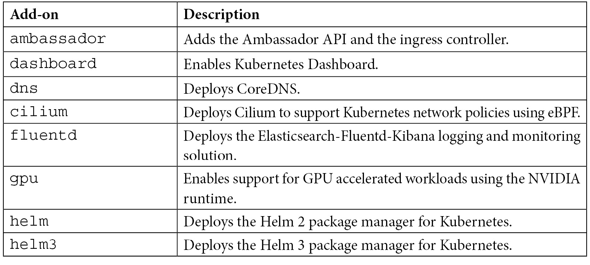

# 2

# 介绍 MicroK8s

**Kubernetes** 是全球最流行的容器应用编排技术，能够自动化它们的部署和扩展，同时简化维护工作。Kubernetes 自身也有一套复杂性。那么，组织如何利用容器化来应对复杂性，同时避免增加 Kubernetes 的复杂性呢？

**Canonical 的 MicroK8s** 是一个强大的云原生计算基金会认证的 Kubernetes 发行版。以下是它成为强大企业计算平台的一些关键原因：

+   **以 snap 包的形式交付**：这些是桌面、云甚至 **物联网** (**IoT**) 设备的应用包，易于安装并通过自动更新进行安全保护，支持安装在任何支持 snap 的 Linux 发行版上。

+   **严格的隔离**：确保与底层操作系统完全隔离，提供一个适合生产环境的高度安全的 Kubernetes 环境。

+   **生产级附加组件**：例如 Istio、Knative、CoreDNS、Prometheus、Jaeger、Linkerd、Cilium 和 Helm 等附加组件可用。它们易于设置，只需要几行命令。为了更好的 **人工智能** (**AI**) 和 **机器学习** (**ML**) 能力，Kubeflow 也作为 MicroK8s 的附加组件提供。

MicroK8s 通过降低复杂性来加速 Kubernetes 部署。将设备视为分布式容器化程序，使开发人员能够专注于应用而非基础设施，从而使运维团队的工作变得更加轻松。

MicroK8s 使你能够将多个 Kubernetes 安装合并为一个集群，并在一个或多个节点上分配工作负载。在本章中，我们将介绍以下主要内容：

+   介绍 MicroK8s Kubernetes

+   快速安装

+   部署示例应用

+   启用附加组件

+   启动/停止 MicroK8s

+   配置 MicroK8s 使用本地镜像

+   配置 MicroK8s 使用内置镜像仓库

+   配置 MicroK8s 使用私有/公共镜像仓库

+   配置 MicroK8s 服务

+   排查应用和集群问题

# 介绍 MicroK8s Kubernetes

MicroK8s 是一个生产级的 Kubernetes 发行版，既强大又轻量，且可靠。它是面向企业的 Kubernetes 发行版，具有较小的内存和磁盘占用，同时预安装了如 Istio、Knative、Grafana、Cilium 等附加组件。无论你是在运行生产环境，还是刚刚开始使用 Kubernetes，MicroK8s 都能满足你的需求。

任何曾尝试使用 Kubernetes 的人都知道，要使其部署起来非常困难。市场上有其他极简主义解决方案，它们减少了部署时间和复杂性，但代价是缺少关键的可扩展性和附加组件。

MicroK8s 让你在 60 秒内就能开始使用 Kubernetes，所以你无需浪费太多时间来克服障碍。

一些关键功能如下：

+   **最小**：对于笔记本电脑和工作站开发，开发者需要最小的 Kubernetes 解决方案。在 Ubuntu 上运行时，MicroK8s 是一个自包含的 Kubernetes 集群，可以与 Azure AKS、Amazon EKS 和 Google GKE 一起使用。

+   **简单**：通过使用单一安装包，降低管理和操作成本。所有附加组件和依赖项都已包括在内。

+   **安全**：所有安全漏洞的更新都可用，可以立即应用或根据你的维护周期进行调度。

+   **最新**：MicroK8s 跟进上游 Kubernetes，发布 Beta、RC 和最终版本时与上游 Kubernetes 同步发布。

+   **完整**：MicroK8s 已包含一组精选的清单，适用于常见的 Kubernetes 功能和服务：

a. 自动更新到最新的 Kubernetes 版本

b. 服务网格：Istio 和 Linkerd

c. 无服务器：Knative 和 OpenFaaS

d. 监控：Fluentd、Prometheus 和 Grafana，度量

e. 入口、DNS、仪表板和集群

f. 用于 AI/ML 的 GPU 绑定

g. Cilium、Helm 和 Kubeflow

现在我们知道了 MicroK8s 是什么，接下来我们来看看如何轻松开始使用它。

# 快速安装

MicroK8s 通过 **snaps** 部署。Snaps 是容器化的软件包（类似于 Docker），易于创建和安装；它们捆绑了依赖项，并且可以在所有主要 Linux 系统上无修改地运行。Snaps 会自动更新，且运行安全。同时，请记住，MicroK8s snap 会频繁更新，以跟上 Kubernetes 的发布。

在接下来的部分，我们将指导你完成一个最小安装，并在介绍过程中逐步进行。

## 技术要求

对于最小安装，您需要以下内容：

+   你应该有一个 Linux 发行版，如 Ubuntu（20.04 LTS、18.04 LTS 或 16.04 LTS）环境来执行命令，或者任何支持 `snapd` 的其他操作系统。

+   推荐 4 GB 内存和 20 GB 磁盘空间。

## 步骤 1 – 安装

在接下来的步骤中，我们将安装一个 MicroK8s 集群。我们将安装一组有限的组件，如 `api-server`、`controller-manager`、`scheduler`、`kubelet`、`cni` 和 `kube-proxy`。

可以使用以下命令安装 MicroK8s snap：

```
sudo snap install microk8s --classic
```

以下命令执行输出确认 MicroK8s 已成功安装：


图 2.1 – MicroK8s 安装

当前，我使用的是托管在云端的 Ubuntu 虚拟机，但 MicroK8s 也可以安装在 Windows、macOS 和 Raspberry Pi 的 ARM 硬件上。对于其他平台，请参考以下链接：[https//microk8s.io/docs/install-alternatives](http://https//microk8s.io/docs/install-alternatives)。

重要提示

你还可以在安装 MicroK8s 时指定一个频道。指定的频道由两部分组成——*track*和*风险*级别。例如，要安装带有`stable`风险级别的 MicroK8s v1.20，执行以下操作：

**sudo snap install microk8s --classic --channel=1.20/stable**

当 MicroK8s 团队确定一个版本（*edge*和*candidate*）已准备就绪时，你的集群将更新为*stable*风险级别，表示没有用户在更危险的分支上运行相同版本时发现任何错误。

为了访问 Kubernetes，MicroK8s 包含它自己的`kubectl`版本。它可用于执行监控和控制 Kubernetes 集群的命令。MicroK8s 添加了`microk8s.kubectl`命令，以避免与现有的*kubectl*发生冲突并覆盖任何现有的 Kubernetes 配置文件。如果你只使用 MicroK8s，可以考虑使用以下命令创建一个别名：

```
sudo snap alias microk8s.kubectl kubectl
```

以下命令执行输出确认别名已成功添加：


图 2.2 – kubectl – 添加别名

到此为止，你已经安装了 MicroK8s。在接下来的步骤中，我们将验证安装是否成功。

## 步骤 2 – 验证安装

接下来，使用以下命令检查新部署的节点是否处于`Ready`状态：

```
kubectl get nodes
```

以下是命令执行输出：


图 2.3 – 验证安装

如果你看到*图 2.3*中显示的错误，说明 MicroK8s 没有足够的权限。MicroK8s 会创建一个组，以便更容易使用需要管理员权限的命令。为了通过将当前用户添加到该组来获取对`.kube`缓存目录的访问权限，请运行以下两个命令：

```
sudo usermod -a -G microk8s azureuser
sudo chown -f -R azureuser ~/.kube
```

以下是输出内容：


图 2.4 – 将用户添加到组中

如果你仍然收到错误信息，说明 MicroK8s 仍在后台启动节点。等待几分钟后再试。如果安装成功，你应该看到以下输出：


图 2.5 – 验证安装

你还可以使用`kubectl describe`命令来获取节点的详细信息，如下所示：


图 2.6 – 在节点上使用 describe 命令

到此为止，你已经拥有了一个完全功能的 Kubernetes 集群。总结一下，我们已经安装了 MicroK8s 并验证了安装是否成功。接下来，我们将部署一个示例应用程序到 MicroK8s 集群上。

# 部署示例应用程序

我们将部署`nginx` Web 服务器示例应用程序。它是通过`nginx` Web 应用程序响应客户端请求的软件：

```
kubectl create deployment nginx --image=nginx
```

以下命令执行输出表明部署没有错误，在接下来的步骤中，我们可以验证 Pods 是否已创建：


图 2.7 – 创建部署

检查`pods`状态，以验证应用是否已部署并正在运行：

```
kubectl get pods
```

以下命令执行输出表明 Pods 已创建并处于`Running`状态：


图 2.8 – 检查部署状态

`nginx`应用已经成功部署，因此可以通过以下命令暴露它：

```
kubectl expose deployment nginx \
--port 80 \
--target-port 80 \
--type ClusterIP \
--selector=run=nginx \
--name nginx
```

以下命令执行输出表明`nginx`应用已成功暴露：


图 2.9 – 暴露部署

你应该会看到一个新的服务和分配的`ClusterIP`地址：


图 2.10 – 获取 svc 和 ClusterIP 地址

现在服务已暴露到外部，我们可以启动浏览器，并通过从本地机器指向外部 IP 来访问`nginx`应用：


图 2.11 – nginx 登录页面

恭喜！你现在已成功将`nginx`应用部署到一个完全功能的 Kubernetes 集群，并通过 MicroK8s 完成。这将帮助你理解 MicroK8s 如何在不到 60 秒的时间内让你快速启动。在下一节中，我们将学习附加组件以及如何启用它们。

# 启用附加组件

为了提供一个纯粹、轻量化的 Kubernetes 版本，MicroK8s 使用了最基本的组件。只需几次敲击键盘，**附加组件**，即预打包的组件，可以为你的 Kubernetes 集群提供从简单 DNS 控制到使用 Kubeflow 进行机器学习的附加功能。

首先，应该启用 DNS 附加组件，以促进服务之间的通信。存储附加组件为需要存储的程序提供主机上的目录空间。

使用以下命令可以轻松设置：

```
microk8s enable dns storage
```

命令执行输出如下：


图 2.12 – 启用 DNS 和存储附加组件

有关可用的 MicroK8s 附加组件的完整列表，请参考*附加组件完整列表*部分。

启用附加组件后，使用以下命令检查是否可以启动所有附加服务的组件：

```
kubectl get all --all-namespaces
```

以下命令执行输出（在高亮部分）表明附加服务已经启动并且处于`Running`状态：


图 2.13 – 验证附加组件是否已启动

已启用的附加组件可以随时通过使用`disable`命令禁用：

```
microk8s disable dns
```

要检查可用和已安装插件的列表，请使用 `status` 命令，如下所示：


图 2.14 – 使用状态命令检查可用和已安装的插件列表

如果出现错误，MicroK8s 会为你提供故障排除工具，以检查出现了什么问题。在接下来的章节中，我们将学习如何使用故障排除工具。

## 插件完整列表

下表显示了撰写本文时的插件当前列表：



表 2.1 – MicroK8s 插件完整列表

我们现在已经了解了什么是插件，并且启用了几个插件，比如 `dns` 和 `storage`。我们也查看了插件的完整列表。在下一节中，我们将探讨如何启动/停止 MicroK8s 集群。

# 启动/停止 MicroK8s

MicroK8s 将无限期运行，除非你指示它 **停止**。使用这些简单的命令，你可以 *停止并启动* MicroK8s。

要停止 MicroK8s 集群，请使用 `microk8s stop` 命令：


图 2.15 – 使用停止命令停止 MicroK8s 集群

要启动 MicroK8s 集群，请使用 `microk8s start` 命令：


图 2.16 – 使用启动命令启动 MicroK8s 集群

如果 MicroK8s 在运行中，它会在重启后自动重新启动。如果不希望发生这种情况，只需在关闭计算机之前运行`microk8s stop`命令。

我们已经了解了如何启动和停止 MicroK8s 集群。在接下来的章节中，我们将探讨如何配置 MicroK8s 使用本地镜像。

# 配置 MicroK8s 使用本地镜像

**Kubernetes 编排框架**使用容器镜像来管理容器化应用程序。这些镜像可以在本地文件系统中，也可以从远程仓库下载。最流行的容器工具是 **Docker**。下图介绍了 Docker 的作用：


图 2.17 – Docker 的作用

假设我们已经在本地 Docker 镜像仓库中构建并提供了一个容器镜像。例如，在这里，我有一个 `nginx1.21` 镜像在本地 Docker 镜像仓库中：


图 2.18 – 来自本地 Docker 仓库的 Docker 镜像

`nginx1.21`本地镜像仅被 Docker 识别，MicroK8s Kubernetes 将不会意识到该镜像的存在。这是因为 MicroK8s Kubernetes 集群不包含您的本地 Docker *守护程序*。我们可以通过以下命令将 Docker 镜像推送到 MicroK8s 镜像缓存中，从本地 Docker 守护程序导出它：


图 2.19 – 推送 Docker 镜像

现在我们已将镜像导入到 MicroK8s 镜像缓存中，可以使用以下命令确认镜像是否存在：

```
microk8s ctr images ls
```

下面的命令执行输出显示我们的`nginx1.21`镜像在 MicroK8s 镜像缓存中可用：


图 2.20 – containerd 镜像列表

现在我们有了镜像，可以使用`microk8s kubectl apply -f <file>`命令将其部署到 MicroK8s Kubernetes。

在这里，我创建了带有部署说明的`nginx.local`文件：


图 2.21 – 带有部署说明的 nginx.local 文件

现在我们可以使用`kubectl apply`命令部署：


图 2.22 – 使用 apply 命令创建部署

创建部署后，使用`kubectl get deployment`命令检查部署状态：


图 2.23 – 检查部署状态

显示以下字段：

+   `NAME`表示命名空间中部署的名称。

+   `READY`表示应用程序的副本已准备就绪供用户使用。

+   `UP-TO-DATE`表示已更新以达到所需状态的副本数量。

+   `AVAILABLE`表示用户可用的副本数量。

+   `AGE`表示应用程序运行的时间。

Kubernetes 将会假装在`docker.io`的 Docker Hub 注册表中有一张镜像，它已经有了一个缓存副本。每当镜像发生变化时，可以重复此过程。

我们已经学习了如何使用本地构建的镜像而无需注册表。接下来，我们将学习如何使用 MicroK8s 内置的注册表来管理镜像。

# 配置 MicroK8s 以使用其内置注册表

通过减少上传和下载 Docker 镜像的时间，拥有私有 Docker 注册表可以帮助您提高生产效率。MicroK8s 附带的注册表托管在 Kubernetes 集群内，并作为本地主机端口`32000`上的`NodePort`服务访问。

重要提示

请注意，此注册表未经安全保护，需要额外步骤来限制外部访问（例如生产环境中）。

第一步是使用以下命令启用内建注册中心：


图 2.24 – 启用注册中心

如你所见，注册中心插件已设置了一个 40 Gi 持久化存储卷声明用于存储镜像。请注意，存储插件也已启用，并与注册中心一同启用存储声明。

现在我们已设置好注册中心，下一步是标记镜像并将其推送到内建注册中心：


图 2.25 – 标记 Docker 镜像

将标记后的镜像推送到内建镜像，如下所示：


图 2.26 – 推送标记后的镜像

重要提示

在某些 Docker 版本中，推送到此不安全的注册中心可能会失败，除非守护进程特别设置为信任它。

```
/etc/docker/daemon.json and restart the Docker daemon:
```

`{`

`"insecure-registries" : ["localhost:32000"]`

`}`

使用`docker images`命令检查镜像是否已标记：


图 2.27 – 检查图片是否被标记

现在我们有了镜像，可以使用`kubectl apply -f <file>`命令将其部署到 MicroK8s Kubernetes。

在这里，我已经创建了包含部署指令的`nginx.builtin`文件：


图 2.28 – 带有部署指令的 nginx.builtin 文件

到此为止，我们已准备好使用`kubectl apply`命令进行部署：


图 2.29 – 使用 apply 命令创建部署

创建部署时，使用`kubectl get deployment`命令检查部署状态：


图 2.30 – 使用 kubectl get deployment 命令检查部署状态

Kubernetes 将从内建的注册中心拉取镜像。如果镜像有变更，*构建*并*推送*镜像到内建注册中心可以重复进行，从而传播更新。如果你有专门的机器托管注册中心节点，你需要修改配置文件以指向该节点的 IP 地址。

在下一节中，我们将详细介绍如何配置 MicroK8s 从任何公共或私有注册中心拉取镜像的步骤。

# 配置 MicroK8s 使用私有/公共注册中心

MicroK8s 也可以从*私有*或*公共*注册中心拉取镜像，但在能够拉取容器镜像之前，MicroK8s Kubernetes 必须知道注册中心的端点。

假设有一个`10.131.231.155`，我们构建的镜像需要使用`IP 地址:端口/镜像:标签`的注册中心端点语法进行标记，如下所示：

```
docker build . -t 10.131.231.155:32000/nginx1.21:registry
```

重要提示

```
/etc/docker/daemon.json and restart the Docker daemon:
```

`{`

`"insecure-registries" : ["10.131.231.155:32000"]`

`}`

要将其推送到 `hub.docker.com`，使用 `docker login` 命令登录并推送标记为 `docker-hub-username/image-name:tag` 的镜像：

```
docker tag 87a94228f133 10.131.231.155:32000/nginx1.21:registry
```

一旦镜像被标记，将带标记的镜像推送到私有或公共注册表：

```
docker push 10.131.231.155:32000/nginx1.21:registry
```

现在我们已经有了镜像，可以像之前一样使用`kubectl apply -f <file>`命令来部署。在这里，我创建了一个包含部署指令的文件：


图 2.31 – 包含指令的部署文件

创建部署后，使用`kubectl get deployment`命令检查部署状态。

重要提示

在*生产*环境中，应该使用**私有安全注册表**，这种注册表更加安全，并限制特定用户/应用程序的访问。推荐的方法是通过 Docker 登录凭证创建一个密钥，并使用此密钥访问安全注册表。

总结一下，我们看了如何使用本地镜像或从公共或私有注册表获取的镜像来设置 MicroK8s。在下一节中，我们将学习如何配置 MicroK8s 的各种服务或组件。

# 配置 MicroK8s 服务

MicroK8s 由多个服务或组件构成，这些服务由多个系统守护进程管理。这些服务的配置文件存储在 `$SNAP_DATA` 目录下，通常指向 `/var/snap/microk8s/current`。

要重新配置服务，我们需要编辑相应的文件，然后重新启动相应的守护进程。下表展示了 MicroK8s 将要运行的*系统守护进程服务*：


表 2.2 – MicroK8s 系统守护进程服务列表

在下一节中，我们将探讨如何排查应用程序和集群层级的问题。

# 故障排除应用程序和集群问题

需要特别注意，可能会出现问题；这可能是 Kubernetes 组件本身的问题，也可能是 MicroK8s 组件的问题。在本节中，我们将介绍一些常见问题以及帮助您诊断问题的工具。

## 应用层

本节帮助用户调试部署在 Kubernetes 上但未按预期运行的应用程序。

检查**Pod**是排查问题的第一步。通过以下命令，您可以查看 Pod 的当前状态及其历史事件列表：

```
kubectl describe pods ${POD_NAME}
```

在以下命令执行输出中，您可以看到 `kubectl describe pod` 命令获取了容器的详细信息及 Pod 的配置信息（标签、资源需求等），以及容器和 Pod 的状态信息（状态、就绪情况、重启次数、事件等）：


图 2.32 – 使用 kubectl describe pods 命令进行故障排除

下表总结了根据先前描述的命令中 Pod 状态可能出现的所有问题和解决方案：


表 2.3 – 检查 Pod 状态以查找可能的问题

我们已经了解了如何从 Pod 状态信息推断应用程序问题；接下来，我们将在集群级别进行查看。

## 集群级别

要获取有关 MicroK8s 集群整体健康状况的详细信息，可以运行以下命令：

```
microk8s kubectl cluster-info dump
```

默认情况下，此命令将所有集群信息输出，用于调试和诊断集群问题。它还会输出集群中所有 Pod 的日志，日志按命名空间和 Pod 名称分成不同的目录。

Kubernetes 还会在它管理的任何资源发生变化时生成事件。事件通常包括触发事件的实体、事件类型（如`Normal`、`Warning`、`Error`等）以及原因。这些数据通常存储在`etcd`中，并在运行`kubectl events`命令时提供。

这些事件提供了洞察力，帮助了解在特定实体进入某一状态时，幕后发生了什么：

```
microk8s kubectl get events
```

MicroK8s 还内置了检查工具，可以生成关于 MicroK8s 子系统及其运行机器状态的综合报告。通过运行该工具，我们可以验证系统是否正常工作，并收集所有重要数据以供故障报告使用：

```
sudo microk8s inspect
```

运行此工具并收集数据需要管理员权限：


图 2.33 – MicroK8s 检查工具

我们意识到问题可能会发生；应用程序、Kubernetes 组件或 MicroK8s 组件可能会出现问题。我们已经学会了如何诊断问题，并掌握了一些调试工具来帮助我们解决问题。

如果您无法解决问题，并且认为是由于 MicroK8s 中的 bug 引起的，请通过以下链接向项目仓库提交问题：[`github.com/ubuntu/microk8s/issues/`](https://github.com/ubuntu/microk8s/issues/)。

# 总结

总结来说，本章我们学习了如何安装 MicroK8s、检查安装进度，并且监控和控制 Kubernetes 集群。我们还学习了如何安装示例应用程序并使用一些附加组件。

我们还学习了如何使用 MicroK8s 与本地容器镜像以及从公共和私有注册中心获取的镜像。我们还研究了生成关于 MicroK8s 及其运行系统完整报告的检查工具，并了解了常见问题以帮助解决最常见的故障。

*边缘计算*的关键概念将在下一章介绍。我们还将探讨在开发边缘架构时需要注意的一些事项。

# 第二部分：Kubernetes 作为物联网和边缘计算的首选平台

数据量持续增长，尤其是在制造业、石油和天然气、能源和交通等正在经历快速数字化转型的行业中。需要在边缘管理这种数据爆炸以及许多相关挑战，包括系统的复杂性、数据隐私、延迟问题、低带宽连接性以及在云端或数据中心存储和处理数据的成本上升。在本部分中，我们将探讨 Kubernetes、边缘和云如何协作，推动智能商业决策。

本书的这一部分包括以下章节：

+   *第三章*，*物联网和边缘计算基础*

+   *第四章*，*处理物联网和边缘计算中的 Kubernetes 平台*
