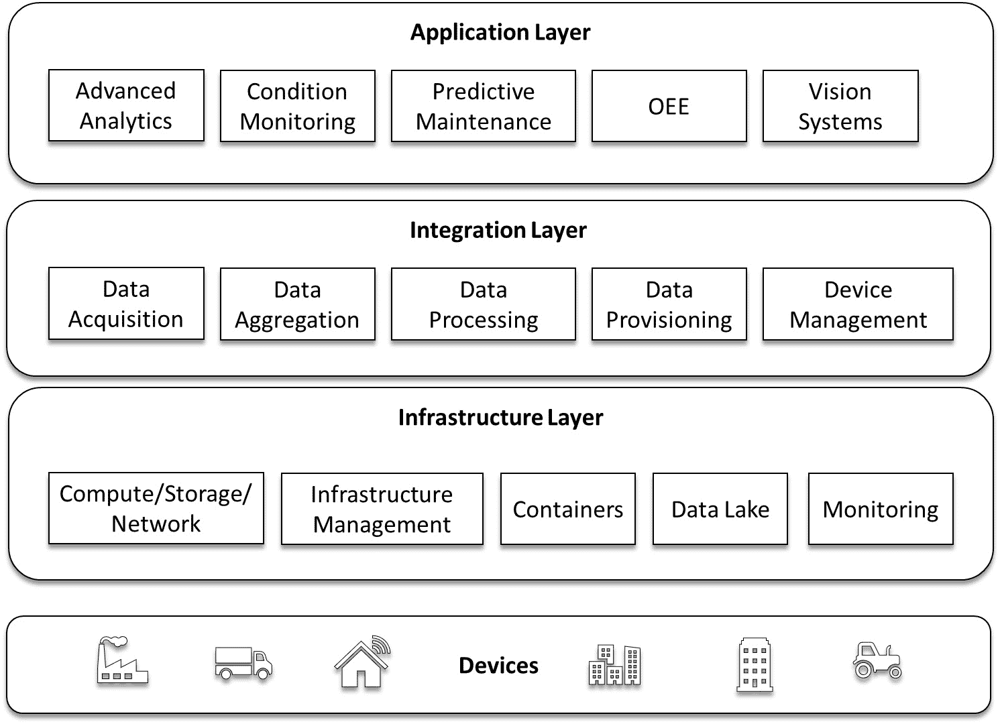
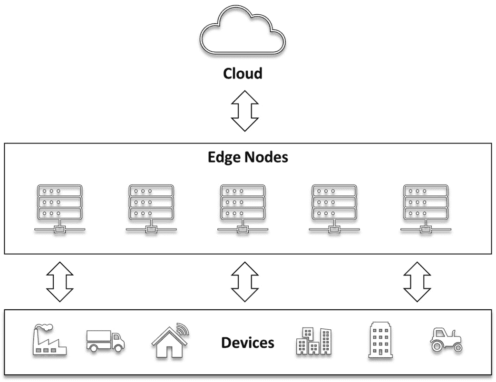
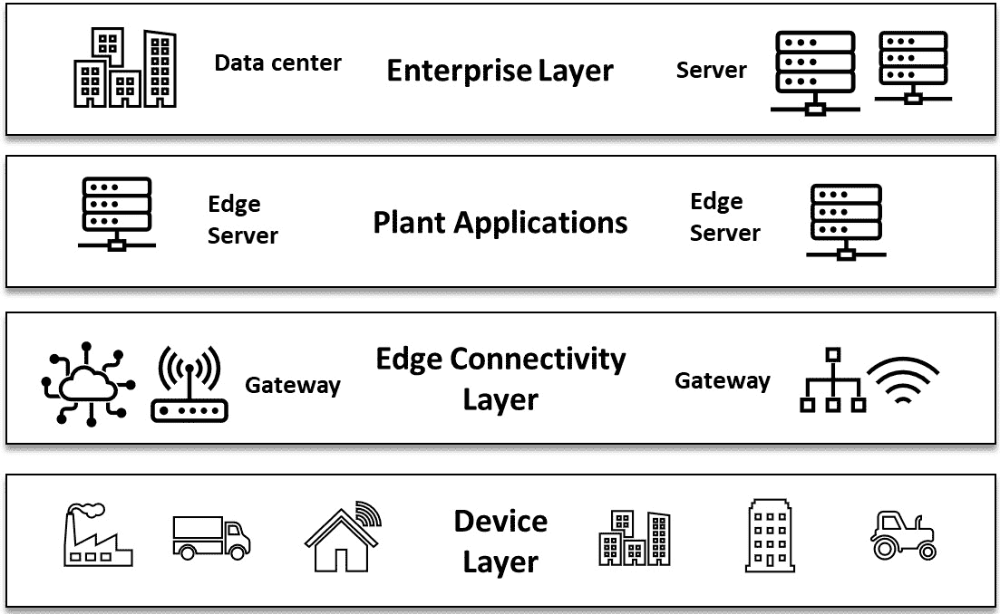

# 3

# 物联网和边缘计算的基本要素

数据量持续增长，尤其是在制造业、石油和天然气、能源和交通等正在快速进行数字化转型的行业。这种边缘数据爆炸需要被管理。管理过程中面临诸多挑战，包括系统复杂性、数据隐私、延迟问题、带宽不足和存储与处理数据的成本上升。

**边缘计算**通过将计算资源尽可能靠近数据源，减少设备和服务器之间的远程连接，从而改善数据的处理、传输和交付方式。对于制造、石油天然气、能源或交通等大型行业，工业边缘计算正被部署以实时分析和管理资产端的所有数据，进行实时分析或将聚合数据传输到云端进一步处理。

边缘计算有三个主要组件，如下所述：

+   **连接性**：能够连接任何工业系统并收集和标准化数据以供立即使用

+   **智能**：专注于在边缘进行数据处理和分析功能，以便在数据源处进行决策并提取洞察。

+   **编排**：创建、部署、管理和更新边缘应用的能力

边缘计算使企业能够更高效地在数据源附近进行操作，并减少延迟。为了做出能够提升质量和流程的快速业务决策，边缘计算解锁了实时分析功能，例如库存使用情况、资产的运行时间和停机时间、产能利用率等。

边缘计算可以实现预测性/处方性维护、基于条件的监控、整体设备效能、视觉系统、质量改进等。边缘数据还可以支持更先进的应用场景，如**人工智能**（**AI**）和**机器学习**（**ML**）。智能边缘正在推动重大运营和流程改进。

企业已经开始采用现代边缘平台，通过统一解决方案推动这些举措，使边缘计算、边缘分析和边缘智能三方面得以实现。*Gartner* 的一份最新报告指出，预计到 2028 年，制造业和自然资源行业中部署的**物联网**（**IoT**）终端将达到 19 亿台。

在本章及下一章中，我们将探讨 Kubernetes、边缘计算和云计算如何协同工作，推动智能商业决策。

本章将介绍以下主要内容：

+   什么是物联网（IoT）？

+   什么是边缘计算？

+   物联网和边缘计算是如何相关的？

+   边缘计算的好处

+   要实现边缘计算、边缘分析和边缘智能，需要什么条件？

# 什么是物联网（IoT）？

根据*Gartner*（[`www.gartner.com/en/information-technology/glossary/internet-of-things`](https://www.gartner.com/en/information-technology/glossary/internet-of-things)），物联网是由嵌入技术的物理物体组成的网络，这些物体可以与其内部状态或外部环境进行通信、感知或互动。简而言之，物联网指的是将世界上所有设备连接到互联网的过程。

物联网设备可以涵盖从日常物品，如灯泡，到医疗资产，如医疗设备、可穿戴设备、智能设备，甚至智能城市中的交通灯等各种设备。

以下是一些物联网应用案例：

+   **虚拟现实**（**VR**）和**增强现实**（**AR**）

+   智能城市

+   工业物联网

+   自动驾驶汽车

+   智能温控器

+   智能家居

+   智能手表

典型的物联网系统在反馈循环中不断发送、接收和分析数据。人类或人工智能和机器学习可以在接近实时或较长时间段内进行分析。*Gartner* 估计，到 2020 年，互联网连接的物体将达到 200 亿个。即使这些物体不是通用设备，而是如喷气发动机、联网汽车甚至咖啡机等产品，情况依然如此。

数据通过物联网边缘设备进行收集和处理。物联网边缘设备具有存储和计算能力，可以在毫秒级别做出低延迟的决策并分析数据；然而，并非所有边缘设备都是物联网设备。在接下来的部分，我们将更深入地探讨这一点。

企业可以采用物联网解决方案来评估物联网边缘设备生成的数据，并利用这些信息改善商业决策并开发新的商业应用。接下来的部分，我们将探讨一个典型的物联网解决方案设计，允许你集成和协同来自各种系统、设备、应用和人类交互的数据。

## 物联网解决方案的关键元素

由于缺乏接口和通信标准，物联网边缘设备与企业应用之间存在差距。物联网平台充当中间件，连接这两个端点，弥合这一差距。另一方面，现代物联网平台更进一步，包含了硬件和应用层的功能。因此，物联网平台的功能集可能包括边缘数据处理或复杂数据分析技术。

连接到互联网的设备——如智能手机、数字手表和电器——通过与物联网平台安全通信开始这一过程。平台收集并分析来自各种设备的数据，然后通过应用程序将最有价值的数据发送到设备。

支持重要通信技术的 IoT 边缘设备，包括 Wi-Fi、**窄带物联网**（**NB-IoT**）、Sigfox，以及**消息队列遥测传输**（**MQTT**）、**受限应用协议**（**CoAP**）和**安全超文本传输协议**（**HTTPS**）等协议，可以直接连接到 IoT 平台。由于并非总是如此，因此需要一个抽象层，提供所需的技术和程序来在多个协议和通信技术之间进行转换，从而调解数据流。

以下图所示展示了一种典型的 IoT 平台架构——它允许你与来自多个系统、设备、应用程序和人类交互的数据进行连接与协作：

图 3.1 – IoT 平台架构

下面是每一层架构的简要描述：

+   **基础设施**层包含了使平台整体功能得以实现的组件。在这里，你会找到各种计算/存储/网络解决方案、容器管理选项、数据湖、内部平台消息传递以及监控和存储解决方案。

+   **集成**层主要负责接收来自连接的边缘设备的数据，进行分析，将数据分发到业务应用程序，并管理设备。

+   **安全**层负责确保数据的有效性、安全性和隐私性，通过执行数据保护和权限原则，并实施补救控制措施和行动来进行保障。

+   **应用**层包含使用集成层基本 IoT 功能以满足业务目标的应用程序。这里是复杂数据分析、状态监控、改造/配置和预测性维护等应用程序的存放位置。

现在我们已经了解了 IoT 平台的基本架构，让我们来看看 IoT 面临的一些挑战。近年来，来自设备的传感器生成数据量激增，这一趋势预计将持续下去。由于数据在创建后很快就失去价值，通常在毫秒级，企业将数据转化为洞察并进而采取行动的速度被认为是至关重要的。因此，通过尽可能缩短数据生成和决策或行动之间的时间，可以提高企业的敏捷性。

然而，由于数据传输速度本质上受限于光速，延迟只有通过缩短数据必须传输的距离才能减少或完全消除。由于在仅有云计算的环境中，数据需要传播数百甚至数千英里，因此在延迟至关重要的情况下，边缘计算可以被用于解决这个问题。接下来我们将探讨边缘计算如何解决这一问题。

# 什么是边缘计算？

边缘计算是一种分布式计算概念，其中智能被集成到边缘设备（也称为边缘节点）中，使得数据可以在接近数据采集点的地方进行实时处理和分析。在采用边缘计算时，数据不需要传输到云端或集中式的数据处理系统。

根据*Gartner*的估算，未来最多 55%的物联网数据将能够在数据源头进行处理，无论是在设备本身，还是通过边缘计算。的确，可扩展性可能在这一变化中发挥关键作用，因为不断增加的数据需求将必然集中在延迟问题上，降低延迟可能显著提高反应速度，从而节省时间和金钱。

以下图示展示了一个典型的边缘计算架构：

图 3.2 – 边缘计算架构

由于数据处理接近数据聚合源，边缘计算消除了将数据传输到云端或本地数据中心进行处理和分析的需求。因此，网络和服务器的压力也大大减轻。边缘计算特别适用于物联网（IoT），尤其是**工业物联网**（**IIoT**），因为它能够实时处理数据，并具有更快的响应时间。

除了为工业和制造组织提供更快的数字化转型，边缘计算技术还带来了更多的突破，例如人工智能（AI）和机器学习（ML）。

让我们来看一些边缘计算的具体应用场景：

+   **视觉推理**：高分辨率摄像头通常安装在边缘设备上。它们能够从这些摄像头获取视频流，并在边缘设备上进行机器学习（ML）。这种推理可以仅仅检测视野中的人，或者进行更复杂的推理。此外，一些边缘应用还能够检测某人是否佩戴了正确的口罩，是否体温过高，或者是否保持适当的社交距离。

+   **异常检测**：在许多工业工厂中，边缘设备发挥着重要作用。它们能够看到和听到人类无法察觉的事物，并能够推断出问题，甚至在许多情况下比最专业的人工操作员更为精准。例如，边缘计算设备可以精确监控电动机的功率使用情况，并迅速作出反应，无需人工干预。边缘设备还能够监听复杂机械的异常声音，并在出现问题时及时通知人工操作员。

+   **环境监测**：边缘设备能够检测到诸如颗粒污染或有毒气体等危险情况，并能够在毫秒级的时间内迅速采取措施进行缓解或减少风险，同时联系相关部门。

+   **多接入边缘计算**（**MEC**）：由于这些计算机地理位置接近用户，电信 MEC 设施中的计算机可以提供以前仅在大型企业数据中心或公共云中才能提供的服务，但延迟大大降低。因为这些 MEC 中的边缘设备类似于大型数据中心中的服务器类机器，所以它们能够处理任何数据中心的工作负载。

现在我们已经看到了一些边缘计算的应用场景，让我们在下一节中看看物联网与边缘计算之间的关系。

# 物联网和边缘计算是如何相关的？

物联网从处理能力靠近物理设备或数据源中获益。为了让物联网传感器和设备收集的数据能够更快地做出反应或消除问题，这些数据必须在边缘进行分析，而不是返回到中央站点。

通过为物联网设备的数据和计算需求提供本地处理和存储源，边缘计算减少了物联网设备与其连接的中央**信息技术**（**IT**）网络之间的通信延迟。

如果没有边缘计算，物联网将依赖于云或数据中心的连接和计算服务。在物联网设备与云之间来回传输数据可能会延迟响应时间并降低操作效率。

边缘计算还解决了通过缓慢的蜂窝或卫星连接传输大量数据所需的网络带宽问题，同时也提供了在网络连接丢失时，系统能够离线工作的能力。

通过使用边缘计算，可以利用连接的物联网设备生成的大量数据。通过将分析算法和机器学习模型部署到边缘，可以在本地处理数据并用来做出快速决策。数据也可以在本地聚合，然后发送到中央位置进行处理或长期存储。

在云计算模型下，计算资源和服务通常集中在大型数据中心。云平台通常提供将物联网设备连接到互联网所需的网络基础设施。边缘设备需要网络访问以实现设备与中央数据库之间的双向通信。云平台通常用于提供网络连接。从边缘设备通过云传输数据到数据中心，或者边缘设备将其决策记录传回数据中心以供数据存储、处理或大数据分析，都是云平台通信能力的示例。

许多物联网和边缘计算的应用场景源于在实时情况下需要在本地处理数据的需求，其中将数据发送到数据中心进行处理会导致不可接受的延迟。以下是一些示例：

+   *物联网传感器在制造车间中不断生成数据流*，这些数据可以用于防止设备故障并优化运营。根据某些估计，一家拥有 2000 台设备的现代化工厂每月可以生成约 2200 **TB**（**太字节**）的数据。与将这些大量数据发送到远程数据中心相比，更快且成本更低的是将其处理得更靠近设备。然而，通过集中数据平台连接设备仍然是可取的。例如，设备可以接收标准化的软件升级，并传输经过筛选的数据，这些数据可以帮助改进其他工厂位置的操作。

+   *另一个常见的边缘计算例子是联网汽车*。计算机安装在公交车和铁路上，用于追踪乘客流量和服务交付。借助车载技术，送货司机可以确定最有效的路线。在采用边缘计算策略时，每辆车都在与车队其他车辆相同的标准化平台上运行，从而提高了服务的可靠性，并在整个车队中保持数据安全。

+   **网络功能虚拟化**（**NFV**），即在网络边缘运行的虚拟计算机，正日益受到电信运营商的欢迎。这些**虚拟机**（**VMs**）可以取代昂贵的专有硬件。通过边缘计算策略，供应商可以在成千上万的远程站点上保持软件的可靠运行，并确保统一的安全标准。在移动网络中，运行在接近终端用户位置的应用程序可以减少延迟，并允许服务提供商提供新的服务。

以下图示展示了工厂车间的传感器和设备如何与云和边缘进行交互：

图 3.3 – 与物联网（IoT）、边缘计算和云交互的典型制造车间架构

以下是每一层的简要描述：

+   **设备层**：此层表示主要设备的各个组成部分或实际设备本身，并与本地运营技术和物联网能力相连，以便快速交互。此层使用云训练的机器学习（ML）模型来执行机器学习评分或推断。同时，这里还存储着大量原始设备数据。

+   **边缘连接与工厂应用层**：工厂应用层提供对工厂中所有设备或设备本身的可视化和控制，而边缘连接层则允许设备和工厂应用之间的通信。

+   **云托管企业层**：云托管企业层提供一个投资组合视图，主要提供对多个工厂的视图和控制。业务分析和机器学习算法是该层的一部分，用于预测并通过训练的机器学习模型提供可操作的智能。这些模型可以在该层中重新训练，利用来自所有工厂设备组合的数据，然后将其发送回边缘，最终传递到每个设备的物联网软件，从而使操作更加智能化。

# 边缘计算的好处

总结来说，数据可以通过边缘计算在网络边缘进行分析、处理和传输。换句话说，数据在实时分析时，离存储地点很近，没有延迟。来自物联网设备的数据可以在网络边缘进行分析，然后再发送到数据中心或云端。

这里列出了一些边缘计算的优势：

+   高速、低延迟和极高的可靠性，能够更快地处理数据和传输内容。

+   通过将处理、存储和应用分散在各种设备和数据中心之间，提高了安全性，使得单一故障难以导致整个网络崩溃。

+   提供了一条更具成本效益的扩展和多功能性路径，允许企业通过将物联网设备与边缘数据中心结合来增强其计算能力。

尽管边缘计算有许多好处，但它也可能带来操作和架构上的挑战。边缘处理高度去中心化，通常包括分布广泛和/或难以访问的地点，其中包括办公室、工厂、校园、管道以及其他偏远的现场。任何给定的组织中都有成千上万的设备和数百个网关。这些边缘节点配备了固件、操作系统、虚拟化和容器以及应用程序，其中一些由制造商提供，另一些由解决方案提供商提供。这些边缘节点必须由其所有者/管理员正确管理和维护，因此需要高水平的自动化（例如备份、打补丁、更新和监控）。

需要处理的一些操作和设计挑战在这里列出：

+   **边缘节点的更新**：边缘处理涉及在所有边缘节点和集群中执行和复制数据中心操作，如资源配置、更新、变更管理和监控，以及其他服务，如设备管理和更新机器学习模型。

+   **政策与实践**：边缘部署分布在多个站点，相较于传统数据中心具有更高的动态性，通常不适用于传统数据中心的规章制度和流程。承担这样一个系统的运营管理是困难的。

+   **成本**：虽然云提供按需扩展，并且易于修改、自动化和维护，但在边缘实现类似的功能可能会很昂贵且耗时。扩展现有的边缘部署以容纳更多的设备和边缘节点可能需要大量的硬件和软件投资，并且需要大量的时间和精力。

+   **网络安全**：当云和数据中心扩展到边缘，涉及众多节点和设备时，网络攻击的表面积会显著增加。不安全的端点，如设备和边缘节点，可能被用来获取公司宝贵资产，也可能用于其他目的，如**分布式拒绝服务**(**DDoS**)攻击。确保所有边缘设备在物理上安全是一项具有挑战性且至关重要的任务。

边缘计算只是许多物联网应用场景中，如果当前存在操作技术，它是一个必要的或强制性的功能。即使只是一个网关，将云托管组件添加到物联网系统中也需要某种形式的边缘计算能力。例如，添加智能功能到当前系统架构并提供基于云的组合视图，就需要某种边缘处理能力。我们将在下一节中探讨启用边缘计算所需的条件。

# 启用边缘计算、边缘分析和边缘智能需要哪些条件？

为了满足现代制造、汽车或电信行业的需求，重要的是要认识到，企业在推动工厂车间创新和效率方面面临着巨大的压力。这需要一种综合方法，将新的/现有的 IT 产品与新兴方法论结合，并且目标是避免在大规模配置多个设备和应用程序时所带来的时间消耗和错误易发性。

在构建边缘架构时，必须注意以下几点：

+   **自主性和弹性**：因为该解决方案要求自主性，所以不能容忍连接中断。

+   **资源限制**：设备的低计算能力和小尺寸。

+   **安全挑战**：数据隐私、物理设备安全性以及连接设备的网络安全。

+   **可管理性**：跨越来自多个不同供应商的数千台设备管理应用程序软件。

+   **可靠性**：在应用程序的构建、部署和维护中的一致性。

+   **自动化**：通过高水平的自动化，提供自动化机制以在任意数量的物理或虚拟计算机上部署和维护多个分布式应用程序。

鉴于建立基于边缘的架构的困难，最好先决定是否有必要使用边缘计算。仅依赖云的解决方案可能是最佳选择。下一步是确定在边缘需要哪些能力，然后根据边缘处理可能发生在设备、网关、边缘服务器（可能跨多个层次）或微型数据中心上，选择最佳部署方案。

# 总结

总结来说，物联网及其生成的数据正在改变世界及我们与世界的互动方式。云计算在大多数连接消费者物联网世界中居于核心地位，这要归功于其众多优势。另一方面，物联网解决方案几乎总是会涉及边缘计算和云计算。将计算带到边缘有助于组织通过减少延迟、增加可扩展性和改善信息访问，做出更好的、更快速的决策，变得更加灵活。

在为物联网解决方案决定边缘与云计算能力的正确平衡时，重要的是要记住，边缘计算有多种形式，每种形式都有其独特的优点和缺点。运营上的重大困难和成本可能会迅速出现，因此企业在规划和实施任何物联网系统时，应该审慎考虑一系列问题。

在下一章中，我们将探讨 Kubernetes 如何为边缘计算提供一个有吸引力的价值主张，以及展示 Kubernetes 如何用于边缘工作负载的不同架构方法，并支持满足企业应用需求的架构——低延迟、资源受限、数据隐私、带宽可扩展性等。
