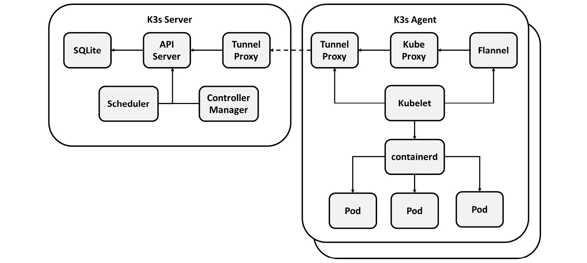
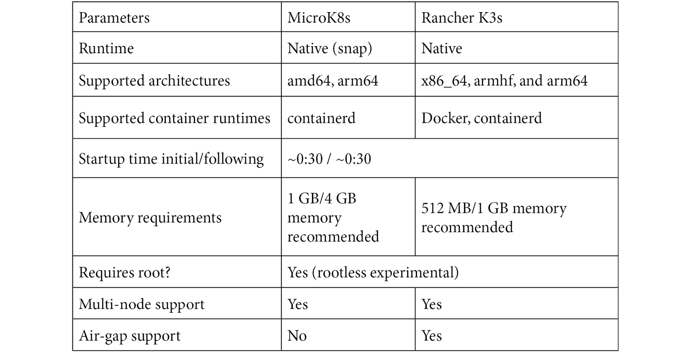
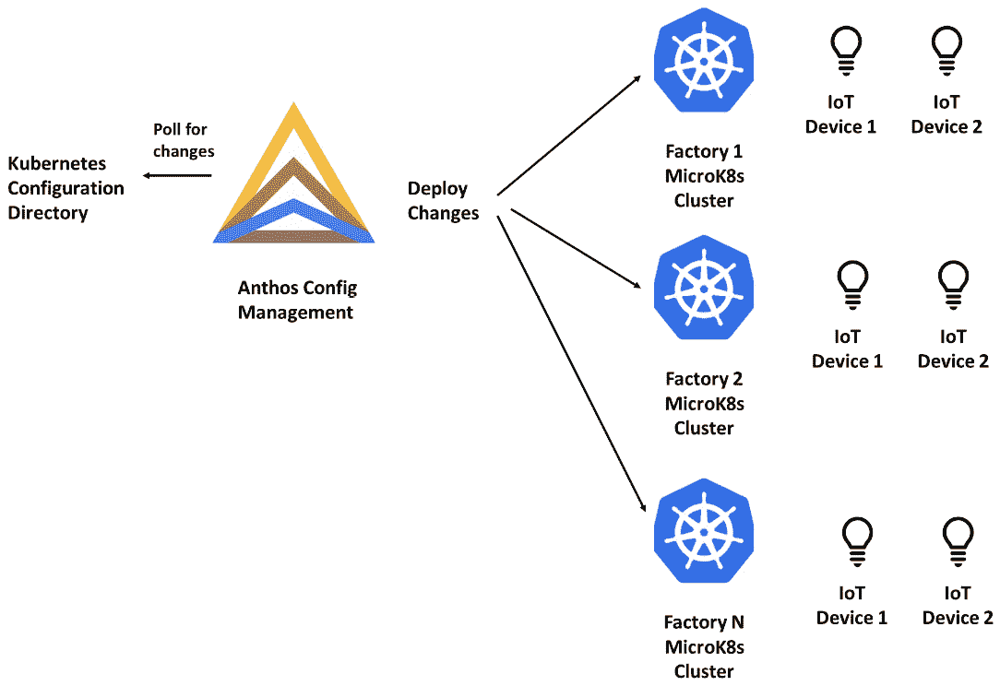
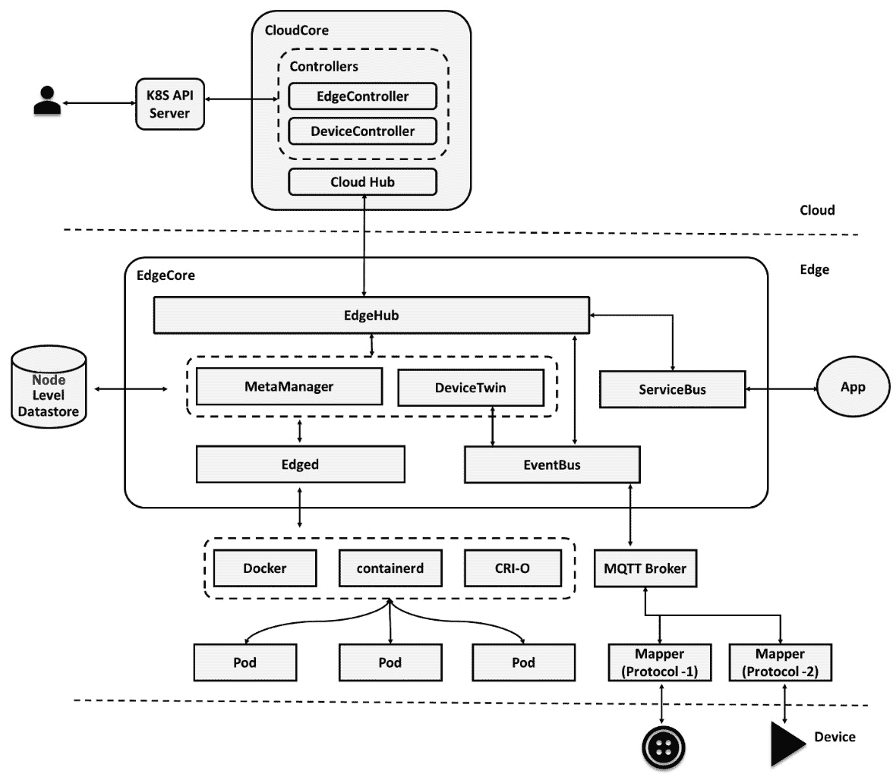
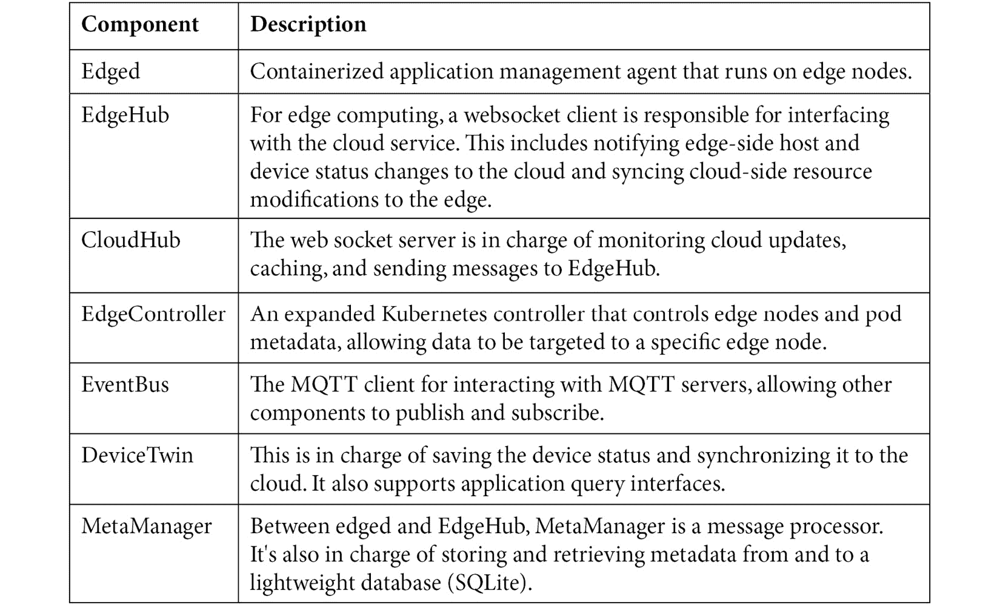
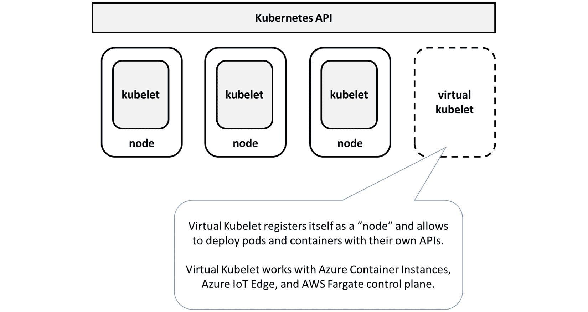
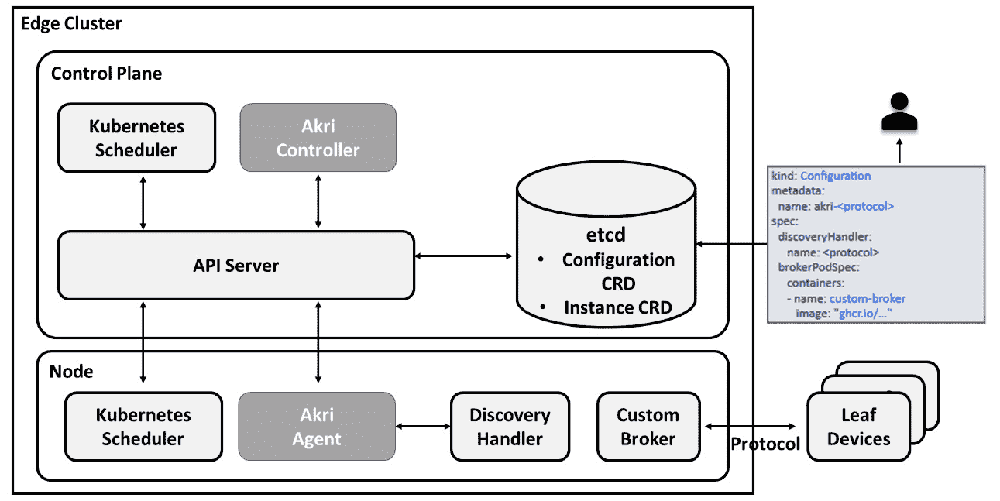
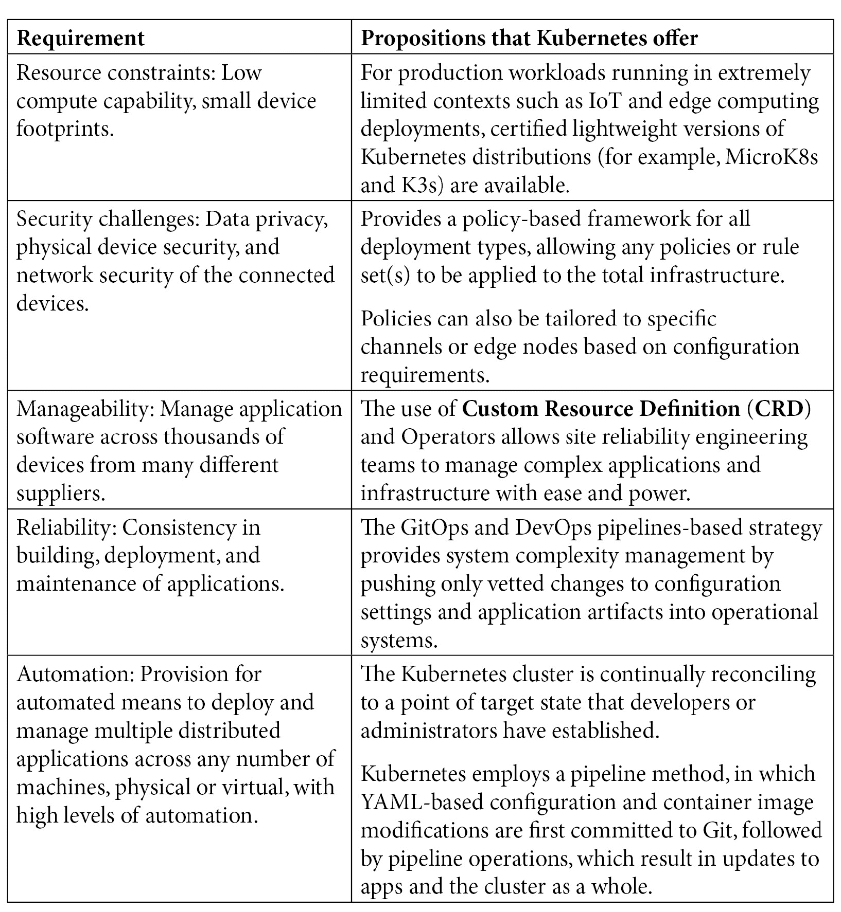

# 4

# 处理物联网和边缘计算的 Kubernetes 平台

自 2014 年推出以来，Kubernetes 在数据中心和云环境中取得了显著的采纳。Kubernetes 从编排轻量级应用容器发展到管理和调度多样化的 IT 工作负载，涵盖从虚拟化网络操作到 AI/ML 和 GPU 硬件资源的各种工作负载。

Kubernetes 正迅速成为分布式系统中调度和管理工作的最受欢迎的控制平面。这些活动可能涉及在实际主机上部署虚拟机、将容器推送到边缘节点，甚至扩展控制平面以整合额外的调度器，例如无服务器环境。其可扩展性使其成为通用调度器和最受欢迎的管理平台。在本章中，我们将探讨各种部署方法，以探索 Kubernetes、边缘和云如何协作推动智能业务决策。

重申我们在上一章讨论的观点，建立边缘架构时必须注意以下考虑因素：

+   **自主性和弹性**：由于解决方案需要自主性，不能允许连接中断。

+   **资源限制**：低计算能力和小设备占地面积。

+   **安全挑战**：数据隐私、物理设备安全以及连接设备的网络安全。

+   **可管理性**：管理来自许多不同供应商的成千上万设备的应用软件。

+   **可靠性**：在应用程序的构建、部署和维护中保持一致性。

+   **自动化**：通过高度自动化，提供自动化机制来部署和维护多个分布式应用程序，涵盖任意数量的物理或虚拟计算机。

让我们看看满足这些标准的四种架构方法。在本章中，我们将涵盖以下主要主题：

+   边缘计算的部署方法

+   Kubernetes 提供的主张

# 边缘计算的部署方法

以下方法展示了如何使用 Kubernetes 处理边缘工作负载，并支持满足企业应用需求的架构——低延迟、资源限制、数据隐私、带宽可伸缩性等。

## 在边缘完全部署整个 Kubernetes 集群

在这种方法中，在边缘节点之间部署完整的 Kubernetes 集群。这种解决方案更适合边缘节点容量有限且不希望为控制平面和节点消耗额外资源的情况。

最简单的生产级上游**K8s**是**MicroK8s**，这是一个轻量级且专注的 Cloud Native Computing Foundation 认证的 Kubernetes 分发版，可选择在 Linux、Windows 和 macOS 上安装。

另一个示例是 Rancher 的 K3s，它是云原生计算基金会认证的 Kubernetes 发行版，专为在资源受限环境（如物联网和边缘计算部署）中运行的生产工作负载设计。

下图展示了在边缘节点上运行的最小 K3s Kubernetes 集群：

图 4.1 – K3s 架构

MicroK8s 和 K3s 可以安装在公有云虚拟机上，甚至可以安装在 Raspberry Pi 设备上。该架构高度优化，适用于在资源受限设备上进行无人值守的远程安装，同时保持与云原生计算基金会 Kubernetes 合规性测试的完全兼容性。

通过使 Kubernetes 易于访问且轻量化，MicroK8s 和 K3s 将 Kubernetes 引入到边缘计算层。

以下表格展示了 MicroK8s 和 K3s 的快速比较：

表格 4.1 – MicroK8s 与 K3s 的比较

可选地，你还可以使用 Google Anthos 或 AKS 等平台，在多个集群上管理和编排容器工作负载，示例如下：

图 4.2 – 云上的 Google Anthos 和边缘的 MicroK8s

在接下来的章节中，我们将探讨如何使用 MicroK8s 实现常见的边缘计算应用。

## 边缘节点上的 Kubernetes 节点部署

在这种方法中，核心 Kubernetes 集群安装在云服务提供商或数据中心，而 Kubernetes 节点部署在边缘节点上。这种方式更适合边缘基础设施受限的应用场景。

**KubeEdge** 是一个开源应用程序，它将原生容器化应用编排和设备管理扩展到边缘主机上，便是这种方法的一个示例。KubeEdge 由两部分组成：云端和边缘。

它基于 Kubernetes，能够在云端和边缘基础设施之间实现网络、应用部署和元数据同步。开发人员还可以使用 MQTT 编写自定义逻辑，实现边缘设备间的资源受限通信。KubeEdge 可靠，并支持最常见的物联网和边缘计算应用场景。它可以在兼容的 Linux 发行版或 ARM 设备（如 Raspberry Pi）上运行。

这里展示了 KubeEdge 的架构：

图 4.3 – KubeEdge 架构

这是 KubeEdge 不同组件的快速概览：

表格 4.2 – KubeEdge 组件

以下是 KubeEdge 的一些主要功能：

+   用户可以像在云中使用常规 Kubernetes 集群一样，使用 KubeEdge 在边缘节点上编排应用、管理设备，并监控应用和设备状态。

+   双向通信，能够与位于私有子网中的边缘节点进行通信。支持元数据和数据。

+   即使边缘与云断开连接，它也能独立运行。每个节点的元数据是持久的，因此在节点恢复期间不需要监视列表。这使得你能够更快准备好。

+   在边缘，资源使用得到优化。内存占用已减少到约 70MB。

+   对于物联网和工业物联网，应用程序与设备之间的连接变得更加简化。

+   原生支持 x86、ARMv7 和 ARMv8 架构。

+   支持在边缘节点上运行依赖 Kubernetes API 的第三方插件和应用程序，边缘上有一个独立的 Kube-API 端点。

## 在边缘部署虚拟 Kubernetes 节点

在这种方式中，虚拟节点代理驻留在云端，但节点和 Pod 的抽象部署在边缘。携带容器的边缘节点通过虚拟节点代理获得指令控制。

尽管还有其他项目，微软的虚拟 Kubelet 项目是一个很好的示例，它是一个具有 Kubernetes API 扩展的 kubelet 代理。虚拟 Kubelet 是一个在远程环境中运行的 Kubernetes 代理，并将自己注册为集群节点。为了在集群上构建节点资源，代理使用 Kubernetes API。它使用污点和容忍度的概念，通过调用其本地 API 在外部环境中调度 Pods：

图 4.4 – 微软虚拟 Kubelet

虚拟 Kubelet 与 AWS Fargate 控制平面、Azure 容器实例和 Azure IoT Edge 等提供商兼容。以下是当前提供商的列表（截至本文写作时）。

### 当前虚拟 Kubelet 提供商列表

在本节中，我们将介绍一些虚拟 Kubelet 提供商：

+   **AWS Fargate**：你的 Kubernetes 集群通过 AWS Fargate 虚拟 Kubelet 提供商连接到 AWS Fargate 集群。Fargate 集群作为一个虚拟节点，提供你选择的 CPU 和内存资源。

在虚拟节点上调度的 Pods 与在常规 Kubernetes 节点上的运行方式相同，都会在 Fargate 上执行。

+   **海军多集群调度器**：海军是一个 Kubernetes 控制器系统，能够智能地在集群之间调度工作负载。它易于使用，并能与其他应用程序集成。

+   **阿里云弹性容器实例**（**ECI**）：阿里云 ECI 提供商是一个适配器，它将 Kubernetes 集群连接到 ECI 服务，使 K8s 集群中的 Pod 能够在阿里云平台上运行。

+   **Azure Batch**：Azure Batch 在 Azure 上提供分布式 HPC 计算环境。Azure Batch 是一项服务，负责管理跨虚拟机池调度离散进程和任务。它通常用于批量处理作业，如渲染。

+   **Azure 容器实例** (**ACI**)：Azure 中的 ACI 提供了一个用于运行容器的托管环境。当使用 ACI 时，你无需担心管理底层计算基础设施，因为 Azure 会为你处理。当使用 ACI 运行容器时，你将按每秒钟收费，每个正在运行的容器都需要收费。

虚拟 Kubelet 的 ACI 提供程序将 ACI 实例配置为任何 Kubernetes 集群中的一个节点。当使用虚拟 Kubelet ACI 提供程序时，Pod 可以像调度到传统的 Kubernetes 节点一样调度到 ACI 实例上。

该设置使你能够同时受益于 Kubernetes 的功能和 ACI 的管理价值与成本节约。

+   **Elotl Kip**：Kip 是一个虚拟 Kubelet 提供程序，使得 Kubernetes 集群可以透明地在其云实例上启动 Pod。Kip Pod 在集群中运行，并在其中创建一个虚拟 Kubernetes 节点。

当 Pod 在虚拟 Kubelet 上调度时，Kip 为 Pod 的工作负载启动一个适当大小的云实例，并将 Pod 发送到该实例。一旦 Pod 操作完成，云实例会被终止。这些云实例被称为*单元*。

当工作负载在 Kip 上运行时，集群规模会根据集群工作负载自然扩展，Pod 之间相互隔离，用户无需管理工作节点或将 Pod 战略性地打包到节点上。这将带来更低的云成本、提高的安全性以及更简单的操作开销。

+   **Kubernetes 容器运行时接口** (**CRI**)：CRI 提供程序的实现应视为一个最简化的实现，旨在测试虚拟 Kubelet 项目的核心与真实的 Pod 和容器之间的兼容性；换句话说，它比 MockProvider 更为广泛。

该提供程序的实现方式还可以用于在本地 Linux 基础设施上原型化新的架构特性。如果能够证明 CRI 提供程序能够在 Linux 客体中有效运行，那么可以假设该抽象也将适用于其他提供程序。

+   **华为云容器实例** (**CCI**)：华为 CCI 虚拟 Kubelet 提供程序将 CCI 项目作为节点设置在任何 Kubernetes 集群中，包括**华为云容器引擎** (**CCE**)。作为私有集群，CCE 提供原生 Kubernetes 应用和工具，使你能够快速构建容器运行时环境。虚拟 Kubelet 提供程序调度的 Pod 将在 CCI 中运行，充分利用 CCI 的高性能。

+   **HashiCorp Nomad**：通过将 Nomad 集群作为 Kubernetes 中的一个节点暴露，HashiCorp Nomad 为虚拟 Kubelet 提供程序连接了 Kubernetes 集群和 Nomad 集群。在 Kubernetes 中注册的虚拟 Nomad 节点上调度的 Pod 将作为任务在 Nomad 客户端上运行，就像它们在 Kubernetes 节点上一样，前提是你使用该提供程序。

+   **Liqo**：Liqo 是一个本地或托管平台，能够实现 Kubernetes 集群之间的动态和去中心化资源共享。Liqo 使得可以在远程集群上启动 Pods，而无需修改 Kubernetes 或应用程序。

使用 Liqo，您可以将 Kubernetes 集群的控制平面扩展到集群边界之外，使多集群变得原生且透明：将完整的远程集群折叠为一个虚拟本地节点，允许任务卸载和资源管理符合标准的 Kubernetes 实践。

+   **OpenStack Zun**：您的 Kubernetes 集群通过 OpenStack Zun 虚拟 kubelet 提供者连接到 OpenStack 云。由于每个 Pod 都在您的租户子网中分配了专用的 Neutron 端口，您的 OpenStack Pods 可以访问 OpenStack 租户网络。

+   **腾讯游戏 tensile-kube**：这允许 Kubernetes 集群协作。Tensile-kube 基于 Virtual Kubelet，提供以下功能：

    +   集群资源会自动发现。

    +   Pods 会实时收到变更通知，减少频繁列出操作的开销。

    +   所有 kubectl logs 和 kubectl exec 操作都受到支持。

    +   使用多调度器时，全球调度 Pods，以避免因资源碎片化导致的未调度 Pods。

    +   如果 Pods 无法在低级集群中调度，可以使用反调度器将其重新调度。

    +   支持 PV/PVC 和服务抽象。

## 边缘 Kubernetes 设备的部署

在这种方法中，Kubernetes 设备插件框架用于将叶设备作为资源暴露在 Kubernetes 集群中。

该技术由 **微软 Akri** 演示，它将多种传感器、控制器和 MCU 类叶设备作为资源暴露在 Kubernetes 集群中。Akri 项目将 Kubernetes 设备插件概念引入到边缘，那里有各种叶设备使用不同的通信协议并且可用性不稳定：

图 4.5 – Akri 架构

Akri 现在支持 ONVIF、Udev 和 OPC UA 发现处理程序。更多协议支持正在开发中。

如前所述，各种部署方法展示了 Kubernetes 如何用于边缘工作负载，以及支持满足企业应用需求的架构，如低延迟、资源限制、数据隐私和带宽可扩展性等。

在下一部分中，我们将探讨 Kubernetes 如何适用于运行边缘工作负载。

# Kubernetes 提供的方案

就资源和工作负载控制而言，基于边缘的基础设施面临各种挑战。在短时间内，将有成千上万个边缘节点和远程边缘节点需要控制。组织的边缘架构旨在提供更多的云端自主性、安全标准和相对较低的延迟。让我们来看看 Kubernetes 在边缘领域的应用：

表 4.3 – Kubernetes 提供的建议

Kubernetes 是那些正在向数字优先企业转型的公司中的关键组成部分。根据报告，Kubernetes 目前已在 59%的数据中心部署，以提高资源效率并为软件开发周期提供灵活性。在分布式云环境中，Kubernetes 可以管理和协调容器化应用程序以及传统虚拟机。除了纯应用程序，Kubernetes 还可用于执行 AI/ML 和 GPU 工作负载。

根据 Linux 基金会的*《边缘状态报告》*，Kubernetes 无疑是边缘计算的首选平台，至少对于那些需要动态协调应用程序和集中管理工作负载的边缘场景而言。Kubernetes 将云原生计算软件开发的优势扩展到边缘，允许对跨分布式云环境的应用程序进行灵活和自动化的管理。

通过在边缘部署和测试 Kubernetes，企业和通信运营商可以实现高度的灵活性、可观察性和动态编排。

# 总结

随着企业拥抱数字化转型、工业 4.0、工业自动化、智能制造及这些举措所带来的各种先进应用场景，Kubernetes、边缘计算和云计算协作推动智能业务决策的相关性日益显现。我们探讨了一种不同的方法，展示了 Kubernetes 如何用于运行边缘工作负载。在接下来的章节中，我们将深入讨论在边缘部署整个 Kubernetes 集群的方法。其他方法超出了本书的范围。

在接下来的章节中，我们将详细介绍使用 MicroK8s 实现常见边缘计算应用的各个方面，如在多节点 Raspberry Pi 集群上运行应用程序；配置负载均衡；安装/配置不同的 CNI 插件以实现网络连接；配置日志记录、监控和告警选项；以及构建/部署 ML 模型和无服务器应用程序。

同时，我们还将探讨为有状态应用设置存储复制，实现跨领域关注点的服务网格，建立高可用集群以应对组件故障并持续提供工作负载，配置带有工作负载隔离的容器，并运行与主机系统隔离的安全容器。

# 第三部分：在 MicroK8s 上运行应用程序

本部分重点介绍适用于任何物联网/边缘计算应用的实现方面，如在多节点树莓派集群上运行应用程序、为网络连接安装/配置不同的 CNI 插件、配置负载均衡、配置日志记录、监控、报警选项、构建和部署机器学习模型以及无服务器应用程序。

本书的这一部分包含以下章节：

+   *第五章*，*在多节点树莓派 Kubernetes 集群上创建和实施更新*

+   *第六章*，*为容器配置连接*

+   *第七章*，*为负载均衡设置 MetalLB 和 Ingress*

+   *第八章*，*监控基础设施和应用程序的健康状况*

+   *第九章*，*使用 Kubeflow 运行 AI/MLOps 工作负载*

+   *第十章*，*使用 Knative 和 OpenFaaS 框架实现无服务器架构*
