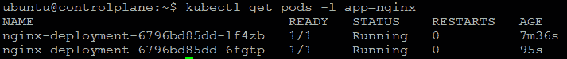

# 5

# 在多节点树莓派 Kubernetes 集群中创建和实施更新

正如我们在上一章中看到的，公司正在拥抱数字化转型、工业 4.0、工业自动化、智能制造以及这些举措所带来的所有先进应用场景。因此，Kubernetes、边缘计算和云计算的协同作用，推动智能商业决策的重要性变得越来越明显。Kubernetes 正稳步成为边缘计算的首选平台，并将云原生技术的优势扩展到边缘，从而实现跨分散云环境的应用灵活和自动化管理。在本章及随后的章节中，我们将探讨使用 MicroK8s Kubernetes 平台实现常见边缘计算应用的各个方面。

重申我们在上一章讨论的要点，**Canonical MicroK8s**（[`microk8s.io/`](https://microk8s.io/)）是一个功能强大的、**Cloud Native Computing Foundation**（**CNCF**）认证的 Kubernetes 发行版。以下是它成为一个强大企业计算平台的一些关键原因：

+   **以 Snap 包形式交付**：这些是适用于桌面、云，甚至**物联网**（**IoT**）设备的应用包，安装简单，自动更新且安全，并且可以部署在任何支持 Snap 的 Linux 发行版上。

+   **严格限制**：这确保了与底层**操作系统**（**OS**）的完全隔离，并提供一个高度安全的 Kubernetes 生产环境。

+   **生产级附加组件**：如 Istio、Knative、CoreDNS、Prometheus、Jaeger、Linkerd、Cilium 和 Helm 等附加组件均可用。这些附加组件易于设置，仅需几行命令。为了更好的**人工智能**（**AI**）和**机器学习**（**ML**）能力，Kubeflow 也可以作为 MicroK8s 的附加组件提供。

+   **自动化、自治、自愈的高可用性（HA）**：对于三个或更多节点的集群，MicroK8s 会自动启用高可用性。无需管理员干预，MicroK8s 提供具有弹性和自愈能力的高可用性。

本章将涵盖以下主要主题：

+   使用树莓派创建一个 MicroK8s 多节点集群

+   部署一个示例容器化应用程序

+   使用新软件版本执行滚动更新

+   扩展应用部署

+   多节点集群配置指南

+   容器生命周期管理

+   部署和共享高可用性应用

# 使用树莓派创建一个 MicroK8s 多节点集群

在我们深入了解如何创建 MicroK8s 多节点集群的步骤之前，让我们回顾一下之前所讨论的 Kubernetes 关键概念，如下所示：

1.  一个**Kubernetes 集群**（如*图 5.1*所示）将包含以下两种类型的资源：

a. 一个**控制平面**，用于控制集群

b. **节点**—运行应用程序的工作节点

1.  集群中的所有操作由控制平面协调，包括调度应用程序、保持应用程序的预期状态、扩展应用程序和发布新更新等。每个节点可以是**虚拟机**（**VM**）或作为集群中工作机器的物理计算机。

1.  **Kubernetes 控制平面**是由三个进程组成的：**应用程序编程接口（API）服务器**、**控制器管理器**和**调度器**。

1.  集群中每个非控制平面节点都有一个**kubelet**进程，负责与 Kubernetes 控制平面通信，**kube-proxy**进程负责所有网络通信，并且有一个如 Docker 的**容器运行时**。

1.  当需要在 Kubernetes 上部署应用程序时，控制平面会发出命令启动应用程序容器。容器由控制平面调度到集群的节点上运行。

1.  节点通过控制平面暴露的 Kubernetes API 与控制平面进行通信。

以下图所示的是典型的 Kubernetes 架构、系统和抽象：


图 5.1 – Kubernetes 系统和抽象

现在我们已经清楚了 Kubernetes 架构、系统和抽象，接下来我们将深入了解创建 Kubernetes Raspberry Pi 多节点集群的步骤。

## 我们要实现的目标

在本节中，我们将列出我们要实现的步骤。通过以下步骤为 MicroK8s 安装准备 Raspberry Pi 4 板：

1.  在每个板上安装和配置 MicroK8s

1.  向集群中添加节点

1.  将多个部署合并形成一个两节点集群（一个控制平面节点/一个工作节点）

我们将在这一步构建的 Raspberry Pi 集群如以下图所示：


图 5.2 – 我们要实现的目标

现在我们知道要做什么，让我们来看一下要求。

在开始之前，以下是构建 Raspberry Pi Kubernetes 集群的先决条件：

+   一张 microSD 卡（最低 4 **GB**；推荐 8 GB）

+   一台带有 microSD 卡驱动器的计算机

+   一块 Raspberry Pi 2、3 或 4（一个或多个）

+   一根**微型通用串行总线**（**micro-USB**）电源线（Pi 4 使用 USB-C）

+   一张连接互联网的 Wi-Fi 网络或以太网电缆

+   （可选）带有**高清多媒体接口**（**HDMI**）接口的显示器

+   （可选）Pi 2 和 3 的 HDMI 电缆，以及 Pi 4 的微 HDMI 电缆

+   （可选）USB 键盘

现在我们已经明确了要求，接下来将按照步骤说明完成整个过程。

**步骤 1a**：**将操作系统镜像安装到 SD 卡**

第一步是将操作系统镜像安装到 microSD 卡中。为此，我们将使用**Raspberry Pi Imager 工具**，如下面的截图所示，将操作系统镜像安装到 microSD 卡，然后可以用在 Raspberry Pi 上：


图 5.3 – Raspberry Pi Imager

从 Raspberry Pi 网站下载并安装**Raspberry Pi Imager**，在配备**Secure Digital**（**SD**）卡读卡器的计算机上运行 Raspberry Pi Imager，插入您将使用的 microSD 卡，并打开**选择操作系统（CHOOSE OS）**菜单。

从列出的选项中选择**其他通用操作系统（Other general purpose OS）**，如下图所示：


图 5.4 – Raspberry Pi Imager 操作系统选项

从列出的选项中选择任何适用于 Raspberry Pi 2、3、3+和 4 的**Ubuntu Server** 64 位版本，如下图所示：


图 5.5 – 选择适用于 Raspberry Pi Imager 2/3/4 的任何 Ubuntu Server 版本

注意

MicroK8s 仅适用于 64 位 Ubuntu 镜像。

选择镜像后，打开**SD 卡**菜单。选择您插入的 microSD 卡。点击**写入（WRITE）**开始操作，Raspberry Pi Imager 将清除您的 microSD 卡数据。系统会提示您确认此过程。

该过程如下面的截图所示：


图 5.6 – Raspberry Pi Imager 写入操作

确认后，Raspberry Pi Imager 将开始将操作系统镜像写入 microSD 卡。完成需要一些时间。完成后显示的消息如下图所示：


图 5.7 – Raspberry Pi Imager：写入操作完成

完成后，继续配置 Wi-Fi 访问、远程访问、控制组和主机名设置。

## 配置 Wi-Fi 访问设置

打开文件管理器——如下面的截图所示——在 SD 卡仍然插入笔记本电脑时，查找卡上的`system-boot`分区。该分区包含在第一次启动时加载的初始配置文件：


图 5.8 – 配置 Wi-Fi 访问设置

修改`network-config`文件，加入您的 Wi-Fi 凭证。以下是 Wi-Fi 配置的示例：

```
wifis:
  wlan0:
    dhcp4: true
    optional: true
    access-points:
      "Karthik Home":
        password: "Karthik123"
```

我们已经完成了 Wi-Fi 访问的配置，并准备进入下一步。

**步骤 1b**：**配置远程访问设置**

默认情况下，卡上的 `system-boot` 分区创建一个名为 `ssh` 的空文件，且没有文件扩展名。在启动过程中，如果检测到此文件，它将自动准备并设置树莓派上的 SSH。

我们已经完成了远程访问配置，准备进入下一步的控制组配置。

**步骤 1c**：**配置控制组设置**

默认情况下，控制组被禁用。控制组（缩写为**cgroups**）是一个 Linux 内核特性，用于限制、统计和隔离一组进程的资源使用情况（**中央处理单元**（**CPU**）、内存、磁盘 **输入/输出**（**I/O**）、网络等）。

打开位于卡上的配置文件 `/boot/firmware/cmdline.txt`，并添加以下选项：

```
cgroup_enable=memory cgroup_memory=1
```

完整的命令行应该像这样：

```
cgroup_enable=memory cgroup_memory=1 net.ifnames=0 dwc_otg.lpm_enable=0 console=ttyAMA0,115200 console=tty1 root=/dev/mmcblk0p2 rootfstype=ext4 elevator=deadline rootwait
```

保存文件，从笔记本中取出卡片，并将其插入树莓派。在为树莓派供电之前，连接一个 HDMI 屏幕和一个 USB 键盘。打开树莓派电源，你将能够在屏幕上看到启动过程。通常启动过程会在 2 分钟内完成。

启动完成后，使用任何 SSH 客户端（例如 `putty`）连接到你的树莓派，并继续以下配置：


图 5.9 – PuTTY SSH 客户端

输入树莓派的 IP 地址并点击 **Open** 进行连接。首次连接时，系统会要求你确认连接：点击 **Accept** 确认。

在登录页面，输入 `ubuntu` 作为用户名和密码。Ubuntu 会要求你将密码更改为其他内容。之后，使用 `ssh` 命令和新密码重新连接。

*成功！你现在已连接到运行在树莓派上的 Ubuntu Server*。

我们已经完成了大部分设置，准备进入下一步的主机名配置。

**步骤 1d**：**配置主机名**

对于 Ubuntu 操作系统，默认情况下，主机名为 `ubuntu`，但由于我们需要在集群中识别不同的主机名，因此需要根据需要进行更改。对于我们正在创建的集群，我将把一个节点命名为 `controlplane`，其他的命名为 `WorkerXX`。

按照以下步骤更改主机名。

从 `putty` Shell 中，输入以下命令：

```
sudo nano /etc/hostname
```

修改主机名并使用 *Ctrl* + *X* 退出 `nano` 编辑器。

输入 `sudo reboot` 以使更改生效。

*恭喜！你现在已经完成了树莓派的所有配置*。

*步骤 1a* 到 *1d* 必须为集群中的所有树莓派重复执行。

系统启动成功后，确保你的包已更新到最新版本，并运行以下命令：

```
sudo apt update
sudo apt upgrade
```

我们已经完成了集群中所有树莓派的设置，并准备进入下一步的 MicroK8s 安装和配置。

## 安装和配置 MicroK8s

SSH 连接到控制平面节点并安装 MicroK8s snap，如下所示：

```
sudo snap install microk8s --classic
```

以下命令执行输出确认 MicroK8s snap 已成功安装：


图 5.10 – MicroK8s snap 安装成功

现在我们已经安装了 MicroK8s snap，输入 `microk8s status` 命令以验证其运行状态，如下所示：


图 5.11 – 验证 MicroK8s 是否正在运行

如前面的命令执行输出所示，使用以下一组命令将用户加入 MicroK8s 组并访问 `.kube` 缓存目录：

```
sudo usermod -a -G microk8s ubuntu
sudo chown -f -R ubuntu ~/.kube
```

重新输入 `microk8s status` 命令以验证它是否正在运行。以下命令执行输出确认 MicroK8s 正在成功运行：


图 5.12 – MicroK8s 正在运行

现在我们已安装了 MicroK8s，接下来的步骤是使用以下命令创建一个 `kubectl` 别名：

```
sudo snap alias microk8s.kubectl kubectl
```

以下命令执行输出确认别名已成功添加：


图 5.13 – kubectl 别名已成功添加

如果安装成功，你应该会看到以下输出：


图 5.14 – 验证节点是否处于 Ready 状态

在其他节点上也重复进行 MicroK8s 安装过程。

以下是 worker 节点上 MicroK8s 安装的命令执行输出：


图 5.15 – MicroK8s snap 在 worker1 节点安装成功

以下命令执行输出确认 MicroK8s 在 worker 节点上也成功运行：


图 5.16 – 验证 MicroK8s 是否正在运行

现在 MicroK8s 正在运行，接下来的步骤是检查 `kubectl get Nodes` 命令是否显示节点处于 `Ready` 状态，正如以下命令执行输出所示：


图 5.17 – 验证节点是否处于 Ready 状态

我们已经在所有节点上完成了 MicroK8s 的安装。接下来的步骤是将 worker 节点添加到控制平面节点。打开 `putty` shell 连接到控制平面节点，并运行以下命令生成连接字符串：

```
sudo microk8s.add-node
```

以下命令执行输出验证命令已成功执行，并提供连接字符串的说明：


图 5.18 – 生成添加节点的连接字符串

如前面的命令执行输出所示，生成了格式为 `<control plane_ip>:<port>/<token>` 的连接字符串。

## 添加工作节点

现在我们有了连接字符串，可以与控制平面节点进行连接。打开 `putty` 终端到工作节点，并运行 `join` 命令将其加入集群，如下所示：

```
microk8s join <control plane_ip>:<port>/<token>
```

命令已成功执行，节点已加入集群，如下所示的输出所示：


图 5.19 – 将 worker1 节点添加到集群

如前面的命令执行输出所示，您应该能在几秒钟内在控制平面看到新节点。

使用以下命令验证新节点是否已添加到集群：

```
kubectl get nodes
```

以下命令执行输出显示，`controlplane` 和 `worker1` 是集群的一部分：


图 5.20 – 集群已准备好；controlplane 和 worker1 是集群的一部分

完整的集群应类似于这里所示的：


图 5.21 – 我们的集群已准备就绪

注意

如果您想从集群中移除一个节点，可以在控制平面运行以下命令：`sudo microk8s remove-node <node name>`。或者，您可以通过在工作节点运行 `sudo microk8s.leave` 来离开集群。

此时，您已经拥有一个完全功能的多节点 Kubernetes 集群。总结一下，我们已经在 Raspberry Pi 板上安装了 MicroK8s，并将多个部署加入到集群中。我们还展示了如何向集群添加节点。接下来的部分，我们将把一个示例应用程序部署到刚刚创建的 MicroK8s 集群中。

# 部署示例容器化应用程序

在本节中，我们将部署来自 Kubernetes 示例仓库的以下 nginx 部署到我们的多节点 MicroK8s 集群：

```
apiVersion: apps/v1
kind: Deployment
metadata:
  name: nginx-deployment
spec:
  selector:
    matchLabels:
      app: nginx
  replicas: 2 # tells deployment to run 2 pods matching the template
  template:
    metadata:
      labels:
        app: nginx
    spec:
      containers:
      - name: nginx
        image: nginx:1.14.2
        ports:
        - containerPort: 80
      affinity:
        podAntiAffinity:
          requiredDuringSchedulingIgnoredDuringExecution:
          - labelSelector:
              matchExpressions:
              - key: "app"
                operator: In
                values:
                - nginx
            topologyKey: "kubernetes.io/hostname" 
```

以下命令将部署前面提到的示例应用程序：

```
kubectl apply -f deployment.yaml
```

以下命令执行输出表明部署没有错误，接下来的步骤我们可以使用 `describe` 命令来验证：


图 5.22 – 示例应用程序部署

以下命令执行输出显示有关部署的信息：


图 5.23 – 描述示例应用程序部署

检查 Pods 的状态，以验证应用程序是否已经部署并运行，如下所示：

```
kubectl get pods -l app=nginx
```

以下命令执行输出表明 Pods 已创建并且其状态为 `Running`：


图 5.24 – 检查 Pods 是否处于 Running 状态

让我们也使用以下命令检查 Pods 的运行位置：

```
kubectl get pods -l app=nginx -o wide
```

以下命令执行输出表明 Pods 在节点之间均匀分布：


图 5.25 – 检查 Pods 是否均匀分布

很棒！我们刚刚在树莓派多节点集群上部署了我们的示例应用程序。以下是 Kubernetes 为我们完成的操作：

+   寻找一个合适的节点来运行应用程序实例（我们有两个可用节点），并根据 `podAntiAffinity` 规则调度应用程序在该节点上运行。

+   `podAntiAffinity` 规则限制 Pod 可以调度到的节点，这些节点是基于其他 Pods 当前在该节点上运行的标签进行选择的。

+   配置集群在需要时将实例重新调度到新的节点。

Pod 拓扑分布约束也可用于调节 Pods 在故障域（如区域、可用区、节点和集群中其他用户定义的拓扑域）中的分布。这有助于实现高可用性（HA）和资源使用效率。

总结来说，我们构建了一个 Kubernetes 树莓派集群，并利用它部署了一个示例应用程序。在接下来的步骤中，我们将对刚刚部署的应用程序执行滚动更新。

# 执行应用程序的滚动更新，使用新版本的软件。

Kubernetes 的滚动更新功能允许部署在零停机的情况下进行更新。它以增量的方式处理 Pods 实例的升级，并且新的 Pods 会调度到具有可用资源的节点上。

以下是滚动更新的一些关键特性：

+   将应用程序从一个环境转移到另一个环境（通过容器镜像更新）。

+   回滚到先前版本的应用程序。

+   通过最小的停机时间，**持续集成**和**持续交付**（**CI/CD**）的应用程序是可以实现的。

我们将重新使用之前使用过的 nginx 示例部署。我们可以通过应用以下新的 YAML 文件来更新相同的部署。

该 YAML 文件指定将部署更新为使用 `nginx 1.16.1` 容器镜像，而不是 `nginx 1.14.2`：

```
apiVersion: apps/v1
kind: Deployment
metadata:
  name: nginx-deployment
spec:
  selector:
    matchLabels:
      app: nginx
  replicas: 2
  strategy:
    rollingUpdate:
      maxSurge: 0
      maxUnavailable: 1
    type: RollingUpdate
  template:
    metadata:
      labels:
        app: nginx
    spec:
      containers:
      - name: nginx
        image: nginx:1.16.1 # Update the version of nginx from 1.14.2 to 1.16.1
        ports:
        - containerPort: 80
      affinity:
        podAntiAffinity:
          requiredDuringSchedulingIgnoredDuringExecution:
          - labelSelector:
              matchExpressions:
              - key: "app"
                operator: In
                values:
                - nginx
            topologyKey: "kubernetes.io/hostname"
```

以下命令将部署之前更新的应用程序部署，使用 `nginx 1.16.1` 镜像，而不是 `nginx 1.14.2` 镜像：

```
kubectl apply -f deployment-update.yaml
```

执行之前命令后的以下输出确认部署没有错误，接下来我们可以验证 Pod 是否已重新创建并具有新名称，并删除旧的 Pods：


图 5.26 – 更新示例应用程序部署

以下命令执行输出表明 Pod 已重新创建，且其状态为 `Running`：



图 5.27 – 更新部署的新 Pods

下面是滚动更新的工作原理（参见*图 5.29*）：

1.  使用修订后的配置，它会创建一个新的部署。

1.  增加/减少新旧控制器上的副本数，直到达到正确的数量。

1.  最终，原始部署及相关 Pods 将被删除。

下面是滚动更新功能的示意图：


图 5.28 – 示例应用程序的滚动更新

在使用`RollingUpdate`方法来微调更新过程时，还有两个额外的选项，如下所示：

+   `maxSurge`：在更新过程中，最多可以创建的 Pods 数量大于所需的 Pods 数量。

+   `maxUnavailable`：在升级过程中可能变得不可用的 Pods 数量。

我们在示例应用程序部署中将`maxSurge`设置为`0`，`maxUnavailable`设置为`1`，这表示一次最多可以生成的新 Pods 数量是 0，而一次最多可以销毁的旧 Pods 数量是`1`。这种策略表明，随着新 Pods 的创建，旧 Pods 会被一个接一个地销毁。

根据您的目标，可能需要使用不同的部署策略。例如，您可能需要将更改部署到特定的环境中进行更多测试，或部署到一组用户/客户，或者您可能希望进行用户测试。

这里概述了各种 Kubernetes 部署策略：

+   **重建**：在这种非常简单的部署策略中，所有旧 Pods 会同时被销毁，并被新的 Pods 替换。

+   **蓝绿部署**：在蓝绿部署策略中，旧版本（绿色）和新版本（蓝色）的应用程序同时部署。当两者都启动时，消费者可能只能访问绿色部署；蓝色部署则可以供**质量保证**（**QA**）团队在不同服务或通过直接端口转发进行测试自动化。

+   **金丝雀部署**：金丝雀部署类似于蓝绿部署，只是它更受控制，并采用*渐进交付*的分阶段技术。金丝雀部署包括多种方法，包括暗启动和 A/B 测试。

+   **暗部署或 A/B 部署**：一种变体的金丝雀部署是暗部署。暗部署与金丝雀部署的区别在于，暗部署处理的是前端功能，而金丝雀部署则处理的是后端功能。

总结来说，我们已经启动了一个示例应用程序，并对已部署的应用程序执行了滚动更新。接下来的部分，我们将专注于如何扩展应用程序。

# 扩展应用程序部署

更改 Deployment 中的副本数量可以实现部署的扩展。当 Deployment 扩展时，新的 pods 将被创建并调度到具有可用资源的节点。pods 的数量将扩展到新的目标状态。Kubernetes 也支持自动扩展 pods。也可以扩展到零，即终止给定 Deployment 中的所有 pods。

运行多个应用实例需要一种方法来在它们之间分配流量。在`Services`对象中内建的负载均衡器将网络流量分配到所有暴露的 Deployment 中的 pods。端点将用于持续监控运行中的 pods，确保流量只会被导向那些可用的 pods。

我们将在以下示例中使用一个新的 YAML 文件来增加 Deployment 中的 pods 数量。在这个 YAML 文件中，副本数设置为`4`，意味着 Deployment 应包括四个 pods：

```
apiVersion: apps/v1
kind: Deployment
metadata:
  name: nginx-deployment
spec:
  selector:
    matchLabels:
      app: nginx
  replicas: 4 # Update the replicas from 2 to 4
  template:
    metadata:
      labels:
        app: nginx
    spec:
      containers:
      - name: nginx
        image: nginx:1.14.2
        ports:
        - containerPort: 80
```

以下命令将部署前面更新过的应用部署：

```
kubectl apply -f deployment-scale.yaml
```

以下命令输出表明命令已成功运行，并且 Deployment 已配置完成：


图 5.29 – 扩展示例应用部署

以下命令执行输出确认部署没有错误，接下来的步骤中，我们可以验证该 Deployment 已包含四个 pods：

```
kubectl get pods -l app=nginx
```

以下命令输出表明命令已成功运行，且部署已创建新的 pods 并调度到具有可用资源的节点：


图 5.30 – 扩展后创建了新的 pods

这是一个扩展功能的示意图：


图 5.31 – 应用部署扩展

另一种方法是使用命令行（不编辑 YAML 文件）。假设我们想将 nginx 部署的数量增加到五个。为此，运行`kubectl scale`命令，如下所示：

```
kubectl scale deployments/nginx-deployment --replicas=5
```

这些 pods 也可以像扩展时一样缩减。你可以在 YAML 文件中修改 `replicas:` 设置。

使用`kubectl`命令，你还可以将副本数从`5`缩减到`4`，如下所示：

```
kubectl scale deployments/nginx-deployment --replicas=4
```

要查看 pods 如何在节点间分布，使用以下命令进行检查：

```
kubectl get pods -o wide 
```

以下命令执行输出表明控制平面节点上运行着两个 pods，而在`worker1`上也有两个 pods 正在运行：


图 5.32 – Pod 在节点间的分布

在本章中，我们展示了如何在 Raspberry Pi 上获得 MicroK8s 的功能，并将多个 Pi 加入形成一个生产级的 Kubernetes 集群。目前，MicroK8s 被广泛应用于各种场景，从开发者桌面上的单节点安装到支持计算密集型 AI 和 ML 工作负载的部署。

MicroK8s 非常适合边缘计算、物联网和设备，因为它占用资源少，并且支持 **高级 RISC 机器**（**ARM**）和英特尔架构。在 Raspberry Pi 上，MicroK8s 是常见的选择。我们将在接下来的章节中探讨常见边缘计算应用的实施方面。在下一节中，我们将讨论一些为你的生产级 Kubernetes 集群实施 Kubernetes 的最佳实践。

# 多节点集群配置指南

在本节中，我们将介绍一些创建可扩展、安全且高度优化的 Kubernetes 集群模型的最佳实践。

## 集群级别的配置/设置

你可以在 Kubernetes 中定义抽象层次，例如 pods 和 services，这样你就不必担心应用程序运行的位置或它们是否有足够的资源高效运行。然而，你必须监控你的应用程序、运行它们的容器，甚至是 Kubernetes 本身，以维持最佳性能。在本节中，我们将介绍一些设置和操作 Kubernetes 集群的最佳实践。具体如下：

+   **使用最新版本**：Kubernetes 会通过定期版本更新提供新功能、修复漏洞和平台升级。作为一个基本原则，你应该始终在集群中使用最新的 Kubernetes 版本。

+   当多个团队尝试同时使用相同的集群资源时，可以使用命名空间来实现团队级别的隔离。有效使用命名空间允许你构建多个逻辑集群划分，使你能够将不同的虚拟资源分配给不同的团队。

+   尽可能使用较小的容器镜像以加速构建过程。由于较小的攻击面，较小的镜像也更不容易受到攻击向量的影响。

+   `kube-bench` 是其中一款工具，用于检查 Kubernetes 是否使用 *CIS Kubernetes 基准* 中提供的检查项安全部署。

+   Alpha 和 beta 版本的 Kubernetes 功能仍在开发中，可能包含缺陷或问题，从而导致安全漏洞。在使用 alpha 或 beta 功能时，务必权衡其带来的好处与对安全性的潜在威胁。如果有疑问，关闭任何你不使用的功能。

+   对于你的 Kubernetes 集群以及其他使用**单点登录**（**SSO**）的开发工具，使用 OpenID Connect 认证机制，例如 Google Identity。

+   审查日志的保留和归档策略——理想情况下，应保留 30-45 天的历史日志。

+   应收集所有节点、控制平面和审计的日志：

a. 节点（kubelet，容器运行时）

b. 控制平面（API 服务器、调度器、控制器管理器）

c. Kubernetes 审计（所有请求到 API 服务器）

+   使用日志聚合工具，如**Amazon Web Services**（**AWS**）CloudWatch，**Elasticsearch, Fluentd 和 Kibana**（**EFK**）堆栈，Datadog，Sumo Logic，Sysdig，**Google Cloud Platform**（**GCP**）Stackdriver 或 Azure Monitor。

+   应该监控控制平面组件，以帮助发现集群中的问题/威胁，并减少延迟。最好使用自动监控工具，而不是手动管理警报。

总结一下，我们已经覆盖了设置和操作 Kubernetes 集群时需要遵循的一些最佳实践。在下一节中，我们将讨论与容器生命周期管理相关的最佳实践。

# 容器生命周期管理

Kubernetes 及其架构有效地自动化了应用容器的生命周期管理，但它们的设置和管理可能较为复杂。在本节中，我们将查看最佳实践及如何快速、轻松地在集群中实现它们：

+   没有资源限制的容器可能会导致与其他容器的资源冲突，并且计算资源使用效率低下。使用 `ResourceQuota` 和 `LimitRange` 来限制资源利用：

a. 你可以使用 `ResourceQuotas` 来设置所有容器在某个命名空间中消耗的资源总量的限制。其他 Kubernetes 对象（如当前命名空间中的 Pod 数量）也可以设置配额。

b. 如果你担心某人可能会利用你的集群生成大量 ConfigMap，可以使用 `LimitRange` 来防止这种情况发生。

+   使用 Kubernetes 的*Pod 安全策略*来强制执行安全配置——例如，访问主机文件系统。

+   虽然在某些情况下可能需要特权容器，但允许容器拥有特权通常是一个安全隐患。如果没有特定的使用场景，禁用特权容器。

+   选择无根容器。如果用户成功突破以 root 身份运行的容器化应用，他们可能能够使用相同的 root 用户访问主机。

+   为了避免通过 `setuid` 或 `setgid` 二进制文件提升权限，运行容器时应禁用特权升级。

+   启用**网络策略**，以便在你的集群中的 Pod 之间建立防火墙。

+   使用**开放策略代理**（**OPA**）等工具应用策略，例如，仅使用批准的基础镜像，这些镜像可以在你的集群中部署。

总结一下，我们已经讨论了一些容器生命周期管理的最佳实践。接下来的章节将讨论如何在 Kubernetes 中部署和共享高可用（HA）应用程序的指南。

# 部署和共享高可用（HA）应用

正如你所知道的，在 Kubernetes 中部署一个基础应用程序是轻而易举的。然而，尽可能使你的应用程序具有高可用性和容错性则意味着面临许多挑战。在本节中，我们列出了在 Kubernetes 中部署和共享高可用应用程序的一些指南，如下所示：

+   所有容器应设置`就绪探针`。如果没有设置就绪探针，kubelet 代理会假设应用程序在容器启动时已经准备好接收流量。

+   *存活性和就绪性*探针不应指向相同的端点，因为当应用程序表示不准备好或不存活时，kubelet 代理会将容器从服务中断开并删除。

+   运行多个或多个实例的 pod 可以确保删除单个 pod 时不会导致停机。同时，考虑使用 Deployment、DaemonSet、ReplicaSet 或 StatefulSet 来部署 pod，而不是单独运行 pod。

+   应该在你的部署中应用*反亲和规则*，以确保 pod 在集群中的所有节点上分布。

+   你可以设置一个*Pod 中断预算*，以保护部署免受可能导致多个 pod 同时宕机的不可预见事件。如果该部署的最终状态导致 pod 数量少于五个，Kubernetes 将防止发生驱逐事件。

+   使用`containerSpec`的资源属性来指定资源限制，限制容器可使用的 CPU 和内存量。这些设置会被调度程序考虑，以确定哪个节点最适合当前的 pod。

+   所有资源都应定义技术、业务和安全标签。它们应应用于集群中的所有资源，包括 pod、服务、Ingress 清单和端点。

+   容器不应将任何状态存储在本地文件系统中。任何持久化数据应保存到 pod 之外的中央位置，例如，集群化的 PersistentVolume，或者更好的是，在集群外的存储系统中。

ConfigMap 应该用于管理所有不在应用程序代码中的配置。ConfigMap 只应用于保存非敏感的设置。对于敏感信息，应该使用密钥资源（例如凭证）。敏感资源不应作为环境变量传递，而应该作为卷挂载到容器中。总之，我们已经看过创建一个可扩展、安全且高度优化的 Kubernetes 集群模型的最佳实践。

# 摘要

在本章中，我们学习了如何设置一个 MicroK8s Raspberry Pi 多节点集群，部署了一个示例应用程序，并对已部署的应用程序执行了滚动更新。我们还发现了扩展已部署应用程序的方法。我们还了解到，尽管 Kubernetes 允许我们定义诸如 pod 和 service 等抽象层级来帮助应用程序部署，但我们必须监控应用程序、容器、集群以及 Kubernetes 本身，以确保最佳性能。在此背景下，我们学习了构建一个可扩展、安全且高度优化的 Kubernetes 集群模型的几项推荐实践。

在下一章中，我们将探讨如何配置 Kubernetes 集群的容器网络连接。
